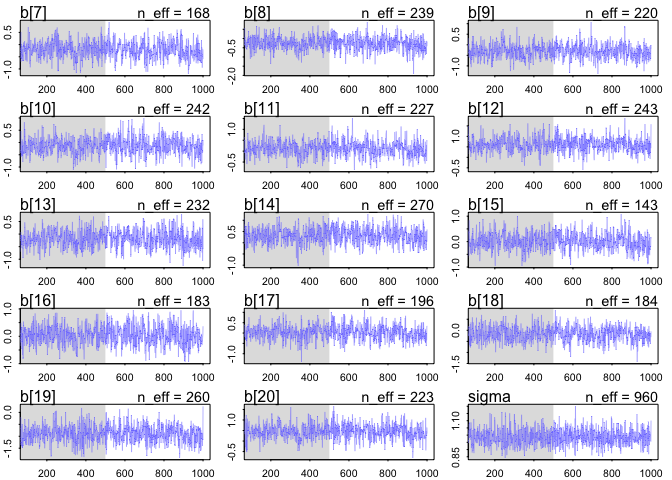
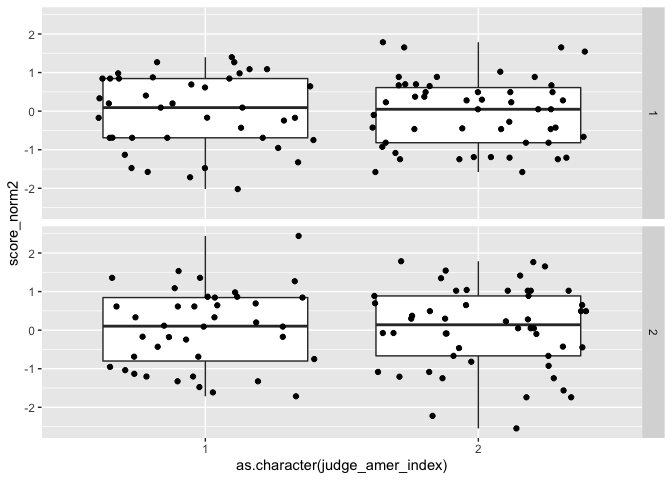

```r
p <- list()
p$A <- c(0,0,10,0,0)
p$B <- c(0,1,8,1,0)
p$C <- c(0,2,6,2,0)
p$D <- c(1,2,4,2,1)
p$E <- c(2,2,2,2,2)
```
* normalize each such that it is a probability distribution

```r
 p_norm <- lapply( p , function(q) q/sum(q))
```

* Since these are now probability distributions, we can compute the information entropy of each. The only trick here is to remember L’Hôpital’s rule (see page 207):

```r
 ( H <- sapply( p_norm , function(q) -sum(ifelse(q==0,0,q*log(q))) ) )
```

```
##         A         B         C         D         E 
## 0.0000000 0.6390319 0.9502705 1.4708085 1.6094379
```

* The bottom-right plot in Figure 10.1 displays these logwayspp values against the infor- mation entropies H. These two sets of values contain the same information, as information entropy is an approximation of the log ways per pebble (see the Overthinking box at the end for details).

```r
ways <- c(1,90,1260,37800,113400)
logwayspp <- log(ways)/10
```
* This is useful, because the distribution that can happen the greatest number of ways is the most plausible distribution. Call this distribution the maximum entropy distribution.

# 10.1.1 Gaussian

# 10.1.2 Binomial

```r
# build list of the candidate distributions
p <- list()
p[[1]] <- c(1/4,1/4,1/4,1/4)
p[[2]] <- c(2/6,1/6,1/6,2/6)
p[[3]] <- c(1/6,2/6,2/6,1/6)
p[[4]] <- c(1/8,4/8,2/8,1/8)
# compute expected value of each
sapply( p , function(p) sum(p*c(0,1,1,2)) )
```

```
## [1] 1 1 1 1
```


```r
# compute entropy of each distribution
sapply( p , function(p) -sum( p*log(p) ) )
```

```
## [1] 1.386294 1.329661 1.329661 1.213008
```


```r
p <- 0.7
( A <- c( (1-p)^2 , p*(1-p) , (1-p)*p , p^2 ) )
```

```
## [1] 0.09 0.21 0.21 0.49
```


```r
 -sum( A*log(A) )
```

```
## [1] 1.221729
```

* simulate random probability distributions that have any specified expected value. 

```r
sim.p <- function(G=1.4) {
    x123 <- runif(3)
    x4 <- ( (G)*sum(x123)-x123[2]-x123[3] )/(2-G)
    z <- sum( c(x123,x4) )
    p <- c( x123 , x4 )/z
    list( H=-sum( p*log(p) ) , p=p )
}
```

* This function generates a random distribution with expected value G and then returns its entropy along with the distribution. We want to invoke this function a large number of times. Here is how to call it 100000 times and then plot the distribution of resulting entropies:

```r
H <- replicate( 1e5 , sim.p(1.4) )
dens( as.numeric(H[1,]) , adj=0.1 )
```

<!-- -->


```r
entropies <- as.numeric(H[1,])
distributions <- H[2,]
```


```r
 max(entropies)
```

```
## [1] 1.221728
```


```r
 distributions[ which.max(entropies) ]
```

```
## [[1]]
## [1] 0.09011615 0.20985273 0.20991496 0.49011615
```

# [practice](https://github.com/rmcelreath/statrethinking_winter2019/blob/master/homework/week05.pdf)
* https://github.com/rmcelreath/statrethinking_winter2019/blob/master/homework/week05.pdf
* 1. Consider the data (Wines 2012) data table.These data are expert ratings of 20 different French and American wines by 9 different French and American judges. Your goal is to model score, the subjective rating assigned by each judge to each wine. I recommend standardizing it.

## read data

```r
data(Wines2012)
Wines2012 %>% View()
summary(Wines2012)
```

```
##              judge      flight        wine         score     
##  Daniele Meulder:20   red  :90   A1     :  9   Min.   : 7.0  
##  Francis Schott :20   white:90   A2     :  9   1st Qu.:12.0  
##  Jamal Rayyis   :20              B1     :  9   Median :14.5  
##  Jean-M Cardebat:20              B2     :  9   Mean   :14.2  
##  John Foy       :20              C1     :  9   3rd Qu.:16.0  
##  Linda Murphy   :20              C2     :  9   Max.   :19.5  
##  (Other)        :60              (Other):126                 
##    wine.amer     judge.amer    
##  Min.   :0.0   Min.   :0.0000  
##  1st Qu.:0.0   1st Qu.:0.0000  
##  Median :1.0   Median :1.0000  
##  Mean   :0.6   Mean   :0.5556  
##  3rd Qu.:1.0   3rd Qu.:1.0000  
##  Max.   :1.0   Max.   :1.0000  
## 
```

## standardize data by judge

```r
Wines2012 %>% group_by(judge) %>% mutate(score_norm=score/sum(score)) -> Wines2012 
Wines2012 %>% summarize(all=sum(score_norm)) # this should be one. OK.
```

```
## # A tibble: 9 x 2
##   judge             all
##   <fct>           <dbl>
## 1 Daniele Meulder     1
## 2 Francis Schott      1
## 3 Jamal Rayyis        1
## 4 Jean-M Cardebat     1
## 5 John Foy            1
## 6 Linda Murphy        1
## 7 Olivier Gergaud     1
## 8 Robert Hodgson      1
## 9 Tyler Colman        1
```

```r
# maybe this way?
Wines2012 %>% mutate(score_norm2=scale(score)) -> Wines2012
```

* In this first problem, consider only variation among judges and wines. 
Construct index variables of judge and wine and then use these index variables to construct a linear regression model. 

```r
# index wine
Wines2012 <- Wines2012 %>% group_by(judge) %>% mutate(wine_index=1:n()) #%>% View()
# index judge
Wines2012 <- Wines2012 %>% ungroup() %>% group_by(wine) %>% mutate(judge_index=1:n())  #%>% View()
# score_norm ~ judge*wines
## score_norm ~ a[judge.index] + b[judge.index]*[wine.index] true???
```

Justify your priors. You should end up with 9 judge parameters and 20 wine parameters.

```r
# check
Wines2012 %>% View() # select each judge to see wine index and vise versa for wine
# make it to list object
Wines2012.list<-list(
  score_norm=Wines2012$score_norm,
  score_norm2=Wines2012$score_norm2,
  judge_index=Wines2012$judge_index,
  wine_index=Wines2012$wine_index
)
```

Use ulam instead of quap to build this model, and be sure to check the chains for convergence. 
# score_norm got error

```r
practice.m1_score_norm<-ulam(
    alist(
         score_norm ~ dnorm( mu , sigma ) , # error
        #score_norm2 ~ dnorm( mu , sigma ) , # no error
        # mu <- a[judge.inex] +  b[judge.index]*wine.index,
        mu <- a[judge_index] + b[wine_index], 
        a[judge_index] ~ dnorm(0 , .1 ) ,
        b[wine_index] ~ dnorm(0 , .05 ) ,
        sigma ~ dexp(1)
),
data=Wines2012.list, chains=1,cores=2,iter=2000) # errors....
```

```
## 
## SAMPLING FOR MODEL '6f8da6303b072431fcef4292dd7ad4a3' NOW (CHAIN 1).
## Chain 1: 
## Chain 1: Gradient evaluation took 3.6e-05 seconds
## Chain 1: 1000 transitions using 10 leapfrog steps per transition would take 0.36 seconds.
## Chain 1: Adjust your expectations accordingly!
## Chain 1: 
## Chain 1: 
## Chain 1: Iteration:    1 / 2000 [  0%]  (Warmup)
## Chain 1: Iteration:  200 / 2000 [ 10%]  (Warmup)
## Chain 1: Iteration:  400 / 2000 [ 20%]  (Warmup)
## Chain 1: Iteration:  600 / 2000 [ 30%]  (Warmup)
## Chain 1: Iteration:  800 / 2000 [ 40%]  (Warmup)
## Chain 1: Iteration: 1000 / 2000 [ 50%]  (Warmup)
## Chain 1: Iteration: 1001 / 2000 [ 50%]  (Sampling)
## Chain 1: Iteration: 1200 / 2000 [ 60%]  (Sampling)
## Chain 1: Iteration: 1400 / 2000 [ 70%]  (Sampling)
## Chain 1: Iteration: 1600 / 2000 [ 80%]  (Sampling)
## Chain 1: Iteration: 1800 / 2000 [ 90%]  (Sampling)
## Chain 1: Iteration: 2000 / 2000 [100%]  (Sampling)
## Chain 1: 
## Chain 1:  Elapsed Time: 0.276393 seconds (Warm-up)
## Chain 1:                0.207196 seconds (Sampling)
## Chain 1:                0.483589 seconds (Total)
## Chain 1:
```

```
## Warning: Bulk Effective Samples Size (ESS) is too low, indicating posterior means and medians may be unreliable.
## Running the chains for more iterations may help. See
## http://mc-stan.org/misc/warnings.html#bulk-ess
```

```
## Warning: Tail Effective Samples Size (ESS) is too low, indicating posterior variances and tail quantiles may be unreliable.
## Running the chains for more iterations may help. See
## http://mc-stan.org/misc/warnings.html#tail-ess
```

```r
# 
```
* Probably because score_norm elliminate judge-to-judge variation (judge effects)


```r
practice.m1_score_norm2<-ulam(
    alist(
        # score_norm ~ dnorm( mu , sigma ) , # error
        score_norm2 ~ dnorm( mu , sigma ) , # no error
        # mu <- a[judge.inex] +  b[judge.index]*wine.index,
        mu <- a[judge_index] + b[wine_index], 
        a[judge_index] ~ dnorm(0 , 1 ) ,
        b[wine_index] ~ dnorm(0 , 1 ) ,
        sigma ~ dexp(1)
),
data=Wines2012.list, chains=1,cores=2,iter=1000)
```

```
## 
## SAMPLING FOR MODEL '639b1b4b70cb3d837e9b9bf05b263cdc' NOW (CHAIN 1).
## Chain 1: 
## Chain 1: Gradient evaluation took 3.1e-05 seconds
## Chain 1: 1000 transitions using 10 leapfrog steps per transition would take 0.31 seconds.
## Chain 1: Adjust your expectations accordingly!
## Chain 1: 
## Chain 1: 
## Chain 1: Iteration:   1 / 1000 [  0%]  (Warmup)
## Chain 1: Iteration: 100 / 1000 [ 10%]  (Warmup)
## Chain 1: Iteration: 200 / 1000 [ 20%]  (Warmup)
## Chain 1: Iteration: 300 / 1000 [ 30%]  (Warmup)
## Chain 1: Iteration: 400 / 1000 [ 40%]  (Warmup)
## Chain 1: Iteration: 500 / 1000 [ 50%]  (Warmup)
## Chain 1: Iteration: 501 / 1000 [ 50%]  (Sampling)
## Chain 1: Iteration: 600 / 1000 [ 60%]  (Sampling)
## Chain 1: Iteration: 700 / 1000 [ 70%]  (Sampling)
## Chain 1: Iteration: 800 / 1000 [ 80%]  (Sampling)
## Chain 1: Iteration: 900 / 1000 [ 90%]  (Sampling)
## Chain 1: Iteration: 1000 / 1000 [100%]  (Sampling)
## Chain 1: 
## Chain 1:  Elapsed Time: 0.114409 seconds (Warm-up)
## Chain 1:                0.069067 seconds (Sampling)
## Chain 1:                0.183476 seconds (Total)
## Chain 1:
```

```r
# 
```


If you’d rather build the model directly in Stan or PyMC3, go ahead. I just want you to use Hamiltonian Monte Carlo instead of quadratic approximation.

How do you interpret the variation among individual judges and indi- vidual wines? Do you notice any patterns, just by plotting the differences? Which judges gave the highest/lowest ratings? Which wines were rated worst/ best on average?
* score_norm with errors


```r
traceplot(practice.m1_score_norm )
```

```
## Waiting to draw page 2 of 2
```

<!-- --><!-- -->


```r
plot(precis(practice.m1_score_norm2,2))
```

<!-- -->


```r
pairs(practice.m1_score_norm2)
```

```
## Error in plot.new(): figure margins too large
```

```r
png(file="practice.m1_score_norm2.png",width=20,height=20,units="in",res=100)
pairs(practice.m1_score_norm2)
dev.off()
```

```
## quartz_off_screen 
##                 2
```


```r
traceplot(practice.m1_score_norm2 )
```

```
## Waiting to draw page 2 of 2
```

<!-- --><!-- -->

## 2. Now consider three features of the wines and judges:
* (1) flight: Whether the wine is red or white.
* (2) wine.amer: Indicator variable for American wines. 
* (3) judge.amer: Indicator variable for American judges.
* Use indicator or index variables to model the influence of these features on the scores. Omit the individual judge and wine index variables from Problem 1. Do not include interaction effects yet. Again use ulam, justify your priors, and be sure to check the chains. What do you conclude about the differences among the wines and judges? Try to relate the results to the inferences in Problem 1.
# indexing

```r
Wines2012.list$flight_index<-ifelse(Wines2012$flight=="white",1,2)
Wines2012.list$wine_amer_index<-ifelse(Wines2012$wine.amer==0,1,2)
Wines2012.list$judge_amer_index<-ifelse(Wines2012$judge.amer==0,1,2)
```


```r
practice.m2_score_norm2<-ulam(
    alist(
        score_norm2 ~ dnorm( mu , sigma ) , # no error
        mu <- a[flight_index] + b[wine_amer_index] + c[judge_amer_index], 
        a[flight_index] ~ dnorm(0 , 1),
        b[wine_amer_index] ~ dnorm(0 , 1),
        c[judge_amer_index] ~ dnorm(0,1),
        sigma ~ dexp(1)
),
data=Wines2012.list, chains=1,cores=2,iter=2000) # no errors....
```

```
## 
## SAMPLING FOR MODEL 'd56d06282eb11bcd91de91707e83528b' NOW (CHAIN 1).
## Chain 1: 
## Chain 1: Gradient evaluation took 3.1e-05 seconds
## Chain 1: 1000 transitions using 10 leapfrog steps per transition would take 0.31 seconds.
## Chain 1: Adjust your expectations accordingly!
## Chain 1: 
## Chain 1: 
## Chain 1: Iteration:    1 / 2000 [  0%]  (Warmup)
## Chain 1: Iteration:  200 / 2000 [ 10%]  (Warmup)
## Chain 1: Iteration:  400 / 2000 [ 20%]  (Warmup)
## Chain 1: Iteration:  600 / 2000 [ 30%]  (Warmup)
## Chain 1: Iteration:  800 / 2000 [ 40%]  (Warmup)
## Chain 1: Iteration: 1000 / 2000 [ 50%]  (Warmup)
## Chain 1: Iteration: 1001 / 2000 [ 50%]  (Sampling)
## Chain 1: Iteration: 1200 / 2000 [ 60%]  (Sampling)
## Chain 1: Iteration: 1400 / 2000 [ 70%]  (Sampling)
## Chain 1: Iteration: 1600 / 2000 [ 80%]  (Sampling)
## Chain 1: Iteration: 1800 / 2000 [ 90%]  (Sampling)
## Chain 1: Iteration: 2000 / 2000 [100%]  (Sampling)
## Chain 1: 
## Chain 1:  Elapsed Time: 0.542354 seconds (Warm-up)
## Chain 1:                0.600034 seconds (Sampling)
## Chain 1:                1.14239 seconds (Total)
## Chain 1:
```

```r
# 
```


```r
plot(precis(practice.m2_score_norm2,2))
```

<!-- -->

```r
pairs(practice.m2_score_norm2)
```

<!-- -->

```r
png(file="practice.m2_score_norm2.png",width=20,height=20,units="in",res=100)
pairs(practice.m2_score_norm2)
dev.off()
```

```
## quartz_off_screen 
##                 2
```


```r
traceplot(practice.m2_score_norm2 )
```

<!-- -->


## 3. Now consider two-way interactions among the three features.You should end up with three different interaction terms in your model. These will be easier to build, if you use indicator variables. Again use ulam, justify your priors, and be sure to check the chains. Explain what each interaction means. Be sure to interpret the model’s predictions on the outcome scale (mu, the expected score), not on the scale of individual parameters. You can use link to help with this, or just use your knowledge of the linear model instead.
* What do you conclude about the features and the scores? Can you relate the results of your model(s) to the individual judge and wine inferences from Problem 1?
### needs to learn how to do with interaction .... help me! which page in the textbook? -> chapter 8


```r
practice.m3_score_norm2_interaction<-ulam(
    alist(
        score_norm2 ~ dnorm( mu , sigma ) , 
        mu <- a[flight_index] + 
          b[wine_amer_index] + 
          c[judge_amer_index] +
          d[flight_index]*wine_amer_index + 
          e[wine_amer_index]*judge_amer_index +
          f[judge_amer_index]*flight_index,
        a[flight_index] ~ dnorm(0 , 1),
        b[wine_amer_index] ~ dnorm(0 , 1),
        c[judge_amer_index] ~ dnorm(0,1),
        d[flight_index] ~ dnorm(0,1),
        e[wine_amer_index] ~ dnorm(0,1),
        f[judge_amer_index] ~ dnorm(0,1),
        sigma ~ dexp(1)),
data=Wines2012.list, chains=4,cores=2,iter=2000) # errors....
# 
```


```r
plot(precis(practice.m3_score_norm2_interaction,2))
```

<!-- -->


```r
traceplot(practice.m3_score_norm2_interaction)
```

<!-- -->

# more thoughts: prior extimate

```r
set.seed(7)
prior <- extract.prior(practice.m3_score_norm2_interaction)
```

```
## 
## SAMPLING FOR MODEL '6858c59ba193f98627ff200b83953038' NOW (CHAIN 1).
## Chain 1: 
## Chain 1: Gradient evaluation took 4.8e-05 seconds
## Chain 1: 1000 transitions using 10 leapfrog steps per transition would take 0.48 seconds.
## Chain 1: Adjust your expectations accordingly!
## Chain 1: 
## Chain 1: 
## Chain 1: Iteration:    1 / 2000 [  0%]  (Warmup)
## Chain 1: Iteration:  200 / 2000 [ 10%]  (Warmup)
## Chain 1: Iteration:  400 / 2000 [ 20%]  (Warmup)
## Chain 1: Iteration:  600 / 2000 [ 30%]  (Warmup)
## Chain 1: Iteration:  800 / 2000 [ 40%]  (Warmup)
## Chain 1: Iteration: 1000 / 2000 [ 50%]  (Warmup)
## Chain 1: Iteration: 1001 / 2000 [ 50%]  (Sampling)
## Chain 1: Iteration: 1200 / 2000 [ 60%]  (Sampling)
## Chain 1: Iteration: 1400 / 2000 [ 70%]  (Sampling)
## Chain 1: Iteration: 1600 / 2000 [ 80%]  (Sampling)
## Chain 1: Iteration: 1800 / 2000 [ 90%]  (Sampling)
## Chain 1: Iteration: 2000 / 2000 [100%]  (Sampling)
## Chain 1: 
## Chain 1:  Elapsed Time: 0.300712 seconds (Warm-up)
## Chain 1:                0.28927 seconds (Sampling)
## Chain 1:                0.589982 seconds (Total)
## Chain 1:
```

```r
lapply(prior, head)
```

```
## $a
##            [,1]       [,2]
## [1,] -0.5827732 -0.9610300
## [2,]  2.3847518 -0.4657293
## [3,]  0.3087878 -1.2194868
## [4,] -1.5141100 -1.3072713
## [5,]  0.1352998 -0.4762792
## [6,]  0.6164212 -0.8359661
## 
## $b
##            [,1]        [,2]
## [1,] -0.7979363 -0.99863580
## [2,]  0.5841395 -0.04341275
## [3,] -0.7403828 -0.11385291
## [4,] -1.5586126  0.39845946
## [5,]  0.1134057  1.09199630
## [6,]  0.6669083  1.58830959
## 
## $c
##             [,1]       [,2]
## [1,]  0.28884185 -0.6188219
## [2,] -0.02980582  0.1154202
## [3,] -0.11698026  0.2545013
## [4,]  0.70382563 -1.2855136
## [5,] -1.04551882 -2.7533925
## [6,] -1.52679334  0.5838741
## 
## $d
##            [,1]         [,2]
## [1,] -1.2718472 -0.009100065
## [2,]  1.7807611 -0.841097267
## [3,] -1.0395681 -1.599891304
## [4,]  1.1125339  0.035364440
## [5,]  0.0379799  0.878928322
## [6,] -0.2094384  1.004790167
## 
## $e
##            [,1]       [,2]
## [1,] -0.6392181  0.9796821
## [2,]  0.6992563 -0.9018809
## [3,]  0.5087767 -1.3353191
## [4,]  0.2860152 -2.9407824
## [5,]  0.7905727  0.2458659
## [6,] -0.3425396 -1.3855375
## 
## $f
##            [,1]       [,2]
## [1,] -0.8920388  1.9982907
## [2,] -0.1646641  0.1376474
## [3,] -0.3543625 -1.0394022
## [4,] -0.4165222  0.1782752
## [5,]  0.1160814 -0.9140632
## [6,] -0.1885721 -0.5724793
## 
## $sigma
## [1] 0.9254844 2.6092286 0.4631659 0.5424234 0.1419925 0.4502494
```

```r
# plot a in histogram
prior$a %>% as_tibble %>% gather(key=index) %>% ggplot(aes(x=value))+ geom_histogram(aes(color=index)) + facet_grid(index~.)
```

```
## Warning: `as_tibble.matrix()` requires a matrix with column names or a `.name_repair` argument. Using compatibility `.name_repair`.
## This warning is displayed once per session.
```

```
## `stat_bin()` using `bins = 30`. Pick better value with `binwidth`.
```

<!-- -->

# What hypothesis we can create by plotting raw data?

```r
Wines2012.list %>% dplyr::bind_cols() %>% head()
```

```
## # A tibble: 6 x 7
##   score_norm score_norm2 judge_index wine_index flight_index
##        <dbl>       <dbl>       <int>      <int>        <dbl>
## 1     0.0398      -1.13            1          1            1
## 2     0.0518       0.200           1          2            1
## 3     0.0558       0.644           1          3            1
## 4     0.0598       1.09            1          4            1
## 5     0.0319      -2.02            1          5            1
## 6     0.0518       0.200           1          6            1
## # … with 2 more variables: wine_amer_index <dbl>, judge_amer_index <dbl>
```

```r
# wine_amer
  Wines2012.list %>% dplyr::bind_cols() %>% 
  ggplot(aes(x=as.character(judge_amer_index),y=score_norm2)) + geom_boxplot() + geom_jitter() + facet_grid(.~wine_amer_index) 
```

<!-- -->

```r
# flight
Wines2012.list %>% dplyr::bind_cols() %>% 
  ggplot(aes(x=as.character(judge_amer_index),y=score_norm2)) + geom_boxplot() + geom_jitter() + facet_grid(flight_index~.) 
```

<!-- -->

```r
# both
p.rawdata<-Wines2012.list %>% dplyr::bind_cols() %>% 
  ggplot(aes(x=as.character(judge_amer_index),y=score_norm2)) + geom_boxplot() + geom_jitter() + facet_grid(flight_index~wine_amer_index) 

p.rawdata
```

<!-- -->

```r
# judge.amer has correlation with wine.amer in white flight?
```

# Using link for plotting predicitn

```r
p.prior <- p.rawdata
p.posterior <- p.rawdata

# prediction
dummy.data<-list(flight_index=c(1,2,1,2,1,2,1,2),wine_amer_index=c(1,1,1,1,2,2,2,2),judge_amer_index=c(1,1,2,2,1,1,2,2))
mu.post<-link(practice.m3_score_norm2_interaction,data=dummy.data)
mu.prior<-link(practice.m3_score_norm2_interaction,data=dummy.data,post=prior) # see chapter 8.3.4
# plotting
for(i in 1:100) {
data.prediction<-dummy.data %>% bind_cols() %>% mutate(score_norm2.post=mu.post[i,],score_norm2.prior=mu.prior[i,]) %>% unite(category,flight_index,wine_amer_index,remove=FALSE)

p.prior<- p.prior +   geom_line(aes(x=as.character(judge_amer_index),y=score_norm2.prior, group=category),data=data.prediction,color="green",alpha=0.5) +  facet_grid(flight_index~wine_amer_index) 
p.posterior<- p.posterior +  geom_line(aes(x=as.character(judge_amer_index),y=score_norm2.post, group=category),data=data.prediction,color="magenta",alpha=0.5) +   facet_grid(flight_index~wine_amer_index) 
}

p.prior + labs(title="prior")
```

<!-- -->

```r
p.posterior + labs(title="posterior")
```

<!-- -->

```r
# Why posterior is very compact? Should I change prior?
# Looks like predictin does not match to real data??? 

# How to modify the model?

# Note: since indexes are 1 and 2, which is treated as numbers, my model is wrong. One solution is 0 and 1. 
# If we have multiple categories, how to do? (Oct 25, 2019)
# 
# Take a look at his solution in hw5 (https://github.com/rmcelreath/statrethinking_winter2019/tree/master/homework) 
```


