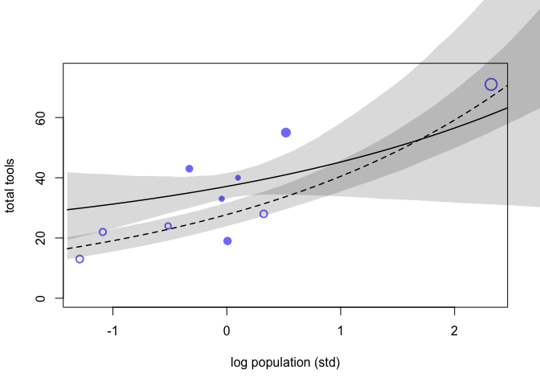

* Hi Everybody,
* An updated version of the textbook was released on Oct 21st. It includes revisions to code examples and problems. The website claims it is revised through Chapter 16, but reading through you will still have blank sections, disagreeing code blocks, and typos.
* The book is available at https://xcelab.net/rm/sr2/ and the password to access is "tempest"
* The rethinking package on the experimental github branch has also been updated. * It can be updated with the following command in R
* devtools::install_github("rmcelreath/rethinking",ref="Experimental")
* If you do upgrade your version, several functions in the book will not work due to either being removed, renamed, or changed. For example, the function `LOOPk` has been replaced with `PSISk`
* Best,
* John
# run once


# 11.2. Poissonregression

```r
y <- rbinom(1e5,1000,1/1000)
c( mean(y) , var(y) )
```

```
## [1] 0.9974000 0.9939832
```


```r
library(rethinking)
data(Kline)
d <- Kline
d
```

```
##       culture population contact total_tools mean_TU
## 1    Malekula       1100     low          13     3.2
## 2     Tikopia       1500     low          22     4.7
## 3  Santa Cruz       3600     low          24     4.0
## 4         Yap       4791    high          43     5.0
## 5    Lau Fiji       7400    high          33     5.0
## 6   Trobriand       8000    high          19     4.0
## 7       Chuuk       9200    high          40     3.8
## 8       Manus      13000     low          28     6.6
## 9       Tonga      17500    high          55     5.4
## 10     Hawaii     275000     low          71     6.6
```

* The total_tools variable will be the outcome variable. We’ll model the idea that:
* (1) The number of tools increases with the log population size. Why log? Because that’s what the theory says, that it is the order of magnitude of the population that matters, not the absolute size of it. So we’ll look for a positive association between total_tools and log population. You can get some intuition for why a linear impact of population size can’t be right by thinking about mechanism. We’ll think about mechanism more at the end.
* (2) The number of tools increases with the contact rate among islands. Islands that are better networked acquire or sustain more tool types.
* (3) Theimpactofpopulationontoolcountsisincreasedbyhighcontact.Thisisto say that the association between total_tools and log population depends upon contact. So we will look for a positive interaction between log population and contact rate.
* Let’s build now. First, we make some new columns with the standardized log of popu- lation and an index variable for contact:


```r
d$P <- scale( log(d$population) )
d$contact_id <- ifelse( d$contact=="high" , 2 , 1 )
```


```r
curve(dlnorm(x,0,10),from=0,to=100,n=200)
```

<!-- -->

```r
a <- rnorm(1e4,0,10)
lambda <- exp(a)
mean( lambda )
```

```
## [1] 3.756422e+14
```

```r
curve( dlnorm( x , 3 , 0.5 ) , from=0 , to=100 , n=200 )
```

<!-- -->

```r
N <- 100
a <- rnorm( N , 3 , 0.5 )
b <- rnorm( N , 0 , 10 )
plot( NULL , xlim=c(-2,2) , ylim=c(0,100) )
for ( i in 1:N ) curve( exp( a[i] + b[i]*x ) , add=TRUE , col=col.alpha("black",0.5) )
```

<!-- -->


```r
set.seed(10)
N <- 100
a <- rnorm( N , 3 , 0.5 )
b <- rnorm( N , 0 , 0.2 )
plot( NULL , xlim=c(-2,2) , ylim=c(0,100) )
for ( i in 1:N ) curve( exp( a[i] + b[i]*x ) , add=TRUE , col=col.alpha("black",0.5) )
```

<!-- -->


```r
 x_seq <- seq( from=log(100) , to=log(200000) , length.out=100 )
lambda <- sapply( x_seq , function(x) exp( a + b*x ) )
plot( NULL , xlim=range(x_seq) , ylim=c(0,500) , xlab="log population" , ylab="total tools")
for ( i in 1:N ) lines( x_seq , lambda[i,] , col=col.alpha("black",0.5) , lwd=1.5 )
```

<!-- -->


```r
 plot( NULL , xlim=range(exp(x_seq)) , ylim=c(0,500) , xlab="population" , ylab="total tools")
for ( i in 1:N ) lines( exp(x_seq) , lambda[i,] , col=col.alpha("black",0.5) , lwd=1.5 )
```

<!-- -->


```r
dat <- list(
    T = d$total_tools ,
    P = d$P ,
    cid = d$contact_id )
# intercept only
m11.9 <- ulam(
    alist(
        T ~ dpois( lambda ),
        log(lambda) <- a,
        a ~ dnorm(3,0.5)
    ), data=dat , chains=4 , log_lik=TRUE )
```

```
## 
## SAMPLING FOR MODEL 'ea958e18e4c604fc5bca60c02cb71b9a' NOW (CHAIN 1).
## Chain 1: 
## Chain 1: Gradient evaluation took 1.1e-05 seconds
## Chain 1: 1000 transitions using 10 leapfrog steps per transition would take 0.11 seconds.
## Chain 1: Adjust your expectations accordingly!
## Chain 1: 
## Chain 1: 
## Chain 1: Iteration:   1 / 1000 [  0%]  (Warmup)
## Chain 1: Iteration: 100 / 1000 [ 10%]  (Warmup)
## Chain 1: Iteration: 200 / 1000 [ 20%]  (Warmup)
## Chain 1: Iteration: 300 / 1000 [ 30%]  (Warmup)
## Chain 1: Iteration: 400 / 1000 [ 40%]  (Warmup)
## Chain 1: Iteration: 500 / 1000 [ 50%]  (Warmup)
## Chain 1: Iteration: 501 / 1000 [ 50%]  (Sampling)
## Chain 1: Iteration: 600 / 1000 [ 60%]  (Sampling)
## Chain 1: Iteration: 700 / 1000 [ 70%]  (Sampling)
## Chain 1: Iteration: 800 / 1000 [ 80%]  (Sampling)
## Chain 1: Iteration: 900 / 1000 [ 90%]  (Sampling)
## Chain 1: Iteration: 1000 / 1000 [100%]  (Sampling)
## Chain 1: 
## Chain 1:  Elapsed Time: 0.007926 seconds (Warm-up)
## Chain 1:                0.006778 seconds (Sampling)
## Chain 1:                0.014704 seconds (Total)
## Chain 1: 
## 
## SAMPLING FOR MODEL 'ea958e18e4c604fc5bca60c02cb71b9a' NOW (CHAIN 2).
## Chain 2: 
## Chain 2: Gradient evaluation took 3e-06 seconds
## Chain 2: 1000 transitions using 10 leapfrog steps per transition would take 0.03 seconds.
## Chain 2: Adjust your expectations accordingly!
## Chain 2: 
## Chain 2: 
## Chain 2: Iteration:   1 / 1000 [  0%]  (Warmup)
## Chain 2: Iteration: 100 / 1000 [ 10%]  (Warmup)
## Chain 2: Iteration: 200 / 1000 [ 20%]  (Warmup)
## Chain 2: Iteration: 300 / 1000 [ 30%]  (Warmup)
## Chain 2: Iteration: 400 / 1000 [ 40%]  (Warmup)
## Chain 2: Iteration: 500 / 1000 [ 50%]  (Warmup)
## Chain 2: Iteration: 501 / 1000 [ 50%]  (Sampling)
## Chain 2: Iteration: 600 / 1000 [ 60%]  (Sampling)
## Chain 2: Iteration: 700 / 1000 [ 70%]  (Sampling)
## Chain 2: Iteration: 800 / 1000 [ 80%]  (Sampling)
## Chain 2: Iteration: 900 / 1000 [ 90%]  (Sampling)
## Chain 2: Iteration: 1000 / 1000 [100%]  (Sampling)
## Chain 2: 
## Chain 2:  Elapsed Time: 0.007853 seconds (Warm-up)
## Chain 2:                0.006874 seconds (Sampling)
## Chain 2:                0.014727 seconds (Total)
## Chain 2: 
## 
## SAMPLING FOR MODEL 'ea958e18e4c604fc5bca60c02cb71b9a' NOW (CHAIN 3).
## Chain 3: 
## Chain 3: Gradient evaluation took 5e-06 seconds
## Chain 3: 1000 transitions using 10 leapfrog steps per transition would take 0.05 seconds.
## Chain 3: Adjust your expectations accordingly!
## Chain 3: 
## Chain 3: 
## Chain 3: Iteration:   1 / 1000 [  0%]  (Warmup)
## Chain 3: Iteration: 100 / 1000 [ 10%]  (Warmup)
## Chain 3: Iteration: 200 / 1000 [ 20%]  (Warmup)
## Chain 3: Iteration: 300 / 1000 [ 30%]  (Warmup)
## Chain 3: Iteration: 400 / 1000 [ 40%]  (Warmup)
## Chain 3: Iteration: 500 / 1000 [ 50%]  (Warmup)
## Chain 3: Iteration: 501 / 1000 [ 50%]  (Sampling)
## Chain 3: Iteration: 600 / 1000 [ 60%]  (Sampling)
## Chain 3: Iteration: 700 / 1000 [ 70%]  (Sampling)
## Chain 3: Iteration: 800 / 1000 [ 80%]  (Sampling)
## Chain 3: Iteration: 900 / 1000 [ 90%]  (Sampling)
## Chain 3: Iteration: 1000 / 1000 [100%]  (Sampling)
## Chain 3: 
## Chain 3:  Elapsed Time: 0.00688 seconds (Warm-up)
## Chain 3:                0.007105 seconds (Sampling)
## Chain 3:                0.013985 seconds (Total)
## Chain 3: 
## 
## SAMPLING FOR MODEL 'ea958e18e4c604fc5bca60c02cb71b9a' NOW (CHAIN 4).
## Chain 4: 
## Chain 4: Gradient evaluation took 3e-06 seconds
## Chain 4: 1000 transitions using 10 leapfrog steps per transition would take 0.03 seconds.
## Chain 4: Adjust your expectations accordingly!
## Chain 4: 
## Chain 4: 
## Chain 4: Iteration:   1 / 1000 [  0%]  (Warmup)
## Chain 4: Iteration: 100 / 1000 [ 10%]  (Warmup)
## Chain 4: Iteration: 200 / 1000 [ 20%]  (Warmup)
## Chain 4: Iteration: 300 / 1000 [ 30%]  (Warmup)
## Chain 4: Iteration: 400 / 1000 [ 40%]  (Warmup)
## Chain 4: Iteration: 500 / 1000 [ 50%]  (Warmup)
## Chain 4: Iteration: 501 / 1000 [ 50%]  (Sampling)
## Chain 4: Iteration: 600 / 1000 [ 60%]  (Sampling)
## Chain 4: Iteration: 700 / 1000 [ 70%]  (Sampling)
## Chain 4: Iteration: 800 / 1000 [ 80%]  (Sampling)
## Chain 4: Iteration: 900 / 1000 [ 90%]  (Sampling)
## Chain 4: Iteration: 1000 / 1000 [100%]  (Sampling)
## Chain 4: 
## Chain 4:  Elapsed Time: 0.007248 seconds (Warm-up)
## Chain 4:                0.005541 seconds (Sampling)
## Chain 4:                0.012789 seconds (Total)
## Chain 4:
```

```r
# interaction model
m11.10 <- ulam(
    alist(
        T ~ dpois( lambda ),
        log(lambda) <- a[cid] + b[cid]*P,
        a[cid] ~ dnorm( 3 , 0.5 ),
        b[cid] ~ dnorm( 0 , 0.2 )
    ), data=dat , chains=4 , log_lik=TRUE )
```

```
## 
## SAMPLING FOR MODEL '05013cdfcc1a8f52ceb5601ee475a98d' NOW (CHAIN 1).
## Chain 1: 
## Chain 1: Gradient evaluation took 1.4e-05 seconds
## Chain 1: 1000 transitions using 10 leapfrog steps per transition would take 0.14 seconds.
## Chain 1: Adjust your expectations accordingly!
## Chain 1: 
## Chain 1: 
## Chain 1: Iteration:   1 / 1000 [  0%]  (Warmup)
## Chain 1: Iteration: 100 / 1000 [ 10%]  (Warmup)
## Chain 1: Iteration: 200 / 1000 [ 20%]  (Warmup)
## Chain 1: Iteration: 300 / 1000 [ 30%]  (Warmup)
## Chain 1: Iteration: 400 / 1000 [ 40%]  (Warmup)
## Chain 1: Iteration: 500 / 1000 [ 50%]  (Warmup)
## Chain 1: Iteration: 501 / 1000 [ 50%]  (Sampling)
## Chain 1: Iteration: 600 / 1000 [ 60%]  (Sampling)
## Chain 1: Iteration: 700 / 1000 [ 70%]  (Sampling)
## Chain 1: Iteration: 800 / 1000 [ 80%]  (Sampling)
## Chain 1: Iteration: 900 / 1000 [ 90%]  (Sampling)
## Chain 1: Iteration: 1000 / 1000 [100%]  (Sampling)
## Chain 1: 
## Chain 1:  Elapsed Time: 0.02036 seconds (Warm-up)
## Chain 1:                0.016634 seconds (Sampling)
## Chain 1:                0.036994 seconds (Total)
## Chain 1: 
## 
## SAMPLING FOR MODEL '05013cdfcc1a8f52ceb5601ee475a98d' NOW (CHAIN 2).
## Chain 2: 
## Chain 2: Gradient evaluation took 5e-06 seconds
## Chain 2: 1000 transitions using 10 leapfrog steps per transition would take 0.05 seconds.
## Chain 2: Adjust your expectations accordingly!
## Chain 2: 
## Chain 2: 
## Chain 2: Iteration:   1 / 1000 [  0%]  (Warmup)
## Chain 2: Iteration: 100 / 1000 [ 10%]  (Warmup)
## Chain 2: Iteration: 200 / 1000 [ 20%]  (Warmup)
## Chain 2: Iteration: 300 / 1000 [ 30%]  (Warmup)
## Chain 2: Iteration: 400 / 1000 [ 40%]  (Warmup)
## Chain 2: Iteration: 500 / 1000 [ 50%]  (Warmup)
## Chain 2: Iteration: 501 / 1000 [ 50%]  (Sampling)
## Chain 2: Iteration: 600 / 1000 [ 60%]  (Sampling)
## Chain 2: Iteration: 700 / 1000 [ 70%]  (Sampling)
## Chain 2: Iteration: 800 / 1000 [ 80%]  (Sampling)
## Chain 2: Iteration: 900 / 1000 [ 90%]  (Sampling)
## Chain 2: Iteration: 1000 / 1000 [100%]  (Sampling)
## Chain 2: 
## Chain 2:  Elapsed Time: 0.019152 seconds (Warm-up)
## Chain 2:                0.017964 seconds (Sampling)
## Chain 2:                0.037116 seconds (Total)
## Chain 2: 
## 
## SAMPLING FOR MODEL '05013cdfcc1a8f52ceb5601ee475a98d' NOW (CHAIN 3).
## Chain 3: 
## Chain 3: Gradient evaluation took 5e-06 seconds
## Chain 3: 1000 transitions using 10 leapfrog steps per transition would take 0.05 seconds.
## Chain 3: Adjust your expectations accordingly!
## Chain 3: 
## Chain 3: 
## Chain 3: Iteration:   1 / 1000 [  0%]  (Warmup)
## Chain 3: Iteration: 100 / 1000 [ 10%]  (Warmup)
## Chain 3: Iteration: 200 / 1000 [ 20%]  (Warmup)
## Chain 3: Iteration: 300 / 1000 [ 30%]  (Warmup)
## Chain 3: Iteration: 400 / 1000 [ 40%]  (Warmup)
## Chain 3: Iteration: 500 / 1000 [ 50%]  (Warmup)
## Chain 3: Iteration: 501 / 1000 [ 50%]  (Sampling)
## Chain 3: Iteration: 600 / 1000 [ 60%]  (Sampling)
## Chain 3: Iteration: 700 / 1000 [ 70%]  (Sampling)
## Chain 3: Iteration: 800 / 1000 [ 80%]  (Sampling)
## Chain 3: Iteration: 900 / 1000 [ 90%]  (Sampling)
## Chain 3: Iteration: 1000 / 1000 [100%]  (Sampling)
## Chain 3: 
## Chain 3:  Elapsed Time: 0.019673 seconds (Warm-up)
## Chain 3:                0.016602 seconds (Sampling)
## Chain 3:                0.036275 seconds (Total)
## Chain 3: 
## 
## SAMPLING FOR MODEL '05013cdfcc1a8f52ceb5601ee475a98d' NOW (CHAIN 4).
## Chain 4: 
## Chain 4: Gradient evaluation took 5e-06 seconds
## Chain 4: 1000 transitions using 10 leapfrog steps per transition would take 0.05 seconds.
## Chain 4: Adjust your expectations accordingly!
## Chain 4: 
## Chain 4: 
## Chain 4: Iteration:   1 / 1000 [  0%]  (Warmup)
## Chain 4: Iteration: 100 / 1000 [ 10%]  (Warmup)
## Chain 4: Iteration: 200 / 1000 [ 20%]  (Warmup)
## Chain 4: Iteration: 300 / 1000 [ 30%]  (Warmup)
## Chain 4: Iteration: 400 / 1000 [ 40%]  (Warmup)
## Chain 4: Iteration: 500 / 1000 [ 50%]  (Warmup)
## Chain 4: Iteration: 501 / 1000 [ 50%]  (Sampling)
## Chain 4: Iteration: 600 / 1000 [ 60%]  (Sampling)
## Chain 4: Iteration: 700 / 1000 [ 70%]  (Sampling)
## Chain 4: Iteration: 800 / 1000 [ 80%]  (Sampling)
## Chain 4: Iteration: 900 / 1000 [ 90%]  (Sampling)
## Chain 4: Iteration: 1000 / 1000 [100%]  (Sampling)
## Chain 4: 
## Chain 4:  Elapsed Time: 0.020314 seconds (Warm-up)
## Chain 4:                0.015619 seconds (Sampling)
## Chain 4:                0.035933 seconds (Total)
## Chain 4:
```


```r
 compare( m11.9 , m11.10 , func=LOO )
```

```
## Some Pareto k values are high (>0.5). Set pointwise=TRUE to inspect individual points.
## Some Pareto k values are high (>0.5). Set pointwise=TRUE to inspect individual points.
```

```
##             PSIS    pPSIS    dPSIS       weight       SE      dSE
## m11.10  84.66813 6.594966  0.00000 1.000000e+00 13.14860       NA
## m11.9  142.41558 8.851306 57.74745 2.886025e-13 34.20786 33.92181
```


```r
#k <- LOOPk(m11.10) # error!
k <- PSISk(m11.10)
```

```
## Some Pareto k values are high (>0.5). Set pointwise=TRUE to inspect individual points.
```

```r
plot( dat$P , dat$T , xlab="log population (std)" , ylab="total tools" ,
    col=rangi2 , pch=ifelse( dat$cid==1 , 1 , 16 ) , lwd=2 ,
    ylim=c(0,75) , cex=1+normalize(k) )
# set up the horizontal axis values to compute predictions at
ns <- 100
P_seq <- seq( from=-1.4 , to=3 , length.out=ns )
# predictions for cid=1 (low contact)
lambda <- link( m11.10 , data=data.frame( P=P_seq , cid=1 ) )
lmu <- apply( lambda , 2 , mean )
lci <- apply( lambda , 2 , PI )
lines( P_seq , lmu , lty=2 , lwd=1.5 )
shade( lci , P_seq , xpd=TRUE )
# predictions for cid=2 (high contact)
lambda <- link( m11.10 , data=data.frame( P=P_seq , cid=2 ) )
lmu <- apply( lambda , 2 , mean )
lci <- apply( lambda , 2 , PI )
lines( P_seq , lmu , lty=1 , lwd=1.5 )
shade( lci , P_seq , xpd=TRUE )
```

<!-- -->


```r
 plot( d$population , d$total_tools , xlab="population" , ylab="total tools" ,
    col=rangi2 , pch=ifelse( dat$cid==1 , 1 , 16 ) , lwd=2 ,
    ylim=c(0,75) , cex=1+normalize(k) )
ns <- 100
P_seq <- seq( from=-5 , to=3 , length.out=ns )
# 1.53 is sd of log(population)
# 9 is mean of log(population)
pop_seq <- exp( P_seq*1.53 + 9 )
lambda <- link( m11.10 , data=data.frame( P=P_seq , cid=1 ) )
lmu <- apply( lambda , 2 , mean )
lci <- apply( lambda , 2 , PI )
lines( pop_seq , lmu , lty=2 , lwd=1.5 )
shade( lci , pop_seq , xpd=TRUE )
lambda <- link( m11.10 , data=data.frame( P=P_seq , cid=2 ) )
lmu <- apply( lambda , 2 , mean )
lci <- apply( lambda , 2 , PI )
lines( pop_seq , lmu , lty=1 , lwd=1.5 )
shade( lci , pop_seq , xpd=TRUE )
```

<!-- -->


```r
dat2 <- list( T=d$total_tools, P=d$population, cid=d$contact_id )
m11.11 <- ulam(
    alist(
        T ~ dpois( lambda ),
        lambda <- exp(a[cid])*P^b[cid]/g,
        a[cid] ~ dnorm(1,1),
        b[cid] ~ dexp(1),
        g ~ dexp(1)
    ), data=dat2 , chains=4 , log_lik=TRUE )
```

```
## 
## SAMPLING FOR MODEL '58422f20040c774e9740e486280fe76b' NOW (CHAIN 1).
## Chain 1: 
## Chain 1: Gradient evaluation took 2.4e-05 seconds
## Chain 1: 1000 transitions using 10 leapfrog steps per transition would take 0.24 seconds.
## Chain 1: Adjust your expectations accordingly!
## Chain 1: 
## Chain 1: 
## Chain 1: Iteration:   1 / 1000 [  0%]  (Warmup)
## Chain 1: Iteration: 100 / 1000 [ 10%]  (Warmup)
## Chain 1: Iteration: 200 / 1000 [ 20%]  (Warmup)
## Chain 1: Iteration: 300 / 1000 [ 30%]  (Warmup)
## Chain 1: Iteration: 400 / 1000 [ 40%]  (Warmup)
## Chain 1: Iteration: 500 / 1000 [ 50%]  (Warmup)
## Chain 1: Iteration: 501 / 1000 [ 50%]  (Sampling)
## Chain 1: Iteration: 600 / 1000 [ 60%]  (Sampling)
## Chain 1: Iteration: 700 / 1000 [ 70%]  (Sampling)
## Chain 1: Iteration: 800 / 1000 [ 80%]  (Sampling)
## Chain 1: Iteration: 900 / 1000 [ 90%]  (Sampling)
## Chain 1: Iteration: 1000 / 1000 [100%]  (Sampling)
## Chain 1: 
## Chain 1:  Elapsed Time: 0.23599 seconds (Warm-up)
## Chain 1:                0.19131 seconds (Sampling)
## Chain 1:                0.4273 seconds (Total)
## Chain 1: 
## 
## SAMPLING FOR MODEL '58422f20040c774e9740e486280fe76b' NOW (CHAIN 2).
## Chain 2: 
## Chain 2: Gradient evaluation took 6e-06 seconds
## Chain 2: 1000 transitions using 10 leapfrog steps per transition would take 0.06 seconds.
## Chain 2: Adjust your expectations accordingly!
## Chain 2: 
## Chain 2: 
## Chain 2: Iteration:   1 / 1000 [  0%]  (Warmup)
## Chain 2: Iteration: 100 / 1000 [ 10%]  (Warmup)
## Chain 2: Iteration: 200 / 1000 [ 20%]  (Warmup)
## Chain 2: Iteration: 300 / 1000 [ 30%]  (Warmup)
## Chain 2: Iteration: 400 / 1000 [ 40%]  (Warmup)
## Chain 2: Iteration: 500 / 1000 [ 50%]  (Warmup)
## Chain 2: Iteration: 501 / 1000 [ 50%]  (Sampling)
## Chain 2: Iteration: 600 / 1000 [ 60%]  (Sampling)
## Chain 2: Iteration: 700 / 1000 [ 70%]  (Sampling)
## Chain 2: Iteration: 800 / 1000 [ 80%]  (Sampling)
## Chain 2: Iteration: 900 / 1000 [ 90%]  (Sampling)
## Chain 2: Iteration: 1000 / 1000 [100%]  (Sampling)
## Chain 2: 
## Chain 2:  Elapsed Time: 0.534793 seconds (Warm-up)
## Chain 2:                0.261784 seconds (Sampling)
## Chain 2:                0.796577 seconds (Total)
## Chain 2: 
## 
## SAMPLING FOR MODEL '58422f20040c774e9740e486280fe76b' NOW (CHAIN 3).
## Chain 3: 
## Chain 3: Gradient evaluation took 8e-06 seconds
## Chain 3: 1000 transitions using 10 leapfrog steps per transition would take 0.08 seconds.
## Chain 3: Adjust your expectations accordingly!
## Chain 3: 
## Chain 3: 
## Chain 3: Iteration:   1 / 1000 [  0%]  (Warmup)
## Chain 3: Iteration: 100 / 1000 [ 10%]  (Warmup)
## Chain 3: Iteration: 200 / 1000 [ 20%]  (Warmup)
## Chain 3: Iteration: 300 / 1000 [ 30%]  (Warmup)
## Chain 3: Iteration: 400 / 1000 [ 40%]  (Warmup)
## Chain 3: Iteration: 500 / 1000 [ 50%]  (Warmup)
## Chain 3: Iteration: 501 / 1000 [ 50%]  (Sampling)
## Chain 3: Iteration: 600 / 1000 [ 60%]  (Sampling)
## Chain 3: Iteration: 700 / 1000 [ 70%]  (Sampling)
## Chain 3: Iteration: 800 / 1000 [ 80%]  (Sampling)
## Chain 3: Iteration: 900 / 1000 [ 90%]  (Sampling)
## Chain 3: Iteration: 1000 / 1000 [100%]  (Sampling)
## Chain 3: 
## Chain 3:  Elapsed Time: 0.217684 seconds (Warm-up)
## Chain 3:                0.19866 seconds (Sampling)
## Chain 3:                0.416344 seconds (Total)
## Chain 3: 
## 
## SAMPLING FOR MODEL '58422f20040c774e9740e486280fe76b' NOW (CHAIN 4).
## Chain 4: 
## Chain 4: Gradient evaluation took 1.5e-05 seconds
## Chain 4: 1000 transitions using 10 leapfrog steps per transition would take 0.15 seconds.
## Chain 4: Adjust your expectations accordingly!
## Chain 4: 
## Chain 4: 
## Chain 4: Iteration:   1 / 1000 [  0%]  (Warmup)
## Chain 4: Iteration: 100 / 1000 [ 10%]  (Warmup)
## Chain 4: Iteration: 200 / 1000 [ 20%]  (Warmup)
## Chain 4: Iteration: 300 / 1000 [ 30%]  (Warmup)
## Chain 4: Iteration: 400 / 1000 [ 40%]  (Warmup)
## Chain 4: Iteration: 500 / 1000 [ 50%]  (Warmup)
## Chain 4: Iteration: 501 / 1000 [ 50%]  (Sampling)
## Chain 4: Iteration: 600 / 1000 [ 60%]  (Sampling)
## Chain 4: Iteration: 700 / 1000 [ 70%]  (Sampling)
## Chain 4: Iteration: 800 / 1000 [ 80%]  (Sampling)
## Chain 4: Iteration: 900 / 1000 [ 90%]  (Sampling)
## Chain 4: Iteration: 1000 / 1000 [100%]  (Sampling)
## Chain 4: 
## Chain 4:  Elapsed Time: 0.226108 seconds (Warm-up)
## Chain 4:                0.253416 seconds (Sampling)
## Chain 4:                0.479524 seconds (Total)
## Chain 4:
```

# 11.2.2. Negativebinomial(gamma-Poisson)models. 
# 11.2.3. Example:Exposure and the offset. 

```r
num_days <- 30
y <- rpois( num_days , 1.5 )
```


```r
num_weeks <- 4
y_new <- rpois( num_weeks , 0.5*7 )
```


```r
y_all <- c( y , y_new )
exposure <- c( rep(1,30) , rep(7,4) )
monastery <- c( rep(0,30) , rep(1,4) )
d <- data.frame( y=y_all , days=exposure , monastery=monastery )
```


```r
# compute the offset
d$log_days <- log( d$days )
# fit the model
m11.12 <- quap(
    alist(
        y ~ dpois( lambda ),
        log(lambda) <- log_days + a + b*monastery,
        a ~ dnorm( 0 , 1 ),
        b ~ dnorm( 0 , 1 )
), data=d )
```


```r
post <- extract.samples( m10.15 )
```

```
## Error in extract.samples(m10.15): object 'm10.15' not found
```

```r
lambda_old <- exp( post$a )
```

```
## Error in eval(expr, envir, enclos): object 'post' not found
```

```r
lambda_new <- exp( post$a + post$b )
```

```
## Error in eval(expr, envir, enclos): object 'post' not found
```

```r
precis( data.frame( lambda_old , lambda_new ) )
```

```
## Error in data.frame(lambda_old, lambda_new): object 'lambda_old' not found
```
# 11.2.4. MultinomialindisguiseasPoisson. 

```r
library(rethinking)
data(UCBadmit)
d <- UCBadmit
```


```r
# binomial model of overall admission probability
m_binom <- map(
    alist(
        admit ~ dbinom(applications,p),
        logit(p) <- a,
        a ~ dnorm(0,100)
), data=d )
```

```
## Error in as_mapper(.f, ...): argument ".f" is missing, with no default
```

```r
# Poisson model of overall admission rate and rejection rate
d$rej <- d$reject # 'reject' is a reserved word
m_pois <- map2stan(
    alist(
        admit ~ dpois(lambda1),
        rej ~ dpois(lambda2),
        log(lambda1) <- a1,
        log(lambda2) <- a2,
        c(a1,a2) ~ dnorm(0,100)
    ),
    data=d , chains=3 , cores=3 )
```

```
## Warning: Variable 'applicant.gender' contains dots '.'.
## Will attempt to remove dots internally.
```

```
## Computing WAIC
```


```r
logistic(coef(m_binom))
```

```
## Error in coef(m_binom): object 'm_binom' not found
```


```r
k <- as.numeric(coef(m_pois))
exp(k[1])/(exp(k[1])+exp(k[2]))
```

```
## [1] 0.3873489
```

# problems
# 10E4 Why do Poisson regressions sometimes require the use of an offset? Provide an example.


# 10M2 
* If a coefficient in a Poisson regression has value 1.7, what does this imply about the change in the outcome?

```r
x<-exp(1+1.7*1)
x2<-exp(1+1.7*2)
x2/x
```

```
## [1] 5.473947
```

# 10M3
* Explain why the logit link is appropriate for a binomial generalized linear model.

# 10M4
* Explain why the log link is appropriate for a Poisson generalized linear model.

# 10H4 
* The data contained in data(salamanders) are counts of salamanders(Plethodonelongatus) from 47 different 49-m2 plots in northern California.170 The column SALAMAN is the count in each plot, and the columns PCTCOVER and FORESTAGE are percent of ground cover and age of trees in the plot, respectively. You will model SALAMAN as a Poisson variable.

```r
data(salamanders)
pairs(salamanders[,-1])
```

<!-- -->
* (a) Model the relationship between density and percent cover, using a log-link (same as the example in the book and lecture). Use weakly informative priors of your choosing. Check the quadratic approximation again, by comparing map to map2stan. Then plot the expected counts and their 89% interval against percent cover. In which ways does the model do a good job? In which ways does it do a bad job?
### under construction


* (b) Can you improve the model by using the other predictor, FORESTAGE? Try any models you think useful. Can you explain why FORESTAGE helps or does not help with prediction?


# [Week6 PDF # 3](https://github.com/rmcelreath/statrethinking_winter2019/blob/master/homework/week06.pdf) 
* 3. The data in data(Primates301) were first introduced at the end of Chapter7. In this problem, you will consider how brain size is associated with social learning. There are three parts.
First, model the number of observations of social_learning for each species as a function of the log brain size. Use a Poisson distribution for the social_learning outcome variable. Interpret the resulting posterior.
Second, some species are studied much more than others. So the number of reported instances of social_learning could be a product of research effort. Use the research_effort variable, specifically its logarithm, as an additional predictor variable. Interpret the coefficient for log research_effort. Does this model disagree with the previous one?
Third, draw a DAG to represent how you think the variables social_learning, brain, and research_effort interact. Justify the DAG with the measured associations in the two models above (and any other models you used).

```r
data(Primates301)
head(Primates301)
```

```
##                          name          genus      species subspecies
## 1 Allenopithecus_nigroviridis Allenopithecus nigroviridis       <NA>
## 2         Allocebus_trichotis      Allocebus    trichotis       <NA>
## 3           Alouatta_belzebul       Alouatta     belzebul       <NA>
## 4             Alouatta_caraya       Alouatta       caraya       <NA>
## 5            Alouatta_guariba       Alouatta      guariba       <NA>
## 6           Alouatta_palliata       Alouatta     palliata       <NA>
##   spp_id genus_id social_learning research_effort brain    body group_size
## 1      1        1               0               6 58.02 4655.00       40.0
## 2      2        2               0               6    NA   78.09        1.0
## 3      3        3               0              15 52.84 6395.00        7.4
## 4      4        3               0              45 52.63 5383.00        8.9
## 5      5        3               0              37 51.70 5175.00        7.4
## 6      6        3               3              79 49.88 6250.00       13.1
##   gestation weaning longevity sex_maturity maternal_investment
## 1        NA  106.15     276.0           NA                  NA
## 2        NA      NA        NA           NA                  NA
## 3        NA      NA        NA           NA                  NA
## 4    185.92  323.16     243.6      1276.72              509.08
## 5        NA      NA        NA           NA                  NA
## 6    185.42  495.60     300.0      1578.42              681.02
```


# PRACTICE  (for Nov 15 and 22, 2019)
* 10H3. The data contained in library(MASS);data(eagles) are records of salmon pirating attempts by Bald Eagles in Washington State. See ?eagles for details. While one eagle feeds, sometimes another will swoop in and try to steal the salmon from it. Call the feeding eagle the “victim” and the thief the “pirate.” Use the available data to build a binomial GLM of successful pirating attempts.

```r
library(MASS);data(eagles)
```

```
## 
## Attaching package: 'MASS'
```

```
## The following object is masked from 'package:dplyr':
## 
##     select
```

```r
?eagles
eagles
```

```
##    y  n P A V
## 1 17 24 L A L
## 2 29 29 L A S
## 3 17 27 L I L
## 4 20 20 L I S
## 5  1 12 S A L
## 6 15 16 S A S
## 7  0 28 S I L
## 8  1  4 S I S
```

```r
eagleslist <- with(eagles,
                   list(y=y,
                        n=n,
                        pirate_large=ifelse(P=="L",1,0),
                        pirate_adult=ifelse(A=="A",1,0),
                        victim_large=ifelse(V=="L",1,0)))
str(eagleslist)
```

```
## List of 5
##  $ y           : int [1:8] 17 29 17 20 1 15 0 1
##  $ n           : int [1:8] 24 29 27 20 12 16 28 4
##  $ pirate_large: num [1:8] 1 1 1 1 0 0 0 0
##  $ pirate_adult: num [1:8] 1 1 0 0 1 1 0 0
##  $ victim_large: num [1:8] 1 0 1 0 1 0 1 0
```

# a: Fit the model above to the eagles data, using both map and map2stan. Is the quadratic approximation okay?
## map ? ulam? Map2stan.... I was confused...
## Map: quadratic approximation (the same as quap???)
## Map2Stan: Hamiltonian Monte Carlo?
## ulam: Hamiltonian Monte Carlo?

```r
m10h3map <- rethinking::map(
  alist(
    y ~ dbinom(n, p),
                    logit(p) <- alpha + 
                      b_pirate_large*pirate_large +
                      b_pirate_adult*pirate_adult +
                      b_victim_large*victim_large,
                    alpha ~ dnorm(0,10),
                    c(b_pirate_large, b_pirate_adult, b_victim_large) ~ dnorm(0,5)),
              data=eagleslist)
```


```r
precis(m10h3map)
```

```
##                      mean        sd       5.5%     94.5%
## alpha           0.5915619 0.6622759 -0.4668829  1.650007
## b_pirate_large  4.2418292 0.8960225  2.8098121  5.673846
## b_pirate_adult  1.0814056 0.5339215  0.2280959  1.934715
## b_victim_large -4.5926323 0.9614001 -6.1291354 -3.056129
```


## map2stan

```r
m10h3stan <- rethinking::map2stan(
  alist(
    y ~ dbinom(n, p),
                    logit(p) <- alpha + 
                      b_pirate_large*pirate_large +
                      b_pirate_adult*pirate_adult +
                      b_victim_large*victim_large,
                    alpha ~ dnorm(0,10),
                    c(b_pirate_large, b_pirate_adult, b_victim_large) ~ dnorm(0,5)),
              data=eagleslist)
```

```
## 
## SAMPLING FOR MODEL '406708ac41eeb0909075a99f67e0de84' NOW (CHAIN 1).
## Chain 1: 
## Chain 1: Gradient evaluation took 2.1e-05 seconds
## Chain 1: 1000 transitions using 10 leapfrog steps per transition would take 0.21 seconds.
## Chain 1: Adjust your expectations accordingly!
## Chain 1: 
## Chain 1: 
## Chain 1: Iteration:    1 / 2000 [  0%]  (Warmup)
## Chain 1: Iteration:  200 / 2000 [ 10%]  (Warmup)
## Chain 1: Iteration:  400 / 2000 [ 20%]  (Warmup)
## Chain 1: Iteration:  600 / 2000 [ 30%]  (Warmup)
## Chain 1: Iteration:  800 / 2000 [ 40%]  (Warmup)
## Chain 1: Iteration: 1000 / 2000 [ 50%]  (Warmup)
## Chain 1: Iteration: 1001 / 2000 [ 50%]  (Sampling)
## Chain 1: Iteration: 1200 / 2000 [ 60%]  (Sampling)
## Chain 1: Iteration: 1400 / 2000 [ 70%]  (Sampling)
## Chain 1: Iteration: 1600 / 2000 [ 80%]  (Sampling)
## Chain 1: Iteration: 1800 / 2000 [ 90%]  (Sampling)
## Chain 1: Iteration: 2000 / 2000 [100%]  (Sampling)
## Chain 1: 
## Chain 1:  Elapsed Time: 0.102101 seconds (Warm-up)
## Chain 1:                0.118614 seconds (Sampling)
## Chain 1:                0.220715 seconds (Total)
## Chain 1:
```

```
## Computing WAIC
```
## ulam

```r
m10h3ulam <- rethinking::ulam(
  alist(
    y ~ dbinom(n, p),
                    logit(p) <- alpha + 
                      b_pirate_large*pirate_large +
                      b_pirate_adult*pirate_adult +
                      b_victim_large*victim_large,
                    alpha ~ dnorm(0,10),
                    c(b_pirate_large, b_pirate_adult, b_victim_large) ~ dnorm(0,5)),
              data=eagleslist)
```

```
## 
## SAMPLING FOR MODEL '84e5f3c6441b9dbde92707af5cafeb21' NOW (CHAIN 1).
## Chain 1: 
## Chain 1: Gradient evaluation took 1.8e-05 seconds
## Chain 1: 1000 transitions using 10 leapfrog steps per transition would take 0.18 seconds.
## Chain 1: Adjust your expectations accordingly!
## Chain 1: 
## Chain 1: 
## Chain 1: Iteration:   1 / 1000 [  0%]  (Warmup)
## Chain 1: Iteration: 100 / 1000 [ 10%]  (Warmup)
## Chain 1: Iteration: 200 / 1000 [ 20%]  (Warmup)
## Chain 1: Iteration: 300 / 1000 [ 30%]  (Warmup)
## Chain 1: Iteration: 400 / 1000 [ 40%]  (Warmup)
## Chain 1: Iteration: 500 / 1000 [ 50%]  (Warmup)
## Chain 1: Iteration: 501 / 1000 [ 50%]  (Sampling)
## Chain 1: Iteration: 600 / 1000 [ 60%]  (Sampling)
## Chain 1: Iteration: 700 / 1000 [ 70%]  (Sampling)
## Chain 1: Iteration: 800 / 1000 [ 80%]  (Sampling)
## Chain 1: Iteration: 900 / 1000 [ 90%]  (Sampling)
## Chain 1: Iteration: 1000 / 1000 [100%]  (Sampling)
## Chain 1: 
## Chain 1:  Elapsed Time: 0.05939 seconds (Warm-up)
## Chain 1:                0.043814 seconds (Sampling)
## Chain 1:                0.103204 seconds (Total)
## Chain 1:
```


```r
precis(m10h3ulam)
```

```
##                      mean        sd       5.5%     94.5%    n_eff
## alpha           0.6970338 0.7097549 -0.4052731  1.851366 304.6361
## b_victim_large -5.1405810 1.0549882 -7.1012383 -3.758821 172.3950
## b_pirate_adult  1.0725774 0.5918717  0.1564258  2.082195 260.2693
## b_pirate_large  4.7272484 1.1008600  3.1766304  6.697405 159.7013
##                     Rhat
## alpha          1.0006497
## b_victim_large 1.0084236
## b_pirate_adult 0.9984417
## b_pirate_large 1.0050006
```

## quap

```r
m10h3quap <- quap(
  alist(y ~ dbinom(n, p),
                    logit(p) <- alpha + 
                      b_pirate_large*pirate_large +
                      b_pirate_adult*pirate_adult +
                      b_victim_large*victim_large,
                    alpha ~ dnorm(0,10),
                    c(b_pirate_large, b_pirate_adult, b_victim_large) ~ dnorm(0,5)),
              data=eagleslist)
```


```r
precis(m10h3quap)
```

```
##                      mean        sd       5.5%     94.5%
## alpha           0.5915626 0.6622749 -0.4668806  1.650006
## b_pirate_large  4.2417965 0.8960112  2.8097976  5.673795
## b_pirate_adult  1.0814025 0.5339206  0.2280943  1.934711
## b_victim_large -4.5925999 0.9613894 -6.1290858 -3.056114
```


```r
pairs(m10h3quap)
```

<!-- -->

# (b) Now interpret the estimates. If the quadratic approximation turned out okay, then it’s okay to use the map estimates. Otherwise stick to map2stan estimates. Then plot the posterior predictions. Compute and display both 
* (1) the predicted probability of success and its 89% interval for each row (i) in the data, 

```r
# link(*** model name***)
?HPDI # using HPDI (previous chapter ....)
```

* as well as (2) the predicted success count and its 89% interval. What different information does each type of posterior prediction provide?


# (c) Now try to improve the model. Consider an interaction between the pirate’s size and age (immature or adult). Compare this model to the previous one, using WAIC. Interpret.


