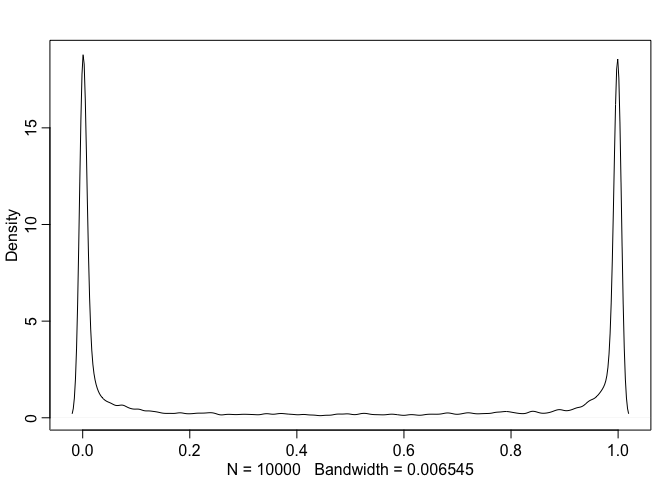
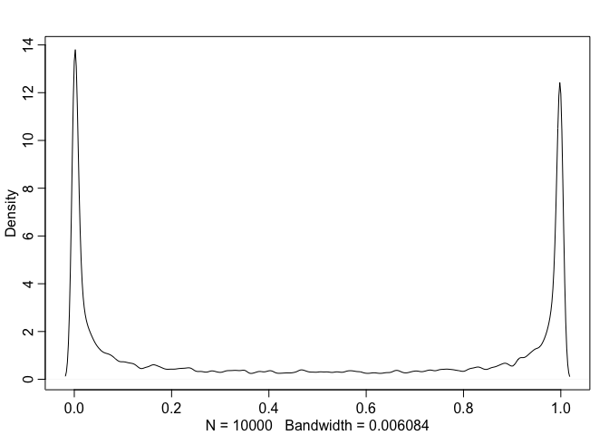
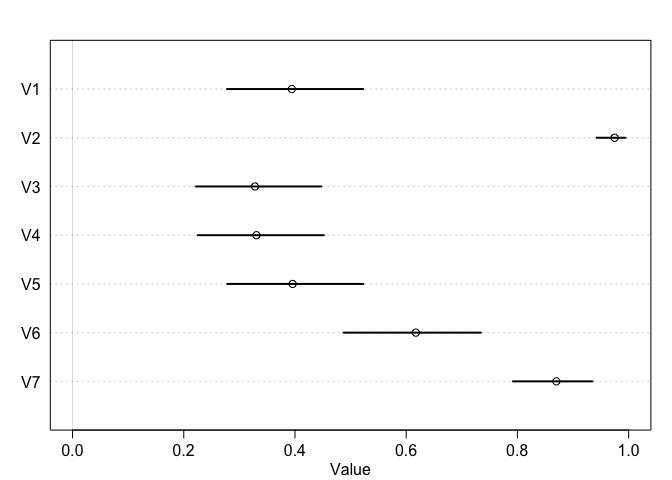
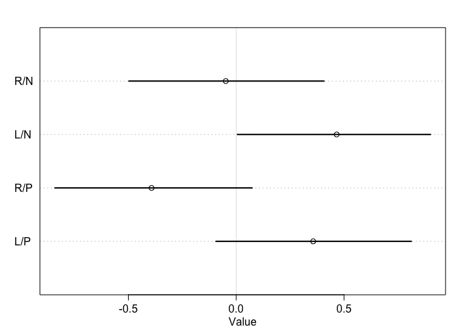
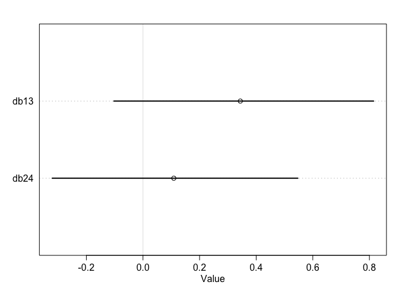
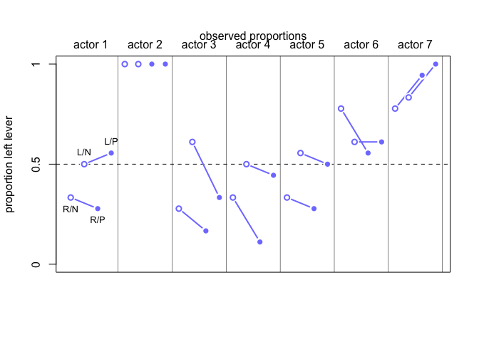
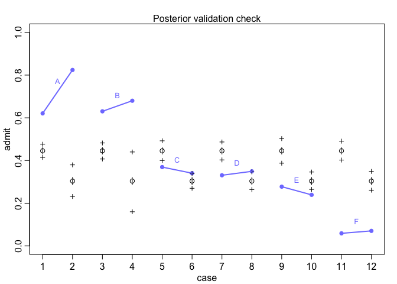

# 

```r
data(chimpanzees)
d <- chimpanzees
```
* There are four combinations:
* (1) prosoc_left= 0 and condition= 0: Two food items on right and no partner. 
* (2) prosoc_left= 1 and condition= 0: Two food items on left and no partner.
* (3) prosoc_left= 0 and condition= 1: Two food items on right and partner present. 
* (4) prosoc_left= 1 and condition= 1: Two food items on left and partner present.

* let’s build an index variable containing the values 1 through 4, to index the combinations above.

```r
d$treatment <- 1 + d$prosoc_left + 2*d$condition
```

* Now treatment contains the values 1 through 4, matching the numbers in the list above. You can verify by using cross-tabs

```r
 xtabs( ~ treatment + prosoc_left + condition , d )
```

```
## , , condition = 0
## 
##          prosoc_left
## treatment   0   1
##         1 126   0
##         2   0 126
##         3   0   0
##         4   0   0
## 
## , , condition = 1
## 
##          prosoc_left
## treatment   0   1
##         1   0   0
##         2   0   0
##         3 126   0
##         4   0 126
```

```r
m11.1 <- quap(
    alist(
        pulled_left ~ dbinom( 1 , p ) ,
        logit(p) <- a ,
        a ~ dnorm( 0 , 10 )
) , data=d )
```

# 

```r
set.seed(1999)
prior <- extract.prior( m11.1 , n=1e4 )
```

# 

```r
p <- inv_logit( prior$a )
dens( p , adj=0.1 )
```

<!-- -->

# 

```r
m11.2 <- quap(
    alist(
        pulled_left ~ dbinom( 1 , p ) ,
        logit(p) <- a + b[treatment] ,
        a ~ dnorm( 0 , 1.5 ),
        b[treatment] ~ dnorm( 0 , 10 )
) , data=d )
set.seed(1999)
prior <- extract.prior( m11.2 , n=1e4 )
p <- sapply( 1:4 , function(k) inv_logit( prior$a + prior$b[,k] ) )
```

# 

```r
 dens( abs( p[,1] - p[,2] ) , adj=0.1 )
```

<!-- -->

# 

```r
m11.3 <- quap(
    alist(
        pulled_left ~ dbinom( 1 , p ) ,
        logit(p) <- a + b[treatment] ,
        a ~ dnorm( 0 , 1.5 ),
        b[treatment] ~ dnorm( 0 , 0.5 )
    ) , data=d )
set.seed(1999)
prior <- extract.prior( m11.3 , n=1e4 )
p <- sapply( 1:4 , function(k) inv_logit( prior$a + prior$b[,k] ) )
mean( abs( p[,1] - p[,2] ) )
```

```
## [1] 0.09838663
```

#

```r
# prior trimmed data list
dat_list <- list(
    pulled_left = d$pulled_left,
    actor = d$actor,
    treatment = as.integer(d$treatment) )
# particles in 11-dimensional space
m11.4 <- ulam(
    alist(
        pulled_left ~ dbinom( 1 , p ) ,
        logit(p) <- a[actor] + b[treatment] ,
        a[actor] ~ dnorm( 0 , 1.5 ),
        b[treatment] ~ dnorm( 0 , 0.5 )
),
    data=dat_list , chains=4 )
```

```
## 
## SAMPLING FOR MODEL 'e93b3fae6cdfbece233b5e9fca1623b1' NOW (CHAIN 1).
## Chain 1: 
## Chain 1: Gradient evaluation took 0.000107 seconds
## Chain 1: 1000 transitions using 10 leapfrog steps per transition would take 1.07 seconds.
## Chain 1: Adjust your expectations accordingly!
## Chain 1: 
## Chain 1: 
## Chain 1: Iteration:   1 / 1000 [  0%]  (Warmup)
## Chain 1: Iteration: 100 / 1000 [ 10%]  (Warmup)
## Chain 1: Iteration: 200 / 1000 [ 20%]  (Warmup)
## Chain 1: Iteration: 300 / 1000 [ 30%]  (Warmup)
## Chain 1: Iteration: 400 / 1000 [ 40%]  (Warmup)
## Chain 1: Iteration: 500 / 1000 [ 50%]  (Warmup)
## Chain 1: Iteration: 501 / 1000 [ 50%]  (Sampling)
## Chain 1: Iteration: 600 / 1000 [ 60%]  (Sampling)
## Chain 1: Iteration: 700 / 1000 [ 70%]  (Sampling)
## Chain 1: Iteration: 800 / 1000 [ 80%]  (Sampling)
## Chain 1: Iteration: 900 / 1000 [ 90%]  (Sampling)
## Chain 1: Iteration: 1000 / 1000 [100%]  (Sampling)
## Chain 1: 
## Chain 1:  Elapsed Time: 0.375809 seconds (Warm-up)
## Chain 1:                0.27225 seconds (Sampling)
## Chain 1:                0.648059 seconds (Total)
## Chain 1: 
## 
## SAMPLING FOR MODEL 'e93b3fae6cdfbece233b5e9fca1623b1' NOW (CHAIN 2).
## Chain 2: 
## Chain 2: Gradient evaluation took 5.2e-05 seconds
## Chain 2: 1000 transitions using 10 leapfrog steps per transition would take 0.52 seconds.
## Chain 2: Adjust your expectations accordingly!
## Chain 2: 
## Chain 2: 
## Chain 2: Iteration:   1 / 1000 [  0%]  (Warmup)
## Chain 2: Iteration: 100 / 1000 [ 10%]  (Warmup)
## Chain 2: Iteration: 200 / 1000 [ 20%]  (Warmup)
## Chain 2: Iteration: 300 / 1000 [ 30%]  (Warmup)
## Chain 2: Iteration: 400 / 1000 [ 40%]  (Warmup)
## Chain 2: Iteration: 500 / 1000 [ 50%]  (Warmup)
## Chain 2: Iteration: 501 / 1000 [ 50%]  (Sampling)
## Chain 2: Iteration: 600 / 1000 [ 60%]  (Sampling)
## Chain 2: Iteration: 700 / 1000 [ 70%]  (Sampling)
## Chain 2: Iteration: 800 / 1000 [ 80%]  (Sampling)
## Chain 2: Iteration: 900 / 1000 [ 90%]  (Sampling)
## Chain 2: Iteration: 1000 / 1000 [100%]  (Sampling)
## Chain 2: 
## Chain 2:  Elapsed Time: 0.383429 seconds (Warm-up)
## Chain 2:                0.385925 seconds (Sampling)
## Chain 2:                0.769354 seconds (Total)
## Chain 2: 
## 
## SAMPLING FOR MODEL 'e93b3fae6cdfbece233b5e9fca1623b1' NOW (CHAIN 3).
## Chain 3: 
## Chain 3: Gradient evaluation took 5e-05 seconds
## Chain 3: 1000 transitions using 10 leapfrog steps per transition would take 0.5 seconds.
## Chain 3: Adjust your expectations accordingly!
## Chain 3: 
## Chain 3: 
## Chain 3: Iteration:   1 / 1000 [  0%]  (Warmup)
## Chain 3: Iteration: 100 / 1000 [ 10%]  (Warmup)
## Chain 3: Iteration: 200 / 1000 [ 20%]  (Warmup)
## Chain 3: Iteration: 300 / 1000 [ 30%]  (Warmup)
## Chain 3: Iteration: 400 / 1000 [ 40%]  (Warmup)
## Chain 3: Iteration: 500 / 1000 [ 50%]  (Warmup)
## Chain 3: Iteration: 501 / 1000 [ 50%]  (Sampling)
## Chain 3: Iteration: 600 / 1000 [ 60%]  (Sampling)
## Chain 3: Iteration: 700 / 1000 [ 70%]  (Sampling)
## Chain 3: Iteration: 800 / 1000 [ 80%]  (Sampling)
## Chain 3: Iteration: 900 / 1000 [ 90%]  (Sampling)
## Chain 3: Iteration: 1000 / 1000 [100%]  (Sampling)
## Chain 3: 
## Chain 3:  Elapsed Time: 0.417064 seconds (Warm-up)
## Chain 3:                0.423964 seconds (Sampling)
## Chain 3:                0.841028 seconds (Total)
## Chain 3: 
## 
## SAMPLING FOR MODEL 'e93b3fae6cdfbece233b5e9fca1623b1' NOW (CHAIN 4).
## Chain 4: 
## Chain 4: Gradient evaluation took 5.1e-05 seconds
## Chain 4: 1000 transitions using 10 leapfrog steps per transition would take 0.51 seconds.
## Chain 4: Adjust your expectations accordingly!
## Chain 4: 
## Chain 4: 
## Chain 4: Iteration:   1 / 1000 [  0%]  (Warmup)
## Chain 4: Iteration: 100 / 1000 [ 10%]  (Warmup)
## Chain 4: Iteration: 200 / 1000 [ 20%]  (Warmup)
## Chain 4: Iteration: 300 / 1000 [ 30%]  (Warmup)
## Chain 4: Iteration: 400 / 1000 [ 40%]  (Warmup)
## Chain 4: Iteration: 500 / 1000 [ 50%]  (Warmup)
## Chain 4: Iteration: 501 / 1000 [ 50%]  (Sampling)
## Chain 4: Iteration: 600 / 1000 [ 60%]  (Sampling)
## Chain 4: Iteration: 700 / 1000 [ 70%]  (Sampling)
## Chain 4: Iteration: 800 / 1000 [ 80%]  (Sampling)
## Chain 4: Iteration: 900 / 1000 [ 90%]  (Sampling)
## Chain 4: Iteration: 1000 / 1000 [100%]  (Sampling)
## Chain 4: 
## Chain 4:  Elapsed Time: 0.391518 seconds (Warm-up)
## Chain 4:                0.363723 seconds (Sampling)
## Chain 4:                0.755241 seconds (Total)
## Chain 4:
```

```r
precis( m11.4 , depth=2 )
```

```
##            mean        sd        5.5%       94.5%     n_eff      Rhat
## a[1] -0.4405507 0.3279480 -0.95517191  0.09014720  886.9475 1.0019443
## a[2]  3.9010060 0.7508270  2.80042409  5.16176919 1497.1286 0.9991706
## a[3] -0.7346984 0.3284202 -1.25411334 -0.21160526  893.3338 1.0011085
## a[4] -0.7228660 0.3282111 -1.23577149 -0.19269141  907.4431 1.0056065
## a[5] -0.4340172 0.3271884 -0.95274252  0.09150824  884.2596 1.0030804
## a[6]  0.4913732 0.3368085 -0.05009655  1.01631481  875.3362 1.0021107
## a[7]  1.9625382 0.4106072  1.33700892  2.66246394 1227.9889 1.0001700
## b[1] -0.0484187 0.2865308 -0.49768389  0.40686886  849.2850 1.0045507
## b[2]  0.4656816 0.2798013  0.00559224  0.90061250  755.8780 1.0035313
## b[3] -0.3923914 0.2839955 -0.84038076  0.07368503  836.1496 1.0035351
## b[4]  0.3567186 0.2838486 -0.09372661  0.81153498  868.2254 1.0013881
```

#

```r
post <- extract.samples(m11.4)
p_left <- inv_logit( post$a )
plot( precis( as.data.frame(p_left) ) , xlim=c(0,1) )
```

<!-- -->

# 

```r
labs <- c("R/N","L/N","R/P","L/P")
plot( precis( m11.4 , depth=2 , pars="b" ) , labels=labs )
```

<!-- -->

# 

```r
diffs <- list(
    db13 = post$b[,1] - post$b[,3],
    db24 = post$b[,2] - post$b[,4] )
plot( precis(diffs) )
```

<!-- -->

# 

```r
pl <- by( d$pulled_left , list( d$actor , d$treatment ) , mean )
pl[1,]
```

```
##         1         2         3         4 
## 0.3333333 0.5000000 0.2777778 0.5555556
```

#

```r
plot( NULL , xlim=c(1,28) , ylim=c(0,1) , xlab="" ,
    ylab="proportion left lever" , xaxt="n" , yaxt="n" )
axis( 2 , at=c(0,0.5,1) , labels=c(0,0.5,1) )
abline( h=0.5 , lty=2 )
for ( j in 1:7 ) abline( v=(j-1)*4+4.5 , lwd=0.5 )
for ( j in 1:7 ) text( (j-1)*4+2.5 , 1.1 , concat("actor ",j) , xpd=TRUE )
for ( j in (1:7)[-2] ) {
    lines( (j-1)*4+c(1,3) , pl[j,c(1,3)] , lwd=2 , col=rangi2 )
    lines( (j-1)*4+c(2,4) , pl[j,c(2,4)] , lwd=2 , col=rangi2 )
}
points( 1:28 , t(pl) , pch=16 , col="white" , cex=1.7 )
points( 1:28 , t(pl) , pch=c(1,1,16,16) , col=rangi2 , lwd=2 )
yoff <- 0.01
text( 1 , pl[1,1]-yoff , "R/N" , pos=1 , cex=0.8 )
text( 2 , pl[1,2]+yoff , "L/N" , pos=3 , cex=0.8 )
text( 3 , pl[1,3]-yoff , "R/P" , pos=1 , cex=0.8 )
text( 4 , pl[1,4]+yoff , "L/P" , pos=3 , cex=0.8 )
mtext( "observed proportions\n" )
```

<!-- -->

# 

```r
dat <- list( actor=rep(1:7,each=4) , treatment=rep(1:4,times=7) )
p_post <- link_ulam( m11.4 , data=dat )
p_mu <- apply( p_post , 2 , mean )
p_ci <- apply( p_post , 2 , PI )
```

# 

```r
d$side <- d$prosoc_left + 1 # right 1, left 2
d$cond <- d$condition + 1 # no partner 1, partner 
```

#

```r
dat_list2 <- list(
    pulled_left = d$pulled_left,
    actor = d$actor,
    side = d$side,
    cond = d$cond )
m11.5 <- ulam(
    alist(
        pulled_left ~ dbinom( 1 , p ) ,
        logit(p) <- a[actor] + bs[side] + bc[cond] ,
        a[actor] ~ dnorm( 0 , 1.5 ),
        bs[side] ~ dnorm( 0 , 0.5 ),
        bc[cond] ~ dnorm( 0 , 0.5 )
),
data=dat_list2 , chains=4 , log_lik=TRUE )
```

```
## 
## SAMPLING FOR MODEL '8cec853a8473faa0bc2e49bbbdc68fa7' NOW (CHAIN 1).
## Chain 1: 
## Chain 1: Gradient evaluation took 8.8e-05 seconds
## Chain 1: 1000 transitions using 10 leapfrog steps per transition would take 0.88 seconds.
## Chain 1: Adjust your expectations accordingly!
## Chain 1: 
## Chain 1: 
## Chain 1: Iteration:   1 / 1000 [  0%]  (Warmup)
## Chain 1: Iteration: 100 / 1000 [ 10%]  (Warmup)
## Chain 1: Iteration: 200 / 1000 [ 20%]  (Warmup)
## Chain 1: Iteration: 300 / 1000 [ 30%]  (Warmup)
## Chain 1: Iteration: 400 / 1000 [ 40%]  (Warmup)
## Chain 1: Iteration: 500 / 1000 [ 50%]  (Warmup)
## Chain 1: Iteration: 501 / 1000 [ 50%]  (Sampling)
## Chain 1: Iteration: 600 / 1000 [ 60%]  (Sampling)
## Chain 1: Iteration: 700 / 1000 [ 70%]  (Sampling)
## Chain 1: Iteration: 800 / 1000 [ 80%]  (Sampling)
## Chain 1: Iteration: 900 / 1000 [ 90%]  (Sampling)
## Chain 1: Iteration: 1000 / 1000 [100%]  (Sampling)
## Chain 1: 
## Chain 1:  Elapsed Time: 0.690526 seconds (Warm-up)
## Chain 1:                0.679222 seconds (Sampling)
## Chain 1:                1.36975 seconds (Total)
## Chain 1: 
## 
## SAMPLING FOR MODEL '8cec853a8473faa0bc2e49bbbdc68fa7' NOW (CHAIN 2).
## Chain 2: 
## Chain 2: Gradient evaluation took 7e-05 seconds
## Chain 2: 1000 transitions using 10 leapfrog steps per transition would take 0.7 seconds.
## Chain 2: Adjust your expectations accordingly!
## Chain 2: 
## Chain 2: 
## Chain 2: Iteration:   1 / 1000 [  0%]  (Warmup)
## Chain 2: Iteration: 100 / 1000 [ 10%]  (Warmup)
## Chain 2: Iteration: 200 / 1000 [ 20%]  (Warmup)
## Chain 2: Iteration: 300 / 1000 [ 30%]  (Warmup)
## Chain 2: Iteration: 400 / 1000 [ 40%]  (Warmup)
## Chain 2: Iteration: 500 / 1000 [ 50%]  (Warmup)
## Chain 2: Iteration: 501 / 1000 [ 50%]  (Sampling)
## Chain 2: Iteration: 600 / 1000 [ 60%]  (Sampling)
## Chain 2: Iteration: 700 / 1000 [ 70%]  (Sampling)
## Chain 2: Iteration: 800 / 1000 [ 80%]  (Sampling)
## Chain 2: Iteration: 900 / 1000 [ 90%]  (Sampling)
## Chain 2: Iteration: 1000 / 1000 [100%]  (Sampling)
## Chain 2: 
## Chain 2:  Elapsed Time: 0.690832 seconds (Warm-up)
## Chain 2:                0.690872 seconds (Sampling)
## Chain 2:                1.3817 seconds (Total)
## Chain 2: 
## 
## SAMPLING FOR MODEL '8cec853a8473faa0bc2e49bbbdc68fa7' NOW (CHAIN 3).
## Chain 3: 
## Chain 3: Gradient evaluation took 6.8e-05 seconds
## Chain 3: 1000 transitions using 10 leapfrog steps per transition would take 0.68 seconds.
## Chain 3: Adjust your expectations accordingly!
## Chain 3: 
## Chain 3: 
## Chain 3: Iteration:   1 / 1000 [  0%]  (Warmup)
## Chain 3: Iteration: 100 / 1000 [ 10%]  (Warmup)
## Chain 3: Iteration: 200 / 1000 [ 20%]  (Warmup)
## Chain 3: Iteration: 300 / 1000 [ 30%]  (Warmup)
## Chain 3: Iteration: 400 / 1000 [ 40%]  (Warmup)
## Chain 3: Iteration: 500 / 1000 [ 50%]  (Warmup)
## Chain 3: Iteration: 501 / 1000 [ 50%]  (Sampling)
## Chain 3: Iteration: 600 / 1000 [ 60%]  (Sampling)
## Chain 3: Iteration: 700 / 1000 [ 70%]  (Sampling)
## Chain 3: Iteration: 800 / 1000 [ 80%]  (Sampling)
## Chain 3: Iteration: 900 / 1000 [ 90%]  (Sampling)
## Chain 3: Iteration: 1000 / 1000 [100%]  (Sampling)
## Chain 3: 
## Chain 3:  Elapsed Time: 0.789768 seconds (Warm-up)
## Chain 3:                0.689619 seconds (Sampling)
## Chain 3:                1.47939 seconds (Total)
## Chain 3: 
## 
## SAMPLING FOR MODEL '8cec853a8473faa0bc2e49bbbdc68fa7' NOW (CHAIN 4).
## Chain 4: 
## Chain 4: Gradient evaluation took 6e-05 seconds
## Chain 4: 1000 transitions using 10 leapfrog steps per transition would take 0.6 seconds.
## Chain 4: Adjust your expectations accordingly!
## Chain 4: 
## Chain 4: 
## Chain 4: Iteration:   1 / 1000 [  0%]  (Warmup)
## Chain 4: Iteration: 100 / 1000 [ 10%]  (Warmup)
## Chain 4: Iteration: 200 / 1000 [ 20%]  (Warmup)
## Chain 4: Iteration: 300 / 1000 [ 30%]  (Warmup)
## Chain 4: Iteration: 400 / 1000 [ 40%]  (Warmup)
## Chain 4: Iteration: 500 / 1000 [ 50%]  (Warmup)
## Chain 4: Iteration: 501 / 1000 [ 50%]  (Sampling)
## Chain 4: Iteration: 600 / 1000 [ 60%]  (Sampling)
## Chain 4: Iteration: 700 / 1000 [ 70%]  (Sampling)
## Chain 4: Iteration: 800 / 1000 [ 80%]  (Sampling)
## Chain 4: Iteration: 900 / 1000 [ 90%]  (Sampling)
## Chain 4: Iteration: 1000 / 1000 [100%]  (Sampling)
## Chain 4: 
## Chain 4:  Elapsed Time: 0.814468 seconds (Warm-up)
## Chain 4:                0.62007 seconds (Sampling)
## Chain 4:                1.43454 seconds (Total)
## Chain 4:
```

#

```r
compare( m11.5 , m11.4 , func=LOO )
```

```
## Error in .local(object, n, refresh, pointwise, ...): Log-likelihood matrix 'log_lik'' not found.
```

# 

```r
 post <- extract.samples( m11.4 , clean=FALSE )
str(post)
```

```
## List of 3
##  $ a   : num [1:2000, 1:7] 0.372 -0.54 -0.517 -0.247 -0.865 ...
##  $ b   : num [1:2000, 1:4] -0.0318 0.3591 0.0563 0.0376 0.0888 ...
##  $ lp__: num [1:2000(1d)] -273 -270 -272 -265 -268 ...
##  - attr(*, "source")= chr "ulam posterior: 2000 samples from m11.4"
```

# 

```r
m11.4_stan_code <- stancode(m11.4)
```

```
## data{
##     int pulled_left[504];
##     int treatment[504];
##     int actor[504];
## }
## parameters{
##     vector[7] a;
##     vector[4] b;
## }
## model{
##     vector[504] p;
##     b ~ normal( 0 , 0.5 );
##     a ~ normal( 0 , 1.5 );
##     for ( i in 1:504 ) {
##         p[i] = a[actor[i]] + b[treatment[i]];
##         p[i] = inv_logit(p[i]);
##     }
##     pulled_left ~ binomial( 1 , p );
## }
```

```r
m11.4_stan <- stan( model_code=m11.4_stan_code , data=dat_list , chains=4 )
```

```
## recompiling to avoid crashing R session
```

```
## 
## SAMPLING FOR MODEL 'e93b3fae6cdfbece233b5e9fca1623b1' NOW (CHAIN 1).
## Chain 1: 
## Chain 1: Gradient evaluation took 0.000132 seconds
## Chain 1: 1000 transitions using 10 leapfrog steps per transition would take 1.32 seconds.
## Chain 1: Adjust your expectations accordingly!
## Chain 1: 
## Chain 1: 
## Chain 1: Iteration:    1 / 2000 [  0%]  (Warmup)
## Chain 1: Iteration:  200 / 2000 [ 10%]  (Warmup)
## Chain 1: Iteration:  400 / 2000 [ 20%]  (Warmup)
## Chain 1: Iteration:  600 / 2000 [ 30%]  (Warmup)
## Chain 1: Iteration:  800 / 2000 [ 40%]  (Warmup)
## Chain 1: Iteration: 1000 / 2000 [ 50%]  (Warmup)
## Chain 1: Iteration: 1001 / 2000 [ 50%]  (Sampling)
## Chain 1: Iteration: 1200 / 2000 [ 60%]  (Sampling)
## Chain 1: Iteration: 1400 / 2000 [ 70%]  (Sampling)
## Chain 1: Iteration: 1600 / 2000 [ 80%]  (Sampling)
## Chain 1: Iteration: 1800 / 2000 [ 90%]  (Sampling)
## Chain 1: Iteration: 2000 / 2000 [100%]  (Sampling)
## Chain 1: 
## Chain 1:  Elapsed Time: 0.555129 seconds (Warm-up)
## Chain 1:                0.443336 seconds (Sampling)
## Chain 1:                0.998465 seconds (Total)
## Chain 1: 
## 
## SAMPLING FOR MODEL 'e93b3fae6cdfbece233b5e9fca1623b1' NOW (CHAIN 2).
## Chain 2: 
## Chain 2: Gradient evaluation took 4.8e-05 seconds
## Chain 2: 1000 transitions using 10 leapfrog steps per transition would take 0.48 seconds.
## Chain 2: Adjust your expectations accordingly!
## Chain 2: 
## Chain 2: 
## Chain 2: Iteration:    1 / 2000 [  0%]  (Warmup)
## Chain 2: Iteration:  200 / 2000 [ 10%]  (Warmup)
## Chain 2: Iteration:  400 / 2000 [ 20%]  (Warmup)
## Chain 2: Iteration:  600 / 2000 [ 30%]  (Warmup)
## Chain 2: Iteration:  800 / 2000 [ 40%]  (Warmup)
## Chain 2: Iteration: 1000 / 2000 [ 50%]  (Warmup)
## Chain 2: Iteration: 1001 / 2000 [ 50%]  (Sampling)
## Chain 2: Iteration: 1200 / 2000 [ 60%]  (Sampling)
## Chain 2: Iteration: 1400 / 2000 [ 70%]  (Sampling)
## Chain 2: Iteration: 1600 / 2000 [ 80%]  (Sampling)
## Chain 2: Iteration: 1800 / 2000 [ 90%]  (Sampling)
## Chain 2: Iteration: 2000 / 2000 [100%]  (Sampling)
## Chain 2: 
## Chain 2:  Elapsed Time: 0.568876 seconds (Warm-up)
## Chain 2:                0.45359 seconds (Sampling)
## Chain 2:                1.02247 seconds (Total)
## Chain 2: 
## 
## SAMPLING FOR MODEL 'e93b3fae6cdfbece233b5e9fca1623b1' NOW (CHAIN 3).
## Chain 3: 
## Chain 3: Gradient evaluation took 5.6e-05 seconds
## Chain 3: 1000 transitions using 10 leapfrog steps per transition would take 0.56 seconds.
## Chain 3: Adjust your expectations accordingly!
## Chain 3: 
## Chain 3: 
## Chain 3: Iteration:    1 / 2000 [  0%]  (Warmup)
## Chain 3: Iteration:  200 / 2000 [ 10%]  (Warmup)
## Chain 3: Iteration:  400 / 2000 [ 20%]  (Warmup)
## Chain 3: Iteration:  600 / 2000 [ 30%]  (Warmup)
## Chain 3: Iteration:  800 / 2000 [ 40%]  (Warmup)
## Chain 3: Iteration: 1000 / 2000 [ 50%]  (Warmup)
## Chain 3: Iteration: 1001 / 2000 [ 50%]  (Sampling)
## Chain 3: Iteration: 1200 / 2000 [ 60%]  (Sampling)
## Chain 3: Iteration: 1400 / 2000 [ 70%]  (Sampling)
## Chain 3: Iteration: 1600 / 2000 [ 80%]  (Sampling)
## Chain 3: Iteration: 1800 / 2000 [ 90%]  (Sampling)
## Chain 3: Iteration: 2000 / 2000 [100%]  (Sampling)
## Chain 3: 
## Chain 3:  Elapsed Time: 0.554501 seconds (Warm-up)
## Chain 3:                0.459613 seconds (Sampling)
## Chain 3:                1.01411 seconds (Total)
## Chain 3: 
## 
## SAMPLING FOR MODEL 'e93b3fae6cdfbece233b5e9fca1623b1' NOW (CHAIN 4).
## Chain 4: 
## Chain 4: Gradient evaluation took 5e-05 seconds
## Chain 4: 1000 transitions using 10 leapfrog steps per transition would take 0.5 seconds.
## Chain 4: Adjust your expectations accordingly!
## Chain 4: 
## Chain 4: 
## Chain 4: Iteration:    1 / 2000 [  0%]  (Warmup)
## Chain 4: Iteration:  200 / 2000 [ 10%]  (Warmup)
## Chain 4: Iteration:  400 / 2000 [ 20%]  (Warmup)
## Chain 4: Iteration:  600 / 2000 [ 30%]  (Warmup)
## Chain 4: Iteration:  800 / 2000 [ 40%]  (Warmup)
## Chain 4: Iteration: 1000 / 2000 [ 50%]  (Warmup)
## Chain 4: Iteration: 1001 / 2000 [ 50%]  (Sampling)
## Chain 4: Iteration: 1200 / 2000 [ 60%]  (Sampling)
## Chain 4: Iteration: 1400 / 2000 [ 70%]  (Sampling)
## Chain 4: Iteration: 1600 / 2000 [ 80%]  (Sampling)
## Chain 4: Iteration: 1800 / 2000 [ 90%]  (Sampling)
## Chain 4: Iteration: 2000 / 2000 [100%]  (Sampling)
## Chain 4: 
## Chain 4:  Elapsed Time: 0.512798 seconds (Warm-up)
## Chain 4:                0.412853 seconds (Sampling)
## Chain 4:                0.925651 seconds (Total)
## Chain 4:
```

```r
compare( m11.4_stan , m11.4 )
```

```
## Warning in compare(m11.4_stan, m11.4): Not all model fits of same class.
## This is usually a bad idea, because it implies they were fit by different algorithms.
## Check yourself, before you wreck yourself.
```

```
## Error in check_pars(allpars, pars) : no parameter log_lik
```

```
## Error in check_pars(allpars, pars): no parameter log_lik
```

# 11.1.2. Relative shark and absolute penguin. 

```r
post <- extract.samples(m11.4)
mean( exp(post$b[,4]-post$b[,2]) )
```

```
## [1] 0.9304046
```

# 11.1.3. Aggregated binomial: Chimpanzees again, condensed.

```r
data(chimpanzees)
d <- chimpanzees
d$treatment <- 1 + d$prosoc_left + 2*d$condition
d$side <- d$prosoc_left + 1 # right 1, left 2
d$cond <- d$condition + 1 # no partner 1, partner 2
d_aggregated <- aggregate(
    d$pulled_left ,
    list( treatment=d$treatment , actor=d$actor ,
          side=d$side , cond=d$cond ) ,
    sum )
colnames(d_aggregated)[5] <- "left_pulls"
```

#

```r
dat <- with( d_aggregated , list(
    left_pulls = left_pulls,
    treatment = treatment,
    actor = actor,
    side = side,
    cond = cond ) )
m11.6 <- ulam(
    alist(
        left_pulls ~ dbinom( 18 , p ) ,
        logit(p) <- a[actor] + b[treatment] ,
        a[actor] ~ dnorm( 0 , 1.5 ) ,
        b[treatment] ~ dnorm( 0 , 0.5 )
),
data=dat , chains=4 , log_lik=TRUE )
```

```
## 
## SAMPLING FOR MODEL '79cee3368c3337e807538171c896ad26' NOW (CHAIN 1).
## Chain 1: 
## Chain 1: Gradient evaluation took 2.4e-05 seconds
## Chain 1: 1000 transitions using 10 leapfrog steps per transition would take 0.24 seconds.
## Chain 1: Adjust your expectations accordingly!
## Chain 1: 
## Chain 1: 
## Chain 1: Iteration:   1 / 1000 [  0%]  (Warmup)
## Chain 1: Iteration: 100 / 1000 [ 10%]  (Warmup)
## Chain 1: Iteration: 200 / 1000 [ 20%]  (Warmup)
## Chain 1: Iteration: 300 / 1000 [ 30%]  (Warmup)
## Chain 1: Iteration: 400 / 1000 [ 40%]  (Warmup)
## Chain 1: Iteration: 500 / 1000 [ 50%]  (Warmup)
## Chain 1: Iteration: 501 / 1000 [ 50%]  (Sampling)
## Chain 1: Iteration: 600 / 1000 [ 60%]  (Sampling)
## Chain 1: Iteration: 700 / 1000 [ 70%]  (Sampling)
## Chain 1: Iteration: 800 / 1000 [ 80%]  (Sampling)
## Chain 1: Iteration: 900 / 1000 [ 90%]  (Sampling)
## Chain 1: Iteration: 1000 / 1000 [100%]  (Sampling)
## Chain 1: 
## Chain 1:  Elapsed Time: 0.050147 seconds (Warm-up)
## Chain 1:                0.043561 seconds (Sampling)
## Chain 1:                0.093708 seconds (Total)
## Chain 1: 
## 
## SAMPLING FOR MODEL '79cee3368c3337e807538171c896ad26' NOW (CHAIN 2).
## Chain 2: 
## Chain 2: Gradient evaluation took 9e-06 seconds
## Chain 2: 1000 transitions using 10 leapfrog steps per transition would take 0.09 seconds.
## Chain 2: Adjust your expectations accordingly!
## Chain 2: 
## Chain 2: 
## Chain 2: Iteration:   1 / 1000 [  0%]  (Warmup)
## Chain 2: Iteration: 100 / 1000 [ 10%]  (Warmup)
## Chain 2: Iteration: 200 / 1000 [ 20%]  (Warmup)
## Chain 2: Iteration: 300 / 1000 [ 30%]  (Warmup)
## Chain 2: Iteration: 400 / 1000 [ 40%]  (Warmup)
## Chain 2: Iteration: 500 / 1000 [ 50%]  (Warmup)
## Chain 2: Iteration: 501 / 1000 [ 50%]  (Sampling)
## Chain 2: Iteration: 600 / 1000 [ 60%]  (Sampling)
## Chain 2: Iteration: 700 / 1000 [ 70%]  (Sampling)
## Chain 2: Iteration: 800 / 1000 [ 80%]  (Sampling)
## Chain 2: Iteration: 900 / 1000 [ 90%]  (Sampling)
## Chain 2: Iteration: 1000 / 1000 [100%]  (Sampling)
## Chain 2: 
## Chain 2:  Elapsed Time: 0.051022 seconds (Warm-up)
## Chain 2:                0.044584 seconds (Sampling)
## Chain 2:                0.095606 seconds (Total)
## Chain 2: 
## 
## SAMPLING FOR MODEL '79cee3368c3337e807538171c896ad26' NOW (CHAIN 3).
## Chain 3: 
## Chain 3: Gradient evaluation took 8e-06 seconds
## Chain 3: 1000 transitions using 10 leapfrog steps per transition would take 0.08 seconds.
## Chain 3: Adjust your expectations accordingly!
## Chain 3: 
## Chain 3: 
## Chain 3: Iteration:   1 / 1000 [  0%]  (Warmup)
## Chain 3: Iteration: 100 / 1000 [ 10%]  (Warmup)
## Chain 3: Iteration: 200 / 1000 [ 20%]  (Warmup)
## Chain 3: Iteration: 300 / 1000 [ 30%]  (Warmup)
## Chain 3: Iteration: 400 / 1000 [ 40%]  (Warmup)
## Chain 3: Iteration: 500 / 1000 [ 50%]  (Warmup)
## Chain 3: Iteration: 501 / 1000 [ 50%]  (Sampling)
## Chain 3: Iteration: 600 / 1000 [ 60%]  (Sampling)
## Chain 3: Iteration: 700 / 1000 [ 70%]  (Sampling)
## Chain 3: Iteration: 800 / 1000 [ 80%]  (Sampling)
## Chain 3: Iteration: 900 / 1000 [ 90%]  (Sampling)
## Chain 3: Iteration: 1000 / 1000 [100%]  (Sampling)
## Chain 3: 
## Chain 3:  Elapsed Time: 0.048541 seconds (Warm-up)
## Chain 3:                0.046695 seconds (Sampling)
## Chain 3:                0.095236 seconds (Total)
## Chain 3: 
## 
## SAMPLING FOR MODEL '79cee3368c3337e807538171c896ad26' NOW (CHAIN 4).
## Chain 4: 
## Chain 4: Gradient evaluation took 8e-06 seconds
## Chain 4: 1000 transitions using 10 leapfrog steps per transition would take 0.08 seconds.
## Chain 4: Adjust your expectations accordingly!
## Chain 4: 
## Chain 4: 
## Chain 4: Iteration:   1 / 1000 [  0%]  (Warmup)
## Chain 4: Iteration: 100 / 1000 [ 10%]  (Warmup)
## Chain 4: Iteration: 200 / 1000 [ 20%]  (Warmup)
## Chain 4: Iteration: 300 / 1000 [ 30%]  (Warmup)
## Chain 4: Iteration: 400 / 1000 [ 40%]  (Warmup)
## Chain 4: Iteration: 500 / 1000 [ 50%]  (Warmup)
## Chain 4: Iteration: 501 / 1000 [ 50%]  (Sampling)
## Chain 4: Iteration: 600 / 1000 [ 60%]  (Sampling)
## Chain 4: Iteration: 700 / 1000 [ 70%]  (Sampling)
## Chain 4: Iteration: 800 / 1000 [ 80%]  (Sampling)
## Chain 4: Iteration: 900 / 1000 [ 90%]  (Sampling)
## Chain 4: Iteration: 1000 / 1000 [100%]  (Sampling)
## Chain 4: 
## Chain 4:  Elapsed Time: 0.052127 seconds (Warm-up)
## Chain 4:                0.0501 seconds (Sampling)
## Chain 4:                0.102227 seconds (Total)
## Chain 4:
```


```r
compare( m11.6 , m11.4 , func=LOO )
```

```
## Warning in compare(m11.6, m11.4, func = LOO): Different numbers of observations found for at least two models.
## Information criteria only valid for comparing models fit to exactly same observations.
## Number of observations for each model:
## m11.6 28 
## m11.4 504
```

```
## Warning: Some Pareto k diagnostic values are slightly high. See help('pareto-k-diagnostic') for details.
```

```
## Error in .local(object, n, refresh, pointwise, ...): Log-likelihood matrix 'log_lik'' not found.
```


```r
# deviance of aggregated 6-in-9
-2*dbinom(6,9,0.2,log=TRUE)
```

```
## [1] 11.79048
```

```r
# deviance of dis-aggregated
-2*sum(dbern(c(1,1,1,1,1,1,0,0,0),0.2,log=TRUE))
```

```
## [1] 20.65212
```


```r
( k <- LOOPk(m11.6) )
```

```
## Warning: Some Pareto k diagnostic values are slightly high. See help('pareto-k-diagnostic') for details.
```

```
##  [1] 0.37629229 0.36730401 0.18096911 0.40329118 0.32140257 0.65745673
##  [7] 0.46671675 0.30091685 0.15055350 0.60094734 0.49516370 0.52117447
## [13] 0.30377552 0.41964859 0.30864963 0.45965665 0.53455503 0.42154710
## [19] 0.40648411 0.33722370 0.68563572 0.42809751 0.08832276 0.51126622
## [25] 0.28948533 0.47298380 0.37820811 0.47861716
```

# 11.1.4. Aggregatedbinomial:Graduateschooladmissions.

```r
data(UCBadmit)
d <- UCBadmit
```


```r
d$gid <- ifelse( d$applicant.gender=="male" , 1 , 2 )
m11.7 <- quap(
    alist(
        admit ~ dbinom( applications , p ) ,
        logit(p) <- a[gid] ,
        a[gid] ~ dnorm( 0 , 1.5 )
    ) , data=d )
precis( m11.7 , depth=2 )
```

```
##            mean         sd       5.5%      94.5%
## a[1] -0.2199869 0.03877483 -0.2819566 -0.1580173
## a[2] -0.8295362 0.05073357 -0.9106183 -0.7484542
```


```r
post <- extract.samples(m11.7)
diff_a <- post$a[,1] - post$a[,2]
diff_p <- inv_logit(post$a[,1]) - inv_logit(post$a[,2])
precis( list( diff_a=diff_a , diff_p=diff_p ) )
```

```
##             mean         sd      5.5%     94.5%    histogram
## diff_a 0.6102098 0.06364504 0.5082019 0.7123106  ▁▁▁▃▇▇▅▂▁▁▁
## diff_p 0.1415480 0.01435060 0.1185348 0.1646069 ▁▁▁▁▃▇▇▅▂▁▁▁
```


```r
postcheck( m11.7 , n=1e4 )
# draw lines connecting points from same dept
d$dept_id <- rep( 1:7 , each=2 )
```

```
## Error in `$<-.data.frame`(`*tmp*`, dept_id, value = c(1L, 1L, 2L, 2L, : replacement has 14 rows, data has 12
```

```r
for ( i in 1:6 ) {
    x <- 1 + 2*(i-1)
    y1 <- d$admit[x]/d$applications[x]
    y2 <- d$admit[x+1]/d$applications[x+1]
    lines( c(x,x+1) , c(y1,y2) , col=rangi2 , lwd=2 )
    text( x+0.5 , (y1+y2)/2 + 0.05 , d$dept[x] , cex=0.8 , col=rangi2 )
}
```

<!-- -->


```r
d$dept_id <- rep(1:6,each=2)
m11.8 <- quap(
    alist(
        admit ~ dbinom( applications , p ) ,
        logit(p) <- a[gid] + delta[dept_id] ,
        a[gid] ~ dnorm( 0 , 1.5 ) ,
        delta[dept_id] ~ dnorm( 0 , 1.5 )
    ) , data=d )
precis( m11.8 , depth=2 )
```

```
##                mean        sd       5.5%      94.5%
## a[1]     -0.5278844 0.5322783 -1.3785680  0.3227991
## a[2]     -0.4311967 0.5330873 -1.2831731  0.4207798
## delta[1]  1.1079920 0.5350322  0.2529072  1.9630769
## delta[2]  1.0631975 0.5371968  0.2046532  1.9217417
## delta[3] -0.1502654 0.5347763 -1.0049412  0.7044105
## delta[4] -0.1826816 0.5350901 -1.0378590  0.6724958
## delta[5] -0.6246711 0.5378490 -1.4842577  0.2349155
## delta[6] -2.1727328 0.5468628 -3.0467251 -1.2987405
```


```r
post <- extract.samples(m11.8)
diff_a <- post$a[,1] - post$a[,2]
diff_p <- inv_logit(post$a[,1]) - inv_logit(post$a[,2])
precis( list( diff_a=diff_a , diff_p=diff_p ) )
```

```
##               mean         sd        5.5%       94.5%      histogram
## diff_a -0.09699955 0.08042527 -0.22535871 0.031423306 ▁▁▁▁▂▅▇▇▅▂▁▁▁▁
## diff_p -0.02168320 0.01834117 -0.05176415 0.007074929       ▁▁▂▇▇▂▁▁
```


```r
pg <- sapply( 1:6 , function(k)
    d$applications[d$dept_id==k]/sum(d$applications[d$dept_id==k]) )
rownames(pg) <- c("male","female")
colnames(pg) <- unique(d$dept)
round( pg , 2 )
```

```
##           A    B    C    D    E    F
## male   0.88 0.96 0.35 0.53 0.33 0.52
## female 0.12 0.04 0.65 0.47 0.67 0.48
```

# 11.1.5. Multinomialandcategoricalmodels.  (optional)

# 11.5 Practice
* 10E1. If an event has probability 0.35, what are the log-odds of this event?

```r
log(0.35/(1-0.35))
```

```
## [1] -0.6190392
```

```r
logit(0.35)
```

```
## [1] -0.6190392
```

* 10E2. If an event has log-odds 3.2, what is the probability of this event?

```r
inv_logit(3.2) # 0.9608343
```

```
## [1] 0.9608343
```

```r
logit(inv_logit(3.2)) # 3.2
```

```
## [1] 3.2
```


* 10E3. Suppose that a coefficient in a logistic regression has value 1.7. What does this imply about the proportional change in odds of the outcome?

* 10M1. Asexplainedinthechapter,binomialdatacanbeorganizedinaggregatedanddisaggregated forms, without any impact on inference. But the likelihood of the data does change when the data are converted between the two formats. Can you explain why?


