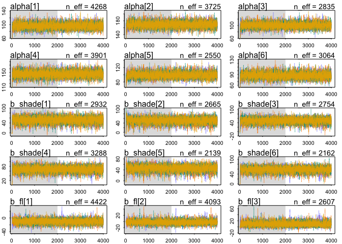
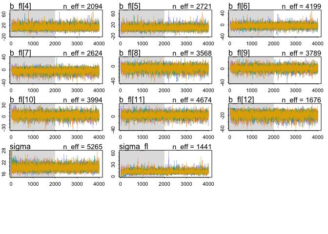
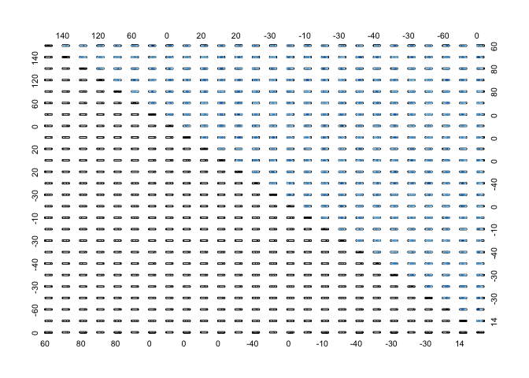
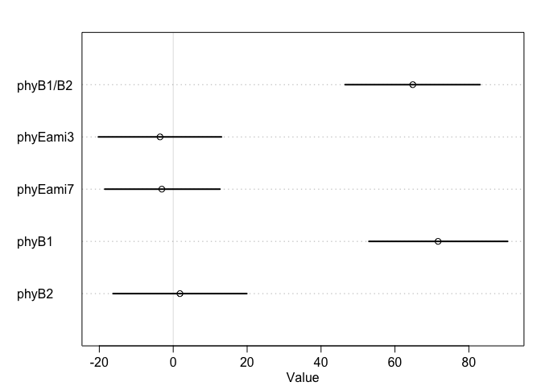
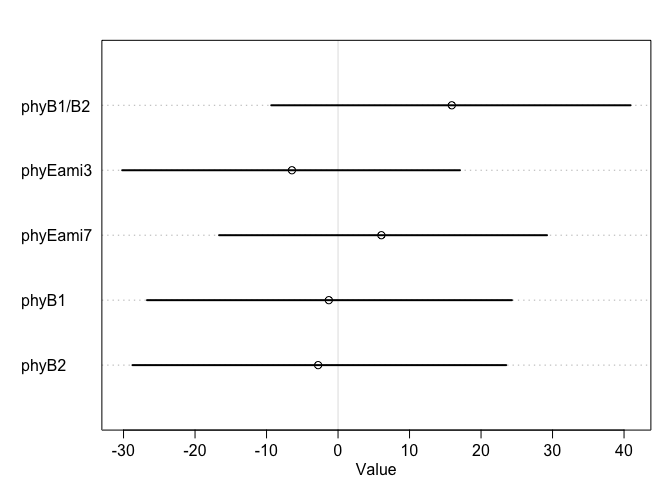

# 13. Models with memory


Please find attached csv.  This csv has measurements of tomato internodes and petioles from wildtype (Moneymaker) and various phytochrome mutant lines.  Measurements were made at 3 time points, 21, 28, and 35 days after germination under two treatments, simulated sun and simulated shade.

for today let's focus on day 35.  Also let's focus on total stem length.  So: first

# Q1)
## a) subset the data for day 35

```r
F4phyE<-read_csv("../figure4phyE.csv")
```

```
## Parsed with column specification:
## cols(
##   genotype = col_character(),
##   treatment = col_character(),
##   flat = col_double(),
##   day = col_double(),
##   epi = col_double(),
##   int1 = col_double(),
##   int2 = col_double(),
##   int3 = col_double(),
##   pet1 = col_double(),
##   pet2 = col_double(),
##   pet3 = col_double(),
##   pet4 = col_double()
## )
```

```r
summary(F4phyE)
```

```
##    genotype          treatment              flat            day    
##  Length:264         Length:264         Min.   :1.000   Min.   :21  
##  Class :character   Class :character   1st Qu.:2.000   1st Qu.:21  
##  Mode  :character   Mode  :character   Median :3.000   Median :28  
##                                        Mean   :3.455   Mean   :28  
##                                        3rd Qu.:5.000   3rd Qu.:35  
##                                        Max.   :6.000   Max.   :35  
##       epi             int1             int2             int3       
##  Min.   : 2.73   Min.   : 0.240   Min.   :  0.00   Min.   : 0.000  
##  1st Qu.:11.42   1st Qu.: 2.748   1st Qu.:  0.00   1st Qu.: 0.000  
##  Median :24.59   Median :14.635   Median :  7.58   Median : 2.755  
##  Mean   :28.00   Mean   :18.643   Mean   : 16.03   Mean   : 9.289  
##  3rd Qu.:37.48   3rd Qu.:30.532   3rd Qu.: 25.41   3rd Qu.:15.880  
##  Max.   :87.74   Max.   :71.270   Max.   :104.74   Max.   :56.700  
##       pet1            pet2             pet3            pet4       
##  Min.   : 6.23   Min.   : 0.000   Min.   : 0.00   Min.   : 0.000  
##  1st Qu.:15.19   1st Qu.: 5.577   1st Qu.: 0.00   1st Qu.: 0.000  
##  Median :38.78   Median :28.250   Median :13.19   Median : 3.455  
##  Mean   :37.97   Mean   :32.788   Mean   :24.59   Mean   :13.569  
##  3rd Qu.:52.47   3rd Qu.:53.197   3rd Qu.:48.82   3rd Qu.:27.302  
##  Max.   :91.87   Max.   :96.230   Max.   :98.57   Max.   :72.120
```

```r
F4phyE.day35 <- F4phyE %>% filter(day==35)
summary(F4phyE.day35)
```

```
##    genotype          treatment              flat            day    
##  Length:88          Length:88          Min.   :1.000   Min.   :35  
##  Class :character   Class :character   1st Qu.:2.000   1st Qu.:35  
##  Mode  :character   Mode  :character   Median :3.000   Median :35  
##                                        Mean   :3.455   Mean   :35  
##                                        3rd Qu.:5.000   3rd Qu.:35  
##                                        Max.   :6.000   Max.   :35  
##       epi             int1            int2             int3      
##  Min.   :10.94   Min.   : 3.02   Min.   : 10.75   Min.   : 8.79  
##  1st Qu.:29.08   1st Qu.:28.01   1st Qu.: 23.95   1st Qu.:15.98  
##  Median :37.36   Median :35.12   Median : 36.20   Median :24.72  
##  Mean   :41.40   Mean   :36.50   Mean   : 38.50   Mean   :24.85  
##  3rd Qu.:50.62   3rd Qu.:45.85   3rd Qu.: 48.99   3rd Qu.:31.67  
##  Max.   :87.74   Max.   :71.27   Max.   :104.74   Max.   :56.70  
##       pet1            pet2            pet3            pet4      
##  Min.   :32.52   Min.   : 0.00   Min.   :18.52   Min.   :10.83  
##  1st Qu.:51.14   1st Qu.:53.29   1st Qu.:49.33   1st Qu.:27.41  
##  Median :60.62   Median :65.34   Median :58.30   Median :34.99  
##  Mean   :60.26   Mean   :65.52   Mean   :60.12   Mean   :36.29  
##  3rd Qu.:68.91   3rd Qu.:79.04   3rd Qu.:71.24   3rd Qu.:43.87  
##  Max.   :91.87   Max.   :96.23   Max.   :98.57   Max.   :72.12
```

b) create a new column "stem_length" that is the sum of epi, int1, int2, and int3

```r
F4phyE.day35.v2 <- F4phyE.day35 %>% mutate(stem_length=epi+int1+int2+int3) # %>% View()
F4phyE.day35.v2
```

```
## # A tibble: 88 x 13
##    genotype treatment  flat   day   epi  int1  int2  int3  pet1  pet2  pet3
##    <chr>    <chr>     <dbl> <dbl> <dbl> <dbl> <dbl> <dbl> <dbl> <dbl> <dbl>
##  1 phyB1/B2 shade         1    35  58.8 40.6   72.3  52.7  42.2  49.6  49.6
##  2 phyB1/B2 shade         1    35  69.6  4.91  56.6  35.5  49.8  34.6  47.6
##  3 phyB1/B2 shade         2    35  70.2 62.6   59.7  31.2  46.3  56.8  47.9
##  4 phyB1/B2 shade         3    35  54.6 38.6   67.6  35.2  39.1  66.6  68.8
##  5 phyB1/B2 shade         3    35  58.2 55.3  105.   40.0  44.8  65.3  60.6
##  6 phyB1/B2 shade         5    35  59.9 58.7   74.8  33.3  36.4  39.3  50.7
##  7 phyB1/B2 sun           1    35  37.4 28.1   32.3  15.4  32.5  39.8  45.4
##  8 phyB1/B2 sun           1    35  66.5 36.1   25.8  19.1  50.5  49.3  49.6
##  9 phyB1/B2 sun           2    35  44.0  3.02  37.0  12.2  36.1  40.6  29.9
## 10 phyB1/B2 sun           3    35  67.7 41.2   30.4  20.6  45.8  53.2  44.3
## # … with 78 more rows, and 2 more variables: pet4 <dbl>, stem_length <dbl>
```

c) although flats are listed as 1-6, flats in sun and shade are separate. Create a new column "flat2" that corrects for this.

```r
F4phyE.day35.v3 <- F4phyE.day35.v2 %>% unite("flat2",c("treatment","flat"),sep="_", remove=FALSE)
F4phyE.day35.v3
```

```
## # A tibble: 88 x 14
##    genotype flat2 treatment  flat   day   epi  int1  int2  int3  pet1  pet2
##    <chr>    <chr> <chr>     <dbl> <dbl> <dbl> <dbl> <dbl> <dbl> <dbl> <dbl>
##  1 phyB1/B2 shad… shade         1    35  58.8 40.6   72.3  52.7  42.2  49.6
##  2 phyB1/B2 shad… shade         1    35  69.6  4.91  56.6  35.5  49.8  34.6
##  3 phyB1/B2 shad… shade         2    35  70.2 62.6   59.7  31.2  46.3  56.8
##  4 phyB1/B2 shad… shade         3    35  54.6 38.6   67.6  35.2  39.1  66.6
##  5 phyB1/B2 shad… shade         3    35  58.2 55.3  105.   40.0  44.8  65.3
##  6 phyB1/B2 shad… shade         5    35  59.9 58.7   74.8  33.3  36.4  39.3
##  7 phyB1/B2 sun_1 sun           1    35  37.4 28.1   32.3  15.4  32.5  39.8
##  8 phyB1/B2 sun_1 sun           1    35  66.5 36.1   25.8  19.1  50.5  49.3
##  9 phyB1/B2 sun_2 sun           2    35  44.0  3.02  37.0  12.2  36.1  40.6
## 10 phyB1/B2 sun_3 sun           3    35  67.7 41.2   30.4  20.6  45.8  53.2
## # … with 78 more rows, and 3 more variables: pet3 <dbl>, pet4 <dbl>,
## #   stem_length <dbl>
```


Ultimately you want to know if any of the mutants have a different length from Moneymaker, in sun or in shade, or if the response to shade differs.

```r
# sun treatment is zero or one
dat_list.Q1.zero.one<- list(
    stem_length = F4phyE.day35.v3$stem_length,
    genotype = as.integer(factor(F4phyE.day35.v3$genotype,levels=c("Moneymaker", 
                                            "phyB1", 
                                            "phyB2", 
                                            "phyB1/B2", 
                                            "phyEami3", 
                                            "phyEami7"))),
    flat_id = as.integer(factor(F4phyE.day35.v3$flat2,levels=c("shade_1",
                                                            "shade_2",
                                                            "shade_3",
                                                            "shade_4",
                                                            "shade_5",
                                                            "shade_6",
                                                            "sun_1",
                                                            "sun_2",
                                                            "sun_3",
                                                            "sun_4",
                                                            "sun_5",
                                                            "sun_6"))),
    treatment = ifelse(F4phyE.day35.v3$treatment=="sun",0,1)) 
# sun treatment is 1 or 2.
dat_list.Q1.one.two<- list(
    stem_length = F4phyE.day35.v3$stem_length,
    genotype = as.integer(factor(F4phyE.day35.v3$genotype,levels=c("Moneymaker", 
                                            "phyB1", 
                                            "phyB2", 
                                            "phyB1/B2", 
                                            "phyEami3", 
                                            "phyEami7"))),
    flat_id = as.integer(factor(F4phyE.day35.v3$flat2,levels=c("shade_1",
                                                            "shade_2",
                                                            "shade_3",
                                                            "shade_4",
                                                            "shade_5",
                                                            "shade_6",
                                                            "sun_1",
                                                            "sun_2",
                                                            "sun_3",
                                                            "sun_4",
                                                            "sun_5",
                                                            "sun_6"))),
    treatment = ifelse(F4phyE.day35.v3$treatment=="sun",1,2)) 
# "sun" is 1, "shade" is 2
dat_list.Q1.zero.one
```

```
## $stem_length
##  [1] 224.42 166.62 223.74 196.05 258.18 226.65 113.30 147.57  96.18 159.95
## [11] 166.98 172.89  87.43 145.75 190.81 149.81 166.10 175.33  84.03  84.03
## [21] 100.18 117.38  74.19  92.12 128.97 108.65 172.52 162.98 148.48 117.70
## [31]  98.14  94.51  71.72 134.57 110.30 163.71 173.64 125.55 146.97  87.37
## [41]  92.29  51.71 143.75 163.07 166.23 148.02 147.45 172.36  90.35  86.28
## [51]  77.33  91.59 215.01 217.62 264.39 254.22 222.57 200.79 190.93 156.71
## [61] 173.01 200.15 153.91 127.99 158.61 190.66 157.54 197.49 120.22  99.41
## [71] 108.67 102.93 101.29  97.56  64.59  85.01 163.40 151.09 138.83 158.88
## [81] 137.04 166.08  92.17  92.26  96.14  92.84  88.03  95.55
## 
## $genotype
##  [1] 4 4 4 4 4 4 4 4 4 4 4 4 5 5 5 5 5 5 5 5 5 5 5 5 5 5 5 5 5 5 5 5 5 6 6 6 6 6
## [39] 6 6 6 6 6 6 6 6 6 6 6 6 6 6 2 2 2 2 2 2 2 2 2 2 2 2 3 3 3 3 3 3 3 3 3 3 3 3
## [77] 1 1 1 1 1 1 1 1 1 1 1 1
## 
## $flat_id
##  [1]  1  1  2  3  3  5  7  7  8  9  9 11  1  2  5  5  6  6  7  8 11 11 12 12  1
## [26]  1  4  5  5  6  7  7 12  2  2  3  4  5  6  8 10 12  1  2  3  3  4  6  7  9
## [51]  9 10  2  4  4  4  5  6  8 10 10 10 11 12  1  3  4  5  6  6  7  9 10 11 12
## [76] 12  1  2  2  3  3  4  7  8  8  9  9 10
## 
## $treatment
##  [1] 1 1 1 1 1 1 0 0 0 0 0 0 1 1 1 1 1 1 0 0 0 0 0 0 1 1 1 1 1 1 0 0 0 1 1 1 1 1
## [39] 1 0 0 0 1 1 1 1 1 1 0 0 0 0 1 1 1 1 1 1 0 0 0 0 0 0 1 1 1 1 1 1 0 0 0 0 0 0
## [77] 1 1 1 1 1 1 0 0 0 0 0 0
```

```r
# 
str(ifelse(F4phyE.day35.v3$treatment=="sun",0,1)) # numeric
```

```
##  num [1:88] 1 1 1 1 1 1 0 0 0 0 ...
```

```r
str(ifelse(F4phyE.day35.v3$treatment=="sun",0L,1L)) # integer
```

```
##  int [1:88] 1 1 1 1 1 1 0 0 0 0 ...
```

# look the raw data

```r
str(F4phyE.day35.v3)
```

```
## Classes 'tbl_df', 'tbl' and 'data.frame':	88 obs. of  14 variables:
##  $ genotype   : chr  "phyB1/B2" "phyB1/B2" "phyB1/B2" "phyB1/B2" ...
##  $ flat2      : chr  "shade_1" "shade_1" "shade_2" "shade_3" ...
##  $ treatment  : chr  "shade" "shade" "shade" "shade" ...
##  $ flat       : num  1 1 2 3 3 5 1 1 2 3 ...
##  $ day        : num  35 35 35 35 35 35 35 35 35 35 ...
##  $ epi        : num  58.8 69.5 70.2 54.6 58.2 ...
##  $ int1       : num  40.6 4.91 62.61 38.64 55.31 ...
##  $ int2       : num  72.3 56.6 59.7 67.6 104.7 ...
##  $ int3       : num  52.7 35.5 31.2 35.2 40 ...
##  $ pet1       : num  42.1 49.8 46.3 39.1 44.9 ...
##  $ pet2       : num  49.6 34.6 56.8 66.6 65.3 ...
##  $ pet3       : num  49.6 47.6 47.9 68.8 60.6 ...
##  $ pet4       : num  30.5 40.5 28.4 53.2 43.5 ...
##  $ stem_length: num  224 167 224 196 258 ...
```

```r
F4phyE.day35.v3$treatment <-factor(F4phyE.day35.v3$treatment,levels=c("sun","shade"))
F4phyE.day35.v3 %>% View()
F4phyE.day35.v3 %>% ggplot(aes(x=treatment, y=stem_length,color=treatment)) + geom_jitter() + facet_grid(.~genotype)
```

<!-- -->

```r
# sample numbers (pivot table, tidyverse way)
F4phyE.day35.v3 %>% group_by(genotype,treatment,flat) %>% summarize(num=n()) %>% spread(flat,num)
```

```
## # A tibble: 12 x 8
## # Groups:   genotype, treatment [12]
##    genotype   treatment   `1`   `2`   `3`   `4`   `5`   `6`
##    <chr>      <fct>     <int> <int> <int> <int> <int> <int>
##  1 Moneymaker sun           1     2     2     1    NA    NA
##  2 Moneymaker shade         1     2     2     1    NA    NA
##  3 phyB1      sun          NA     1    NA     3     1     1
##  4 phyB1      shade        NA     1    NA     3     1     1
##  5 phyB1/B2   sun           2     1     2    NA     1    NA
##  6 phyB1/B2   shade         2     1     2    NA     1    NA
##  7 phyB2      sun           1    NA     1     1     1     2
##  8 phyB2      shade         1    NA     1     1     1     2
##  9 phyEami3   sun           3     1    NA    NA     2     3
## 10 phyEami3   shade         3     1    NA     1     4     3
## 11 phyEami7   sun           1     1     2     2    NA     1
## 12 phyEami7   shade         1     3     3     2     1     2
```

```r
# incomplete block design
with(F4phyE.day35.v3, table(genotype,flat,treatment)) # traditional way, creating list
```

```
## , , treatment = sun
## 
##             flat
## genotype     1 2 3 4 5 6
##   Moneymaker 1 2 2 1 0 0
##   phyB1      0 1 0 3 1 1
##   phyB1/B2   2 1 2 0 1 0
##   phyB2      1 0 1 1 1 2
##   phyEami3   3 1 0 0 2 3
##   phyEami7   1 1 2 2 0 1
## 
## , , treatment = shade
## 
##             flat
## genotype     1 2 3 4 5 6
##   Moneymaker 1 2 2 1 0 0
##   phyB1      0 1 0 3 1 1
##   phyB1/B2   2 1 2 0 1 0
##   phyB2      1 0 1 1 1 2
##   phyEami3   3 1 0 1 4 3
##   phyEami7   1 3 3 2 1 2
```

* Looks there are treatment effects are genotype effects.

# Q2) Fit 3 models, all of which include genotype and treatment
* Data format depends on indexing or not.

Q2: a) do not include flat

## ModelQ1.a.wrong
* Kazu'Q: When\ logit\ should\ be\ used? \\
* Use logit when value is between 0 and 1, likely probability. (correct?)
* So this is wrong

$$
stem_length_i \sim Normal(0,p) \\
logit(p) = \alpha_{genotype} + \beta_{treatment} \\
\alpha_{group} \sim Normal(0, 1) \\
\beta_{treatment} \sim Normal(0, 1)
$$

# wrong model with logit

```r
set.seed(15)
# error
mQ2.a.zero.one <- ulam(
    alist(
        stem_length ~ dnorm( 1 , p),
        logit(p) <- a[genotype] + b[treatment],
        b[treatment] ~ dnorm( 0 , 1),
        a[genotype] ~ dnorm(0 , 1)
    ), data=dat_list.Q1.zero.one , chains=2 , cores=2 , log_lik=TRUE )
# no error, why?
mQ1.a.one.two <- ulam(
    alist(
        stem_length ~ dnorm( 1 , p),
        logit(p) <- a[genotype] + b[treatment],
        b[treatment] ~ dnorm( 0 , 1),
        a[genotype] ~ dnorm(0 , 1)
    ), data=dat_list.Q1,one.two , chains=2 , cores=2 , log_lik=TRUE )
```

# Use normal distribution with mu and sigma also intercept
## # mQ1.a2  intercept two treatment (no interaction)
* Is this correct formula?

$$
stem\_length \sim Normal(mu,sigma) \\
mu_{genotype},_{treatment} = \alpha_{genotype} + \beta\_g_{genotype}*genotype + \beta\_t_{treatment}*treatment \\
\alpha_{genotype} \sim Normal(140,50) , for\ genotype\\
\beta\_g_{genotype} \sim Normal(0, 1) , for\ genotype\\
\beta\_t_{treatment} \sim Normal(0, 1) , for\ treatment \\
\sigma \sim Exponential(0,1)
$$


```r
# estimate intercept using mean?. How to translate into ulam() format for alpha genotype? Using index is easy?
F4phyE.day35.v3 %>% summarize(mean(stem_length),sd(stem_length)) # 141 48.5
# this use common alpha
mQ2.a2.nonindex.zero.one <- ulam(
    alist(
        stem_length ~ dnorm(mu , sigma),
        mu <- alpha + b_g*genotype + b_t*treatment,
        alpha ~ dnorm(140,50),
        b_g ~ dnorm( 0 , 1),
        b_t ~ dnorm(0 , 1),
        sigma ~ dexp( 1 )
    ), data=dat_list.Q1.zero.one , chains=2 , cores=2 , log_lik=TRUE )

precis(mQ1.a2.nonindex.zero.one,depth=2)
pairs(mQ1.a2.nonindex.zero.one)
```


```r
mQ2.a2.index.one.two <- ulam(
    alist(
        stem_length ~ dnorm(mu , sigma),
        mu <- alpha[genotype] + b_g*[genotype] + b_t*treatment,
        alpha[genotype] ~ dnorm(140,50),
        b_g~ dnorm( 0 , 1),
        b_t ~ dnorm(0 , 1),
        sigma ~ dexp( 1 )), data=dat_list.Q1.one.two , chains=2 , cores=2 , log_lik=TRUE )

precis(mQ1.a2.nonindex.one.two,depth=2)
```

# 

$$
stem\_length \sim Normal(mu,sigma) \\
mu_{genotype},_{treatment} = \alpha + \beta\_g_{genotype}*genotype + \beta\_t_{treatment}*treatment \\
\alpha \sim Normal(140,50) , common\\
\beta\_g_{genotype} \sim Normal(0, 1) , for\ genotype\\
\beta\_t_{treatment} \sim Normal(0, 1) , for\ treatment \\
\sigma \sim Exponential(0,1)
$$
# 

```r
mQ2.a2.index.zero.one <- ulam(
    alist(
        stem_length ~ dnorm(mu , sigma),
        mu <- alpha + b_g[genotype] + b_t*treatment,
        alpha ~ dnorm(140,50),
        b_g[genotype] ~ dnorm( 0 , 1),
        b_t ~ dnorm(0 , 1),
        sigma ~ dexp( 1 )
    ), data=dat_list.Q1.zero.one , chains=2 , cores=2 , log_lik=TRUE )

precis(mQ1.a2.index.zero.one,depth=2)
compare(mQ1.a2.zero.one,mQ1.a2.index.zero.one)
```


```r
mQ2.a2.index.one.two <- ulam(
    alist(
        stem_length ~ dnorm(mu , sigma),
        mu <- alpha + b_g[genotype] + b_t*treatment,
        alpha ~ dnorm(140,50),
        b_g[genotype] ~ dnorm( 0 , 1),
        b_t ~ dnorm(0 , 1),
        sigma ~ dexp( 1 )
    ), data=dat_list.Q1.one.two , chains=2 , cores=2 , log_lik=TRUE )

precis(mQ1.a2.index.one.two,depth=2)
```


```r
mQ2.a2.trtindex.zero.one <- ulam(
    alist(
        stem_length ~ dnorm(mu , sigma),
        mu <- alpha + b_g*genotype + b_t[treatment],
        alpha ~ dnorm(140,50),
        b_g ~ dnorm( 0 , 1),
        b_t[treatment] ~ dnorm(0 , 1),
        sigma ~ dexp( 1 )
    ), data=dat_list.Q1.zero.one , chains=2 , cores=2 , log_lik=TRUE )
# error. "indexing" is not copatible with "0".
precis(mQ1.a2.trtindex.zero.one,depth=2)
```


```r
mQ2.a2.trtindex.one.two <- ulam(
    alist(
        stem_length ~ dnorm(mu , sigma),
        mu <- alpha + b_g*genotype + b_t[treatment],
        alpha ~ dnorm(140,50),
        b_g ~ dnorm( 0 , 1),
        b_t[treatment] ~ dnorm(0 , 1),
        sigma ~ dexp( 1 )
    ), data=dat_list.Q1.one.two , chains=2 , cores=2 , log_lik=TRUE )

precis(mQ1.a2.trtindex.one.two,depth=2)
```

* indexing gt as well as treatment

```r
mQ1.a2.trtgtindex.one.two <- ulam(
    alist(
        stem_length ~ dnorm(mu , sigma),
        mu <- alpha + b_g[genotype] + b_t[treatment],
        alpha ~ dnorm(140,50),
        b_g[genotype] ~ dnorm( 0 , 1),
        b_t[treatment] ~ dnorm(0 , 1),
        sigma ~ dexp( 1 )
    ), data=dat_list.Q1.one.two , chains=2 , cores=2 , log_lik=TRUE )

precis(mQ1.a2.trtgtindex.one.two,depth=2)
```


# how about to no intercept?
## # mQ1.a3  no intercept, two treatment (no interaction)

$$
stem\_length \sim Normal(mu,sigma) \\
mu =   \beta\_g_{genotype} + \beta\_t_{treatment} \\
\alpha \sim Normal(140,50) \\
\beta\_g \sim Normal(0, 1) \\
\beta\_t_ \sim Normal(0, 1) \\
\sigma \sim Exponential(0,1)
$$

```r
mQ2.a3.nonindex.zero.one <- ulam(
    alist(
        stem_length ~ dnorm(mu , sigma),
        mu <- b_g*genotype + b_t*treatment,
        b_g ~ dnorm( 0 , 1),
        b_t ~ dnorm(0 , 1),
        sigma ~ dexp( 1 )
    ), data=dat_list.Q1.zero.one , chains=2 , cores=2 , log_lik=TRUE )

precis(mQ1.a3.nonindex.zero.one,depth=2)
pairs(mQ1.a3.nonindex.zero.one)
compare(mQ1.a2.nonindex.zero.one,mQ1.a3.nonindex.zero.one)
# no intercept is worse.
```

# interaction model
* Is this correct model description? with no index way?

$$
stem\_length \sim Normal(mu,sigma) \\
mu =  \alpha +  \beta\_g_{genotype} + \beta\_t_{treatment} + \beta\_gt_{genotype*treatment} \\
\alpha \sim Normal(140,50) \\
\beta\_g \sim Normal(0, 1) \\
\beta\_t_ \sim Normal(0, 1) \\
\beta\_gt_ \sim Normal(0, 1) \\
\sigma \sim Exponential(0,1)
$$

```r
mQ1.a4.nonindex.zero.one <- ulam(
    alist(
        stem_length ~ dnorm(mu , sigma),
        mu <- alpha + b_g*genotype + b_t*treatment + b_gt*genotype*treatment,
        alpha ~ dnorm(140,50),
        b_g ~ dnorm( 0 , 1),
        b_t ~ dnorm(0 , 1),
        b_gt ~ dnorm(0, 1),
        sigma ~ dexp( 1 )
    ), data=dat_list.Q1.zero.one , chains=2 , cores=2 , log_lik=TRUE )

precis(mQ1.a4.nonindex.zero.one,depth=2)
compare(mQ1.a2.nonindex.zero.one,mQ1.a4.nonindex.zero.one)
# little improvement
pairs(mQ1.a4.nonindex.zero.one) # I could see negative correlation between alpha and b_g, but not b_gt.
```


# using index method for interaction model (only genotype is indexed)
$$
stem\_length \sim Normal(mu,sigma) \\
mu =  \alpha_{genotype} +  \beta\_g_{genotype}*genotype + \beta\_t_{treatment}*treatment + \beta\_gt_{genotype*treatment}*genotype*treatment \\
\alpha \sim Normal(140,50) \\
\beta\_g \sim Normal(0, 1) \\
\beta\_t_ \sim Normal(0, 1) \\
\beta\_gt_ \sim Normal(0, 1) \\
\sigma \sim Exponential(0,1)
$$


```r
mQ1.a4.gtindex.one.two <- ulam(
    alist(
        stem_length ~ dnorm(mu , sigma),
        mu <- alpha + b_g[genotype] + b_t*treatment + b_gt[genotype]*treatment,
        alpha ~ dnorm(140,50),
        b_g[genotype] ~ dnorm( 0 , 1),
        b_t ~ dnorm(0 , 1),
        b_gt[genotype] ~ dnorm (0,1),
        sigma ~ dexp( 1 )
    ), data=dat_list.Q1.one.two , chains=2 , cores=2 , log_lik=TRUE )
# Julin's priors
mQ2.a4.gtindex.one.two.2 <- ulam(
    alist(
        stem_length ~ dnorm(mu , sigma),
        mu <- alpha + b_g[genotype] + b_t*treatment + b_gt[genotype]*treatment,
        alpha ~ dnorm(125,50),
        b_g[genotype] ~ dnorm( 0 , 50),
        b_t ~ dnorm(0 , 50),
        b_gt[genotype] ~ dnorm (0,50),
        sigma ~ dexp( 1 )
    ), data=dat_list.Q1.one.two , chains=2 , cores=2 , log_lik=TRUE )

precis(mQ1.a4.gtindex.one.two.2,depth=2)
compare(mQ1.a4.gtindex.one.two,mQ1.a4.gtindex.one.two.2) 
pairs(mQ1.a4.gtindex.one.two.2) # different priors. Julin's priors gave me strong  negative correlation betweeen b_t and b_gts!!! And Julin's prior is better model!
compare(mQ1.a4.gtindex.one.two.2,mQ1.a4.nonindex.zero.one.2) # gt index is better than nonindex.
```

# using index method for interaction model (only genotype is indexed). no intercept

```r
mQ2.a4.gtindex.one.two.nointercept <- ulam(
    alist(
        stem_length ~ dnorm(mu , sigma),
        mu <- b_g[genotype] + b_t*treatment + b_gt[genotype]*treatment,
        #alpha ~ dnorm(140,50),
        b_g[genotype] ~ dnorm( 140 , 50),
        b_t ~ dnorm(0 , 1),
        b_gt[genotype] ~ dnorm (0,1),
        sigma ~ dexp( 1 )
    ), data=dat_list.Q1.one.two , chains=2 , cores=2 , log_lik=TRUE )

compare(mQ1.a4.gtindex.one.two.2,mQ1.a4.nonindex.zero.one.2) # gt index is better than nonindex.
```


Q3) Compare the models, which is preferred?
# model comparison

```r
compare(mQ2.a2.nonindex.zero.one,
        mQ2.a2.index.zero.one,
        mQ2.a2.nonindex.one.two,
        mQ2.a2.index.one.two,
        mQ2.a2.trtindex.one.two,
        mQ2.a2.trtgtindex.one.two)
```
* All of the same.


# Q to Julin: How did you chose your priors?


######### under construction ##########
Q2: b) include flat without pooling
* I feel I do understand what pooling is meant....
* Model description

$$
stem\_length \sim Normal(mu,sigma) \\
mu =   \beta\_g_{genotype} + \beta\_t_{treatment} + \beta\_f_{flat} \\
\beta\_g \sim Normal(140,50) \\
\beta\_t \sim Normal(0, 1) \\
\beta\_f \sim Normal(0,1) \\
\sigma \sim Exponential(0,1)
$$


```r
set.seed(15)
mQ4.b1.gtindex.one.two <- ulam(
    alist(
        stem_length ~ dnorm(mu , sigma),
        mu <- alpha + b_g[genotype] + b_t*treatment + b_gt[genotype]*treatment,
        alpha ~ dnorm(125,50),
        b_g[genotype] ~ dnorm( 0 , 50),
        b_t ~ dnorm(0 , 50),
        b_gt[genotype] ~ dnorm (0,50),
        sigma ~ dexp( 1 )
    ), data=dat_list.Q1.one.two , chains=2 , cores=2 , log_lik=TRUE )
```


Q2: c) use a hierarchical model that allows partial pooling across flats

$$
stem\_length[i] \sim Normal(mu,sigma) \\
mu[i] =   \beta\_g_{genotype[i]} + \beta\_t_{treatment[i]} \\
\alpha \sim Normal(140,50) \\
\beta\_g \sim Normal(0, 1) \\
\beta\_t \sim Normal(0, 1) \\
\sigma \sim Exponential(0,1)
$$


# Q3) Compare the models, which is preferred?

```r
compare(mQ1.a,mQ1.b,mQ1.c)
```

######## work with Julin's model and come back above later ########

```r
data <- read_csv(file.path("..","figure4phyE.csv"))
```

```
## Parsed with column specification:
## cols(
##   genotype = col_character(),
##   treatment = col_character(),
##   flat = col_double(),
##   day = col_double(),
##   epi = col_double(),
##   int1 = col_double(),
##   int2 = col_double(),
##   int3 = col_double(),
##   pet1 = col_double(),
##   pet2 = col_double(),
##   pet3 = col_double(),
##   pet4 = col_double()
## )
```

```r
data35 <- data %>%
  filter(day==35) %>%
  mutate(stem_length=epi + int1 + int2 + int3,
         flat2=as.integer(as.factor(str_c(treatment, flat))),
         shade_i=ifelse(treatment=="sun", 0L, 1L),
         g_i= as.integer(factor(genotype,
                                   levels=c("Moneymaker", 
                                            "phyB1", 
                                            "phyB2", 
                                            "phyB1/B2", 
                                            "phyEami3", 
                                            "phyEami7")))) %>%
  select(genotype, treatment, g_i, shade_i, flat2, stem_length)
data35
```

```
## # A tibble: 88 x 6
##    genotype treatment   g_i shade_i flat2 stem_length
##    <chr>    <chr>     <int>   <int> <int>       <dbl>
##  1 phyB1/B2 shade         4       1     1       224. 
##  2 phyB1/B2 shade         4       1     1       167. 
##  3 phyB1/B2 shade         4       1     2       224. 
##  4 phyB1/B2 shade         4       1     3       196. 
##  5 phyB1/B2 shade         4       1     3       258. 
##  6 phyB1/B2 shade         4       1     5       227. 
##  7 phyB1/B2 sun           4       0     7       113. 
##  8 phyB1/B2 sun           4       0     7       148. 
##  9 phyB1/B2 sun           4       0     8        96.2
## 10 phyB1/B2 sun           4       0     9       160. 
## # … with 78 more rows
```

```r
datsmall <- data35 %>% select(stem_length, shade_i, g_i, flat2) # Julin's version
# from my data
#datsmall<-dat_list.Q1.zero.one %>%  bind_cols() %>% rename(shade_i=treatment, g_i=genotype,flat2=flat_id) 
  # convert mine to Julin's version (not necessary to be list object)

mq2c2 <- ulam(alist(stem_length ~ dnorm(mu,sigma),
                  mu <- alpha[g_i] + b_shade[g_i]*shade_i + b_fl[flat2],
                  alpha[g_i] ~ dnorm(125,50),
                  b_shade[g_i] ~ dnorm(0, 50),
                  b_fl[flat2] ~ dnorm(0,sigma_fl),
                  sigma ~ dexp(1),
                  sigma_fl ~ dcauchy(0,3)),
            data=datsmall,
            chains=4,
            cores=2,
            iter=4000,
            log_lik = TRUE)
```

```
## Trying to compile a simple C file
```

```
## Running /Library/Frameworks/R.framework/Resources/bin/R CMD SHLIB foo.c
## clang -I"/Library/Frameworks/R.framework/Resources/include" -DNDEBUG   -I"/Library/Frameworks/R.framework/Versions/3.6/Resources/library/Rcpp/include/"  -I"/Library/Frameworks/R.framework/Versions/3.6/Resources/library/RcppEigen/include/"  -I"/Library/Frameworks/R.framework/Versions/3.6/Resources/library/RcppEigen/include/unsupported"  -I"/Library/Frameworks/R.framework/Versions/3.6/Resources/library/BH/include" -I"/Library/Frameworks/R.framework/Versions/3.6/Resources/library/StanHeaders/include/src/"  -I"/Library/Frameworks/R.framework/Versions/3.6/Resources/library/StanHeaders/include/"  -I"/Library/Frameworks/R.framework/Versions/3.6/Resources/library/rstan/include" -DEIGEN_NO_DEBUG  -D_REENTRANT  -DBOOST_DISABLE_ASSERTS -DBOOST_PENDING_INTEGER_LOG2_HPP -include stan/math/prim/mat/fun/Eigen.hpp   "-isystem /Library/Developer/CommandLineTools/SDKs/MacOSX.sdk/usr/include"  -fPIC  -isysroot /Library/Developer/CommandLineTools/SDKs/MacOSX.sdk -c foo.c -o foo.o
## In file included from <built-in>:1:
## In file included from /Library/Frameworks/R.framework/Versions/3.6/Resources/library/StanHeaders/include/stan/math/prim/mat/fun/Eigen.hpp:13:
## In file included from /Library/Frameworks/R.framework/Versions/3.6/Resources/library/RcppEigen/include/Eigen/Dense:1:
## In file included from /Library/Frameworks/R.framework/Versions/3.6/Resources/library/RcppEigen/include/Eigen/Core:88:
## /Library/Frameworks/R.framework/Versions/3.6/Resources/library/RcppEigen/include/Eigen/src/Core/util/Macros.h:613:1: error: unknown type name 'namespace'
## namespace Eigen {
## ^
## /Library/Frameworks/R.framework/Versions/3.6/Resources/library/RcppEigen/include/Eigen/src/Core/util/Macros.h:613:16: error: expected ';' after top level declarator
## namespace Eigen {
##                ^
##                ;
## In file included from <built-in>:1:
## In file included from /Library/Frameworks/R.framework/Versions/3.6/Resources/library/StanHeaders/include/stan/math/prim/mat/fun/Eigen.hpp:13:
## In file included from /Library/Frameworks/R.framework/Versions/3.6/Resources/library/RcppEigen/include/Eigen/Dense:1:
## /Library/Frameworks/R.framework/Versions/3.6/Resources/library/RcppEigen/include/Eigen/Core:96:10: fatal error: 'complex' file not found
## #include <complex>
##          ^~~~~~~~~
## 3 errors generated.
## make: *** [foo.o] Error 1
```

```r
precis(mq2c2, depth=2)
```

```
##                  mean        sd       5.5%      94.5%    n_eff    Rhat4
## alpha[1]    96.683752  9.315373  81.948185 111.754526 4268.236 1.000305
## alpha[2]   169.569821  9.531450 154.464261 184.819687 3724.662 1.000783
## alpha[3]   101.041367  9.520714  86.488576 116.506292 2834.970 1.002938
## alpha[4]   145.764711  9.337716 131.173757 160.875751 3901.361 1.000735
## alpha[5]    99.766830  8.934197  85.764005 114.269134 2549.510 1.001015
## alpha[6]    87.492142  9.034119  73.505710 102.273380 3063.542 1.001575
## b_shade[1]  51.283131 13.520861  29.625271  72.038796 2932.279 1.000623
## b_shade[2]  50.064727 13.977623  27.275871  71.511443 2664.758 1.000818
## b_shade[3]  48.739713 13.542619  26.652100  69.814578 2753.690 1.002579
## b_shade[4]  67.032267 13.293265  45.339883  87.635425 3288.313 1.001162
## b_shade[5]  44.633012 12.064666  24.464293  62.670588 2139.096 1.001259
## b_shade[6]  57.390234 12.253939  36.931150  76.114367 2162.007 1.001785
## b_fl[1]     -9.981887  7.640600 -22.585740   1.356240 4422.129 1.000700
## b_fl[2]     -1.782607  7.586530 -13.437240  10.329859 4092.724 1.000563
## b_fl[3]      9.997015  8.315791  -1.729273  24.383713 2606.769 1.001061
## b_fl[4]     14.571622  9.081274   1.135557  29.536877 2093.941 1.001149
## b_fl[5]     10.667756  8.411706  -1.408630  24.767197 2720.894 1.000664
## b_fl[6]     -3.406073  7.502099 -15.266827   8.459496 4199.370 1.000325
## b_fl[7]     -4.419279  7.896830 -17.825004   7.219790 2624.192 1.002252
## b_fl[8]     -5.609016  8.121779 -19.655557   6.183430 3567.935 1.000572
## b_fl[9]      0.989684  7.612097 -11.434633  12.961731 3789.207 1.001107
## b_fl[10]     2.591835  7.705524  -9.772004  14.596841 3994.068 1.001730
## b_fl[11]     2.647409  8.134566 -10.472211  15.277038 4673.859 1.000468
## b_fl[12]   -18.760043 10.003899 -35.283406  -3.323507 1675.978 1.001471
## sigma       19.304289  1.453163  17.120348  21.714912 5264.729 1.000574
## sigma_fl    11.740093  4.756081   5.318856  19.743917 1441.327 1.001415
```

```r
traceplot(mq2c2, ask=FALSE)
```

```
## Waiting to draw page 2 of 2
```

<!-- -->

```r
pairs(mq2c2) # Error in plot.new() : figure margins too large
```

<!-- --><!-- -->

```r
# alternate of pairs (by Julin)
extract.samples(mq2c2) %>%
  as.data.frame() %>%
  cor() %>%
  round(2)
```

```
##           alpha.1 alpha.2 alpha.3 alpha.4 alpha.5 alpha.6 b_shade.1 b_shade.2
## alpha.1      1.00    0.25    0.27    0.31    0.28    0.33     -0.69     -0.21
## alpha.2      0.25    1.00    0.31    0.22    0.29    0.31     -0.19     -0.68
## alpha.3      0.27    0.31    1.00    0.30    0.40    0.33     -0.21     -0.26
## alpha.4      0.31    0.22    0.30    1.00    0.36    0.34     -0.22     -0.18
## alpha.5      0.28    0.29    0.40    0.36    1.00    0.33     -0.23     -0.27
## alpha.6      0.33    0.31    0.33    0.34    0.33    1.00     -0.25     -0.25
## b_shade.1   -0.69   -0.19   -0.21   -0.22   -0.23   -0.25      1.00      0.32
## b_shade.2   -0.21   -0.68   -0.26   -0.18   -0.27   -0.25      0.32      1.00
## b_shade.3   -0.20   -0.22   -0.71   -0.23   -0.32   -0.26      0.31      0.35
## b_shade.4   -0.22   -0.16   -0.23   -0.69   -0.27   -0.27      0.32      0.28
## b_shade.5   -0.21   -0.22   -0.32   -0.28   -0.76   -0.26      0.33      0.38
## b_shade.6   -0.25   -0.26   -0.28   -0.27   -0.29   -0.77      0.39      0.39
## b_fl.1      -0.06   -0.04   -0.06   -0.03   -0.09   -0.03     -0.21     -0.13
## b_fl.2       0.01    0.02    0.03    0.00    0.01    0.03     -0.35     -0.28
## b_fl.3       0.04    0.09    0.10    0.05    0.15    0.08     -0.38     -0.32
## b_fl.4       0.08    0.08    0.13    0.08    0.18    0.10     -0.35     -0.47
## b_fl.5       0.05    0.06    0.09    0.07    0.15    0.08     -0.28     -0.37
## b_fl.6      -0.01   -0.02    0.00    0.00    0.00    0.00     -0.19     -0.26
## b_fl.7      -0.37   -0.27   -0.41   -0.47   -0.56   -0.41      0.29      0.25
## b_fl.8      -0.45   -0.34   -0.29   -0.36   -0.39   -0.39      0.34      0.29
## b_fl.9      -0.45   -0.26   -0.36   -0.45   -0.30   -0.45      0.32      0.19
## b_fl.10     -0.35   -0.51   -0.36   -0.25   -0.26   -0.43      0.24      0.35
## b_fl.11     -0.21   -0.32   -0.36   -0.33   -0.41   -0.24      0.14      0.21
## b_fl.12     -0.26   -0.35   -0.50   -0.29   -0.58   -0.38      0.27      0.38
## sigma        0.01   -0.06   -0.05    0.00   -0.06    0.01      0.00      0.08
## sigma_fl     0.19    0.20    0.29    0.19    0.38    0.24     -0.30     -0.38
##           b_shade.3 b_shade.4 b_shade.5 b_shade.6 b_fl.1 b_fl.2 b_fl.3 b_fl.4
## alpha.1       -0.20     -0.22     -0.21     -0.25  -0.06   0.01   0.04   0.08
## alpha.2       -0.22     -0.16     -0.22     -0.26  -0.04   0.02   0.09   0.08
## alpha.3       -0.71     -0.23     -0.32     -0.28  -0.06   0.03   0.10   0.13
## alpha.4       -0.23     -0.69     -0.28     -0.27  -0.03   0.00   0.05   0.08
## alpha.5       -0.32     -0.27     -0.76     -0.29  -0.09   0.01   0.15   0.18
## alpha.6       -0.26     -0.27     -0.26     -0.77  -0.03   0.03   0.08   0.10
## b_shade.1      0.31      0.32      0.33      0.39  -0.21  -0.35  -0.38  -0.35
## b_shade.2      0.35      0.28      0.38      0.39  -0.13  -0.28  -0.32  -0.47
## b_shade.3      1.00      0.32      0.43      0.39  -0.20  -0.23  -0.34  -0.38
## b_shade.4      0.32      1.00      0.38      0.39  -0.29  -0.28  -0.38  -0.28
## b_shade.5      0.43      0.38      1.00      0.41  -0.23  -0.27  -0.35  -0.41
## b_shade.6      0.39      0.39      0.41      1.00  -0.21  -0.36  -0.41  -0.40
## b_fl.1        -0.20     -0.29     -0.23     -0.21   1.00   0.37   0.28   0.17
## b_fl.2        -0.23     -0.28     -0.27     -0.36   0.37   1.00   0.40   0.36
## b_fl.3        -0.34     -0.38     -0.35     -0.41   0.28   0.40   1.00   0.50
## b_fl.4        -0.38     -0.28     -0.41     -0.40   0.17   0.36   0.50   1.00
## b_fl.5        -0.35     -0.33     -0.49     -0.36   0.27   0.35   0.46   0.51
## b_fl.6        -0.33     -0.22     -0.33     -0.29   0.38   0.35   0.32   0.33
## b_fl.7         0.32      0.35      0.45      0.35   0.08  -0.04  -0.13  -0.17
## b_fl.8         0.23      0.28      0.32      0.33   0.04  -0.02  -0.13  -0.16
## b_fl.9         0.27      0.32      0.22      0.35   0.02  -0.02  -0.05  -0.05
## b_fl.10        0.25      0.18      0.19      0.32   0.02  -0.02  -0.01  -0.02
## b_fl.11        0.26      0.23      0.31      0.19  -0.01  -0.01  -0.03  -0.01
## b_fl.12        0.41      0.26      0.49      0.38   0.13  -0.07  -0.27  -0.34
## sigma          0.05      0.00      0.05      0.01   0.14   0.00  -0.11  -0.16
## sigma_fl      -0.36     -0.27     -0.43     -0.37  -0.08   0.17   0.46   0.56
##           b_fl.5 b_fl.6 b_fl.7 b_fl.8 b_fl.9 b_fl.10 b_fl.11 b_fl.12 sigma
## alpha.1     0.05  -0.01  -0.37  -0.45  -0.45   -0.35   -0.21   -0.26  0.01
## alpha.2     0.06  -0.02  -0.27  -0.34  -0.26   -0.51   -0.32   -0.35 -0.06
## alpha.3     0.09   0.00  -0.41  -0.29  -0.36   -0.36   -0.36   -0.50 -0.05
## alpha.4     0.07   0.00  -0.47  -0.36  -0.45   -0.25   -0.33   -0.29  0.00
## alpha.5     0.15   0.00  -0.56  -0.39  -0.30   -0.26   -0.41   -0.58 -0.06
## alpha.6     0.08   0.00  -0.41  -0.39  -0.45   -0.43   -0.24   -0.38  0.01
## b_shade.1  -0.28  -0.19   0.29   0.34   0.32    0.24    0.14    0.27  0.00
## b_shade.2  -0.37  -0.26   0.25   0.29   0.19    0.35    0.21    0.38  0.08
## b_shade.3  -0.35  -0.33   0.32   0.23   0.27    0.25    0.26    0.41  0.05
## b_shade.4  -0.33  -0.22   0.35   0.28   0.32    0.18    0.23    0.26  0.00
## b_shade.5  -0.49  -0.33   0.45   0.32   0.22    0.19    0.31    0.49  0.05
## b_shade.6  -0.36  -0.29   0.35   0.33   0.35    0.32    0.19    0.38  0.01
## b_fl.1      0.27   0.38   0.08   0.04   0.02    0.02   -0.01    0.13  0.14
## b_fl.2      0.35   0.35  -0.04  -0.02  -0.02   -0.02   -0.01   -0.07  0.00
## b_fl.3      0.46   0.32  -0.13  -0.13  -0.05   -0.01   -0.03   -0.27 -0.11
## b_fl.4      0.51   0.33  -0.17  -0.16  -0.05   -0.02   -0.01   -0.34 -0.16
## b_fl.5      1.00   0.40  -0.14  -0.13  -0.02   -0.01   -0.02   -0.27 -0.11
## b_fl.6      0.40   1.00   0.00   0.01  -0.01    0.01   -0.01   -0.01  0.03
## b_fl.7     -0.14   0.00   1.00   0.37   0.38    0.29    0.33    0.47  0.06
## b_fl.8     -0.13   0.01   0.37   1.00   0.36    0.33    0.26    0.41  0.07
## b_fl.9     -0.02  -0.01   0.38   0.36   1.00    0.32    0.25    0.29 -0.01
## b_fl.10    -0.01   0.01   0.29   0.33   0.32    1.00    0.29    0.26 -0.02
## b_fl.11    -0.02  -0.01   0.33   0.26   0.25    0.29    1.00    0.29 -0.02
## b_fl.12    -0.27  -0.01   0.47   0.41   0.29    0.26    0.29    1.00  0.19
## sigma      -0.11   0.03   0.06   0.07  -0.01   -0.02   -0.02    0.19  1.00
## sigma_fl    0.46   0.12  -0.36  -0.34  -0.14   -0.10   -0.11   -0.63 -0.16
##           sigma_fl
## alpha.1       0.19
## alpha.2       0.20
## alpha.3       0.29
## alpha.4       0.19
## alpha.5       0.38
## alpha.6       0.24
## b_shade.1    -0.30
## b_shade.2    -0.38
## b_shade.3    -0.36
## b_shade.4    -0.27
## b_shade.5    -0.43
## b_shade.6    -0.37
## b_fl.1       -0.08
## b_fl.2        0.17
## b_fl.3        0.46
## b_fl.4        0.56
## b_fl.5        0.46
## b_fl.6        0.12
## b_fl.7       -0.36
## b_fl.8       -0.34
## b_fl.9       -0.14
## b_fl.10      -0.10
## b_fl.11      -0.11
## b_fl.12      -0.63
## sigma        -0.16
## sigma_fl      1.00
```

# Q4) Using the hierarchical model, make posterior predictions
a) for average cluster

```r
post <- extract.samples(mq2c2) # n=1000 is default, but why 8000? coming fomr iter = 4000 in the model?
names(post)
```

```
## [1] "alpha"    "b_shade"  "b_fl"     "sigma"    "sigma_fl"
```

```r
str(post)
```

```
## List of 5
##  $ alpha   : num [1:8000, 1:6] 89.8 100.7 88.9 116 91.1 ...
##  $ b_shade : num [1:8000, 1:6] 57.4 56.1 46.2 30.2 46.2 ...
##  $ b_fl    : num [1:8000, 1:12] -21.34 -8.63 -9.68 -8.75 -1.05 ...
##  $ sigma   : num [1:8000(1d)] 18.7 20.8 17.9 18 18.3 ...
##  $ sigma_fl: num [1:8000(1d)] 16.29 6.38 17.02 11.18 17.11 ...
##  - attr(*, "source")= chr "ulam posterior: 8000 samples from mq2c2"
```
# predicted value function? (Julin)

```r
link_avg <- function(genotype, shade) {
  with(post, alpha[,genotype] + shade*b_shade[,genotype])
}
```
# create a data frame to hold the results (Julin)

```r
pred.df <- data35 %>% 
  select(-stem_length, -flat2) %>% 
  unique() %>%
  mutate(treatment=factor(treatment, levels = c("sun", "shade")) ) # so the plot order is correct
pred.df
```

```
## # A tibble: 12 x 4
##    genotype   treatment   g_i shade_i
##    <chr>      <fct>     <int>   <int>
##  1 phyB1/B2   shade         4       1
##  2 phyB1/B2   sun           4       0
##  3 phyEami3   shade         5       1
##  4 phyEami3   sun           5       0
##  5 phyEami7   shade         6       1
##  6 phyEami7   sun           6       0
##  7 phyB1      shade         2       1
##  8 phyB1      sun           2       0
##  9 phyB2      shade         3       1
## 10 phyB2      sun           3       0
## 11 Moneymaker shade         1       1
## 12 Moneymaker sun           1       0
```

# summary table of predicted value

```r
pred.df.avg <- pred.df %>%
  mutate(average_response=map2(g_i, shade_i, link_avg),
         pet_length=map_dbl(average_response, mean),
         low.89=map_dbl(average_response, ~ HPDI(.)[1]),
         high.89=map_dbl(average_response, ~ HPDI(.)[2]))
pred.df.avg
```

```
## # A tibble: 12 x 8
##    genotype   treatment   g_i shade_i average_response pet_length low.89 high.89
##    <chr>      <fct>     <int>   <int> <list>                <dbl>  <dbl>   <dbl>
##  1 phyB1/B2   shade         4       1 <dbl [8,000]>         213.   198.     228.
##  2 phyB1/B2   sun           4       0 <dbl [8,000]>         146.   131.     160.
##  3 phyEami3   shade         5       1 <dbl [8,000]>         144.   133.     157.
##  4 phyEami3   sun           5       0 <dbl [8,000]>          99.8   85.6    114.
##  5 phyEami7   shade         6       1 <dbl [8,000]>         145.   133.     158.
##  6 phyEami7   sun           6       0 <dbl [8,000]>          87.5   73.3    102.
##  7 phyB1      shade         2       1 <dbl [8,000]>         220.   204.     236.
##  8 phyB1      sun           2       0 <dbl [8,000]>         170.   155.     185.
##  9 phyB2      shade         3       1 <dbl [8,000]>         150.   134.     164.
## 10 phyB2      sun           3       0 <dbl [8,000]>         101.    86.1    116.
## 11 Moneymaker shade         1       1 <dbl [8,000]>         148.   133.     164.
## 12 Moneymaker sun           1       0 <dbl [8,000]>          96.7   81.5    111.
```

# plot it

```r
pred.df.avg %>%
  ggplot(aes(x=genotype, y=pet_length, ymin=low.89, ymax=high.89, fill=treatment)) +
  geom_col(position = "dodge") +
  geom_errorbar(width = .5, position = position_dodge(width=.9)) +
  ggtitle("prediction averaged across flat")
```

<!-- -->

b) for same clusters


c) showing the "marginal" from cluster


d) showing new clusters.


Q5) Reparameterize the model to help with divergent transitions (even if there aren't any)


Q6--optional)
a) Which genotypes differ from MoneyMaker in Sun conditions?
* (J's) We compare posterior estimates for alpha for Moneymaker vs the others and ask how often the difference is non-zero in a particular direction

```r
avg.MM.sun <- pred.df.avg %>%
  filter(genotype=="Moneymaker", treatment=="sun") %>%
  pull(average_response) %>% unlist()

#can't get this to work with Map, unfortunately...
post.MM.sun.contrasts <- pred.df.avg %>%
  filter(genotype!="Moneymaker", treatment=="sun") %>%
  pull(average_response) %>%
  sapply(function(x) unlist(x) - avg.MM.sun) %>%
  as.data.frame()

colnames(post.MM.sun.contrasts) <- pred.df.avg  %>%
  filter(genotype!="Moneymaker", treatment=="sun") %>%
  pull(genotype)

head(post.MM.sun.contrasts)
```

```
##   phyB1/B2   phyEami3   phyEami7    phyB1     phyB2
## 1 57.08253   2.072363  -2.310889 68.53360  4.221785
## 2 23.99551 -29.678044 -31.051979 68.40297  4.510112
## 3 56.04544   6.850850 -12.336758 77.58274  8.538581
## 4 26.40779  -7.832528 -32.987672 59.60924 -2.019425
## 5 41.74088   9.148100   2.840486 93.17404 11.326264
## 6 49.50425   1.942505  -7.208546 86.07882 -5.322589
```

```r
precis(post.MM.shade.contrasts)
```

```
## Error in precis(post.MM.shade.contrasts): object 'post.MM.shade.contrasts' not found
```

```r
plot(precis(post.MM.shade.contrasts))
```

```
## Error in precis(post.MM.shade.contrasts): object 'post.MM.shade.contrasts' not found
```

b) Which genotypes differ from MoneyMaker in Shade conditions?

```r
avg.MM.shade <- pred.df.avg %>%
  filter(genotype=="Moneymaker", treatment=="shade") %>%
  pull(average_response) %>% unlist()

#can't get this to work with Map, unfortunately...
post.MM.shade.contrasts <- pred.df.avg %>%
  filter(genotype!="Moneymaker", treatment=="shade") %>%
  pull(average_response) %>%
  sapply(function(x) unlist(x) - avg.MM.shade) %>%
  as.data.frame()

colnames(post.MM.shade.contrasts) <- pred.df.avg  %>%
  filter(genotype!="Moneymaker", treatment=="shade") %>%
  pull(genotype)

head(post.MM.shade.contrasts)
```

```
##   phyB1/B2    phyEami3    phyEami7    phyB1      phyB2
## 1 67.75424   3.8759397   2.8139876 71.56366  -5.759364
## 2 61.82913 -20.8564620 -10.5395866 61.81082   9.649106
## 3 73.99639   9.0826513  -1.2785212 85.59836  21.172369
## 4 61.83197 -13.0206200  -0.3799803 61.41396   8.926696
## 5 74.64974   0.4996011  -4.5999212 76.66090  19.577878
## 6 58.60663 -17.9898551  -6.8861674 68.18011 -16.089353
```

```r
precis(post.MM.shade.contrasts)
```

```
##               mean        sd      5.5%    94.5%    histogram
## phyB1/B2 64.830095 11.336247  46.52618 83.00338 ▁▁▁▂▅▇▅▂▁▁▁▁
## phyEami3 -3.567042 10.380120 -20.25531 13.04771    ▁▁▁▃▇▅▂▁▁
## phyEami7 -3.084508  9.740653 -18.52154 12.63760    ▁▁▁▃▇▅▂▁▁
## phyB1    71.667665 11.724329  52.96275 90.49129   ▁▁▃▇▇▃▁▁▁▁
## phyB2     1.814196 11.447057 -16.26775 19.90449   ▁▁▁▂▇▇▃▁▁▁
```

```r
plot(precis(post.MM.shade.contrasts))
```

<!-- -->

c) Which genotypes differ from MoneyMaker in their response to shade (difference in sun vs shade)?

```r
plot(precis(post.MM.shade.contrasts - post.MM.sun.contrasts))
```

<!-- -->

# sessionInfo()

```r
sessionInfo()
```

```
## R version 3.6.2 (2019-12-12)
## Platform: x86_64-apple-darwin15.6.0 (64-bit)
## Running under: macOS Mojave 10.14.6
## 
## Matrix products: default
## BLAS:   /Library/Frameworks/R.framework/Versions/3.6/Resources/lib/libRblas.0.dylib
## LAPACK: /Library/Frameworks/R.framework/Versions/3.6/Resources/lib/libRlapack.dylib
## 
## locale:
## [1] en_US.UTF-8/en_US.UTF-8/en_US.UTF-8/C/en_US.UTF-8/en_US.UTF-8
## 
## attached base packages:
## [1] parallel  stats     graphics  grDevices utils     datasets  methods  
## [8] base     
## 
## other attached packages:
##  [1] forcats_0.4.0        stringr_1.4.0        dplyr_0.8.4         
##  [4] purrr_0.3.3          readr_1.3.1          tidyr_1.0.2         
##  [7] tibble_2.1.3         tidyverse_1.3.0      reshape2_1.4.3      
## [10] lmerTest_3.1-1       lme4_1.1-21          Matrix_1.2-18       
## [13] rethinking_1.95      dagitty_0.2-2        rstan_2.19.3        
## [16] ggplot2_3.2.1        StanHeaders_2.21.0-1
## 
## loaded via a namespace (and not attached):
##  [1] nlme_3.1-142        matrixStats_0.55.0  fs_1.3.1           
##  [4] lubridate_1.7.4     httr_1.4.1          numDeriv_2016.8-1.1
##  [7] tools_3.6.2         backports_1.1.5     utf8_1.1.4         
## [10] R6_2.4.1            KernSmooth_2.23-16  DBI_1.1.0          
## [13] lazyeval_0.2.2      colorspace_1.4-1    withr_2.1.2        
## [16] tidyselect_1.0.0    gridExtra_2.3       prettyunits_1.1.1  
## [19] processx_3.4.2      curl_4.3            compiler_3.6.2     
## [22] cli_2.0.2           rvest_0.3.5         xml2_1.2.2         
## [25] labeling_0.3        scales_1.1.0        mvtnorm_1.1-0      
## [28] callr_3.4.2         digest_0.6.25       minqa_1.2.4        
## [31] rmarkdown_2.1       pkgconfig_2.0.3     htmltools_0.4.0    
## [34] dbplyr_1.4.2        rlang_0.4.5         readxl_1.3.1       
## [37] rstudioapi_0.11     farver_2.0.3        shape_1.4.4        
## [40] generics_0.0.2      jsonlite_1.6.1      inline_0.3.15      
## [43] magrittr_1.5        loo_2.2.0           Rcpp_1.0.3         
## [46] munsell_0.5.0       fansi_0.4.1         lifecycle_0.1.0    
## [49] stringi_1.4.6       yaml_2.2.1          MASS_7.3-51.4      
## [52] pkgbuild_1.0.6      plyr_1.8.5          grid_3.6.2         
## [55] crayon_1.3.4        lattice_0.20-38     haven_2.2.0        
## [58] splines_3.6.2       hms_0.5.3           knitr_1.28         
## [61] ps_1.3.2            pillar_1.4.3        boot_1.3-23        
## [64] codetools_0.2-16    stats4_3.6.2        reprex_0.3.0       
## [67] glue_1.3.1          evaluate_0.14       V8_3.0.1           
## [70] modelr_0.1.6        vctrs_0.2.3         nloptr_1.2.1       
## [73] cellranger_1.1.0    gtable_0.3.0        assertthat_0.2.1   
## [76] xfun_0.12           broom_0.5.5         coda_0.19-3        
## [79] ellipsis_0.3.0
```

