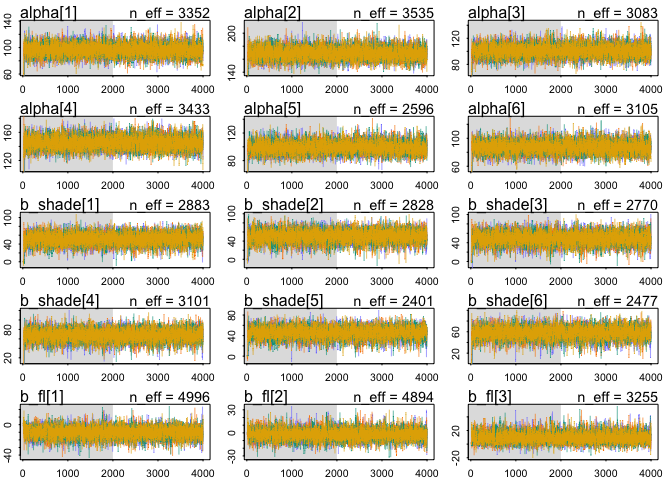
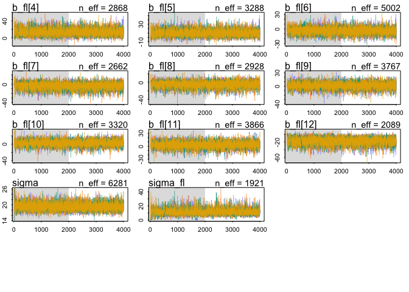
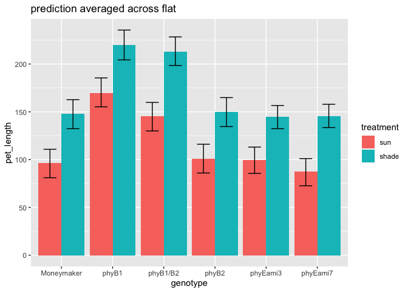
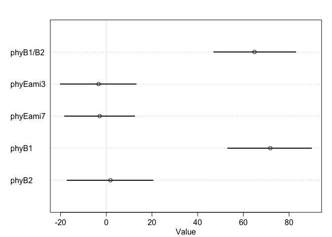

# 13. Models with memory


Please find attached csv.  This csv has measurements of tomato internodes and petioles from wildtype (Moneymaker) and various phytochrome mutant lines.  Measurements were made at 3 time points, 21, 28, and 35 days after germination under two treatments, simulated sun and simulated shade.

for today let's focus on day 35.  Also let's focus on total stem length.  So: first

# Q1)
## a) subset the data for day 35

```r
F4phyE<-read_csv("../figure4phyE.csv")
```

```
## Parsed with column specification:
## cols(
##   genotype = col_character(),
##   treatment = col_character(),
##   flat = col_double(),
##   day = col_double(),
##   epi = col_double(),
##   int1 = col_double(),
##   int2 = col_double(),
##   int3 = col_double(),
##   pet1 = col_double(),
##   pet2 = col_double(),
##   pet3 = col_double(),
##   pet4 = col_double()
## )
```

```r
summary(F4phyE)
```

```
##    genotype          treatment              flat            day    
##  Length:264         Length:264         Min.   :1.000   Min.   :21  
##  Class :character   Class :character   1st Qu.:2.000   1st Qu.:21  
##  Mode  :character   Mode  :character   Median :3.000   Median :28  
##                                        Mean   :3.455   Mean   :28  
##                                        3rd Qu.:5.000   3rd Qu.:35  
##                                        Max.   :6.000   Max.   :35  
##       epi             int1             int2             int3       
##  Min.   : 2.73   Min.   : 0.240   Min.   :  0.00   Min.   : 0.000  
##  1st Qu.:11.42   1st Qu.: 2.748   1st Qu.:  0.00   1st Qu.: 0.000  
##  Median :24.59   Median :14.635   Median :  7.58   Median : 2.755  
##  Mean   :28.00   Mean   :18.643   Mean   : 16.03   Mean   : 9.289  
##  3rd Qu.:37.48   3rd Qu.:30.532   3rd Qu.: 25.41   3rd Qu.:15.880  
##  Max.   :87.74   Max.   :71.270   Max.   :104.74   Max.   :56.700  
##       pet1            pet2             pet3            pet4       
##  Min.   : 6.23   Min.   : 0.000   Min.   : 0.00   Min.   : 0.000  
##  1st Qu.:15.19   1st Qu.: 5.577   1st Qu.: 0.00   1st Qu.: 0.000  
##  Median :38.78   Median :28.250   Median :13.19   Median : 3.455  
##  Mean   :37.97   Mean   :32.788   Mean   :24.59   Mean   :13.569  
##  3rd Qu.:52.47   3rd Qu.:53.197   3rd Qu.:48.82   3rd Qu.:27.302  
##  Max.   :91.87   Max.   :96.230   Max.   :98.57   Max.   :72.120
```

```r
F4phyE.day35 <- F4phyE %>% filter(day==35)
summary(F4phyE.day35)
```

```
##    genotype          treatment              flat            day    
##  Length:88          Length:88          Min.   :1.000   Min.   :35  
##  Class :character   Class :character   1st Qu.:2.000   1st Qu.:35  
##  Mode  :character   Mode  :character   Median :3.000   Median :35  
##                                        Mean   :3.455   Mean   :35  
##                                        3rd Qu.:5.000   3rd Qu.:35  
##                                        Max.   :6.000   Max.   :35  
##       epi             int1            int2             int3      
##  Min.   :10.94   Min.   : 3.02   Min.   : 10.75   Min.   : 8.79  
##  1st Qu.:29.08   1st Qu.:28.01   1st Qu.: 23.95   1st Qu.:15.98  
##  Median :37.36   Median :35.12   Median : 36.20   Median :24.72  
##  Mean   :41.40   Mean   :36.50   Mean   : 38.50   Mean   :24.85  
##  3rd Qu.:50.62   3rd Qu.:45.85   3rd Qu.: 48.99   3rd Qu.:31.67  
##  Max.   :87.74   Max.   :71.27   Max.   :104.74   Max.   :56.70  
##       pet1            pet2            pet3            pet4      
##  Min.   :32.52   Min.   : 0.00   Min.   :18.52   Min.   :10.83  
##  1st Qu.:51.14   1st Qu.:53.29   1st Qu.:49.33   1st Qu.:27.41  
##  Median :60.62   Median :65.34   Median :58.30   Median :34.99  
##  Mean   :60.26   Mean   :65.52   Mean   :60.12   Mean   :36.29  
##  3rd Qu.:68.91   3rd Qu.:79.04   3rd Qu.:71.24   3rd Qu.:43.87  
##  Max.   :91.87   Max.   :96.23   Max.   :98.57   Max.   :72.12
```

b) create a new column "stem_length" that is the sum of epi, int1, int2, and int3

```r
F4phyE.day35.v2 <- F4phyE.day35 %>% mutate(stem_length=epi+int1+int2+int3) # %>% View()
F4phyE.day35.v2
```

```
## # A tibble: 88 x 13
##    genotype treatment  flat   day   epi  int1  int2  int3  pet1  pet2  pet3
##    <chr>    <chr>     <dbl> <dbl> <dbl> <dbl> <dbl> <dbl> <dbl> <dbl> <dbl>
##  1 phyB1/B2 shade         1    35  58.8 40.6   72.3  52.7  42.2  49.6  49.6
##  2 phyB1/B2 shade         1    35  69.6  4.91  56.6  35.5  49.8  34.6  47.6
##  3 phyB1/B2 shade         2    35  70.2 62.6   59.7  31.2  46.3  56.8  47.9
##  4 phyB1/B2 shade         3    35  54.6 38.6   67.6  35.2  39.1  66.6  68.8
##  5 phyB1/B2 shade         3    35  58.2 55.3  105.   40.0  44.8  65.3  60.6
##  6 phyB1/B2 shade         5    35  59.9 58.7   74.8  33.3  36.4  39.3  50.7
##  7 phyB1/B2 sun           1    35  37.4 28.1   32.3  15.4  32.5  39.8  45.4
##  8 phyB1/B2 sun           1    35  66.5 36.1   25.8  19.1  50.5  49.3  49.6
##  9 phyB1/B2 sun           2    35  44.0  3.02  37.0  12.2  36.1  40.6  29.9
## 10 phyB1/B2 sun           3    35  67.7 41.2   30.4  20.6  45.8  53.2  44.3
## # … with 78 more rows, and 2 more variables: pet4 <dbl>, stem_length <dbl>
```

c) although flats are listed as 1-6, flats in sun and shade are separate. Create a new column "flat2" that corrects for this.

```r
F4phyE.day35.v3 <- F4phyE.day35.v2 %>% unite("flat2",c("treatment","flat"),sep="_", remove=FALSE)
F4phyE.day35.v3
```

```
## # A tibble: 88 x 14
##    genotype flat2 treatment  flat   day   epi  int1  int2  int3  pet1  pet2
##    <chr>    <chr> <chr>     <dbl> <dbl> <dbl> <dbl> <dbl> <dbl> <dbl> <dbl>
##  1 phyB1/B2 shad… shade         1    35  58.8 40.6   72.3  52.7  42.2  49.6
##  2 phyB1/B2 shad… shade         1    35  69.6  4.91  56.6  35.5  49.8  34.6
##  3 phyB1/B2 shad… shade         2    35  70.2 62.6   59.7  31.2  46.3  56.8
##  4 phyB1/B2 shad… shade         3    35  54.6 38.6   67.6  35.2  39.1  66.6
##  5 phyB1/B2 shad… shade         3    35  58.2 55.3  105.   40.0  44.8  65.3
##  6 phyB1/B2 shad… shade         5    35  59.9 58.7   74.8  33.3  36.4  39.3
##  7 phyB1/B2 sun_1 sun           1    35  37.4 28.1   32.3  15.4  32.5  39.8
##  8 phyB1/B2 sun_1 sun           1    35  66.5 36.1   25.8  19.1  50.5  49.3
##  9 phyB1/B2 sun_2 sun           2    35  44.0  3.02  37.0  12.2  36.1  40.6
## 10 phyB1/B2 sun_3 sun           3    35  67.7 41.2   30.4  20.6  45.8  53.2
## # … with 78 more rows, and 3 more variables: pet3 <dbl>, pet4 <dbl>,
## #   stem_length <dbl>
```


Ultimately you want to know if any of the mutants have a different length from Moneymaker, in sun or in shade, or if the response to shade differs.

```r
# sun treatment is zero or one
dat_list.Q1.zero.one<- list(
    stem_length = F4phyE.day35.v3$stem_length,
    genotype = as.integer(factor(F4phyE.day35.v3$genotype,levels=c("Moneymaker", 
                                            "phyB1", 
                                            "phyB2", 
                                            "phyB1/B2", 
                                            "phyEami3", 
                                            "phyEami7"))),
    flat_id = as.integer(factor(F4phyE.day35.v3$flat2,levels=c("shade_1",
                                                            "shade_2",
                                                            "shade_3",
                                                            "shade_4",
                                                            "shade_5",
                                                            "shade_6",
                                                            "sun_1",
                                                            "sun_2",
                                                            "sun_3",
                                                            "sun_4",
                                                            "sun_5",
                                                            "sun_6"))),
    treatment = ifelse(F4phyE.day35.v3$treatment=="sun",0,1)) 
# sun treatment is 1 or 2.
dat_list.Q1.one.two<- list(
    stem_length = F4phyE.day35.v3$stem_length,
    genotype = as.integer(factor(F4phyE.day35.v3$genotype,levels=c("Moneymaker", 
                                            "phyB1", 
                                            "phyB2", 
                                            "phyB1/B2", 
                                            "phyEami3", 
                                            "phyEami7"))),
    flat_id = as.integer(factor(F4phyE.day35.v3$flat2,levels=c("shade_1",
                                                            "shade_2",
                                                            "shade_3",
                                                            "shade_4",
                                                            "shade_5",
                                                            "shade_6",
                                                            "sun_1",
                                                            "sun_2",
                                                            "sun_3",
                                                            "sun_4",
                                                            "sun_5",
                                                            "sun_6"))),
    treatment = ifelse(F4phyE.day35.v3$treatment=="sun",1,2)) 
# "sun" is 1, "shade" is 2
dat_list.Q1.zero.one
```

```
## $stem_length
##  [1] 224.42 166.62 223.74 196.05 258.18 226.65 113.30 147.57  96.18 159.95
## [11] 166.98 172.89  87.43 145.75 190.81 149.81 166.10 175.33  84.03  84.03
## [21] 100.18 117.38  74.19  92.12 128.97 108.65 172.52 162.98 148.48 117.70
## [31]  98.14  94.51  71.72 134.57 110.30 163.71 173.64 125.55 146.97  87.37
## [41]  92.29  51.71 143.75 163.07 166.23 148.02 147.45 172.36  90.35  86.28
## [51]  77.33  91.59 215.01 217.62 264.39 254.22 222.57 200.79 190.93 156.71
## [61] 173.01 200.15 153.91 127.99 158.61 190.66 157.54 197.49 120.22  99.41
## [71] 108.67 102.93 101.29  97.56  64.59  85.01 163.40 151.09 138.83 158.88
## [81] 137.04 166.08  92.17  92.26  96.14  92.84  88.03  95.55
## 
## $genotype
##  [1] 4 4 4 4 4 4 4 4 4 4 4 4 5 5 5 5 5 5 5 5 5 5 5 5 5 5 5 5 5 5 5 5 5 6 6 6 6 6
## [39] 6 6 6 6 6 6 6 6 6 6 6 6 6 6 2 2 2 2 2 2 2 2 2 2 2 2 3 3 3 3 3 3 3 3 3 3 3 3
## [77] 1 1 1 1 1 1 1 1 1 1 1 1
## 
## $flat_id
##  [1]  1  1  2  3  3  5  7  7  8  9  9 11  1  2  5  5  6  6  7  8 11 11 12 12  1
## [26]  1  4  5  5  6  7  7 12  2  2  3  4  5  6  8 10 12  1  2  3  3  4  6  7  9
## [51]  9 10  2  4  4  4  5  6  8 10 10 10 11 12  1  3  4  5  6  6  7  9 10 11 12
## [76] 12  1  2  2  3  3  4  7  8  8  9  9 10
## 
## $treatment
##  [1] 1 1 1 1 1 1 0 0 0 0 0 0 1 1 1 1 1 1 0 0 0 0 0 0 1 1 1 1 1 1 0 0 0 1 1 1 1 1
## [39] 1 0 0 0 1 1 1 1 1 1 0 0 0 0 1 1 1 1 1 1 0 0 0 0 0 0 1 1 1 1 1 1 0 0 0 0 0 0
## [77] 1 1 1 1 1 1 0 0 0 0 0 0
```

```r
# 
str(ifelse(F4phyE.day35.v3$treatment=="sun",0,1)) # numeric
```

```
##  num [1:88] 1 1 1 1 1 1 0 0 0 0 ...
```

```r
str(ifelse(F4phyE.day35.v3$treatment=="sun",0L,1L)) # integer
```

```
##  int [1:88] 1 1 1 1 1 1 0 0 0 0 ...
```

# look the raw data

```r
str(F4phyE.day35.v3)
```

```
## Classes 'tbl_df', 'tbl' and 'data.frame':	88 obs. of  14 variables:
##  $ genotype   : chr  "phyB1/B2" "phyB1/B2" "phyB1/B2" "phyB1/B2" ...
##  $ flat2      : chr  "shade_1" "shade_1" "shade_2" "shade_3" ...
##  $ treatment  : chr  "shade" "shade" "shade" "shade" ...
##  $ flat       : num  1 1 2 3 3 5 1 1 2 3 ...
##  $ day        : num  35 35 35 35 35 35 35 35 35 35 ...
##  $ epi        : num  58.8 69.5 70.2 54.6 58.2 ...
##  $ int1       : num  40.6 4.91 62.61 38.64 55.31 ...
##  $ int2       : num  72.3 56.6 59.7 67.6 104.7 ...
##  $ int3       : num  52.7 35.5 31.2 35.2 40 ...
##  $ pet1       : num  42.1 49.8 46.3 39.1 44.9 ...
##  $ pet2       : num  49.6 34.6 56.8 66.6 65.3 ...
##  $ pet3       : num  49.6 47.6 47.9 68.8 60.6 ...
##  $ pet4       : num  30.5 40.5 28.4 53.2 43.5 ...
##  $ stem_length: num  224 167 224 196 258 ...
```

```r
F4phyE.day35.v3$treatment <-factor(F4phyE.day35.v3$treatment,levels=c("sun","shade"))
F4phyE.day35.v3 %>% View()
F4phyE.day35.v3 %>% ggplot(aes(x=treatment, y=stem_length,color=treatment)) + geom_jitter() + facet_grid(.~genotype)
```

<!-- -->

```r
# sample numbers (pivot table, tidyverse way)
F4phyE.day35.v3 %>% group_by(genotype,treatment,flat) %>% summarize(num=n()) %>% spread(flat,num)
```

```
## # A tibble: 12 x 8
## # Groups:   genotype, treatment [12]
##    genotype   treatment   `1`   `2`   `3`   `4`   `5`   `6`
##    <chr>      <fct>     <int> <int> <int> <int> <int> <int>
##  1 Moneymaker sun           1     2     2     1    NA    NA
##  2 Moneymaker shade         1     2     2     1    NA    NA
##  3 phyB1      sun          NA     1    NA     3     1     1
##  4 phyB1      shade        NA     1    NA     3     1     1
##  5 phyB1/B2   sun           2     1     2    NA     1    NA
##  6 phyB1/B2   shade         2     1     2    NA     1    NA
##  7 phyB2      sun           1    NA     1     1     1     2
##  8 phyB2      shade         1    NA     1     1     1     2
##  9 phyEami3   sun           3     1    NA    NA     2     3
## 10 phyEami3   shade         3     1    NA     1     4     3
## 11 phyEami7   sun           1     1     2     2    NA     1
## 12 phyEami7   shade         1     3     3     2     1     2
```

```r
# incomplete block design
with(F4phyE.day35.v3, table(genotype,flat,treatment)) # traditional way, creating list
```

```
## , , treatment = sun
## 
##             flat
## genotype     1 2 3 4 5 6
##   Moneymaker 1 2 2 1 0 0
##   phyB1      0 1 0 3 1 1
##   phyB1/B2   2 1 2 0 1 0
##   phyB2      1 0 1 1 1 2
##   phyEami3   3 1 0 0 2 3
##   phyEami7   1 1 2 2 0 1
## 
## , , treatment = shade
## 
##             flat
## genotype     1 2 3 4 5 6
##   Moneymaker 1 2 2 1 0 0
##   phyB1      0 1 0 3 1 1
##   phyB1/B2   2 1 2 0 1 0
##   phyB2      1 0 1 1 1 2
##   phyEami3   3 1 0 1 4 3
##   phyEami7   1 3 3 2 1 2
```

* Looks there are treatment effects are genotype effects.

# Q2) Fit 3 models, all of which include genotype and treatment
* Data format depends on indexing or not.

Q2: a) do not include flat

## ModelQ1.a.wrong
* Kazu'Q: When\ logit\ should\ be\ used? \\
* Use logit when value is between 0 and 1, likely probability. (correct?)
* So this is wrong

$$
stem_length_i \sim Normal(0,p) \\
logit(p) = \alpha_{genotype} + \beta_{treatment} \\
\alpha_{group} \sim Normal(0, 1) \\
\beta_{treatment} \sim Normal(0, 1)
$$

# wrong model with logit

```r
set.seed(15)
# error
mQ2.a.zero.one <- ulam(
    alist(
        stem_length ~ dnorm( 1 , p),
        logit(p) <- a[genotype] + b[treatment],
        b[treatment] ~ dnorm( 0 , 1),
        a[genotype] ~ dnorm(0 , 1)
    ), data=dat_list.Q1.zero.one , chains=2 , cores=2 , log_lik=TRUE )
# no error, why?
mQ1.a.one.two <- ulam(
    alist(
        stem_length ~ dnorm( 1 , p),
        logit(p) <- a[genotype] + b[treatment],
        b[treatment] ~ dnorm( 0 , 1),
        a[genotype] ~ dnorm(0 , 1)
    ), data=dat_list.Q1,one.two , chains=2 , cores=2 , log_lik=TRUE )
```

# Use normal distribution with mu and sigma also intercept
## # mQ1.a2  intercept two treatment (no interaction)
* Is this correct formula?

$$
stem\_length \sim Normal(mu,sigma) \\
mu_{genotype},_{treatment} = \alpha_{genotype} + \beta\_g_{genotype}*genotype + \beta\_t_{treatment}*treatment \\
\alpha_{genotype} \sim Normal(140,50) , for\ genotype\\
\beta\_g_{genotype} \sim Normal(0, 1) , for\ genotype\\
\beta\_t_{treatment} \sim Normal(0, 1) , for\ treatment \\
\sigma \sim Exponential(0,1)
$$


```r
# estimate intercept using mean?. How to translate into ulam() format for alpha genotype? Using index is easy?
F4phyE.day35.v3 %>% summarize(mean(stem_length),sd(stem_length)) # 141 48.5
# this use common alpha
mQ2.a2.nonindex.zero.one <- ulam(
    alist(
        stem_length ~ dnorm(mu , sigma),
        mu <- alpha + b_g*genotype + b_t*treatment,
        alpha ~ dnorm(140,50),
        b_g ~ dnorm( 0 , 1),
        b_t ~ dnorm(0 , 1),
        sigma ~ dexp( 1 )
    ), data=dat_list.Q1.zero.one , chains=2 , cores=2 , log_lik=TRUE )

precis(mQ1.a2.nonindex.zero.one,depth=2)
pairs(mQ1.a2.nonindex.zero.one)
```


```r
mQ2.a2.index.one.two <- ulam(
    alist(
        stem_length ~ dnorm(mu , sigma),
        mu <- alpha[genotype] + b_g*[genotype] + b_t*treatment,
        alpha[genotype] ~ dnorm(140,50),
        b_g~ dnorm( 0 , 1),
        b_t ~ dnorm(0 , 1),
        sigma ~ dexp( 1 )), data=dat_list.Q1.one.two , chains=2 , cores=2 , log_lik=TRUE )

precis(mQ1.a2.nonindex.one.two,depth=2)
```

# 

$$
stem\_length \sim Normal(mu,sigma) \\
mu_{genotype},_{treatment} = \alpha + \beta\_g_{genotype}*genotype + \beta\_t_{treatment}*treatment \\
\alpha \sim Normal(140,50) , common\\
\beta\_g_{genotype} \sim Normal(0, 1) , for\ genotype\\
\beta\_t_{treatment} \sim Normal(0, 1) , for\ treatment \\
\sigma \sim Exponential(0,1)
$$
# 

```r
mQ2.a2.index.zero.one <- ulam(
    alist(
        stem_length ~ dnorm(mu , sigma),
        mu <- alpha + b_g[genotype] + b_t*treatment,
        alpha ~ dnorm(140,50),
        b_g[genotype] ~ dnorm( 0 , 1),
        b_t ~ dnorm(0 , 1),
        sigma ~ dexp( 1 )
    ), data=dat_list.Q1.zero.one , chains=2 , cores=2 , log_lik=TRUE )

precis(mQ1.a2.index.zero.one,depth=2)
compare(mQ1.a2.zero.one,mQ1.a2.index.zero.one)
```


```r
mQ2.a2.index.one.two <- ulam(
    alist(
        stem_length ~ dnorm(mu , sigma),
        mu <- alpha + b_g[genotype] + b_t*treatment,
        alpha ~ dnorm(140,50),
        b_g[genotype] ~ dnorm( 0 , 1),
        b_t ~ dnorm(0 , 1),
        sigma ~ dexp( 1 )
    ), data=dat_list.Q1.one.two , chains=2 , cores=2 , log_lik=TRUE )

precis(mQ1.a2.index.one.two,depth=2)
```


```r
mQ2.a2.trtindex.zero.one <- ulam(
    alist(
        stem_length ~ dnorm(mu , sigma),
        mu <- alpha + b_g*genotype + b_t[treatment],
        alpha ~ dnorm(140,50),
        b_g ~ dnorm( 0 , 1),
        b_t[treatment] ~ dnorm(0 , 1),
        sigma ~ dexp( 1 )
    ), data=dat_list.Q1.zero.one , chains=2 , cores=2 , log_lik=TRUE )
# error. "indexing" is not copatible with "0".
precis(mQ1.a2.trtindex.zero.one,depth=2)
```


```r
mQ2.a2.trtindex.one.two <- ulam(
    alist(
        stem_length ~ dnorm(mu , sigma),
        mu <- alpha + b_g*genotype + b_t[treatment],
        alpha ~ dnorm(140,50),
        b_g ~ dnorm( 0 , 1),
        b_t[treatment] ~ dnorm(0 , 1),
        sigma ~ dexp( 1 )
    ), data=dat_list.Q1.one.two , chains=2 , cores=2 , log_lik=TRUE )

precis(mQ1.a2.trtindex.one.two,depth=2)
```

* indexing gt as well as treatment

```r
mQ1.a2.trtgtindex.one.two <- ulam(
    alist(
        stem_length ~ dnorm(mu , sigma),
        mu <- alpha + b_g[genotype] + b_t[treatment],
        alpha ~ dnorm(140,50),
        b_g[genotype] ~ dnorm( 0 , 1),
        b_t[treatment] ~ dnorm(0 , 1),
        sigma ~ dexp( 1 )
    ), data=dat_list.Q1.one.two , chains=2 , cores=2 , log_lik=TRUE )

precis(mQ1.a2.trtgtindex.one.two,depth=2)
```


# how about to no intercept?
## # mQ1.a3  no intercept, two treatment (no interaction)

$$
stem\_length \sim Normal(mu,sigma) \\
mu =   \beta\_g_{genotype} + \beta\_t_{treatment} \\
\alpha \sim Normal(140,50) \\
\beta\_g \sim Normal(0, 1) \\
\beta\_t_ \sim Normal(0, 1) \\
\sigma \sim Exponential(0,1)
$$

```r
mQ2.a3.nonindex.zero.one <- ulam(
    alist(
        stem_length ~ dnorm(mu , sigma),
        mu <- b_g*genotype + b_t*treatment,
        b_g ~ dnorm( 0 , 1),
        b_t ~ dnorm(0 , 1),
        sigma ~ dexp( 1 )
    ), data=dat_list.Q1.zero.one , chains=2 , cores=2 , log_lik=TRUE )

precis(mQ1.a3.nonindex.zero.one,depth=2)
pairs(mQ1.a3.nonindex.zero.one)
compare(mQ1.a2.nonindex.zero.one,mQ1.a3.nonindex.zero.one)
# no intercept is worse.
```

# interaction model
* Is this correct model description? with no index way?

$$
stem\_length \sim Normal(mu,sigma) \\
mu =  \alpha +  \beta\_g_{genotype} + \beta\_t_{treatment} + \beta\_gt_{genotype*treatment} \\
\alpha \sim Normal(140,50) \\
\beta\_g \sim Normal(0, 1) \\
\beta\_t_ \sim Normal(0, 1) \\
\beta\_gt_ \sim Normal(0, 1) \\
\sigma \sim Exponential(0,1)
$$

```r
mQ1.a4.nonindex.zero.one <- ulam(
    alist(
        stem_length ~ dnorm(mu , sigma),
        mu <- alpha + b_g*genotype + b_t*treatment + b_gt*genotype*treatment,
        alpha ~ dnorm(140,50),
        b_g ~ dnorm( 0 , 1),
        b_t ~ dnorm(0 , 1),
        b_gt ~ dnorm(0, 1),
        sigma ~ dexp( 1 )
    ), data=dat_list.Q1.zero.one , chains=2 , cores=2 , log_lik=TRUE )

precis(mQ1.a4.nonindex.zero.one,depth=2)
compare(mQ1.a2.nonindex.zero.one,mQ1.a4.nonindex.zero.one)
# little improvement
pairs(mQ1.a4.nonindex.zero.one) # I could see negative correlation between alpha and b_g, but not b_gt.
```


# using index method for interaction model (only genotype is indexed)
$$
stem\_length \sim Normal(mu,sigma) \\
mu =  \alpha_{genotype} +  \beta\_g_{genotype}*genotype + \beta\_t_{treatment}*treatment + \beta\_gt_{genotype*treatment}*genotype*treatment \\
\alpha \sim Normal(140,50) \\
\beta\_g \sim Normal(0, 1) \\
\beta\_t_ \sim Normal(0, 1) \\
\beta\_gt_ \sim Normal(0, 1) \\
\sigma \sim Exponential(0,1)
$$


```r
mQ1.a4.gtindex.one.two <- ulam(
    alist(
        stem_length ~ dnorm(mu , sigma),
        mu <- alpha + b_g[genotype] + b_t*treatment + b_gt[genotype]*treatment,
        alpha ~ dnorm(140,50),
        b_g[genotype] ~ dnorm( 0 , 1),
        b_t ~ dnorm(0 , 1),
        b_gt[genotype] ~ dnorm (0,1),
        sigma ~ dexp( 1 )
    ), data=dat_list.Q1.one.two , chains=2 , cores=2 , log_lik=TRUE )
# Julin's priors
mQ2.a4.gtindex.one.two.2 <- ulam(
    alist(
        stem_length ~ dnorm(mu , sigma),
        mu <- alpha + b_g[genotype] + b_t*treatment + b_gt[genotype]*treatment,
        alpha ~ dnorm(125,50),
        b_g[genotype] ~ dnorm( 0 , 50),
        b_t ~ dnorm(0 , 50),
        b_gt[genotype] ~ dnorm (0,50),
        sigma ~ dexp( 1 )
    ), data=dat_list.Q1.one.two , chains=2 , cores=2 , log_lik=TRUE )

precis(mQ1.a4.gtindex.one.two.2,depth=2)
compare(mQ1.a4.gtindex.one.two,mQ1.a4.gtindex.one.two.2) 
pairs(mQ1.a4.gtindex.one.two.2) # different priors. Julin's priors gave me strong  negative correlation betweeen b_t and b_gts!!! And Julin's prior is better model!
compare(mQ1.a4.gtindex.one.two.2,mQ1.a4.nonindex.zero.one.2) # gt index is better than nonindex.
```

# using index method for interaction model (only genotype is indexed). no intercept

```r
mQ2.a4.gtindex.one.two.nointercept <- ulam(
    alist(
        stem_length ~ dnorm(mu , sigma),
        mu <- b_g[genotype] + b_t*treatment + b_gt[genotype]*treatment,
        #alpha ~ dnorm(140,50),
        b_g[genotype] ~ dnorm( 140 , 50),
        b_t ~ dnorm(0 , 1),
        b_gt[genotype] ~ dnorm (0,1),
        sigma ~ dexp( 1 )
    ), data=dat_list.Q1.one.two , chains=2 , cores=2 , log_lik=TRUE )

compare(mQ1.a4.gtindex.one.two.2,mQ1.a4.nonindex.zero.one.2) # gt index is better than nonindex.
```


Q3) Compare the models, which is preferred?
# model comparison

```r
compare(mQ2.a2.nonindex.zero.one,
        mQ2.a2.index.zero.one,
        mQ2.a2.nonindex.one.two,
        mQ2.a2.index.one.two,
        mQ2.a2.trtindex.one.two,
        mQ2.a2.trtgtindex.one.two)
```
* All of the same.


# Q to Julin: How did you chose your priors?


######### under construction ##########
Q2: b) include flat without pooling
* I feel I do understand what pooling is meant....
* Model description

$$
stem\_length \sim Normal(mu,sigma) \\
mu =   \beta\_g_{genotype} + \beta\_t_{treatment} + \beta\_f_{flat} \\
\beta\_g \sim Normal(140,50) \\
\beta\_t \sim Normal(0, 1) \\
\beta\_f \sim Normal(0,1) \\
\sigma \sim Exponential(0,1)
$$


```r
set.seed(15)
mQ4.b1.gtindex.one.two <- ulam(
    alist(
        stem_length ~ dnorm(mu , sigma),
        mu <- alpha + b_g[genotype] + b_t*treatment + b_gt[genotype]*treatment,
        alpha ~ dnorm(125,50),
        b_g[genotype] ~ dnorm( 0 , 50),
        b_t ~ dnorm(0 , 50),
        b_gt[genotype] ~ dnorm (0,50),
        sigma ~ dexp( 1 )
    ), data=dat_list.Q1.one.two , chains=2 , cores=2 , log_lik=TRUE )
```


Q2: c) use a hierarchical model that allows partial pooling across flats

$$
stem\_length[i] \sim Normal(mu,sigma) \\
mu[i] =   \beta\_g_{genotype[i]} + \beta\_t_{treatment[i]} \\
\alpha \sim Normal(140,50) \\
\beta\_g \sim Normal(0, 1) \\
\beta\_t \sim Normal(0, 1) \\
\sigma \sim Exponential(0,1)
$$


# Q3) Compare the models, which is preferred?

```r
compare(mQ1.a,mQ1.b,mQ1.c)
```

######## work with Julin's model and come back above later ########

```r
data <- read_csv(file.path("..","figure4phyE.csv"))
```

```
## Parsed with column specification:
## cols(
##   genotype = col_character(),
##   treatment = col_character(),
##   flat = col_double(),
##   day = col_double(),
##   epi = col_double(),
##   int1 = col_double(),
##   int2 = col_double(),
##   int3 = col_double(),
##   pet1 = col_double(),
##   pet2 = col_double(),
##   pet3 = col_double(),
##   pet4 = col_double()
## )
```

```r
data35 <- data %>%
  filter(day==35) %>%
  mutate(stem_length=epi + int1 + int2 + int3,
         flat2=as.integer(as.factor(str_c(treatment, flat))),
         shade_i=ifelse(treatment=="sun", 0L, 1L),
         g_i= as.integer(factor(genotype,
                                   levels=c("Moneymaker", 
                                            "phyB1", 
                                            "phyB2", 
                                            "phyB1/B2", 
                                            "phyEami3", 
                                            "phyEami7")))) %>%
  select(genotype, treatment, g_i, shade_i, flat2, stem_length)
data35
```

```
## # A tibble: 88 x 6
##    genotype treatment   g_i shade_i flat2 stem_length
##    <chr>    <chr>     <int>   <int> <int>       <dbl>
##  1 phyB1/B2 shade         4       1     1       224. 
##  2 phyB1/B2 shade         4       1     1       167. 
##  3 phyB1/B2 shade         4       1     2       224. 
##  4 phyB1/B2 shade         4       1     3       196. 
##  5 phyB1/B2 shade         4       1     3       258. 
##  6 phyB1/B2 shade         4       1     5       227. 
##  7 phyB1/B2 sun           4       0     7       113. 
##  8 phyB1/B2 sun           4       0     7       148. 
##  9 phyB1/B2 sun           4       0     8        96.2
## 10 phyB1/B2 sun           4       0     9       160. 
## # … with 78 more rows
```

```r
datsmall <- data35 %>% select(stem_length, shade_i, g_i, flat2) # Julin's version
# from my data
#datsmall<-dat_list.Q1.zero.one %>%  bind_cols() %>% rename(shade_i=treatment, g_i=genotype,flat2=flat_id) 
  # convert mine to Julin's version (not necessary to be list object)

mq2c2 <- ulam(alist(stem_length ~ dnorm(mu,sigma),
                  mu <- alpha[g_i] + b_shade[g_i]*shade_i + b_fl[flat2],
                  alpha[g_i] ~ dnorm(125,50),
                  b_shade[g_i] ~ dnorm(0, 50),
                  b_fl[flat2] ~ dnorm(0,sigma_fl),
                  sigma ~ dexp(1),
                  sigma_fl ~ dcauchy(0,3)),
            data=datsmall,
            chains=4,
            cores=2,
            iter=4000,
            log_lik = TRUE)
precis(mq2c2, depth=2)
```

```
##                  mean        sd       5.5%      94.5%    n_eff    Rhat4
## alpha[1]    96.328774  9.450916  81.581582 111.461893 3351.678 1.001916
## alpha[2]   169.396292  9.479715 154.537307 184.962307 3535.303 1.001163
## alpha[3]   100.936482  9.519877  86.319529 116.431498 3082.719 1.001348
## alpha[4]   145.284736  9.403777 130.585458 160.628804 3433.118 1.001159
## alpha[5]    99.417129  8.726908  86.155240 113.850782 2595.760 1.001669
## alpha[6]    87.393098  8.981113  73.323629 102.115083 3104.961 1.000547
## b_shade[1]  51.720661 13.435432  29.856747  72.597209 2882.947 1.001036
## b_shade[2]  50.434204 13.608847  28.692575  71.656569 2827.880 1.000490
## b_shade[3]  48.934933 13.550091  26.576455  70.117436 2770.092 1.000798
## b_shade[4]  67.630919 13.256081  45.986281  88.491944 3100.997 1.001023
## b_shade[5]  45.273057 11.718892  25.548828  63.021828 2400.779 1.001149
## b_shade[6]  57.781108 11.953188  38.171783  76.020980 2476.671 1.000099
## b_fl[1]    -10.326342  7.531694 -22.719190   1.334908 4996.017 1.000319
## b_fl[2]     -2.101139  7.463777 -13.695744   9.893656 4893.929 1.000352
## b_fl[3]      9.996111  8.210727  -1.618198  23.785268 3254.622 1.000080
## b_fl[4]     14.270773  8.623838   1.620831  28.878120 2868.225 1.000498
## b_fl[5]     10.507180  8.070905  -1.287283  24.015171 3288.471 1.000414
## b_fl[6]     -3.678949  7.318220 -15.184329   8.091582 5002.094 1.000054
## b_fl[7]     -4.327076  7.719574 -17.660093   7.128836 2661.778 1.001511
## b_fl[8]     -5.413020  8.125413 -19.312937   6.560501 2927.694 1.000877
## b_fl[9]      1.288267  7.685694 -11.449065  13.274629 3766.606 1.001208
## b_fl[10]     2.691157  7.608185  -9.682129  14.541881 3320.087 1.000742
## b_fl[11]     2.973769  7.911129  -9.590184  15.553583 3866.017 1.001141
## b_fl[12]   -18.674322  9.624866 -34.807159  -4.311080 2088.739 1.001550
## sigma       19.294142  1.449285  17.152473  21.744997 6280.954 1.000538
## sigma_fl    11.691530  4.528964   5.585445  19.502189 1920.657 1.001240
```

```r
traceplot(mq2c2, ask=FALSE)
```

```
## Waiting to draw page 2 of 2
```

<!-- -->

```r
pairs(mq2c2) # Error in plot.new() : figure margins too large
```

<!-- --><!-- -->

```r
# alternate of pairs (by Julin)
extract.samples(mq2c2) %>%
  as.data.frame() %>%
  cor() %>%
  round(2)
```

```
##           alpha.1 alpha.2 alpha.3 alpha.4 alpha.5 alpha.6 b_shade.1 b_shade.2
## alpha.1      1.00    0.25    0.25    0.31    0.28    0.34     -0.70     -0.20
## alpha.2      0.25    1.00    0.28    0.25    0.31    0.29     -0.18     -0.69
## alpha.3      0.25    0.28    1.00    0.30    0.41    0.32     -0.19     -0.23
## alpha.4      0.31    0.25    0.30    1.00    0.33    0.31     -0.22     -0.19
## alpha.5      0.28    0.31    0.41    0.33    1.00    0.33     -0.22     -0.27
## alpha.6      0.34    0.29    0.32    0.31    0.33    1.00     -0.25     -0.22
## b_shade.1   -0.70   -0.18   -0.19   -0.22   -0.22   -0.25      1.00      0.29
## b_shade.2   -0.20   -0.69   -0.23   -0.19   -0.27   -0.22      0.29      1.00
## b_shade.3   -0.19   -0.20   -0.71   -0.21   -0.31   -0.22      0.28      0.32
## b_shade.4   -0.22   -0.18   -0.23   -0.70   -0.25   -0.22      0.31      0.27
## b_shade.5   -0.22   -0.24   -0.32   -0.25   -0.75   -0.25      0.31      0.37
## b_shade.6   -0.26   -0.22   -0.26   -0.23   -0.28   -0.77      0.37      0.35
## b_fl.1      -0.05   -0.06   -0.07   -0.04   -0.10   -0.06     -0.18     -0.09
## b_fl.2       0.00   -0.02   -0.01   -0.01    0.01   -0.02     -0.32     -0.24
## b_fl.3       0.04    0.04    0.08    0.04    0.11    0.08     -0.36     -0.28
## b_fl.4       0.05    0.05    0.10    0.06    0.15    0.07     -0.31     -0.44
## b_fl.5       0.03    0.05    0.09    0.04    0.12    0.04     -0.24     -0.34
## b_fl.6      -0.01   -0.02   -0.01   -0.02   -0.01   -0.03     -0.19     -0.25
## b_fl.7      -0.35   -0.27   -0.41   -0.46   -0.54   -0.39      0.28      0.24
## b_fl.8      -0.47   -0.35   -0.30   -0.38   -0.39   -0.39      0.35      0.29
## b_fl.9      -0.43   -0.25   -0.33   -0.43   -0.28   -0.43      0.31      0.18
## b_fl.10     -0.33   -0.49   -0.31   -0.26   -0.28   -0.43      0.23      0.33
## b_fl.11     -0.22   -0.33   -0.34   -0.32   -0.42   -0.24      0.15      0.22
## b_fl.12     -0.27   -0.35   -0.48   -0.29   -0.57   -0.38      0.25      0.35
## sigma        0.01   -0.02   -0.02    0.01   -0.07    0.02      0.00      0.05
## sigma_fl     0.17    0.18    0.28    0.18    0.36    0.24     -0.27     -0.35
##           b_shade.3 b_shade.4 b_shade.5 b_shade.6 b_fl.1 b_fl.2 b_fl.3 b_fl.4
## alpha.1       -0.19     -0.22     -0.22     -0.26  -0.05   0.00   0.04   0.05
## alpha.2       -0.20     -0.18     -0.24     -0.22  -0.06  -0.02   0.04   0.05
## alpha.3       -0.71     -0.23     -0.32     -0.26  -0.07  -0.01   0.08   0.10
## alpha.4       -0.21     -0.70     -0.25     -0.23  -0.04  -0.01   0.04   0.06
## alpha.5       -0.31     -0.25     -0.75     -0.28  -0.10   0.01   0.11   0.15
## alpha.6       -0.22     -0.22     -0.25     -0.77  -0.06  -0.02   0.08   0.07
## b_shade.1      0.28      0.31      0.31      0.37  -0.18  -0.32  -0.36  -0.31
## b_shade.2      0.32      0.27      0.37      0.35  -0.09  -0.24  -0.28  -0.44
## b_shade.3      1.00      0.30      0.42      0.35  -0.18  -0.19  -0.32  -0.34
## b_shade.4      0.30      1.00      0.34      0.33  -0.26  -0.25  -0.34  -0.24
## b_shade.5      0.42      0.34      1.00      0.39  -0.22  -0.26  -0.31  -0.37
## b_shade.6      0.35      0.33      0.39      1.00  -0.16  -0.32  -0.42  -0.37
## b_fl.1        -0.18     -0.26     -0.22     -0.16   1.00   0.33   0.25   0.15
## b_fl.2        -0.19     -0.25     -0.26     -0.32   0.33   1.00   0.38   0.33
## b_fl.3        -0.32     -0.34     -0.31     -0.42   0.25   0.38   1.00   0.48
## b_fl.4        -0.34     -0.24     -0.37     -0.37   0.15   0.33   0.48   1.00
## b_fl.5        -0.34     -0.28     -0.45     -0.32   0.25   0.32   0.42   0.50
## b_fl.6        -0.31     -0.19     -0.33     -0.26   0.37   0.37   0.30   0.33
## b_fl.7         0.32      0.34      0.41      0.33   0.09  -0.01  -0.13  -0.14
## b_fl.8         0.23      0.29      0.32      0.33   0.07  -0.02  -0.11  -0.14
## b_fl.9         0.23      0.31      0.22      0.32   0.03   0.00  -0.03  -0.02
## b_fl.10        0.20      0.18      0.20      0.32   0.03   0.00   0.00  -0.01
## b_fl.11        0.23      0.21      0.31      0.17   0.02   0.02   0.00   0.01
## b_fl.12        0.39      0.25      0.47      0.36   0.14  -0.02  -0.24  -0.30
## sigma          0.00     -0.02      0.03     -0.01   0.13   0.02  -0.09  -0.15
## sigma_fl      -0.33     -0.24     -0.39     -0.36  -0.11   0.12   0.42   0.53
##           b_fl.5 b_fl.6 b_fl.7 b_fl.8 b_fl.9 b_fl.10 b_fl.11 b_fl.12 sigma
## alpha.1     0.03  -0.01  -0.35  -0.47  -0.43   -0.33   -0.22   -0.27  0.01
## alpha.2     0.05  -0.02  -0.27  -0.35  -0.25   -0.49   -0.33   -0.35 -0.02
## alpha.3     0.09  -0.01  -0.41  -0.30  -0.33   -0.31   -0.34   -0.48 -0.02
## alpha.4     0.04  -0.02  -0.46  -0.38  -0.43   -0.26   -0.32   -0.29  0.01
## alpha.5     0.12  -0.01  -0.54  -0.39  -0.28   -0.28   -0.42   -0.57 -0.07
## alpha.6     0.04  -0.03  -0.39  -0.39  -0.43   -0.43   -0.24   -0.38  0.02
## b_shade.1  -0.24  -0.19   0.28   0.35   0.31    0.23    0.15    0.25  0.00
## b_shade.2  -0.34  -0.25   0.24   0.29   0.18    0.33    0.22    0.35  0.05
## b_shade.3  -0.34  -0.31   0.32   0.23   0.23    0.20    0.23    0.39  0.00
## b_shade.4  -0.28  -0.19   0.34   0.29   0.31    0.18    0.21    0.25 -0.02
## b_shade.5  -0.45  -0.33   0.41   0.32   0.22    0.20    0.31    0.47  0.03
## b_shade.6  -0.32  -0.26   0.33   0.33   0.32    0.32    0.17    0.36 -0.01
## b_fl.1      0.25   0.37   0.09   0.07   0.03    0.03    0.02    0.14  0.13
## b_fl.2      0.32   0.37  -0.01  -0.02   0.00    0.00    0.02   -0.02  0.02
## b_fl.3      0.42   0.30  -0.13  -0.11  -0.03    0.00    0.00   -0.24 -0.09
## b_fl.4      0.50   0.33  -0.14  -0.14  -0.02   -0.01    0.01   -0.30 -0.15
## b_fl.5      1.00   0.37  -0.09  -0.11  -0.01   -0.01    0.01   -0.24 -0.09
## b_fl.6      0.37   1.00   0.00   0.00   0.01    0.02    0.00    0.02  0.06
## b_fl.7     -0.09   0.00   1.00   0.39   0.36    0.28    0.31    0.45  0.04
## b_fl.8     -0.11   0.00   0.39   1.00   0.32    0.33    0.27    0.39  0.04
## b_fl.9     -0.01   0.01   0.36   0.32   1.00    0.32    0.28    0.27 -0.02
## b_fl.10    -0.01   0.02   0.28   0.33   0.32    1.00    0.28    0.28 -0.03
## b_fl.11     0.01   0.00   0.31   0.27   0.28    0.28    1.00    0.29 -0.01
## b_fl.12    -0.24   0.02   0.45   0.39   0.27    0.28    0.29    1.00  0.18
## sigma      -0.09   0.06   0.04   0.04  -0.02   -0.03   -0.01    0.18  1.00
## sigma_fl    0.42   0.09  -0.34  -0.34  -0.14   -0.12   -0.10   -0.61 -0.14
##           sigma_fl
## alpha.1       0.17
## alpha.2       0.18
## alpha.3       0.28
## alpha.4       0.18
## alpha.5       0.36
## alpha.6       0.24
## b_shade.1    -0.27
## b_shade.2    -0.35
## b_shade.3    -0.33
## b_shade.4    -0.24
## b_shade.5    -0.39
## b_shade.6    -0.36
## b_fl.1       -0.11
## b_fl.2        0.12
## b_fl.3        0.42
## b_fl.4        0.53
## b_fl.5        0.42
## b_fl.6        0.09
## b_fl.7       -0.34
## b_fl.8       -0.34
## b_fl.9       -0.14
## b_fl.10      -0.12
## b_fl.11      -0.10
## b_fl.12      -0.61
## sigma        -0.14
## sigma_fl      1.00
```

# Q4) Using the hierarchical model, make posterior predictions
a) for average cluster

```r
post <- extract.samples(mq2c2) # n=1000 is default, but why 8000? coming fomr iter = 4000 in the model?
names(post)
```

```
## [1] "alpha"    "b_shade"  "b_fl"     "sigma"    "sigma_fl"
```

```r
str(post)
```

```
## List of 5
##  $ alpha   : num [1:8000, 1:6] 98.7 112.3 95.3 100.7 96.5 ...
##  $ b_shade : num [1:8000, 1:6] 29.7 43.9 41.8 40.1 27.9 ...
##  $ b_fl    : num [1:8000, 1:12] -9.36 -23.56 -16.34 1.9 1.85 ...
##  $ sigma   : num [1:8000(1d)] 18.1 20.5 20 18.9 18.6 ...
##  $ sigma_fl: num [1:8000(1d)] 18 13.1 20 18.8 17.2 ...
##  - attr(*, "source")= chr "ulam posterior: 8000 samples from mq2c2"
```
# predicted value function? (Julin)

```r
link_avg <- function(genotype, shade) {
  with(post, alpha[,genotype] + shade*b_shade[,genotype])
}
```
# create a data frame to hold the results (Julin)

```r
pred.df <- data35 %>% 
  select(-stem_length, -flat2) %>% 
  unique() %>%
  mutate(treatment=factor(treatment, levels = c("sun", "shade")) ) # so the plot order is correct
pred.df
```

```
## # A tibble: 12 x 4
##    genotype   treatment   g_i shade_i
##    <chr>      <fct>     <int>   <int>
##  1 phyB1/B2   shade         4       1
##  2 phyB1/B2   sun           4       0
##  3 phyEami3   shade         5       1
##  4 phyEami3   sun           5       0
##  5 phyEami7   shade         6       1
##  6 phyEami7   sun           6       0
##  7 phyB1      shade         2       1
##  8 phyB1      sun           2       0
##  9 phyB2      shade         3       1
## 10 phyB2      sun           3       0
## 11 Moneymaker shade         1       1
## 12 Moneymaker sun           1       0
```

# summary table of predicted value

```r
pred.df.avg <- pred.df %>%
  mutate(average_response=map2(g_i, shade_i, link_avg),
         pet_length=map_dbl(average_response, mean),
         low.89=map_dbl(average_response, ~ HPDI(.)[1]),
         high.89=map_dbl(average_response, ~ HPDI(.)[2]))
pred.df.avg
```

```
## # A tibble: 12 x 8
##    genotype   treatment   g_i shade_i average_response pet_length low.89 high.89
##    <chr>      <fct>     <int>   <int> <list>                <dbl>  <dbl>   <dbl>
##  1 phyB1/B2   shade         4       1 <dbl [8,000]>         213.   198.     228.
##  2 phyB1/B2   sun           4       0 <dbl [8,000]>         145.   130.     160.
##  3 phyEami3   shade         5       1 <dbl [8,000]>         145.   132.     157.
##  4 phyEami3   sun           5       0 <dbl [8,000]>          99.4   85.6    113.
##  5 phyEami7   shade         6       1 <dbl [8,000]>         145.   134.     158.
##  6 phyEami7   sun           6       0 <dbl [8,000]>          87.4   72.6    101.
##  7 phyB1      shade         2       1 <dbl [8,000]>         220.   204.     236.
##  8 phyB1      sun           2       0 <dbl [8,000]>         169.   155.     185.
##  9 phyB2      shade         3       1 <dbl [8,000]>         150.   135.     165.
## 10 phyB2      sun           3       0 <dbl [8,000]>         101.    86.0    116.
## 11 Moneymaker shade         1       1 <dbl [8,000]>         148.   132.     163.
## 12 Moneymaker sun           1       0 <dbl [8,000]>          96.3   81.0    111.
```

# plot it

```r
pred.df.avg %>%
  ggplot(aes(x=genotype, y=pet_length, ymin=low.89, ymax=high.89, fill=treatment)) +
  geom_col(position = "dodge") +
  geom_errorbar(width = .5, position = position_dodge(width=.9)) +
  ggtitle("prediction averaged across flat")
```

<!-- -->

b) for same clusters


c) showing the "marginal" from cluster


d) showing new clusters.


Q5) Reparameterize the model to help with divergent transitions (even if there aren't any)


Q6--optional)
a) Which genotypes differ from MoneyMaker in Sun conditions?
* (J's) We compare posterior estimates for alpha for Moneymaker vs the others and ask how often the difference is non-zero in a particular direction

```r
avg.MM.sun <- pred.df.avg %>%
  filter(genotype=="Moneymaker", treatment=="sun") %>%
  pull(average_response) %>% unlist()

#can't get this to work with Map, unfortunately...
post.MM.sun.contrasts <- pred.df.avg %>%
  filter(genotype!="Moneymaker", treatment=="sun") %>%
  pull(average_response) %>%
  sapply(function(x) unlist(x) - avg.MM.sun) %>%
  as.data.frame()

colnames(post.MM.sun.contrasts) <- pred.df.avg  %>%
  filter(genotype!="Moneymaker", treatment=="sun") %>%
  pull(genotype)

head(post.MM.sun.contrasts)
```

```
##   phyB1/B2   phyEami3    phyEami7    phyB1     phyB2
## 1 61.49402  19.196395  11.1670429 83.01119 10.160355
## 2 22.01972 -12.908489 -25.7893800 56.04502 -4.234241
## 3 46.78281   5.028763  -0.5771377 75.36786 16.361741
## 4 33.72338  -2.427468 -12.0717122 70.39729 13.746294
## 5 70.27503   7.944045   1.1714497 88.73832 13.714924
## 6 54.67528   3.784151   4.1951028 76.96320 26.897387
```

```r
precis(post.MM.shade.contrasts)
```

```
## Error in precis(post.MM.shade.contrasts): object 'post.MM.shade.contrasts' not found
```

```r
plot(precis(post.MM.shade.contrasts))
```

```
## Error in precis(post.MM.shade.contrasts): object 'post.MM.shade.contrasts' not found
```

b) Which genotypes differ from MoneyMaker in Shade conditions?

```r
avg.MM.shade <- pred.df.avg %>%
  filter(genotype=="Moneymaker", treatment=="shade") %>%
  pull(average_response) %>% unlist()

#can't get this to work with Map, unfortunately...
post.MM.shade.contrasts <- pred.df.avg %>%
  filter(genotype!="Moneymaker", treatment=="shade") %>%
  pull(average_response) %>%
  sapply(function(x) unlist(x) - avg.MM.shade) %>%
  as.data.frame()

colnames(post.MM.shade.contrasts) <- pred.df.avg  %>%
  filter(genotype!="Moneymaker", treatment=="shade") %>%
  pull(genotype)

head(post.MM.shade.contrasts)
```

```
##   phyB1/B2    phyEami3   phyEami7    phyB1     phyB2
## 1 78.21743  20.3302579  24.034547 96.38558 16.595102
## 2 59.08603 -10.0291659 -13.783302 55.89297  1.451610
## 3 71.29972  -4.2142643  -7.191736 64.33787  3.373789
## 4 60.70599  -2.2440971  -1.123753 70.44282  7.904254
## 5 77.52315   0.6384146  -4.290370 74.95567 12.272774
## 6 66.05049  -7.6029763  -4.382895 73.15736  3.356413
```

```r
precis(post.MM.shade.contrasts)
```

```
##               mean        sd      5.5%    94.5%  histogram
## phyB1/B2 64.866220 11.229072  47.05855 82.91728  ▁▁▂▅▇▅▂▁▁
## phyEami3 -3.359249 10.372995 -20.09160 13.04867  ▁▁▁▃▇▅▂▁▁
## phyEami7 -2.875228  9.664117 -18.22846 12.39364  ▁▁▁▃▇▅▂▁▁
## phyB1    71.781061 11.531607  53.12576 89.82561 ▁▁▁▂▇▇▃▁▁▁
## phyB2     1.821980 11.603296 -17.11607 20.42643 ▁▁▁▂▇▇▃▁▁▁
```

```r
plot(precis(post.MM.shade.contrasts))
```

<!-- -->

c) Which genotypes differ from MoneyMaker in their response to shade (difference in sun vs shade)?

```r
plot(precis(post.MM.shade.contrasts - post.MM.sun.contrasts))
```

<!-- -->

# sessionInfo()

```r
sessionInfo()
```

```
## R version 3.6.2 (2019-12-12)
## Platform: x86_64-apple-darwin15.6.0 (64-bit)
## Running under: macOS Mojave 10.14.6
## 
## Matrix products: default
## BLAS:   /Library/Frameworks/R.framework/Versions/3.6/Resources/lib/libRblas.0.dylib
## LAPACK: /Library/Frameworks/R.framework/Versions/3.6/Resources/lib/libRlapack.dylib
## 
## locale:
## [1] en_US.UTF-8/en_US.UTF-8/en_US.UTF-8/C/en_US.UTF-8/en_US.UTF-8
## 
## attached base packages:
## [1] parallel  stats     graphics  grDevices utils     datasets  methods  
## [8] base     
## 
## other attached packages:
##  [1] forcats_0.4.0        stringr_1.4.0        dplyr_0.8.4         
##  [4] purrr_0.3.3          readr_1.3.1          tidyr_1.0.2         
##  [7] tibble_2.1.3         tidyverse_1.3.0      reshape2_1.4.3      
## [10] lmerTest_3.1-1       lme4_1.1-21          Matrix_1.2-18       
## [13] rethinking_1.95      dagitty_0.2-2        rstan_2.21.1        
## [16] ggplot2_3.2.1        StanHeaders_2.21.0-1
## 
## loaded via a namespace (and not attached):
##  [1] nlme_3.1-142        matrixStats_0.55.0  fs_1.3.1           
##  [4] lubridate_1.7.4     httr_1.4.1          numDeriv_2016.8-1.1
##  [7] tools_3.6.2         backports_1.1.5     utf8_1.1.4         
## [10] R6_2.4.1            KernSmooth_2.23-16  DBI_1.1.0          
## [13] lazyeval_0.2.2      colorspace_1.4-1    withr_2.1.2        
## [16] tidyselect_1.0.0    gridExtra_2.3       prettyunits_1.1.1  
## [19] processx_3.4.2      curl_4.3            compiler_3.6.2     
## [22] cli_2.0.2           rvest_0.3.5         xml2_1.2.2         
## [25] labeling_0.3        scales_1.1.0        mvtnorm_1.1-0      
## [28] callr_3.4.2         digest_0.6.25       minqa_1.2.4        
## [31] rmarkdown_2.1       pkgconfig_2.0.3     htmltools_0.4.0    
## [34] dbplyr_1.4.2        rlang_0.4.5         readxl_1.3.1       
## [37] rstudioapi_0.11     farver_2.0.3        shape_1.4.4        
## [40] generics_0.0.2      jsonlite_1.6.1      inline_0.3.15      
## [43] magrittr_1.5        loo_2.2.0           Rcpp_1.0.3         
## [46] munsell_0.5.0       fansi_0.4.1         lifecycle_0.1.0    
## [49] stringi_1.4.6       yaml_2.2.1          MASS_7.3-51.4      
## [52] pkgbuild_1.0.6      plyr_1.8.5          grid_3.6.2         
## [55] crayon_1.3.4        lattice_0.20-38     haven_2.2.0        
## [58] splines_3.6.2       hms_0.5.3           knitr_1.28         
## [61] ps_1.3.2            pillar_1.4.3        boot_1.3-23        
## [64] codetools_0.2-16    stats4_3.6.2        reprex_0.3.0       
## [67] glue_1.3.1          evaluate_0.14       V8_3.0.1           
## [70] RcppParallel_4.4.4  modelr_0.1.6        vctrs_0.2.3        
## [73] nloptr_1.2.1        cellranger_1.1.0    gtable_0.3.0       
## [76] assertthat_0.2.1    xfun_0.12           broom_0.5.5        
## [79] coda_0.19-3         ellipsis_0.3.0
```

