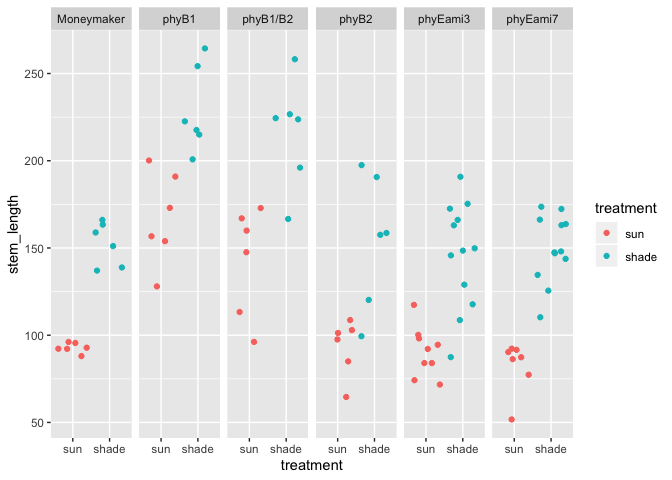

# 13. Models with memory


Please find attached csv.  This csv has measurements of tomato internodes and petioles from wildtype (Moneymaker) and various phytochrome mutant lines.  Measurements were made at 3 time points, 21, 28, and 35 days after germination under two treatments, simulated sun and simulated shade.

for today let's focus on day 35.  Also let's focus on total stem length.  So: first

# Q1)
## a) subset the data for day 35

```r
F4phyE<-read_csv("../figure4phyE.csv")
```

```
## Parsed with column specification:
## cols(
##   genotype = col_character(),
##   treatment = col_character(),
##   flat = col_double(),
##   day = col_double(),
##   epi = col_double(),
##   int1 = col_double(),
##   int2 = col_double(),
##   int3 = col_double(),
##   pet1 = col_double(),
##   pet2 = col_double(),
##   pet3 = col_double(),
##   pet4 = col_double()
## )
```

```r
summary(F4phyE)
```

```
##    genotype          treatment              flat            day    
##  Length:264         Length:264         Min.   :1.000   Min.   :21  
##  Class :character   Class :character   1st Qu.:2.000   1st Qu.:21  
##  Mode  :character   Mode  :character   Median :3.000   Median :28  
##                                        Mean   :3.455   Mean   :28  
##                                        3rd Qu.:5.000   3rd Qu.:35  
##                                        Max.   :6.000   Max.   :35  
##       epi             int1             int2             int3       
##  Min.   : 2.73   Min.   : 0.240   Min.   :  0.00   Min.   : 0.000  
##  1st Qu.:11.42   1st Qu.: 2.748   1st Qu.:  0.00   1st Qu.: 0.000  
##  Median :24.59   Median :14.635   Median :  7.58   Median : 2.755  
##  Mean   :28.00   Mean   :18.643   Mean   : 16.03   Mean   : 9.289  
##  3rd Qu.:37.48   3rd Qu.:30.532   3rd Qu.: 25.41   3rd Qu.:15.880  
##  Max.   :87.74   Max.   :71.270   Max.   :104.74   Max.   :56.700  
##       pet1            pet2             pet3            pet4       
##  Min.   : 6.23   Min.   : 0.000   Min.   : 0.00   Min.   : 0.000  
##  1st Qu.:15.19   1st Qu.: 5.577   1st Qu.: 0.00   1st Qu.: 0.000  
##  Median :38.78   Median :28.250   Median :13.19   Median : 3.455  
##  Mean   :37.97   Mean   :32.788   Mean   :24.59   Mean   :13.569  
##  3rd Qu.:52.47   3rd Qu.:53.197   3rd Qu.:48.82   3rd Qu.:27.302  
##  Max.   :91.87   Max.   :96.230   Max.   :98.57   Max.   :72.120
```

```r
F4phyE.day35 <- F4phyE %>% filter(day==35)
summary(F4phyE.day35)
```

```
##    genotype          treatment              flat            day    
##  Length:88          Length:88          Min.   :1.000   Min.   :35  
##  Class :character   Class :character   1st Qu.:2.000   1st Qu.:35  
##  Mode  :character   Mode  :character   Median :3.000   Median :35  
##                                        Mean   :3.455   Mean   :35  
##                                        3rd Qu.:5.000   3rd Qu.:35  
##                                        Max.   :6.000   Max.   :35  
##       epi             int1            int2             int3      
##  Min.   :10.94   Min.   : 3.02   Min.   : 10.75   Min.   : 8.79  
##  1st Qu.:29.08   1st Qu.:28.01   1st Qu.: 23.95   1st Qu.:15.98  
##  Median :37.36   Median :35.12   Median : 36.20   Median :24.72  
##  Mean   :41.40   Mean   :36.50   Mean   : 38.50   Mean   :24.85  
##  3rd Qu.:50.62   3rd Qu.:45.85   3rd Qu.: 48.99   3rd Qu.:31.67  
##  Max.   :87.74   Max.   :71.27   Max.   :104.74   Max.   :56.70  
##       pet1            pet2            pet3            pet4      
##  Min.   :32.52   Min.   : 0.00   Min.   :18.52   Min.   :10.83  
##  1st Qu.:51.14   1st Qu.:53.29   1st Qu.:49.33   1st Qu.:27.41  
##  Median :60.62   Median :65.34   Median :58.30   Median :34.99  
##  Mean   :60.26   Mean   :65.52   Mean   :60.12   Mean   :36.29  
##  3rd Qu.:68.91   3rd Qu.:79.04   3rd Qu.:71.24   3rd Qu.:43.87  
##  Max.   :91.87   Max.   :96.23   Max.   :98.57   Max.   :72.12
```

## b) create a new column "stem_length" that is the sum of epi, int1, int2, and int3

```r
F4phyE.day35.v2 <- F4phyE.day35 %>% mutate(stem_length=epi+int1+int2+int3) # %>% View()
F4phyE.day35.v2
```

```
## # A tibble: 88 x 13
##    genotype treatment  flat   day   epi  int1  int2  int3  pet1  pet2  pet3
##    <chr>    <chr>     <dbl> <dbl> <dbl> <dbl> <dbl> <dbl> <dbl> <dbl> <dbl>
##  1 phyB1/B2 shade         1    35  58.8 40.6   72.3  52.7  42.2  49.6  49.6
##  2 phyB1/B2 shade         1    35  69.6  4.91  56.6  35.5  49.8  34.6  47.6
##  3 phyB1/B2 shade         2    35  70.2 62.6   59.7  31.2  46.3  56.8  47.9
##  4 phyB1/B2 shade         3    35  54.6 38.6   67.6  35.2  39.1  66.6  68.8
##  5 phyB1/B2 shade         3    35  58.2 55.3  105.   40.0  44.8  65.3  60.6
##  6 phyB1/B2 shade         5    35  59.9 58.7   74.8  33.3  36.4  39.3  50.7
##  7 phyB1/B2 sun           1    35  37.4 28.1   32.3  15.4  32.5  39.8  45.4
##  8 phyB1/B2 sun           1    35  66.5 36.1   25.8  19.1  50.5  49.3  49.6
##  9 phyB1/B2 sun           2    35  44.0  3.02  37.0  12.2  36.1  40.6  29.9
## 10 phyB1/B2 sun           3    35  67.7 41.2   30.4  20.6  45.8  53.2  44.3
## # … with 78 more rows, and 2 more variables: pet4 <dbl>, stem_length <dbl>
```

c) although flats are listed as 1-6, flats in sun and shade are separate. Create a new column "flat2" that corrects for this.

```r
F4phyE.day35.v3 <- F4phyE.day35.v2 %>% unite("flat2",c("treatment","flat"),sep="_", remove=FALSE)
F4phyE.day35.v3
```

```
## # A tibble: 88 x 14
##    genotype flat2 treatment  flat   day   epi  int1  int2  int3  pet1  pet2
##    <chr>    <chr> <chr>     <dbl> <dbl> <dbl> <dbl> <dbl> <dbl> <dbl> <dbl>
##  1 phyB1/B2 shad… shade         1    35  58.8 40.6   72.3  52.7  42.2  49.6
##  2 phyB1/B2 shad… shade         1    35  69.6  4.91  56.6  35.5  49.8  34.6
##  3 phyB1/B2 shad… shade         2    35  70.2 62.6   59.7  31.2  46.3  56.8
##  4 phyB1/B2 shad… shade         3    35  54.6 38.6   67.6  35.2  39.1  66.6
##  5 phyB1/B2 shad… shade         3    35  58.2 55.3  105.   40.0  44.8  65.3
##  6 phyB1/B2 shad… shade         5    35  59.9 58.7   74.8  33.3  36.4  39.3
##  7 phyB1/B2 sun_1 sun           1    35  37.4 28.1   32.3  15.4  32.5  39.8
##  8 phyB1/B2 sun_1 sun           1    35  66.5 36.1   25.8  19.1  50.5  49.3
##  9 phyB1/B2 sun_2 sun           2    35  44.0  3.02  37.0  12.2  36.1  40.6
## 10 phyB1/B2 sun_3 sun           3    35  67.7 41.2   30.4  20.6  45.8  53.2
## # … with 78 more rows, and 3 more variables: pet3 <dbl>, pet4 <dbl>,
## #   stem_length <dbl>
```


Ultimately you want to know if any of the mutants have a different length from Moneymaker, in sun or in shade, or if the response to shade differs.

```r
dat_list.Q1.zero.one<- list(
    stem_length = F4phyE.day35.v3$stem_length,
    genotype = as.integer(factor(F4phyE.day35.v3$genotype,levels=c("Moneymaker", 
                                            "phyB1", 
                                            "phyB2", 
                                            "phyB1/B2", 
                                            "phyEami3", 
                                            "phyEami7"))),
    flat_id = as.integer(factor(F4phyE.day35.v3$flat2,levels=c("shade_1",
                                                            "shade_2",
                                                            "shade_3",
                                                            "shade_4",
                                                            "shade_5",
                                                            "shade_6",
                                                            "sun_1",
                                                            "sun_2",
                                                            "sun_3",
                                                            "sun_4",
                                                            "sun_5",
                                                            "sun_6"))),
    treatment = ifelse(F4phyE.day35.v3$treatment=="sun",0,1)) 
dat_list.Q1.one.two<- list(
    stem_length = F4phyE.day35.v3$stem_length,
    genotype = as.integer(factor(F4phyE.day35.v3$genotype,levels=c("Moneymaker", 
                                            "phyB1", 
                                            "phyB2", 
                                            "phyB1/B2", 
                                            "phyEami3", 
                                            "phyEami7"))),
    flat_id = as.integer(factor(F4phyE.day35.v3$flat2,levels=c("shade_1",
                                                            "shade_2",
                                                            "shade_3",
                                                            "shade_4",
                                                            "shade_5",
                                                            "shade_6",
                                                            "sun_1",
                                                            "sun_2",
                                                            "sun_3",
                                                            "sun_4",
                                                            "sun_5",
                                                            "sun_6"))),
    treatment = ifelse(F4phyE.day35.v3$treatment=="sun",1,2)) 
# "sun" is 1, "shade" is 2
dat_list.Q1
```

```
## Error in eval(expr, envir, enclos): object 'dat_list.Q1' not found
```

```r
str(dat_list.Q1error)
```

```
## Error in str(dat_list.Q1error): object 'dat_list.Q1error' not found
```

```r
str(dat_list.Q1)
```

```
## Error in str(dat_list.Q1): object 'dat_list.Q1' not found
```

```r
# 
str(ifelse(F4phyE.day35.v3$treatment=="sun",0,1)) # numeric
```

```
##  num [1:88] 1 1 1 1 1 1 0 0 0 0 ...
```

```r
str(ifelse(F4phyE.day35.v3$treatment=="sun",0L,1L)) # integer
```

```
##  int [1:88] 1 1 1 1 1 1 0 0 0 0 ...
```

# look the raw data

```r
str(F4phyE.day35.v3)
```

```
## Classes 'tbl_df', 'tbl' and 'data.frame':	88 obs. of  14 variables:
##  $ genotype   : chr  "phyB1/B2" "phyB1/B2" "phyB1/B2" "phyB1/B2" ...
##  $ flat2      : chr  "shade_1" "shade_1" "shade_2" "shade_3" ...
##  $ treatment  : chr  "shade" "shade" "shade" "shade" ...
##  $ flat       : num  1 1 2 3 3 5 1 1 2 3 ...
##  $ day        : num  35 35 35 35 35 35 35 35 35 35 ...
##  $ epi        : num  58.8 69.5 70.2 54.6 58.2 ...
##  $ int1       : num  40.6 4.91 62.61 38.64 55.31 ...
##  $ int2       : num  72.3 56.6 59.7 67.6 104.7 ...
##  $ int3       : num  52.7 35.5 31.2 35.2 40 ...
##  $ pet1       : num  42.1 49.8 46.3 39.1 44.9 ...
##  $ pet2       : num  49.6 34.6 56.8 66.6 65.3 ...
##  $ pet3       : num  49.6 47.6 47.9 68.8 60.6 ...
##  $ pet4       : num  30.5 40.5 28.4 53.2 43.5 ...
##  $ stem_length: num  224 167 224 196 258 ...
```

```r
F4phyE.day35.v3$treatment <-factor(F4phyE.day35.v3$treatment,levels=c("sun","shade"))
F4phyE.day35.v3 %>% View()
F4phyE.day35.v3 %>% ggplot(aes(x=treatment, y=stem_length,color=treatment)) + geom_jitter() + facet_grid(.~genotype)
```

<!-- -->

```r
# sample numbers (pivot table, tidyverse way)
F4phyE.day35.v3 %>% group_by(genotype,treatment,flat) %>% summarize(num=n()) %>% spread(flat,num)
```

```
## # A tibble: 12 x 8
## # Groups:   genotype, treatment [12]
##    genotype   treatment   `1`   `2`   `3`   `4`   `5`   `6`
##    <chr>      <fct>     <int> <int> <int> <int> <int> <int>
##  1 Moneymaker sun           1     2     2     1    NA    NA
##  2 Moneymaker shade         1     2     2     1    NA    NA
##  3 phyB1      sun          NA     1    NA     3     1     1
##  4 phyB1      shade        NA     1    NA     3     1     1
##  5 phyB1/B2   sun           2     1     2    NA     1    NA
##  6 phyB1/B2   shade         2     1     2    NA     1    NA
##  7 phyB2      sun           1    NA     1     1     1     2
##  8 phyB2      shade         1    NA     1     1     1     2
##  9 phyEami3   sun           3     1    NA    NA     2     3
## 10 phyEami3   shade         3     1    NA     1     4     3
## 11 phyEami7   sun           1     1     2     2    NA     1
## 12 phyEami7   shade         1     3     3     2     1     2
```

```r
# incomplete block design
with(F4phyE.day35.v3, table(genotype,flat,treatment)) # traditional way, creating list
```

```
## , , treatment = sun
## 
##             flat
## genotype     1 2 3 4 5 6
##   Moneymaker 1 2 2 1 0 0
##   phyB1      0 1 0 3 1 1
##   phyB1/B2   2 1 2 0 1 0
##   phyB2      1 0 1 1 1 2
##   phyEami3   3 1 0 0 2 3
##   phyEami7   1 1 2 2 0 1
## 
## , , treatment = shade
## 
##             flat
## genotype     1 2 3 4 5 6
##   Moneymaker 1 2 2 1 0 0
##   phyB1      0 1 0 3 1 1
##   phyB1/B2   2 1 2 0 1 0
##   phyB2      1 0 1 1 1 2
##   phyEami3   3 1 0 1 4 3
##   phyEami7   1 3 3 2 1 2
```

* Looks there are treatment effects are genotype effects.

# Q2) Fit 3 models, all of which include genotype and treatment
* Data format depends on indexing or not.

a) do not include flat


## ModelQ1a.wrong
* Kazu'Q: When\ logit\ should\ be\ used? \\
* Use logit when value is between 0 and 1, likely probability. (correct?)
* So this is wrong

$$
stem_length_i \sim Normal(0,p) \\
logit(p) = \alpha_{genotype} + \beta_{treatment} \\
\alpha_{group} \sim Normal(0, 1) \\
\beta_{treatment} \sim Normal(0, 1)
$$

# wrong model with logit

```r
set.seed(15)
# error
mQ1.a.zero.one <- ulam(
    alist(
        stem_length ~ dnorm( 1 , p),
        logit(p) <- a[genotype] + b[treatment],
        b[treatment] ~ dnorm( 0 , 1),
        a[genotype] ~ dnorm(0 , 1)
    ), data=dat_list.Q1.zero.one , chains=2 , cores=2 , log_lik=TRUE )
```

```
## Warning in .local(object, ...): some chains had errors; consider specifying
## chains = 1 to debug
```

```
## here are whatever error messages were returned
```

```
## [[1]]
## Stan model '0b1010f6d8f8a8e3bb14c44c4539ee4c' does not contain samples.
## 
## [[2]]
## Stan model '0b1010f6d8f8a8e3bb14c44c4539ee4c' does not contain samples.
## 
## Stan model '0b1010f6d8f8a8e3bb14c44c4539ee4c' does not contain samples.
```

```
## Error in validObject(.Object): invalid class "ulam" object: invalid object for slot "coef" in class "ulam": got class "NULL", should be or extend class "numeric"
```

```r
# no error, why?
mQ1.a.one.two <- ulam(
    alist(
        stem_length ~ dnorm( 1 , p),
        logit(p) <- a[genotype] + b[treatment],
        b[treatment] ~ dnorm( 0 , 1),
        a[genotype] ~ dnorm(0 , 1)
    ), data=dat_list.Q1,one.two , chains=2 , cores=2 , log_lik=TRUE )
```

```
## Error in as.list(data): object 'dat_list.Q1' not found
```


# Use normal distribution with mu and sigma also intercept
## # mQ1.a2  intercept two treatment (no interaction)
$$
stem\_length \sim Normal(mu,sigma) \\
mu = \alpha + \beta\_g_{genotype} + \beta\_t_{treatment} \\
\alpha \sim Normal(140,50) \\
\beta\_g \sim Normal(0, 1) \\
\beta\_t_ \sim Normal(0, 1) \\
\sigma \sim Exponential(0,1)
$$

```r
# estimate intercept using mean?
F4phyE.day35.v3 %>% summarize(mean(stem_length),sd(stem_length)) # 141 48.5
```

```
## # A tibble: 1 x 2
##   `mean(stem_length)` `sd(stem_length)`
##                 <dbl>             <dbl>
## 1                141.              48.5
```

```r
# 
mQ1.a2.nonindex.zero.one <- ulam(
    alist(
        stem_length ~ dnorm(mu , sigma),
        mu <- alpha + b_g*genotype + b_t*treatment,
        alpha ~ dnorm(140,50),
        b_g ~ dnorm( 0 , 1),
        b_t ~ dnorm(0 , 1),
        sigma ~ dexp( 1 )
    ), data=dat_list.Q1.zero.one , chains=2 , cores=2 , log_lik=TRUE )

precis(mQ1.a2.nonindex.zero.one,depth=2)
```

```
##              mean        sd        5.5%       94.5%    n_eff      Rhat
## alpha 144.0470361 5.3738614 135.6455428 152.9615928 631.8278 1.0058509
## b_g    -0.8569634 0.9318752  -2.3725645   0.5916894 549.8687 1.0035899
## b_t     0.8706089 0.9682471  -0.6864355   2.4713328 885.3559 0.9990383
## sigma  39.8896151 2.4230124  36.2561585  43.7327410 816.0581 0.9990337
```

```r
pairs(mQ1.a2.nonindex.zero.one)
```

<!-- -->


```r
mQ1.a2.nonindex.one.two <- ulam(
    alist(
        stem_length ~ dnorm(mu , sigma),
        mu <- alpha + b_g*genotype + b_t*treatment,
        alpha ~ dnorm(140,50),
        b_g ~ dnorm( 0 , 1),
        b_t ~ dnorm(0 , 1),
        sigma ~ dexp( 1 )
    ), data=dat_list.Q1.one.two , chains=2 , cores=2 , log_lik=TRUE )
```

```
## recompiling to avoid crashing R session
```

```r
precis(mQ1.a2.nonindex.one.two,depth=2)
```

```
##              mean        sd        5.5%       94.5%    n_eff      Rhat
## alpha 142.7027084 5.9074339 133.1198846 151.7342612 412.1511 0.9990432
## b_g    -0.7490411 0.9037224  -2.2226527   0.6312596 689.1316 0.9985880
## b_t     0.7908503 0.9948162  -0.8374313   2.3174712 547.5084 1.0004175
## sigma  40.1894750 2.4897014  36.4268448  44.4015826 717.3314 1.0009845
```

$$
stem\_length \sim Normal(mu,sigma) \\
mu = \alpha + \beta\_g_{genotype} + \beta\_t_{treatment} \\
\alpha \sim Normal(140,50) \\
\beta\_g \sim Normal(0, 1) \\
\beta\_t_ \sim Normal(0, 1) \\
\sigma \sim Exponential(0,1)
$$


```r
mQ1.a2.index.zero.one <- ulam(
    alist(
        stem_length ~ dnorm(mu , sigma),
        mu <- alpha + b_g[genotype] + b_t*treatment,
        alpha ~ dnorm(140,50),
        b_g[genotype] ~ dnorm( 0 , 1),
        b_t ~ dnorm(0 , 1),
        sigma ~ dexp( 1 )
    ), data=dat_list.Q1.zero.one , chains=2 , cores=2 , log_lik=TRUE )

precis(mQ1.a2.index.zero.one,depth=2)
```

```
##               mean        sd        5.5%      94.5%    n_eff      Rhat
## alpha  140.8353725 4.3664964 133.7167040 147.663197 1997.370 0.9987209
## b_g[1]  -0.1409003 0.9577372  -1.5884071   1.471559 1546.657 0.9999476
## b_g[2]   0.3797687 1.0239205  -1.1959998   2.008279 1722.649 0.9990934
## b_g[3]  -0.1793947 0.9185757  -1.6206156   1.286402 1879.278 0.9997493
## b_g[4]   0.2933867 1.0574576  -1.3964169   1.901459 1409.727 0.9988579
## b_g[5]  -0.2709082 0.9700749  -1.8730353   1.339120 1615.684 1.0009592
## b_g[6]  -0.2103550 1.0240443  -1.8911134   1.412942 2903.115 0.9990326
## b_t      0.8191724 1.0260755  -0.8103409   2.470093 1875.048 0.9987135
## sigma   40.1794022 2.2766737  36.8295465  43.998940 1292.241 1.0007359
```

```r
compare(mQ1.a2.zero.one,mQ1.a2.index.zero.one)
```

```
## Error in compare(mQ1.a2.zero.one, mQ1.a2.index.zero.one): object 'mQ1.a2.zero.one' not found
```


```r
mQ1.a2.index.one.two <- ulam(
    alist(
        stem_length ~ dnorm(mu , sigma),
        mu <- alpha + b_g[genotype] + b_t*treatment,
        alpha ~ dnorm(140,50),
        b_g[genotype] ~ dnorm( 0 , 1),
        b_t ~ dnorm(0 , 1),
        sigma ~ dexp( 1 )
    ), data=dat_list.Q1.one.two , chains=2 , cores=2 , log_lik=TRUE )
```

```
## recompiling to avoid crashing R session
```

```r
precis(mQ1.a2.index.one.two,depth=2)
```

```
##               mean        sd       5.5%      94.5%    n_eff      Rhat
## alpha  140.0931241 4.4529754 132.822533 147.270983 1060.755 1.0001021
## b_g[1]  -0.1483916 1.0122957  -1.788930   1.573566 1723.230 0.9983639
## b_g[2]   0.4473195 1.0155674  -1.160725   2.076469 2154.695 0.9985950
## b_g[3]  -0.1267058 0.9993190  -1.735013   1.501694 1178.502 1.0011876
## b_g[4]   0.3365731 0.9810336  -1.277590   1.898563 1699.821 0.9980953
## b_g[5]  -0.2269110 0.9865190  -1.752168   1.295677 1790.906 0.9987913
## b_g[6]  -0.1498491 0.9741078  -1.717690   1.439526 1185.579 0.9986474
## b_t      0.8112030 0.9927148  -0.754083   2.298259 1059.333 1.0019157
## sigma   40.1266502 2.2877710  36.680349  43.913551 1407.052 0.9998043
```


```r
mQ1.a2.trtindex.zero.one <- ulam(
    alist(
        stem_length ~ dnorm(mu , sigma),
        mu <- alpha + b_g*genotype + b_t[treatment],
        alpha ~ dnorm(140,50),
        b_g ~ dnorm( 0 , 1),
        b_t[treatment] ~ dnorm(0 , 1),
        sigma ~ dexp( 1 )
    ), data=dat_list.Q1.zero.one , chains=2 , cores=2 , log_lik=TRUE )
```

```
## Warning in .local(object, ...): some chains had errors; consider specifying
## chains = 1 to debug
```

```
## here are whatever error messages were returned
```

```
## [[1]]
## Stan model '9830fdf9f74d74eea4337a28300d7d2c' does not contain samples.
## 
## [[2]]
## Stan model '9830fdf9f74d74eea4337a28300d7d2c' does not contain samples.
## 
## Stan model '9830fdf9f74d74eea4337a28300d7d2c' does not contain samples.
```

```
## Error in validObject(.Object): invalid class "ulam" object: invalid object for slot "coef" in class "ulam": got class "NULL", should be or extend class "numeric"
```

```r
# error. "indexing" is not copatible with "0".
precis(mQ1.a2.trtindex.zero.one,depth=2)
```

```
## Error in precis(mQ1.a2.trtindex.zero.one, depth = 2): object 'mQ1.a2.trtindex.zero.one' not found
```


```r
mQ1.a2.trtindex.one.two <- ulam(
    alist(
        stem_length ~ dnorm(mu , sigma),
        mu <- alpha + b_g*genotype + b_t[treatment],
        alpha ~ dnorm(140,50),
        b_g ~ dnorm( 0 , 1),
        b_t[treatment] ~ dnorm(0 , 1),
        sigma ~ dexp( 1 )
    ), data=dat_list.Q1.one.two , chains=2 , cores=2 , log_lik=TRUE )
```

```
## recompiling to avoid crashing R session
```

```r
precis(mQ1.a2.trtindex.one.two,depth=2)
```

```
##               mean        sd       5.5%       94.5%     n_eff      Rhat
## alpha  144.3188074 5.4938480 135.806615 153.1667886  958.3768 0.9999723
## b_g     -0.8032262 0.9086405  -2.220993   0.6600812  934.9654 0.9998167
## b_t[1]  -0.8132665 1.0340347  -2.418280   0.8026043 1076.0425 1.0009562
## b_t[2]   0.8269422 0.9898629  -0.719988   2.4002551  931.3097 1.0061140
## sigma   39.9106768 2.3948962  36.263505  43.7966447 1129.9651 0.9988830
```


```r
mQ1.a2.trtgtindex.one.two <- ulam(
    alist(
        stem_length ~ dnorm(mu , sigma),
        mu <- alpha + b_g[genotype] + b_t[treatment],
        alpha ~ dnorm(140,50),
        b_g[genotype] ~ dnorm( 0 , 1),
        b_t[treatment] ~ dnorm(0 , 1),
        sigma ~ dexp( 1 )
    ), data=dat_list.Q1.one.two , chains=2 , cores=2 , log_lik=TRUE )

precis(mQ1.a2.trtgtindex.one.two,depth=2)
```

```
##               mean        sd        5.5%       94.5%    n_eff      Rhat
## alpha  141.3556331 4.3181380 134.4205741 148.3367389 1564.593 0.9984764
## b_g[1]  -0.1597963 1.0085404  -1.7327689   1.3779003 1768.497 1.0001112
## b_g[2]   0.4618425 0.9596606  -1.0507305   2.0184371 1731.157 0.9994547
## b_g[3]  -0.1485421 0.9615149  -1.6905816   1.4092154 1685.878 0.9995274
## b_g[4]   0.3368043 1.0522165  -1.2782215   2.1079771 1321.276 0.9998855
## b_g[5]  -0.2597937 1.0059820  -1.8468723   1.3565754 1173.290 0.9996171
## b_g[6]  -0.1832090 1.0503168  -1.8895650   1.4580003 1288.714 0.9990711
## b_t[1]  -0.7703089 0.9523038  -2.2097151   0.7590816 1297.947 0.9989448
## b_t[2]   0.8053400 1.0147195  -0.7357445   2.3876671 2154.046 0.9981099
## sigma   39.9025612 2.2944970  36.4131168  43.6639505 1286.183 0.9988364
```
# model comparison

```r
compare(mQ1.a2.nonindex.zero.one,
        mQ1.a2.index.zero.one,
        mQ1.a2.nonindex.one.two,
        mQ1.a2.index.one.two,
        mQ1.a2.trtindex.one.two,
        mQ1.a2.trtgtindex.one.two)
```

```
##                               WAIC       SE     dWAIC       dSE    pWAIC
## mQ1.a2.trtindex.one.two   940.1827 17.21424 0.0000000        NA 2.778547
## mQ1.a2.trtgtindex.one.two 940.2724 17.28273 0.0896787 0.6662169 2.471623
## mQ1.a2.index.zero.one     941.0212 17.21735 0.8385158 0.6491535 2.477743
## mQ1.a2.nonindex.zero.one  941.0240 17.28309 0.8412279 0.1664748 2.574393
## mQ1.a2.index.one.two      941.0652 17.23963 0.8824738 0.6569507 2.460373
## mQ1.a2.nonindex.one.two   941.2918 17.18972 1.1091120 0.1524206 2.858829
##                              weight
## mQ1.a2.trtindex.one.two   0.2228215
## mQ1.a2.trtgtindex.one.two 0.2130510
## mQ1.a2.index.zero.one     0.1465129
## mQ1.a2.nonindex.zero.one  0.1463143
## mQ1.a2.index.one.two      0.1433278
## mQ1.a2.nonindex.one.two   0.1279725
```
* All of the same.

# how about to no intercept?
## # mQ1.a3  no intercept, two treatment (no interaction)

$$
stem\_length \sim Normal(mu,sigma) \\
mu =   \beta\_g_{genotype} + \beta\_t_{treatment} \\
\alpha \sim Normal(140,50) \\
\beta\_g \sim Normal(0, 1) \\
\beta\_t_ \sim Normal(0, 1) \\
\sigma \sim Exponential(0,1)
$$

```r
mQ1.a3.nonindex.zero.one <- ulam(
    alist(
        stem_length ~ dnorm(mu , sigma),
        mu <- b_g*genotype + b_t*treatment,
        b_g ~ dnorm( 0 , 1),
        b_t ~ dnorm(0 , 1),
        sigma ~ dexp( 1 )
    ), data=dat_list.Q1.zero.one , chains=2 , cores=2 , log_lik=TRUE )

precis(mQ1.a3.nonindex.zero.one,depth=2)
```

```
##             mean        sd       5.5%      94.5%    n_eff      Rhat
## b_g    4.4947178 0.9719522  2.9662685   6.020635 738.6288 1.0000651
## b_t    0.8250618 0.9682587 -0.6870921   2.459955 933.0641 0.9999505
## sigma 93.4581093 4.7887439 85.6104849 101.230375 724.2902 0.9996293
```

```r
pairs(mQ1.a3.nonindex.zero.one)
```

<!-- -->

```r
compare(mQ1.a2.nonindex.zero.one,mQ1.a3.nonindex.zero.one)
```

```
##                              WAIC       SE    dWAIC      dSE     pWAIC
## mQ1.a2.nonindex.zero.one  941.024 17.28309   0.0000       NA 2.5743926
## mQ1.a3.nonindex.zero.one 1141.154 15.15512 200.1302 15.32142 0.8620893
##                              weight
## mQ1.a2.nonindex.zero.one 1.0000e+00
## mQ1.a3.nonindex.zero.one 3.4857e-44
```

```r
# no intercept is worse.
```

# interaction model
* Is this correct model description?

$$
stem\_length \sim Normal(mu,sigma) \\
mu =   \beta\_g_{genotype} + \beta\_t_{treatment} + \beta\_gt_{genotype*treatment} \\
\alpha \sim Normal(140,50) \\
\beta\_g \sim Normal(0, 1) \\
\beta\_t_ \sim Normal(0, 1) \\
\beta\_gt_ \sim Normal(0, 1) \\
\sigma \sim Exponential(0,1)
$$

```r
mQ1.a4.nonindex.zero.one <- ulam(
    alist(
        stem_length ~ dnorm(mu , sigma),
        mu <- alpha + b_g*genotype + b_t*treatment + b_gt*genotype*treatment,
        alpha ~ dnorm(140,50),
        b_g ~ dnorm( 0 , 1),
        b_t ~ dnorm(0 , 1),
        b_gt ~ dnorm(0, 1),
        sigma ~ dexp( 1 )
    ), data=dat_list.Q1.zero.one , chains=2 , cores=2 , log_lik=TRUE )

precis(mQ1.a4.nonindex.zero.one,depth=2)
```

```
##              mean        sd        5.5%      94.5%     n_eff      Rhat
## alpha 140.7785104 5.5597097 132.1593103 149.886183  871.0017 0.9989185
## b_g    -1.0901274 0.8683585  -2.4257702   0.351228  840.7289 0.9987179
## b_t     0.7117284 0.9642443  -0.7780305   2.265851 1010.1115 0.9984014
## b_gt    2.0281663 0.8939336   0.5505961   3.434981  882.1011 1.0004368
## sigma  38.8274774 2.3061997  35.3844392  42.558098 1015.2211 1.0003135
```

```r
compare(mQ1.a2.nonindex.zero.one,mQ1.a4.nonindex.zero.one)
```

```
##                              WAIC       SE    dWAIC      dSE    pWAIC
## mQ1.a4.nonindex.zero.one 933.7041 17.61972 0.000000       NA 2.853059
## mQ1.a2.nonindex.zero.one 941.0240 17.28309 7.319808 1.834939 2.574393
##                              weight
## mQ1.a4.nonindex.zero.one 0.97491069
## mQ1.a2.nonindex.zero.one 0.02508931
```

```r
# little improvement
pairs(mQ1.a4.nonindex.zero.one) # I could see negative correlation between alpha nd b_g, but not b_gt.
```

<!-- -->

# using index method for interaction model (only genotype is indexed)

```r
mQ1.a4.gtindex.one.two <- ulam(
    alist(
        stem_length ~ dnorm(mu , sigma),
        mu <- alpha + b_g[genotype] + b_t*treatment + b_gt[genotype]*treatment,
        alpha ~ dnorm(140,50),
        b_g[genotype] ~ dnorm( 0 , 1),
        b_t ~ dnorm(0 , 1),
        b_gt[genotype] ~ dnorm (0,1),
        sigma ~ dexp( 1 )
    ), data=dat_list.Q1.one.two , chains=2 , cores=2 , log_lik=TRUE )
# Julin's priors
mQ1.a4.gtindex.one.two.2 <- ulam(
    alist(
        stem_length ~ dnorm(mu , sigma),
        mu <- alpha + b_g[genotype] + b_t*treatment + b_gt[genotype]*treatment,
        alpha ~ dnorm(125,50),
        b_g[genotype] ~ dnorm( 0 , 50),
        b_t ~ dnorm(0 , 50),
        b_gt[genotype] ~ dnorm (0,50),
        sigma ~ dexp( 1 )
    ), data=dat_list.Q1.one.two , chains=2 , cores=2 , log_lik=TRUE )

precis(mQ1.a4.gtindex.one.two.2,depth=2)
```

```
##               mean        sd       5.5%     94.5%    n_eff      Rhat
## alpha    61.585208 18.217850  32.625428 89.788756 211.2176 1.0038865
## b_g[1]  -24.262696 24.831107 -63.448031 16.033966 317.7505 1.0024616
## b_g[2]   38.364014 23.674114  -0.481032 73.046383 340.1153 0.9999201
## b_g[3]  -25.174106 24.139746 -63.985623 14.310775 340.5649 1.0003460
## b_g[4]    9.020528 24.250595 -29.986556 46.526638 261.3722 1.0064258
## b_g[5]  -23.912575 21.978449 -59.336997 10.601776 351.2995 1.0030376
## b_g[6]  -40.643275 21.918969 -75.324053 -6.224733 413.4985 1.0015881
## b_t      51.790817 18.861739  22.628229 81.280294 215.8885 1.0037218
## b_gt[1]   5.522005 21.410816 -29.474345 41.125001 253.6086 1.0047697
## b_gt[2]  13.284017 21.627739 -20.538783 46.663808 285.8385 1.0013061
## b_gt[3]   6.703190 21.089755 -27.053504 41.419039 256.1377 1.0023459
## b_gt[4]  20.596565 21.151974 -12.789957 54.096112 283.0849 1.0026595
## b_gt[5]   2.273249 20.244473 -30.452197 33.094729 246.2347 1.0036052
## b_gt[6]  12.035396 20.526556 -19.532496 44.212980 258.9703 1.0005334
## sigma    21.198792  1.411802  19.006624 23.497013 689.0201 0.9983593
```

```r
pairs(mQ1.a4.gtindex.one.two.2)
```

<!-- -->

```r
compare(mQ1.a4.gtindex.one.two,mQ1.a4.gtindex.one.two.2) # different priors. Julin's priors gave me strong  negative correlation betweeen b_t and b_gts!!! And Julin's prior is better model!
```

```
##                              WAIC       SE    dWAIC      dSE     pWAIC
## mQ1.a4.gtindex.one.two.2 823.6163 17.27967   0.0000       NA 14.407389
## mQ1.a4.gtindex.one.two   939.9994 17.04921 116.3831 21.99724  2.630855
##                               weight
## mQ1.a4.gtindex.one.two.2 1.00000e+00
## mQ1.a4.gtindex.one.two   5.34221e-26
```


######### under construction ##########
b) include flat without pooling
* I feel I do understand what pooling is meant....


```r
set.seed(15)
mQ1.b <- ulam(
    alist(
        stem_length ~ dnorm( 1 , p),
        logit(p) <- a[genotype] + g[flat_id] + b[treatment],
        b[treatment] ~ dnorm( 0 , sigma_b ),
        a[genotype] ~ dnorm( a_bar , sigma_a ),
        g[flat_id] ~ dnorm( 0 , 1 ),
        a_bar ~ dnorm( 0 , 1.5 ),
        sigma_a ~ dexp(1),
        sigma_b ~ dexp(1)
    ), data=dat_list.Q1 , chains=2 , cores=2 , log_lik=TRUE )
coeftab(mQ1.b)
```

c) use a hierarchical model that allows partial pooling across flats

```r
set.seed(15)
mQ1.c <- ulam(
    alist(
        stem_length ~ dnorm( 1 , p),
        logit(p) <- a[genotype] + g[flat_id] + b[treatment],
        b[treatment] ~ dnorm( 0 , sigma_b ),
        a[genotype] ~ dnorm( a_bar , sigma_a ),
        g[flat_id] ~ dnorm( 0 , sigma_g ),
        a_bar ~ dnorm( 0 , 1.5 ),
        sigma_a ~ dexp(1),
        sigma_g ~ dexp(1),
        sigma_b ~ dexp(1)
    ), data=dat_list.Q1 , chains=2 , cores=2 , log_lik=TRUE )
coeftab(mQ1.c)
```


# Q3) Compare the models, which is preferred?

```r
compare(mQ1.a,mQ1.b,mQ1.c)
```

# Q4) Using the hierarchical model, make posterior predictions
a) for average cluster
b) for same clusters
c) showing the "marginal" from cluster
d) showing new clusters.

Q5) Reparameterize the model to help with divergent transitions (even if there aren't any)

Q6--optional)
a) Which genotypes differ from MoneyMaker in Sun conditions?
b) Which genotypes differ from MoneyMaker in Shade conditions?
c) Which genotypes differ from MoneyMaker in their response to shade (difference in sun vs shade)?

# sessionInfo()

```r
sessionInfo()
```

```
## R version 3.6.2 (2019-12-12)
## Platform: x86_64-apple-darwin15.6.0 (64-bit)
## Running under: macOS Mojave 10.14.6
## 
## Matrix products: default
## BLAS:   /Library/Frameworks/R.framework/Versions/3.6/Resources/lib/libRblas.0.dylib
## LAPACK: /Library/Frameworks/R.framework/Versions/3.6/Resources/lib/libRlapack.dylib
## 
## locale:
## [1] en_US.UTF-8/en_US.UTF-8/en_US.UTF-8/C/en_US.UTF-8/en_US.UTF-8
## 
## attached base packages:
## [1] parallel  stats     graphics  grDevices utils     datasets  methods  
## [8] base     
## 
## other attached packages:
##  [1] forcats_0.4.0        stringr_1.4.0        dplyr_0.8.3         
##  [4] purrr_0.3.3          readr_1.3.1          tidyr_1.0.0         
##  [7] tibble_2.1.3         tidyverse_1.3.0      reshape2_1.4.3      
## [10] lmerTest_3.1-1       lme4_1.1-21          Matrix_1.2-18       
## [13] rethinking_1.93      dagitty_0.2-2        rstan_2.19.2        
## [16] ggplot2_3.2.1        StanHeaders_2.21.0-1
## 
## loaded via a namespace (and not attached):
##  [1] nlme_3.1-143        matrixStats_0.55.0  fs_1.3.1           
##  [4] lubridate_1.7.4     httr_1.4.1          numDeriv_2016.8-1.1
##  [7] tools_3.6.2         backports_1.1.5     utf8_1.1.4         
## [10] R6_2.4.1            KernSmooth_2.23-16  DBI_1.1.0          
## [13] lazyeval_0.2.2      colorspace_1.4-1    withr_2.1.2        
## [16] tidyselect_0.2.5    gridExtra_2.3       prettyunits_1.1.0  
## [19] processx_3.4.1      curl_4.3            compiler_3.6.2     
## [22] cli_2.0.1           rvest_0.3.5         xml2_1.2.2         
## [25] labeling_0.3        scales_1.1.0        mvtnorm_1.0-12     
## [28] callr_3.4.0         digest_0.6.23       minqa_1.2.4        
## [31] rmarkdown_2.1       pkgconfig_2.0.3     htmltools_0.4.0    
## [34] dbplyr_1.4.2        rlang_0.4.2         readxl_1.3.1       
## [37] rstudioapi_0.10     farver_2.0.3        shape_1.4.4        
## [40] generics_0.0.2      jsonlite_1.6        inline_0.3.15      
## [43] magrittr_1.5        loo_2.2.0           Rcpp_1.0.3         
## [46] munsell_0.5.0       fansi_0.4.1         lifecycle_0.1.0    
## [49] stringi_1.4.5       yaml_2.2.0          MASS_7.3-51.5      
## [52] pkgbuild_1.0.6      plyr_1.8.5          grid_3.6.2         
## [55] crayon_1.3.4        lattice_0.20-38     haven_2.2.0        
## [58] splines_3.6.2       hms_0.5.3           zeallot_0.1.0      
## [61] knitr_1.27          ps_1.3.0            pillar_1.4.3       
## [64] boot_1.3-24         codetools_0.2-16    stats4_3.6.2       
## [67] reprex_0.3.0        glue_1.3.1          evaluate_0.14      
## [70] V8_3.0              modelr_0.1.5        vctrs_0.2.1        
## [73] nloptr_1.2.1        cellranger_1.1.0    gtable_0.3.0       
## [76] assertthat_0.2.1    xfun_0.12           broom_0.5.3        
## [79] coda_0.19-3         ellipsis_0.3.0
```

