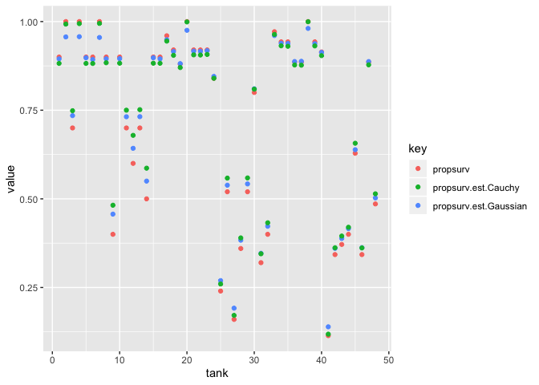

# 13. Models with memory


# practices
# 12E1 
* Which of the following priors will produce more shrinkage in the estimates? (a) αtank ∼
Normal(0, 1); (b) αtank ∼ Normal(0, 2). Answer: (a)
* 
# 12E2 # learning how to draw math formula in [Rmarkdown/LaTeX](https://en.wikibooks.org/wiki/LaTeX/Mathematics)
* original
$$
y_i \sim Binomial(1, p_i) \\
logit(p_i) = \alpha_{group[i]} + \beta x_i \\
\alpha_{group} \sim Normal(0, 10) \\
\beta \sim Normal(0, 1)
$$

* multilevel 
* Is sigma necesary for exponential?
$$
y_i \sim Binomial(1, p_i) \\
logit(p_i) = \alpha_{group[i]} + \beta x_i \\
\alpha_{group} \sim Normal(\bar\alpha, \sigma) \\
\bar\alpha \sim Normal(0, 10) \\
\bar{\alpha} \sim Normal(0, 10) \dots with or without is ignored \\ 
\sigma \sim Exponential(1) \\ 
\beta \sim Normal(0, 1)
$$


# 12E3
* Half Cauchy distribution

```r
library(extraDistr)
```

```
## 
## Attaching package: 'extraDistr'
```

```
## The following object is masked from 'package:purrr':
## 
##     rdunif
```

```
## The following objects are masked from 'package:rethinking':
## 
##     dbern, dlaplace, dpareto, rbern, rlaplace, rpareto
```

```r
?extraDistr::dhcauchy
```

* original
$$
y_i \sim Normal(\mu_i, \sigma) \\
\mu_i = \alpha_{group[i]} + \beta x_i \\
\alpha_{group} \sim Normal(0, 10) \\
\beta \sim Normal(0, 1) \\
\sigma \sim HalfCauchy(0, 2)
$$

* multilevel
$$
y_i \sim Normal(\mu_i, \sigma) \\
\mu_i = \alpha_{group[i]} + \beta x_i \\
\alpha_{group} \sim Normal(\bar\alpha, \sigma_2) \\
\bar\alpha \sim Normal(0, 10) \\
\sigma_2 \sim Exponential(1) \\ 
\beta \sim Normal(0, 1) \\
\sigma \sim HalfCauchy(0, 2)
$$

# 12M1 
* Revisit the Reed frog survival data, data(reedfrogs), and add the predation and size treatment variables to the varying intercepts model. Consider models with either main effect alone, both main effects, as well as a model including both and their interaction. Instead of focusing on inferences about these two predictor variables, focus on the inferred variation across tanks. Explain why it changes as it does across models.

```r
data(reedfrogs) # 13.1. Example: Multilevel tadpoles
d <- reedfrogs
str(d)
```

```
## 'data.frame':	48 obs. of  5 variables:
##  $ density : int  10 10 10 10 10 10 10 10 10 10 ...
##  $ pred    : Factor w/ 2 levels "no","pred": 1 1 1 1 1 1 1 1 2 2 ...
##  $ size    : Factor w/ 2 levels "big","small": 1 1 1 1 2 2 2 2 1 1 ...
##  $ surv    : int  9 10 7 10 9 9 10 9 4 9 ...
##  $ propsurv: num  0.9 1 0.7 1 0.9 0.9 1 0.9 0.4 0.9 ...
```

```r
# make the tank cluster variable
d$tank <- 1:nrow(d)
dat_pred <- list(
    S = d$surv,
    N = d$density,
    tank = d$tank,
    pred = ifelse(d$pred == "no", 0, 1)
    )
dat_pred_size <- list(
    S = d$surv,
    N = d$density,
    tank = d$tank,
    pred = ifelse(d$pred == "no", 0, 1),
    size = ifelse(d$size == "small",0,1)
    )
dat_pred_sze <- list(
    S = d$surv,
    N = d$density,
    tank = d$tank,
    pred = ifelse(d$pred == "no", 0, 1),
    sze = ifelse(d$size == "small",0,1)
    ) # avoiding to use a name, "size" 
```

# original (tank only)

```r
m13.2 <- ulam(
    alist(
        S ~ dbinom( N , p ) ,
        logit(p) <- a[tank] ,
        a[tank] ~ dnorm( a_bar , sigma ) ,
        a_bar ~ dnorm( 0 , 1.5 ) ,
             sigma ~ dexp( 1 )
), data=dat_pred_sze , chains=4 , log_lik=TRUE ,cores=2) # cores=2 added by Kazu
```


# tank + pred

```r
m13.2.mod.tank.pred <- ulam(
    alist(
        S ~ dbinom( N , p ) ,
        logit(p) <- a[tank] + b*pred,
        a[tank] ~ dnorm( a_bar , a_sigma ) ,
        a_bar ~ dnorm( 0 , 1.5 ) ,
        a_sigma ~ dexp( 1 ),
        b ~ dnorm(0, 1)
), data=dat_pred , chains=4 , log_lik=TRUE ,cores=2) 
```

```
## Warning: Bulk Effective Samples Size (ESS) is too low, indicating posterior means and medians may be unreliable.
## Running the chains for more iterations may help. See
## http://mc-stan.org/misc/warnings.html#bulk-ess
```
* error .... why??? Do not use "a.sigma". Use "a_sigma".
* If I use data_pred_size there is an error: Why?

# tank + pred (using data_prez_size)

```r
m13.2.mod.tank.pred <- ulam(
    alist(
        S ~ dbinom( N , p ) ,
        logit(p) <- a[tank] + b*pred,
        a[tank] ~ dnorm( a_bar , a_sigma ) ,
        a_bar ~ dnorm( 0 , 1.5 ) ,
        a_sigma ~ dexp( 1 ),
        b ~ dnorm(0, 1)
), data=dat_pred_size , chains=4 , log_lik=TRUE ,cores=2,iter=2000) 
```

```
## SYNTAX ERROR, MESSAGE(S) FROM PARSER:
```

```
## Variable identifier (name) may not be reserved word
```

```
##     found identifier=size
```

```
## Variable identifier (name) may not be reserved word
```

```
##     found identifier=size
```

```
##  error in 'model360d4982678e_44191844a02ecf95246d72c40b264e24' at line 2, column 7
```

```
##   -------------------------------------------------
```

```
##      1: data{
```

```
##      2:     int size[48];
```

```
##               ^
```

```
##      3:     int N[48];
```

```
##   -------------------------------------------------
```

```
## 
```

```
## PARSER EXPECTED: <identifier>
```

```
## Error in stanc(file = file, model_code = model_code, model_name = model_name, : failed to parse Stan model '44191844a02ecf95246d72c40b264e24' due to the above error.
```


# tank + pred (using data_pred_sze)
* no error! Do not use "size" in data list

```r
m13.2.mod.tank.pred <- ulam(
    alist(
        S ~ dbinom( N , p ) ,
        logit(p) <- a[tank] + b*pred,
        a[tank] ~ dnorm( a_bar , a_sigma ) ,
        a_bar ~ dnorm( 0 , 1.5 ) ,
        a_sigma ~ dexp( 1 ),
        b ~ dnorm(0, 1)
), data=dat_pred_sze , chains=4 , log_lik=TRUE ,cores=2,iter=2000) 
```


```r
precis( m13.2.mod.tank.pred , depth=2 )
```

```
##               mean        sd        5.5%     94.5%     n_eff      Rhat
## a[1]     2.4553586 0.6791040  1.41968673  3.570769 3343.3829 1.0002558
## a[2]     2.9172039 0.7316115  1.81486726  4.129194 3204.8808 0.9998821
## a[3]     1.6723754 0.6225991  0.67820678  2.683004 3974.1062 0.9992293
## a[4]     2.9165847 0.7253982  1.82747533  4.111612 3721.3362 0.9993977
## a[5]     2.4615728 0.6949748  1.39815825  3.580541 3949.3133 1.0001538
## a[6]     2.4592203 0.6693708  1.42373279  3.540651 3466.9821 0.9997692
## a[7]     2.9161860 0.7283944  1.81829202  4.140521 3623.7844 1.0002184
## a[8]     2.4521442 0.6857874  1.39601352  3.611858 3941.3284 0.9998489
## a[9]     2.1599256 0.5709425  1.22661364  3.052761 2016.7190 1.0001053
## a[10]    3.5282164 0.6352712  2.54269426  4.582964 2149.7493 0.9999951
## a[11]    2.9480334 0.5775861  2.04378162  3.895281 1952.2169 1.0015403
## a[12]    2.6714108 0.5713603  1.73578495  3.560059 1819.2583 1.0017802
## a[13]    2.9512257 0.5726627  2.05960955  3.875571 1776.4619 1.0023848
## a[14]    2.4216157 0.5748714  1.52521845  3.335199 1837.8357 1.0008573
## a[15]    3.5236234 0.6359673  2.54248427  4.604362 2012.1180 1.0020482
## a[16]    3.5154500 0.6243826  2.55693076  4.530336 1789.8557 1.0001789
## a[17]    2.8583997 0.6030089  1.95834184  3.860631 3397.0983 1.0019228
## a[18]    2.5291069 0.5587593  1.69419858  3.467252 3221.3277 1.0001859
## a[19]    2.2352843 0.5148486  1.44916534  3.093477 3993.2660 0.9998667
## a[20]    3.2570564 0.6562709  2.26413053  4.373176 2697.6273 1.0001341
## a[21]    2.5409283 0.5661599  1.67002393  3.498878 3892.2925 0.9998505
## a[22]    2.5297004 0.5389926  1.71181308  3.457140 3784.3975 1.0003058
## a[23]    2.5292858 0.5448148  1.69461121  3.432714 4260.7292 1.0001172
## a[24]    1.9928156 0.4860175  1.24660303  2.780292 3999.8738 1.0003320
## a[25]    1.5030854 0.4859371  0.70115150  2.264988 1225.4655 1.0028905
## a[26]    2.4657873 0.4528721  1.73927267  3.188507 1239.6347 1.0037048
## a[27]    1.1856954 0.5157764  0.33024729  1.975859 1275.7349 1.0027073
## a[28]    1.9393048 0.4561154  1.21842107  2.661457 1254.7747 1.0024766
## a[29]    2.4621341 0.4613943  1.73539035  3.189753 1199.5461 1.0028878
## a[30]    3.4580208 0.4917236  2.70449034  4.263112 1366.9210 1.0036540
## a[31]    1.8053133 0.4712385  1.06208250  2.548350 1150.2801 1.0031103
## a[32]    2.0668403 0.4495469  1.35098159  2.779127 1142.0670 1.0048547
## a[33]    3.0404865 0.5821751  2.16568019  4.018197 3561.9691 1.0002375
## a[34]    2.7376431 0.5487031  1.89060300  3.638961 4040.1521 1.0001306
## a[35]    2.7506804 0.5503148  1.92341310  3.682231 4380.1329 0.9993596
## a[36]    2.2433443 0.4786373  1.50172904  3.045302 3780.2397 1.0009352
## a[37]    2.2535052 0.4759949  1.52502058  3.040033 3724.4467 1.0008079
## a[38]    3.3879007 0.6520627  2.43582000  4.488949 3328.1712 1.0006947
## a[39]    2.7321808 0.5486770  1.89804897  3.626306 4198.3054 0.9999369
## a[40]    2.4781172 0.4948476  1.70765900  3.285065 3625.8378 0.9999039
## a[41]    0.8615566 0.5101371  0.03883513  1.658487 1240.9972 1.0031013
## a[42]    1.8398365 0.4373948  1.13026809  2.532112  992.7331 1.0038845
## a[43]    1.9439356 0.4277666  1.25880285  2.614995 1034.5197 1.0027264
## a[44]    2.0498665 0.4369424  1.35994512  2.759284 1168.0882 1.0030962
## a[45]    2.8482056 0.4274875  2.17590613  3.540021 1140.8856 1.0033881
## a[46]    1.8399339 0.4402072  1.11243849  2.512912 1105.7720 1.0021776
## a[47]    3.9465503 0.4979114  3.18410293  4.746907 1284.3476 1.0037771
## a[48]    2.3491434 0.4187574  1.67142074  3.009913 1017.8427 1.0030739
## a_bar    2.4971447 0.2311949  2.13408578  2.857876  714.6323 1.0048554
## a_sigma  0.8222144 0.1426580  0.61165910  1.066822 1055.0133 1.0022799
## b       -2.3808688 0.2955286 -2.83838320 -1.892600  565.6687 1.0080454
```

# tank + sze

```r
m13.2.mod.tank.sze <- ulam(
    alist(
        S ~ dbinom( N , p ) ,
        logit(p) <- a[tank] + c*sze ,
        a[tank] ~ dnorm( a_bar , a_sigma ) ,
        a_bar ~ dnorm( 0 , 1.5 ) ,
        a_sigma ~ dexp( 1 ),
        c ~ dnorm(0, 1),
        d ~ dnorm(0, 1)
), data=dat_pred_sze , chains=4 , log_lik=TRUE ,cores=2,iter=2000) 
```

# tank + pred + size
* error, why?

```r
m13.2.mod.tank.pred.size <- ulam(
    alist(
        S ~ dbinom( N , p ) ,
        logit(p) <- a[tank] + b*pred + c*size,
        a[tank] ~ dnorm( a_bar , a_sigma ) ,
        a_bar ~ dnorm( 0 , 1.5 ) ,
        a_sigma ~ dexp( 1 ),
        b ~ dnorm(0, 1),
        c ~ dnorm(0, 1)
), data=dat_pred_size , chains=4 , log_lik=TRUE ,cores=2,iter=2000) 
```

```
## SYNTAX ERROR, MESSAGE(S) FROM PARSER:
```

```
## Variable identifier (name) may not be reserved word
```

```
##     found identifier=size
```

```
## Variable identifier (name) may not be reserved word
```

```
##     found identifier=size
```

```
##  error in 'model360d7407eba3_c52531a27cfa94b43489ea4a241b6bdc' at line 4, column 7
```

```
##   -------------------------------------------------
```

```
##      2:     int N[48];
```

```
##      3:     int S[48];
```

```
##      4:     int size[48];
```

```
##               ^
```

```
##      5:     int pred[48];
```

```
##   -------------------------------------------------
```

```
## 
```

```
## PARSER EXPECTED: <identifier>
```

```
## Error in stanc(file = file, model_code = model_code, model_name = model_name, : failed to parse Stan model 'c52531a27cfa94b43489ea4a241b6bdc' due to the above error.
```


```r
m13.2.mod.tank.pred.sze <- ulam(
    alist(
        S ~ dbinom( N , p ) ,
        logit(p) <- a[tank] + b*pred + c*sze,
        a[tank] ~ dnorm( a_bar , a_sigma ) ,
        a_bar ~ dnorm( 0 , 1.5 ) ,
        a_sigma ~ dexp( 1 ),
        b ~ dnorm(0, 1),
        c ~ dnorm(0, 1)
), data=dat_pred_sze , chains=4 , log_lik=TRUE ,cores=2,iter=2000) 
```
* Do not use "size" as name in a data.


```r
precis( m13.2.mod.tank.pred.sze , depth=2 )
```

```
##               mean        sd       5.5%       94.5%     n_eff      Rhat
## a[1]     2.7335111 0.6647559  1.6885441  3.79474758 2155.6706 1.0015192
## a[2]     3.1612438 0.7310521  2.0121383  4.35849735 2312.4941 1.0012619
## a[3]     2.0324175 0.6375627  1.0108051  3.06487190 1742.6408 1.0011731
## a[4]     3.1474316 0.7111979  2.0537041  4.31322547 2161.9309 1.0004151
## a[5]     2.6121073 0.6514304  1.5889913  3.65959697 2807.0325 1.0004690
## a[6]     2.6108806 0.6626731  1.5820146  3.67740920 2642.3079 1.0009704
## a[7]     3.0638339 0.7222913  1.9769899  4.25632188 2416.0491 1.0010337
## a[8]     2.6240090 0.6919850  1.5499148  3.75184466 3102.7020 0.9994759
## a[9]     2.5337852 0.6073688  1.5496965  3.46439307 1301.1353 1.0014277
## a[10]    3.8032322 0.6564173  2.7948209  4.91317400 1373.9135 1.0037660
## a[11]    3.2676999 0.5963378  2.3289073  4.21722186 1273.3082 1.0021267
## a[12]    3.0345577 0.5967737  2.0913205  4.01586321 1289.0863 1.0025196
## a[13]    3.0339823 0.5704028  2.1149526  3.97068127 1842.2664 1.0004265
## a[14]    2.5375363 0.5550082  1.6509778  3.40107169 1742.0819 1.0012814
## a[15]    3.5926709 0.6220482  2.6559286  4.63616417 1917.7587 1.0012482
## a[16]    3.6072818 0.6211721  2.6358268  4.62295513 1732.7303 1.0011380
## a[17]    3.1529942 0.6185292  2.2202166  4.17495310 2147.3704 0.9998063
## a[18]    2.8591123 0.5831462  1.9653866  3.81336821 2241.4255 1.0000235
## a[19]    2.5990613 0.5584718  1.7107598  3.49997500 1861.5324 1.0001326
## a[20]    3.5028279 0.6775864  2.5273140  4.62312032 2164.6009 1.0014088
## a[21]    2.6541753 0.5773768  1.7636992  3.58082606 2980.4809 0.9994732
## a[22]    2.6493275 0.5649028  1.7824195  3.60024351 3020.5646 1.0012571
## a[23]    2.6505546 0.5644702  1.7752765  3.56558816 2661.4392 1.0004177
## a[24]    2.1139908 0.5092818  1.3113147  2.93978627 2653.9139 0.9995085
## a[25]    1.9218081 0.5458371  1.0340953  2.75009747  879.6785 1.0026345
## a[26]    2.8622427 0.5009219  2.0469290  3.63092824  931.4445 1.0028057
## a[27]    1.6087781 0.5709744  0.6660912  2.49607313  914.6543 1.0017650
## a[28]    2.3406849 0.5230316  1.4847481  3.15408345  846.1431 1.0026487
## a[29]    2.5436050 0.4483436  1.8312027  3.26615075 1363.4043 1.0029453
## a[30]    3.5127467 0.4719277  2.7612294  4.26712512 1547.1074 1.0009709
## a[31]    1.8932860 0.4639115  1.1378679  2.62328974 1240.5205 1.0007788
## a[32]    2.1563867 0.4537355  1.3988867  2.85622660 1180.3148 1.0034867
## a[33]    3.3263632 0.6091581  2.4057398  4.34894462 2247.4475 1.0012327
## a[34]    3.0748914 0.5749197  2.2050519  4.04849921 2224.0057 1.0014068
## a[35]    3.0589417 0.5538376  2.2079316  3.96180916 2178.2983 1.0010056
## a[36]    2.6094107 0.5159833  1.7954510  3.44099040 1837.4118 1.0023501
## a[37]    2.3467189 0.4832773  1.5979771  3.11270744 3257.3154 1.0002298
## a[38]    3.4698114 0.6416524  2.5194730  4.53560904 2535.4104 0.9999051
## a[39]    2.8441277 0.5471760  2.0069052  3.74973977 3682.8090 0.9991904
## a[40]    2.5878454 0.5000082  1.8079376  3.40479490 3342.2107 1.0002486
## a[41]    1.3019366 0.5480514  0.3916156  2.13380038  899.5122 1.0011128
## a[42]    2.2564210 0.4880401  1.4485045  3.01928364  832.2911 1.0021957
## a[43]    2.3601113 0.4849637  1.5756964  3.12677533  762.2892 1.0030160
## a[44]    2.4674579 0.4873095  1.6688785  3.22009122  759.1179 1.0035410
## a[45]    2.9069780 0.4081033  2.2730044  3.56512571 1219.4758 1.0018484
## a[46]    1.9229856 0.4275584  1.2227155  2.58957815 1129.5331 1.0023050
## a[47]    3.9932342 0.4768187  3.2465860  4.76417239 1484.8185 1.0023183
## a[48]    2.4098323 0.4140072  1.7353269  3.07017971 1145.4943 1.0055044
## a_bar    2.7201003 0.2656798  2.2907515  3.13782330  573.6477 1.0065141
## a_sigma  0.7793162 0.1513804  0.5612888  1.04048373 1031.1947 1.0014474
## b       -2.4077067 0.2850801 -2.8577698 -1.95490776  692.7534 1.0062753
## c       -0.4207839 0.2792901 -0.8640326  0.03200988  947.4883 1.0010246
```


# tank + pred + sze + pred:sze

```r
m13.2.mod.tank.pred.sze <- ulam(
    alist(
        S ~ dbinom( N , p ) ,
        logit(p) <- a[tank] + b*pred + c*sze + d*pred*sze,
        a[tank] ~ dnorm( a_bar , a_sigma ) ,
        a_bar ~ dnorm( 0 , 1.5 ) ,
        a_sigma ~ dexp( 1 ),
        b ~ dnorm(0, 1),
        c ~ dnorm(0, 1),
        d ~ dnorm(0, 1)
), data=dat_pred_sze , chains=4 , log_lik=TRUE ,cores=2,iter=2000) 
```


# 12M2

```r
compare(m13.2,m13.2.mod.tank.pred,m13.2.mod.tank.sze,m13.2.mod.tank.pred.sze)
```

```
##                             WAIC       SE     dWAIC      dSE    pWAIC    weight
## m13.2                   199.2539 7.075643 0.0000000       NA 20.56290 0.3113252
## m13.2.mod.tank.pred     199.6206 9.205640 0.3667185 5.973243 19.47807 0.2591686
## m13.2.mod.tank.pred.sze 199.6914 9.456262 0.4374905 6.549116 19.02761 0.2501580
## m13.2.mod.tank.sze      200.3569 7.269682 1.1030185 1.004942 21.01301 0.1793481
```

# 12M3
* Re-estimate the basic Reedfrog varying intercept model,but now using a Cauchy distribution in place of the Gaussian distribution for the varying intercepts. That is, fit this model:


```r
m13.2.ex12M3.Cauchy <- ulam(
    alist(
        S ~ dbinom( N , p ) ,
        logit(p) <- a[tank],
        a[tank] ~ dcauchy( a_bar , a_sigma ) ,
        a_bar ~ dnorm( 0 , 1) ,
        a_sigma ~ dcauchy(0,1)
 ), data=dat_pred_sze , chains=4 , log_lik=TRUE ,cores=2,iter=2000) 
```

```
## Warning: There were 195 divergent transitions after warmup. Increasing adapt_delta above 0.95 may help. See
## http://mc-stan.org/misc/warnings.html#divergent-transitions-after-warmup
```

```
## Warning: Examine the pairs() plot to diagnose sampling problems
```

# compare models

```r
precis(m13.2)
```

```
## 48 vector or matrix parameters hidden. Use depth=2 to show them.
```

```
##           mean        sd      5.5%    94.5%    n_eff      Rhat
## a_bar 1.354203 0.2683963 0.9302464 1.783681 2899.427 0.9995255
## sigma 1.628248 0.2174066 1.3096774 2.005470 1467.840 0.9998617
```

```r
precis(m13.2.ex12M3.Cauchy)
```

```
## 48 vector or matrix parameters hidden. Use depth=2 to show them.
```

```
##             mean        sd      5.5%    94.5%    n_eff      Rhat
## a_bar   1.420683 0.2877662 0.9502754 1.858427 2577.537 1.0010532
## a_sigma 1.020389 0.2269029 0.6952046 1.404148 2339.733 0.9998215
```

```r
compare(m13.2, m13.2.ex12M3.Cauchy)
```

```
##                         WAIC       SE    dWAIC      dSE    pWAIC     weight
## m13.2               199.2539 7.075643 0.000000       NA 20.56290 0.91897394
## m13.2.ex12M3.Cauchy 204.1109 8.464360 4.856974 2.553546 23.33931 0.08102606
```

# 

```r
prediction.original.Gaussian <- link(m13.2)
prediction.Cauchy <- link(m13.2.ex12M3.Cauchy)
```

# 

```r
post.original.Gaussian<-extract.samples(m13.2)
post.original.Cauchy<-extract.samples(m13.2.ex12M3.Cauchy)

d$propsurv.est.Gaussian <- logistic( apply( post.original.Gaussian$a , 2 , mean ) ) # across 48 tanks
d$propsurv.est.Cauchy <- logistic( apply( post.original.Cauchy$a , 2 , mean ) ) # across 48 tanks
```
# # plot mu of post and compare with raw data

```r
d %>% as_tibble() %>% select(tank,propsurv, propsurv.est.Gaussian,propsurv.est.Cauchy) %>% gather("key","value",-1) %>% ggplot(aes(x=tank,y=value,color=key)) + geom_point()
```

<!-- -->

# 12H1

```r
data("bangladesh")
d <- bangladesh
d$district_id <- as.integer(as.factor(d$district))
str(d)
```

```
## 'data.frame':	1934 obs. of  7 variables:
##  $ woman            : int  1 2 3 4 5 6 7 8 9 10 ...
##  $ district         : int  1 1 1 1 1 1 1 1 1 1 ...
##  $ use.contraception: int  0 0 0 0 0 0 0 0 0 0 ...
##  $ living.children  : int  4 1 3 4 1 1 4 4 2 4 ...
##  $ age.centered     : num  18.44 -5.56 1.44 8.44 -13.56 ...
##  $ urban            : int  1 1 1 1 1 1 1 1 1 1 ...
##  $ district_id      : int  1 1 1 1 1 1 1 1 1 1 ...
```

# 12H2


```r
sessionInfo()
```

```
## R version 3.6.2 (2019-12-12)
## Platform: x86_64-apple-darwin15.6.0 (64-bit)
## Running under: macOS Mojave 10.14.6
## 
## Matrix products: default
## BLAS:   /Library/Frameworks/R.framework/Versions/3.6/Resources/lib/libRblas.0.dylib
## LAPACK: /Library/Frameworks/R.framework/Versions/3.6/Resources/lib/libRlapack.dylib
## 
## locale:
## [1] en_US.UTF-8/en_US.UTF-8/en_US.UTF-8/C/en_US.UTF-8/en_US.UTF-8
## 
## attached base packages:
## [1] parallel  stats     graphics  grDevices utils     datasets  methods  
## [8] base     
## 
## other attached packages:
##  [1] extraDistr_1.8.11  forcats_0.4.0      stringr_1.4.0      dplyr_0.8.3       
##  [5] purrr_0.3.3        readr_1.3.1        tidyr_1.0.0        tibble_2.1.3      
##  [9] tidyverse_1.3.0    reshape2_1.4.3     lmerTest_3.1-1     lme4_1.1-21       
## [13] Matrix_1.2-18      rethinking_1.93    dagitty_0.2-2      rstan_2.19.2      
## [17] ggplot2_3.2.1      StanHeaders_2.19.0
## 
## loaded via a namespace (and not attached):
##  [1] nlme_3.1-143        matrixStats_0.55.0  fs_1.3.1           
##  [4] lubridate_1.7.4     httr_1.4.1          numDeriv_2016.8-1.1
##  [7] tools_3.6.2         backports_1.1.5     R6_2.4.1           
## [10] DBI_1.1.0           lazyeval_0.2.2      colorspace_1.4-1   
## [13] withr_2.1.2         tidyselect_0.2.5    gridExtra_2.3      
## [16] prettyunits_1.1.0   processx_3.4.1      curl_4.3           
## [19] compiler_3.6.2      cli_2.0.1           rvest_0.3.5        
## [22] xml2_1.2.2          labeling_0.3        scales_1.1.0       
## [25] mvtnorm_1.0-11      callr_3.4.0         digest_0.6.23      
## [28] minqa_1.2.4         rmarkdown_2.0       pkgconfig_2.0.3    
## [31] htmltools_0.4.0     dbplyr_1.4.2        rlang_0.4.2        
## [34] readxl_1.3.1        rstudioapi_0.10     farver_2.0.1       
## [37] shape_1.4.4         generics_0.0.2      jsonlite_1.6       
## [40] inline_0.3.15       magrittr_1.5        loo_2.2.0          
## [43] Rcpp_1.0.3          munsell_0.5.0       fansi_0.4.0        
## [46] lifecycle_0.1.0     stringi_1.4.3       yaml_2.2.0         
## [49] MASS_7.3-51.5       pkgbuild_1.0.6      plyr_1.8.5         
## [52] grid_3.6.2          crayon_1.3.4        lattice_0.20-38    
## [55] haven_2.2.0         splines_3.6.2       hms_0.5.2          
## [58] zeallot_0.1.0       knitr_1.26          ps_1.3.0           
## [61] pillar_1.4.3        boot_1.3-24         codetools_0.2-16   
## [64] stats4_3.6.2        reprex_0.3.0        glue_1.3.1         
## [67] evaluate_0.14       V8_2.3              modelr_0.1.5       
## [70] vctrs_0.2.1         nloptr_1.2.1        cellranger_1.1.0   
## [73] gtable_0.3.0        assertthat_0.2.1    xfun_0.11          
## [76] broom_0.5.3         coda_0.19-3         ellipsis_0.3.0
```

