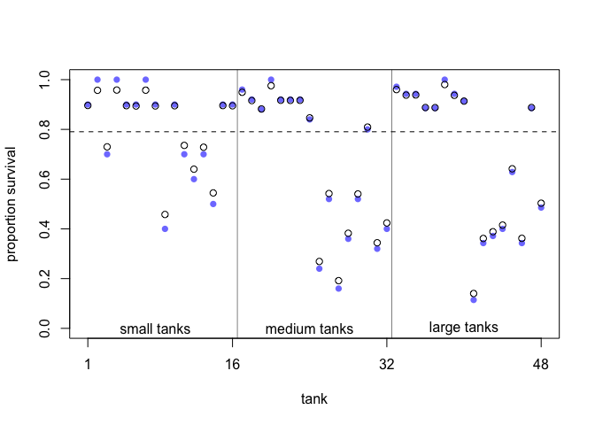
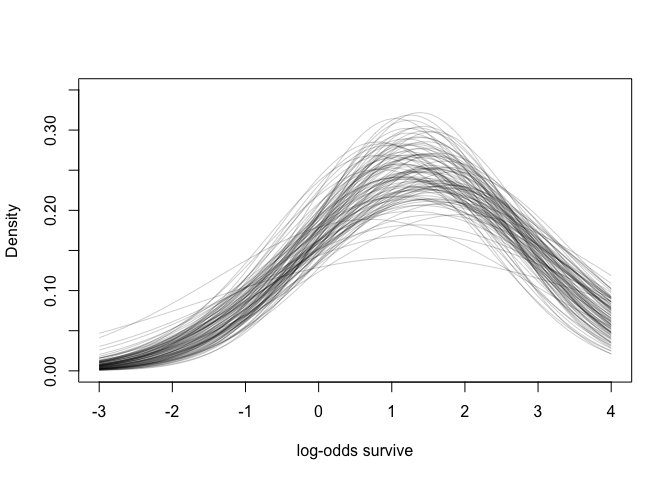
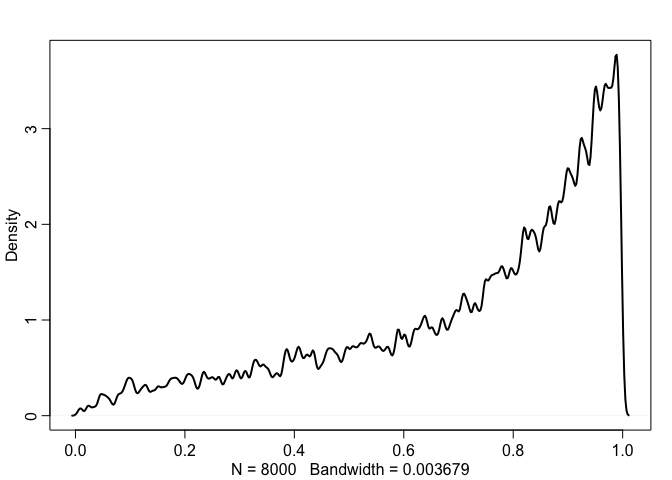
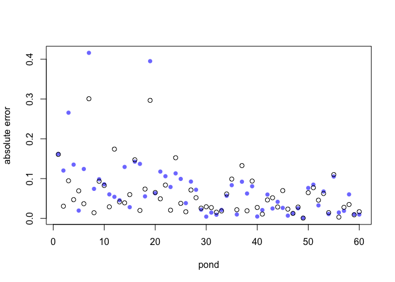

# 13. Models with memory


# 13.1. Example: Multilevel tadpoles


```r
data(reedfrogs)
d <- reedfrogs
str(d)
```

```
## 'data.frame':	48 obs. of  5 variables:
##  $ density : int  10 10 10 10 10 10 10 10 10 10 ...
##  $ pred    : Factor w/ 2 levels "no","pred": 1 1 1 1 1 1 1 1 2 2 ...
##  $ size    : Factor w/ 2 levels "big","small": 1 1 1 1 2 2 2 2 1 1 ...
##  $ surv    : int  9 10 7 10 9 9 10 9 4 9 ...
##  $ propsurv: num  0.9 1 0.7 1 0.9 0.9 1 0.9 0.4 0.9 ...
```


```r
# make the tank cluster variable
d$tank <- 1:nrow(d)
dat <- list(
    S = d$surv,
    N = d$density,
    tank = d$tank )
# approximate posterior
m13.1 <- ulam(
    alist(
        S ~ dbinom( N , p ) ,
        logit(p) <- a[tank] ,
        a[tank] ~ dnorm( 0 , 1.5 )
    ), data=dat , chains=4 , log_lik=TRUE, cores=2) # cores=2 added by Kazu
```


```r
precis(m13.1,depth=2) # 48 intercepts
```

```
##               mean        sd        5.5%       94.5%    n_eff      Rhat
## a[1]   1.717430429 0.7800059  0.53620397  3.02882411 4009.492 0.9995889
## a[2]   2.389568716 0.8794262  1.07471669  3.87832448 3471.922 0.9987754
## a[3]   0.751359232 0.6398656 -0.25032851  1.78904737 4691.621 0.9984247
## a[4]   2.385442015 0.9021415  1.02902422  3.86658735 4425.023 0.9988138
## a[5]   1.750792173 0.7722535  0.58248870  3.04078904 3629.625 0.9992053
## a[6]   1.709335644 0.7419339  0.58445448  2.90481074 4161.858 0.9986093
## a[7]   2.386568424 0.8883759  1.11321317  3.96784210 3717.226 0.9987041
## a[8]   1.717775973 0.7869597  0.57849056  3.06093634 3100.716 0.9984087
## a[9]  -0.364025177 0.6098591 -1.37698434  0.59294962 4630.900 0.9995242
## a[10]  1.711513301 0.7790703  0.56683543  3.04078908 4255.293 0.9992927
## a[11]  0.748830048 0.6509797 -0.23424028  1.79572872 3446.042 0.9984888
## a[12]  0.363666086 0.5934728 -0.58900597  1.29195626 3487.346 0.9989111
## a[13]  0.759171539 0.6885090 -0.27356027  1.89247761 5845.960 0.9993110
## a[14] -0.006261673 0.6068269 -0.98348760  0.97553608 4913.140 0.9989307
## a[15]  1.719056755 0.7708904  0.57450602  3.01503226 4610.534 0.9990756
## a[16]  1.725164919 0.7925593  0.55284066  2.99816234 4573.078 0.9992118
## a[17]  2.561392769 0.7215434  1.49229594  3.80432325 3462.896 1.0004666
## a[18]  2.130982648 0.5687518  1.29123053  3.10157964 3709.957 0.9998937
## a[19]  1.811368384 0.5245455  1.03370910  2.66300078 3867.018 0.9996750
## a[20]  3.101224874 0.8153406  1.91766579  4.48690956 2916.456 0.9991100
## a[21]  2.151106927 0.6239399  1.20195252  3.18074867 3989.896 0.9994790
## a[22]  2.124677612 0.5749596  1.27276966  3.10485417 3678.707 0.9983759
## a[23]  2.150005816 0.6241424  1.24616135  3.19697871 4269.891 0.9998476
## a[24]  1.558826709 0.5392284  0.74203149  2.50231193 4385.548 0.9983249
## a[25] -1.091586548 0.4262361 -1.77460093 -0.43767288 4310.977 0.9988241
## a[26]  0.068390888 0.3982777 -0.59200968  0.69217633 5787.522 0.9986974
## a[27] -1.532378269 0.5080773 -2.35531256 -0.76089779 4143.167 0.9989040
## a[28] -0.551232748 0.3988602 -1.20939240  0.06986364 4679.779 0.9981428
## a[29]  0.081936457 0.3837729 -0.52912827  0.69092048 4959.773 0.9983749
## a[30]  1.303371958 0.4775344  0.59717780  2.08711083 4097.677 0.9998335
## a[31] -0.726135253 0.4083550 -1.38685244 -0.07500304 4277.908 0.9983144
## a[32] -0.396530113 0.4087870 -1.04579435  0.22973150 4497.331 0.9987348
## a[33]  2.853006177 0.6628860  1.87534231  3.98261054 3374.553 0.9991104
## a[34]  2.476555461 0.5690607  1.63804439  3.40868773 2561.455 0.9984788
## a[35]  2.467040446 0.5891947  1.58862575  3.47281458 4666.730 0.9997804
## a[36]  1.909514112 0.5095199  1.16033139  2.73667893 4747.958 0.9987115
## a[37]  1.918144592 0.4894586  1.20403844  2.69255491 3071.469 0.9984958
## a[38]  3.336481622 0.7456544  2.22392498  4.58499387 4904.231 0.9989195
## a[39]  2.459058256 0.5842047  1.58357973  3.42436838 4457.298 0.9982765
## a[40]  2.174394782 0.5477364  1.33769655  3.09255161 4040.467 0.9987627
## a[41] -1.913814881 0.4489838 -2.64536496 -1.22854431 4058.205 0.9985091
## a[42] -0.628667487 0.3552092 -1.21396546 -0.06652176 4417.118 0.9997025
## a[43] -0.512385983 0.3418210 -1.06279490  0.04008842 5472.146 0.9984903
## a[44] -0.391916722 0.3403837 -0.93986710  0.14681495 4896.194 0.9988561
## a[45]  0.512704069 0.3457223 -0.04462783  1.08311366 5673.986 0.9983644
## a[46] -0.632278946 0.3589921 -1.20088416 -0.07080571 4508.976 0.9986705
## a[47]  1.903917010 0.4636245  1.20792550  2.67652465 4347.961 0.9982050
## a[48] -0.056412793 0.3180206 -0.56919895  0.45245858 3527.060 0.9995170
```

#  multilevel model

```r
m13.2 <- ulam(
    alist(
        S ~ dbinom( N , p ) ,
        logit(p) <- a[tank] ,
        a[tank] ~ dnorm( a_bar , sigma ) ,
        a_bar ~ dnorm( 0 , 1.5 ) ,
             sigma ~ dexp( 1 )
), data=dat , chains=4 , log_lik=TRUE ,cores=2) # cores=2 added by Kazu
```


```r
 compare( m13.1 , m13.2 )
```

```
##           WAIC       SE    dWAIC      dSE    pWAIC       weight
## m13.2 200.3537 7.009308  0.00000       NA 21.17681 0.9993415668
## m13.1 215.0037 4.431884 14.64998 3.764317 25.72810 0.0006584332
```


```r
precis(m13.2,depth=2) # sigma is 1.61. regularizing prior. now the amount of regu- larization has been learned from the data itself.
```

```
##             mean        sd        5.5%        94.5%    n_eff      Rhat
## a[1]   2.1552818 0.8592998  0.91546459  3.611264252 2843.266 0.9994322
## a[2]   3.1054908 1.1677833  1.44383189  5.080884735 2698.751 0.9999091
## a[3]   0.9934009 0.6779759 -0.04039973  2.154061019 4411.557 1.0000728
## a[4]   3.1314905 1.2015110  1.41987724  5.184506164 2615.800 0.9993395
## a[5]   2.1463006 0.9086153  0.79929958  3.697725268 3731.362 0.9991563
## a[6]   2.1324520 0.8413908  0.93785142  3.554627264 3447.506 0.9993089
## a[7]   3.1184766 1.1635458  1.46706663  5.099630262 2888.663 0.9984341
## a[8]   2.1353194 0.9218013  0.77464150  3.646873206 2965.062 0.9986831
## a[9]  -0.1690729 0.5927108 -1.12485794  0.780309233 4301.290 0.9989473
## a[10]  2.1426069 0.8886825  0.86780136  3.675316258 3090.026 0.9992272
## a[11]  1.0233909 0.6899002 -0.04602424  2.183757824 4387.372 0.9999627
## a[12]  0.5756094 0.6040896 -0.36871598  1.559055352 3883.631 0.9988513
## a[13]  0.9859929 0.6636094 -0.03802938  2.058284910 3925.855 0.9990616
## a[14]  0.1786954 0.6238318 -0.78319788  1.144709006 5658.940 0.9984427
## a[15]  2.1510924 0.8974918  0.83028958  3.690270715 3005.107 0.9990077
## a[16]  2.1412813 0.8502498  0.88964521  3.575597264 3714.989 0.9986389
## a[17]  2.9276840 0.7909547  1.78430843  4.237480828 2898.454 0.9999062
## a[18]  2.3875587 0.6632475  1.41008878  3.496729285 3429.075 0.9993187
## a[19]  2.0136779 0.5789508  1.13974866  3.000752805 4406.301 0.9994181
## a[20]  3.6896942 1.0305330  2.25956802  5.460204683 2212.664 0.9984400
## a[21]  2.4024620 0.6940157  1.37407248  3.559667931 3543.525 0.9987154
## a[22]  2.3966135 0.6628094  1.41874385  3.545457430 3481.984 0.9986948
## a[23]  2.4010229 0.6677219  1.41563248  3.523310748 3170.051 0.9998702
## a[24]  1.7060658 0.5207198  0.93379257  2.593538077 3747.100 0.9992564
## a[25] -1.0000447 0.4397111 -1.73875446 -0.329834027 4433.879 0.9985256
## a[26]  0.1685869 0.3873014 -0.45657289  0.785273805 3185.238 0.9995305
## a[27] -1.4379130 0.4885744 -2.23527212 -0.682882547 4647.523 0.9988604
## a[28] -0.4794718 0.4054468 -1.13542017  0.157136835 4813.767 0.9982897
## a[29]  0.1620750 0.3876254 -0.45548441  0.764851717 5570.114 0.9987875
## a[30]  1.4449116 0.4734875  0.73724222  2.245956837 4616.408 0.9988200
## a[31] -0.6444759 0.4218314 -1.32956726  0.008051329 4957.566 0.9983193
## a[32] -0.3071674 0.4198049 -0.99357488  0.361826798 4211.742 0.9987630
## a[33]  3.1776644 0.7380290  2.12070757  4.465657060 2305.201 0.9997797
## a[34]  2.7120115 0.6554430  1.77461551  3.855478477 3263.261 0.9994556
## a[35]  2.7249302 0.6572190  1.74210927  3.831957208 3196.848 0.9993627
## a[36]  2.0695597 0.5237163  1.29134694  2.936847485 3837.190 0.9987031
## a[37]  2.0661956 0.4975671  1.31259552  2.880043959 3618.076 0.9992310
## a[38]  3.9057155 0.9965674  2.44804513  5.634524311 2764.400 1.0000315
## a[39]  2.6990140 0.6429128  1.75891232  3.751578407 3461.002 0.9988144
## a[40]  2.3599111 0.5643749  1.51553652  3.340709793 3824.413 0.9991085
## a[41] -1.8140339 0.4690115 -2.59010985 -1.120929109 3480.601 0.9992444
## a[42] -0.5689572 0.3466208 -1.11360459 -0.032081772 4086.633 0.9995089
## a[43] -0.4536325 0.3357392 -0.98962454  0.080601962 5471.319 0.9988916
## a[44] -0.3426871 0.3303482 -0.85939759  0.178675662 4037.834 0.9986366
## a[45]  0.5824187 0.3481472  0.01268031  1.153022518 4174.186 0.9991051
## a[46] -0.5669220 0.3447651 -1.12872951 -0.016141464 4056.027 0.9996955
## a[47]  2.0708432 0.5054379  1.30828654  2.904157018 3973.815 0.9987617
## a[48]  0.0126868 0.3489735 -0.54542457  0.581062232 5161.393 0.9984164
## a_bar  1.3467938 0.2572298  0.94342798  1.753593875 2992.691 0.9985378
## sigma  1.6352940 0.2196469  1.31744606  2.015941292 1420.226 1.0002037
```


```r
# extract Stan samples
post <- extract.samples(m13.2)
# compute median intercept for each tank
# also transform to probability with logistic
d$propsurv.est <- logistic( apply( post$a , 2 , mean ) )
# display raw proportions surviving in each tank
plot( d$propsurv , ylim=c(0,1) , pch=16 , xaxt="n" ,
    xlab="tank" , ylab="proportion survival" , col=rangi2 )
axis( 1 , at=c(1,16,32,48) , labels=c(1,16,32,48) )
# overlay posterior means
points( d$propsurv.est )
# mark posterior mean probability across tanks
abline( h=mean(inv_logit(post$a_bar)) , lty=2 )
# draw vertical dividers between tank densities
abline( v=16.5 , lwd=0.5 )
abline( v=32.5 , lwd=0.5 )
text( 8 , 0 , "small tanks" )
text( 16+8 , 0 , "medium tanks" )
text( 32+8 , 0 , "large tanks" )
```

<!-- -->


```r
# show first 100 populations in the posterior
plot( NULL , xlim=c(-3,4) , ylim=c(0,0.35) ,
    xlab="log-odds survive" , ylab="Density" )
for ( i in 1:100 )
    curve( dnorm(x,post$a_bar[i],post$sigma[i]) , add=TRUE ,
    col=col.alpha("black",0.2) )
```

<!-- -->

```r
# sample 8000 imaginary tanks from the posterior distribution
sim_tanks <- rnorm( 8000 , post$a_bar , post$sigma )
# transform to probability and visualize
dens( inv_logit(sim_tanks) , lwd=2 , adj=0.1 )
```

<!-- -->

# 13.2. Varyingeffectsandtheunderfitting/overfittingtrade-off
* complete pooling vs partioal pooling
## 13.2.1. Themodel.
## 13.2.2. Assign values to the parameters.

```r
a_bar <- 1.5
sigma <- 1.5
nponds <- 60
Ni <- as.integer( rep( c(5,10,25,35) , each=15 ) )
```


```r
set.seed(5005)
a_pond <- rnorm( nponds , mean=a_bar , sd=sigma )
```


```r
dsim <- data.frame( pond=1:nponds , Ni=Ni , true_a=a_pond )
```


```r
class(1:3)
```

```
## [1] "integer"
```

```r
class(c(1,2,3))
```

```
## [1] "numeric"
```
## 13.2.3. Simulate survivors. 

```r
 dsim$Si <- rbinom( nponds , prob=logistic(dsim$true_a) , size=dsim$Ni )
```
## 13.2.4. Compute the no-pooling estimates.

```r
  dsim$p_nopool <- dsim$Si / dsim$Ni
```

## 13.2.5. Computethepartial-poolingestimates. 

```r
dat <- list( Si=dsim$Si , Ni=dsim$Ni , pond=dsim$pond )
m13.3 <- ulam(
    alist(
        Si ~ dbinom( Ni , p ),
        logit(p) <- a_pond[pond],
        a_pond[pond] ~ dnorm( a_bar , sigma ),
        a_bar ~ dnorm( 0 , 1.5 ),
        sigma ~ dexp( 1 )
    ), data=dat , chains=4, cores=2) # added cores=2
```


```r
precis( m13.3 , depth=2 )
```

```
##                    mean        sd         5.5%       94.5%    n_eff      Rhat
## a_pond[1]   1.676958347 1.0791655  0.070438932  3.51063228 3600.744 0.9988294
## a_pond[2]   2.883910925 1.2955621  0.971755697  5.01353909 3170.717 0.9986720
## a_pond[3]  -0.622836362 0.8937184 -2.079968031  0.74225886 2596.322 0.9988196
## a_pond[4]   2.897603481 1.2838931  1.014973189  5.10805404 2832.309 0.9992674
## a_pond[5]   2.881044645 1.2868565  1.021719250  5.09182600 2421.407 0.9992771
## a_pond[6]   2.864396970 1.2464944  1.111819051  5.02201170 2260.010 1.0000468
## a_pond[7]   0.072140710 0.8649073 -1.347281996  1.49405729 3331.408 0.9994322
## a_pond[8]   2.865432914 1.2511003  1.068731804  4.98590002 2255.893 0.9999438
## a_pond[9]   1.683587275 1.0035333  0.161646415  3.28998678 3057.565 0.9985222
## a_pond[10]  1.680821370 1.0279601  0.158767409  3.39735773 2886.501 0.9994868
## a_pond[11]  2.877077416 1.2843958  0.986739589  5.09268525 3180.823 0.9984349
## a_pond[12]  0.089293675 0.8290759 -1.233152134  1.43058485 3241.033 1.0003906
## a_pond[13]  2.866042840 1.2328766  1.029202364  5.04878455 2608.733 1.0003606
## a_pond[14]  2.864331696 1.2822216  0.965316947  5.09799630 2740.283 0.9989108
## a_pond[15]  2.894992733 1.2850352  1.027791552  5.09882654 2749.559 0.9985280
## a_pond[16]  1.566425051 0.7360711  0.502282748  2.81385942 2909.897 0.9994600
## a_pond[17] -1.427142407 0.7435199 -2.657608398 -0.30158907 3458.750 0.9992004
## a_pond[18]  1.030364177 0.6767997 -0.010262507  2.16552634 2998.995 0.9993532
## a_pond[19] -0.939054159 0.6670155 -2.028170926  0.05990632 3965.182 0.9988971
## a_pond[20]  1.566469518 0.7877607  0.418183803  2.89631981 3260.420 0.9991498
## a_pond[21] -0.141020450 0.6373754 -1.188191727  0.85440552 3823.332 0.9984419
## a_pond[22]  2.221631537 0.8602999  0.944551984  3.66958583 2949.477 0.9982861
## a_pond[23]  3.278058972 1.1671080  1.582581878  5.29996152 2580.301 1.0000070
## a_pond[24]  0.628124064 0.6523584 -0.368814649  1.73180698 3761.880 0.9992558
## a_pond[25]  3.254083497 1.2179835  1.491914229  5.41040652 2869.482 1.0006103
## a_pond[26]  2.250433456 0.9154203  0.921968738  3.78283278 2495.738 0.9987163
## a_pond[27]  1.042703476 0.6650897  0.048670030  2.13935131 3568.237 0.9986702
## a_pond[28]  2.258489861 0.8922566  0.937362997  3.77650032 3233.618 1.0004073
## a_pond[29]  1.567497187 0.7546286  0.469124310  2.83177106 2773.309 0.9996638
## a_pond[30]  1.067776648 0.6869971  0.021358996  2.23402602 2849.760 1.0021599
## a_pond[31]  2.461394821 0.6933817  1.415959793  3.63314798 3730.597 0.9994881
## a_pond[32]  2.047812989 0.5719701  1.186346461  3.02487031 3777.285 0.9983165
## a_pond[33]  1.729258228 0.5329001  0.925303080  2.60755647 3678.059 0.9983721
## a_pond[34]  1.236824816 0.4820751  0.492812992  2.02977561 3833.321 0.9998664
## a_pond[35]  0.670694870 0.4301685  0.002993287  1.34625960 3612.002 0.9985702
## a_pond[36]  3.836144315 1.0190737  2.347556250  5.59447115 2007.340 0.9990543
## a_pond[37] -0.983882408 0.4433677 -1.695134659 -0.29322127 3793.247 0.9985220
## a_pond[38] -1.182748472 0.4408844 -1.905178463 -0.53568905 3969.890 0.9984810
## a_pond[39]  0.659827116 0.4274987 -0.003584818  1.35328490 3610.874 0.9984517
## a_pond[40]  3.836075354 1.0534423  2.349481592  5.67713091 2354.418 0.9992760
## a_pond[41]  3.832895776 1.0387865  2.379123876  5.61381650 1883.864 0.9993120
## a_pond[42]  2.448067257 0.6937767  1.440558394  3.68406923 2924.199 1.0002030
## a_pond[43] -0.137309317 0.4000900 -0.764804825  0.49223225 3786.182 0.9992091
## a_pond[44]  0.657035502 0.4044730  0.026189383  1.31278111 2620.097 1.0001779
## a_pond[45] -1.189207929 0.4726953 -1.985937237 -0.46453281 4355.393 0.9995732
## a_pond[46]  0.008863187 0.3354882 -0.531871884  0.54733843 3854.574 0.9995490
## a_pond[47]  4.058896547 0.9940153  2.646373513  5.79231393 2046.550 0.9993986
## a_pond[48]  2.113284980 0.5114159  1.327520662  2.95475103 3573.331 0.9985146
## a_pond[49]  1.853026761 0.4775604  1.122793559  2.64573576 3914.928 0.9985823
## a_pond[50]  2.775904110 0.6686363  1.820963773  3.89995128 2900.435 0.9994723
## a_pond[51]  2.402078705 0.5837040  1.554027667  3.38428178 3098.705 0.9992225
## a_pond[52]  0.351714885 0.3458535 -0.206174732  0.91339877 3741.207 1.0000140
## a_pond[53]  2.091492335 0.5108593  1.320457930  2.95679006 2861.018 0.9998841
## a_pond[54]  4.039300693 0.9819007  2.603744239  5.74721708 2753.975 0.9998004
## a_pond[55]  1.123191243 0.3894136  0.509688309  1.75272330 3778.428 0.9982309
## a_pond[56]  2.773006163 0.6479446  1.805272783  3.88362763 2561.174 0.9987934
## a_pond[57]  0.710177231 0.3535668  0.146866419  1.28571164 3516.114 0.9990526
## a_pond[58]  4.046377695 1.0137593  2.634770254  5.80908877 2273.153 0.9991536
## a_pond[59]  1.627723651 0.4423421  0.960089716  2.36194134 3250.755 0.9983619
## a_pond[60]  2.395077578 0.5531221  1.576935805  3.36236498 3184.119 0.9996641
## a_bar       1.662467039 0.2553483  1.278109325  2.08186314 2212.751 0.9990564
## sigma       1.674922860 0.2332808  1.343565769  2.07585662  874.923 1.0009644
```


```r
post <- extract.samples(m13.3)
dsim$p_partpool <- apply(inv_logit(post$a_pond),2,mean)
```


```r
dsim$p_true <-inv_logit(dsim$true_a)
```


```r
nopool_error <- abs( dsim$p_nopool - dsim$p_true )
partpool_error <- abs( dsim$p_partpool - dsim$p_true )
```


```r
plot( 1:60 , nopool_error , xlab="pond" , ylab="absolute error" ,
    col=rangi2 , pch=16 )
points( 1:60 , partpool_error )
```

<!-- -->


```r
nopool_avg <- aggregate(nopool_error,list(dsim$Ni),mean)
partpool_avg <- aggregate(partpool_error,list(dsim$Ni),mean)
```


```r
a <- 1.5
sigma <- 1.5
nponds <- 60
Ni <- as.integer( rep( c(5,10,25,35) , each=15 ) )
a_pond <- rnorm( nponds , mean=a , sd=sigma )
dsim <- data.frame( pond=1:nponds , Ni=Ni , true_a=a_pond )
dsim$Si <- rbinom( nponds,prob=inv_logit( dsim$true_a ),size=dsim$Ni )
dsim$p_nopool <- dsim$Si / dsim$Ni
newdat <- list(Si=dsim$Si,Ni=dsim$Ni,pond=1:nponds)
m13.3new <- stan( fit=m13.3@stanfit , data=newdat , chains=4 )
```

```
## 
## SAMPLING FOR MODEL 'd8ab7f3d807d0eb7d841894a7fbd4a24' NOW (CHAIN 1).
## Chain 1: 
## Chain 1: Gradient evaluation took 8.2e-05 seconds
## Chain 1: 1000 transitions using 10 leapfrog steps per transition would take 0.82 seconds.
## Chain 1: Adjust your expectations accordingly!
## Chain 1: 
## Chain 1: 
## Chain 1: Iteration:    1 / 2000 [  0%]  (Warmup)
## Chain 1: Iteration:  200 / 2000 [ 10%]  (Warmup)
## Chain 1: Iteration:  400 / 2000 [ 20%]  (Warmup)
## Chain 1: Iteration:  600 / 2000 [ 30%]  (Warmup)
## Chain 1: Iteration:  800 / 2000 [ 40%]  (Warmup)
## Chain 1: Iteration: 1000 / 2000 [ 50%]  (Warmup)
## Chain 1: Iteration: 1001 / 2000 [ 50%]  (Sampling)
## Chain 1: Iteration: 1200 / 2000 [ 60%]  (Sampling)
## Chain 1: Iteration: 1400 / 2000 [ 70%]  (Sampling)
## Chain 1: Iteration: 1600 / 2000 [ 80%]  (Sampling)
## Chain 1: Iteration: 1800 / 2000 [ 90%]  (Sampling)
## Chain 1: Iteration: 2000 / 2000 [100%]  (Sampling)
## Chain 1: 
## Chain 1:  Elapsed Time: 0.262685 seconds (Warm-up)
## Chain 1:                0.120294 seconds (Sampling)
## Chain 1:                0.382979 seconds (Total)
## Chain 1: 
## 
## SAMPLING FOR MODEL 'd8ab7f3d807d0eb7d841894a7fbd4a24' NOW (CHAIN 2).
## Chain 2: 
## Chain 2: Gradient evaluation took 1.5e-05 seconds
## Chain 2: 1000 transitions using 10 leapfrog steps per transition would take 0.15 seconds.
## Chain 2: Adjust your expectations accordingly!
## Chain 2: 
## Chain 2: 
## Chain 2: Iteration:    1 / 2000 [  0%]  (Warmup)
## Chain 2: Iteration:  200 / 2000 [ 10%]  (Warmup)
## Chain 2: Iteration:  400 / 2000 [ 20%]  (Warmup)
## Chain 2: Iteration:  600 / 2000 [ 30%]  (Warmup)
## Chain 2: Iteration:  800 / 2000 [ 40%]  (Warmup)
## Chain 2: Iteration: 1000 / 2000 [ 50%]  (Warmup)
## Chain 2: Iteration: 1001 / 2000 [ 50%]  (Sampling)
## Chain 2: Iteration: 1200 / 2000 [ 60%]  (Sampling)
## Chain 2: Iteration: 1400 / 2000 [ 70%]  (Sampling)
## Chain 2: Iteration: 1600 / 2000 [ 80%]  (Sampling)
## Chain 2: Iteration: 1800 / 2000 [ 90%]  (Sampling)
## Chain 2: Iteration: 2000 / 2000 [100%]  (Sampling)
## Chain 2: 
## Chain 2:  Elapsed Time: 0.219656 seconds (Warm-up)
## Chain 2:                0.116469 seconds (Sampling)
## Chain 2:                0.336125 seconds (Total)
## Chain 2: 
## 
## SAMPLING FOR MODEL 'd8ab7f3d807d0eb7d841894a7fbd4a24' NOW (CHAIN 3).
## Chain 3: 
## Chain 3: Gradient evaluation took 1.8e-05 seconds
## Chain 3: 1000 transitions using 10 leapfrog steps per transition would take 0.18 seconds.
## Chain 3: Adjust your expectations accordingly!
## Chain 3: 
## Chain 3: 
## Chain 3: Iteration:    1 / 2000 [  0%]  (Warmup)
## Chain 3: Iteration:  200 / 2000 [ 10%]  (Warmup)
## Chain 3: Iteration:  400 / 2000 [ 20%]  (Warmup)
## Chain 3: Iteration:  600 / 2000 [ 30%]  (Warmup)
## Chain 3: Iteration:  800 / 2000 [ 40%]  (Warmup)
## Chain 3: Iteration: 1000 / 2000 [ 50%]  (Warmup)
## Chain 3: Iteration: 1001 / 2000 [ 50%]  (Sampling)
## Chain 3: Iteration: 1200 / 2000 [ 60%]  (Sampling)
## Chain 3: Iteration: 1400 / 2000 [ 70%]  (Sampling)
## Chain 3: Iteration: 1600 / 2000 [ 80%]  (Sampling)
## Chain 3: Iteration: 1800 / 2000 [ 90%]  (Sampling)
## Chain 3: Iteration: 2000 / 2000 [100%]  (Sampling)
## Chain 3: 
## Chain 3:  Elapsed Time: 0.214512 seconds (Warm-up)
## Chain 3:                0.192428 seconds (Sampling)
## Chain 3:                0.40694 seconds (Total)
## Chain 3: 
## 
## SAMPLING FOR MODEL 'd8ab7f3d807d0eb7d841894a7fbd4a24' NOW (CHAIN 4).
## Chain 4: 
## Chain 4: Gradient evaluation took 2.6e-05 seconds
## Chain 4: 1000 transitions using 10 leapfrog steps per transition would take 0.26 seconds.
## Chain 4: Adjust your expectations accordingly!
## Chain 4: 
## Chain 4: 
## Chain 4: Iteration:    1 / 2000 [  0%]  (Warmup)
## Chain 4: Iteration:  200 / 2000 [ 10%]  (Warmup)
## Chain 4: Iteration:  400 / 2000 [ 20%]  (Warmup)
## Chain 4: Iteration:  600 / 2000 [ 30%]  (Warmup)
## Chain 4: Iteration:  800 / 2000 [ 40%]  (Warmup)
## Chain 4: Iteration: 1000 / 2000 [ 50%]  (Warmup)
## Chain 4: Iteration: 1001 / 2000 [ 50%]  (Sampling)
## Chain 4: Iteration: 1200 / 2000 [ 60%]  (Sampling)
## Chain 4: Iteration: 1400 / 2000 [ 70%]  (Sampling)
## Chain 4: Iteration: 1600 / 2000 [ 80%]  (Sampling)
## Chain 4: Iteration: 1800 / 2000 [ 90%]  (Sampling)
## Chain 4: Iteration: 2000 / 2000 [100%]  (Sampling)
## Chain 4: 
## Chain 4:  Elapsed Time: 0.244464 seconds (Warm-up)
## Chain 4:                0.283636 seconds (Sampling)
## Chain 4:                0.5281 seconds (Total)
## Chain 4:
```

```r
post <- extract.samples( m13.3new )
dsim$p_partpool <- apply( inv_logit(post$a_pond) , 2 , mean )
dsim$p_true <- inv_logit( dsim$true_a )
nopool_error <- abs( dsim$p_nopool - dsim$p_true )
partpool_error <- abs( dsim$p_partpool - dsim$p_true )
plot( 1:60 , nopool_error , xlab="pond" , ylab="absolute error" , col=rangi2 , pch=16 )
points( 1:60 , partpool_error )
```

<!-- -->

# practices
# 12E1
# 12E2
# 12E3
# 12M1
# 12M2
# 12H1


