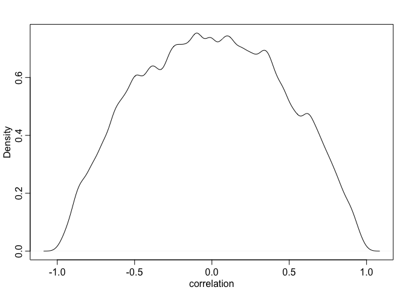

# 14.1. Varying slopes by construction
## 14.1.1. Simulate the population. 

```r
a <- 3.5
b <- (-1)
sigma_a <- 1
sigma_b <- 0.5
rho <- (-0.7)
# average morning wait time
# average difference afternoon wait time
# std dev in intercepts
# std dev in slopes
# correlation between intercepts and slopes
```


```r
Mu <- c( a , b )
```


```r
cov_ab <- sigma_a*sigma_b*rho
Sigma <- matrix( c(sigma_a^2,cov_ab,cov_ab,sigma_b^2) , ncol=2 )
```


```r
 matrix( c(1,2,3,4) , nrow=2 , ncol=2 )
```

```
##      [,1] [,2]
## [1,]    1    3
## [2,]    2    4
```


```r
sigmas <- c(sigma_a,sigma_b) # standard deviations
Rho <- matrix( c(1,rho,rho,1) , nrow=2 ) # correlation matrix
# now matrix multiply to get covariance matrix
Sigma <- diag(sigmas) %*% Rho %*% diag(sigmas)
```


```r
 N_cafes <- 20
```


```r
library(MASS)
```

```
## 
## Attaching package: 'MASS'
```

```
## The following object is masked from 'package:dplyr':
## 
##     select
```

```r
set.seed(5) # used to replicate example
vary_effects <- mvrnorm( N_cafes , Mu , Sigma )
```


```r
a_cafe <- vary_effects[,1]
b_cafe <- vary_effects[,2]
```


```r
plot( a_cafe , b_cafe , col=rangi2 ,
    xlab="intercepts (a_cafe)" , ylab="slopes (b_cafe)" )
# overlay population distribution
library(ellipse)
```

```
## 
## Attaching package: 'ellipse'
```

```
## The following object is masked from 'package:rethinking':
## 
##     pairs
```

```
## The following object is masked from 'package:graphics':
## 
##     pairs
```

```r
for ( l in c(0.1,0.3,0.5,0.8,0.99) )
    lines(ellipse(Sigma,centre=Mu,level=l),col=col.alpha("black",0.2))
```

<!-- -->

# 14.1.2. Simulate observations.

```r
set.seed(22)
N_visits <- 10
afternoon <- rep(0:1,N_visits*N_cafes/2)
cafe_id <- rep( 1:N_cafes , each=N_visits )
mu <- a_cafe[cafe_id] + b_cafe[cafe_id]*afternoon
sigma <- 0.5  # std dev within cafes
wait <- rnorm( N_visits*N_cafes , mu , sigma )
d <- data.frame( cafe=cafe_id , afternoon=afternoon , wait=wait )
```

# 14.1.3. The varying slopes model.

```r
R <- rlkjcorr( 1e4 , K=2 , eta=2 )
dens( R[,1,2] , xlab="correlation" )
```

<!-- -->


```r
m14.1 <- ulam(
    alist(
        wait ~ normal( mu , sigma ),
        mu <- a_cafe[cafe] + b_cafe[cafe]*afternoon,
        c(a_cafe,b_cafe)[cafe] ~ multi_normal( c(a,b) , Rho , sigma_cafe ),
        a ~ normal(5,2),
        b ~ normal(-1,0.5),
        sigma_cafe ~ exponential(1),
        sigma ~ exponential(1),
        Rho ~ lkj_corr(2)
    ) , data=d , chains=4 , cores=2,iter=2000,log_lik=TRUE)
```

```
## Warning: The largest R-hat is NA, indicating chains have not mixed.
## Running the chains for more iterations may help. See
## http://mc-stan.org/misc/warnings.html#r-hat
```

```
## Warning: Bulk Effective Samples Size (ESS) is too low, indicating posterior means and medians may be unreliable.
## Running the chains for more iterations may help. See
## http://mc-stan.org/misc/warnings.html#bulk-ess
```

```
## Warning: Tail Effective Samples Size (ESS) is too low, indicating posterior variances and tail quantiles may be unreliable.
## Running the chains for more iterations may help. See
## http://mc-stan.org/misc/warnings.html#tail-ess
```

```r
# What is lkj_corr?
?rlkjcorr
?rmultinom # for multi_ormal, correct?
```


```r
post <- extract.samples(m14.1)
dens( post$Rho[,1,2] )
```

<!-- -->


```r
# compute unpooled estimates directly from data
a1 <- sapply( 1:N_cafes ,
        function(i) mean(wait[cafe_id==i & afternoon==0]) )
b1 <- sapply( 1:N_cafes ,
        function(i) mean(wait[cafe_id==i & afternoon==1]) ) - a1
# extract posterior means of partially pooled estimates
post <- extract.samples(m14.1) # m14.1 instead of m13.1?
a2 <- apply( post$a_cafe , 2 , mean )
b2 <- apply( post$b_cafe , 2 , mean )
# plot both and connect with lines
plot( a1 , b1 , xlab="intercept" , ylab="slope" ,
    pch=16 , col=rangi2 , ylim=c( min(b1)-0.1 , max(b1)+0.1 ) ,
    xlim=c( min(a1)-0.1 , max(a1)+0.1 ) )
points(a2,b2,pch=1) 
for ( i in 1:N_cafes ) lines( c(a1[i],a2[i]) , c(b1[i],b2[i]))
```

<!-- -->


```r
# compute posterior mean bivariate Gaussian
Mu_est <- c( mean(post$a) , mean(post$b) )
rho_est <- mean( post$Rho[,1,2] )
sa_est <- mean( post$sigma_cafe[,1] )
sb_est <- mean( post$sigma_cafe[,2] )
cov_ab <- sa_est*sb_est*rho_est
Sigma_est <- matrix( c(sa_est^2,cov_ab,cov_ab,sb_est^2) , ncol=2 )
# draw contours
library(ellipse)
for ( l in c(0.1,0.3,0.5,0.8,0.99) )
    lines(ellipse(Sigma_est,centre=Mu_est,level=l),
        col=col.alpha("black",0.2))
```

```
## Error in plot.xy(xy.coords(x, y), type = type, ...): plot.new has not been called yet
```

* outcome scale

```r
# convert varying effects to waiting times
wait_morning_1 <- (a1)
wait_afternoon_1 <- (a1 + b1)
wait_morning_2 <- (a2)
wait_afternoon_2 <- (a2 + b2)
# plot both and connect with lines
plot( wait_morning_1 , wait_afternoon_1 , xlab="morning wait" ,
    ylab="afternoon wait" , pch=16 , col=rangi2 ,
    ylim=c( min(wait_afternoon_1)-0.1 , max(wait_afternoon_1)+0.1 ) ,
    xlim=c( min(wait_morning_1)-0.1 , max(wait_morning_1)+0.1 ) )
points( wait_morning_2 , wait_afternoon_2 , pch=1 )
for ( i in 1:N_cafes )
    lines( c(wait_morning_1[i],wait_morning_2[i]) ,
    c(wait_afternoon_1[i],wait_afternoon_2[i]) )
abline( a=0 , b=1 , lty=2 )
```

<!-- -->


```r
# now shrinkage distribution by simulation
v <- mvrnorm( 1e4 , Mu_est , Sigma_est ) # mvrnorm()
v[,2] <- v[,1] + v[,2] # calculate afternoon wait
Sigma_est2 <- cov(v)
Mu_est2 <- Mu_est
Mu_est2[2] <- Mu_est[1]+Mu_est[2]
# draw contours
library(ellipse)
for ( l in c(0.1,0.3,0.5,0.8,0.99) )
    lines(ellipse(Sigma_est2,centre=Mu_est2,level=l),
        col=col.alpha("black",0.5))
```

```
## Error in plot.xy(xy.coords(x, y), type = type, ...): plot.new has not been called yet
```


# problems
14E1

* original

$$
y_i \sim Normal(\mu_i, \sigma) \\
\mu_i = \alpha_{GROUP[i]} + \beta x_i \\
\alpha_{GROUP} \sim Normal(\alpha, \sigma_\alpha) \\
\alpha \sim Normal(0, 10) \\
\beta \sim Normal(0, 1) \\ 
\sigma \sim HalfCauchy(0,2) \\ 
\sigma_\alpha \sim HalfCouchy(0, 2)
$$

* VARYING SLOPES ON THE PREDICTOR X

yi ~ Normal(mu_i, sigma)
mu_i = alpha_group[i] + beta[i] * xi
[alpha_group[i], beta[i]] ~ MVNormal([alpha, beta], S)
S = (sigma_alpha, 0, 0, sigma_beta)_2x2 R (sigma_alpha, 0, 0, sigma_beta)_2x2
alpha ~ Normal(0, 10)
beta ~ Normal(0, 1)
sigma ~ HalfCauchy(0, 2)
sigma_alpha ~ HalfCauchy(0, 2)
sigma_beta ~ HalfCauchy(0, 2)
R ~ LKJcorr(2)


* I gave up... 
$$
y_i \sim Normal(\mu_i, \ sigma) \\
\mu_i = \alpha_{GROUP[i]} + \beta x_i \\
\alpha_{GROUP} \sim Normal(\alpha, \sigma_\alpha) \\

\begin{bmatrix}\alpha_{GROUP} \\
\beta
\end{bmatrix} \sim MVNormal\
begin{pmatrix}
  \begin{bmatrix}\alpha_{GROUP} \\
  \beta
  \end{bmatrix}
  & S
\end{pmatrix}\\

S = \begin{pmatrix}a & b\\\ c & d\end{pmatrix} R \begin{pmatrix}a & b\\\ c & d\end{pmatrix} \\\\

\alpha \sim Normal(0, 10) \\
\beta \sim Normal(0, 1) \\ 
\sigma \sim HalfCauchy(0,2) \\ 
\sigma_\alpha \sim HalfCouchy(0, 2) \\


X = \begin{bmatrix}1 & x_{1}\\
1 & x_{2}\\
1 & x_{3}
\end{bmatrix} \\

S = \begin{pmatrix}a & b\\\ c & d\end{pmatrix} \\
$$


14E2 Think up a context in which varying intercepts will be positively correlated with varying
slopes. Provide a mechanistic explanation for the correlation.
(Kazu's answer) Taller swimmers are heavyer. Tall and heavy swimmers swim faster because they can pull more water per stroke than shorter swimmers do and their stroke speed is maintained by more muscles.

14E3 When is it possible for a varying slopes model to have fewer effective parameters (asestimated by WAIC or DIC) than the corresponding model with fixed (unpooled) slopes? Explain.


14M1. Repeat the cafe robot simulation from the beginning of the chapter. This time, set rho to zero, so that there is no correlation between intercepts and slopes. How does the posterior distribution of the correlation reflect this change in the underlying simulation

```r
a <- 3.5
b <- (-1)
sigma_a <- 1
sigma_b <- 0.5
# rho <- (-0.7)
rho <- 0 # new 
# average morning wait time
# average difference afternoon wait time
# std dev in intercepts
# std dev in slopes
# correlation between intercepts and slopes
cov_ab <- sigma_a*sigma_b*rho
Sigma <- matrix( c(sigma_a^2,cov_ab,cov_ab,sigma_b^2) , ncol=2 )
sigmas <- c(sigma_a,sigma_b) # standard deviations
Rho <- matrix( c(1,rho,rho,1) , nrow=2 ) # correlation matrix
# now matrix multiply to get covariance matrix
Sigma <- diag(sigmas) %*% Rho %*% diag(sigmas)
 N_cafes <- 20
library(MASS)
set.seed(5) # used to replicate example
vary_effects <- mvrnorm( N_cafes , Mu , Sigma )
a_cafe <- vary_effects[,1]
b_cafe <- vary_effects[,2]
#
plot( a_cafe , b_cafe , col=rangi2 ,
    xlab="intercepts (a_cafe)" , ylab="slopes (b_cafe)" )
# overlay population distribution
library(ellipse)
for ( l in c(0.1,0.3,0.5,0.8,0.99) )
    lines(ellipse(Sigma,centre=Mu,level=l),col=col.alpha("black",0.2))
```

<!-- -->

```r
#
set.seed(22)
N_visits <- 10
afternoon <- rep(0:1,N_visits*N_cafes/2)
cafe_id <- rep( 1:N_cafes , each=N_visits )
mu <- a_cafe[cafe_id] + b_cafe[cafe_id]*afternoon
sigma <- 0.5  # std dev within cafes
wait <- rnorm( N_visits*N_cafes , mu , sigma )
d <- data.frame( cafe=cafe_id , afternoon=afternoon , wait=wait )

#
R <- rlkjcorr( 1e4 , K=2 , eta=2 )
dens( R[,1,2] , xlab="correlation" )
```

<!-- -->
* model

```r
m14.1.rhozero <- ulam(
    alist(
        wait ~ normal( mu , sigma ),
        mu <- a_cafe[cafe] + b_cafe[cafe]*afternoon,
        c(a_cafe,b_cafe)[cafe] ~ multi_normal( c(a,b) , Rho , sigma_cafe ),
        a ~ normal(5,2),
        b ~ normal(-1,0.5),
        sigma_cafe ~ exponential(1),
        sigma ~ exponential(1),
        Rho ~ lkj_corr(2)
    ) , data=d , chains=4 , cores=2,iter=2000,log_lik=TRUE)
```

```
## recompiling to avoid crashing R session
```

```
## Warning: The largest R-hat is NA, indicating chains have not mixed.
## Running the chains for more iterations may help. See
## http://mc-stan.org/misc/warnings.html#r-hat
```

```
## Warning: Bulk Effective Samples Size (ESS) is too low, indicating posterior means and medians may be unreliable.
## Running the chains for more iterations may help. See
## http://mc-stan.org/misc/warnings.html#bulk-ess
```

```
## Warning: Tail Effective Samples Size (ESS) is too low, indicating posterior variances and tail quantiles may be unreliable.
## Running the chains for more iterations may help. See
## http://mc-stan.org/misc/warnings.html#tail-ess
```
* posterior distribution


```r
post <- extract.samples(m14.1.rhozero)
dens( post$Rho[,1,2] )
```

<!-- -->

```r
#
# compute unpooled estimates directly from data
a1 <- sapply( 1:N_cafes ,
        function(i) mean(wait[cafe_id==i & afternoon==0]) )
b1 <- sapply( 1:N_cafes ,
        function(i) mean(wait[cafe_id==i & afternoon==1]) ) - a1
# extract posterior means of partially pooled estimates
post <- extract.samples(m14.1.rhozero) # m14.1 instead of m13.1?
a2 <- apply( post$a_cafe , 2 , mean )
b2 <- apply( post$b_cafe , 2 , mean )
# plot both and connect with lines
plot( a1 , b1 , xlab="intercept" , ylab="slope" ,
    pch=16 , col=rangi2 , ylim=c( min(b1)-0.1 , max(b1)+0.1 ) ,
    xlim=c( min(a1)-0.1 , max(a1)+0.1 ) )
points(a2,b2,pch=1) 
for ( i in 1:N_cafes ) lines( c(a1[i],a2[i]) , c(b1[i],b2[i]))
```

<!-- -->

14M2
Fit this multilevel model to the simulated café data:
Wi ∼ Normal(μi, σ)
μi = αcafé[i] + βcafé[i]A
i αcafé ∼ Normal(α, σα)
βcafé ∼Normal(β,σβ)
α ∼ Normal(0, 10) # should be Normal(5,2)?
β ∼ Normal(0, 10) # should be Normal(-1,0.5)?
σ ∼ HalfCauchy(0, 1)
σα ∼ HalfCauchy(0, 1) σβ ∼HalfCauchy(0,1)


```r
# I do not understand how to use HalfCauchy distribution function
library(extraDistr)
```

```
## 
## Attaching package: 'extraDistr'
```

```
## The following object is masked from 'package:purrr':
## 
##     rdunif
```

```
## The following objects are masked from 'package:rethinking':
## 
##     dbern, dlaplace, dpareto, rbern, rlaplace, rpareto
```

```r
dhcauchy(0,1) # error
```

```
## [1] 0.6366198
```

```r
# dcauchy() is automatically translated into HalfCauchy distribution (by Julin)
# HalfCauchy is positive side of Cauchy distribution. 

m14.1.problemM2 <- ulam(
    alist(
        wait ~ normal( mu , sigma ),
        mu <- a[cafe] + b[cafe]*afternoon,
        a[cafe] ~ normal(alpha,sigma_alpha),
        b[cafe] ~ normal(beta,sigma_beta),
        alpha ~ normal(5,2),
        beta ~ normal(-1,0.5),
        sigma ~  exponential(1),
        sigma_alpha ~ exponential(1),
        sigma_beta ~ exponential(1)
    ) , data=d , chains=4 , cores=2,iter=2000,log_lik=TRUE)

precis(m14.1.problemM2, depth=2 )
```

```
##                    mean        sd       5.5%      94.5%    n_eff     Rhat4
## a[1]         4.32383493 0.2057626  4.0016589  4.6622845 4815.219 0.9994965
## a[2]         2.23353585 0.2127919  1.8957890  2.5745189 4603.678 1.0000386
## a[3]         4.56099336 0.1993459  4.2544588  4.8839630 4768.068 0.9995841
## a[4]         3.32418846 0.1891173  3.0251677  3.6234603 4849.763 1.0000515
## a[5]         1.92955266 0.1993806  1.6104981  2.2537180 5175.779 1.0000052
## a[6]         4.24490653 0.1950837  3.9263337  4.5523380 4486.532 0.9994765
## a[7]         3.77266325 0.1931684  3.4689584  4.0828240 5118.554 1.0008046
## a[8]         4.11224332 0.1960890  3.7989532  4.4261539 4656.715 0.9993401
## a[9]         3.92256826 0.1990179  3.6047758  4.2394630 5469.763 0.9997337
## a[10]        3.47282382 0.1987858  3.1514344  3.7941946 4621.719 0.9994132
## a[11]        1.95448811 0.1942968  1.6535403  2.2657820 4463.451 0.9995925
## a[12]        3.97817407 0.1976537  3.6571833  4.2940823 5098.428 0.9993518
## a[13]        4.14653121 0.2050061  3.8204156  4.4749801 4982.694 0.9992597
## a[14]        3.31374078 0.1938699  2.9996824  3.6194752 4990.961 1.0001555
## a[15]        4.62405738 0.2017570  4.3037880  4.9435107 4781.017 0.9998649
## a[16]        3.49514374 0.1976854  3.1831331  3.8113945 5380.109 0.9994572
## a[17]        4.12293115 0.1969943  3.8071972  4.4422818 5038.053 1.0006083
## a[18]        5.58335988 0.2032869  5.2482869  5.9001017 5130.965 1.0004083
## a[19]        3.06742337 0.1988947  2.7473456  3.3881522 5166.928 0.9993062
## a[20]        3.72841315 0.1983271  3.4098323  4.0390688 5188.779 0.9996915
## b[1]        -0.97090254 0.2737914 -1.4075015 -0.5246190 5072.131 0.9994502
## b[2]        -1.57761368 0.2836201 -2.0316039 -1.1191342 4742.608 0.9995416
## b[3]        -1.75310272 0.2773892 -2.2000821 -1.3104664 4970.475 0.9998661
## b[4]        -1.39618547 0.2602057 -1.8183720 -0.9852053 5061.215 1.0005054
## b[5]        -0.87109678 0.2718296 -1.3072232 -0.4358831 5199.684 0.9994339
## b[6]        -1.03478868 0.2615789 -1.4481840 -0.6233032 4669.573 0.9995076
## b[7]        -1.06684129 0.2641996 -1.4830406 -0.6363228 4673.618 1.0002262
## b[8]        -1.65541124 0.2664706 -2.0872984 -1.2318125 5123.655 0.9993202
## b[9]        -1.10804456 0.2640198 -1.5366879 -0.6761175 5152.047 0.9998547
## b[10]       -0.85920140 0.2679369 -1.2905990 -0.4373979 4710.548 0.9993241
## b[11]       -0.94770133 0.2625119 -1.3738157 -0.5281791 4316.507 1.0001743
## b[12]       -1.07004226 0.2656469 -1.4872950 -0.6500193 5303.704 0.9995131
## b[13]       -1.82103333 0.2807604 -2.2646200 -1.3653786 5129.938 0.9996190
## b[14]       -1.08927501 0.2632139 -1.5185599 -0.6718524 5250.315 0.9996986
## b[15]       -2.07236884 0.2750110 -2.5116018 -1.6407004 4491.003 0.9993629
## b[16]       -1.15117412 0.2670557 -1.5825927 -0.7245982 5689.994 0.9992432
## b[17]       -0.83761759 0.2662691 -1.2608433 -0.4080036 4874.410 1.0006753
## b[18]        0.14223679 0.2858798 -0.3222434  0.6010392 4719.535 0.9993358
## b[19]       -0.04774817 0.2784860 -0.4984521  0.3930392 4550.479 0.9995606
## b[20]       -0.94202251 0.2634137 -1.3555503 -0.5318449 5156.285 1.0000665
## alpha        3.70384354 0.2226834  3.3454578  4.0512897 5006.151 1.0001623
## beta        -1.09555173 0.1430438 -1.3229090 -0.8680850 4936.193 0.9994802
## sigma        0.47376843 0.0270135  0.4321984  0.5183974 4190.887 1.0002411
## sigma_alpha  0.96134726 0.1637217  0.7364343  1.2515297 4488.579 0.9992691
## sigma_beta   0.61768134 0.1254920  0.4413349  0.8298169 3467.014 0.9994575
```

```r
plot( precis(m14.1.problemM2,depth=2) )
```

<!-- -->
# compare

```r
compare(m14.1,m14.1.problemM2)
```

```
##                     WAIC       SE     dWAIC      dSE    pWAIC    weight
## m14.1           305.0882 17.69755 0.0000000       NA 32.83119 0.5201975
## m14.1.problemM2 305.2499 17.72616 0.1616679 1.685932 33.08853 0.4798025
```

```r
compare(m14.1,m14.1.rhozero,m14.1.problemM2)
```

```
##                     WAIC       SE     dWAIC      dSE    pWAIC    weight
## m14.1           305.0882 17.69755 0.0000000       NA 32.83119 0.3698475
## m14.1.problemM2 305.2499 17.72616 0.1616679 1.685932 33.08853 0.3411277
## m14.1.rhozero   305.5814 17.68275 0.4931567 1.853522 33.31024 0.2890248
```

# sessionInfo()

```r
sessionInfo()
```

```
## R version 3.6.2 (2019-12-12)
## Platform: x86_64-apple-darwin15.6.0 (64-bit)
## Running under: macOS Mojave 10.14.6
## 
## Matrix products: default
## BLAS:   /Library/Frameworks/R.framework/Versions/3.6/Resources/lib/libRblas.0.dylib
## LAPACK: /Library/Frameworks/R.framework/Versions/3.6/Resources/lib/libRlapack.dylib
## 
## locale:
## [1] en_US.UTF-8/en_US.UTF-8/en_US.UTF-8/C/en_US.UTF-8/en_US.UTF-8
## 
## attached base packages:
## [1] parallel  stats     graphics  grDevices utils     datasets  methods  
## [8] base     
## 
## other attached packages:
##  [1] extraDistr_1.8.11    ellipse_0.4.1        MASS_7.3-51.5       
##  [4] forcats_0.5.0        stringr_1.4.0        dplyr_0.8.4         
##  [7] purrr_0.3.3          readr_1.3.1          tidyr_1.0.2         
## [10] tibble_2.1.3         tidyverse_1.3.0      reshape2_1.4.3      
## [13] lmerTest_3.1-1       lme4_1.1-21          Matrix_1.2-18       
## [16] rethinking_1.95      dagitty_0.2-2        rstan_2.21.1        
## [19] ggplot2_3.3.0        StanHeaders_2.21.0-1
## 
## loaded via a namespace (and not attached):
##  [1] nlme_3.1-145        matrixStats_0.55.0  fs_1.3.1           
##  [4] lubridate_1.7.4     httr_1.4.1          numDeriv_2016.8-1.1
##  [7] tools_3.6.2         backports_1.1.5     R6_2.4.1           
## [10] DBI_1.1.0           colorspace_1.4-1    withr_2.1.2        
## [13] tidyselect_1.0.0    gridExtra_2.3       prettyunits_1.1.1  
## [16] processx_3.4.2      curl_4.3            compiler_3.6.2     
## [19] cli_2.0.2           rvest_0.3.5         xml2_1.2.2         
## [22] scales_1.1.0        mvtnorm_1.1-0       callr_3.4.2        
## [25] digest_0.6.25       minqa_1.2.4         rmarkdown_2.1      
## [28] pkgconfig_2.0.3     htmltools_0.4.0     dbplyr_1.4.2       
## [31] rlang_0.4.5         readxl_1.3.1        rstudioapi_0.11    
## [34] shape_1.4.4         generics_0.0.2      jsonlite_1.6.1     
## [37] inline_0.3.15       magrittr_1.5        loo_2.2.0          
## [40] Rcpp_1.0.3          munsell_0.5.0       fansi_0.4.1        
## [43] lifecycle_0.2.0     stringi_1.4.6       yaml_2.2.1         
## [46] pkgbuild_1.0.6      plyr_1.8.6          grid_3.6.2         
## [49] crayon_1.3.4        lattice_0.20-40     haven_2.2.0        
## [52] splines_3.6.2       hms_0.5.3           knitr_1.28         
## [55] ps_1.3.2            pillar_1.4.3        boot_1.3-24        
## [58] codetools_0.2-16    stats4_3.6.2        reprex_0.3.0       
## [61] glue_1.3.1          evaluate_0.14       V8_3.0.1           
## [64] RcppParallel_4.4.4  modelr_0.1.6        vctrs_0.2.3        
## [67] nloptr_1.2.1        cellranger_1.1.0    gtable_0.3.0       
## [70] assertthat_0.2.1    xfun_0.12           broom_0.5.5        
## [73] coda_0.19-3
```

