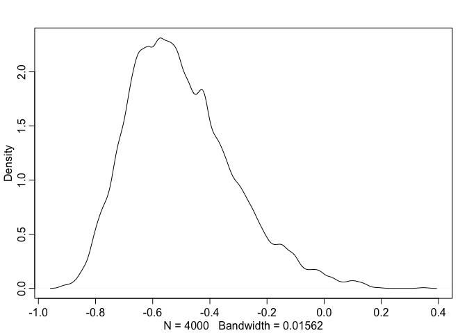

# 14.1. Varying slopes by construction
## 14.1.1. Simulate the population. 

```r
a <- 3.5
b <- (-1)
sigma_a <- 1
sigma_b <- 0.5
rho <- (-0.7)
# average morning wait time
# average difference afternoon wait time
# std dev in intercepts
# std dev in slopes
# correlation between intercepts and slopes
```


```r
Mu <- c( a , b )
```


```r
cov_ab <- sigma_a*sigma_b*rho
Sigma <- matrix( c(sigma_a^2,cov_ab,cov_ab,sigma_b^2) , ncol=2 )
```


```r
 matrix( c(1,2,3,4) , nrow=2 , ncol=2 )
```

```
##      [,1] [,2]
## [1,]    1    3
## [2,]    2    4
```


```r
sigmas <- c(sigma_a,sigma_b) # standard deviations
Rho <- matrix( c(1,rho,rho,1) , nrow=2 ) # correlation matrix
# now matrix multiply to get covariance matrix
Sigma <- diag(sigmas) %*% Rho %*% diag(sigmas)
```


```r
 N_cafes <- 20
```


```r
library(MASS)
```

```
## 
## Attaching package: 'MASS'
```

```
## The following object is masked from 'package:dplyr':
## 
##     select
```

```r
set.seed(5) # used to replicate example
vary_effects <- mvrnorm( N_cafes , Mu , Sigma )
```


```r
a_cafe <- vary_effects[,1]
b_cafe <- vary_effects[,2]
```


```r
plot( a_cafe , b_cafe , col=rangi2 ,
    xlab="intercepts (a_cafe)" , ylab="slopes (b_cafe)" )
# overlay population distribution
library(ellipse)
```

```
## 
## Attaching package: 'ellipse'
```

```
## The following object is masked from 'package:rethinking':
## 
##     pairs
```

```
## The following object is masked from 'package:graphics':
## 
##     pairs
```

```r
for ( l in c(0.1,0.3,0.5,0.8,0.99) )
    lines(ellipse(Sigma,centre=Mu,level=l),col=col.alpha("black",0.2))
```

<!-- -->

# 14.1.2. Simulate observations.

```r
set.seed(22)
N_visits <- 10
afternoon <- rep(0:1,N_visits*N_cafes/2)
cafe_id <- rep( 1:N_cafes , each=N_visits )
mu <- a_cafe[cafe_id] + b_cafe[cafe_id]*afternoon
sigma <- 0.5  # std dev within cafes
wait <- rnorm( N_visits*N_cafes , mu , sigma )
d <- data.frame( cafe=cafe_id , afternoon=afternoon , wait=wait )
```

# 14.1.3. The varying slopes model.

```r
R <- rlkjcorr( 1e4 , K=2 , eta=2 )
dens( R[,1,2] , xlab="correlation" )
```

<!-- -->


```r
m14.1 <- ulam(
    alist(
        wait ~ normal( mu , sigma ),
        mu <- a_cafe[cafe] + b_cafe[cafe]*afternoon,
        c(a_cafe,b_cafe)[cafe] ~ multi_normal( c(a,b) , Rho , sigma_cafe ),
        a ~ normal(5,2),
        b ~ normal(-1,0.5),
        sigma_cafe ~ exponential(1),
        sigma ~ exponential(1),
        Rho ~ lkj_corr(2)
    ) , data=d , chains=4 , cores=2,iter=2000,log_lik=TRUE)
```

```
## Trying to compile a simple C file
```

```
## Running /Library/Frameworks/R.framework/Resources/bin/R CMD SHLIB foo.c
## clang -I"/Library/Frameworks/R.framework/Resources/include" -DNDEBUG   -I"/Library/Frameworks/R.framework/Versions/3.6/Resources/library/Rcpp/include/"  -I"/Library/Frameworks/R.framework/Versions/3.6/Resources/library/RcppEigen/include/"  -I"/Library/Frameworks/R.framework/Versions/3.6/Resources/library/RcppEigen/include/unsupported"  -I"/Library/Frameworks/R.framework/Versions/3.6/Resources/library/BH/include" -I"/Library/Frameworks/R.framework/Versions/3.6/Resources/library/StanHeaders/include/src/"  -I"/Library/Frameworks/R.framework/Versions/3.6/Resources/library/StanHeaders/include/"  -I"/Library/Frameworks/R.framework/Versions/3.6/Resources/library/RcppParallel/include/"  -I"/Library/Frameworks/R.framework/Versions/3.6/Resources/library/rstan/include" -DEIGEN_NO_DEBUG  -DBOOST_DISABLE_ASSERTS  -DBOOST_PENDING_INTEGER_LOG2_HPP  -DSTAN_THREADS  -include stan/math/prim/mat/fun/Eigen.hpp  -D_REENTRANT  "-isystem /Library/Developer/CommandLineTools/SDKs/MacOSX.sdk/usr/include"  -fPIC  -isysroot /Library/Developer/CommandLineTools/SDKs/MacOSX.sdk -c foo.c -o foo.o
## In file included from <built-in>:1:
## In file included from /Library/Frameworks/R.framework/Versions/3.6/Resources/library/StanHeaders/include/stan/math/prim/mat/fun/Eigen.hpp:13:
## In file included from /Library/Frameworks/R.framework/Versions/3.6/Resources/library/RcppEigen/include/Eigen/Dense:1:
## In file included from /Library/Frameworks/R.framework/Versions/3.6/Resources/library/RcppEigen/include/Eigen/Core:88:
## /Library/Frameworks/R.framework/Versions/3.6/Resources/library/RcppEigen/include/Eigen/src/Core/util/Macros.h:613:1: error: unknown type name 'namespace'
## namespace Eigen {
## ^
## /Library/Frameworks/R.framework/Versions/3.6/Resources/library/RcppEigen/include/Eigen/src/Core/util/Macros.h:613:16: error: expected ';' after top level declarator
## namespace Eigen {
##                ^
##                ;
## In file included from <built-in>:1:
## In file included from /Library/Frameworks/R.framework/Versions/3.6/Resources/library/StanHeaders/include/stan/math/prim/mat/fun/Eigen.hpp:13:
## In file included from /Library/Frameworks/R.framework/Versions/3.6/Resources/library/RcppEigen/include/Eigen/Dense:1:
## /Library/Frameworks/R.framework/Versions/3.6/Resources/library/RcppEigen/include/Eigen/Core:96:10: fatal error: 'complex' file not found
## #include <complex>
##          ^~~~~~~~~
## 3 errors generated.
## make: *** [foo.o] Error 1
```

```
## Warning: The largest R-hat is NA, indicating chains have not mixed.
## Running the chains for more iterations may help. See
## http://mc-stan.org/misc/warnings.html#r-hat
```

```
## Warning: Bulk Effective Samples Size (ESS) is too low, indicating posterior means and medians may be unreliable.
## Running the chains for more iterations may help. See
## http://mc-stan.org/misc/warnings.html#bulk-ess
```

```
## Warning: Tail Effective Samples Size (ESS) is too low, indicating posterior variances and tail quantiles may be unreliable.
## Running the chains for more iterations may help. See
## http://mc-stan.org/misc/warnings.html#tail-ess
```

```r
# What is lkj_corr?
?rlkjcorr
?rmultinom # for multi_ormal, correct?
```


```r
post <- extract.samples(m14.1)
dens( post$Rho[,1,2] )
```

<!-- -->


```r
# compute unpooled estimates directly from data
a1 <- sapply( 1:N_cafes ,
        function(i) mean(wait[cafe_id==i & afternoon==0]) )
b1 <- sapply( 1:N_cafes ,
        function(i) mean(wait[cafe_id==i & afternoon==1]) ) - a1
# extract posterior means of partially pooled estimates
post <- extract.samples(m14.1) # m14.1 instead of m13.1?
a2 <- apply( post$a_cafe , 2 , mean )
b2 <- apply( post$b_cafe , 2 , mean )
# plot both and connect with lines
plot( a1 , b1 , xlab="intercept" , ylab="slope" ,
    pch=16 , col=rangi2 , ylim=c( min(b1)-0.1 , max(b1)+0.1 ) ,
    xlim=c( min(a1)-0.1 , max(a1)+0.1 ) )
points(a2,b2,pch=1) 
for ( i in 1:N_cafes ) lines( c(a1[i],a2[i]) , c(b1[i],b2[i]))
```

<!-- -->


```r
# compute posterior mean bivariate Gaussian
Mu_est <- c( mean(post$a) , mean(post$b) )
rho_est <- mean( post$Rho[,1,2] )
sa_est <- mean( post$sigma_cafe[,1] )
sb_est <- mean( post$sigma_cafe[,2] )
cov_ab <- sa_est*sb_est*rho_est
Sigma_est <- matrix( c(sa_est^2,cov_ab,cov_ab,sb_est^2) , ncol=2 )
# draw contours
library(ellipse)
for ( l in c(0.1,0.3,0.5,0.8,0.99) )
    lines(ellipse(Sigma_est,centre=Mu_est,level=l),
        col=col.alpha("black",0.2))
```

```
## Error in plot.xy(xy.coords(x, y), type = type, ...): plot.new has not been called yet
```

* outcome scale

```r
# convert varying effects to waiting times
wait_morning_1 <- (a1)
wait_afternoon_1 <- (a1 + b1)
wait_morning_2 <- (a2)
wait_afternoon_2 <- (a2 + b2)
# plot both and connect with lines
plot( wait_morning_1 , wait_afternoon_1 , xlab="morning wait" ,
    ylab="afternoon wait" , pch=16 , col=rangi2 ,
    ylim=c( min(wait_afternoon_1)-0.1 , max(wait_afternoon_1)+0.1 ) ,
    xlim=c( min(wait_morning_1)-0.1 , max(wait_morning_1)+0.1 ) )
points( wait_morning_2 , wait_afternoon_2 , pch=1 )
for ( i in 1:N_cafes )
    lines( c(wait_morning_1[i],wait_morning_2[i]) ,
    c(wait_afternoon_1[i],wait_afternoon_2[i]) )
abline( a=0 , b=1 , lty=2 )
```

<!-- -->


```r
# now shrinkage distribution by simulation
v <- mvrnorm( 1e4 , Mu_est , Sigma_est ) # mvrnorm()
v[,2] <- v[,1] + v[,2] # calculate afternoon wait
Sigma_est2 <- cov(v)
Mu_est2 <- Mu_est
Mu_est2[2] <- Mu_est[1]+Mu_est[2]
# draw contours
library(ellipse)
for ( l in c(0.1,0.3,0.5,0.8,0.99) )
    lines(ellipse(Sigma_est2,centre=Mu_est2,level=l),
        col=col.alpha("black",0.5))
```

```
## Error in plot.xy(xy.coords(x, y), type = type, ...): plot.new has not been called yet
```


# problems
14E1

* original

$$
y_i \sim Normal(\mu_i, \sigma) \\
\mu_i = \alpha_{GROUP[i]} + \beta x_i \\
\alpha_{GROUP} \sim Normal(\alpha, \sigma_\alpha) \\
\alpha \sim Normal(0, 10) \\
\beta \sim Normal(0, 1) \\ 
\sigma \sim HalfCauchy(0,2) \\ 
\sigma_\alpha \sim HalfCouchy(0, 2)
$$

* VARYING SLOPES ON THE PREDICTOR X

yi ~ Normal(mu_i, sigma)
mu_i = alpha_group[i] + beta[i] * xi
[alpha_group[i], beta[i]] ~ MVNormal([alpha, beta], S)
S = (sigma_alpha, 0, 0, sigma_beta)_2x2 R (sigma_alpha, 0, 0, sigma_beta)_2x2
alpha ~ Normal(0, 10)
beta ~ Normal(0, 1)
sigma ~ HalfCauchy(0, 2)
sigma_alpha ~ HalfCauchy(0, 2)
sigma_beta ~ HalfCauchy(0, 2)
R ~ LKJcorr(2)


* I gave up... 
$$
y_i \sim Normal(\mu_i, \ sigma) \\
\mu_i = \alpha_{GROUP[i]} + \beta x_i \\
\alpha_{GROUP} \sim Normal(\alpha, \sigma_\alpha) \\

\begin{bmatrix}\alpha_{GROUP} \\
\beta
\end{bmatrix} \sim MVNormal\
begin{pmatrix}
  \begin{bmatrix}\alpha_{GROUP} \\
  \beta
  \end{bmatrix}
  & S
\end{pmatrix}\\

S = \begin{pmatrix}a & b\\\ c & d\end{pmatrix} R \begin{pmatrix}a & b\\\ c & d\end{pmatrix} \\\\

\alpha \sim Normal(0, 10) \\
\beta \sim Normal(0, 1) \\ 
\sigma \sim HalfCauchy(0,2) \\ 
\sigma_\alpha \sim HalfCouchy(0, 2) \\


X = \begin{bmatrix}1 & x_{1}\\
1 & x_{2}\\
1 & x_{3}
\end{bmatrix} \\

S = \begin{pmatrix}a & b\\\ c & d\end{pmatrix} \\
$$


14E2 Think up a context in which varying intercepts will be positively correlated with varying
slopes. Provide a mechanistic explanation for the correlation.
(Kazu's answer) Taller swimmers are heavyer. Tall and heavy swimmers swim faster because they can pull more water per stroke than shorter swimmers do and their stroke speed is maintained by more muscles.

14E3 When is it possible for a varying slopes model to have fewer effective parameters (asestimated by WAIC or DIC) than the corresponding model with fixed (unpooled) slopes? Explain.


14M1. Repeat the cafe robot simulation from the beginning of the chapter. This time, set rho to zero, so that there is no correlation between intercepts and slopes. How does the posterior distribution of the correlation reflect this change in the underlying simulation

```r
a <- 3.5
b <- (-1)
sigma_a <- 1
sigma_b <- 0.5
# rho <- (-0.7)
rho <- 0 # new 
# average morning wait time
# average difference afternoon wait time
# std dev in intercepts
# std dev in slopes
# correlation between intercepts and slopes
cov_ab <- sigma_a*sigma_b*rho
Sigma <- matrix( c(sigma_a^2,cov_ab,cov_ab,sigma_b^2) , ncol=2 )
sigmas <- c(sigma_a,sigma_b) # standard deviations
Rho <- matrix( c(1,rho,rho,1) , nrow=2 ) # correlation matrix
# now matrix multiply to get covariance matrix
Sigma <- diag(sigmas) %*% Rho %*% diag(sigmas)
 N_cafes <- 20
library(MASS)
set.seed(5) # used to replicate example
vary_effects <- mvrnorm( N_cafes , Mu , Sigma )
a_cafe <- vary_effects[,1]
b_cafe <- vary_effects[,2]
#
plot( a_cafe , b_cafe , col=rangi2 ,
    xlab="intercepts (a_cafe)" , ylab="slopes (b_cafe)" )
# overlay population distribution
library(ellipse)
for ( l in c(0.1,0.3,0.5,0.8,0.99) )
    lines(ellipse(Sigma,centre=Mu,level=l),col=col.alpha("black",0.2))
```

<!-- -->

```r
#
set.seed(22)
N_visits <- 10
afternoon <- rep(0:1,N_visits*N_cafes/2)
cafe_id <- rep( 1:N_cafes , each=N_visits )
mu <- a_cafe[cafe_id] + b_cafe[cafe_id]*afternoon
sigma <- 0.5  # std dev within cafes
wait <- rnorm( N_visits*N_cafes , mu , sigma )
d <- data.frame( cafe=cafe_id , afternoon=afternoon , wait=wait )

#
R <- rlkjcorr( 1e4 , K=2 , eta=2 )
dens( R[,1,2] , xlab="correlation" )
```

<!-- -->
* model

```r
m14.1.rhozero <- ulam(
    alist(
        wait ~ normal( mu , sigma ),
        mu <- a_cafe[cafe] + b_cafe[cafe]*afternoon,
        c(a_cafe,b_cafe)[cafe] ~ multi_normal( c(a,b) , Rho , sigma_cafe ),
        a ~ normal(5,2),
        b ~ normal(-1,0.5),
        sigma_cafe ~ exponential(1),
        sigma ~ exponential(1),
        Rho ~ lkj_corr(2)
    ) , data=d , chains=4 , cores=2,iter=2000,log_lik=TRUE)
```

```
## recompiling to avoid crashing R session
```

```
## Trying to compile a simple C file
```

```
## Running /Library/Frameworks/R.framework/Resources/bin/R CMD SHLIB foo.c
## clang -I"/Library/Frameworks/R.framework/Resources/include" -DNDEBUG   -I"/Library/Frameworks/R.framework/Versions/3.6/Resources/library/Rcpp/include/"  -I"/Library/Frameworks/R.framework/Versions/3.6/Resources/library/RcppEigen/include/"  -I"/Library/Frameworks/R.framework/Versions/3.6/Resources/library/RcppEigen/include/unsupported"  -I"/Library/Frameworks/R.framework/Versions/3.6/Resources/library/BH/include" -I"/Library/Frameworks/R.framework/Versions/3.6/Resources/library/StanHeaders/include/src/"  -I"/Library/Frameworks/R.framework/Versions/3.6/Resources/library/StanHeaders/include/"  -I"/Library/Frameworks/R.framework/Versions/3.6/Resources/library/RcppParallel/include/"  -I"/Library/Frameworks/R.framework/Versions/3.6/Resources/library/rstan/include" -DEIGEN_NO_DEBUG  -DBOOST_DISABLE_ASSERTS  -DBOOST_PENDING_INTEGER_LOG2_HPP  -DSTAN_THREADS  -include stan/math/prim/mat/fun/Eigen.hpp  -D_REENTRANT  "-isystem /Library/Developer/CommandLineTools/SDKs/MacOSX.sdk/usr/include"  -fPIC  -isysroot /Library/Developer/CommandLineTools/SDKs/MacOSX.sdk -c foo.c -o foo.o
## In file included from <built-in>:1:
## In file included from /Library/Frameworks/R.framework/Versions/3.6/Resources/library/StanHeaders/include/stan/math/prim/mat/fun/Eigen.hpp:13:
## In file included from /Library/Frameworks/R.framework/Versions/3.6/Resources/library/RcppEigen/include/Eigen/Dense:1:
## In file included from /Library/Frameworks/R.framework/Versions/3.6/Resources/library/RcppEigen/include/Eigen/Core:88:
## /Library/Frameworks/R.framework/Versions/3.6/Resources/library/RcppEigen/include/Eigen/src/Core/util/Macros.h:613:1: error: unknown type name 'namespace'
## namespace Eigen {
## ^
## /Library/Frameworks/R.framework/Versions/3.6/Resources/library/RcppEigen/include/Eigen/src/Core/util/Macros.h:613:16: error: expected ';' after top level declarator
## namespace Eigen {
##                ^
##                ;
## In file included from <built-in>:1:
## In file included from /Library/Frameworks/R.framework/Versions/3.6/Resources/library/StanHeaders/include/stan/math/prim/mat/fun/Eigen.hpp:13:
## In file included from /Library/Frameworks/R.framework/Versions/3.6/Resources/library/RcppEigen/include/Eigen/Dense:1:
## /Library/Frameworks/R.framework/Versions/3.6/Resources/library/RcppEigen/include/Eigen/Core:96:10: fatal error: 'complex' file not found
## #include <complex>
##          ^~~~~~~~~
## 3 errors generated.
## make: *** [foo.o] Error 1
```

```
## Warning: The largest R-hat is NA, indicating chains have not mixed.
## Running the chains for more iterations may help. See
## http://mc-stan.org/misc/warnings.html#r-hat
```

```
## Warning: Bulk Effective Samples Size (ESS) is too low, indicating posterior means and medians may be unreliable.
## Running the chains for more iterations may help. See
## http://mc-stan.org/misc/warnings.html#bulk-ess
```

```
## Warning: Tail Effective Samples Size (ESS) is too low, indicating posterior variances and tail quantiles may be unreliable.
## Running the chains for more iterations may help. See
## http://mc-stan.org/misc/warnings.html#tail-ess
```
* posterior distribution


```r
post <- extract.samples(m14.1.rhozero)
dens( post$Rho[,1,2] )
```

<!-- -->

```r
#
# compute unpooled estimates directly from data
a1 <- sapply( 1:N_cafes ,
        function(i) mean(wait[cafe_id==i & afternoon==0]) )
b1 <- sapply( 1:N_cafes ,
        function(i) mean(wait[cafe_id==i & afternoon==1]) ) - a1
# extract posterior means of partially pooled estimates
post <- extract.samples(m14.1.rhozero) # m14.1 instead of m13.1?
a2 <- apply( post$a_cafe , 2 , mean )
b2 <- apply( post$b_cafe , 2 , mean )
# plot both and connect with lines
plot( a1 , b1 , xlab="intercept" , ylab="slope" ,
    pch=16 , col=rangi2 , ylim=c( min(b1)-0.1 , max(b1)+0.1 ) ,
    xlim=c( min(a1)-0.1 , max(a1)+0.1 ) )
points(a2,b2,pch=1) 
for ( i in 1:N_cafes ) lines( c(a1[i],a2[i]) , c(b1[i],b2[i]))
```

<!-- -->

14M2
Fit this multilevel model to the simulated café data:
Wi ∼ Normal(μi, σ)
μi = αcafé[i] + βcafé[i]A
i αcafé ∼ Normal(α, σα)
βcafé ∼Normal(β,σβ)
α ∼ Normal(0, 10) # should be Normal(5,2)?
β ∼ Normal(0, 10) # should be Normal(-1,0.5)?
σ ∼ HalfCauchy(0, 1)
σα ∼ HalfCauchy(0, 1) σβ ∼HalfCauchy(0,1)


```r
# I do not understand how to use HalfCauchy distribution function
library(extraDistr)
```

```
## 
## Attaching package: 'extraDistr'
```

```
## The following object is masked from 'package:purrr':
## 
##     rdunif
```

```
## The following objects are masked from 'package:rethinking':
## 
##     dbern, dlaplace, dpareto, rbern, rlaplace, rpareto
```

```r
dhcauchy(0,1) # errr
```

```
## [1] 0.6366198
```

```r
m14.1.problemM2 <- ulam(
    alist(
        wait ~ normal( mu , sigma ),
        mu <- a[cafe] + b[cafe]*afternoon,
        a[cafe] ~ normal(alpha,sigma_alpha),
        b[cafe] ~ normal(beta,sigma_beta),
        alpha ~ normal(5,2),
        beta ~ normal(-1,0.5),
        sigma ~  exponential(1),
        sigma_alpha ~ exponential(1),
        sigma_beta ~ exponential(1)
    ) , data=d , chains=4 , cores=2,iter=2000,log_lik=TRUE)
```

```
## Trying to compile a simple C file
```

```
## Running /Library/Frameworks/R.framework/Resources/bin/R CMD SHLIB foo.c
## clang -I"/Library/Frameworks/R.framework/Resources/include" -DNDEBUG   -I"/Library/Frameworks/R.framework/Versions/3.6/Resources/library/Rcpp/include/"  -I"/Library/Frameworks/R.framework/Versions/3.6/Resources/library/RcppEigen/include/"  -I"/Library/Frameworks/R.framework/Versions/3.6/Resources/library/RcppEigen/include/unsupported"  -I"/Library/Frameworks/R.framework/Versions/3.6/Resources/library/BH/include" -I"/Library/Frameworks/R.framework/Versions/3.6/Resources/library/StanHeaders/include/src/"  -I"/Library/Frameworks/R.framework/Versions/3.6/Resources/library/StanHeaders/include/"  -I"/Library/Frameworks/R.framework/Versions/3.6/Resources/library/RcppParallel/include/"  -I"/Library/Frameworks/R.framework/Versions/3.6/Resources/library/rstan/include" -DEIGEN_NO_DEBUG  -DBOOST_DISABLE_ASSERTS  -DBOOST_PENDING_INTEGER_LOG2_HPP  -DSTAN_THREADS  -include stan/math/prim/mat/fun/Eigen.hpp  -D_REENTRANT  "-isystem /Library/Developer/CommandLineTools/SDKs/MacOSX.sdk/usr/include"  -fPIC  -isysroot /Library/Developer/CommandLineTools/SDKs/MacOSX.sdk -c foo.c -o foo.o
## In file included from <built-in>:1:
## In file included from /Library/Frameworks/R.framework/Versions/3.6/Resources/library/StanHeaders/include/stan/math/prim/mat/fun/Eigen.hpp:13:
## In file included from /Library/Frameworks/R.framework/Versions/3.6/Resources/library/RcppEigen/include/Eigen/Dense:1:
## In file included from /Library/Frameworks/R.framework/Versions/3.6/Resources/library/RcppEigen/include/Eigen/Core:88:
## /Library/Frameworks/R.framework/Versions/3.6/Resources/library/RcppEigen/include/Eigen/src/Core/util/Macros.h:613:1: error: unknown type name 'namespace'
## namespace Eigen {
## ^
## /Library/Frameworks/R.framework/Versions/3.6/Resources/library/RcppEigen/include/Eigen/src/Core/util/Macros.h:613:16: error: expected ';' after top level declarator
## namespace Eigen {
##                ^
##                ;
## In file included from <built-in>:1:
## In file included from /Library/Frameworks/R.framework/Versions/3.6/Resources/library/StanHeaders/include/stan/math/prim/mat/fun/Eigen.hpp:13:
## In file included from /Library/Frameworks/R.framework/Versions/3.6/Resources/library/RcppEigen/include/Eigen/Dense:1:
## /Library/Frameworks/R.framework/Versions/3.6/Resources/library/RcppEigen/include/Eigen/Core:96:10: fatal error: 'complex' file not found
## #include <complex>
##          ^~~~~~~~~
## 3 errors generated.
## make: *** [foo.o] Error 1
```

```r
precis(m14.1.problemM2, depth=2 )
```

```
##                    mean         sd       5.5%      94.5%    n_eff     Rhat4
## a[1]         4.32543266 0.19726957  4.0104249  4.6460835 4925.125 0.9997026
## a[2]         2.22750138 0.19587923  1.9204640  2.5440586 4265.912 0.9998496
## a[3]         4.55686180 0.19227583  4.2559454  4.8674893 4247.460 1.0006239
## a[4]         3.32733333 0.19506236  3.0214761  3.6385727 4945.059 0.9994401
## a[5]         1.93088520 0.19657493  1.6220143  2.2450067 4312.239 1.0008209
## a[6]         4.24287995 0.19787409  3.9205983  4.5587212 5186.567 1.0005489
## a[7]         3.77502087 0.19120556  3.4661693  4.0834095 4811.669 0.9990859
## a[8]         4.11190954 0.20440554  3.7848808  4.4353575 5190.906 0.9995600
## a[9]         3.91791159 0.20046850  3.5983638  4.2379147 5287.481 1.0003835
## a[10]        3.46491309 0.19989377  3.1379740  3.7850194 4858.090 1.0005619
## a[11]        1.95210744 0.19981737  1.6359651  2.2701244 5007.014 0.9996058
## a[12]        3.97974206 0.19444984  3.6679419  4.2970941 6004.319 0.9994699
## a[13]        4.14485691 0.19623193  3.8322319  4.4616315 3943.860 0.9998969
## a[14]        3.31351943 0.20414214  2.9890329  3.6451962 5239.064 0.9996964
## a[15]        4.62459753 0.20470312  4.2933672  4.9524123 4711.872 1.0004136
## a[16]        3.49528481 0.20098925  3.1743792  3.8129197 5358.308 0.9999610
## a[17]        4.12525288 0.19771640  3.8056117  4.4407049 4675.100 0.9995775
## a[18]        5.58774248 0.20741568  5.2489656  5.9230953 5225.017 0.9997547
## a[19]        3.07427023 0.20758410  2.7428244  3.4121043 5228.439 0.9999748
## a[20]        3.72928631 0.19546249  3.4094819  4.0374693 5223.706 0.9992371
## b[1]        -0.97618221 0.26742819 -1.3970486 -0.5489573 5006.126 1.0002050
## b[2]        -1.57746758 0.26609983 -2.0046341 -1.1541837 4286.352 1.0001141
## b[3]        -1.74522912 0.26367730 -2.1688959 -1.3283677 4347.964 1.0007301
## b[4]        -1.39979187 0.26467918 -1.8289937 -0.9703711 4943.787 0.9997277
## b[5]        -0.86354183 0.26734059 -1.3025311 -0.4404565 4258.487 1.0001812
## b[6]        -1.02948326 0.26537997 -1.4568702 -0.6049628 5196.716 0.9994735
## b[7]        -1.07100344 0.26096474 -1.4967804 -0.6601880 4957.777 0.9995414
## b[8]        -1.65257559 0.27854928 -2.0954736 -1.2055854 5134.069 0.9998221
## b[9]        -1.10558771 0.27058782 -1.5348146 -0.6787887 4768.255 1.0007541
## b[10]       -0.84992951 0.27101486 -1.2796787 -0.4161975 4651.065 1.0008342
## b[11]       -0.94754646 0.26514153 -1.3688458 -0.5222981 4680.906 0.9993881
## b[12]       -1.07739514 0.26428402 -1.4945714 -0.6553154 5534.104 0.9996183
## b[13]       -1.81449942 0.27321768 -2.2462803 -1.3733189 4553.931 1.0006808
## b[14]       -1.08805398 0.28138528 -1.5277370 -0.6355024 4905.427 1.0000854
## b[15]       -2.06844986 0.28727633 -2.5293914 -1.6092264 4862.474 0.9997882
## b[16]       -1.14966199 0.26934757 -1.5712208 -0.7049368 4863.568 1.0001264
## b[17]       -0.83909333 0.26269909 -1.2615912 -0.4207932 4518.212 0.9995774
## b[18]        0.13739160 0.28707920 -0.3203204  0.6026217 4495.587 1.0005042
## b[19]       -0.05241899 0.28285970 -0.5087397  0.3969994 4322.660 0.9997551
## b[20]       -0.94269585 0.26855164 -1.3686458 -0.5135893 5723.015 0.9995917
## alpha        3.70687234 0.21993955  3.3624027  4.0513728 5562.584 0.9994738
## beta        -1.10063352 0.14943669 -1.3385067 -0.8643272 4523.655 0.9997927
## sigma        0.47326046 0.02678971  0.4316997  0.5182863 3535.835 0.9998809
## sigma_alpha  0.96549412 0.16714428  0.7331166  1.2620720 4413.891 0.9995238
## sigma_beta   0.62038069 0.13012262  0.4371902  0.8473852 3953.735 0.9996891
```

```r
plot( precis(m14.1.problemM2,depth=2) )
```

<!-- -->
# compare

```r
compare(m14.1,m14.1.problemM2)
```

```
##                     WAIC       SE     dWAIC      dSE    pWAIC    weight
## m14.1           305.1088 17.69952 0.0000000       NA 32.86415 0.6159582
## m14.1.problemM2 306.0537 17.88892 0.9448554 1.799699 33.64101 0.3840418
```

```r
compare(m14.1,m14.1.rhozero,m14.1.problemM2)
```

```
##                     WAIC       SE      dWAIC       dSE    pWAIC    weight
## m14.1.rhozero   305.0193 17.70145 0.00000000        NA 33.11804 0.3917877
## m14.1           305.1088 17.69952 0.08954483 1.8347230 32.86415 0.3746333
## m14.1.problemM2 306.0537 17.88892 1.03440019 0.5247523 33.64101 0.2335789
```

