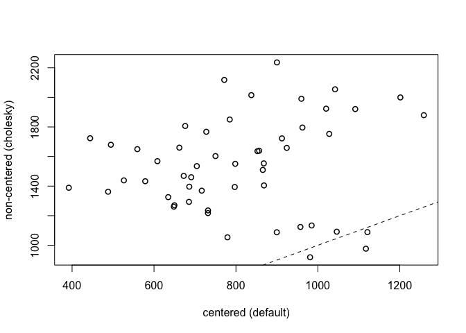
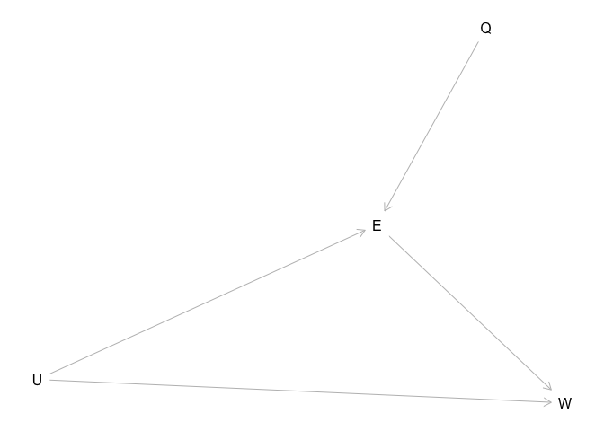
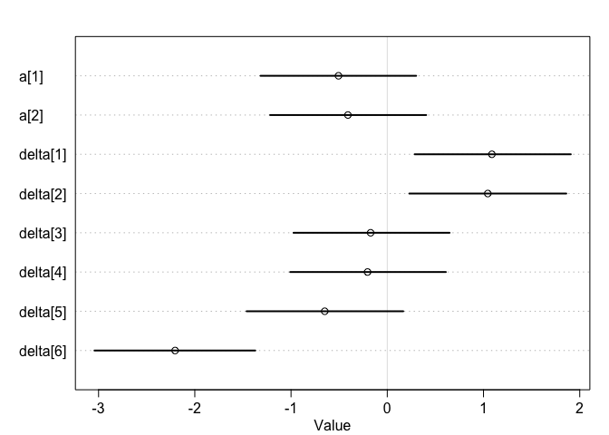
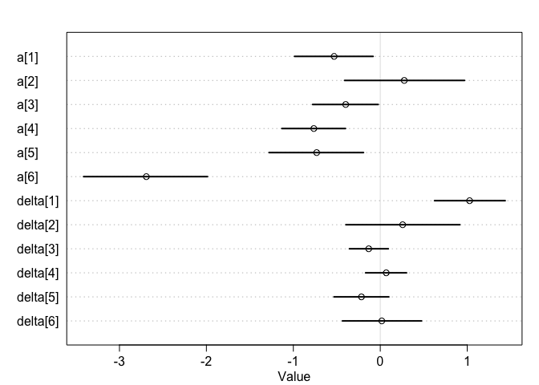

Chap14\_2
================
Kazu
3/13/2020

# 14.2. Advanced varyings lopes

``` r
library(rethinking)
data(chimpanzees)
d <- chimpanzees
d$block_id <- d$block
d$treatment <- 1L + d$prosoc_left + 2L*d$condition
dat <- list(
    L = d$pulled_left,
    tid = d$treatment,
    actor = d$actor,
    block_id = as.integer(d$block_id) )
m14.2 <- ulam(
    alist(
      L ~ binomial(1,p),
    logit(p) <- g[tid] + alpha[actor,tid] + beta[block_id,tid],
    # adaptive priors
    vector[4]:alpha[actor] ~ multi_normal(0,Rho_actor,sigma_actor),
    vector[4]:beta[block_id] ~ multi_normal(0,Rho_block,sigma_block),
    # fixed priors
    g[tid] ~ dnorm(0,1),
    sigma_actor ~ dexp(1),
    Rho_actor ~ dlkjcorr(4),
    sigma_block ~ dexp(1),
    Rho_block ~ dlkjcorr(4)
) , data=dat , chains=4 , cores=4 )
```

    ## Trying to compile a simple C file

    ## Running /Library/Frameworks/R.framework/Resources/bin/R CMD SHLIB foo.c
    ## clang -I"/Library/Frameworks/R.framework/Resources/include" -DNDEBUG   -I"/Library/Frameworks/R.framework/Versions/3.6/Resources/library/Rcpp/include/"  -I"/Library/Frameworks/R.framework/Versions/3.6/Resources/library/RcppEigen/include/"  -I"/Library/Frameworks/R.framework/Versions/3.6/Resources/library/RcppEigen/include/unsupported"  -I"/Library/Frameworks/R.framework/Versions/3.6/Resources/library/BH/include" -I"/Library/Frameworks/R.framework/Versions/3.6/Resources/library/StanHeaders/include/src/"  -I"/Library/Frameworks/R.framework/Versions/3.6/Resources/library/StanHeaders/include/"  -I"/Library/Frameworks/R.framework/Versions/3.6/Resources/library/RcppParallel/include/"  -I"/Library/Frameworks/R.framework/Versions/3.6/Resources/library/rstan/include" -DEIGEN_NO_DEBUG  -DBOOST_DISABLE_ASSERTS  -DBOOST_PENDING_INTEGER_LOG2_HPP  -DSTAN_THREADS  -include stan/math/prim/mat/fun/Eigen.hpp  -D_REENTRANT  "-isystem /Library/Developer/CommandLineTools/SDKs/MacOSX.sdk/usr/include"  -fPIC  -isysroot /Library/Developer/CommandLineTools/SDKs/MacOSX.sdk -c foo.c -o foo.o
    ## In file included from <built-in>:1:
    ## In file included from /Library/Frameworks/R.framework/Versions/3.6/Resources/library/StanHeaders/include/stan/math/prim/mat/fun/Eigen.hpp:13:
    ## In file included from /Library/Frameworks/R.framework/Versions/3.6/Resources/library/RcppEigen/include/Eigen/Dense:1:
    ## In file included from /Library/Frameworks/R.framework/Versions/3.6/Resources/library/RcppEigen/include/Eigen/Core:88:
    ## /Library/Frameworks/R.framework/Versions/3.6/Resources/library/RcppEigen/include/Eigen/src/Core/util/Macros.h:613:1: error: unknown type name 'namespace'
    ## namespace Eigen {
    ## ^
    ## /Library/Frameworks/R.framework/Versions/3.6/Resources/library/RcppEigen/include/Eigen/src/Core/util/Macros.h:613:16: error: expected ';' after top level declarator
    ## namespace Eigen {
    ##                ^
    ##                ;
    ## In file included from <built-in>:1:
    ## In file included from /Library/Frameworks/R.framework/Versions/3.6/Resources/library/StanHeaders/include/stan/math/prim/mat/fun/Eigen.hpp:13:
    ## In file included from /Library/Frameworks/R.framework/Versions/3.6/Resources/library/RcppEigen/include/Eigen/Dense:1:
    ## /Library/Frameworks/R.framework/Versions/3.6/Resources/library/RcppEigen/include/Eigen/Core:96:10: fatal error: 'complex' file not found
    ## #include <complex>
    ##          ^~~~~~~~~
    ## 3 errors generated.
    ## make: *** [foo.o] Error 1

    ## Warning: There were 13 divergent transitions after warmup. Increasing adapt_delta above 0.95 may help. See
    ## http://mc-stan.org/misc/warnings.html#divergent-transitions-after-warmup

    ## Warning: Examine the pairs() plot to diagnose sampling problems

    ## Warning: The largest R-hat is NA, indicating chains have not mixed.
    ## Running the chains for more iterations may help. See
    ## http://mc-stan.org/misc/warnings.html#r-hat

    ## Warning: Bulk Effective Samples Size (ESS) is too low, indicating posterior means and medians may be unreliable.
    ## Running the chains for more iterations may help. See
    ## http://mc-stan.org/misc/warnings.html#bulk-ess

    ## Warning: Tail Effective Samples Size (ESS) is too low, indicating posterior variances and tail quantiles may be unreliable.
    ## Running the chains for more iterations may help. See
    ## http://mc-stan.org/misc/warnings.html#tail-ess

``` r
m14.3 <- ulam(
    alist(
        L ~ binomial(1,p),
        logit(p) <- g[tid] + alpha[actor,tid] + beta[block_id,tid],
        # adaptive priors - non-centered
        transpars> matrix[actor,4]:alpha <-
                compose_noncentered( sigma_actor , L_Rho_actor , z_actor ),
        transpars> matrix[block_id,4]:beta <-
                compose_noncentered( sigma_block , L_Rho_block , z_block ),
        matrix[4,actor]:z_actor ~ normal( 0 , 1 ),
        matrix[4,block_id]:z_block ~ normal( 0 , 1 ),
        # fixed priors
        g[tid] ~ normal(0,1),
        vector[4]:sigma_actor ~ dexp(1),
        cholesky_factor_corr[4]:L_Rho_actor ~ lkj_corr_cholesky( 2 ),
                        vector[4]:sigma_block ~ dexp(1),
               cholesky_factor_corr[4]:L_Rho_block ~ lkj_corr_cholesky( 2 ),
               # compute ordinary correlation matrixes from Cholesky factors
               gq> matrix[4,4]:Rho_actor <<- multiply_lower_tri_self_transpose(L_Rho_actor),
               gq> matrix[4,4]:Rho_block <<- multiply_lower_tri_self_transpose(L_Rho_block)
           ) , data=dat , chains=4 , cores=4 , log_lik=TRUE )
```

    ## Trying to compile a simple C file

    ## Running /Library/Frameworks/R.framework/Resources/bin/R CMD SHLIB foo.c
    ## clang -I"/Library/Frameworks/R.framework/Resources/include" -DNDEBUG   -I"/Library/Frameworks/R.framework/Versions/3.6/Resources/library/Rcpp/include/"  -I"/Library/Frameworks/R.framework/Versions/3.6/Resources/library/RcppEigen/include/"  -I"/Library/Frameworks/R.framework/Versions/3.6/Resources/library/RcppEigen/include/unsupported"  -I"/Library/Frameworks/R.framework/Versions/3.6/Resources/library/BH/include" -I"/Library/Frameworks/R.framework/Versions/3.6/Resources/library/StanHeaders/include/src/"  -I"/Library/Frameworks/R.framework/Versions/3.6/Resources/library/StanHeaders/include/"  -I"/Library/Frameworks/R.framework/Versions/3.6/Resources/library/RcppParallel/include/"  -I"/Library/Frameworks/R.framework/Versions/3.6/Resources/library/rstan/include" -DEIGEN_NO_DEBUG  -DBOOST_DISABLE_ASSERTS  -DBOOST_PENDING_INTEGER_LOG2_HPP  -DSTAN_THREADS  -include stan/math/prim/mat/fun/Eigen.hpp  -D_REENTRANT  "-isystem /Library/Developer/CommandLineTools/SDKs/MacOSX.sdk/usr/include"  -fPIC  -isysroot /Library/Developer/CommandLineTools/SDKs/MacOSX.sdk -c foo.c -o foo.o
    ## In file included from <built-in>:1:
    ## In file included from /Library/Frameworks/R.framework/Versions/3.6/Resources/library/StanHeaders/include/stan/math/prim/mat/fun/Eigen.hpp:13:
    ## In file included from /Library/Frameworks/R.framework/Versions/3.6/Resources/library/RcppEigen/include/Eigen/Dense:1:
    ## In file included from /Library/Frameworks/R.framework/Versions/3.6/Resources/library/RcppEigen/include/Eigen/Core:88:
    ## /Library/Frameworks/R.framework/Versions/3.6/Resources/library/RcppEigen/include/Eigen/src/Core/util/Macros.h:613:1: error: unknown type name 'namespace'
    ## namespace Eigen {
    ## ^
    ## /Library/Frameworks/R.framework/Versions/3.6/Resources/library/RcppEigen/include/Eigen/src/Core/util/Macros.h:613:16: error: expected ';' after top level declarator
    ## namespace Eigen {
    ##                ^
    ##                ;
    ## In file included from <built-in>:1:
    ## In file included from /Library/Frameworks/R.framework/Versions/3.6/Resources/library/StanHeaders/include/stan/math/prim/mat/fun/Eigen.hpp:13:
    ## In file included from /Library/Frameworks/R.framework/Versions/3.6/Resources/library/RcppEigen/include/Eigen/Dense:1:
    ## /Library/Frameworks/R.framework/Versions/3.6/Resources/library/RcppEigen/include/Eigen/Core:96:10: fatal error: 'complex' file not found
    ## #include <complex>
    ##          ^~~~~~~~~
    ## 3 errors generated.
    ## make: *** [foo.o] Error 1

    ## Warning: The largest R-hat is NA, indicating chains have not mixed.
    ## Running the chains for more iterations may help. See
    ## http://mc-stan.org/misc/warnings.html#r-hat

    ## Warning: Bulk Effective Samples Size (ESS) is too low, indicating posterior means and medians may be unreliable.
    ## Running the chains for more iterations may help. See
    ## http://mc-stan.org/misc/warnings.html#bulk-ess

    ## Warning: Tail Effective Samples Size (ESS) is too low, indicating posterior variances and tail quantiles may be unreliable.
    ## Running the chains for more iterations may help. See
    ## http://mc-stan.org/misc/warnings.html#tail-ess

``` r
# extract n_eff values for each model
neff_nc <- precis(m14.3,3,pars=c("alpha","beta"))$n_eff
neff_c <- precis(m14.2,3,pars=c("alpha","beta"))$n_eff
plot( neff_c , neff_nc , xlab="centered (default)" ,
    ylab="non-centered (cholesky)" , lwd=1.5 )
abline(a=0,b=1,lty=2)
```

<!-- -->

``` r
precis( m14.3 , depth=2 , pars=c("sigma_actor","sigma_block") )
```

    ##                     mean        sd       5.5%     94.5%     n_eff     Rhat4
    ## sigma_actor[1] 1.3504051 0.4571475 0.77884987 2.1741781  806.5752 1.0043162
    ## sigma_actor[2] 0.9221968 0.3931945 0.43066660 1.6612872 1093.1314 1.0007966
    ## sigma_actor[3] 1.8932080 0.6107449 1.13134030 2.9777924 1200.1429 1.0005534
    ## sigma_actor[4] 1.5946713 0.6133375 0.84728929 2.6754405 1123.9661 0.9992393
    ## sigma_block[1] 0.3945323 0.3236097 0.03123710 0.9830321 1209.0653 1.0032224
    ## sigma_block[2] 0.4358586 0.3427320 0.04740678 1.0329721 1246.1588 1.0022840
    ## sigma_block[3] 0.3024574 0.2832648 0.02263291 0.8336827 1916.6516 0.9993453
    ## sigma_block[4] 0.4625522 0.3718407 0.03569480 1.1322293 1244.9770 1.0015231

``` r
# compute mean for each actor in each treatment
pl <- by( d$pulled_left , list( d$actor , d$treatment ) , mean )
# generate posterior predictions using link
datp <- list(
    actor=rep(1:7,each=4) ,
    tid=rep(1:4,times=7) ,
    block_id=rep(5,times=4*7) )
p_post <- link( m14.3 , data=datp )
p_mu <- apply( p_post , 2 , mean )
p_ci <- apply( p_post , 2 , PI )
# set up plot
plot( NULL , xlim=c(1,28) , ylim=c(0,1) , xlab="" ,
    ylab="proportion left lever" , xaxt="n" , yaxt="n" )
axis( 2 , at=c(0,0.5,1) , labels=c(0,0.5,1) )
abline( h=0.5 , lty=2 )
for ( j in 1:7 ) abline( v=(j-1)*4+4.5 , lwd=0.5 )
for ( j in 1:7 ) text( (j-1)*4+2.5 , 1.1 , concat("actor ",j) , xpd=TRUE )
xo <- 0.1 # offset distance to stagger raw data and predictions
# raw data
for ( j in (1:7)[-2] ) {
    lines( (j-1)*4+c(1,3)-xo , pl[j,c(1,3)] , lwd=2 , col=rangi2 )
    lines( (j-1)*4+c(2,4)-x0 , pl[j,c(2,4)] , lwd=2 , col=rangi2 )
}
```

    ## Error in lines((j - 1) * 4 + c(2, 4) - x0, pl[j, c(2, 4)], lwd = 2, col = rangi2): object 'x0' not found

``` r
points( 1:28-xo , t(pl) , pch=16 , col="white" , cex=1.7 )
points( 1:28-xo , t(pl) , pch=c(1,1,16,16) , col=rangi2 , lwd=2 )
yoff <- 0.175
text( 1-xo , pl[1,1]-yoff , "R/N" , pos=1 , cex=0.8 )
text( 2-xo , pl[1,2]+yoff , "L/N" , pos=3 , cex=0.8 )
text( 3-xo , pl[1,3]-yoff , "R/P" , pos=1 , cex=0.8 )
text( 4-xo , pl[1,4]+yoff , "L/P" , pos=3 , cex=0.8 )
# posterior predictions
for ( j in (1:7)[-2] ) {
    lines( (j-1)*4+c(1,3)+xo , p_mu[(j-1)*4+c(1,3)] , lwd=2 )
    lines( (j-1)*4+c(2,4)+xo , p_mu[(j-1)*4+c(2,4)] , lwd=2 )
}
for ( i in 1:28 ) lines( c(i,i)+xo , p_ci[,i] , lwd=1 )
points( 1:28+xo , p_mu , pch=16 , col="white" , cex=1.3 )
points( 1:28+xo , p_mu , pch=c(1,1,16,16) )
```

<!-- -->

# 14.3. Instrumental variables and front doors

## 14.3.1. Instrumental variables.

``` r
 set.seed(73)
N <- 500
U_sim <- rnorm( N )
Q_sim <- sample( 1:4 , size=N , replace=TRUE )
E_sim <- rnorm( N , U_sim + Q_sim )
W_sim <- rnorm( N , U_sim + 0*E_sim )
dat_sim <- list(
    W=standardize(W_sim) ,
    E=standardize(E_sim) ,
    Q=standardize(Q_sim) )
```

  - ?standardize() gave me an error. What is this function?

<!-- end list -->

``` r
m14.4 <- ulam(
    alist(
        W ~ dnorm( mu , sigma ),
        mu <- aW + bEW*E,
        aW ~ dnorm( 0 , 0.2 ),
        bEW ~ dnorm( 0 , 0.5 ),
        sigma ~ dexp( 1 )
    ) , data=dat_sim , chains=4 , cores=2 )
```

    ## Trying to compile a simple C file

    ## Running /Library/Frameworks/R.framework/Resources/bin/R CMD SHLIB foo.c
    ## clang -I"/Library/Frameworks/R.framework/Resources/include" -DNDEBUG   -I"/Library/Frameworks/R.framework/Versions/3.6/Resources/library/Rcpp/include/"  -I"/Library/Frameworks/R.framework/Versions/3.6/Resources/library/RcppEigen/include/"  -I"/Library/Frameworks/R.framework/Versions/3.6/Resources/library/RcppEigen/include/unsupported"  -I"/Library/Frameworks/R.framework/Versions/3.6/Resources/library/BH/include" -I"/Library/Frameworks/R.framework/Versions/3.6/Resources/library/StanHeaders/include/src/"  -I"/Library/Frameworks/R.framework/Versions/3.6/Resources/library/StanHeaders/include/"  -I"/Library/Frameworks/R.framework/Versions/3.6/Resources/library/RcppParallel/include/"  -I"/Library/Frameworks/R.framework/Versions/3.6/Resources/library/rstan/include" -DEIGEN_NO_DEBUG  -DBOOST_DISABLE_ASSERTS  -DBOOST_PENDING_INTEGER_LOG2_HPP  -DSTAN_THREADS  -include stan/math/prim/mat/fun/Eigen.hpp  -D_REENTRANT  "-isystem /Library/Developer/CommandLineTools/SDKs/MacOSX.sdk/usr/include"  -fPIC  -isysroot /Library/Developer/CommandLineTools/SDKs/MacOSX.sdk -c foo.c -o foo.o
    ## In file included from <built-in>:1:
    ## In file included from /Library/Frameworks/R.framework/Versions/3.6/Resources/library/StanHeaders/include/stan/math/prim/mat/fun/Eigen.hpp:13:
    ## In file included from /Library/Frameworks/R.framework/Versions/3.6/Resources/library/RcppEigen/include/Eigen/Dense:1:
    ## In file included from /Library/Frameworks/R.framework/Versions/3.6/Resources/library/RcppEigen/include/Eigen/Core:88:
    ## /Library/Frameworks/R.framework/Versions/3.6/Resources/library/RcppEigen/include/Eigen/src/Core/util/Macros.h:613:1: error: unknown type name 'namespace'
    ## namespace Eigen {
    ## ^
    ## /Library/Frameworks/R.framework/Versions/3.6/Resources/library/RcppEigen/include/Eigen/src/Core/util/Macros.h:613:16: error: expected ';' after top level declarator
    ## namespace Eigen {
    ##                ^
    ##                ;
    ## In file included from <built-in>:1:
    ## In file included from /Library/Frameworks/R.framework/Versions/3.6/Resources/library/StanHeaders/include/stan/math/prim/mat/fun/Eigen.hpp:13:
    ## In file included from /Library/Frameworks/R.framework/Versions/3.6/Resources/library/RcppEigen/include/Eigen/Dense:1:
    ## /Library/Frameworks/R.framework/Versions/3.6/Resources/library/RcppEigen/include/Eigen/Core:96:10: fatal error: 'complex' file not found
    ## #include <complex>
    ##          ^~~~~~~~~
    ## 3 errors generated.
    ## make: *** [foo.o] Error 1

``` r
precis( m14.4 )
```

    ##              mean         sd        5.5%      94.5%    n_eff     Rhat4
    ## aW    0.001504724 0.03977254 -0.06222478 0.06070355 1960.275 0.9994949
    ## bEW   0.396844050 0.04151926  0.33012694 0.46032886 2026.646 1.0010925
    ## sigma 0.919233040 0.03002712  0.87229517 0.96961036 1971.390 0.9998327

``` r
m14.5 <- ulam(
    alist(
        c(W,E) ~ multi_normal( c(muW,muE) , Rho , Sigma ),
        muW <- aW + bEW*E,
        muE <- aE + bQE*Q,
        c(aW,aE) ~ normal( 0 , 0.2 ),
        c(bEW,bQE) ~ normal( 0 , 0.5 ),
        Rho ~ lkj_corr( 2 ),
        Sigma ~ exponential( 1 )
    ), data=dat_sim , chains=4 , cores=4 )
```

    ## Trying to compile a simple C file

    ## Running /Library/Frameworks/R.framework/Resources/bin/R CMD SHLIB foo.c
    ## clang -I"/Library/Frameworks/R.framework/Resources/include" -DNDEBUG   -I"/Library/Frameworks/R.framework/Versions/3.6/Resources/library/Rcpp/include/"  -I"/Library/Frameworks/R.framework/Versions/3.6/Resources/library/RcppEigen/include/"  -I"/Library/Frameworks/R.framework/Versions/3.6/Resources/library/RcppEigen/include/unsupported"  -I"/Library/Frameworks/R.framework/Versions/3.6/Resources/library/BH/include" -I"/Library/Frameworks/R.framework/Versions/3.6/Resources/library/StanHeaders/include/src/"  -I"/Library/Frameworks/R.framework/Versions/3.6/Resources/library/StanHeaders/include/"  -I"/Library/Frameworks/R.framework/Versions/3.6/Resources/library/RcppParallel/include/"  -I"/Library/Frameworks/R.framework/Versions/3.6/Resources/library/rstan/include" -DEIGEN_NO_DEBUG  -DBOOST_DISABLE_ASSERTS  -DBOOST_PENDING_INTEGER_LOG2_HPP  -DSTAN_THREADS  -include stan/math/prim/mat/fun/Eigen.hpp  -D_REENTRANT  "-isystem /Library/Developer/CommandLineTools/SDKs/MacOSX.sdk/usr/include"  -fPIC  -isysroot /Library/Developer/CommandLineTools/SDKs/MacOSX.sdk -c foo.c -o foo.o
    ## In file included from <built-in>:1:
    ## In file included from /Library/Frameworks/R.framework/Versions/3.6/Resources/library/StanHeaders/include/stan/math/prim/mat/fun/Eigen.hpp:13:
    ## In file included from /Library/Frameworks/R.framework/Versions/3.6/Resources/library/RcppEigen/include/Eigen/Dense:1:
    ## In file included from /Library/Frameworks/R.framework/Versions/3.6/Resources/library/RcppEigen/include/Eigen/Core:88:
    ## /Library/Frameworks/R.framework/Versions/3.6/Resources/library/RcppEigen/include/Eigen/src/Core/util/Macros.h:613:1: error: unknown type name 'namespace'
    ## namespace Eigen {
    ## ^
    ## /Library/Frameworks/R.framework/Versions/3.6/Resources/library/RcppEigen/include/Eigen/src/Core/util/Macros.h:613:16: error: expected ';' after top level declarator
    ## namespace Eigen {
    ##                ^
    ##                ;
    ## In file included from <built-in>:1:
    ## In file included from /Library/Frameworks/R.framework/Versions/3.6/Resources/library/StanHeaders/include/stan/math/prim/mat/fun/Eigen.hpp:13:
    ## In file included from /Library/Frameworks/R.framework/Versions/3.6/Resources/library/RcppEigen/include/Eigen/Dense:1:
    ## /Library/Frameworks/R.framework/Versions/3.6/Resources/library/RcppEigen/include/Eigen/Core:96:10: fatal error: 'complex' file not found
    ## #include <complex>
    ##          ^~~~~~~~~
    ## 3 errors generated.
    ## make: *** [foo.o] Error 1

    ## Warning: The largest R-hat is NA, indicating chains have not mixed.
    ## Running the chains for more iterations may help. See
    ## http://mc-stan.org/misc/warnings.html#r-hat

    ## Warning: Bulk Effective Samples Size (ESS) is too low, indicating posterior means and medians may be unreliable.
    ## Running the chains for more iterations may help. See
    ## http://mc-stan.org/misc/warnings.html#bulk-ess

    ## Warning: Tail Effective Samples Size (ESS) is too low, indicating posterior variances and tail quantiles may be unreliable.
    ## Running the chains for more iterations may help. See
    ## http://mc-stan.org/misc/warnings.html#tail-ess

``` r
precis( m14.5 , depth=3 )
```

    ##                  mean           sd        5.5%      94.5%     n_eff     Rhat4
    ## aE        0.001260528 3.589747e-02 -0.05800498 0.05775338 1192.3636 0.9996814
    ## aW        0.001786491 4.429752e-02 -0.06781871 0.07381841 1356.5783 1.0002716
    ## bQE       0.589145066 3.533227e-02  0.53246274 0.64264478 1034.1238 1.0007475
    ## bEW      -0.045399695 7.586732e-02 -0.16837019 0.06941696  840.3099 1.0018608
    ## Rho[1,1]  1.000000000 0.000000e+00  1.00000000 1.00000000       NaN       NaN
    ## Rho[1,2]  0.538339729 5.094162e-02  0.45571406 0.61861165  870.5866 1.0018921
    ## Rho[2,1]  0.538339729 5.094162e-02  0.45571406 0.61861165  870.5866 1.0018921
    ## Rho[2,2]  1.000000000 7.957727e-17  1.00000000 1.00000000  905.6865 0.9979980
    ## Sigma[1]  1.021248560 4.676122e-02  0.95070129 1.09977581  939.3492 0.9997081
    ## Sigma[2]  0.808488746 2.444790e-02  0.76999427 0.84806020 1552.1244 0.9990706

``` r
m14.4x <- ulam( m14.4 , data=dat_sim , chains=4 , cores=4 )
m14.5x <- ulam( m14.5 , data=dat_sim , chains=4 , cores=4 )
```

    ## Warning: The largest R-hat is NA, indicating chains have not mixed.
    ## Running the chains for more iterations may help. See
    ## http://mc-stan.org/misc/warnings.html#r-hat

    ## Warning: Bulk Effective Samples Size (ESS) is too low, indicating posterior means and medians may be unreliable.
    ## Running the chains for more iterations may help. See
    ## http://mc-stan.org/misc/warnings.html#bulk-ess

    ## Warning: Tail Effective Samples Size (ESS) is too low, indicating posterior variances and tail quantiles may be unreliable.
    ## Running the chains for more iterations may help. See
    ## http://mc-stan.org/misc/warnings.html#tail-ess

``` r
set.seed(73)
N <- 500
U_sim <- rnorm( N )
Q_sim <- sample( 1:4 , size=N , replace=TRUE )
E_sim <- rnorm( N , U_sim + Q_sim )
W_sim <- rnorm( N , -U_sim + 0.2*E_sim )
dat_sim <- list(
    W=standardize(W_sim) ,
    E=standardize(E_sim) ,
    Q=standardize(Q_sim) )
```

``` r
library(dagitty)
dagIV <- dagitty( "dag{
    E -> W
    E <- U -> W
    Q -> E
}",layout=TRUE) # layout=TRUE is added by me for plot()
plot(dagIV)
```

<!-- -->

``` r
instrumentalVariables( dagIV , exposure="E" , outcome="W" )
```

    ##  Q

# problems

## 13M3. Re-estimate the varying slopes model for the UCBadmit data, now using a non-centered parameterization. Compare the efficiency of the forms of the model, using n\_eff. Which is better? Which chain sampled faster?

  - The original model

<!-- end list -->

``` r
data(UCBadmit)
d <- UCBadmit
d$gid <- ifelse( d$applicant.gender=="male" , 1L , 2L )
dat <- list( A=d$admit , N=d$applications , gid=d$gid )
m12.1 <- ulam(
    alist(
        A ~ dbetabinom( N , pbar , theta ),
        logit(pbar) <- a[gid],
        a[gid] ~ dnorm( 0 , 1.5 ),
        theta ~ dexp(1)
    ), data=dat , chains=4,cores=2 )
```

    ## Trying to compile a simple C file

    ## Running /Library/Frameworks/R.framework/Resources/bin/R CMD SHLIB foo.c
    ## clang -I"/Library/Frameworks/R.framework/Resources/include" -DNDEBUG   -I"/Library/Frameworks/R.framework/Versions/3.6/Resources/library/Rcpp/include/"  -I"/Library/Frameworks/R.framework/Versions/3.6/Resources/library/RcppEigen/include/"  -I"/Library/Frameworks/R.framework/Versions/3.6/Resources/library/RcppEigen/include/unsupported"  -I"/Library/Frameworks/R.framework/Versions/3.6/Resources/library/BH/include" -I"/Library/Frameworks/R.framework/Versions/3.6/Resources/library/StanHeaders/include/src/"  -I"/Library/Frameworks/R.framework/Versions/3.6/Resources/library/StanHeaders/include/"  -I"/Library/Frameworks/R.framework/Versions/3.6/Resources/library/RcppParallel/include/"  -I"/Library/Frameworks/R.framework/Versions/3.6/Resources/library/rstan/include" -DEIGEN_NO_DEBUG  -DBOOST_DISABLE_ASSERTS  -DBOOST_PENDING_INTEGER_LOG2_HPP  -DSTAN_THREADS  -include stan/math/prim/mat/fun/Eigen.hpp  -D_REENTRANT  "-isystem /Library/Developer/CommandLineTools/SDKs/MacOSX.sdk/usr/include"  -fPIC  -isysroot /Library/Developer/CommandLineTools/SDKs/MacOSX.sdk -c foo.c -o foo.o
    ## In file included from <built-in>:1:
    ## In file included from /Library/Frameworks/R.framework/Versions/3.6/Resources/library/StanHeaders/include/stan/math/prim/mat/fun/Eigen.hpp:13:
    ## In file included from /Library/Frameworks/R.framework/Versions/3.6/Resources/library/RcppEigen/include/Eigen/Dense:1:
    ## In file included from /Library/Frameworks/R.framework/Versions/3.6/Resources/library/RcppEigen/include/Eigen/Core:88:
    ## /Library/Frameworks/R.framework/Versions/3.6/Resources/library/RcppEigen/include/Eigen/src/Core/util/Macros.h:613:1: error: unknown type name 'namespace'
    ## namespace Eigen {
    ## ^
    ## /Library/Frameworks/R.framework/Versions/3.6/Resources/library/RcppEigen/include/Eigen/src/Core/util/Macros.h:613:16: error: expected ';' after top level declarator
    ## namespace Eigen {
    ##                ^
    ##                ;
    ## In file included from <built-in>:1:
    ## In file included from /Library/Frameworks/R.framework/Versions/3.6/Resources/library/StanHeaders/include/stan/math/prim/mat/fun/Eigen.hpp:13:
    ## In file included from /Library/Frameworks/R.framework/Versions/3.6/Resources/library/RcppEigen/include/Eigen/Dense:1:
    ## /Library/Frameworks/R.framework/Versions/3.6/Resources/library/RcppEigen/include/Eigen/Core:96:10: fatal error: 'complex' file not found
    ## #include <complex>
    ##          ^~~~~~~~~
    ## 3 errors generated.
    ## make: *** [foo.o] Error 1

    ## Warning: There were 1999 transitions after warmup that exceeded the maximum treedepth. Increase max_treedepth above 10. See
    ## http://mc-stan.org/misc/warnings.html#maximum-treedepth-exceeded

    ## Warning: Examine the pairs() plot to diagnose sampling problems

    ## Warning: The largest R-hat is 2.98, indicating chains have not mixed.
    ## Running the chains for more iterations may help. See
    ## http://mc-stan.org/misc/warnings.html#r-hat

    ## Warning: Bulk Effective Samples Size (ESS) is too low, indicating posterior means and medians may be unreliable.
    ## Running the chains for more iterations may help. See
    ## http://mc-stan.org/misc/warnings.html#bulk-ess

    ## Warning: Tail Effective Samples Size (ESS) is too low, indicating posterior variances and tail quantiles may be unreliable.
    ## Running the chains for more iterations may help. See
    ## http://mc-stan.org/misc/warnings.html#tail-ess

``` r
post <- extract.samples( m12.1 )
post$da <- post$a[,1] - post$a[,2]
precis( post , depth=2 )
```

    ##             mean        sd       5.5%     94.5%      histogram
    ## a[1]  -0.1047716 1.2638193 -2.1955315 0.9818543       ▃▁▁▁▁▁▇▁
    ## a[2]   1.0016070 1.2755287 -1.1592362 2.2513238      ▇▁▁▁▁▇▇▃▁
    ## theta  0.9755730 0.4937531  0.3095378 1.7128239    ▇▅▃▂▅▅▅▂▁▁▁
    ## da    -1.1063786 2.1540304 -4.1173504 2.1147745 ▃▅▁▁▁▇▅▃▂▁▁▁▂▇

  - modified original m11.8 quad version into
ulam

<!-- end list -->

``` r
dat <- list( A=d$admit , N=d$applications , gid=d$gid,did=rep(1:6,each=2))

m11.8.ulam <- ulam(
    alist(
        A ~ dbinom(N, p),
        logit(p) <- a[gid] + delta[did] ,
        a[gid] ~ dnorm( 0 , 1.5 ) ,
        delta[did] ~ dnorm( 0 , 1.5 )
    ) , data=dat,chains=4,cores=2,iter=4000,log_lik=TRUE)
```

    ## Trying to compile a simple C file

    ## Running /Library/Frameworks/R.framework/Resources/bin/R CMD SHLIB foo.c
    ## clang -I"/Library/Frameworks/R.framework/Resources/include" -DNDEBUG   -I"/Library/Frameworks/R.framework/Versions/3.6/Resources/library/Rcpp/include/"  -I"/Library/Frameworks/R.framework/Versions/3.6/Resources/library/RcppEigen/include/"  -I"/Library/Frameworks/R.framework/Versions/3.6/Resources/library/RcppEigen/include/unsupported"  -I"/Library/Frameworks/R.framework/Versions/3.6/Resources/library/BH/include" -I"/Library/Frameworks/R.framework/Versions/3.6/Resources/library/StanHeaders/include/src/"  -I"/Library/Frameworks/R.framework/Versions/3.6/Resources/library/StanHeaders/include/"  -I"/Library/Frameworks/R.framework/Versions/3.6/Resources/library/RcppParallel/include/"  -I"/Library/Frameworks/R.framework/Versions/3.6/Resources/library/rstan/include" -DEIGEN_NO_DEBUG  -DBOOST_DISABLE_ASSERTS  -DBOOST_PENDING_INTEGER_LOG2_HPP  -DSTAN_THREADS  -include stan/math/prim/mat/fun/Eigen.hpp  -D_REENTRANT  "-isystem /Library/Developer/CommandLineTools/SDKs/MacOSX.sdk/usr/include"  -fPIC  -isysroot /Library/Developer/CommandLineTools/SDKs/MacOSX.sdk -c foo.c -o foo.o
    ## In file included from <built-in>:1:
    ## In file included from /Library/Frameworks/R.framework/Versions/3.6/Resources/library/StanHeaders/include/stan/math/prim/mat/fun/Eigen.hpp:13:
    ## In file included from /Library/Frameworks/R.framework/Versions/3.6/Resources/library/RcppEigen/include/Eigen/Dense:1:
    ## In file included from /Library/Frameworks/R.framework/Versions/3.6/Resources/library/RcppEigen/include/Eigen/Core:88:
    ## /Library/Frameworks/R.framework/Versions/3.6/Resources/library/RcppEigen/include/Eigen/src/Core/util/Macros.h:613:1: error: unknown type name 'namespace'
    ## namespace Eigen {
    ## ^
    ## /Library/Frameworks/R.framework/Versions/3.6/Resources/library/RcppEigen/include/Eigen/src/Core/util/Macros.h:613:16: error: expected ';' after top level declarator
    ## namespace Eigen {
    ##                ^
    ##                ;
    ## In file included from <built-in>:1:
    ## In file included from /Library/Frameworks/R.framework/Versions/3.6/Resources/library/StanHeaders/include/stan/math/prim/mat/fun/Eigen.hpp:13:
    ## In file included from /Library/Frameworks/R.framework/Versions/3.6/Resources/library/RcppEigen/include/Eigen/Dense:1:
    ## /Library/Frameworks/R.framework/Versions/3.6/Resources/library/RcppEigen/include/Eigen/Core:96:10: fatal error: 'complex' file not found
    ## #include <complex>
    ##          ^~~~~~~~~
    ## 3 errors generated.
    ## make: *** [foo.o] Error 1

``` r
precis( m11.8.ulam , depth=2 )
```

    ##                mean        sd       5.5%      94.5%    n_eff    Rhat4
    ## a[1]     -0.5068949 0.5079991 -1.3169881  0.3001920 787.6647 1.005146
    ## a[2]     -0.4088938 0.5090745 -1.2172606  0.4042465 792.6534 1.005083
    ## delta[1]  1.0871683 0.5112205  0.2848783  1.9071421 800.8596 1.004923
    ## delta[2]  1.0444471 0.5132614  0.2287295  1.8602736 798.7461 1.004982
    ## delta[3] -0.1730287 0.5101319 -0.9740823  0.6473511 794.6629 1.005240
    ## delta[4] -0.2049902 0.5106752 -1.0086819  0.6088166 790.6244 1.005202
    ## delta[5] -0.6496954 0.5135064 -1.4616307  0.1658962 812.6116 1.004656
    ## delta[6] -2.2045462 0.5213642 -3.0427071 -1.3716299 814.9120 1.005146

``` r
plot(m11.8.ulam , depth=2)
```

<!-- -->

  - multitire? partial pooling? model?

<!-- end list -->

``` r
m.practice13M3.a <- ulam(
    alist(
        A ~ dbinom(N , p ) ,
        ## varying slope model?
        logit(p) <- a[did] + delta[did]*gid,
          a[did] ~ dnorm( 0 , 1.5 ) ,
          delta[did] ~ dnorm(0,1.5) 
        ) , data=dat , chains=4 , cores=2 , iter=4000,log_lik=TRUE )
```

    ## Trying to compile a simple C file

    ## Running /Library/Frameworks/R.framework/Resources/bin/R CMD SHLIB foo.c
    ## clang -I"/Library/Frameworks/R.framework/Resources/include" -DNDEBUG   -I"/Library/Frameworks/R.framework/Versions/3.6/Resources/library/Rcpp/include/"  -I"/Library/Frameworks/R.framework/Versions/3.6/Resources/library/RcppEigen/include/"  -I"/Library/Frameworks/R.framework/Versions/3.6/Resources/library/RcppEigen/include/unsupported"  -I"/Library/Frameworks/R.framework/Versions/3.6/Resources/library/BH/include" -I"/Library/Frameworks/R.framework/Versions/3.6/Resources/library/StanHeaders/include/src/"  -I"/Library/Frameworks/R.framework/Versions/3.6/Resources/library/StanHeaders/include/"  -I"/Library/Frameworks/R.framework/Versions/3.6/Resources/library/RcppParallel/include/"  -I"/Library/Frameworks/R.framework/Versions/3.6/Resources/library/rstan/include" -DEIGEN_NO_DEBUG  -DBOOST_DISABLE_ASSERTS  -DBOOST_PENDING_INTEGER_LOG2_HPP  -DSTAN_THREADS  -include stan/math/prim/mat/fun/Eigen.hpp  -D_REENTRANT  "-isystem /Library/Developer/CommandLineTools/SDKs/MacOSX.sdk/usr/include"  -fPIC  -isysroot /Library/Developer/CommandLineTools/SDKs/MacOSX.sdk -c foo.c -o foo.o
    ## In file included from <built-in>:1:
    ## In file included from /Library/Frameworks/R.framework/Versions/3.6/Resources/library/StanHeaders/include/stan/math/prim/mat/fun/Eigen.hpp:13:
    ## In file included from /Library/Frameworks/R.framework/Versions/3.6/Resources/library/RcppEigen/include/Eigen/Dense:1:
    ## In file included from /Library/Frameworks/R.framework/Versions/3.6/Resources/library/RcppEigen/include/Eigen/Core:88:
    ## /Library/Frameworks/R.framework/Versions/3.6/Resources/library/RcppEigen/include/Eigen/src/Core/util/Macros.h:613:1: error: unknown type name 'namespace'
    ## namespace Eigen {
    ## ^
    ## /Library/Frameworks/R.framework/Versions/3.6/Resources/library/RcppEigen/include/Eigen/src/Core/util/Macros.h:613:16: error: expected ';' after top level declarator
    ## namespace Eigen {
    ##                ^
    ##                ;
    ## In file included from <built-in>:1:
    ## In file included from /Library/Frameworks/R.framework/Versions/3.6/Resources/library/StanHeaders/include/stan/math/prim/mat/fun/Eigen.hpp:13:
    ## In file included from /Library/Frameworks/R.framework/Versions/3.6/Resources/library/RcppEigen/include/Eigen/Dense:1:
    ## /Library/Frameworks/R.framework/Versions/3.6/Resources/library/RcppEigen/include/Eigen/Core:96:10: fatal error: 'complex' file not found
    ## #include <complex>
    ##          ^~~~~~~~~
    ## 3 errors generated.
    ## make: *** [foo.o] Error 1

``` r
precis(m.practice13M3.a, depth=2)
```

    ##                 mean        sd       5.5%       94.5%    n_eff     Rhat4
    ## a[1]     -0.53053363 0.2824347 -0.9864364 -0.08261446 7730.575 0.9996839
    ## a[2]      0.27588514 0.4339455 -0.4106433  0.96933982 7742.926 1.0006500
    ## a[3]     -0.39770208 0.2398925 -0.7781106 -0.02384626 7500.961 0.9998655
    ## a[4]     -0.76433794 0.2300009 -1.1320993 -0.40000136 7722.371 0.9997760
    ## a[5]     -0.73141501 0.3383716 -1.2786814 -0.19313662 7024.418 0.9999446
    ## a[6]     -2.69107383 0.4451088 -3.4125085 -1.98757149 6809.691 0.9996834
    ## delta[1]  1.02722295 0.2555451  0.6242278  1.43691272 7723.293 0.9996782
    ## delta[2]  0.25761268 0.4108435 -0.3950799  0.91500504 7544.508 1.0007235
    ## delta[3] -0.13269191 0.1403123 -0.3550024  0.09255022 7530.148 0.9999195
    ## delta[4]  0.06834585 0.1473507 -0.1687780  0.30202434 7692.380 0.9998238
    ## delta[5] -0.21652742 0.1976987 -0.5325269  0.09855084 7165.546 0.9999244
    ## delta[6]  0.01756541 0.2852803 -0.4351115  0.47461061 6988.461 0.9997594

``` r
plot(m.practice13M3.a,depth=2)
```

<!-- -->

  - the varying slopes model. a\_did and b\_did are related (correct
    wording?)

<!-- end list -->

``` r
m.practice13M3.b <- ulam(
    alist(
        A ~ dbinom(N,p),
        p <- a_did[did] + b_did[did]*gid,
        c(a_did,b_did)[did] ~ multi_normal( c(a,b) , Rho , sigma_did ),
        a ~ normal(0,1.5),
        b ~ normal(0,1.5),
        sigma_did ~ exponential(1),
        Rho ~ lkj_corr(2)
    ) , data=dat , chains=4 , cores=2 , iter=4000,log_lik=TRUE)
```

    ## Trying to compile a simple C file

    ## Running /Library/Frameworks/R.framework/Resources/bin/R CMD SHLIB foo.c
    ## clang -I"/Library/Frameworks/R.framework/Resources/include" -DNDEBUG   -I"/Library/Frameworks/R.framework/Versions/3.6/Resources/library/Rcpp/include/"  -I"/Library/Frameworks/R.framework/Versions/3.6/Resources/library/RcppEigen/include/"  -I"/Library/Frameworks/R.framework/Versions/3.6/Resources/library/RcppEigen/include/unsupported"  -I"/Library/Frameworks/R.framework/Versions/3.6/Resources/library/BH/include" -I"/Library/Frameworks/R.framework/Versions/3.6/Resources/library/StanHeaders/include/src/"  -I"/Library/Frameworks/R.framework/Versions/3.6/Resources/library/StanHeaders/include/"  -I"/Library/Frameworks/R.framework/Versions/3.6/Resources/library/RcppParallel/include/"  -I"/Library/Frameworks/R.framework/Versions/3.6/Resources/library/rstan/include" -DEIGEN_NO_DEBUG  -DBOOST_DISABLE_ASSERTS  -DBOOST_PENDING_INTEGER_LOG2_HPP  -DSTAN_THREADS  -include stan/math/prim/mat/fun/Eigen.hpp  -D_REENTRANT  "-isystem /Library/Developer/CommandLineTools/SDKs/MacOSX.sdk/usr/include"  -fPIC  -isysroot /Library/Developer/CommandLineTools/SDKs/MacOSX.sdk -c foo.c -o foo.o
    ## In file included from <built-in>:1:
    ## In file included from /Library/Frameworks/R.framework/Versions/3.6/Resources/library/StanHeaders/include/stan/math/prim/mat/fun/Eigen.hpp:13:
    ## In file included from /Library/Frameworks/R.framework/Versions/3.6/Resources/library/RcppEigen/include/Eigen/Dense:1:
    ## In file included from /Library/Frameworks/R.framework/Versions/3.6/Resources/library/RcppEigen/include/Eigen/Core:88:
    ## /Library/Frameworks/R.framework/Versions/3.6/Resources/library/RcppEigen/include/Eigen/src/Core/util/Macros.h:613:1: error: unknown type name 'namespace'
    ## namespace Eigen {
    ## ^
    ## /Library/Frameworks/R.framework/Versions/3.6/Resources/library/RcppEigen/include/Eigen/src/Core/util/Macros.h:613:16: error: expected ';' after top level declarator
    ## namespace Eigen {
    ##                ^
    ##                ;
    ## In file included from <built-in>:1:
    ## In file included from /Library/Frameworks/R.framework/Versions/3.6/Resources/library/StanHeaders/include/stan/math/prim/mat/fun/Eigen.hpp:13:
    ## In file included from /Library/Frameworks/R.framework/Versions/3.6/Resources/library/RcppEigen/include/Eigen/Dense:1:
    ## /Library/Frameworks/R.framework/Versions/3.6/Resources/library/RcppEigen/include/Eigen/Core:96:10: fatal error: 'complex' file not found
    ## #include <complex>
    ##          ^~~~~~~~~
    ## 3 errors generated.
    ## make: *** [foo.o] Error 1

    ## Warning in .local(object, ...): some chains had errors; consider specifying
    ## chains = 1 to debug

    ## here are whatever error messages were returned

    ## [[1]]
    ## Stan model '5e55aaf279cf3a37fa83158a9b84caf2' does not contain samples.
    ## 
    ## [[2]]
    ## Stan model '5e55aaf279cf3a37fa83158a9b84caf2' does not contain samples.
    ## 
    ## [[3]]
    ## Stan model '5e55aaf279cf3a37fa83158a9b84caf2' does not contain samples.
    ## 
    ## [[4]]
    ## Stan model '5e55aaf279cf3a37fa83158a9b84caf2' does not contain samples.
    ## 
    ## Stan model '5e55aaf279cf3a37fa83158a9b84caf2' does not contain samples.

    ## Error in validObject(.Object): invalid class "ulam" object: invalid object for slot "coef" in class "ulam": got class "NULL", should be or extend class "numeric"

``` r
# normal? dnorm?
m.practice13M3.c <- ulam(
    alist(
        A ~ dbinom(N,p),
        p <- a_did[did] + b_did[did]*gid,
        c(a_did,b_did)[did] ~ multi_normal( c(a,b) , Rho , sigma_did ),
        a ~ dnorm(0,1.5),
        b ~ dnorm(0,1.5),
        sigma_did ~ exponential(1),
        Rho ~ lkj_corr(2)
    ) , data=dat , chains=4 , cores=2 , iter=4000,log_lik=TRUE)
```

    ## recompiling to avoid crashing R session
    ## Trying to compile a simple C file

    ## Running /Library/Frameworks/R.framework/Resources/bin/R CMD SHLIB foo.c
    ## clang -I"/Library/Frameworks/R.framework/Resources/include" -DNDEBUG   -I"/Library/Frameworks/R.framework/Versions/3.6/Resources/library/Rcpp/include/"  -I"/Library/Frameworks/R.framework/Versions/3.6/Resources/library/RcppEigen/include/"  -I"/Library/Frameworks/R.framework/Versions/3.6/Resources/library/RcppEigen/include/unsupported"  -I"/Library/Frameworks/R.framework/Versions/3.6/Resources/library/BH/include" -I"/Library/Frameworks/R.framework/Versions/3.6/Resources/library/StanHeaders/include/src/"  -I"/Library/Frameworks/R.framework/Versions/3.6/Resources/library/StanHeaders/include/"  -I"/Library/Frameworks/R.framework/Versions/3.6/Resources/library/RcppParallel/include/"  -I"/Library/Frameworks/R.framework/Versions/3.6/Resources/library/rstan/include" -DEIGEN_NO_DEBUG  -DBOOST_DISABLE_ASSERTS  -DBOOST_PENDING_INTEGER_LOG2_HPP  -DSTAN_THREADS  -include stan/math/prim/mat/fun/Eigen.hpp  -D_REENTRANT  "-isystem /Library/Developer/CommandLineTools/SDKs/MacOSX.sdk/usr/include"  -fPIC  -isysroot /Library/Developer/CommandLineTools/SDKs/MacOSX.sdk -c foo.c -o foo.o
    ## In file included from <built-in>:1:
    ## In file included from /Library/Frameworks/R.framework/Versions/3.6/Resources/library/StanHeaders/include/stan/math/prim/mat/fun/Eigen.hpp:13:
    ## In file included from /Library/Frameworks/R.framework/Versions/3.6/Resources/library/RcppEigen/include/Eigen/Dense:1:
    ## In file included from /Library/Frameworks/R.framework/Versions/3.6/Resources/library/RcppEigen/include/Eigen/Core:88:
    ## /Library/Frameworks/R.framework/Versions/3.6/Resources/library/RcppEigen/include/Eigen/src/Core/util/Macros.h:613:1: error: unknown type name 'namespace'
    ## namespace Eigen {
    ## ^
    ## /Library/Frameworks/R.framework/Versions/3.6/Resources/library/RcppEigen/include/Eigen/src/Core/util/Macros.h:613:16: error: expected ';' after top level declarator
    ## namespace Eigen {
    ##                ^
    ##                ;
    ## In file included from <built-in>:1:
    ## In file included from /Library/Frameworks/R.framework/Versions/3.6/Resources/library/StanHeaders/include/stan/math/prim/mat/fun/Eigen.hpp:13:
    ## In file included from /Library/Frameworks/R.framework/Versions/3.6/Resources/library/RcppEigen/include/Eigen/Dense:1:
    ## /Library/Frameworks/R.framework/Versions/3.6/Resources/library/RcppEigen/include/Eigen/Core:96:10: fatal error: 'complex' file not found
    ## #include <complex>
    ##          ^~~~~~~~~
    ## 3 errors generated.
    ## make: *** [foo.o] Error 1

    ## Warning in .local(object, ...): some chains had errors; consider specifying
    ## chains = 1 to debug

    ## here are whatever error messages were returned

    ## [[1]]
    ## Stan model '5e55aaf279cf3a37fa83158a9b84caf2' does not contain samples.
    ## 
    ## [[2]]
    ## Stan model '5e55aaf279cf3a37fa83158a9b84caf2' does not contain samples.
    ## 
    ## [[3]]
    ## Stan model '5e55aaf279cf3a37fa83158a9b84caf2' does not contain samples.
    ## 
    ## [[4]]
    ## Stan model '5e55aaf279cf3a37fa83158a9b84caf2' does not contain samples.
    ## 
    ## Stan model '5e55aaf279cf3a37fa83158a9b84caf2' does not contain samples.

    ## Error in validObject(.Object): invalid class "ulam" object: invalid object for slot "coef" in class "ulam": got class "NULL", should be or extend class "numeric"

``` r
precis(m.practice13M3.b, depth=2)
```

    ## Error in precis(m.practice13M3.b, depth = 2): object 'm.practice13M3.b' not found

``` r
plot(m.practice13M3.b,depth=2)
```

    ## Error in plot(m.practice13M3.b, depth = 2): object 'm.practice13M3.b' not found

  - compare

<!-- end list -->

``` r
compare(m11.8.ulam,m.practice13M3.a,m.practice13M3.b)
```

    ## Error in compare(m11.8.ulam, m.practice13M3.a, m.practice13M3.b): object 'm.practice13M3.b' not found

# sessionInfo()

``` r
sessionInfo()
```

    ## R version 3.6.2 (2019-12-12)
    ## Platform: x86_64-apple-darwin15.6.0 (64-bit)
    ## Running under: macOS Mojave 10.14.6
    ## 
    ## Matrix products: default
    ## BLAS:   /Library/Frameworks/R.framework/Versions/3.6/Resources/lib/libRblas.0.dylib
    ## LAPACK: /Library/Frameworks/R.framework/Versions/3.6/Resources/lib/libRlapack.dylib
    ## 
    ## locale:
    ## [1] en_US.UTF-8/en_US.UTF-8/en_US.UTF-8/C/en_US.UTF-8/en_US.UTF-8
    ## 
    ## attached base packages:
    ## [1] parallel  stats     graphics  grDevices utils     datasets  methods  
    ## [8] base     
    ## 
    ## other attached packages:
    ##  [1] forcats_0.5.0        stringr_1.4.0        dplyr_0.8.4         
    ##  [4] purrr_0.3.3          readr_1.3.1          tidyr_1.0.2         
    ##  [7] tibble_2.1.3         tidyverse_1.3.0      reshape2_1.4.3      
    ## [10] lmerTest_3.1-1       lme4_1.1-21          Matrix_1.2-18       
    ## [13] rethinking_1.95      dagitty_0.2-2        rstan_2.21.1        
    ## [16] ggplot2_3.3.0        StanHeaders_2.21.0-1
    ## 
    ## loaded via a namespace (and not attached):
    ##  [1] httr_1.4.1          jsonlite_1.6.1      splines_3.6.2      
    ##  [4] modelr_0.1.6        RcppParallel_4.4.4  assertthat_0.2.1   
    ##  [7] stats4_3.6.2        cellranger_1.1.0    yaml_2.2.1         
    ## [10] numDeriv_2016.8-1.1 pillar_1.4.3        backports_1.1.5    
    ## [13] lattice_0.20-40     glue_1.3.1          digest_0.6.25      
    ## [16] rvest_0.3.5         minqa_1.2.4         colorspace_1.4-1   
    ## [19] htmltools_0.4.0     plyr_1.8.6          pkgconfig_2.0.3    
    ## [22] broom_0.5.5         haven_2.2.0         mvtnorm_1.1-0      
    ## [25] scales_1.1.0        processx_3.4.2      generics_0.0.2     
    ## [28] withr_2.1.2         cli_2.0.2           readxl_1.3.1       
    ## [31] magrittr_1.5        crayon_1.3.4        evaluate_0.14      
    ## [34] ps_1.3.2            fs_1.3.1            fansi_0.4.1        
    ## [37] nlme_3.1-145        MASS_7.3-51.5       xml2_1.2.2         
    ## [40] pkgbuild_1.0.6      tools_3.6.2         loo_2.2.0          
    ## [43] prettyunits_1.1.1   hms_0.5.3           lifecycle_0.2.0    
    ## [46] matrixStats_0.55.0  V8_3.0.1            reprex_0.3.0       
    ## [49] munsell_0.5.0       callr_3.4.2         compiler_3.6.2     
    ## [52] rlang_0.4.5         grid_3.6.2          nloptr_1.2.1       
    ## [55] rstudioapi_0.11     rmarkdown_2.1       boot_1.3-24        
    ## [58] gtable_0.3.0        codetools_0.2-16    inline_0.3.15      
    ## [61] DBI_1.1.0           curl_4.3            R6_2.4.1           
    ## [64] lubridate_1.7.4     gridExtra_2.3       knitr_1.28         
    ## [67] shape_1.4.4         stringi_1.4.6       Rcpp_1.0.3         
    ## [70] vctrs_0.2.3         dbplyr_1.4.2        tidyselect_1.0.0   
    ## [73] xfun_0.12           coda_0.19-3
