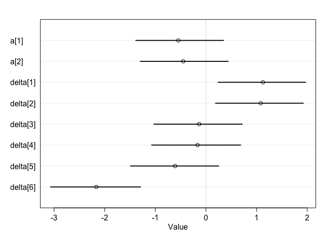
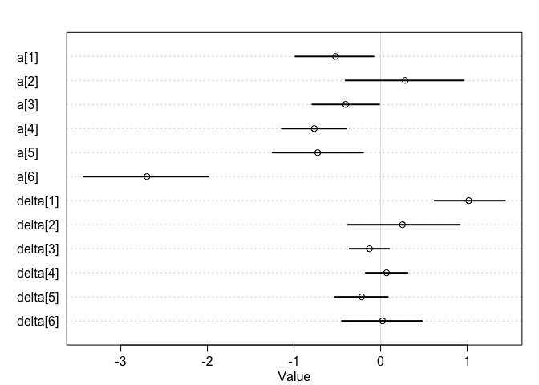

Chap14\_2\_HW
================
Kazu
3/13/2020

# problems

## 13M3. Re-estimate the varying slopes model for the UCBadmit data, now using a non-centered parameterization. Compare the efficiency of the forms of the model, using n\_eff. Which is better? Which chain sampled faster?

  - modified original m11.8 quad version into ulam

<!-- end list -->

``` r
data(UCBadmit)
d <- UCBadmit
dat <- list( A=d$admit , N=d$applications , gid=ifelse( d$applicant.gender=="male" , 1 , 2 ),did=rep(1:6,each=2))
dat
```

    ## $A
    ##  [1] 512  89 353  17 120 202 138 131  53  94  22  24
    ## 
    ## $N
    ##  [1] 825 108 560  25 325 593 417 375 191 393 373 341
    ## 
    ## $gid
    ##  [1] 1 2 1 2 1 2 1 2 1 2 1 2
    ## 
    ## $did
    ##  [1] 1 1 2 2 3 3 4 4 5 5 6 6

``` r
m11.8.ulam <- ulam(
    alist(
        A ~ dbinom(N, p),
        logit(p) <- a[gid] + delta[did] ,
        a[gid] ~ dnorm( 0 , 1.5 ) ,
        delta[did] ~ dnorm( 0 , 1.5 )
    ) , data=dat,chains=4,cores=2,iter=4000,log_lik=TRUE)
```

    ## Trying to compile a simple C file

    ## Running /Library/Frameworks/R.framework/Resources/bin/R CMD SHLIB foo.c
    ## clang -I"/Library/Frameworks/R.framework/Resources/include" -DNDEBUG   -I"/Library/Frameworks/R.framework/Versions/3.6/Resources/library/Rcpp/include/"  -I"/Library/Frameworks/R.framework/Versions/3.6/Resources/library/RcppEigen/include/"  -I"/Library/Frameworks/R.framework/Versions/3.6/Resources/library/RcppEigen/include/unsupported"  -I"/Library/Frameworks/R.framework/Versions/3.6/Resources/library/BH/include" -I"/Library/Frameworks/R.framework/Versions/3.6/Resources/library/StanHeaders/include/src/"  -I"/Library/Frameworks/R.framework/Versions/3.6/Resources/library/StanHeaders/include/"  -I"/Library/Frameworks/R.framework/Versions/3.6/Resources/library/RcppParallel/include/"  -I"/Library/Frameworks/R.framework/Versions/3.6/Resources/library/rstan/include" -DEIGEN_NO_DEBUG  -DBOOST_DISABLE_ASSERTS  -DBOOST_PENDING_INTEGER_LOG2_HPP  -DSTAN_THREADS  -include stan/math/prim/mat/fun/Eigen.hpp  -D_REENTRANT  "-isystem /Library/Developer/CommandLineTools/SDKs/MacOSX.sdk/usr/include"  -fPIC  -isysroot /Library/Developer/CommandLineTools/SDKs/MacOSX.sdk -c foo.c -o foo.o
    ## In file included from <built-in>:1:
    ## In file included from /Library/Frameworks/R.framework/Versions/3.6/Resources/library/StanHeaders/include/stan/math/prim/mat/fun/Eigen.hpp:13:
    ## In file included from /Library/Frameworks/R.framework/Versions/3.6/Resources/library/RcppEigen/include/Eigen/Dense:1:
    ## In file included from /Library/Frameworks/R.framework/Versions/3.6/Resources/library/RcppEigen/include/Eigen/Core:88:
    ## /Library/Frameworks/R.framework/Versions/3.6/Resources/library/RcppEigen/include/Eigen/src/Core/util/Macros.h:613:1: error: unknown type name 'namespace'
    ## namespace Eigen {
    ## ^
    ## /Library/Frameworks/R.framework/Versions/3.6/Resources/library/RcppEigen/include/Eigen/src/Core/util/Macros.h:613:16: error: expected ';' after top level declarator
    ## namespace Eigen {
    ##                ^
    ##                ;
    ## In file included from <built-in>:1:
    ## In file included from /Library/Frameworks/R.framework/Versions/3.6/Resources/library/StanHeaders/include/stan/math/prim/mat/fun/Eigen.hpp:13:
    ## In file included from /Library/Frameworks/R.framework/Versions/3.6/Resources/library/RcppEigen/include/Eigen/Dense:1:
    ## /Library/Frameworks/R.framework/Versions/3.6/Resources/library/RcppEigen/include/Eigen/Core:96:10: fatal error: 'complex' file not found
    ## #include <complex>
    ##          ^~~~~~~~~
    ## 3 errors generated.
    ## make: *** [foo.o] Error 1

``` r
precis( m11.8.ulam , depth=2 )
```

    ##                mean        sd       5.5%      94.5%    n_eff    Rhat4
    ## a[1]     -0.5460159 0.5390888 -1.3843212  0.3474858 642.2366 1.004034
    ## a[2]     -0.4494725 0.5387878 -1.2962203  0.4394950 644.4569 1.004024
    ## delta[1]  1.1273641 0.5410438  0.2413177  1.9679555 651.8371 1.003870
    ## delta[2]  1.0816159 0.5437516  0.1895826  1.9228038 653.8753 1.003996
    ## delta[3] -0.1334955 0.5409212 -1.0277474  0.7149227 651.1226 1.004008
    ## delta[4] -0.1653591 0.5416220 -1.0715743  0.6851905 650.3327 1.004116
    ## delta[5] -0.6084189 0.5446588 -1.4908070  0.2504162 656.7207 1.003880
    ## delta[6] -2.1671913 0.5518034 -3.0691749 -1.2916134 670.9853 1.003441

``` r
plot(m11.8.ulam , depth=2)
```

<!-- -->

  - multitire? partial pooling model?

<!-- end list -->

``` r
m.practice13M3.a <- ulam(
    alist(
        A ~ dbinom(N , p ) ,
        ## partial pooling model?
        logit(p) <- a[did] + delta[did]*gid,
          a[did] ~ dnorm( 0 , 1.5 ) ,
          delta[did] ~ dnorm(0,1.5) 
        ) , data=dat , chains=4 , cores=2 , iter=4000,log_lik=TRUE )
```

    ## Trying to compile a simple C file

    ## Running /Library/Frameworks/R.framework/Resources/bin/R CMD SHLIB foo.c
    ## clang -I"/Library/Frameworks/R.framework/Resources/include" -DNDEBUG   -I"/Library/Frameworks/R.framework/Versions/3.6/Resources/library/Rcpp/include/"  -I"/Library/Frameworks/R.framework/Versions/3.6/Resources/library/RcppEigen/include/"  -I"/Library/Frameworks/R.framework/Versions/3.6/Resources/library/RcppEigen/include/unsupported"  -I"/Library/Frameworks/R.framework/Versions/3.6/Resources/library/BH/include" -I"/Library/Frameworks/R.framework/Versions/3.6/Resources/library/StanHeaders/include/src/"  -I"/Library/Frameworks/R.framework/Versions/3.6/Resources/library/StanHeaders/include/"  -I"/Library/Frameworks/R.framework/Versions/3.6/Resources/library/RcppParallel/include/"  -I"/Library/Frameworks/R.framework/Versions/3.6/Resources/library/rstan/include" -DEIGEN_NO_DEBUG  -DBOOST_DISABLE_ASSERTS  -DBOOST_PENDING_INTEGER_LOG2_HPP  -DSTAN_THREADS  -include stan/math/prim/mat/fun/Eigen.hpp  -D_REENTRANT  "-isystem /Library/Developer/CommandLineTools/SDKs/MacOSX.sdk/usr/include"  -fPIC  -isysroot /Library/Developer/CommandLineTools/SDKs/MacOSX.sdk -c foo.c -o foo.o
    ## In file included from <built-in>:1:
    ## In file included from /Library/Frameworks/R.framework/Versions/3.6/Resources/library/StanHeaders/include/stan/math/prim/mat/fun/Eigen.hpp:13:
    ## In file included from /Library/Frameworks/R.framework/Versions/3.6/Resources/library/RcppEigen/include/Eigen/Dense:1:
    ## In file included from /Library/Frameworks/R.framework/Versions/3.6/Resources/library/RcppEigen/include/Eigen/Core:88:
    ## /Library/Frameworks/R.framework/Versions/3.6/Resources/library/RcppEigen/include/Eigen/src/Core/util/Macros.h:613:1: error: unknown type name 'namespace'
    ## namespace Eigen {
    ## ^
    ## /Library/Frameworks/R.framework/Versions/3.6/Resources/library/RcppEigen/include/Eigen/src/Core/util/Macros.h:613:16: error: expected ';' after top level declarator
    ## namespace Eigen {
    ##                ^
    ##                ;
    ## In file included from <built-in>:1:
    ## In file included from /Library/Frameworks/R.framework/Versions/3.6/Resources/library/StanHeaders/include/stan/math/prim/mat/fun/Eigen.hpp:13:
    ## In file included from /Library/Frameworks/R.framework/Versions/3.6/Resources/library/RcppEigen/include/Eigen/Dense:1:
    ## /Library/Frameworks/R.framework/Versions/3.6/Resources/library/RcppEigen/include/Eigen/Core:96:10: fatal error: 'complex' file not found
    ## #include <complex>
    ##          ^~~~~~~~~
    ## 3 errors generated.
    ## make: *** [foo.o] Error 1

``` r
precis(m.practice13M3.a, depth=2)
```

    ##                 mean        sd       5.5%       94.5%    n_eff     Rhat4
    ## a[1]     -0.51994234 0.2800641 -0.9847345 -0.08004947 7967.675 0.9998628
    ## a[2]      0.28310924 0.4282272 -0.4057588  0.95674728 7445.306 1.0002139
    ## a[3]     -0.40519144 0.2434635 -0.7891014 -0.01649649 7264.525 0.9999208
    ## a[4]     -0.76712395 0.2332191 -1.1419216 -0.39597779 7302.363 0.9997053
    ## a[5]     -0.72649652 0.3294472 -1.2483515 -0.20127285 7173.905 0.9996252
    ## a[6]     -2.69844744 0.4501602 -3.4299850 -1.98924830 8319.104 0.9999019
    ## delta[1]  1.01829710 0.2525426  0.6220348  1.43831862 8004.034 0.9997593
    ## delta[2]  0.25259877 0.4058572 -0.3793121  0.91330276 7224.749 1.0002312
    ## delta[3] -0.12863937 0.1427458 -0.3577393  0.09732935 7326.389 0.9997977
    ## delta[4]  0.06860459 0.1500722 -0.1726970  0.31140090 7273.522 0.9995517
    ## delta[5] -0.21887784 0.1917816 -0.5288497  0.08290244 7293.399 0.9996740
    ## delta[6]  0.02181234 0.2891616 -0.4479410  0.47741778 8352.759 1.0000361

``` r
plot(m.practice13M3.a,depth=2)
```

<!-- -->

  - the varying slopes model. a\_did and b\_did are related (correct
    wording?)

<!-- end list -->

``` r
m.practice13M3.b <- ulam(
    alist(
        A ~ dbinom(N,p),
        p <- a_did[did] + b_did[did]*gid,
        c(a_did,b_did)[did] ~ multi_normal( c(a,b) , Rho , sigma_did ),
        a ~ normal(0,1.5),
        b ~ normal(0,1.5),
        sigma_did ~ exponential(1),
        Rho ~ lkj_corr(2)
    ) , data=dat , chains=4 , cores=2 , iter=4000,log_lik=TRUE)
```

    ## Trying to compile a simple C file

    ## Running /Library/Frameworks/R.framework/Resources/bin/R CMD SHLIB foo.c
    ## clang -I"/Library/Frameworks/R.framework/Resources/include" -DNDEBUG   -I"/Library/Frameworks/R.framework/Versions/3.6/Resources/library/Rcpp/include/"  -I"/Library/Frameworks/R.framework/Versions/3.6/Resources/library/RcppEigen/include/"  -I"/Library/Frameworks/R.framework/Versions/3.6/Resources/library/RcppEigen/include/unsupported"  -I"/Library/Frameworks/R.framework/Versions/3.6/Resources/library/BH/include" -I"/Library/Frameworks/R.framework/Versions/3.6/Resources/library/StanHeaders/include/src/"  -I"/Library/Frameworks/R.framework/Versions/3.6/Resources/library/StanHeaders/include/"  -I"/Library/Frameworks/R.framework/Versions/3.6/Resources/library/RcppParallel/include/"  -I"/Library/Frameworks/R.framework/Versions/3.6/Resources/library/rstan/include" -DEIGEN_NO_DEBUG  -DBOOST_DISABLE_ASSERTS  -DBOOST_PENDING_INTEGER_LOG2_HPP  -DSTAN_THREADS  -include stan/math/prim/mat/fun/Eigen.hpp  -D_REENTRANT  "-isystem /Library/Developer/CommandLineTools/SDKs/MacOSX.sdk/usr/include"  -fPIC  -isysroot /Library/Developer/CommandLineTools/SDKs/MacOSX.sdk -c foo.c -o foo.o
    ## In file included from <built-in>:1:
    ## In file included from /Library/Frameworks/R.framework/Versions/3.6/Resources/library/StanHeaders/include/stan/math/prim/mat/fun/Eigen.hpp:13:
    ## In file included from /Library/Frameworks/R.framework/Versions/3.6/Resources/library/RcppEigen/include/Eigen/Dense:1:
    ## In file included from /Library/Frameworks/R.framework/Versions/3.6/Resources/library/RcppEigen/include/Eigen/Core:88:
    ## /Library/Frameworks/R.framework/Versions/3.6/Resources/library/RcppEigen/include/Eigen/src/Core/util/Macros.h:613:1: error: unknown type name 'namespace'
    ## namespace Eigen {
    ## ^
    ## /Library/Frameworks/R.framework/Versions/3.6/Resources/library/RcppEigen/include/Eigen/src/Core/util/Macros.h:613:16: error: expected ';' after top level declarator
    ## namespace Eigen {
    ##                ^
    ##                ;
    ## In file included from <built-in>:1:
    ## In file included from /Library/Frameworks/R.framework/Versions/3.6/Resources/library/StanHeaders/include/stan/math/prim/mat/fun/Eigen.hpp:13:
    ## In file included from /Library/Frameworks/R.framework/Versions/3.6/Resources/library/RcppEigen/include/Eigen/Dense:1:
    ## /Library/Frameworks/R.framework/Versions/3.6/Resources/library/RcppEigen/include/Eigen/Core:96:10: fatal error: 'complex' file not found
    ## #include <complex>
    ##          ^~~~~~~~~
    ## 3 errors generated.
    ## make: *** [foo.o] Error 1

    ## Warning in .local(object, ...): some chains had errors; consider specifying
    ## chains = 1 to debug

    ## here are whatever error messages were returned

    ## [[1]]
    ## Stan model '5e55aaf279cf3a37fa83158a9b84caf2' does not contain samples.
    ## 
    ## [[2]]
    ## Stan model '5e55aaf279cf3a37fa83158a9b84caf2' does not contain samples.
    ## 
    ## [[3]]
    ## Stan model '5e55aaf279cf3a37fa83158a9b84caf2' does not contain samples.
    ## 
    ## [[4]]
    ## Stan model '5e55aaf279cf3a37fa83158a9b84caf2' does not contain samples.
    ## 
    ## Stan model '5e55aaf279cf3a37fa83158a9b84caf2' does not contain samples.

    ## Error in validObject(.Object): invalid class "ulam" object: invalid object for slot "coef" in class "ulam": got class "NULL", should be or extend class "numeric"

``` r
# error... why?
precis(m.practice13M3.b, depth=2)
```

    ## Error in precis(m.practice13M3.b, depth = 2): object 'm.practice13M3.b' not found

``` r
plot(m.practice13M3.b,depth=2)
```

    ## Error in plot(m.practice13M3.b, depth = 2): object 'm.practice13M3.b' not found

# normal? dnorm?

``` r
m.practice13M3.c <- ulam(
    alist(
        A ~ dbinom(N,p),
        p <- a_did[did] + b_did[did]*gid,
        c(a_did,b_did)[did] ~ multi_normal( c(a,b) , Rho , sigma_did ),
        a ~ dnorm(0,1.5),
        b ~ dnorm(0,1.5),
        sigma_did ~ exponential(1),
        Rho ~ lkj_corr(2)
    ) , data=dat , chains=4 , cores=2 , iter=4000,log_lik=TRUE)
```

    ## recompiling to avoid crashing R session

    ## Trying to compile a simple C file

    ## Running /Library/Frameworks/R.framework/Resources/bin/R CMD SHLIB foo.c
    ## clang -I"/Library/Frameworks/R.framework/Resources/include" -DNDEBUG   -I"/Library/Frameworks/R.framework/Versions/3.6/Resources/library/Rcpp/include/"  -I"/Library/Frameworks/R.framework/Versions/3.6/Resources/library/RcppEigen/include/"  -I"/Library/Frameworks/R.framework/Versions/3.6/Resources/library/RcppEigen/include/unsupported"  -I"/Library/Frameworks/R.framework/Versions/3.6/Resources/library/BH/include" -I"/Library/Frameworks/R.framework/Versions/3.6/Resources/library/StanHeaders/include/src/"  -I"/Library/Frameworks/R.framework/Versions/3.6/Resources/library/StanHeaders/include/"  -I"/Library/Frameworks/R.framework/Versions/3.6/Resources/library/RcppParallel/include/"  -I"/Library/Frameworks/R.framework/Versions/3.6/Resources/library/rstan/include" -DEIGEN_NO_DEBUG  -DBOOST_DISABLE_ASSERTS  -DBOOST_PENDING_INTEGER_LOG2_HPP  -DSTAN_THREADS  -include stan/math/prim/mat/fun/Eigen.hpp  -D_REENTRANT  "-isystem /Library/Developer/CommandLineTools/SDKs/MacOSX.sdk/usr/include"  -fPIC  -isysroot /Library/Developer/CommandLineTools/SDKs/MacOSX.sdk -c foo.c -o foo.o
    ## In file included from <built-in>:1:
    ## In file included from /Library/Frameworks/R.framework/Versions/3.6/Resources/library/StanHeaders/include/stan/math/prim/mat/fun/Eigen.hpp:13:
    ## In file included from /Library/Frameworks/R.framework/Versions/3.6/Resources/library/RcppEigen/include/Eigen/Dense:1:
    ## In file included from /Library/Frameworks/R.framework/Versions/3.6/Resources/library/RcppEigen/include/Eigen/Core:88:
    ## /Library/Frameworks/R.framework/Versions/3.6/Resources/library/RcppEigen/include/Eigen/src/Core/util/Macros.h:613:1: error: unknown type name 'namespace'
    ## namespace Eigen {
    ## ^
    ## /Library/Frameworks/R.framework/Versions/3.6/Resources/library/RcppEigen/include/Eigen/src/Core/util/Macros.h:613:16: error: expected ';' after top level declarator
    ## namespace Eigen {
    ##                ^
    ##                ;
    ## In file included from <built-in>:1:
    ## In file included from /Library/Frameworks/R.framework/Versions/3.6/Resources/library/StanHeaders/include/stan/math/prim/mat/fun/Eigen.hpp:13:
    ## In file included from /Library/Frameworks/R.framework/Versions/3.6/Resources/library/RcppEigen/include/Eigen/Dense:1:
    ## /Library/Frameworks/R.framework/Versions/3.6/Resources/library/RcppEigen/include/Eigen/Core:96:10: fatal error: 'complex' file not found
    ## #include <complex>
    ##          ^~~~~~~~~
    ## 3 errors generated.
    ## make: *** [foo.o] Error 1

    ## Warning in .local(object, ...): some chains had errors; consider specifying
    ## chains = 1 to debug

    ## here are whatever error messages were returned

    ## [[1]]
    ## Stan model '5e55aaf279cf3a37fa83158a9b84caf2' does not contain samples.
    ## 
    ## [[2]]
    ## Stan model '5e55aaf279cf3a37fa83158a9b84caf2' does not contain samples.
    ## 
    ## [[3]]
    ## Stan model '5e55aaf279cf3a37fa83158a9b84caf2' does not contain samples.
    ## 
    ## [[4]]
    ## Stan model '5e55aaf279cf3a37fa83158a9b84caf2' does not contain samples.
    ## 
    ## Stan model '5e55aaf279cf3a37fa83158a9b84caf2' does not contain samples.

    ## Error in validObject(.Object): invalid class "ulam" object: invalid object for slot "coef" in class "ulam": got class "NULL", should be or extend class "numeric"

``` r
# error why?
precis(m.practice13M3.c, depth=2)
```

    ## Error in precis(m.practice13M3.c, depth = 2): object 'm.practice13M3.c' not found

``` r
plot(m.practice13M3.c,depth=2)
```

    ## Error in plot(m.practice13M3.c, depth = 2): object 'm.practice13M3.c' not found

  - compare

<!-- end list -->

``` r
compare(m11.8.ulam,m.practice13M3.a,m.practice13M3.b,m.practice13M3.c)
```

    ## Error in compare(m11.8.ulam, m.practice13M3.a, m.practice13M3.b, m.practice13M3.c): object 'm.practice13M3.b' not found

# sessionInfo()

``` r
sessionInfo()
```

    ## R version 3.6.2 (2019-12-12)
    ## Platform: x86_64-apple-darwin15.6.0 (64-bit)
    ## Running under: macOS Mojave 10.14.6
    ## 
    ## Matrix products: default
    ## BLAS:   /Library/Frameworks/R.framework/Versions/3.6/Resources/lib/libRblas.0.dylib
    ## LAPACK: /Library/Frameworks/R.framework/Versions/3.6/Resources/lib/libRlapack.dylib
    ## 
    ## locale:
    ## [1] en_US.UTF-8/en_US.UTF-8/en_US.UTF-8/C/en_US.UTF-8/en_US.UTF-8
    ## 
    ## attached base packages:
    ## [1] parallel  stats     graphics  grDevices utils     datasets  methods  
    ## [8] base     
    ## 
    ## other attached packages:
    ##  [1] forcats_0.5.0        stringr_1.4.0        dplyr_0.8.4         
    ##  [4] purrr_0.3.3          readr_1.3.1          tidyr_1.0.2         
    ##  [7] tibble_2.1.3         tidyverse_1.3.0      reshape2_1.4.3      
    ## [10] lmerTest_3.1-1       lme4_1.1-21          Matrix_1.2-18       
    ## [13] rethinking_1.95      dagitty_0.2-2        rstan_2.21.1        
    ## [16] ggplot2_3.3.0        StanHeaders_2.21.0-1
    ## 
    ## loaded via a namespace (and not attached):
    ##  [1] httr_1.4.1          jsonlite_1.6.1      splines_3.6.2      
    ##  [4] modelr_0.1.6        RcppParallel_4.4.4  assertthat_0.2.1   
    ##  [7] stats4_3.6.2        cellranger_1.1.0    yaml_2.2.1         
    ## [10] numDeriv_2016.8-1.1 pillar_1.4.3        backports_1.1.5    
    ## [13] lattice_0.20-40     glue_1.3.1          digest_0.6.25      
    ## [16] rvest_0.3.5         minqa_1.2.4         colorspace_1.4-1   
    ## [19] htmltools_0.4.0     plyr_1.8.6          pkgconfig_2.0.3    
    ## [22] broom_0.5.5         haven_2.2.0         mvtnorm_1.1-0      
    ## [25] scales_1.1.0        processx_3.4.2      generics_0.0.2     
    ## [28] withr_2.1.2         cli_2.0.2           readxl_1.3.1       
    ## [31] magrittr_1.5        crayon_1.3.4        evaluate_0.14      
    ## [34] ps_1.3.2            fs_1.3.1            fansi_0.4.1        
    ## [37] nlme_3.1-145        MASS_7.3-51.5       xml2_1.2.2         
    ## [40] pkgbuild_1.0.6      tools_3.6.2         loo_2.2.0          
    ## [43] prettyunits_1.1.1   hms_0.5.3           lifecycle_0.2.0    
    ## [46] matrixStats_0.55.0  V8_3.0.1            reprex_0.3.0       
    ## [49] munsell_0.5.0       callr_3.4.2         compiler_3.6.2     
    ## [52] rlang_0.4.5         grid_3.6.2          nloptr_1.2.1       
    ## [55] rstudioapi_0.11     rmarkdown_2.1       boot_1.3-24        
    ## [58] gtable_0.3.0        codetools_0.2-16    inline_0.3.15      
    ## [61] DBI_1.1.0           curl_4.3            R6_2.4.1           
    ## [64] lubridate_1.7.4     gridExtra_2.3       knitr_1.28         
    ## [67] shape_1.4.4         stringi_1.4.6       Rcpp_1.0.3         
    ## [70] vctrs_0.2.3         dbplyr_1.4.2        tidyselect_1.0.0   
    ## [73] xfun_0.12           coda_0.19-3
