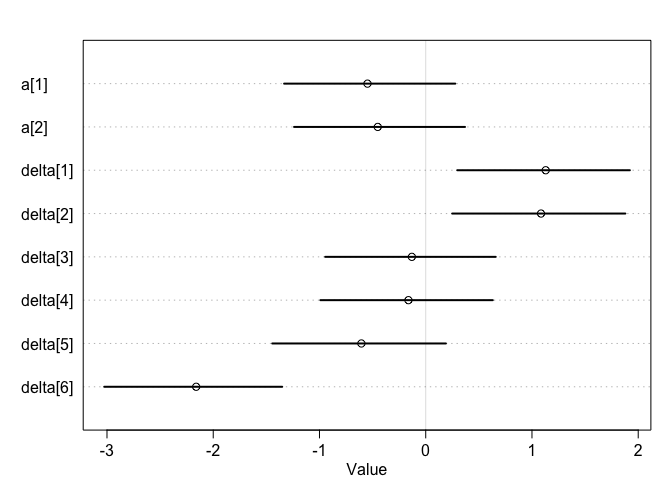

Chap14\_2\_HW
================
Kazu
3/13/2020

# test

# multilevel tadpoles

``` r
data(reedfrogs)
d <- reedfrogs
str(d)
```

    ## 'data.frame':    48 obs. of  5 variables:
    ##  $ density : int  10 10 10 10 10 10 10 10 10 10 ...
    ##  $ pred    : Factor w/ 2 levels "no","pred": 1 1 1 1 1 1 1 1 2 2 ...
    ##  $ size    : Factor w/ 2 levels "big","small": 1 1 1 1 2 2 2 2 1 1 ...
    ##  $ surv    : int  9 10 7 10 9 9 10 9 4 9 ...
    ##  $ propsurv: num  0.9 1 0.7 1 0.9 0.9 1 0.9 0.4 0.9 ...

``` r
d
```

    ##    density pred  size surv  propsurv
    ## 1       10   no   big    9 0.9000000
    ## 2       10   no   big   10 1.0000000
    ## 3       10   no   big    7 0.7000000
    ## 4       10   no   big   10 1.0000000
    ## 5       10   no small    9 0.9000000
    ## 6       10   no small    9 0.9000000
    ## 7       10   no small   10 1.0000000
    ## 8       10   no small    9 0.9000000
    ## 9       10 pred   big    4 0.4000000
    ## 10      10 pred   big    9 0.9000000
    ## 11      10 pred   big    7 0.7000000
    ## 12      10 pred   big    6 0.6000000
    ## 13      10 pred small    7 0.7000000
    ## 14      10 pred small    5 0.5000000
    ## 15      10 pred small    9 0.9000000
    ## 16      10 pred small    9 0.9000000
    ## 17      25   no   big   24 0.9600000
    ## 18      25   no   big   23 0.9200000
    ## 19      25   no   big   22 0.8800000
    ## 20      25   no   big   25 1.0000000
    ## 21      25   no small   23 0.9200000
    ## 22      25   no small   23 0.9200000
    ## 23      25   no small   23 0.9200000
    ## 24      25   no small   21 0.8400000
    ## 25      25 pred   big    6 0.2400000
    ## 26      25 pred   big   13 0.5200000
    ## 27      25 pred   big    4 0.1600000
    ## 28      25 pred   big    9 0.3600000
    ## 29      25 pred small   13 0.5200000
    ## 30      25 pred small   20 0.8000000
    ## 31      25 pred small    8 0.3200000
    ## 32      25 pred small   10 0.4000000
    ## 33      35   no   big   34 0.9714286
    ## 34      35   no   big   33 0.9428571
    ## 35      35   no   big   33 0.9428571
    ## 36      35   no   big   31 0.8857143
    ## 37      35   no small   31 0.8857143
    ## 38      35   no small   35 1.0000000
    ## 39      35   no small   33 0.9428571
    ## 40      35   no small   32 0.9142857
    ## 41      35 pred   big    4 0.1142857
    ## 42      35 pred   big   12 0.3428571
    ## 43      35 pred   big   13 0.3714286
    ## 44      35 pred   big   14 0.4000000
    ## 45      35 pred small   22 0.6285714
    ## 46      35 pred small   12 0.3428571
    ## 47      35 pred small   31 0.8857143
    ## 48      35 pred small   17 0.4857143

``` r
# make the tank cluster variable
d$tank <- 1:nrow(d)
dat <- list(
    S = d$surv,
    N = d$density,
    tank = d$tank )
```

  - varying intercepts model (= simplelst kind of varying effects)

  
![
Si \\sim Bionial(N\_i,p\_i) \\\\
logit(p\_i) \\sim \\alpha\_{TANK\[i\]} \\\\
\\alpha\_j \\sim Normal(0,1.5),\\ for\\ j=1..48 \\\\
](https://latex.codecogs.com/png.latex?%0ASi%20%5Csim%20Bionial%28N_i%2Cp_i%29%20%5C%5C%0Alogit%28p_i%29%20%5Csim%20%5Calpha_%7BTANK%5Bi%5D%7D%20%5C%5C%0A%5Calpha_j%20%5Csim%20Normal%280%2C1.5%29%2C%5C%20for%5C%20j%3D1..48%20%5C%5C%0A
"
Si \\sim Bionial(N_i,p_i) \\\\
logit(p_i) \\sim \\alpha_{TANK[i]} \\\\
\\alpha_j \\sim Normal(0,1.5),\\ for\\ j=1..48 \\\\
")  

``` r
m13.1 <- ulam(
    alist(
        S ~ dbinom( N , p ),
        logit(p) <- a[tank],
        a[tank] ~ dnorm( 0 , 1.5 )
), data=dat, chains=4, log_lik=TRUE ,cores=2) # cores=2 added by Kazu
```

    ## Trying to compile a simple C file

    ## Running /Library/Frameworks/R.framework/Resources/bin/R CMD SHLIB foo.c
    ## clang -I"/Library/Frameworks/R.framework/Resources/include" -DNDEBUG   -I"/Library/Frameworks/R.framework/Versions/3.6/Resources/library/Rcpp/include/"  -I"/Library/Frameworks/R.framework/Versions/3.6/Resources/library/RcppEigen/include/"  -I"/Library/Frameworks/R.framework/Versions/3.6/Resources/library/RcppEigen/include/unsupported"  -I"/Library/Frameworks/R.framework/Versions/3.6/Resources/library/BH/include" -I"/Library/Frameworks/R.framework/Versions/3.6/Resources/library/StanHeaders/include/src/"  -I"/Library/Frameworks/R.framework/Versions/3.6/Resources/library/StanHeaders/include/"  -I"/Library/Frameworks/R.framework/Versions/3.6/Resources/library/RcppParallel/include/"  -I"/Library/Frameworks/R.framework/Versions/3.6/Resources/library/rstan/include" -DEIGEN_NO_DEBUG  -DBOOST_DISABLE_ASSERTS  -DBOOST_PENDING_INTEGER_LOG2_HPP  -DSTAN_THREADS  -include stan/math/prim/mat/fun/Eigen.hpp  -D_REENTRANT  "-isystem /Library/Developer/CommandLineTools/SDKs/MacOSX.sdk/usr/include"  -fPIC  -isysroot /Library/Developer/CommandLineTools/SDKs/MacOSX.sdk -c foo.c -o foo.o
    ## In file included from <built-in>:1:
    ## In file included from /Library/Frameworks/R.framework/Versions/3.6/Resources/library/StanHeaders/include/stan/math/prim/mat/fun/Eigen.hpp:13:
    ## In file included from /Library/Frameworks/R.framework/Versions/3.6/Resources/library/RcppEigen/include/Eigen/Dense:1:
    ## In file included from /Library/Frameworks/R.framework/Versions/3.6/Resources/library/RcppEigen/include/Eigen/Core:88:
    ## /Library/Frameworks/R.framework/Versions/3.6/Resources/library/RcppEigen/include/Eigen/src/Core/util/Macros.h:613:1: error: unknown type name 'namespace'
    ## namespace Eigen {
    ## ^
    ## /Library/Frameworks/R.framework/Versions/3.6/Resources/library/RcppEigen/include/Eigen/src/Core/util/Macros.h:613:16: error: expected ';' after top level declarator
    ## namespace Eigen {
    ##                ^
    ##                ;
    ## In file included from <built-in>:1:
    ## In file included from /Library/Frameworks/R.framework/Versions/3.6/Resources/library/StanHeaders/include/stan/math/prim/mat/fun/Eigen.hpp:13:
    ## In file included from /Library/Frameworks/R.framework/Versions/3.6/Resources/library/RcppEigen/include/Eigen/Dense:1:
    ## /Library/Frameworks/R.framework/Versions/3.6/Resources/library/RcppEigen/include/Eigen/Core:96:10: fatal error: 'complex' file not found
    ## #include <complex>
    ##          ^~~~~~~~~
    ## 3 errors generated.
    ## make: *** [foo.o] Error 1

# the end of test

# problems

## 13M3. Re-estimate the varying slopes model for the UCBadmit data, now using a non-centered parameterization. Compare the efficiency of the forms of the model, using n\_eff. Which is better? Which chain sampled faster?

  - modified original m11.8 quad version into ulam

<!-- end list -->

``` r
data(UCBadmit)
d <- UCBadmit
dat <- list( A=d$admit , N=d$applications , gid=ifelse( d$applicant.gender=="male" , 1 , 2 ),did=rep(1:6,each=2))
dat
```

    ## $A
    ##  [1] 512  89 353  17 120 202 138 131  53  94  22  24
    ## 
    ## $N
    ##  [1] 825 108 560  25 325 593 417 375 191 393 373 341
    ## 
    ## $gid
    ##  [1] 1 2 1 2 1 2 1 2 1 2 1 2
    ## 
    ## $did
    ##  [1] 1 1 2 2 3 3 4 4 5 5 6 6

``` r
m11.8.ulam <- ulam(
    alist(
        A ~ dbinom(N, p),
        logit(p) <- a[gid] + delta[did] ,
        a[gid] ~ dnorm( 0 , 1.5 ) ,
        delta[did] ~ dnorm( 0 , 1.5 )
    ) , data=dat,chains=4,cores=2,iter=4000,log_lik=TRUE)
```

    ## Trying to compile a simple C file

    ## Running /Library/Frameworks/R.framework/Resources/bin/R CMD SHLIB foo.c
    ## clang -I"/Library/Frameworks/R.framework/Resources/include" -DNDEBUG   -I"/Library/Frameworks/R.framework/Versions/3.6/Resources/library/Rcpp/include/"  -I"/Library/Frameworks/R.framework/Versions/3.6/Resources/library/RcppEigen/include/"  -I"/Library/Frameworks/R.framework/Versions/3.6/Resources/library/RcppEigen/include/unsupported"  -I"/Library/Frameworks/R.framework/Versions/3.6/Resources/library/BH/include" -I"/Library/Frameworks/R.framework/Versions/3.6/Resources/library/StanHeaders/include/src/"  -I"/Library/Frameworks/R.framework/Versions/3.6/Resources/library/StanHeaders/include/"  -I"/Library/Frameworks/R.framework/Versions/3.6/Resources/library/RcppParallel/include/"  -I"/Library/Frameworks/R.framework/Versions/3.6/Resources/library/rstan/include" -DEIGEN_NO_DEBUG  -DBOOST_DISABLE_ASSERTS  -DBOOST_PENDING_INTEGER_LOG2_HPP  -DSTAN_THREADS  -include stan/math/prim/mat/fun/Eigen.hpp  -D_REENTRANT  "-isystem /Library/Developer/CommandLineTools/SDKs/MacOSX.sdk/usr/include"  -fPIC  -isysroot /Library/Developer/CommandLineTools/SDKs/MacOSX.sdk -c foo.c -o foo.o
    ## In file included from <built-in>:1:
    ## In file included from /Library/Frameworks/R.framework/Versions/3.6/Resources/library/StanHeaders/include/stan/math/prim/mat/fun/Eigen.hpp:13:
    ## In file included from /Library/Frameworks/R.framework/Versions/3.6/Resources/library/RcppEigen/include/Eigen/Dense:1:
    ## In file included from /Library/Frameworks/R.framework/Versions/3.6/Resources/library/RcppEigen/include/Eigen/Core:88:
    ## /Library/Frameworks/R.framework/Versions/3.6/Resources/library/RcppEigen/include/Eigen/src/Core/util/Macros.h:613:1: error: unknown type name 'namespace'
    ## namespace Eigen {
    ## ^
    ## /Library/Frameworks/R.framework/Versions/3.6/Resources/library/RcppEigen/include/Eigen/src/Core/util/Macros.h:613:16: error: expected ';' after top level declarator
    ## namespace Eigen {
    ##                ^
    ##                ;
    ## In file included from <built-in>:1:
    ## In file included from /Library/Frameworks/R.framework/Versions/3.6/Resources/library/StanHeaders/include/stan/math/prim/mat/fun/Eigen.hpp:13:
    ## In file included from /Library/Frameworks/R.framework/Versions/3.6/Resources/library/RcppEigen/include/Eigen/Dense:1:
    ## /Library/Frameworks/R.framework/Versions/3.6/Resources/library/RcppEigen/include/Eigen/Core:96:10: fatal error: 'complex' file not found
    ## #include <complex>
    ##          ^~~~~~~~~
    ## 3 errors generated.
    ## make: *** [foo.o] Error 1

``` r
precis( m11.8.ulam , depth=2 )
```

    ##                mean        sd       5.5%      94.5%    n_eff    Rhat4
    ## a[1]     -0.5757211 0.5350527 -1.4270152  0.2836949 611.9735 1.000902
    ## a[2]     -0.4785611 0.5365328 -1.3265517  0.3838958 614.0224 1.000853
    ## delta[1]  1.1565952 0.5379881  0.2829745  2.0090522 619.7225 1.000762
    ## delta[2]  1.1131554 0.5403540  0.2487516  1.9796943 623.6869 1.001080
    ## delta[3] -0.1036900 0.5394389 -0.9762103  0.7603851 616.1843 1.000893
    ## delta[4] -0.1356350 0.5390928 -1.0036596  0.7263490 617.1764 1.000778
    ## delta[5] -0.5801026 0.5389542 -1.4509705  0.2833608 622.2192 1.000975
    ## delta[6] -2.1335407 0.5526464 -3.0225530 -1.2501634 634.8975 1.000791

``` r
plot(m11.8.ulam , depth=2)
```

<!-- -->

  - multitire? partial pooling model?

<!-- end list -->

``` r
m.practice13M3.a <- ulam(
    alist(
        A ~ dbinom(N , p ) ,
        ## partial pooling model?
        logit(p) <- a[did] + delta[did]*gid,
          a[did] ~ dnorm( 0 , 1.5 ) ,
          delta[did] ~ dnorm(0,1.5) 
        ) , data=dat , chains=4 , cores=2 , iter=4000,log_lik=TRUE )
```

    ## Trying to compile a simple C file

    ## Running /Library/Frameworks/R.framework/Resources/bin/R CMD SHLIB foo.c
    ## clang -I"/Library/Frameworks/R.framework/Resources/include" -DNDEBUG   -I"/Library/Frameworks/R.framework/Versions/3.6/Resources/library/Rcpp/include/"  -I"/Library/Frameworks/R.framework/Versions/3.6/Resources/library/RcppEigen/include/"  -I"/Library/Frameworks/R.framework/Versions/3.6/Resources/library/RcppEigen/include/unsupported"  -I"/Library/Frameworks/R.framework/Versions/3.6/Resources/library/BH/include" -I"/Library/Frameworks/R.framework/Versions/3.6/Resources/library/StanHeaders/include/src/"  -I"/Library/Frameworks/R.framework/Versions/3.6/Resources/library/StanHeaders/include/"  -I"/Library/Frameworks/R.framework/Versions/3.6/Resources/library/RcppParallel/include/"  -I"/Library/Frameworks/R.framework/Versions/3.6/Resources/library/rstan/include" -DEIGEN_NO_DEBUG  -DBOOST_DISABLE_ASSERTS  -DBOOST_PENDING_INTEGER_LOG2_HPP  -DSTAN_THREADS  -include stan/math/prim/mat/fun/Eigen.hpp  -D_REENTRANT  "-isystem /Library/Developer/CommandLineTools/SDKs/MacOSX.sdk/usr/include"  -fPIC  -isysroot /Library/Developer/CommandLineTools/SDKs/MacOSX.sdk -c foo.c -o foo.o
    ## In file included from <built-in>:1:
    ## In file included from /Library/Frameworks/R.framework/Versions/3.6/Resources/library/StanHeaders/include/stan/math/prim/mat/fun/Eigen.hpp:13:
    ## In file included from /Library/Frameworks/R.framework/Versions/3.6/Resources/library/RcppEigen/include/Eigen/Dense:1:
    ## In file included from /Library/Frameworks/R.framework/Versions/3.6/Resources/library/RcppEigen/include/Eigen/Core:88:
    ## /Library/Frameworks/R.framework/Versions/3.6/Resources/library/RcppEigen/include/Eigen/src/Core/util/Macros.h:613:1: error: unknown type name 'namespace'
    ## namespace Eigen {
    ## ^
    ## /Library/Frameworks/R.framework/Versions/3.6/Resources/library/RcppEigen/include/Eigen/src/Core/util/Macros.h:613:16: error: expected ';' after top level declarator
    ## namespace Eigen {
    ##                ^
    ##                ;
    ## In file included from <built-in>:1:
    ## In file included from /Library/Frameworks/R.framework/Versions/3.6/Resources/library/StanHeaders/include/stan/math/prim/mat/fun/Eigen.hpp:13:
    ## In file included from /Library/Frameworks/R.framework/Versions/3.6/Resources/library/RcppEigen/include/Eigen/Dense:1:
    ## /Library/Frameworks/R.framework/Versions/3.6/Resources/library/RcppEigen/include/Eigen/Core:96:10: fatal error: 'complex' file not found
    ## #include <complex>
    ##          ^~~~~~~~~
    ## 3 errors generated.
    ## make: *** [foo.o] Error 1

``` r
precis(m.practice13M3.a, depth=2)
```

    ##                 mean        sd       5.5%       94.5%    n_eff     Rhat4
    ## a[1]     -0.52546530 0.2767856 -0.9652584 -0.08547143 7012.678 0.9997754
    ## a[2]      0.28399808 0.4364918 -0.4288475  0.96403322 7543.220 1.0000216
    ## a[3]     -0.40192643 0.2396105 -0.7863570 -0.01378114 7868.002 1.0000228
    ## a[4]     -0.76708677 0.2275678 -1.1335661 -0.40230373 6899.088 0.9997915
    ## a[5]     -0.73421914 0.3354490 -1.2649110 -0.19961668 7733.333 1.0001114
    ## a[6]     -2.69068513 0.4501433 -3.4220210 -1.96927853 7696.717 1.0002538
    ## delta[1]  1.02270343 0.2499594  0.6244771  1.42152284 6797.912 0.9997523
    ## delta[2]  0.24860720 0.4125581 -0.3977209  0.92819069 7513.228 1.0000932
    ## delta[3] -0.13053862 0.1396194 -0.3540557  0.09265955 7872.920 0.9998774
    ## delta[4]  0.06972912 0.1456684 -0.1627005  0.30034291 6941.333 0.9997977
    ## delta[5] -0.21490839 0.1957965 -0.5272449  0.09680907 7744.554 1.0000570
    ## delta[6]  0.01547691 0.2891586 -0.4511507  0.47354338 7558.273 1.0001401

``` r
plot(m.practice13M3.a,depth=2)
```

<!-- -->

  - the varying slopes model. a\_did and b\_did are related (correct
    wording?)

<!-- end list -->

``` r
m.practice13M3.b <- ulam(
    alist(
        A ~ dbinom(N,p),
        p <- a_did[did] + b_did[did]*gid,
        c(a_did,b_did)[did] ~ multi_normal( c(a,b) , Rho , sigma_did ),
        a ~ normal(0,1.5),
        b ~ normal(0,1.5),
        sigma_did ~ exponential(1),
        Rho ~ lkj_corr(2)
    ) , data=dat , chains=4 , cores=2 , iter=4000,log_lik=TRUE)
```

    ## Trying to compile a simple C file

    ## Running /Library/Frameworks/R.framework/Resources/bin/R CMD SHLIB foo.c
    ## clang -I"/Library/Frameworks/R.framework/Resources/include" -DNDEBUG   -I"/Library/Frameworks/R.framework/Versions/3.6/Resources/library/Rcpp/include/"  -I"/Library/Frameworks/R.framework/Versions/3.6/Resources/library/RcppEigen/include/"  -I"/Library/Frameworks/R.framework/Versions/3.6/Resources/library/RcppEigen/include/unsupported"  -I"/Library/Frameworks/R.framework/Versions/3.6/Resources/library/BH/include" -I"/Library/Frameworks/R.framework/Versions/3.6/Resources/library/StanHeaders/include/src/"  -I"/Library/Frameworks/R.framework/Versions/3.6/Resources/library/StanHeaders/include/"  -I"/Library/Frameworks/R.framework/Versions/3.6/Resources/library/RcppParallel/include/"  -I"/Library/Frameworks/R.framework/Versions/3.6/Resources/library/rstan/include" -DEIGEN_NO_DEBUG  -DBOOST_DISABLE_ASSERTS  -DBOOST_PENDING_INTEGER_LOG2_HPP  -DSTAN_THREADS  -include stan/math/prim/mat/fun/Eigen.hpp  -D_REENTRANT  "-isystem /Library/Developer/CommandLineTools/SDKs/MacOSX.sdk/usr/include"  -fPIC  -isysroot /Library/Developer/CommandLineTools/SDKs/MacOSX.sdk -c foo.c -o foo.o
    ## In file included from <built-in>:1:
    ## In file included from /Library/Frameworks/R.framework/Versions/3.6/Resources/library/StanHeaders/include/stan/math/prim/mat/fun/Eigen.hpp:13:
    ## In file included from /Library/Frameworks/R.framework/Versions/3.6/Resources/library/RcppEigen/include/Eigen/Dense:1:
    ## In file included from /Library/Frameworks/R.framework/Versions/3.6/Resources/library/RcppEigen/include/Eigen/Core:88:
    ## /Library/Frameworks/R.framework/Versions/3.6/Resources/library/RcppEigen/include/Eigen/src/Core/util/Macros.h:613:1: error: unknown type name 'namespace'
    ## namespace Eigen {
    ## ^
    ## /Library/Frameworks/R.framework/Versions/3.6/Resources/library/RcppEigen/include/Eigen/src/Core/util/Macros.h:613:16: error: expected ';' after top level declarator
    ## namespace Eigen {
    ##                ^
    ##                ;
    ## In file included from <built-in>:1:
    ## In file included from /Library/Frameworks/R.framework/Versions/3.6/Resources/library/StanHeaders/include/stan/math/prim/mat/fun/Eigen.hpp:13:
    ## In file included from /Library/Frameworks/R.framework/Versions/3.6/Resources/library/RcppEigen/include/Eigen/Dense:1:
    ## /Library/Frameworks/R.framework/Versions/3.6/Resources/library/RcppEigen/include/Eigen/Core:96:10: fatal error: 'complex' file not found
    ## #include <complex>
    ##          ^~~~~~~~~
    ## 3 errors generated.
    ## make: *** [foo.o] Error 1

    ## Warning in .local(object, ...): some chains had errors; consider specifying
    ## chains = 1 to debug

    ## here are whatever error messages were returned

    ## [[1]]
    ## Stan model '5e55aaf279cf3a37fa83158a9b84caf2' does not contain samples.
    ## 
    ## [[2]]
    ## Stan model '5e55aaf279cf3a37fa83158a9b84caf2' does not contain samples.
    ## 
    ## [[3]]
    ## Stan model '5e55aaf279cf3a37fa83158a9b84caf2' does not contain samples.
    ## 
    ## [[4]]
    ## Stan model '5e55aaf279cf3a37fa83158a9b84caf2' does not contain samples.
    ## 
    ## Stan model '5e55aaf279cf3a37fa83158a9b84caf2' does not contain samples.

    ## Error in validObject(.Object): invalid class "ulam" object: invalid object for slot "coef" in class "ulam": got class "NULL", should be or extend class "numeric"

``` r
# error... why?
precis(m.practice13M3.b, depth=2)
```

    ## Error in precis(m.practice13M3.b, depth = 2): object 'm.practice13M3.b' not found

``` r
plot(m.practice13M3.b,depth=2)
```

    ## Error in plot(m.practice13M3.b, depth = 2): object 'm.practice13M3.b' not found

# normal? dnorm?

``` r
m.practice13M3.c <- ulam(
    alist(
        A ~ dbinom(N,p),
        p <- a_did[did] + b_did[did]*gid,
        c(a_did,b_did)[did] ~ multi_normal( c(a,b) , Rho , sigma_did ),
        a ~ dnorm(0,1.5),
        b ~ dnorm(0,1.5),
        sigma_did ~ exponential(1),
        Rho ~ lkj_corr(2)
    ) , data=dat , chains=4 , cores=2 , iter=4000,log_lik=TRUE)
```

    ## recompiling to avoid crashing R session

    ## Trying to compile a simple C file

    ## Running /Library/Frameworks/R.framework/Resources/bin/R CMD SHLIB foo.c
    ## clang -I"/Library/Frameworks/R.framework/Resources/include" -DNDEBUG   -I"/Library/Frameworks/R.framework/Versions/3.6/Resources/library/Rcpp/include/"  -I"/Library/Frameworks/R.framework/Versions/3.6/Resources/library/RcppEigen/include/"  -I"/Library/Frameworks/R.framework/Versions/3.6/Resources/library/RcppEigen/include/unsupported"  -I"/Library/Frameworks/R.framework/Versions/3.6/Resources/library/BH/include" -I"/Library/Frameworks/R.framework/Versions/3.6/Resources/library/StanHeaders/include/src/"  -I"/Library/Frameworks/R.framework/Versions/3.6/Resources/library/StanHeaders/include/"  -I"/Library/Frameworks/R.framework/Versions/3.6/Resources/library/RcppParallel/include/"  -I"/Library/Frameworks/R.framework/Versions/3.6/Resources/library/rstan/include" -DEIGEN_NO_DEBUG  -DBOOST_DISABLE_ASSERTS  -DBOOST_PENDING_INTEGER_LOG2_HPP  -DSTAN_THREADS  -include stan/math/prim/mat/fun/Eigen.hpp  -D_REENTRANT  "-isystem /Library/Developer/CommandLineTools/SDKs/MacOSX.sdk/usr/include"  -fPIC  -isysroot /Library/Developer/CommandLineTools/SDKs/MacOSX.sdk -c foo.c -o foo.o
    ## In file included from <built-in>:1:
    ## In file included from /Library/Frameworks/R.framework/Versions/3.6/Resources/library/StanHeaders/include/stan/math/prim/mat/fun/Eigen.hpp:13:
    ## In file included from /Library/Frameworks/R.framework/Versions/3.6/Resources/library/RcppEigen/include/Eigen/Dense:1:
    ## In file included from /Library/Frameworks/R.framework/Versions/3.6/Resources/library/RcppEigen/include/Eigen/Core:88:
    ## /Library/Frameworks/R.framework/Versions/3.6/Resources/library/RcppEigen/include/Eigen/src/Core/util/Macros.h:613:1: error: unknown type name 'namespace'
    ## namespace Eigen {
    ## ^
    ## /Library/Frameworks/R.framework/Versions/3.6/Resources/library/RcppEigen/include/Eigen/src/Core/util/Macros.h:613:16: error: expected ';' after top level declarator
    ## namespace Eigen {
    ##                ^
    ##                ;
    ## In file included from <built-in>:1:
    ## In file included from /Library/Frameworks/R.framework/Versions/3.6/Resources/library/StanHeaders/include/stan/math/prim/mat/fun/Eigen.hpp:13:
    ## In file included from /Library/Frameworks/R.framework/Versions/3.6/Resources/library/RcppEigen/include/Eigen/Dense:1:
    ## /Library/Frameworks/R.framework/Versions/3.6/Resources/library/RcppEigen/include/Eigen/Core:96:10: fatal error: 'complex' file not found
    ## #include <complex>
    ##          ^~~~~~~~~
    ## 3 errors generated.
    ## make: *** [foo.o] Error 1

    ## Warning in .local(object, ...): some chains had errors; consider specifying
    ## chains = 1 to debug

    ## here are whatever error messages were returned

    ## [[1]]
    ## Stan model '5e55aaf279cf3a37fa83158a9b84caf2' does not contain samples.
    ## 
    ## [[2]]
    ## Stan model '5e55aaf279cf3a37fa83158a9b84caf2' does not contain samples.
    ## 
    ## [[3]]
    ## Stan model '5e55aaf279cf3a37fa83158a9b84caf2' does not contain samples.
    ## 
    ## [[4]]
    ## Stan model '5e55aaf279cf3a37fa83158a9b84caf2' does not contain samples.
    ## 
    ## Stan model '5e55aaf279cf3a37fa83158a9b84caf2' does not contain samples.

    ## Error in validObject(.Object): invalid class "ulam" object: invalid object for slot "coef" in class "ulam": got class "NULL", should be or extend class "numeric"

``` r
# error why?
precis(m.practice13M3.c, depth=2)
```

    ## Error in precis(m.practice13M3.c, depth = 2): object 'm.practice13M3.c' not found

``` r
plot(m.practice13M3.c,depth=2)
```

    ## Error in plot(m.practice13M3.c, depth = 2): object 'm.practice13M3.c' not found

  - compare

<!-- end list -->

``` r
compare(m11.8.ulam,m.practice13M3.a,m.practice13M3.b,m.practice13M3.c)
```

    ## Error in compare(m11.8.ulam, m.practice13M3.a, m.practice13M3.b, m.practice13M3.c): object 'm.practice13M3.b' not found

# sessionInfo()

``` r
sessionInfo()
```

    ## R version 3.6.2 (2019-12-12)
    ## Platform: x86_64-apple-darwin15.6.0 (64-bit)
    ## Running under: macOS Mojave 10.14.6
    ## 
    ## Matrix products: default
    ## BLAS:   /Library/Frameworks/R.framework/Versions/3.6/Resources/lib/libRblas.0.dylib
    ## LAPACK: /Library/Frameworks/R.framework/Versions/3.6/Resources/lib/libRlapack.dylib
    ## 
    ## locale:
    ## [1] en_US.UTF-8/en_US.UTF-8/en_US.UTF-8/C/en_US.UTF-8/en_US.UTF-8
    ## 
    ## attached base packages:
    ## [1] parallel  stats     graphics  grDevices utils     datasets  methods  
    ## [8] base     
    ## 
    ## other attached packages:
    ##  [1] forcats_0.5.0        stringr_1.4.0        dplyr_0.8.4         
    ##  [4] purrr_0.3.3          readr_1.3.1          tidyr_1.0.2         
    ##  [7] tibble_2.1.3         tidyverse_1.3.0      reshape2_1.4.3      
    ## [10] lmerTest_3.1-1       lme4_1.1-21          Matrix_1.2-18       
    ## [13] rethinking_1.95      dagitty_0.2-2        rstan_2.21.1        
    ## [16] ggplot2_3.3.0        StanHeaders_2.21.0-1
    ## 
    ## loaded via a namespace (and not attached):
    ##  [1] httr_1.4.1          jsonlite_1.6.1      splines_3.6.2      
    ##  [4] modelr_0.1.6        RcppParallel_4.4.4  assertthat_0.2.1   
    ##  [7] stats4_3.6.2        cellranger_1.1.0    yaml_2.2.1         
    ## [10] numDeriv_2016.8-1.1 pillar_1.4.3        backports_1.1.5    
    ## [13] lattice_0.20-40     glue_1.3.1          digest_0.6.25      
    ## [16] rvest_0.3.5         minqa_1.2.4         colorspace_1.4-1   
    ## [19] htmltools_0.4.0     plyr_1.8.6          pkgconfig_2.0.3    
    ## [22] broom_0.5.5         haven_2.2.0         mvtnorm_1.1-0      
    ## [25] scales_1.1.0        processx_3.4.2      generics_0.0.2     
    ## [28] withr_2.1.2         cli_2.0.2           readxl_1.3.1       
    ## [31] magrittr_1.5        crayon_1.3.4        evaluate_0.14      
    ## [34] ps_1.3.2            fs_1.3.1            fansi_0.4.1        
    ## [37] nlme_3.1-145        MASS_7.3-51.5       xml2_1.2.2         
    ## [40] pkgbuild_1.0.6      tools_3.6.2         loo_2.2.0          
    ## [43] prettyunits_1.1.1   hms_0.5.3           lifecycle_0.2.0    
    ## [46] matrixStats_0.55.0  V8_3.0.1            reprex_0.3.0       
    ## [49] munsell_0.5.0       callr_3.4.2         compiler_3.6.2     
    ## [52] rlang_0.4.5         grid_3.6.2          nloptr_1.2.1       
    ## [55] rstudioapi_0.11     rmarkdown_2.1       boot_1.3-24        
    ## [58] gtable_0.3.0        codetools_0.2-16    inline_0.3.15      
    ## [61] DBI_1.1.0           curl_4.3            R6_2.4.1           
    ## [64] lubridate_1.7.4     gridExtra_2.3       knitr_1.28         
    ## [67] shape_1.4.4         stringi_1.4.6       Rcpp_1.0.3         
    ## [70] vctrs_0.2.3         dbplyr_1.4.2        tidyselect_1.0.0   
    ## [73] xfun_0.12           coda_0.19-3
