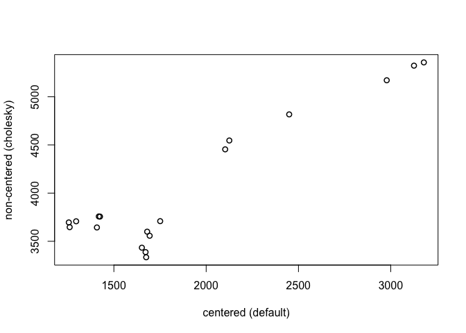

Chap14\_2\_HW
================
Kazu
3/13/2020

# test (my rstan had errors so I checked rstan with simple sample from book)

# multilevel tadpoles

``` r
data(reedfrogs)
d <- reedfrogs
str(d)
```

    ## 'data.frame':    48 obs. of  5 variables:
    ##  $ density : int  10 10 10 10 10 10 10 10 10 10 ...
    ##  $ pred    : Factor w/ 2 levels "no","pred": 1 1 1 1 1 1 1 1 2 2 ...
    ##  $ size    : Factor w/ 2 levels "big","small": 1 1 1 1 2 2 2 2 1 1 ...
    ##  $ surv    : int  9 10 7 10 9 9 10 9 4 9 ...
    ##  $ propsurv: num  0.9 1 0.7 1 0.9 0.9 1 0.9 0.4 0.9 ...

``` r
d
```

    ##    density pred  size surv  propsurv
    ## 1       10   no   big    9 0.9000000
    ## 2       10   no   big   10 1.0000000
    ## 3       10   no   big    7 0.7000000
    ## 4       10   no   big   10 1.0000000
    ## 5       10   no small    9 0.9000000
    ## 6       10   no small    9 0.9000000
    ## 7       10   no small   10 1.0000000
    ## 8       10   no small    9 0.9000000
    ## 9       10 pred   big    4 0.4000000
    ## 10      10 pred   big    9 0.9000000
    ## 11      10 pred   big    7 0.7000000
    ## 12      10 pred   big    6 0.6000000
    ## 13      10 pred small    7 0.7000000
    ## 14      10 pred small    5 0.5000000
    ## 15      10 pred small    9 0.9000000
    ## 16      10 pred small    9 0.9000000
    ## 17      25   no   big   24 0.9600000
    ## 18      25   no   big   23 0.9200000
    ## 19      25   no   big   22 0.8800000
    ## 20      25   no   big   25 1.0000000
    ## 21      25   no small   23 0.9200000
    ## 22      25   no small   23 0.9200000
    ## 23      25   no small   23 0.9200000
    ## 24      25   no small   21 0.8400000
    ## 25      25 pred   big    6 0.2400000
    ## 26      25 pred   big   13 0.5200000
    ## 27      25 pred   big    4 0.1600000
    ## 28      25 pred   big    9 0.3600000
    ## 29      25 pred small   13 0.5200000
    ## 30      25 pred small   20 0.8000000
    ## 31      25 pred small    8 0.3200000
    ## 32      25 pred small   10 0.4000000
    ## 33      35   no   big   34 0.9714286
    ## 34      35   no   big   33 0.9428571
    ## 35      35   no   big   33 0.9428571
    ## 36      35   no   big   31 0.8857143
    ## 37      35   no small   31 0.8857143
    ## 38      35   no small   35 1.0000000
    ## 39      35   no small   33 0.9428571
    ## 40      35   no small   32 0.9142857
    ## 41      35 pred   big    4 0.1142857
    ## 42      35 pred   big   12 0.3428571
    ## 43      35 pred   big   13 0.3714286
    ## 44      35 pred   big   14 0.4000000
    ## 45      35 pred small   22 0.6285714
    ## 46      35 pred small   12 0.3428571
    ## 47      35 pred small   31 0.8857143
    ## 48      35 pred small   17 0.4857143

``` r
# make the tank cluster variable
d$tank <- 1:nrow(d)
dat <- list(
    S = d$surv,
    N = d$density,
    tank = d$tank )
```

  - varying intercepts model (= simplelst kind of varying effects)

  
![
Si \\sim Bionial(N\_i,p\_i) \\\\
logit(p\_i) \\sim \\alpha\_{TANK\[i\]} \\\\
\\alpha\_j \\sim Normal(0,1.5),\\ for\\ j=1..48 \\\\
](https://latex.codecogs.com/png.latex?%0ASi%20%5Csim%20Bionial%28N_i%2Cp_i%29%20%5C%5C%0Alogit%28p_i%29%20%5Csim%20%5Calpha_%7BTANK%5Bi%5D%7D%20%5C%5C%0A%5Calpha_j%20%5Csim%20Normal%280%2C1.5%29%2C%5C%20for%5C%20j%3D1..48%20%5C%5C%0A
"
Si \\sim Bionial(N_i,p_i) \\\\
logit(p_i) \\sim \\alpha_{TANK[i]} \\\\
\\alpha_j \\sim Normal(0,1.5),\\ for\\ j=1..48 \\\\
")  

``` r
m13.1 <- ulam(
    alist(
        S ~ dbinom( N , p ),
        logit(p) <- a[tank],
        a[tank] ~ dnorm( 0 , 1.5 )
), data=dat, chains=4, log_lik=TRUE ,cores=2) # cores=2 added by Kazu
precis( m13.1 , depth=2 )
```

    ##               mean        sd         5.5%       94.5%    n_eff     Rhat4
    ## a[1]   1.708740068 0.7589682  0.607404208  3.02132690 5426.614 0.9993093
    ## a[2]   2.397726332 0.9026657  1.072162716  3.94401766 4934.175 0.9994700
    ## a[3]   0.757520068 0.6285603 -0.227600473  1.76162472 4772.626 0.9992043
    ## a[4]   2.419775785 0.8866030  1.065593303  3.88723056 3097.287 0.9985155
    ## a[5]   1.725621337 0.7748725  0.554050871  3.00394522 4345.191 0.9988180
    ## a[6]   1.703397561 0.7500470  0.599898302  2.90373283 3989.438 0.9982468
    ## a[7]   2.427090656 0.9032844  1.101335159  4.01903331 4143.980 0.9990188
    ## a[8]   1.713461939 0.7637467  0.548265418  2.95871217 5608.232 0.9983835
    ## a[9]  -0.386944173 0.5997969 -1.343051439  0.56731235 4628.584 0.9991269
    ## a[10]  1.714917468 0.7420950  0.566633024  2.94992010 4178.554 0.9998125
    ## a[11]  0.760586936 0.6562297 -0.233540963  1.78296721 4112.146 0.9988415
    ## a[12]  0.367814221 0.6188845 -0.617976545  1.37056749 4235.985 0.9989360
    ## a[13]  0.746321777 0.6368427 -0.277406753  1.74231328 3930.313 0.9996781
    ## a[14]  0.001110675 0.6331203 -0.958790142  0.98660331 4305.996 0.9984337
    ## a[15]  1.707764306 0.7637980  0.573774962  3.00121621 4195.260 0.9988837
    ## a[16]  1.731197853 0.7853879  0.623957599  2.99129960 3411.275 0.9994061
    ## a[17]  2.529071642 0.6814040  1.532766539  3.68214986 3622.928 0.9985048
    ## a[18]  2.135595198 0.5914406  1.254213287  3.11730027 3538.002 0.9997790
    ## a[19]  1.811441455 0.5465091  0.991883379  2.70879784 4606.652 0.9992160
    ## a[20]  3.097562798 0.7820776  1.943966599  4.46887856 4665.010 0.9985182
    ## a[21]  2.143548752 0.5904932  1.250346633  3.14991097 3643.548 0.9989704
    ## a[22]  2.143646339 0.5676617  1.296655830  3.09689706 3538.975 0.9991828
    ## a[23]  2.144328274 0.6423425  1.189854964  3.23629550 4017.178 0.9986233
    ## a[24]  1.536489920 0.5029051  0.786520038  2.39178279 4324.678 0.9988172
    ## a[25] -1.098764823 0.4455410 -1.817825583 -0.40659766 4636.045 0.9984795
    ## a[26]  0.069453818 0.3793688 -0.546751342  0.66227975 4391.479 0.9983003
    ## a[27] -1.529123587 0.4994881 -2.358122509 -0.76099141 4182.646 0.9992285
    ## a[28] -0.552262075 0.4107358 -1.210691978  0.07352745 6245.997 0.9987166
    ## a[29]  0.084819006 0.3975209 -0.547517767  0.70200439 5009.265 0.9989923
    ## a[30]  1.317078436 0.4819546  0.579915153  2.10724216 4101.381 0.9985946
    ## a[31] -0.724045561 0.4329949 -1.430303915 -0.03688864 4142.926 0.9986588
    ## a[32] -0.401724962 0.4076169 -1.066896348  0.23861802 6122.975 0.9989615
    ## a[33]  2.863941301 0.6779563  1.881362588  4.01287458 3414.415 0.9987645
    ## a[34]  2.460539301 0.5786905  1.590682901  3.45400618 3824.142 0.9991896
    ## a[35]  2.455589982 0.5770036  1.591102967  3.42046842 3655.789 0.9994424
    ## a[36]  1.910711505 0.4873934  1.174590630  2.73792418 5142.561 0.9996826
    ## a[37]  1.902398106 0.4908305  1.156267083  2.71121873 5135.216 0.9986337
    ## a[38]  3.367521149 0.7894129  2.224397383  4.75670083 2675.858 0.9993736
    ## a[39]  2.467045709 0.5937521  1.561012999  3.47067955 5015.406 0.9984814
    ## a[40]  2.181379299 0.5499333  1.367204432  3.12303391 3795.627 0.9987409
    ## a[41] -1.917436590 0.4831884 -2.724450228 -1.17984656 3590.936 0.9989671
    ## a[42] -0.631514975 0.3506358 -1.195441068 -0.07243797 5407.544 0.9984292
    ## a[43] -0.502300668 0.3355325 -1.040893797  0.01549010 4576.999 0.9988678
    ## a[44] -0.403599804 0.3497819 -0.967752226  0.14945862 6001.669 0.9999639
    ## a[45]  0.522452711 0.3383568 -0.009815342  1.07098856 4754.596 0.9984989
    ## a[46] -0.635659116 0.3296008 -1.185902965 -0.11876162 6039.609 0.9986512
    ## a[47]  1.910841993 0.4726199  1.183981346  2.70881531 3761.088 0.9991894
    ## a[48] -0.058755845 0.3293634 -0.578717031  0.44531143 4576.101 0.9987512

# the end of test1

# varying slope test (varying slope version of practice 13M3, (eg. m.practice13M3.b) had error, so I cheched varying slope codes from book)

## 14.1.1. Simulate the population.

``` r
a <- 3.5
b <- (-1)
sigma_a <- 1
sigma_b <- 0.5
rho <- (-0.7)
# average morning wait time
# average difference afternoon wait time
# std dev in intercepts
# std dev in slopes
# correlation between intercepts and slopes
```

``` r
Mu <- c( a , b )
```

``` r
cov_ab <- sigma_a*sigma_b*rho
Sigma <- matrix( c(sigma_a^2,cov_ab,cov_ab,sigma_b^2) , ncol=2 )
```

``` r
 matrix( c(1,2,3,4) , nrow=2 , ncol=2 )
```

    ##      [,1] [,2]
    ## [1,]    1    3
    ## [2,]    2    4

``` r
sigmas <- c(sigma_a,sigma_b) # standard deviations
Rho <- matrix( c(1,rho,rho,1) , nrow=2 ) # correlation matrix
# now matrix multiply to get covariance matrix
Sigma <- diag(sigmas) %*% Rho %*% diag(sigmas)
```

``` r
 N_cafes <- 20
```

``` r
library(MASS)
```

    ## 
    ## Attaching package: 'MASS'

    ## The following object is masked from 'package:dplyr':
    ## 
    ##     select

``` r
set.seed(5) # used to replicate example
vary_effects <- mvrnorm( N_cafes , Mu , Sigma )
```

``` r
a_cafe <- vary_effects[,1]
b_cafe <- vary_effects[,2]
```

``` r
plot( a_cafe , b_cafe , col=rangi2 ,
    xlab="intercepts (a_cafe)" , ylab="slopes (b_cafe)" )
# overlay population distribution
library(ellipse)
```

    ## 
    ## Attaching package: 'ellipse'

    ## The following object is masked from 'package:rethinking':
    ## 
    ##     pairs

    ## The following object is masked from 'package:graphics':
    ## 
    ##     pairs

``` r
for ( l in c(0.1,0.3,0.5,0.8,0.99) )
    lines(ellipse(Sigma,centre=Mu,level=l),col=col.alpha("black",0.2))
```

<!-- -->

# 14.1.2. Simulate observations.

``` r
set.seed(22)
N_visits <- 10
afternoon <- rep(0:1,N_visits*N_cafes/2)
cafe_id <- rep( 1:N_cafes , each=N_visits )
mu <- a_cafe[cafe_id] + b_cafe[cafe_id]*afternoon
sigma <- 0.5  # std dev within cafes
wait <- rnorm( N_visits*N_cafes , mu , sigma )
d <- data.frame( cafe=cafe_id , afternoon=afternoon , wait=wait )
```

# 14.1.3. The varying slopes model.

``` r
R <- rlkjcorr( 1e4 , K=2 , eta=2 )
dens( R[,1,2] , xlab="correlation" )
```

<!-- -->

``` r
m14.1 <- ulam(
    alist(
        wait ~ normal( mu , sigma ),
        mu <- a_cafe[cafe] + b_cafe[cafe]*afternoon,
        c(a_cafe,b_cafe)[cafe] ~ multi_normal( c(a,b) , Rho , sigma_cafe ),
        a ~ normal(5,2),
        b ~ normal(-1,0.5),
        sigma_cafe ~ exponential(1),
        sigma ~ exponential(1),
        Rho ~ lkj_corr(2)
    ) , data=d , chains=4 , cores=2,iter=2000,log_lik=TRUE)
```

    ## Warning: The largest R-hat is NA, indicating chains have not mixed.
    ## Running the chains for more iterations may help. See
    ## http://mc-stan.org/misc/warnings.html#r-hat

    ## Warning: Bulk Effective Samples Size (ESS) is too low, indicating posterior means and medians may be unreliable.
    ## Running the chains for more iterations may help. See
    ## http://mc-stan.org/misc/warnings.html#bulk-ess

    ## Warning: Tail Effective Samples Size (ESS) is too low, indicating posterior variances and tail quantiles may be unreliable.
    ## Running the chains for more iterations may help. See
    ## http://mc-stan.org/misc/warnings.html#tail-ess

``` r
# What is lkj_corr?
?rlkjcorr
?rmultinom # for multi_ormal, correct?
precis(m14.1,depth=3)
```

    ##                     mean           sd       5.5%        94.5%    n_eff
    ## b_cafe[1]     -1.1528491 2.594566e-01 -1.5689643 -0.726676216 5311.481
    ## b_cafe[2]     -0.9055777 2.684926e-01 -1.3477132 -0.477822624 5186.250
    ## b_cafe[3]     -1.9381105 2.738587e-01 -2.3727761 -1.498480736 5318.099
    ## b_cafe[4]     -1.2368937 2.643966e-01 -1.6481091 -0.808740187 5848.196
    ## b_cafe[5]     -0.1400265 2.858324e-01 -0.5904145  0.335820601 4644.990
    ## b_cafe[6]     -1.3023128 2.603857e-01 -1.7142367 -0.891614196 5619.572
    ## b_cafe[7]     -1.0228427 2.631967e-01 -1.4403466 -0.591293188 4655.372
    ## b_cafe[8]     -1.6250820 2.600945e-01 -2.0524407 -1.208007604 5210.595
    ## b_cafe[9]     -1.3037484 2.643438e-01 -1.7213383 -0.878759550 4789.355
    ## b_cafe[10]    -0.9524475 2.745354e-01 -1.3934164 -0.516025272 5588.501
    ## b_cafe[11]    -0.4312815 2.796028e-01 -0.8812637  0.009374481 5253.417
    ## b_cafe[12]    -1.1867001 2.640430e-01 -1.6171523 -0.777957606 5404.970
    ## b_cafe[13]    -1.8120531 2.740525e-01 -2.2576544 -1.380823245 5140.964
    ## b_cafe[14]    -0.9404512 2.680443e-01 -1.3696454 -0.521527043 5527.609
    ## b_cafe[15]    -2.1910149 2.872437e-01 -2.6664111 -1.743392561 4620.798
    ## b_cafe[16]    -1.0442255 2.681419e-01 -1.4664822 -0.619460283 5015.437
    ## b_cafe[17]    -1.2195300 2.595661e-01 -1.6392822 -0.797355341 4856.650
    ## b_cafe[18]    -1.0217511 2.854128e-01 -1.4617336 -0.548511208 5248.514
    ## b_cafe[19]    -0.2617084 2.800224e-01 -0.7006356  0.197699802 3877.688
    ## b_cafe[20]    -1.0668223 2.633080e-01 -1.4831090 -0.645958533 5317.117
    ## a_cafe[1]      4.2170991 1.951479e-01  3.9100313  4.528389333 5530.934
    ## a_cafe[2]      2.1598732 2.023715e-01  1.8337605  2.480643343 4499.554
    ## a_cafe[3]      4.3739745 2.002476e-01  4.0507167  4.684667546 5502.994
    ## a_cafe[4]      3.2443856 2.007948e-01  2.9282023  3.568651088 5300.999
    ## a_cafe[5]      1.8766150 2.127240e-01  1.5363659  2.223453778 4645.961
    ## a_cafe[6]      4.2620285 2.006174e-01  3.9437034  4.583606842 5925.506
    ## a_cafe[7]      3.6155890 2.031205e-01  3.2837107  3.940060706 4634.320
    ## a_cafe[8]      3.9479268 1.960748e-01  3.6326402  4.256886352 4963.025
    ## a_cafe[9]      3.9844573 2.006288e-01  3.6640359  4.306853165 3921.227
    ## a_cafe[10]     3.5611095 2.052378e-01  3.2302523  3.894786625 5049.022
    ## a_cafe[11]     1.9355959 2.057440e-01  1.6114683  2.262955603 5098.571
    ## a_cafe[12]     3.8441864 2.006945e-01  3.5245611  4.164164728 5480.961
    ## a_cafe[13]     3.8861255 2.022600e-01  3.5670714  4.210985690 5282.496
    ## a_cafe[14]     3.1760147 2.019739e-01  2.8564048  3.491355809 5056.537
    ## a_cafe[15]     4.4512884 2.096377e-01  4.1152950  4.796033704 5118.758
    ## a_cafe[16]     3.3901411 2.033662e-01  3.0713344  3.713292281 5196.100
    ## a_cafe[17]     4.2143865 1.959483e-01  3.8972662  4.525633835 5139.204
    ## a_cafe[18]     5.7451428 2.066747e-01  5.4116498  6.072375638 5579.548
    ## a_cafe[19]     3.2494420 2.066317e-01  2.9306201  3.582802591 4489.151
    ## a_cafe[20]     3.7373942 1.969077e-01  3.4242504  4.058604281 5334.635
    ## a              3.6512755 2.165104e-01  3.3133642  3.995736551 4664.869
    ## b             -1.1317579 1.431110e-01 -1.3636911 -0.900919846 4020.801
    ## sigma_cafe[1]  0.9609332 1.607341e-01  0.7356584  1.232217974 3663.188
    ## sigma_cafe[2]  0.5909523 1.263922e-01  0.4177011  0.817871202 3611.232
    ## sigma          0.4740424 2.670136e-02  0.4339308  0.518236410 3939.867
    ## Rho[1,1]       1.0000000 0.000000e+00  1.0000000  1.000000000      NaN
    ## Rho[1,2]      -0.5035704 1.779868e-01 -0.7497557 -0.190689099 4116.002
    ## Rho[2,1]      -0.5035704 1.779868e-01 -0.7497557 -0.190689099 4116.002
    ## Rho[2,2]       1.0000000 7.898412e-17  1.0000000  1.000000000 3512.265
    ##                   Rhat4
    ## b_cafe[1]     0.9993523
    ## b_cafe[2]     0.9995211
    ## b_cafe[3]     1.0002009
    ## b_cafe[4]     0.9995452
    ## b_cafe[5]     0.9995517
    ## b_cafe[6]     0.9993782
    ## b_cafe[7]     1.0000161
    ## b_cafe[8]     1.0005508
    ## b_cafe[9]     0.9998809
    ## b_cafe[10]    0.9995082
    ## b_cafe[11]    0.9999762
    ## b_cafe[12]    0.9994160
    ## b_cafe[13]    0.9999128
    ## b_cafe[14]    0.9993147
    ## b_cafe[15]    1.0008124
    ## b_cafe[16]    0.9998594
    ## b_cafe[17]    0.9994817
    ## b_cafe[18]    0.9993323
    ## b_cafe[19]    1.0003333
    ## b_cafe[20]    0.9993206
    ## a_cafe[1]     0.9996961
    ## a_cafe[2]     0.9998999
    ## a_cafe[3]     1.0001218
    ## a_cafe[4]     0.9999444
    ## a_cafe[5]     0.9992030
    ## a_cafe[6]     0.9994401
    ## a_cafe[7]     0.9994942
    ## a_cafe[8]     1.0009442
    ## a_cafe[9]     0.9996461
    ## a_cafe[10]    0.9999180
    ## a_cafe[11]    0.9997575
    ## a_cafe[12]    0.9999845
    ## a_cafe[13]    0.9998129
    ## a_cafe[14]    0.9994796
    ## a_cafe[15]    1.0008258
    ## a_cafe[16]    1.0007247
    ## a_cafe[17]    0.9998508
    ## a_cafe[18]    0.9995430
    ## a_cafe[19]    1.0001542
    ## a_cafe[20]    0.9998679
    ## a             1.0003918
    ## b             0.9999547
    ## sigma_cafe[1] 0.9992414
    ## sigma_cafe[2] 1.0002973
    ## sigma         1.0003127
    ## Rho[1,1]            NaN
    ## Rho[1,2]      1.0001170
    ## Rho[2,1]      1.0001170
    ## Rho[2,2]      0.9989995

# the end of varying slope test

# problems

## 13M3. Re-estimate the varying slopes model for the UCBadmit data, now using a non-centered parameterization. Compare the efficiency of the forms of the model, using n\_eff. Which is better? Which chain sampled faster?

  - modified original m11.8 quad version into ulam

<!-- end list -->

``` r
data(UCBadmit)
d <- UCBadmit
dat <- list( A=d$admit , N=d$applications , gid=ifelse( d$applicant.gender=="male" , 1 , 2 ),did=rep(1:6,each=2))
dat
```

    ## $A
    ##  [1] 512  89 353  17 120 202 138 131  53  94  22  24
    ## 
    ## $N
    ##  [1] 825 108 560  25 325 593 417 375 191 393 373 341
    ## 
    ## $gid
    ##  [1] 1 2 1 2 1 2 1 2 1 2 1 2
    ## 
    ## $did
    ##  [1] 1 1 2 2 3 3 4 4 5 5 6 6

``` r
m11.8.ulam <- ulam(
    alist(
        A ~ dbinom(N, p),
        logit(p) <- a[gid] + delta[did] ,
        a[gid] ~ dnorm( 0 , 1.5 ) ,
        delta[did] ~ dnorm( 0 , 1.5 )
    ) , data=dat,chains=4,cores=2,iter=4000,log_lik=TRUE)
precis( m11.8.ulam , depth=2 )
```

    ##                mean        sd       5.5%      94.5%    n_eff    Rhat4
    ## a[1]     -0.5262248 0.5452144 -1.4062854  0.3415259 526.6117 1.012903
    ## a[2]     -0.4299386 0.5443606 -1.3107084  0.4370145 524.7821 1.013218
    ## delta[1]  1.1088671 0.5476997  0.2295186  1.9964180 535.4185 1.012747
    ## delta[2]  1.0611812 0.5510185  0.1780044  1.9592045 535.0960 1.012777
    ## delta[3] -0.1521725 0.5464802 -1.0264196  0.7351198 528.5720 1.013156
    ## delta[4] -0.1857019 0.5473737 -1.0579425  0.6945677 528.2234 1.013443
    ## delta[5] -0.6274424 0.5496817 -1.5108830  0.2693406 531.6530 1.012678
    ## delta[6] -2.1848236 0.5599223 -3.0910326 -1.2877431 556.6020 1.011782

``` r
plot(m11.8.ulam , depth=2)
```

<!-- -->

  - multitire? partial pooling model?
  - note: This model is called an interaction non-pooling
model.

<!-- end list -->

``` r
# for non-indexed factor (in this cae gender; gid), use zero and 1. For indexed factor, zero is not addlowed (such as did in this case)
dat2 <- list( A=d$admit , N=d$applications , g=ifelse( d$applicant.gender=="male" , 0 , 1 ),did=rep(1:6,each=2))
# wrong by using data=dat
m.practice13M3.a <- ulam(
    alist(
        A ~ dbinom(N , p ) ,
        ## partial pooling model?
        logit(p) <- a[did] + delta[did]*gid,
          a[did] ~ dnorm( 0 , 1.5 ) ,
          delta[did] ~ dnorm(0,1.5) 
        ) , data=dat , chains=4 , cores=2 , iter=4000,log_lik=TRUE )
precis(m.practice13M3.a, depth=2)
```

    ##                 mean        sd       5.5%       94.5%    n_eff     Rhat4
    ## a[1]     -0.52700878 0.2764616 -0.9781664 -0.08802630 8257.448 0.9998392
    ## a[2]      0.28745967 0.4261727 -0.4233378  0.95638786 8647.392 0.9999589
    ## a[3]     -0.40354885 0.2440833 -0.7981437 -0.02147179 6981.161 0.9999536
    ## a[4]     -0.76749117 0.2315105 -1.1363017 -0.39917383 8199.402 1.0002415
    ## a[5]     -0.73066158 0.3324031 -1.2621439 -0.20580076 7666.869 1.0000738
    ## a[6]     -2.69651559 0.4412311 -3.4169811 -1.99765379 7957.199 0.9999250
    ## delta[1]  1.02407004 0.2506693  0.6313589  1.43011159 8109.125 0.9998922
    ## delta[2]  0.24655203 0.4039962 -0.3842757  0.92002530 8499.839 1.0001546
    ## delta[3] -0.12935520 0.1426979 -0.3564129  0.09840573 6863.010 0.9999249
    ## delta[4]  0.06994649 0.1486767 -0.1712544  0.30626484 8329.959 1.0004295
    ## delta[5] -0.21671370 0.1927833 -0.5238982  0.09263528 7917.989 1.0000205
    ## delta[6]  0.01911844 0.2827066 -0.4358511  0.47575199 7979.741 1.0000237

``` r
plot(m.practice13M3.a,depth=2)
# correct bny using data=dat2
m.practice13M3.a2 <- ulam(
    alist(
        A ~ dbinom(N , p ) ,
        ## partial pooling model?
        logit(p) <- a[did] + delta[did]*gid,
          a[did] ~ dnorm( 0 , 1.5 ) ,
          delta[did] ~ dnorm(0,1.5) 
        ) , data=dat2 , chains=4 , cores=2 , iter=4000,log_lik=TRUE )
```

    ## SYNTAX ERROR, MESSAGE(S) FROM PARSER:

    ## Variable "gid" does not exist.

    ##  error in 'model49a853d7c888_eb35c5fbb774db282e809c84f5a6a55b' at line 16, column 46

    ##   -------------------------------------------------

    ##     14:     a ~ normal( 0 , 1.5 );

    ##     15:     for ( i in 1:12 ) {

    ##     16:         p[i] = a[did[i]] + delta[did[i]] * gid;

    ##                                                      ^

    ##     17:         p[i] = inv_logit(p[i]);

    ##   -------------------------------------------------

    ## 

    ## Error in stanc(file = file, model_code = model_code, model_name = model_name, : failed to parse Stan model 'eb35c5fbb774db282e809c84f5a6a55b' due to the above error.

``` r
precis(m.practice13M3.a, depth=2)
```

    ##                 mean        sd       5.5%       94.5%    n_eff     Rhat4
    ## a[1]     -0.52700878 0.2764616 -0.9781664 -0.08802630 8257.448 0.9998392
    ## a[2]      0.28745967 0.4261727 -0.4233378  0.95638786 8647.392 0.9999589
    ## a[3]     -0.40354885 0.2440833 -0.7981437 -0.02147179 6981.161 0.9999536
    ## a[4]     -0.76749117 0.2315105 -1.1363017 -0.39917383 8199.402 1.0002415
    ## a[5]     -0.73066158 0.3324031 -1.2621439 -0.20580076 7666.869 1.0000738
    ## a[6]     -2.69651559 0.4412311 -3.4169811 -1.99765379 7957.199 0.9999250
    ## delta[1]  1.02407004 0.2506693  0.6313589  1.43011159 8109.125 0.9998922
    ## delta[2]  0.24655203 0.4039962 -0.3842757  0.92002530 8499.839 1.0001546
    ## delta[3] -0.12935520 0.1426979 -0.3564129  0.09840573 6863.010 0.9999249
    ## delta[4]  0.06994649 0.1486767 -0.1712544  0.30626484 8329.959 1.0004295
    ## delta[5] -0.21671370 0.1927833 -0.5238982  0.09263528 7917.989 1.0000205
    ## delta[6]  0.01911844 0.2827066 -0.4358511  0.47575199 7979.741 1.0000237

``` r
plot(m.practice13M3.a,depth=2)
```

<!-- -->

  - the varying slopes model. a\_did and b\_did are related (correct
    wording?)
  - I modified m14.1 in the book, but does not work. Why? Even Rho ~
    lkj\_corr(4) instead of Rho ~ lkj\_corr(2)

<!-- end list -->

``` r
m.practice13M3.b <- ulam(
    alist(
        A ~ dbinom(N,p),
        p <- a_did[did] + b_did[did]*gid,
        c(a_did,b_did)[did] ~ multi_normal( c(a,b) , Rho , sigma_did ),
        a ~ normal(0,1.5),
        b ~ normal(0,1.5),
        sigma_did ~ exponential(1),
        Rho ~ lkj_corr(4)
    ) , data=dat , chains=4 , cores=2 , iter=4000,log_lik=TRUE)
```

    ## Warning in .local(object, ...): some chains had errors; consider specifying
    ## chains = 1 to debug

    ## here are whatever error messages were returned

    ## [[1]]
    ## Stan model '7f6fdee5a6afd06e8cc022bb283dbb63' does not contain samples.
    ## 
    ## [[2]]
    ## Stan model '7f6fdee5a6afd06e8cc022bb283dbb63' does not contain samples.
    ## 
    ## [[3]]
    ## Stan model '7f6fdee5a6afd06e8cc022bb283dbb63' does not contain samples.
    ## 
    ## [[4]]
    ## Stan model '7f6fdee5a6afd06e8cc022bb283dbb63' does not contain samples.
    ## 
    ## Stan model '7f6fdee5a6afd06e8cc022bb283dbb63' does not contain samples.

    ## Error in validObject(.Object): invalid class "ulam" object: invalid object for slot "coef" in class "ulam": got class "NULL", should be or extend class "numeric"

``` r
# error... why?
m.practice13M3.b2 <- ulam(
    alist(
        A ~ dbinom(N,p),
        p <- a_did[did] + b_did[did]*gid,
        c(a_did,b_did)[did] ~ multi_normal( c(a,b) , Rho , sigma_did ),
        a ~ normal(0,1.5),
        b ~ normal(0,1.5),
        sigma_did ~ exponential(1),
        Rho ~ lkj_corr(4)
    ) , data=dat2 , chains=4 , cores=2 , iter=4000,log_lik=TRUE)
```

    ## SYNTAX ERROR, MESSAGE(S) FROM PARSER:

    ## Variable "gid" does not exist.

    ##  error in 'model49a814877ca1_fa96e75a3be0e179b7b018a85d146c40' at line 29, column 50

    ##   -------------------------------------------------

    ##     27:     }

    ##     28:     for ( i in 1:12 ) {

    ##     29:         p[i] = a_did[did[i]] + b_did[did[i]] * gid;

    ##                                                          ^

    ##     30:     }

    ##   -------------------------------------------------

    ## 

    ## Error in stanc(file = file, model_code = model_code, model_name = model_name, : failed to parse Stan model 'fa96e75a3be0e179b7b018a85d146c40' due to the above error.

``` r
# error... why?
precis(m.practice13M3.b, depth=2)
```

    ## Error in precis(m.practice13M3.b, depth = 2): object 'm.practice13M3.b' not found

``` r
plot(m.practice13M3.b,depth=2)
```

    ## Error in plot(m.practice13M3.b, depth = 2): object 'm.practice13M3.b' not found

# chain =1 based on error message.

``` r
m.practice13M3.b.chain1 <- ulam(
    alist(
        A ~ dbinom(N,p),
        p <- a_did[did] + b_did[did]*gid,
        c(a_did,b_did)[did] ~ multi_normal( c(a,b) , Rho , sigma_did ),
        a ~ normal(0,1.5),
        b ~ normal(0,1.5),
        sigma_did ~ exponential(1),
        Rho ~ lkj_corr(4)
    ) , data=dat , chains=1 , cores=2 , iter=4000,log_lik=TRUE)
```

    ## recompiling to avoid crashing R session

    ## 
    ## SAMPLING FOR MODEL '7f6fdee5a6afd06e8cc022bb283dbb63' NOW (CHAIN 1).
    ## Chain 1: Rejecting initial value:
    ## Chain 1:   Error evaluating the log probability at the initial value.
    ## Chain 1: Exception: binomial_lpmf: Probability parameter[1] is -1.5047, but must be in the interval [0, 1]  (in 'model49a859516c6c_7f6fdee5a6afd06e8cc022bb283dbb63' at line 31)
    ## 
    ## Chain 1: Rejecting initial value:
    ## Chain 1:   Error evaluating the log probability at the initial value.
    ## Chain 1: Exception: binomial_lpmf: Probability parameter[1] is 1.93371, but must be in the interval [0, 1]  (in 'model49a859516c6c_7f6fdee5a6afd06e8cc022bb283dbb63' at line 31)
    ## 
    ## Chain 1: Rejecting initial value:
    ## Chain 1:   Error evaluating the log probability at the initial value.
    ## Chain 1: Exception: binomial_lpmf: Probability parameter[1] is -0.351137, but must be in the interval [0, 1]  (in 'model49a859516c6c_7f6fdee5a6afd06e8cc022bb283dbb63' at line 31)
    ## 
    ## Chain 1: Rejecting initial value:
    ## Chain 1:   Error evaluating the log probability at the initial value.
    ## Chain 1: Exception: binomial_lpmf: Probability parameter[1] is -2.44541, but must be in the interval [0, 1]  (in 'model49a859516c6c_7f6fdee5a6afd06e8cc022bb283dbb63' at line 31)
    ## 
    ## Chain 1: Rejecting initial value:
    ## Chain 1:   Error evaluating the log probability at the initial value.
    ## Chain 1: Exception: binomial_lpmf: Probability parameter[1] is -0.0278331, but must be in the interval [0, 1]  (in 'model49a859516c6c_7f6fdee5a6afd06e8cc022bb283dbb63' at line 31)
    ## 
    ## Chain 1: Rejecting initial value:
    ## Chain 1:   Error evaluating the log probability at the initial value.
    ## Chain 1: Exception: binomial_lpmf: Probability parameter[1] is -0.393956, but must be in the interval [0, 1]  (in 'model49a859516c6c_7f6fdee5a6afd06e8cc022bb283dbb63' at line 31)
    ## 
    ## Chain 1: Rejecting initial value:
    ## Chain 1:   Error evaluating the log probability at the initial value.
    ## Chain 1: Exception: binomial_lpmf: Probability parameter[1] is 2.70825, but must be in the interval [0, 1]  (in 'model49a859516c6c_7f6fdee5a6afd06e8cc022bb283dbb63' at line 31)
    ## 
    ## Chain 1: Rejecting initial value:
    ## Chain 1:   Error evaluating the log probability at the initial value.
    ## Chain 1: Exception: binomial_lpmf: Probability parameter[1] is 2.23744, but must be in the interval [0, 1]  (in 'model49a859516c6c_7f6fdee5a6afd06e8cc022bb283dbb63' at line 31)
    ## 
    ## Chain 1: Rejecting initial value:
    ## Chain 1:   Error evaluating the log probability at the initial value.
    ## Chain 1: Exception: binomial_lpmf: Probability parameter[3] is -0.629867, but must be in the interval [0, 1]  (in 'model49a859516c6c_7f6fdee5a6afd06e8cc022bb283dbb63' at line 31)
    ## 
    ## Chain 1: Rejecting initial value:
    ## Chain 1:   Error evaluating the log probability at the initial value.
    ## Chain 1: Exception: binomial_lpmf: Probability parameter[1] is 2.72923, but must be in the interval [0, 1]  (in 'model49a859516c6c_7f6fdee5a6afd06e8cc022bb283dbb63' at line 31)
    ## 
    ## Chain 1: Rejecting initial value:
    ## Chain 1:   Error evaluating the log probability at the initial value.
    ## Chain 1: Exception: binomial_lpmf: Probability parameter[1] is -1.55115, but must be in the interval [0, 1]  (in 'model49a859516c6c_7f6fdee5a6afd06e8cc022bb283dbb63' at line 31)
    ## 
    ## Chain 1: Rejecting initial value:
    ## Chain 1:   Error evaluating the log probability at the initial value.
    ## Chain 1: Exception: binomial_lpmf: Probability parameter[2] is -1.39527, but must be in the interval [0, 1]  (in 'model49a859516c6c_7f6fdee5a6afd06e8cc022bb283dbb63' at line 31)
    ## 
    ## Chain 1: Rejecting initial value:
    ## Chain 1:   Error evaluating the log probability at the initial value.
    ## Chain 1: Exception: binomial_lpmf: Probability parameter[1] is 1.72072, but must be in the interval [0, 1]  (in 'model49a859516c6c_7f6fdee5a6afd06e8cc022bb283dbb63' at line 31)
    ## 
    ## Chain 1: Rejecting initial value:
    ## Chain 1:   Error evaluating the log probability at the initial value.
    ## Chain 1: Exception: binomial_lpmf: Probability parameter[4] is 1.87797, but must be in the interval [0, 1]  (in 'model49a859516c6c_7f6fdee5a6afd06e8cc022bb283dbb63' at line 31)
    ## 
    ## Chain 1: Rejecting initial value:
    ## Chain 1:   Error evaluating the log probability at the initial value.
    ## Chain 1: Exception: binomial_lpmf: Probability parameter[2] is -0.35254, but must be in the interval [0, 1]  (in 'model49a859516c6c_7f6fdee5a6afd06e8cc022bb283dbb63' at line 31)
    ## 
    ## Chain 1: Rejecting initial value:
    ## Chain 1:   Error evaluating the log probability at the initial value.
    ## Chain 1: Exception: binomial_lpmf: Probability parameter[3] is 3.19822, but must be in the interval [0, 1]  (in 'model49a859516c6c_7f6fdee5a6afd06e8cc022bb283dbb63' at line 31)
    ## 
    ## Chain 1: Rejecting initial value:
    ## Chain 1:   Error evaluating the log probability at the initial value.
    ## Chain 1: Exception: binomial_lpmf: Probability parameter[1] is -0.118738, but must be in the interval [0, 1]  (in 'model49a859516c6c_7f6fdee5a6afd06e8cc022bb283dbb63' at line 31)
    ## 
    ## Chain 1: Rejecting initial value:
    ## Chain 1:   Error evaluating the log probability at the initial value.
    ## Chain 1: Exception: binomial_lpmf: Probability parameter[1] is -2.87696, but must be in the interval [0, 1]  (in 'model49a859516c6c_7f6fdee5a6afd06e8cc022bb283dbb63' at line 31)
    ## 
    ## Chain 1: Rejecting initial value:
    ## Chain 1:   Error evaluating the log probability at the initial value.
    ## Chain 1: Exception: binomial_lpmf: Probability parameter[1] is -1.0581, but must be in the interval [0, 1]  (in 'model49a859516c6c_7f6fdee5a6afd06e8cc022bb283dbb63' at line 31)
    ## 
    ## Chain 1: Rejecting initial value:
    ## Chain 1:   Error evaluating the log probability at the initial value.
    ## Chain 1: Exception: binomial_lpmf: Probability parameter[1] is -0.946671, but must be in the interval [0, 1]  (in 'model49a859516c6c_7f6fdee5a6afd06e8cc022bb283dbb63' at line 31)
    ## 
    ## Chain 1: Rejecting initial value:
    ## Chain 1:   Error evaluating the log probability at the initial value.
    ## Chain 1: Exception: binomial_lpmf: Probability parameter[1] is 2.88111, but must be in the interval [0, 1]  (in 'model49a859516c6c_7f6fdee5a6afd06e8cc022bb283dbb63' at line 31)
    ## 
    ## Chain 1: Rejecting initial value:
    ## Chain 1:   Error evaluating the log probability at the initial value.
    ## Chain 1: Exception: binomial_lpmf: Probability parameter[1] is 1.39331, but must be in the interval [0, 1]  (in 'model49a859516c6c_7f6fdee5a6afd06e8cc022bb283dbb63' at line 31)
    ## 
    ## Chain 1: Rejecting initial value:
    ## Chain 1:   Error evaluating the log probability at the initial value.
    ## Chain 1: Exception: binomial_lpmf: Probability parameter[1] is 2.83541, but must be in the interval [0, 1]  (in 'model49a859516c6c_7f6fdee5a6afd06e8cc022bb283dbb63' at line 31)
    ## 
    ## Chain 1: Rejecting initial value:
    ## Chain 1:   Error evaluating the log probability at the initial value.
    ## Chain 1: Exception: binomial_lpmf: Probability parameter[1] is -3.14227, but must be in the interval [0, 1]  (in 'model49a859516c6c_7f6fdee5a6afd06e8cc022bb283dbb63' at line 31)
    ## 
    ## Chain 1: Rejecting initial value:
    ## Chain 1:   Error evaluating the log probability at the initial value.
    ## Chain 1: Exception: binomial_lpmf: Probability parameter[2] is -0.550647, but must be in the interval [0, 1]  (in 'model49a859516c6c_7f6fdee5a6afd06e8cc022bb283dbb63' at line 31)
    ## 
    ## Chain 1: Rejecting initial value:
    ## Chain 1:   Error evaluating the log probability at the initial value.
    ## Chain 1: Exception: binomial_lpmf: Probability parameter[1] is 3.7901, but must be in the interval [0, 1]  (in 'model49a859516c6c_7f6fdee5a6afd06e8cc022bb283dbb63' at line 31)
    ## 
    ## Chain 1: Rejecting initial value:
    ## Chain 1:   Error evaluating the log probability at the initial value.
    ## Chain 1: Exception: binomial_lpmf: Probability parameter[3] is -2.67023, but must be in the interval [0, 1]  (in 'model49a859516c6c_7f6fdee5a6afd06e8cc022bb283dbb63' at line 31)
    ## 
    ## Chain 1: Rejecting initial value:
    ## Chain 1:   Error evaluating the log probability at the initial value.
    ## Chain 1: Exception: binomial_lpmf: Probability parameter[1] is 2.74924, but must be in the interval [0, 1]  (in 'model49a859516c6c_7f6fdee5a6afd06e8cc022bb283dbb63' at line 31)
    ## 
    ## Chain 1: Rejecting initial value:
    ## Chain 1:   Error evaluating the log probability at the initial value.
    ## Chain 1: Exception: binomial_lpmf: Probability parameter[1] is -0.370673, but must be in the interval [0, 1]  (in 'model49a859516c6c_7f6fdee5a6afd06e8cc022bb283dbb63' at line 31)
    ## 
    ## Chain 1: Rejecting initial value:
    ## Chain 1:   Error evaluating the log probability at the initial value.
    ## Chain 1: Exception: binomial_lpmf: Probability parameter[1] is -3.06779, but must be in the interval [0, 1]  (in 'model49a859516c6c_7f6fdee5a6afd06e8cc022bb283dbb63' at line 31)
    ## 
    ## Chain 1: Rejecting initial value:
    ## Chain 1:   Error evaluating the log probability at the initial value.
    ## Chain 1: Exception: binomial_lpmf: Probability parameter[1] is -0.00117207, but must be in the interval [0, 1]  (in 'model49a859516c6c_7f6fdee5a6afd06e8cc022bb283dbb63' at line 31)
    ## 
    ## Chain 1: Rejecting initial value:
    ## Chain 1:   Error evaluating the log probability at the initial value.
    ## Chain 1: Exception: binomial_lpmf: Probability parameter[1] is -1.83564, but must be in the interval [0, 1]  (in 'model49a859516c6c_7f6fdee5a6afd06e8cc022bb283dbb63' at line 31)
    ## 
    ## Chain 1: Rejecting initial value:
    ## Chain 1:   Error evaluating the log probability at the initial value.
    ## Chain 1: Exception: binomial_lpmf: Probability parameter[1] is 1.9451, but must be in the interval [0, 1]  (in 'model49a859516c6c_7f6fdee5a6afd06e8cc022bb283dbb63' at line 31)
    ## 
    ## Chain 1: Rejecting initial value:
    ## Chain 1:   Error evaluating the log probability at the initial value.
    ## Chain 1: Exception: binomial_lpmf: Probability parameter[2] is -0.540793, but must be in the interval [0, 1]  (in 'model49a859516c6c_7f6fdee5a6afd06e8cc022bb283dbb63' at line 31)
    ## 
    ## Chain 1: Rejecting initial value:
    ## Chain 1:   Error evaluating the log probability at the initial value.
    ## Chain 1: Exception: binomial_lpmf: Probability parameter[1] is 1.14912, but must be in the interval [0, 1]  (in 'model49a859516c6c_7f6fdee5a6afd06e8cc022bb283dbb63' at line 31)
    ## 
    ## Chain 1: Rejecting initial value:
    ## Chain 1:   Error evaluating the log probability at the initial value.
    ## Chain 1: Exception: binomial_lpmf: Probability parameter[1] is -0.623244, but must be in the interval [0, 1]  (in 'model49a859516c6c_7f6fdee5a6afd06e8cc022bb283dbb63' at line 31)
    ## 
    ## Chain 1: Rejecting initial value:
    ## Chain 1:   Error evaluating the log probability at the initial value.
    ## Chain 1: Exception: binomial_lpmf: Probability parameter[1] is -0.241652, but must be in the interval [0, 1]  (in 'model49a859516c6c_7f6fdee5a6afd06e8cc022bb283dbb63' at line 31)
    ## 
    ## Chain 1: Rejecting initial value:
    ## Chain 1:   Error evaluating the log probability at the initial value.
    ## Chain 1: Exception: binomial_lpmf: Probability parameter[2] is -0.419792, but must be in the interval [0, 1]  (in 'model49a859516c6c_7f6fdee5a6afd06e8cc022bb283dbb63' at line 31)
    ## 
    ## Chain 1: Rejecting initial value:
    ## Chain 1:   Error evaluating the log probability at the initial value.
    ## Chain 1: Exception: binomial_lpmf: Probability parameter[1] is -1.86921, but must be in the interval [0, 1]  (in 'model49a859516c6c_7f6fdee5a6afd06e8cc022bb283dbb63' at line 31)
    ## 
    ## Chain 1: Rejecting initial value:
    ## Chain 1:   Error evaluating the log probability at the initial value.
    ## Chain 1: Exception: binomial_lpmf: Probability parameter[1] is 1.64384, but must be in the interval [0, 1]  (in 'model49a859516c6c_7f6fdee5a6afd06e8cc022bb283dbb63' at line 31)
    ## 
    ## Chain 1: Rejecting initial value:
    ## Chain 1:   Error evaluating the log probability at the initial value.
    ## Chain 1: Exception: binomial_lpmf: Probability parameter[2] is -0.166701, but must be in the interval [0, 1]  (in 'model49a859516c6c_7f6fdee5a6afd06e8cc022bb283dbb63' at line 31)
    ## 
    ## Chain 1: Rejecting initial value:
    ## Chain 1:   Error evaluating the log probability at the initial value.
    ## Chain 1: Exception: binomial_lpmf: Probability parameter[1] is -1.2978, but must be in the interval [0, 1]  (in 'model49a859516c6c_7f6fdee5a6afd06e8cc022bb283dbb63' at line 31)
    ## 
    ## Chain 1: Rejecting initial value:
    ## Chain 1:   Error evaluating the log probability at the initial value.
    ## Chain 1: Exception: binomial_lpmf: Probability parameter[1] is -2.51379, but must be in the interval [0, 1]  (in 'model49a859516c6c_7f6fdee5a6afd06e8cc022bb283dbb63' at line 31)
    ## 
    ## Chain 1: Rejecting initial value:
    ## Chain 1:   Error evaluating the log probability at the initial value.
    ## Chain 1: Exception: binomial_lpmf: Probability parameter[2] is 1.08197, but must be in the interval [0, 1]  (in 'model49a859516c6c_7f6fdee5a6afd06e8cc022bb283dbb63' at line 31)
    ## 
    ## Chain 1: Rejecting initial value:
    ## Chain 1:   Error evaluating the log probability at the initial value.
    ## Chain 1: Exception: binomial_lpmf: Probability parameter[1] is -3.12094, but must be in the interval [0, 1]  (in 'model49a859516c6c_7f6fdee5a6afd06e8cc022bb283dbb63' at line 31)
    ## 
    ## Chain 1: Rejecting initial value:
    ## Chain 1:   Error evaluating the log probability at the initial value.
    ## Chain 1: Exception: binomial_lpmf: Probability parameter[1] is -0.538363, but must be in the interval [0, 1]  (in 'model49a859516c6c_7f6fdee5a6afd06e8cc022bb283dbb63' at line 31)
    ## 
    ## Chain 1: Rejecting initial value:
    ## Chain 1:   Error evaluating the log probability at the initial value.
    ## Chain 1: Exception: binomial_lpmf: Probability parameter[1] is 2.4533, but must be in the interval [0, 1]  (in 'model49a859516c6c_7f6fdee5a6afd06e8cc022bb283dbb63' at line 31)
    ## 
    ## Chain 1: Rejecting initial value:
    ## Chain 1:   Error evaluating the log probability at the initial value.
    ## Chain 1: Exception: binomial_lpmf: Probability parameter[1] is -1.32103, but must be in the interval [0, 1]  (in 'model49a859516c6c_7f6fdee5a6afd06e8cc022bb283dbb63' at line 31)
    ## 
    ## Chain 1: Rejecting initial value:
    ## Chain 1:   Error evaluating the log probability at the initial value.
    ## Chain 1: Exception: binomial_lpmf: Probability parameter[1] is -0.563865, but must be in the interval [0, 1]  (in 'model49a859516c6c_7f6fdee5a6afd06e8cc022bb283dbb63' at line 31)
    ## 
    ## Chain 1: Rejecting initial value:
    ## Chain 1:   Error evaluating the log probability at the initial value.
    ## Chain 1: Exception: binomial_lpmf: Probability parameter[1] is -1.42503, but must be in the interval [0, 1]  (in 'model49a859516c6c_7f6fdee5a6afd06e8cc022bb283dbb63' at line 31)
    ## 
    ## Chain 1: Rejecting initial value:
    ## Chain 1:   Error evaluating the log probability at the initial value.
    ## Chain 1: Exception: binomial_lpmf: Probability parameter[1] is -1.65885, but must be in the interval [0, 1]  (in 'model49a859516c6c_7f6fdee5a6afd06e8cc022bb283dbb63' at line 31)
    ## 
    ## Chain 1: Rejecting initial value:
    ## Chain 1:   Error evaluating the log probability at the initial value.
    ## Chain 1: Exception: binomial_lpmf: Probability parameter[1] is 2.71079, but must be in the interval [0, 1]  (in 'model49a859516c6c_7f6fdee5a6afd06e8cc022bb283dbb63' at line 31)
    ## 
    ## Chain 1: Rejecting initial value:
    ## Chain 1:   Error evaluating the log probability at the initial value.
    ## Chain 1: Exception: binomial_lpmf: Probability parameter[1] is -0.372662, but must be in the interval [0, 1]  (in 'model49a859516c6c_7f6fdee5a6afd06e8cc022bb283dbb63' at line 31)
    ## 
    ## Chain 1: Rejecting initial value:
    ## Chain 1:   Error evaluating the log probability at the initial value.
    ## Chain 1: Exception: binomial_lpmf: Probability parameter[1] is 1.38612, but must be in the interval [0, 1]  (in 'model49a859516c6c_7f6fdee5a6afd06e8cc022bb283dbb63' at line 31)
    ## 
    ## Chain 1: Rejecting initial value:
    ## Chain 1:   Error evaluating the log probability at the initial value.
    ## Chain 1: Exception: binomial_lpmf: Probability parameter[1] is -2.40257, but must be in the interval [0, 1]  (in 'model49a859516c6c_7f6fdee5a6afd06e8cc022bb283dbb63' at line 31)
    ## 
    ## Chain 1: Rejecting initial value:
    ## Chain 1:   Error evaluating the log probability at the initial value.
    ## Chain 1: Exception: binomial_lpmf: Probability parameter[1] is -0.777909, but must be in the interval [0, 1]  (in 'model49a859516c6c_7f6fdee5a6afd06e8cc022bb283dbb63' at line 31)
    ## 
    ## Chain 1: Rejecting initial value:
    ## Chain 1:   Error evaluating the log probability at the initial value.
    ## Chain 1: Exception: binomial_lpmf: Probability parameter[1] is 2.74692, but must be in the interval [0, 1]  (in 'model49a859516c6c_7f6fdee5a6afd06e8cc022bb283dbb63' at line 31)
    ## 
    ## Chain 1: Rejecting initial value:
    ## Chain 1:   Error evaluating the log probability at the initial value.
    ## Chain 1: Exception: binomial_lpmf: Probability parameter[1] is -1.6645, but must be in the interval [0, 1]  (in 'model49a859516c6c_7f6fdee5a6afd06e8cc022bb283dbb63' at line 31)
    ## 
    ## Chain 1: Rejecting initial value:
    ## Chain 1:   Error evaluating the log probability at the initial value.
    ## Chain 1: Exception: binomial_lpmf: Probability parameter[1] is -0.50591, but must be in the interval [0, 1]  (in 'model49a859516c6c_7f6fdee5a6afd06e8cc022bb283dbb63' at line 31)
    ## 
    ## Chain 1: Rejecting initial value:
    ## Chain 1:   Error evaluating the log probability at the initial value.
    ## Chain 1: Exception: binomial_lpmf: Probability parameter[1] is 2.80729, but must be in the interval [0, 1]  (in 'model49a859516c6c_7f6fdee5a6afd06e8cc022bb283dbb63' at line 31)
    ## 
    ## Chain 1: Rejecting initial value:
    ## Chain 1:   Error evaluating the log probability at the initial value.
    ## Chain 1: Exception: binomial_lpmf: Probability parameter[1] is -2.36997, but must be in the interval [0, 1]  (in 'model49a859516c6c_7f6fdee5a6afd06e8cc022bb283dbb63' at line 31)
    ## 
    ## Chain 1: Rejecting initial value:
    ## Chain 1:   Error evaluating the log probability at the initial value.
    ## Chain 1: Exception: binomial_lpmf: Probability parameter[1] is -1.65865, but must be in the interval [0, 1]  (in 'model49a859516c6c_7f6fdee5a6afd06e8cc022bb283dbb63' at line 31)
    ## 
    ## Chain 1: Rejecting initial value:
    ## Chain 1:   Error evaluating the log probability at the initial value.
    ## Chain 1: Exception: binomial_lpmf: Probability parameter[1] is 2.49203, but must be in the interval [0, 1]  (in 'model49a859516c6c_7f6fdee5a6afd06e8cc022bb283dbb63' at line 31)
    ## 
    ## Chain 1: Rejecting initial value:
    ## Chain 1:   Error evaluating the log probability at the initial value.
    ## Chain 1: Exception: binomial_lpmf: Probability parameter[1] is -0.101222, but must be in the interval [0, 1]  (in 'model49a859516c6c_7f6fdee5a6afd06e8cc022bb283dbb63' at line 31)
    ## 
    ## Chain 1: Rejecting initial value:
    ## Chain 1:   Error evaluating the log probability at the initial value.
    ## Chain 1: Exception: binomial_lpmf: Probability parameter[1] is -0.956195, but must be in the interval [0, 1]  (in 'model49a859516c6c_7f6fdee5a6afd06e8cc022bb283dbb63' at line 31)
    ## 
    ## Chain 1: Rejecting initial value:
    ## Chain 1:   Error evaluating the log probability at the initial value.
    ## Chain 1: Exception: binomial_lpmf: Probability parameter[1] is 2.68577, but must be in the interval [0, 1]  (in 'model49a859516c6c_7f6fdee5a6afd06e8cc022bb283dbb63' at line 31)
    ## 
    ## Chain 1: Rejecting initial value:
    ## Chain 1:   Error evaluating the log probability at the initial value.
    ## Chain 1: Exception: binomial_lpmf: Probability parameter[2] is -0.0126588, but must be in the interval [0, 1]  (in 'model49a859516c6c_7f6fdee5a6afd06e8cc022bb283dbb63' at line 31)
    ## 
    ## Chain 1: Rejecting initial value:
    ## Chain 1:   Error evaluating the log probability at the initial value.
    ## Chain 1: Exception: binomial_lpmf: Probability parameter[3] is -0.925118, but must be in the interval [0, 1]  (in 'model49a859516c6c_7f6fdee5a6afd06e8cc022bb283dbb63' at line 31)
    ## 
    ## Chain 1: Rejecting initial value:
    ## Chain 1:   Error evaluating the log probability at the initial value.
    ## Chain 1: Exception: binomial_lpmf: Probability parameter[1] is 1.3819, but must be in the interval [0, 1]  (in 'model49a859516c6c_7f6fdee5a6afd06e8cc022bb283dbb63' at line 31)
    ## 
    ## Chain 1: Rejecting initial value:
    ## Chain 1:   Error evaluating the log probability at the initial value.
    ## Chain 1: Exception: binomial_lpmf: Probability parameter[2] is -0.176587, but must be in the interval [0, 1]  (in 'model49a859516c6c_7f6fdee5a6afd06e8cc022bb283dbb63' at line 31)
    ## 
    ## Chain 1: Rejecting initial value:
    ## Chain 1:   Error evaluating the log probability at the initial value.
    ## Chain 1: Exception: binomial_lpmf: Probability parameter[1] is -1.68209, but must be in the interval [0, 1]  (in 'model49a859516c6c_7f6fdee5a6afd06e8cc022bb283dbb63' at line 31)
    ## 
    ## Chain 1: Rejecting initial value:
    ## Chain 1:   Error evaluating the log probability at the initial value.
    ## Chain 1: Exception: binomial_lpmf: Probability parameter[1] is -0.284732, but must be in the interval [0, 1]  (in 'model49a859516c6c_7f6fdee5a6afd06e8cc022bb283dbb63' at line 31)
    ## 
    ## Chain 1: Rejecting initial value:
    ## Chain 1:   Error evaluating the log probability at the initial value.
    ## Chain 1: Exception: binomial_lpmf: Probability parameter[1] is 2.55751, but must be in the interval [0, 1]  (in 'model49a859516c6c_7f6fdee5a6afd06e8cc022bb283dbb63' at line 31)
    ## 
    ## Chain 1: Rejecting initial value:
    ## Chain 1:   Error evaluating the log probability at the initial value.
    ## Chain 1: Exception: binomial_lpmf: Probability parameter[2] is 2.11341, but must be in the interval [0, 1]  (in 'model49a859516c6c_7f6fdee5a6afd06e8cc022bb283dbb63' at line 31)
    ## 
    ## Chain 1: Rejecting initial value:
    ## Chain 1:   Error evaluating the log probability at the initial value.
    ## Chain 1: Exception: binomial_lpmf: Probability parameter[3] is -3.00495, but must be in the interval [0, 1]  (in 'model49a859516c6c_7f6fdee5a6afd06e8cc022bb283dbb63' at line 31)
    ## 
    ## Chain 1: Rejecting initial value:
    ## Chain 1:   Error evaluating the log probability at the initial value.
    ## Chain 1: Exception: binomial_lpmf: Probability parameter[1] is 1.96101, but must be in the interval [0, 1]  (in 'model49a859516c6c_7f6fdee5a6afd06e8cc022bb283dbb63' at line 31)
    ## 
    ## Chain 1: Rejecting initial value:
    ## Chain 1:   Error evaluating the log probability at the initial value.
    ## Chain 1: Exception: binomial_lpmf: Probability parameter[1] is 2.11287, but must be in the interval [0, 1]  (in 'model49a859516c6c_7f6fdee5a6afd06e8cc022bb283dbb63' at line 31)
    ## 
    ## Chain 1: Rejecting initial value:
    ## Chain 1:   Error evaluating the log probability at the initial value.
    ## Chain 1: Exception: binomial_lpmf: Probability parameter[1] is 1.12883, but must be in the interval [0, 1]  (in 'model49a859516c6c_7f6fdee5a6afd06e8cc022bb283dbb63' at line 31)
    ## 
    ## Chain 1: Rejecting initial value:
    ## Chain 1:   Error evaluating the log probability at the initial value.
    ## Chain 1: Exception: binomial_lpmf: Probability parameter[1] is -1.53904, but must be in the interval [0, 1]  (in 'model49a859516c6c_7f6fdee5a6afd06e8cc022bb283dbb63' at line 31)
    ## 
    ## Chain 1: Rejecting initial value:
    ## Chain 1:   Error evaluating the log probability at the initial value.
    ## Chain 1: Exception: binomial_lpmf: Probability parameter[1] is 2.39375, but must be in the interval [0, 1]  (in 'model49a859516c6c_7f6fdee5a6afd06e8cc022bb283dbb63' at line 31)
    ## 
    ## Chain 1: Rejecting initial value:
    ## Chain 1:   Error evaluating the log probability at the initial value.
    ## Chain 1: Exception: binomial_lpmf: Probability parameter[1] is -2.70768, but must be in the interval [0, 1]  (in 'model49a859516c6c_7f6fdee5a6afd06e8cc022bb283dbb63' at line 31)
    ## 
    ## Chain 1: Rejecting initial value:
    ## Chain 1:   Error evaluating the log probability at the initial value.
    ## Chain 1: Exception: binomial_lpmf: Probability parameter[1] is -1.5126, but must be in the interval [0, 1]  (in 'model49a859516c6c_7f6fdee5a6afd06e8cc022bb283dbb63' at line 31)
    ## 
    ## Chain 1: Rejecting initial value:
    ## Chain 1:   Error evaluating the log probability at the initial value.
    ## Chain 1: Exception: binomial_lpmf: Probability parameter[2] is -1.28959, but must be in the interval [0, 1]  (in 'model49a859516c6c_7f6fdee5a6afd06e8cc022bb283dbb63' at line 31)
    ## 
    ## Chain 1: Rejecting initial value:
    ## Chain 1:   Error evaluating the log probability at the initial value.
    ## Chain 1: Exception: binomial_lpmf: Probability parameter[1] is -0.705409, but must be in the interval [0, 1]  (in 'model49a859516c6c_7f6fdee5a6afd06e8cc022bb283dbb63' at line 31)
    ## 
    ## Chain 1: Rejecting initial value:
    ## Chain 1:   Error evaluating the log probability at the initial value.
    ## Chain 1: Exception: binomial_lpmf: Probability parameter[1] is -1.13051, but must be in the interval [0, 1]  (in 'model49a859516c6c_7f6fdee5a6afd06e8cc022bb283dbb63' at line 31)
    ## 
    ## Chain 1: Rejecting initial value:
    ## Chain 1:   Error evaluating the log probability at the initial value.
    ## Chain 1: Exception: binomial_lpmf: Probability parameter[1] is -0.300738, but must be in the interval [0, 1]  (in 'model49a859516c6c_7f6fdee5a6afd06e8cc022bb283dbb63' at line 31)
    ## 
    ## Chain 1: Rejecting initial value:
    ## Chain 1:   Error evaluating the log probability at the initial value.
    ## Chain 1: Exception: binomial_lpmf: Probability parameter[1] is -0.683016, but must be in the interval [0, 1]  (in 'model49a859516c6c_7f6fdee5a6afd06e8cc022bb283dbb63' at line 31)
    ## 
    ## Chain 1: Rejecting initial value:
    ## Chain 1:   Error evaluating the log probability at the initial value.
    ## Chain 1: Exception: binomial_lpmf: Probability parameter[1] is 2.52913, but must be in the interval [0, 1]  (in 'model49a859516c6c_7f6fdee5a6afd06e8cc022bb283dbb63' at line 31)
    ## 
    ## Chain 1: Rejecting initial value:
    ## Chain 1:   Error evaluating the log probability at the initial value.
    ## Chain 1: Exception: binomial_lpmf: Probability parameter[1] is 2.04308, but must be in the interval [0, 1]  (in 'model49a859516c6c_7f6fdee5a6afd06e8cc022bb283dbb63' at line 31)
    ## 
    ## Chain 1: Rejecting initial value:
    ## Chain 1:   Error evaluating the log probability at the initial value.
    ## Chain 1: Exception: binomial_lpmf: Probability parameter[1] is -0.233142, but must be in the interval [0, 1]  (in 'model49a859516c6c_7f6fdee5a6afd06e8cc022bb283dbb63' at line 31)
    ## 
    ## Chain 1: Rejecting initial value:
    ## Chain 1:   Error evaluating the log probability at the initial value.
    ## Chain 1: Exception: binomial_lpmf: Probability parameter[1] is -1.73177, but must be in the interval [0, 1]  (in 'model49a859516c6c_7f6fdee5a6afd06e8cc022bb283dbb63' at line 31)
    ## 
    ## Chain 1: Rejecting initial value:
    ## Chain 1:   Error evaluating the log probability at the initial value.
    ## Chain 1: Exception: binomial_lpmf: Probability parameter[1] is -0.253962, but must be in the interval [0, 1]  (in 'model49a859516c6c_7f6fdee5a6afd06e8cc022bb283dbb63' at line 31)
    ## 
    ## Chain 1: Rejecting initial value:
    ## Chain 1:   Error evaluating the log probability at the initial value.
    ## Chain 1: Exception: binomial_lpmf: Probability parameter[1] is -0.0975557, but must be in the interval [0, 1]  (in 'model49a859516c6c_7f6fdee5a6afd06e8cc022bb283dbb63' at line 31)
    ## 
    ## Chain 1: Rejecting initial value:
    ## Chain 1:   Error evaluating the log probability at the initial value.
    ## Chain 1: Exception: binomial_lpmf: Probability parameter[1] is -0.343924, but must be in the interval [0, 1]  (in 'model49a859516c6c_7f6fdee5a6afd06e8cc022bb283dbb63' at line 31)
    ## 
    ## Chain 1: Rejecting initial value:
    ## Chain 1:   Error evaluating the log probability at the initial value.
    ## Chain 1: Exception: binomial_lpmf: Probability parameter[1] is 1.97382, but must be in the interval [0, 1]  (in 'model49a859516c6c_7f6fdee5a6afd06e8cc022bb283dbb63' at line 31)
    ## 
    ## Chain 1: Rejecting initial value:
    ## Chain 1:   Error evaluating the log probability at the initial value.
    ## Chain 1: Exception: binomial_lpmf: Probability parameter[1] is -0.856303, but must be in the interval [0, 1]  (in 'model49a859516c6c_7f6fdee5a6afd06e8cc022bb283dbb63' at line 31)
    ## 
    ## Chain 1: Rejecting initial value:
    ## Chain 1:   Error evaluating the log probability at the initial value.
    ## Chain 1: Exception: binomial_lpmf: Probability parameter[1] is -0.354017, but must be in the interval [0, 1]  (in 'model49a859516c6c_7f6fdee5a6afd06e8cc022bb283dbb63' at line 31)
    ## 
    ## Chain 1: Rejecting initial value:
    ## Chain 1:   Error evaluating the log probability at the initial value.
    ## Chain 1: Exception: binomial_lpmf: Probability parameter[1] is 1.73128, but must be in the interval [0, 1]  (in 'model49a859516c6c_7f6fdee5a6afd06e8cc022bb283dbb63' at line 31)
    ## 
    ## Chain 1: Rejecting initial value:
    ## Chain 1:   Error evaluating the log probability at the initial value.
    ## Chain 1: Exception: binomial_lpmf: Probability parameter[1] is 1.0971, but must be in the interval [0, 1]  (in 'model49a859516c6c_7f6fdee5a6afd06e8cc022bb283dbb63' at line 31)
    ## 
    ## Chain 1: Rejecting initial value:
    ## Chain 1:   Error evaluating the log probability at the initial value.
    ## Chain 1: Exception: binomial_lpmf: Probability parameter[2] is 1.67005, but must be in the interval [0, 1]  (in 'model49a859516c6c_7f6fdee5a6afd06e8cc022bb283dbb63' at line 31)
    ## 
    ## Chain 1: 
    ## Chain 1: Initialization between (-2, 2) failed after 100 attempts. 
    ## Chain 1:  Try specifying initial values, reducing ranges of constrained values, or reparameterizing the model.
    ## Error in sampler$call_sampler(args_list[[i]]) : Initialization failed.
    ## character(0)

    ## error occurred during calling the sampler; sampling not done

    ## Stan model '7f6fdee5a6afd06e8cc022bb283dbb63' does not contain samples.

    ## Error in validObject(.Object): invalid class "ulam" object: invalid object for slot "coef" in class "ulam": got class "NULL", should be or extend class "numeric"

``` r
# error... why?
precis(m.practice13M3.b, depth=2)
```

    ## Error in precis(m.practice13M3.b, depth = 2): object 'm.practice13M3.b' not found

``` r
plot(m.practice13M3.b,depth=2)
```

    ## Error in plot(m.practice13M3.b, depth = 2): object 'm.practice13M3.b' not found

# normal? dnorm?

``` r
m.practice13M3.c <- ulam(
    alist(
        A ~ dbinom(N,p),
        p <- a_did[did] + b_did[did]*gid,
        c(a_did,b_did)[did] ~ multi_normal( c(a,b) , Rho , sigma_did ),
        a ~ dnorm(0,1.5),
        b ~ dnorm(0,1.5),
        sigma_did ~ exponential(1),
        Rho ~ lkj_corr(2)
    ) , data=dat , chains=4 , cores=2 , iter=4000,log_lik=TRUE)
```

    ## Warning in .local(object, ...): some chains had errors; consider specifying
    ## chains = 1 to debug

    ## here are whatever error messages were returned

    ## [[1]]
    ## Stan model '5e55aaf279cf3a37fa83158a9b84caf2' does not contain samples.
    ## 
    ## [[2]]
    ## Stan model '5e55aaf279cf3a37fa83158a9b84caf2' does not contain samples.
    ## 
    ## [[3]]
    ## Stan model '5e55aaf279cf3a37fa83158a9b84caf2' does not contain samples.
    ## 
    ## [[4]]
    ## Stan model '5e55aaf279cf3a37fa83158a9b84caf2' does not contain samples.
    ## 
    ## Stan model '5e55aaf279cf3a37fa83158a9b84caf2' does not contain samples.

    ## Error in validObject(.Object): invalid class "ulam" object: invalid object for slot "coef" in class "ulam": got class "NULL", should be or extend class "numeric"

``` r
# error why?
precis(m.practice13M3.c, depth=2)
```

    ## Error in precis(m.practice13M3.c, depth = 2): object 'm.practice13M3.c' not found

``` r
plot(m.practice13M3.c,depth=2)
```

    ## Error in plot(m.practice13M3.c, depth = 2): object 'm.practice13M3.c' not found

  - centered
  - This way (modified from m14.2) looks work with error “Warning: There
    were 272 divergent transitions after warmup.”.

<!-- end list -->

``` r
mpractice13M3.centered <- ulam(
    alist(
      A ~ dbinom(N, p),
      logit(p) <- a[did] + beta[gid, did],
      # adaptive prior
      vector[6]:beta[gid] ~ multi_normal(0, Rho_gid, sigma_gid),
      # fixed priors
      a[did] ~ dnorm(0, 1),
      sigma_gid ~ dexp(1),
      Rho_gid ~ dlkjcorr(4)
    ),
    data = dat,
    chains = 4,
    cores = 4,
    iter = 5000,
    log_lik = T
  )
```

    ## Warning: There were 236 divergent transitions after warmup. Increasing adapt_delta above 0.95 may help. See
    ## http://mc-stan.org/misc/warnings.html#divergent-transitions-after-warmup

    ## Warning: Examine the pairs() plot to diagnose sampling problems

    ## Warning: The largest R-hat is NA, indicating chains have not mixed.
    ## Running the chains for more iterations may help. See
    ## http://mc-stan.org/misc/warnings.html#r-hat

    ## Warning: Bulk Effective Samples Size (ESS) is too low, indicating posterior means and medians may be unreliable.
    ## Running the chains for more iterations may help. See
    ## http://mc-stan.org/misc/warnings.html#bulk-ess

    ## Warning: Tail Effective Samples Size (ESS) is too low, indicating posterior variances and tail quantiles may be unreliable.
    ## Running the chains for more iterations may help. See
    ## http://mc-stan.org/misc/warnings.html#tail-ess

``` r
precis(mpractice13M3.centered,depth=3)
```

    ##                       mean           sd        5.5%       94.5%     n_eff
    ## beta[1,1]    -1.553325e-01 6.067265e-01 -1.01009473  0.90711982  3179.233
    ## beta[1,2]     3.218807e-02 3.787594e-01 -0.49990937  0.68262886  2103.029
    ## beta[1,3]    -1.499216e-02 3.109441e-01 -0.50877396  0.37064190  1255.727
    ## beta[1,4]    -9.232546e-02 3.200682e-01 -0.65894082  0.26617782  1408.082
    ## beta[1,5]    -5.106381e-02 3.725039e-01 -0.71739210  0.39004421  1750.886
    ## beta[1,6]    -7.744543e-01 9.163447e-01 -2.58583893  0.11270638  1651.660
    ## beta[2,1]     8.028805e-01 6.437583e-01 -0.06646720  1.95409684  2978.217
    ## beta[2,2]     1.228842e-01 4.132982e-01 -0.39232022  0.87484342  2449.736
    ## beta[2,3]    -9.721728e-02 3.183071e-01 -0.62823972  0.26230228  1260.523
    ## beta[2,4]    -3.916426e-02 3.130370e-01 -0.57212761  0.33268280  1424.685
    ## beta[2,5]    -1.797806e-01 3.910164e-01 -0.91263018  0.23456173  1693.863
    ## beta[2,6]    -6.434287e-01 8.839947e-01 -2.40570085  0.21659327  1671.628
    ## a[1]          6.539759e-01 6.057965e-01 -0.41529638  1.50219643  3125.895
    ## a[2]          5.037852e-01 3.823309e-01 -0.14473778  1.04460669  2125.445
    ## a[3]         -5.480297e-01 3.156519e-01 -0.91598860 -0.02486606  1295.609
    ## a[4]         -5.950623e-01 3.189119e-01 -0.96320523 -0.04702807  1418.400
    ## a[5]         -9.469421e-01 3.848563e-01 -1.38379432 -0.23941865  1680.335
    ## a[6]         -1.936757e+00 8.825806e-01 -2.84650823 -0.18908881  1675.045
    ## sigma_gid[1]  1.035292e+00 6.560250e-01  0.35253843  2.22886384  5169.229
    ## sigma_gid[2]  4.744051e-01 5.043618e-01  0.03811246  1.41512391  3097.389
    ## sigma_gid[3]  3.592633e-01 4.347800e-01  0.02156101  1.14854941  2274.112
    ## sigma_gid[4]  3.579150e-01 4.471466e-01  0.02171020  1.16945842  2443.401
    ## sigma_gid[5]  4.453969e-01 5.141408e-01  0.02857623  1.38494405  2584.597
    ## sigma_gid[6]  9.459301e-01 9.295981e-01  0.05306171  2.74473511  1976.577
    ## Rho_gid[1,1]  1.000000e+00 0.000000e+00  1.00000000  1.00000000       NaN
    ## Rho_gid[1,2]  1.443397e-02 2.747011e-01 -0.42729451  0.45890915  8955.139
    ## Rho_gid[1,3] -2.704719e-02 2.724105e-01 -0.45854671  0.40971827 10367.230
    ## Rho_gid[1,4]  7.708544e-03 2.747960e-01 -0.43378808  0.44833970 10668.841
    ## Rho_gid[1,5] -3.056756e-02 2.742111e-01 -0.46911456  0.41170406 10389.434
    ## Rho_gid[1,6] -1.604429e-02 2.750662e-01 -0.44666787  0.43372082  8950.307
    ## Rho_gid[2,1]  1.443397e-02 2.747011e-01 -0.42729451  0.45890915  8955.139
    ## Rho_gid[2,2]  1.000000e+00 9.176437e-17  1.00000000  1.00000000  9930.592
    ## Rho_gid[2,3] -5.054534e-03 2.794221e-01 -0.45703618  0.43747416  8313.187
    ## Rho_gid[2,4]  6.209149e-05 2.816450e-01 -0.45139586  0.45383385  9490.546
    ## Rho_gid[2,5] -2.285323e-03 2.728963e-01 -0.44073718  0.43881245  9191.305
    ## Rho_gid[2,6] -8.077836e-04 2.814515e-01 -0.45404290  0.45543989  8248.634
    ## Rho_gid[3,1] -2.704719e-02 2.724105e-01 -0.45854671  0.40971827 10367.230
    ## Rho_gid[3,2] -5.054534e-03 2.794221e-01 -0.45703618  0.43747416  8313.187
    ## Rho_gid[3,3]  1.000000e+00 1.008216e-16  1.00000000  1.00000000  5304.843
    ## Rho_gid[3,4] -4.253999e-04 2.850740e-01 -0.46072083  0.45782037  7552.308
    ## Rho_gid[3,5]  7.437688e-03 2.810124e-01 -0.45119626  0.45555276  8291.886
    ## Rho_gid[3,6]  3.244288e-03 2.829499e-01 -0.44875956  0.46011311  7946.100
    ## Rho_gid[4,1]  7.708544e-03 2.747960e-01 -0.43378808  0.44833970 10668.841
    ## Rho_gid[4,2]  6.209149e-05 2.816450e-01 -0.45139586  0.45383385  9490.546
    ## Rho_gid[4,3] -4.253999e-04 2.850740e-01 -0.46072083  0.45782037  7552.308
    ## Rho_gid[4,4]  1.000000e+00 1.122151e-16  1.00000000  1.00000000  7989.898
    ## Rho_gid[4,5] -1.238456e-02 2.792649e-01 -0.46195113  0.43563344  7295.011
    ## Rho_gid[4,6]  1.386656e-02 2.756105e-01 -0.43331152  0.44839708  7642.154
    ## Rho_gid[5,1] -3.056756e-02 2.742111e-01 -0.46911456  0.41170406 10389.434
    ## Rho_gid[5,2] -2.285323e-03 2.728963e-01 -0.44073718  0.43881245  9191.305
    ## Rho_gid[5,3]  7.437688e-03 2.810124e-01 -0.45119626  0.45555276  8291.886
    ## Rho_gid[5,4] -1.238456e-02 2.792649e-01 -0.46195113  0.43563344  7295.011
    ## Rho_gid[5,5]  1.000000e+00 1.126591e-16  1.00000000  1.00000000  4852.369
    ## Rho_gid[5,6]  1.084982e-02 2.837828e-01 -0.44318728  0.46749051  7074.554
    ## Rho_gid[6,1] -1.604429e-02 2.750662e-01 -0.44666787  0.43372082  8950.307
    ## Rho_gid[6,2] -8.077836e-04 2.814515e-01 -0.45404290  0.45543989  8248.634
    ## Rho_gid[6,3]  3.244288e-03 2.829499e-01 -0.44875956  0.46011311  7946.100
    ## Rho_gid[6,4]  1.386656e-02 2.756105e-01 -0.43331152  0.44839708  7642.154
    ## Rho_gid[6,5]  1.084982e-02 2.837828e-01 -0.44318728  0.46749051  7074.554
    ## Rho_gid[6,6]  1.000000e+00 1.202437e-16  1.00000000  1.00000000  6753.645
    ##                  Rhat4
    ## beta[1,1]    1.0014695
    ## beta[1,2]    1.0024244
    ## beta[1,3]    1.0039648
    ## beta[1,4]    1.0018441
    ## beta[1,5]    1.0007732
    ## beta[1,6]    1.0004501
    ## beta[2,1]    1.0019373
    ## beta[2,2]    1.0015715
    ## beta[2,3]    1.0033521
    ## beta[2,4]    1.0016966
    ## beta[2,5]    1.0007670
    ## beta[2,6]    1.0006447
    ## a[1]         1.0016236
    ## a[2]         1.0024555
    ## a[3]         1.0030559
    ## a[4]         1.0015133
    ## a[5]         1.0005897
    ## a[6]         1.0004678
    ## sigma_gid[1] 0.9999624
    ## sigma_gid[2] 1.0004284
    ## sigma_gid[3] 1.0009965
    ## sigma_gid[4] 1.0004600
    ## sigma_gid[5] 1.0002229
    ## sigma_gid[6] 1.0006510
    ## Rho_gid[1,1]       NaN
    ## Rho_gid[1,2] 1.0001905
    ## Rho_gid[1,3] 0.9999254
    ## Rho_gid[1,4] 1.0000158
    ## Rho_gid[1,5] 1.0001616
    ## Rho_gid[1,6] 1.0000343
    ## Rho_gid[2,1] 1.0001905
    ## Rho_gid[2,2] 0.9995999
    ## Rho_gid[2,3] 0.9999855
    ## Rho_gid[2,4] 0.9999628
    ## Rho_gid[2,5] 1.0001880
    ## Rho_gid[2,6] 0.9999985
    ## Rho_gid[3,1] 0.9999254
    ## Rho_gid[3,2] 0.9999855
    ## Rho_gid[3,3] 0.9995999
    ## Rho_gid[3,4] 0.9998515
    ## Rho_gid[3,5] 1.0003010
    ## Rho_gid[3,6] 0.9998536
    ## Rho_gid[4,1] 1.0000158
    ## Rho_gid[4,2] 0.9999628
    ## Rho_gid[4,3] 0.9998515
    ## Rho_gid[4,4] 0.9995999
    ## Rho_gid[4,5] 1.0000554
    ## Rho_gid[4,6] 1.0001339
    ## Rho_gid[5,1] 1.0001616
    ## Rho_gid[5,2] 1.0001880
    ## Rho_gid[5,3] 1.0003010
    ## Rho_gid[5,4] 1.0000554
    ## Rho_gid[5,5] 0.9995999
    ## Rho_gid[5,6] 1.0004984
    ## Rho_gid[6,1] 1.0000343
    ## Rho_gid[6,2] 0.9999985
    ## Rho_gid[6,3] 0.9998536
    ## Rho_gid[6,4] 1.0001339
    ## Rho_gid[6,5] 1.0004984
    ## Rho_gid[6,6] 0.9995999

  - non centered

<!-- end list -->

``` r
mpractice13M3.noncentered <- ulam(
    alist(
      A ~ dbinom(N, p),
      logit(p) <- a[did] + beta[gid, did],
      # adaptive prior
      #vector[6]:beta[gid] ~ multi_normal(0, Rho_gid, sigma_gid),
      transpars> matrix[gid,6]:beta <-
                compose_noncentered( sigma_gid , L_Rho_gid , z_gid ),
          matrix[6,gid]:z_gid ~ normal( 0 , 1 ),
      # fixed priors
      a[did] ~ dnorm(0, 1),
        vector[6]:sigma_gid ~ dexp(1),
        cholesky_factor_corr[6]:L_Rho_gid ~ lkj_corr_cholesky(2),
      # compute ordinary correlation matrixes from Cholesky factors
        gq> matrix[6,6]:Rho_gid <<- multiply_lower_tri_self_transpose(L_Rho_gid)
    ),
    data = dat,
    chains = 4,
    cores = 4,
    iter = 5000,
    log_lik = T
  )
```

    ## Warning: There were 10 divergent transitions after warmup. Increasing adapt_delta above 0.95 may help. See
    ## http://mc-stan.org/misc/warnings.html#divergent-transitions-after-warmup

    ## Warning: Examine the pairs() plot to diagnose sampling problems

    ## Warning: The largest R-hat is NA, indicating chains have not mixed.
    ## Running the chains for more iterations may help. See
    ## http://mc-stan.org/misc/warnings.html#r-hat

    ## Warning: Bulk Effective Samples Size (ESS) is too low, indicating posterior means and medians may be unreliable.
    ## Running the chains for more iterations may help. See
    ## http://mc-stan.org/misc/warnings.html#bulk-ess

    ## Warning: Tail Effective Samples Size (ESS) is too low, indicating posterior variances and tail quantiles may be unreliable.
    ## Running the chains for more iterations may help. See
    ## http://mc-stan.org/misc/warnings.html#tail-ess

``` r
precis(mpractice13M3.noncentered,depth=3)
```

    ##                         mean           sd        5.5%       94.5%     n_eff
    ## z_gid[1,1]     -0.2871263568 6.819351e-01 -1.44779074  0.72024665  5534.988
    ## z_gid[1,2]      0.8799238272 6.405990e-01 -0.07377090  1.94146871  6759.336
    ## z_gid[2,1]      0.0224737115 8.187314e-01 -1.31600614  1.31604934  6740.092
    ## z_gid[2,2]      0.1879983246 8.397929e-01 -1.16661050  1.51914699  7396.915
    ## z_gid[3,1]      0.0877611107 8.366521e-01 -1.22796484  1.41853183  7068.142
    ## z_gid[3,2]     -0.2162475595 8.356463e-01 -1.54427002  1.10087963  7873.680
    ## z_gid[4,1]     -0.1767723693 8.540995e-01 -1.52169285  1.21183592  7743.868
    ## z_gid[4,2]      0.0320169815 8.659360e-01 -1.35359096  1.42439302  8753.578
    ## z_gid[5,1]      0.0629664016 9.069772e-01 -1.37295414  1.53795243  7957.728
    ## z_gid[5,2]     -0.2813709195 8.784980e-01 -1.65900622  1.13747153  8836.166
    ## z_gid[6,1]     -0.4784050801 8.909007e-01 -1.84748414  0.98746234  9345.641
    ## z_gid[6,2]     -0.2498512684 8.972891e-01 -1.66335835  1.24172610  8612.034
    ## a[1]            0.6343798339 6.113937e-01 -0.44520276  1.50821158  5322.970
    ## a[2]            0.5005337005 3.797561e-01 -0.12536826  1.02939232  4546.048
    ## a[3]           -0.5552227300 2.988635e-01 -0.93659408 -0.06148745  3707.308
    ## a[4]           -0.6033041937 3.053423e-01 -0.98031960 -0.07972485  3757.611
    ## a[5]           -0.9403626414 3.946598e-01 -1.39078381 -0.21373328  3599.763
    ## a[6]           -1.9663899079 8.657580e-01 -2.85246320 -0.23309760  3333.940
    ## sigma_gid[1]    1.0694484126 6.514914e-01  0.37233132  2.27454512  5439.159
    ## sigma_gid[2]    0.4711706119 5.090147e-01  0.02621323  1.40785904  6159.808
    ## sigma_gid[3]    0.3661963975 4.394050e-01  0.02002510  1.17405941  4938.234
    ## sigma_gid[4]    0.3448240681 4.272239e-01  0.01636506  1.11670508  4988.365
    ## sigma_gid[5]    0.4530747065 5.106763e-01  0.02828401  1.39621320  5114.216
    ## sigma_gid[6]    0.9187814315 9.147411e-01  0.04230436  2.66821543  4110.046
    ## L_Rho_gid[1,1]  1.0000000000 0.000000e+00  1.00000000  1.00000000       NaN
    ## L_Rho_gid[1,2]  0.0000000000 0.000000e+00  0.00000000  0.00000000       NaN
    ## L_Rho_gid[1,3]  0.0000000000 0.000000e+00  0.00000000  0.00000000       NaN
    ## L_Rho_gid[1,4]  0.0000000000 0.000000e+00  0.00000000  0.00000000       NaN
    ## L_Rho_gid[1,5]  0.0000000000 0.000000e+00  0.00000000  0.00000000       NaN
    ## L_Rho_gid[1,6]  0.0000000000 0.000000e+00  0.00000000  0.00000000       NaN
    ## L_Rho_gid[2,1]  0.0258180384 3.313850e-01 -0.50407672  0.55807268 13201.391
    ## L_Rho_gid[2,2]  0.9399749075 7.730571e-02  0.78505320  0.99968079  4529.133
    ## L_Rho_gid[2,3]  0.0000000000 0.000000e+00  0.00000000  0.00000000       NaN
    ## L_Rho_gid[2,4]  0.0000000000 0.000000e+00  0.00000000  0.00000000       NaN
    ## L_Rho_gid[2,5]  0.0000000000 0.000000e+00  0.00000000  0.00000000       NaN
    ## L_Rho_gid[2,6]  0.0000000000 0.000000e+00  0.00000000  0.00000000       NaN
    ## L_Rho_gid[3,1] -0.0317761345 3.274449e-01 -0.55765784  0.49768150 12991.276
    ## L_Rho_gid[3,2] -0.0079449741 3.370862e-01 -0.54501445  0.52923239 12961.689
    ## L_Rho_gid[3,3]  0.8751275812 1.107020e-01  0.65844372  0.99189824  4420.903
    ## L_Rho_gid[3,4]  0.0000000000 0.000000e+00  0.00000000  0.00000000       NaN
    ## L_Rho_gid[3,5]  0.0000000000 0.000000e+00  0.00000000  0.00000000       NaN
    ## L_Rho_gid[3,6]  0.0000000000 0.000000e+00  0.00000000  0.00000000       NaN
    ## L_Rho_gid[4,1]  0.0104235442 3.291740e-01 -0.51741597  0.53513183 12378.916
    ## L_Rho_gid[4,2] -0.0010796283 3.339468e-01 -0.54126827  0.53596718 13089.502
    ## L_Rho_gid[4,3]  0.0001449503 3.353597e-01 -0.53448470  0.53391332 13637.555
    ## L_Rho_gid[4,4]  0.8059514390 1.342585e-01  0.55518414  0.97146872  4596.314
    ## L_Rho_gid[4,5]  0.0000000000 0.000000e+00  0.00000000  0.00000000       NaN
    ## L_Rho_gid[4,6]  0.0000000000 0.000000e+00  0.00000000  0.00000000       NaN
    ## L_Rho_gid[5,1] -0.0529840857 3.272238e-01 -0.56601137  0.47781555 12891.562
    ## L_Rho_gid[5,2] -0.0088297560 3.377991e-01 -0.54689209  0.53883994 13858.243
    ## L_Rho_gid[5,3]  0.0122996109 3.345206e-01 -0.52915274  0.55064765 12633.459
    ## L_Rho_gid[5,4] -0.0065854233 3.340136e-01 -0.54623780  0.52634430 11644.328
    ## L_Rho_gid[5,5]  0.7265309053 1.564195e-01  0.43588614  0.93807657  3752.124
    ## L_Rho_gid[5,6]  0.0000000000 0.000000e+00  0.00000000  0.00000000       NaN
    ## L_Rho_gid[6,1] -0.0133845325 3.308914e-01 -0.54505043  0.52808004 11926.007
    ## L_Rho_gid[6,2] -0.0072875977 3.384150e-01 -0.55201184  0.53429062 11578.211
    ## L_Rho_gid[6,3]  0.0005992988 3.344911e-01 -0.52921544  0.54302858 11740.622
    ## L_Rho_gid[6,4]  0.0200401353 3.321169e-01 -0.52107967  0.55212757 11981.996
    ## L_Rho_gid[6,5]  0.0031513630 3.395259e-01 -0.54201010  0.54765971  8910.980
    ## L_Rho_gid[6,6]  0.6393053535 1.709560e-01  0.33825081  0.88990009  4392.804
    ## Rho_gid[1,1]    1.0000000000 0.000000e+00  1.00000000  1.00000000       NaN
    ## Rho_gid[1,2]    0.0258180384 3.313850e-01 -0.50407672  0.55807268 13201.391
    ## Rho_gid[1,3]   -0.0317761345 3.274449e-01 -0.55765784  0.49768150 12991.276
    ## Rho_gid[1,4]    0.0104235442 3.291740e-01 -0.51741597  0.53513183 12378.916
    ## Rho_gid[1,5]   -0.0529840857 3.272238e-01 -0.56601137  0.47781555 12891.562
    ## Rho_gid[1,6]   -0.0133845325 3.308914e-01 -0.54505043  0.52808004 11926.007
    ## Rho_gid[2,1]    0.0258180384 3.313850e-01 -0.50407672  0.55807268 13201.391
    ## Rho_gid[2,2]    1.0000000000 9.110375e-17  1.00000000  1.00000000  9270.939
    ## Rho_gid[2,3]   -0.0079386460 3.360064e-01 -0.54441957  0.53251659 12030.621
    ## Rho_gid[2,4]   -0.0002492702 3.335448e-01 -0.54139668  0.53672252 11251.110
    ## Rho_gid[2,5]   -0.0110764977 3.372920e-01 -0.54923767  0.53127799 11650.175
    ## Rho_gid[2,6]   -0.0069875495 3.372420e-01 -0.54858590  0.53331686 10174.109
    ## Rho_gid[3,1]   -0.0317761345 3.274449e-01 -0.55765784  0.49768150 12991.276
    ## Rho_gid[3,2]   -0.0079386460 3.360064e-01 -0.54441957  0.53251659 12030.621
    ## Rho_gid[3,3]    1.0000000000 8.105033e-17  1.00000000  1.00000000 10030.624
    ## Rho_gid[3,4]    0.0014588821 3.359112e-01 -0.53866468  0.53872065  9400.187
    ## Rho_gid[3,5]    0.0141789487 3.373201e-01 -0.52795451  0.55290822  8514.045
    ## Rho_gid[3,6]    0.0066278204 3.355449e-01 -0.52444749  0.55127246  8955.328
    ## Rho_gid[4,1]    0.0104235442 3.291740e-01 -0.51741597  0.53513183 12378.916
    ## Rho_gid[4,2]   -0.0002492702 3.335448e-01 -0.54139668  0.53672252 11251.110
    ## Rho_gid[4,3]    0.0014588821 3.359112e-01 -0.53866468  0.53872065  9400.187
    ## Rho_gid[4,4]    1.0000000000 8.515916e-17  1.00000000  1.00000000  2702.407
    ## Rho_gid[4,5]   -0.0011480560 3.361464e-01 -0.54363873  0.54162413  8410.536
    ## Rho_gid[4,6]    0.0190988258 3.373279e-01 -0.53684524  0.55217112  7954.630
    ## Rho_gid[5,1]   -0.0529840857 3.272238e-01 -0.56601137  0.47781555 12891.562
    ## Rho_gid[5,2]   -0.0110764977 3.372920e-01 -0.54923767  0.53127799 11650.175
    ## Rho_gid[5,3]    0.0141789487 3.373201e-01 -0.52795451  0.55290822  8514.045
    ## Rho_gid[5,4]   -0.0011480560 3.361464e-01 -0.54363873  0.54162413  8410.536
    ## Rho_gid[5,5]    1.0000000000 7.550710e-17  1.00000000  1.00000000  7822.665
    ## Rho_gid[5,6]    0.0063887853 3.410431e-01 -0.54563374  0.55114323  6516.822
    ## Rho_gid[6,1]   -0.0133845325 3.308914e-01 -0.54505043  0.52808004 11926.007
    ## Rho_gid[6,2]   -0.0069875495 3.372420e-01 -0.54858590  0.53331686 10174.109
    ## Rho_gid[6,3]    0.0066278204 3.355449e-01 -0.52444749  0.55127246  8955.328
    ## Rho_gid[6,4]    0.0190988258 3.373279e-01 -0.53684524  0.55217112  7954.630
    ## Rho_gid[6,5]    0.0063887853 3.410431e-01 -0.54563374  0.55114323  6516.822
    ## Rho_gid[6,6]    1.0000000000 6.903397e-17  1.00000000  1.00000000  8040.090
    ## beta[1,1]      -0.1366712143 6.107010e-01 -1.01150104  0.94040814  5356.550
    ## beta[1,2]       0.0361888016 3.746751e-01 -0.48503721  0.65518324  4454.203
    ## beta[1,3]      -0.0055677158 2.936354e-01 -0.46699455  0.39275779  3695.658
    ## beta[1,4]      -0.0841116640 3.063664e-01 -0.61480834  0.27337434  3643.335
    ## beta[1,5]      -0.0596776016 3.850512e-01 -0.75244868  0.41019526  3708.753
    ## beta[1,6]      -0.7457111043 9.037927e-01 -2.56867078  0.11588785  3433.550
    ## beta[2,1]       0.8241942238 6.529016e-01 -0.05926817  1.99104780  5171.124
    ## beta[2,2]       0.1308264101 4.199020e-01 -0.38415440  0.89073851  4816.913
    ## beta[2,3]      -0.0880984994 3.020814e-01 -0.61211699  0.28405811  3646.499
    ## beta[2,4]      -0.0332266737 3.012007e-01 -0.55026424  0.35623876  3756.479
    ## beta[2,5]      -0.1883911312 4.015199e-01 -0.93387716  0.23264598  3557.259
    ## beta[2,6]      -0.6178505668 8.699101e-01 -2.38746368  0.22969122  3387.614
    ##                    Rhat4
    ## z_gid[1,1]     1.0007448
    ## z_gid[1,2]     1.0000817
    ## z_gid[2,1]     1.0004742
    ## z_gid[2,2]     1.0004408
    ## z_gid[3,1]     1.0000788
    ## z_gid[3,2]     1.0004239
    ## z_gid[4,1]     0.9999759
    ## z_gid[4,2]     0.9999712
    ## z_gid[5,1]     0.9998109
    ## z_gid[5,2]     0.9998667
    ## z_gid[6,1]     0.9997238
    ## z_gid[6,2]     0.9998701
    ## a[1]           1.0007113
    ## a[2]           1.0007519
    ## a[3]           1.0009879
    ## a[4]           0.9999201
    ## a[5]           1.0001599
    ## a[6]           1.0009209
    ## sigma_gid[1]   1.0005940
    ## sigma_gid[2]   1.0006310
    ## sigma_gid[3]   0.9998230
    ## sigma_gid[4]   1.0014771
    ## sigma_gid[5]   1.0000562
    ## sigma_gid[6]   1.0009573
    ## L_Rho_gid[1,1]       NaN
    ## L_Rho_gid[1,2]       NaN
    ## L_Rho_gid[1,3]       NaN
    ## L_Rho_gid[1,4]       NaN
    ## L_Rho_gid[1,5]       NaN
    ## L_Rho_gid[1,6]       NaN
    ## L_Rho_gid[2,1] 0.9998009
    ## L_Rho_gid[2,2] 1.0004285
    ## L_Rho_gid[2,3]       NaN
    ## L_Rho_gid[2,4]       NaN
    ## L_Rho_gid[2,5]       NaN
    ## L_Rho_gid[2,6]       NaN
    ## L_Rho_gid[3,1] 0.9999993
    ## L_Rho_gid[3,2] 0.9998359
    ## L_Rho_gid[3,3] 1.0004368
    ## L_Rho_gid[3,4]       NaN
    ## L_Rho_gid[3,5]       NaN
    ## L_Rho_gid[3,6]       NaN
    ## L_Rho_gid[4,1] 1.0000767
    ## L_Rho_gid[4,2] 0.9998601
    ## L_Rho_gid[4,3] 0.9998826
    ## L_Rho_gid[4,4] 1.0004294
    ## L_Rho_gid[4,5]       NaN
    ## L_Rho_gid[4,6]       NaN
    ## L_Rho_gid[5,1] 0.9997999
    ## L_Rho_gid[5,2] 0.9999435
    ## L_Rho_gid[5,3] 1.0000695
    ## L_Rho_gid[5,4] 0.9999051
    ## L_Rho_gid[5,5] 1.0006810
    ## L_Rho_gid[5,6]       NaN
    ## L_Rho_gid[6,1] 0.9999653
    ## L_Rho_gid[6,2] 0.9996474
    ## L_Rho_gid[6,3] 0.9996688
    ## L_Rho_gid[6,4] 0.9998997
    ## L_Rho_gid[6,5] 0.9999446
    ## L_Rho_gid[6,6] 1.0011070
    ## Rho_gid[1,1]         NaN
    ## Rho_gid[1,2]   0.9998009
    ## Rho_gid[1,3]   0.9999993
    ## Rho_gid[1,4]   1.0000767
    ## Rho_gid[1,5]   0.9997999
    ## Rho_gid[1,6]   0.9999653
    ## Rho_gid[2,1]   0.9998009
    ## Rho_gid[2,2]   0.9995999
    ## Rho_gid[2,3]   0.9998938
    ## Rho_gid[2,4]   0.9999833
    ## Rho_gid[2,5]   1.0001518
    ## Rho_gid[2,6]   0.9998453
    ## Rho_gid[3,1]   0.9999993
    ## Rho_gid[3,2]   0.9998938
    ## Rho_gid[3,3]   0.9995999
    ## Rho_gid[3,4]   0.9997699
    ## Rho_gid[3,5]   1.0004003
    ## Rho_gid[3,6]   0.9997216
    ## Rho_gid[4,1]   1.0000767
    ## Rho_gid[4,2]   0.9999833
    ## Rho_gid[4,3]   0.9997699
    ## Rho_gid[4,4]   0.9995999
    ## Rho_gid[4,5]   1.0000207
    ## Rho_gid[4,6]   1.0002552
    ## Rho_gid[5,1]   0.9997999
    ## Rho_gid[5,2]   1.0001518
    ## Rho_gid[5,3]   1.0004003
    ## Rho_gid[5,4]   1.0000207
    ## Rho_gid[5,5]   0.9995999
    ## Rho_gid[5,6]   0.9999004
    ## Rho_gid[6,1]   0.9999653
    ## Rho_gid[6,2]   0.9998453
    ## Rho_gid[6,3]   0.9997216
    ## Rho_gid[6,4]   1.0002552
    ## Rho_gid[6,5]   0.9999004
    ## Rho_gid[6,6]   0.9995999
    ## beta[1,1]      1.0007224
    ## beta[1,2]      1.0008347
    ## beta[1,3]      1.0011107
    ## beta[1,4]      0.9999318
    ## beta[1,5]      1.0001812
    ## beta[1,6]      1.0009198
    ## beta[2,1]      1.0006087
    ## beta[2,2]      1.0007249
    ## beta[2,3]      1.0010186
    ## beta[2,4]      0.9997923
    ## beta[2,5]      1.0002183
    ## beta[2,6]      1.0009437

  - compare

<!-- end list -->

``` r
compare(m11.8.ulam,m.practice13M3.a,mpractice13M3.centered,mpractice13M3.noncentered)
```

    ##                                WAIC        SE       dWAIC        dSE    pWAIC
    ## mpractice13M3.noncentered  86.78844  3.949986  0.00000000         NA 5.039300
    ## mpractice13M3.centered     86.84038  3.878811  0.05194066  0.1494616 5.069909
    ## m.practice13M3.a           88.73234  3.623472  1.94390053  1.1417933 5.789056
    ## m11.8.ulam                108.61610 15.611787 21.82766118 15.6205883 9.484722
    ##                                 weight
    ## mpractice13M3.noncentered 4.250388e-01
    ## mpractice13M3.centered    4.141425e-01
    ## m.practice13M3.a          1.608111e-01
    ## m11.8.ulam                7.737704e-06

  - n\_eff “n\_eff is a crude estimate of the number of independent sam-
    ples you managed to get” (book, pg 287). Smaller is better?

<!-- end list -->

``` r
# extract n_eff values for each model
neff_nc <- precis(mpractice13M3.noncentered,3,pars=c("a","beta"))$n_eff
neff_c <- precis(mpractice13M3.centered,3,pars=c("a","beta"))$n_eff
plot( neff_c , neff_nc , xlab="centered (default)" ,
    ylab="non-centered (cholesky)" , lwd=1.5 )
abline(a=0,b=1,lty=2)
```

<!-- -->

# sessionInfo()

``` r
sessionInfo()
```

    ## R version 3.6.2 (2019-12-12)
    ## Platform: x86_64-apple-darwin15.6.0 (64-bit)
    ## Running under: macOS Mojave 10.14.6
    ## 
    ## Matrix products: default
    ## BLAS:   /Library/Frameworks/R.framework/Versions/3.6/Resources/lib/libRblas.0.dylib
    ## LAPACK: /Library/Frameworks/R.framework/Versions/3.6/Resources/lib/libRlapack.dylib
    ## 
    ## locale:
    ## [1] en_US.UTF-8/en_US.UTF-8/en_US.UTF-8/C/en_US.UTF-8/en_US.UTF-8
    ## 
    ## attached base packages:
    ## [1] parallel  stats     graphics  grDevices utils     datasets  methods  
    ## [8] base     
    ## 
    ## other attached packages:
    ##  [1] ellipse_0.4.1        MASS_7.3-51.5        forcats_0.5.0       
    ##  [4] stringr_1.4.0        dplyr_0.8.4          purrr_0.3.3         
    ##  [7] readr_1.3.1          tidyr_1.0.2          tibble_2.1.3        
    ## [10] tidyverse_1.3.0      reshape2_1.4.3       lmerTest_3.1-1      
    ## [13] lme4_1.1-21          Matrix_1.2-18        rethinking_1.95     
    ## [16] dagitty_0.2-2        rstan_2.21.1         ggplot2_3.3.0       
    ## [19] StanHeaders_2.21.0-1
    ## 
    ## loaded via a namespace (and not attached):
    ##  [1] httr_1.4.1          jsonlite_1.6.1      splines_3.6.2      
    ##  [4] modelr_0.1.6        RcppParallel_4.4.4  assertthat_0.2.1   
    ##  [7] stats4_3.6.2        cellranger_1.1.0    yaml_2.2.1         
    ## [10] numDeriv_2016.8-1.1 pillar_1.4.3        backports_1.1.5    
    ## [13] lattice_0.20-40     glue_1.3.1          digest_0.6.25      
    ## [16] rvest_0.3.5         minqa_1.2.4         colorspace_1.4-1   
    ## [19] htmltools_0.4.0     plyr_1.8.6          pkgconfig_2.0.3    
    ## [22] broom_0.5.5         haven_2.2.0         mvtnorm_1.1-0      
    ## [25] scales_1.1.0        processx_3.4.2      generics_0.0.2     
    ## [28] withr_2.1.2         cli_2.0.2           readxl_1.3.1       
    ## [31] magrittr_1.5        crayon_1.3.4        evaluate_0.14      
    ## [34] ps_1.3.2            fs_1.3.1            fansi_0.4.1        
    ## [37] nlme_3.1-145        xml2_1.2.2          pkgbuild_1.0.6     
    ## [40] tools_3.6.2         loo_2.2.0           prettyunits_1.1.1  
    ## [43] hms_0.5.3           lifecycle_0.2.0     matrixStats_0.55.0 
    ## [46] V8_3.0.1            reprex_0.3.0        munsell_0.5.0      
    ## [49] callr_3.4.2         compiler_3.6.2      rlang_0.4.5        
    ## [52] grid_3.6.2          nloptr_1.2.1        rstudioapi_0.11    
    ## [55] rmarkdown_2.1       boot_1.3-24         gtable_0.3.0       
    ## [58] codetools_0.2-16    inline_0.3.15       DBI_1.1.0          
    ## [61] curl_4.3            R6_2.4.1            lubridate_1.7.4    
    ## [64] gridExtra_2.3       knitr_1.28          shape_1.4.4        
    ## [67] stringi_1.4.6       Rcpp_1.0.3          vctrs_0.2.3        
    ## [70] dbplyr_1.4.2        tidyselect_1.0.0    xfun_0.12          
    ## [73] coda_0.19-3
