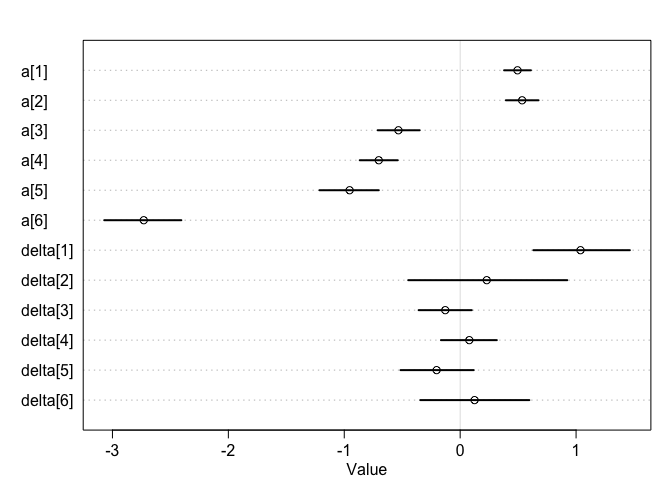
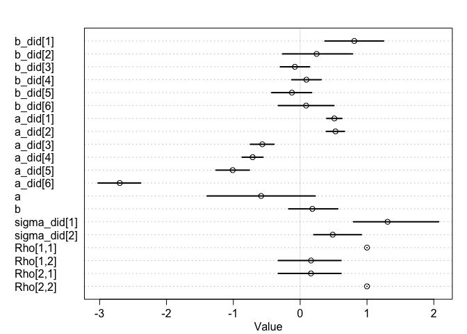
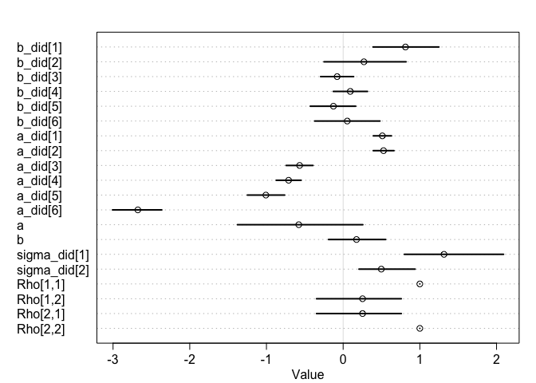
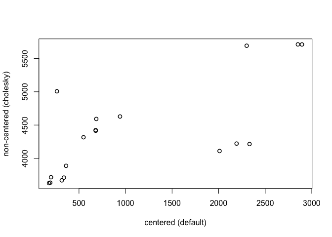

Chap14\_2\_HW
================
Kazu
3/13/2020

# test (my rstan had errors so I checked rstan with simple sample from book)

# multilevel tadpoles

``` r
data(reedfrogs)
d <- reedfrogs
str(d)
```

    ## 'data.frame':    48 obs. of  5 variables:
    ##  $ density : int  10 10 10 10 10 10 10 10 10 10 ...
    ##  $ pred    : Factor w/ 2 levels "no","pred": 1 1 1 1 1 1 1 1 2 2 ...
    ##  $ size    : Factor w/ 2 levels "big","small": 1 1 1 1 2 2 2 2 1 1 ...
    ##  $ surv    : int  9 10 7 10 9 9 10 9 4 9 ...
    ##  $ propsurv: num  0.9 1 0.7 1 0.9 0.9 1 0.9 0.4 0.9 ...

``` r
d
```

    ##    density pred  size surv  propsurv
    ## 1       10   no   big    9 0.9000000
    ## 2       10   no   big   10 1.0000000
    ## 3       10   no   big    7 0.7000000
    ## 4       10   no   big   10 1.0000000
    ## 5       10   no small    9 0.9000000
    ## 6       10   no small    9 0.9000000
    ## 7       10   no small   10 1.0000000
    ## 8       10   no small    9 0.9000000
    ## 9       10 pred   big    4 0.4000000
    ## 10      10 pred   big    9 0.9000000
    ## 11      10 pred   big    7 0.7000000
    ## 12      10 pred   big    6 0.6000000
    ## 13      10 pred small    7 0.7000000
    ## 14      10 pred small    5 0.5000000
    ## 15      10 pred small    9 0.9000000
    ## 16      10 pred small    9 0.9000000
    ## 17      25   no   big   24 0.9600000
    ## 18      25   no   big   23 0.9200000
    ## 19      25   no   big   22 0.8800000
    ## 20      25   no   big   25 1.0000000
    ## 21      25   no small   23 0.9200000
    ## 22      25   no small   23 0.9200000
    ## 23      25   no small   23 0.9200000
    ## 24      25   no small   21 0.8400000
    ## 25      25 pred   big    6 0.2400000
    ## 26      25 pred   big   13 0.5200000
    ## 27      25 pred   big    4 0.1600000
    ## 28      25 pred   big    9 0.3600000
    ## 29      25 pred small   13 0.5200000
    ## 30      25 pred small   20 0.8000000
    ## 31      25 pred small    8 0.3200000
    ## 32      25 pred small   10 0.4000000
    ## 33      35   no   big   34 0.9714286
    ## 34      35   no   big   33 0.9428571
    ## 35      35   no   big   33 0.9428571
    ## 36      35   no   big   31 0.8857143
    ## 37      35   no small   31 0.8857143
    ## 38      35   no small   35 1.0000000
    ## 39      35   no small   33 0.9428571
    ## 40      35   no small   32 0.9142857
    ## 41      35 pred   big    4 0.1142857
    ## 42      35 pred   big   12 0.3428571
    ## 43      35 pred   big   13 0.3714286
    ## 44      35 pred   big   14 0.4000000
    ## 45      35 pred small   22 0.6285714
    ## 46      35 pred small   12 0.3428571
    ## 47      35 pred small   31 0.8857143
    ## 48      35 pred small   17 0.4857143

``` r
# make the tank cluster variable
d$tank <- 1:nrow(d)
dat <- list(
    S = d$surv,
    N = d$density,
    tank = d$tank )
```

  - varying intercepts model (= simplelst kind of varying effects)

  
![
Si \\sim Bionial(N\_i,p\_i) \\\\
logit(p\_i) \\sim \\alpha\_{TANK\[i\]} \\\\
\\alpha\_j \\sim Normal(0,1.5),\\ for\\ j=1..48 \\\\
](https://latex.codecogs.com/png.latex?%0ASi%20%5Csim%20Bionial%28N_i%2Cp_i%29%20%5C%5C%0Alogit%28p_i%29%20%5Csim%20%5Calpha_%7BTANK%5Bi%5D%7D%20%5C%5C%0A%5Calpha_j%20%5Csim%20Normal%280%2C1.5%29%2C%5C%20for%5C%20j%3D1..48%20%5C%5C%0A
"
Si \\sim Bionial(N_i,p_i) \\\\
logit(p_i) \\sim \\alpha_{TANK[i]} \\\\
\\alpha_j \\sim Normal(0,1.5),\\ for\\ j=1..48 \\\\
")  

``` r
m13.1 <- ulam(
    alist(
        S ~ dbinom( N , p ),
        logit(p) <- a[tank],
        a[tank] ~ dnorm( 0 , 1.5 )
), data=dat, chains=4, log_lik=TRUE ,cores=2) # cores=2 added by Kazu
precis( m13.1 , depth=2 )
```

    ##               mean        sd        5.5%       94.5%    n_eff     Rhat4
    ## a[1]   1.703508288 0.7208167  0.64775448  2.92611425 3880.512 0.9990243
    ## a[2]   2.412043910 0.8924906  1.08371356  3.96366339 3303.959 0.9993132
    ## a[3]   0.750373835 0.6033028 -0.16002488  1.71816890 4002.736 0.9986350
    ## a[4]   2.425561703 0.9175471  1.05400504  3.93329333 3306.999 0.9986952
    ## a[5]   1.712039942 0.7680329  0.54506523  3.01362151 3332.305 0.9988495
    ## a[6]   1.699308875 0.7216307  0.61491186  2.97106614 3298.661 0.9991818
    ## a[7]   2.383247180 0.9119113  1.04246985  3.91890297 3877.272 0.9989698
    ## a[8]   1.715965016 0.7664429  0.57719838  3.00109970 4340.506 0.9989646
    ## a[9]  -0.374273842 0.6065727 -1.36786232  0.59915670 4094.604 0.9994161
    ## a[10]  1.723201529 0.7487239  0.57539720  2.97808985 2791.517 1.0004725
    ## a[11]  0.744456775 0.6630306 -0.26677746  1.84031812 4196.968 0.9994980
    ## a[12]  0.366231637 0.6351715 -0.63236001  1.36660766 5151.639 0.9986905
    ## a[13]  0.732814546 0.6446413 -0.27369386  1.75955848 3666.459 0.9985882
    ## a[14] -0.002357945 0.5675244 -0.92425132  0.87589503 3812.075 0.9994149
    ## a[15]  1.704465820 0.7592073  0.54530177  2.94728348 5201.470 0.9989545
    ## a[16]  1.716766254 0.7762388  0.55114107  3.04282709 4182.550 0.9992053
    ## a[17]  2.557874077 0.6911930  1.56656441  3.72293024 3663.251 0.9983514
    ## a[18]  2.120177808 0.6114799  1.19371209  3.16026227 3966.516 0.9988599
    ## a[19]  1.807660094 0.5288749  1.02484107  2.68300115 3422.970 0.9997911
    ## a[20]  3.111058459 0.8178498  1.88298451  4.52997099 3338.587 0.9992072
    ## a[21]  2.153164299 0.6261926  1.21810656  3.20803541 3796.091 0.9995902
    ## a[22]  2.142686133 0.5972976  1.25011409  3.13936374 3048.866 0.9996019
    ## a[23]  2.138302426 0.6190106  1.23539413  3.20341136 3569.273 0.9988590
    ## a[24]  1.540839217 0.5053501  0.77005180  2.37322517 4970.157 0.9992671
    ## a[25] -1.093868004 0.4516225 -1.81560950 -0.42029902 3810.279 0.9991092
    ## a[26]  0.073767335 0.3879142 -0.53856021  0.68082207 4536.353 0.9985363
    ## a[27] -1.525782376 0.4798270 -2.31728515 -0.82040173 4608.067 0.9989431
    ## a[28] -0.565781071 0.4270080 -1.26402133  0.09595574 3923.168 0.9983251
    ## a[29]  0.070678110 0.3956250 -0.56575818  0.70723777 4048.928 0.9985981
    ## a[30]  1.299079218 0.4825577  0.56797309  2.08655455 4258.147 0.9993469
    ## a[31] -0.730533993 0.4164870 -1.38334676 -0.07629698 3905.245 0.9998416
    ## a[32] -0.391225860 0.4053208 -1.05075085  0.25704134 3394.022 0.9988248
    ## a[33]  2.858699240 0.6877798  1.87494213  3.99153989 3077.174 0.9994502
    ## a[34]  2.446384798 0.5620084  1.62393234  3.37575757 4055.048 0.9983486
    ## a[35]  2.455107776 0.5660097  1.60903979  3.41213667 3830.945 0.9994313
    ## a[36]  1.918147990 0.4787926  1.21769730  2.73251883 2790.482 0.9994689
    ## a[37]  1.913847217 0.4776731  1.18642280  2.69216230 4029.782 0.9985993
    ## a[38]  3.354730546 0.7811786  2.22835419  4.67815495 2742.865 0.9996309
    ## a[39]  2.462428621 0.5662534  1.62245733  3.41291039 3596.211 0.9998431
    ## a[40]  2.167210958 0.5357352  1.37752344  3.05754957 4116.373 0.9992320
    ## a[41] -1.910991491 0.4776108 -2.70327707 -1.17702643 4122.436 0.9987517
    ## a[42] -0.635945400 0.3355900 -1.16806800 -0.10089692 4511.980 0.9989584
    ## a[43] -0.518464107 0.3372120 -1.05375364  0.01301285 4630.817 0.9986737
    ## a[44] -0.395466389 0.3359064 -0.93597353  0.12237819 3786.135 0.9987613
    ## a[45]  0.512777081 0.3643355 -0.06378747  1.09224512 5079.418 0.9993695
    ## a[46] -0.634494875 0.3370363 -1.15992299 -0.10766628 4578.694 0.9987031
    ## a[47]  1.915551731 0.4549977  1.22722429  2.69443265 3281.348 0.9991545
    ## a[48] -0.060180311 0.3214826 -0.56545895  0.45419162 3488.063 0.9995445

# the end of test1

# varying slope test (varying slope version of practice 13M3, (eg. m.practice13M3.b) had error, so I cheched varying slope codes from book)

## 14.1.1. Simulate the population.

``` r
a <- 3.5
b <- (-1)
sigma_a <- 1
sigma_b <- 0.5
rho <- (-0.7)
# average morning wait time
# average difference afternoon wait time
# std dev in intercepts
# std dev in slopes
# correlation between intercepts and slopes
```

``` r
Mu <- c( a , b )
```

``` r
cov_ab <- sigma_a*sigma_b*rho
Sigma <- matrix( c(sigma_a^2,cov_ab,cov_ab,sigma_b^2) , ncol=2 )
```

``` r
 matrix( c(1,2,3,4) , nrow=2 , ncol=2 )
```

    ##      [,1] [,2]
    ## [1,]    1    3
    ## [2,]    2    4

``` r
sigmas <- c(sigma_a,sigma_b) # standard deviations
Rho <- matrix( c(1,rho,rho,1) , nrow=2 ) # correlation matrix
# now matrix multiply to get covariance matrix
Sigma <- diag(sigmas) %*% Rho %*% diag(sigmas)
```

``` r
 N_cafes <- 20
```

``` r
library(MASS)
```

    ## 
    ## Attaching package: 'MASS'

    ## The following object is masked from 'package:dplyr':
    ## 
    ##     select

``` r
set.seed(5) # used to replicate example
vary_effects <- mvrnorm( N_cafes , Mu , Sigma )
```

``` r
a_cafe <- vary_effects[,1]
b_cafe <- vary_effects[,2]
```

``` r
plot( a_cafe , b_cafe , col=rangi2 ,
    xlab="intercepts (a_cafe)" , ylab="slopes (b_cafe)" )
# overlay population distribution
library(ellipse)
```

    ## 
    ## Attaching package: 'ellipse'

    ## The following object is masked from 'package:rethinking':
    ## 
    ##     pairs

    ## The following object is masked from 'package:graphics':
    ## 
    ##     pairs

``` r
for ( l in c(0.1,0.3,0.5,0.8,0.99) )
    lines(ellipse(Sigma,centre=Mu,level=l),col=col.alpha("black",0.2))
```

<!-- -->

# 14.1.2. Simulate observations.

``` r
set.seed(22)
N_visits <- 10
afternoon <- rep(0:1,N_visits*N_cafes/2)
cafe_id <- rep( 1:N_cafes , each=N_visits )
mu <- a_cafe[cafe_id] + b_cafe[cafe_id]*afternoon
sigma <- 0.5  # std dev within cafes
wait <- rnorm( N_visits*N_cafes , mu , sigma )
d <- data.frame( cafe=cafe_id , afternoon=afternoon , wait=wait )
```

# 14.1.3. The varying slopes model.

``` r
R <- rlkjcorr( 1e4 , K=2 , eta=2 )
dens( R[,1,2] , xlab="correlation" )
```

<!-- -->

``` r
m14.1 <- ulam(
    alist(
        wait ~ normal( mu , sigma ),
        mu <- a_cafe[cafe] + b_cafe[cafe]*afternoon,
        c(a_cafe,b_cafe)[cafe] ~ multi_normal( c(a,b) , Rho , sigma_cafe ),
        a ~ normal(5,2),
        b ~ normal(-1,0.5),
        sigma_cafe ~ exponential(1),
        sigma ~ exponential(1),
        Rho ~ lkj_corr(2)
    ) , data=d , chains=4 , cores=2,iter=2000,log_lik=TRUE)
```

    ## Warning: The largest R-hat is NA, indicating chains have not mixed.
    ## Running the chains for more iterations may help. See
    ## http://mc-stan.org/misc/warnings.html#r-hat

    ## Warning: Bulk Effective Samples Size (ESS) is too low, indicating posterior means and medians may be unreliable.
    ## Running the chains for more iterations may help. See
    ## http://mc-stan.org/misc/warnings.html#bulk-ess

    ## Warning: Tail Effective Samples Size (ESS) is too low, indicating posterior variances and tail quantiles may be unreliable.
    ## Running the chains for more iterations may help. See
    ## http://mc-stan.org/misc/warnings.html#tail-ess

``` r
# What is lkj_corr?
?rlkjcorr
?rmultinom # for multi_ormal, correct?
precis(m14.1,depth=3)
```

    ##                     mean           sd       5.5%        94.5%    n_eff
    ## b_cafe[1]     -1.1528491 2.594566e-01 -1.5689643 -0.726676216 5311.481
    ## b_cafe[2]     -0.9055777 2.684926e-01 -1.3477132 -0.477822624 5186.250
    ## b_cafe[3]     -1.9381105 2.738587e-01 -2.3727761 -1.498480736 5318.099
    ## b_cafe[4]     -1.2368937 2.643966e-01 -1.6481091 -0.808740187 5848.196
    ## b_cafe[5]     -0.1400265 2.858324e-01 -0.5904145  0.335820601 4644.990
    ## b_cafe[6]     -1.3023128 2.603857e-01 -1.7142367 -0.891614196 5619.572
    ## b_cafe[7]     -1.0228427 2.631967e-01 -1.4403466 -0.591293188 4655.372
    ## b_cafe[8]     -1.6250820 2.600945e-01 -2.0524407 -1.208007604 5210.595
    ## b_cafe[9]     -1.3037484 2.643438e-01 -1.7213383 -0.878759550 4789.355
    ## b_cafe[10]    -0.9524475 2.745354e-01 -1.3934164 -0.516025272 5588.501
    ## b_cafe[11]    -0.4312815 2.796028e-01 -0.8812637  0.009374481 5253.417
    ## b_cafe[12]    -1.1867001 2.640430e-01 -1.6171523 -0.777957606 5404.970
    ## b_cafe[13]    -1.8120531 2.740525e-01 -2.2576544 -1.380823245 5140.964
    ## b_cafe[14]    -0.9404512 2.680443e-01 -1.3696454 -0.521527043 5527.609
    ## b_cafe[15]    -2.1910149 2.872437e-01 -2.6664111 -1.743392561 4620.798
    ## b_cafe[16]    -1.0442255 2.681419e-01 -1.4664822 -0.619460283 5015.437
    ## b_cafe[17]    -1.2195300 2.595661e-01 -1.6392822 -0.797355341 4856.650
    ## b_cafe[18]    -1.0217511 2.854128e-01 -1.4617336 -0.548511208 5248.514
    ## b_cafe[19]    -0.2617084 2.800224e-01 -0.7006356  0.197699802 3877.688
    ## b_cafe[20]    -1.0668223 2.633080e-01 -1.4831090 -0.645958533 5317.117
    ## a_cafe[1]      4.2170991 1.951479e-01  3.9100313  4.528389333 5530.934
    ## a_cafe[2]      2.1598732 2.023715e-01  1.8337605  2.480643343 4499.554
    ## a_cafe[3]      4.3739745 2.002476e-01  4.0507167  4.684667546 5502.994
    ## a_cafe[4]      3.2443856 2.007948e-01  2.9282023  3.568651088 5300.999
    ## a_cafe[5]      1.8766150 2.127240e-01  1.5363659  2.223453778 4645.961
    ## a_cafe[6]      4.2620285 2.006174e-01  3.9437034  4.583606842 5925.506
    ## a_cafe[7]      3.6155890 2.031205e-01  3.2837107  3.940060706 4634.320
    ## a_cafe[8]      3.9479268 1.960748e-01  3.6326402  4.256886352 4963.025
    ## a_cafe[9]      3.9844573 2.006288e-01  3.6640359  4.306853165 3921.227
    ## a_cafe[10]     3.5611095 2.052378e-01  3.2302523  3.894786625 5049.022
    ## a_cafe[11]     1.9355959 2.057440e-01  1.6114683  2.262955603 5098.571
    ## a_cafe[12]     3.8441864 2.006945e-01  3.5245611  4.164164728 5480.961
    ## a_cafe[13]     3.8861255 2.022600e-01  3.5670714  4.210985690 5282.496
    ## a_cafe[14]     3.1760147 2.019739e-01  2.8564048  3.491355809 5056.537
    ## a_cafe[15]     4.4512884 2.096377e-01  4.1152950  4.796033704 5118.758
    ## a_cafe[16]     3.3901411 2.033662e-01  3.0713344  3.713292281 5196.100
    ## a_cafe[17]     4.2143865 1.959483e-01  3.8972662  4.525633835 5139.204
    ## a_cafe[18]     5.7451428 2.066747e-01  5.4116498  6.072375638 5579.548
    ## a_cafe[19]     3.2494420 2.066317e-01  2.9306201  3.582802591 4489.151
    ## a_cafe[20]     3.7373942 1.969077e-01  3.4242504  4.058604281 5334.635
    ## a              3.6512755 2.165104e-01  3.3133642  3.995736551 4664.869
    ## b             -1.1317579 1.431110e-01 -1.3636911 -0.900919846 4020.801
    ## sigma_cafe[1]  0.9609332 1.607341e-01  0.7356584  1.232217974 3663.188
    ## sigma_cafe[2]  0.5909523 1.263922e-01  0.4177011  0.817871202 3611.232
    ## sigma          0.4740424 2.670136e-02  0.4339308  0.518236410 3939.867
    ## Rho[1,1]       1.0000000 0.000000e+00  1.0000000  1.000000000      NaN
    ## Rho[1,2]      -0.5035704 1.779868e-01 -0.7497557 -0.190689099 4116.002
    ## Rho[2,1]      -0.5035704 1.779868e-01 -0.7497557 -0.190689099 4116.002
    ## Rho[2,2]       1.0000000 7.898412e-17  1.0000000  1.000000000 3512.265
    ##                   Rhat4
    ## b_cafe[1]     0.9993523
    ## b_cafe[2]     0.9995211
    ## b_cafe[3]     1.0002009
    ## b_cafe[4]     0.9995452
    ## b_cafe[5]     0.9995517
    ## b_cafe[6]     0.9993782
    ## b_cafe[7]     1.0000161
    ## b_cafe[8]     1.0005508
    ## b_cafe[9]     0.9998809
    ## b_cafe[10]    0.9995082
    ## b_cafe[11]    0.9999762
    ## b_cafe[12]    0.9994160
    ## b_cafe[13]    0.9999128
    ## b_cafe[14]    0.9993147
    ## b_cafe[15]    1.0008124
    ## b_cafe[16]    0.9998594
    ## b_cafe[17]    0.9994817
    ## b_cafe[18]    0.9993323
    ## b_cafe[19]    1.0003333
    ## b_cafe[20]    0.9993206
    ## a_cafe[1]     0.9996961
    ## a_cafe[2]     0.9998999
    ## a_cafe[3]     1.0001218
    ## a_cafe[4]     0.9999444
    ## a_cafe[5]     0.9992030
    ## a_cafe[6]     0.9994401
    ## a_cafe[7]     0.9994942
    ## a_cafe[8]     1.0009442
    ## a_cafe[9]     0.9996461
    ## a_cafe[10]    0.9999180
    ## a_cafe[11]    0.9997575
    ## a_cafe[12]    0.9999845
    ## a_cafe[13]    0.9998129
    ## a_cafe[14]    0.9994796
    ## a_cafe[15]    1.0008258
    ## a_cafe[16]    1.0007247
    ## a_cafe[17]    0.9998508
    ## a_cafe[18]    0.9995430
    ## a_cafe[19]    1.0001542
    ## a_cafe[20]    0.9998679
    ## a             1.0003918
    ## b             0.9999547
    ## sigma_cafe[1] 0.9992414
    ## sigma_cafe[2] 1.0002973
    ## sigma         1.0003127
    ## Rho[1,1]            NaN
    ## Rho[1,2]      1.0001170
    ## Rho[2,1]      1.0001170
    ## Rho[2,2]      0.9989995

# the end of varying slope test

# new problems (March 20, 2020)

# 1\. 1. Review last weeks material.

# 2\. Update last weeks problems if necessary. Can you fit non-centered models? Are you using multivariate normal distributions where appropriate?

# 3\. Rongkui’s Instrumental Variable problem (see earlier email)

# read data

``` r
Nightbreak_R.Han_data<-read_csv(file.path("..","Nightbreak_02_08_20_Rclub.csv"))
```

    ## Parsed with column specification:
    ## cols(
    ##   RIL = col_character(),
    ##   Treatment = col_character(),
    ##   Rep = col_double(),
    ##   Plot = col_double(),
    ##   Date = col_character(),
    ##   loc1 = col_character(),
    ##   loc2 = col_character(),
    ##   loc3 = col_character(),
    ##   loc4 = col_character(),
    ##   loc5 = col_character(),
    ##   Score = col_double()
    ## )

``` r
summary(Nightbreak_R.Han_data)
```

    ##      RIL             Treatment              Rep             Plot      
    ##  Length:188         Length:188         Min.   :1.000   Min.   : 1.00  
    ##  Class :character   Class :character   1st Qu.:1.000   1st Qu.: 8.75  
    ##  Mode  :character   Mode  :character   Median :1.000   Median :16.50  
    ##                                        Mean   :1.495   Mean   :16.53  
    ##                                        3rd Qu.:2.000   3rd Qu.:25.00  
    ##                                        Max.   :2.000   Max.   :32.00  
    ##      Date               loc1               loc2               loc3          
    ##  Length:188         Length:188         Length:188         Length:188        
    ##  Class :character   Class :character   Class :character   Class :character  
    ##  Mode  :character   Mode  :character   Mode  :character   Mode  :character  
    ##                                                                             
    ##                                                                             
    ##                                                                             
    ##      loc4               loc5               Score      
    ##  Length:188         Length:188         Min.   :1.000  
    ##  Class :character   Class :character   1st Qu.:2.000  
    ##  Mode  :character   Mode  :character   Median :2.000  
    ##                                        Mean   :2.202  
    ##                                        3rd Qu.:3.000  
    ##                                        Max.   :4.000

``` r
str(Nightbreak_R.Han_data)
```

    ## Classes 'spec_tbl_df', 'tbl_df', 'tbl' and 'data.frame': 188 obs. of  11 variables:
    ##  $ RIL      : chr  "100" "2" "137" "172" ...
    ##  $ Treatment: chr  "Control" "Control" "Control" "Control" ...
    ##  $ Rep      : num  1 1 1 1 1 1 1 1 1 1 ...
    ##  $ Plot     : num  1 2 3 4 5 6 7 8 9 10 ...
    ##  $ Date     : chr  "2/8/20" "2/8/20" "2/8/20" "2/8/20" ...
    ##  $ loc1     : chr  "P" "A" "P" "P" ...
    ##  $ loc2     : chr  "P" "P" "A" "P" ...
    ##  $ loc3     : chr  "A" "P" "P" "P" ...
    ##  $ loc4     : chr  "P" "A" "P" "A" ...
    ##  $ loc5     : chr  "A" "A" "A" "A" ...
    ##  $ Score    : num  2 2 1 2 2 3 1 2 3 1 ...
    ##  - attr(*, "spec")=
    ##   .. cols(
    ##   ..   RIL = col_character(),
    ##   ..   Treatment = col_character(),
    ##   ..   Rep = col_double(),
    ##   ..   Plot = col_double(),
    ##   ..   Date = col_character(),
    ##   ..   loc1 = col_character(),
    ##   ..   loc2 = col_character(),
    ##   ..   loc3 = col_character(),
    ##   ..   loc4 = col_character(),
    ##   ..   loc5 = col_character(),
    ##   ..   Score = col_double()
    ##   .. )

``` r
table(Nightbreak_R.Han_data$Treatment)
```

    ## 
    ##           Control Control_NoCurtain        NightBreak 
    ##                64                62                62

``` r
Nightbreak_R.Han_data %>% View() 
# John's suggestion is to use subset of data otherwise it took too long. (032020)
```

# create Repdocution column

``` r
Nightbreak_R.Han_data <- Nightbreak_R.Han_data %>% mutate(Reproduction=ifelse(Score<3,0,1)) # 0 = vegetative growth, 1 = reproductive growth
# indexing 
Nightbreak_R.Han_data.index <- Nightbreak_R.Han_data %>% mutate(trt_i=as.integer(as.factor(Treatment))) # 1=Control, 2=Control_NoCurtain, 3=NightBreak
Nightbreak_R.Han_data.index <- Nightbreak_R.Han_data.index %>% 
  mutate(
  loc1_i=ifelse(loc1=="A",0,1),
  loc2_i=ifelse(loc2=="A",0,1),
  loc3_i=ifelse(loc3=="A",0,1),
  loc4_i=ifelse(loc4=="A",0,1),
  loc5_i=ifelse(loc5=="A",0,1)) %>% # 0=A,1=P 
  dplyr::select(Reproduction, contains("_i"))
```

# trt\*loc interaction model

``` r
m.RH.Q4.a <- ulam(alist(
  Reproduction ~ dbinom(1,p),
                  logit(p) <- a[trt_i] + b1*loc1_i + b2*loc2_i + b3*loc3_i + b4*loc4_i + b5*loc5_i + c1[trt_i]*loc1_i + c2[trt_i]*loc2_i +c3[trt_i]*loc3_i + c4[trt_i]*loc4_i + c5[trt_i]*loc5_i,
                  a[trt_i]  ~ dnorm(0,1),
                  b1 ~ dnorm(0, 1),
                  b2 ~ dnorm(0, 1),
                  b3 ~ dnorm(0, 1),
                  b4 ~ dnorm(0, 1),
                  b5 ~ dnorm(0, 1),
                  c1[trt_i] ~ dnorm(0,1),
                  c2[trt_i] ~ dnorm(0,1),
                  c3[trt_i] ~ dnorm(0,1),
                  c4[trt_i] ~ dnorm(0,1),
                  c5[trt_i] ~ dnorm(0,1)),
            data=Nightbreak_R.Han_data.index,
            chains=4,
            cores=2,
            iter=1000,
            log_lik = TRUE)
  
plot(m.RH.Q4.a, depth=2)
```

# 4\. Attached are data from an experiment measuring hypocotyl length in ~ 180 natural arabidopsis accessions grown in high and low red:far-red light. We want to know if there are differences in accessions in their length in high R:FR (“H”) and in their response to low R:FR(“L”). Also we want to obtain an estimate for hypocotyl length for each accession in high and low R:FR for downstream GWAS analysis.

# Relevant variables:

  - length – hypocotyl length
  - line – unique ID for each accession (you could also use nativename)
  - light – indicator for high or low RFR
  - exp – two independent experiments were done
  - plate – this is an incomplete block design with a subset (10? 12?)
    of accessions on each plate. Let’s try a variety of increasingly
    complex models:
  - reading data

<!-- end list -->

``` r
At.hyp.dat <- read_csv("hyp.lengths.both.experiments.labels.csv")
```

    ## Parsed with column specification:
    ## cols(
    ##   line = col_double(),
    ##   length = col_double(),
    ##   plate = col_character(),
    ##   light = col_character(),
    ##   exp = col_character(),
    ##   nativename = col_character(),
    ##   stockparent = col_character(),
    ##   latitude = col_double(),
    ##   longitude = col_double(),
    ##   site = col_character(),
    ##   region = col_character(),
    ##   country = col_character()
    ## )

``` r
str(At.hyp.dat)
```

    ## Classes 'spec_tbl_df', 'tbl_df', 'tbl' and 'data.frame': 18031 obs. of  12 variables:
    ##  $ line       : num  6901 6901 6901 6901 6901 ...
    ##  $ length     : num  2.01 1.48 1.99 2.74 1.94 ...
    ##  $ plate      : chr  "1AH" "1AH" "1AH" "1AH" ...
    ##  $ light      : chr  "H" "H" "H" "H" ...
    ##  $ exp        : chr  "A" "A" "A" "A" ...
    ##  $ nativename : chr  "Bil-7" "Bil-7" "Bil-7" "Bil-7" ...
    ##  $ stockparent: chr  "CS22579" "CS22579" "CS22579" "CS22579" ...
    ##  $ latitude   : num  63.3 63.3 63.3 63.3 63.3 ...
    ##  $ longitude  : num  18.5 18.5 18.5 18.5 18.5 ...
    ##  $ site       : chr  "Bil" "Bil" "Bil" "Bil" ...
    ##  $ region     : chr  "NSweden" "NSweden" "NSweden" "NSweden" ...
    ##  $ country    : chr  "SWE" "SWE" "SWE" "SWE" ...
    ##  - attr(*, "spec")=
    ##   .. cols(
    ##   ..   line = col_double(),
    ##   ..   length = col_double(),
    ##   ..   plate = col_character(),
    ##   ..   light = col_character(),
    ##   ..   exp = col_character(),
    ##   ..   nativename = col_character(),
    ##   ..   stockparent = col_character(),
    ##   ..   latitude = col_double(),
    ##   ..   longitude = col_double(),
    ##   ..   site = col_character(),
    ##   ..   region = col_character(),
    ##   ..   country = col_character()
    ##   .. )

``` r
# format dat for exp
At.hyp.dat2 <- At.hyp.dat %>% mutate(expid=ifelse(exp=="A",0,1))
# format dat for plate
At.hyp.dat2 %>% group_by(plate,exp,light,line) %>% summarize(n())
```

    ## # A tibble: 1,303 x 5
    ## # Groups:   plate, exp, light [152]
    ##    plate exp   light  line `n()`
    ##    <chr> <chr> <chr> <dbl> <int>
    ##  1 10AH  A     H      6088    13
    ##  2 10AH  A     H      6899     8
    ##  3 10AH  A     H      6956    21
    ##  4 10AH  A     H      6962    14
    ##  5 10AH  A     H      6963    27
    ##  6 10AH  A     H      6976    13
    ##  7 10AH  A     H      8245    19
    ##  8 10AH  A     H      8312    18
    ##  9 10AH  A     H      8426    21
    ## 10 10AL  A     L      6088    17
    ## # … with 1,293 more rows

``` r
At.hyp.dat2 <- At.hyp.dat2 %>% mutate(plateid = as.integer(as.factor(plate)))
# format for light
At.hyp.dat2 <- At.hyp.dat2 %>% mutate(lightid=ifelse(light=="H",0,1))
```

\*1. No
pooling

``` r
At.hyp.dat2.s <- At.hyp.dat2 %>% dplyr::select(length,line,lightid,expid,plateid)
str(At.hyp.dat2.s)
```

    ## Classes 'spec_tbl_df', 'tbl_df', 'tbl' and 'data.frame': 18031 obs. of  5 variables:
    ##  $ length : num  2.01 1.48 1.99 2.74 1.94 ...
    ##  $ line   : num  6901 6901 6901 6901 6901 ...
    ##  $ lightid: num  0 0 0 0 0 0 0 0 0 0 ...
    ##  $ expid  : num  0 0 0 0 0 0 0 0 0 0 ...
    ##  $ plateid: int  41 41 41 41 41 41 41 41 41 41 ...

``` r
mAt.hyp.nopooling <- ulam(
    alist(
        length ~ normal( mu , sigma ),
        mu <- a[line] + b[line]*lightid  + c[line]*expid + d[line]*plateid,
        a[line] ~ normal(0,1),
        b[line] ~ normal(0,1),
        c[line] ~ normal(0,1),
        d[line] ~ normal(0,1),
        sigma ~ exponential(1),
    ) , data=At.hyp.dat2.s , chains=4 , cores=2,iter=2000,log_lik=TRUE)
```

    ## Error in f[[2]]: object of type 'symbol' is not subsettable

``` r
plot(mAt.hyp.nopooling, depth=2)
```

    ## Error in plot(mAt.hyp.nopooling, depth = 2): object 'mAt.hyp.nopooling' not found

2.  Partial pooling of intercepts and slopes for line and intercepts for
    plate and experiment, but treat each variable separately (no
    multivariate component). you might also consider adding an
    experiment slope effect

<!-- end list -->

``` r
### under construction ####
mAt.hyp.nopooling <- ulam(
    alist(
        length ~ normal( mu , sigma ),
        mu <- a_line[line] + b_line[line]*light + c_line[line]*exp,
        c(a_cafe,b_cafe)[cafe] ~ multi_normal( c(a,b) , Rho , sigma_cafe ),
        a ~ normal(5,2),
        b ~ normal(-1,0.5),
        sigma_cafe ~ exponential(1),
        sigma ~ exponential(1),
        Rho ~ lkj_corr(2)
    ) , data=At.hyp.dat2 , chains=4 , cores=2,iter=2000,log_lik=TRUE)
```

3.  As 2, but use a multivariate normal model for the line slope and
    intercept effects

<!-- end list -->

``` r
### under construction ####
mAt.hyp.nopooling <- ulam(
    alist(
        length ~ normal( mu , sigma ),
        mu <- a_line[line] + b_line[line]*light + c_line[line]*exp,
        c(a_line,b_line,c_line)[line] ~ multi_normal( c(a,b,c) , Rho , sigma_line ),
        a ~ normal(0,1),
        b ~ normal(0,1),
        c ~ normal(0,1),
        sigma_line ~ exponential(1),
        sigma ~ exponential(1),
        Rho ~ lkj_corr(2)
    ) , data=At.hyp.dat2 , chains=4 , cores=2,iter=2000,log_lik=TRUE)
```

4.  As 3, but non-centered

Evaluate and compare the models. Is there evidence of line, treatment,
and line X treatment effects? How does the magnitude of the experiment
and plate effects compare to the line
effects?

# problems

## 13M3. Re-estimate the varying slopes model for the UCBadmit data, now using a non-centered parameterization. Compare the efficiency of the forms of the model, using n\_eff. Which is better? Which chain sampled faster?

  - modified original m11.8 quad version into ulam

<!-- end list -->

``` r
data(UCBadmit)
d <- UCBadmit
dat <- list( A=d$admit , N=d$applications , gid=ifelse( d$applicant.gender=="male" , 1 , 2 ),did=rep(1:6,each=2))
dat
```

    ## $A
    ##  [1] 512  89 353  17 120 202 138 131  53  94  22  24
    ## 
    ## $N
    ##  [1] 825 108 560  25 325 593 417 375 191 393 373 341
    ## 
    ## $gid
    ##  [1] 1 2 1 2 1 2 1 2 1 2 1 2
    ## 
    ## $did
    ##  [1] 1 1 2 2 3 3 4 4 5 5 6 6

``` r
m11.8.ulam <- ulam(
    alist(
        A ~ dbinom(N, p),
        logit(p) <- a[gid] + delta[did] ,
        a[gid] ~ dnorm( 0 , 1.5 ) ,
        delta[did] ~ dnorm( 0 , 1.5 )
    ) , data=dat,chains=4,cores=2,iter=4000,log_lik=TRUE)
precis( m11.8.ulam , depth=2 )
```

    ##                mean        sd       5.5%      94.5%    n_eff    Rhat4
    ## a[1]     -0.5262248 0.5452144 -1.4062854  0.3415259 526.6117 1.012903
    ## a[2]     -0.4299386 0.5443606 -1.3107084  0.4370145 524.7821 1.013218
    ## delta[1]  1.1088671 0.5476997  0.2295186  1.9964180 535.4185 1.012747
    ## delta[2]  1.0611812 0.5510185  0.1780044  1.9592045 535.0960 1.012777
    ## delta[3] -0.1521725 0.5464802 -1.0264196  0.7351198 528.5720 1.013156
    ## delta[4] -0.1857019 0.5473737 -1.0579425  0.6945677 528.2234 1.013443
    ## delta[5] -0.6274424 0.5496817 -1.5108830  0.2693406 531.6530 1.012678
    ## delta[6] -2.1848236 0.5599223 -3.0910326 -1.2877431 556.6020 1.011782

``` r
plot(m11.8.ulam , depth=2)
```

<!-- -->

  - multitire? partial pooling model?
  - note: This model is called an interaction non-pooling
model.

<!-- end list -->

``` r
# for non-indexed factor (in this cae gender; gid), use zero and 1. For indexed factor, zero is not addlowed (such as did in this case)
dat2 <- list( A=d$admit , N=d$applications , g=ifelse( d$applicant.gender=="male" , 0 , 1 ),did=rep(1:6,each=2))
# wrong by using data=dat
m.practice13M3.a <- ulam(
    alist(
        A ~ dbinom(N , p ) ,
        ## partial pooling model?
        logit(p) <- a[did] + delta[did]*gid,
          a[did] ~ dnorm( 0 , 1.5 ) ,
          delta[did] ~ dnorm(0,1.5) 
        ) , data=dat , chains=4 , cores=2 , iter=4000,log_lik=TRUE )
precis(m.practice13M3.a, depth=2)
```

    ##                 mean        sd       5.5%       94.5%    n_eff     Rhat4
    ## a[1]     -0.52700878 0.2764616 -0.9781664 -0.08802630 8257.448 0.9998392
    ## a[2]      0.28745967 0.4261727 -0.4233378  0.95638786 8647.392 0.9999589
    ## a[3]     -0.40354885 0.2440833 -0.7981437 -0.02147179 6981.161 0.9999536
    ## a[4]     -0.76749117 0.2315105 -1.1363017 -0.39917383 8199.402 1.0002415
    ## a[5]     -0.73066158 0.3324031 -1.2621439 -0.20580076 7666.869 1.0000738
    ## a[6]     -2.69651559 0.4412311 -3.4169811 -1.99765379 7957.199 0.9999250
    ## delta[1]  1.02407004 0.2506693  0.6313589  1.43011159 8109.125 0.9998922
    ## delta[2]  0.24655203 0.4039962 -0.3842757  0.92002530 8499.839 1.0001546
    ## delta[3] -0.12935520 0.1426979 -0.3564129  0.09840573 6863.010 0.9999249
    ## delta[4]  0.06994649 0.1486767 -0.1712544  0.30626484 8329.959 1.0004295
    ## delta[5] -0.21671370 0.1927833 -0.5238982  0.09263528 7917.989 1.0000205
    ## delta[6]  0.01911844 0.2827066 -0.4358511  0.47575199 7979.741 1.0000237

``` r
plot(m.practice13M3.a,depth=2)
```

<!-- --> \#
correct using data=dat2

``` r
m.practice13M3.a2 <- ulam(
    alist(
        A ~ dbinom(N , p ) ,
        ## partial pooling model?
        logit(p) <- a[did] + delta[did]*g,
          a[did] ~ dnorm( 0 , 1.5 ) ,
          delta[did] ~ dnorm(0,1.5) 
        ) , data=dat2 , chains=4 , cores=2 , iter=4000,log_lik=TRUE )
precis(m.practice13M3.a2, depth=2)
```

    ##                 mean         sd       5.5%       94.5%     n_eff     Rhat4
    ## a[1]      0.49463876 0.07223014  0.3789913  0.61026163 10596.728 0.9997131
    ## a[2]      0.53467024 0.08784840  0.3945423  0.67611082 10643.041 0.9997693
    ## a[3]     -0.53272671 0.11352906 -0.7115293 -0.34956070  6803.712 0.9995925
    ## a[4]     -0.70211069 0.10199954 -0.8663114 -0.53892891  8021.062 0.9998719
    ## a[5]     -0.95385520 0.16140736 -1.2136933 -0.70221545  6464.825 1.0005631
    ## a[6]     -2.72980926 0.20922395 -3.0709007 -2.40573012  8268.182 1.0006439
    ## delta[1]  1.03806130 0.25973777  0.6317311  1.46403019 10540.219 0.9999252
    ## delta[2]  0.22945333 0.43599142 -0.4480477  0.92392692 10279.906 0.9996506
    ## delta[3] -0.12860470 0.14155415 -0.3581811  0.09986836  6605.320 0.9997420
    ## delta[4]  0.07884497 0.14922688 -0.1656936  0.31613964  7911.545 0.9998019
    ## delta[5] -0.20315386 0.19955137 -0.5144558  0.11700941  7030.301 1.0004730
    ## delta[6]  0.12424438 0.29504450 -0.3437182  0.59667926  7924.435 1.0003452

``` r
plot(m.practice13M3.a2,depth=2)
```

<!-- -->

  - the varying slopes model. a\_did and b\_did are related (correct
    wording?)
  - I modified m14.1 in the book, but does not work. Why? Even Rho ~
    lkj\_corr(4) instead of Rho ~ lkj\_corr(2)
  - Because p in dbinom() has to be logit.

<!-- end list -->

``` r
m.practice13M3.b <- ulam(
    alist(
        A ~ dbinom(N,p),
        p <- a_did[did] + b_did[did]*gid,
        c(a_did,b_did)[did] ~ multi_normal( c(a,b) , Rho , sigma_did ),
        a ~ normal(0,1.5),
        b ~ normal(0,1.5),
        sigma_did ~ exponential(1),
        Rho ~ lkj_corr(4)
    ) , data=dat , chains=4 , cores=2 , iter=4000,log_lik=TRUE)
```

    ## Warning in .local(object, ...): some chains had errors; consider specifying
    ## chains = 1 to debug

    ## here are whatever error messages were returned

    ## [[1]]
    ## Stan model '7f6fdee5a6afd06e8cc022bb283dbb63' does not contain samples.
    ## 
    ## [[2]]
    ## Stan model '7f6fdee5a6afd06e8cc022bb283dbb63' does not contain samples.
    ## 
    ## [[3]]
    ## Stan model '7f6fdee5a6afd06e8cc022bb283dbb63' does not contain samples.
    ## 
    ## [[4]]
    ## Stan model '7f6fdee5a6afd06e8cc022bb283dbb63' does not contain samples.
    ## 
    ## Stan model '7f6fdee5a6afd06e8cc022bb283dbb63' does not contain samples.

    ## Error in validObject(.Object): invalid class "ulam" object: invalid object for slot "coef" in class "ulam": got class "NULL", should be or extend class "numeric"

``` r
# error... why?
```

# non index gender (g in dat2)

``` r
m.practice13M3.b2 <- ulam(
    alist(
        A ~ dbinom(N,p),
        p <- a_did[did] + b_did[did]*g,
        c(a_did,b_did)[did] ~ multi_normal( c(a,b) , Rho , sigma_did ),
        a ~ normal(0,1.5),
        b ~ normal(0,1.5),
        sigma_did ~ exponential(1),
        Rho ~ lkj_corr(4)
    ) , data=dat2 , chains=4 , cores=2 , iter=4000,log_lik=TRUE)
```

    ## Warning in .local(object, ...): some chains had errors; consider specifying
    ## chains = 1 to debug

    ## here are whatever error messages were returned

    ## [[1]]
    ## Stan model 'b27b0d8e6ef0d0b243655b5d4c8684ea' does not contain samples.
    ## 
    ## [[2]]
    ## Stan model 'b27b0d8e6ef0d0b243655b5d4c8684ea' does not contain samples.
    ## 
    ## [[3]]
    ## Stan model 'b27b0d8e6ef0d0b243655b5d4c8684ea' does not contain samples.
    ## 
    ## [[4]]
    ## Stan model 'b27b0d8e6ef0d0b243655b5d4c8684ea' does not contain samples.
    ## 
    ## Stan model 'b27b0d8e6ef0d0b243655b5d4c8684ea' does not contain samples.

    ## Error in validObject(.Object): invalid class "ulam" object: invalid object for slot "coef" in class "ulam": got class "NULL", should be or extend class "numeric"

``` r
# error... why? becasue p has to be logit
precis(m.practice13M3.b, depth=2)
```

    ## Error in precis(m.practice13M3.b, depth = 2): object 'm.practice13M3.b' not found

``` r
plot(m.practice13M3.b,depth=2)
```

    ## Error in plot(m.practice13M3.b, depth = 2): object 'm.practice13M3.b' not found

# logit(p): no error\!

``` r
m.practice13M3.b3 <- ulam(
    alist(
        A ~ dbinom(N,p),
        logit(p) <- a_did[did] + b_did[did]*g,
        c(a_did,b_did)[did] ~ multi_normal( c(a,b) , Rho , sigma_did ),
        a ~ normal(0,1.5),
        b ~ normal(0,1.5),
        sigma_did ~ exponential(1),
        Rho ~ lkj_corr(4)
    ) , data=dat2 , chains=4 , cores=2 , iter=4000,log_lik=TRUE)
```

    ## Warning: There were 36 divergent transitions after warmup. Increasing adapt_delta above 0.95 may help. See
    ## http://mc-stan.org/misc/warnings.html#divergent-transitions-after-warmup

    ## Warning: Examine the pairs() plot to diagnose sampling problems

    ## Warning: The largest R-hat is NA, indicating chains have not mixed.
    ## Running the chains for more iterations may help. See
    ## http://mc-stan.org/misc/warnings.html#r-hat

    ## Warning: Bulk Effective Samples Size (ESS) is too low, indicating posterior means and medians may be unreliable.
    ## Running the chains for more iterations may help. See
    ## http://mc-stan.org/misc/warnings.html#bulk-ess

    ## Warning: Tail Effective Samples Size (ESS) is too low, indicating posterior variances and tail quantiles may be unreliable.
    ## Running the chains for more iterations may help. See
    ## http://mc-stan.org/misc/warnings.html#tail-ess

``` r
precis(m.practice13M3.b3, depth=3)
```

    ##                     mean           sd       5.5%      94.5%    n_eff     Rhat4
    ## b_did[1]      0.80973410 2.714927e-01  0.3702470  1.2484684 2728.871 1.0009061
    ## b_did[2]      0.24609222 3.295791e-01 -0.2635087  0.7849884 8322.096 0.9998836
    ## b_did[3]     -0.07974449 1.374739e-01 -0.2978069  0.1406515 5907.870 0.9998617
    ## b_did[4]      0.09309900 1.389416e-01 -0.1265654  0.3141740 7100.947 1.0002723
    ## b_did[5]     -0.12378268 1.882319e-01 -0.4268371  0.1719086 5709.624 1.0001200
    ## b_did[6]      0.08911368 2.613380e-01 -0.3265177  0.5061999 6294.692 0.9999508
    ## a_did[1]      0.51166273 7.122904e-02  0.3974528  0.6242902 7605.692 0.9999968
    ## a_did[2]      0.52867124 8.607110e-02  0.3907300  0.6644111 9292.529 1.0000190
    ## a_did[3]     -0.56619610 1.104451e-01 -0.7455398 -0.3909191 6575.350 0.9997259
    ## a_did[4]     -0.71127472 9.874717e-02 -0.8682452 -0.5550108 6688.772 1.0002981
    ## a_did[5]     -1.00939406 1.561354e-01 -1.2598444 -0.7601737 6470.407 0.9996488
    ## a_did[6]     -2.69911219 1.998799e-01 -3.0247598 -2.3863961 6817.231 1.0001201
    ## a            -0.58430749 5.116577e-01 -1.3938342  0.2254712 7371.411 0.9997203
    ## b             0.18281290 2.481807e-01 -0.1727330  0.5629441 3170.130 1.0013238
    ## sigma_did[1]  1.30790443 4.236426e-01  0.7972052  2.0728711 5693.391 0.9999259
    ## sigma_did[2]  0.48745357 2.436322e-01  0.2026790  0.9166642 2357.884 1.0014548
    ## Rho[1,1]      1.00000000 0.000000e+00  1.0000000  1.0000000      NaN       NaN
    ## Rho[1,2]      0.16189169 2.903733e-01 -0.3269330  0.6120819 7871.896 1.0001267
    ## Rho[2,1]      0.16189169 2.903733e-01 -0.3269330  0.6120819 7871.896 1.0001267
    ## Rho[2,2]      1.00000000 8.942852e-17  1.0000000  1.0000000 7394.579 0.9994999

``` r
plot(m.practice13M3.b3,depth=3)
```

<!-- -->

# normal? dnorm?

``` r
m.practice13M3.c <- ulam(
    alist(
        A ~ dbinom(N,p),
        logit(p) <- a_did[did] + b_did[did]*g,
        c(a_did,b_did)[did] ~ multi_normal( c(a,b) , Rho , sigma_did ),
        a ~ dnorm(0,1.5),
        b ~ dnorm(0,1.5),
        sigma_did ~ exponential(1),
        Rho ~ lkj_corr(2)
    ) , data=dat2 , chains=4 , cores=2 , iter=4000,log_lik=TRUE)
```

    ## Warning: There were 9 divergent transitions after warmup. Increasing adapt_delta above 0.95 may help. See
    ## http://mc-stan.org/misc/warnings.html#divergent-transitions-after-warmup

    ## Warning: Examine the pairs() plot to diagnose sampling problems

    ## Warning: The largest R-hat is NA, indicating chains have not mixed.
    ## Running the chains for more iterations may help. See
    ## http://mc-stan.org/misc/warnings.html#r-hat

    ## Warning: Bulk Effective Samples Size (ESS) is too low, indicating posterior means and medians may be unreliable.
    ## Running the chains for more iterations may help. See
    ## http://mc-stan.org/misc/warnings.html#bulk-ess

    ## Warning: Tail Effective Samples Size (ESS) is too low, indicating posterior variances and tail quantiles may be unreliable.
    ## Running the chains for more iterations may help. See
    ## http://mc-stan.org/misc/warnings.html#tail-ess

``` r
precis(m.practice13M3.c, depth=3)
```

    ##                     mean           sd       5.5%      94.5%    n_eff     Rhat4
    ## b_did[1]      0.81266404 2.710403e-01  0.3892886  1.2480686 3952.430 1.0015612
    ## b_did[2]      0.27105124 3.337424e-01 -0.2495432  0.8198540 7076.242 1.0001714
    ## b_did[3]     -0.07842165 1.344089e-01 -0.2935614  0.1363987 4980.545 0.9999763
    ## b_did[4]      0.09278469 1.387274e-01 -0.1279521  0.3176504 6781.974 0.9999511
    ## b_did[5]     -0.12657203 1.870634e-01 -0.4284744  0.1634493 5473.076 0.9999925
    ## b_did[6]      0.05355878 2.666889e-01 -0.3715640  0.4796989 5937.801 1.0000785
    ## a_did[1]      0.51098931 7.405405e-02  0.3931237  0.6301056 9050.338 1.0000301
    ## a_did[2]      0.52673888 8.523439e-02  0.3921084  0.6627466 8727.173 0.9997758
    ## a_did[3]     -0.56756469 1.100076e-01 -0.7431903 -0.3933741 4997.425 1.0001954
    ## a_did[4]     -0.71085376 1.013977e-01 -0.8729285 -0.5484297 6912.916 1.0001431
    ## a_did[5]     -1.00745173 1.544471e-01 -1.2486420 -0.7621264 5958.269 0.9998322
    ## a_did[6]     -2.67652125 1.996009e-01 -3.0071005 -2.3645997 6488.504 1.0000890
    ## a            -0.57857370 5.205591e-01 -1.3786457  0.2565868 6043.837 0.9999758
    ## b             0.17412783 2.450097e-01 -0.1901462  0.5540219 4416.877 1.0008304
    ## sigma_did[1]  1.31505773 4.360256e-01  0.7981572  2.0908753 5660.244 1.0002202
    ## sigma_did[2]  0.49737877 2.509180e-01  0.2064653  0.9380547 3545.897 1.0004960
    ## Rho[1,1]      1.00000000 0.000000e+00  1.0000000  1.0000000      NaN       NaN
    ## Rho[1,2]      0.25318005 3.458951e-01 -0.3468064  0.7579095 5812.038 1.0003210
    ## Rho[2,1]      0.25318005 3.458951e-01 -0.3468064  0.7579095 5812.038 1.0003210
    ## Rho[2,2]      1.00000000 8.405471e-17  1.0000000  1.0000000 7655.304 0.9994999

``` r
plot(m.practice13M3.c,depth=3)
```

<!-- -->

  - centered
  - This way (modified from m14.2) looks work with error “Warning: There
    were 272 divergent transitions after warmup.”.

<!-- end list -->

``` r
mpractice13M3.centered <- ulam(
    alist(
      A ~ dbinom(N, p),
      logit(p) <- a[did] + beta[gid, did],
      # adaptive prior
      vector[6]:beta[gid] ~ multi_normal(0, Rho_gid, sigma_gid),
      # fixed priors
      a[did] ~ dnorm(0, 1),
      sigma_gid ~ dexp(1),
      Rho_gid ~ dlkjcorr(4)
    ),
    data = dat,
    chains = 4,
    cores = 4,
    iter = 5000,
    log_lik = T
  )
```

    ## Warning: There were 650 divergent transitions after warmup. Increasing adapt_delta above 0.95 may help. See
    ## http://mc-stan.org/misc/warnings.html#divergent-transitions-after-warmup

    ## Warning: There were 2396 transitions after warmup that exceeded the maximum treedepth. Increase max_treedepth above 10. See
    ## http://mc-stan.org/misc/warnings.html#maximum-treedepth-exceeded

    ## Warning: Examine the pairs() plot to diagnose sampling problems

    ## Warning: The largest R-hat is NA, indicating chains have not mixed.
    ## Running the chains for more iterations may help. See
    ## http://mc-stan.org/misc/warnings.html#r-hat

    ## Warning: Bulk Effective Samples Size (ESS) is too low, indicating posterior means and medians may be unreliable.
    ## Running the chains for more iterations may help. See
    ## http://mc-stan.org/misc/warnings.html#bulk-ess

    ## Warning: Tail Effective Samples Size (ESS) is too low, indicating posterior variances and tail quantiles may be unreliable.
    ## Running the chains for more iterations may help. See
    ## http://mc-stan.org/misc/warnings.html#tail-ess

``` r
precis(mpractice13M3.centered,depth=3)
```

    ##                       mean           sd        5.5%       94.5%     n_eff
    ## beta[1,1]    -0.1537910837 5.937456e-01 -1.01490072  0.86494379 2894.7472
    ## beta[1,2]     0.0504376794 3.875934e-01 -0.51047723  0.67825295  685.8478
    ## beta[1,3]    -0.0007366611 2.866282e-01 -0.45443882  0.40149402 2331.6305
    ## beta[1,4]    -0.0848683494 3.136195e-01 -0.64969740  0.30634452  548.6758
    ## beta[1,5]    -0.0854121979 4.111110e-01 -0.91543265  0.39609537  361.5368
    ## beta[1,6]    -0.7885300734 9.944561e-01 -2.85587785  0.11527310  191.6628
    ## beta[2,1]     0.8090476970 6.353883e-01 -0.05749060  1.91000975 2300.8755
    ## beta[2,2]     0.1698392028 4.556634e-01 -0.38982705  1.05415775  263.2306
    ## beta[2,3]    -0.0883558523 2.948519e-01 -0.58262606  0.27599442 2009.7137
    ## beta[2,4]    -0.0328007110 3.082194e-01 -0.54092732  0.36989506  679.3492
    ## beta[2,5]    -0.2168263003 4.363433e-01 -1.13356275  0.23636016  315.1635
    ## beta[2,6]    -0.6560700906 9.464596e-01 -2.66028415  0.21186306  199.7720
    ## a[1]          0.6528455049 5.944277e-01 -0.36728749  1.50817470 2851.0444
    ## a[2]          0.4879318345 3.888191e-01 -0.13963380  1.05212897  940.7734
    ## a[3]         -0.5574568385 2.922638e-01 -0.94136040 -0.07847095 2192.5511
    ## a[4]         -0.6047426077 3.117012e-01 -0.99534735 -0.10257187  679.7116
    ## a[5]         -0.9126267431 4.270739e-01 -1.37161416  0.01664119  338.0405
    ## a[6]         -1.9248347314 9.623590e-01 -2.85208640  0.05460004  178.2199
    ## sigma_gid[1]  1.0563375429 6.704253e-01  0.34369010  2.26706643 1158.9906
    ## sigma_gid[2]  0.4997226221 5.243082e-01  0.03421003  1.44395001 2503.0367
    ## sigma_gid[3]  0.3551386954 4.373255e-01  0.01637971  1.17130018 2263.6422
    ## sigma_gid[4]  0.3562890492 4.340023e-01  0.01773206  1.13444120 1254.2069
    ## sigma_gid[5]  0.4719094095 5.161905e-01  0.02249113  1.45578036  433.5270
    ## sigma_gid[6]  0.9205067106 9.398288e-01  0.02972516  2.82763219  312.0036
    ## Rho_gid[1,1]  1.0000000000 0.000000e+00  1.00000000  1.00000000       NaN
    ## Rho_gid[1,2]  0.0324767751 2.776346e-01 -0.41532673  0.45326347  997.5493
    ## Rho_gid[1,3] -0.0153383142 2.805125e-01 -0.45019326  0.44006603  487.5020
    ## Rho_gid[1,4]  0.0223188454 2.686252e-01 -0.42223259  0.43357734 2137.8713
    ## Rho_gid[1,5] -0.0400711704 2.754369e-01 -0.47812688  0.40121033 1975.2842
    ## Rho_gid[1,6] -0.0260385519 2.727170e-01 -0.44427173  0.41825960  782.9323
    ## Rho_gid[2,1]  0.0324767751 2.776346e-01 -0.41532673  0.45326347  997.5493
    ## Rho_gid[2,2]  1.0000000000 9.093446e-17  1.00000000  1.00000000 6405.9600
    ## Rho_gid[2,3]  0.0092053912 2.973339e-01 -0.45965269  0.50407372  304.8008
    ## Rho_gid[2,4]  0.0047874977 2.854090e-01 -0.47876498  0.45552255  387.9537
    ## Rho_gid[2,5] -0.0090081928 2.779743e-01 -0.45017814  0.43631413 1495.0010
    ## Rho_gid[2,6] -0.0189409349 2.795178e-01 -0.45438635  0.44013138 2760.2307
    ## Rho_gid[3,1] -0.0153383142 2.805125e-01 -0.45019326  0.44006603  487.5020
    ## Rho_gid[3,2]  0.0092053912 2.973339e-01 -0.45965269  0.50407372  304.8008
    ## Rho_gid[3,3]  1.0000000000 9.959762e-17  1.00000000  1.00000000 6899.1818
    ## Rho_gid[3,4] -0.0033862579 2.817449e-01 -0.44646013  0.44253732 1241.3880
    ## Rho_gid[3,5]  0.0231651411 2.856398e-01 -0.42935185  0.50361978  535.5581
    ## Rho_gid[3,6]  0.0050378414 2.735114e-01 -0.43074748  0.44691399 4401.4290
    ## Rho_gid[4,1]  0.0223188454 2.686252e-01 -0.42223259  0.43357734 2137.8713
    ## Rho_gid[4,2]  0.0047874977 2.854090e-01 -0.47876498  0.45552255  387.9537
    ## Rho_gid[4,3] -0.0033862579 2.817449e-01 -0.44646013  0.44253732 1241.3880
    ## Rho_gid[4,4]  1.0000000000 1.118354e-16  1.00000000  1.00000000 4960.1213
    ## Rho_gid[4,5]  0.0043882228 2.783466e-01 -0.44169357  0.44841195  809.1456
    ## Rho_gid[4,6] -0.0058676452 2.824984e-01 -0.44296131  0.45070436  665.5399
    ## Rho_gid[5,1] -0.0400711704 2.754369e-01 -0.47812688  0.40121033 1975.2842
    ## Rho_gid[5,2] -0.0090081928 2.779743e-01 -0.45017814  0.43631413 1495.0010
    ## Rho_gid[5,3]  0.0231651411 2.856398e-01 -0.42935185  0.50361978  535.5581
    ## Rho_gid[5,4]  0.0043882228 2.783466e-01 -0.44169357  0.44841195  809.1456
    ## Rho_gid[5,5]  1.0000000000 1.102870e-16  1.00000000  1.00000000 5180.6008
    ## Rho_gid[5,6]  0.0089144952 2.709446e-01 -0.43121493  0.44678953 4833.6112
    ## Rho_gid[6,1] -0.0260385519 2.727170e-01 -0.44427173  0.41825960  782.9323
    ## Rho_gid[6,2] -0.0189409349 2.795178e-01 -0.45438635  0.44013138 2760.2307
    ## Rho_gid[6,3]  0.0050378414 2.735114e-01 -0.43074748  0.44691399 4401.4290
    ## Rho_gid[6,4] -0.0058676452 2.824984e-01 -0.44296131  0.45070436  665.5399
    ## Rho_gid[6,5]  0.0089144952 2.709446e-01 -0.43121493  0.44678953 4833.6112
    ## Rho_gid[6,6]  1.0000000000 1.177262e-16  1.00000000  1.00000000 3674.8366
    ##                  Rhat4
    ## beta[1,1]    1.0006577
    ## beta[1,2]    1.0153156
    ## beta[1,3]    1.0022161
    ## beta[1,4]    1.0055374
    ## beta[1,5]    1.0157497
    ## beta[1,6]    1.0088982
    ## beta[2,1]    1.0006315
    ## beta[2,2]    1.0358918
    ## beta[2,3]    1.0023094
    ## beta[2,4]    1.0048615
    ## beta[2,5]    1.0127035
    ## beta[2,6]    1.0099154
    ## a[1]         1.0004263
    ## a[2]         1.0130993
    ## a[3]         1.0021427
    ## a[4]         1.0037753
    ## a[5]         1.0135033
    ## a[6]         1.0107486
    ## sigma_gid[1] 1.0005377
    ## sigma_gid[2] 1.0027517
    ## sigma_gid[3] 1.0060805
    ## sigma_gid[4] 1.0018956
    ## sigma_gid[5] 1.0072124
    ## sigma_gid[6] 1.0028398
    ## Rho_gid[1,1]       NaN
    ## Rho_gid[1,2] 1.0076286
    ## Rho_gid[1,3] 1.0015249
    ## Rho_gid[1,4] 1.0063042
    ## Rho_gid[1,5] 1.0014741
    ## Rho_gid[1,6] 1.0068119
    ## Rho_gid[2,1] 1.0076286
    ## Rho_gid[2,2] 0.9995999
    ## Rho_gid[2,3] 1.0074230
    ## Rho_gid[2,4] 1.0006164
    ## Rho_gid[2,5] 1.0003790
    ## Rho_gid[2,6] 1.0039546
    ## Rho_gid[3,1] 1.0015249
    ## Rho_gid[3,2] 1.0074230
    ## Rho_gid[3,3] 0.9995999
    ## Rho_gid[3,4] 1.0013967
    ## Rho_gid[3,5] 1.0089593
    ## Rho_gid[3,6] 1.0002562
    ## Rho_gid[4,1] 1.0063042
    ## Rho_gid[4,2] 1.0006164
    ## Rho_gid[4,3] 1.0013967
    ## Rho_gid[4,4] 0.9995999
    ## Rho_gid[4,5] 1.0026273
    ## Rho_gid[4,6] 1.0172926
    ## Rho_gid[5,1] 1.0014741
    ## Rho_gid[5,2] 1.0003790
    ## Rho_gid[5,3] 1.0089593
    ## Rho_gid[5,4] 1.0026273
    ## Rho_gid[5,5] 0.9995999
    ## Rho_gid[5,6] 1.0016143
    ## Rho_gid[6,1] 1.0068119
    ## Rho_gid[6,2] 1.0039546
    ## Rho_gid[6,3] 1.0002562
    ## Rho_gid[6,4] 1.0172926
    ## Rho_gid[6,5] 1.0016143
    ## Rho_gid[6,6] 0.9995999

  - non centered

<!-- end list -->

``` r
mpractice13M3.noncentered <- ulam(
    alist(
      A ~ dbinom(N, p),
      logit(p) <- a[did] + beta[gid, did],
      # adaptive prior
      #vector[6]:beta[gid] ~ multi_normal(0, Rho_gid, sigma_gid),
      transpars> matrix[gid,6]:beta <-
                compose_noncentered( sigma_gid , L_Rho_gid , z_gid ),
          matrix[6,gid]:z_gid ~ normal( 0 , 1 ),
      # fixed priors
      a[did] ~ dnorm(0, 1),
        vector[6]:sigma_gid ~ dexp(1),
        cholesky_factor_corr[6]:L_Rho_gid ~ lkj_corr_cholesky(2),
      # compute ordinary correlation matrixes from Cholesky factors
        gq> matrix[6,6]:Rho_gid <<- multiply_lower_tri_self_transpose(L_Rho_gid)
    ),
    data = dat,
    chains = 4,
    cores = 4,
    iter = 5000,
    log_lik = T
  )
```

    ## Warning: There were 4 divergent transitions after warmup. Increasing adapt_delta above 0.95 may help. See
    ## http://mc-stan.org/misc/warnings.html#divergent-transitions-after-warmup

    ## Warning: Examine the pairs() plot to diagnose sampling problems

    ## Warning: The largest R-hat is NA, indicating chains have not mixed.
    ## Running the chains for more iterations may help. See
    ## http://mc-stan.org/misc/warnings.html#r-hat

    ## Warning: Bulk Effective Samples Size (ESS) is too low, indicating posterior means and medians may be unreliable.
    ## Running the chains for more iterations may help. See
    ## http://mc-stan.org/misc/warnings.html#bulk-ess

    ## Warning: Tail Effective Samples Size (ESS) is too low, indicating posterior variances and tail quantiles may be unreliable.
    ## Running the chains for more iterations may help. See
    ## http://mc-stan.org/misc/warnings.html#tail-ess

``` r
precis(mpractice13M3.noncentered,depth=3)
```

    ##                        mean           sd        5.5%        94.5%     n_eff
    ## z_gid[1,1]     -0.295565495 6.771158e-01 -1.48531219  0.680342428  5715.292
    ## z_gid[1,2]      0.862080429 6.486196e-01 -0.11279755  1.955147003  6882.982
    ## z_gid[2,1]      0.023190890 8.326993e-01 -1.32249210  1.354325316  7117.979
    ## z_gid[2,2]      0.178679474 8.538510e-01 -1.19681277  1.515686461  7831.397
    ## z_gid[3,1]      0.061940930 8.258059e-01 -1.22188812  1.401866075  7706.940
    ## z_gid[3,2]     -0.220097247 8.248640e-01 -1.52715731  1.106542622  8397.166
    ## z_gid[4,1]     -0.158184587 8.637607e-01 -1.53190031  1.224795437  8995.884
    ## z_gid[4,2]      0.034294020 8.548122e-01 -1.29852682  1.416804790  9340.468
    ## z_gid[5,1]      0.045622293 9.116311e-01 -1.37670650  1.543692280  8964.916
    ## z_gid[5,2]     -0.303245220 8.678542e-01 -1.68677184  1.083293495  9899.200
    ## z_gid[6,1]     -0.486279403 8.979823e-01 -1.85733720  1.015668231  9988.916
    ## z_gid[6,2]     -0.264249082 9.045782e-01 -1.67396113  1.198306390 11137.487
    ## a[1]            0.646213675 6.142468e-01 -0.42403014  1.541766241  5711.085
    ## a[2]            0.501287185 3.851968e-01 -0.14393539  1.040313515  4628.255
    ## a[3]           -0.546163387 3.118475e-01 -0.94070281 -0.003603234  4221.517
    ## a[4]           -0.612901754 3.022738e-01 -0.97646240 -0.117286015  4414.493
    ## a[5]           -0.938032716 3.979787e-01 -1.38612322 -0.228015379  3710.160
    ## a[6]           -1.963972054 8.612965e-01 -2.84298198 -0.235771663  3627.918
    ## sigma_gid[1]    1.084294628 6.596917e-01  0.37212003  2.332846359  7486.022
    ## sigma_gid[2]    0.468170257 5.012827e-01  0.02628507  1.396373919  6942.974
    ## sigma_gid[3]    0.372075766 4.503848e-01  0.01878166  1.207703744  5522.776
    ## sigma_gid[4]    0.340238028 4.255359e-01  0.01596875  1.127478491  5368.032
    ## sigma_gid[5]    0.451890249 5.097253e-01  0.02707268  1.372713572  4462.143
    ## sigma_gid[6]    0.924511142 9.236773e-01  0.04428986  2.691555159  4331.532
    ## L_Rho_gid[1,1]  1.000000000 0.000000e+00  1.00000000  1.000000000       NaN
    ## L_Rho_gid[1,2]  0.000000000 0.000000e+00  0.00000000  0.000000000       NaN
    ## L_Rho_gid[1,3]  0.000000000 0.000000e+00  0.00000000  0.000000000       NaN
    ## L_Rho_gid[1,4]  0.000000000 0.000000e+00  0.00000000  0.000000000       NaN
    ## L_Rho_gid[1,5]  0.000000000 0.000000e+00  0.00000000  0.000000000       NaN
    ## L_Rho_gid[1,6]  0.000000000 0.000000e+00  0.00000000  0.000000000       NaN
    ## L_Rho_gid[2,1]  0.027275224 3.325112e-01 -0.51629088  0.562394987 16756.730
    ## L_Rho_gid[2,2]  0.939292764 8.020684e-02  0.77442041  0.999678142  3807.673
    ## L_Rho_gid[2,3]  0.000000000 0.000000e+00  0.00000000  0.000000000       NaN
    ## L_Rho_gid[2,4]  0.000000000 0.000000e+00  0.00000000  0.000000000       NaN
    ## L_Rho_gid[2,5]  0.000000000 0.000000e+00  0.00000000  0.000000000       NaN
    ## L_Rho_gid[2,6]  0.000000000 0.000000e+00  0.00000000  0.000000000       NaN
    ## L_Rho_gid[3,1] -0.038689366 3.297615e-01 -0.56000331  0.493188357 15052.455
    ## L_Rho_gid[3,2] -0.004279909 3.377576e-01 -0.55186383  0.539717469 14556.448
    ## L_Rho_gid[3,3]  0.873681101 1.112063e-01  0.65536562  0.991627384  4111.318
    ## L_Rho_gid[3,4]  0.000000000 0.000000e+00  0.00000000  0.000000000       NaN
    ## L_Rho_gid[3,5]  0.000000000 0.000000e+00  0.00000000  0.000000000       NaN
    ## L_Rho_gid[3,6]  0.000000000 0.000000e+00  0.00000000  0.000000000       NaN
    ## L_Rho_gid[4,1]  0.017215757 3.280345e-01 -0.50985776  0.544116772 14008.221
    ## L_Rho_gid[4,2]  0.004092572 3.345061e-01 -0.53082270  0.548050252 15622.063
    ## L_Rho_gid[4,3] -0.004110186 3.379984e-01 -0.54691990  0.539450838 15577.217
    ## L_Rho_gid[4,4]  0.805011276 1.338586e-01  0.55856784  0.969795856  4172.860
    ## L_Rho_gid[4,5]  0.000000000 0.000000e+00  0.00000000  0.000000000       NaN
    ## L_Rho_gid[4,6]  0.000000000 0.000000e+00  0.00000000  0.000000000       NaN
    ## L_Rho_gid[5,1] -0.052077688 3.310675e-01 -0.57552413  0.489427286 15634.889
    ## L_Rho_gid[5,2] -0.011069682 3.318053e-01 -0.54134531  0.516432961 14831.295
    ## L_Rho_gid[5,3]  0.013192023 3.404992e-01 -0.53812803  0.557735435 16509.188
    ## L_Rho_gid[5,4] -0.005708018 3.308158e-01 -0.53852125  0.527397272 14336.906
    ## L_Rho_gid[5,5]  0.726834569 1.537462e-01  0.45135241  0.936101957  3931.317
    ## L_Rho_gid[5,6]  0.000000000 0.000000e+00  0.00000000  0.000000000       NaN
    ## L_Rho_gid[6,1] -0.009440298 3.290773e-01 -0.53211201  0.521619761 12355.309
    ## L_Rho_gid[6,2] -0.011160354 3.389911e-01 -0.54768306  0.537142946 12474.720
    ## L_Rho_gid[6,3]  0.002703931 3.353169e-01 -0.53997796  0.537912336 13313.522
    ## L_Rho_gid[6,4]  0.011093348 3.352601e-01 -0.52968359  0.551351157 13065.630
    ## L_Rho_gid[6,5]  0.008799761 3.379281e-01 -0.54167817  0.552233775 12656.880
    ## L_Rho_gid[6,6]  0.638488709 1.724264e-01  0.33702228  0.888328404  4382.575
    ## Rho_gid[1,1]    1.000000000 0.000000e+00  1.00000000  1.000000000       NaN
    ## Rho_gid[1,2]    0.027275224 3.325112e-01 -0.51629088  0.562394987 16756.730
    ## Rho_gid[1,3]   -0.038689366 3.297615e-01 -0.56000331  0.493188357 15052.455
    ## Rho_gid[1,4]    0.017215757 3.280345e-01 -0.50985776  0.544116772 14008.221
    ## Rho_gid[1,5]   -0.052077688 3.310675e-01 -0.57552413  0.489427286 15634.889
    ## Rho_gid[1,6]   -0.009440298 3.290773e-01 -0.53211201  0.521619761 12355.309
    ## Rho_gid[2,1]    0.027275224 3.325112e-01 -0.51629088  0.562394987 16756.730
    ## Rho_gid[2,2]    1.000000000 9.075806e-17  1.00000000  1.000000000 10071.390
    ## Rho_gid[2,3]   -0.005895462 3.383161e-01 -0.55357190  0.542188633 11483.829
    ## Rho_gid[2,4]    0.003357517 3.335883e-01 -0.53417067  0.541846305 12905.274
    ## Rho_gid[2,5]   -0.010332885 3.327771e-01 -0.54066397  0.524401775 12053.791
    ## Rho_gid[2,6]   -0.014267852 3.388800e-01 -0.55264768  0.534838016 10225.131
    ## Rho_gid[3,1]   -0.038689366 3.297615e-01 -0.56000331  0.493188357 15052.455
    ## Rho_gid[3,2]   -0.005895462 3.383161e-01 -0.55357190  0.542188633 11483.829
    ## Rho_gid[3,3]    1.000000000 7.983976e-17  1.00000000  1.000000000  8657.340
    ## Rho_gid[3,4]   -0.005411849 3.406024e-01 -0.55135806  0.539579640 10516.166
    ## Rho_gid[3,5]    0.014580715 3.402899e-01 -0.53861445  0.555775850 10293.760
    ## Rho_gid[3,6]    0.007144715 3.390748e-01 -0.54798203  0.554682610  9273.977
    ## Rho_gid[4,1]    0.017215757 3.280345e-01 -0.50985776  0.544116772 14008.221
    ## Rho_gid[4,2]    0.003357517 3.335883e-01 -0.53417067  0.541846305 12905.274
    ## Rho_gid[4,3]   -0.005411849 3.406024e-01 -0.55135806  0.539579640 10516.166
    ## Rho_gid[4,4]    1.000000000 8.544818e-17  1.00000000  1.000000000  2402.110
    ## Rho_gid[4,5]   -0.006943815 3.324914e-01 -0.54207833  0.530568225  8410.322
    ## Rho_gid[4,6]    0.015621093 3.400384e-01 -0.53637160  0.557108051  8053.704
    ## Rho_gid[5,1]   -0.052077688 3.310675e-01 -0.57552413  0.489427286 15634.889
    ## Rho_gid[5,2]   -0.010332885 3.327771e-01 -0.54066397  0.524401775 12053.791
    ## Rho_gid[5,3]    0.014580715 3.402899e-01 -0.53861445  0.555775850 10293.760
    ## Rho_gid[5,4]   -0.006943815 3.324914e-01 -0.54207833  0.530568225  8410.322
    ## Rho_gid[5,5]    1.000000000 7.551527e-17  1.00000000  1.000000000  2540.740
    ## Rho_gid[5,6]    0.016152214 3.389267e-01 -0.53912770  0.549540832  7102.297
    ## Rho_gid[6,1]   -0.009440298 3.290773e-01 -0.53211201  0.521619761 12355.309
    ## Rho_gid[6,2]   -0.014267852 3.388800e-01 -0.55264768  0.534838016 10225.131
    ## Rho_gid[6,3]    0.007144715 3.390748e-01 -0.54798203  0.554682610  9273.977
    ## Rho_gid[6,4]    0.015621093 3.400384e-01 -0.53637160  0.557108051  8053.704
    ## Rho_gid[6,5]    0.016152214 3.389267e-01 -0.53912770  0.549540832  7102.297
    ## Rho_gid[6,6]    1.000000000 6.707773e-17  1.00000000  1.000000000  9053.776
    ## beta[1,1]      -0.148286222 6.137138e-01 -1.04740648  0.916148723  5710.250
    ## beta[1,2]       0.034566661 3.802529e-01 -0.51339059  0.663810229  4591.424
    ## beta[1,3]      -0.015702318 3.053832e-01 -0.54072212  0.398824324  4214.809
    ## beta[1,4]      -0.074634957 3.026632e-01 -0.58450424  0.271377954  4316.557
    ## beta[1,5]      -0.061984027 3.882259e-01 -0.75357629  0.405322587  3887.368
    ## beta[1,6]      -0.749957152 8.986312e-01 -2.54121555  0.113083948  3634.476
    ## beta[2,1]       0.814291623 6.552472e-01 -0.09985051  1.973441971  5691.411
    ## beta[2,2]       0.127093262 4.271344e-01 -0.39451386  0.883413510  5007.075
    ## beta[2,3]      -0.097331731 3.150513e-01 -0.65786288  0.282942877  4109.760
    ## beta[2,4]      -0.023863572 2.991618e-01 -0.50822881  0.349295173  4424.055
    ## beta[2,5]      -0.191294857 4.020061e-01 -0.94079351  0.236425766  3669.148
    ## beta[2,6]      -0.617722534 8.624075e-01 -2.34920916  0.229290511  3716.160
    ##                    Rhat4
    ## z_gid[1,1]     1.0000155
    ## z_gid[1,2]     0.9998204
    ## z_gid[2,1]     1.0006643
    ## z_gid[2,2]     1.0002842
    ## z_gid[3,1]     0.9999816
    ## z_gid[3,2]     0.9998281
    ## z_gid[4,1]     1.0001045
    ## z_gid[4,2]     1.0001772
    ## z_gid[5,1]     1.0003868
    ## z_gid[5,2]     1.0002785
    ## z_gid[6,1]     0.9999198
    ## z_gid[6,2]     0.9998407
    ## a[1]           0.9999138
    ## a[2]           1.0009240
    ## a[3]           1.0006242
    ## a[4]           1.0002175
    ## a[5]           1.0002635
    ## a[6]           1.0001335
    ## sigma_gid[1]   0.9999337
    ## sigma_gid[2]   1.0002595
    ## sigma_gid[3]   1.0005218
    ## sigma_gid[4]   0.9999545
    ## sigma_gid[5]   1.0005187
    ## sigma_gid[6]   1.0002575
    ## L_Rho_gid[1,1]       NaN
    ## L_Rho_gid[1,2]       NaN
    ## L_Rho_gid[1,3]       NaN
    ## L_Rho_gid[1,4]       NaN
    ## L_Rho_gid[1,5]       NaN
    ## L_Rho_gid[1,6]       NaN
    ## L_Rho_gid[2,1] 0.9998759
    ## L_Rho_gid[2,2] 1.0008223
    ## L_Rho_gid[2,3]       NaN
    ## L_Rho_gid[2,4]       NaN
    ## L_Rho_gid[2,5]       NaN
    ## L_Rho_gid[2,6]       NaN
    ## L_Rho_gid[3,1] 0.9997690
    ## L_Rho_gid[3,2] 0.9997331
    ## L_Rho_gid[3,3] 1.0006266
    ## L_Rho_gid[3,4]       NaN
    ## L_Rho_gid[3,5]       NaN
    ## L_Rho_gid[3,6]       NaN
    ## L_Rho_gid[4,1] 0.9998459
    ## L_Rho_gid[4,2] 0.9999035
    ## L_Rho_gid[4,3] 0.9997554
    ## L_Rho_gid[4,4] 1.0002580
    ## L_Rho_gid[4,5]       NaN
    ## L_Rho_gid[4,6]       NaN
    ## L_Rho_gid[5,1] 0.9997796
    ## L_Rho_gid[5,2] 0.9999372
    ## L_Rho_gid[5,3] 0.9997705
    ## L_Rho_gid[5,4] 0.9999782
    ## L_Rho_gid[5,5] 1.0008249
    ## L_Rho_gid[5,6]       NaN
    ## L_Rho_gid[6,1] 0.9998022
    ## L_Rho_gid[6,2] 0.9998658
    ## L_Rho_gid[6,3] 0.9998788
    ## L_Rho_gid[6,4] 0.9999294
    ## L_Rho_gid[6,5] 0.9997294
    ## L_Rho_gid[6,6] 1.0012314
    ## Rho_gid[1,1]         NaN
    ## Rho_gid[1,2]   0.9998759
    ## Rho_gid[1,3]   0.9997690
    ## Rho_gid[1,4]   0.9998459
    ## Rho_gid[1,5]   0.9997796
    ## Rho_gid[1,6]   0.9998022
    ## Rho_gid[2,1]   0.9998759
    ## Rho_gid[2,2]   0.9995999
    ## Rho_gid[2,3]   0.9997933
    ## Rho_gid[2,4]   0.9998032
    ## Rho_gid[2,5]   0.9999717
    ## Rho_gid[2,6]   0.9998392
    ## Rho_gid[3,1]   0.9997690
    ## Rho_gid[3,2]   0.9997933
    ## Rho_gid[3,3]   0.9995999
    ## Rho_gid[3,4]   0.9997538
    ## Rho_gid[3,5]   0.9999152
    ## Rho_gid[3,6]   1.0001021
    ## Rho_gid[4,1]   0.9998459
    ## Rho_gid[4,2]   0.9998032
    ## Rho_gid[4,3]   0.9997538
    ## Rho_gid[4,4]   0.9995999
    ## Rho_gid[4,5]   1.0000991
    ## Rho_gid[4,6]   0.9996733
    ## Rho_gid[5,1]   0.9997796
    ## Rho_gid[5,2]   0.9999717
    ## Rho_gid[5,3]   0.9999152
    ## Rho_gid[5,4]   1.0000991
    ## Rho_gid[5,5]   0.9995999
    ## Rho_gid[5,6]   1.0004836
    ## Rho_gid[6,1]   0.9998022
    ## Rho_gid[6,2]   0.9998392
    ## Rho_gid[6,3]   1.0001021
    ## Rho_gid[6,4]   0.9996733
    ## Rho_gid[6,5]   1.0004836
    ## Rho_gid[6,6]   0.9995999
    ## beta[1,1]      0.9999006
    ## beta[1,2]      1.0011356
    ## beta[1,3]      1.0008206
    ## beta[1,4]      1.0000214
    ## beta[1,5]      1.0002491
    ## beta[1,6]      1.0001444
    ## beta[2,1]      0.9999039
    ## beta[2,2]      1.0008792
    ## beta[2,3]      1.0005842
    ## beta[2,4]      1.0003888
    ## beta[2,5]      1.0004296
    ## beta[2,6]      1.0002740

  - compare

<!-- end list -->

``` r
compare(m11.8.ulam,m.practice13M3.a,mpractice13M3.centered,mpractice13M3.noncentered)
```

    ##                                WAIC        SE      dWAIC       dSE    pWAIC
    ## mpractice13M3.noncentered  86.95241  3.885793  0.0000000        NA 5.109592
    ## mpractice13M3.centered     87.49391  3.978872  0.5415085  0.472490 5.420424
    ## m.practice13M3.a           88.73234  3.623472  1.7799305  1.128228 5.789056
    ## m11.8.ulam                108.61610 15.611787 21.6636911 15.579122 9.484722
    ##                                 weight
    ## mpractice13M3.noncentered 4.600887e-01
    ## mpractice13M3.centered    3.509575e-01
    ## m.practice13M3.a          1.889447e-01
    ## m11.8.ulam                9.091402e-06

  - n\_eff “n\_eff is a crude estimate of the number of independent sam-
    ples you managed to get” (book, pg 287). Higher is better (by Julin,
    March 16, 2020)

<!-- end list -->

``` r
# extract n_eff values for each model
neff_nc <- precis(mpractice13M3.noncentered,3,pars=c("a","beta"))$n_eff
neff_c <- precis(mpractice13M3.centered,3,pars=c("a","beta"))$n_eff
plot( neff_c , neff_nc , xlab="centered (default)" ,
    ylab="non-centered (cholesky)" , lwd=1.5 )
abline(a=0,b=1,lty=2)
```

<!-- -->

# sessionInfo()

``` r
sessionInfo()
```

    ## R version 3.6.2 (2019-12-12)
    ## Platform: x86_64-apple-darwin15.6.0 (64-bit)
    ## Running under: macOS Mojave 10.14.6
    ## 
    ## Matrix products: default
    ## BLAS:   /Library/Frameworks/R.framework/Versions/3.6/Resources/lib/libRblas.0.dylib
    ## LAPACK: /Library/Frameworks/R.framework/Versions/3.6/Resources/lib/libRlapack.dylib
    ## 
    ## locale:
    ## [1] en_US.UTF-8/en_US.UTF-8/en_US.UTF-8/C/en_US.UTF-8/en_US.UTF-8
    ## 
    ## attached base packages:
    ## [1] parallel  stats     graphics  grDevices utils     datasets  methods  
    ## [8] base     
    ## 
    ## other attached packages:
    ##  [1] ellipse_0.4.1        MASS_7.3-51.5        forcats_0.5.0       
    ##  [4] stringr_1.4.0        dplyr_0.8.4          purrr_0.3.3         
    ##  [7] readr_1.3.1          tidyr_1.0.2          tibble_2.1.3        
    ## [10] tidyverse_1.3.0      reshape2_1.4.3       lmerTest_3.1-1      
    ## [13] lme4_1.1-21          Matrix_1.2-18        rethinking_1.95     
    ## [16] dagitty_0.2-2        rstan_2.21.1         ggplot2_3.3.0       
    ## [19] StanHeaders_2.21.0-1
    ## 
    ## loaded via a namespace (and not attached):
    ##  [1] nlme_3.1-145        matrixStats_0.55.0  fs_1.3.1           
    ##  [4] lubridate_1.7.4     httr_1.4.1          numDeriv_2016.8-1.1
    ##  [7] tools_3.6.2         backports_1.1.5     utf8_1.1.4         
    ## [10] R6_2.4.1            DBI_1.1.0           colorspace_1.4-1   
    ## [13] withr_2.1.2         tidyselect_1.0.0    gridExtra_2.3      
    ## [16] prettyunits_1.1.1   processx_3.4.2      curl_4.3           
    ## [19] compiler_3.6.2      cli_2.0.2           rvest_0.3.5        
    ## [22] xml2_1.2.2          scales_1.1.0        mvtnorm_1.1-0      
    ## [25] callr_3.4.2         digest_0.6.25       minqa_1.2.4        
    ## [28] rmarkdown_2.1       pkgconfig_2.0.3     htmltools_0.4.0    
    ## [31] dbplyr_1.4.2        rlang_0.4.5         readxl_1.3.1       
    ## [34] rstudioapi_0.11     shape_1.4.4         generics_0.0.2     
    ## [37] jsonlite_1.6.1      inline_0.3.15       magrittr_1.5       
    ## [40] loo_2.2.0           Rcpp_1.0.3          munsell_0.5.0      
    ## [43] fansi_0.4.1         lifecycle_0.2.0     stringi_1.4.6      
    ## [46] yaml_2.2.1          pkgbuild_1.0.6      plyr_1.8.6         
    ## [49] grid_3.6.2          crayon_1.3.4        lattice_0.20-40    
    ## [52] haven_2.2.0         splines_3.6.2       hms_0.5.3          
    ## [55] knitr_1.28          ps_1.3.2            pillar_1.4.3       
    ## [58] boot_1.3-24         codetools_0.2-16    stats4_3.6.2       
    ## [61] reprex_0.3.0        glue_1.3.1          evaluate_0.14      
    ## [64] V8_3.0.1            RcppParallel_4.4.4  modelr_0.1.6       
    ## [67] vctrs_0.2.3         nloptr_1.2.1        cellranger_1.1.0   
    ## [70] gtable_0.3.0        assertthat_0.2.1    xfun_0.12          
    ## [73] broom_0.5.5         coda_0.19-3
