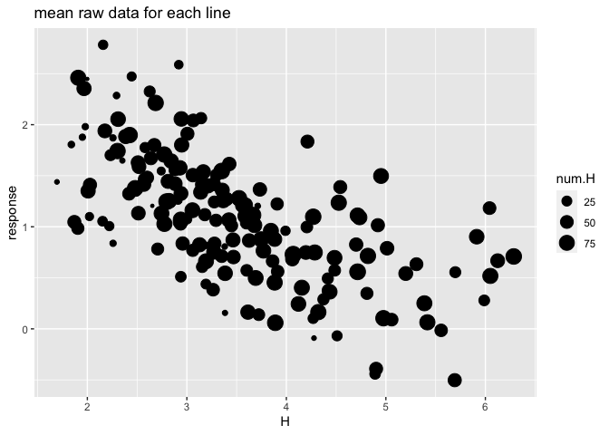
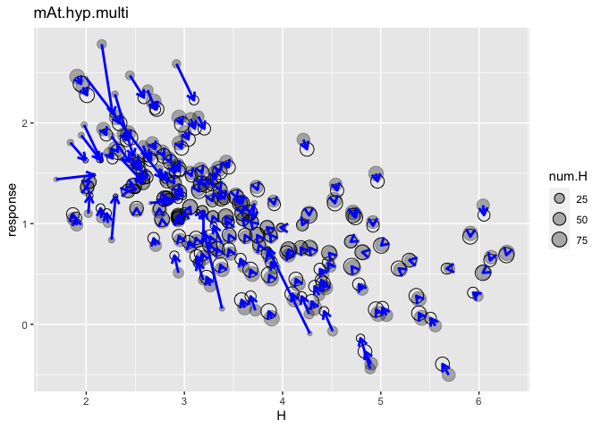

Chap14\_2\_HW3
================
Kazu
3/13/2020

# test (my rstan had errors so I checked rstan with simple sample from book)

# multilevel tadpoles

``` r
data(reedfrogs)
d <- reedfrogs
str(d)
```

    ## 'data.frame':    48 obs. of  5 variables:
    ##  $ density : int  10 10 10 10 10 10 10 10 10 10 ...
    ##  $ pred    : Factor w/ 2 levels "no","pred": 1 1 1 1 1 1 1 1 2 2 ...
    ##  $ size    : Factor w/ 2 levels "big","small": 1 1 1 1 2 2 2 2 1 1 ...
    ##  $ surv    : int  9 10 7 10 9 9 10 9 4 9 ...
    ##  $ propsurv: num  0.9 1 0.7 1 0.9 0.9 1 0.9 0.4 0.9 ...

``` r
d
```

    ##    density pred  size surv  propsurv
    ## 1       10   no   big    9 0.9000000
    ## 2       10   no   big   10 1.0000000
    ## 3       10   no   big    7 0.7000000
    ## 4       10   no   big   10 1.0000000
    ## 5       10   no small    9 0.9000000
    ## 6       10   no small    9 0.9000000
    ## 7       10   no small   10 1.0000000
    ## 8       10   no small    9 0.9000000
    ## 9       10 pred   big    4 0.4000000
    ## 10      10 pred   big    9 0.9000000
    ## 11      10 pred   big    7 0.7000000
    ## 12      10 pred   big    6 0.6000000
    ## 13      10 pred small    7 0.7000000
    ## 14      10 pred small    5 0.5000000
    ## 15      10 pred small    9 0.9000000
    ## 16      10 pred small    9 0.9000000
    ## 17      25   no   big   24 0.9600000
    ## 18      25   no   big   23 0.9200000
    ## 19      25   no   big   22 0.8800000
    ## 20      25   no   big   25 1.0000000
    ## 21      25   no small   23 0.9200000
    ## 22      25   no small   23 0.9200000
    ## 23      25   no small   23 0.9200000
    ## 24      25   no small   21 0.8400000
    ## 25      25 pred   big    6 0.2400000
    ## 26      25 pred   big   13 0.5200000
    ## 27      25 pred   big    4 0.1600000
    ## 28      25 pred   big    9 0.3600000
    ## 29      25 pred small   13 0.5200000
    ## 30      25 pred small   20 0.8000000
    ## 31      25 pred small    8 0.3200000
    ## 32      25 pred small   10 0.4000000
    ## 33      35   no   big   34 0.9714286
    ## 34      35   no   big   33 0.9428571
    ## 35      35   no   big   33 0.9428571
    ## 36      35   no   big   31 0.8857143
    ## 37      35   no small   31 0.8857143
    ## 38      35   no small   35 1.0000000
    ## 39      35   no small   33 0.9428571
    ## 40      35   no small   32 0.9142857
    ## 41      35 pred   big    4 0.1142857
    ## 42      35 pred   big   12 0.3428571
    ## 43      35 pred   big   13 0.3714286
    ## 44      35 pred   big   14 0.4000000
    ## 45      35 pred small   22 0.6285714
    ## 46      35 pred small   12 0.3428571
    ## 47      35 pred small   31 0.8857143
    ## 48      35 pred small   17 0.4857143

``` r
# make the tank cluster variable
d$tank <- 1:nrow(d)
dat <- list(
    S = d$surv,
    N = d$density,
    tank = d$tank )
```

  - varying intercepts model (= simplelst kind of varying effects)

  
![
Si \\sim Bionial(N\_i,p\_i) \\\\
logit(p\_i) \\sim \\alpha\_{TANK\[i\]} \\\\
\\alpha\_j \\sim Normal(0,1.5),\\ for\\ j=1..48 \\\\
](https://latex.codecogs.com/png.latex?%0ASi%20%5Csim%20Bionial%28N_i%2Cp_i%29%20%5C%5C%0Alogit%28p_i%29%20%5Csim%20%5Calpha_%7BTANK%5Bi%5D%7D%20%5C%5C%0A%5Calpha_j%20%5Csim%20Normal%280%2C1.5%29%2C%5C%20for%5C%20j%3D1..48%20%5C%5C%0A
"
Si \\sim Bionial(N_i,p_i) \\\\
logit(p_i) \\sim \\alpha_{TANK[i]} \\\\
\\alpha_j \\sim Normal(0,1.5),\\ for\\ j=1..48 \\\\
")  

``` r
m13.1 <- ulam(
    alist(
        S ~ dbinom( N , p ),
        logit(p) <- a[tank],
        a[tank] ~ dnorm( 0 , 1.5 )
), data=dat, chains=4, log_lik=TRUE ,cores=2) # cores=2 added by Kazu
precis( m13.1 , depth=2 )
```

    ##                mean        sd         5.5%       94.5%    n_eff     Rhat4
    ## a[1]   1.704913e+00 0.7542428  0.596666221  2.99446436 4868.296 0.9983394
    ## a[2]   2.389233e+00 0.8756660  1.124943344  3.85966074 3464.366 0.9993929
    ## a[3]   7.508883e-01 0.6686487 -0.302714574  1.85908827 4465.003 0.9987518
    ## a[4]   2.440931e+00 0.9089095  1.117479472  4.01161626 3203.729 0.9997186
    ## a[5]   1.676967e+00 0.7462840  0.538179452  2.92905039 4971.476 0.9989034
    ## a[6]   1.710793e+00 0.7464418  0.553703195  2.93290973 4343.501 0.9996131
    ## a[7]   2.407003e+00 0.8803289  1.116846357  3.89054051 3322.257 0.9989490
    ## a[8]   1.719960e+00 0.7711119  0.534627354  3.02985079 3628.252 0.9990390
    ## a[9]  -3.677689e-01 0.6205288 -1.332010520  0.62697553 3753.365 0.9992643
    ## a[10]  1.745416e+00 0.7831527  0.517069673  3.00358667 3981.000 0.9985757
    ## a[11]  7.729750e-01 0.6274265 -0.152550098  1.79092609 4561.416 0.9987592
    ## a[12]  3.643379e-01 0.6158886 -0.602306467  1.35499022 4215.358 0.9991608
    ## a[13]  7.699426e-01 0.6533972 -0.224380897  1.85824001 4034.592 0.9988462
    ## a[14] -2.380887e-06 0.5933956 -0.962858188  0.97751192 5570.242 0.9988814
    ## a[15]  1.704587e+00 0.7706021  0.575961209  3.00394961 3848.291 0.9995544
    ## a[16]  1.707153e+00 0.7388511  0.584586055  2.89988219 4088.014 0.9983193
    ## a[17]  2.562247e+00 0.6995176  1.570219961  3.77121995 3061.680 0.9993339
    ## a[18]  2.141353e+00 0.5858974  1.266862355  3.11891411 4157.898 1.0002187
    ## a[19]  1.810507e+00 0.5386986  0.994195063  2.72074947 3999.852 0.9984704
    ## a[20]  3.091918e+00 0.8030397  1.898205764  4.44798854 3764.913 0.9988667
    ## a[21]  2.123893e+00 0.5916806  1.242984901  3.11557678 3878.778 0.9985211
    ## a[22]  2.137883e+00 0.5958352  1.264723559  3.11386617 3716.814 0.9997746
    ## a[23]  2.146922e+00 0.5922755  1.267531470  3.16281363 2942.431 0.9992801
    ## a[24]  1.546273e+00 0.5184921  0.757310490  2.37861467 3635.516 0.9981879
    ## a[25] -1.101436e+00 0.4660804 -1.852317861 -0.38115859 4993.166 1.0001627
    ## a[26]  8.175956e-02 0.3909131 -0.536027861  0.71403124 4970.505 0.9989202
    ## a[27] -1.544437e+00 0.5150927 -2.413228297 -0.75221146 5054.328 0.9991780
    ## a[28] -5.553943e-01 0.4061425 -1.237259317  0.07222060 5509.567 0.9984025
    ## a[29]  8.124297e-02 0.3876770 -0.533879374  0.69972975 5249.115 0.9991101
    ## a[30]  1.298234e+00 0.4862908  0.555625486  2.08704656 4633.566 0.9983524
    ## a[31] -7.216761e-01 0.4071665 -1.378939453 -0.10000244 4126.144 0.9988966
    ## a[32] -3.882508e-01 0.4017785 -1.025480675  0.24352826 4650.642 0.9987699
    ## a[33]  2.842609e+00 0.6405912  1.888808812  3.89627372 4183.907 0.9988068
    ## a[34]  2.472541e+00 0.5923869  1.616370485  3.46066009 2967.114 0.9992619
    ## a[35]  2.479882e+00 0.5928282  1.578401378  3.49710586 3284.762 1.0000039
    ## a[36]  1.917882e+00 0.4934792  1.152517055  2.76376582 3431.155 0.9985481
    ## a[37]  1.907431e+00 0.4728249  1.175390232  2.70050384 5054.817 0.9993548
    ## a[38]  3.350346e+00 0.7399799  2.259880617  4.58285713 3046.349 0.9989519
    ## a[39]  2.449397e+00 0.5789077  1.626177635  3.48185920 3686.580 0.9988095
    ## a[40]  2.172492e+00 0.5364980  1.374031102  3.05187271 3571.582 0.9988375
    ## a[41] -1.904509e+00 0.4733390 -2.680469307 -1.17870965 3673.448 0.9990057
    ## a[42] -6.288170e-01 0.3477893 -1.191651390 -0.09639402 4189.852 0.9986265
    ## a[43] -5.136793e-01 0.3732399 -1.118436171  0.07370928 6021.880 0.9983008
    ## a[44] -3.982740e-01 0.3648673 -0.972880483  0.18245480 5550.358 0.9984211
    ## a[45]  5.093467e-01 0.3360505 -0.005971535  1.05341964 4806.658 0.9989602
    ## a[46] -6.361607e-01 0.3602424 -1.207222144 -0.07420107 5081.554 0.9983954
    ## a[47]  1.915426e+00 0.4877423  1.164535128  2.75670421 3394.626 0.9991999
    ## a[48] -5.002468e-02 0.3433499 -0.595634638  0.51071786 5684.862 0.9985151

# the end of test1

# varying slope test (varying slope version of practice 13M3, (eg. m.practice13M3.b) had error, so I cheched varying slope codes from book)

## 14.1.1. Simulate the population.

``` r
a <- 3.5
b <- (-1)
sigma_a <- 1
sigma_b <- 0.5
rho <- (-0.7)
# average morning wait time
# average difference afternoon wait time
# std dev in intercepts
# std dev in slopes
# correlation between intercepts and slopes
```

``` r
Mu <- c( a , b )
```

``` r
cov_ab <- sigma_a*sigma_b*rho
Sigma <- matrix( c(sigma_a^2,cov_ab,cov_ab,sigma_b^2) , ncol=2 )
```

``` r
 matrix( c(1,2,3,4) , nrow=2 , ncol=2 )
```

    ##      [,1] [,2]
    ## [1,]    1    3
    ## [2,]    2    4

``` r
sigmas <- c(sigma_a,sigma_b) # standard deviations
Rho <- matrix( c(1,rho,rho,1) , nrow=2 ) # correlation matrix
# now matrix multiply to get covariance matrix
Sigma <- diag(sigmas) %*% Rho %*% diag(sigmas)
```

``` r
 N_cafes <- 20
```

``` r
library(MASS)
```

    ## 
    ## Attaching package: 'MASS'

    ## The following object is masked from 'package:dplyr':
    ## 
    ##     select

``` r
set.seed(5) # used to replicate example
vary_effects <- mvrnorm( N_cafes , Mu , Sigma )
```

``` r
a_cafe <- vary_effects[,1]
b_cafe <- vary_effects[,2]
```

``` r
plot( a_cafe , b_cafe , col=rangi2 ,
    xlab="intercepts (a_cafe)" , ylab="slopes (b_cafe)" )
# overlay population distribution
library(ellipse)
```

    ## 
    ## Attaching package: 'ellipse'

    ## The following object is masked from 'package:rethinking':
    ## 
    ##     pairs

    ## The following object is masked from 'package:graphics':
    ## 
    ##     pairs

``` r
for ( l in c(0.1,0.3,0.5,0.8,0.99) )
    lines(ellipse(Sigma,centre=Mu,level=l),col=col.alpha("black",0.2))
```

<!-- -->

# 14.1.2. Simulate observations.

``` r
set.seed(22)
N_visits <- 10
afternoon <- rep(0:1,N_visits*N_cafes/2)
cafe_id <- rep( 1:N_cafes , each=N_visits )
mu <- a_cafe[cafe_id] + b_cafe[cafe_id]*afternoon
sigma <- 0.5  # std dev within cafes
wait <- rnorm( N_visits*N_cafes , mu , sigma )
d <- data.frame( cafe=cafe_id , afternoon=afternoon , wait=wait )
```

# 14.1.3. The varying slopes model.

``` r
R <- rlkjcorr( 1e4 , K=2 , eta=2 )
dens( R[,1,2] , xlab="correlation" )
```

<!-- -->

``` r
m14.1 <- ulam(
    alist(
        wait ~ normal( mu , sigma ),
        mu <- a_cafe[cafe] + b_cafe[cafe]*afternoon,
        c(a_cafe,b_cafe)[cafe] ~ multi_normal( c(a,b) , Rho , sigma_cafe ),
        a ~ normal(5,2),
        b ~ normal(-1,0.5),
        sigma_cafe ~ exponential(1),
        sigma ~ exponential(1),
        Rho ~ lkj_corr(2)
    ) , data=d , chains=4 , cores=2,iter=2000,log_lik=TRUE)
```

    ## Warning: The largest R-hat is NA, indicating chains have not mixed.
    ## Running the chains for more iterations may help. See
    ## http://mc-stan.org/misc/warnings.html#r-hat

    ## Warning: Bulk Effective Samples Size (ESS) is too low, indicating posterior means and medians may be unreliable.
    ## Running the chains for more iterations may help. See
    ## http://mc-stan.org/misc/warnings.html#bulk-ess

    ## Warning: Tail Effective Samples Size (ESS) is too low, indicating posterior variances and tail quantiles may be unreliable.
    ## Running the chains for more iterations may help. See
    ## http://mc-stan.org/misc/warnings.html#tail-ess

``` r
# What is lkj_corr?
?rlkjcorr
?rmultinom # for multi_ormal, correct?
precis(m14.1,depth=3)
```

    ##                     mean           sd       5.5%        94.5%    n_eff
    ## b_cafe[1]     -1.1528491 2.594566e-01 -1.5689643 -0.726676216 5311.481
    ## b_cafe[2]     -0.9055777 2.684926e-01 -1.3477132 -0.477822624 5186.250
    ## b_cafe[3]     -1.9381105 2.738587e-01 -2.3727761 -1.498480736 5318.099
    ## b_cafe[4]     -1.2368937 2.643966e-01 -1.6481091 -0.808740187 5848.196
    ## b_cafe[5]     -0.1400265 2.858324e-01 -0.5904145  0.335820601 4644.990
    ## b_cafe[6]     -1.3023128 2.603857e-01 -1.7142367 -0.891614196 5619.572
    ## b_cafe[7]     -1.0228427 2.631967e-01 -1.4403466 -0.591293188 4655.372
    ## b_cafe[8]     -1.6250820 2.600945e-01 -2.0524407 -1.208007604 5210.595
    ## b_cafe[9]     -1.3037484 2.643438e-01 -1.7213383 -0.878759550 4789.355
    ## b_cafe[10]    -0.9524475 2.745354e-01 -1.3934164 -0.516025272 5588.501
    ## b_cafe[11]    -0.4312815 2.796028e-01 -0.8812637  0.009374481 5253.417
    ## b_cafe[12]    -1.1867001 2.640430e-01 -1.6171523 -0.777957606 5404.970
    ## b_cafe[13]    -1.8120531 2.740525e-01 -2.2576544 -1.380823245 5140.964
    ## b_cafe[14]    -0.9404512 2.680443e-01 -1.3696454 -0.521527043 5527.609
    ## b_cafe[15]    -2.1910149 2.872437e-01 -2.6664111 -1.743392561 4620.798
    ## b_cafe[16]    -1.0442255 2.681419e-01 -1.4664822 -0.619460283 5015.437
    ## b_cafe[17]    -1.2195300 2.595661e-01 -1.6392822 -0.797355341 4856.650
    ## b_cafe[18]    -1.0217511 2.854128e-01 -1.4617336 -0.548511208 5248.514
    ## b_cafe[19]    -0.2617084 2.800224e-01 -0.7006356  0.197699802 3877.688
    ## b_cafe[20]    -1.0668223 2.633080e-01 -1.4831090 -0.645958533 5317.117
    ## a_cafe[1]      4.2170991 1.951479e-01  3.9100313  4.528389333 5530.934
    ## a_cafe[2]      2.1598732 2.023715e-01  1.8337605  2.480643343 4499.554
    ## a_cafe[3]      4.3739745 2.002476e-01  4.0507167  4.684667546 5502.994
    ## a_cafe[4]      3.2443856 2.007948e-01  2.9282023  3.568651088 5300.999
    ## a_cafe[5]      1.8766150 2.127240e-01  1.5363659  2.223453778 4645.961
    ## a_cafe[6]      4.2620285 2.006174e-01  3.9437034  4.583606842 5925.506
    ## a_cafe[7]      3.6155890 2.031205e-01  3.2837107  3.940060706 4634.320
    ## a_cafe[8]      3.9479268 1.960748e-01  3.6326402  4.256886352 4963.025
    ## a_cafe[9]      3.9844573 2.006288e-01  3.6640359  4.306853165 3921.227
    ## a_cafe[10]     3.5611095 2.052378e-01  3.2302523  3.894786625 5049.022
    ## a_cafe[11]     1.9355959 2.057440e-01  1.6114683  2.262955603 5098.571
    ## a_cafe[12]     3.8441864 2.006945e-01  3.5245611  4.164164728 5480.961
    ## a_cafe[13]     3.8861255 2.022600e-01  3.5670714  4.210985690 5282.496
    ## a_cafe[14]     3.1760147 2.019739e-01  2.8564048  3.491355809 5056.537
    ## a_cafe[15]     4.4512884 2.096377e-01  4.1152950  4.796033704 5118.758
    ## a_cafe[16]     3.3901411 2.033662e-01  3.0713344  3.713292281 5196.100
    ## a_cafe[17]     4.2143865 1.959483e-01  3.8972662  4.525633835 5139.204
    ## a_cafe[18]     5.7451428 2.066747e-01  5.4116498  6.072375638 5579.548
    ## a_cafe[19]     3.2494420 2.066317e-01  2.9306201  3.582802591 4489.151
    ## a_cafe[20]     3.7373942 1.969077e-01  3.4242504  4.058604281 5334.635
    ## a              3.6512755 2.165104e-01  3.3133642  3.995736551 4664.869
    ## b             -1.1317579 1.431110e-01 -1.3636911 -0.900919846 4020.801
    ## sigma_cafe[1]  0.9609332 1.607341e-01  0.7356584  1.232217974 3663.188
    ## sigma_cafe[2]  0.5909523 1.263922e-01  0.4177011  0.817871202 3611.232
    ## sigma          0.4740424 2.670136e-02  0.4339308  0.518236410 3939.867
    ## Rho[1,1]       1.0000000 0.000000e+00  1.0000000  1.000000000      NaN
    ## Rho[1,2]      -0.5035704 1.779868e-01 -0.7497557 -0.190689099 4116.002
    ## Rho[2,1]      -0.5035704 1.779868e-01 -0.7497557 -0.190689099 4116.002
    ## Rho[2,2]       1.0000000 7.898412e-17  1.0000000  1.000000000 3512.265
    ##                   Rhat4
    ## b_cafe[1]     0.9993523
    ## b_cafe[2]     0.9995211
    ## b_cafe[3]     1.0002009
    ## b_cafe[4]     0.9995452
    ## b_cafe[5]     0.9995517
    ## b_cafe[6]     0.9993782
    ## b_cafe[7]     1.0000161
    ## b_cafe[8]     1.0005508
    ## b_cafe[9]     0.9998809
    ## b_cafe[10]    0.9995082
    ## b_cafe[11]    0.9999762
    ## b_cafe[12]    0.9994160
    ## b_cafe[13]    0.9999128
    ## b_cafe[14]    0.9993147
    ## b_cafe[15]    1.0008124
    ## b_cafe[16]    0.9998594
    ## b_cafe[17]    0.9994817
    ## b_cafe[18]    0.9993323
    ## b_cafe[19]    1.0003333
    ## b_cafe[20]    0.9993206
    ## a_cafe[1]     0.9996961
    ## a_cafe[2]     0.9998999
    ## a_cafe[3]     1.0001218
    ## a_cafe[4]     0.9999444
    ## a_cafe[5]     0.9992030
    ## a_cafe[6]     0.9994401
    ## a_cafe[7]     0.9994942
    ## a_cafe[8]     1.0009442
    ## a_cafe[9]     0.9996461
    ## a_cafe[10]    0.9999180
    ## a_cafe[11]    0.9997575
    ## a_cafe[12]    0.9999845
    ## a_cafe[13]    0.9998129
    ## a_cafe[14]    0.9994796
    ## a_cafe[15]    1.0008258
    ## a_cafe[16]    1.0007247
    ## a_cafe[17]    0.9998508
    ## a_cafe[18]    0.9995430
    ## a_cafe[19]    1.0001542
    ## a_cafe[20]    0.9998679
    ## a             1.0003918
    ## b             0.9999547
    ## sigma_cafe[1] 0.9992414
    ## sigma_cafe[2] 1.0002973
    ## sigma         1.0003127
    ## Rho[1,1]            NaN
    ## Rho[1,2]      1.0001170
    ## Rho[2,1]      1.0001170
    ## Rho[2,2]      0.9989995

# the end of varying slope test

# new problems (March 20, 2020)

# 1\. 1. Review last weeks material.

# 2\. Update last weeks problems if necessary. Can you fit non-centered models? Are you using multivariate normal distributions where appropriate?

# 4\. Attached are data from an experiment measuring hypocotyl length in ~ 180 natural arabidopsis accessions grown in high and low red:far-red light. We want to know if there are differences in accessions in their length in high R:FR (“H”) and in their response to low R:FR(“L”). Also we want to obtain an estimate for hypocotyl length for each accession in high and low R:FR for downstream GWAS analysis.

# Relevant variables:

  - length – hypocotyl length
  - line – unique ID for each accession (you could also use nativename)
  - light – indicator for high or low RFR
  - exp – two independent experiments were done
  - plate – this is an incomplete block design with a subset (10? 12?)
    of accessions on each plate. Let’s try a variety of increasingly
    complex models:
  - reading data

<!-- end list -->

``` r
At.hyp.dat <- read_csv("hyp.lengths.both.experiments.labels.csv")
```

    ## Parsed with column specification:
    ## cols(
    ##   line = col_double(),
    ##   length = col_double(),
    ##   plate = col_character(),
    ##   light = col_character(),
    ##   exp = col_character(),
    ##   nativename = col_character(),
    ##   stockparent = col_character(),
    ##   latitude = col_double(),
    ##   longitude = col_double(),
    ##   site = col_character(),
    ##   region = col_character(),
    ##   country = col_character()
    ## )

``` r
str(At.hyp.dat)
```

    ## Classes 'spec_tbl_df', 'tbl_df', 'tbl' and 'data.frame': 18031 obs. of  12 variables:
    ##  $ line       : num  6901 6901 6901 6901 6901 ...
    ##  $ length     : num  2.01 1.48 1.99 2.74 1.94 ...
    ##  $ plate      : chr  "1AH" "1AH" "1AH" "1AH" ...
    ##  $ light      : chr  "H" "H" "H" "H" ...
    ##  $ exp        : chr  "A" "A" "A" "A" ...
    ##  $ nativename : chr  "Bil-7" "Bil-7" "Bil-7" "Bil-7" ...
    ##  $ stockparent: chr  "CS22579" "CS22579" "CS22579" "CS22579" ...
    ##  $ latitude   : num  63.3 63.3 63.3 63.3 63.3 ...
    ##  $ longitude  : num  18.5 18.5 18.5 18.5 18.5 ...
    ##  $ site       : chr  "Bil" "Bil" "Bil" "Bil" ...
    ##  $ region     : chr  "NSweden" "NSweden" "NSweden" "NSweden" ...
    ##  $ country    : chr  "SWE" "SWE" "SWE" "SWE" ...
    ##  - attr(*, "spec")=
    ##   .. cols(
    ##   ..   line = col_double(),
    ##   ..   length = col_double(),
    ##   ..   plate = col_character(),
    ##   ..   light = col_character(),
    ##   ..   exp = col_character(),
    ##   ..   nativename = col_character(),
    ##   ..   stockparent = col_character(),
    ##   ..   latitude = col_double(),
    ##   ..   longitude = col_double(),
    ##   ..   site = col_character(),
    ##   ..   region = col_character(),
    ##   ..   country = col_character()
    ##   .. )

``` r
# format dat for exp
At.hyp.dat2 <- At.hyp.dat %>% mutate(expnid=ifelse(exp=="A",0L,1L))
# format for light (non index)
At.hyp.dat2 <- At.hyp.dat2 %>% mutate(lightnid=ifelse(light=="H",0L,1L))
# format for line
At.hyp.dat2 <- At.hyp.dat2 %>% mutate(lineid=as.integer(as.factor(line)))
# format dat for plate
At.hyp.dat2 %>% group_by(plate,exp,light,line) %>% summarize(n())
```

    ## # A tibble: 1,303 x 5
    ## # Groups:   plate, exp, light [152]
    ##    plate exp   light  line `n()`
    ##    <chr> <chr> <chr> <dbl> <int>
    ##  1 10AH  A     H      6088    13
    ##  2 10AH  A     H      6899     8
    ##  3 10AH  A     H      6956    21
    ##  4 10AH  A     H      6962    14
    ##  5 10AH  A     H      6963    27
    ##  6 10AH  A     H      6976    13
    ##  7 10AH  A     H      8245    19
    ##  8 10AH  A     H      8312    18
    ##  9 10AH  A     H      8426    21
    ## 10 10AL  A     L      6088    17
    ## # … with 1,293 more rows

``` r
At.hyp.dat2 <- At.hyp.dat2 %>% mutate(plateid = as.integer(as.factor(plate)))
```

1.  No
pooling

<!-- end list -->

``` r
At.hyp.dat2.s <- At.hyp.dat2 %>% dplyr::select(length,lineid,lightnid,expnid,plateid)
str(At.hyp.dat2.s)
```

    ## Classes 'spec_tbl_df', 'tbl_df', 'tbl' and 'data.frame': 18031 obs. of  5 variables:
    ##  $ length  : num  2.01 1.48 1.99 2.74 1.94 ...
    ##  $ lineid  : int  18 18 18 18 18 18 18 163 163 163 ...
    ##  $ lightnid: int  0 0 0 0 0 0 0 0 0 0 ...
    ##  $ expnid  : int  0 0 0 0 0 0 0 0 0 0 ...
    ##  $ plateid : int  41 41 41 41 41 41 41 41 41 41 ...

``` r
# only line and lightnid
mAt.hyp.nopooling1 <- ulam(
    alist(
        length ~ dnorm( mu , sigma ),
        mu <- a[lineid] + b[lineid]*lightnid, 
        a[lineid] ~ dnorm(0,1),
        b[lineid] ~ dnorm(0,1),        
        sigma ~ dexp(1)
    ) , data=At.hyp.dat2.s , chains=4 , cores=2,iter=2000,log_lik=TRUE)
```

    ## Warning: There were 87 transitions after warmup that exceeded the maximum treedepth. Increase max_treedepth above 10. See
    ## http://mc-stan.org/misc/warnings.html#maximum-treedepth-exceeded

    ## Warning: Examine the pairs() plot to diagnose sampling problems

1.  scaled normalized length

<!-- end list -->

  - Note: scaled -\> mu chould be centered at zero?

<!-- end list -->

``` r
At.hyp.dat2.s <- At.hyp.dat2.s %>% mutate(lengthscaled = scale(length))
str(At.hyp.dat2.s)
```

    ## Classes 'spec_tbl_df', 'tbl_df', 'tbl' and 'data.frame': 18031 obs. of  6 variables:
    ##  $ length      : num  2.01 1.48 1.99 2.74 1.94 ...
    ##  $ lineid      : int  18 18 18 18 18 18 18 163 163 163 ...
    ##  $ lightnid    : int  0 0 0 0 0 0 0 0 0 0 ...
    ##  $ expnid      : int  0 0 0 0 0 0 0 0 0 0 ...
    ##  $ plateid     : int  41 41 41 41 41 41 41 41 41 41 ...
    ##  $ lengthscaled: num [1:18031, 1] -1.56 -1.95 -1.58 -1.02 -1.61 ...
    ##   ..- attr(*, "scaled:center")= num 4.12
    ##   ..- attr(*, "scaled:scale")= num 1.35

``` r
mAt.hyp.nopooling1.scaled <- ulam(
    alist(
        lengthscaled ~ dnorm( mu , sigma ),
        mu <- a[lineid] + b[lineid]*lightnid, 
        a[lineid] ~ dnorm(0,1),
        b[lineid] ~ dnorm(0,1),        
        sigma ~ dexp(1)
    ) , data=At.hyp.dat2.s , chains=4 , cores=2,iter=2000,log_lik=TRUE)
```

    ## Warning: There were 157 transitions after warmup that exceeded the maximum treedepth. Increase max_treedepth above 10. See
    ## http://mc-stan.org/misc/warnings.html#maximum-treedepth-exceeded

    ## Warning: Examine the pairs() plot to diagnose sampling problems

# exp and plate (pending)

``` r
mAt.hyp.nopooling <- ulam(
    alist(
        length ~ dnorm( mu , sigma ),
        mu <- a[lineid] + b[lineid]*lightnid,   + c[line]*expnid, #+ d[line]*plateid,
        a[lineid] ~ dnorm(0,1),
        b[lineid] ~ dnorm(0,1),
        c[lineid] ~ dnorm(0,1),
        d[lineid] ~ dnorm(0,1),
        sigma ~ dexp(1)
    ) , data=At.hyp.dat2.s , chains=4 , cores=2,iter=2000,log_lik=TRUE)
plot(mAt.hyp.nopooling1, depth=2)
```

2.  Partial pooling of intercepts and slopes for line and intercepts for
    plate and experiment, but treat each variable separately (no
    multivariate component). you might also consider adding an
    experiment slope effect

<!-- end list -->

  - try differnt a\_bar and a\_sigma (see Julin’s schript).

  - 
<!-- end list -->

``` r
mAt.hyp.partialpooling <- ulam(
    alist(
        length ~ dnorm( mu , sigma ),
        mu <- a[lineid] + b[lineid]*lightnid, 
        a[lineid] ~ dnorm(a_bar,a_sigma),
        b[lineid] ~ dnorm(0,1),  
        a_bar ~ dnorm(0,0.25),
        a_sigma ~ dexp(1),
        sigma ~ dexp(1)
    ) , data=At.hyp.dat2.s , chains=4 , cores=2,iter=4000,log_lik=TRUE)
```

    ## Warning: There were 272 transitions after warmup that exceeded the maximum treedepth. Increase max_treedepth above 10. See
    ## http://mc-stan.org/misc/warnings.html#maximum-treedepth-exceeded

    ## Warning: Examine the pairs() plot to diagnose sampling problems

3.  As 2, but use a multivariate normal model for the line slope and
    intercept effects

<!-- end list -->

  - raw dta mean and
sd

<!-- end list -->

``` r
At.hyp.dat2 %>% group_by(lineid,light) %>% summarize(length.mean=mean(length)) %>% spread(key="light",value="length.mean") %>% mutate(response=L-H) %>% ungroup()  %>% summarize(H.mean=mean(H,na.rm = TRUE),H.sd=sd(H,na.rm = TRUE),response.mean=mean(response,na.rm = TRUE),response.sd=sd(response,na.rm = TRUE),num=n())
```

    ## # A tibble: 1 x 5
    ##   H.mean  H.sd response.mean response.sd   num
    ##    <dbl> <dbl>         <dbl>       <dbl> <int>
    ## 1   3.44  1.03          1.10       0.620   180

  - unrelative values with raw data   
     \\\\ b \\sim Normal(0,0.5) \\\\ ")  

<!-- end list -->

``` r
mAt.hyp.multi <- ulam(
    alist(
        length ~ normal( mu , sigma ),
        mu <- a_line[lineid] + b_line[lineid]*lightnid ,
        c(a_line,b_line)[lineid] ~ multi_normal( c(a,b) , Rho , sigma_line ),
        a ~ normal(1,1),
        b ~ normal(0,0.5),
        sigma_line ~ dexp(1),
        sigma ~ dexp(1),
        Rho ~ lkj_corr(2)
    ) , data=At.hyp.dat2.s , chains=4 , cores=2,iter=3000,log_lik=TRUE)
```

    ## Warning: There were 1204 transitions after warmup that exceeded the maximum treedepth. Increase max_treedepth above 10. See
    ## http://mc-stan.org/misc/warnings.html#maximum-treedepth-exceeded

    ## Warning: Examine the pairs() plot to diagnose sampling problems

    ## Warning: The largest R-hat is NA, indicating chains have not mixed.
    ## Running the chains for more iterations may help. See
    ## http://mc-stan.org/misc/warnings.html#r-hat

    ## Warning: Bulk Effective Samples Size (ESS) is too low, indicating posterior means and medians may be unreliable.
    ## Running the chains for more iterations may help. See
    ## http://mc-stan.org/misc/warnings.html#bulk-ess

    ## Warning: Tail Effective Samples Size (ESS) is too low, indicating posterior variances and tail quantiles may be unreliable.
    ## Running the chains for more iterations may help. See
    ## http://mc-stan.org/misc/warnings.html#tail-ess

  - check Rho

<!-- end list -->

``` r
Rho
```

    ##      [,1] [,2]
    ## [1,]  1.0 -0.7
    ## [2,] -0.7  1.0

  - using values with raw data   
     \\\\ b \\sim Normal(1,0.6) \\\\ ")  

<!-- end list -->

``` r
mAt.hyp.multi2 <- ulam(
    alist(
        length ~ normal( mu , sigma ),
        mu <- a_line[lineid] + b_line[lineid]*lightnid ,
        c(a_line,b_line)[lineid] ~ multi_normal( c(a,b) , Rho , sigma_line ),
        a ~ normal(3.4,1),
        b ~ normal(1,0.6),
        sigma_line ~ dexp(1),
        sigma ~ dexp(1),
        Rho ~ lkj_corr(2)
    ) , data=At.hyp.dat2.s , chains=4 , cores=2,iter=3000,log_lik=TRUE)
```

    ## Warning: The largest R-hat is NA, indicating chains have not mixed.
    ## Running the chains for more iterations may help. See
    ## http://mc-stan.org/misc/warnings.html#r-hat

    ## Warning: Bulk Effective Samples Size (ESS) is too low, indicating posterior means and medians may be unreliable.
    ## Running the chains for more iterations may help. See
    ## http://mc-stan.org/misc/warnings.html#bulk-ess

    ## Warning: Tail Effective Samples Size (ESS) is too low, indicating posterior variances and tail quantiles may be unreliable.
    ## Running the chains for more iterations may help. See
    ## http://mc-stan.org/misc/warnings.html#tail-ess

  - Check correlation sun length and response (seeing correlation
    between )

<!-- end list -->

``` r
# plot raw data
At.hyp.dat2.summary1 <- At.hyp.dat2 %>% group_by(lineid,light) %>% summarize(length.mean=mean(length)) %>% spread(key="light",value="length.mean") %>% mutate(response=L-H) 
At.hyp.dat2.summary2 <- At.hyp.dat2 %>% group_by(lineid,light) %>% summarize(num=n()) %>% spread(key="light",value="num") %>% rename(num.H=H,num.L=L)

At.hyp.dat2.summary <- At.hyp.dat2.summary1 %>% left_join(At.hyp.dat2.summary2,by="lineid")

# 
At.hyp.dat2.summary
```

    ## # A tibble: 180 x 6
    ## # Groups:   lineid [180]
    ##    lineid     H     L response num.H num.L
    ##     <int> <dbl> <dbl>    <dbl> <int> <int>
    ##  1      1  3.28  4.11    0.836    52    60
    ##  2      2  2.94  4.01    1.07     74    60
    ##  3      3  2.92  5.51    2.59     16    22
    ##  4      4  6.04  7.22    1.18     49    43
    ##  5      5  4.70  5.53    0.826    56    48
    ##  6      6  4.12  4.37    0.244    71    66
    ##  7      7  2.57  4.04    1.47     40    37
    ##  8      8  2.49  3.84    1.35     25    18
    ##  9      9  2.29  4.58    2.29      7     2
    ## 10     10  3.38  4.19    0.806     4     8
    ## # … with 170 more rows

``` r
p1 <- At.hyp.dat2.summary %>% ggplot(aes(x=H,y=response)) + geom_point(aes(size=num.H))
p1 + labs(title="mean raw data for each line")
```

    ## Warning: Removed 4 rows containing missing values (geom_point).

<!-- -->

``` r
# extract posterior means of partially pooled estimates
post <- extract.samples(mAt.hyp.multi) 
post$a_line %>% head()
```

    ##          [,1]     [,2]     [,3]     [,4]     [,5]     [,6]     [,7]     [,8]
    ## [1,] 3.238890 2.895650 3.131283 6.062988 4.710781 3.989095 2.668843 2.522431
    ## [2,] 3.379596 2.907539 3.215110 5.904044 4.735105 4.208581 2.592551 2.420631
    ## [3,] 3.305559 2.582614 2.824027 6.177596 4.538976 4.118283 2.329828 2.424372
    ## [4,] 3.317766 2.935395 3.194924 5.963593 4.711934 4.190413 2.439287 2.432993
    ## [5,] 3.366354 2.756813 3.372633 5.910032 4.791119 4.153833 2.770998 2.226067
    ## [6,] 3.243807 2.834906 3.324949 6.170211 4.831556 4.100854 2.463341 2.687644
    ##          [,9]    [,10]    [,11]    [,12]    [,13]    [,14]    [,15]    [,16]
    ## [1,] 2.770771 3.093616 1.925680 2.600535 3.140468 3.600714 3.719869 2.374727
    ## [2,] 2.161488 3.178533 1.717566 2.565985 2.991451 3.642735 3.493241 2.387199
    ## [3,] 2.477959 2.896642 1.752353 2.750321 2.997898 3.754014 3.518474 2.123089
    ## [4,] 2.390009 3.317703 1.833158 2.600206 2.928494 3.658595 3.739926 2.440144
    ## [5,] 2.749043 2.765639 1.644211 2.616213 3.011456 3.602293 3.761162 2.337387
    ## [6,] 2.145553 3.040075 1.927200 2.763527 3.105767 3.626231 3.624697 2.481739
    ##         [,17]    [,18]    [,19]    [,20]    [,21]    [,22]    [,23]    [,24]
    ## [1,] 3.355834 2.700223 2.946499 4.541442 2.689055 2.786076 2.406009 3.312032
    ## [2,] 3.475262 2.858203 2.944249 4.360304 2.811081 2.895104 2.502065 3.243099
    ## [3,] 3.432021 2.668063 2.982402 4.581131 2.787654 2.955631 2.287629 3.075510
    ## [4,] 3.544665 2.310251 2.920040 4.463487 2.723836 2.864793 2.444935 3.254097
    ## [5,] 3.388426 2.690391 3.005463 4.568790 2.675858 3.070968 2.414598 3.025625
    ## [6,] 3.509903 2.958583 2.899545 4.548516 2.824583 3.016149 2.447359 2.937014
    ##         [,25]    [,26]    [,27]    [,28]    [,29]    [,30]    [,31]    [,32]
    ## [1,] 4.810213 2.989874 2.042753 2.666040 3.476023 4.010566 4.259068 2.407213
    ## [2,] 4.573885 2.843831 1.733304 2.651316 3.352292 4.088069 4.066700 2.065739
    ## [3,] 4.848786 2.605891 1.938414 2.703311 3.274250 4.017427 4.395854 2.236080
    ## [4,] 4.699442 2.862280 1.981024 2.699854 3.477894 3.870748 4.020890 2.392402
    ## [5,] 4.742849 3.015060 2.086761 2.778528 3.544008 3.945484 4.417990 2.057231
    ## [6,] 4.812446 2.754748 1.963250 2.857938 3.488490 3.704934 4.265619 2.128015
    ##         [,33]    [,34]    [,35]    [,36]    [,37]    [,38]    [,39]    [,40]
    ## [1,] 2.377422 6.362093 5.862651 3.735323 3.608677 3.522581 2.841199 3.912005
    ## [2,] 2.493330 6.205940 5.939793 3.608940 3.664823 3.570232 2.744054 3.013704
    ## [3,] 2.483453 6.168818 5.949554 3.715922 3.537826 3.432939 2.868178 4.463429
    ## [4,] 2.428851 6.410722 6.061499 3.591408 3.595932 3.572025 2.958813 4.161511
    ## [5,] 2.538439 6.262992 5.766659 3.641083 3.738487 3.525268 2.910776 3.974739
    ## [6,] 2.424877 6.212182 5.842969 3.540417 3.618071 3.648362 2.771661 4.400761
    ##         [,41]    [,42]    [,43]    [,44]    [,45]    [,46]    [,47]    [,48]
    ## [1,] 5.510356 2.078649 3.682036 2.373484 3.035879 2.883544 5.450022 4.312112
    ## [2,] 5.558062 2.070919 4.046260 2.526610 3.288254 3.250888 5.196690 4.412166
    ## [3,] 5.541768 2.087249 3.838344 2.428369 3.352999 3.299201 5.190879 4.180828
    ## [4,] 5.736627 2.303950 3.911961 2.535415 3.255530 3.531984 5.218848 4.303402
    ## [5,] 5.551460 2.126979 3.764111 2.506576 2.997263 2.941780 5.217668 4.339219
    ## [6,] 5.579818 2.157294 3.931967 2.178187 3.169254 3.240012 5.112646 4.300757
    ##         [,49]    [,50]    [,51]    [,52]    [,53]    [,54]    [,55]    [,56]
    ## [1,] 3.860054 3.940700 3.136519 3.099846 5.543577 3.366615 4.278631 3.426839
    ## [2,] 3.829456 3.774008 3.277445 3.036924 5.534438 3.484871 4.402897 3.459886
    ## [3,] 4.001913 3.704661 3.331087 2.831531 5.602168 3.325336 4.248388 3.288772
    ## [4,] 3.748070 3.968524 3.211101 2.839248 5.545284 3.475857 4.298389 3.374881
    ## [5,] 3.717687 3.787604 3.163392 2.719998 5.182284 3.449573 3.914687 3.264660
    ## [6,] 4.024625 3.899774 2.977768 2.923249 5.507159 3.344075 4.285780 3.290840
    ##         [,57]    [,58]    [,59]    [,60]    [,61]    [,62]    [,63]    [,64]
    ## [1,] 3.275266 2.755847 2.727456 6.097506 3.171185 3.410153 6.182291 2.996469
    ## [2,] 3.124172 2.665676 2.711825 5.998512 3.099544 3.644618 6.155549 2.859616
    ## [3,] 3.419072 2.658515 3.070401 6.019426 3.127873 3.450335 5.851772 2.812576
    ## [4,] 3.220413 2.658150 3.039043 6.135518 3.091150 3.357873 6.152764 2.788511
    ## [5,] 3.188024 2.637457 2.860077 6.054398 3.033496 3.448464 6.106239 2.964648
    ## [6,] 3.324927 2.987064 2.952330 6.045714 3.070698 3.294464 6.197817 2.952967
    ##         [,65]    [,66]    [,67]    [,68]    [,69]    [,70]    [,71]    [,72]
    ## [1,] 3.044114 2.513637 2.290169 4.165250 3.628909 2.838537 2.935802 4.790525
    ## [2,] 2.790590 2.680922 2.206321 4.424967 3.561053 2.705602 2.754405 4.896408
    ## [3,] 2.955512 2.674135 1.687650 4.217953 3.652876 2.661040 2.824538 4.996270
    ## [4,] 3.010440 2.534030 1.992069 4.479367 3.754407 2.895110 2.561553 4.831003
    ## [5,] 2.979713 2.484318 1.671788 4.330234 3.447596 2.820673 2.567158 4.844448
    ## [6,] 3.043310 2.739990 2.201178 4.212700 3.699341 2.609540 2.883332 5.005319
    ##         [,73]    [,74]    [,75]    [,76]    [,77]    [,78]    [,79]    [,80]
    ## [1,] 3.099926 4.965969 4.147600 3.339296 3.135593 5.429392 4.042469 4.178727
    ## [2,] 3.169688 5.247730 3.988172 3.400444 3.269599 5.315509 4.203127 4.266035
    ## [3,] 1.949521 5.119201 4.025869 3.509006 3.393991 5.295665 4.330327 4.361002
    ## [4,] 2.013100 5.313679 4.209815 3.527381 3.096346 5.372230 4.205937 4.287814
    ## [5,] 1.934614 5.029074 4.133185 3.558141 3.071376 5.222424 4.145856 4.540617
    ## [6,] 1.411613 5.023651 4.078397 3.361312 3.035381 5.502132 4.171300 4.209503
    ##         [,81]    [,82]    [,83]    [,84]    [,85]    [,86]    [,87]    [,88]
    ## [1,] 3.269445 3.376848 3.629186 3.042547 3.317482 2.312705 2.633181 3.689380
    ## [2,] 2.853599 3.385095 3.538348 3.150295 3.555137 2.097614 2.303402 3.527087
    ## [3,] 2.918365 3.136747 3.668836 2.778763 3.586561 2.370494 2.154023 3.587487
    ## [4,] 1.953141 3.172325 3.578569 3.411594 3.203040 2.068946 2.065529 3.564863
    ## [5,] 2.517274 3.387919 3.448128 3.331653 3.429350 2.017800 1.983276 3.528306
    ## [6,] 2.144542 3.247224 3.643865 2.941696 3.161949 2.094428 2.309050 3.481879
    ##         [,89]    [,90]    [,91]    [,92]    [,93]    [,94]    [,95]    [,96]
    ## [1,] 2.705736 4.879817 5.659088 4.171456 4.875144 4.257837 6.024578 1.939898
    ## [2,] 2.859359 4.678382 5.580728 4.100411 4.965687 4.465976 5.883252 2.549760
    ## [3,] 1.760981 4.773358 5.478746 4.255466 4.836297 4.440486 6.103882 1.700323
    ## [4,] 2.080024 4.695888 5.641896 4.115275 4.996154 4.404218 5.919690 2.374751
    ## [5,] 2.108693 4.629321 5.559233 4.187815 4.875732 4.499543 5.913155 2.194894
    ## [6,] 3.087704 4.623532 5.696707 4.183716 5.081763 4.285991 5.760953 2.206658
    ##         [,97]    [,98]    [,99]   [,100]   [,101]   [,102]   [,103]   [,104]
    ## [1,] 2.780601 2.418340 3.208546 3.524508 3.317197 2.149451 2.553744 3.280669
    ## [2,] 2.915411 2.274319 2.843895 3.367033 3.372454 1.700904 2.928323 3.023844
    ## [3,] 3.121727 2.443758 3.098377 3.364957 3.354519 4.082896 2.789011 3.526480
    ## [4,] 3.219352 2.357967 3.076981 3.351058 3.175448 2.448291 3.134644 3.757545
    ## [5,] 2.788522 2.528359 3.194212 3.673110 3.174054 2.397794 2.899187 2.651711
    ## [6,] 2.970086 2.474018 2.917554 3.624974 3.161076 2.340528 2.843183 3.305132
    ##        [,105]   [,106]   [,107]   [,108]   [,109]   [,110]   [,111]   [,112]
    ## [1,] 3.339315 4.945390 4.581445 2.359257 2.828220 1.939536 4.262319 2.209953
    ## [2,] 3.203498 4.971333 4.562162 2.469780 2.810283 2.420977 4.264549 2.159238
    ## [3,] 3.137690 5.011431 4.490419 2.058599 2.900572 2.182651 4.413629 2.232253
    ## [4,] 3.332658 4.803437 4.629479 2.224222 2.816499 1.937154 4.293670 2.252667
    ## [5,] 3.130807 4.958765 4.513661 2.362710 2.885521 1.955576 4.428201 2.322637
    ## [6,] 3.240565 5.079870 4.149621 2.538719 2.968001 2.279484 4.294227 2.154262
    ##        [,113]   [,114]   [,115]   [,116]   [,117]   [,118]   [,119]   [,120]
    ## [1,] 3.724446 2.783122 4.443085 2.194838 2.621851 4.753476 2.445207 2.160434
    ## [2,] 3.623070 2.837397 4.298764 2.254477 2.723026 4.793966 2.420469 2.141562
    ## [3,] 3.549250 2.887643 4.361853 2.127169 2.261601 4.867533 2.467453 1.868968
    ## [4,] 3.538635 2.696811 4.418532 2.157527 2.426094 4.798698 2.420030 1.817691
    ## [5,] 3.710738 2.841753 4.330958 2.238187 2.472850 4.758911 2.531749 1.826605
    ## [6,] 3.677857 2.863782 4.453479 2.273317 2.650347 4.972400 2.438625 1.984539
    ##        [,121]   [,122]   [,123]   [,124]   [,125]   [,126]   [,127]   [,128]
    ## [1,] 2.665150 4.522763 3.749484 4.723373 2.900012 3.043518 2.366996 2.541135
    ## [2,] 3.653239 4.378227 3.849306 4.700575 3.005305 2.806525 2.462501 2.542764
    ## [3,] 2.015712 4.674930 3.768720 4.669894 2.779392 2.646264 2.717315 2.413105
    ## [4,] 2.398523 4.279225 3.772489 4.597176 2.803605 2.956763 2.431913 2.352740
    ## [5,] 2.790066 4.428328 3.867278 4.699799 2.689221 3.091371 2.699581 2.543719
    ## [6,] 2.550872 4.346724 3.792539 4.686784 3.063338 2.805289 2.506845 2.614723
    ##        [,129]   [,130]   [,131]   [,132]   [,133]   [,134]   [,135]   [,136]
    ## [1,] 5.261204 3.076870 2.869002 3.769406 3.242490 1.582410 3.065204 2.474365
    ## [2,] 5.179619 3.078251 2.867552 3.590456 3.399383 3.511084 2.803089 1.791638
    ## [3,] 5.127072 3.192889 3.011500 3.755080 3.389278 2.540003 3.361075 2.505232
    ## [4,] 5.185073 2.975905 2.784212 3.584996 3.242817 2.622861 3.162091 2.558563
    ## [5,] 5.097353 3.016009 2.816173 3.651818 3.269347 2.386007 2.847417 1.685998
    ## [6,] 5.086894 2.927188 2.993564 3.859393 3.266869 2.479314 2.955720 2.215796
    ##        [,137]   [,138]   [,139]   [,140]   [,141]   [,142]   [,143]   [,144]
    ## [1,] 2.939957 1.877513 3.823761 3.597118 3.734939 4.321729 3.314407 5.059457
    ## [2,] 2.957050 2.008583 3.776180 3.441496 4.026850 4.321650 3.252668 4.923739
    ## [3,] 2.880484 1.944423 3.959285 3.562489 3.950530 4.356506 3.092180 4.802214
    ## [4,] 2.845177 2.121882 3.729395 3.631886 4.138634 4.222956 3.088990 4.998189
    ## [5,] 2.882375 1.801076 3.683837 3.704817 4.027879 4.217563 3.204830 4.923319
    ## [6,] 2.726403 2.027703 3.571130 3.567051 3.945510 4.253823 3.394820 4.801524
    ##        [,145]   [,146]   [,147]   [,148]   [,149]   [,150]   [,151]   [,152]
    ## [1,] 3.751762 4.278174 3.303528 3.207315 2.986275 2.600675 3.424131 3.545252
    ## [2,] 3.694112 4.256824 3.238888 3.205172 3.110416 2.309324 3.228662 3.203748
    ## [3,] 3.636093 4.062868 3.215622 3.242175 3.085566 2.294621 3.312827 2.977731
    ## [4,] 3.708306 4.160236 3.324025 3.271010 2.958682 2.886198 3.782517 3.131575
    ## [5,] 3.756663 4.225510 3.269855 3.353044 2.876847 2.613057 3.658442 3.221441
    ## [6,] 3.768492 4.198980 3.176316 3.128995 2.977510 2.530606 3.684154 3.166367
    ##        [,153]   [,154]   [,155]   [,156]   [,157]   [,158]   [,159]   [,160]
    ## [1,] 2.776797 3.971297 3.336175 4.076996 4.041810 3.034468 3.628465 3.467982
    ## [2,] 2.772742 4.151343 3.398745 4.430977 4.066364 2.754082 3.695075 3.411919
    ## [3,] 2.810744 3.841919 3.453461 4.486573 3.793288 2.520510 3.801313 3.224818
    ## [4,] 2.572614 3.826008 3.371254 4.183803 4.044035 3.095226 3.348414 3.519409
    ## [5,] 2.620661 3.868143 3.502118 4.463101 3.967292 1.152004 3.777957 3.504270
    ## [6,] 2.547536 4.022983 3.411532 4.231535 3.971105 2.985244 3.811627 3.805450
    ##        [,161]   [,162]   [,163]   [,164]   [,165]   [,166]   [,167]   [,168]
    ## [1,] 2.695699 3.719483 4.300759 4.026196 1.761786 2.665163 3.029088 4.920952
    ## [2,] 2.831564 3.600107 4.162234 4.057029 1.718702 2.801117 2.955941 4.888732
    ## [3,] 2.924469 3.799945 4.185019 3.833522 1.837754 2.737827 3.028866 4.862857
    ## [4,] 2.749035 3.662617 4.297607 3.767991 2.102284 2.744466 3.034086 4.763538
    ## [5,] 2.760484 3.773515 4.232915 4.120393 1.759720 2.723441 3.318441 4.886376
    ## [6,] 2.972656 3.686211 4.236277 4.055871 1.992445 2.785859 2.990259 4.883019
    ##        [,169]   [,170]   [,171]   [,172]   [,173]   [,174]   [,175]   [,176]
    ## [1,] 2.479391 3.019469 3.141514 4.683007 5.419837 3.261933 2.161580 3.192342
    ## [2,] 2.748114 3.078478 3.129985 4.735799 5.448864 3.200736 2.128283 3.016321
    ## [3,] 2.422733 2.877401 3.244512 4.891204 5.602426 3.143283 2.716127 3.061784
    ## [4,] 2.468303 2.848927 3.428219 4.680199 5.445782 3.129546 2.281644 3.318574
    ## [5,] 2.680191 3.002949 3.108351 4.724980 5.327820 3.120727 2.595387 3.157594
    ## [6,] 2.443066 2.943943 3.133983 4.779093 5.353830 3.020061 2.206868 3.080194
    ##        [,177]   [,178]   [,179]   [,180]
    ## [1,] 4.982961 2.360789 2.081590 2.638693
    ## [2,] 5.035362 2.127798 1.879882 2.647930
    ## [3,] 4.762591 2.282523 2.027323 2.611319
    ## [4,] 4.951343 2.206222 1.763878 2.684367
    ## [5,] 5.075991 2.275004 1.834793 2.568823
    ## [6,] 5.002896 2.423201 1.917627 2.715105

``` r
a_line <- apply( post$a_line , 2 , mean )
b_line <- apply( post$b_line , 2 , mean )
# 
p3 <- At.hyp.dat2.summary %>% ungroup() %>% mutate(H.pred=a_line,response.pred=b_line) %>% 
  ggplot() + geom_point(aes(x=H,y=response,size=num.H),alpha=0.3) + geom_point(aes(x=H.pred,y=response.pred,size=num.L),shape=21) +
geom_segment(mapping=aes(x=H, y=response, xend=H.pred, yend=response.pred), arrow=arrow(length = unit(0.1, "inches")), size=1, color="blue") 
p3 + labs(title="mAt.hyp.multi")
```

    ## Warning: Removed 4 rows containing missing values (geom_point).

    ## Warning: Removed 3 rows containing missing values (geom_point).

    ## Warning: Removed 4 rows containing missing values (geom_segment).

<!-- -->

``` r
# raw data mean + sd as prior
post2 <- extract.samples(mAt.hyp.multi2) 
a_line2 <- apply( post2$a_line , 2 , mean )
b_line2 <- apply( post2$b_line , 2 , mean )

p4 <- At.hyp.dat2.summary %>% ungroup() %>% mutate(H.pred2=a_line2,response.pred2=b_line2) %>% 
  ggplot() + geom_point(aes(x=H,y=response,size=num.H),alpha=0.3) + geom_point(aes(x=H.pred2,y=response.pred2,size=num.L),shape=21) +
geom_segment(mapping=aes(x=H, y=response, xend=H.pred2, yend=response.pred2), arrow=arrow(length = unit(0.1, "inches")), size=1, color="blue") 

p4 + labs(title="mAt.hyp.multi2")
```

    ## Warning: Removed 4 rows containing missing values (geom_point).

    ## Warning: Removed 3 rows containing missing values (geom_point).

    ## Warning: Removed 4 rows containing missing values (geom_segment).

<!-- -->

  - add

<!-- end list -->

4.  As 3, but non-centered

Evaluate and compare the models. Is there evidence of line, treatment,
and line X treatment effects? How does the magnitude of the experiment
and plate effects compare to the line effects?

# sessionInfo()

``` r
sessionInfo()
```

    ## R version 3.6.2 (2019-12-12)
    ## Platform: x86_64-apple-darwin15.6.0 (64-bit)
    ## Running under: macOS Mojave 10.14.6
    ## 
    ## Matrix products: default
    ## BLAS:   /Library/Frameworks/R.framework/Versions/3.6/Resources/lib/libRblas.0.dylib
    ## LAPACK: /Library/Frameworks/R.framework/Versions/3.6/Resources/lib/libRlapack.dylib
    ## 
    ## locale:
    ## [1] en_US.UTF-8/en_US.UTF-8/en_US.UTF-8/C/en_US.UTF-8/en_US.UTF-8
    ## 
    ## attached base packages:
    ## [1] parallel  stats     graphics  grDevices utils     datasets  methods  
    ## [8] base     
    ## 
    ## other attached packages:
    ##  [1] ellipse_0.4.1        MASS_7.3-51.5        forcats_0.5.0       
    ##  [4] stringr_1.4.0        dplyr_0.8.4          purrr_0.3.3         
    ##  [7] readr_1.3.1          tidyr_1.0.2          tibble_2.1.3        
    ## [10] tidyverse_1.3.0      reshape2_1.4.3       lmerTest_3.1-1      
    ## [13] lme4_1.1-21          Matrix_1.2-18        rethinking_1.95     
    ## [16] dagitty_0.2-2        rstan_2.21.1         ggplot2_3.3.0       
    ## [19] StanHeaders_2.21.0-1
    ## 
    ## loaded via a namespace (and not attached):
    ##  [1] nlme_3.1-145        matrixStats_0.55.0  fs_1.3.1           
    ##  [4] lubridate_1.7.4     httr_1.4.1          numDeriv_2016.8-1.1
    ##  [7] tools_3.6.2         backports_1.1.5     utf8_1.1.4         
    ## [10] R6_2.4.1            DBI_1.1.0           colorspace_1.4-1   
    ## [13] withr_2.1.2         tidyselect_1.0.0    gridExtra_2.3      
    ## [16] prettyunits_1.1.1   processx_3.4.2      curl_4.3           
    ## [19] compiler_3.6.2      cli_2.0.2           rvest_0.3.5        
    ## [22] xml2_1.2.2          labeling_0.3        scales_1.1.0       
    ## [25] mvtnorm_1.1-0       callr_3.4.2         digest_0.6.25      
    ## [28] minqa_1.2.4         rmarkdown_2.1       pkgconfig_2.0.3    
    ## [31] htmltools_0.4.0     dbplyr_1.4.2        rlang_0.4.5        
    ## [34] readxl_1.3.1        rstudioapi_0.11     farver_2.0.3       
    ## [37] shape_1.4.4         generics_0.0.2      jsonlite_1.6.1     
    ## [40] inline_0.3.15       magrittr_1.5        loo_2.2.0          
    ## [43] Rcpp_1.0.3          munsell_0.5.0       fansi_0.4.1        
    ## [46] lifecycle_0.2.0     stringi_1.4.6       yaml_2.2.1         
    ## [49] pkgbuild_1.0.6      plyr_1.8.6          grid_3.6.2         
    ## [52] crayon_1.3.4        lattice_0.20-40     haven_2.2.0        
    ## [55] splines_3.6.2       hms_0.5.3           knitr_1.28         
    ## [58] ps_1.3.2            pillar_1.4.3        boot_1.3-24        
    ## [61] codetools_0.2-16    stats4_3.6.2        reprex_0.3.0       
    ## [64] glue_1.3.1          evaluate_0.14       V8_3.0.1           
    ## [67] RcppParallel_4.4.4  modelr_0.1.6        vctrs_0.2.3        
    ## [70] nloptr_1.2.1        cellranger_1.1.0    gtable_0.3.0       
    ## [73] assertthat_0.2.1    xfun_0.12           broom_0.5.5        
    ## [76] coda_0.19-3
