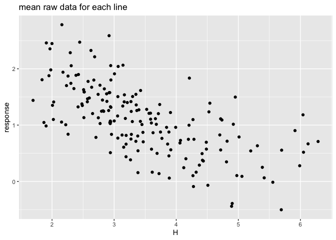

Chap14\_2\_HW
================
Kazu
3/13/2020

# test (my rstan had errors so I checked rstan with simple sample from book)

# multilevel tadpoles

``` r
data(reedfrogs)
d <- reedfrogs
str(d)
```

    ## 'data.frame':    48 obs. of  5 variables:
    ##  $ density : int  10 10 10 10 10 10 10 10 10 10 ...
    ##  $ pred    : Factor w/ 2 levels "no","pred": 1 1 1 1 1 1 1 1 2 2 ...
    ##  $ size    : Factor w/ 2 levels "big","small": 1 1 1 1 2 2 2 2 1 1 ...
    ##  $ surv    : int  9 10 7 10 9 9 10 9 4 9 ...
    ##  $ propsurv: num  0.9 1 0.7 1 0.9 0.9 1 0.9 0.4 0.9 ...

``` r
d
```

    ##    density pred  size surv  propsurv
    ## 1       10   no   big    9 0.9000000
    ## 2       10   no   big   10 1.0000000
    ## 3       10   no   big    7 0.7000000
    ## 4       10   no   big   10 1.0000000
    ## 5       10   no small    9 0.9000000
    ## 6       10   no small    9 0.9000000
    ## 7       10   no small   10 1.0000000
    ## 8       10   no small    9 0.9000000
    ## 9       10 pred   big    4 0.4000000
    ## 10      10 pred   big    9 0.9000000
    ## 11      10 pred   big    7 0.7000000
    ## 12      10 pred   big    6 0.6000000
    ## 13      10 pred small    7 0.7000000
    ## 14      10 pred small    5 0.5000000
    ## 15      10 pred small    9 0.9000000
    ## 16      10 pred small    9 0.9000000
    ## 17      25   no   big   24 0.9600000
    ## 18      25   no   big   23 0.9200000
    ## 19      25   no   big   22 0.8800000
    ## 20      25   no   big   25 1.0000000
    ## 21      25   no small   23 0.9200000
    ## 22      25   no small   23 0.9200000
    ## 23      25   no small   23 0.9200000
    ## 24      25   no small   21 0.8400000
    ## 25      25 pred   big    6 0.2400000
    ## 26      25 pred   big   13 0.5200000
    ## 27      25 pred   big    4 0.1600000
    ## 28      25 pred   big    9 0.3600000
    ## 29      25 pred small   13 0.5200000
    ## 30      25 pred small   20 0.8000000
    ## 31      25 pred small    8 0.3200000
    ## 32      25 pred small   10 0.4000000
    ## 33      35   no   big   34 0.9714286
    ## 34      35   no   big   33 0.9428571
    ## 35      35   no   big   33 0.9428571
    ## 36      35   no   big   31 0.8857143
    ## 37      35   no small   31 0.8857143
    ## 38      35   no small   35 1.0000000
    ## 39      35   no small   33 0.9428571
    ## 40      35   no small   32 0.9142857
    ## 41      35 pred   big    4 0.1142857
    ## 42      35 pred   big   12 0.3428571
    ## 43      35 pred   big   13 0.3714286
    ## 44      35 pred   big   14 0.4000000
    ## 45      35 pred small   22 0.6285714
    ## 46      35 pred small   12 0.3428571
    ## 47      35 pred small   31 0.8857143
    ## 48      35 pred small   17 0.4857143

``` r
# make the tank cluster variable
d$tank <- 1:nrow(d)
dat <- list(
    S = d$surv,
    N = d$density,
    tank = d$tank )
```

  - varying intercepts model (= simplelst kind of varying effects)

  
![
Si \\sim Bionial(N\_i,p\_i) \\\\
logit(p\_i) \\sim \\alpha\_{TANK\[i\]} \\\\
\\alpha\_j \\sim Normal(0,1.5),\\ for\\ j=1..48 \\\\
](https://latex.codecogs.com/png.latex?%0ASi%20%5Csim%20Bionial%28N_i%2Cp_i%29%20%5C%5C%0Alogit%28p_i%29%20%5Csim%20%5Calpha_%7BTANK%5Bi%5D%7D%20%5C%5C%0A%5Calpha_j%20%5Csim%20Normal%280%2C1.5%29%2C%5C%20for%5C%20j%3D1..48%20%5C%5C%0A
"
Si \\sim Bionial(N_i,p_i) \\\\
logit(p_i) \\sim \\alpha_{TANK[i]} \\\\
\\alpha_j \\sim Normal(0,1.5),\\ for\\ j=1..48 \\\\
")  

``` r
m13.1 <- ulam(
    alist(
        S ~ dbinom( N , p ),
        logit(p) <- a[tank],
        a[tank] ~ dnorm( 0 , 1.5 )
), data=dat, chains=4, log_lik=TRUE ,cores=2) # cores=2 added by Kazu
precis( m13.1 , depth=2 )
```

    ##              mean        sd         5.5%       94.5%    n_eff     Rhat4
    ## a[1]   1.71081821 0.7525575  0.552830768  2.99803508 3572.914 0.9983410
    ## a[2]   2.37592479 0.8837308  1.076126839  3.89899214 3271.823 0.9987780
    ## a[3]   0.75977601 0.6167351 -0.170595937  1.76499915 5057.672 0.9988798
    ## a[4]   2.38804474 0.8781259  1.109926415  3.84909134 4112.693 0.9983179
    ## a[5]   1.71146952 0.7725213  0.553331772  3.05727567 3253.439 0.9988874
    ## a[6]   1.73103976 0.7282668  0.596507006  2.96984627 3245.924 0.9994321
    ## a[7]   2.40129360 0.8676524  1.136737275  3.86536403 3912.320 1.0002132
    ## a[8]   1.71039572 0.8053275  0.482814748  3.03484000 3963.108 0.9984457
    ## a[9]  -0.37809590 0.6477166 -1.441418338  0.61074592 6547.246 0.9982631
    ## a[10]  1.70600626 0.7551563  0.561972908  2.98866346 3163.308 0.9987291
    ## a[11]  0.75947404 0.6003749 -0.162705576  1.73844181 3770.864 0.9991426
    ## a[12]  0.36403298 0.6141684 -0.603623174  1.37683282 4981.812 0.9990689
    ## a[13]  0.76129964 0.6635656 -0.249077038  1.85169031 4538.517 0.9991873
    ## a[14]  0.02131139 0.6252839 -0.957561137  1.05620414 5471.711 0.9983195
    ## a[15]  1.69390571 0.7681718  0.540244455  2.96715097 5105.161 0.9986275
    ## a[16]  1.71876294 0.7687264  0.555124157  3.01173386 4176.406 0.9991159
    ## a[17]  2.53979344 0.6981843  1.546077181  3.71006823 4433.709 0.9989912
    ## a[18]  2.13518133 0.5880296  1.258871648  3.14326463 4271.425 0.9996748
    ## a[19]  1.81560599 0.5322764  1.019157040  2.74672586 3791.953 0.9986856
    ## a[20]  3.10049111 0.7760021  1.945080018  4.41811142 3479.074 1.0001664
    ## a[21]  2.15402355 0.6280459  1.214016189  3.23840118 3914.803 0.9985017
    ## a[22]  2.15538423 0.6376089  1.188455737  3.20850750 3784.751 0.9986384
    ## a[23]  2.12149874 0.5902317  1.248297123  3.12147069 4281.607 0.9989795
    ## a[24]  1.55262249 0.5225096  0.778790307  2.39685441 3864.071 0.9989304
    ## a[25] -1.08965287 0.4559819 -1.830333925 -0.37631314 5075.634 0.9984663
    ## a[26]  0.07299515 0.3925315 -0.553363243  0.70643047 5258.049 0.9991389
    ## a[27] -1.54441018 0.5174648 -2.401616147 -0.75826741 3877.971 0.9992725
    ## a[28] -0.56085963 0.3969601 -1.210504593  0.04766005 4596.074 0.9988765
    ## a[29]  0.06835756 0.3965242 -0.559699008  0.71247376 4555.572 0.9985355
    ## a[30]  1.31371749 0.4727167  0.577066726  2.10462386 3522.406 0.9983988
    ## a[31] -0.72179111 0.4180127 -1.417884891 -0.08842708 4435.226 0.9988673
    ## a[32] -0.39242912 0.3941398 -1.018154629  0.22222975 4340.737 0.9994083
    ## a[33]  2.84919036 0.6600118  1.891545839  3.99743693 2914.082 1.0002283
    ## a[34]  2.45874334 0.5991201  1.593184680  3.45059174 3029.823 0.9995047
    ## a[35]  2.44877103 0.5724458  1.621632457  3.37369097 3598.439 0.9986800
    ## a[36]  1.90578866 0.4869092  1.153927457  2.75466815 3708.999 0.9993047
    ## a[37]  1.90167266 0.4625416  1.186310488  2.66540614 3830.659 0.9987845
    ## a[38]  3.36126876 0.7716691  2.239500072  4.66403568 2789.964 0.9983332
    ## a[39]  2.47144639 0.5647662  1.616782720  3.43394394 3164.050 0.9990978
    ## a[40]  2.15993802 0.4827634  1.418585385  2.94833771 4325.880 0.9985208
    ## a[41] -1.91099454 0.4833064 -2.722365693 -1.20081119 4501.992 0.9982688
    ## a[42] -0.63042269 0.3503036 -1.217672927 -0.07099649 4889.262 0.9995636
    ## a[43] -0.50941080 0.3482521 -1.068377177  0.05292937 4629.691 0.9985275
    ## a[44] -0.38931852 0.3634023 -0.981714866  0.17698090 4612.779 0.9982774
    ## a[45]  0.50995431 0.3308343 -0.006960504  1.03701527 4276.147 0.9986094
    ## a[46] -0.62749573 0.3409556 -1.188659275 -0.09001666 5136.558 0.9984975
    ## a[47]  1.90353799 0.4846375  1.164429666  2.69004319 4452.775 0.9994662
    ## a[48] -0.07099780 0.3309398 -0.595405268  0.45788112 4404.773 0.9985794

# the end of test1

# varying slope test (varying slope version of practice 13M3, (eg. m.practice13M3.b) had error, so I cheched varying slope codes from book)

## 14.1.1. Simulate the population.

``` r
a <- 3.5
b <- (-1)
sigma_a <- 1
sigma_b <- 0.5
rho <- (-0.7)
# average morning wait time
# average difference afternoon wait time
# std dev in intercepts
# std dev in slopes
# correlation between intercepts and slopes
```

``` r
Mu <- c( a , b )
```

``` r
cov_ab <- sigma_a*sigma_b*rho
Sigma <- matrix( c(sigma_a^2,cov_ab,cov_ab,sigma_b^2) , ncol=2 )
```

``` r
 matrix( c(1,2,3,4) , nrow=2 , ncol=2 )
```

    ##      [,1] [,2]
    ## [1,]    1    3
    ## [2,]    2    4

``` r
sigmas <- c(sigma_a,sigma_b) # standard deviations
Rho <- matrix( c(1,rho,rho,1) , nrow=2 ) # correlation matrix
# now matrix multiply to get covariance matrix
Sigma <- diag(sigmas) %*% Rho %*% diag(sigmas)
```

``` r
 N_cafes <- 20
```

``` r
library(MASS)
```

    ## 
    ## Attaching package: 'MASS'

    ## The following object is masked from 'package:dplyr':
    ## 
    ##     select

``` r
set.seed(5) # used to replicate example
vary_effects <- mvrnorm( N_cafes , Mu , Sigma )
```

``` r
a_cafe <- vary_effects[,1]
b_cafe <- vary_effects[,2]
```

``` r
plot( a_cafe , b_cafe , col=rangi2 ,
    xlab="intercepts (a_cafe)" , ylab="slopes (b_cafe)" )
# overlay population distribution
library(ellipse)
```

    ## 
    ## Attaching package: 'ellipse'

    ## The following object is masked from 'package:rethinking':
    ## 
    ##     pairs

    ## The following object is masked from 'package:graphics':
    ## 
    ##     pairs

``` r
for ( l in c(0.1,0.3,0.5,0.8,0.99) )
    lines(ellipse(Sigma,centre=Mu,level=l),col=col.alpha("black",0.2))
```

<!-- -->

# 14.1.2. Simulate observations.

``` r
set.seed(22)
N_visits <- 10
afternoon <- rep(0:1,N_visits*N_cafes/2)
cafe_id <- rep( 1:N_cafes , each=N_visits )
mu <- a_cafe[cafe_id] + b_cafe[cafe_id]*afternoon
sigma <- 0.5  # std dev within cafes
wait <- rnorm( N_visits*N_cafes , mu , sigma )
d <- data.frame( cafe=cafe_id , afternoon=afternoon , wait=wait )
```

# 14.1.3. The varying slopes model.

``` r
R <- rlkjcorr( 1e4 , K=2 , eta=2 )
dens( R[,1,2] , xlab="correlation" )
```

<!-- -->

``` r
m14.1 <- ulam(
    alist(
        wait ~ normal( mu , sigma ),
        mu <- a_cafe[cafe] + b_cafe[cafe]*afternoon,
        c(a_cafe,b_cafe)[cafe] ~ multi_normal( c(a,b) , Rho , sigma_cafe ),
        a ~ normal(5,2),
        b ~ normal(-1,0.5),
        sigma_cafe ~ exponential(1),
        sigma ~ exponential(1),
        Rho ~ lkj_corr(2)
    ) , data=d , chains=4 , cores=2,iter=2000,log_lik=TRUE)
```

    ## Warning: The largest R-hat is NA, indicating chains have not mixed.
    ## Running the chains for more iterations may help. See
    ## http://mc-stan.org/misc/warnings.html#r-hat

    ## Warning: Bulk Effective Samples Size (ESS) is too low, indicating posterior means and medians may be unreliable.
    ## Running the chains for more iterations may help. See
    ## http://mc-stan.org/misc/warnings.html#bulk-ess

    ## Warning: Tail Effective Samples Size (ESS) is too low, indicating posterior variances and tail quantiles may be unreliable.
    ## Running the chains for more iterations may help. See
    ## http://mc-stan.org/misc/warnings.html#tail-ess

``` r
# What is lkj_corr?
?rlkjcorr
?rmultinom # for multi_ormal, correct?
precis(m14.1,depth=3)
```

    ##                     mean           sd       5.5%        94.5%    n_eff
    ## b_cafe[1]     -1.1528491 2.594566e-01 -1.5689643 -0.726676216 5311.481
    ## b_cafe[2]     -0.9055777 2.684926e-01 -1.3477132 -0.477822624 5186.250
    ## b_cafe[3]     -1.9381105 2.738587e-01 -2.3727761 -1.498480736 5318.099
    ## b_cafe[4]     -1.2368937 2.643966e-01 -1.6481091 -0.808740187 5848.196
    ## b_cafe[5]     -0.1400265 2.858324e-01 -0.5904145  0.335820601 4644.990
    ## b_cafe[6]     -1.3023128 2.603857e-01 -1.7142367 -0.891614196 5619.572
    ## b_cafe[7]     -1.0228427 2.631967e-01 -1.4403466 -0.591293188 4655.372
    ## b_cafe[8]     -1.6250820 2.600945e-01 -2.0524407 -1.208007604 5210.595
    ## b_cafe[9]     -1.3037484 2.643438e-01 -1.7213383 -0.878759550 4789.355
    ## b_cafe[10]    -0.9524475 2.745354e-01 -1.3934164 -0.516025272 5588.501
    ## b_cafe[11]    -0.4312815 2.796028e-01 -0.8812637  0.009374481 5253.417
    ## b_cafe[12]    -1.1867001 2.640430e-01 -1.6171523 -0.777957606 5404.970
    ## b_cafe[13]    -1.8120531 2.740525e-01 -2.2576544 -1.380823245 5140.964
    ## b_cafe[14]    -0.9404512 2.680443e-01 -1.3696454 -0.521527043 5527.609
    ## b_cafe[15]    -2.1910149 2.872437e-01 -2.6664111 -1.743392561 4620.798
    ## b_cafe[16]    -1.0442255 2.681419e-01 -1.4664822 -0.619460283 5015.437
    ## b_cafe[17]    -1.2195300 2.595661e-01 -1.6392822 -0.797355341 4856.650
    ## b_cafe[18]    -1.0217511 2.854128e-01 -1.4617336 -0.548511208 5248.514
    ## b_cafe[19]    -0.2617084 2.800224e-01 -0.7006356  0.197699802 3877.688
    ## b_cafe[20]    -1.0668223 2.633080e-01 -1.4831090 -0.645958533 5317.117
    ## a_cafe[1]      4.2170991 1.951479e-01  3.9100313  4.528389333 5530.934
    ## a_cafe[2]      2.1598732 2.023715e-01  1.8337605  2.480643343 4499.554
    ## a_cafe[3]      4.3739745 2.002476e-01  4.0507167  4.684667546 5502.994
    ## a_cafe[4]      3.2443856 2.007948e-01  2.9282023  3.568651088 5300.999
    ## a_cafe[5]      1.8766150 2.127240e-01  1.5363659  2.223453778 4645.961
    ## a_cafe[6]      4.2620285 2.006174e-01  3.9437034  4.583606842 5925.506
    ## a_cafe[7]      3.6155890 2.031205e-01  3.2837107  3.940060706 4634.320
    ## a_cafe[8]      3.9479268 1.960748e-01  3.6326402  4.256886352 4963.025
    ## a_cafe[9]      3.9844573 2.006288e-01  3.6640359  4.306853165 3921.227
    ## a_cafe[10]     3.5611095 2.052378e-01  3.2302523  3.894786625 5049.022
    ## a_cafe[11]     1.9355959 2.057440e-01  1.6114683  2.262955603 5098.571
    ## a_cafe[12]     3.8441864 2.006945e-01  3.5245611  4.164164728 5480.961
    ## a_cafe[13]     3.8861255 2.022600e-01  3.5670714  4.210985690 5282.496
    ## a_cafe[14]     3.1760147 2.019739e-01  2.8564048  3.491355809 5056.537
    ## a_cafe[15]     4.4512884 2.096377e-01  4.1152950  4.796033704 5118.758
    ## a_cafe[16]     3.3901411 2.033662e-01  3.0713344  3.713292281 5196.100
    ## a_cafe[17]     4.2143865 1.959483e-01  3.8972662  4.525633835 5139.204
    ## a_cafe[18]     5.7451428 2.066747e-01  5.4116498  6.072375638 5579.548
    ## a_cafe[19]     3.2494420 2.066317e-01  2.9306201  3.582802591 4489.151
    ## a_cafe[20]     3.7373942 1.969077e-01  3.4242504  4.058604281 5334.635
    ## a              3.6512755 2.165104e-01  3.3133642  3.995736551 4664.869
    ## b             -1.1317579 1.431110e-01 -1.3636911 -0.900919846 4020.801
    ## sigma_cafe[1]  0.9609332 1.607341e-01  0.7356584  1.232217974 3663.188
    ## sigma_cafe[2]  0.5909523 1.263922e-01  0.4177011  0.817871202 3611.232
    ## sigma          0.4740424 2.670136e-02  0.4339308  0.518236410 3939.867
    ## Rho[1,1]       1.0000000 0.000000e+00  1.0000000  1.000000000      NaN
    ## Rho[1,2]      -0.5035704 1.779868e-01 -0.7497557 -0.190689099 4116.002
    ## Rho[2,1]      -0.5035704 1.779868e-01 -0.7497557 -0.190689099 4116.002
    ## Rho[2,2]       1.0000000 7.898412e-17  1.0000000  1.000000000 3512.265
    ##                   Rhat4
    ## b_cafe[1]     0.9993523
    ## b_cafe[2]     0.9995211
    ## b_cafe[3]     1.0002009
    ## b_cafe[4]     0.9995452
    ## b_cafe[5]     0.9995517
    ## b_cafe[6]     0.9993782
    ## b_cafe[7]     1.0000161
    ## b_cafe[8]     1.0005508
    ## b_cafe[9]     0.9998809
    ## b_cafe[10]    0.9995082
    ## b_cafe[11]    0.9999762
    ## b_cafe[12]    0.9994160
    ## b_cafe[13]    0.9999128
    ## b_cafe[14]    0.9993147
    ## b_cafe[15]    1.0008124
    ## b_cafe[16]    0.9998594
    ## b_cafe[17]    0.9994817
    ## b_cafe[18]    0.9993323
    ## b_cafe[19]    1.0003333
    ## b_cafe[20]    0.9993206
    ## a_cafe[1]     0.9996961
    ## a_cafe[2]     0.9998999
    ## a_cafe[3]     1.0001218
    ## a_cafe[4]     0.9999444
    ## a_cafe[5]     0.9992030
    ## a_cafe[6]     0.9994401
    ## a_cafe[7]     0.9994942
    ## a_cafe[8]     1.0009442
    ## a_cafe[9]     0.9996461
    ## a_cafe[10]    0.9999180
    ## a_cafe[11]    0.9997575
    ## a_cafe[12]    0.9999845
    ## a_cafe[13]    0.9998129
    ## a_cafe[14]    0.9994796
    ## a_cafe[15]    1.0008258
    ## a_cafe[16]    1.0007247
    ## a_cafe[17]    0.9998508
    ## a_cafe[18]    0.9995430
    ## a_cafe[19]    1.0001542
    ## a_cafe[20]    0.9998679
    ## a             1.0003918
    ## b             0.9999547
    ## sigma_cafe[1] 0.9992414
    ## sigma_cafe[2] 1.0002973
    ## sigma         1.0003127
    ## Rho[1,1]            NaN
    ## Rho[1,2]      1.0001170
    ## Rho[2,1]      1.0001170
    ## Rho[2,2]      0.9989995

# the end of varying slope test

# new problems (March 20, 2020)

# 1\. 1. Review last weeks material.

# 2\. Update last weeks problems if necessary. Can you fit non-centered models? Are you using multivariate normal distributions where appropriate?

# 4\. Attached are data from an experiment measuring hypocotyl length in ~ 180 natural arabidopsis accessions grown in high and low red:far-red light. We want to know if there are differences in accessions in their length in high R:FR (“H”) and in their response to low R:FR(“L”). Also we want to obtain an estimate for hypocotyl length for each accession in high and low R:FR for downstream GWAS analysis.

# Relevant variables:

  - length – hypocotyl length
  - line – unique ID for each accession (you could also use nativename)
  - light – indicator for high or low RFR
  - exp – two independent experiments were done
  - plate – this is an incomplete block design with a subset (10? 12?)
    of accessions on each plate. Let’s try a variety of increasingly
    complex models:
  - reading data

<!-- end list -->

``` r
At.hyp.dat <- read_csv("hyp.lengths.both.experiments.labels.csv")
```

    ## Parsed with column specification:
    ## cols(
    ##   line = col_double(),
    ##   length = col_double(),
    ##   plate = col_character(),
    ##   light = col_character(),
    ##   exp = col_character(),
    ##   nativename = col_character(),
    ##   stockparent = col_character(),
    ##   latitude = col_double(),
    ##   longitude = col_double(),
    ##   site = col_character(),
    ##   region = col_character(),
    ##   country = col_character()
    ## )

``` r
str(At.hyp.dat)
```

    ## Classes 'spec_tbl_df', 'tbl_df', 'tbl' and 'data.frame': 18031 obs. of  12 variables:
    ##  $ line       : num  6901 6901 6901 6901 6901 ...
    ##  $ length     : num  2.01 1.48 1.99 2.74 1.94 ...
    ##  $ plate      : chr  "1AH" "1AH" "1AH" "1AH" ...
    ##  $ light      : chr  "H" "H" "H" "H" ...
    ##  $ exp        : chr  "A" "A" "A" "A" ...
    ##  $ nativename : chr  "Bil-7" "Bil-7" "Bil-7" "Bil-7" ...
    ##  $ stockparent: chr  "CS22579" "CS22579" "CS22579" "CS22579" ...
    ##  $ latitude   : num  63.3 63.3 63.3 63.3 63.3 ...
    ##  $ longitude  : num  18.5 18.5 18.5 18.5 18.5 ...
    ##  $ site       : chr  "Bil" "Bil" "Bil" "Bil" ...
    ##  $ region     : chr  "NSweden" "NSweden" "NSweden" "NSweden" ...
    ##  $ country    : chr  "SWE" "SWE" "SWE" "SWE" ...
    ##  - attr(*, "spec")=
    ##   .. cols(
    ##   ..   line = col_double(),
    ##   ..   length = col_double(),
    ##   ..   plate = col_character(),
    ##   ..   light = col_character(),
    ##   ..   exp = col_character(),
    ##   ..   nativename = col_character(),
    ##   ..   stockparent = col_character(),
    ##   ..   latitude = col_double(),
    ##   ..   longitude = col_double(),
    ##   ..   site = col_character(),
    ##   ..   region = col_character(),
    ##   ..   country = col_character()
    ##   .. )

``` r
# format dat for exp
At.hyp.dat2 <- At.hyp.dat %>% mutate(expnid=ifelse(exp=="A",0L,1L))
# format for light (non index)
At.hyp.dat2 <- At.hyp.dat2 %>% mutate(lightnid=ifelse(light=="H",0L,1L))
# format for line
At.hyp.dat2 <- At.hyp.dat2 %>% mutate(lineid=as.integer(as.factor(line)))
# format dat for plate
At.hyp.dat2 %>% group_by(plate,exp,light,line) %>% summarize(n())
```

    ## # A tibble: 1,303 x 5
    ## # Groups:   plate, exp, light [152]
    ##    plate exp   light  line `n()`
    ##    <chr> <chr> <chr> <dbl> <int>
    ##  1 10AH  A     H      6088    13
    ##  2 10AH  A     H      6899     8
    ##  3 10AH  A     H      6956    21
    ##  4 10AH  A     H      6962    14
    ##  5 10AH  A     H      6963    27
    ##  6 10AH  A     H      6976    13
    ##  7 10AH  A     H      8245    19
    ##  8 10AH  A     H      8312    18
    ##  9 10AH  A     H      8426    21
    ## 10 10AL  A     L      6088    17
    ## # … with 1,293 more rows

``` r
At.hyp.dat2 <- At.hyp.dat2 %>% mutate(plateid = as.integer(as.factor(plate)))
```

1.  No
pooling

<!-- end list -->

``` r
At.hyp.dat2.s <- At.hyp.dat2 %>% dplyr::select(length,lineid,lightnid,expnid,plateid)
str(At.hyp.dat2.s)
```

    ## Classes 'spec_tbl_df', 'tbl_df', 'tbl' and 'data.frame': 18031 obs. of  5 variables:
    ##  $ length  : num  2.01 1.48 1.99 2.74 1.94 ...
    ##  $ lineid  : int  18 18 18 18 18 18 18 163 163 163 ...
    ##  $ lightnid: int  0 0 0 0 0 0 0 0 0 0 ...
    ##  $ expnid  : int  0 0 0 0 0 0 0 0 0 0 ...
    ##  $ plateid : int  41 41 41 41 41 41 41 41 41 41 ...

``` r
# only line and lightnid
mAt.hyp.nopooling1 <- ulam(
    alist(
        length ~ dnorm( mu , sigma ),
        mu <- a[lineid] + b[lineid]*lightnid, 
        a[lineid] ~ dnorm(0,1),
        b[lineid] ~ dnorm(0,1),        
        sigma ~ dexp(1)
    ) , data=At.hyp.dat2.s , chains=4 , cores=2,iter=2000,log_lik=TRUE)
```

    ## Warning: There were 87 transitions after warmup that exceeded the maximum treedepth. Increase max_treedepth above 10. See
    ## http://mc-stan.org/misc/warnings.html#maximum-treedepth-exceeded

    ## Warning: Examine the pairs() plot to diagnose sampling problems

1.  scaled normalized length

<!-- end list -->

  - Note: scaled -\> mu chould be centered at zero?

<!-- end list -->

``` r
At.hyp.dat2.s <- At.hyp.dat2.s %>% mutate(lengthscaled = scale(length))
str(At.hyp.dat2.s)
```

    ## Classes 'spec_tbl_df', 'tbl_df', 'tbl' and 'data.frame': 18031 obs. of  6 variables:
    ##  $ length      : num  2.01 1.48 1.99 2.74 1.94 ...
    ##  $ lineid      : int  18 18 18 18 18 18 18 163 163 163 ...
    ##  $ lightnid    : int  0 0 0 0 0 0 0 0 0 0 ...
    ##  $ expnid      : int  0 0 0 0 0 0 0 0 0 0 ...
    ##  $ plateid     : int  41 41 41 41 41 41 41 41 41 41 ...
    ##  $ lengthscaled: num [1:18031, 1] -1.56 -1.95 -1.58 -1.02 -1.61 ...
    ##   ..- attr(*, "scaled:center")= num 4.12
    ##   ..- attr(*, "scaled:scale")= num 1.35

``` r
mAt.hyp.nopooling1.scaled <- ulam(
    alist(
        lengthscaled ~ dnorm( mu , sigma ),
        mu <- a[lineid] + b[lineid]*lightnid, 
        a[lineid] ~ dnorm(0,1),
        b[lineid] ~ dnorm(0,1),        
        sigma ~ dexp(1)
    ) , data=At.hyp.dat2.s , chains=4 , cores=2,iter=2000,log_lik=TRUE)
```

    ## Warning: There were 157 transitions after warmup that exceeded the maximum treedepth. Increase max_treedepth above 10. See
    ## http://mc-stan.org/misc/warnings.html#maximum-treedepth-exceeded

    ## Warning: Examine the pairs() plot to diagnose sampling problems

# exp and plate (pending)

``` r
mAt.hyp.nopooling <- ulam(
    alist(
        length ~ dnorm( mu , sigma ),
        mu <- a[lineid] + b[lineid]*lightnid,   + c[line]*expnid, #+ d[line]*plateid,
        a[lineid] ~ dnorm(0,1),
        b[lineid] ~ dnorm(0,1),
        c[lineid] ~ dnorm(0,1),
        d[lineid] ~ dnorm(0,1),
        sigma ~ dexp(1)
    ) , data=At.hyp.dat2.s , chains=4 , cores=2,iter=2000,log_lik=TRUE)
plot(mAt.hyp.nopooling1, depth=2)
```

2.  Partial pooling of intercepts and slopes for line and intercepts for
    plate and experiment, but treat each variable separately (no
    multivariate component). you might also consider adding an
    experiment slope effect

<!-- end list -->

  - try differnt a\_bar and a\_sigma (see Julin’s schript).

  - 
<!-- end list -->

``` r
mAt.hyp.partialpooling <- ulam(
    alist(
        length ~ dnorm( mu , sigma ),
        mu <- a[lineid] + b[lineid]*lightnid, 
        a[lineid] ~ dnorm(a_bar,a_sigma),
        b[lineid] ~ dnorm(0,1),  
        a_bar ~ dnorm(0,0.25),
        a_sigma ~ dexp(1),
        sigma ~ dexp(1)
    ) , data=At.hyp.dat2.s , chains=4 , cores=2,iter=5000,log_lik=TRUE)
```

    ## Warning: There were 1415 transitions after warmup that exceeded the maximum treedepth. Increase max_treedepth above 10. See
    ## http://mc-stan.org/misc/warnings.html#maximum-treedepth-exceeded

    ## Warning: Examine the pairs() plot to diagnose sampling problems

3.  As 2, but use a multivariate normal model for the line slope and
    intercept effects

<!-- end list -->

``` r
mAt.hyp.multi <- ulam(
    alist(
        length ~ normal( mu , sigma ),
        mu <- a_line[lineid] + b_line[lineid]*lightnid ,
        c(a_line,b_line)[lineid] ~ multi_normal( c(a,b) , Rho , sigma_line ),
        a ~ normal(5,2),
        b ~ normal(-1,0.5),
        sigma_line ~ dexp(1),
        sigma ~ dexp(1),
        Rho ~ lkj_corr(2)
    ) , data=At.hyp.dat2.s , chains=4 , cores=2,iter=4000,log_lik=TRUE)
```

    ## Warning: The largest R-hat is NA, indicating chains have not mixed.
    ## Running the chains for more iterations may help. See
    ## http://mc-stan.org/misc/warnings.html#r-hat

    ## Warning: Bulk Effective Samples Size (ESS) is too low, indicating posterior means and medians may be unreliable.
    ## Running the chains for more iterations may help. See
    ## http://mc-stan.org/misc/warnings.html#bulk-ess

    ## Warning: Tail Effective Samples Size (ESS) is too low, indicating posterior variances and tail quantiles may be unreliable.
    ## Running the chains for more iterations may help. See
    ## http://mc-stan.org/misc/warnings.html#tail-ess

  - check Rho

<!-- end list -->

``` r
Rho
```

    ##      [,1] [,2]
    ## [1,]  1.0 -0.7
    ## [2,] -0.7  1.0

  - Check correlation sun length and response (seeing correlation
    between )

<!-- end list -->

``` r
# plot raw data
At.hyp.dat2.summary <- At.hyp.dat2 %>% group_by(lineid,light) %>% summarize(length.mean=mean(length)) %>% spread(key="light",value="length.mean") %>% mutate(response=L-H) 
p1 <- At.hyp.dat2.summary %>% ggplot(aes(x=H,y=response)) + geom_point()
p1 + labs(title="mean raw data for each line")
```

    ## Warning: Removed 4 rows containing missing values (geom_point).

<!-- -->

``` r
# extract posterior means of partially pooled estimates
post <- extract.samples(mAt.hyp.multi) # m14.1 instead of m13.1?
post$a_line
```

    ##             [,1]     [,2]     [,3]     [,4]     [,5]     [,6]     [,7]     [,8]
    ##    [1,] 3.490262 2.851217 2.841493 6.199259 4.558514 4.081156 2.472763 2.582477
    ##    [2,] 3.297963 2.925413 3.238777 6.128634 4.704865 4.130179 2.447476 2.426606
    ##    [3,] 3.410140 2.964412 2.933130 6.140901 4.889968 4.038464 2.410978 2.553716
    ##    [4,] 3.279922 2.796066 3.164979 5.973924 4.538113 4.120586 2.540172 2.689999
    ##    [5,] 3.286159 2.787169 2.987858 5.914847 4.873691 4.161201 2.427410 2.797291
    ##    [6,] 3.226240 3.013460 3.279652 6.137570 4.698640 4.194176 2.757805 2.662730
    ##    [7,] 3.275854 3.042890 3.294293 6.065059 4.527493 4.243053 2.489154 2.563464
    ##    [8,] 3.252715 3.069266 3.244895 5.988618 4.589547 3.956132 2.613556 2.880665
    ##    [9,] 3.138554 2.724023 2.981307 6.169166 4.824329 4.074266 2.419848 2.513722
    ##   [10,] 3.093072 2.701402 2.996190 6.152941 4.667920 4.076218 2.520002 3.069908
    ##   [11,] 3.307449 2.935812 3.183790 5.939820 4.537213 4.048490 2.681116 2.440221
    ##   [12,] 3.275856 3.068382 3.126567 6.145444 4.738104 4.184332 2.771065 2.807403
    ##   [13,] 3.180617 2.628925 2.829404 6.159696 4.703653 4.008466 2.629534 2.285308
    ##   [14,] 3.410119 2.901527 3.748261 6.277642 4.730764 4.074884 2.534414 2.650324
    ##   [15,] 3.167124 2.884576 2.870063 6.048580 4.773615 4.212232 2.405484 2.634801
    ##   [16,] 3.138576 2.932648 3.109627 6.168473 4.749611 4.059123 2.471650 2.492246
    ##   [17,] 3.434360 2.894238 3.327540 6.169907 4.735866 4.127580 2.678064 2.489320
    ##   [18,] 3.084236 2.983778 3.033256 5.959350 4.833708 4.034102 2.696252 2.706932
    ##   [19,] 3.325949 2.915596 2.686110 6.256546 4.638997 4.223347 2.591242 2.346771
    ##   [20,] 3.484399 2.954353 2.894063 6.064910 4.744737 4.248648 2.724753 2.575767
    ##   [21,] 3.263709 2.948679 3.263002 5.924583 4.661479 4.251012 2.583423 2.578399
    ##   [22,] 3.315561 2.757957 3.321730 5.875238 4.692296 3.931095 2.603846 2.162674
    ##   [23,] 3.155039 2.972352 3.613931 5.798520 4.621767 3.947084 2.337458 2.812650
    ##   [24,] 3.155743 2.951325 3.344002 6.211934 4.645892 4.153516 2.810346 2.465981
    ##   [25,] 3.226263 2.834980 3.104733 6.412210 4.510168 4.206829 2.693019 2.355417
    ##   [26,] 3.356732 2.821190 3.085420 5.784726 4.614673 4.093718 2.553459 2.735777
    ##   [27,] 3.222291 3.110241 3.110510 5.936069 4.682186 4.207227 2.632816 2.716959
    ##   [28,] 3.081946 2.868470 3.551060 6.097983 4.607802 4.079589 2.585103 2.338445
    ##   [29,] 3.231351 2.983139 3.175155 5.782124 4.508052 3.931910 2.392990 2.276550
    ##   [30,] 3.119202 2.878979 3.352045 6.075096 4.604210 4.238696 2.473637 2.525906
    ##   [31,] 3.363756 3.035672 3.162197 6.184974 4.649344 4.220945 2.510022 2.503871
    ##   [32,] 3.122533 3.000594 2.820331 5.919035 4.606873 4.062810 2.444436 2.596239
    ##   [33,] 3.138069 2.911050 3.169567 5.991123 4.650629 4.078350 2.644819 2.415349
    ##   [34,] 3.328566 2.896292 3.041174 6.031999 4.645610 4.226115 2.884065 2.409159
    ##   [35,] 3.179275 3.031564 2.872884 5.947772 4.834741 4.122009 2.675045 2.450930
    ##   [36,] 3.168565 2.992626 3.039143 5.821607 4.837262 4.253852 2.894439 2.357661
    ##   [37,] 3.259330 2.810647 3.248582 6.102997 4.509127 4.087919 2.474011 2.457402
    ##   [38,] 3.131155 3.005100 2.712342 6.127856 4.656827 3.942642 2.743827 2.608222
    ##   [39,] 3.315474 2.890450 2.735305 6.083027 4.637810 4.203003 2.669004 2.505341
    ##   [40,] 3.204211 2.954753 3.257109 6.100593 4.724418 4.235947 2.539833 2.652492
    ##   [41,] 3.458074 2.970640 2.795439 6.275250 4.628002 4.175693 2.616919 2.400812
    ##   [42,] 3.229343 2.830628 3.135655 5.970099 4.696150 4.049975 2.263987 2.519322
    ##   [43,] 3.282754 2.873298 3.143150 6.055173 4.746596 4.063836 2.293425 2.655643
    ##   [44,] 3.327214 2.967396 3.170769 6.116439 4.756505 4.013327 2.599207 2.466366
    ##   [45,] 3.265181 2.813101 3.228321 6.017321 4.809308 4.077238 2.379383 2.139629
    ##   [46,] 3.168487 2.969219 2.848241 6.090858 4.563100 4.110964 2.370410 2.578124
    ##   [47,] 3.228977 2.993629 3.270051 5.931630 4.535095 4.090475 2.608766 2.607447
    ##   [48,] 3.202230 2.869607 3.138274 6.294106 4.713882 4.187452 2.785438 2.542971
    ##   [49,] 3.147182 3.167847 3.416973 6.117913 4.630745 4.030944 2.529708 2.530517
    ##   [50,] 3.399290 2.969988 3.113182 6.219155 4.709131 4.030456 2.816175 2.614618
    ##   [51,] 3.399845 2.779826 3.079537 6.075070 4.796575 4.206704 2.801172 2.284160
    ##   [52,] 3.307308 2.864604 2.951269 5.971373 4.782368 4.070630 2.534873 2.705110
    ##   [53,] 3.551794 2.948160 3.188643 6.027517 4.579119 4.055260 2.589990 2.283717
    ##   [54,] 3.135455 2.974843 3.273235 5.857139 4.432169 3.968366 2.706223 2.345295
    ##   [55,] 3.178279 2.966042 3.089043 6.025008 4.638055 4.244830 2.618580 2.664432
    ##   [56,] 3.284253 2.765070 2.825453 6.099643 4.746286 3.849292 2.754790 2.853538
    ##   [57,] 3.254870 3.087202 2.764420 5.995355 4.746585 3.985630 2.320153 2.344413
    ##   [58,] 3.404088 3.049616 3.127365 5.964120 4.704997 4.020494 2.769795 2.389058
    ##   [59,] 3.060444 3.031517 3.292508 6.072653 4.791661 4.099903 2.618638 2.837692
    ##   [60,] 3.397469 2.917689 3.528085 6.085626 4.779247 3.995929 2.325553 2.438093
    ##   [61,] 3.094830 3.027738 3.003191 6.085183 4.890463 4.050011 2.875197 2.542695
    ##   [62,] 3.310641 3.018013 2.757404 6.050125 4.809107 3.934473 2.609720 2.349967
    ##   [63,] 3.166899 2.920491 3.080833 6.074193 4.702629 4.103269 2.469523 2.581629
    ##   [64,] 3.272929 3.011942 3.208663 6.246518 4.885848 3.939591 2.368536 2.614043
    ##   [65,] 3.288398 3.242616 2.999299 6.202782 4.703672 4.017108 2.490020 2.537853
    ##   [66,] 3.091601 2.979887 3.223441 6.269122 4.629684 4.020950 2.499229 2.497951
    ##   [67,] 3.218690 2.997229 3.261724 5.927829 4.709810 3.996441 2.818842 2.394918
    ##   [68,] 3.406697 2.768428 3.262957 5.997791 4.722918 4.332124 2.688080 2.616842
    ##   [69,] 3.227710 2.979160 3.102060 5.945700 4.668720 4.168962 2.638842 2.300352
    ##   [70,] 3.247892 2.733769 2.842126 5.761508 4.804016 4.243233 2.256299 2.513973
    ##   [71,] 3.259937 2.975228 3.093373 6.006903 4.599677 4.077044 2.457728 2.451220
    ##   [72,] 3.249705 2.974284 3.125822 6.238500 4.695505 4.258657 2.493366 2.378864
    ##   [73,] 3.198915 3.123290 3.313506 6.004146 4.832115 3.828576 2.716344 2.254272
    ##   [74,] 3.434060 2.915059 3.154460 5.979215 4.722554 3.837386 2.858659 2.215506
    ##   [75,] 3.337959 2.873983 3.218196 6.151585 4.491011 4.103655 2.358249 2.168352
    ##   [76,] 3.425466 2.932587 3.245165 6.067044 4.651993 3.992885 2.706521 2.377047
    ##   [77,] 3.536383 3.065396 3.361222 6.241978 4.805991 4.121541 2.510830 2.758565
    ##   [78,] 3.155640 2.937002 3.225649 6.104118 4.648674 4.134819 2.165719 2.501728
    ##   [79,] 3.183324 2.929447 3.246529 6.002570 4.704654 3.886184 2.424704 2.392073
    ##   [80,] 3.355651 2.950021 2.760868 5.942019 4.596952 4.299581 2.583530 2.566037
    ##   [81,] 3.392277 3.053426 2.939534 6.084891 4.668708 4.202867 2.641293 2.286447
    ##   [82,] 3.184189 2.990759 3.201887 6.094449 4.666937 3.887173 2.555335 2.494460
    ##   [83,] 3.293841 2.822076 2.834562 6.030406 4.650412 3.937239 2.624168 2.198819
    ##   [84,] 3.241888 2.989835 2.898292 6.270256 4.654265 3.934825 2.594656 2.555313
    ##   [85,] 3.074939 2.892900 2.764291 5.992051 4.711344 4.228994 2.527665 2.747292
    ##   [86,] 3.521036 2.992338 3.511174 6.212361 4.793292 4.097818 2.586731 2.872147
    ##   [87,] 3.250404 2.992601 3.096738 5.826903 4.609774 4.255480 2.635361 2.446590
    ##   [88,] 3.196921 3.047823 2.727922 6.063644 4.565689 4.073851 2.703349 2.288547
    ##   [89,] 3.288590 2.946037 3.127701 6.434414 4.588787 4.084645 2.691795 2.524072
    ##   [90,] 3.164185 3.076313 3.463312 5.736280 4.894742 4.134358 2.703450 2.563061
    ##   [91,] 3.465899 2.857552 3.533325 6.336533 4.876745 4.176456 2.271867 2.452688
    ##   [92,] 3.117757 2.987651 2.778284 5.881019 4.720507 4.044548 2.571625 2.557357
    ##   [93,] 3.431222 2.796919 3.169630 6.173379 4.594028 4.135019 2.815693 2.307356
    ##   [94,] 3.254064 2.855835 3.184600 5.897086 4.792428 4.024940 2.487510 2.384515
    ##   [95,] 3.088992 2.904647 2.845336 6.186732 4.589853 4.232678 2.690863 3.026979
    ##   [96,] 3.239341 2.823716 3.110330 6.163201 4.635300 3.996673 2.679353 2.435675
    ##   [97,] 3.015963 2.956275 2.751946 5.999543 4.738068 4.292441 2.603192 2.780948
    ##   [98,] 3.229010 3.154541 3.356811 6.031962 4.723544 4.168116 2.659917 2.788636
    ##   [99,] 3.261546 2.924426 3.244647 6.099922 4.604764 3.981576 2.903628 2.531613
    ##  [100,] 3.361602 2.922975 3.294471 6.149661 4.753350 4.185552 2.604195 2.392233
    ##  [101,] 3.278071 2.994364 3.060092 6.045810 4.617417 4.171622 2.585991 2.298389
    ##  [102,] 3.262557 2.758799 3.073998 5.933890 4.780466 4.016796 2.481905 2.514685
    ##  [103,] 3.414086 2.801219 3.278078 5.924145 4.635648 4.116202 2.611475 2.570876
    ##  [104,] 2.897546 2.965500 2.576694 6.062325 4.634359 4.209911 2.650921 2.700705
    ##  [105,] 3.194587 2.886822 2.853354 6.191123 4.712405 4.338369 2.702541 2.530045
    ##  [106,] 3.411928 2.861673 2.870846 6.138234 4.501765 4.133698 2.355720 3.061502
    ##  [107,] 3.255375 3.034783 2.935798 6.040147 4.841207 4.053331 2.528891 2.767233
    ##  [108,] 2.898204 2.941994 3.020161 6.083531 4.633076 4.161268 2.462961 2.474311
    ##  [109,] 3.275762 3.059112 3.017696 5.875704 4.688678 4.145301 2.453814 2.498883
    ##  [110,] 3.428433 3.068057 3.068954 5.819295 4.703714 4.034022 2.560041 2.063599
    ##  [111,] 3.457958 2.948056 2.772479 6.165052 4.734237 4.315044 2.605825 2.323425
    ##  [112,] 3.235918 3.032045 2.983173 6.085504 4.642435 4.060507 2.404431 2.341999
    ##  [113,] 3.080115 2.935333 2.759903 6.099697 4.862581 4.006099 2.627497 2.480712
    ##  [114,] 3.261638 2.880323 2.916902 5.960881 4.580253 4.086236 2.470234 2.409633
    ##  [115,] 3.348202 3.106230 3.203824 5.876919 4.537540 4.119670 2.724368 2.345914
    ##  [116,] 3.315068 2.790090 2.931717 5.945074 4.691169 4.072137 2.547061 2.143357
    ##  [117,] 3.181757 2.919700 2.696038 6.026443 4.964402 4.082684 2.608979 2.446731
    ##  [118,] 3.209776 2.912906 3.000381 6.045955 4.814381 4.132143 2.581612 2.532064
    ##  [119,] 3.267524 2.822729 3.047167 5.980763 4.571539 4.097461 2.560608 2.594046
    ##  [120,] 3.304128 2.819272 3.120592 6.215374 5.020769 4.099933 2.562091 2.476447
    ##  [121,] 3.325704 2.857727 3.117822 6.049429 4.783172 4.103725 2.541784 2.801577
    ##  [122,] 3.257435 2.792513 2.915736 6.115841 4.584306 4.126062 2.802095 2.474070
    ##  [123,] 3.145053 2.862211 3.593260 5.972861 4.788390 4.068880 2.408483 2.353200
    ##  [124,] 3.598720 2.866426 2.808464 6.096825 4.918003 4.128077 2.534301 2.408761
    ##  [125,] 3.486279 2.993903 3.147794 6.039810 4.690021 3.989644 2.799441 2.436355
    ##  [126,] 3.046885 2.956282 2.969297 6.024211 4.495161 4.195877 2.549044 2.370181
    ##  [127,] 3.368591 2.905533 3.025788 5.837495 4.701599 4.123234 2.824170 2.606540
    ##  [128,] 3.405527 2.825715 2.759744 6.229933 4.579473 4.224681 2.688178 2.376998
    ##  [129,] 3.202309 3.079129 3.191130 6.162063 4.471016 4.170301 2.693434 2.480551
    ##  [130,] 3.173944 2.841603 3.271245 6.123305 4.545721 4.005209 2.481239 2.652692
    ##  [131,] 3.095531 2.875534 2.759957 6.060108 4.678037 4.036809 2.573724 2.612053
    ##  [132,] 3.375118 2.777085 3.004909 6.017379 4.959868 4.215783 2.484055 2.581934
    ##  [133,] 3.242276 2.879483 2.927238 6.106304 4.462956 4.196264 2.516559 2.415988
    ##  [134,] 3.271396 2.989897 3.216936 5.995685 4.656012 4.050490 2.649301 2.508847
    ##  [135,] 3.204046 3.016800 3.043666 5.974140 4.632069 4.095421 2.705027 2.497890
    ##  [136,] 3.252114 2.849120 2.991503 6.113984 4.834894 4.149535 2.491299 2.460357
    ##  [137,] 3.271696 3.007218 3.183598 6.000239 4.631806 4.223702 2.660610 2.369293
    ##  [138,] 3.121162 2.935892 3.065941 6.096955 4.554323 4.055578 2.492967 2.516753
    ##  [139,] 3.370365 3.067248 3.140181 6.012730 4.727163 3.926517 2.642587 2.263464
    ##  [140,] 3.418239 3.168545 2.900890 5.994861 4.641287 4.167233 2.571862 2.192563
    ##  [141,] 3.384239 2.946955 3.130586 6.025057 4.647402 4.280639 2.550391 2.409578
    ##  [142,] 3.251289 2.866807 3.133014 6.221306 4.626672 4.143785 2.605062 2.255336
    ##  [143,] 3.395796 3.034253 2.838581 5.992007 4.895281 3.850928 2.585181 2.473279
    ##  [144,] 3.072553 2.903779 3.344270 6.145679 4.699603 3.899312 2.705318 2.691307
    ##  [145,] 3.170479 3.003101 2.752079 5.893956 4.549724 4.131116 2.794221 2.725787
    ##  [146,] 3.346688 2.976873 2.877145 6.187305 4.748776 4.093230 2.532221 2.440488
    ##  [147,] 3.030956 3.061286 3.047565 6.177625 4.684331 4.145906 2.544674 2.490601
    ##  [148,] 3.302168 2.998881 2.816222 6.028487 4.552171 4.228212 2.516312 2.703537
    ##  [149,] 3.038205 2.799947 3.040999 6.057078 4.836515 4.269695 2.654672 2.573193
    ##  [150,] 3.260492 2.977213 3.288717 6.127232 4.810603 4.080707 2.810980 2.366076
    ##  [151,] 3.429580 3.108444 3.120670 5.888211 4.706002 4.004533 2.381818 2.770395
    ##  [152,] 3.146823 2.737324 3.233159 6.065117 4.729105 4.182558 2.777090 2.244370
    ##  [153,] 3.284886 2.939858 3.403617 5.810631 4.429387 4.101674 2.673640 2.639734
    ##  [154,] 3.504440 2.899046 2.856026 5.984157 4.722690 4.232709 2.544868 2.568824
    ##  [155,] 3.257637 2.978761 3.091194 6.026650 4.632296 3.977539 2.545170 2.224619
    ##  [156,] 3.463201 2.796683 3.285196 6.023886 4.742761 4.144740 2.391876 2.310685
    ##  [157,] 3.341194 3.052208 2.797518 5.955210 4.705579 4.091660 2.633778 2.599829
    ##  [158,] 3.148350 2.780632 2.879022 5.977204 4.773300 4.017592 2.491377 2.631008
    ##  [159,] 3.224129 2.867044 3.222448 6.053216 4.625707 4.062289 2.597683 2.520868
    ##  [160,] 3.434554 2.841784 3.103035 5.986907 4.463179 4.180353 2.487144 2.613043
    ##  [161,] 3.229639 2.856691 3.102053 6.072913 4.648838 4.111149 2.703550 2.561845
    ##  [162,] 3.220880 2.911526 2.894315 6.188864 4.668582 4.150769 2.361170 2.758849
    ##  [163,] 3.153981 2.802913 3.416541 6.073361 4.734480 4.235751 2.552365 2.579427
    ##  [164,] 3.422522 2.998766 3.367167 5.936043 4.681454 3.999585 2.865044 2.721995
    ##  [165,] 3.391001 3.136117 2.690099 5.962503 4.697034 3.901078 2.498431 2.694726
    ##  [166,] 3.248186 2.971931 2.855319 5.940456 4.740468 4.239969 2.424770 2.622172
    ##  [167,] 3.097888 2.958637 3.012719 6.036868 4.672480 3.976362 2.369129 2.564219
    ##  [168,] 3.260803 2.853464 2.882764 5.949466 4.785345 4.134143 2.412727 2.528162
    ##  [169,] 3.360274 3.064654 3.094437 5.974069 4.806698 4.176914 2.835170 2.423530
    ##  [170,] 3.347183 2.980406 3.108640 6.225175 4.701977 4.082626 2.538961 2.376854
    ##  [171,] 3.066503 2.873985 2.681531 6.082676 4.642141 4.193738 2.817479 2.461737
    ##  [172,] 3.235116 2.835976 3.231670 6.097003 4.650731 4.269412 2.293546 2.751710
    ##  [173,] 3.023603 2.859784 3.237181 5.880365 4.678397 4.146368 2.938518 2.303949
    ##  [174,] 3.346333 2.995204 2.985980 5.924806 4.760851 4.156122 2.723326 2.466039
    ##  [175,] 3.378949 2.731028 2.613594 6.126127 4.802637 4.184596 2.638252 2.362106
    ##  [176,] 3.362813 2.875413 3.099726 6.002611 4.518106 4.020773 2.806861 2.432255
    ##  [177,] 3.323416 2.900099 2.972537 6.098721 4.689436 4.022146 2.540213 2.626818
    ##  [178,] 3.146192 2.762459 3.140111 6.306716 4.889570 4.146562 2.631591 2.425399
    ##  [179,] 3.278467 2.903700 2.927607 6.081458 4.780365 4.122834 2.398998 2.573605
    ##  [180,] 3.508047 3.034086 3.094110 6.149817 4.624936 4.023010 2.552320 2.561722
    ##  [181,] 3.162068 2.840295 3.130422 6.027696 4.701353 4.054521 2.473012 2.550997
    ##  [182,] 3.034203 3.076802 3.573415 6.038003 4.802215 4.115285 2.414152 2.823983
    ##  [183,] 3.363967 2.869926 3.081761 5.994233 4.765444 4.157402 2.516807 2.248636
    ##  [184,] 3.196662 2.897473 2.997379 5.950935 4.731941 4.254973 2.677675 2.386594
    ##  [185,] 3.219063 2.975986 3.040356 5.980211 4.755241 4.082741 2.694320 2.801358
    ##  [186,] 3.256873 3.064207 3.447812 6.124808 4.792547 3.976729 2.572230 2.540107
    ##  [187,] 3.201109 3.075006 3.033772 6.110784 4.570583 4.313055 2.473543 2.355115
    ##  [188,] 3.128804 3.115921 2.896313 6.041860 4.529997 4.158459 2.455048 2.794505
    ##  [189,] 3.417775 3.170465 3.111821 5.854126 4.734834 4.368939 2.618540 2.605062
    ##  [190,] 3.318869 2.918538 2.908270 6.104013 4.791824 4.013943 2.506142 2.365801
    ##  [191,] 3.405919 2.823623 3.132947 6.028291 4.801875 4.098376 2.523134 2.389977
    ##  [192,] 3.513312 2.951021 3.254402 6.004625 4.596334 4.105678 2.462363 2.483357
    ##  [193,] 3.297657 2.733885 2.853635 5.796941 4.799770 4.088977 2.766591 2.653888
    ##  [194,] 3.470727 2.945399 2.969838 6.303979 4.718720 4.172993 2.889280 2.472485
    ##  [195,] 3.168097 2.881363 3.342968 6.166436 4.526458 4.186011 2.504439 2.524522
    ##  [196,] 3.318362 3.116973 2.992393 6.068193 4.766614 3.882588 2.538078 2.344586
    ##  [197,] 3.257310 2.981135 3.256480 6.267465 4.645819 4.114802 2.694362 2.576470
    ##  [198,] 3.197168 2.918641 2.970433 5.868390 4.498008 4.133456 2.539041 2.310987
    ##  [199,] 3.447698 2.943456 3.012945 6.018436 4.581646 4.239734 2.674746 2.830472
    ##  [200,] 3.210563 2.886989 3.100442 6.084552 4.830084 4.283901 2.398572 2.774448
    ##  [201,] 3.252723 3.090900 3.263360 5.984180 4.745249 4.031925 2.637236 2.719645
    ##  [202,] 3.203456 2.925563 3.435517 6.325505 4.603137 4.009988 2.768311 2.327703
    ##  [203,] 3.367353 3.003760 3.136326 6.073368 4.753112 4.056020 2.471680 2.476471
    ##  [204,] 3.299292 2.856939 3.132946 6.010796 4.602577 4.126592 2.775217 2.271843
    ##  [205,] 3.112912 2.832340 3.196112 6.077739 4.818476 4.330413 2.641022 2.578900
    ##  [206,] 3.333266 3.012873 2.796170 5.916794 4.814186 4.151736 2.638234 2.611465
    ##  [207,] 3.115362 2.900485 2.985593 6.060406 4.762311 4.097350 2.317429 2.286325
    ##  [208,] 3.247296 2.935417 3.228494 6.076974 4.836175 4.182811 2.532995 2.323673
    ##  [209,] 3.347566 3.128048 3.351706 5.994188 5.035127 3.860074 2.798475 2.670477
    ##  [210,] 3.332642 2.974223 3.374353 6.120032 4.709841 4.114851 2.776549 2.465062
    ##  [211,] 3.310207 3.025609 3.312706 6.082110 4.618930 4.148866 2.658928 2.560980
    ##  [212,] 3.338612 2.921501 3.507038 5.981740 4.715018 4.137936 2.496950 2.368867
    ##  [213,] 3.208601 2.916530 3.010949 5.900123 4.542834 3.976248 2.779250 2.626964
    ##  [214,] 3.264620 2.882698 3.305688 6.270038 4.631759 4.062985 2.515685 2.515670
    ##  [215,] 3.276447 2.981225 2.924845 6.000617 4.701035 4.166548 2.461395 2.494830
    ##  [216,] 3.199930 3.060067 2.700307 5.795514 4.714437 4.064280 2.878655 2.485000
    ##  [217,] 3.137063 2.881337 3.330774 5.806100 4.705417 4.104520 2.615550 2.546082
    ##  [218,] 3.104360 2.763634 3.208737 5.832229 4.630834 4.221853 2.752774 2.592909
    ##  [219,] 3.314974 2.970146 2.830847 5.840752 4.809384 4.041715 2.236336 2.114733
    ##  [220,] 3.183792 2.922871 2.899638 5.958913 4.699605 4.137779 2.393171 2.673161
    ##  [221,] 3.296334 2.860650 3.084904 6.013452 4.728018 4.133415 2.601326 2.814452
    ##  [222,] 3.362391 2.939176 3.279403 5.948512 4.785315 4.213669 2.754767 2.582230
    ##  [223,] 3.049646 2.999251 3.222859 5.958339 4.622562 4.220475 2.606854 2.485346
    ##  [224,] 3.262187 2.999035 2.785797 6.060155 4.713808 4.054686 2.551050 2.420741
    ##  [225,] 3.350557 2.917324 3.243650 5.813629 4.735106 4.142169 2.751639 2.128261
    ##  [226,] 3.274887 2.767168 3.454588 5.836857 4.737411 3.924820 2.793828 2.389348
    ##  [227,] 3.220864 2.911951 2.963175 6.159174 4.684113 4.096930 2.594895 2.712248
    ##  [228,] 3.122189 2.993722 3.269631 5.980729 4.760475 4.425729 2.616921 2.661245
    ##  [229,] 3.208517 2.933494 3.340454 5.903594 4.869000 4.126573 2.672787 2.473141
    ##  [230,] 3.500964 2.860341 2.788572 5.907738 4.730467 4.160197 2.486859 2.646495
    ##  [231,] 3.216879 2.815592 3.445588 5.986659 4.638633 4.024814 2.671736 2.736242
    ##  [232,] 3.413485 3.001199 3.161203 5.950526 4.665396 4.083385 2.546984 2.331029
    ##  [233,] 3.361084 2.907266 2.647707 6.047274 4.658947 3.992630 2.421634 2.535402
    ##  [234,] 3.338921 2.991834 3.050555 5.945869 4.875406 3.966368 2.634728 2.774179
    ##  [235,] 3.384966 3.058621 2.477205 5.966919 4.773541 3.994704 2.524333 2.373836
    ##  [236,] 3.385184 2.909794 3.065775 6.028972 4.667408 4.023367 2.542612 2.576777
    ##  [237,] 3.402144 2.841812 3.233364 6.171403 4.400945 3.824024 2.565236 2.624336
    ##  [238,] 3.119191 3.060011 3.091000 6.023251 4.604880 4.227785 2.522087 2.487747
    ##  [239,] 3.121208 2.989958 3.161023 6.009305 4.898308 4.141533 2.436370 2.278265
    ##  [240,] 3.358571 3.041591 3.313200 6.119166 4.523973 4.187235 2.756838 2.835155
    ##  [241,] 3.374071 2.994528 3.375929 5.871012 4.821762 4.242457 2.266398 2.728272
    ##  [242,] 3.345155 2.899520 3.275973 5.989792 4.607861 4.039114 2.578046 2.520821
    ##  [243,] 3.338756 2.917274 2.949877 6.042421 4.582719 4.227334 2.510778 2.543194
    ##  [244,] 3.379524 2.938587 2.978987 6.078783 4.746825 4.051883 2.547305 2.389444
    ##  [245,] 3.284181 2.970965 2.918610 6.127460 4.599334 4.243664 2.660026 2.530054
    ##  [246,] 3.109717 3.035028 2.997217 5.944814 4.660944 3.987799 2.527622 2.568907
    ##  [247,] 3.229393 2.856084 2.960288 5.841864 4.609005 4.172280 2.645337 2.356391
    ##  [248,] 3.298763 3.004837 3.069561 6.077645 4.985674 4.072600 2.518411 2.386051
    ##  [249,] 3.386578 2.915485 2.923731 6.344697 4.833341 4.159504 2.762509 2.205695
    ##  [250,] 3.241145 2.851151 3.239523 6.054010 4.580125 3.897292 2.457655 2.234139
    ##  [251,] 3.106571 2.868225 3.060115 6.045428 4.812747 4.058442 2.521434 2.258189
    ##  [252,] 3.147954 2.949834 3.206685 5.900977 4.481684 4.219036 2.478430 2.432320
    ##  [253,] 3.172831 2.859696 3.314000 6.138141 4.554415 4.183311 2.474137 2.406692
    ##  [254,] 3.181602 3.058856 3.106367 6.181356 4.896858 4.014961 2.382020 2.648597
    ##  [255,] 3.158767 2.958290 3.098269 5.947772 4.569876 3.866972 2.939189 2.556949
    ##  [256,] 3.238047 2.861062 2.868643 6.045810 4.458513 3.814621 2.577502 2.526632
    ##  [257,] 3.320859 2.979827 3.219670 5.938175 4.631091 4.198375 2.644953 2.604417
    ##  [258,] 3.143867 3.141118 2.526460 5.920589 4.688748 4.201234 2.643030 2.696656
    ##  [259,] 3.043032 2.981172 2.780734 6.047259 4.793507 4.123298 2.724453 2.468040
    ##  [260,] 3.144046 2.940760 3.240600 6.010240 4.568965 3.935180 2.766479 2.507624
    ##  [261,] 3.346568 2.978437 2.963812 6.083413 4.502881 4.114144 2.601561 2.898319
    ##  [262,] 3.109473 2.977461 3.077825 6.066604 4.796515 4.088653 2.529361 2.255350
    ##  [263,] 3.339198 2.853156 3.098252 6.157303 4.508092 4.142709 2.753275 2.210112
    ##  [264,] 3.262062 2.999921 2.993153 5.825446 4.800427 4.057832 2.773212 2.630742
    ##  [265,] 3.197648 2.909170 3.316665 6.100292 4.708413 4.192541 2.813125 2.677393
    ##  [266,] 3.045229 2.843226 2.975463 6.137350 4.616935 4.244932 2.518513 2.683665
    ##  [267,] 3.305640 2.992989 3.474584 6.030268 4.630948 3.979484 2.696884 2.394381
    ##  [268,] 3.250597 2.939747 2.625373 6.139051 4.501856 3.972602 2.775027 2.538870
    ##  [269,] 3.489177 2.937462 3.156760 6.147559 4.716771 4.097854 2.357827 2.381432
    ##  [270,] 3.488405 2.791506 2.715750 6.110168 4.825359 4.122341 2.546456 2.599407
    ##  [271,] 3.342843 2.608481 3.072634 5.836256 4.954936 3.953548 2.618063 2.267884
    ##  [272,] 3.221528 2.781685 2.960455 6.094056 4.789467 4.233962 2.692436 2.517529
    ##  [273,] 3.434569 2.982515 3.348127 6.126836 4.527385 4.056315 2.395517 2.597074
    ##  [274,] 3.091586 2.952388 2.818172 5.938397 4.763825 4.094634 2.430134 2.348998
    ##  [275,] 3.201643 2.818527 3.185611 5.970064 4.821037 4.015328 2.739746 2.440568
    ##  [276,] 3.182628 2.961170 3.259154 6.070881 4.723801 4.130530 2.565758 2.680616
    ##  [277,] 3.270307 2.878958 2.944597 6.187632 4.636486 4.259953 2.827386 2.599030
    ##  [278,] 3.292893 2.907357 2.816785 6.144859 4.607606 4.104510 2.549257 2.674259
    ##  [279,] 3.424531 2.988390 3.077061 6.119766 4.698825 3.984578 2.654092 2.452938
    ##  [280,] 3.248827 2.995803 3.651548 5.867871 4.555481 4.112595 2.656936 2.454349
    ##  [281,] 3.329432 3.034189 2.965095 5.963078 4.521185 4.143517 2.518423 2.620857
    ##  [282,] 3.171811 3.015204 2.952214 6.085767 4.474290 4.139526 2.675381 2.362197
    ##  [283,] 3.437156 2.726583 2.959575 5.924401 4.911347 4.044729 2.756695 2.466724
    ##  [284,] 3.162300 2.896620 3.257030 5.899231 4.594509 4.010616 2.496230 2.300829
    ##  [285,] 3.171941 3.042252 3.111928 6.011027 4.764178 4.303043 2.567154 2.345131
    ##  [286,] 3.293432 2.997909 2.746464 6.020836 4.845917 4.264522 2.779187 2.584369
    ##  [287,] 3.406842 3.022193 2.846269 5.996875 4.605132 4.221807 2.860868 2.442297
    ##  [288,] 3.196446 3.000564 3.232479 5.955643 4.644130 4.139164 2.428239 2.520272
    ##  [289,] 3.100069 2.866276 2.994569 6.069773 4.824168 4.065458 2.525121 2.251364
    ##  [290,] 3.089796 3.081407 3.554271 6.046625 4.578568 3.964288 2.567827 2.339431
    ##  [291,] 3.002920 2.933897 2.939211 6.155142 4.808547 3.969521 2.698447 2.642477
    ##  [292,] 3.244764 2.997544 2.960751 5.786899 4.671302 4.081908 2.457249 2.631888
    ##  [293,] 3.391019 3.063596 3.264894 6.085925 4.691359 4.238455 2.608538 2.512210
    ##  [294,] 3.546972 2.926108 2.945624 5.801464 4.698952 4.015197 2.401881 2.359043
    ##  [295,] 3.075457 2.737748 2.794365 6.075370 4.526579 4.119020 2.676237 2.671227
    ##  [296,] 3.227376 2.876936 2.728816 5.978351 4.598609 4.154270 2.602913 2.359315
    ##  [297,] 3.385374 3.168776 3.098944 6.230831 4.746562 4.201885 2.637455 2.322780
    ##  [298,] 3.229666 2.763038 3.072070 6.180789 4.611430 4.082414 2.856081 2.524446
    ##  [299,] 3.432607 2.974144 2.987301 6.110308 4.667328 4.092841 2.841704 2.590397
    ##  [300,] 3.097456 2.899952 3.127116 6.036918 4.895451 4.266068 2.577237 2.741302
    ##  [301,] 3.176551 3.058826 3.025856 6.238115 4.727836 4.140092 2.465608 2.679882
    ##  [302,] 3.216506 2.875103 3.203196 5.983300 4.818545 4.049746 2.873774 2.656122
    ##  [303,] 3.212089 2.874011 3.434918 5.945687 4.635184 4.122890 2.574869 2.548545
    ##  [304,] 3.089612 2.992742 2.907275 6.042536 4.614515 4.092711 2.751119 2.787434
    ##  [305,] 3.425458 2.897678 2.947534 6.244276 4.830842 3.915178 2.702206 2.589360
    ##  [306,] 3.134169 2.935921 3.209497 6.037702 4.705670 4.159557 2.641217 2.567878
    ##  [307,] 3.225069 2.865050 3.172732 6.029992 4.570281 4.037123 2.402229 2.322593
    ##  [308,] 3.268374 2.757511 3.020290 5.913004 4.707024 4.122970 2.499042 2.500637
    ##  [309,] 3.062552 2.813387 3.485679 5.939098 4.541721 4.173285 2.578291 2.851685
    ##  [310,] 3.251564 2.751046 3.026725 6.170447 4.885086 3.998662 2.459354 2.589193
    ##  [311,] 3.214407 3.063175 3.240768 5.868576 4.852592 4.098252 2.658916 2.577392
    ##  [312,] 3.265692 2.876694 3.261578 6.097646 4.505953 4.003183 2.488513 2.733048
    ##  [313,] 3.301686 2.981501 2.929389 6.065528 4.621371 4.252177 2.484148 2.420115
    ##  [314,] 3.308873 2.847965 2.699351 5.994832 4.653281 4.032102 2.596870 2.657899
    ##  [315,] 3.320190 3.027503 3.541840 6.067613 4.866838 4.052313 2.692493 2.671077
    ##  [316,] 3.344248 3.025300 3.297181 6.054061 4.615373 4.158399 2.584526 2.484885
    ##  [317,] 3.278625 2.904486 3.239960 6.081328 4.788357 4.116297 2.784155 2.243637
    ##  [318,] 3.400133 2.777492 3.220183 6.009991 4.659930 4.259488 2.831587 2.465738
    ##  [319,] 3.243908 2.825476 2.955564 5.991524 4.604441 4.143064 2.824516 2.658785
    ##  [320,] 3.302784 2.830345 2.891895 5.998737 4.566198 4.062248 2.560049 2.479086
    ##  [321,] 3.214013 3.100535 3.049716 6.246027 4.703420 4.162671 2.791014 2.631832
    ##  [322,] 3.313623 2.876161 3.187627 5.988859 4.808494 3.959550 2.547077 2.785879
    ##  [323,] 3.293847 3.094793 3.179240 5.927491 4.691752 3.913824 2.593644 2.945711
    ##  [324,] 3.147861 2.978912 2.652025 6.179365 4.834901 4.086893 2.520682 2.178510
    ##  [325,] 3.437380 3.029862 3.295817 6.284044 4.544072 4.143380 2.355710 2.304785
    ##  [326,] 3.482400 3.058377 3.110661 5.806124 4.691113 4.070540 2.520934 2.665200
    ##  [327,] 3.359818 2.943347 3.396445 5.770595 4.670967 3.924102 2.859726 2.358753
    ##  [328,] 3.358270 3.063969 3.327653 6.066277 4.698322 4.064387 2.448117 2.594757
    ##  [329,] 3.396365 3.153356 3.465046 5.894572 4.686477 3.992236 2.609766 2.221400
    ##  [330,] 3.019733 2.913850 3.302769 5.954522 4.677015 4.221532 2.673128 2.877301
    ##  [331,] 3.306322 3.110580 3.297591 6.107035 4.600821 3.951520 2.755663 2.479731
    ##  [332,] 3.123871 3.045076 3.191377 6.027450 4.830530 4.193537 2.860477 2.617856
    ##  [333,] 3.086751 3.135334 3.139244 5.955087 4.747885 3.974878 2.441546 2.397122
    ##  [334,] 3.306953 2.920920 3.121449 5.980369 4.694932 4.190991 2.595435 2.749036
    ##  [335,] 3.040390 2.952845 3.343259 5.809456 4.735749 4.192004 2.561651 2.227156
    ##  [336,] 3.467276 2.981277 3.068374 6.202945 4.634604 4.092869 2.495051 2.500489
    ##  [337,] 3.213132 2.846763 3.018111 6.112710 4.440668 4.013984 2.856753 2.537562
    ##  [338,] 3.406227 2.920771 2.954298 5.890632 4.883133 4.146565 2.747141 2.582745
    ##  [339,] 3.267018 3.092964 2.855749 6.117552 4.890935 4.133721 2.702539 2.529410
    ##  [340,] 3.297680 3.175257 3.062940 5.843772 4.811539 3.936290 2.420868 2.508702
    ##  [341,] 3.293835 2.804793 2.574802 6.208690 4.697677 3.789313 2.607617 2.718006
    ##  [342,] 3.339860 2.915478 3.098371 5.930612 4.759502 4.097666 2.372309 2.602898
    ##  [343,] 3.168576 2.907902 3.300214 6.051319 4.723255 4.006187 2.683231 2.870041
    ##  [344,] 3.130059 2.969730 3.225575 6.044833 4.784081 4.138620 2.760724 2.525815
    ##  [345,] 3.309388 3.062089 2.957279 6.050083 4.497683 4.137939 2.600856 2.429180
    ##  [346,] 3.427285 2.934902 2.748777 6.165203 4.689203 4.208173 2.572954 2.537499
    ##  [347,] 3.356364 2.884929 3.307169 6.073980 4.577127 4.188879 2.706641 2.546824
    ##  [348,] 3.168468 2.946287 3.128568 5.960022 4.901053 4.159436 2.419889 2.308333
    ##  [349,] 3.162772 3.028064 2.806644 6.162508 4.786966 4.164862 2.760788 2.330885
    ##  [350,] 3.071095 2.936583 2.897667 5.920881 4.693258 3.864406 2.660994 2.844618
    ##  [351,] 3.329375 2.970930 3.219567 5.864230 4.657825 4.131115 2.479521 2.391301
    ##  [352,] 3.331466 3.144210 2.902467 5.951713 4.563379 4.073251 2.813868 2.362758
    ##  [353,] 3.290463 2.856418 2.928810 6.274302 4.737232 4.149073 2.734763 2.350734
    ##  [354,] 3.267719 2.933025 3.076429 5.814864 4.685720 4.020183 2.680237 2.467165
    ##  [355,] 3.154154 2.805418 3.197330 6.104189 4.689477 3.950704 2.490807 2.162816
    ##  [356,] 3.178665 2.817647 2.606909 6.007863 4.615757 4.112176 2.627675 2.419359
    ##  [357,] 3.326978 2.845261 3.344895 6.102631 4.800386 4.041217 2.449582 2.200980
    ##  [358,] 3.262897 3.029932 2.895734 6.073713 4.641783 4.060292 2.564875 2.797726
    ##  [359,] 3.288764 3.085635 3.108365 5.877805 4.650102 4.040046 2.700274 2.533037
    ##  [360,] 3.389200 2.916416 3.198037 6.023977 4.857002 4.214237 2.500631 2.596671
    ##  [361,] 3.224778 2.708821 3.064328 6.038326 4.747815 3.994764 2.469439 2.644725
    ##  [362,] 3.302429 2.876536 3.014930 5.874050 4.759369 4.049792 2.290555 2.509364
    ##  [363,] 3.265028 3.015080 3.210106 6.228762 4.754844 4.050595 2.839953 2.301807
    ##  [364,] 3.379314 2.977500 3.252246 6.095783 4.498581 3.966940 2.666810 2.297327
    ##  [365,] 3.253404 2.989097 2.924659 6.025398 4.602239 4.067094 2.323535 2.488049
    ##  [366,] 2.953030 3.009666 3.042955 6.058505 4.707968 4.102258 2.828233 2.486950
    ##  [367,] 3.245702 2.920855 2.624197 6.088586 4.860461 4.180337 2.613551 2.489689
    ##  [368,] 3.129820 3.049385 3.371441 6.110310 4.725942 4.038884 2.614884 2.513127
    ##  [369,] 3.202337 2.994043 3.203107 6.022096 4.522021 4.064142 2.315707 2.504208
    ##  [370,] 3.231674 2.867914 2.858003 5.984188 4.770080 3.972073 2.787957 2.689398
    ##  [371,] 3.433783 2.976708 3.353229 6.196470 4.923938 4.145608 2.426989 2.538804
    ##  [372,] 3.139637 2.936853 3.294293 6.195030 4.927557 4.115863 2.555795 2.589337
    ##  [373,] 3.027829 2.856231 3.320211 6.055128 4.623145 4.128577 2.423119 2.585613
    ##  [374,] 3.542233 2.897214 3.123846 6.018756 4.650108 4.070142 2.963833 2.596542
    ##  [375,] 3.352271 2.753011 3.040149 5.993843 4.709186 4.147559 2.806782 2.438938
    ##  [376,] 3.195551 2.936649 2.837015 6.200168 4.710426 4.173406 2.328431 2.328166
    ##  [377,] 3.252005 2.775112 3.114644 6.276985 4.795000 4.172501 2.744406 2.426137
    ##  [378,] 2.919690 2.982648 2.691982 6.304031 4.523581 4.280874 2.550290 2.313897
    ##  [379,] 3.387730 2.961977 3.190380 6.090146 4.537573 4.151117 2.702128 2.202599
    ##  [380,] 3.308131 2.901439 2.921956 6.121707 4.781786 4.237018 2.489788 2.296873
    ##  [381,] 3.255372 3.072558 3.584047 6.147357 4.567242 4.150227 2.623062 2.557381
    ##  [382,] 3.377697 2.949916 3.013742 5.830233 4.821777 4.132095 2.365927 2.429750
    ##  [383,] 3.446125 2.943377 2.869939 5.801192 4.859146 4.044815 2.306267 2.085015
    ##  [384,] 3.197180 2.925142 2.829781 6.083881 4.706841 3.984346 2.612915 2.834717
    ##  [385,] 3.426366 3.147610 2.926639 5.681588 4.668166 3.979893 2.556879 2.340837
    ##  [386,] 3.300568 2.788672 3.069025 6.026760 4.671757 3.870069 2.638252 2.591078
    ##  [387,] 3.251870 2.845712 3.117866 6.094624 4.749013 4.092511 2.607443 2.540517
    ##  [388,] 3.378230 2.917004 2.940910 6.018428 4.804000 4.309727 2.748635 2.337516
    ##  [389,] 3.392667 3.071043 2.960875 6.150158 4.553025 4.188758 2.562281 2.327545
    ##  [390,] 3.282144 3.049851 3.099084 5.920703 4.562670 4.172901 2.544509 2.180110
    ##  [391,] 3.292748 2.937046 3.130790 6.158515 4.814422 4.047833 2.474673 2.411655
    ##  [392,] 3.374504 3.174194 3.003598 6.022204 4.558437 4.311333 2.539789 2.290830
    ##  [393,] 3.476458 2.796708 2.924725 6.031831 4.780511 4.005071 2.756211 2.460476
    ##  [394,] 3.211496 3.026482 2.934979 6.076987 4.670999 4.031258 2.742259 2.368260
    ##  [395,] 3.370729 2.933508 3.129594 5.853046 4.618777 4.025143 2.663828 2.788080
    ##  [396,] 3.217252 2.842597 2.857999 6.064114 4.707356 4.160178 2.648741 2.949043
    ##  [397,] 3.074854 3.085590 3.223051 6.056970 4.614555 4.045545 2.678728 2.614295
    ##  [398,] 3.289222 3.028154 2.851878 6.038236 4.739035 4.324204 2.649327 2.159649
    ##  [399,] 3.392844 3.029799 3.498658 6.076879 4.582258 4.140325 2.567586 2.611156
    ##  [400,] 3.211229 3.057849 2.973136 5.959383 4.639792 4.105491 2.632711 2.224440
    ##  [401,] 3.240621 2.858035 3.244646 6.325239 4.793955 4.241952 2.571279 2.446617
    ##  [402,] 3.260211 2.966374 3.242036 5.954565 4.710004 4.174773 2.544066 2.541824
    ##  [403,] 3.326202 2.767546 2.916694 5.885200 4.860233 3.859617 2.560223 2.506598
    ##  [404,] 3.270875 2.739993 3.181795 6.191934 4.826371 4.119596 2.577303 2.291994
    ##  [405,] 3.370427 2.741574 3.384386 5.920577 4.758259 4.096784 2.290355 2.316722
    ##  [406,] 3.194444 3.091648 3.293311 6.131806 4.910449 4.073612 2.545308 2.596402
    ##  [407,] 3.228417 2.866287 2.942540 5.996187 4.793035 4.154644 2.393276 2.618018
    ##  [408,] 3.058234 2.912477 2.910644 5.949269 4.631246 4.093289 2.640979 2.387389
    ##  [409,] 3.277949 2.989647 3.103399 5.960933 4.761004 4.149632 2.639905 2.552124
    ##  [410,] 3.376964 3.012398 3.377796 5.884103 4.734851 4.166953 2.418468 2.267187
    ##  [411,] 3.524264 2.912313 3.443505 6.053103 4.491495 4.247893 2.722061 2.617043
    ##  [412,] 2.976636 2.843036 3.184651 5.983179 4.673560 3.950819 2.486494 2.548817
    ##  [413,] 3.065032 2.961678 2.922191 6.325685 4.674021 4.169255 2.465481 2.587838
    ##  [414,] 3.316002 3.051876 3.227662 6.230465 4.619025 4.083476 2.354562 2.529489
    ##  [415,] 3.148929 2.909954 3.396424 6.020881 4.623944 4.133813 2.490884 2.901418
    ##  [416,] 3.195879 2.977470 3.370127 6.264292 4.501013 4.069885 2.785294 2.472063
    ##  [417,] 3.304948 3.006685 3.112106 6.078849 4.746079 4.041291 2.628158 2.812520
    ##  [418,] 3.047748 2.919811 3.100532 6.085805 4.501678 4.074865 2.645968 2.584479
    ##  [419,] 3.140800 3.055040 3.239560 6.099058 4.619275 4.096627 2.549881 2.507607
    ##  [420,] 3.292061 2.832168 3.152751 5.988115 4.664926 4.019869 2.697997 2.397658
    ##  [421,] 3.332551 2.948714 3.009984 5.998561 4.725071 3.992839 2.281640 2.416740
    ##  [422,] 3.285351 2.957445 3.217410 5.766311 4.757458 3.949979 2.598448 2.273582
    ##  [423,] 3.104944 3.000109 3.326488 6.098756 4.660501 4.086604 2.791144 2.394460
    ##  [424,] 3.301101 3.091835 3.118713 5.979262 4.664243 4.127907 2.702052 2.776136
    ##  [425,] 3.120380 2.954776 3.099659 6.314399 4.931804 4.180387 2.781531 2.667497
    ##  [426,] 3.530513 2.881048 3.117867 6.027443 4.650086 4.296277 2.663793 2.625773
    ##  [427,] 3.289016 3.043275 3.078776 5.915060 4.780263 4.011054 2.495152 2.577515
    ##  [428,] 3.470831 2.861158 2.879686 5.902081 4.796007 4.208546 2.685899 2.582108
    ##  [429,] 3.281420 2.985643 3.154468 6.123805 4.581482 4.177461 2.472348 2.745894
    ##  [430,] 3.372248 2.958205 3.169873 6.168931 4.515478 4.120671 2.619207 2.480737
    ##  [431,] 3.415753 3.029734 2.773633 6.143015 4.765964 4.234741 2.508320 2.531700
    ##  [432,] 3.364362 2.981692 3.041469 5.981482 4.682329 4.126059 2.451298 2.338486
    ##  [433,] 3.131940 2.991524 3.557195 5.948390 4.699642 4.221338 2.491867 2.724434
    ##  [434,] 3.305418 2.847275 3.184425 6.120041 4.524374 4.159889 2.734359 2.052038
    ##  [435,] 3.468933 2.954563 3.293214 5.805875 4.441891 3.937566 2.440627 2.433098
    ##  [436,] 3.176250 3.165169 3.471663 6.114934 4.566378 4.035777 2.498194 2.626837
    ##  [437,] 3.457856 2.918680 3.229629 6.162586 4.817078 4.136093 2.804504 2.574266
    ##  [438,] 3.292942 2.896001 3.166254 6.130136 4.830902 4.012825 2.405714 2.349515
    ##  [439,] 3.339799 2.694157 3.027548 6.047998 4.952824 4.033195 2.618933 2.529595
    ##  [440,] 3.301789 2.905986 3.375818 5.961836 4.774462 4.345108 2.632490 2.546230
    ##  [441,] 3.323844 3.082634 2.843037 5.929791 4.764696 4.153998 2.591819 2.378916
    ##  [442,] 3.361921 2.866396 2.975951 6.043231 4.636097 3.970554 2.370531 2.745664
    ##  [443,] 3.300597 3.026580 3.334172 5.983294 4.702125 4.082837 2.437521 2.580561
    ##  [444,] 3.210927 2.978668 3.095412 6.060333 4.747869 4.116563 2.423924 2.522674
    ##  [445,] 3.265035 2.916703 3.095535 5.974794 4.694109 4.187905 2.579845 2.400119
    ##  [446,] 3.433673 2.919861 2.978219 6.102961 4.738670 4.139522 2.423371 2.511544
    ##  [447,] 3.332733 3.023395 3.187587 6.170134 4.696721 4.203420 2.376611 2.581742
    ##  [448,] 3.444305 2.931557 2.979011 6.235635 4.675393 3.782894 2.901099 2.706397
    ##  [449,] 3.188380 3.045877 3.481470 5.744080 4.895450 4.135116 2.665058 2.477600
    ##  [450,] 3.292510 2.857883 2.850687 6.004533 4.688223 4.015449 2.609683 2.312476
    ##  [451,] 3.266571 2.880598 3.262816 6.050448 4.524417 4.079593 2.902058 2.740308
    ##  [452,] 3.241048 3.007178 3.261043 5.841014 4.818246 4.128872 2.507955 2.700618
    ##  [453,] 3.425247 3.032721 3.172179 5.995068 4.736316 3.973278 2.785957 2.756801
    ##  [454,] 3.265816 2.917670 2.898576 6.161322 4.656678 4.111249 2.570223 2.345197
    ##  [455,] 3.173924 2.759124 3.209845 6.059281 4.835628 3.981088 2.434503 2.419125
    ##  [456,] 3.277399 3.189387 3.223827 5.854736 4.828025 3.762599 2.709802 2.579553
    ##  [457,] 3.351579 2.902352 3.071216 6.277802 4.716422 4.149430 2.472358 2.517995
    ##  [458,] 3.386228 3.008671 3.033978 6.105816 4.755405 4.280899 2.560326 2.593141
    ##  [459,] 2.907960 2.869246 3.240711 6.026757 4.710715 4.012199 2.531273 2.914454
    ##  [460,] 3.064568 2.922443 3.127340 5.779502 4.634383 3.971330 2.782810 2.746978
    ##  [461,] 3.123007 2.866259 3.181668 6.188955 4.790699 4.088343 2.920668 2.820311
    ##  [462,] 3.306297 2.977699 3.004035 5.973148 4.619631 3.841038 2.539885 2.636605
    ##  [463,] 3.082010 2.958009 3.079500 6.091614 4.767767 4.053327 2.599532 2.505654
    ##  [464,] 3.316436 2.894302 3.148958 5.964473 4.784806 4.065525 2.664197 2.367784
    ##  [465,] 3.205332 2.998372 2.895439 6.195284 4.553722 3.966700 2.692627 2.480857
    ##  [466,] 3.361523 3.055644 3.021720 6.026079 4.795851 4.021322 2.529381 2.939155
    ##  [467,] 3.170979 3.053006 3.144366 5.921692 4.839412 4.036772 2.664695 2.411618
    ##  [468,] 3.198992 2.888255 2.815603 6.140119 4.487246 4.027066 2.547914 2.791122
    ##  [469,] 2.998225 2.832618 3.276154 6.172246 4.769410 3.934730 2.492803 2.542379
    ##  [470,] 3.184286 2.868856 2.924696 6.047623 4.868527 4.198647 2.568041 2.667813
    ##  [471,] 3.081222 3.110532 2.966145 6.095772 4.651870 3.964551 2.519033 2.646649
    ##  [472,] 3.518844 3.025745 3.070616 6.024445 4.729072 4.278440 2.639760 2.279903
    ##  [473,] 3.246734 3.039347 3.128141 6.197695 4.353471 3.980626 2.749667 2.305135
    ##  [474,] 3.220059 2.956746 3.084398 6.232482 4.714769 4.142145 2.443131 2.476601
    ##  [475,] 3.253992 2.993783 3.179173 6.041651 4.644450 4.044239 2.629018 2.669537
    ##  [476,] 3.358276 2.822817 3.112626 5.805654 4.590614 4.193871 2.690659 2.576452
    ##  [477,] 3.041716 2.914966 3.164612 5.907284 4.353051 4.165005 2.536648 2.419621
    ##  [478,] 3.295907 3.037462 3.238036 6.217098 4.750125 4.355788 2.864869 2.492839
    ##  [479,] 3.290865 3.046338 3.557826 6.049619 4.758255 4.104958 2.645810 2.584020
    ##  [480,] 3.325991 3.053909 2.858555 6.166135 4.827341 4.082343 2.509907 2.600284
    ##  [481,] 3.349084 3.016569 2.785789 5.994866 4.833224 4.124735 2.720204 2.436994
    ##  [482,] 3.064298 2.775664 3.272704 5.951589 4.713471 4.133134 2.711118 2.572843
    ##  [483,] 3.151978 2.701150 3.550648 6.077101 4.802899 4.162766 2.628175 2.531584
    ##  [484,] 3.514151 2.855802 2.652119 6.183423 4.704889 3.930038 2.469284 2.537085
    ##  [485,] 3.345902 2.689025 3.225195 5.996924 4.719287 4.237564 2.436965 2.585380
    ##  [486,] 3.091106 3.136296 2.985232 6.095052 4.689981 3.930966 2.335097 2.558311
    ##  [487,] 3.579433 3.006110 3.035670 6.146401 4.772031 4.057427 2.813725 2.647912
    ##  [488,] 3.032696 3.062319 3.156573 6.157897 4.694321 4.147810 2.613155 2.397354
    ##  [489,] 3.359918 2.841635 3.276124 6.043466 4.827809 4.051313 2.786457 2.521691
    ##  [490,] 3.471825 3.035740 3.158831 5.869480 4.678231 4.089896 2.606899 2.397995
    ##  [491,] 3.427247 2.922575 2.928013 5.921318 4.928179 3.992864 2.615463 2.523944
    ##  [492,] 3.239909 2.784345 3.076745 6.152608 4.720270 3.954075 2.649586 2.521958
    ##  [493,] 3.435430 3.101648 3.126177 6.130512 4.744294 4.245156 2.672092 2.369669
    ##  [494,] 3.145658 2.812088 3.221366 5.957383 4.759466 4.104617 2.494120 2.565135
    ##  [495,] 3.314305 2.874820 2.993580 5.915489 4.570621 4.049078 2.529971 2.749135
    ##  [496,] 3.168097 3.038451 2.996450 6.113461 4.562749 4.069796 2.721043 2.405628
    ##  [497,] 3.229752 2.929108 3.264543 5.873615 4.948749 4.158950 2.637491 2.495228
    ##  [498,] 3.309555 2.929668 3.034559 6.032191 4.791541 4.288089 2.591844 2.418934
    ##  [499,] 3.260272 2.866870 3.119150 6.016337 4.767483 4.226456 2.596625 2.556425
    ##  [500,] 3.348010 2.935257 2.961836 5.971425 4.605319 4.020072 2.660924 2.660775
    ##  [501,] 3.142796 2.962271 3.538288 5.876175 4.829154 3.956465 2.690745 2.372378
    ##  [502,] 3.319044 2.924561 2.727722 6.006204 4.642005 4.120414 2.441931 2.569396
    ##  [503,] 3.405440 2.843503 2.983856 5.845443 4.906385 4.415291 2.833087 2.672024
    ##  [504,] 3.265374 2.767038 2.888760 6.091170 4.855922 4.101864 2.436805 2.585481
    ##  [505,] 3.547022 3.054320 3.154881 6.234359 4.751355 3.953676 2.597813 2.428856
    ##  [506,] 3.300306 2.997152 3.103959 6.077907 4.699622 4.348645 2.603271 2.680014
    ##  [507,] 3.123121 2.789966 3.372959 5.924986 4.605434 4.103628 2.570987 2.567867
    ##  [508,] 3.228719 3.139297 2.960529 5.945939 4.766807 4.050164 2.861867 2.538904
    ##  [509,] 3.243661 2.946755 3.085080 5.848680 4.634331 4.095711 2.707748 2.552188
    ##  [510,] 3.208338 3.005730 3.247888 6.066374 4.561566 4.067518 2.400258 2.306054
    ##  [511,] 3.277169 2.943202 3.150260 6.099355 4.722034 3.956051 2.651945 2.325272
    ##  [512,] 2.988173 2.861649 3.344345 5.948853 4.810328 4.060055 2.739926 2.278766
    ##  [513,] 3.363944 2.813812 3.100534 6.070430 4.639796 4.061513 2.459730 2.357585
    ##  [514,] 3.464339 2.694326 2.992709 5.938974 4.561420 4.122863 2.833326 2.404070
    ##  [515,] 3.264445 2.800573 3.241915 5.994921 4.686569 4.021936 2.784591 2.440701
    ##  [516,] 3.112817 2.809259 3.137270 6.271528 4.677337 3.956572 2.740003 2.418108
    ##  [517,] 3.127726 2.733477 2.999582 6.018796 4.720643 4.142823 2.997781 2.361221
    ##  [518,] 3.322685 2.881761 3.086080 5.961641 4.673776 4.156396 2.387793 2.380401
    ##  [519,] 3.239212 2.819377 3.066747 5.929357 4.759904 4.096954 2.816787 2.420259
    ##  [520,] 3.320803 2.900421 3.179918 5.971769 4.789571 4.022029 2.678454 2.822967
    ##  [521,] 3.183231 3.043586 3.011768 6.044370 4.628447 4.138303 2.344095 2.545838
    ##  [522,] 3.272558 3.061525 3.144428 6.036062 4.747668 4.097043 2.569349 2.539192
    ##  [523,] 3.278309 2.866006 3.497021 6.115127 4.751037 3.934387 2.684015 2.382636
    ##  [524,] 3.244727 3.138146 2.944147 6.009461 4.833451 4.101652 2.789976 2.534492
    ##  [525,] 3.421194 3.048224 3.203030 5.931002 4.659880 3.937883 2.706019 2.495061
    ##  [526,] 3.236773 2.874938 2.966978 5.997537 4.783975 4.101538 2.726949 2.670329
    ##  [527,] 3.220234 2.962208 3.367068 5.936914 4.839700 4.080658 2.544056 2.374095
    ##  [528,] 3.134150 2.886789 2.797848 5.959926 4.768685 4.016785 2.418132 2.445065
    ##  [529,] 3.324786 3.094879 2.852740 5.957479 4.795948 4.117616 2.502623 2.532771
    ##  [530,] 3.184302 2.935105 3.109019 6.155095 4.389701 4.168209 2.541892 2.494897
    ##  [531,] 3.055636 2.872166 2.880743 6.145972 4.698815 4.155142 2.557176 2.655340
    ##  [532,] 3.309393 2.989054 2.600913 6.084632 4.671625 3.868010 2.580628 2.757803
    ##  [533,] 3.135882 3.034859 3.128368 5.856003 4.658956 4.054617 2.601709 2.651899
    ##  [534,] 3.411416 2.762819 3.362663 5.989499 4.887356 4.044117 2.683561 2.255038
    ##  [535,] 3.268301 2.867212 3.269917 5.933560 4.490898 4.056755 2.696248 2.598403
    ##  [536,] 3.183282 3.079446 3.353919 6.144061 4.683372 4.238043 2.343961 2.449886
    ##  [537,] 3.228692 3.152842 3.136835 5.745657 4.615804 4.022902 2.587753 2.545365
    ##  [538,] 3.283800 2.957247 3.146538 5.987964 5.024509 4.254024 2.614007 2.476152
    ##  [539,] 3.242175 2.943465 3.115378 5.885306 4.787128 4.062085 2.722105 2.726749
    ##  [540,] 3.281595 2.930815 2.954472 6.117595 4.811376 3.864405 2.567610 2.535235
    ##  [541,] 3.326894 2.912715 3.460109 5.897576 4.756004 4.044742 2.440527 2.329606
    ##  [542,] 3.076447 3.163828 3.047382 6.119785 4.808584 4.072054 2.489289 2.256667
    ##  [543,] 3.222377 2.992728 2.929753 5.874944 4.594727 4.046886 2.697615 2.612881
    ##  [544,] 3.254131 3.035592 3.040284 5.768856 4.624866 4.181582 2.533182 2.230502
    ##  [545,] 3.440708 2.804725 3.289429 5.962628 4.730017 4.151277 2.770048 2.445526
    ##  [546,] 3.277700 2.971071 3.259228 6.064122 4.588900 4.071055 2.322004 2.358291
    ##  [547,] 3.322630 3.049497 3.013898 5.765942 4.675283 4.120453 2.758972 2.470790
    ##  [548,] 3.191524 3.152016 3.106628 6.105576 4.405012 4.116159 2.648824 2.580401
    ##  [549,] 3.433635 2.918718 3.441694 6.036380 4.487514 4.154665 2.462985 2.726039
    ##  [550,] 3.298995 2.893146 3.188699 5.869823 4.828570 4.222084 2.512893 2.514875
    ##  [551,] 3.151969 2.870948 2.913762 5.844666 4.546684 4.134563 2.501352 2.694431
    ##  [552,] 3.404582 2.840631 3.259645 6.105069 4.713493 4.186350 2.492326 2.327043
    ##  [553,] 3.605063 2.868489 2.745933 5.908385 4.675807 4.218885 2.589751 2.465318
    ##  [554,] 3.003309 2.916765 2.739160 6.162742 4.739789 3.952354 2.531387 2.672064
    ##  [555,] 3.263044 2.859691 3.246886 5.819689 4.749038 4.215026 2.567268 2.140745
    ##             [,9]    [,10]    [,11]    [,12]    [,13]    [,14]    [,15]    [,16]
    ##    [1,] 2.579717 3.411344 1.892326 2.777394 3.012731 3.669472 3.678209 2.398584
    ##    [2,] 2.514712 3.333121 1.817475 2.697159 2.801187 3.628368 3.546046 2.522475
    ##    [3,] 2.016151 3.862945 1.846404 2.342877 2.970986 3.540122 3.558984 2.345707
    ##    [4,] 2.563395 3.009713 1.852580 2.487619 3.263638 3.669653 3.574068 2.482536
    ##    [5,] 2.732110 3.153873 1.964553 2.719592 3.042835 3.741553 3.515917 2.450359
    ##    [6,] 2.026283 3.923303 1.949616 2.705867 2.998435 3.760498 3.645264 2.319622
    ##    [7,] 2.406945 2.822019 1.717741 2.880256 3.141841 3.747255 3.647387 2.485752
    ##    [8,] 2.737527 3.861635 1.960637 2.543839 2.944972 3.683871 3.408431 2.506912
    ##    [9,] 2.713873 3.344747 1.827067 2.567257 3.062072 3.717129 3.561958 2.333183
    ##   [10,] 2.268097 4.088679 1.889005 2.643194 3.092461 3.758570 3.526701 2.416703
    ##   [11,] 2.188820 3.344276 1.871112 2.800730 3.048347 3.585503 3.577576 2.411001
    ##   [12,] 2.056597 3.372883 2.073490 2.785594 3.208569 3.639996 3.486847 2.549821
    ##   [13,] 3.155111 2.891861 1.877210 2.842269 2.879724 3.575202 3.911372 2.431086
    ##   [14,] 3.225325 2.573080 1.871090 2.746555 3.110025 3.644099 3.647623 2.676300
    ##   [15,] 2.563656 3.849076 1.766416 2.944100 3.107628 3.558073 3.438787 2.295029
    ##   [16,] 2.395474 3.310733 1.822106 2.532221 3.298063 3.433112 3.592951 2.349249
    ##   [17,] 2.228942 3.676281 1.737174 2.707035 3.129347 3.525033 3.660523 2.543989
    ##   [18,] 2.481754 3.185201 1.892739 2.903846 3.042792 3.422745 3.428285 2.457875
    ##   [19,] 2.492811 2.918393 2.021349 2.897220 3.174471 3.667919 3.615451 2.510489
    ##   [20,] 2.955685 3.265516 1.900227 2.608174 3.047272 3.503629 3.346894 2.437896
    ##   [21,] 2.538275 3.408932 1.958177 2.712343 3.077453 3.587800 3.477158 2.623607
    ##   [22,] 2.271268 3.296437 1.717834 2.496307 2.979507 3.506104 3.322906 2.566819
    ##   [23,] 2.397842 3.220661 1.998468 2.815189 3.048591 3.651525 3.618521 2.358718
    ##   [24,] 2.916338 3.158989 1.894958 2.728614 2.959403 3.332534 3.571140 2.354299
    ##   [25,] 2.345863 2.874779 2.026873 2.660805 3.065207 3.574478 3.497649 2.479637
    ##   [26,] 2.557349 3.443864 2.087039 2.612087 3.128503 3.482340 3.577397 2.420904
    ##   [27,] 2.448262 2.895050 1.715498 2.690330 3.266343 3.509252 3.573843 2.276796
    ##   [28,] 2.615392 3.170904 1.837177 2.604592 3.055916 3.673045 3.460272 2.437509
    ##   [29,] 2.480184 3.132360 1.918425 2.804852 2.863200 3.513369 3.751631 2.619815
    ##   [30,] 2.787940 3.535515 1.889651 2.618702 3.111344 3.687142 3.581239 2.386840
    ##   [31,] 2.531297 3.372814 2.073239 2.737764 2.700682 3.567914 3.449313 2.779628
    ##   [32,] 3.078785 3.462467 1.625701 2.740588 3.237312 3.955959 3.545383 2.467002
    ##   [33,] 2.216320 2.497983 2.025187 2.950462 2.834055 3.629294 3.768833 2.401839
    ##   [34,] 2.347458 3.123641 1.836836 2.793016 3.089327 3.524439 3.639411 2.457247
    ##   [35,] 2.465965 4.306791 1.895368 2.775412 3.031057 3.643978 3.655239 2.458712
    ##   [36,] 2.247495 3.673708 1.937409 2.703384 2.965655 3.620892 3.699624 2.378524
    ##   [37,] 2.561555 3.178136 1.848409 2.936273 3.138292 3.909061 3.781461 2.429262
    ##   [38,] 2.252060 2.794287 1.874602 2.812202 2.873581 3.638829 3.459040 2.311963
    ##   [39,] 2.244934 3.631092 1.931212 2.619775 3.055227 3.436224 3.751502 2.284356
    ##   [40,] 2.906388 2.301469 1.886018 2.903997 2.989680 3.542501 3.543662 2.528128
    ##   [41,] 1.716161 3.460478 1.948208 2.847426 3.003633 3.553937 3.534982 2.238137
    ##   [42,] 2.690387 3.178452 1.812151 2.826171 3.022374 3.657772 3.558124 2.383528
    ##   [43,] 2.426190 3.348414 1.894196 2.546215 3.178735 3.319338 3.603024 2.409982
    ##   [44,] 2.346872 2.838873 2.070368 2.515541 2.864040 3.505849 3.789136 2.415967
    ##   [45,] 2.534883 3.098435 1.898288 2.458599 3.009337 3.607897 3.558878 2.257111
    ##   [46,] 2.200085 3.523173 1.962954 2.512957 3.030313 3.603147 3.499856 2.317591
    ##   [47,] 2.549615 3.035850 1.818330 2.589041 2.896366 3.505870 3.525327 2.589198
    ##   [48,] 2.326934 2.794493 1.852854 2.601779 3.079609 3.657483 3.745577 2.611799
    ##   [49,] 2.627226 3.217690 2.010636 2.769959 3.352343 3.494402 3.596617 2.726932
    ##   [50,] 1.898051 2.997662 1.695945 2.829544 3.095946 3.602100 3.745864 2.565479
    ##   [51,] 1.990628 2.901205 2.059195 2.682684 3.147762 3.645163 3.427808 2.349745
    ##   [52,] 2.433613 3.099379 1.957165 2.664617 3.070234 3.537307 3.491984 2.515946
    ##   [53,] 2.043268 2.913630 1.853440 2.625817 3.039218 3.674271 3.530497 2.423289
    ##   [54,] 2.569790 3.303610 1.799037 2.689590 3.110953 3.594522 3.730380 2.671936
    ##   [55,] 2.702655 3.201390 1.876146 2.563575 3.124031 3.626097 3.335915 2.405755
    ##   [56,] 2.191852 2.184406 1.985172 2.523049 2.880526 3.753976 3.610767 2.252659
    ##   [57,] 2.360995 3.355912 1.808278 2.514875 3.127799 3.317334 3.760641 2.259320
    ##   [58,] 2.812882 3.382140 1.810342 2.560905 3.034475 3.596502 3.651214 2.633158
    ##   [59,] 2.262771 3.466694 1.903684 2.549847 2.992365 3.486273 3.675362 2.487588
    ##   [60,] 2.263458 3.379506 1.772059 3.006197 2.943780 3.489859 3.253051 2.603789
    ##   [61,] 2.612904 3.433787 1.784670 2.688154 3.284010 3.599733 3.772820 2.473453
    ##   [62,] 2.540439 3.351026 1.849924 2.566073 3.167903 3.432172 3.634692 2.258556
    ##   [63,] 2.740146 3.503886 1.704856 2.824056 3.082977 3.713500 3.435159 2.496919
    ##   [64,] 2.323770 3.604751 1.960018 2.782189 3.054206 3.423422 3.528096 2.415465
    ##   [65,] 2.883297 3.025179 1.861596 2.692832 3.050761 3.455621 3.731466 2.465703
    ##   [66,] 3.198631 3.567738 1.801009 2.606135 2.937840 3.501014 3.661601 2.551717
    ##   [67,] 2.042035 4.375264 1.684085 2.926479 2.956968 3.620280 3.430990 2.371448
    ##   [68,] 2.405342 3.049416 1.939656 2.650900 3.098992 3.655994 3.464087 2.525476
    ##   [69,] 2.685763 3.428850 1.713006 2.894804 2.998317 3.596701 3.700668 2.487356
    ##   [70,] 2.668462 3.343338 1.866413 2.690460 3.093180 3.788981 3.596916 2.399696
    ##   [71,] 2.619726 2.890143 1.864532 2.856173 3.230157 3.382950 3.546285 2.275475
    ##   [72,] 2.665290 2.876563 1.819048 2.700753 2.958804 3.608463 3.649500 2.489027
    ##   [73,] 2.412592 3.270960 2.006840 2.629499 2.957994 3.678778 3.594253 2.324237
    ##   [74,] 2.908813 3.310009 1.786763 2.550747 2.944771 3.511588 3.702019 2.508962
    ##   [75,] 2.696746 3.511863 1.755644 2.870899 3.157271 3.594688 3.585835 2.276042
    ##   [76,] 2.805498 3.624982 1.850135 2.519268 3.084464 3.877667 3.604233 2.505433
    ##   [77,] 2.551877 2.359546 1.882784 2.646822 3.163864 3.507156 3.569594 2.429904
    ##   [78,] 2.534732 3.621132 1.686280 2.251160 2.938228 3.657328 3.626915 2.451433
    ##   [79,] 2.720364 3.141048 1.842146 2.753524 3.021775 3.285774 3.576051 2.315647
    ##   [80,] 1.636285 3.675048 1.888149 2.906781 3.117953 3.845189 3.577347 2.633240
    ##   [81,] 3.092051 3.546816 1.782688 3.031086 3.035085 3.524251 3.678164 2.211216
    ##   [82,] 2.861040 3.326729 1.868322 2.746530 2.951351 3.733002 3.221132 2.227217
    ##   [83,] 2.252881 2.537785 1.866824 2.316204 3.046516 3.427413 3.668322 2.432956
    ##   [84,] 2.782730 3.673370 1.765114 2.578893 2.871145 3.714598 3.627563 2.404116
    ##   [85,] 2.521798 2.644759 1.808076 2.721062 3.154414 3.661741 3.633299 2.503356
    ##   [86,] 2.377971 2.653606 2.085681 2.749894 2.965111 3.476921 3.717108 2.562194
    ##   [87,] 2.722565 3.681334 1.705829 2.542895 3.053974 3.579719 3.306009 2.435756
    ##   [88,] 2.660211 3.446069 1.979920 2.626133 2.986893 3.576100 3.621644 2.246895
    ##   [89,] 1.963249 3.295331 1.929542 2.849909 3.082882 3.735525 3.611798 2.539435
    ##   [90,] 3.033260 2.608577 1.884596 2.716411 2.849795 3.533923 3.790967 2.452772
    ##   [91,] 2.382152 3.537689 1.997884 2.812719 2.843067 3.686136 3.817019 2.567275
    ##   [92,] 2.527808 3.510781 1.777267 2.690569 3.033948 3.667479 3.486876 2.413456
    ##   [93,] 2.525117 2.925352 1.823031 2.667825 3.187214 3.697651 3.574866 2.343669
    ##   [94,] 2.614965 3.356856 2.132510 2.681588 2.897311 3.324713 3.654603 2.607622
    ##   [95,] 2.746739 2.829492 1.924293 2.842035 3.048004 3.604279 3.369251 2.397388
    ##   [96,] 2.035437 3.690912 1.902606 2.823167 3.187223 3.759483 3.637369 2.410930
    ##   [97,] 2.605081 2.911980 1.852732 2.725433 3.234380 3.676896 3.526321 2.519130
    ##   [98,] 3.128918 3.327145 1.763661 2.808367 3.136955 3.558227 3.684918 2.640798
    ##   [99,] 2.517147 3.255438 1.888039 2.885984 3.094057 3.586990 3.605927 2.619268
    ##  [100,] 3.053318 3.582237 2.029234 2.613604 3.028433 3.795944 3.403051 2.662973
    ##  [101,] 2.529419 3.057238 1.731702 2.695997 2.973774 3.732419 3.672506 2.328590
    ##  [102,] 2.178599 2.681226 1.862800 2.785627 2.965348 3.530917 3.475531 2.405838
    ##  [103,] 2.376432 2.712183 1.855661 2.780619 3.222814 3.690754 3.479402 2.416356
    ##  [104,] 2.914079 3.222307 1.764432 2.748293 3.006565 3.742867 3.443999 2.357422
    ##  [105,] 2.248962 3.493986 1.847336 2.675322 3.144316 3.278548 3.571461 2.466384
    ##  [106,] 2.657948 3.166657 2.157164 2.715787 3.017581 3.598582 3.452848 2.553138
    ##  [107,] 2.366320 2.751398 1.629948 2.562083 3.128126 3.628335 3.649921 2.288483
    ##  [108,] 3.159953 3.383134 1.993711 2.542608 3.201081 3.645431 3.716118 2.242662
    ##  [109,] 2.817694 2.601252 1.796501 2.530558 2.982008 3.646940 3.824008 2.574099
    ##  [110,] 2.383667 4.089901 1.831683 2.705341 3.017849 3.582968 3.647692 2.476153
    ##  [111,] 2.127040 3.676201 1.701750 2.632038 2.934725 3.613923 3.660329 2.571404
    ##  [112,] 2.227307 4.004050 2.107296 2.686872 2.947806 3.723705 3.547883 2.729197
    ##  [113,] 2.491365 2.925859 1.772947 2.734442 3.089989 3.518715 3.584105 2.410801
    ##  [114,] 2.120373 3.265854 1.879936 2.783321 2.956974 3.717071 3.443458 2.541274
    ##  [115,] 2.059272 2.791284 1.893827 2.824066 3.012376 3.685139 3.496366 2.235156
    ##  [116,] 2.975550 3.550256 1.922572 2.791074 2.992933 3.569193 3.647786 2.324066
    ##  [117,] 2.081500 3.734378 1.769507 2.637578 3.128996 3.831731 3.580061 2.466648
    ##  [118,] 2.376121 3.385390 1.971499 2.534350 3.127649 3.854577 3.618400 2.319322
    ##  [119,] 2.572797 3.224095 1.821008 2.608146 3.076645 3.590295 3.691142 2.535861
    ##  [120,] 2.244708 3.215589 1.936274 2.859506 3.050808 3.615360 3.516738 2.478282
    ##  [121,] 2.250731 3.312481 1.903810 2.700709 3.045518 3.680441 3.582244 2.416930
    ##  [122,] 2.452414 3.967121 1.818505 2.966132 3.125318 3.633445 3.705748 2.447305
    ##  [123,] 2.530152 3.574521 1.837157 2.407988 2.933967 3.540942 3.592253 2.603001
    ##  [124,] 3.046436 2.902440 1.870713 2.679887 3.086857 3.733296 3.430863 2.465741
    ##  [125,] 2.536201 3.466766 1.863809 2.602662 3.058136 3.979073 3.611011 2.510192
    ##  [126,] 2.089163 3.319118 1.775827 2.744936 3.071459 3.658069 3.758302 2.440785
    ##  [127,] 2.804145 3.681712 1.889557 2.523032 3.081767 3.806029 3.651236 2.518274
    ##  [128,] 2.455391 3.714095 1.892160 2.470640 2.920278 3.632446 3.452976 2.508723
    ##  [129,] 2.361756 3.896066 1.983623 2.543069 3.160606 3.673546 3.660508 2.422778
    ##  [130,] 2.007049 3.469015 1.810134 2.600908 3.142227 3.368982 3.674251 2.428451
    ##  [131,] 1.828660 3.456096 1.815053 2.619401 2.970335 3.507469 3.414031 2.377391
    ##  [132,] 2.724393 4.057562 1.825708 2.723793 3.073007 3.729324 3.443485 2.346848
    ##  [133,] 2.132487 3.177510 1.719357 2.498769 3.084661 3.719883 3.503484 2.325169
    ##  [134,] 2.771091 3.148409 1.805842 2.524645 3.171023 3.561114 3.670876 2.537871
    ##  [135,] 2.267256 3.060401 1.898059 2.729390 3.106776 3.603502 3.514959 2.306045
    ##  [136,] 2.452040 2.976708 1.927337 2.573187 2.769098 3.760427 3.618232 2.618829
    ##  [137,] 2.674032 2.697377 1.863605 2.738470 2.906555 3.358674 3.315757 2.486488
    ##  [138,] 2.361287 3.545594 1.847523 2.617433 3.002188 3.588535 3.654780 2.341350
    ##  [139,] 2.033256 3.515953 1.840346 2.591456 3.002763 3.776915 3.642082 2.424227
    ##  [140,] 2.280497 3.675776 1.765250 2.598122 3.008860 3.384614 3.648362 2.518771
    ##  [141,] 2.280406 2.798356 1.871163 2.717208 3.142966 3.690631 3.533925 2.551042
    ##  [142,] 2.157788 3.852060 1.709572 2.708654 2.958114 3.675646 3.527431 2.299530
    ##  [143,] 2.808981 2.665198 1.874586 2.692478 3.096440 3.560124 3.581624 2.433909
    ##  [144,] 2.780921 3.283173 2.017588 2.712896 3.017614 3.636152 3.608148 2.291643
    ##  [145,] 2.518110 2.906512 1.857478 2.986027 2.866630 3.754537 3.524290 2.303204
    ##  [146,] 2.624714 3.382844 2.010861 2.665290 3.018443 3.599775 3.656592 2.538772
    ##  [147,] 2.613091 3.089358 1.895764 2.892384 2.898605 3.433682 3.657769 2.460363
    ##  [148,] 2.477678 3.265476 1.722715 2.849583 2.989761 3.394111 3.624595 2.673897
    ##  [149,] 2.712269 3.874927 1.702657 2.578242 3.055014 3.626458 3.570689 2.306369
    ##  [150,] 2.510617 2.785871 1.926577 2.793618 3.108658 3.647008 3.500520 2.407396
    ##  [151,] 2.320796 3.003878 1.684208 2.969049 3.322816 3.694988 3.583163 2.616690
    ##  [152,] 2.220628 2.990439 1.814439 2.739997 2.918432 3.683809 3.679278 2.274649
    ##  [153,] 2.246560 3.614431 1.973878 2.656921 3.122995 3.571625 3.643850 2.308786
    ##  [154,] 2.276233 3.263125 1.734091 2.484262 3.110545 3.784168 3.594068 2.434832
    ##  [155,] 2.018518 3.223502 1.977219 2.820883 2.982672 3.602673 3.602529 2.308687
    ##  [156,] 2.874403 3.602466 1.818748 2.394186 3.049133 3.648307 3.753919 2.501083
    ##  [157,] 2.068361 3.474665 1.713628 2.836394 3.069611 3.517364 3.437297 2.343190
    ##  [158,] 2.051876 3.376294 1.867763 2.694513 3.028224 3.599096 3.811314 2.865241
    ##  [159,] 2.738392 2.924682 1.705822 3.002701 3.060574 3.548450 3.845753 2.323875
    ##  [160,] 2.316561 3.231291 1.798771 2.556214 3.143284 3.671373 3.769848 2.336919
    ##  [161,] 2.488827 3.318010 1.948344 2.882774 3.017780 3.721864 3.651244 2.460904
    ##  [162,] 2.339043 3.051070 1.818495 2.789628 3.075915 3.243221 3.506946 2.335881
    ##  [163,] 2.641133 3.263624 1.734809 2.775772 3.005938 3.572470 3.599156 2.505504
    ##  [164,] 2.311464 3.267439 1.865144 2.576965 3.205265 3.627045 3.634788 2.683631
    ##  [165,] 2.450208 3.382269 2.045634 2.662053 3.103976 3.651588 3.338885 2.286322
    ##  [166,] 2.265990 3.369896 1.866524 2.793452 2.889933 3.616030 3.538702 2.385889
    ##  [167,] 2.557602 3.402228 1.796672 2.866099 2.965761 3.620485 3.429461 2.696344
    ##  [168,] 2.784812 2.526736 1.864158 2.561677 3.002509 3.410250 3.539433 2.485402
    ##  [169,] 2.529870 3.027209 1.882902 2.681033 3.228425 3.663844 3.649317 2.298851
    ##  [170,] 2.503287 3.729967 1.912482 2.585014 3.128153 3.527896 3.485388 2.391089
    ##  [171,] 2.297755 3.180338 1.835690 2.470972 3.103372 3.707175 3.919457 2.409504
    ##  [172,] 2.509098 3.440071 2.082723 2.747877 3.007899 3.439193 3.705906 2.454761
    ##  [173,] 2.415423 3.016902 1.945378 2.732533 3.240488 3.923645 3.816439 2.341341
    ##  [174,] 2.566913 2.635935 1.893190 2.729543 2.995259 3.406308 3.506670 2.364983
    ##  [175,] 2.646718 3.162984 1.987191 2.949193 3.121506 3.613906 3.335983 2.362192
    ##  [176,] 2.688337 2.991907 2.059177 2.649272 3.046282 3.349739 3.514216 2.269172
    ##  [177,] 2.349276 3.882224 1.900898 2.680950 3.088233 3.450917 3.360093 2.523224
    ##  [178,] 1.959484 2.757744 1.795457 2.693774 3.085366 3.533642 3.454496 2.276562
    ##  [179,] 2.254736 3.200150 1.946765 2.368550 2.889277 3.688194 3.507683 2.412832
    ##  [180,] 2.419242 3.169611 1.820479 2.682219 3.052804 3.486295 3.557685 2.650692
    ##  [181,] 2.558097 3.602576 1.809588 2.593495 3.063612 3.618927 3.358706 2.564802
    ##  [182,] 2.826497 3.252086 2.074806 2.886278 3.078810 3.202954 3.709443 2.473302
    ##  [183,] 2.386477 2.660681 1.862515 2.594557 3.084578 3.695409 3.450304 2.294345
    ##  [184,] 2.982680 3.217818 1.888322 3.073838 3.189699 3.489827 3.571164 2.341277
    ##  [185,] 3.003482 3.699482 1.731407 2.610578 2.902998 3.814090 3.500610 2.564278
    ##  [186,] 2.845884 3.098245 1.838758 2.406077 3.124580 3.287264 3.490213 2.193942
    ##  [187,] 2.752473 4.132725 1.762383 2.736587 3.179290 3.399711 3.560673 2.660426
    ##  [188,] 3.150237 2.806876 2.049251 2.821999 3.041612 3.637117 3.686323 2.498306
    ##  [189,] 2.750993 2.649458 1.906847 2.799457 3.048802 3.678580 3.721762 2.548807
    ##  [190,] 2.706985 2.423413 1.936052 2.621682 3.025508 3.580249 3.697638 2.451862
    ##  [191,] 2.467659 3.389907 1.877588 2.727046 3.086591 3.576999 3.465530 2.317017
    ##  [192,] 2.817830 3.193650 1.762296 2.682322 3.208984 3.566784 3.733268 2.559762
    ##  [193,] 2.451114 3.217303 1.782809 2.747059 3.004449 3.623865 3.372805 2.273639
    ##  [194,] 2.603411 3.676174 1.786121 2.732208 3.006233 3.612305 3.266338 2.443819
    ##  [195,] 1.961376 3.553212 1.816065 2.560056 3.068836 3.723555 3.355391 2.286573
    ##  [196,] 2.880755 3.252403 1.760543 2.919200 3.090734 3.527169 3.372135 2.451085
    ##  [197,] 2.450759 3.020829 1.891892 2.705491 2.912012 3.793206 3.428157 2.599859
    ##  [198,] 2.923701 3.571337 1.944159 2.520966 3.102872 3.712565 3.609673 2.502867
    ##  [199,] 2.373511 2.856636 1.826426 2.738904 3.033578 3.664062 3.724612 2.357121
    ##  [200,] 2.818538 3.537730 1.820359 2.682126 2.949517 3.656809 3.526025 2.330046
    ##  [201,] 2.280659 3.516264 2.259608 2.559276 2.911323 3.632266 3.517294 2.513210
    ##  [202,] 2.263311 3.102831 1.943242 2.496331 3.024871 3.571727 3.741198 2.352314
    ##  [203,] 2.757452 3.517022 1.617567 2.705602 3.047030 3.581498 3.283757 2.344766
    ##  [204,] 2.166391 3.704096 1.769947 2.569568 3.098285 3.718936 3.414723 2.653026
    ##  [205,] 2.298559 3.959985 1.928297 2.704010 2.989174 3.436874 3.664384 2.574024
    ##  [206,] 2.497006 3.612435 1.963384 2.539506 2.894641 3.434921 3.687232 2.514553
    ##  [207,] 2.674542 3.220270 1.801883 2.528215 2.969198 3.817597 3.486122 2.343422
    ##  [208,] 2.350962 3.289164 2.031009 2.613719 3.096214 3.796799 3.383741 2.662837
    ##  [209,] 2.587508 3.248290 1.786742 2.671823 2.993385 3.658075 3.548547 2.567865
    ##  [210,] 2.527958 3.498604 2.052032 2.774808 3.274567 3.870952 3.403661 2.428107
    ##  [211,] 2.526541 2.788961 1.960067 2.817016 3.006380 3.702122 3.508686 2.363004
    ##  [212,] 2.364589 3.307039 1.895744 2.724900 2.905268 3.634252 3.553526 2.303652
    ##  [213,] 2.717774 3.313066 1.794415 2.643291 2.878947 3.753843 3.552573 2.472372
    ##  [214,] 2.524950 3.108393 1.653487 2.544528 3.119125 3.575255 3.616880 2.688078
    ##  [215,] 2.400076 2.987131 1.889064 2.789490 3.116652 3.615688 3.716025 2.577568
    ##  [216,] 2.540878 3.249865 1.568305 2.677623 3.115343 3.436337 3.458182 2.227351
    ##  [217,] 2.240889 3.229934 1.857602 2.914056 3.058797 3.658325 3.628186 2.444764
    ##  [218,] 2.948717 3.478664 1.700665 2.556862 2.969694 3.579380 3.605572 2.560989
    ##  [219,] 2.572981 2.999659 1.959221 2.685889 3.167277 3.480298 3.496771 2.294568
    ##  [220,] 2.505926 3.361574 1.947684 2.653065 3.128868 3.781365 3.698722 2.320067
    ##  [221,] 2.695073 3.476841 1.667640 2.989229 3.036886 3.696225 3.536903 2.342233
    ##  [222,] 2.773644 3.113890 1.754909 2.811052 2.887280 3.539382 3.653212 2.383780
    ##  [223,] 2.839138 2.447148 1.806786 2.973200 3.010354 3.401945 3.352927 2.384502
    ##  [224,] 2.127392 3.537971 1.749160 2.400656 3.156000 3.435304 3.616740 2.382032
    ##  [225,] 2.400286 3.350098 1.681015 2.924388 3.145066 3.483205 3.622373 2.640041
    ##  [226,] 2.536487 3.455620 1.754971 2.557138 2.965870 3.528323 3.435174 2.127221
    ##  [227,] 2.983183 2.922958 1.915069 2.543300 3.125969 3.559373 3.578839 2.411022
    ##  [228,] 2.461775 3.521019 2.049299 2.816136 3.146898 3.696655 3.628630 2.233356
    ##  [229,] 2.990760 2.124931 1.732238 2.688555 2.825486 3.512162 3.463620 2.483563
    ##  [230,] 2.699473 4.249736 1.820022 2.496356 3.193784 3.637179 3.634266 2.256903
    ##  [231,] 2.364345 2.800829 1.816471 2.732581 3.028451 3.462825 3.410002 2.347981
    ##  [232,] 2.311199 3.930005 1.803311 2.424003 3.066502 3.569112 3.552891 2.613161
    ##  [233,] 2.339013 3.275976 1.929271 2.541704 3.185070 3.500925 3.492287 2.394169
    ##  [234,] 2.217962 3.520320 1.726258 2.676673 3.314097 3.473474 3.549668 2.404846
    ##  [235,] 3.147558 2.768416 1.912465 2.751860 3.048789 3.550907 3.610911 2.437377
    ##  [236,] 2.440623 2.792431 1.691367 2.596423 3.084087 3.668517 3.606830 2.485012
    ##  [237,] 2.880433 2.910094 1.755219 2.378445 3.089654 3.655141 3.524530 2.480021
    ##  [238,] 2.435397 3.189695 1.835749 2.658955 2.934880 3.579449 3.356225 2.476963
    ##  [239,] 1.680976 3.593443 1.882234 2.720926 3.088047 3.711646 3.648976 2.457320
    ##  [240,] 2.624858 2.787674 1.922655 2.696549 2.963162 3.770158 3.590570 2.350977
    ##  [241,] 2.683299 3.197803 1.839243 2.567683 3.048744 3.635310 3.647402 2.379768
    ##  [242,] 2.252986 3.716806 1.811265 2.604591 3.072020 3.670921 3.531670 2.630338
    ##  [243,] 3.349892 3.238104 1.815256 2.430404 3.105071 3.505565 3.607820 2.338331
    ##  [244,] 2.832603 4.068304 1.654346 2.380272 3.268690 3.566352 3.437966 2.501868
    ##  [245,] 2.349316 3.095740 1.717219 2.844291 3.283593 3.560618 3.695274 2.465157
    ##  [246,] 2.297050 3.144642 1.871128 2.746070 2.847164 3.530603 3.371595 2.333782
    ##  [247,] 2.591479 2.913347 1.846950 2.877520 3.094775 3.599053 3.493400 2.419831
    ##  [248,] 2.777329 3.500360 1.764866 2.793959 3.155199 3.529886 3.713190 2.332186
    ##  [249,] 2.455567 3.417398 1.798428 2.695180 2.953111 3.571875 3.487206 2.374293
    ##  [250,] 1.571626 3.169048 2.012100 2.761471 2.957212 3.444003 3.605770 2.201833
    ##  [251,] 2.551147 4.126182 1.795869 2.576929 3.178703 3.336328 3.501189 2.531459
    ##  [252,] 2.508632 3.614225 1.860411 2.632293 3.186008 3.751492 3.329976 2.444871
    ##  [253,] 2.428527 3.462512 1.890753 2.590715 2.965293 3.485926 3.656267 2.418567
    ##  [254,] 2.786470 3.612999 1.791592 2.597461 3.045144 3.565255 3.639342 2.524706
    ##  [255,] 2.733245 3.794284 1.832199 2.765515 2.930370 3.636661 3.711156 2.317737
    ##  [256,] 2.671409 3.379962 1.816263 2.543083 3.029219 3.625934 3.480134 2.705689
    ##  [257,] 2.332680 3.047390 1.902144 2.688164 3.100908 3.642224 3.514672 2.432420
    ##  [258,] 2.572900 2.781337 1.904715 2.873340 3.129053 3.361636 3.689361 2.515618
    ##  [259,] 1.914643 3.525269 1.866680 2.711502 2.995922 3.606860 3.535138 2.391407
    ##  [260,] 2.292052 3.164367 1.772352 2.551215 3.273909 3.627177 3.632697 2.349289
    ##  [261,] 2.580391 3.229517 1.808377 2.865486 3.200827 3.655558 3.859566 2.554434
    ##  [262,] 1.867848 3.214368 2.009568 2.701972 3.078986 3.539912 3.398080 2.362763
    ##  [263,] 2.399922 3.234367 1.910731 2.881107 3.259396 3.455111 3.481126 2.383809
    ##  [264,] 2.588089 3.683072 1.835003 2.837760 2.992578 3.420270 3.548052 2.363766
    ##  [265,] 2.455058 3.065172 1.801159 2.676232 3.254054 3.480049 3.500457 2.367047
    ##  [266,] 2.580837 2.869078 1.934081 3.021177 2.912022 3.679265 3.476714 2.281817
    ##  [267,] 2.432025 2.708215 1.937676 2.452667 3.148284 3.598574 3.408912 2.276988
    ##  [268,] 2.475542 2.867754 1.886022 2.435539 3.158358 3.533932 3.667970 2.271404
    ##  [269,] 2.431005 3.912035 1.733045 2.755306 2.883885 3.634608 3.520132 2.595760
    ##  [270,] 2.840555 3.429976 2.019737 2.769379 3.104637 3.557098 3.670742 2.444311
    ##  [271,] 2.518010 3.296619 1.855306 2.508118 2.936204 3.536696 3.431112 2.519308
    ##  [272,] 2.279048 3.290829 2.028513 2.717761 3.187559 3.743288 3.673567 2.504749
    ##  [273,] 2.607384 3.519347 1.922981 2.670329 2.963838 3.623022 3.498242 2.363343
    ##  [274,] 2.736168 3.231748 1.687081 2.740130 2.941525 3.670528 3.767461 2.383302
    ##  [275,] 2.951607 3.535113 2.015714 2.557804 2.949510 3.612932 3.716284 2.483232
    ##  [276,] 2.418690 3.275654 1.925803 2.700340 3.091560 3.718702 3.680082 2.581742
    ##  [277,] 2.801311 3.393087 1.716248 2.712922 2.940520 3.766017 3.516570 2.255689
    ##  [278,] 2.668295 3.314150 1.944744 2.875895 2.961070 3.581733 3.764977 2.368343
    ##  [279,] 3.188150 2.552498 2.161366 2.903197 3.045564 3.545055 3.748151 2.324020
    ##  [280,] 2.327830 3.456809 1.711628 2.840712 2.964269 3.420132 3.415853 2.189420
    ##  [281,] 2.436097 2.812614 1.777484 2.548100 3.091017 3.523482 3.613582 2.629438
    ##  [282,] 2.378018 3.265296 1.957575 2.631706 2.886567 3.446060 3.607070 2.462888
    ##  [283,] 2.212627 3.495511 1.801435 2.643985 3.278292 3.961581 3.578517 2.566008
    ##  [284,] 2.320382 2.554579 1.850720 2.736770 3.161355 3.662178 3.904564 2.419969
    ##  [285,] 2.619345 4.536732 1.732296 2.704143 3.276648 3.359005 3.609438 2.516795
    ##  [286,] 2.636672 3.445010 1.680727 2.954241 3.010425 3.616118 3.724738 2.631795
    ##  [287,] 2.309319 3.398372 1.677747 2.953544 3.122790 3.604303 3.468387 2.092088
    ##  [288,] 2.101149 3.822184 1.906561 2.799888 3.267334 3.588362 3.565162 2.169480
    ##  [289,] 2.516621 4.024059 1.778318 2.565885 3.171353 3.350381 3.513759 2.529777
    ##  [290,] 2.842821 3.479619 1.960249 2.726246 3.096372 3.698431 3.533765 2.326049
    ##  [291,] 2.287633 3.974777 1.904168 2.341471 3.081573 3.504809 3.463061 2.487773
    ##  [292,] 2.204263 2.739942 1.806038 2.453374 3.229988 3.682290 3.559615 2.329283
    ##  [293,] 2.931687 3.175780 1.818544 2.978715 3.039157 3.430296 3.646019 2.274262
    ##  [294,] 2.776739 3.657302 1.742841 2.921275 3.210467 3.611629 3.486866 2.201349
    ##  [295,] 1.956108 3.530844 1.986168 2.668109 3.084146 3.732806 3.550625 2.499664
    ##  [296,] 2.726564 4.188191 1.799586 2.476391 2.914572 3.695257 3.550094 2.615728
    ##  [297,] 2.702259 3.570941 1.716352 2.756898 3.023698 3.681148 3.673097 2.239578
    ##  [298,] 2.380027 3.124319 1.788076 2.552961 2.960235 3.592415 3.699893 2.264295
    ##  [299,] 2.408358 3.412783 2.088764 2.669838 3.186619 3.626332 3.346564 2.404741
    ##  [300,] 2.644414 3.597686 1.787857 2.851447 3.041603 3.797466 3.405035 2.376122
    ##  [301,] 2.469182 2.668669 1.775253 2.590143 3.135729 3.787202 3.519093 2.602292
    ##  [302,] 2.831183 3.124895 1.805567 2.670734 3.233217 3.441614 3.531815 2.447355
    ##  [303,] 2.634273 3.414796 1.999321 2.652492 2.890442 3.623615 3.526883 2.542708
    ##  [304,] 2.637736 3.468393 1.766267 2.694907 2.841662 3.757259 3.700432 2.207848
    ##  [305,] 2.487005 3.551904 1.938715 2.588199 3.006688 3.597183 3.725160 2.492444
    ##  [306,] 2.371670 3.080632 1.924290 2.566404 3.124312 3.792555 3.507206 2.314199
    ##  [307,] 2.402361 3.299666 1.809307 2.516826 3.003827 3.578380 3.501966 2.425799
    ##  [308,] 2.575211 3.852287 1.941372 2.598124 3.088190 3.645001 3.404423 2.480062
    ##  [309,] 2.530074 3.663613 2.077903 2.571378 2.874379 3.472437 3.667725 2.415654
    ##  [310,] 2.339331 3.818622 1.635976 2.672222 3.087070 3.733604 3.804012 2.454162
    ##  [311,] 2.503759 2.752961 1.852525 2.801482 3.061626 3.437276 3.473708 2.539006
    ##  [312,] 2.668144 2.890096 1.801594 2.867825 3.003547 3.411819 3.538681 2.463480
    ##  [313,] 2.774622 3.026060 1.979888 2.471456 3.092841 3.663589 3.516617 2.371463
    ##  [314,] 2.396615 2.458561 1.859407 2.574358 3.118924 3.704998 3.630376 2.246245
    ##  [315,] 2.124929 2.957810 2.035002 2.642626 3.045699 3.700397 3.502471 2.373678
    ##  [316,] 2.070964 3.251224 1.852645 2.772784 3.066613 3.485930 3.540313 2.315103
    ##  [317,] 3.031939 3.447773 1.984805 2.760776 3.242226 3.463178 3.792510 2.369366
    ##  [318,] 2.781329 3.152294 1.699165 2.634851 3.144047 3.433355 3.615512 2.630198
    ##  [319,] 2.559895 3.140681 1.832278 2.466690 2.997743 3.448282 3.367905 2.382571
    ##  [320,] 2.143807 3.189442 1.929037 2.629843 2.882740 3.375765 3.245379 2.090289
    ##  [321,] 1.534381 4.035813 1.864303 2.713793 3.178124 3.624545 3.497915 2.436980
    ##  [322,] 2.137697 3.205026 1.884830 2.772603 3.044758 3.385150 3.564141 2.312057
    ##  [323,] 2.740362 3.482379 1.843801 2.498929 3.021068 3.697659 3.508143 2.549070
    ##  [324,] 2.720856 2.410942 1.705000 2.623963 2.838564 3.420924 3.531187 2.577857
    ##  [325,] 1.958838 3.434593 1.919733 2.703845 3.043491 3.574878 3.821287 2.437498
    ##  [326,] 2.115466 3.502630 1.731184 2.753946 3.054780 3.434487 3.565935 2.366609
    ##  [327,] 2.414362 3.250989 1.952707 2.592598 2.936400 3.792263 3.706441 2.589089
    ##  [328,] 2.718892 3.066485 1.841667 2.738724 2.871648 3.823965 3.557316 2.696789
    ##  [329,] 2.807814 3.246884 1.910118 2.462044 3.120263 3.596012 3.620452 2.483580
    ##  [330,] 2.630005 2.711315 1.851168 2.655907 3.035326 3.524743 3.263411 2.339798
    ##  [331,] 1.979212 3.180953 1.842599 2.761515 3.029012 3.445850 3.549124 2.379249
    ##  [332,] 2.556224 2.990919 1.778973 2.506160 3.010486 3.511194 3.562879 2.401967
    ##  [333,] 2.551738 3.702582 1.948117 2.707989 3.247755 3.598736 3.660905 2.297681
    ##  [334,] 2.749477 3.722963 1.843952 2.825609 2.913952 3.616892 3.497317 2.682797
    ##  [335,] 2.791954 3.601672 1.904702 2.577326 3.201052 3.478008 3.674558 2.338444
    ##  [336,] 2.786830 3.165310 1.745319 2.928198 3.147665 3.703833 3.559185 2.383699
    ##  [337,] 2.331449 3.619895 2.036641 2.869640 3.034610 3.757323 3.665263 2.462057
    ##  [338,] 2.176045 3.807982 1.940099 2.647906 2.963642 3.762903 3.457127 2.439751
    ##  [339,] 2.043541 3.491465 1.830505 2.899111 2.988902 3.585635 3.656879 2.595318
    ##  [340,] 2.305679 3.162574 1.768581 2.464934 3.173385 3.255995 3.403908 2.426336
    ##  [341,] 2.091776 3.296853 1.837913 2.638770 2.998124 3.478488 3.694738 2.372336
    ##  [342,] 2.682489 3.769665 1.815503 2.824325 2.954920 3.568752 3.698377 2.490178
    ##  [343,] 2.483365 2.678207 1.832861 2.532335 3.036189 3.903887 3.545360 2.466719
    ##  [344,] 2.171941 2.626575 1.867542 2.586099 3.105596 3.436780 3.534248 2.432575
    ##  [345,] 1.654875 3.449341 1.901969 2.523094 3.130801 3.580980 3.459987 2.164591
    ##  [346,] 2.451885 2.917096 1.851118 2.618332 3.074417 3.565993 3.725782 2.393408
    ##  [347,] 2.241461 2.899703 1.798037 2.597164 2.961345 3.731228 3.590501 2.515779
    ##  [348,] 1.758109 3.540536 1.864442 2.725246 3.116188 3.746420 3.553423 2.435156
    ##  [349,] 2.347649 3.395515 1.962253 2.705230 3.100852 3.554379 3.585825 2.423714
    ##  [350,] 2.753136 3.346920 1.697389 2.771699 3.133470 3.474847 3.650738 2.342399
    ##  [351,] 2.766334 2.168502 1.974491 2.641034 2.984239 3.586985 3.744392 2.514533
    ##  [352,] 2.384740 3.582079 1.765556 2.658936 3.061238 3.687192 3.667051 2.176123
    ##  [353,] 2.581622 3.453782 1.929679 2.564269 3.208855 3.683063 3.697891 2.337390
    ##  [354,] 2.704890 3.151934 1.976037 2.785368 3.008415 3.739503 3.890769 2.473105
    ##  [355,] 1.926563 3.092919 1.881053 2.792675 2.999470 3.616486 3.434113 2.401006
    ##  [356,] 2.401977 3.436509 1.823650 2.893105 3.316336 3.682828 3.748842 2.517042
    ##  [357,] 2.023650 3.638245 1.798350 2.575516 3.029155 3.508848 3.816120 2.418408
    ##  [358,] 2.658463 2.848172 1.728103 2.868691 3.107204 3.594642 3.570380 2.380648
    ##  [359,] 2.423686 3.324158 1.817756 2.650608 3.094104 3.524636 3.606615 2.507025
    ##  [360,] 2.461721 3.482912 1.669140 2.651009 3.043973 3.639690 3.336851 2.365489
    ##  [361,] 2.603421 2.868799 1.898332 2.685562 3.051205 3.825176 3.909747 2.431679
    ##  [362,] 2.726410 3.324905 1.748559 2.641973 2.885627 3.580731 3.499851 2.380854
    ##  [363,] 2.715596 2.880961 1.803702 2.398401 3.260360 3.712953 3.562948 2.649557
    ##  [364,] 2.464509 3.907252 1.698552 2.735537 3.064611 3.439905 3.767458 2.394428
    ##  [365,] 2.196636 3.288830 2.045897 2.778831 3.042768 3.451374 3.573526 2.339309
    ##  [366,] 2.619250 3.194033 1.924481 2.610203 3.101851 3.681842 3.749937 2.503517
    ##  [367,] 2.315615 3.450327 1.892619 2.816774 2.908398 3.477137 3.394296 2.493273
    ##  [368,] 2.921181 3.021752 1.819417 2.536062 3.067139 3.420151 3.561854 2.259424
    ##  [369,] 2.596371 3.617233 1.833921 2.660188 2.979869 3.601677 3.757300 2.449634
    ##  [370,] 2.442960 3.144562 1.819274 2.888627 3.219324 3.667431 3.593077 2.536309
    ##  [371,] 2.518886 3.703395 2.024775 2.481409 3.079409 3.797807 3.292314 2.625735
    ##  [372,] 2.364369 3.074406 1.984006 2.687225 2.859395 3.789309 3.503168 2.327509
    ##  [373,] 2.256713 3.367916 1.799221 2.852025 3.102134 3.614563 3.431750 2.335348
    ##  [374,] 2.569168 3.396053 1.921552 2.821575 2.910343 3.588788 3.526440 2.418309
    ##  [375,] 2.156386 3.735595 1.816071 2.569059 2.988795 3.505078 3.730821 2.362835
    ##  [376,] 2.623978 3.453054 1.826508 2.779981 3.219182 3.494365 3.621656 2.337382
    ##  [377,] 1.886830 3.641534 1.973578 2.624764 3.207087 3.521888 3.626876 2.458006
    ##  [378,] 2.351712 3.092996 1.705026 2.731670 3.105489 3.649102 3.743021 2.573179
    ##  [379,] 2.510243 3.339991 1.862515 2.778690 2.944219 3.525731 3.595489 2.599548
    ##  [380,] 3.252199 2.523994 1.922540 2.689252 3.034436 3.447339 3.579478 2.556252
    ##  [381,] 2.473714 3.432438 1.784268 2.663711 3.141325 3.521432 3.474302 2.489683
    ##  [382,] 2.530227 3.517949 1.746380 2.771440 3.005265 3.643359 3.494842 2.476325
    ##  [383,] 2.971970 3.252416 2.009697 2.659270 3.189725 3.528844 3.531499 2.272266
    ##  [384,] 2.478615 3.652900 2.012440 2.703107 3.051303 3.640271 3.658569 2.643436
    ##  [385,] 2.107850 3.704856 1.696211 2.655301 3.055487 3.547843 3.615640 2.478630
    ##  [386,] 2.429529 3.497888 1.779228 2.585465 3.049920 3.263341 3.411646 2.444760
    ##  [387,] 2.322103 3.270886 1.974146 2.514224 3.073005 3.554212 3.548448 2.366902
    ##  [388,] 2.169463 3.300294 1.906765 2.794794 3.067155 3.527243 3.621920 2.448993
    ##  [389,] 2.563540 3.139798 1.756307 2.669784 2.869763 3.629781 3.590741 2.447485
    ##  [390,] 2.067193 3.186728 1.845648 2.617911 3.053900 3.562989 3.508928 2.296063
    ##  [391,] 2.246592 3.475000 2.081379 2.678823 3.000394 3.535613 3.646938 2.426231
    ##  [392,] 1.956394 3.290052 1.696347 2.685213 3.207386 3.638501 3.444907 2.379629
    ##  [393,] 2.712757 3.277253 1.660698 2.855792 3.087311 3.691469 3.426786 2.492032
    ##  [394,] 2.656283 3.605045 1.908534 2.879441 3.128793 3.676633 3.374897 2.410631
    ##  [395,] 2.693835 3.209904 2.044594 2.834750 2.934119 3.802939 3.588239 2.469943
    ##  [396,] 3.152364 3.608759 1.993337 2.429396 3.071312 3.599866 3.508402 2.288735
    ##  [397,] 2.231951 3.123079 1.940960 2.944220 2.869163 3.456209 3.540955 2.591854
    ##  [398,] 2.578760 3.226048 1.692389 2.851517 3.121451 3.600225 3.567531 2.377240
    ##  [399,] 2.775380 3.370713 1.910820 2.693302 3.079754 3.695924 3.644963 2.416464
    ##  [400,] 2.458716 3.504899 2.038186 2.562706 2.834461 3.628203 3.664412 2.466822
    ##  [401,] 2.199394 3.320885 1.874589 2.567027 2.882784 3.537901 3.346392 2.398879
    ##  [402,] 1.965143 3.301199 1.878629 2.616909 2.930454 3.494925 3.482867 2.417248
    ##  [403,] 2.560206 2.883157 1.821781 2.751306 2.879063 3.565150 3.432162 2.536916
    ##  [404,] 3.020324 2.926608 1.935350 2.963997 2.945220 3.642919 3.726543 2.381433
    ##  [405,] 2.695873 3.333168 1.973364 2.275444 2.981657 3.590243 3.768358 2.656649
    ##  [406,] 2.064492 2.935015 1.851583 2.673622 2.984951 3.379130 3.448547 2.283215
    ##  [407,] 2.849007 2.945175 1.947496 2.825558 3.177963 3.602571 3.520814 2.170367
    ##  [408,] 2.631824 3.691681 1.900521 2.926112 3.091792 3.823475 3.537157 2.510233
    ##  [409,] 1.966339 3.151378 1.868792 2.923798 3.205687 3.765854 3.731355 2.494691
    ##  [410,] 2.096201 2.783873 1.896358 2.578968 3.136100 3.678556 3.658046 2.465779
    ##  [411,] 2.409352 3.347519 1.943572 2.898081 3.248896 3.746005 3.837670 2.401887
    ##  [412,] 2.162686 3.626914 1.842862 2.669179 3.152351 3.585933 3.509041 2.319896
    ##  [413,] 2.528826 3.062326 1.786748 2.722703 3.018387 3.593622 3.697129 2.194503
    ##  [414,] 1.733644 2.895568 1.982388 2.690104 3.100851 3.461172 3.481859 2.310349
    ##  [415,] 2.255368 3.266116 1.729105 2.746943 3.063418 3.806903 3.488627 2.352562
    ##  [416,] 2.437312 3.466507 1.817073 2.491237 3.112889 3.660142 3.536885 2.433308
    ##  [417,] 2.187398 3.415777 1.783573 2.827313 3.083546 3.363344 3.640705 2.537933
    ##  [418,] 2.497320 3.071200 1.903190 2.572157 3.036600 3.749677 3.712613 2.236737
    ##  [419,] 2.501462 3.577954 1.820493 2.785561 2.864250 3.678945 3.608478 2.472495
    ##  [420,] 2.360208 2.852745 2.031542 3.173693 2.835820 3.375549 3.487393 2.365427
    ##  [421,] 2.652654 3.506562 1.956431 2.625999 2.985194 3.594133 3.485559 2.507290
    ##  [422,] 2.572766 3.647407 1.967220 2.653822 2.831553 3.570920 3.607159 2.439001
    ##  [423,] 3.065397 3.225347 1.893552 2.606453 3.024314 3.425509 3.522307 2.321171
    ##  [424,] 3.127857 3.193380 1.898231 2.728570 3.076067 3.468302 3.745775 2.533472
    ##  [425,] 2.470089 3.648905 1.810498 2.609897 3.009483 3.474785 3.427956 2.437957
    ##  [426,] 2.708129 3.071071 1.773685 2.932058 3.228581 3.457922 3.635009 2.354252
    ##  [427,] 2.276189 4.069345 1.953047 2.586967 3.165332 3.857139 3.636519 2.365353
    ##  [428,] 2.090242 3.582800 1.888401 2.725757 3.043509 3.581550 3.411912 2.375946
    ##  [429,] 2.323578 2.792341 1.879919 2.812481 3.028522 3.618639 3.643946 2.408710
    ##  [430,] 2.213330 3.251539 1.731778 2.453769 3.027966 3.581456 3.480707 2.372457
    ##  [431,] 2.647615 3.096779 1.818450 2.806091 2.774424 3.424895 3.880563 2.453951
    ##  [432,] 2.573747 3.009060 1.677252 2.695623 2.931355 3.641771 3.499568 2.537150
    ##  [433,] 2.558411 3.287068 1.847953 2.605758 3.073673 3.701377 3.547360 2.291593
    ##  [434,] 2.368334 2.962757 1.855835 2.830409 3.206247 3.840167 3.565088 2.184551
    ##  [435,] 2.362431 3.008778 1.825011 2.772904 3.189084 3.710155 3.794527 2.337601
    ##  [436,] 2.557323 3.008761 1.850383 2.524822 3.020263 3.795950 3.387820 2.403353
    ##  [437,] 1.921288 2.898206 1.704737 2.604268 3.002489 3.411217 3.682810 2.392735
    ##  [438,] 2.532749 3.475935 1.712751 2.529088 3.118435 3.594733 3.749391 2.294257
    ##  [439,] 1.807337 3.003161 2.029720 2.623029 3.120315 3.565556 3.609479 2.340394
    ##  [440,] 2.182502 2.698771 1.659735 2.526877 3.030286 3.523814 3.567104 2.279198
    ##  [441,] 3.021289 3.468936 2.131690 2.327228 2.920497 3.459035 3.587505 2.453534
    ##  [442,] 2.542778 3.402789 1.977708 2.600436 3.041389 3.580590 3.308389 2.538257
    ##  [443,] 2.333201 3.238464 1.726004 2.628819 3.275900 3.669889 3.469446 2.508481
    ##  [444,] 2.627921 2.460522 1.904529 2.641832 3.239146 3.657356 3.690059 2.413100
    ##  [445,] 2.393276 3.031615 1.772151 2.764165 3.122417 3.777085 3.659090 2.446920
    ##  [446,] 1.990456 3.537544 1.771742 2.515784 3.122440 3.749668 3.721344 2.532284
    ##  [447,] 2.647524 3.927325 1.900953 2.642138 2.973294 3.759917 3.713586 2.645040
    ##  [448,] 2.474794 3.379352 1.687227 2.696085 3.258557 3.508027 3.511754 2.352716
    ##  [449,] 3.117886 2.633150 1.932185 2.688705 2.830479 3.507441 3.768314 2.411257
    ##  [450,] 2.414928 2.738309 1.977602 2.554941 3.098689 3.580728 3.941149 2.296184
    ##  [451,] 2.863140 2.675375 2.016170 2.724797 3.169913 3.395556 3.572519 2.342633
    ##  [452,] 2.502482 3.228349 2.042205 2.709782 2.891330 3.698125 3.724716 2.541781
    ##  [453,] 3.168866 2.940541 1.998514 2.888385 3.067214 3.619869 3.430125 2.286103
    ##  [454,] 2.486815 3.329070 2.066630 2.819722 3.111581 3.524182 3.407314 2.456098
    ##  [455,] 2.570149 3.233835 1.785224 2.834698 3.126336 3.484541 3.332229 2.569455
    ##  [456,] 2.676792 3.416843 2.044526 2.815648 3.037197 3.595904 3.555792 2.419580
    ##  [457,] 2.574867 2.991152 1.880706 2.532491 3.099073 3.694855 3.636265 2.348986
    ##  [458,] 2.280138 3.739873 2.055131 2.817964 2.994696 3.528580 3.549148 2.258165
    ##  [459,] 2.227614 3.224960 1.934613 2.602785 3.025112 3.521150 3.432950 2.397114
    ##  [460,] 2.218722 3.209898 1.695817 2.600745 3.001687 3.722371 3.609044 2.231205
    ##  [461,] 2.006848 3.226436 1.914597 2.779986 2.988601 3.547643 3.739419 2.271199
    ##  [462,] 2.243023 3.530988 1.883482 2.685896 3.097780 3.670716 3.438904 2.336283
    ##  [463,] 2.512798 3.739608 1.935585 2.648807 2.924316 3.502704 3.752752 2.457869
    ##  [464,] 1.981563 3.460816 1.890117 2.709156 3.046038 3.857015 3.512500 2.374915
    ##  [465,] 2.516948 3.690526 2.014830 2.731420 2.943753 3.609898 3.877887 2.320221
    ##  [466,] 2.790642 2.975794 1.907760 2.525700 2.888557 3.798670 3.559916 2.343041
    ##  [467,] 2.459042 3.973368 1.767714 2.730979 3.170615 3.727045 3.480634 2.522329
    ##  [468,] 2.274324 2.905487 1.881460 2.739609 2.989469 3.691374 3.481354 2.404900
    ##  [469,] 2.841990 3.336233 1.956510 2.790683 3.029973 3.453375 3.652181 2.421519
    ##  [470,] 2.206665 3.100819 1.937734 2.714844 3.088071 3.265183 3.643802 2.499697
    ##  [471,] 2.380897 3.087021 2.187149 2.834879 3.112318 3.596492 3.605601 2.497540
    ##  [472,] 2.551499 3.471682 1.756750 2.850775 3.120879 3.518396 3.724533 2.610517
    ##  [473,] 2.669575 3.383872 1.891257 2.656354 2.879270 3.551039 4.031453 2.540619
    ##  [474,] 1.897359 4.078115 1.715378 2.595522 3.113399 3.593452 3.693789 2.751379
    ##  [475,] 2.843196 2.718122 1.869144 2.797709 2.855579 3.640715 3.625233 2.616196
    ##  [476,] 2.500581 2.980217 1.923664 2.774501 3.003183 3.661933 3.503347 2.254821
    ##  [477,] 2.698447 3.637467 1.703459 2.600454 2.994976 3.439979 3.728664 2.275445
    ##  [478,] 2.757946 2.869887 1.842190 2.819953 3.095048 3.699816 3.321807 2.448977
    ##  [479,] 2.611747 2.157079 1.965129 2.630756 3.121551 3.451916 3.380040 2.268910
    ##  [480,] 2.488401 3.991641 1.822722 2.614981 3.034079 3.468710 3.490779 2.291823
    ##  [481,] 2.477619 3.349876 1.847416 2.663611 3.032367 3.585061 3.541801 2.450217
    ##  [482,] 2.628963 3.359792 1.933206 2.655625 3.101009 3.644606 3.468756 2.512164
    ##  [483,] 3.245169 3.805773 1.804550 2.514201 3.123300 3.807104 3.487024 2.334960
    ##  [484,] 2.757984 3.123269 1.994407 2.704399 3.123803 3.356774 3.673261 2.422637
    ##  [485,] 2.757601 3.576544 1.771223 2.619925 3.226797 3.432403 3.616120 2.557504
    ##  [486,] 2.228619 3.205638 1.838485 2.794556 3.055468 3.713415 3.706864 2.286143
    ##  [487,] 2.375049 3.896692 1.780234 2.419728 3.177923 3.800986 3.400906 2.457914
    ##  [488,] 2.506581 3.276988 2.164335 2.697471 2.973849 3.479580 3.627227 2.466171
    ##  [489,] 2.100830 3.804288 1.691424 2.886111 2.907237 3.408999 3.610759 2.424500
    ##  [490,] 2.378888 3.200372 1.850407 2.405394 3.086748 3.565428 3.730877 2.309680
    ##  [491,] 3.148420 2.850256 2.085699 2.834065 3.076462 3.604941 3.528669 2.481719
    ##  [492,] 2.039798 3.041697 2.021770 2.649292 2.984556 3.660882 3.768669 2.408736
    ##  [493,] 2.201787 3.068383 2.037197 2.540016 3.120476 3.576038 3.722111 2.144770
    ##  [494,] 1.779580 3.991128 1.683289 2.945924 3.099442 3.658555 3.515181 2.419633
    ##  [495,] 2.632757 2.875553 1.851820 2.664423 3.120350 3.716827 3.422219 2.442249
    ##  [496,] 2.608196 3.084597 1.824236 2.795090 3.096345 3.747437 3.700680 2.538488
    ##  [497,] 2.624553 2.791697 1.730985 2.759661 3.038378 3.484461 3.473475 2.458411
    ##  [498,] 2.425970 3.400167 1.823264 2.715395 3.049142 3.508740 3.681970 2.362107
    ##  [499,] 2.323308 4.104729 1.965841 2.588265 3.055319 3.772762 3.560331 2.527764
    ##  [500,] 2.690483 3.074131 1.823391 2.791629 3.009510 3.453374 3.387489 2.458363
    ##  [501,] 2.534222 3.380706 1.669048 2.720186 3.037429 3.783972 3.372034 2.447938
    ##  [502,] 2.631070 3.306613 1.601240 2.691664 2.811085 3.386090 3.632212 2.503979
    ##  [503,] 2.760184 3.323815 1.730619 2.838997 3.032618 3.636201 3.620829 2.432160
    ##  [504,] 2.850425 2.635467 1.815496 2.840186 3.142774 3.363732 3.565604 2.415120
    ##  [505,] 2.278124 2.995537 2.010122 2.851813 3.107238 3.538421 3.476693 2.481677
    ##  [506,] 2.542641 3.307508 1.787445 2.614696 3.018795 3.547583 3.503601 2.344986
    ##  [507,] 2.468700 3.297889 1.904077 2.697378 2.929543 3.611904 3.494764 2.657682
    ##  [508,] 2.825542 3.710956 1.663490 2.494593 2.996874 3.626600 3.555631 2.432694
    ##  [509,] 2.327051 3.973889 1.716590 2.735159 3.055153 3.575611 3.216078 2.401732
    ##  [510,] 2.617845 3.347263 1.852126 2.722218 3.057611 3.461828 3.500284 2.573956
    ##  [511,] 2.331590 2.751682 1.907770 2.728477 3.203380 3.337966 3.572907 2.442684
    ##  [512,] 2.656968 3.150937 1.691438 2.764393 3.251942 3.915773 3.688668 2.381064
    ##  [513,] 2.354731 2.694656 1.913401 2.671214 3.119018 3.641823 3.462102 2.322955
    ##  [514,] 2.350199 3.229752 1.836744 2.642204 3.080979 3.440972 3.523843 2.599572
    ##  [515,] 2.660131 2.577400 1.739184 2.701875 3.293398 3.429980 3.606094 2.231830
    ##  [516,] 2.061542 3.231450 2.054586 2.656924 3.070402 3.563975 3.570251 2.465601
    ##  [517,] 2.322481 3.052974 1.715488 2.661036 3.201079 3.555837 3.489956 2.632217
    ##  [518,] 2.115954 3.524362 1.835524 2.774078 3.107346 3.495390 3.461469 2.414397
    ##  [519,] 2.504913 3.134302 1.951770 2.673513 3.237654 3.512756 3.713861 2.401813
    ##  [520,] 2.437575 3.016714 1.837729 2.996189 2.969228 3.697023 3.442009 2.189181
    ##  [521,] 2.857805 3.416890 1.779214 2.779012 2.990106 3.562807 3.425819 2.619072
    ##  [522,] 2.345923 3.304364 1.643950 2.772174 2.944781 3.781189 3.347052 2.454997
    ##  [523,] 2.392786 3.152548 1.683654 2.778429 3.039448 3.567067 3.568911 2.448503
    ##  [524,] 3.069779 3.593558 1.830500 3.092487 3.135254 3.694221 3.732046 2.346970
    ##  [525,] 2.206035 3.539419 1.988368 2.502272 3.129769 3.674417 3.590087 2.418379
    ##  [526,] 2.374889 3.025086 1.884365 2.602643 3.157284 3.481905 3.457514 2.431916
    ##  [527,] 3.399465 2.919654 1.788837 2.665372 3.077533 3.579114 3.490016 2.464234
    ##  [528,] 2.764599 2.306080 1.977197 2.577878 3.218532 3.483765 3.532138 2.179219
    ##  [529,] 2.482929 3.924551 1.732969 2.615167 2.998973 3.673917 3.508140 2.205764
    ##  [530,] 1.935907 3.361456 1.891870 2.774609 3.121058 3.442358 3.749928 2.573828
    ##  [531,] 2.412792 3.410394 1.809405 2.691900 2.966997 3.545791 3.523953 2.433371
    ##  [532,] 2.590377 3.058218 1.746866 2.779110 3.000244 3.504102 3.749745 2.341628
    ##  [533,] 2.297293 3.460318 1.749989 2.538067 2.926804 3.487018 3.537712 2.419512
    ##  [534,] 2.283195 3.429689 2.014748 2.785735 3.008696 3.400480 3.545483 2.241289
    ##  [535,] 2.460517 3.186472 1.787225 2.834589 3.142449 3.720554 3.628818 2.554350
    ##  [536,] 2.368140 3.895439 1.991698 2.623497 3.109567 3.721174 3.632149 2.485849
    ##  [537,] 2.470698 3.469114 1.930988 2.858142 3.064749 3.734842 3.773704 2.403652
    ##  [538,] 2.434912 3.269365 1.924532 2.771423 3.057391 3.694390 3.571382 2.442018
    ##  [539,] 1.786378 3.384350 1.844769 2.722349 3.101835 3.713886 3.567315 2.529580
    ##  [540,] 2.519906 3.355306 1.900892 2.725391 2.994708 3.603473 3.664006 2.354978
    ##  [541,] 2.430750 3.777458 1.861446 2.787560 3.010105 3.601434 3.526440 2.661390
    ##  [542,] 2.068103 3.057253 1.883245 2.813867 3.104835 3.569742 3.616848 2.573981
    ##  [543,] 2.459007 3.022792 1.812343 2.778144 2.903109 3.561902 3.344145 2.415986
    ##  [544,] 2.113521 3.507384 1.914323 2.759531 3.015439 3.639630 3.509445 2.497966
    ##  [545,] 2.837214 3.671852 1.746741 2.866679 2.987313 3.631941 3.457143 2.322668
    ##  [546,] 2.488470 3.131478 2.054932 2.655712 2.816012 3.683210 3.475798 2.381156
    ##  [547,] 2.298054 2.978249 1.938515 2.683198 2.981606 3.602585 3.615428 2.298907
    ##  [548,] 2.668749 3.728983 1.723056 2.761686 3.055162 3.646978 3.594984 2.560748
    ##  [549,] 3.078928 3.096497 1.994070 2.979799 3.136841 3.624766 3.637849 2.397387
    ##  [550,] 2.867862 3.385058 1.850625 2.607573 3.143851 3.731388 3.486533 2.437155
    ##  [551,] 1.867408 3.182371 2.023206 2.429109 2.887139 3.572017 3.515750 2.440470
    ##  [552,] 2.291797 3.480761 1.872877 2.759323 2.792438 3.435171 3.477657 2.384023
    ##  [553,] 2.066409 3.057274 1.877253 2.654738 3.144088 3.771665 3.499131 2.584217
    ##  [554,] 1.928166 3.991116 1.986238 2.454289 3.126008 3.417212 3.686177 2.382557
    ##  [555,] 2.048800 3.610879 1.813512 2.804526 3.141083 3.667925 3.364723 2.398232
    ##            [,17]    [,18]    [,19]    [,20]    [,21]    [,22]    [,23]    [,24]
    ##    [1,] 3.493504 2.909410 2.820532 4.420315 2.779944 2.904893 2.466460 3.048035
    ##    [2,] 3.629188 2.594369 2.847237 4.632381 2.804352 3.017369 2.414366 3.115494
    ##    [3,] 3.312192 2.310637 2.855602 4.686766 2.726885 2.959016 2.333543 2.884605
    ##    [4,] 3.341418 2.521202 2.976199 4.588807 2.709715 2.883865 2.486824 3.281895
    ##    [5,] 3.630443 2.785630 2.988553 4.651571 2.903651 3.060295 2.465149 3.013669
    ##    [6,] 3.392174 2.442850 2.994863 4.597568 2.677742 2.798218 2.463141 3.254058
    ##    [7,] 3.468661 2.965912 2.873968 4.506909 2.741533 2.825534 2.470186 3.264997
    ##    [8,] 3.300868 2.629249 3.000493 4.597666 2.985383 3.123712 2.576404 3.091583
    ##    [9,] 3.535858 2.678591 2.953986 4.587137 3.087333 2.905183 2.563854 3.223321
    ##   [10,] 3.464257 2.544180 2.948246 4.568312 2.585062 2.960566 2.396273 2.909929
    ##   [11,] 3.544249 2.453230 2.936943 4.716410 2.906850 2.987288 2.490452 3.119571
    ##   [12,] 3.369599 2.840782 2.966333 4.733702 2.768593 2.956808 2.630621 3.220875
    ##   [13,] 3.208651 2.819303 2.710890 4.683552 2.721001 3.169637 2.496790 3.178527
    ##   [14,] 3.279564 2.497720 2.961418 4.630661 2.828878 2.952255 2.557396 2.985653
    ##   [15,] 3.595753 2.604201 2.926706 4.599104 3.014019 2.907262 2.462644 3.085391
    ##   [16,] 3.386420 2.671312 3.003929 4.523834 2.717934 2.673481 2.380217 2.877344
    ##   [17,] 3.270808 2.694533 2.846873 4.527832 2.742037 2.828301 2.562179 3.086185
    ##   [18,] 3.285517 2.786114 2.969324 4.375390 2.984533 2.969096 2.383286 3.135993
    ##   [19,] 3.622456 2.581494 2.935106 4.541952 2.847071 3.035800 2.593492 3.006228
    ##   [20,] 3.443889 2.548184 2.855498 4.667827 2.743317 3.042471 2.384429 3.230261
    ##   [21,] 3.434769 2.428106 2.884089 4.536092 2.745767 2.859640 2.244253 2.905934
    ##   [22,] 3.354503 2.631944 3.057960 4.634986 2.689236 2.828063 2.458597 3.119707
    ##   [23,] 3.519347 2.662472 3.054323 4.594908 2.941015 3.053611 2.296910 3.203236
    ##   [24,] 3.410268 2.660683 3.181985 4.556313 2.825227 2.848442 2.605599 3.159108
    ##   [25,] 3.416906 2.542270 2.938295 4.715659 2.845198 2.955884 2.391287 3.097448
    ##   [26,] 3.393499 2.603462 2.936872 4.485467 2.790100 3.001141 2.408526 2.975575
    ##   [27,] 3.475097 2.786919 3.035992 4.600307 2.834470 2.925373 2.548474 3.208274
    ##   [28,] 3.450176 2.871398 2.922082 4.493780 2.784577 3.268097 2.425745 3.210767
    ##   [29,] 3.605134 2.416004 2.897126 4.575558 2.709981 3.022729 2.573121 3.099679
    ##   [30,] 3.544525 2.535153 3.009432 4.642011 2.827381 3.086729 2.466541 2.961422
    ##   [31,] 3.295967 2.678505 2.987568 4.319589 2.682527 2.793726 2.466100 3.093683
    ##   [32,] 3.372107 2.407231 2.927332 4.440112 2.584634 3.050562 2.435575 3.103688
    ##   [33,] 3.396251 2.693646 2.920650 4.554937 2.701889 2.956309 2.337528 3.091433
    ##   [34,] 3.147854 2.767899 3.079479 4.506896 2.810574 2.972314 2.384988 3.121481
    ##   [35,] 3.276505 2.460095 2.879569 4.526670 2.684754 3.008536 2.431063 3.063378
    ##   [36,] 3.464992 2.505865 3.066653 4.567822 2.801452 3.116241 2.407539 3.071267
    ##   [37,] 3.392758 2.538884 2.563469 4.590778 2.831244 2.908454 2.439541 3.061319
    ##   [38,] 3.432889 2.654386 2.727971 4.372540 2.773132 3.041718 2.374104 3.297085
    ##   [39,] 3.414075 2.620261 2.961178 4.440948 2.892787 3.090942 2.536846 3.081345
    ##   [40,] 3.448461 2.447728 2.950465 4.473607 2.858949 3.073966 2.379881 3.125507
    ##   [41,] 3.389212 2.645776 3.076552 4.466130 2.619796 2.852864 2.525448 3.052423
    ##   [42,] 3.346478 2.547455 2.970011 4.561161 2.824205 3.038332 2.324521 3.150655
    ##   [43,] 3.470364 3.094127 2.858750 4.483826 2.695140 3.005134 2.440968 2.982660
    ##   [44,] 3.517233 2.447827 2.877885 4.450471 2.762091 2.845435 2.486617 3.256987
    ##   [45,] 3.573140 2.965976 2.881681 4.625189 2.642421 3.007873 2.176700 3.084194
    ##   [46,] 3.373283 2.577877 2.979644 4.468256 2.809638 3.011651 2.557084 3.224179
    ##   [47,] 3.448046 2.846259 3.030102 4.649428 2.791217 2.818664 2.463989 2.987599
    ##   [48,] 3.430735 2.716012 2.808601 4.527871 2.654719 3.086399 2.433997 3.017718
    ##   [49,] 3.576665 2.487944 2.947071 4.371666 2.875427 2.958104 2.411826 3.328938
    ##   [50,] 3.491199 2.604575 2.810611 4.534093 2.745698 3.036290 2.477312 2.976505
    ##   [51,] 3.574209 2.942184 2.925317 4.493002 2.707884 3.224917 2.388244 3.052850
    ##   [52,] 3.341183 2.578240 2.733323 4.493398 2.733097 2.938649 2.437863 3.161858
    ##   [53,] 3.365290 2.587772 2.712741 4.498245 2.677396 2.857119 2.383994 2.839182
    ##   [54,] 3.395096 2.868638 2.775584 4.642399 2.601878 3.060469 2.483803 3.110597
    ##   [55,] 3.249999 2.689355 3.001877 4.624565 2.828763 3.050750 2.552464 3.083756
    ##   [56,] 3.429575 2.355718 2.942899 4.567547 2.935099 2.596002 2.512016 3.027430
    ##   [57,] 3.268555 2.583011 3.004130 4.501899 2.785781 2.937223 2.325955 3.170444
    ##   [58,] 3.392878 2.569967 3.139529 4.457534 2.711344 2.830904 2.574113 3.191745
    ##   [59,] 3.409853 2.674815 2.868177 4.422681 2.802966 2.929308 2.416982 3.114466
    ##   [60,] 3.351261 2.779673 3.021317 4.582425 2.882600 2.999334 2.404106 3.128929
    ##   [61,] 3.479309 2.669260 2.959102 4.536270 2.788358 3.055295 2.567940 3.240263
    ##   [62,] 3.412285 2.894025 2.885477 4.360735 2.721261 2.748231 2.465157 3.136489
    ##   [63,] 3.435531 2.578367 2.699799 4.542775 2.768411 2.851794 2.402041 3.061638
    ##   [64,] 3.147701 2.600092 2.799926 4.617695 2.852894 2.994022 2.618449 3.150472
    ##   [65,] 3.470199 2.346921 2.945876 4.578693 2.800203 3.031115 2.440619 3.091480
    ##   [66,] 3.513661 2.704556 2.958714 4.529190 2.731250 3.135010 2.392374 3.040814
    ##   [67,] 3.345650 2.756640 3.050155 4.479686 3.035082 3.018344 2.484314 2.943543
    ##   [68,] 3.596857 2.643291 2.923753 4.542686 2.632636 3.106428 2.426156 3.020029
    ##   [69,] 3.370248 2.815427 2.988460 4.460720 2.672777 3.002449 2.455789 3.104953
    ##   [70,] 3.682811 2.508258 2.795925 4.579930 2.837496 3.085803 2.355432 3.166114
    ##   [71,] 3.422425 2.759363 2.937704 4.509308 2.692569 2.871209 2.418548 3.150084
    ##   [72,] 3.553184 2.863016 2.814443 4.488285 2.798601 2.972111 2.442136 3.292276
    ##   [73,] 3.341087 2.735736 2.751894 4.470838 2.699644 2.930904 2.440543 3.216185
    ##   [74,] 3.302130 2.634119 3.100554 4.549211 2.825136 2.923180 2.520753 3.083432
    ##   [75,] 3.321634 2.348636 3.155349 4.533997 2.899443 2.943181 2.407427 3.126699
    ##   [76,] 3.456810 2.410862 3.004059 4.666591 2.782655 2.953998 2.427317 3.188783
    ##   [77,] 3.269832 2.783706 2.898082 4.434190 2.834398 2.938510 2.266594 3.025912
    ##   [78,] 3.374622 2.769289 3.023872 4.532934 2.804786 2.790157 2.543925 2.966624
    ##   [79,] 3.629792 2.592448 2.874534 4.538955 2.888494 2.997695 2.486125 3.248871
    ##   [80,] 3.300167 2.525951 2.935774 4.323153 2.826247 2.987366 2.641688 3.126167
    ##   [81,] 3.390378 2.571613 2.851911 4.578434 2.676651 2.924471 2.466183 3.033533
    ##   [82,] 3.588182 2.643173 3.074863 4.646007 2.928230 2.930558 2.411519 2.975497
    ##   [83,] 3.349468 2.171745 3.029187 4.732044 2.753095 2.841514 2.391820 3.288932
    ##   [84,] 3.398489 2.549303 3.041070 4.663659 2.595223 3.003984 2.493663 3.213023
    ##   [85,] 3.449723 2.795042 2.761781 4.430439 2.856911 3.004427 2.475316 3.048344
    ##   [86,] 3.560912 2.702859 2.838560 4.414796 2.716689 3.014916 2.308614 3.169851
    ##   [87,] 3.487452 2.641752 2.997872 4.618964 2.728674 2.942295 2.383893 3.086120
    ##   [88,] 3.484578 2.723537 2.932186 4.417641 2.775874 2.877363 2.418598 3.093414
    ##   [89,] 3.339707 2.299750 3.098619 4.770315 2.680101 2.978887 2.426258 3.039991
    ##   [90,] 3.375472 2.757441 2.763559 4.401733 2.677654 3.126887 2.381758 3.075002
    ##   [91,] 3.236897 2.645187 2.859205 4.515278 2.698384 2.840053 2.308363 3.167426
    ##   [92,] 3.150479 2.879572 3.034934 4.497178 2.738793 2.911826 2.394767 3.082910
    ##   [93,] 3.385034 2.696386 3.152994 4.471148 2.761378 2.921079 2.505111 3.220537
    ##   [94,] 3.398222 2.867855 3.160298 4.594965 2.837228 3.017981 2.357504 3.119340
    ##   [95,] 3.338045 2.675742 2.926016 4.614106 2.807459 2.901761 2.501448 3.295373
    ##   [96,] 3.195099 2.588665 2.739804 4.503572 2.926140 2.935541 2.449048 2.823236
    ##   [97,] 3.380729 2.823459 2.792166 4.513449 2.879654 3.061128 2.460593 3.099936
    ##   [98,] 3.178798 2.560269 2.650914 4.577627 2.738749 2.822882 2.364824 3.306156
    ##   [99,] 3.203942 2.657272 2.923359 4.543334 2.711618 2.921788 2.466006 3.225723
    ##  [100,] 3.382958 2.985602 2.734926 4.553589 2.701885 3.087355 2.446664 3.206981
    ##  [101,] 3.429957 2.692506 2.827866 4.431837 2.907481 2.987808 2.550429 3.246220
    ##  [102,] 3.287573 2.449529 2.921685 4.402313 2.688907 3.022372 2.420898 3.171510
    ##  [103,] 3.330554 2.772000 3.131217 4.677364 2.658796 2.997427 2.404193 2.991550
    ##  [104,] 3.482017 2.830867 2.793616 4.481695 2.720846 2.987885 2.434843 3.163714
    ##  [105,] 3.157467 2.685845 3.082000 4.601700 2.603642 3.203020 2.391484 3.198244
    ##  [106,] 3.643342 2.208061 2.861067 4.634144 2.929775 2.941850 2.438805 3.077813
    ##  [107,] 3.444896 2.578997 3.001290 4.526239 2.802468 3.019143 2.559558 3.053159
    ##  [108,] 3.298334 2.830913 2.698132 4.567606 2.712294 2.864234 2.317750 3.162553
    ##  [109,] 3.341734 2.706871 2.927137 4.537592 2.681463 3.017490 2.490006 3.100595
    ##  [110,] 3.601124 2.768624 2.951136 4.475744 2.985158 2.944996 2.378800 3.300199
    ##  [111,] 3.324189 2.519569 2.986009 4.759108 2.747598 2.958359 2.461159 3.345430
    ##  [112,] 3.285748 2.454578 2.902310 4.487958 2.820212 3.062354 2.441893 3.230806
    ##  [113,] 3.536017 2.538737 2.898047 4.553214 2.560717 2.961671 2.434407 3.048591
    ##  [114,] 3.182493 2.673706 2.909246 4.557657 2.854766 2.924924 2.428169 3.248957
    ##  [115,] 3.369466 2.386659 2.958419 4.591892 2.845597 2.919712 2.263072 2.957121
    ##  [116,] 3.389623 2.533478 2.877542 4.392257 2.811322 2.788695 2.440529 3.196737
    ##  [117,] 3.305716 2.551606 2.717463 4.371885 2.641316 3.041870 2.368585 3.042297
    ##  [118,] 3.397114 2.780462 2.869273 4.559681 2.764194 2.895388 2.449846 3.117740
    ##  [119,] 3.239148 2.479947 3.037411 4.436021 2.847329 3.132909 2.570098 3.127102
    ##  [120,] 3.398580 2.640943 2.980478 4.654008 2.778040 3.017034 2.579055 3.077359
    ##  [121,] 3.448579 2.646298 2.816395 4.604543 2.845805 2.937089 2.423848 3.311718
    ##  [122,] 3.374513 2.587606 3.117472 4.707873 2.587217 3.090071 2.375519 3.027619
    ##  [123,] 3.429303 2.837906 2.865729 4.541522 2.775715 2.956602 2.438311 3.188523
    ##  [124,] 3.490788 2.641527 2.728308 4.449884 2.714202 2.996122 2.496085 3.081318
    ##  [125,] 3.413554 2.417157 2.970904 4.607609 2.863082 2.933968 2.390582 3.115870
    ##  [126,] 3.511462 2.509107 2.786900 4.630481 2.739048 2.870818 2.397415 3.106995
    ##  [127,] 3.411338 2.755546 2.950654 4.385498 2.687201 2.908402 2.487925 3.373543
    ##  [128,] 3.478194 2.572819 2.977387 4.724511 2.967439 3.087107 2.463172 3.106139
    ##  [129,] 3.577487 2.702385 2.865995 4.632169 2.860219 2.955342 2.542133 3.021689
    ##  [130,] 3.343911 2.417346 2.799083 4.325798 2.815980 2.864229 2.609783 3.042258
    ##  [131,] 3.638104 2.724532 2.663259 4.457178 2.800484 3.079775 2.566836 3.173729
    ##  [132,] 3.258424 2.898877 2.936900 4.572421 2.747101 2.948505 2.424098 3.300756
    ##  [133,] 3.362999 2.412534 2.712014 4.482926 2.907114 2.984122 2.413589 3.062668
    ##  [134,] 3.484020 2.606568 2.806631 4.482258 2.750589 2.969886 2.287510 3.176690
    ##  [135,] 3.419122 2.611670 3.043267 4.455160 2.746832 2.862746 2.330847 3.075857
    ##  [136,] 3.295913 2.369699 2.929528 4.604025 2.737475 3.020533 2.252983 3.012815
    ##  [137,] 3.512749 2.450938 3.095559 4.609347 2.772343 3.088588 2.451302 3.212831
    ##  [138,] 3.660144 2.734956 3.082824 4.393680 2.952031 2.993354 2.472325 3.082790
    ##  [139,] 3.425044 2.561446 3.128136 4.629341 2.716332 2.936477 2.514634 3.027511
    ##  [140,] 3.625666 2.451704 3.001024 4.770598 2.758101 2.996200 2.422439 3.335895
    ##  [141,] 3.273668 2.689081 2.645731 4.370966 2.725711 3.025813 2.538580 3.096889
    ##  [142,] 3.382140 2.575861 3.009669 4.528294 2.800597 2.714713 2.492043 3.173436
    ##  [143,] 3.507283 2.608911 2.887579 4.498879 2.762672 2.993495 2.463856 3.158232
    ##  [144,] 3.432426 2.509913 2.838051 4.323505 2.795167 3.043787 2.405496 2.920710
    ##  [145,] 3.345728 2.528630 2.926000 4.607948 2.822506 3.022465 2.309960 3.083864
    ##  [146,] 3.404238 2.824464 2.930387 4.546008 2.874073 2.922193 2.458882 3.086050
    ##  [147,] 3.248300 2.442838 2.835441 4.486738 2.857430 3.024608 2.369558 3.096110
    ##  [148,] 3.404171 2.518685 3.082985 4.462349 2.683518 2.967336 2.372541 3.086190
    ##  [149,] 3.314949 2.426315 2.995349 4.651943 2.822959 2.871144 2.494749 3.224616
    ##  [150,] 3.342880 2.603840 2.765371 4.439026 2.772449 2.905424 2.499066 3.186897
    ##  [151,] 3.399065 2.710034 2.730253 4.558877 2.814525 3.008363 2.328054 3.165213
    ##  [152,] 3.513242 2.592691 3.111820 4.462885 2.895045 2.906895 2.369279 2.939331
    ##  [153,] 3.507513 2.430269 2.869262 4.541121 2.765598 2.973663 2.532146 3.027556
    ##  [154,] 3.447737 2.673921 3.112968 4.555797 2.648957 3.084789 2.248814 2.859403
    ##  [155,] 3.382055 2.593166 3.063034 4.780888 2.599955 3.011791 2.420877 3.179425
    ##  [156,] 3.111308 2.692606 2.832133 4.535547 2.781208 3.177896 2.460298 3.084604
    ##  [157,] 3.248962 2.905491 3.000466 4.711963 2.772144 3.097917 2.609213 3.164591
    ##  [158,] 3.232409 2.593285 2.706886 4.335730 2.622399 2.904085 2.568875 3.206976
    ##  [159,] 3.052183 2.715046 2.979299 4.449163 2.660577 2.925557 2.574851 3.194524
    ##  [160,] 3.448087 2.469690 2.935257 4.582162 2.807953 3.028081 2.604097 2.944323
    ##  [161,] 3.210448 2.925240 2.839912 4.435442 3.026602 2.925296 2.431735 3.104260
    ##  [162,] 3.401025 2.787718 3.033888 4.461993 2.737590 3.004913 2.535120 3.171291
    ##  [163,] 3.451751 2.480274 2.983738 4.567887 2.776258 2.934582 2.520159 3.130263
    ##  [164,] 3.584237 2.905018 2.903559 4.729624 2.912337 3.065118 2.467558 3.094697
    ##  [165,] 3.465447 2.751982 2.885917 4.432575 2.857162 3.004141 2.380832 3.052659
    ##  [166,] 3.475461 2.508679 3.116989 4.509822 2.904915 2.943130 2.479576 3.023852
    ##  [167,] 3.250101 2.672681 3.133844 4.415874 2.745572 3.161074 2.370136 3.031563
    ##  [168,] 3.591332 2.807147 2.717473 4.505339 2.805640 2.909302 2.556369 3.034269
    ##  [169,] 3.230842 2.783818 2.697013 4.565752 2.938149 2.946756 2.392485 3.116548
    ##  [170,] 3.442479 2.663102 2.940740 4.465165 2.876548 2.957184 2.385382 2.930671
    ##  [171,] 3.451872 2.490117 2.630810 4.526337 2.698314 2.917335 2.430128 3.112922
    ##  [172,] 3.354830 2.733612 2.996818 4.529521 2.873931 2.884783 2.573189 3.272662
    ##  [173,] 3.372636 2.868667 3.173389 4.506138 2.741555 2.828580 2.533042 3.168143
    ##  [174,] 3.373704 2.727250 2.860724 4.561182 2.666586 3.076219 2.484380 2.878256
    ##  [175,] 3.475118 2.855798 2.912942 4.482349 2.843576 3.109651 2.487747 3.119760
    ##  [176,] 3.475186 2.514814 2.991920 4.444089 2.699563 3.036592 2.551998 3.304466
    ##  [177,] 3.396471 2.429300 2.950594 4.596927 2.723833 3.042370 2.506913 3.249193
    ##  [178,] 3.411876 2.748138 2.822937 4.486935 2.841205 2.958369 2.458730 3.169748
    ##  [179,] 3.469226 2.735830 2.754578 4.396831 2.738009 3.124142 2.291492 3.091903
    ##  [180,] 3.497924 2.535410 2.832623 4.487507 2.800889 2.807067 2.361125 3.101169
    ##  [181,] 3.468846 2.875113 2.894529 4.485505 2.754952 2.945707 2.564465 3.144795
    ##  [182,] 3.473977 2.582098 3.044672 4.599560 2.974443 2.911866 2.538222 2.996205
    ##  [183,] 3.442154 2.642237 2.884527 4.457392 2.623819 2.777768 2.592630 3.029842
    ##  [184,] 3.508859 2.908668 2.968957 4.404747 2.900056 3.113688 2.489655 3.069937
    ##  [185,] 3.601637 2.784463 2.790039 4.537034 2.836522 3.209495 2.427264 3.070761
    ##  [186,] 3.562814 2.800188 3.019979 4.587606 2.729651 2.900558 2.244960 3.158826
    ##  [187,] 3.345719 2.620569 3.009407 4.485127 2.738623 3.220157 2.378227 3.267280
    ##  [188,] 3.486876 2.699596 2.877034 4.606667 2.689639 2.817256 2.407166 3.331576
    ##  [189,] 3.363722 2.608194 2.946300 4.578860 2.904006 2.937366 2.509686 3.068946
    ##  [190,] 3.432438 2.728017 2.995970 4.476334 2.582367 3.136785 2.519555 3.274339
    ##  [191,] 3.624988 2.804346 2.865932 4.667896 2.806764 2.933022 2.519826 2.998316
    ##  [192,] 3.248690 2.747372 2.989338 4.520540 2.763404 2.876688 2.466599 3.214215
    ##  [193,] 3.517368 2.711394 3.053798 4.448145 2.780979 2.979023 2.344022 2.995313
    ##  [194,] 3.385608 2.667966 2.717114 4.703614 2.480229 2.910506 2.571771 3.351582
    ##  [195,] 3.323639 2.624199 2.919299 4.613036 2.923343 2.944450 2.583770 3.080053
    ##  [196,] 3.340471 2.643928 2.891548 4.426342 2.674141 2.905924 2.554961 3.143622
    ##  [197,] 3.509836 2.876267 2.820033 4.600828 2.940966 3.044298 2.551326 3.179920
    ##  [198,] 3.548068 2.747213 2.685973 4.551548 2.801317 2.912206 2.562901 3.175290
    ##  [199,] 3.350750 2.482233 3.136899 4.488157 2.721050 3.050242 2.467950 3.065271
    ##  [200,] 3.563552 2.492731 2.992937 4.409869 2.920645 3.106616 2.269979 3.014663
    ##  [201,] 3.492008 2.621414 3.220038 4.491064 2.780857 3.115816 2.416877 3.201983
    ##  [202,] 3.405922 2.409967 2.951780 4.611213 2.812676 2.913772 2.539989 3.070316
    ##  [203,] 3.251132 2.872623 3.038673 4.459457 2.881085 2.929072 2.537174 3.175747
    ##  [204,] 3.432222 2.942390 3.078207 4.684036 2.882524 2.889254 2.313916 3.066796
    ##  [205,] 3.400440 2.650425 2.797905 4.533773 2.761539 2.976628 2.511316 3.192440
    ##  [206,] 3.231711 2.493351 2.965874 4.442102 2.766872 2.993718 2.330391 3.004773
    ##  [207,] 3.324644 2.722897 2.996068 4.639485 2.673741 3.037626 2.417487 3.118739
    ##  [208,] 3.429991 2.740219 3.130334 4.590684 2.851171 3.112296 2.502121 3.134964
    ##  [209,] 3.542861 2.698849 2.966277 4.544740 2.797607 2.933649 2.556409 3.114529
    ##  [210,] 3.185357 2.412331 2.975073 4.619209 2.784644 3.094733 2.465574 3.136203
    ##  [211,] 3.402919 2.644926 2.832972 4.385711 2.733324 3.065747 2.444765 2.955403
    ##  [212,] 3.178531 3.098761 2.861458 4.745981 2.922271 2.841235 2.322508 3.119878
    ##  [213,] 3.288307 2.647654 3.067616 4.484707 2.823843 2.871384 2.420187 3.229164
    ##  [214,] 3.393639 2.775474 3.024146 4.397425 2.831272 2.865771 2.519632 3.137143
    ##  [215,] 3.543892 2.843664 3.017911 4.767612 2.715247 2.889128 2.456323 3.214547
    ##  [216,] 3.419817 2.527500 3.027039 4.536475 2.685539 3.082369 2.523964 3.169844
    ##  [217,] 3.387138 2.788459 2.977282 4.683639 2.915087 2.890480 2.302793 3.067959
    ##  [218,] 3.296376 2.652341 2.864584 4.489758 2.781360 3.195992 2.444195 3.187369
    ##  [219,] 3.365617 2.510779 2.872362 4.454540 2.832227 3.106211 2.216824 3.127343
    ##  [220,] 3.227588 2.608811 2.965514 4.586413 2.765034 3.028787 2.467985 2.920565
    ##  [221,] 3.671944 2.761260 2.820352 4.575476 2.910064 2.880384 2.509601 3.050021
    ##  [222,] 3.454453 3.066214 2.951402 4.484634 2.703198 2.905677 2.326611 3.192386
    ##  [223,] 3.408296 2.626010 2.979796 4.476386 2.804255 2.978158 2.552743 3.153691
    ##  [224,] 3.540680 2.641623 3.079544 4.458692 2.705939 3.073574 2.595783 3.084437
    ##  [225,] 3.462237 2.692806 2.756770 4.515694 2.796064 3.091274 2.500036 3.202000
    ##  [226,] 3.525194 2.652645 2.923469 4.450800 2.755498 3.024960 2.499415 3.148524
    ##  [227,] 3.329283 2.651212 2.941632 4.542714 2.718629 2.890963 2.540642 2.981795
    ##  [228,] 3.442595 2.620805 3.040184 4.580642 2.900574 2.986165 2.417199 3.213892
    ##  [229,] 3.363240 2.623495 2.763552 4.527741 2.641706 2.989529 2.390449 3.086256
    ##  [230,] 3.338639 2.896423 2.870714 4.525008 2.805491 2.945731 2.429987 3.006932
    ##  [231,] 3.451582 2.764689 2.977394 4.560355 2.824601 3.003483 2.368252 3.115290
    ##  [232,] 3.432103 2.608258 2.816960 4.501313 2.733920 2.771629 2.363614 3.084825
    ##  [233,] 3.393420 3.028685 2.813150 4.537334 2.640568 3.016219 2.452251 2.964333
    ##  [234,] 3.452040 2.564946 2.866308 4.451270 2.768146 2.846109 2.507664 3.234346
    ##  [235,] 3.057895 2.386112 2.944074 4.568694 2.693124 2.888045 2.285351 3.101351
    ##  [236,] 3.368386 2.539953 2.880629 4.433438 2.771944 3.088517 2.578762 3.052534
    ##  [237,] 3.678411 2.732546 2.998128 4.702646 2.826898 3.218598 2.263258 2.923034
    ##  [238,] 3.267871 2.861151 3.064918 4.575690 2.926209 2.898846 2.449846 3.231580
    ##  [239,] 3.499564 2.778086 3.016233 4.586027 2.750163 2.907911 2.413792 3.050069
    ##  [240,] 3.472788 2.494867 3.090359 4.677370 2.828261 2.899147 2.595880 3.004356
    ##  [241,] 3.188980 2.550453 2.924730 4.451179 2.542451 3.056497 2.569868 3.115112
    ##  [242,] 3.269807 2.814429 3.057495 4.725918 2.705554 3.066413 2.410397 3.039333
    ##  [243,] 3.533470 2.664911 3.095937 4.477059 2.792907 2.782139 2.593228 3.304978
    ##  [244,] 3.372226 2.821818 2.829964 4.534878 2.898316 2.984387 2.558966 3.154757
    ##  [245,] 3.406321 2.584456 2.847991 4.663800 2.760571 2.923246 2.619271 3.297844
    ##  [246,] 3.591985 2.608102 2.961338 4.494122 2.734825 2.935157 2.709225 3.200343
    ##  [247,] 3.458868 2.549698 2.952150 4.466869 2.673319 3.128688 2.428495 3.170427
    ##  [248,] 3.326677 2.535350 2.779493 4.566038 2.804281 3.166026 2.344311 3.188129
    ##  [249,] 3.469084 2.710930 2.983126 4.575376 2.820121 2.950847 2.486241 3.169195
    ##  [250,] 3.431895 2.557324 2.968364 4.618466 2.775810 2.876662 2.235521 3.171365
    ##  [251,] 3.255684 2.584722 2.799690 4.457934 2.843680 3.056957 2.316459 3.261310
    ##  [252,] 3.465655 2.703721 2.946949 4.609492 2.758825 2.975907 2.539473 3.168578
    ##  [253,] 3.522028 2.573174 2.907763 4.532669 2.936185 3.028886 2.584003 3.095830
    ##  [254,] 3.496831 2.564578 3.062783 4.452221 2.911596 2.856307 2.510621 3.276884
    ##  [255,] 3.443724 2.572840 2.907605 4.662296 2.717623 2.990517 2.448599 3.254065
    ##  [256,] 3.384968 2.778259 2.697356 4.605853 2.699850 3.011234 2.404175 3.065788
    ##  [257,] 3.297861 2.550511 3.066646 4.644760 2.869528 3.082194 2.645849 3.165415
    ##  [258,] 3.441834 2.489968 2.954171 4.666456 2.808683 2.813820 2.441868 3.169916
    ##  [259,] 3.379017 2.860430 2.922475 4.457870 2.799028 2.997151 2.405959 3.060336
    ##  [260,] 3.404957 2.551828 2.700104 4.374502 2.801852 3.104268 2.349673 3.014951
    ##  [261,] 3.450937 2.739209 2.968299 4.448915 2.847262 2.802392 2.460526 3.178274
    ##  [262,] 3.249395 2.602842 2.996943 4.542601 2.794037 3.012409 2.581472 3.014549
    ##  [263,] 3.304192 2.601911 3.103442 4.424483 2.753501 2.899820 2.410327 3.036844
    ##  [264,] 3.407711 2.397843 2.861850 4.651598 2.897620 3.026259 2.480644 3.178878
    ##  [265,] 3.408035 2.647527 2.977397 4.676590 2.984307 3.029929 2.428388 3.263379
    ##  [266,] 3.475903 2.409210 3.110645 4.615865 2.918131 2.875489 2.410123 3.184450
    ##  [267,] 3.607473 2.370637 3.050628 4.553628 2.756152 2.992254 2.533293 3.014104
    ##  [268,] 3.223039 2.446119 3.001188 4.676720 2.671536 2.952448 2.588727 3.140421
    ##  [269,] 3.501737 2.682040 2.962233 4.511306 2.674096 2.833270 2.442074 3.045874
    ##  [270,] 3.603146 2.400748 3.048293 4.436456 2.948616 2.879333 2.479636 3.114914
    ##  [271,] 3.292337 2.433731 2.822435 4.457511 2.732299 2.936594 2.466708 3.202007
    ##  [272,] 3.372657 2.835699 2.844617 4.591255 2.607975 2.863532 2.240090 3.094997
    ##  [273,] 3.370907 2.742026 2.996726 4.740339 2.795382 2.869961 2.391636 3.124936
    ##  [274,] 3.357571 2.409337 2.998829 4.526527 2.752154 2.989233 2.435448 3.110104
    ##  [275,] 3.359127 2.574624 2.887948 4.810560 2.735348 3.244165 2.470087 3.102414
    ##  [276,] 3.529747 2.605773 2.984878 4.711911 2.863325 3.167905 2.459700 3.165852
    ##  [277,] 3.499683 2.802167 2.724026 4.619138 2.801406 2.989782 2.401936 3.113954
    ##  [278,] 3.371315 2.875920 2.890173 4.550696 2.736116 3.004471 2.319193 3.108183
    ##  [279,] 3.320026 2.696583 2.972098 4.637287 2.683124 2.877763 2.575161 3.142241
    ##  [280,] 3.388679 2.642871 2.910933 4.412930 2.810408 2.796936 2.575393 3.143348
    ##  [281,] 3.439101 2.614188 3.025445 4.631313 2.786512 2.832868 2.537130 3.035602
    ##  [282,] 3.296870 2.656170 3.001646 4.501947 2.802811 3.005193 2.332452 3.124712
    ##  [283,] 3.343517 2.810633 2.971093 4.563557 2.931746 3.019114 2.512023 3.183739
    ##  [284,] 3.340584 2.745599 2.955916 4.394265 2.899053 2.968360 2.454807 2.970029
    ##  [285,] 3.371363 2.780620 2.882102 4.636657 2.556922 3.208457 2.335329 3.036804
    ##  [286,] 3.386863 2.099540 2.901571 4.444025 2.893995 3.080420 2.423464 3.175985
    ##  [287,] 3.413427 2.501199 2.786833 4.547108 2.814695 3.064909 2.407615 3.050748
    ##  [288,] 3.525662 2.753733 3.054404 4.553157 2.651790 2.948723 2.533142 3.121995
    ##  [289,] 3.261832 2.581623 2.808248 4.447581 2.828875 3.053156 2.288028 3.259982
    ##  [290,] 3.444822 2.484630 2.702661 4.585485 2.818957 3.032666 2.584304 3.211312
    ##  [291,] 3.313719 2.413657 2.814593 4.430504 2.863425 2.898730 2.390097 3.219515
    ##  [292,] 3.331306 2.763273 3.027017 4.643598 2.703721 2.961764 2.445000 3.060154
    ##  [293,] 3.472447 2.683908 2.735641 4.566331 2.635238 3.052383 2.393497 3.116972
    ##  [294,] 3.212207 2.816850 2.961272 4.719283 2.746203 3.022587 2.372804 3.126786
    ##  [295,] 3.380106 2.512765 3.041170 4.660173 2.788531 2.953514 2.599755 2.933780
    ##  [296,] 3.243860 2.504262 3.072749 4.563639 2.778493 2.887399 2.374919 3.073966
    ##  [297,] 3.246947 2.358616 3.170244 4.617698 2.882003 3.095173 2.374738 3.096450
    ##  [298,] 3.465652 2.759797 2.985950 4.576203 2.602216 2.935491 2.496700 3.410537
    ##  [299,] 3.578333 2.645746 2.980021 4.642785 2.784843 2.886765 2.576960 3.228367
    ##  [300,] 3.354075 2.402175 2.976240 4.326002 2.689589 2.971527 2.433526 3.270199
    ##  [301,] 3.561437 2.573817 2.755597 4.605730 2.754129 2.977393 2.356226 3.255625
    ##  [302,] 3.213158 2.459727 3.029408 4.651988 2.849824 2.963799 2.249645 3.115712
    ##  [303,] 3.457142 2.389865 2.939068 4.487042 2.801218 2.952348 2.452453 3.062741
    ##  [304,] 3.590813 2.892063 2.993369 4.552754 2.897365 2.986776 2.344134 3.060026
    ##  [305,] 3.317190 2.511751 2.873047 4.483852 2.812628 2.951297 2.537268 3.114114
    ##  [306,] 3.302005 2.751180 2.959401 4.572739 2.863920 3.184592 2.426182 3.001137
    ##  [307,] 3.283660 2.800282 2.731620 4.460130 2.760681 3.152168 2.252501 3.167745
    ##  [308,] 3.294763 2.636401 2.917514 4.435530 2.886998 3.068065 2.552263 3.164633
    ##  [309,] 3.490382 2.606413 3.004120 4.450442 2.897285 3.050316 2.482676 3.090949
    ##  [310,] 3.338729 2.710215 2.940774 4.480172 2.634811 3.018518 2.472678 2.996125
    ##  [311,] 3.342828 2.633765 2.929707 4.631408 2.623123 3.030730 2.324877 3.362816
    ##  [312,] 3.497141 2.892378 2.720632 4.536792 2.850090 2.975523 2.582782 3.181993
    ##  [313,] 3.238842 2.455850 2.774564 4.514597 2.844710 2.873656 2.284678 3.115302
    ##  [314,] 3.497745 2.755731 3.087368 4.670608 2.590619 3.002149 2.501255 2.892411
    ##  [315,] 3.546752 2.789147 2.942581 4.442198 2.893968 2.946106 2.448288 3.134579
    ##  [316,] 3.547476 2.451923 3.244616 4.545575 2.822703 2.980126 2.521380 3.077256
    ##  [317,] 3.584078 2.805587 3.069655 4.452823 2.710368 2.897522 2.720152 2.973540
    ##  [318,] 3.405072 2.505609 2.989344 4.477982 2.805689 3.024536 2.343843 3.113250
    ##  [319,] 3.500091 2.506644 2.786213 4.483152 2.958047 2.907456 2.558728 3.291797
    ##  [320,] 3.404561 2.551434 3.193862 4.589854 2.692411 2.845958 2.479747 3.212223
    ##  [321,] 3.380090 2.602292 3.139290 4.502265 2.701304 2.978292 2.141898 3.102879
    ##  [322,] 3.264708 2.716031 2.740072 4.469194 2.588795 2.860742 2.385062 3.244180
    ##  [323,] 3.381857 2.566435 2.929081 4.580686 2.953492 3.011497 2.616992 3.145619
    ##  [324,] 3.427873 2.596576 2.856620 4.526547 2.640618 2.929690 2.339881 3.264068
    ##  [325,] 3.606317 2.679055 3.015167 4.562319 2.625244 3.035100 2.356796 3.241667
    ##  [326,] 3.224626 2.848249 2.989761 4.644442 2.820800 3.096977 2.510848 3.083140
    ##  [327,] 3.433741 2.833617 3.007672 4.436468 2.743928 2.855249 2.433936 3.098169
    ##  [328,] 3.446356 2.630801 2.786431 4.499116 2.681464 2.993149 2.320546 3.205490
    ##  [329,] 3.413538 2.673961 2.991087 4.548005 2.788456 2.905557 2.565646 3.271995
    ##  [330,] 3.429719 2.814540 2.852344 4.482808 2.801784 2.972024 2.488716 3.280854
    ##  [331,] 3.210864 2.835425 3.030696 4.492731 2.792278 2.917355 2.492503 3.084409
    ##  [332,] 3.349220 2.420931 3.033087 4.605162 2.787667 2.902356 2.335071 3.336088
    ##  [333,] 3.506155 2.479220 2.956724 4.503755 2.811708 2.889610 2.527083 3.094438
    ##  [334,] 3.345180 2.890249 3.017033 4.299294 2.765945 2.824220 2.420035 3.212483
    ##  [335,] 3.377804 2.586484 2.964034 4.598842 2.896262 2.816130 2.304162 2.971294
    ##  [336,] 3.529722 2.920397 2.942559 4.568579 2.607975 3.042309 2.441989 3.221733
    ##  [337,] 3.569323 2.481011 2.963727 4.471289 2.828948 2.937439 2.408442 3.333143
    ##  [338,] 3.468444 2.880562 2.866937 4.645904 2.763221 2.939259 2.481934 3.133810
    ##  [339,] 3.300342 2.702307 3.060843 4.453351 2.820230 3.020238 2.512603 3.089743
    ##  [340,] 3.467881 2.460327 3.328667 4.597483 2.776009 3.045270 2.471565 3.201747
    ##  [341,] 3.665144 2.531672 3.155283 4.491835 2.922286 2.994998 2.457973 3.005662
    ##  [342,] 3.359395 2.676378 3.023643 4.548274 2.853291 2.988733 2.348101 3.140143
    ##  [343,] 3.369139 2.730869 2.974539 4.414748 2.706794 3.024979 2.389609 3.193207
    ##  [344,] 3.324524 2.457601 2.890150 4.657432 2.893148 3.088378 2.422715 3.108849
    ##  [345,] 3.516120 2.803257 2.826433 4.338122 2.844590 2.935170 2.435486 3.209604
    ##  [346,] 3.308475 2.493668 3.033045 4.495856 2.504471 2.930640 2.401468 3.039776
    ##  [347,] 3.277143 2.861995 2.874873 4.469425 2.978628 3.120725 2.390979 3.069667
    ##  [348,] 3.497790 2.696778 2.915331 4.595942 2.735631 2.907765 2.358543 3.054373
    ##  [349,] 3.362467 2.713685 3.190755 4.577520 2.729598 2.957265 2.369650 3.052405
    ##  [350,] 3.213520 2.797482 3.090858 4.586087 2.753053 3.050953 2.596773 3.235949
    ##  [351,] 3.386064 2.651814 2.882510 4.425368 2.631564 2.931756 2.610621 3.098799
    ##  [352,] 3.512447 2.837023 2.780756 4.472011 2.900246 2.962282 2.342157 3.130317
    ##  [353,] 3.414708 2.532636 2.847526 4.533275 2.692527 3.076502 2.361860 3.300070
    ##  [354,] 3.365245 2.875742 2.911724 4.615461 2.690262 3.111550 2.485836 3.156329
    ##  [355,] 3.391656 2.761687 3.055801 4.431099 2.882219 3.003946 2.477810 3.127857
    ##  [356,] 3.372955 2.670884 2.797256 4.631656 2.841048 2.950927 2.386979 3.131890
    ##  [357,] 3.468263 2.614749 2.882372 4.495464 2.824906 2.954297 2.393391 3.017884
    ##  [358,] 3.382574 2.607977 2.868146 4.694225 2.721503 2.958912 2.401488 2.920931
    ##  [359,] 3.441817 2.727511 2.938693 4.524706 2.726544 3.112032 2.424763 3.078072
    ##  [360,] 3.445030 2.459972 3.107488 4.514339 2.846781 3.023639 2.275721 3.088884
    ##  [361,] 3.330471 2.552796 2.819023 4.341479 2.701380 2.894661 2.512533 3.221136
    ##  [362,] 3.405107 2.796810 2.824258 4.284852 2.908633 2.961809 2.471726 3.104050
    ##  [363,] 3.330111 2.581247 3.060569 4.456668 2.839094 2.913322 2.547993 3.074291
    ##  [364,] 3.433112 2.370377 2.820667 4.538378 2.735792 2.865869 2.572960 3.090004
    ##  [365,] 3.332980 2.744051 2.941081 4.567120 2.751374 2.825862 2.362590 3.266913
    ##  [366,] 3.557851 2.659731 3.026632 4.556264 2.742668 3.125859 2.435251 3.037567
    ##  [367,] 3.457795 2.583006 2.778300 4.421949 2.732347 3.074885 2.470115 3.004426
    ##  [368,] 3.527398 2.718358 2.946542 4.654055 2.648124 3.029670 2.206581 3.100821
    ##  [369,] 3.416155 2.614945 2.910703 4.524752 2.778215 2.938986 2.298311 3.238877
    ##  [370,] 3.376149 2.739959 3.064042 4.558331 2.954843 3.057249 2.395365 2.968363
    ##  [371,] 3.269986 2.885030 2.890360 4.709136 2.775962 3.097123 2.356669 3.207586
    ##  [372,] 3.458452 2.482931 2.951203 4.471438 2.876328 2.929581 2.464974 3.083129
    ##  [373,] 3.418312 2.468592 2.940760 4.475783 2.913009 2.926178 2.477582 3.121063
    ##  [374,] 3.402805 2.797514 2.862851 4.644518 2.838862 2.954060 2.451452 3.161197
    ##  [375,] 3.325351 2.905136 2.826382 4.588521 2.733625 2.994620 2.479789 3.089656
    ##  [376,] 3.376866 2.384505 2.881125 4.636726 2.802220 3.144418 2.445649 3.181923
    ##  [377,] 3.378029 2.447242 2.866541 4.679389 2.809784 3.096323 2.655839 3.190895
    ##  [378,] 3.527341 2.744768 3.011526 4.530746 2.692578 2.981443 2.398812 3.233139
    ##  [379,] 3.589112 2.595430 2.978649 4.473167 2.664688 3.128398 2.436607 3.071157
    ##  [380,] 3.386177 2.668457 2.915581 4.498086 2.844440 2.906786 2.700853 3.187801
    ##  [381,] 3.394246 2.531038 2.623485 4.493540 2.793660 2.812484 2.500970 2.972005
    ##  [382,] 3.459939 2.351661 2.907109 4.451249 2.854775 2.996559 2.333154 3.099086
    ##  [383,] 3.374151 2.475041 2.854297 4.440249 2.812137 3.090039 2.297346 3.206776
    ##  [384,] 3.518245 2.596308 2.748798 4.633880 2.566551 2.898688 2.427800 2.758495
    ##  [385,] 3.339148 2.786326 2.956890 4.645679 2.862484 2.890508 2.439980 3.023351
    ##  [386,] 3.537866 2.652088 2.907838 4.542639 2.853435 3.140987 2.205734 3.135859
    ##  [387,] 3.434860 2.688660 3.044315 4.481219 2.770803 2.800185 2.302965 3.041116
    ##  [388,] 3.514012 2.832936 2.783919 4.518773 2.865711 2.796343 2.380211 2.975245
    ##  [389,] 3.424644 2.770510 2.861593 4.483944 2.850279 3.010899 2.570954 3.261886
    ##  [390,] 3.192760 2.441142 2.817097 4.656583 2.668618 3.036586 2.446760 3.152024
    ##  [391,] 3.540061 2.363050 2.986595 4.515132 2.830974 3.040317 2.638543 2.923224
    ##  [392,] 3.609513 2.677851 3.043646 4.343598 2.818714 2.837608 2.484577 2.951578
    ##  [393,] 3.453508 2.720079 3.000699 4.578535 2.846406 2.988679 2.426199 3.028637
    ##  [394,] 3.521675 2.641383 3.111511 4.518411 2.718750 2.838982 2.461191 3.142410
    ##  [395,] 3.332382 2.535990 2.956824 4.693760 2.784007 3.046162 2.583062 3.088513
    ##  [396,] 3.454848 2.527982 2.863792 4.576818 2.972870 3.074533 2.504839 3.167387
    ##  [397,] 3.486647 2.509719 2.951443 4.633984 2.710111 3.157502 2.331551 3.119800
    ##  [398,] 3.486054 2.693508 2.918927 4.408299 2.530043 2.859915 2.304709 3.204294
    ##  [399,] 3.326810 2.829408 2.867942 4.561988 2.740076 3.164602 2.503304 3.012796
    ##  [400,] 3.236976 2.575028 3.049722 4.278374 2.659058 2.958081 2.476718 3.198055
    ##  [401,] 3.513252 2.360512 3.033720 4.432511 2.998040 2.915020 2.499254 2.954417
    ##  [402,] 3.312613 2.697465 2.984552 4.490602 2.823813 3.062405 2.449732 3.078012
    ##  [403,] 3.229616 2.467222 2.954511 4.521628 2.616388 3.108949 2.520610 3.249898
    ##  [404,] 3.359041 2.709186 3.109738 4.482598 2.779321 2.935124 2.501061 2.973414
    ##  [405,] 3.229180 2.582296 2.852924 4.589886 2.674131 3.151100 2.320816 3.017989
    ##  [406,] 3.471112 2.369721 3.120838 4.564558 2.866136 2.947479 2.691281 3.220604
    ##  [407,] 3.537334 2.538226 2.918539 4.493775 2.907915 2.900646 2.538912 3.073424
    ##  [408,] 3.360170 2.649353 3.207044 4.551460 2.754530 3.134187 2.594573 3.089031
    ##  [409,] 3.555826 2.504179 2.839869 4.501179 2.785099 2.965466 2.585005 3.151953
    ##  [410,] 3.418158 2.586745 2.760876 4.572476 2.732297 2.917542 2.349478 2.882471
    ##  [411,] 3.246397 2.690278 2.950624 4.361735 2.759492 2.921899 2.723061 3.031550
    ##  [412,] 3.319958 2.648199 2.872078 4.403916 2.773563 2.919989 2.381314 3.141778
    ##  [413,] 3.480638 2.672301 2.852472 4.594698 2.781658 2.788578 2.392269 3.246404
    ##  [414,] 3.208548 2.576056 2.942135 4.632536 2.746222 2.972533 2.368817 3.209188
    ##  [415,] 3.552154 2.753776 2.786929 4.613993 2.670269 3.083443 2.541214 3.165376
    ##  [416,] 3.178005 2.701130 2.787898 4.443054 2.727969 2.849242 2.425695 3.214806
    ##  [417,] 3.411076 2.496834 3.082939 4.490820 2.731996 3.094552 2.422497 3.064212
    ##  [418,] 3.317922 2.379452 2.815077 4.618663 2.871621 2.896693 2.542976 3.003967
    ##  [419,] 3.286760 2.517661 2.810651 4.538599 2.694946 2.911041 2.461955 3.128055
    ##  [420,] 3.412660 2.541575 2.579767 4.522881 2.896400 3.097934 2.217760 3.030545
    ##  [421,] 3.406978 2.740514 2.872330 4.346278 2.866268 2.973067 2.693581 3.170653
    ##  [422,] 3.331002 2.907928 3.102371 4.448616 2.826291 3.053127 2.319448 2.976094
    ##  [423,] 3.310155 2.416681 2.962380 4.580038 2.540812 2.996150 2.364115 3.076813
    ##  [424,] 3.256893 3.011731 2.931814 4.494408 2.878840 2.807347 2.622350 3.046250
    ##  [425,] 3.425223 2.701845 2.920037 4.458426 2.799245 2.775534 2.277151 3.380448
    ##  [426,] 3.527497 2.809871 3.144084 4.484317 2.757523 3.015042 2.352114 3.131733
    ##  [427,] 3.133821 2.633882 3.025847 4.505900 2.741982 2.877769 2.313473 3.158634
    ##  [428,] 3.318397 2.831200 3.028952 4.474232 2.716803 2.827894 2.434576 2.999591
    ##  [429,] 3.510531 2.736989 2.972811 4.407249 2.759112 3.002678 2.534504 3.074221
    ##  [430,] 3.357645 2.524245 2.886881 4.535954 2.871897 2.939170 2.377525 3.239246
    ##  [431,] 3.301190 2.470083 2.970228 4.587662 2.819134 2.991257 2.342927 3.048888
    ##  [432,] 3.574187 2.737837 2.980517 4.491031 2.925270 3.027326 2.260772 2.989816
    ##  [433,] 3.623333 2.799766 2.778340 4.469055 2.797266 3.074550 2.299774 3.160462
    ##  [434,] 3.300923 2.801079 3.151757 4.531140 2.834141 2.832495 2.424441 3.208418
    ##  [435,] 3.249929 2.499204 2.909536 4.583444 2.750583 3.156877 2.596461 2.858888
    ##  [436,] 3.401836 2.706122 3.049433 4.627987 2.723378 2.995443 2.370996 3.095537
    ##  [437,] 3.317547 2.683415 3.024376 4.762822 2.878626 3.077973 2.224319 3.038923
    ##  [438,] 3.425614 2.787290 3.028462 4.596486 2.851000 3.154968 2.408162 3.213675
    ##  [439,] 3.503123 2.700958 2.922048 4.686092 2.829276 2.894851 2.532720 3.099702
    ##  [440,] 3.526426 2.512196 3.147975 4.509962 2.894556 3.054238 2.427302 3.193832
    ##  [441,] 3.264508 2.644968 3.103947 4.479568 2.741934 3.070120 2.401048 3.268662
    ##  [442,] 3.434206 2.821611 2.908430 4.535543 2.776027 3.148582 2.390956 3.114653
    ##  [443,] 3.399040 2.345819 3.103410 4.365916 2.757247 2.868652 2.361500 3.191586
    ##  [444,] 3.467961 2.773853 2.913638 4.542929 2.618668 2.773896 2.384021 3.311128
    ##  [445,] 3.307496 2.573936 2.930680 4.589361 2.892446 3.128363 2.501671 3.093820
    ##  [446,] 3.417301 2.791440 2.861508 4.514490 3.011987 2.959339 2.517073 3.158720
    ##  [447,] 3.349283 2.515464 2.754459 4.494492 2.868498 2.970361 2.425883 3.274500
    ##  [448,] 3.317889 2.666885 2.983473 4.614563 2.928362 2.971507 2.423752 3.243680
    ##  [449,] 3.345274 2.856264 2.723403 4.417811 2.646435 3.085330 2.377420 3.090901
    ##  [450,] 3.334008 2.836422 2.851236 4.531688 2.542434 2.886928 2.297505 2.994135
    ##  [451,] 3.582858 2.666650 2.951936 4.789217 2.788501 3.145132 2.528295 3.047807
    ##  [452,] 3.540960 2.631350 2.913143 4.527846 2.885406 2.991169 2.414232 3.230269
    ##  [453,] 3.339681 2.238772 2.885075 4.325163 2.791259 2.944837 2.304734 3.199926
    ##  [454,] 3.244257 2.505345 3.010708 4.468536 2.770508 2.998711 2.422621 3.202830
    ##  [455,] 3.343364 2.750948 3.066996 4.801066 2.939382 3.021039 2.347851 3.279769
    ##  [456,] 3.333869 2.655264 2.984282 4.525354 2.689188 2.955394 2.426102 3.211387
    ##  [457,] 3.267145 2.667830 2.942198 4.440317 2.668700 2.941930 2.368928 3.149801
    ##  [458,] 3.199706 2.809557 3.121198 4.572131 2.844978 2.946048 2.308300 3.236291
    ##  [459,] 3.341590 2.719767 2.973832 4.657481 2.852068 3.094009 2.395929 2.966192
    ##  [460,] 3.435363 2.705236 3.067425 4.609555 2.835964 2.944912 2.453073 3.134687
    ##  [461,] 3.520991 2.538359 2.946233 4.485219 2.833906 3.015678 2.432411 3.112349
    ##  [462,] 3.403351 2.700010 2.979523 4.460749 2.781600 3.025435 2.380590 3.173714
    ##  [463,] 3.382350 2.935852 3.033928 4.771231 3.060917 3.155943 2.372058 3.190056
    ##  [464,] 3.391118 2.454425 2.723000 4.445766 2.673623 3.177376 2.305280 3.430463
    ##  [465,] 3.471772 2.488773 2.853398 4.761073 2.803510 2.792689 2.417418 3.082387
    ##  [466,] 3.473567 2.615663 2.971192 4.393742 2.796115 3.141688 2.456933 3.150999
    ##  [467,] 3.442459 2.559888 2.945832 4.549950 2.678022 3.108143 2.480390 3.081171
    ##  [468,] 3.475642 2.863536 3.095817 4.443306 2.604358 2.909807 2.378655 3.234361
    ##  [469,] 3.381064 2.581706 2.780549 4.576567 2.899032 2.832620 2.543230 3.296166
    ##  [470,] 3.217503 2.711642 3.041104 4.553639 2.755968 3.098941 2.444132 3.112548
    ##  [471,] 3.487889 2.447126 2.907744 4.482111 2.751766 3.041432 2.459676 3.243931
    ##  [472,] 3.673497 2.356373 3.095030 4.381775 2.840815 2.948946 2.408050 3.217872
    ##  [473,] 3.622572 2.510648 2.853815 4.654034 2.891879 2.862009 2.622302 3.290370
    ##  [474,] 3.509680 2.849641 2.865824 4.446633 3.013814 2.933474 2.426842 3.043206
    ##  [475,] 3.502184 2.776593 3.066525 4.765612 2.784762 3.065548 2.320892 3.185824
    ##  [476,] 3.461569 2.590621 2.824925 4.598305 2.669713 3.052662 2.342064 3.072017
    ##  [477,] 3.512127 2.659349 2.855623 4.559296 2.725449 3.122258 2.376940 3.199587
    ##  [478,] 3.345874 2.370715 3.012506 4.514663 2.684607 3.092751 2.596186 2.969214
    ##  [479,] 3.354841 2.553429 2.937081 4.537027 2.666505 3.129652 2.353359 3.106779
    ##  [480,] 3.336278 2.836391 2.860334 4.525858 2.839824 2.898323 2.473746 3.135777
    ##  [481,] 3.371289 2.620066 2.950599 4.657627 2.771828 2.886482 2.441088 3.266046
    ##  [482,] 3.247106 2.499951 2.833820 4.580540 2.765081 2.935793 2.333945 3.215774
    ##  [483,] 3.639903 2.569379 2.928466 4.483973 2.865607 3.162012 2.460615 3.329322
    ##  [484,] 3.046788 2.537979 2.998014 4.676712 2.728496 2.856000 2.457970 3.007234
    ##  [485,] 3.462632 2.693072 3.036148 4.684491 2.812089 2.940470 2.477550 2.926195
    ##  [486,] 3.413616 2.833930 2.885324 4.596873 2.764397 2.826256 2.521996 3.124173
    ##  [487,] 3.362751 2.522191 2.773745 4.433363 2.916995 2.806378 2.398281 3.029609
    ##  [488,] 3.588302 2.548814 3.013668 4.659243 2.648569 2.910837 2.381676 3.164740
    ##  [489,] 3.528981 2.622530 2.955858 4.492898 2.785440 2.852458 2.495882 3.263459
    ##  [490,] 3.382743 2.340765 2.842027 4.563249 2.716086 2.971711 2.386907 3.017253
    ##  [491,] 3.515985 2.706119 2.758450 4.489657 2.735993 2.984294 2.307777 3.080233
    ##  [492,] 3.311171 2.731574 2.916614 4.603569 2.782846 2.893953 2.570789 3.238003
    ##  [493,] 3.561252 2.755280 2.782385 4.605501 2.788871 2.799981 2.505554 3.075891
    ##  [494,] 3.497927 2.828210 2.830473 4.589902 2.795340 3.125298 2.487775 3.156264
    ##  [495,] 3.371594 2.693477 2.715633 4.629451 2.786877 3.046209 2.220200 3.141709
    ##  [496,] 3.428676 2.707369 2.877097 4.502768 2.678596 2.810146 2.637108 3.109697
    ##  [497,] 3.421018 2.431323 2.934302 4.314009 2.858389 3.067867 2.513662 3.130964
    ##  [498,] 3.524575 2.613003 2.940204 4.588591 2.763385 2.991154 2.364133 3.263178
    ##  [499,] 3.448238 2.618248 2.876781 4.544243 2.786761 3.098568 2.334205 3.117410
    ##  [500,] 3.404141 2.406834 3.005106 4.314937 2.760013 2.894453 2.367452 3.196109
    ##  [501,] 3.436845 2.662203 2.882561 4.531741 2.684317 3.299252 2.540522 3.127350
    ##  [502,] 3.545706 2.693028 2.975659 4.592196 2.685078 2.929539 2.301655 3.031260
    ##  [503,] 3.571589 2.957761 2.982981 4.515574 2.696603 2.958699 2.267840 3.180792
    ##  [504,] 3.426950 2.498028 2.759854 4.550650 2.852880 2.945971 2.665065 3.113593
    ##  [505,] 3.370226 2.679298 3.026802 4.501932 2.771470 2.998411 2.412109 3.049437
    ##  [506,] 3.337233 2.959321 3.042621 4.309533 2.709216 3.139236 2.383471 3.096784
    ##  [507,] 3.419102 2.186694 2.899071 4.470188 2.824237 2.937059 2.520273 3.101640
    ##  [508,] 3.514210 2.868412 2.908445 4.556027 2.955883 2.915856 2.359433 3.185524
    ##  [509,] 3.412923 2.643847 2.845528 4.541138 2.945838 2.874904 2.389286 3.126790
    ##  [510,] 3.464241 2.493081 3.020021 4.496646 2.720985 3.117588 2.434909 2.889255
    ##  [511,] 3.366870 2.653057 2.953208 4.536753 2.721606 2.912076 2.423208 3.172023
    ##  [512,] 3.398989 2.749067 3.056799 4.439155 2.755384 2.863386 2.612196 3.264311
    ##  [513,] 3.199858 2.728645 3.023487 4.720473 2.877302 2.914054 2.507192 3.145930
    ##  [514,] 3.614833 2.535272 3.033513 4.512754 2.705472 3.029593 2.248340 3.010292
    ##  [515,] 3.573159 2.638741 2.884078 4.556876 2.765012 2.826669 2.459928 3.083467
    ##  [516,] 3.362821 2.708273 2.991635 4.626162 2.737122 3.019068 2.433260 3.184440
    ##  [517,] 3.462037 2.764330 3.053699 4.623630 2.747105 3.062498 2.334157 3.242577
    ##  [518,] 3.328240 2.578192 2.844419 4.509422 2.890616 2.953107 2.489875 3.220401
    ##  [519,] 3.334682 2.378063 3.116878 4.394393 2.653878 2.935970 2.351298 3.098872
    ##  [520,] 3.406335 2.691822 3.092355 4.653774 2.773481 3.070934 2.375961 3.053671
    ##  [521,] 3.094621 2.670652 3.038065 4.436410 2.709791 2.972596 2.301035 3.054548
    ##  [522,] 3.506954 2.656061 2.884970 4.485430 2.599663 3.054757 2.581245 3.197953
    ##  [523,] 3.406473 2.618968 2.954470 4.521057 2.696797 2.632700 2.410159 3.046191
    ##  [524,] 3.282629 2.831156 2.833948 4.604918 2.635544 2.935587 2.661799 3.026901
    ##  [525,] 3.124483 2.626901 2.705727 4.283688 2.873235 2.953003 2.312251 2.960426
    ##  [526,] 3.342621 2.880101 2.943653 4.415763 2.829042 3.028331 2.506929 3.069882
    ##  [527,] 3.574539 2.295675 2.904606 4.703126 2.772178 2.876193 2.447244 3.153503
    ##  [528,] 3.380079 2.699838 3.090702 4.525053 2.829764 2.987450 2.532384 3.179205
    ##  [529,] 3.619175 2.564836 2.883183 4.675145 2.771847 3.006544 2.389685 3.194740
    ##  [530,] 3.412626 2.689421 2.929521 4.472179 2.857695 2.829867 2.477498 3.174922
    ##  [531,] 3.440746 2.645235 2.974687 4.485213 2.813456 3.105560 2.463988 3.284186
    ##  [532,] 3.590143 2.717748 3.096407 4.485731 2.934668 2.994728 2.421989 2.966376
    ##  [533,] 3.122407 2.715332 3.192534 4.610733 2.556111 2.839515 2.532633 3.126856
    ##  [534,] 3.326952 2.730025 3.049564 4.591785 2.862172 2.858581 2.452040 3.285214
    ##  [535,] 3.554714 2.477681 3.024982 4.572375 2.832680 3.034890 2.516061 3.084500
    ##  [536,] 3.359601 2.729861 3.041695 4.523465 2.798497 3.121187 2.410188 3.092124
    ##  [537,] 3.207262 2.553321 2.862767 4.641794 2.636298 2.982861 2.426826 3.262079
    ##  [538,] 3.408419 2.613324 2.905769 4.349511 2.763169 3.003761 2.443190 3.239352
    ##  [539,] 3.262637 2.486811 2.814330 4.628149 2.866521 2.970242 2.603359 3.171962
    ##  [540,] 3.370258 2.659371 2.926600 4.834752 2.650299 3.020276 2.427953 2.978781
    ##  [541,] 3.490259 2.289504 2.802398 4.444188 2.902649 3.073187 2.461876 3.169902
    ##  [542,] 3.641661 2.839058 2.998874 4.492074 2.837509 2.734303 2.661857 2.996594
    ##  [543,] 3.542294 2.843559 2.783137 4.493128 2.796087 2.889304 2.545612 3.271769
    ##  [544,] 3.427690 2.681337 2.857484 4.603738 2.674770 3.020690 2.401818 3.305769
    ##  [545,] 3.476245 2.587388 2.991473 4.496086 2.800292 2.721025 2.375623 2.925805
    ##  [546,] 3.363042 2.638158 3.003354 4.510206 2.820922 2.852777 2.411892 3.055451
    ##  [547,] 3.265083 2.395760 2.971963 4.530952 2.820841 2.969686 2.548254 3.087101
    ##  [548,] 3.303349 2.475235 2.867764 4.463544 2.760609 3.025335 2.314635 3.236832
    ##  [549,] 3.357726 2.561680 3.067489 4.604424 2.814059 3.015754 2.328144 3.201247
    ##  [550,] 3.281662 2.379440 2.952251 4.558245 2.845056 2.924527 2.372572 3.117769
    ##  [551,] 3.445576 2.618682 2.968575 4.535278 2.698720 2.950607 2.419528 3.210273
    ##  [552,] 3.384207 2.698307 3.043294 4.502748 2.823262 3.011455 2.572484 2.941837
    ##  [553,] 3.302366 2.796030 3.040939 4.475539 2.744546 2.988370 2.476730 3.137916
    ##  [554,] 3.367594 2.585432 3.002234 4.497840 2.801753 2.960891 2.471021 3.129859
    ##  [555,] 3.224129 2.589172 3.121901 4.545103 2.774166 3.051543 2.483835 2.957781
    ##            [,25]    [,26]    [,27]    [,28]    [,29]    [,30]    [,31]
    ##    [1,] 4.843420 2.763183 1.852309 2.801590 3.248548 3.727302 4.429841
    ##    [2,] 4.903728 2.391402 1.895512 2.840202 3.314605 3.726383 4.299734
    ##    [3,] 4.614305 2.869719 2.217211 2.853677 3.392607 4.045125 4.401842
    ##    [4,] 4.675640 2.930171 2.133951 2.525305 3.300186 3.997223 4.291685
    ##    [5,] 4.696166 2.866041 2.080641 2.727428 3.099283 3.961604 4.472587
    ##    [6,] 4.587780 2.863535 1.933009 2.814571 3.518253 3.752987 4.440462
    ##    [7,] 5.006266 2.811626 1.903520 2.834886 3.104637 3.716483 4.201147
    ##    [8,] 4.790687 2.596171 1.943950 2.672010 3.361219 3.776444 4.423430
    ##    [9,] 4.910355 2.562763 2.097252 2.652022 3.236645 3.944672 4.228344
    ##   [10,] 4.814819 2.745799 2.213645 2.834115 3.386082 4.014493 4.395223
    ##   [11,] 4.651613 2.834093 2.090640 2.860041 3.413721 3.800867 4.141476
    ##   [12,] 4.731047 2.748278 1.868817 2.760789 3.562667 3.883747 4.075551
    ##   [13,] 4.709236 2.269448 2.124409 2.659758 3.186811 3.718738 4.303556
    ##   [14,] 4.646786 2.901613 2.078273 2.753762 3.339299 3.877696 4.286414
    ##   [15,] 4.731554 2.391494 2.291415 2.771284 3.421391 3.948365 4.118681
    ##   [16,] 4.686133 2.340664 2.029728 2.577684 3.361248 3.843608 4.388573
    ##   [17,] 4.658165 2.963641 2.136050 2.753658 3.306172 3.919068 4.113441
    ##   [18,] 4.657388 2.738878 1.968610 2.885322 3.390310 3.641672 4.190787
    ##   [19,] 4.518563 2.658941 2.140664 2.735253 3.439954 3.841077 4.114109
    ##   [20,] 4.740247 2.863865 1.910619 2.566034 3.422148 3.813560 4.270219
    ##   [21,] 4.642455 2.672564 1.999996 2.658866 3.199953 3.706945 4.331399
    ##   [22,] 4.895537 2.571304 2.212932 2.661068 3.375203 3.869262 4.476177
    ##   [23,] 4.660662 2.513190 2.015041 2.719430 3.127772 3.757981 4.170234
    ##   [24,] 4.833755 2.934023 2.110086 2.740732 3.367623 3.986858 4.247295
    ##   [25,] 4.661095 2.579908 2.117374 2.789129 3.384162 3.984880 4.080259
    ##   [26,] 4.636973 2.771871 2.028285 2.808018 3.417737 3.847500 4.215960
    ##   [27,] 4.666293 2.834652 1.879164 2.634209 3.297348 3.867962 4.335558
    ##   [28,] 4.799607 2.908028 2.054747 2.668630 3.332885 3.944749 4.178696
    ##   [29,] 4.617486 2.774433 1.952209 2.766936 3.473067 3.750166 4.308237
    ##   [30,] 4.771910 3.098345 1.835079 2.774824 3.443550 3.926964 4.369262
    ##   [31,] 4.820986 3.087668 2.106990 2.628480 3.529164 3.831164 4.315166
    ##   [32,] 4.707261 3.107586 2.075385 2.693553 3.329356 3.850066 4.098150
    ##   [33,] 4.824089 2.981562 2.097282 2.634350 3.031267 3.864788 4.285416
    ##   [34,] 4.814438 2.739988 2.051384 2.701572 3.166756 3.893358 4.411927
    ##   [35,] 4.700184 2.540406 2.227664 2.806664 3.252788 3.904230 3.971723
    ##   [36,] 4.565063 2.803129 2.291080 2.922593 3.432172 3.737557 4.076441
    ##   [37,] 4.832652 3.009829 1.898983 2.786160 3.473412 3.870528 3.946833
    ##   [38,] 4.946739 2.574711 2.108725 2.780456 3.360356 3.799397 4.285087
    ##   [39,] 4.709793 2.627584 2.074032 2.719782 3.208653 3.777555 3.933900
    ##   [40,] 4.621089 2.676477 1.997957 2.704878 3.173879 3.965722 4.255737
    ##   [41,] 4.743268 2.452677 2.303709 2.784859 3.350467 3.921044 4.425175
    ##   [42,] 4.694470 2.332550 2.139938 2.850110 3.245279 3.839434 4.183709
    ##   [43,] 4.632316 2.898149 1.905399 2.705403 3.246970 3.927588 4.281493
    ##   [44,] 4.733858 2.628324 2.072332 2.661667 3.246973 3.933833 4.265826
    ##   [45,] 4.694016 2.670627 2.033276 2.698039 3.269561 3.863437 4.266649
    ##   [46,] 4.661067 2.549888 2.212385 2.749771 3.289113 3.839348 4.101207
    ##   [47,] 4.708479 2.859161 2.120090 2.524064 3.437874 3.753251 4.270300
    ##   [48,] 4.496836 2.873257 2.243320 2.829242 3.382699 3.859153 4.184124
    ##   [49,] 4.695255 2.743151 2.032903 2.666142 3.260432 3.751921 4.360196
    ##   [50,] 4.798780 3.093541 2.018996 2.700865 3.337709 3.945175 4.285158
    ##   [51,] 4.762403 2.715167 2.114172 2.531391 3.456743 3.847854 4.169249
    ##   [52,] 4.716246 2.715464 2.040368 2.758136 3.139052 3.990813 4.348173
    ##   [53,] 4.584768 2.923669 1.998125 2.551279 3.347265 3.883417 4.475715
    ##   [54,] 4.616044 2.913115 2.136957 2.709048 3.330042 3.871133 4.277560
    ##   [55,] 4.819626 2.827525 2.032751 2.788571 3.584251 3.902210 4.240491
    ##   [56,] 4.692194 2.845086 2.118735 2.762237 3.432645 3.977076 4.064320
    ##   [57,] 4.782410 2.891124 1.931923 2.663875 3.095257 3.982937 4.244710
    ##   [58,] 4.736058 2.930170 2.136965 2.692064 3.191690 3.856038 4.298014
    ##   [59,] 4.784641 2.716604 2.091370 2.854076 3.375106 3.915278 4.230909
    ##   [60,] 4.566675 2.888359 1.957867 2.834389 3.529987 3.831728 4.166814
    ##   [61,] 4.819461 2.781534 2.218506 2.702243 3.375554 3.861415 4.394469
    ##   [62,] 4.809089 2.704725 1.973103 2.697762 3.223482 3.902668 4.321975
    ##   [63,] 4.799708 2.965307 1.948678 2.759297 3.487665 3.992283 4.285172
    ##   [64,] 4.623753 2.847168 2.062288 2.605780 3.458024 3.789793 4.227329
    ##   [65,] 4.863732 3.055758 2.147593 2.828565 3.290433 3.796705 4.280798
    ##   [66,] 4.837195 2.628098 1.907959 2.656234 3.374740 3.774149 4.159955
    ##   [67,] 4.706534 2.806748 2.043124 2.665405 3.304335 4.068572 4.363036
    ##   [68,] 4.630509 3.068361 1.988411 2.450620 3.428028 3.747360 4.073740
    ##   [69,] 4.836811 2.897377 2.098088 2.658767 3.197439 3.876261 4.227947
    ##   [70,] 4.781601 2.847373 2.176527 2.781248 3.298079 3.723498 4.212007
    ##   [71,] 4.727517 2.860920 2.142897 2.665217 3.109471 3.843495 4.171616
    ##   [72,] 4.799969 2.892682 1.930358 2.820318 3.215796 3.999602 4.317847
    ##   [73,] 4.794830 2.823262 2.093806 2.823821 3.425116 3.966774 4.259722
    ##   [74,] 4.786879 2.467662 1.955072 2.756656 3.147029 3.961644 4.112477
    ##   [75,] 4.732632 2.859271 2.180592 2.761939 3.278783 3.867630 4.203711
    ##   [76,] 4.865809 2.657511 2.046873 2.727421 3.223785 3.831670 4.324745
    ##   [77,] 4.710807 2.763476 1.927541 2.644507 3.403762 3.834687 4.236723
    ##   [78,] 4.612150 2.952943 2.047402 2.865063 3.254568 3.904162 4.247671
    ##   [79,] 4.688584 2.857166 2.166401 2.683225 3.344419 3.785119 4.401015
    ##   [80,] 4.582529 2.414133 2.087320 2.706957 3.254634 3.859265 4.141887
    ##   [81,] 4.777095 2.709299 1.842084 2.736349 3.291580 3.816702 4.321873
    ##   [82,] 4.621957 2.613206 2.023991 2.745214 3.417047 3.760569 4.213212
    ##   [83,] 4.789091 2.788172 2.069214 2.691414 3.319622 3.826881 4.339777
    ##   [84,] 4.636934 2.896682 1.834258 2.717899 3.641748 3.853988 4.347859
    ##   [85,] 4.755914 2.758005 2.084131 2.616679 3.438916 3.878850 4.337439
    ##   [86,] 4.872564 2.872956 2.266729 2.684832 3.346149 3.900047 4.301432
    ##   [87,] 4.654813 2.672968 2.063808 2.709726 3.551681 3.906792 4.120401
    ##   [88,] 4.823129 2.660264 1.959813 2.743230 3.177887 3.932727 4.109888
    ##   [89,] 4.769248 2.734880 2.058098 2.817284 3.589612 3.788108 4.521360
    ##   [90,] 4.669830 3.061207 1.894502 2.839824 3.450131 3.816460 4.148528
    ##   [91,] 4.695834 3.020751 2.072124 2.604210 3.458380 3.842509 4.429380
    ##   [92,] 4.704645 2.868222 1.808233 2.861646 3.286051 3.913916 3.971396
    ##   [93,] 4.619751 2.939118 2.233435 2.734337 3.357054 3.924028 4.306217
    ##   [94,] 4.696077 2.707050 2.152761 2.718157 3.318932 3.927799 4.167923
    ##   [95,] 4.762107 2.659166 2.163305 2.528731 3.372241 3.774282 4.262472
    ##   [96,] 4.580619 3.057144 2.118865 2.751887 3.166705 3.791641 4.113687
    ##   [97,] 4.756440 2.798261 2.124154 2.644513 3.433054 3.913783 4.253875
    ##   [98,] 4.710262 2.568409 2.021711 2.699989 3.374233 3.795910 4.267873
    ##   [99,] 4.722389 2.478593 1.947522 2.801866 3.514279 3.960249 4.370610
    ##  [100,] 4.740160 2.471216 1.754578 2.825795 3.209093 3.869307 4.177948
    ##  [101,] 4.805649 3.031258 1.891759 2.605468 3.681226 3.641537 4.306612
    ##  [102,] 4.727376 2.949957 2.174347 2.715128 3.608245 3.891303 4.286909
    ##  [103,] 4.744208 2.707790 2.101775 2.551556 3.284484 3.777550 4.215011
    ##  [104,] 4.729231 3.109373 1.991458 2.512600 3.576777 3.857484 4.177598
    ##  [105,] 4.765484 3.098128 1.753729 2.684158 3.403118 3.843804 4.353521
    ##  [106,] 4.803784 2.910386 2.197724 2.708934 3.462710 3.747629 4.173842
    ##  [107,] 4.773216 2.865831 2.016605 2.794518 3.108540 3.745380 4.088339
    ##  [108,] 4.723448 2.989481 2.041701 2.749366 3.096353 3.955142 4.294716
    ##  [109,] 4.781762 3.208610 2.003401 2.744783 3.253817 3.772326 4.418920
    ##  [110,] 4.810843 2.835331 1.928143 2.796868 3.215776 3.891523 4.088025
    ##  [111,] 4.888411 3.099325 2.170797 2.674382 3.372388 3.873828 4.149867
    ##  [112,] 4.731395 2.527329 2.118011 2.809702 3.399793 3.731223 4.585575
    ##  [113,] 4.717490 3.306439 1.772936 2.589889 3.390343 3.713743 4.210975
    ##  [114,] 4.657182 2.811105 2.058253 2.770457 3.385813 3.852959 4.155469
    ##  [115,] 4.953522 2.772600 2.152091 2.682800 3.321530 3.840374 4.085808
    ##  [116,] 4.737582 2.724609 2.246371 2.779503 3.260463 3.773518 4.270341
    ##  [117,] 4.785718 2.562009 1.948028 2.643534 3.313911 3.757957 4.285641
    ##  [118,] 4.665567 3.022509 2.300348 2.633300 3.264763 3.856071 4.155644
    ##  [119,] 4.772306 2.640321 1.871318 2.568495 3.027558 4.038782 4.374451
    ##  [120,] 4.604472 2.347834 2.147702 2.791204 3.245142 3.866394 4.390827
    ##  [121,] 4.827820 2.807998 2.135681 2.752335 3.378594 3.882498 4.449686
    ##  [122,] 4.635470 2.445087 1.898054 2.680539 3.182194 3.828055 4.260526
    ##  [123,] 4.757060 2.982380 2.079821 2.958059 3.249184 3.754396 4.207885
    ##  [124,] 4.730311 2.537020 2.074676 2.567765 3.436035 3.776069 4.283586
    ##  [125,] 4.820637 2.706442 2.159181 2.641141 3.260910 3.818706 4.299351
    ##  [126,] 4.690751 3.002702 1.950336 2.806806 3.400734 3.948969 4.270109
    ##  [127,] 4.820991 2.815226 2.108168 2.757341 3.100962 3.651021 4.301866
    ##  [128,] 4.542447 3.008262 2.057739 2.766151 3.243265 3.880166 4.182552
    ##  [129,] 4.583722 2.627486 1.916842 2.690968 3.130962 3.900675 4.245776
    ##  [130,] 4.995464 2.798145 2.004656 2.733257 3.623573 3.761193 4.212397
    ##  [131,] 4.931235 2.523841 2.140261 2.593201 3.238522 3.830064 4.086036
    ##  [132,] 4.849973 3.211844 1.967955 2.637258 3.219119 3.871017 4.203302
    ##  [133,] 4.759728 3.435540 1.944441 2.743104 3.373183 3.783725 4.281008
    ##  [134,] 4.837768 3.114600 2.239190 2.695627 3.458363 3.896428 4.287865
    ##  [135,] 4.760647 2.673670 1.939052 2.615420 3.202454 4.005840 4.496722
    ##  [136,] 4.741061 2.870728 2.117294 2.652130 3.307635 3.736301 4.497735
    ##  [137,] 4.653892 2.418675 2.138105 2.739748 3.223752 3.868041 4.458773
    ##  [138,] 4.783863 2.830008 2.385141 2.767135 3.293409 3.820434 4.271355
    ##  [139,] 4.562276 3.052850 1.965039 2.546349 3.305962 3.747287 3.977705
    ##  [140,] 4.773513 2.638572 2.022837 2.728266 3.362597 3.801539 4.386583
    ##  [141,] 4.622004 2.434506 1.780172 2.656081 3.461814 3.767697 4.408372
    ##  [142,] 4.735548 3.029352 2.119679 2.916204 3.390747 3.872303 4.209281
    ##  [143,] 4.861089 2.701762 2.056399 2.706036 3.295748 3.794797 4.012507
    ##  [144,] 4.719519 2.366478 2.118510 2.809779 3.455895 3.874844 4.192467
    ##  [145,] 4.718129 2.808616 2.061237 2.935628 3.518735 3.860714 4.285901
    ##  [146,] 4.849994 2.725912 1.992195 2.651643 3.246533 3.822377 4.201415
    ##  [147,] 4.835173 3.047695 1.962750 2.820364 3.184184 3.644962 4.399406
    ##  [148,] 4.764989 2.868578 1.973722 2.781000 3.222650 3.702824 4.314435
    ##  [149,] 4.804520 2.569198 2.109066 2.648830 3.356175 3.899770 4.152403
    ##  [150,] 4.900250 3.285773 2.118225 2.648523 3.448882 3.945304 4.229371
    ##  [151,] 4.678723 2.818559 1.958844 2.924384 3.385342 3.827182 4.084038
    ##  [152,] 4.707972 2.714073 2.051525 2.687070 3.238818 3.851404 4.262802
    ##  [153,] 4.656072 2.983609 2.043861 2.626665 3.328623 3.834473 4.232656
    ##  [154,] 4.713380 2.694740 2.003713 2.781946 3.086003 3.919638 4.299649
    ##  [155,] 4.474302 3.167916 2.269284 2.801870 3.418190 3.771911 4.146929
    ##  [156,] 4.667527 2.714557 2.223861 2.743708 3.164369 3.879693 4.089149
    ##  [157,] 4.770948 2.749716 1.700536 2.726440 3.325175 4.041447 4.302885
    ##  [158,] 4.719955 2.845201 2.101000 2.630928 3.282155 3.842847 4.189388
    ##  [159,] 4.618415 3.086314 2.134098 2.622156 3.383856 3.772820 4.154191
    ##  [160,] 4.629300 2.758322 2.031492 2.679272 3.049354 3.846689 4.238060
    ##  [161,] 4.695007 2.799654 1.951008 2.885229 3.296225 3.783467 4.032476
    ##  [162,] 4.668606 2.886418 2.059250 2.697861 3.380614 3.880944 4.170089
    ##  [163,] 4.650466 2.986962 2.021284 2.815639 3.226918 3.921802 4.346143
    ##  [164,] 4.762750 3.038763 2.058341 2.797132 3.336558 3.826312 4.250173
    ##  [165,] 4.790830 2.461511 2.009576 2.643314 3.320387 3.789886 4.099224
    ##  [166,] 4.672351 2.722611 2.049480 2.672259 3.289358 3.783498 4.200116
    ##  [167,] 4.651117 2.622481 2.136343 2.779267 3.151568 3.887625 4.341773
    ##  [168,] 4.640655 2.952932 1.955027 2.761263 3.312410 3.748509 4.232209
    ##  [169,] 4.820161 2.889602 2.188423 2.514274 3.095775 4.001989 4.151494
    ##  [170,] 4.601710 2.643549 1.897813 2.676089 3.292143 4.088259 4.435438
    ##  [171,] 4.996901 2.870973 2.062232 2.688119 3.298753 3.949976 4.480824
    ##  [172,] 4.621518 3.331379 2.060769 2.746966 3.313120 3.974861 4.180555
    ##  [173,] 4.813750 2.828017 1.718291 2.681521 3.441091 3.887304 4.336591
    ##  [174,] 4.916326 2.802096 1.921901 2.672391 3.273044 3.701477 4.266836
    ##  [175,] 4.797226 2.970015 2.066301 2.801833 3.229510 3.890374 4.077106
    ##  [176,] 4.920276 2.678271 2.137441 2.686658 3.458408 3.850696 4.337959
    ##  [177,] 4.809023 2.772976 2.090694 2.766756 3.293246 3.915732 4.359063
    ##  [178,] 4.659614 2.816889 1.935974 2.712381 3.333528 3.943898 4.096850
    ##  [179,] 4.611565 2.615615 2.044726 2.617989 3.180717 3.886200 4.147382
    ##  [180,] 4.627654 3.088088 2.137318 2.544526 3.456531 3.856265 4.418488
    ##  [181,] 4.628255 2.570746 2.025289 2.786160 3.370801 4.047302 4.104300
    ##  [182,] 4.827516 3.327704 2.083090 2.611195 3.346534 3.961118 4.281241
    ##  [183,] 4.585805 2.862678 2.075339 2.589679 3.361192 3.852661 4.315257
    ##  [184,] 4.855309 2.884352 1.996001 2.766880 3.057759 3.814808 4.114737
    ##  [185,] 4.801378 3.076079 2.122925 2.674388 3.450962 3.907982 4.168358
    ##  [186,] 4.728707 2.981080 2.021139 2.606115 3.421180 3.832809 4.276412
    ##  [187,] 4.674281 2.779238 1.924481 2.615849 2.940736 3.811363 4.321362
    ##  [188,] 4.634691 2.841097 2.116762 2.702019 3.169362 4.070692 4.090941
    ##  [189,] 4.772418 2.844296 2.158021 2.692236 3.352956 3.861061 4.084341
    ##  [190,] 4.702119 2.504975 2.005403 2.739379 3.245130 3.832686 4.327847
    ##  [191,] 4.698853 2.767254 2.057298 2.722602 3.300177 3.786647 4.110197
    ##  [192,] 4.746130 3.041018 2.139074 2.705976 3.320128 3.904012 4.314720
    ##  [193,] 4.730531 2.544167 2.046960 2.857710 3.247271 3.755251 4.110162
    ##  [194,] 4.688017 2.778685 2.320286 2.641604 3.109691 3.914139 4.247486
    ##  [195,] 4.621501 3.073377 2.046270 2.642750 3.092859 3.839762 4.589625
    ##  [196,] 4.793459 2.707459 2.091906 2.658749 3.216656 3.914726 4.251458
    ##  [197,] 4.742467 2.641697 2.109439 2.741604 3.733544 3.729601 4.091588
    ##  [198,] 4.794954 3.169913 1.818866 2.614208 3.421729 3.794588 4.263819
    ##  [199,] 4.743360 3.002732 1.919983 2.621260 3.252493 3.890870 4.386985
    ##  [200,] 4.663203 2.361454 2.015096 2.666211 3.384429 3.742386 4.129970
    ##  [201,] 4.833971 2.442240 1.908176 2.970329 3.283403 3.995014 4.016799
    ##  [202,] 4.647514 2.877230 2.240850 2.817758 3.472535 3.767077 4.260984
    ##  [203,] 4.817358 2.963707 1.917944 2.631131 3.486203 3.857530 4.472541
    ##  [204,] 4.746328 2.924647 2.130557 2.673850 3.287013 3.853256 4.289872
    ##  [205,] 4.659669 3.243870 1.965834 2.850731 3.449200 3.827504 4.234271
    ##  [206,] 4.742630 3.073101 1.874171 2.623162 3.272085 3.858870 4.382580
    ##  [207,] 4.619940 2.611353 1.870017 2.519357 3.392910 3.739085 4.239227
    ##  [208,] 4.721386 2.609929 2.243800 2.602044 3.651676 3.777079 4.068031
    ##  [209,] 4.753636 3.363935 1.780767 2.887233 3.332422 3.901778 4.368698
    ##  [210,] 4.656671 2.771444 2.126277 2.799723 3.211946 3.963501 4.262515
    ##  [211,] 4.708732 2.806949 2.188304 2.635982 3.151772 3.652270 4.282383
    ##  [212,] 4.711967 2.635635 2.049082 2.869933 3.287969 3.815012 4.224569
    ##  [213,] 4.770799 2.654652 2.133669 2.622550 3.196103 3.958404 4.445122
    ##  [214,] 4.765929 2.754237 1.859860 2.691944 3.400073 3.789415 4.169225
    ##  [215,] 4.678760 2.688729 2.003834 2.839245 3.293489 3.711304 4.347572
    ##  [216,] 4.773224 2.496204 2.096560 2.799251 3.092219 4.049981 4.086089
    ##  [217,] 4.580357 2.408509 1.999514 2.683780 3.349410 3.939912 4.106101
    ##  [218,] 4.695908 2.780716 1.888537 2.852493 3.311568 3.836662 4.375322
    ##  [219,] 4.752899 2.569915 2.066249 2.693089 3.451927 3.768324 4.268466
    ##  [220,] 4.785451 2.830457 2.003924 2.816792 3.147785 3.845570 4.137626
    ##  [221,] 4.618599 2.614173 2.293239 2.629570 3.358235 3.701375 4.268872
    ##  [222,] 4.693955 2.935597 1.992531 2.776934 3.236041 3.835829 4.336700
    ##  [223,] 4.694586 2.599106 2.046906 2.754261 3.464085 3.997129 4.208856
    ##  [224,] 4.621126 3.020847 1.966711 2.525919 3.297332 3.901060 4.270967
    ##  [225,] 4.763533 2.687733 1.850995 2.700635 3.177479 3.975346 4.304018
    ##  [226,] 4.797577 2.997820 2.085905 2.762965 3.307508 3.632282 4.339320
    ##  [227,] 4.743839 2.971687 1.985947 2.615089 3.552768 3.938699 4.353365
    ##  [228,] 4.899402 2.788600 1.814666 2.802219 3.510077 3.917343 4.340683
    ##  [229,] 4.679978 3.276713 1.839715 2.832513 3.347345 3.758129 4.152104
    ##  [230,] 4.740963 2.708916 2.041573 2.656157 3.227880 3.662916 4.292838
    ##  [231,] 4.836686 2.838982 1.921334 2.812219 3.435093 3.793306 4.275856
    ##  [232,] 4.832895 3.172126 2.178175 2.576892 3.032131 3.762072 4.196555
    ##  [233,] 4.682419 2.933419 1.971395 2.692182 3.253640 3.870118 4.270436
    ##  [234,] 4.705056 2.849828 1.853514 2.833058 3.110506 3.804071 4.415177
    ##  [235,] 4.724968 2.962463 2.070855 2.603942 3.309388 3.787334 4.387631
    ##  [236,] 4.752657 2.768257 2.184517 2.649638 3.060911 3.949571 4.173990
    ##  [237,] 4.696612 2.565240 2.076869 2.815945 3.536892 3.887132 4.469870
    ##  [238,] 4.586415 2.924201 1.925549 2.744434 3.438934 3.791251 4.313282
    ##  [239,] 4.871213 3.020447 2.038855 2.762178 3.252627 3.778445 4.291349
    ##  [240,] 4.991595 2.835755 2.020587 2.560099 3.151527 3.822286 4.368757
    ##  [241,] 4.818683 2.951118 1.739526 2.603070 3.477507 3.680533 4.351744
    ##  [242,] 4.852895 2.656158 2.052604 2.598920 3.229059 3.782368 4.189117
    ##  [243,] 4.634667 2.579009 1.995767 2.697639 3.349417 3.798651 4.181680
    ##  [244,] 4.750768 2.472340 1.977757 2.840876 3.417177 3.826078 4.188102
    ##  [245,] 4.708460 2.661795 1.829342 2.745115 3.230440 3.744770 4.142494
    ##  [246,] 4.779005 3.053517 2.006687 2.893011 3.223562 3.902379 4.262729
    ##  [247,] 4.709427 3.071524 2.132364 2.765663 3.046684 3.921540 4.220282
    ##  [248,] 4.930505 3.115628 2.213623 2.623340 3.332085 3.939354 4.132252
    ##  [249,] 4.760600 2.838015 2.007771 2.557421 3.310592 3.824892 4.328487
    ##  [250,] 4.764582 2.709842 2.010400 2.721815 3.265008 3.927464 4.026544
    ##  [251,] 4.587804 2.804242 2.039675 2.871521 3.354121 3.807490 4.069831
    ##  [252,] 4.651172 2.469372 2.094339 2.771944 3.567825 3.954641 4.240410
    ##  [253,] 4.677155 2.443846 2.158694 2.811039 3.562342 3.997565 4.226521
    ##  [254,] 4.766914 2.637145 1.903985 2.707237 3.528929 3.818781 4.169149
    ##  [255,] 4.918250 3.014383 2.196838 2.852129 3.695737 3.848841 4.417313
    ##  [256,] 4.620783 2.735353 2.170351 2.673636 3.205362 3.838147 4.078706
    ##  [257,] 4.790944 2.591942 1.984359 2.698283 3.212027 3.857713 4.031869
    ##  [258,] 4.519889 2.884033 1.989933 2.615246 3.318487 3.883790 4.364280
    ##  [259,] 4.485578 2.844949 2.146986 2.760483 3.541937 3.898729 4.430843
    ##  [260,] 4.744047 2.312879 2.284970 2.543377 3.421597 3.903344 4.384117
    ##  [261,] 4.602383 2.900159 2.085787 2.633755 3.302151 3.736997 4.323704
    ##  [262,] 4.669194 3.138111 2.103297 2.697378 3.288124 3.828677 4.437199
    ##  [263,] 4.741504 2.705441 2.030449 2.683956 3.196576 4.023027 4.343109
    ##  [264,] 4.773146 2.943235 1.948409 2.765244 3.426581 3.984078 4.289688
    ##  [265,] 4.599637 2.240804 2.210265 2.623648 3.214147 3.782253 4.199040
    ##  [266,] 4.797602 2.855941 1.961156 2.845102 3.314179 3.891564 4.286102
    ##  [267,] 4.817913 2.517668 1.981414 2.782302 3.516631 3.881139 4.487346
    ##  [268,] 4.823348 2.889381 2.034439 2.646167 3.151048 3.851384 4.255642
    ##  [269,] 4.934565 3.201953 1.872711 2.714950 3.466670 3.706335 4.302361
    ##  [270,] 4.739885 2.218480 2.055382 2.874506 3.084192 3.901749 4.187496
    ##  [271,] 4.734807 3.006744 1.869300 2.710522 3.222716 3.811014 4.317491
    ##  [272,] 4.827841 2.799432 1.972338 2.747600 3.313831 3.715625 4.231729
    ##  [273,] 4.783353 2.834319 2.122828 2.789987 3.420082 3.804427 4.217911
    ##  [274,] 4.708480 2.638494 1.975285 2.775999 3.275680 3.810537 3.998932
    ##  [275,] 4.670945 2.619035 2.137640 2.646389 3.285566 3.919884 4.126012
    ##  [276,] 4.551393 3.203531 2.133572 2.774861 3.579387 3.722411 4.257179
    ##  [277,] 4.758141 2.712174 2.023521 2.762509 3.423442 3.964752 4.422424
    ##  [278,] 4.838680 2.764825 2.011992 2.699258 3.549833 3.965606 4.314208
    ##  [279,] 4.766224 2.772303 1.943789 2.738367 3.552570 3.860778 4.122753
    ##  [280,] 4.743895 2.780424 1.963820 2.611442 3.160678 3.890332 4.108809
    ##  [281,] 4.750548 2.819415 1.964840 2.635319 3.531388 3.889811 4.007726
    ##  [282,] 4.741929 3.046701 1.922375 2.657143 3.462005 3.791984 4.428051
    ##  [283,] 4.780306 2.470822 1.956380 2.764695 3.016175 3.892535 4.255807
    ##  [284,] 4.697468 2.969963 2.001203 2.627261 3.184685 3.799956 4.147926
    ##  [285,] 4.763196 2.610454 1.943994 2.661690 3.365074 3.751537 4.299736
    ##  [286,] 4.734078 2.812204 1.966129 2.727380 3.274696 3.772810 4.318968
    ##  [287,] 4.597024 2.510218 1.910397 2.691448 3.222281 4.028255 4.310081
    ##  [288,] 4.735493 2.600969 1.834382 2.703927 3.359956 3.728905 4.178208
    ##  [289,] 4.603963 2.792939 2.040845 2.894972 3.345341 3.797313 4.096834
    ##  [290,] 4.769401 2.714655 2.001912 2.661174 3.449187 3.908046 4.169696
    ##  [291,] 4.624859 2.472930 2.037787 2.767113 3.172810 3.908178 4.007262
    ##  [292,] 4.677919 2.516769 2.059922 2.651263 3.390484 3.764077 4.062851
    ##  [293,] 4.806574 2.673520 1.882929 2.718433 3.356795 3.831777 4.342785
    ##  [294,] 4.912960 2.630135 1.896062 2.729334 3.276203 3.973131 4.400643
    ##  [295,] 4.883586 2.583314 2.104160 2.924041 3.255522 3.861150 4.151566
    ##  [296,] 4.742859 3.021108 1.884267 2.662105 3.415914 3.898371 4.214500
    ##  [297,] 4.653375 3.061991 2.131867 2.574031 3.150603 3.722547 4.255328
    ##  [298,] 4.685338 2.767737 2.084405 2.625613 3.400156 3.983389 4.242362
    ##  [299,] 4.556141 2.894777 1.937367 2.738713 3.489589 3.822093 4.041064
    ##  [300,] 4.563943 2.793602 2.007601 2.662090 3.427293 3.901967 4.234311
    ##  [301,] 4.753992 2.944592 1.840334 2.568560 3.336528 4.003758 4.181821
    ##  [302,] 4.669074 2.663063 2.123729 2.527840 3.214612 3.891998 4.186037
    ##  [303,] 4.790784 2.897697 2.052374 2.803793 3.159337 3.982276 4.374962
    ##  [304,] 4.769446 2.918265 1.994735 2.800879 3.414952 3.767892 4.332586
    ##  [305,] 4.705542 2.348459 2.104265 2.744734 3.300771 3.829305 4.414904
    ##  [306,] 4.511716 2.852037 2.059769 2.766960 3.276901 3.716202 4.068673
    ##  [307,] 4.710312 2.779603 2.100923 2.859571 3.261830 3.667896 4.375384
    ##  [308,] 4.713204 2.855409 1.982338 2.709487 3.477272 3.982009 4.198538
    ##  [309,] 4.824398 2.825044 2.088383 2.765424 3.359856 3.811754 4.311355
    ##  [310,] 4.628339 2.858041 2.194086 2.578280 3.337933 3.746611 4.362591
    ##  [311,] 4.773519 2.685429 1.922805 2.705263 3.400187 3.791274 4.230645
    ##  [312,] 4.750216 2.426410 2.352110 2.701810 3.088035 3.895521 4.154787
    ##  [313,] 4.893410 2.489366 2.015773 2.633975 3.110435 3.841391 4.264753
    ##  [314,] 4.683833 2.948122 2.131034 2.618152 3.040307 3.862302 4.286999
    ##  [315,] 4.770726 3.081627 1.950513 2.913921 3.182608 4.048751 4.391814
    ##  [316,] 4.770694 2.607467 1.916543 2.717828 3.183380 3.613159 4.154049
    ##  [317,] 4.770474 3.268634 1.919474 2.661390 3.536306 3.812060 4.288985
    ##  [318,] 4.843152 2.662926 2.102547 2.795039 3.188252 3.746507 4.250879
    ##  [319,] 4.664111 2.588666 2.011899 2.779381 3.548820 3.943346 4.421059
    ##  [320,] 4.782968 2.864486 2.109469 2.729162 3.309443 3.761557 4.144792
    ##  [321,] 4.768668 2.812382 2.014267 2.635814 3.295658 3.835338 4.199364
    ##  [322,] 4.539189 2.877658 1.879900 2.800701 2.997451 3.900190 4.381573
    ##  [323,] 4.795710 2.687336 1.942436 2.712307 3.372653 3.823441 4.471239
    ##  [324,] 4.784732 2.748232 2.121172 2.681200 3.432175 3.823629 4.109978
    ##  [325,] 4.848783 3.138733 2.088924 2.794273 3.147010 3.852933 4.151839
    ##  [326,] 4.680035 2.616714 1.761474 2.701801 3.420626 4.046108 4.327157
    ##  [327,] 4.577335 2.496610 1.976598 2.586668 3.307987 3.899348 4.297039
    ##  [328,] 4.713047 2.967822 2.031374 2.744459 3.383942 3.931317 4.349596
    ##  [329,] 4.576669 2.617378 2.032057 2.765123 3.394642 3.850767 4.301657
    ##  [330,] 4.727481 2.749972 2.083449 2.776103 3.250599 3.765790 4.299771
    ##  [331,] 4.727059 2.812202 1.921040 2.668864 3.332305 3.991175 4.327167
    ##  [332,] 4.770746 2.987101 2.065145 2.797277 3.329172 3.894649 4.231493
    ##  [333,] 4.688288 2.854730 2.000452 2.655750 3.502875 3.802445 4.315759
    ##  [334,] 4.627039 2.862905 2.030165 2.603148 3.403514 3.749397 4.312165
    ##  [335,] 4.622093 2.833990 1.922403 2.630195 3.442942 3.923086 4.176731
    ##  [336,] 4.757136 2.920656 2.243464 2.586627 3.510172 3.685052 4.482659
    ##  [337,] 4.835281 2.842132 1.962079 2.767302 3.485736 3.987125 4.357535
    ##  [338,] 4.643295 3.358591 2.045268 2.707541 3.234328 3.791394 4.247363
    ##  [339,] 4.613293 2.909670 1.874191 2.665132 3.112913 3.941761 4.282553
    ##  [340,] 4.748400 2.588897 2.116690 2.613828 3.218737 3.747340 4.209738
    ##  [341,] 4.692204 2.974302 1.932724 2.686375 3.352929 3.895816 4.213213
    ##  [342,] 4.690012 2.398008 1.957790 2.826579 3.176149 3.855469 4.181983
    ##  [343,] 4.616220 2.924034 2.149345 2.713849 3.451144 3.755606 4.211258
    ##  [344,] 4.581702 2.473796 2.260151 2.603599 3.336186 3.920611 4.165572
    ##  [345,] 4.916757 2.822261 2.364997 2.770771 3.607217 3.936021 4.321729
    ##  [346,] 4.749517 2.832471 1.909884 2.769485 3.356052 3.937243 4.198577
    ##  [347,] 4.716422 2.555538 2.115994 2.704905 3.386523 3.916680 4.066189
    ##  [348,] 4.834357 2.944955 2.068565 2.748654 3.271073 3.741285 4.306260
    ##  [349,] 4.697271 2.845043 2.192077 2.546202 3.282361 3.645537 4.243776
    ##  [350,] 4.919326 2.918961 2.052392 2.595452 3.280507 3.801327 4.206076
    ##  [351,] 4.829408 2.849817 1.992247 2.625747 3.387153 3.825703 4.248650
    ##  [352,] 4.721520 3.080266 1.901478 2.827141 3.413654 3.785123 4.328966
    ##  [353,] 4.807788 2.327819 2.037050 2.711654 3.146518 4.074649 4.193977
    ##  [354,] 4.729254 2.832894 2.171625 2.679845 3.380211 3.746710 4.290229
    ##  [355,] 4.885898 2.799635 2.122509 2.783722 3.242422 3.957656 4.252680
    ##  [356,] 4.812083 2.778508 2.144598 2.839595 3.472444 3.840146 4.236321
    ##  [357,] 4.749426 2.598581 1.885742 2.878380 3.288162 3.939505 4.233047
    ##  [358,] 4.600854 2.839875 2.103203 2.662124 3.205559 3.871595 4.356726
    ##  [359,] 4.624529 3.049108 2.154401 2.896628 3.256387 3.842318 4.348417
    ##  [360,] 4.758130 2.561322 1.807931 2.591578 3.230601 3.914337 4.367438
    ##  [361,] 4.759940 2.905087 2.072748 2.681542 3.365188 3.793840 4.026871
    ##  [362,] 4.749014 2.586234 2.066613 2.601465 3.354175 3.862275 4.048196
    ##  [363,] 4.652854 2.401870 2.046443 2.802390 3.234214 3.911275 4.211241
    ##  [364,] 4.647944 3.012976 2.169544 2.799477 3.217679 3.833591 4.266045
    ##  [365,] 4.763958 2.999563 2.018551 2.722933 3.215966 3.824145 3.947624
    ##  [366,] 4.723664 2.897281 2.135162 2.880781 3.244575 3.949849 4.266318
    ##  [367,] 4.574864 2.820261 2.051825 2.807687 3.474217 3.867617 4.531310
    ##  [368,] 4.743579 2.930597 2.003334 2.717631 3.362674 3.853971 4.354135
    ##  [369,] 4.864301 3.087878 2.015204 2.702214 3.550394 3.922373 4.259599
    ##  [370,] 4.718997 2.692616 1.879243 2.780923 3.293147 3.921795 4.444808
    ##  [371,] 4.891016 2.518513 1.915252 2.687487 3.195365 3.895715 4.181400
    ##  [372,] 4.850952 2.942661 2.037104 2.631185 3.245617 3.802632 4.232423
    ##  [373,] 4.890654 2.748698 1.977924 2.852124 3.413820 3.841959 4.448867
    ##  [374,] 4.604074 2.867094 2.059498 2.831048 3.167152 3.836422 4.189766
    ##  [375,] 4.589393 2.508629 2.175148 2.795228 3.375912 3.947866 4.274271
    ##  [376,] 4.886727 3.022718 2.178685 2.850104 3.354247 3.759240 4.287115
    ##  [377,] 4.683739 3.373236 2.028588 2.708174 3.583910 3.839665 4.305739
    ##  [378,] 4.751796 2.959768 2.098898 2.739896 3.214807 3.939041 4.181516
    ##  [379,] 4.682275 3.127358 2.052345 2.706434 3.345129 3.782533 4.325177
    ##  [380,] 4.685193 2.730681 2.219013 2.618287 3.352815 3.708535 4.324644
    ##  [381,] 4.572102 2.538888 2.043651 2.672931 3.353251 3.911802 4.265915
    ##  [382,] 4.703966 2.818981 2.108569 2.727305 3.336947 3.809614 4.150346
    ##  [383,] 4.744629 2.493672 2.032842 2.619688 3.437868 3.817154 4.380235
    ##  [384,] 4.850492 3.023053 2.007293 2.877624 3.422245 3.642316 4.450415
    ##  [385,] 4.771169 2.674108 2.164731 2.682262 3.359435 3.863108 4.153059
    ##  [386,] 4.760577 2.921132 2.060044 2.839741 3.108094 3.814963 4.270299
    ##  [387,] 4.847338 2.865829 2.071710 2.836660 3.348818 3.957779 4.378317
    ##  [388,] 4.760995 2.651877 2.144240 2.810694 3.062901 3.939992 4.223316
    ##  [389,] 4.802276 3.067884 1.783276 2.596918 3.716130 3.730534 4.320243
    ##  [390,] 4.686298 2.758802 2.193075 2.839145 3.452998 3.884654 4.355634
    ##  [391,] 4.815036 2.684190 2.252601 2.698127 3.365024 3.826449 4.368046
    ##  [392,] 4.717400 3.006049 1.907379 2.770330 3.404777 3.802689 4.227731
    ##  [393,] 4.807984 2.998556 2.118391 2.809555 3.183080 3.764823 4.386199
    ##  [394,] 4.584955 2.915688 2.105609 2.652861 3.064221 3.713362 4.224752
    ##  [395,] 4.761273 2.946317 2.084914 2.601153 3.202410 3.828848 4.041956
    ##  [396,] 4.534267 2.526100 2.004062 2.682773 3.342175 3.822843 4.142575
    ##  [397,] 4.710955 3.023152 1.940590 2.811029 3.284646 3.705949 4.583830
    ##  [398,] 4.618133 2.915376 2.167382 2.855931 3.105558 3.868248 4.032535
    ##  [399,] 4.639094 2.700264 2.209115 2.896307 3.222119 3.907158 4.286169
    ##  [400,] 4.790257 2.846372 1.993202 2.684750 3.353086 3.879458 4.146969
    ##  [401,] 4.683558 2.951081 1.977623 2.591944 3.444180 3.898131 4.359927
    ##  [402,] 4.714843 2.947462 2.010337 2.753395 3.179343 3.951533 4.320094
    ##  [403,] 4.737930 3.189708 2.072242 2.765046 3.669769 3.969993 4.359743
    ##  [404,] 4.780660 2.640110 1.965168 2.702168 3.325351 3.816951 4.339135
    ##  [405,] 4.668389 2.651589 2.146084 2.718530 3.143535 3.833005 4.209525
    ##  [406,] 4.825157 2.601633 1.924467 2.752349 3.311652 3.993599 4.299691
    ##  [407,] 4.630015 2.774296 1.935945 2.754328 3.415110 3.842659 4.389797
    ##  [408,] 4.741488 2.831321 1.972509 2.822899 3.479367 3.790521 4.201455
    ##  [409,] 4.791135 2.680274 2.170359 2.510533 3.315229 3.947290 4.309073
    ##  [410,] 4.626839 2.642776 2.016494 2.682311 3.419719 3.885741 4.473073
    ##  [411,] 4.717569 2.776697 1.941927 2.964621 3.282215 3.837908 4.305237
    ##  [412,] 4.713928 2.697835 2.139807 2.727284 3.524143 3.861401 4.413693
    ##  [413,] 4.622303 2.414142 1.998129 2.828870 3.218038 3.854231 4.206833
    ##  [414,] 4.916115 3.003811 2.050119 2.790090 3.426829 3.843794 3.981991
    ##  [415,] 4.794943 2.749823 2.182347 2.689121 3.609501 3.910041 4.208255
    ##  [416,] 4.798253 2.840235 2.015902 2.626923 3.607827 3.715973 4.107570
    ##  [417,] 4.792298 2.446778 1.769334 2.782236 3.287515 3.847566 4.201601
    ##  [418,] 4.953120 2.835524 2.061781 2.757687 3.428937 3.774726 4.298326
    ##  [419,] 4.864252 2.698520 1.874944 2.792259 3.314286 3.914440 4.461750
    ##  [420,] 4.888260 2.983631 2.099832 2.727811 3.116189 3.865229 4.277977
    ##  [421,] 4.850503 2.684319 2.148196 2.633344 3.323993 4.075840 4.273225
    ##  [422,] 4.797897 2.714627 2.334835 2.671191 3.303914 3.951216 4.376133
    ##  [423,] 4.622631 2.944415 2.030913 2.702543 3.344422 3.745036 4.532293
    ##  [424,] 4.787820 2.949033 1.845875 2.857513 3.307907 3.729486 4.135136
    ##  [425,] 4.698939 2.792256 2.037589 2.685831 3.479415 3.728985 4.164780
    ##  [426,] 4.904406 2.889826 1.900797 2.818081 3.356639 3.820030 4.275862
    ##  [427,] 4.797638 3.065980 1.936313 2.796224 3.330922 3.761836 4.414103
    ##  [428,] 4.614054 2.796615 2.089177 2.771569 3.237844 3.817316 4.294640
    ##  [429,] 4.756111 2.744195 1.923483 3.012309 3.180509 3.840763 4.376676
    ##  [430,] 4.603694 2.702355 2.057002 2.601193 3.339706 3.896737 4.392199
    ##  [431,] 4.746543 2.632167 1.762021 2.711217 3.183478 3.857197 4.109270
    ##  [432,] 4.813228 2.593887 1.918021 2.867793 3.617963 3.798308 4.388064
    ##  [433,] 4.866081 2.862417 1.867831 2.742957 3.589300 3.824193 4.177714
    ##  [434,] 4.589855 2.706882 2.186831 2.759804 3.263272 4.071075 4.225517
    ##  [435,] 4.817156 2.758056 1.913568 2.691427 3.357116 4.031205 4.405201
    ##  [436,] 4.596680 2.805989 1.885968 2.718635 3.332151 3.766968 4.346818
    ##  [437,] 4.813053 2.882907 1.868391 2.686741 3.389158 3.755737 4.396003
    ##  [438,] 4.471642 2.891436 2.013856 2.816216 3.277407 3.847823 4.226353
    ##  [439,] 4.648638 2.851455 2.019784 2.707917 3.474835 3.902014 4.309334
    ##  [440,] 4.668422 2.602884 2.012736 2.849445 3.293171 3.889831 4.131576
    ##  [441,] 4.737227 2.696162 2.154360 2.675127 3.523813 3.949345 4.128451
    ##  [442,] 4.816702 2.778153 2.040324 2.802690 3.270075 3.966664 4.203192
    ##  [443,] 4.845186 2.197870 2.031243 2.749163 3.165969 3.884145 4.235395
    ##  [444,] 4.796899 2.797266 2.112014 2.912751 3.533694 3.618619 4.230614
    ##  [445,] 4.749326 2.682249 2.154393 2.771230 3.064552 3.887270 4.168648
    ##  [446,] 4.676761 2.693436 1.969780 2.777328 3.371250 3.898024 4.126553
    ##  [447,] 4.853279 2.493676 2.084817 2.792548 3.300696 3.798742 4.124023
    ##  [448,] 4.578431 2.814845 2.050265 2.585913 3.317027 3.833952 4.034108
    ##  [449,] 4.671440 3.090443 1.935386 2.810622 3.433812 3.789626 4.131237
    ##  [450,] 4.643406 3.128391 2.028803 2.734622 3.580497 3.798076 4.182329
    ##  [451,] 4.925799 2.378083 2.068968 2.838697 3.328942 3.770731 4.048211
    ##  [452,] 4.689198 2.968954 2.007999 2.670954 3.093449 3.964569 4.369411
    ##  [453,] 4.826134 2.855773 1.970725 2.701091 3.613306 3.780801 4.235964
    ##  [454,] 4.697335 2.863617 2.131095 2.648484 3.577721 3.855685 4.186346
    ##  [455,] 4.766887 2.507858 2.142618 2.751749 3.346573 3.941724 4.074987
    ##  [456,] 4.607090 2.796646 2.084077 2.873402 3.480483 3.992387 4.265783
    ##  [457,] 4.550736 2.679946 2.072298 2.727270 3.168324 3.780730 4.235132
    ##  [458,] 4.783581 2.352259 2.084121 2.846315 3.400356 3.839958 4.384080
    ##  [459,] 4.636802 2.693043 2.022641 2.752455 3.205852 4.103435 4.445367
    ##  [460,] 4.766381 2.768176 2.078716 2.662546 3.098439 3.820633 4.375946
    ##  [461,] 4.780216 3.180435 2.142702 2.830628 3.273324 3.835792 4.140629
    ##  [462,] 4.877950 2.741244 1.789881 2.503157 3.460697 3.821484 4.242534
    ##  [463,] 4.704679 3.221266 2.019517 2.834692 3.233746 3.753623 4.478358
    ##  [464,] 4.669510 2.745747 2.114654 2.750771 3.406805 3.795699 4.294315
    ##  [465,] 4.544511 2.884903 2.317482 2.611660 3.356950 3.936945 4.512380
    ##  [466,] 4.912722 2.475740 2.131189 2.876069 3.185302 3.877141 4.125096
    ##  [467,] 4.904560 2.754626 2.133661 2.688877 3.350989 4.011518 4.116624
    ##  [468,] 4.731539 2.719289 2.118129 2.624124 3.281801 3.844504 4.149266
    ##  [469,] 4.659884 2.743542 2.129812 2.702426 3.384790 3.870302 4.174315
    ##  [470,] 4.705017 2.796996 1.952810 2.819601 3.345901 3.874046 4.195718
    ##  [471,] 4.875383 2.475580 2.124555 2.806609 3.138981 3.869622 4.211020
    ##  [472,] 4.824222 2.934721 1.978626 2.775474 3.420899 3.837419 4.396285
    ##  [473,] 4.725565 2.606317 2.037994 2.687902 3.581297 3.870932 4.402121
    ##  [474,] 4.686231 2.541132 2.211622 2.782871 3.245681 3.836236 4.213334
    ##  [475,] 4.899205 3.049137 2.042240 2.865435 3.075325 3.839707 4.217460
    ##  [476,] 4.595428 2.732911 2.140804 2.796876 3.117726 3.960955 4.313792
    ##  [477,] 4.791659 2.635692 2.056799 2.699626 3.440252 3.894607 4.079376
    ##  [478,] 4.658179 2.419920 2.208786 2.793121 3.220852 3.761899 4.128461
    ##  [479,] 4.638289 2.629969 2.267021 2.783519 3.182541 3.784378 4.199980
    ##  [480,] 4.687420 2.378603 2.214102 2.791261 3.404780 3.843390 4.327982
    ##  [481,] 4.754617 2.323154 2.000216 2.660111 3.134191 3.911646 4.567749
    ##  [482,] 4.677262 2.883042 2.144129 2.663263 3.383225 3.900491 4.170648
    ##  [483,] 4.757730 2.811016 1.983377 2.734020 3.486887 4.022195 4.369708
    ##  [484,] 4.651324 2.806880 2.089167 2.755786 3.163807 3.721217 4.302165
    ##  [485,] 4.556826 2.950377 2.008334 2.615637 3.164045 3.897512 4.210958
    ##  [486,] 4.702441 3.124397 1.941145 2.680502 3.501350 3.977070 4.292149
    ##  [487,] 4.900153 2.456556 1.954618 2.640160 3.346990 3.841295 4.291013
    ##  [488,] 4.620072 2.914306 2.070168 2.689051 3.287376 3.931086 3.959571
    ##  [489,] 4.755081 2.500795 1.997138 2.703355 3.423265 3.964167 4.259509
    ##  [490,] 4.895427 2.795417 2.184884 2.938723 3.516085 3.918190 4.382472
    ##  [491,] 4.801837 2.498150 1.982297 2.792119 3.380399 3.889686 4.110729
    ##  [492,] 4.910485 2.760751 2.112070 3.000141 3.295956 3.871243 4.116278
    ##  [493,] 4.900157 2.929584 1.911359 2.583332 3.372946 3.806638 4.219381
    ##  [494,] 4.705054 2.637739 1.986638 2.854754 3.385694 3.868198 3.923438
    ##  [495,] 4.760507 2.776876 2.176269 2.600105 3.316800 3.782821 4.225559
    ##  [496,] 4.761698 2.845709 1.867739 2.775588 3.332160 3.858673 4.389520
    ##  [497,] 4.883322 2.729646 1.857580 2.733600 3.232596 3.805226 4.000492
    ##  [498,] 4.736879 2.427802 2.048552 2.642478 3.144290 3.842969 4.452260
    ##  [499,] 4.749910 3.013603 2.030472 2.710529 3.347694 3.643389 4.105060
    ##  [500,] 4.602717 3.021792 2.187058 2.510009 3.425002 3.895584 4.403708
    ##  [501,] 4.864177 2.907142 2.053428 2.722686 3.395085 3.919123 4.143125
    ##  [502,] 4.770639 2.804955 2.149276 2.600041 3.415844 3.725427 4.255881
    ##  [503,] 4.821130 2.957354 1.907139 2.690670 3.132810 3.813736 4.329643
    ##  [504,] 4.805810 2.486541 1.921269 2.763333 3.218656 3.843407 4.325957
    ##  [505,] 4.848555 2.697582 1.893054 2.652463 3.195172 3.884385 4.103169
    ##  [506,] 4.769103 2.846311 1.963547 2.734610 3.301223 3.692132 4.320786
    ##  [507,] 4.760846 2.727033 2.047845 2.813979 3.222480 3.936240 4.287320
    ##  [508,] 4.853003 3.198302 2.312315 2.787358 3.433461 3.902352 4.061882
    ##  [509,] 4.725698 2.997468 1.891852 2.684389 3.486660 3.920125 4.153263
    ##  [510,] 4.722633 2.863543 1.956212 2.602359 3.213873 3.837203 4.127760
    ##  [511,] 4.569223 2.580258 2.009285 2.631533 3.244897 3.810139 4.236725
    ##  [512,] 4.888458 2.597295 1.920355 2.783012 3.548022 3.981122 4.317692
    ##  [513,] 4.792403 2.901155 2.059885 2.800634 3.372666 3.857622 4.227131
    ##  [514,] 4.839480 2.514746 2.124559 2.875042 3.159872 3.741683 4.246974
    ##  [515,] 4.826857 3.037802 2.033788 2.676745 3.268614 4.016235 3.879793
    ##  [516,] 4.835264 2.684666 1.949377 2.648565 3.289348 3.952444 4.326157
    ##  [517,] 4.797226 2.342655 1.941026 2.777246 3.244916 3.878357 4.219353
    ##  [518,] 4.743610 2.726946 1.982769 2.532175 3.313365 3.789647 4.321686
    ##  [519,] 4.810635 2.857230 1.957809 2.576996 3.400899 3.852722 4.328873
    ##  [520,] 4.752252 2.596302 2.097309 2.805989 3.264819 3.779947 4.174723
    ##  [521,] 4.584087 2.613700 2.085561 2.806975 3.180831 3.906982 4.204580
    ##  [522,] 4.757696 2.782390 1.866576 2.820923 3.487406 3.981296 4.207340
    ##  [523,] 4.736679 2.763669 2.238532 2.789776 3.505560 3.776763 4.047099
    ##  [524,] 4.772266 2.913077 2.047831 2.684106 3.199970 3.813246 4.055188
    ##  [525,] 4.703113 3.431057 1.901409 2.678562 3.210992 3.776534 4.240996
    ##  [526,] 4.823743 3.068609 2.095139 2.685070 3.353975 3.818865 4.199151
    ##  [527,] 4.676838 3.091665 2.096976 2.463689 3.394419 3.842989 4.132351
    ##  [528,] 4.735635 2.471737 2.047143 2.781911 3.112670 3.800776 4.080550
    ##  [529,] 4.802548 2.527815 2.088068 2.624839 3.164006 3.830918 4.341596
    ##  [530,] 4.769179 2.485408 2.193233 2.606926 3.169143 3.779211 4.442941
    ##  [531,] 4.798854 2.977727 2.023837 2.886212 3.192829 3.757227 4.061384
    ##  [532,] 4.697208 2.848954 1.947956 2.660064 3.305911 3.931586 4.197526
    ##  [533,] 4.939758 2.942818 1.836491 2.783302 3.324581 3.796154 4.313651
    ##  [534,] 4.698834 2.351256 1.976331 2.670461 3.403291 3.894417 4.258045
    ##  [535,] 4.604875 2.610937 2.116595 2.550507 3.184901 3.954564 4.138500
    ##  [536,] 4.732533 2.234100 1.780153 2.725058 3.232730 3.986345 4.280866
    ##  [537,] 4.799270 2.946256 1.922182 2.849205 3.274330 3.927441 4.298837
    ##  [538,] 4.678957 2.821655 2.086529 2.707469 3.541090 3.964077 4.323930
    ##  [539,] 4.724143 3.276928 1.988570 2.723792 3.259237 3.937807 4.213989
    ##  [540,] 4.580208 2.732720 2.132900 2.626798 3.336681 3.992629 4.045218
    ##  [541,] 4.615546 2.490335 1.996840 2.818665 3.110287 3.794209 4.152812
    ##  [542,] 4.815615 2.768306 1.992460 2.659763 3.239061 3.857696 4.098184
    ##  [543,] 4.737274 2.844870 2.008825 2.707297 3.343451 3.920583 4.150648
    ##  [544,] 4.708277 2.543977 2.075430 2.792164 3.298396 3.925723 4.141495
    ##  [545,] 4.672487 3.214756 2.075628 2.856686 3.321554 3.944543 4.294284
    ##  [546,] 4.698116 2.535691 2.069527 2.739800 3.307920 3.771274 4.099826
    ##  [547,] 4.749372 2.798460 2.104060 2.724410 3.416979 3.870786 4.253013
    ##  [548,] 4.815245 2.551308 1.982876 2.686156 3.252204 3.804004 4.220499
    ##  [549,] 4.862632 2.834813 2.097710 2.762254 3.270301 3.817314 4.025799
    ##  [550,] 4.682625 2.710697 1.952185 2.515372 3.328214 4.071067 4.197884
    ##  [551,] 4.806234 2.579666 1.980196 2.606709 3.194966 3.926597 4.102192
    ##  [552,] 4.682629 3.065158 1.884227 2.606144 3.286154 3.980967 4.185898
    ##  [553,] 4.817598 2.649962 2.089466 2.903281 3.240240 3.778408 4.444833
    ##  [554,] 4.767697 2.451246 1.964988 2.906761 3.183687 3.801866 4.048686
    ##  [555,] 4.872270 2.817574 2.108025 2.841096 3.038122 3.782405 4.091594
    ##             [,32]    [,33]    [,34]    [,35]    [,36]    [,37]    [,38]
    ##    [1,] 2.7361530 2.289505 6.188847 5.959414 3.679625 3.851770 3.506624
    ##    [2,] 2.7073153 2.478878 6.321776 5.926132 3.726390 3.705012 3.530187
    ##    [3,] 2.4619741 2.243323 6.286456 6.106701 3.795966 3.695585 3.498445
    ##    [4,] 3.0860044 2.540202 6.207692 6.074625 3.677441 3.552920 3.471551
    ##    [5,] 2.9068089 2.380580 6.197098 5.977472 3.657840 3.661947 3.555596
    ##    [6,] 2.4389532 2.477352 6.253018 5.922310 3.754978 3.708593 3.498418
    ##    [7,] 3.0385773 2.494157 6.211368 5.908564 3.601496 3.659251 3.626787
    ##    [8,] 2.7407907 2.473410 6.332591 5.942068 3.639577 3.769106 3.537017
    ##    [9,] 2.2391788 2.503670 6.151636 5.803636 3.545659 3.629052 3.675293
    ##   [10,] 2.5812194 2.265730 6.301809 6.077609 3.655055 3.667934 3.573935
    ##   [11,] 2.3928448 2.554564 6.353732 5.968292 3.479451 3.795222 3.448824
    ##   [12,] 2.6709447 2.478211 6.456240 6.078456 3.598132 3.651582 3.633072
    ##   [13,] 3.4144205 2.382482 6.147598 5.987815 3.749378 3.710299 3.356058
    ##   [14,] 2.5669318 2.350146 6.211973 5.942568 3.576005 3.707848 3.409374
    ##   [15,] 2.3337566 2.741076 6.211564 5.922855 3.828435 3.679089 3.549968
    ##   [16,] 2.0875703 2.060764 6.270884 5.911629 3.892543 3.449751 3.543099
    ##   [17,] 3.4152931 2.444499 6.359772 5.828099 3.658105 3.698825 3.454365
    ##   [18,] 3.2812898 2.185893 6.223712 5.925498 3.485333 3.495229 3.621111
    ##   [19,] 2.4465996 2.364131 6.483425 6.047985 3.662429 3.589474 3.628001
    ##   [20,] 2.1914641 2.427312 6.094169 5.822700 3.712537 3.444801 3.617152
    ##   [21,] 2.5768079 2.173434 6.091590 6.015840 3.469549 3.714335 3.546428
    ##   [22,] 2.3809612 2.288794 6.362187 5.817414 3.751031 3.636186 3.565354
    ##   [23,] 2.4580540 2.404413 6.264866 5.856017 3.648377 3.590807 3.381516
    ##   [24,] 2.7709618 2.251892 6.259264 5.960216 3.501662 3.554619 3.628430
    ##   [25,] 1.9947982 2.497011 6.233345 5.912117 3.609035 3.645410 3.528833
    ##   [26,] 2.9219353 2.279413 6.233864 5.903973 3.670108 3.816268 3.489516
    ##   [27,] 2.5089516 2.476271 6.359570 5.758081 3.779092 3.699625 3.433688
    ##   [28,] 1.6203853 2.391664 6.205321 5.920871 3.585086 3.696728 3.562756
    ##   [29,] 2.6272327 2.489866 6.064693 5.772316 3.611729 3.681054 3.584947
    ##   [30,] 2.9100544 2.491200 6.073311 5.945370 3.656395 3.527284 3.532108
    ##   [31,] 2.9357830 2.365077 6.384974 5.877210 3.563075 3.696306 3.489162
    ##   [32,] 2.3973305 2.422910 6.358039 5.827944 3.816672 3.630120 3.520625
    ##   [33,] 2.9496255 2.229020 6.474704 6.008326 3.621897 3.504917 3.674319
    ##   [34,] 3.0816248 2.364895 6.200372 5.823423 3.578374 3.629237 3.484295
    ##   [35,] 2.4493263 2.340943 6.259340 6.032626 3.666949 3.689345 3.520457
    ##   [36,] 2.2696449 2.509028 6.375256 6.025933 3.793940 3.661756 3.567510
    ##   [37,] 2.3845082 2.383112 6.074404 5.982445 3.649717 3.607611 3.553194
    ##   [38,] 2.1443192 2.400836 6.215544 5.930426 3.646315 3.852875 3.346440
    ##   [39,] 1.8197066 2.117650 6.302496 5.936319 3.785518 3.734648 3.458019
    ##   [40,] 2.5852253 2.319526 6.292132 5.722096 3.690230 3.788086 3.475418
    ##   [41,] 2.6675623 2.338743 6.341736 5.900404 3.604088 3.749366 3.703427
    ##   [42,] 2.6777347 2.623773 6.515415 5.870461 3.759712 3.669671 3.418107
    ##   [43,] 1.7637673 2.375073 6.298695 6.204310 3.809438 3.744984 3.627662
    ##   [44,] 3.1527480 2.391611 6.312186 5.902427 3.734692 3.689053 3.579951
    ##   [45,] 2.8919814 2.461451 6.182768 5.921059 3.664262 3.653551 3.456940
    ##   [46,] 2.7274061 2.139924 6.221586 6.153147 3.885832 3.750889 3.639337
    ##   [47,] 2.5386722 2.392205 6.325985 5.919099 3.653164 3.616572 3.655812
    ##   [48,] 3.1661074 2.361025 6.266780 5.947764 3.731424 3.690666 3.412509
    ##   [49,] 2.8923121 2.255888 6.112140 5.862253 3.563512 3.586053 3.494848
    ##   [50,] 2.5015439 2.350038 6.371094 5.782098 3.773211 3.676048 3.364364
    ##   [51,] 2.4155703 2.350395 6.351755 5.842824 3.743660 3.486842 3.593042
    ##   [52,] 2.2609935 2.378399 6.371234 5.949193 3.738353 3.700645 3.598702
    ##   [53,] 2.0107845 2.380843 6.305370 5.867392 3.611452 3.844209 3.577188
    ##   [54,] 2.4353378 2.374406 6.118788 5.913093 3.660278 3.601888 3.401873
    ##   [55,] 2.6937769 2.391626 6.291194 5.924625 3.491728 3.758055 3.630712
    ##   [56,] 2.6480210 2.583308 6.246785 5.909664 3.538386 3.830142 3.496284
    ##   [57,] 1.9782723 2.372992 6.228621 5.914458 3.715258 3.819660 3.248562
    ##   [58,] 3.3744968 2.527467 6.297899 5.794865 3.750225 3.489673 3.503395
    ##   [59,] 3.1068792 2.552861 6.207931 5.790297 3.709392 3.681517 3.674673
    ##   [60,] 2.6235862 2.417737 6.256741 5.817746 3.404171 3.562797 3.477712
    ##   [61,] 2.7557983 2.413463 6.278769 5.870204 3.848757 3.538011 3.463346
    ##   [62,] 2.5975244 2.556317 6.239375 5.876656 3.457301 3.502321 3.570421
    ##   [63,] 1.6859736 2.333285 6.352741 5.875460 3.575494 3.617565 3.506552
    ##   [64,] 2.1515397 2.417755 6.472868 5.840536 3.605943 3.667040 3.642666
    ##   [65,] 1.8451863 2.227161 6.154647 6.182239 3.749062 3.439458 3.392327
    ##   [66,] 2.2567109 2.363455 6.235016 5.949547 3.574962 3.491829 3.541712
    ##   [67,] 2.4486391 2.482184 6.310266 6.070394 3.813914 3.854470 3.507508
    ##   [68,] 2.5742579 2.508002 6.276335 6.011809 3.639849 3.589986 3.584224
    ##   [69,] 2.7226942 2.410968 6.149085 5.951346 3.696877 3.752887 3.575143
    ##   [70,] 2.4854246 2.328967 6.307721 5.920346 3.456473 3.586908 3.491977
    ##   [71,] 2.2321814 2.494661 6.442162 5.964976 3.710995 3.621380 3.646572
    ##   [72,] 2.4751190 2.232101 6.173147 6.087868 3.565701 3.574633 3.439679
    ##   [73,] 2.1575650 2.546559 6.284854 5.915217 3.701205 3.932210 3.387374
    ##   [74,] 2.4586455 2.464656 6.224291 5.763749 3.811966 3.546013 3.637783
    ##   [75,] 2.2797498 2.527465 6.138558 5.928599 3.691563 3.796528 3.497504
    ##   [76,] 2.4838348 2.272786 6.044637 5.993719 3.819851 3.680396 3.438689
    ##   [77,] 2.4079981 2.443343 6.190415 6.020716 3.757716 3.545634 3.467247
    ##   [78,] 2.3400007 2.313507 6.394483 5.933534 3.738794 3.827598 3.648593
    ##   [79,] 2.1389632 2.448756 6.295519 5.752710 3.871104 3.588045 3.634588
    ##   [80,] 2.6566071 2.406583 6.183316 5.936061 3.781689 3.786367 3.459545
    ##   [81,] 1.8000715 2.327653 6.303600 5.887301 3.700108 3.738515 3.612364
    ##   [82,] 3.0110556 2.436579 6.418004 5.999380 3.578449 3.513643 3.317647
    ##   [83,] 2.7849737 2.405543 6.298143 5.835283 3.865048 3.761434 3.427348
    ##   [84,] 2.4359935 2.424693 6.216488 5.914875 3.633130 3.585374 3.518970
    ##   [85,] 1.9828702 2.313130 6.246423 5.935134 3.611500 3.754388 3.534069
    ##   [86,] 2.8218362 2.297142 6.253828 5.978145 3.802639 3.739199 3.383412
    ##   [87,] 2.5506741 2.420467 6.289545 5.754276 3.634338 3.755746 3.500368
    ##   [88,] 2.7592887 2.241562 6.251550 5.831550 3.773568 3.681195 3.503863
    ##   [89,] 2.8553952 2.465583 6.349308 5.975678 3.743829 3.702782 3.588678
    ##   [90,] 2.9597275 2.284511 6.304308 5.958967 3.844928 3.819089 3.606316
    ##   [91,] 2.6975059 2.569674 6.408866 5.898411 3.720046 3.701496 3.632104
    ##   [92,] 2.8509136 2.446167 6.251443 5.907704 3.589189 3.563368 3.524232
    ##   [93,] 1.8706868 2.211367 6.286582 6.045071 3.587456 3.502556 3.577078
    ##   [94,] 1.9977070 2.313081 6.270663 6.042658 3.704812 3.702385 3.414495
    ##   [95,] 3.2120813 2.322605 6.228750 6.066854 3.726151 3.599296 3.571980
    ##   [96,] 2.4756201 2.519761 6.498073 5.988574 3.557693 3.754902 3.563246
    ##   [97,] 1.9286608 2.359463 6.345544 5.900402 3.584999 3.735983 3.508137
    ##   [98,] 2.5425427 2.414921 6.234298 5.844885 3.706342 3.688194 3.415193
    ##   [99,] 2.6902944 2.398407 6.238942 6.100376 3.616033 3.698647 3.553694
    ##  [100,] 2.5579503 2.360543 6.222478 5.976870 3.721655 3.698641 3.597945
    ##  [101,] 2.8280167 2.542879 6.347288 5.882653 3.698283 3.698591 3.395065
    ##  [102,] 2.8790123 2.396064 6.306672 5.823240 3.620055 3.593728 3.465611
    ##  [103,] 2.6318494 2.370289 6.325357 5.971571 3.666782 3.698089 3.573282
    ##  [104,] 2.6738046 2.381568 6.368263 5.893240 3.750924 3.687772 3.690135
    ##  [105,] 2.2656851 2.564177 6.297141 5.927399 3.553906 3.606530 3.456734
    ##  [106,] 2.5335155 2.469977 6.073817 5.901559 3.515718 3.735823 3.540420
    ##  [107,] 2.6338173 2.489160 6.492622 5.757484 3.532835 3.546021 3.585673
    ##  [108,] 3.2283297 2.487024 6.405314 5.811112 3.788028 3.570216 3.401484
    ##  [109,] 2.6110472 2.360182 6.271987 5.818513 3.592970 3.683226 3.521950
    ##  [110,] 2.9014090 2.388954 6.265374 5.962264 3.872581 3.731631 3.606244
    ##  [111,] 2.1423192 2.416435 6.209886 5.946724 3.814602 3.749872 3.708293
    ##  [112,] 2.6995266 2.568353 6.194931 5.879634 3.632181 3.756548 3.732073
    ##  [113,] 2.3774072 2.226204 6.230194 5.948619 3.712977 3.636078 3.566416
    ##  [114,] 2.4688207 2.164148 6.171671 5.993600 3.751162 3.715749 3.553455
    ##  [115,] 2.8773331 2.361304 6.103039 5.817612 3.714490 3.614256 3.507824
    ##  [116,] 2.7606914 2.279733 6.331733 5.794800 3.611225 3.706273 3.444671
    ##  [117,] 2.2872842 2.376003 6.332922 6.048098 3.615206 3.695667 3.395332
    ##  [118,] 2.4271280 2.471119 6.265081 5.831320 3.472414 3.783127 3.488882
    ##  [119,] 2.6921183 2.551353 6.248625 5.949724 3.674996 3.559628 3.482096
    ##  [120,] 2.4048519 2.402761 6.224254 5.767061 3.622148 3.514902 3.634514
    ##  [121,] 3.3389538 2.512977 6.155997 5.816008 3.777305 3.720838 3.516504
    ##  [122,] 2.3244278 2.440651 6.166318 5.979119 3.498393 3.592482 3.513298
    ##  [123,] 2.2378050 2.295362 6.154341 5.806524 3.796274 3.521291 3.538885
    ##  [124,] 3.4872525 2.376315 6.395272 6.004538 3.582433 3.701222 3.436942
    ##  [125,] 2.2796427 2.256819 6.104741 6.025358 3.730288 3.689485 3.442209
    ##  [126,] 2.6856890 2.682267 6.264588 5.799171 3.714032 3.801393 3.611912
    ##  [127,] 3.1521207 2.406889 6.408258 5.961471 3.699514 3.585215 3.531648
    ##  [128,] 3.0757454 2.378440 6.280198 5.903270 3.531469 3.780173 3.553586
    ##  [129,] 2.5555034 2.396335 6.258572 6.038894 3.718289 3.702154 3.585915
    ##  [130,] 1.8064053 2.360947 6.364337 5.749873 3.810113 3.706455 3.605952
    ##  [131,] 2.6331843 2.493606 6.309188 5.801056 3.640553 3.739872 3.610401
    ##  [132,] 3.3060902 2.425367 6.414286 5.783964 3.671573 3.628524 3.578087
    ##  [133,] 2.6813227 2.370381 6.283948 6.020285 3.790769 3.582743 3.700589
    ##  [134,] 2.9481938 2.417285 6.225020 5.833797 3.596583 3.507725 3.499684
    ##  [135,] 2.6303768 2.405371 6.240116 5.739963 3.800837 3.869379 3.484066
    ##  [136,] 2.4953188 2.330123 6.244540 5.779067 3.686355 3.673017 3.503363
    ##  [137,] 2.9296316 2.535679 6.233504 6.041309 3.738887 3.746004 3.486425
    ##  [138,] 2.4342342 2.179588 6.353972 5.973876 3.717848 3.667798 3.677654
    ##  [139,] 3.0851978 2.616103 6.090245 5.987535 3.703645 3.679641 3.570752
    ##  [140,] 2.3017694 2.297921 6.310241 6.110437 3.668844 3.505914 3.516005
    ##  [141,] 2.4736142 2.255743 6.295568 5.929623 3.824944 3.758835 3.656519
    ##  [142,] 2.5013112 2.504512 6.280525 5.895837 3.662404 3.783529 3.500538
    ##  [143,] 1.9582197 2.449587 6.351709 5.899496 3.864604 3.743346 3.334754
    ##  [144,] 3.0008150 2.420079 6.340904 5.788418 3.564865 3.655205 3.487933
    ##  [145,] 2.8875760 2.519976 6.400173 5.814849 3.484117 3.781517 3.333057
    ##  [146,] 2.4752121 2.191802 6.280167 5.812291 3.664175 3.590943 3.714786
    ##  [147,] 3.0883162 2.204136 6.446537 5.662078 3.627404 3.669952 3.433736
    ##  [148,] 1.9587332 2.306738 6.262469 6.108213 3.527739 3.545691 3.551335
    ##  [149,] 2.0740784 2.611559 6.291800 6.004366 3.484219 3.729377 3.467300
    ##  [150,] 2.2849840 2.261459 6.119132 5.808327 3.660717 3.547982 3.563166
    ##  [151,] 2.8462818 2.479667 6.172581 5.840819 3.608258 3.628111 3.624147
    ##  [152,] 2.4204353 2.468960 6.179368 5.880210 3.786891 3.629964 3.573648
    ##  [153,] 2.0642017 2.304254 6.282661 6.037794 3.536457 3.600332 3.356235
    ##  [154,] 2.2891631 2.435972 6.131687 5.936343 3.672472 3.503683 3.572218
    ##  [155,] 2.9100240 2.443808 6.318771 5.866341 3.794965 3.520233 3.566254
    ##  [156,] 2.5195830 2.386837 6.343790 5.760634 3.780627 3.690889 3.476419
    ##  [157,] 1.6586414 2.156743 6.349691 5.844054 3.582086 3.778378 3.498112
    ##  [158,] 2.8590503 2.457544 6.227435 5.922933 3.575047 3.727467 3.659791
    ##  [159,] 1.7140950 2.282113 6.326786 5.940635 3.520067 3.578359 3.515263
    ##  [160,] 2.2404711 2.340735 6.282693 5.821567 3.604661 3.350600 3.581888
    ##  [161,] 2.4692162 2.479603 6.203180 6.068186 3.767717 3.681152 3.597002
    ##  [162,] 2.6602283 2.521384 6.440477 5.791660 3.539756 3.671911 3.549613
    ##  [163,] 2.4229071 2.326747 6.324448 5.856223 3.687479 3.633890 3.554718
    ##  [164,] 2.9492121 2.392043 6.379292 5.917287 3.638640 3.662475 3.587510
    ##  [165,] 2.9830427 2.329395 6.254671 5.934528 3.604950 3.711111 3.486792
    ##  [166,] 2.4756861 2.423216 6.509818 5.857719 3.864851 3.733753 3.490785
    ##  [167,] 2.8274235 2.418476 6.386460 5.970506 3.692988 3.597846 3.564903
    ##  [168,] 1.2769758 2.228028 6.328718 6.040726 3.601157 3.730212 3.629068
    ##  [169,] 2.8989783 2.447295 6.321728 5.830025 3.463060 3.719336 3.490214
    ##  [170,] 2.2713838 2.484463 6.245268 5.926376 3.465187 3.631440 3.641336
    ##  [171,] 2.2359061 2.450568 6.086335 5.895311 3.947037 3.872025 3.538188
    ##  [172,] 2.0267237 2.449467 6.296801 5.861088 3.622861 3.610012 3.557424
    ##  [173,] 3.3322824 2.690419 6.384072 5.924991 3.680359 3.675622 3.589840
    ##  [174,] 2.6194622 2.468960 6.305916 5.764043 3.657952 3.581568 3.547271
    ##  [175,] 2.7684994 2.551632 6.361015 6.007495 3.466521 3.643945 3.428815
    ##  [176,] 2.8747935 2.675962 6.430386 5.827241 3.697815 3.744654 3.511772
    ##  [177,] 2.6166801 2.288181 6.265389 6.022366 3.678430 3.833015 3.567446
    ##  [178,] 2.4003381 2.310716 6.261969 5.737433 3.620494 3.683760 3.631996
    ##  [179,] 3.0734208 2.427357 6.210730 5.881902 3.772309 3.638369 3.597559
    ##  [180,] 2.5212447 2.475922 6.269994 6.035124 3.616638 3.728231 3.441070
    ##  [181,] 2.5390240 2.502479 6.202503 5.913490 3.705486 3.580272 3.547834
    ##  [182,] 2.5640213 2.491369 6.280540 5.918627 3.554927 3.701122 3.501773
    ##  [183,] 2.5549786 2.670361 6.285976 5.954712 3.835126 3.711542 3.563584
    ##  [184,] 3.0274654 2.542808 6.269756 5.945993 3.467686 3.602064 3.535204
    ##  [185,] 2.5295061 2.378366 6.263227 5.766422 3.612273 3.648228 3.467905
    ##  [186,] 2.4796582 2.517376 6.328050 5.844720 3.696067 3.592426 3.458635
    ##  [187,] 2.9424685 2.308003 6.349771 5.944889 3.646545 3.557067 3.599783
    ##  [188,] 2.3683091 2.455462 6.394992 5.919927 3.640308 3.705503 3.661568
    ##  [189,] 2.4517705 2.221926 6.235143 5.893276 3.642261 3.828956 3.553760
    ##  [190,] 2.4261998 2.614104 6.229329 5.924964 3.615239 3.566838 3.482927
    ##  [191,] 2.9034347 2.349498 6.401977 5.911274 3.672237 3.642873 3.599185
    ##  [192,] 3.5371294 2.474583 6.168791 5.754434 3.545206 3.649339 3.469055
    ##  [193,] 3.2855543 2.470251 6.314248 5.931324 3.754772 3.615188 3.540491
    ##  [194,] 2.8717834 2.425473 6.233228 5.832888 3.500935 3.735822 3.604549
    ##  [195,] 2.6695845 2.452163 6.452552 5.756462 3.758162 3.629615 3.586836
    ##  [196,] 3.1754806 2.633046 6.177670 5.959333 3.697383 3.619275 3.554955
    ##  [197,] 3.1312188 2.383397 6.272807 5.911661 3.696981 3.526054 3.767943
    ##  [198,] 2.3281268 2.424314 6.283583 5.771701 3.735931 3.575797 3.641809
    ##  [199,] 2.3828333 2.470717 6.255666 5.927168 3.737471 3.846639 3.428621
    ##  [200,] 2.4075209 2.453458 6.352423 5.846546 3.772600 3.658017 3.442084
    ##  [201,] 2.4280241 2.353879 6.185477 5.898780 3.628149 3.506535 3.401057
    ##  [202,] 2.5514388 2.530952 6.465182 5.852288 3.563485 3.662945 3.489338
    ##  [203,] 1.8191727 2.533414 6.490415 6.176716 3.804585 3.602331 3.402838
    ##  [204,] 2.6788495 2.318566 6.453829 5.871513 3.515541 3.632258 3.626916
    ##  [205,] 2.3072223 2.245988 6.363149 5.942357 3.634993 3.721675 3.548963
    ##  [206,] 2.6176895 2.439324 6.283659 6.030046 3.717109 3.759145 3.620792
    ##  [207,] 2.7034099 2.112948 6.255435 5.922722 3.526856 3.727061 3.512681
    ##  [208,] 2.4003302 2.255985 6.240588 5.936922 3.657462 3.558611 3.525669
    ##  [209,] 2.2760372 2.361897 6.209644 5.945132 3.664596 3.655679 3.383387
    ##  [210,] 2.4565235 2.310989 6.230530 5.755026 3.699913 3.586708 3.525627
    ##  [211,] 3.1591795 2.447770 6.206398 6.104011 3.622495 3.569712 3.693315
    ##  [212,] 2.0770400 2.533811 6.276240 5.873434 3.674030 3.841128 3.447213
    ##  [213,] 3.0594312 2.662789 6.354084 5.909789 3.595355 3.715627 3.535184
    ##  [214,] 2.3133980 2.457221 6.090298 5.825714 3.637178 3.610908 3.413141
    ##  [215,] 2.5922157 2.357037 6.302674 5.915929 3.739192 3.694574 3.648112
    ##  [216,] 2.5401578 2.335201 6.241034 5.785659 3.662010 3.684210 3.450704
    ##  [217,] 2.5545958 2.454397 6.355563 6.072539 3.616895 3.663746 3.637413
    ##  [218,] 3.3968555 2.476627 6.312408 5.888948 3.585623 3.583555 3.493060
    ##  [219,] 2.6847198 2.448041 6.139319 5.798105 3.643425 3.657026 3.643765
    ##  [220,] 2.7955231 2.509565 6.400792 6.013723 3.657809 3.745230 3.711252
    ##  [221,] 2.8879263 2.431359 6.265425 5.996883 3.743107 3.632138 3.627203
    ##  [222,] 3.3260056 2.382901 6.148132 5.762866 3.718265 3.822548 3.567045
    ##  [223,] 2.3265232 2.368962 6.268719 5.957148 3.600044 3.741193 3.795876
    ##  [224,] 2.4189353 2.462201 6.242246 5.766603 3.764849 3.461051 3.561519
    ##  [225,] 2.7020246 2.354282 6.205869 5.943807 3.694277 3.809457 3.400846
    ##  [226,] 2.2630581 2.392718 6.422937 6.038116 3.597892 3.825559 3.658274
    ##  [227,] 2.6889054 2.499194 6.295997 5.897827 3.576237 3.707694 3.509902
    ##  [228,] 1.9456202 2.475238 6.265764 5.985078 3.629909 3.666149 3.323643
    ##  [229,] 2.3363174 2.497191 6.361836 5.915461 3.587784 3.710759 3.569252
    ##  [230,] 3.4142391 2.340096 6.245585 5.910656 3.657813 3.665361 3.274245
    ##  [231,] 2.2177100 2.371056 6.281541 5.963890 3.674601 3.837763 3.537004
    ##  [232,] 2.6542297 2.381905 6.436643 5.823403 3.584882 3.612513 3.302275
    ##  [233,] 2.1657684 2.311983 6.344640 6.268836 3.652721 3.828724 3.651914
    ##  [234,] 2.3002239 2.593390 6.321965 5.795839 3.725170 3.796447 3.604467
    ##  [235,] 2.3962833 2.393075 6.300051 5.901217 3.646260 3.782545 3.584105
    ##  [236,] 2.5435043 2.579718 6.290093 5.964265 3.634208 3.459569 3.438828
    ##  [237,] 2.8350625 2.424967 6.488723 5.907521 3.667777 3.783537 3.421076
    ##  [238,] 1.7976675 2.403673 6.371545 5.778550 3.662473 3.597385 3.527829
    ##  [239,] 2.3259332 2.488222 6.111420 6.016697 3.774134 3.665793 3.767570
    ##  [240,] 2.8045425 2.502880 6.336894 5.756107 3.709463 3.885294 3.568910
    ##  [241,] 3.3238080 2.384003 6.209066 5.901285 3.593513 3.595579 3.369917
    ##  [242,] 3.1188191 2.401634 6.372370 5.883782 3.646051 3.622500 3.707091
    ##  [243,] 2.9325040 2.363525 6.322641 5.876874 3.725018 3.728231 3.415316
    ##  [244,] 2.0977344 2.574230 6.129444 5.856751 3.796361 3.716731 3.411083
    ##  [245,] 3.0540013 2.343982 6.336270 5.915671 3.714032 3.734162 3.573793
    ##  [246,] 2.3591770 2.446790 6.332527 5.934241 3.607332 3.773601 3.770161
    ##  [247,] 2.3956484 2.567361 6.326416 5.941484 3.674092 3.525113 3.514082
    ##  [248,] 2.9501490 2.586065 6.229169 5.935807 3.730384 3.631906 3.530861
    ##  [249,] 2.7619839 2.442335 6.189931 5.990052 3.672488 3.775096 3.508861
    ##  [250,] 2.7494957 2.516272 6.247726 5.893174 3.670798 3.520664 3.615474
    ##  [251,] 2.6429763 2.443354 6.207102 5.960968 3.702570 3.397421 3.516874
    ##  [252,] 3.2079234 2.425099 6.263670 5.870123 3.690091 3.803016 3.435200
    ##  [253,] 2.2939571 2.167664 6.201223 5.857347 3.760996 3.729046 3.579605
    ##  [254,] 2.4217728 2.528943 6.176578 5.843873 3.774622 3.673009 3.440270
    ##  [255,] 3.0234607 2.332305 6.196687 5.922420 3.742152 3.754172 3.376264
    ##  [256,] 3.1292017 2.492366 6.310196 5.935480 3.426647 3.594226 3.543134
    ##  [257,] 2.7609866 2.439067 6.206646 6.024879 3.792417 3.697188 3.443627
    ##  [258,] 2.3391964 2.425130 6.327000 6.007542 3.767160 3.756562 3.650605
    ##  [259,] 1.9680255 2.242863 6.240706 5.931631 3.449219 3.748536 3.402136
    ##  [260,] 2.7596517 2.415309 6.356191 5.886877 3.846751 3.597530 3.472019
    ##  [261,] 2.5583248 2.533027 6.386298 6.032654 3.686753 3.610270 3.197618
    ##  [262,] 2.8906656 2.300146 6.378838 6.046485 3.705268 3.534811 3.509757
    ##  [263,] 2.5478795 2.413100 6.112261 5.945588 3.744546 3.618665 3.563838
    ##  [264,] 2.6775563 2.246940 6.097742 5.944592 3.641768 3.705341 3.624546
    ##  [265,] 2.2174912 2.381886 6.404318 5.952077 3.583579 3.673012 3.636174
    ##  [266,] 2.0067748 2.289741 6.349088 5.974427 3.807662 3.552684 3.688867
    ##  [267,] 1.8463953 2.457495 6.292251 6.051420 3.560615 3.772635 3.578443
    ##  [268,] 2.4975816 2.557708 6.242842 5.871967 3.915784 3.547464 3.440417
    ##  [269,] 2.7247820 2.411577 6.174315 5.994122 3.635201 3.675258 3.477064
    ##  [270,] 2.1732298 2.593678 6.144236 5.959462 3.708285 3.569984 3.424800
    ##  [271,] 2.5547090 2.403314 6.301142 6.011388 3.633212 3.698251 3.668102
    ##  [272,] 2.8223443 2.388637 6.339558 5.807917 3.681466 3.787938 3.474033
    ##  [273,] 2.4861930 2.538930 6.080748 5.886331 3.605110 3.538281 3.477937
    ##  [274,] 2.1889118 2.550011 6.285853 5.985396 3.754412 3.823530 3.593442
    ##  [275,] 3.1133797 2.470717 6.261922 5.982980 3.653530 3.643337 3.632062
    ##  [276,] 2.6632169 2.189296 6.202638 5.902863 3.838774 3.794482 3.586759
    ##  [277,] 2.7326213 2.357437 6.293191 5.970327 3.840530 3.646262 3.596189
    ##  [278,] 1.9218152 2.300752 6.354820 5.688620 3.666980 3.582955 3.524202
    ##  [279,] 2.2332916 2.166631 6.312881 5.837277 3.835430 3.697465 3.599486
    ##  [280,] 3.2157179 2.388317 6.396300 6.053345 3.575511 3.512727 3.597268
    ##  [281,] 2.3298505 2.419520 6.308756 5.902906 3.764140 3.706525 3.489432
    ##  [282,] 2.3576142 2.404331 6.278784 5.759237 3.680006 3.666788 3.460458
    ##  [283,] 2.2710082 2.358842 6.324487 5.865686 3.655460 3.549538 3.415237
    ##  [284,] 2.1070414 2.433880 6.317574 5.946795 3.706262 3.530995 3.511576
    ##  [285,] 2.6246974 2.308329 6.273975 5.969010 3.748181 3.557833 3.586876
    ##  [286,] 2.6660122 2.438762 6.375773 5.976097 3.671752 3.584862 3.482851
    ##  [287,] 2.5416618 2.518500 6.294337 6.007892 3.635245 3.837838 3.519674
    ##  [288,] 2.1497176 2.433565 6.412486 5.941824 3.587271 3.704476 3.370193
    ##  [289,] 2.6375379 2.425160 6.239190 5.955908 3.714243 3.393447 3.498089
    ##  [290,] 1.3759818 2.313907 6.422691 5.749093 3.624109 3.752738 3.477395
    ##  [291,] 2.8584425 2.625637 6.110361 5.960450 3.821355 3.648262 3.558447
    ##  [292,] 2.1847946 2.440737 6.273326 5.912728 3.529048 3.505767 3.387462
    ##  [293,] 2.4493056 2.344740 6.294608 5.942927 3.799480 3.809571 3.445312
    ##  [294,] 1.7841544 2.368731 6.352803 6.001961 3.654687 3.628229 3.424542
    ##  [295,] 2.3730530 2.434268 6.259352 5.902323 3.545549 3.739448 3.504950
    ##  [296,] 2.0050455 2.374737 6.265215 5.802562 3.620155 3.628686 3.577608
    ##  [297,] 2.6148083 2.298366 6.400908 5.887734 3.636717 3.661524 3.361231
    ##  [298,] 2.8942459 2.521073 6.367106 5.873178 3.793686 3.625534 3.379957
    ##  [299,] 2.1669741 2.510273 6.299906 5.913617 3.497342 3.633330 3.643170
    ##  [300,] 2.1786342 2.337161 6.312056 6.049194 3.647917 3.745905 3.559761
    ##  [301,] 2.5365258 2.392487 6.404688 5.721192 3.577147 3.566483 3.492270
    ##  [302,] 2.4945590 2.511612 6.304098 5.798256 3.798002 3.678714 3.542873
    ##  [303,] 2.0283380 2.542246 6.331671 5.978083 3.706218 3.588316 3.546732
    ##  [304,] 2.6982697 2.351241 6.445031 5.794477 3.645523 3.659762 3.600096
    ##  [305,] 3.3358686 2.382267 6.214124 6.039432 3.698843 3.797262 3.512931
    ##  [306,] 2.2931721 2.326656 6.297922 5.809214 3.510861 3.699474 3.630024
    ##  [307,] 2.0014792 2.448516 6.372872 5.931759 3.635733 3.802155 3.429858
    ##  [308,] 2.3369289 2.454304 6.274779 5.835969 3.780181 3.628866 3.475077
    ##  [309,] 2.9831879 2.271455 6.353652 5.757221 3.557985 3.563800 3.507656
    ##  [310,] 2.6359770 2.335490 6.414791 5.914177 3.781299 3.725200 3.518112
    ##  [311,] 3.0083335 2.381302 6.457623 6.209345 3.538359 3.735647 3.519565
    ##  [312,] 2.3471389 2.332937 6.304453 6.195177 3.717608 3.703105 3.543483
    ##  [313,] 3.1650397 2.487102 6.094432 5.845425 3.718050 3.734062 3.451070
    ##  [314,] 2.8663488 2.648201 6.265145 5.996560 3.555498 3.654332 3.479597
    ##  [315,] 2.7580827 2.407443 6.227116 5.939310 3.640053 3.600832 3.592193
    ##  [316,] 2.5800379 2.484514 6.290783 5.895558 3.496595 3.698709 3.405760
    ##  [317,] 2.9298656 2.616788 6.367647 5.808605 3.704136 3.623360 3.458650
    ##  [318,] 2.4569792 2.711354 6.404196 5.976224 3.701293 3.641314 3.538573
    ##  [319,] 2.9961104 2.298319 6.433068 5.904454 3.665245 3.513550 3.535088
    ##  [320,] 2.2612654 2.353294 6.340034 5.906632 3.610585 3.691435 3.375042
    ##  [321,] 2.8050718 2.386590 6.306390 6.028803 3.833439 3.608468 3.548481
    ##  [322,] 3.3211931 2.453151 6.130054 5.840688 3.555152 3.652783 3.400541
    ##  [323,] 2.7406207 2.532828 6.341214 5.924783 3.640554 3.773865 3.585477
    ##  [324,] 2.7919514 2.444191 6.494781 5.971361 3.679495 3.596183 3.470001
    ##  [325,] 2.8227114 2.237345 6.207209 5.883203 3.669654 3.714881 3.603655
    ##  [326,] 1.8758982 2.297125 6.357121 5.859706 3.577545 3.833773 3.454607
    ##  [327,] 2.8040833 2.427825 6.286564 5.673387 3.450531 3.717621 3.366922
    ##  [328,] 2.7116064 2.517185 6.287205 5.927788 3.715228 3.608271 3.434323
    ##  [329,] 2.2610744 2.480289 6.520285 5.975590 3.808538 3.823111 3.449991
    ##  [330,] 2.4781214 2.420095 6.264653 6.062384 3.612445 3.639666 3.437059
    ##  [331,] 2.5772826 2.531996 6.277863 5.989712 3.836099 3.749898 3.600070
    ##  [332,] 2.1219955 2.306351 6.327119 5.924784 3.619456 3.677654 3.341945
    ##  [333,] 2.3763182 2.308140 6.354755 5.823929 3.643778 3.687420 3.511920
    ##  [334,] 2.2696070 2.441306 6.235391 6.095673 3.729426 3.640999 3.566543
    ##  [335,] 3.6894613 2.537197 6.366987 6.010452 3.651795 3.805785 3.436844
    ##  [336,] 2.1389650 2.418748 6.140511 5.727937 3.685781 3.723935 3.483418
    ##  [337,] 2.2186830 2.393148 6.246415 6.049594 3.628242 3.748819 3.700487
    ##  [338,] 2.7133577 2.480002 6.382595 5.716319 3.826593 3.773181 3.585681
    ##  [339,] 2.0049801 2.482486 6.464217 5.942434 3.586211 3.654488 3.536591
    ##  [340,] 2.3046965 2.443217 6.388730 5.792469 3.653162 3.801202 3.545564
    ##  [341,] 2.6844851 2.324199 6.188828 5.949670 3.583688 3.662313 3.603113
    ##  [342,] 2.9518537 2.671111 6.383838 6.013345 3.614101 3.683212 3.557900
    ##  [343,] 3.2329548 2.390217 6.123693 5.908366 3.672785 3.704360 3.548560
    ##  [344,] 2.5786093 2.376565 6.388588 5.768793 3.743686 3.760857 3.535925
    ##  [345,] 2.4996481 2.426437 6.386448 5.912561 3.754090 3.587495 3.575465
    ##  [346,] 3.1276634 2.621520 6.247926 5.907290 3.622135 3.496393 3.493339
    ##  [347,] 2.7742294 2.433036 6.310553 5.989473 3.698374 3.764736 3.600365
    ##  [348,] 2.3175815 2.516913 6.140410 6.050042 3.748683 3.673919 3.793501
    ##  [349,] 1.7271663 2.356100 6.430163 5.909806 3.704601 3.629515 3.416887
    ##  [350,] 2.9250260 2.556438 6.450635 5.950555 3.637271 3.741115 3.530878
    ##  [351,] 3.2121275 2.569039 6.351046 5.867809 3.719211 3.490615 3.494360
    ##  [352,] 2.5778142 2.325198 6.389644 5.650227 3.639036 3.584716 3.536783
    ##  [353,] 2.4093596 2.435448 6.309431 5.914737 3.739469 3.658809 3.449756
    ##  [354,] 3.2622683 2.290279 6.317496 6.053267 3.689903 3.574273 3.627295
    ##  [355,] 2.8424558 2.391036 6.194486 5.759995 3.636511 3.747419 3.726315
    ##  [356,] 1.8183771 2.432814 6.313112 5.978396 3.762856 3.645471 3.631799
    ##  [357,] 2.0372752 2.497714 6.345266 5.831000 3.615842 3.824597 3.486498
    ##  [358,] 2.7439106 2.319696 6.374163 5.845965 3.733581 3.592188 3.620873
    ##  [359,] 2.2943861 2.465933 6.306581 5.803002 3.640338 3.738401 3.465990
    ##  [360,] 2.2908537 2.620541 6.223105 5.926929 3.866302 3.624531 3.402183
    ##  [361,] 2.2584295 2.509317 6.431465 5.700326 3.568384 3.787334 3.491122
    ##  [362,] 2.3671550 2.518510 6.237015 5.754899 3.726834 3.585459 3.438228
    ##  [363,] 2.1058645 2.557208 6.201040 5.881041 3.742473 3.575574 3.546707
    ##  [364,] 2.7863066 2.547357 6.346154 5.948680 3.500141 3.683152 3.547182
    ##  [365,] 2.9014607 2.428526 6.276257 5.830187 3.659608 3.597498 3.647771
    ##  [366,] 3.7615805 2.426953 6.328555 5.989955 3.804452 3.694806 3.527713
    ##  [367,] 2.4639970 2.329834 6.191603 5.920448 3.433392 3.827347 3.340070
    ##  [368,] 2.6294922 2.460207 6.355672 5.850139 3.520554 3.591876 3.563465
    ##  [369,] 2.4456717 2.452483 6.247593 5.976176 3.614876 3.540942 3.585040
    ##  [370,] 2.3235651 2.297269 6.438025 5.773884 3.621946 3.569577 3.483520
    ##  [371,] 2.3452762 2.287657 6.262921 6.043774 3.734349 3.748484 3.599119
    ##  [372,] 2.4504360 2.421160 6.139400 5.919622 3.667603 3.397205 3.457959
    ##  [373,] 3.1693828 2.269846 6.235951 5.888463 3.590507 3.737737 3.437094
    ##  [374,] 2.9740010 2.350176 6.355886 5.839541 3.600933 3.676725 3.500065
    ##  [375,] 3.1597573 2.479187 6.268305 5.983888 3.715915 3.732876 3.494427
    ##  [376,] 2.1345965 2.389821 6.238861 6.137881 3.849348 3.652368 3.674409
    ##  [377,] 2.3556874 2.425033 6.223058 5.793499 3.727679 3.796629 3.453792
    ##  [378,] 2.9558045 2.430774 6.238166 5.932050 3.759461 3.642915 3.739691
    ##  [379,] 2.6336914 2.306371 6.229473 6.027910 3.717734 3.672465 3.698367
    ##  [380,] 2.6276275 2.494188 6.432043 6.009003 3.608520 3.647419 3.535654
    ##  [381,] 2.9632327 2.313808 6.375127 5.850846 3.826295 3.892455 3.519725
    ##  [382,] 2.7189539 2.299820 6.340194 6.070987 3.740150 3.758232 3.781793
    ##  [383,] 2.6293842 2.471646 6.205832 5.845152 3.698860 3.613079 3.579901
    ##  [384,] 3.2452528 2.473208 6.350035 5.967586 3.720996 3.706383 3.674469
    ##  [385,] 1.7920957 2.324690 6.228618 5.779787 3.679610 3.663371 3.587690
    ##  [386,] 2.6658903 2.335597 6.247480 5.825186 3.697571 3.605821 3.385444
    ##  [387,] 3.3317364 2.488448 6.206870 5.895798 3.561591 3.681478 3.527775
    ##  [388,] 3.0709553 2.413542 6.445215 5.900204 3.716339 3.796084 3.544989
    ##  [389,] 2.8150949 2.565779 6.401112 5.865136 3.716049 3.631750 3.419553
    ##  [390,] 2.9495015 2.521882 6.095840 6.006845 3.388101 3.876066 3.524419
    ##  [391,] 2.3982365 2.517147 6.275547 5.957195 3.596140 3.740164 3.540500
    ##  [392,] 2.2444405 2.367295 6.347386 5.775040 3.613435 3.571200 3.556604
    ##  [393,] 2.0801241 2.322589 6.331393 5.902326 3.653858 3.633064 3.528362
    ##  [394,] 2.6212286 2.514382 6.270390 5.927883 3.745262 3.505767 3.437718
    ##  [395,] 2.8898641 2.562839 6.219667 6.039061 3.759434 3.855372 3.449482
    ##  [396,] 2.1138373 2.507454 6.303481 5.848559 3.487409 3.745199 3.608358
    ##  [397,] 2.6282395 2.300766 6.339194 5.774458 3.529228 3.709183 3.383109
    ##  [398,] 2.3036961 2.403541 6.179500 5.866439 3.838973 3.552790 3.410373
    ##  [399,] 2.8892235 2.495199 6.138603 5.932092 3.741256 3.731552 3.580834
    ##  [400,] 2.1892057 2.350207 6.242412 6.084845 3.661307 3.726727 3.542104
    ##  [401,] 2.4627773 2.339976 6.307278 5.999779 3.751614 3.641306 3.722981
    ##  [402,] 2.8189141 2.468292 6.307804 5.901316 3.681088 3.639752 3.557632
    ##  [403,] 2.6871305 2.399678 6.258199 5.888356 3.529877 3.646617 3.450985
    ##  [404,] 2.5812907 2.425048 6.220004 5.891584 3.815383 3.793905 3.531919
    ##  [405,] 2.4808645 2.405917 6.488050 5.857370 3.698566 3.717502 3.437121
    ##  [406,] 1.9941606 2.502895 6.264253 6.048459 3.663826 3.799597 3.547535
    ##  [407,] 2.7774241 2.242846 6.264415 6.015724 3.562902 3.552753 3.480923
    ##  [408,] 2.3150795 2.313047 6.285573 5.900529 4.021369 3.582613 3.739263
    ##  [409,] 3.0419290 2.515882 6.318476 5.856589 3.570717 3.718196 3.596147
    ##  [410,] 2.0526072 2.481891 6.337675 5.936939 3.662616 3.828196 3.583404
    ##  [411,] 2.7155562 2.364558 6.173213 6.012328 3.665971 3.686062 3.663553
    ##  [412,] 2.8096438 2.463290 6.226410 5.979395 3.670280 3.595380 3.530433
    ##  [413,] 3.3368213 2.358871 6.217162 6.013636 3.502321 3.584833 3.377793
    ##  [414,] 2.3154213 2.399383 6.212992 5.925853 3.602727 3.592928 3.602538
    ##  [415,] 2.9358414 2.391652 6.388458 5.851942 3.704718 3.633519 3.555652
    ##  [416,] 2.8777219 2.328779 6.373559 5.840440 3.689829 3.642094 3.514955
    ##  [417,] 2.5727965 2.358936 6.310009 6.028892 3.833191 3.575105 3.502100
    ##  [418,] 2.4904796 2.548041 6.500615 5.980173 3.517171 3.819184 3.532832
    ##  [419,] 2.3733045 2.272541 6.386830 5.963065 3.539872 3.533023 3.681646
    ##  [420,] 2.3718340 2.259493 6.320281 5.957905 3.538199 3.705742 3.525900
    ##  [421,] 2.5958890 2.497826 6.212503 6.068829 3.562475 3.590846 3.469002
    ##  [422,] 2.2066702 2.508090 6.226097 5.796681 3.568889 3.691769 3.656453
    ##  [423,] 2.8358080 2.319998 6.267504 5.795506 3.568564 3.666771 3.654093
    ##  [424,] 1.8486877 2.491862 6.165362 6.057123 3.615786 3.608565 3.667869
    ##  [425,] 1.6759215 2.324925 6.323803 5.831203 3.684770 3.623934 3.591797
    ##  [426,] 2.6658972 2.593515 6.236765 5.764311 3.468061 3.517282 3.645711
    ##  [427,] 1.9067212 2.407945 6.312223 5.957017 3.624572 3.785536 3.467443
    ##  [428,] 2.6739211 2.464652 6.225272 6.033821 3.488893 3.658167 3.462104
    ##  [429,] 2.8967054 2.379493 6.289971 6.087853 3.482400 3.745931 3.406319
    ##  [430,] 2.9535518 2.399174 6.407828 5.967075 3.912267 3.631492 3.532337
    ##  [431,] 2.6024296 2.340624 6.307807 5.925471 3.676880 3.524372 3.662767
    ##  [432,] 2.4809360 2.372957 6.409064 5.731616 3.779762 3.817441 3.576088
    ##  [433,] 2.9541531 2.487231 6.237029 5.902400 3.563121 3.590764 3.642834
    ##  [434,] 1.6835819 2.178475 6.220946 6.043937 3.609425 3.563361 3.520767
    ##  [435,] 3.2786619 2.478271 6.274790 5.952526 3.715175 3.714480 3.506236
    ##  [436,] 3.2465115 2.290835 6.238419 5.880494 3.818011 3.576585 3.601197
    ##  [437,] 2.6986171 2.367919 6.228896 5.952076 3.590805 3.793986 3.546902
    ##  [438,] 1.9300174 2.429159 6.298036 5.835199 3.776814 3.703668 3.486173
    ##  [439,] 2.8459861 2.175023 6.348451 5.831367 3.902341 3.609389 3.466308
    ##  [440,] 2.3349240 2.701035 6.352192 5.884866 3.665041 3.660576 3.511470
    ##  [441,] 2.3771234 2.557684 6.076151 5.954674 3.719185 3.748377 3.642748
    ##  [442,] 2.9928414 2.465822 6.266956 5.908647 3.579764 3.557026 3.490529
    ##  [443,] 2.1775902 2.556909 6.251240 5.737659 3.656729 3.691146 3.504103
    ##  [444,] 2.7558360 2.388917 6.186730 5.822746 3.484025 3.599096 3.517406
    ##  [445,] 2.7543147 2.427588 6.234885 5.967708 3.804360 3.616013 3.484189
    ##  [446,] 2.5803784 2.418658 6.389466 5.909318 3.834031 3.662075 3.420123
    ##  [447,] 2.4632352 2.322463 6.288146 5.767376 3.721985 3.702966 3.517370
    ##  [448,] 1.8062241 2.418648 6.064406 5.928577 3.818084 3.598901 3.496186
    ##  [449,] 3.0691581 2.293076 6.278074 5.950054 3.867361 3.820621 3.626148
    ##  [450,] 2.8364965 2.400161 6.424814 5.734589 3.615308 3.742094 3.586055
    ##  [451,] 2.7294175 2.377880 6.202213 5.857737 3.698726 3.718310 3.436901
    ##  [452,] 2.8401954 2.420734 6.284929 5.955863 3.713115 3.668644 3.488456
    ##  [453,] 3.0724053 2.293294 6.239405 5.948505 3.787772 3.573521 3.518836
    ##  [454,] 3.2042713 2.424809 6.241115 5.891769 3.691426 3.478158 3.361633
    ##  [455,] 2.6741682 2.484877 6.286712 5.857337 3.861004 3.874766 3.479074
    ##  [456,] 3.3142441 2.471496 6.281091 6.041694 3.867956 3.848112 3.507668
    ##  [457,] 2.4292761 2.447001 6.430549 5.952300 3.634321 3.654324 3.478347
    ##  [458,] 2.3864165 2.471543 6.395660 6.055039 3.781718 3.689106 3.421112
    ##  [459,] 1.8793587 2.281159 6.231549 6.118744 3.832490 3.717616 3.508487
    ##  [460,] 2.7193442 2.549953 6.308772 5.916156 3.645636 3.556376 3.494624
    ##  [461,] 2.1169866 2.388000 6.285693 5.999904 3.752352 3.761553 3.363920
    ##  [462,] 2.6592071 2.449252 6.282858 5.752686 3.665803 3.603016 3.567872
    ##  [463,] 2.1595733 2.237579 6.240161 5.759480 3.673880 3.731592 3.446184
    ##  [464,] 2.1839055 2.413428 6.242270 6.106268 3.733059 3.525894 3.574992
    ##  [465,] 2.3925781 2.382986 6.328601 5.895173 3.944907 3.817771 3.486166
    ##  [466,] 2.9175602 2.429878 6.201396 6.039973 3.747816 3.709891 3.595057
    ##  [467,] 2.1707688 2.266222 6.258912 5.812784 3.611856 3.654907 3.637878
    ##  [468,] 2.4427001 2.284306 6.407432 5.851002 3.626441 3.769177 3.489104
    ##  [469,] 2.8055538 2.408180 6.351040 5.919420 3.705768 3.760913 3.457668
    ##  [470,] 2.2635689 2.596130 6.401417 5.769185 3.566316 3.637459 3.620044
    ##  [471,] 3.0290412 2.448606 6.205326 5.942793 3.688919 3.628893 3.464025
    ##  [472,] 3.4185239 2.589216 6.360637 5.678439 3.589736 3.676883 3.491788
    ##  [473,] 1.8970233 2.294053 6.078438 5.972409 3.642897 3.729162 3.539109
    ##  [474,] 2.7239027 2.532293 6.199904 5.811421 3.565551 3.800794 3.456048
    ##  [475,] 3.0734149 2.398658 6.223012 5.877915 3.601616 3.604403 3.643062
    ##  [476,] 3.1217010 2.299249 6.415959 5.973116 3.658570 3.580765 3.648310
    ##  [477,] 2.8980505 2.396740 6.297859 5.933876 3.809597 3.672914 3.575031
    ##  [478,] 2.1099744 2.377985 6.236758 5.849058 3.742316 3.493028 3.507472
    ##  [479,] 3.3007054 2.471883 6.275544 5.974165 3.797680 3.671720 3.479618
    ##  [480,] 2.4161470 2.327232 6.368018 6.064840 3.935167 3.691394 3.638251
    ##  [481,] 2.2705061 2.340497 6.254682 5.929471 3.770481 3.869015 3.650996
    ##  [482,] 2.3376932 2.502301 6.224224 5.753567 3.755444 3.732941 3.535826
    ##  [483,] 2.0408708 2.252003 6.453015 6.152770 3.759303 3.700553 3.607286
    ##  [484,] 1.7011490 2.286210 6.362872 5.879615 3.760921 3.672803 3.379477
    ##  [485,] 2.9362105 2.460148 6.355785 5.818804 3.655874 3.516665 3.660331
    ##  [486,] 2.5478979 2.264741 6.122535 5.889851 3.658608 3.691214 3.465667
    ##  [487,] 2.9716567 2.225663 6.252751 5.850951 3.650499 3.668066 3.692043
    ##  [488,] 2.4074969 2.284255 6.266900 6.039938 3.796674 3.612578 3.696996
    ##  [489,] 2.6597781 2.446174 6.277243 5.927128 3.750473 3.768848 3.479457
    ##  [490,] 2.3192011 2.334104 6.204124 5.945353 3.719462 3.814567 3.529353
    ##  [491,] 2.8142435 2.398555 6.120320 6.051828 3.474520 3.769173 3.561416
    ##  [492,] 2.8038635 2.344636 6.430195 5.876364 3.882744 3.663628 3.377309
    ##  [493,] 2.3557951 2.403251 6.154918 5.845494 3.678145 3.676239 3.528004
    ##  [494,] 3.0001435 2.537811 6.247262 5.849469 3.691192 3.673603 3.591752
    ##  [495,] 3.0479231 2.397535 6.370150 5.847253 3.853781 3.772929 3.481241
    ##  [496,] 2.2698893 2.180842 6.196391 5.769968 3.496804 3.584137 3.648709
    ##  [497,] 2.7981606 2.434909 6.290707 5.871771 3.423307 3.552985 3.565582
    ##  [498,] 1.8788361 2.385619 6.263015 5.991483 3.838541 3.691455 3.550556
    ##  [499,] 3.2255551 2.535677 6.414144 5.845647 3.589731 3.756341 3.474772
    ##  [500,] 2.8342613 2.479930 6.289673 5.732347 3.614054 3.728402 3.633193
    ##  [501,] 2.3844067 2.393807 6.183193 5.951174 3.558430 3.676888 3.523597
    ##  [502,] 2.2682689 2.393600 6.264135 6.016999 3.600329 3.488150 3.657505
    ##  [503,] 3.3305825 2.301030 6.118088 5.799558 3.649213 3.771477 3.565041
    ##  [504,] 2.4602434 2.395451 6.227530 5.937138 3.565966 3.669602 3.648696
    ##  [505,] 1.8095324 2.380296 6.292477 6.029043 3.734323 3.698027 3.787604
    ##  [506,] 2.1937986 2.236008 6.236545 5.819696 3.782789 3.693074 3.423101
    ##  [507,] 2.2856468 2.554178 6.318695 5.973604 3.646151 3.594316 3.615380
    ##  [508,] 2.4511104 2.455342 6.522763 6.094158 3.733846 3.564115 3.532974
    ##  [509,] 2.6078297 2.250595 6.344732 5.837835 3.665807 3.700681 3.569978
    ##  [510,] 2.4895037 2.404407 6.338154 5.970102 3.597599 3.580806 3.473686
    ##  [511,] 2.8211872 2.275433 6.324525 5.881837 3.745108 3.599158 3.567562
    ##  [512,] 2.8164760 2.670095 6.381319 5.917506 3.542124 3.776504 3.628922
    ##  [513,] 2.6721480 2.451250 6.235095 5.768041 3.799073 3.826095 3.719274
    ##  [514,] 2.5542766 2.567794 6.434938 5.883159 3.543896 3.717056 3.584555
    ##  [515,] 2.4791814 2.213521 6.297649 6.106222 3.698702 3.642711 3.353234
    ##  [516,] 2.1839580 2.426631 6.092629 5.764536 3.643948 3.558150 3.323159
    ##  [517,] 2.7890350 2.419585 6.291059 5.817418 3.691840 3.561146 3.652199
    ##  [518,] 1.6985683 2.424666 6.312199 5.852487 3.698789 3.689117 3.491789
    ##  [519,] 2.5654031 2.364586 6.295893 6.046822 3.685794 3.761958 3.495635
    ##  [520,] 2.6126547 2.381092 6.315527 6.017766 3.552028 3.649827 3.367078
    ##  [521,] 3.2266207 2.390933 6.327807 5.876682 3.747722 3.629838 3.641658
    ##  [522,] 3.6328708 2.269049 6.211316 5.855773 3.906911 3.575854 3.705557
    ##  [523,] 2.6372187 2.274942 6.337607 5.907473 3.597253 3.840598 3.496270
    ##  [524,] 2.8881256 2.265570 6.187168 5.990188 3.618246 3.863665 3.487134
    ##  [525,] 2.4653028 2.360175 6.229165 5.857868 3.572362 3.774897 3.481269
    ##  [526,] 2.6102570 2.478271 6.291318 5.981123 3.701761 3.760763 3.309882
    ##  [527,] 2.4041245 2.472088 6.308210 5.709191 3.756977 3.537671 3.738790
    ##  [528,] 2.3641067 2.359424 6.372891 5.965581 3.565153 3.658480 3.507982
    ##  [529,] 2.1443746 2.273551 6.238559 5.920875 3.634831 3.768446 3.519513
    ##  [530,] 3.2611076 2.293071 6.254805 5.805517 3.697154 3.467798 3.551468
    ##  [531,] 2.3484334 2.465296 6.240054 5.987427 3.623726 3.649903 3.481113
    ##  [532,] 2.9840968 2.386699 6.178227 5.934400 3.575013 3.636330 3.652360
    ##  [533,] 3.0216749 2.394081 6.190119 6.005218 3.599601 3.675499 3.277546
    ##  [534,] 2.7169780 2.291361 6.238391 5.942518 3.516977 3.824675 3.561860
    ##  [535,] 2.1234929 2.466151 6.341284 5.704736 3.768646 3.763703 3.531191
    ##  [536,] 2.3500359 2.468503 6.157492 5.936440 3.726528 3.688198 3.556702
    ##  [537,] 2.1859511 2.536802 6.318167 5.955265 3.442614 3.560444 3.449444
    ##  [538,] 2.2364573 2.431854 6.170874 6.112101 3.718227 3.630694 3.523877
    ##  [539,] 3.0693813 2.284926 6.130255 5.938673 3.749437 3.547041 3.347770
    ##  [540,] 2.7944453 2.376795 6.395658 5.787760 3.905855 3.390877 3.490030
    ##  [541,] 2.7001966 2.312930 6.262655 5.961408 3.833047 3.693050 3.412650
    ##  [542,] 2.6557510 2.342575 6.225562 5.937920 3.728888 3.678447 3.369223
    ##  [543,] 2.9372812 2.500877 6.228008 5.903643 3.785460 3.501611 3.392047
    ##  [544,] 3.3522303 2.469071 6.322512 6.039214 3.658761 3.645207 3.553808
    ##  [545,] 2.6587571 2.383609 6.268547 5.834524 3.715921 3.769982 3.422064
    ##  [546,] 2.2494147 2.454573 6.292436 5.899370 3.570040 3.751591 3.566766
    ##  [547,] 2.7144964 2.363866 6.403946 5.799223 3.589132 3.608744 3.610135
    ##  [548,] 2.2724015 2.526299 6.225051 5.975076 3.422606 3.774211 3.582409
    ##  [549,] 3.1019808 2.496259 6.301389 5.875447 3.924778 3.679625 3.671767
    ##  [550,] 2.3275313 2.505125 6.223565 5.935763 3.766488 3.641931 3.568565
    ##  [551,] 2.6057241 2.468018 6.316586 5.911718 3.619017 3.725849 3.532618
    ##  [552,] 2.2630985 2.454630 6.344989 6.059043 3.811662 3.649752 3.612195
    ##  [553,] 2.1703447 2.438791 6.268218 5.980220 3.427933 3.737240 3.461166
    ##  [554,] 2.3604372 2.675289 6.157319 5.966688 3.738223 3.769228 3.555485
    ##  [555,] 2.6254862 2.422684 6.308183 5.964754 3.760801 3.690229 3.652345
    ##            [,39]    [,40]    [,41]    [,42]    [,43]    [,44]    [,45]    [,46]
    ##    [1,] 2.929406 4.349241 5.630075 2.032369 3.939154 2.683707 3.061007 3.107442
    ##    [2,] 2.814306 3.272848 5.802233 1.986290 3.932217 2.468199 3.188873 3.415672
    ##    [3,] 2.852985 3.303075 5.673454 1.978752 3.675056 2.511338 3.147041 3.206552
    ##    [4,] 2.967443 3.531070 5.640722 1.990091 3.742153 2.418180 2.971408 3.079614
    ##    [5,] 2.903718 3.488256 5.619880 1.940390 3.759833 2.493293 3.203920 3.085847
    ##    [6,] 2.938864 4.662715 5.637093 1.938426 3.900633 2.718390 2.726517 3.128711
    ##    [7,] 2.663961 4.624875 5.587086 2.003675 3.841077 2.450704 3.143749 3.125500
    ##    [8,] 2.675443 4.482190 5.722023 2.049584 3.980110 2.204868 3.229859 3.196534
    ##    [9,] 2.857359 4.231771 5.702922 1.942574 3.964367 2.463166 2.949933 3.311398
    ##   [10,] 2.740911 3.996282 5.689425 2.058717 3.781546 2.415968 3.034070 2.919755
    ##   [11,] 2.746043 3.874393 5.635428 1.940972 3.749539 2.609701 3.375153 3.155028
    ##   [12,] 2.902912 3.668057 5.547720 2.125636 3.964597 2.404674 2.981836 3.195221
    ##   [13,] 2.728429 3.400887 5.656219 1.801924 3.854641 2.550263 2.982696 3.158027
    ##   [14,] 2.736848 3.846063 5.942911 1.884003 3.756379 2.623528 2.949306 3.155583
    ##   [15,] 2.922757 3.188128 5.536944 1.943176 3.930823 2.701601 3.431694 3.020259
    ##   [16,] 2.823675 3.380253 5.581963 1.832457 3.777571 2.359669 3.203270 3.013232
    ##   [17,] 2.756796 4.243705 5.879551 1.953749 3.772288 2.504611 3.108762 2.985327
    ##   [18,] 2.793658 3.472656 5.433906 2.035679 3.872490 2.634906 3.219569 3.213219
    ##   [19,] 2.819789 3.259808 5.648997 2.036256 3.894167 2.662773 3.124850 3.307329
    ##   [20,] 2.820872 4.063983 5.632448 2.216923 3.878050 2.295692 3.100508 3.178520
    ##   [21,] 2.825647 3.230721 5.785887 2.238758 3.660438 2.630087 3.178567 2.967540
    ##   [22,] 2.807274 3.431892 5.601765 1.907079 3.689362 2.315903 3.035673 3.173839
    ##   [23,] 2.883452 3.912474 5.621791 2.040313 3.859776 2.582376 2.974604 3.197817
    ##   [24,] 2.631344 3.191458 5.417408 2.012908 3.785181 2.616169 3.143104 3.115595
    ##   [25,] 2.842941 3.664836 5.654700 2.036590 3.835817 2.510349 3.045946 3.253543
    ##   [26,] 2.777286 3.309565 5.578942 2.189430 3.954778 2.585189 3.095410 3.144067
    ##   [27,] 2.759316 3.360848 5.671228 2.110457 4.027044 2.241500 3.176756 3.120277
    ##   [28,] 2.806092 3.657161 5.649807 1.996648 3.895529 2.726577 3.025396 2.941161
    ##   [29,] 2.707619 3.642328 5.553482 1.896146 3.786546 2.678425 3.076881 3.158153
    ##   [30,] 2.864393 4.315768 5.775086 1.755438 3.782019 2.573111 3.122439 2.910624
    ##   [31,] 2.733570 3.054582 5.816499 2.112939 3.753931 2.677659 2.944067 3.151105
    ##   [32,] 2.693297 4.856092 5.385598 1.770092 3.995826 2.321577 3.259666 3.078019
    ##   [33,] 2.794802 3.373188 5.619331 2.032764 3.943948 2.588781 3.071942 3.106885
    ##   [34,] 2.874630 3.648380 5.812284 2.072169 3.906251 2.743789 3.065777 3.038995
    ##   [35,] 2.722957 3.831176 5.677516 1.922794 3.838749 2.805050 3.081572 3.060715
    ##   [36,] 2.822880 3.627703 5.474331 2.111399 3.782301 2.811652 3.165275 3.373253
    ##   [37,] 2.955802 4.498313 5.489656 1.838379 3.728820 2.582605 3.060336 2.983305
    ##   [38,] 2.821879 4.042631 5.555096 1.943594 3.949102 2.572090 3.064453 3.184224
    ##   [39,] 2.856713 3.234760 5.889738 1.931312 3.893566 2.311973 3.170345 3.045286
    ##   [40,] 2.919815 4.243416 5.739015 1.922843 3.771225 2.470291 3.327223 3.158511
    ##   [41,] 2.867250 5.125911 5.693343 1.842900 3.921643 2.662114 3.255967 3.110726
    ##   [42,] 2.743015 3.923625 5.593510 1.978710 3.973415 2.384121 3.199724 3.302670
    ##   [43,] 2.980096 3.438213 5.746120 2.008931 3.811438 2.408141 3.341691 2.958199
    ##   [44,] 2.761043 3.782266 5.566517 2.102093 3.829450 2.638691 3.212746 3.326502
    ##   [45,] 2.920953 4.255442 5.624217 2.166676 3.894342 2.557405 3.060982 3.191204
    ##   [46,] 2.741985 3.965218 5.711860 1.936060 3.881093 2.631014 3.149963 3.093326
    ##   [47,] 2.923308 3.434782 5.652156 2.114771 3.905065 2.661244 2.842236 3.026947
    ##   [48,] 2.782902 4.166171 5.561159 1.909167 3.650253 2.455789 3.000317 2.943572
    ##   [49,] 2.669287 3.446104 5.501678 1.908936 3.752895 2.637281 3.211942 3.255193
    ##   [50,] 2.760224 2.938017 5.568222 1.961702 3.961319 2.699363 3.079413 3.167645
    ##   [51,] 2.903680 4.055088 5.641479 1.895655 3.764492 2.678962 3.212148 3.381644
    ##   [52,] 2.887692 4.055150 5.773201 1.938090 3.981164 2.553570 3.278232 3.171831
    ##   [53,] 2.718053 3.961052 5.509055 1.922507 3.667291 2.650451 3.277476 2.982458
    ##   [54,] 2.950693 3.609524 5.646899 1.900559 3.801755 2.607453 3.008675 3.002719
    ##   [55,] 2.828990 4.026082 5.514522 2.086654 3.954491 2.713518 3.391278 2.944833
    ##   [56,] 2.847191 4.594670 5.718879 1.902612 3.971414 2.544101 3.407225 3.411461
    ##   [57,] 2.707322 3.751717 5.409517 1.860574 4.095065 2.442694 2.764933 3.194564
    ##   [58,] 2.669510 3.357049 5.581337 1.912514 3.971769 2.522989 2.720032 2.969902
    ##   [59,] 2.797179 3.673415 5.634633 1.853897 3.808186 2.620155 3.498732 3.219937
    ##   [60,] 2.651728 3.550361 5.778182 1.974407 3.844500 2.607169 3.361008 3.096644
    ##   [61,] 2.816839 3.555650 5.549581 2.009423 4.021557 2.535572 3.233441 3.001241
    ##   [62,] 2.926815 3.445479 5.660028 1.896712 3.913818 2.381816 3.026456 2.960423
    ##   [63,] 2.686177 4.155158 5.554395 2.045294 3.802145 2.587423 2.916400 2.814634
    ##   [64,] 2.788458 3.662863 5.617793 2.084299 3.872059 2.756301 3.251795 2.935581
    ##   [65,] 2.931326 4.537776 5.669360 1.968985 3.740416 2.639456 2.970349 3.252670
    ##   [66,] 2.812817 3.506173 5.603027 2.190710 3.981514 2.458208 3.284427 3.326367
    ##   [67,] 2.935825 3.804039 5.648191 1.915302 3.982134 2.649887 3.000479 2.894126
    ##   [68,] 2.833568 3.480468 5.842748 2.146355 3.809276 2.466863 3.489886 3.079220
    ##   [69,] 2.764843 3.759476 5.598222 1.910024 3.843425 2.811228 2.988658 3.089739
    ##   [70,] 2.781197 4.405917 5.792139 1.810656 4.048165 2.523528 3.157215 3.046976
    ##   [71,] 2.541320 4.058819 5.607673 2.132722 3.833736 2.482230 3.070575 3.223810
    ##   [72,] 2.767884 3.691586 5.609904 2.192174 3.723126 2.651405 2.876136 3.079775
    ##   [73,] 2.729332 4.248430 5.893868 1.937200 3.883796 2.550962 3.017543 3.067666
    ##   [74,] 2.755261 3.379874 5.453542 2.024770 3.868463 2.462105 2.991953 3.000581
    ##   [75,] 2.763270 3.976138 5.667762 2.006729 3.764522 2.491433 2.723639 3.146512
    ##   [76,] 2.786105 4.258676 5.645944 2.013824 3.863762 2.542274 3.361816 3.139005
    ##   [77,] 2.978910 3.540877 5.641658 2.086358 3.972102 2.693363 3.064352 3.191987
    ##   [78,] 2.798878 3.068111 5.582766 2.036633 3.883971 2.336022 3.016682 2.958561
    ##   [79,] 2.712210 4.339301 5.764806 1.974976 3.865783 2.529575 3.265533 3.232878
    ##   [80,] 2.957505 4.165189 5.640619 1.875024 3.782874 2.485914 3.172774 2.926055
    ##   [81,] 2.663450 3.599674 5.555261 2.055940 3.904996 2.557499 3.528955 3.031722
    ##   [82,] 2.896840 3.326181 5.718843 1.821548 3.636646 2.668982 3.243118 3.142992
    ##   [83,] 2.867427 2.551398 5.550940 2.073815 3.809130 2.324834 3.091370 2.974844
    ##   [84,] 2.715720 3.471823 5.614558 1.995142 3.772419 2.736111 3.063799 3.095240
    ##   [85,] 2.741231 3.384845 5.512146 2.106120 3.854150 2.835901 3.115700 3.019949
    ##   [86,] 2.989108 3.869928 5.609831 1.992324 4.040566 2.627861 3.266304 3.442711
    ##   [87,] 2.845724 4.352919 5.741533 2.014723 3.954567 2.539982 3.363574 3.387610
    ##   [88,] 2.622759 3.634295 5.821705 1.855661 3.797324 2.492696 3.268056 3.069966
    ##   [89,] 2.729188 4.497391 5.481803 2.038391 3.645303 2.507170 3.088503 2.886725
    ##   [90,] 2.766870 3.748257 5.569211 1.966392 3.833778 2.524339 3.231816 2.858049
    ##   [91,] 2.617711 4.077192 5.822110 2.111762 3.995778 2.290927 2.760544 3.052243
    ##   [92,] 2.711559 4.378529 5.812014 2.141267 3.765291 2.189591 3.036719 3.276791
    ##   [93,] 2.815934 4.239192 5.522741 2.071883 3.813237 2.475485 2.845869 3.113741
    ##   [94,] 2.834538 4.557370 5.545265 2.073289 3.638586 2.400951 3.118034 3.182556
    ##   [95,] 2.771786 3.878273 5.696001 2.042486 3.815344 2.329256 3.242351 3.323034
    ##   [96,] 2.708975 4.286484 5.823871 2.092276 3.657570 2.456351 3.137520 3.310487
    ##   [97,] 2.719782 3.442673 5.554696 2.061789 3.879414 2.841699 3.204324 2.957082
    ##   [98,] 2.771028 3.876602 5.747237 2.171230 3.859619 2.361075 3.121694 3.263071
    ##   [99,] 2.860627 4.389949 5.390987 1.989067 3.791196 2.346357 3.356321 2.804040
    ##  [100,] 2.755458 3.124584 5.681415 2.174816 3.753285 2.569489 3.291459 3.487366
    ##  [101,] 2.769780 3.506272 5.570804 2.084633 3.738940 2.436333 2.934676 3.177256
    ##  [102,] 2.570563 3.644174 5.673149 1.893068 3.810902 2.810508 3.338050 3.331782
    ##  [103,] 2.861052 3.590206 5.591478 2.131159 3.891451 2.179986 3.242949 2.933791
    ##  [104,] 2.710791 3.781722 5.730402 1.998007 3.871071 2.360873 3.292650 3.382658
    ##  [105,] 2.902351 4.429668 5.456866 2.126933 3.733604 2.521353 3.059444 3.373474
    ##  [106,] 2.644363 3.481651 5.799410 1.995137 3.577170 2.602120 3.032787 3.202893
    ##  [107,] 2.691124 3.875758 5.756785 1.897767 3.942565 2.557653 2.853736 3.072532
    ##  [108,] 2.830519 4.405668 5.606846 1.893889 3.667148 2.334624 3.185988 3.143199
    ##  [109,] 2.754318 3.531128 5.620876 2.106363 4.102500 2.671013 3.215806 3.189667
    ##  [110,] 2.837445 3.826547 5.663733 2.085815 3.713652 2.541824 3.142946 3.200003
    ##  [111,] 2.798154 4.184979 5.489356 1.729622 4.045411 2.522137 3.470863 2.943233
    ##  [112,] 2.842773 3.987454 5.699354 2.037637 3.858553 2.497292 3.226103 3.169770
    ##  [113,] 2.769337 3.713977 5.683484 1.933844 4.021644 2.552900 3.196237 3.021471
    ##  [114,] 2.633211 3.695069 5.689211 1.851288 3.785920 2.684629 3.208019 3.280280
    ##  [115,] 2.789830 3.157885 5.619023 1.998370 4.035266 2.387522 3.022221 3.147573
    ##  [116,] 2.789154 2.918722 5.533286 1.957699 3.919585 2.413211 3.174301 3.515467
    ##  [117,] 2.813495 3.630742 5.600863 1.943526 3.956252 2.600034 3.282910 3.021546
    ##  [118,] 2.804521 3.755806 5.581029 2.087580 3.885654 2.877975 3.132003 3.047857
    ##  [119,] 2.873063 4.111960 5.754676 1.908531 3.665431 2.739086 3.318887 2.960290
    ##  [120,] 2.907003 3.670413 5.711920 2.107952 3.591307 2.715043 3.156952 2.900987
    ##  [121,] 2.713244 3.613384 5.657141 1.881312 3.987043 2.325245 2.904924 3.079945
    ##  [122,] 2.819522 3.942195 5.648788 2.050741 4.089625 2.201426 3.346652 3.167557
    ##  [123,] 2.848760 3.702437 5.648213 1.921789 4.022645 2.560635 3.480822 3.150603
    ##  [124,] 2.763696 3.195924 5.570682 1.971863 3.951320 2.617191 3.184854 3.055202
    ##  [125,] 2.824969 3.968033 5.702452 2.051169 3.793279 2.397319 3.400434 3.044908
    ##  [126,] 2.793327 4.613095 5.697562 1.979915 3.946923 2.529869 3.136536 3.230131
    ##  [127,] 2.701988 4.133019 5.548784 2.039115 3.720344 2.699954 3.113658 3.131912
    ##  [128,] 2.699407 3.875280 5.760109 1.791114 3.777906 2.451176 3.178095 3.185571
    ##  [129,] 2.997618 3.365910 5.523279 2.088855 4.023032 2.359177 2.918271 2.869581
    ##  [130,] 2.929272 3.274576 5.607618 2.163163 4.048234 2.585001 3.329745 3.104383
    ##  [131,] 2.764547 3.344625 5.562682 1.896888 3.764451 3.042259 3.066578 3.238978
    ##  [132,] 2.793734 4.188503 5.351379 2.205508 3.842269 2.430961 3.227460 2.965397
    ##  [133,] 2.778928 3.889671 5.615799 1.922309 3.816193 2.404783 3.261093 2.811666
    ##  [134,] 2.756448 3.835434 5.639619 1.794789 3.744293 2.612880 2.933795 3.077325
    ##  [135,] 2.820065 4.286956 5.563880 1.849219 3.845612 2.558094 3.098441 3.343245
    ##  [136,] 2.871603 3.695706 5.953770 2.049556 3.975178 2.543796 3.263245 3.052178
    ##  [137,] 2.894746 3.289393 5.370503 1.956270 3.851022 2.397657 3.152527 3.123727
    ##  [138,] 2.781868 3.999902 5.556874 1.782644 3.949732 2.518797 3.020312 3.124924
    ##  [139,] 2.788604 4.930211 5.677243 2.065631 3.920957 2.420924 3.164862 3.097124
    ##  [140,] 2.706724 3.487202 5.693969 2.042168 3.826485 2.603938 3.416803 3.019021
    ##  [141,] 2.722072 4.667871 5.602567 2.001027 3.938037 2.418166 3.312261 3.196783
    ##  [142,] 2.875254 3.189245 5.630632 2.011566 3.817262 2.358549 3.269783 3.050597
    ##  [143,] 2.845580 3.875554 5.582206 2.014958 3.452323 2.621168 3.376895 2.802133
    ##  [144,] 2.766917 3.225110 5.667830 2.236945 3.828434 2.850943 3.149611 3.277724
    ##  [145,] 2.809607 3.200496 5.602415 1.904236 3.909495 2.737035 3.308365 3.324199
    ##  [146,] 2.882225 4.404227 5.607732 2.050699 3.865784 2.603215 3.108186 2.875975
    ##  [147,] 2.901607 4.257205 5.534790 1.916379 3.741773 2.394798 3.362288 3.105775
    ##  [148,] 2.608057 3.333754 5.481960 1.902132 3.969101 2.594135 2.814840 3.308775
    ##  [149,] 2.830459 3.386367 5.618993 1.815894 3.815162 2.496552 3.165509 3.398079
    ##  [150,] 2.922336 3.567491 5.722151 1.822263 3.867975 2.726576 3.090839 3.116935
    ##  [151,] 2.950088 4.472527 5.736348 1.909869 3.831985 2.599113 2.913303 3.056238
    ##  [152,] 2.729369 3.859786 5.727725 2.016280 3.928589 2.348862 3.053368 2.781497
    ##  [153,] 2.713744 3.145136 5.549023 2.090499 3.937621 2.638378 3.259614 3.081523
    ##  [154,] 2.761808 3.619288 5.667764 1.934773 3.960308 2.544034 3.303201 3.106626
    ##  [155,] 2.823037 3.863688 6.063283 1.985836 4.021363 2.596257 3.256505 2.959627
    ##  [156,] 2.761211 3.767045 5.484398 1.946779 3.996360 2.922193 3.183701 3.050805
    ##  [157,] 2.691395 4.102280 5.529204 1.869635 3.835066 2.514358 3.353912 3.146724
    ##  [158,] 2.879095 4.254605 5.538592 2.077322 3.867929 2.526547 3.204683 3.112171
    ##  [159,] 2.836940 3.355446 5.740639 2.083136 3.868581 2.566849 3.317443 3.010657
    ##  [160,] 2.750131 3.802977 5.711983 1.979938 4.004989 2.475537 3.089928 3.199560
    ##  [161,] 2.694262 4.225801 5.508339 1.929669 3.867107 2.526837 3.094923 3.128208
    ##  [162,] 2.867260 3.473243 5.597820 1.983455 3.906011 2.834687 2.860333 3.103723
    ##  [163,] 2.928799 2.897168 5.953141 1.845735 3.817306 2.412923 2.942052 3.097803
    ##  [164,] 2.848931 4.064980 5.535879 2.047825 3.665861 2.436879 3.203575 3.322261
    ##  [165,] 2.670144 4.016709 5.389572 2.131889 3.688260 2.746539 3.536125 3.144159
    ##  [166,] 2.765392 3.645777 5.789039 2.085955 3.834663 2.580170 2.967243 2.921619
    ##  [167,] 2.757301 4.396136 5.847370 2.011850 3.762987 2.489258 3.272105 3.173944
    ##  [168,] 2.911666 3.553949 5.820250 2.042519 3.767681 2.602101 3.232781 2.964244
    ##  [169,] 2.667345 4.146223 5.670505 1.987941 3.838736 2.651966 3.126971 2.940777
    ##  [170,] 2.810635 3.177057 5.757679 2.132478 3.965058 2.486595 3.001104 3.114051
    ##  [171,] 2.817428 3.573497 5.539071 2.031864 3.919875 2.483743 3.162832 2.954786
    ##  [172,] 2.718457 3.582237 5.800491 1.946604 3.995354 2.560784 3.071144 2.982523
    ##  [173,] 2.916814 3.607177 5.476772 2.155968 3.875188 2.551650 3.198773 3.120261
    ##  [174,] 2.821920 4.240372 5.677538 1.834175 4.119461 2.410985 3.141958 3.236994
    ##  [175,] 2.778411 4.663800 5.523632 1.958716 3.892061 2.257085 3.101581 2.963502
    ##  [176,] 2.969171 3.775006 5.638156 2.123129 4.077279 2.596609 3.103164 3.151360
    ##  [177,] 2.781744 3.123004 5.696965 1.967301 3.665923 2.478792 3.232018 3.052408
    ##  [178,] 2.740221 2.945737 5.488703 1.949944 3.886120 2.493294 3.556493 2.919731
    ##  [179,] 2.793013 3.981316 5.661294 1.807415 3.802536 2.448744 3.081198 3.413602
    ##  [180,] 2.904319 4.290718 5.624982 1.884393 3.992274 2.497657 3.313660 3.100772
    ##  [181,] 2.928046 3.571313 5.818521 2.006751 3.763223 2.388693 3.030050 3.058278
    ##  [182,] 2.910967 4.771024 5.544670 2.078523 3.824037 2.672639 2.874628 3.144633
    ##  [183,] 2.838423 2.968906 5.529434 2.038481 3.898801 2.582447 3.083423 2.947323
    ##  [184,] 2.864763 4.958890 5.547541 2.113068 3.938373 2.210137 2.892178 2.966082
    ##  [185,] 2.668917 4.148452 5.756054 2.149350 3.721938 2.842495 3.298743 3.017086
    ##  [186,] 2.834652 3.698457 5.672942 2.032844 3.740962 2.691367 3.066831 3.247215
    ##  [187,] 2.744281 3.301105 5.433466 2.115944 3.613155 2.545919 2.992493 2.867072
    ##  [188,] 2.520896 4.129634 5.794378 2.094992 3.748904 2.557755 2.935502 2.926679
    ##  [189,] 3.040743 3.831500 5.714987 1.948542 3.839174 2.482507 2.981120 2.916285
    ##  [190,] 2.922286 4.272331 5.730766 1.960463 3.623572 2.694751 3.238354 3.350480
    ##  [191,] 2.761086 3.200252 5.465129 1.968980 3.913780 2.848860 3.345000 3.209070
    ##  [192,] 2.640214 3.722428 5.816996 1.957393 3.873368 2.566390 3.089860 3.043546
    ##  [193,] 2.889494 3.715440 5.727636 1.993425 3.875019 2.720064 3.242897 3.140783
    ##  [194,] 2.691679 2.771808 5.768937 2.199838 3.853775 2.177821 3.277239 2.993640
    ##  [195,] 2.813748 3.890015 5.444586 2.057947 3.786179 2.527625 3.250431 3.237764
    ##  [196,] 2.710543 4.256398 5.564969 1.927712 3.908090 2.599575 2.948769 3.243731
    ##  [197,] 2.843712 4.242254 5.783267 2.121619 3.688546 2.637349 3.570087 2.946480
    ##  [198,] 2.850624 4.127096 5.560921 1.674364 3.715348 2.648949 3.238257 3.288502
    ##  [199,] 2.828759 3.634724 5.522031 2.146461 3.733468 2.537757 3.144456 3.062940
    ##  [200,] 2.762091 4.177461 5.651538 2.008140 3.734103 2.409080 3.499563 3.397942
    ##  [201,] 2.820266 3.522418 5.828959 1.992828 3.674586 2.706620 3.430599 3.194705
    ##  [202,] 2.731569 3.622043 5.568518 2.098205 3.803464 2.467041 3.083545 3.043256
    ##  [203,] 2.685524 3.258639 5.672620 1.960085 3.835429 2.505422 3.072883 3.067060
    ##  [204,] 2.834182 4.704234 5.453808 2.161604 3.879225 2.454324 3.193806 3.342059
    ##  [205,] 2.877496 3.261196 5.587187 2.026692 3.741301 2.373926 3.056231 3.244267
    ##  [206,] 2.818897 3.332663 5.658956 2.018817 3.713830 2.679030 3.336150 3.022140
    ##  [207,] 2.727802 4.214455 5.671720 2.129844 3.807715 2.473587 3.427026 3.011057
    ##  [208,] 2.775633 4.216032 5.711695 2.047395 3.869772 2.593385 3.433213 3.297728
    ##  [209,] 2.855938 3.877749 5.701573 1.933814 3.807993 2.700023 3.205221 3.170900
    ##  [210,] 2.808490 4.186616 5.602411 1.917765 3.771447 2.376782 3.233080 3.207863
    ##  [211,] 2.923749 3.782266 5.695480 1.788428 3.852672 2.389801 3.177801 3.113370
    ##  [212,] 2.800098 3.232753 5.721578 1.925877 3.878414 2.228447 3.417398 3.316994
    ##  [213,] 2.686520 3.354760 5.631787 2.176981 3.759361 2.819731 2.713866 3.308495
    ##  [214,] 2.815306 4.581347 5.499942 1.790945 3.764257 2.473965 3.117252 3.210196
    ##  [215,] 2.871564 4.750113 5.818662 1.929374 4.020737 2.625065 2.858394 3.277209
    ##  [216,] 2.965938 3.789028 5.572276 1.954992 3.777439 2.660036 3.378158 3.229412
    ##  [217,] 2.686252 3.391870 5.771795 1.891598 3.759718 2.630582 2.699310 3.144711
    ##  [218,] 2.956430 3.390360 5.705194 1.917059 3.913597 2.748333 2.809508 3.202642
    ##  [219,] 2.983657 3.716465 5.590202 2.024384 3.847631 2.745433 3.177528 3.203147
    ##  [220,] 2.921686 3.885269 5.629902 1.913765 3.965603 2.288192 3.245199 3.236070
    ##  [221,] 2.786386 3.875058 5.423750 1.881819 3.731559 2.556485 3.440232 2.912925
    ##  [222,] 2.700786 3.496494 5.578552 2.067180 3.763544 2.494392 3.203887 3.166471
    ##  [223,] 2.698665 4.550366 5.607637 1.875365 4.059640 2.233041 3.046328 3.220386
    ##  [224,] 2.886275 3.548010 5.663517 2.163203 3.885945 2.622581 3.155648 3.172157
    ##  [225,] 2.812790 4.136173 5.687132 2.059579 3.781535 2.565804 3.359796 3.059171
    ##  [226,] 2.797033 3.919644 5.729148 1.987083 3.870527 2.428297 3.083151 3.204067
    ##  [227,] 2.765024 4.454824 5.651918 1.998816 3.730256 2.474514 3.522640 3.125426
    ##  [228,] 2.695078 4.608238 5.647453 2.043646 3.836180 2.559885 3.141922 3.066300
    ##  [229,] 2.765151 4.297448 5.582329 2.037003 3.928301 2.622587 3.304250 2.926081
    ##  [230,] 2.850197 5.200104 5.606002 1.987032 3.818186 2.466873 3.262459 2.992003
    ##  [231,] 2.699399 3.779499 5.505844 1.829917 3.902111 2.772201 3.088986 3.180162
    ##  [232,] 2.802057 3.745637 5.602775 1.891475 3.901873 2.699556 2.881190 3.108086
    ##  [233,] 2.930510 3.223788 5.711939 1.887132 3.822428 2.471883 3.204853 3.045546
    ##  [234,] 2.732419 3.735884 5.695879 1.903989 3.908348 2.562198 3.084262 3.242625
    ##  [235,] 2.733206 3.568643 5.498564 1.871163 4.000655 2.863906 3.530741 3.069796
    ##  [236,] 2.864565 4.224484 5.529842 2.080226 3.911895 2.408372 3.099849 3.003905
    ##  [237,] 2.885737 3.259546 5.533423 1.874074 3.772929 2.548847 3.069151 3.183169
    ##  [238,] 2.974987 3.654465 5.496215 2.068046 3.799340 2.448475 3.121212 3.235422
    ##  [239,] 2.912512 3.966001 5.397639 2.008399 3.964354 2.679620 2.954724 3.496402
    ##  [240,] 2.794658 3.256359 5.359632 2.341714 3.987689 2.729388 3.011582 3.188944
    ##  [241,] 2.728445 3.718851 5.673848 2.098595 3.803134 2.430367 3.071504 2.939058
    ##  [242,] 2.840999 3.686933 5.440970 2.132053 3.813055 2.480224 3.172591 3.261819
    ##  [243,] 2.860401 3.802357 5.623596 2.016669 4.067025 2.505016 3.031719 3.003873
    ##  [244,] 2.829722 3.703039 5.650126 1.961952 3.823677 2.540358 3.082969 3.158970
    ##  [245,] 2.829417 3.598118 5.576561 2.260823 3.973181 2.259492 3.224225 3.178346
    ##  [246,] 2.765693 4.013333 5.509118 2.098371 3.640239 2.559909 3.336352 3.217347
    ##  [247,] 2.862457 3.993173 5.659349 1.948150 3.757438 2.513846 3.287040 2.817399
    ##  [248,] 2.910488 3.685921 5.886928 1.988084 3.885518 2.557189 3.291612 2.998860
    ##  [249,] 2.919887 3.589406 5.774461 2.017265 3.836039 2.397214 3.065766 2.984355
    ##  [250,] 2.897297 4.426505 5.798553 2.034925 4.073805 2.641982 3.571824 3.275178
    ##  [251,] 2.827642 4.256463 5.928347 1.710063 3.735129 2.232739 3.042954 3.139262
    ##  [252,] 2.846161 4.039346 5.418743 2.025682 3.593799 2.747099 2.923975 2.932243
    ##  [253,] 2.753973 3.085812 5.553188 1.991819 4.146880 2.334031 3.557918 3.183229
    ##  [254,] 2.842274 3.822315 5.487920 1.889146 3.769907 2.574978 3.174572 3.254383
    ##  [255,] 2.727828 3.059907 5.542572 1.927003 3.864113 2.676232 2.967167 3.477953
    ##  [256,] 2.940287 3.740383 5.539773 1.893193 3.952241 2.628985 3.174054 3.082597
    ##  [257,] 2.713226 4.986793 5.820607 2.174460 3.770106 2.439959 3.135617 3.041858
    ##  [258,] 2.859252 4.197456 5.636562 2.042531 3.745235 2.563391 3.071737 2.828163
    ##  [259,] 2.842994 3.502117 5.475660 2.140289 3.765995 2.807489 3.217431 2.978840
    ##  [260,] 2.786171 3.470408 5.800774 2.146685 3.597176 2.569917 3.289235 2.923124
    ##  [261,] 2.777148 3.301097 5.686607 2.119143 3.841081 2.938432 3.093205 2.946121
    ##  [262,] 2.753119 3.282238 5.490732 2.055060 3.746068 2.294312 3.294802 3.133542
    ##  [263,] 2.944132 3.679133 5.741079 1.953429 3.740459 2.434342 2.877688 2.928435
    ##  [264,] 2.846681 3.608139 5.595821 2.068298 3.770387 2.496906 3.123628 3.530192
    ##  [265,] 2.878857 4.364290 5.594296 2.198099 3.769293 2.668250 3.320590 3.192960
    ##  [266,] 2.881390 3.395300 5.684785 2.173365 3.788361 2.292460 2.959195 2.749116
    ##  [267,] 2.994991 3.624898 5.532501 1.899384 3.879661 2.760681 2.984126 2.999922
    ##  [268,] 2.893749 4.013608 5.606783 2.002356 3.918375 2.551921 3.066459 2.986737
    ##  [269,] 2.693881 3.376228 5.629205 1.886535 3.875934 2.620926 3.167484 2.960374
    ##  [270,] 2.825977 3.439294 5.598782 1.974219 4.036604 2.626563 3.113243 2.956238
    ##  [271,] 2.800336 4.094184 5.741161 2.136228 3.652885 2.474646 3.275010 2.950416
    ##  [272,] 2.763687 3.041271 5.759168 2.087855 4.091247 2.568729 3.171530 3.225305
    ##  [273,] 2.809426 3.565550 5.626665 1.880437 3.920525 2.435760 3.198347 3.096856
    ##  [274,] 2.929299 3.378510 5.644875 1.913131 3.986672 2.446482 3.030494 3.069770
    ##  [275,] 2.753028 3.314792 5.678471 1.992808 3.916591 2.517259 3.084467 3.198214
    ##  [276,] 2.720240 4.161694 5.654485 2.123834 3.784874 2.694281 3.343318 3.291546
    ##  [277,] 2.755142 3.344631 5.654136 1.971233 3.988724 2.311527 2.873402 3.133836
    ##  [278,] 2.929732 3.630862 5.788660 2.108120 3.809133 2.869939 2.861233 3.142025
    ##  [279,] 2.812230 3.761813 5.508341 1.925904 3.857023 2.638245 3.033471 3.173674
    ##  [280,] 2.868912 3.410518 5.378761 1.997077 3.611166 2.463296 3.385247 2.997444
    ##  [281,] 2.813440 3.758096 5.871263 2.029829 3.809204 2.543701 2.930345 3.156577
    ##  [282,] 2.851589 4.151668 5.494842 1.925417 3.942170 2.710302 3.145342 3.190282
    ##  [283,] 2.909426 3.654716 5.601693 2.272108 3.738743 2.622122 3.206104 3.048884
    ##  [284,] 2.847819 5.012484 5.735988 2.065724 3.983131 2.772361 2.891578 3.152445
    ##  [285,] 2.782146 4.147203 5.506537 2.160869 3.684859 2.567145 3.276846 2.872490
    ##  [286,] 2.884923 3.719066 5.662148 1.875414 4.126602 2.409040 3.165582 3.360008
    ##  [287,] 2.837764 4.173899 5.649774 2.150483 3.635001 2.584512 3.013316 3.058213
    ##  [288,] 2.737230 3.160708 5.737545 2.062713 4.009547 2.387058 3.161402 2.987207
    ##  [289,] 2.842767 4.191519 5.910540 1.732917 3.744510 2.219709 3.036054 3.140652
    ##  [290,] 2.828453 3.719778 5.503126 2.076018 3.902285 2.581819 3.051177 3.136246
    ##  [291,] 2.869729 3.948402 5.627007 1.945603 3.934986 2.518818 2.812960 3.168397
    ##  [292,] 2.796056 3.323451 5.602502 2.048482 4.032434 2.522799 3.067881 3.021098
    ##  [293,] 2.689070 3.577100 5.446939 2.173187 3.867106 2.644064 3.612423 3.166312
    ##  [294,] 2.881841 4.015770 5.690716 2.049290 3.878022 2.641850 3.043130 3.246925
    ##  [295,] 2.842717 3.152909 5.931159 2.040022 3.956479 2.417574 3.335453 3.010744
    ##  [296,] 2.919082 3.872093 5.468026 2.015756 3.897442 2.238552 2.958299 3.356014
    ##  [297,] 2.676183 3.473478 5.708604 1.970635 3.973480 2.714843 2.749668 3.033085
    ##  [298,] 2.841774 3.589658 5.648737 1.961532 3.875657 2.244214 2.836158 3.044758
    ##  [299,] 2.765799 3.591023 5.522771 2.179450 3.964832 2.486448 3.028369 3.321813
    ##  [300,] 2.836057 3.975574 5.646542 2.009728 3.987395 2.562954 3.158769 2.942422
    ##  [301,] 2.745142 4.724158 5.611899 2.004965 3.586271 2.913535 2.791073 3.080535
    ##  [302,] 2.863080 3.718602 5.485241 2.097048 3.911510 2.734263 3.161116 3.242093
    ##  [303,] 2.902671 4.240226 5.764432 1.784032 4.004173 2.434503 3.220552 3.261847
    ##  [304,] 2.780274 3.847560 5.606895 2.017551 3.840756 2.580721 3.308786 3.195186
    ##  [305,] 2.636297 3.773459 5.602243 1.911953 4.029193 2.549108 2.931796 2.980252
    ##  [306,] 2.954122 3.417850 5.487591 2.089156 3.910411 2.611780 3.402552 3.174420
    ##  [307,] 2.880750 3.904020 5.608876 1.765750 3.864173 2.631675 3.042909 2.895733
    ##  [308,] 2.755875 4.027306 5.508597 1.925149 3.797305 2.685971 3.063781 3.127624
    ##  [309,] 2.719319 3.061864 5.624700 1.947904 3.818147 2.625412 3.254388 3.113253
    ##  [310,] 2.754997 4.296126 5.612197 2.038650 3.763154 2.812330 2.885805 3.183156
    ##  [311,] 2.868167 3.417562 5.749483 2.235389 3.765822 2.381641 3.148283 3.139331
    ##  [312,] 3.153712 4.062138 5.660974 1.870350 3.839809 2.416696 3.124846 3.234185
    ##  [313,] 2.744882 4.037056 5.752695 2.018581 3.676796 2.443915 3.090288 2.865541
    ##  [314,] 2.879383 3.391076 5.443590 1.865005 3.884829 2.462829 3.142850 3.248428
    ##  [315,] 2.792725 4.296328 5.572352 2.007299 4.062340 2.430110 3.186709 3.225555
    ##  [316,] 2.778964 4.495841 5.610142 1.945320 3.758337 2.258616 3.109621 2.991504
    ##  [317,] 2.765015 3.829763 5.684017 2.034800 3.876845 2.801622 3.318371 3.240481
    ##  [318,] 2.783654 3.697664 5.483716 2.135145 3.872634 2.354414 3.092426 3.304251
    ##  [319,] 2.782941 4.231098 5.590263 1.879480 3.761326 2.427367 2.993432 3.105678
    ##  [320,] 2.749381 3.700832 5.706156 2.008309 3.851276 2.394524 3.037254 2.961767
    ##  [321,] 2.851017 4.627582 5.729221 1.885914 3.732250 2.511333 2.837109 3.238540
    ##  [322,] 2.773113 4.221271 5.618309 1.912964 3.883072 2.541030 2.908306 3.264152
    ##  [323,] 2.694556 4.570474 5.662403 2.088076 3.946743 2.417304 3.364463 3.094266
    ##  [324,] 2.804412 3.393978 5.509937 1.944349 4.092832 2.697808 3.210011 2.914756
    ##  [325,] 2.762113 3.454310 5.639593 2.262483 3.782978 2.358622 2.981777 3.051695
    ##  [326,] 2.664264 3.545437 5.499840 1.898283 3.850780 2.694901 3.202732 3.152822
    ##  [327,] 2.731809 3.826114 5.641652 2.040024 3.901093 2.710196 3.132921 3.412637
    ##  [328,] 2.635469 4.273197 5.453885 2.071661 3.929130 2.299687 3.223867 3.016151
    ##  [329,] 2.805473 4.076658 5.726435 2.018202 3.778961 2.220507 3.155283 3.337022
    ##  [330,] 2.737696 3.832617 5.610524 1.893816 3.687348 2.108079 3.316563 3.186945
    ##  [331,] 2.816214 4.190121 5.463997 2.087346 3.616679 2.464869 2.701506 3.179536
    ##  [332,] 2.769686 3.984015 5.667050 2.076397 3.849915 2.582097 3.135661 3.037241
    ##  [333,] 2.960062 4.153916 5.696267 2.009253 3.849110 2.491386 3.129889 3.228168
    ##  [334,] 2.806410 3.306950 5.510003 2.092218 3.841453 2.574735 3.385270 3.395803
    ##  [335,] 2.720142 4.107015 5.638011 1.959630 3.658787 2.415314 2.760358 3.239093
    ##  [336,] 2.753920 3.622653 5.614279 2.005836 3.828675 2.729293 3.179513 2.942789
    ##  [337,] 2.717294 4.569473 5.721899 2.100263 3.806478 2.361068 3.145434 2.971321
    ##  [338,] 2.981661 4.362296 5.682291 1.889422 3.702904 2.294279 3.165870 2.977237
    ##  [339,] 2.730210 3.777145 5.816708 1.891836 3.772502 2.545919 3.191636 2.893781
    ##  [340,] 2.757649 2.899130 5.671432 2.175454 4.019097 2.294825 2.858311 3.318595
    ##  [341,] 2.865627 3.549692 5.588962 1.896039 3.898559 2.301769 3.297894 3.034951
    ##  [342,] 2.758514 3.821738 5.517281 2.180068 3.845408 2.433212 3.037361 3.164072
    ##  [343,] 2.900643 3.459597 5.709886 1.982587 3.787896 2.370533 2.969221 3.275297
    ##  [344,] 3.015662 3.990838 5.654913 2.263161 3.792568 2.640377 3.197034 3.240278
    ##  [345,] 2.901854 4.449278 5.544173 2.022173 3.775743 2.866047 3.237688 3.125789
    ##  [346,] 2.709659 3.297371 5.775569 2.049341 3.995208 2.442325 3.624368 3.093250
    ##  [347,] 2.923933 3.621587 5.773594 1.938065 3.858092 2.517674 3.225588 3.098324
    ##  [348,] 2.932603 4.020132 5.400400 1.967358 3.972023 2.707343 3.010754 3.491940
    ##  [349,] 2.754749 3.874128 5.710016 1.954494 3.879071 2.434875 2.937443 3.010224
    ##  [350,] 2.835431 4.065883 5.538585 2.143375 3.896455 2.424356 3.249109 2.803293
    ##  [351,] 2.927153 3.884946 5.675418 2.171000 3.911065 2.520271 3.009034 3.020102
    ##  [352,] 2.775255 3.552842 5.639348 2.008705 3.965529 2.488149 3.197760 3.234680
    ##  [353,] 2.788493 4.194198 5.676598 2.086615 3.600401 2.508339 3.401545 3.265499
    ##  [354,] 2.842664 3.143411 5.677299 2.070289 3.883832 2.602385 3.102576 3.256734
    ##  [355,] 2.882768 3.756084 5.713351 2.012411 4.051809 2.350400 3.176171 3.488352
    ##  [356,] 2.709531 3.842374 5.796201 1.963854 3.884908 2.547570 3.287712 3.139081
    ##  [357,] 2.932132 3.626892 5.553823 1.940573 3.857084 2.818287 3.026996 2.900674
    ##  [358,] 2.737656 4.006399 5.544213 1.886832 3.941554 2.626823 3.117327 3.187734
    ##  [359,] 2.781579 3.981071 5.708084 2.100915 3.810231 2.680212 3.093346 2.861334
    ##  [360,] 2.790811 4.590683 5.545056 1.865428 3.964230 2.569657 3.123105 2.969527
    ##  [361,] 2.905728 4.037275 5.773511 1.963756 3.761678 2.670526 3.137704 3.136352
    ##  [362,] 2.837622 3.170665 5.766689 2.057442 3.952645 2.632748 3.253056 3.369168
    ##  [363,] 2.883775 3.941165 5.623069 2.099932 3.754537 2.420773 2.873475 3.033125
    ##  [364,] 2.722186 4.799427 5.541112 2.013574 3.867277 2.458937 3.258748 3.151972
    ##  [365,] 2.940354 3.465935 5.722954 1.926865 3.914070 2.735168 3.115639 3.098833
    ##  [366,] 2.831072 3.304467 5.780333 2.175554 3.940431 2.373384 3.371898 3.149795
    ##  [367,] 2.828546 3.783249 5.536202 2.077792 3.734307 2.694330 3.321051 2.906805
    ##  [368,] 2.627518 3.853972 5.590992 2.107515 3.932919 2.613387 2.995218 3.282938
    ##  [369,] 2.731642 4.026928 5.659023 1.876571 3.749861 2.366413 3.159613 3.208558
    ##  [370,] 2.703354 4.336995 5.492702 1.996122 3.639634 2.720540 3.470517 3.211949
    ##  [371,] 2.752148 3.778029 5.756034 2.123736 3.596222 2.828656 3.149025 3.603868
    ##  [372,] 2.633832 4.037043 5.609760 1.881393 3.674312 2.813672 3.203308 2.833500
    ##  [373,] 2.785688 4.389184 5.627830 2.110749 4.065790 2.445713 2.861177 2.998420
    ##  [374,] 2.968680 4.415534 5.683584 2.159375 3.905677 2.362983 3.147204 3.038245
    ##  [375,] 2.837946 3.639863 5.722086 2.073129 3.657196 2.554471 3.223251 2.863883
    ##  [376,] 2.818187 3.851358 5.601677 2.057760 3.954943 2.430183 3.282602 2.834631
    ##  [377,] 2.876950 4.209925 5.702124 2.058762 3.584937 2.540613 3.080380 3.339336
    ##  [378,] 2.741028 3.520816 5.567674 2.032762 4.137294 2.857964 3.321352 3.154827
    ##  [379,] 2.844312 3.530293 5.657077 2.051344 3.961433 2.518816 2.863611 3.146276
    ##  [380,] 2.918413 4.155614 5.707494 1.981121 3.658095 2.873843 3.327970 2.922849
    ##  [381,] 2.806552 4.759685 5.732008 1.896069 4.031250 2.792035 3.191776 3.074283
    ##  [382,] 2.841563 4.282130 5.748301 1.940757 3.920028 2.545474 3.397103 3.108378
    ##  [383,] 2.901930 4.119698 5.650567 2.026676 3.880995 2.738737 3.178840 3.336015
    ##  [384,] 2.688220 3.972420 5.634415 2.028389 3.838527 2.537450 2.981815 3.072869
    ##  [385,] 2.798316 3.707439 5.531244 2.066754 3.952460 2.745099 3.169183 3.046712
    ##  [386,] 2.675200 4.044432 5.502334 1.914485 3.784064 2.422241 3.021423 3.140068
    ##  [387,] 2.716780 3.343343 5.567526 2.067289 3.754480 2.431424 2.768482 3.118496
    ##  [388,] 2.899743 4.306080 5.700109 2.158513 3.914704 2.317472 3.144355 2.876985
    ##  [389,] 2.760133 3.597826 5.555371 2.021275 3.754033 2.505963 2.992084 3.078922
    ##  [390,] 2.952559 3.699826 5.552632 1.961022 3.789866 2.344714 2.998179 3.281007
    ##  [391,] 2.689183 3.964195 5.576546 2.083407 3.725175 2.465815 2.928589 3.177914
    ##  [392,] 2.842024 3.632376 5.618536 2.088360 3.850700 2.467602 3.284165 3.105539
    ##  [393,] 2.724093 4.282700 5.672765 2.030010 4.042441 2.452178 3.377932 3.090695
    ##  [394,] 2.810120 3.968390 5.687523 2.102113 3.800997 2.255449 3.189917 2.961220
    ##  [395,] 2.790001 4.066707 5.683477 1.960326 3.778492 2.744893 3.132624 3.201599
    ##  [396,] 2.725415 4.422375 5.694757 2.181610 3.882489 3.023578 3.028780 3.149367
    ##  [397,] 2.766637 4.126958 5.593023 2.009877 3.857119 2.268305 3.078847 3.306622
    ##  [398,] 2.923519 3.379646 5.665140 1.870417 3.846252 2.877950 2.854934 3.167165
    ##  [399,] 2.773969 3.965166 5.765387 2.025962 3.937396 2.689658 3.190684 3.310277
    ##  [400,] 2.842187 3.441092 5.610061 1.905382 3.637101 2.385967 3.065538 3.050914
    ##  [401,] 2.739810 4.697427 5.732366 2.111376 3.830451 2.405272 2.993902 3.029443
    ##  [402,] 2.840866 4.326221 5.784813 2.064203 3.682442 2.604565 3.342179 3.038110
    ##  [403,] 2.608692 3.939571 5.692578 2.012930 3.836440 2.677628 3.215660 3.357595
    ##  [404,] 2.911494 4.548880 5.739464 1.948558 3.902198 2.294603 2.895237 3.148320
    ##  [405,] 2.781010 3.572874 5.519084 1.936503 3.969709 2.805268 3.100403 2.964448
    ##  [406,] 2.862835 4.791787 5.586013 2.120382 3.814156 2.656725 3.212679 3.296292
    ##  [407,] 2.802891 4.413268 5.862484 1.903911 3.777943 2.710518 3.087510 3.252178
    ##  [408,] 2.892726 4.647071 5.543430 2.235374 3.871350 2.842542 2.911156 3.251950
    ##  [409,] 2.806670 3.167075 5.662065 1.965307 3.878601 2.394598 3.225028 3.100233
    ##  [410,] 2.747116 3.216080 5.562107 1.907531 3.909094 2.704859 3.124571 3.018583
    ##  [411,] 2.913892 2.984547 5.634170 1.857691 3.971553 2.515031 3.120631 2.918452
    ##  [412,] 2.587109 3.727156 5.558995 1.951533 3.859486 2.379753 3.057398 3.434727
    ##  [413,] 2.851704 3.970018 5.562357 1.988765 3.782452 2.815452 3.436639 3.241508
    ##  [414,] 2.912873 4.000463 5.701446 1.972196 3.791608 2.572816 2.892792 3.038090
    ##  [415,] 2.754736 3.700919 5.647519 2.046840 3.733875 2.401307 2.992786 3.084771
    ##  [416,] 2.705553 4.076898 5.560813 2.056048 3.888556 2.587241 3.186744 3.018237
    ##  [417,] 2.900877 4.086289 5.717796 1.948910 3.741623 2.331514 3.096935 3.202231
    ##  [418,] 2.730071 4.378136 5.683672 1.858391 3.943707 2.452729 3.262035 3.145482
    ##  [419,] 2.931494 4.633299 5.709076 1.878787 3.785621 2.316571 3.078588 2.949462
    ##  [420,] 2.589452 3.821698 5.621279 2.089945 3.824796 2.364075 3.306071 3.026090
    ##  [421,] 2.702453 3.522265 5.594997 2.034894 3.903834 2.616355 3.472256 3.127869
    ##  [422,] 2.860138 4.068037 5.590960 1.857663 3.563570 2.724449 3.123994 3.140148
    ##  [423,] 2.827015 3.468696 5.600164 2.286813 3.886595 2.355610 2.895544 3.167696
    ##  [424,] 2.677218 3.525012 5.475885 1.996832 3.903420 2.737247 2.977182 3.254253
    ##  [425,] 2.711532 3.707675 5.565877 1.863161 3.948516 2.856403 2.901478 2.862930
    ##  [426,] 2.959980 3.920996 5.515692 1.918053 3.676814 2.406005 3.313335 3.022643
    ##  [427,] 2.560443 3.132466 5.556913 2.161781 3.835091 2.716075 3.018382 2.960944
    ##  [428,] 2.821866 3.990176 5.559648 1.783290 3.877471 2.338637 3.269227 3.248564
    ##  [429,] 2.793552 3.812662 5.764791 2.051691 3.986946 2.605579 3.024310 3.049078
    ##  [430,] 2.796427 3.420295 5.693766 2.084236 3.824500 2.669063 3.049207 3.256723
    ##  [431,] 3.012703 4.602800 5.713484 1.904561 3.717294 2.511234 2.970787 3.226965
    ##  [432,] 2.788528 4.240200 5.368646 1.927247 3.939888 2.238665 3.281272 3.059086
    ##  [433,] 2.751923 4.108464 5.425361 2.103005 3.839513 2.696030 3.400711 3.080845
    ##  [434,] 2.855894 4.238880 5.619856 1.943422 3.894365 2.542399 2.836893 3.077325
    ##  [435,] 2.833677 3.773425 5.772485 2.134083 3.775271 2.270596 3.178069 3.355357
    ##  [436,] 2.875300 3.768499 5.577206 1.902236 3.964165 2.503744 2.967941 3.210589
    ##  [437,] 2.981159 4.923112 5.635850 1.991044 3.875881 2.085794 3.157258 3.234132
    ##  [438,] 2.761316 3.719943 5.760554 2.088037 3.750094 2.468408 3.303434 3.167040
    ##  [439,] 2.873393 4.390513 5.825102 1.891877 3.876078 2.477456 3.250148 3.256566
    ##  [440,] 2.855219 3.160277 5.701960 1.900147 4.009498 2.483752 3.072042 2.883087
    ##  [441,] 2.750820 2.647252 5.616027 2.008144 3.772997 2.638586 3.291479 3.015124
    ##  [442,] 2.815571 3.780466 5.575059 2.035738 3.869033 2.834555 3.089301 3.426911
    ##  [443,] 2.699666 3.630628 5.538752 1.915597 3.837629 2.484338 3.266936 3.063648
    ##  [444,] 2.721828 4.304738 5.663027 2.067063 3.922178 2.470546 3.343090 3.113529
    ##  [445,] 2.845322 3.633924 5.809468 2.002959 3.965488 2.569325 3.013329 3.042885
    ##  [446,] 2.783766 4.085194 5.709667 1.916629 3.835306 2.634164 3.182769 2.955465
    ##  [447,] 2.791253 3.245024 5.822320 2.071614 3.726540 2.732342 3.225450 3.031853
    ##  [448,] 2.828971 3.663269 5.648081 2.054963 3.929968 2.573814 3.160860 2.831326
    ##  [449,] 2.743471 3.934610 5.561228 1.996832 3.834585 2.509738 3.296128 2.808934
    ##  [450,] 2.606746 2.767102 5.660816 1.955160 3.677780 2.356355 3.094207 3.136237
    ##  [451,] 2.816477 3.541457 5.636305 1.924809 3.831786 2.704992 3.368189 3.123671
    ##  [452,] 2.805410 4.222552 5.743119 1.965213 3.898598 2.752559 3.030247 3.245580
    ##  [453,] 2.823432 4.096535 5.707777 2.017831 3.634991 2.193641 3.153571 3.231690
    ##  [454,] 2.737205 4.848942 5.808694 2.063672 3.974897 2.479691 3.061875 3.137811
    ##  [455,] 2.733683 4.224110 5.653795 2.084335 4.026040 2.648137 3.043345 3.076859
    ##  [456,] 2.716014 4.634563 5.737761 2.052112 4.022042 2.529878 3.153321 3.175416
    ##  [457,] 2.729334 4.130216 5.582621 1.948172 3.764238 2.626700 3.121950 2.839620
    ##  [458,] 2.725671 4.375758 5.611863 1.999617 3.908838 2.699478 3.023347 3.229421
    ##  [459,] 2.779780 3.797029 5.689434 2.014055 3.932828 2.825540 3.157360 3.249518
    ##  [460,] 2.857654 3.784764 5.728142 1.980434 3.894799 2.734644 3.138337 3.149028
    ##  [461,] 2.883263 3.827621 5.705955 1.861224 3.737288 2.247270 2.840373 3.069614
    ##  [462,] 2.734922 4.026390 5.746616 2.125586 3.962357 2.401009 2.944212 2.999278
    ##  [463,] 2.776300 3.660620 5.747695 2.067583 3.795247 2.598542 2.846704 3.155498
    ##  [464,] 2.749977 4.079528 5.694379 1.936124 4.079622 2.499022 3.055235 3.247000
    ##  [465,] 2.699887 3.521718 5.621427 2.058652 3.934087 2.508795 3.149640 2.887345
    ##  [466,] 2.927571 3.577983 5.548911 2.007290 3.857373 2.639730 2.941103 3.045746
    ##  [467,] 2.792133 2.166386 5.570424 1.830791 3.912088 2.554648 2.816470 3.111718
    ##  [468,] 2.771275 3.710564 5.474697 2.224337 3.976407 2.519512 3.107247 3.314325
    ##  [469,] 2.825709 3.816498 5.632530 2.068606 3.588925 2.507224 3.180391 3.156668
    ##  [470,] 2.656650 3.585033 5.707627 1.928570 3.846425 2.621570 2.816098 3.037782
    ##  [471,] 2.766817 4.412128 5.802567 2.124050 3.986092 2.631500 3.356513 3.206667
    ##  [472,] 2.775679 4.153729 5.419491 2.037856 3.947015 2.457713 3.005992 3.001817
    ##  [473,] 2.847310 4.758943 5.547085 2.172350 4.072245 2.564676 3.271379 2.903455
    ##  [474,] 2.715482 4.229067 5.785759 2.130221 3.882377 2.671175 3.042386 3.035823
    ##  [475,] 2.680474 3.638632 5.593885 2.036322 3.875212 2.648043 3.268715 3.076983
    ##  [476,] 2.719038 3.841214 5.730024 2.112152 3.823807 2.684581 3.193392 2.982616
    ##  [477,] 2.896421 3.770722 5.761322 2.123751 3.656432 2.176033 3.013790 3.078864
    ##  [478,] 2.884146 3.856310 5.732809 2.036430 3.686293 2.550570 3.215791 3.057066
    ##  [479,] 2.753666 4.051793 5.862586 2.121288 3.750897 2.836261 3.016257 2.897066
    ##  [480,] 2.812391 3.502882 5.511673 2.052639 3.926483 2.983385 3.323428 3.184133
    ##  [481,] 2.812244 3.507844 5.335737 1.920131 3.673518 2.545744 3.166598 3.099116
    ##  [482,] 2.944758 4.151361 5.682989 1.993650 3.651373 2.746828 3.184816 3.440819
    ##  [483,] 2.666304 4.276403 5.671167 2.231483 3.818023 2.373124 3.115894 3.154781
    ##  [484,] 2.798496 3.617141 5.703580 1.938158 3.848034 2.492531 3.063795 3.129853
    ##  [485,] 2.773796 4.034577 5.678972 2.024875 3.639196 2.568309 3.147306 3.081912
    ##  [486,] 2.778896 4.294513 5.725984 1.938914 3.763133 2.530009 3.159387 3.002676
    ##  [487,] 2.687682 3.783086 5.693701 1.963662 3.834830 2.472516 3.277503 3.092198
    ##  [488,] 2.925319 3.616090 5.653401 1.782861 3.855819 2.465390 3.208016 3.009558
    ##  [489,] 2.928930 3.161674 5.834601 2.081844 3.789414 2.535769 3.354533 3.122096
    ##  [490,] 2.761016 4.189653 5.532659 1.968869 3.945658 2.270660 3.306765 3.215696
    ##  [491,] 2.853993 3.576237 5.784964 1.975833 3.755542 2.412492 3.257343 3.018215
    ##  [492,] 2.781650 3.867951 5.795422 1.929091 3.679579 2.760823 2.916817 3.226833
    ##  [493,] 2.850028 2.676381 5.415150 2.073954 3.923917 2.640932 3.129044 3.086409
    ##  [494,] 2.697780 3.543399 5.719511 1.900784 3.724604 2.548702 3.070551 2.894042
    ##  [495,] 2.795893 4.137650 5.717431 2.120415 4.010042 2.625406 3.359134 3.186996
    ##  [496,] 2.780147 3.934899 5.374689 1.917942 3.940620 2.359633 3.347283 3.230773
    ##  [497,] 2.861076 4.253940 5.640398 1.902815 3.785390 2.610727 3.118410 3.100268
    ##  [498,] 2.835557 3.345687 5.446841 1.873345 3.657533 2.478465 3.190573 3.111626
    ##  [499,] 2.746295 3.693264 5.751179 2.026445 3.886862 2.422665 2.965890 3.199285
    ##  [500,] 2.901097 3.271094 5.740780 2.069875 3.842463 2.542953 3.474571 3.115867
    ##  [501,] 2.760960 2.080420 5.688503 1.863094 4.053248 2.669575 2.961016 2.978710
    ##  [502,] 2.985970 3.339918 5.614087 1.921296 3.911715 2.505643 2.964936 3.019445
    ##  [503,] 2.743643 4.275527 5.617779 2.008362 3.720037 2.678678 3.178600 3.094879
    ##  [504,] 2.855616 3.311695 5.770894 1.957975 3.797034 2.493697 3.053756 3.297273
    ##  [505,] 2.680067 3.259628 5.707827 2.093355 3.835361 2.411979 3.447900 3.129481
    ##  [506,] 2.897952 4.866506 5.440183 1.946413 3.805924 2.277076 3.359376 3.175717
    ##  [507,] 2.902511 3.528546 5.644823 1.766410 3.940374 2.492189 3.251888 3.165485
    ##  [508,] 2.676914 3.995916 5.582286 1.940382 3.853882 2.728952 3.212501 3.118058
    ##  [509,] 2.698203 3.906121 5.539453 1.985788 3.827427 2.434196 3.186153 2.836405
    ##  [510,] 2.899492 3.743069 5.532473 2.157226 3.724559 2.488474 3.271917 3.254613
    ##  [511,] 2.742412 4.845047 5.666907 1.920938 3.652815 2.516698 3.366012 3.275534
    ##  [512,] 2.872504 4.015167 5.428569 2.121981 3.978369 2.537142 3.163090 3.011681
    ##  [513,] 2.884385 3.716040 5.632192 1.875351 4.038931 2.260149 3.161968 3.064529
    ##  [514,] 2.793116 4.317638 5.505489 2.263694 3.931659 2.277060 3.130311 3.372178
    ##  [515,] 2.799143 3.146898 5.527918 2.030471 3.695435 2.611478 3.207496 3.155865
    ##  [516,] 2.789139 3.778771 5.512209 2.058579 3.749487 2.678595 3.026526 3.138825
    ##  [517,] 2.897874 4.196675 5.624319 2.177066 3.898377 2.523777 3.153354 2.649150
    ##  [518,] 2.769554 4.229480 5.444195 1.875090 3.730775 2.605230 3.178687 3.165143
    ##  [519,] 2.665341 4.262477 5.397364 2.086724 3.699781 2.510983 2.913926 2.863356
    ##  [520,] 2.813997 3.592069 5.587648 2.209240 3.801576 2.598855 2.871845 3.060022
    ##  [521,] 2.811969 4.545971 5.692958 2.024790 3.805373 2.519142 3.329689 3.229577
    ##  [522,] 2.957755 3.942525 5.797805 2.071076 3.776932 2.490346 3.139290 3.065981
    ##  [523,] 2.724527 3.513816 5.676650 2.038871 3.867848 2.351148 3.251536 2.977962
    ##  [524,] 2.733787 3.769842 5.699053 2.158965 3.850428 2.482989 3.029325 3.008273
    ##  [525,] 2.852775 3.151588 5.800198 2.016735 3.695286 2.690383 2.788089 3.094540
    ##  [526,] 3.021504 3.930406 5.569280 2.195315 3.960294 2.683023 2.848713 2.913572
    ##  [527,] 2.889377 3.448426 5.641441 1.881856 3.847336 2.657469 3.286188 3.179948
    ##  [528,] 2.783421 4.190801 5.780890 2.093953 3.834067 2.443055 3.096157 2.789460
    ##  [529,] 2.839195 4.677911 5.710483 1.904052 3.856742 2.585685 3.254820 3.454106
    ##  [530,] 2.942417 4.311314 5.639344 2.199837 3.933087 2.831284 3.338299 3.262768
    ##  [531,] 2.876139 3.565324 5.730452 2.142699 3.841926 2.616502 2.961310 3.167634
    ##  [532,] 2.884718 4.008212 5.559313 1.901662 3.926081 2.412026 3.394139 3.101638
    ##  [533,] 2.722501 3.776912 5.707097 1.997757 3.713249 2.384461 3.104428 3.412378
    ##  [534,] 2.792892 3.021462 5.546618 2.029800 3.947718 2.507317 3.184721 3.086552
    ##  [535,] 2.938735 3.611767 5.552661 2.260810 3.751067 2.704688 3.317639 2.960008
    ##  [536,] 2.778106 3.781612 5.648972 2.114221 3.844657 2.586651 3.128304 3.296102
    ##  [537,] 2.798593 4.166097 5.418961 2.041519 3.784674 2.655628 3.157463 2.731035
    ##  [538,] 2.899856 3.833576 5.650775 2.092871 4.070085 2.589788 3.350726 2.894460
    ##  [539,] 2.662202 4.556029 5.570146 1.798042 3.841671 2.637740 2.998920 3.232142
    ##  [540,] 2.753584 4.291915 5.812653 2.108875 3.661226 2.817670 3.179493 3.210532
    ##  [541,] 2.798696 4.244641 5.596680 1.871269 3.943964 2.568080 2.971887 3.133877
    ##  [542,] 2.622758 4.136081 5.638870 2.081929 3.924240 2.579821 2.980878 3.001529
    ##  [543,] 2.654918 4.478719 5.386074 1.993067 3.786730 2.273992 3.088477 3.018036
    ##  [544,] 2.856786 3.304276 5.618106 2.088057 3.935442 2.444002 3.043522 3.117348
    ##  [545,] 2.734317 3.591863 5.686744 1.974254 3.969868 2.445646 3.279905 2.839562
    ##  [546,] 2.903853 4.105441 5.684197 2.066998 3.678880 2.660122 3.154710 3.285174
    ##  [547,] 2.795845 3.796437 5.728437 2.005748 3.709161 2.688779 3.109940 3.237496
    ##  [548,] 2.687962 3.314567 5.504532 2.121267 3.756604 2.443445 2.994323 2.957713
    ##  [549,] 2.735896 3.763423 5.726612 2.020726 3.923011 2.433151 3.217906 3.059356
    ##  [550,] 2.730145 4.027391 5.609457 2.018819 3.910616 2.646978 3.141629 3.167640
    ##  [551,] 2.654136 3.967675 5.924705 2.077183 3.983985 2.606334 2.804274 3.188474
    ##  [552,] 2.757111 3.753128 5.590437 1.787798 3.825095 2.563305 2.864507 3.463475
    ##  [553,] 2.803806 3.779697 5.489590 1.820210 4.030142 2.470157 3.288294 3.078030
    ##  [554,] 2.789197 4.093727 5.446188 1.974487 3.984708 2.652709 3.270921 3.424677
    ##  [555,] 2.738088 4.553821 5.699834 1.961934 3.730169 2.947948 2.963987 3.077962
    ##            [,47]    [,48]    [,49]    [,50]    [,51]    [,52]    [,53]    [,54]
    ##    [1,] 5.511155 4.195397 3.972401 3.880891 3.196341 2.840667 5.635506 3.382672
    ##    [2,] 5.321945 4.027124 3.911105 3.813860 3.125239 3.027574 5.541012 3.400381
    ##    [3,] 5.220947 4.316558 3.654805 3.780614 3.300835 2.879183 5.251032 3.159617
    ##    [4,] 5.422411 4.257307 3.975149 3.916232 3.314018 3.002613 5.245949 3.398788
    ##    [5,] 5.134862 4.349742 3.912370 3.876941 3.196049 2.957418 5.288203 3.274733
    ##    [6,] 5.298662 4.261816 3.888188 3.886752 3.148165 2.847932 5.398097 3.486523
    ##    [7,] 5.333200 4.294947 3.912337 3.928989 3.172922 3.147852 5.608597 3.347852
    ##    [8,] 5.352327 4.335005 3.914574 3.814613 3.043138 2.837912 5.492199 3.214291
    ##    [9,] 5.203837 4.304062 3.815644 3.887829 3.015021 2.931343 5.593234 3.488349
    ##   [10,] 5.271053 4.298511 3.995183 3.830320 3.129564 3.039870 5.307676 3.521771
    ##   [11,] 5.505051 4.203226 3.927972 3.768359 3.100606 2.996079 5.542050 3.334937
    ##   [12,] 5.213098 4.105317 3.849472 3.942623 3.423596 3.002168 5.377134 3.337059
    ##   [13,] 5.303571 4.294049 3.816132 3.730095 3.069312 2.875207 5.391482 3.519021
    ##   [14,] 5.221820 4.473925 3.876138 3.910581 3.082914 2.581728 5.684806 3.241105
    ##   [15,] 5.318624 4.140286 4.007638 3.862037 3.037927 3.256836 5.476588 3.446908
    ##   [16,] 5.493315 4.254024 4.051853 3.895615 3.313378 3.010960 5.819966 3.204518
    ##   [17,] 5.344951 4.245557 4.070151 3.869865 3.203912 2.916560 5.404038 3.191509
    ##   [18,] 5.339131 4.343900 3.782730 3.765812 3.161187 3.014812 5.598329 3.241018
    ##   [19,] 5.286466 4.181658 3.728675 3.937326 3.319022 3.040132 5.552715 3.471743
    ##   [20,] 5.296376 4.195626 3.815938 3.886822 3.217792 3.074563 5.631397 3.359449
    ##   [21,] 5.487910 4.281003 3.987593 3.946563 3.134457 2.889792 5.683816 3.383464
    ##   [22,] 5.338577 4.199788 3.856158 3.966331 3.304699 2.972988 5.462176 3.380404
    ##   [23,] 5.337744 4.359847 3.950751 3.865821 3.305832 3.039971 5.502868 3.484537
    ##   [24,] 5.122966 4.285828 3.794437 3.961924 3.237834 2.928911 5.598433 3.489991
    ##   [25,] 5.208477 4.245068 3.868217 3.696129 3.186221 2.815976 5.549916 3.415943
    ##   [26,] 5.192179 4.351998 3.828073 3.852828 3.154668 2.876065 5.480645 3.412870
    ##   [27,] 5.287515 4.222217 4.015914 3.938991 3.171782 2.983844 5.493839 3.207228
    ##   [28,] 5.275337 4.195069 3.881885 3.860530 3.354281 2.960394 5.461993 3.389113
    ##   [29,] 5.259410 4.208003 3.746331 3.938264 3.228654 2.925982 5.384678 3.451263
    ##   [30,] 5.407447 4.310222 3.939179 3.935993 3.207173 2.937618 5.487726 3.539612
    ##   [31,] 5.262330 4.223395 3.827537 3.972062 3.250915 2.889247 5.434018 3.536443
    ##   [32,] 5.129420 4.161539 3.926379 3.670283 3.136866 2.895135 5.584585 3.452356
    ##   [33,] 5.543913 4.270303 3.759340 3.814428 3.301496 3.040303 5.532874 3.260007
    ##   [34,] 5.135147 4.330006 3.858947 3.881719 2.867558 2.880437 5.699867 3.330267
    ##   [35,] 5.167449 4.145657 4.059251 3.798252 3.152798 3.058577 5.650878 3.649208
    ##   [36,] 5.527014 4.008156 3.940695 3.899668 3.282427 2.844596 5.419299 3.319133
    ##   [37,] 5.406613 4.211316 3.859855 3.630395 3.168800 2.915181 5.421839 3.268329
    ##   [38,] 5.138276 4.295255 3.883234 3.882367 3.175461 2.866351 5.424724 3.550380
    ##   [39,] 5.351847 4.237641 3.882673 3.938063 3.129992 3.095557 5.403408 3.479337
    ##   [40,] 5.515748 4.282121 3.974413 3.728704 3.098428 2.965257 5.567286 3.340366
    ##   [41,] 5.315947 4.403714 3.794516 3.895306 3.271431 2.763923 5.318808 3.407401
    ##   [42,] 5.319396 4.250547 3.882811 3.801976 3.216918 2.865759 5.441479 3.284384
    ##   [43,] 5.147590 4.341230 3.872851 3.655923 2.991166 3.053899 5.580489 3.435041
    ##   [44,] 5.287497 4.197639 4.000553 3.809120 2.971938 2.866234 5.625502 3.438266
    ##   [45,] 5.330302 4.262025 3.884462 3.834606 3.121053 2.868606 5.404730 3.385125
    ##   [46,] 5.328512 4.352630 3.986791 3.965708 3.310309 2.803127 5.675945 3.368717
    ##   [47,] 5.445791 4.159172 3.785005 3.697809 3.175050 2.992578 5.481955 3.369502
    ##   [48,] 5.590238 4.287325 3.970237 3.927714 3.194067 2.708544 5.530196 3.070852
    ##   [49,] 5.315447 4.186574 4.037030 3.901426 3.256791 2.839513 5.499536 3.297265
    ##   [50,] 5.399497 4.219507 3.823643 3.840095 3.104554 2.899123 5.737158 3.223254
    ##   [51,] 5.350927 4.350760 3.835141 3.822865 3.249447 2.963817 5.668944 3.460624
    ##   [52,] 5.302840 4.431154 3.906518 4.059106 3.346100 3.034522 5.411246 3.422286
    ##   [53,] 5.178569 4.229642 3.840728 3.865310 3.207147 3.152304 5.430706 3.490809
    ##   [54,] 5.198170 4.230367 4.206158 4.040139 3.112087 3.291595 5.280517 3.384797
    ##   [55,] 5.293018 4.192454 3.852794 3.938640 3.207926 3.041123 5.644470 3.367282
    ##   [56,] 5.296962 4.247514 3.760243 3.845998 3.152541 3.097647 5.706414 3.263697
    ##   [57,] 5.287534 4.276871 3.836460 3.873289 3.054762 3.018667 5.545854 3.353090
    ##   [58,] 5.375303 4.278733 3.904114 3.881225 3.218482 3.012653 5.677218 3.364980
    ##   [59,] 5.431494 4.229491 3.706153 3.903281 3.087316 2.908430 5.376193 3.501400
    ##   [60,] 5.178554 4.198948 4.071793 3.849410 3.155841 2.872097 5.485133 3.405273
    ##   [61,] 5.403308 4.261893 3.867969 3.941537 3.249162 3.157302 5.742255 3.241510
    ##   [62,] 5.399320 4.388697 3.982150 3.870045 3.030398 2.822488 5.363725 3.239444
    ##   [63,] 5.214841 4.324517 3.815529 3.921677 3.115127 2.998156 5.574888 3.394114
    ##   [64,] 5.243745 4.327149 4.080137 3.954641 3.253912 3.053687 5.503757 3.229245
    ##   [65,] 5.172253 4.276599 3.810041 4.010386 3.168352 3.111838 5.343080 3.384550
    ##   [66,] 5.433005 4.220209 3.715534 3.744689 3.153210 3.081129 5.563239 3.324244
    ##   [67,] 5.489751 4.240296 4.063373 3.965951 3.250391 3.060545 5.340385 3.330308
    ##   [68,] 5.174473 4.240320 3.991201 3.957148 3.202032 2.980629 5.491482 3.245377
    ##   [69,] 5.361392 4.224414 4.024450 3.894252 3.271029 2.987715 5.531067 3.382525
    ##   [70,] 5.090215 4.326937 3.921245 3.765782 3.088193 2.996622 5.432966 3.304762
    ##   [71,] 5.143138 4.392456 3.824348 3.847996 3.257974 3.059601 5.754789 3.311582
    ##   [72,] 5.345147 4.226502 3.896026 3.809136 3.267865 3.016720 5.482871 3.299012
    ##   [73,] 5.365984 4.239068 3.918337 3.869917 3.262894 3.247460 5.237134 3.266660
    ##   [74,] 5.274166 4.322975 3.806430 3.834229 3.182991 2.896096 5.567946 3.609816
    ##   [75,] 5.279918 4.172663 3.949337 3.849608 3.165558 3.165443 5.401064 3.538136
    ##   [76,] 5.367284 4.402384 3.908992 3.908886 3.169723 2.907533 5.466885 3.300395
    ##   [77,] 5.322443 4.127527 3.858390 3.881862 3.320118 2.974827 5.501637 3.322760
    ##   [78,] 5.164302 4.348840 3.845668 3.734217 3.213468 2.984665 5.621063 3.315628
    ##   [79,] 5.399848 4.165044 3.923121 3.776645 3.234778 2.946010 5.352586 3.366538
    ##   [80,] 5.295159 4.280979 3.840477 3.858800 3.128107 2.910005 5.336867 3.221551
    ##   [81,] 5.378847 4.127986 3.793285 4.049872 3.088284 3.216624 5.719319 3.346885
    ##   [82,] 5.394854 4.188435 3.765685 3.868289 3.364972 3.112554 5.699234 3.313704
    ##   [83,] 5.146654 4.343089 3.850679 3.949436 3.026372 2.833594 5.626785 3.249852
    ##   [84,] 5.143960 4.327783 3.730960 3.860100 3.073564 3.087872 5.403638 3.414520
    ##   [85,] 5.318511 4.327798 4.006261 3.799674 3.175771 3.128728 5.553799 3.337054
    ##   [86,] 5.391774 4.223029 3.973908 3.851748 3.259698 2.840740 5.541133 3.180816
    ##   [87,] 5.340252 4.256908 3.914953 3.797747 3.341921 2.906325 5.434442 3.399859
    ##   [88,] 5.393294 4.204014 3.872044 4.040107 3.139693 2.989643 5.434893 3.401265
    ##   [89,] 5.106450 4.365191 4.038983 4.046153 3.231693 3.077055 5.432214 3.193650
    ##   [90,] 5.442850 4.393510 3.702805 3.863578 3.146795 2.855130 5.630333 3.213059
    ##   [91,] 5.237484 4.250277 3.864931 4.002702 3.120121 2.918191 5.593660 3.258629
    ##   [92,] 5.268775 4.371857 3.721721 3.911862 3.147584 2.977973 5.435712 3.379197
    ##   [93,] 5.210786 4.390346 3.962366 4.116900 2.971037 3.038810 5.553519 3.478768
    ##   [94,] 5.386178 4.315386 3.819086 3.829459 3.229707 2.881743 5.458829 3.429450
    ##   [95,] 5.253455 4.232609 3.818307 4.047172 3.154970 2.887927 5.636331 3.465306
    ##   [96,] 5.244742 4.174595 3.770508 3.723031 3.087591 2.970888 5.494267 3.367320
    ##   [97,] 5.256086 4.343706 4.004720 3.803378 3.262272 3.088162 5.606402 3.315104
    ##   [98,] 5.116081 4.211505 3.870199 3.871239 3.272972 2.990412 5.625925 3.324987
    ##   [99,] 5.220828 4.306122 4.033853 3.720557 3.165259 2.995602 5.294831 3.367458
    ##  [100,] 5.564679 4.247865 3.881459 3.956868 3.316202 2.884086 5.193678 3.324047
    ##  [101,] 5.203632 4.226051 3.764710 3.896741 3.176345 2.985218 5.478149 3.020607
    ##  [102,] 5.282809 4.426994 3.908210 3.819028 3.219648 2.941853 5.622462 3.326211
    ##  [103,] 5.391034 4.357212 3.868520 3.800888 3.119246 2.846940 5.450410 3.349358
    ##  [104,] 5.399382 4.232659 3.954358 3.993226 3.401748 2.947593 5.661189 3.345861
    ##  [105,] 5.273178 4.278071 3.947457 4.053623 3.146945 2.841593 5.544799 3.247260
    ##  [106,] 5.243897 4.268277 3.909427 4.014172 3.005127 2.898138 5.631035 3.508424
    ##  [107,] 5.506245 4.294194 3.737059 3.761266 3.175772 3.032440 5.499985 3.403791
    ##  [108,] 5.290416 4.320664 3.789523 3.722946 3.234772 3.056921 5.530345 3.301622
    ##  [109,] 5.498242 4.387890 3.831624 3.900461 3.053050 3.067134 5.650719 3.465999
    ##  [110,] 5.262247 4.194939 3.838794 3.714371 3.325021 2.900602 5.576625 3.468594
    ##  [111,] 5.298252 4.194865 3.889240 3.943755 3.282892 2.982591 5.637396 3.390386
    ##  [112,] 5.426561 4.229455 3.972864 3.964410 3.178435 2.910746 5.347167 3.508789
    ##  [113,] 5.278894 4.239023 3.857183 3.970995 3.173518 2.657438 5.463034 3.319470
    ##  [114,] 5.215026 4.374517 3.825507 3.755147 3.136151 2.787345 5.410502 3.355972
    ##  [115,] 5.213439 4.454486 3.698583 3.643967 3.125830 2.924340 5.715214 3.337931
    ##  [116,] 5.233663 4.262668 3.856959 3.906067 3.013345 2.770815 5.618508 3.279922
    ##  [117,] 5.252079 4.271885 3.720345 4.036362 3.185533 2.819863 5.459356 3.501464
    ##  [118,] 5.153372 4.328580 3.762494 3.826690 3.242300 2.830496 5.447916 3.355835
    ##  [119,] 5.355092 4.276816 4.022091 3.763662 3.196445 2.879298 5.611412 3.418429
    ##  [120,] 5.416283 4.402817 3.989775 3.817282 3.003618 2.878372 5.453345 3.520017
    ##  [121,] 5.329747 4.347237 4.054833 3.936704 3.259596 3.003479 5.375038 3.445802
    ##  [122,] 5.263631 4.298383 4.093621 4.055316 3.332499 2.993425 5.435472 3.270624
    ##  [123,] 5.315601 4.350272 4.100553 3.826647 3.265474 2.815252 5.391330 3.245830
    ##  [124,] 5.360150 4.213328 3.737811 3.768754 3.052104 2.970791 5.293315 3.380041
    ##  [125,] 5.278164 4.426866 3.903562 3.786318 3.202952 2.967668 5.412538 3.219653
    ##  [126,] 5.171491 4.180446 3.726023 3.847910 3.105151 3.029433 5.469826 3.249860
    ##  [127,] 5.146779 4.247514 3.603138 3.884573 3.105891 2.994563 5.600780 3.474558
    ##  [128,] 5.134113 4.468848 3.889083 3.907579 3.196789 2.910970 5.537984 3.504404
    ##  [129,] 5.304864 4.189328 3.838655 3.878234 3.045846 2.828959 5.359633 3.376713
    ##  [130,] 5.000119 4.253552 3.719622 3.964051 3.194879 2.897551 5.713624 3.423023
    ##  [131,] 5.168882 4.233879 3.920149 3.913448 3.312760 2.996409 5.498215 3.285799
    ##  [132,] 4.987798 4.343539 3.578445 3.887545 3.293077 2.682324 5.405214 3.622839
    ##  [133,] 5.448560 4.299046 3.805527 3.813954 3.084976 2.704735 5.610737 3.371854
    ##  [134,] 5.460198 4.202470 3.912227 3.889222 3.223351 2.974711 5.459262 3.315111
    ##  [135,] 5.289992 4.233745 3.905850 3.755629 3.235567 3.049301 5.509837 3.420935
    ##  [136,] 5.413507 4.273641 3.910308 3.853026 3.394801 2.979540 5.708095 3.392057
    ##  [137,] 5.382310 4.305760 3.871951 3.750304 3.176815 2.762653 5.202032 3.483830
    ##  [138,] 5.149343 4.351012 3.929465 3.905191 3.183697 3.011620 5.560691 3.255303
    ##  [139,] 5.480408 4.378578 4.014524 3.889744 3.179500 2.766226 5.559510 3.291972
    ##  [140,] 5.313722 4.110689 3.876599 3.952031 3.124444 2.980534 5.606076 3.509246
    ##  [141,] 5.218657 4.145558 3.817779 3.769042 3.170680 3.050096 5.413158 3.385517
    ##  [142,] 5.336746 4.363009 3.518602 3.854280 3.209256 3.263655 5.628478 3.433809
    ##  [143,] 5.369625 4.234541 3.977883 3.798597 3.080783 2.833856 5.474149 3.567881
    ##  [144,] 5.139329 4.300375 3.839398 3.792391 3.062394 2.992147 5.614550 3.547510
    ##  [145,] 5.223780 4.173420 3.596969 3.813225 3.302279 3.005461 5.529933 3.354312
    ##  [146,] 5.012640 4.377550 3.980135 3.935637 3.252613 3.095813 5.876737 3.309016
    ##  [147,] 5.313449 4.333281 3.751507 3.940014 3.321471 2.941244 5.307824 3.275226
    ##  [148,] 5.320248 4.313319 3.884216 3.935626 3.181216 2.845867 5.266850 3.439546
    ##  [149,] 5.374268 4.297469 3.975830 3.852771 3.127485 2.956145 5.288679 3.299347
    ##  [150,] 5.462648 4.157719 3.760137 4.003120 3.203776 2.948868 5.537056 3.470992
    ##  [151,] 5.247071 4.307740 3.776980 3.912802 3.295234 2.913299 5.407292 3.399904
    ##  [152,] 5.165417 4.347259 3.935954 3.824642 3.122698 2.777996 5.332774 3.322986
    ##  [153,] 5.351426 4.202980 4.055846 3.864078 3.123369 3.090888 5.493638 3.255066
    ##  [154,] 5.192424 4.285986 3.806972 3.991888 3.188636 3.076897 5.532559 3.204666
    ##  [155,] 5.224567 4.218622 3.776385 3.835293 3.265522 2.885130 5.519331 3.457737
    ##  [156,] 5.368227 4.334815 3.925971 3.736069 3.210225 2.715439 5.322929 3.469029
    ##  [157,] 5.199611 4.232891 3.822727 3.770334 3.279879 3.086614 5.593543 3.388226
    ##  [158,] 5.302705 4.287136 3.676415 3.738575 3.079475 2.979286 5.401184 3.286355
    ##  [159,] 4.971055 4.352092 3.862124 3.741821 3.379295 2.975100 5.695749 3.428605
    ##  [160,] 5.335426 4.199983 3.886306 3.678688 3.146808 2.971284 5.372782 3.423973
    ##  [161,] 5.312606 4.273190 3.919567 3.822222 3.143578 2.900020 5.420356 3.271439
    ##  [162,] 5.246459 4.086266 3.884608 3.906184 3.183507 3.001180 5.575551 3.515142
    ##  [163,] 5.273069 4.184368 3.603285 3.828517 3.308874 3.139882 5.698695 3.485212
    ##  [164,] 5.208471 4.420545 3.992298 3.990003 3.128470 3.053723 5.410739 3.367983
    ##  [165,] 5.252592 4.319046 4.187791 3.925710 2.985096 2.766071 5.431207 3.323061
    ##  [166,] 5.207325 4.362819 4.015781 3.840676 3.258856 2.929236 5.543106 3.442023
    ##  [167,] 5.265896 4.300523 3.802198 3.865877 3.129514 2.979263 5.624755 3.450402
    ##  [168,] 5.280981 4.291620 3.946991 3.827290 3.240224 3.104018 5.637773 3.360225
    ##  [169,] 5.294851 4.351308 3.782367 3.775471 3.085084 3.060132 5.593594 3.091769
    ##  [170,] 5.382336 4.207461 3.776268 3.964340 3.204441 2.812123 5.792883 3.296761
    ##  [171,] 5.187863 4.380752 3.737030 3.861002 3.062124 2.863770 5.634741 3.356229
    ##  [172,] 5.426133 4.365370 3.684917 3.996878 3.130812 3.049485 5.597746 3.209916
    ##  [173,] 5.346512 4.365005 3.887265 3.653498 3.261215 2.983030 5.497037 3.154333
    ##  [174,] 5.425520 4.554147 3.884710 3.857304 3.179432 2.862274 5.487404 3.457478
    ##  [175,] 5.233293 4.436370 3.801867 3.723479 3.142937 2.893972 5.479345 3.501872
    ##  [176,] 5.304918 4.120536 3.869853 4.056022 3.172360 3.138131 5.395521 3.279142
    ##  [177,] 5.373500 4.253594 3.821888 3.899919 2.962413 2.914185 5.526041 3.287158
    ##  [178,] 5.257398 4.384867 3.782424 3.838420 3.126112 2.907130 5.546327 3.307405
    ##  [179,] 5.482915 4.217577 4.013818 3.775223 3.081497 3.078990 5.406952 3.342797
    ##  [180,] 5.175904 4.380864 3.997120 3.892151 3.061229 2.960016 5.438660 3.291638
    ##  [181,] 5.250842 4.363702 3.681780 3.792052 3.236143 2.965230 5.503329 3.232505
    ##  [182,] 5.143570 4.243489 3.963945 3.750408 3.119889 2.871902 5.348155 3.262379
    ##  [183,] 5.134051 4.435143 3.887122 3.973696 3.149207 3.052449 5.504654 3.503927
    ##  [184,] 5.266346 4.359464 3.807581 3.843461 3.169495 2.979359 5.550170 3.257278
    ##  [185,] 5.285505 4.285752 3.872767 3.872612 3.138964 2.895150 5.402764 3.238725
    ##  [186,] 5.155721 4.288499 4.006481 3.700488 3.207757 2.832603 5.593213 3.566132
    ##  [187,] 5.276362 4.273838 3.795933 3.955637 3.197591 2.949734 5.277255 3.475448
    ##  [188,] 5.108991 4.144604 3.933267 3.795380 3.187176 3.075412 5.313727 3.260044
    ##  [189,] 5.294527 4.188607 3.990717 3.907301 3.209191 2.840261 5.589871 3.362588
    ##  [190,] 5.246463 4.288624 3.834135 3.904958 3.135282 2.756709 5.301644 3.363374
    ##  [191,] 5.219002 4.236162 3.767826 3.671412 3.071395 2.998554 5.486526 3.380576
    ##  [192,] 5.286625 4.303096 4.087512 3.923289 3.143042 2.876050 5.373718 3.375560
    ##  [193,] 5.202376 4.491524 3.794470 3.757575 3.133792 3.068885 5.552937 3.289686
    ##  [194,] 5.273384 4.210248 3.965697 3.773199 3.235820 2.982413 5.569023 3.256639
    ##  [195,] 5.329227 4.351867 4.167788 3.918130 3.205811 2.986268 5.535509 3.336854
    ##  [196,] 5.312054 4.298115 3.913759 3.865389 3.283210 2.916055 5.322740 3.216169
    ##  [197,] 5.305639 4.139413 3.877968 3.777779 3.214817 2.850550 5.621388 3.509436
    ##  [198,] 5.125919 4.041140 3.904172 3.903616 3.210562 2.778219 5.587050 3.325406
    ##  [199,] 5.307814 4.050661 3.790406 3.835527 3.142992 2.944554 5.632753 3.282270
    ##  [200,] 5.296539 4.346454 3.981841 4.027161 3.209230 2.939784 5.554639 3.394259
    ##  [201,] 5.324934 4.209749 3.713140 3.899327 3.349996 3.169506 5.603131 3.412059
    ##  [202,] 5.325115 4.346628 3.803501 3.934354 3.297765 3.091241 5.367726 3.405910
    ##  [203,] 5.286690 4.382620 3.993518 3.898064 3.040311 2.754568 5.754337 3.428814
    ##  [204,] 5.313606 4.234899 3.924534 3.896641 3.302828 3.026802 5.576470 3.319615
    ##  [205,] 5.315357 4.327161 3.901649 3.789218 3.172397 2.978854 5.427307 3.326409
    ##  [206,] 5.401338 4.376966 3.844084 3.988500 3.111512 2.885617 5.456400 3.178098
    ##  [207,] 5.355602 4.367460 3.803797 3.739937 3.148362 2.967602 5.483834 3.305887
    ##  [208,] 5.194888 4.114963 3.754760 3.967881 3.150848 2.699675 5.621286 3.501003
    ##  [209,] 5.567695 4.187077 3.646216 3.815713 2.998933 3.042813 5.430927 3.242012
    ##  [210,] 5.289331 4.273871 3.785765 3.855701 3.221937 3.198501 5.406143 3.477793
    ##  [211,] 5.244638 4.275816 3.885900 3.872815 3.167195 2.793198 5.449611 3.336813
    ##  [212,] 5.172973 4.121864 3.785328 3.847945 3.093643 2.819652 5.501865 3.213667
    ##  [213,] 5.288503 4.226384 3.663008 3.648571 3.213293 2.849326 5.548960 3.377736
    ##  [214,] 5.461528 4.282823 3.884953 3.895451 3.183567 3.083434 5.342555 3.432028
    ##  [215,] 5.318849 4.431348 3.674577 4.017395 3.255201 2.756020 5.492354 3.308442
    ##  [216,] 5.361193 4.300813 3.921547 3.657049 3.096939 3.001463 5.716234 3.419475
    ##  [217,] 5.283794 4.096608 3.727337 3.851816 3.024205 2.802497 5.538451 3.379800
    ##  [218,] 5.303114 4.200213 3.917468 3.884192 3.209060 2.894642 5.492430 3.255313
    ##  [219,] 5.559161 4.439428 3.810636 3.906333 3.223852 3.058041 5.434042 3.327178
    ##  [220,] 5.255746 4.175675 3.761018 3.913315 3.289550 2.968890 5.574311 3.391027
    ##  [221,] 5.165554 4.239582 3.959570 3.881646 3.078267 2.889341 5.612311 3.207983
    ##  [222,] 5.358798 4.147988 3.877908 3.996154 3.196832 2.929633 5.384050 3.454374
    ##  [223,] 5.154613 4.311110 3.875581 3.838841 3.231325 2.990355 5.541562 3.295914
    ##  [224,] 5.218218 4.222204 3.790145 3.913117 3.239145 2.820671 5.471793 3.346725
    ##  [225,] 5.324363 4.326359 3.759771 3.732409 3.105820 2.849794 5.701912 3.360523
    ##  [226,] 5.336622 4.166212 3.678626 3.929514 3.025531 2.957245 5.277911 3.522166
    ##  [227,] 5.391713 4.246798 3.805093 3.932484 3.113190 2.907780 5.419677 3.446398
    ##  [228,] 5.132565 4.257901 3.790746 3.861982 3.209940 2.945067 5.349691 3.235603
    ##  [229,] 5.468185 4.280321 3.689195 3.762143 3.083087 2.866649 5.465032 3.484680
    ##  [230,] 5.335839 4.285862 3.901898 3.898555 3.178112 2.842454 5.561519 3.350301
    ##  [231,] 5.428841 4.155851 3.914685 3.979763 3.031112 3.027405 5.575243 3.410499
    ##  [232,] 5.246640 4.345598 3.808291 3.888206 3.205623 2.987058 5.428941 3.283576
    ##  [233,] 5.138494 4.288471 3.916581 3.757440 3.066405 3.026210 5.500046 3.440607
    ##  [234,] 5.400456 4.422912 3.817538 3.877124 3.294733 2.869910 5.451921 3.390788
    ##  [235,] 5.246347 4.325496 3.892819 3.981027 3.196302 2.778207 5.335100 3.242341
    ##  [236,] 5.374955 4.308159 3.914724 3.962198 3.209531 3.111309 5.667374 3.302829
    ##  [237,] 5.328023 4.189588 3.888156 3.851128 3.124035 2.795677 5.369537 3.262344
    ##  [238,] 5.124545 4.179559 3.847232 3.890462 3.033892 2.912082 5.414726 3.455515
    ##  [239,] 5.248610 4.176941 3.862997 3.904202 3.087920 2.869155 5.536377 3.366432
    ##  [240,] 5.348302 4.268207 3.970264 3.928962 3.198718 2.998365 5.602162 3.150423
    ##  [241,] 5.343619 4.246752 3.944668 3.936942 3.306156 3.018280 5.521591 3.301242
    ##  [242,] 5.392366 4.319863 3.872644 3.880640 3.167277 3.028798 5.559399 3.317568
    ##  [243,] 5.220393 4.307485 3.798120 3.732886 3.259753 3.048183 5.128048 3.408921
    ##  [244,] 4.993220 4.275281 4.017961 3.990924 3.040860 2.694656 5.556268 3.453674
    ##  [245,] 5.333234 4.064889 3.998873 3.791642 3.199466 3.007936 5.453226 3.461229
    ##  [246,] 5.278295 4.441607 3.867935 3.905009 3.231161 3.127798 5.347081 3.551373
    ##  [247,] 5.223451 4.070626 4.038046 4.013613 3.287319 3.065747 5.462604 3.412818
    ##  [248,] 5.211510 4.265194 3.861030 3.696012 3.105547 2.917322 5.568597 3.288880
    ##  [249,] 5.252560 4.198963 3.870806 3.980731 3.128342 2.958777 5.845550 3.447468
    ##  [250,] 5.371688 4.379782 3.772134 3.885578 3.107991 2.954678 5.513062 3.285519
    ##  [251,] 5.205487 4.347328 3.769104 3.742092 3.178446 2.945633 5.424371 3.609075
    ##  [252,] 5.443113 4.350406 3.941810 3.886372 3.124366 3.154300 5.415915 3.288012
    ##  [253,] 5.364647 4.242463 3.893947 3.982736 3.193823 2.898345 5.634619 3.301690
    ##  [254,] 5.341334 4.273857 3.926191 3.987392 3.160675 2.940566 5.579990 3.546993
    ##  [255,] 5.214147 4.403563 3.982269 3.839044 3.060698 3.134594 5.420636 3.404068
    ##  [256,] 5.239224 4.245777 3.949972 3.915695 3.235864 2.842052 5.434734 3.548109
    ##  [257,] 5.371408 4.200807 4.034640 4.003142 3.209048 3.036185 5.320410 3.268432
    ##  [258,] 5.363304 4.255886 3.755050 3.941185 3.271540 3.023936 5.382742 3.381309
    ##  [259,] 5.313230 4.257310 3.758282 3.820659 3.024341 2.883828 5.447463 3.270895
    ##  [260,] 5.207481 4.158631 4.031373 3.887331 3.215839 2.955237 5.420786 3.537133
    ##  [261,] 5.251687 4.266453 3.850019 3.842367 3.200252 2.823021 5.608503 3.233660
    ##  [262,] 5.397056 4.370909 4.032604 3.854338 3.188981 2.806885 5.778470 3.308908
    ##  [263,] 5.079055 4.302855 3.909142 3.863637 3.157869 3.078545 5.425592 3.592188
    ##  [264,] 5.085607 4.390499 3.940660 3.917659 3.133557 2.952785 5.468847 3.270027
    ##  [265,] 5.071803 4.258410 3.740206 4.060477 3.304213 2.907876 5.471895 3.327180
    ##  [266,] 5.287038 4.092132 3.774547 3.923423 3.156182 2.732280 5.664527 3.136924
    ##  [267,] 5.166933 4.281651 3.890631 3.773966 3.034888 2.939612 5.374393 3.382211
    ##  [268,] 5.280453 4.211777 3.769874 3.810290 2.982573 2.912771 5.436450 3.241857
    ##  [269,] 5.432462 4.194842 4.016120 3.660424 3.123838 2.954579 5.446962 3.416925
    ##  [270,] 5.146236 4.095549 3.815759 3.904089 3.236248 2.937020 5.388679 3.473345
    ##  [271,] 5.274936 4.224424 4.033045 3.913251 3.256751 3.048631 5.580203 3.369812
    ##  [272,] 5.057617 4.206067 3.790252 3.763668 3.012882 2.922435 5.483158 3.358803
    ##  [273,] 5.293060 4.254324 3.869353 3.972489 3.119543 2.952538 5.398935 3.327562
    ##  [274,] 5.355605 4.305182 3.681822 3.910380 3.230740 2.812563 5.543812 3.395582
    ##  [275,] 5.122110 4.286466 3.942736 3.835016 3.113230 2.999259 5.359854 3.497696
    ##  [276,] 5.231286 4.151696 3.882674 3.898748 3.207169 3.032077 5.613340 3.454696
    ##  [277,] 5.423823 4.247094 3.727207 3.880940 3.000852 3.191832 5.552722 3.127062
    ##  [278,] 5.396607 4.266557 3.920776 3.838164 3.196354 2.953040 5.670039 3.219136
    ##  [279,] 5.410742 4.184112 3.750118 3.800655 3.287496 3.201488 5.400312 3.272509
    ##  [280,] 5.407549 4.445335 4.175822 3.988531 3.166199 2.817710 5.541515 3.347610
    ##  [281,] 4.968462 4.247224 3.987280 3.916111 3.162866 2.831537 5.433101 3.450522
    ##  [282,] 5.298700 4.149491 3.940651 3.893273 3.260570 2.913118 5.454586 3.298438
    ##  [283,] 5.359867 4.207528 3.664730 3.854114 3.192815 3.131725 5.406931 3.342981
    ##  [284,] 5.286999 4.296252 3.824566 3.856352 3.339148 2.975826 5.619180 3.523382
    ##  [285,] 5.178786 4.365528 3.985731 3.833906 3.079599 2.852800 5.441533 3.352970
    ##  [286,] 5.333279 4.460058 3.975622 3.853484 3.005818 3.016753 5.423942 3.269829
    ##  [287,] 5.248860 4.137958 3.558806 3.845231 3.122903 3.085757 5.369995 3.461575
    ##  [288,] 5.530940 4.278845 3.893946 3.799409 3.155918 2.985241 5.556338 3.371812
    ##  [289,] 5.211812 4.349391 3.757732 3.727471 3.178488 2.934842 5.440558 3.583095
    ##  [290,] 5.318253 4.237294 3.966919 3.791632 3.241058 2.950280 5.394735 3.368324
    ##  [291,] 5.477000 4.168930 3.993284 3.962970 3.207392 2.902505 5.418469 3.441272
    ##  [292,] 5.259483 4.265206 3.806022 3.862495 3.090414 2.786834 5.470390 3.315398
    ##  [293,] 5.346301 4.143483 3.790687 3.936069 3.066200 3.161455 5.709688 3.328789
    ##  [294,] 5.239046 4.256567 4.144346 3.988159 3.339752 2.925996 5.834335 3.261070
    ##  [295,] 5.434548 4.242225 3.871546 4.094885 3.368011 3.083079 5.541555 3.187463
    ##  [296,] 5.150723 4.362870 3.756179 3.981657 3.157159 2.856766 5.425421 3.234921
    ##  [297,] 5.359006 4.068624 3.924558 3.876964 3.223393 2.731227 5.439543 2.996238
    ##  [298,] 5.160019 4.235713 3.752174 3.839686 3.137709 3.103692 5.401281 3.467962
    ##  [299,] 5.302469 4.272115 3.916510 3.823567 3.440181 2.881526 5.390939 3.430681
    ##  [300,] 5.466280 4.228364 3.837806 3.777959 3.262863 3.086661 5.514940 3.221394
    ##  [301,] 5.166648 4.223068 3.990608 3.850060 3.257438 3.041808 5.527554 3.525221
    ##  [302,] 5.277590 4.314219 3.863868 4.059131 3.109902 2.937605 5.482499 3.284603
    ##  [303,] 5.355717 4.244218 3.769544 3.815116 3.107671 2.930365 5.545664 3.497278
    ##  [304,] 5.184600 4.301817 3.700492 3.700421 3.102560 2.943398 5.491241 3.430440
    ##  [305,] 5.391109 4.309245 3.961485 3.978770 3.210750 3.014598 5.524904 3.294701
    ##  [306,] 5.401778 4.234541 3.768089 3.904494 3.098564 2.750586 5.303589 3.525208
    ##  [307,] 5.257669 4.284281 3.790769 3.793851 3.197785 2.840892 5.491822 3.467375
    ##  [308,] 5.345405 3.920165 3.879384 3.797330 3.127651 2.863745 5.546208 3.445748
    ##  [309,] 5.367495 4.263931 3.777250 3.784169 3.106794 2.815855 5.356168 3.498515
    ##  [310,] 5.232426 4.007126 3.998342 3.808596 3.134229 2.889495 5.149943 3.380039
    ##  [311,] 5.265571 4.233982 3.945826 3.831893 3.168704 2.938596 5.573686 3.469913
    ##  [312,] 5.378575 4.362809 3.834578 3.824144 3.105863 2.855841 5.770183 3.430611
    ##  [313,] 5.149708 4.181208 3.966163 3.858717 3.275828 3.040486 5.531190 3.331145
    ##  [314,] 5.332308 4.371345 3.793537 3.971940 3.109170 3.030565 5.416998 3.320376
    ##  [315,] 5.184029 4.278994 3.975991 3.786183 3.368833 3.004524 5.450994 3.373675
    ##  [316,] 5.274310 4.166226 3.789864 3.731703 3.193723 2.697276 5.591078 3.267160
    ##  [317,] 5.434709 4.203048 3.697462 3.883174 3.276511 2.926971 5.448092 3.513858
    ##  [318,] 5.369598 4.199376 3.676777 3.791152 3.075814 2.814920 5.521305 3.392091
    ##  [319,] 5.314892 4.165641 3.865751 3.917377 3.151792 3.023021 5.399363 3.384638
    ##  [320,] 5.381872 4.215899 3.848506 4.108350 3.320626 3.047661 5.387019 3.403490
    ##  [321,] 5.091942 4.324344 3.997774 3.787533 3.197069 3.058958 5.399916 3.399864
    ##  [322,] 5.355644 4.252177 3.808620 3.979762 3.064064 3.120584 5.441172 3.093790
    ##  [323,] 5.314352 4.308222 3.936700 3.825406 3.063254 2.815587 5.505743 3.279281
    ##  [324,] 5.483105 4.401053 4.017154 3.853709 3.302980 2.834653 5.547481 3.236663
    ##  [325,] 5.304115 4.258465 4.022969 3.974284 3.213795 2.983340 5.651867 3.450939
    ##  [326,] 5.340933 4.285633 3.975097 3.683124 3.189310 2.921979 5.560945 3.274138
    ##  [327,] 5.559885 4.206740 3.910209 3.953316 3.380275 2.987585 5.433253 3.438122
    ##  [328,] 5.283013 4.276159 3.922254 3.748296 3.257883 3.154405 5.750924 3.318494
    ##  [329,] 5.445738 4.428763 3.886657 3.735624 3.091833 3.156873 5.590679 3.342431
    ##  [330,] 5.215453 4.366724 3.989443 3.876826 3.044464 2.837872 5.274521 3.228650
    ##  [331,] 5.440778 4.319516 3.812984 3.993868 3.266532 2.994944 5.583459 3.265275
    ##  [332,] 5.172372 4.221391 3.912409 3.792860 3.208129 3.065961 5.536247 3.481036
    ##  [333,] 5.401455 4.261590 3.870294 3.840844 3.239457 2.985705 5.509026 3.326532
    ##  [334,] 5.517572 4.104859 3.938631 3.881177 3.128770 3.201253 5.576590 3.307225
    ##  [335,] 5.338447 4.123747 3.968147 3.779882 3.252974 2.856519 5.713782 3.226026
    ##  [336,] 5.304032 4.192352 3.902514 3.674887 3.372434 2.939293 5.544207 3.347175
    ##  [337,] 5.419335 4.208997 3.961238 4.027225 3.019838 2.930054 5.605961 3.264668
    ##  [338,] 5.351065 4.298458 3.863266 3.912855 3.180506 3.125333 5.449953 3.384291
    ##  [339,] 5.147277 4.103958 3.952361 3.956004 3.389322 3.061616 5.430720 3.438947
    ##  [340,] 5.219830 4.336040 3.933522 4.055454 3.182842 2.902602 5.601906 3.448992
    ##  [341,] 5.053679 4.034664 3.628309 3.835474 3.374082 2.794547 5.473022 3.494119
    ##  [342,] 5.255262 4.300582 3.818678 3.767030 3.199552 2.938340 5.562163 3.255685
    ##  [343,] 5.316430 4.425203 4.031899 3.840530 3.189012 2.973337 5.512748 3.342155
    ##  [344,] 5.231484 4.207789 3.717104 4.123883 3.303987 2.862194 5.495444 3.169947
    ##  [345,] 5.446317 4.309340 4.009419 3.857086 3.069713 2.981892 5.513391 3.329574
    ##  [346,] 5.292312 4.322648 3.770278 3.903959 3.277388 2.867123 5.538100 3.148994
    ##  [347,] 5.317109 4.269645 3.840352 3.836716 3.110237 2.947876 5.739042 3.454306
    ##  [348,] 5.208327 4.231077 3.882150 3.882003 3.087169 2.861040 5.564125 3.382556
    ##  [349,] 5.327047 4.153116 3.818901 3.908156 3.180489 2.920642 5.397994 3.279090
    ##  [350,] 5.383792 4.415088 3.985444 3.814577 3.241412 2.889576 5.452330 3.365576
    ##  [351,] 5.406167 4.160587 3.945320 3.752573 3.174491 3.028319 5.534192 3.474786
    ##  [352,] 5.093023 4.212486 3.739388 3.718155 3.207478 2.999008 5.482147 3.238521
    ##  [353,] 5.077305 4.297334 3.801894 3.801921 3.169253 3.020072 5.436566 3.461436
    ##  [354,] 5.377431 4.229261 4.076748 3.839145 3.118560 3.056985 5.408396 3.192677
    ##  [355,] 5.167932 4.234810 3.845448 3.916677 3.034326 3.026045 5.363650 3.464065
    ##  [356,] 5.316785 4.111665 3.966895 3.709095 3.218650 3.047430 5.542485 3.265211
    ##  [357,] 5.296368 4.307688 3.864530 3.690794 3.128998 2.973677 5.346286 3.386926
    ##  [358,] 5.268445 4.141010 3.790826 3.993993 3.268806 2.928684 5.463808 3.361394
    ##  [359,] 5.228703 4.136438 3.983317 3.879235 3.260998 2.757715 5.571619 3.437521
    ##  [360,] 5.278843 4.154854 3.809368 3.991211 2.968537 2.851100 5.149287 3.395897
    ##  [361,] 5.156821 4.207288 3.806686 4.078074 3.176265 2.952763 5.640658 3.256594
    ##  [362,] 5.462865 4.204600 3.742359 3.746008 3.158541 2.755499 5.530839 3.410857
    ##  [363,] 5.277934 4.211700 3.832909 3.931886 3.288891 2.980097 5.453728 3.401457
    ##  [364,] 5.441618 4.258652 3.937831 3.861564 3.313147 2.860157 5.571327 3.452410
    ##  [365,] 5.220210 4.349299 4.014282 3.763380 3.064772 2.883449 5.508519 3.209317
    ##  [366,] 5.562122 4.294445 3.994374 3.865775 3.172899 2.649709 5.717789 3.448344
    ##  [367,] 5.294278 4.161748 3.791910 3.807335 3.098868 2.976171 5.476448 3.313554
    ##  [368,] 5.268250 4.313830 3.940770 3.837746 3.247649 3.000072 5.555868 3.512935
    ##  [369,] 5.215678 4.254315 4.101879 3.996767 3.127765 3.001682 5.625781 3.473490
    ##  [370,] 5.167481 4.425530 3.855931 3.973389 2.972866 2.846486 5.676750 3.253419
    ##  [371,] 5.657819 4.369152 3.862174 3.908883 3.226739 2.697691 5.534782 3.236332
    ##  [372,] 5.213279 4.242508 3.966658 3.924448 3.270734 2.868691 5.460602 3.426520
    ##  [373,] 5.383719 4.339242 3.837897 3.807323 3.258670 2.833084 5.295199 3.271819
    ##  [374,] 5.256048 4.149716 3.948907 3.931853 3.211827 2.700423 5.452996 3.324696
    ##  [375,] 5.240922 4.320744 3.901562 4.019149 3.241658 2.923350 5.330584 3.476950
    ##  [376,] 5.054697 4.248807 3.803327 3.760367 2.928046 2.840005 5.521099 3.363316
    ##  [377,] 5.244942 4.251664 3.993172 3.947636 3.384775 2.970218 5.420124 3.260945
    ##  [378,] 5.164342 4.166648 3.775037 3.830122 3.353658 2.998457 5.550491 3.445741
    ##  [379,] 5.365062 4.227776 3.996302 3.941089 3.175457 3.004713 5.777706 3.352568
    ##  [380,] 5.212817 4.266018 3.750271 3.823524 3.119124 3.106639 5.404542 3.056928
    ##  [381,] 5.541273 4.268225 3.858671 3.903103 3.336009 3.093622 5.421119 3.312963
    ##  [382,] 5.493650 4.236347 3.945491 3.739980 3.171336 2.846624 5.521504 3.344934
    ##  [383,] 5.527974 4.360425 3.813162 3.889986 3.181085 3.051983 5.510833 3.324179
    ##  [384,] 5.345385 4.345845 3.914060 4.010885 3.331588 2.819266 5.672182 3.205277
    ##  [385,] 5.487645 4.216545 3.788529 3.828457 3.112692 2.975574 5.432509 3.291752
    ##  [386,] 5.378879 4.206034 4.013043 3.817498 3.276959 2.823252 5.268696 3.475994
    ##  [387,] 5.291522 4.189203 3.864854 3.963034 3.098906 2.957113 5.560530 3.187134
    ##  [388,] 5.376205 4.224149 4.098657 4.061153 3.243049 2.727288 5.640506 3.372949
    ##  [389,] 5.381552 4.194807 3.733889 3.941169 3.133233 3.037748 5.597475 3.078384
    ##  [390,] 5.296147 4.412807 3.833120 3.803088 3.249909 3.007152 5.550311 3.362394
    ##  [391,] 5.207640 4.233016 3.786925 3.789173 3.210807 3.089108 5.641718 3.307194
    ##  [392,] 5.339537 4.315860 3.912432 3.901656 3.288790 2.944025 5.733019 2.998589
    ##  [393,] 5.429398 4.245045 3.881146 3.874972 3.127812 2.787589 5.510492 3.391235
    ##  [394,] 5.256335 4.358669 3.978165 3.880097 3.078187 3.104436 5.257616 3.244504
    ##  [395,] 4.897376 4.295632 3.850121 3.795374 3.030578 2.984507 5.301765 3.441333
    ##  [396,] 5.238930 4.422308 3.862493 3.874014 3.295867 3.087278 5.609032 3.471637
    ##  [397,] 5.351513 4.323634 3.884702 3.881625 3.177003 2.938101 5.351734 3.355155
    ##  [398,] 5.397995 4.221099 3.889238 3.847206 3.187211 3.143494 5.371123 3.649894
    ##  [399,] 5.246835 4.366341 3.841951 4.012792 3.207054 2.828937 5.452028 3.515784
    ##  [400,] 5.233685 4.379535 3.887414 3.806023 3.331438 2.797100 5.533809 3.611280
    ##  [401,] 5.471600 4.193601 3.816122 3.985698 3.106547 2.918583 5.442260 3.374536
    ##  [402,] 5.147680 4.210343 3.780426 3.957074 3.206780 2.828324 5.456377 3.623866
    ##  [403,] 5.263756 4.447715 3.932738 3.765766 3.306147 2.881836 5.510781 3.392920
    ##  [404,] 5.195563 4.354304 3.878128 3.936889 3.194706 2.773541 5.361228 3.454299
    ##  [405,] 5.227806 4.382226 3.935594 3.747831 3.272291 2.738161 5.351523 3.559879
    ##  [406,] 5.333203 4.406672 3.904134 3.891357 3.264726 2.819838 5.426444 3.380253
    ##  [407,] 5.454486 4.258573 3.968071 3.559188 3.158437 2.675742 5.429155 3.341521
    ##  [408,] 5.394447 4.398062 3.974341 3.820664 3.178572 2.893562 5.664220 3.274931
    ##  [409,] 5.459219 4.346472 3.813393 3.749615 3.150653 3.057456 5.445951 3.340761
    ##  [410,] 5.406755 4.291789 3.832194 3.760903 3.236815 3.054646 5.526986 3.547669
    ##  [411,] 5.127516 4.378616 3.797606 3.979434 3.219491 3.076796 5.614247 3.169543
    ##  [412,] 5.337114 4.453523 3.755350 3.858524 3.067445 3.136067 5.571187 3.323920
    ##  [413,] 5.205743 4.305536 3.871075 3.821064 3.123642 2.848568 5.419137 3.297657
    ##  [414,] 5.184975 4.457303 3.962258 3.775373 3.177140 2.953493 5.584142 3.236884
    ##  [415,] 5.214042 4.249061 3.967501 3.795578 3.205510 3.040552 5.361741 3.448304
    ##  [416,] 5.391716 4.284950 3.825713 3.884416 3.190449 2.942842 5.708796 3.402967
    ##  [417,] 5.385969 4.264910 3.950784 3.892945 3.179572 3.116439 5.505347 3.347907
    ##  [418,] 5.306784 4.309342 3.876335 3.835177 3.126877 2.980709 5.330206 3.261837
    ##  [419,] 5.306381 4.422495 3.914722 3.844689 3.168643 3.060717 5.694573 3.357447
    ##  [420,] 5.321399 4.411026 3.796551 3.786787 3.313733 2.980211 5.565710 3.472728
    ##  [421,] 5.062977 4.252530 3.920306 3.929885 3.339306 2.867895 5.419988 3.181316
    ##  [422,] 5.287569 4.443620 3.713108 3.929041 3.264007 2.827620 5.482488 3.261487
    ##  [423,] 5.235252 4.258215 3.927561 3.911022 2.903073 2.900929 5.669823 3.388024
    ##  [424,] 5.101007 4.249435 4.045796 3.972001 3.148167 2.882343 5.439026 3.212926
    ##  [425,] 5.303367 4.242643 3.943064 3.926523 3.053730 3.027782 5.567052 3.519379
    ##  [426,] 5.504938 4.324010 3.782785 3.934662 3.161072 2.961195 5.482656 3.421159
    ##  [427,] 5.225660 4.391236 3.998260 3.845680 3.226306 3.134988 5.503442 3.534486
    ##  [428,] 5.269685 4.303959 3.831078 3.821701 3.115966 2.853064 5.377861 3.390993
    ##  [429,] 5.241208 4.330343 3.875211 3.796481 3.308816 2.947121 5.678058 3.415017
    ##  [430,] 5.206112 4.223524 3.799506 3.964349 3.174642 2.769772 5.247357 3.314363
    ##  [431,] 5.251170 4.346665 3.748514 3.873252 3.162217 3.217772 5.419934 3.394379
    ##  [432,] 5.333685 4.207079 4.005928 3.861327 3.082749 2.860103 5.575567 3.465871
    ##  [433,] 5.321063 4.260466 3.929559 3.837245 3.036486 3.035053 5.621710 3.181179
    ##  [434,] 5.189958 4.342930 3.959313 4.075427 3.032544 3.034202 5.567018 3.405103
    ##  [435,] 5.271398 4.225280 3.788585 3.810027 3.313779 2.924564 5.571212 3.193491
    ##  [436,] 5.198561 4.260970 3.936380 4.019758 3.031307 2.773674 5.673855 3.347973
    ##  [437,] 5.345405 4.390112 3.835404 3.915943 3.095310 2.699012 5.596587 3.141816
    ##  [438,] 5.202262 4.326581 3.814156 3.870716 3.138243 2.878010 5.683045 3.405352
    ##  [439,] 5.333140 4.411126 3.894576 3.878647 3.180698 2.938800 5.570053 3.299469
    ##  [440,] 5.454979 4.227589 3.949220 3.929639 3.292460 3.109759 5.573700 3.276811
    ##  [441,] 5.484759 4.223083 3.884941 3.799552 3.195814 3.015309 5.336665 3.355346
    ##  [442,] 5.266666 4.133215 3.785240 3.919347 3.265385 2.991586 5.737724 3.445752
    ##  [443,] 5.207953 4.171798 3.755520 3.963719 3.085027 3.008864 5.474759 3.567424
    ##  [444,] 5.138070 4.219962 3.818413 3.856380 3.183326 2.863224 5.721057 3.406761
    ##  [445,] 5.407758 4.150839 4.024159 3.747311 3.175696 3.088028 5.594633 3.307662
    ##  [446,] 5.301577 4.328961 3.905516 3.904760 3.413537 2.867391 5.445215 3.196517
    ##  [447,] 5.111383 4.322682 3.857306 3.996021 3.122522 2.965919 5.520069 3.305178
    ##  [448,] 5.411678 4.275357 3.931562 3.767020 3.110923 2.933758 5.536107 3.379092
    ##  [449,] 5.438275 4.391535 3.681516 3.859522 3.127198 2.893074 5.616685 3.249416
    ##  [450,] 5.177525 4.297415 3.825816 3.825919 3.193127 2.837751 5.471545 3.419635
    ##  [451,] 5.201145 4.280310 3.904400 3.720862 3.289247 3.151923 5.310797 3.318555
    ##  [452,] 5.149219 4.178837 4.026171 3.820481 3.373691 3.116416 5.389326 3.489865
    ##  [453,] 5.181097 4.256511 4.151402 3.863072 3.244531 3.051658 5.373362 3.205660
    ##  [454,] 5.156810 4.397861 4.023168 3.747429 3.155694 2.913585 5.517438 3.276887
    ##  [455,] 5.304614 4.361384 3.825825 3.722548 3.049197 2.799231 5.500846 3.254202
    ##  [456,] 5.332766 4.322484 3.936568 3.807144 3.181886 3.212741 5.272805 3.300678
    ##  [457,] 5.398688 4.139110 3.808910 3.849659 3.149401 2.831779 5.449157 3.386606
    ##  [458,] 5.471536 4.297335 3.921860 3.818466 3.077400 2.991579 5.593965 3.338912
    ##  [459,] 5.339262 4.383080 3.994204 3.783551 3.333943 2.964125 5.485183 3.464384
    ##  [460,] 5.235303 4.376643 3.813917 4.053255 3.167502 3.021129 5.415115 3.203695
    ##  [461,] 5.169620 4.327099 3.726034 3.667246 3.181960 2.732914 5.465459 3.292787
    ##  [462,] 5.245862 4.323591 4.009479 4.006589 3.416811 2.743055 5.390229 3.152795
    ##  [463,] 5.091528 4.324939 3.762707 3.809947 3.142368 2.911547 5.632258 3.266618
    ##  [464,] 5.359756 4.269616 3.865647 3.929315 3.225473 3.030795 5.547854 3.380084
    ##  [465,] 5.198548 4.220216 3.711403 3.975193 3.214928 2.778643 5.539985 3.168743
    ##  [466,] 5.226184 4.310647 3.978335 3.911700 3.334060 2.846571 5.473555 3.199577
    ##  [467,] 5.218360 4.228263 3.800434 3.964719 3.307984 2.787293 5.366362 3.513302
    ##  [468,] 5.180522 4.248577 3.786419 3.848689 3.144264 3.010787 5.580393 3.286215
    ##  [469,] 5.345948 4.254557 3.840950 3.827716 3.122967 2.861185 5.502439 3.512753
    ##  [470,] 5.296122 4.199220 3.876511 3.871442 3.230376 2.941490 5.514775 3.500786
    ##  [471,] 5.204926 4.288060 3.799514 3.972746 3.260045 2.912174 5.689752 3.279068
    ##  [472,] 5.348715 4.138928 3.801002 3.838435 3.137484 2.950557 5.659592 3.275577
    ##  [473,] 5.242671 4.191129 3.779296 3.892102 3.185233 2.879958 5.623333 3.438287
    ##  [474,] 5.499700 4.334041 3.801798 3.742665 3.140571 2.981732 5.537250 3.421290
    ##  [475,] 5.343984 4.181483 3.926696 4.005144 3.198793 2.821156 5.488949 3.314557
    ##  [476,] 5.263127 4.244629 3.864331 3.740826 3.204722 2.963152 5.592794 3.321835
    ##  [477,] 5.313733 4.194112 3.792187 3.953997 3.093051 3.141179 5.619100 3.504957
    ##  [478,] 5.390104 4.334926 3.954777 3.751892 3.062673 3.038806 5.477909 3.403844
    ##  [479,] 5.439079 4.017827 4.075195 3.879376 2.948839 3.063304 5.434380 3.651208
    ##  [480,] 5.389551 4.380276 4.048409 4.004531 2.955122 3.044818 5.537710 3.312935
    ##  [481,] 5.382194 4.232115 3.927296 3.941525 2.999246 2.874661 5.614638 3.640007
    ##  [482,] 5.294367 4.392555 3.912321 3.723364 3.221351 2.979614 5.578345 3.409271
    ##  [483,] 5.269181 4.371096 4.016959 3.748831 3.189528 2.837442 5.601931 3.350957
    ##  [484,] 5.323427 4.319965 3.805954 3.886331 3.161795 2.840271 5.258034 3.538224
    ##  [485,] 5.463226 4.244831 3.848743 3.826618 3.191853 3.014775 5.676113 3.225256
    ##  [486,] 5.201935 4.416020 4.002902 3.867100 3.296904 3.066598 5.571456 3.413236
    ##  [487,] 5.361400 4.301897 3.831148 3.851658 3.051552 2.705364 5.234884 3.437793
    ##  [488,] 5.233209 4.332372 3.929874 3.932385 3.185146 2.866996 5.479125 3.492653
    ##  [489,] 5.211520 4.322968 3.752815 3.910842 3.146096 3.059662 5.624706 3.194987
    ##  [490,] 5.330317 4.165381 3.922480 3.919038 3.123391 2.930925 5.610181 3.193487
    ##  [491,] 5.454672 4.232755 3.541249 3.906889 3.226349 2.999372 5.597872 3.280944
    ##  [492,] 5.240176 4.293816 3.751989 3.833407 3.357553 3.089486 5.551017 3.385042
    ##  [493,] 5.312435 4.335515 3.960298 3.889770 3.187714 2.906720 5.409946 3.265960
    ##  [494,] 5.466190 4.169288 3.766451 3.704823 3.141076 2.778848 5.447723 3.278454
    ##  [495,] 5.345589 4.187874 3.889152 3.706965 3.191756 2.932970 5.613596 3.333779
    ##  [496,] 5.241038 4.287707 3.871524 3.864531 3.076669 2.857920 5.389435 3.520484
    ##  [497,] 5.430555 4.291833 3.952929 3.776642 3.127536 2.888853 5.390585 3.534304
    ##  [498,] 5.247851 4.161355 3.982313 3.894713 3.064511 2.937998 5.671706 3.403260
    ##  [499,] 5.409163 4.373360 3.923147 3.791025 3.145226 2.968202 5.648617 3.343882
    ##  [500,] 5.258524 4.203109 3.700270 3.794478 3.136927 2.729271 5.376119 3.154369
    ##  [501,] 5.157708 4.133219 3.916980 3.926766 3.358138 2.928368 5.381218 3.452526
    ##  [502,] 5.367056 4.366519 3.898540 3.800894 3.156520 2.902038 5.482893 3.306694
    ##  [503,] 5.360164 4.159236 3.837338 3.990954 3.158115 3.025164 5.382752 3.417259
    ##  [504,] 5.395973 4.306314 3.826786 3.918404 3.200979 2.780907 5.275353 3.323498
    ##  [505,] 5.493737 4.336738 3.853978 3.865868 3.255811 2.935448 5.605713 3.464634
    ##  [506,] 5.069960 4.336502 3.886337 3.894092 3.217699 3.085440 5.502244 3.256747
    ##  [507,] 5.350301 4.206211 3.717008 3.873843 3.101615 2.923941 5.502471 3.514236
    ##  [508,] 5.332850 4.190366 4.083813 3.859923 3.175434 2.850524 5.339394 3.489662
    ##  [509,] 5.265514 4.228666 3.843312 3.864340 3.221299 3.067127 5.696952 3.262343
    ##  [510,] 5.300743 4.185399 3.696019 3.720798 3.016177 2.945988 5.511053 3.356986
    ##  [511,] 5.440721 4.069089 4.269508 3.844269 3.171321 2.805992 5.556057 3.186091
    ##  [512,] 5.299801 4.121035 3.916860 3.754404 3.349440 2.932938 5.608746 3.242785
    ##  [513,] 5.205755 4.414709 3.912421 4.068117 3.222912 3.108491 5.643025 3.448292
    ##  [514,] 5.298499 4.224913 3.812396 3.937240 3.094962 2.839690 5.483552 3.353032
    ##  [515,] 5.209128 4.390840 3.846414 3.712663 3.193450 2.992250 5.684318 3.203936
    ##  [516,] 5.163286 4.386863 3.844349 3.932161 3.209802 3.012999 5.516302 3.396024
    ##  [517,] 5.524586 4.295547 3.914907 4.066344 3.021941 2.895768 5.677547 3.383017
    ##  [518,] 5.170187 4.234460 3.815027 3.807854 3.222172 3.186206 5.459253 3.325596
    ##  [519,] 5.438097 4.197690 3.723612 3.761655 3.166556 2.852753 5.251108 3.336656
    ##  [520,] 5.366204 4.513078 3.752853 3.814172 3.254580 2.944881 5.549806 3.518290
    ##  [521,] 5.312322 4.329820 3.825221 3.860343 3.032026 3.000940 5.574828 3.417039
    ##  [522,] 5.328801 4.232038 3.978191 4.012279 3.186312 2.785694 5.617936 3.369927
    ##  [523,] 5.266816 4.348473 3.751463 4.060707 3.239334 2.948673 5.447484 3.344187
    ##  [524,] 5.140513 4.264178 3.848743 3.931005 3.362383 2.894198 5.472926 3.283624
    ##  [525,] 5.326892 4.296523 3.773369 3.910476 3.289138 2.891816 5.699947 3.378790
    ##  [526,] 5.283503 4.192614 3.809355 3.830396 3.019877 2.866355 5.402784 3.405160
    ##  [527,] 5.388984 4.202044 3.935972 3.952434 3.072296 2.954851 5.471368 3.333996
    ##  [528,] 5.354911 4.090169 3.828981 3.956376 3.227206 2.764449 5.657512 3.296284
    ##  [529,] 5.222151 4.339527 4.005602 3.897954 3.249221 2.901134 5.436210 3.359687
    ##  [530,] 5.294849 4.411076 3.739686 3.896606 3.051211 2.888689 5.360738 3.620241
    ##  [531,] 5.360609 4.252344 3.869872 3.807200 3.074534 2.725572 5.510387 3.159049
    ##  [532,] 5.049110 4.046504 3.661232 3.816716 3.351189 2.678888 5.498011 3.465010
    ##  [533,] 5.421566 4.420035 4.078635 3.760908 3.113951 3.012706 5.674046 3.241677
    ##  [534,] 5.346020 4.428747 3.999013 3.799320 3.016788 2.939635 5.532012 3.265847
    ##  [535,] 5.205727 4.375885 3.756602 3.941273 3.114790 2.878620 5.395671 3.348865
    ##  [536,] 5.395972 4.340040 3.758136 3.946891 3.342504 2.844076 5.396151 3.173905
    ##  [537,] 5.231326 4.308182 3.915116 3.877049 3.062120 2.892187 5.391761 3.327079
    ##  [538,] 5.341199 4.340563 3.823032 3.795684 3.286622 3.007093 5.605977 3.356469
    ##  [539,] 5.255776 4.247927 3.966312 3.818414 3.235175 2.860895 5.572576 3.283394
    ##  [540,] 5.175264 4.167993 3.714164 3.781160 3.330623 2.844022 5.514899 3.297282
    ##  [541,] 5.196206 4.344224 3.915738 3.669607 3.201685 2.959607 5.617923 3.263396
    ##  [542,] 5.212777 4.254447 3.800781 3.925776 3.247400 3.186446 5.346889 3.245102
    ##  [543,] 5.488613 4.144035 3.877051 3.683865 2.984962 2.713227 5.285564 3.329288
    ##  [544,] 5.192718 4.279571 3.918597 3.891729 3.116120 2.866363 5.458257 3.494252
    ##  [545,] 5.105586 4.302480 3.885432 4.007880 3.042233 3.111564 5.666342 3.273928
    ##  [546,] 5.003136 4.257219 3.991747 3.851962 3.096413 2.763348 5.264516 3.415826
    ##  [547,] 5.448926 4.340022 3.758359 3.723091 3.093676 2.890579 5.502298 3.237149
    ##  [548,] 5.333986 4.194200 3.856718 3.796057 3.173438 2.858371 5.597545 3.296652
    ##  [549,] 5.335295 4.324904 3.957734 3.959947 3.323852 2.775413 5.523632 3.306069
    ##  [550,] 5.261583 4.118356 3.647877 3.882674 3.022215 2.802796 5.279797 3.295911
    ##  [551,] 5.468765 4.256839 3.926964 3.825513 3.160511 2.852841 5.420266 3.284450
    ##  [552,] 5.404894 4.210083 3.900785 4.078833 3.204447 3.012164 5.373756 3.286887
    ##  [553,] 5.308234 4.414006 3.734911 3.894208 3.089799 2.880283 5.464534 3.266472
    ##  [554,] 5.088771 4.249725 4.062175 3.928353 3.156553 3.069697 5.499371 3.382929
    ##  [555,] 5.242278 4.308130 3.901834 3.730599 3.241095 2.940080 5.580187 3.525432
    ##            [,55]    [,56]    [,57]    [,58]    [,59]    [,60]    [,61]    [,62]
    ##    [1,] 4.121482 3.253532 3.338176 2.804668 2.838267 5.988087 3.029462 3.300208
    ##    [2,] 4.150058 3.394276 3.273231 2.816450 3.031189 6.039597 3.346555 3.472461
    ##    [3,] 4.343441 3.351856 3.342821 2.556820 2.796392 6.037146 3.430878 3.433765
    ##    [4,] 4.090081 3.456730 3.418285 2.668046 2.985549 6.021040 3.194135 3.511577
    ##    [5,] 4.209192 3.372882 3.484396 2.689794 2.952000 6.078083 2.826963 3.449587
    ##    [6,] 4.264723 3.360993 3.256176 2.702930 2.830750 5.949947 3.180553 3.300508
    ##    [7,] 4.113220 3.395142 3.301624 2.594531 3.021098 6.032716 3.211032 3.440177
    ##    [8,] 4.162536 3.382738 3.407173 2.896063 3.006318 5.951824 3.342587 3.418371
    ##    [9,] 4.206749 3.461986 3.073215 2.648875 2.684591 6.025507 3.178072 3.373920
    ##   [10,] 4.266385 3.318284 3.298545 2.780769 2.930314 5.875228 3.425391 3.438394
    ##   [11,] 4.327665 3.643612 3.190698 2.630863 2.818534 6.211896 3.132779 3.486572
    ##   [12,] 4.308630 3.374565 3.286497 2.898116 2.769650 6.185292 3.099578 3.470672
    ##   [13,] 4.119247 3.377342 3.469658 2.729704 3.036648 6.131714 2.947495 3.409636
    ##   [14,] 4.115595 3.346854 3.315655 2.711902 2.932019 6.000254 3.222211 3.397392
    ##   [15,] 4.260193 3.363119 3.315058 2.662526 3.106977 5.870457 2.884235 3.381442
    ##   [16,] 4.413942 3.472400 3.440220 2.851460 2.909911 5.953322 3.178225 3.294347
    ##   [17,] 4.230648 3.357181 3.420852 2.782474 2.723170 5.943154 3.129601 3.459712
    ##   [18,] 4.299740 3.390785 3.305114 2.799198 2.985601 6.066981 3.074378 3.452355
    ##   [19,] 4.157874 3.446782 3.137492 2.765970 2.987271 6.099669 3.278634 3.546129
    ##   [20,] 4.172765 3.438370 3.070601 2.761171 2.920753 6.133909 3.207499 3.448770
    ##   [21,] 4.246503 3.336626 3.308680 2.731093 3.031369 5.912042 3.131508 3.512862
    ##   [22,] 4.176918 3.388049 3.380616 2.698360 2.932125 6.021666 3.263292 3.369453
    ##   [23,] 4.017319 3.331971 3.194451 2.681143 2.865787 5.920302 3.282145 3.446358
    ##   [24,] 3.901187 3.502018 3.416118 2.737375 2.833351 5.898101 3.128912 3.450252
    ##   [25,] 4.151624 3.352411 3.143292 2.821365 2.740474 5.997732 3.141837 3.288349
    ##   [26,] 4.176821 3.435428 3.546003 2.778938 3.055356 5.962158 3.045075 3.357549
    ##   [27,] 4.061509 3.484245 3.506112 2.734919 2.846089 6.003664 3.020560 3.337372
    ##   [28,] 4.019583 3.454395 3.328761 2.726135 3.056399 6.044470 3.072084 3.452797
    ##   [29,] 4.240671 3.469427 3.262486 2.777277 2.889289 5.860751 3.055833 3.568688
    ##   [30,] 4.352789 3.345600 3.362377 2.639031 2.994555 6.111500 2.989182 3.648198
    ##   [31,] 4.190628 3.161165 3.213173 2.747861 2.901322 6.072591 3.073556 3.423311
    ##   [32,] 4.188782 3.381716 3.107777 2.800217 2.738968 5.999430 3.046927 3.334783
    ##   [33,] 4.309916 3.195715 3.239665 2.992683 2.702611 6.235129 3.145294 3.398044
    ##   [34,] 4.168061 3.438754 3.139812 2.706063 2.878028 6.035914 2.980288 3.452168
    ##   [35,] 4.165243 3.485108 3.300406 2.758572 2.942707 5.963503 3.181465 3.463045
    ##   [36,] 4.000918 3.455986 3.162433 2.734404 2.946009 5.896959 3.080846 3.537810
    ##   [37,] 4.020020 3.460454 3.196070 2.683280 2.867778 6.021133 3.076494 3.564236
    ##   [38,] 3.929572 3.377279 3.247253 2.665020 2.919075 5.943696 3.137579 3.463278
    ##   [39,] 4.248038 3.547944 3.270128 2.681859 2.964248 5.888455 3.001536 3.383744
    ##   [40,] 4.265351 3.183339 3.104467 2.707680 3.068686 6.088224 2.901479 3.432323
    ##   [41,] 4.110725 3.289372 3.230092 2.773204 2.837411 5.968170 2.972459 3.534026
    ##   [42,] 4.624989 3.534383 3.334801 2.765488 2.952886 5.991748 3.185551 3.381099
    ##   [43,] 3.994010 3.323314 3.359832 2.747104 2.991414 6.175224 3.163862 3.461678
    ##   [44,] 4.285301 3.385197 3.245738 2.927170 2.804330 6.132700 3.167838 3.468541
    ##   [45,] 4.244568 3.348166 3.313408 2.879171 2.786604 6.031320 2.902433 3.535202
    ##   [46,] 4.291840 3.371459 3.269170 2.889245 2.922664 6.276372 3.061977 3.338288
    ##   [47,] 4.013194 3.280586 3.327988 2.659872 2.913554 6.023270 3.238386 3.107069
    ##   [48,] 4.303163 3.316171 3.159901 2.790511 2.814045 5.943475 3.081634 3.575816
    ##   [49,] 4.059551 3.392465 3.214815 2.664772 2.964196 6.049277 2.942332 3.571972
    ##   [50,] 4.267131 3.430533 3.354144 2.797264 2.956074 6.014488 3.304697 3.406386
    ##   [51,] 4.328044 3.343534 3.242442 2.650822 2.820364 6.090442 3.075652 3.462414
    ##   [52,] 4.130372 3.291693 3.260437 2.764313 3.034374 6.013069 3.000073 3.418981
    ##   [53,] 4.043958 3.366668 3.447122 2.830983 3.102632 6.035087 3.112000 3.437307
    ##   [54,] 4.146199 3.431322 3.106934 2.815870 2.944657 6.052148 3.092426 3.405094
    ##   [55,] 4.164188 3.317974 3.367255 2.833227 2.890127 6.103087 3.309679 3.337018
    ##   [56,] 4.129793 3.359900 3.331529 2.804736 2.763423 6.038354 3.026103 3.565088
    ##   [57,] 4.170795 3.480087 3.331532 2.773575 2.749475 5.935986 2.984565 3.344047
    ##   [58,] 4.042116 3.389749 3.480199 2.647195 2.782205 6.217730 3.160756 3.512934
    ##   [59,] 4.133279 3.233561 3.163429 2.786745 2.891539 5.935627 3.032578 3.559919
    ##   [60,] 4.265805 3.314455 3.380527 2.625052 3.020444 6.118179 3.427421 3.428451
    ##   [61,] 4.194667 3.561879 3.187393 2.666812 2.779458 6.243073 2.985684 3.337785
    ##   [62,] 3.997287 3.324138 3.497014 2.683862 2.910021 6.080915 3.174896 3.449132
    ##   [63,] 4.167661 3.346449 3.146325 2.617790 2.676008 5.838477 2.998593 3.442225
    ##   [64,] 4.238486 3.306750 3.211591 2.711476 2.783888 5.957121 3.176896 3.322349
    ##   [65,] 4.238582 3.364294 3.261726 2.671291 2.901555 6.125862 3.037549 3.341212
    ##   [66,] 4.460143 3.422457 3.119840 2.860702 2.802294 5.973730 3.153435 3.383897
    ##   [67,] 4.017431 3.404268 3.282809 2.528033 2.883953 5.829034 3.338290 3.314574
    ##   [68,] 4.147496 3.294936 3.416211 2.713573 3.013779 6.069299 2.881779 3.257172
    ##   [69,] 4.081115 3.205938 3.192841 2.755791 2.958615 5.969029 3.071385 3.398109
    ##   [70,] 4.341774 3.335731 3.199876 2.659842 2.892574 6.180643 2.963393 3.602537
    ##   [71,] 4.214350 3.459452 3.489168 2.787302 2.960519 6.039611 3.121547 3.416127
    ##   [72,] 4.276246 3.200458 3.169706 2.702974 2.883020 6.110759 3.107127 3.579258
    ##   [73,] 3.817575 3.523850 3.042235 2.716709 3.143296 6.127419 3.068866 3.247440
    ##   [74,] 4.174514 3.376286 3.284331 2.639243 2.998644 5.881468 3.248464 3.532136
    ##   [75,] 4.000091 3.461751 3.414762 2.839206 2.869677 6.146023 3.002602 3.546721
    ##   [76,] 3.927897 3.341228 3.296839 2.749829 2.862136 6.044331 2.915534 3.475132
    ##   [77,] 4.080744 3.169670 3.277983 2.631854 2.791486 5.969041 3.325117 3.593513
    ##   [78,] 4.158836 3.291417 3.410159 2.629278 2.568406 6.067599 3.109610 3.436073
    ##   [79,] 4.024884 3.269747 3.248669 2.782419 3.081467 5.984204 2.980036 3.420207
    ##   [80,] 4.135829 3.370296 3.364430 2.803037 3.060744 5.755156 3.112968 3.672289
    ##   [81,] 4.235686 3.191568 3.483942 2.615361 2.800839 6.165112 2.971777 3.578127
    ##   [82,] 3.811758 3.450393 3.216619 2.747517 2.947412 6.088572 2.985603 3.394192
    ##   [83,] 4.302587 3.365510 3.309689 2.641536 2.923851 6.067522 3.141270 3.292350
    ##   [84,] 3.967693 3.188250 3.334555 2.814710 3.000372 6.083466 3.142169 3.464766
    ##   [85,] 4.215357 3.478876 3.306982 2.677486 2.901198 6.068171 3.211020 3.235273
    ##   [86,] 4.133927 3.314558 3.382927 2.733340 2.799069 5.893955 3.249548 3.526968
    ##   [87,] 4.126695 3.356169 3.361917 3.032607 2.979367 6.122514 3.267086 3.424686
    ##   [88,] 4.145597 3.308228 3.309691 2.683810 2.740813 6.064748 2.896667 3.467366
    ##   [89,] 4.302475 3.336854 3.220749 2.858140 2.857791 6.098444 3.056674 3.395114
    ##   [90,] 4.332282 3.298488 3.308560 2.684575 2.973120 5.772190 3.084438 3.335478
    ##   [91,] 3.957277 3.529832 3.386112 2.755264 3.086738 6.048747 3.096851 3.450279
    ##   [92,] 3.838574 3.336677 3.378545 2.450310 2.801911 5.905996 3.323267 3.338195
    ##   [93,] 4.063558 3.297728 3.292109 2.754584 2.817580 6.056452 3.122777 3.303143
    ##   [94,] 4.076902 3.388439 3.347711 2.764829 2.801194 6.021510 3.056117 3.487840
    ##   [95,] 4.224441 3.252839 3.415249 2.894698 2.806266 6.098512 3.213274 3.298507
    ##   [96,] 4.111395 3.317612 3.130821 2.865453 2.808203 5.860787 3.103955 3.351276
    ##   [97,] 4.181018 3.440869 3.236940 2.678304 2.917585 6.037518 3.210133 3.247526
    ##   [98,] 4.118866 3.442972 3.425120 2.741116 2.719272 6.085767 3.101790 3.451299
    ##   [99,] 4.097836 3.289200 3.563781 2.907981 2.796617 5.994493 3.074131 3.334400
    ##  [100,] 4.045730 3.553708 3.128487 2.675445 2.896824 5.958642 2.990940 3.451958
    ##  [101,] 4.333743 3.413866 3.250648 2.678114 2.956577 6.222325 2.992245 3.530421
    ##  [102,] 4.094892 3.294183 3.296237 2.627716 2.867663 5.983748 2.993668 3.519958
    ##  [103,] 4.090699 3.377031 3.500776 2.626250 2.835673 6.109596 3.012796 3.298937
    ##  [104,] 4.174683 3.410925 3.324429 2.721356 2.997231 6.123540 3.085688 3.264360
    ##  [105,] 3.998901 3.385634 3.164479 2.703643 2.875094 5.951857 3.173741 3.307375
    ##  [106,] 4.096430 3.329729 3.151923 2.850217 3.044901 6.067532 2.988314 3.442181
    ##  [107,] 4.199565 3.213046 3.196510 2.610226 3.005152 6.255188 2.994573 3.422057
    ##  [108,] 4.305721 3.335444 3.313022 2.722906 2.825094 6.117629 3.195104 3.548321
    ##  [109,] 4.019550 3.442546 3.275634 2.830672 2.816790 5.790446 3.127007 3.218865
    ##  [110,] 3.888196 3.485115 3.264552 2.876305 3.046554 6.106902 2.895617 3.316758
    ##  [111,] 4.290035 3.572001 3.210856 2.761925 2.735205 5.986405 3.014835 3.318173
    ##  [112,] 4.287657 3.287271 3.426774 2.937933 2.649298 6.067526 3.034489 3.484103
    ##  [113,] 4.455141 3.294209 3.400869 2.563808 2.807024 5.960910 3.012190 3.534900
    ##  [114,] 4.245484 3.365099 3.133038 2.651817 2.970457 6.028732 2.945844 3.545591
    ##  [115,] 3.963663 3.391268 3.482487 2.711001 2.940316 5.957499 3.026760 3.497211
    ##  [116,] 4.138679 3.570233 3.354705 2.771664 2.944469 6.055336 2.917306 3.563146
    ##  [117,] 4.143337 3.549196 3.152894 2.601642 2.951493 6.097183 3.060899 3.329641
    ##  [118,] 4.402201 3.468893 3.408902 2.614257 2.837385 6.043821 3.037620 3.583085
    ##  [119,] 4.150363 3.237502 3.413738 2.680935 2.917814 5.974449 2.969609 3.472725
    ##  [120,] 4.237113 3.278680 3.219370 2.596874 2.841047 6.058869 3.050539 3.344136
    ##  [121,] 4.210827 3.421189 3.218781 2.666712 2.986742 6.010479 3.002651 3.373657
    ##  [122,] 4.300787 3.289933 3.175647 2.722298 2.810979 6.039015 2.925662 3.399903
    ##  [123,] 4.063619 3.397701 3.163181 2.878521 2.870045 5.991526 2.950125 3.348823
    ##  [124,] 4.030262 3.444358 3.347683 2.666999 2.931214 6.001841 3.004278 3.390435
    ##  [125,] 3.976541 3.362365 3.375278 2.782433 2.967655 6.099000 2.976914 3.447891
    ##  [126,] 4.046078 3.205806 3.302065 2.692208 2.887884 6.168341 3.315449 3.437098
    ##  [127,] 4.095107 3.319793 3.285617 2.738401 2.871898 6.049272 2.833876 3.392393
    ##  [128,] 4.017150 3.379791 3.183053 2.693818 2.937336 6.032482 3.206995 3.374213
    ##  [129,] 4.217857 3.468770 3.310835 2.796611 2.972508 6.020209 3.238039 3.347838
    ##  [130,] 4.273602 3.336552 3.296335 2.788130 2.695290 6.157785 3.172815 3.324069
    ##  [131,] 4.152924 3.374853 3.615190 2.743641 2.947232 5.949161 3.190060 3.412034
    ##  [132,] 4.105760 3.413339 3.196401 2.827046 3.179236 6.082098 2.919786 3.451591
    ##  [133,] 4.213484 3.405405 3.411480 2.789033 2.968395 5.872175 3.250495 3.351838
    ##  [134,] 4.138054 3.481686 3.443230 2.748567 2.728122 5.971656 3.092951 3.600053
    ##  [135,] 4.182938 3.347409 3.355020 2.940209 2.740024 6.145000 3.223688 3.456423
    ##  [136,] 4.026393 3.315069 3.331626 2.663955 2.670272 5.993297 3.212380 3.350708
    ##  [137,] 4.138238 3.362206 3.407072 2.801793 3.044918 5.981628 2.985344 3.579433
    ##  [138,] 3.970915 3.335004 3.227928 2.769727 2.936712 5.956684 3.045846 3.279017
    ##  [139,] 4.240688 3.378944 3.364756 2.843920 2.735855 5.874327 3.133502 3.344169
    ##  [140,] 4.370317 3.395355 3.106197 2.560474 2.999069 6.052928 3.276019 3.285364
    ##  [141,] 4.262815 3.486876 3.482994 2.800177 2.889660 6.001931 2.982809 3.520497
    ##  [142,] 3.791754 3.389090 3.397551 2.639272 2.941874 6.034061 3.079906 3.612310
    ##  [143,] 4.148600 3.374394 3.118354 2.867989 2.934999 5.855516 3.001261 3.488200
    ##  [144,] 4.098905 3.140855 3.213445 2.685049 3.005149 6.084260 3.256564 3.547444
    ##  [145,] 4.487269 3.245756 3.344537 2.792924 2.755241 5.835875 3.189869 3.240565
    ##  [146,] 3.929217 3.387166 3.351702 2.777960 3.056621 6.084492 2.819924 3.533526
    ##  [147,] 4.231447 3.529151 3.394065 2.798620 3.015027 6.205642 3.094725 3.430965
    ##  [148,] 4.009832 3.424789 3.232416 2.765747 2.725795 6.141366 3.049674 3.419404
    ##  [149,] 4.124791 3.470371 3.223194 2.938464 2.834870 6.024837 3.176873 3.464351
    ##  [150,] 3.901845 3.196697 3.306335 2.658566 3.023354 6.013853 3.056458 3.549150
    ##  [151,] 4.252948 3.426974 3.294119 2.757198 2.935703 6.075773 3.171711 3.354854
    ##  [152,] 4.062049 3.373533 3.202148 2.648360 2.849530 6.123767 3.028704 3.448332
    ##  [153,] 4.240601 3.442332 3.323067 2.879931 2.924646 6.173514 3.133083 3.356435
    ##  [154,] 4.252252 3.487411 3.422055 2.658014 3.000865 6.084083 3.031600 3.608810
    ##  [155,] 4.034754 3.321849 3.236100 2.768204 2.844248 6.225615 3.355107 3.507173
    ##  [156,] 4.270579 3.474279 3.453441 2.818167 2.959645 6.081464 3.103375 3.511300
    ##  [157,] 3.928662 3.430706 3.231771 2.815384 2.949655 6.148451 3.046365 3.286808
    ##  [158,] 4.115446 3.445053 3.389117 2.875410 3.091447 5.903411 3.040038 3.641994
    ##  [159,] 4.292021 3.415032 3.402259 2.760225 2.865811 6.035971 3.146755 3.468180
    ##  [160,] 4.316953 3.375303 3.461028 2.821357 3.083903 6.043832 3.121869 3.679873
    ##  [161,] 4.070338 3.589139 3.362845 2.755106 3.152717 6.002402 2.927762 3.706840
    ##  [162,] 4.419324 3.423149 3.224724 2.749774 2.934150 6.020107 3.311456 3.429570
    ##  [163,] 4.208323 3.429936 3.428338 2.692906 3.005592 6.276587 3.147006 3.578850
    ##  [164,] 4.052282 3.446323 3.263987 2.987407 2.876005 5.973172 3.294596 3.328360
    ##  [165,] 4.088125 3.321889 3.251363 2.817533 2.787854 5.873657 3.006091 3.228313
    ##  [166,] 4.234737 3.270676 3.537732 2.768943 2.989522 6.097486 3.057834 3.466066
    ##  [167,] 4.176435 3.287257 3.457731 2.775756 2.731124 5.942231 2.824183 3.303322
    ##  [168,] 3.930436 3.306631 3.226308 2.952970 3.108934 6.057286 3.162398 3.305770
    ##  [169,] 4.243931 3.270192 3.387178 2.693217 2.595499 5.828219 3.098992 3.346470
    ##  [170,] 4.199669 3.435049 3.528954 2.651030 2.751729 6.039909 3.189284 3.413047
    ##  [171,] 4.008573 3.453052 3.125397 2.706971 2.826082 5.989325 2.938656 3.552563
    ##  [172,] 4.136193 3.254903 3.307190 2.725917 2.970338 6.143550 3.028705 3.318135
    ##  [173,] 4.199936 3.352320 3.148519 2.613129 2.730721 6.085167 2.982645 3.546833
    ##  [174,] 4.099813 3.451954 3.127957 2.475172 2.957570 6.091845 3.207800 3.340365
    ##  [175,] 3.912527 3.546150 3.376928 2.758599 2.834440 5.946392 3.371442 3.676320
    ##  [176,] 4.019088 3.236341 3.317682 2.653525 2.843981 6.011858 3.103426 3.452828
    ##  [177,] 4.181544 3.152174 3.189064 2.701246 2.767210 5.974540 2.979657 3.351312
    ##  [178,] 4.529944 3.315807 3.289149 2.820495 2.930165 6.168836 3.347199 3.396158
    ##  [179,] 4.437977 3.369515 3.285802 2.723928 2.870086 6.005191 3.116388 3.384625
    ##  [180,] 4.058821 3.252476 3.469497 2.876150 2.947310 5.997492 3.158907 3.455493
    ##  [181,] 4.245036 3.390399 3.366265 2.804417 2.894011 5.809453 2.988745 3.413329
    ##  [182,] 4.542628 3.320524 3.333466 2.967429 2.871528 5.922064 3.096429 3.381613
    ##  [183,] 4.092587 3.281262 3.213971 2.686961 2.960452 6.004090 3.083361 3.578175
    ##  [184,] 4.176847 3.534934 3.411889 2.982675 3.007565 5.989250 3.047923 3.391574
    ##  [185,] 4.281533 3.210991 3.537600 2.715556 2.897416 5.984179 3.378438 3.458195
    ##  [186,] 4.302006 3.336510 3.223613 2.727955 2.704952 6.205483 3.142533 3.124833
    ##  [187,] 4.312991 3.341952 3.186246 2.787495 3.037338 6.098297 3.096245 3.369274
    ##  [188,] 4.184720 3.301929 3.266506 2.783239 3.139096 6.139431 3.160493 3.472780
    ##  [189,] 4.355148 3.439908 3.403442 2.688706 2.785368 6.151639 2.905399 3.414021
    ##  [190,] 4.064433 3.242365 3.539980 2.940121 2.964941 6.016061 3.137842 3.353114
    ##  [191,] 4.057527 3.501513 3.420874 2.728104 2.799890 6.052986 2.983713 3.583682
    ##  [192,] 4.203369 3.372197 3.380305 2.765239 2.785501 6.008892 3.163927 3.476141
    ##  [193,] 4.255328 3.375796 3.249372 2.682563 2.941433 5.910158 3.118838 3.466111
    ##  [194,] 4.115581 3.337444 3.319326 2.775000 2.954018 6.100685 3.145271 3.185114
    ##  [195,] 4.461481 3.248381 3.236009 2.774112 3.004751 6.031151 3.308455 3.508845
    ##  [196,] 4.126570 3.188171 3.356042 2.780286 2.790827 5.864870 3.341836 3.491042
    ##  [197,] 4.280643 3.306575 3.319026 2.696909 2.868614 6.182811 3.182795 3.508630
    ##  [198,] 3.961952 3.419470 3.332080 2.790368 2.873962 6.094780 3.159207 3.520258
    ##  [199,] 4.369344 3.351832 3.303214 2.806949 2.728331 6.194506 2.986849 3.661439
    ##  [200,] 4.264264 3.669293 3.212383 2.812851 2.598668 6.133454 3.103967 3.510368
    ##  [201,] 3.937612 3.378741 3.333791 2.725009 2.765456 6.156743 3.059609 3.445261
    ##  [202,] 4.202930 3.421272 3.342989 2.836966 2.804496 5.917523 3.315951 3.612742
    ##  [203,] 4.216100 3.426514 3.406097 2.883873 2.967198 5.960468 3.021485 3.415719
    ##  [204,] 4.064818 3.267297 3.403165 2.811994 2.803757 6.180207 2.904408 3.389515
    ##  [205,] 4.244911 3.467548 3.402088 3.019810 2.730419 5.946234 3.000698 3.306644
    ##  [206,] 4.117681 3.421656 3.386702 2.768581 2.942520 5.984693 3.024329 3.269028
    ##  [207,] 4.168932 3.356428 3.436608 2.586416 2.890060 6.148861 3.086235 3.337387
    ##  [208,] 4.337863 3.239617 3.336943 2.620469 2.838429 6.198600 3.111962 3.383370
    ##  [209,] 4.370271 3.486326 3.263203 2.475726 2.894976 5.931319 3.199147 3.270878
    ##  [210,] 4.196729 3.370045 3.195550 2.672325 2.856678 5.973567 3.107589 3.581152
    ##  [211,] 4.266164 3.411935 3.314256 2.547221 3.078534 6.091228 3.140033 3.393758
    ##  [212,] 4.082253 3.442090 3.348677 2.686108 2.942686 5.856379 3.071403 3.309301
    ##  [213,] 4.368503 3.411317 3.363958 2.567648 2.972000 5.891106 3.090504 3.501028
    ##  [214,] 3.868606 3.476242 3.262526 2.671755 2.805080 6.061539 3.131273 3.428160
    ##  [215,] 4.187379 3.356260 3.257980 2.974762 2.700115 5.997422 2.802325 3.348692
    ##  [216,] 4.244337 3.233009 3.352250 2.794082 2.682733 6.002003 3.228907 3.340606
    ##  [217,] 4.050577 3.237613 3.335433 2.765540 2.769351 5.960777 2.979588 3.573822
    ##  [218,] 3.939397 3.383688 3.417793 2.854077 2.849612 6.121671 3.203459 3.307033
    ##  [219,] 3.938419 3.352815 3.351764 2.930302 2.995940 5.868694 3.202037 3.389872
    ##  [220,] 4.467385 3.233224 3.259304 2.738238 3.113827 6.107682 2.923487 3.485074
    ##  [221,] 4.355543 3.354807 3.321844 2.559438 2.981978 5.911422 2.869513 3.303429
    ##  [222,] 4.295018 3.398175 3.106475 2.682014 2.859731 6.102838 3.267827 3.416941
    ##  [223,] 4.275293 3.199232 3.221062 2.729716 2.993734 6.008600 3.233980 3.486020
    ##  [224,] 4.163631 3.335389 3.180788 2.640205 2.964954 6.044854 2.985929 3.401240
    ##  [225,] 4.251144 3.344257 3.360003 2.830084 2.820454 5.979428 3.112556 3.520991
    ##  [226,] 4.485412 3.319636 3.196177 2.899802 3.078388 5.987323 3.026746 3.380038
    ##  [227,] 4.148056 3.355341 3.096885 2.631189 2.917794 5.969040 2.956951 3.338377
    ##  [228,] 4.024669 3.459078 3.450871 2.694007 2.897521 6.090109 3.087450 3.309124
    ##  [229,] 4.183413 3.300405 3.446106 2.698151 2.851039 5.849372 2.993550 3.437341
    ##  [230,] 4.217880 3.310698 3.312445 2.691443 2.735337 6.057323 2.948626 3.503899
    ##  [231,] 4.274129 3.380461 3.217794 2.741195 2.887915 6.026415 3.111911 3.553911
    ##  [232,] 4.344111 3.267762 3.258162 2.583104 2.655721 5.922826 3.117571 3.426336
    ##  [233,] 4.123115 3.280642 3.323802 2.733071 3.028593 6.095003 3.171708 3.429544
    ##  [234,] 4.185638 3.349589 3.479094 2.793745 2.981463 5.983112 2.912870 3.379165
    ##  [235,] 3.982483 3.338561 3.361883 2.824591 2.940795 6.031637 3.029198 3.531579
    ##  [236,] 3.859861 3.260290 3.399621 2.833320 2.941293 6.070888 2.969905 3.389767
    ##  [237,] 4.059697 3.507778 3.434762 2.691085 3.008371 6.037144 3.039663 3.402178
    ##  [238,] 4.277948 3.257597 3.249494 2.756096 2.721328 5.954422 3.082248 3.366429
    ##  [239,] 4.034798 3.442582 3.366638 2.616471 3.120047 6.036069 3.135009 3.374265
    ##  [240,] 4.422297 3.387694 3.552600 2.886572 2.835105 6.171384 3.098014 3.623008
    ##  [241,] 4.448122 3.407619 3.352122 2.694788 2.791136 6.010444 2.959470 3.546189
    ##  [242,] 4.148522 3.347646 3.484620 2.757586 2.881725 6.095528 3.051227 3.410438
    ##  [243,] 4.471271 3.307578 3.328460 2.736124 2.779184 5.941533 3.095805 3.390851
    ##  [244,] 3.966611 3.446291 3.311767 2.505428 3.025023 5.930671 3.095985 3.427619
    ##  [245,] 4.261875 3.204875 3.233742 2.938338 2.755380 6.058259 2.908778 3.273141
    ##  [246,] 4.401493 3.349920 3.301304 2.599447 2.910537 5.939456 3.120776 3.428076
    ##  [247,] 3.870272 3.320152 3.384295 2.712001 2.906457 5.851624 3.006744 3.308737
    ##  [248,] 4.303014 3.339946 3.364641 2.763817 2.867598 6.089488 3.073673 3.300886
    ##  [249,] 3.918487 3.142904 3.051935 2.772051 2.799685 6.093976 3.319945 3.409954
    ##  [250,] 3.953176 3.395760 3.425038 2.585160 3.056689 6.102979 3.090828 3.400035
    ##  [251,] 4.075115 3.380850 3.243620 2.687646 2.900953 6.003122 3.320080 3.240522
    ##  [252,] 4.282657 3.176363 3.179391 2.784860 2.753637 5.805225 3.278620 3.269699
    ##  [253,] 4.330574 3.422935 3.412477 2.612707 2.913893 6.245234 3.267545 3.358135
    ##  [254,] 3.999214 3.326442 3.245245 2.661053 2.961522 6.096742 3.088771 3.557459
    ##  [255,] 4.100173 3.382608 3.147348 2.678922 2.979048 5.905165 3.148381 3.498886
    ##  [256,] 4.498642 3.376362 3.267812 2.856248 2.937221 5.862436 3.104691 3.395159
    ##  [257,] 4.102916 3.260963 2.959707 2.759819 2.860982 6.031923 2.985292 3.361845
    ##  [258,] 4.064308 3.396525 3.333475 2.635408 2.889639 6.047781 3.257214 3.541882
    ##  [259,] 4.254293 3.415965 3.262169 2.729159 2.967832 6.029879 3.014039 3.509412
    ##  [260,] 4.289904 3.230137 3.338569 2.787623 2.780520 6.162830 3.139161 3.469237
    ##  [261,] 4.216080 3.311103 3.373458 2.689807 2.932319 6.026398 3.239278 3.484286
    ##  [262,] 4.257011 3.535883 3.331905 2.780589 2.861675 6.065297 3.155260 3.369805
    ##  [263,] 4.043888 3.260516 3.158521 2.634864 2.886362 6.129027 3.049617 3.487284
    ##  [264,] 4.470461 3.438718 3.169288 2.890242 2.887218 6.102462 3.050770 3.340459
    ##  [265,] 4.077633 3.542545 3.378347 2.787572 2.940953 6.021419 3.067458 3.310787
    ##  [266,] 3.917929 3.514934 3.256397 2.766521 3.032030 5.999536 2.928691 3.277018
    ##  [267,] 4.235179 3.459179 3.194529 2.859458 3.040161 6.135702 3.086480 3.513175
    ##  [268,] 4.320153 3.468977 3.318169 2.671100 2.958429 6.075156 3.068320 3.338935
    ##  [269,] 4.258333 3.318534 3.311263 2.698731 2.838951 5.997760 3.035522 3.544901
    ##  [270,] 4.365996 3.426230 3.383761 2.734382 3.022102 6.048196 2.985871 3.485929
    ##  [271,] 3.999967 3.270387 3.201326 2.668709 2.958784 6.100331 3.085044 3.395172
    ##  [272,] 4.389059 3.343674 3.220357 2.827057 2.737608 6.174565 3.079223 3.483379
    ##  [273,] 4.265232 3.262261 3.225161 2.867475 3.048537 6.138454 3.181772 3.432215
    ##  [274,] 4.266054 3.290873 3.162741 2.780649 2.977957 6.216858 2.999853 3.456814
    ##  [275,] 4.203356 3.428456 3.172276 2.564887 2.971365 6.080528 2.809066 3.443351
    ##  [276,] 4.184361 3.350576 3.035839 2.748400 2.934374 6.024973 2.991602 3.328491
    ##  [277,] 3.868684 3.512674 3.323313 2.695795 2.809024 6.009009 3.015688 3.341888
    ##  [278,] 3.977505 3.443861 3.284411 2.864330 2.908053 6.045153 3.156287 3.326404
    ##  [279,] 4.521095 3.371693 3.158265 2.994077 3.027267 5.865726 2.951771 3.386507
    ##  [280,] 4.425665 3.441913 3.369924 2.789741 2.870102 5.874557 3.134072 3.394424
    ##  [281,] 3.832098 3.256171 3.357291 2.711768 2.796659 6.055489 2.932378 3.437101
    ##  [282,] 4.222689 3.337553 3.186805 2.612890 2.747394 6.039502 3.103096 3.366630
    ##  [283,] 4.356590 3.437371 3.225263 2.764627 2.809827 6.012685 3.222113 3.519922
    ##  [284,] 4.308235 3.464179 3.380512 2.803462 3.011630 6.094946 3.132649 3.461560
    ##  [285,] 4.406891 3.445941 3.270249 2.776132 3.046353 6.012317 3.244424 3.252964
    ##  [286,] 4.245654 3.317866 3.420811 2.617090 2.868618 6.019104 3.317678 3.450659
    ##  [287,] 4.204584 3.455422 3.439142 2.646358 2.906474 6.060085 3.195194 3.416527
    ##  [288,] 4.133915 3.446049 3.346749 2.898483 3.095714 5.989788 3.178085 3.315646
    ##  [289,] 4.091605 3.368518 3.213652 2.690271 2.884102 6.008487 3.337432 3.245935
    ##  [290,] 4.227149 3.314383 3.125622 2.788174 2.834016 5.918440 3.103055 3.255452
    ##  [291,] 4.254068 3.251153 3.479266 2.596028 2.966635 6.114690 2.983315 3.368540
    ##  [292,] 4.256477 3.253300 3.300631 2.579420 2.983786 5.963109 3.070676 3.335829
    ##  [293,] 4.195299 3.219106 3.408058 2.606481 2.789848 6.146439 2.868400 3.392891
    ##  [294,] 4.574584 3.482793 3.392702 2.790404 2.941288 6.284179 3.287014 3.257187
    ##  [295,] 4.287825 3.300138 3.069447 2.653407 2.944004 6.005525 2.832572 3.426970
    ##  [296,] 4.309333 3.229015 3.377765 2.700091 2.715392 6.135473 3.257131 3.549571
    ##  [297,] 4.237993 3.244362 3.454426 2.795330 2.878434 6.112915 3.231063 3.489111
    ##  [298,] 4.153858 3.540674 3.151052 2.764485 2.656029 5.859383 3.052903 3.443123
    ##  [299,] 4.215560 3.470934 3.263633 2.871025 2.719090 6.164545 3.081708 3.424711
    ##  [300,] 4.101434 3.362965 3.151379 2.733516 2.795989 5.896038 3.119363 3.388781
    ##  [301,] 4.016307 3.250092 3.633007 2.625685 3.010249 6.034343 3.221536 3.413287
    ##  [302,] 4.108600 3.507205 3.305641 2.716493 2.913283 5.998410 3.187501 3.328766
    ##  [303,] 4.224079 3.291512 3.452962 2.667992 2.908057 6.086115 3.091339 3.467013
    ##  [304,] 4.103845 3.417547 3.410315 2.845507 3.078223 5.912937 3.192677 3.498796
    ##  [305,] 4.149203 3.475398 3.310835 2.778296 2.848856 5.977600 2.971828 3.511837
    ##  [306,] 4.126278 3.373144 3.332604 2.825935 2.961150 6.033686 3.028671 3.517588
    ##  [307,] 3.911064 3.190973 3.268668 2.801043 2.865745 5.934502 2.937031 3.511205
    ##  [308,] 4.137833 3.416589 3.438860 2.861097 3.020276 5.993702 2.941475 3.578623
    ##  [309,] 4.152506 3.358366 3.377041 2.749335 2.942416 6.075721 3.153256 3.333548
    ##  [310,] 4.081292 3.352662 3.247595 2.754696 2.861427 5.941786 2.856266 3.410401
    ##  [311,] 4.095307 3.379984 3.276700 2.808954 2.863069 5.942172 2.974235 3.585251
    ##  [312,] 4.429803 3.348638 3.226193 2.658790 3.037341 6.000669 3.141242 3.462430
    ##  [313,] 4.550860 3.300681 3.285929 2.535626 2.819131 6.098634 3.099640 3.520140
    ##  [314,] 4.245511 3.311409 3.180128 2.954006 2.916516 5.756331 2.953830 3.299494
    ##  [315,] 4.187394 3.322541 3.160257 2.727715 2.931467 6.048421 3.076922 3.453278
    ##  [316,] 4.172171 3.378790 3.286893 2.549284 2.874067 6.030309 3.008600 3.341355
    ##  [317,] 4.183468 3.191441 3.527493 2.867527 2.958914 6.117395 2.971269 3.400975
    ##  [318,] 4.184360 3.344968 3.366867 2.702998 2.762826 5.970261 3.024200 3.539887
    ##  [319,] 4.117513 3.340960 3.395876 2.670744 3.141559 6.223507 3.236479 3.651507
    ##  [320,] 3.888067 3.233809 3.281254 2.627510 2.979935 5.987342 3.290045 3.274023
    ##  [321,] 4.105150 3.460658 3.253399 2.720102 2.785692 6.231692 3.136263 3.329482
    ##  [322,] 4.388826 3.580547 3.451160 2.646836 2.938697 5.967463 2.962335 3.357407
    ##  [323,] 4.090505 3.415974 3.292967 2.831906 2.964951 5.953243 3.258461 3.411817
    ##  [324,] 4.188335 3.375095 3.374433 2.758899 2.902682 6.053020 2.858785 3.239396
    ##  [325,] 4.439573 3.384177 3.461489 2.919807 2.929654 6.141170 3.066654 3.428734
    ##  [326,] 4.018872 3.360658 3.308798 2.708524 3.013267 5.963709 3.088078 3.421249
    ##  [327,] 4.295225 3.349411 3.241984 2.832726 3.108093 6.110264 3.339498 3.351307
    ##  [328,] 4.294937 3.328949 3.296024 2.831794 2.815117 6.008979 3.124233 3.586604
    ##  [329,] 4.173608 3.480916 3.291000 2.685139 2.843063 6.183741 3.096521 3.393824
    ##  [330,] 4.612404 3.293712 3.096614 2.784826 2.860686 5.973969 3.059782 3.495361
    ##  [331,] 4.022859 3.488014 3.257846 2.769143 2.945151 5.911915 3.148123 3.274644
    ##  [332,] 4.459767 3.361489 3.371484 2.703182 2.793353 6.036114 2.935975 3.525124
    ##  [333,] 4.247896 3.430328 3.156459 2.821207 2.791892 5.874547 2.930196 3.319767
    ##  [334,] 3.946471 3.260225 3.284925 2.843014 2.979793 6.022870 3.200337 3.542128
    ##  [335,] 4.214925 3.321801 3.109975 2.997562 3.080898 6.085096 3.182887 3.421176
    ##  [336,] 4.379890 3.283075 3.441699 2.703986 2.764856 6.078945 3.058925 3.570157
    ##  [337,] 4.253774 3.229631 3.163246 2.731443 2.868685 5.970004 2.961621 3.673012
    ##  [338,] 4.657249 3.260257 3.423144 2.722543 2.622761 6.110363 3.107612 3.579577
    ##  [339,] 4.219278 3.273519 3.494213 2.636170 2.970522 6.104714 3.179377 3.225913
    ##  [340,] 4.244407 3.371363 3.223094 2.677685 2.823284 6.075508 3.114000 3.401163
    ##  [341,] 3.957056 3.424066 3.368040 2.781924 2.880821 5.914672 3.013947 3.386352
    ##  [342,] 4.494706 3.586450 3.208627 2.872030 2.927608 6.058814 3.240004 3.273636
    ##  [343,] 4.047342 3.357051 3.117748 2.832845 3.091623 5.945048 3.127669 3.336854
    ##  [344,] 4.171069 3.469013 3.299098 2.810979 2.924597 6.059893 3.121773 3.291677
    ##  [345,] 4.400732 3.302819 3.261520 2.965144 2.887126 6.248470 2.918685 3.429522
    ##  [346,] 4.466673 3.476955 3.075505 2.614171 2.869288 6.007595 3.093802 3.294494
    ##  [347,] 4.282625 3.412959 3.237641 2.776746 2.974088 5.945491 3.098461 3.412177
    ##  [348,] 3.997621 3.458499 3.408630 2.642132 3.107147 6.072561 3.100419 3.329869
    ##  [349,] 4.090892 3.308701 3.378311 2.829024 2.902299 6.085566 3.114927 3.422978
    ##  [350,] 4.166822 3.423140 3.195081 2.847956 2.777495 6.017615 3.167126 3.563486
    ##  [351,] 4.181066 3.448621 3.198560 2.807226 2.815532 6.049664 2.902083 3.427804
    ##  [352,] 4.050985 3.339916 3.307307 2.821009 2.857245 5.948387 3.215176 3.435439
    ##  [353,] 4.066151 3.268772 3.240967 2.862696 2.709973 6.276687 2.922035 3.406063
    ##  [354,] 4.190741 3.405832 3.341051 2.674359 3.119325 5.929186 2.977089 3.486804
    ##  [355,] 4.340940 3.295773 3.310858 2.815535 3.033723 6.136578 2.985806 3.409036
    ##  [356,] 4.123168 3.374608 3.360231 2.816618 2.891044 6.006254 3.180976 3.589618
    ##  [357,] 4.082403 3.471965 3.163554 2.627261 2.846470 6.024055 2.973921 3.532697
    ##  [358,] 4.296770 3.324609 3.201340 2.613568 2.746711 6.164444 3.270419 3.419844
    ##  [359,] 4.301083 3.425733 3.137955 2.868189 2.810293 5.938610 3.064023 3.432787
    ##  [360,] 4.264525 3.596093 3.259250 2.620208 2.808411 5.998103 2.802266 3.485801
    ##  [361,] 4.107370 3.543894 3.288505 2.823951 2.904994 6.025546 3.157582 3.341861
    ##  [362,] 4.131232 3.438829 3.439515 2.771552 2.876605 5.916297 3.215307 3.402240
    ##  [363,] 4.320752 3.369953 3.194874 2.537851 2.844193 5.949098 2.941152 3.510767
    ##  [364,] 4.273841 3.189507 3.219097 2.759554 2.775881 6.081721 3.000760 3.416797
    ##  [365,] 4.202796 3.426384 3.168401 2.759126 2.922795 5.861002 3.048722 3.390189
    ##  [366,] 4.139490 3.548897 3.264506 2.849421 2.936355 6.066385 3.039444 3.473130
    ##  [367,] 4.096333 3.325971 3.266237 2.793776 2.955864 5.985953 3.060669 3.479774
    ##  [368,] 4.361507 3.426975 3.204587 2.770035 2.683116 6.313981 3.116268 3.137952
    ##  [369,] 3.978731 3.278510 3.128550 2.783701 2.835705 5.899776 3.012112 3.475644
    ##  [370,] 4.126119 3.297739 3.252279 2.834340 2.904853 5.880405 3.010026 3.178579
    ##  [371,] 4.149849 3.496198 3.197120 2.601248 3.035589 5.978477 2.930374 3.358993
    ##  [372,] 3.924151 3.386450 3.525916 2.834509 2.968418 6.047826 3.216265 3.265093
    ##  [373,] 4.373983 3.300491 3.311943 2.708874 2.998714 5.950788 3.237777 3.533911
    ##  [374,] 4.454676 3.341891 3.171557 2.511853 2.751850 6.048236 3.036388 3.333007
    ##  [375,] 4.137882 3.220989 3.134046 2.604627 2.919265 6.014712 2.976604 3.527480
    ##  [376,] 4.338996 3.449708 3.349444 2.718962 2.770693 5.994756 2.888734 3.533631
    ##  [377,] 4.063093 3.400866 3.399016 2.762672 2.738467 6.118360 3.057016 3.636968
    ##  [378,] 4.087106 3.453057 3.215986 2.965755 3.070908 5.997117 3.168237 3.130209
    ##  [379,] 3.881346 3.212571 3.375426 2.873491 2.873806 5.851237 3.159277 3.339595
    ##  [380,] 4.289728 3.419186 3.217940 2.872721 2.812896 5.826889 3.011340 3.461694
    ##  [381,] 4.067677 3.375290 3.188511 2.621601 2.833533 6.130418 3.186477 3.512812
    ##  [382,] 4.101587 3.269909 3.529157 2.742190 2.748134 6.075039 2.969366 3.533022
    ##  [383,] 4.166394 3.367812 3.494364 2.860331 2.848660 5.925430 3.149289 3.380284
    ##  [384,] 4.464316 3.364112 3.386350 2.618577 3.206538 6.144583 3.372281 3.382950
    ##  [385,] 4.369137 3.259227 3.096025 2.757643 2.812420 5.901789 3.006796 3.339094
    ##  [386,] 4.281513 3.282563 3.212216 2.712150 3.016861 6.087687 3.083907 3.390795
    ##  [387,] 3.987091 3.426828 3.350733 2.697696 2.820238 6.029668 3.210911 3.550777
    ##  [388,] 4.534728 3.496690 3.114945 2.674212 2.673627 6.001770 3.059705 3.366905
    ##  [389,] 4.240282 3.431338 3.306764 2.775744 2.829545 6.232663 2.909197 3.525148
    ##  [390,] 4.333820 3.346042 3.234760 2.640999 2.860331 6.122829 3.310087 3.413641
    ##  [391,] 3.923718 3.365486 3.266231 2.775750 2.857367 5.959182 3.224549 3.484695
    ##  [392,] 4.074960 3.310875 3.278632 2.851066 2.754109 5.997028 3.188838 3.635862
    ##  [393,] 4.467161 3.464532 3.267508 2.545922 2.987033 6.172621 3.150295 3.588013
    ##  [394,] 4.097617 3.198074 3.292102 2.666836 2.814515 5.999472 3.173004 3.403352
    ##  [395,] 3.855077 3.325086 3.119414 2.710738 2.870016 5.935201 3.299341 3.629529
    ##  [396,] 4.272330 3.485443 3.241564 2.841398 2.735707 6.089981 2.905361 3.427180
    ##  [397,] 4.048263 3.357243 3.064964 2.831697 2.946207 6.321815 3.031378 3.593481
    ##  [398,] 4.322868 3.424011 3.171378 2.675766 2.818606 6.073753 3.099434 3.299779
    ##  [399,] 4.202253 3.320149 3.175347 2.781997 3.023062 6.081783 3.154101 3.504913
    ##  [400,] 4.112850 3.340852 3.337445 2.792901 2.833880 5.895947 2.861085 3.431889
    ##  [401,] 3.956394 3.402255 3.320673 2.960771 2.905014 6.081221 3.340533 3.342147
    ##  [402,] 4.095316 3.505811 3.408536 2.707184 2.812704 6.057224 3.083515 3.457680
    ##  [403,] 3.969867 3.439781 3.429115 2.700083 2.942657 5.942722 2.957931 3.532579
    ##  [404,] 4.081453 3.280871 3.311927 2.626610 3.049658 6.197065 2.983672 3.538156
    ##  [405,] 4.115814 3.439629 3.313694 2.805598 2.987245 6.108014 3.127332 3.591626
    ##  [406,] 4.086067 3.260473 3.269825 2.726012 3.137183 6.055726 2.990083 3.358298
    ##  [407,] 4.142783 3.351575 3.308334 2.806465 2.793948 5.959754 3.135387 3.646148
    ##  [408,] 4.192975 3.351072 3.204992 2.718263 2.889557 6.013092 3.006300 3.494547
    ##  [409,] 4.194991 3.399123 3.215111 2.780726 3.121126 5.966711 3.095265 3.704630
    ##  [410,] 3.999286 3.543296 3.366334 2.795821 3.024187 6.043608 3.201201 3.512693
    ##  [411,] 4.217542 3.430356 3.072329 2.761198 2.989353 6.041819 2.902904 3.407647
    ##  [412,] 4.047141 3.376569 3.173920 2.885652 3.111091 6.015965 3.279978 3.524069
    ##  [413,] 4.176803 3.355753 3.298187 2.771625 2.902427 6.123150 3.243278 3.720286
    ##  [414,] 4.314813 3.586793 3.217236 2.771264 3.015007 5.874255 3.110273 3.500172
    ##  [415,] 4.306105 3.332773 3.310027 2.777318 2.881772 5.888559 3.093116 3.385846
    ##  [416,] 4.028085 3.373141 3.058291 2.729910 2.810052 6.026999 3.252483 3.416067
    ##  [417,] 3.802826 3.177514 3.141248 2.866895 2.909370 5.969989 3.286459 3.331311
    ##  [418,] 4.420103 3.304250 3.353720 2.806911 2.887601 5.949366 3.181498 3.330914
    ##  [419,] 4.157349 3.253493 3.068160 2.724586 2.762117 6.015842 3.120497 3.543433
    ##  [420,] 4.079382 3.209583 3.380601 2.802587 2.877634 6.244584 3.255840 3.404295
    ##  [421,] 4.039606 3.265834 3.237087 2.736447 2.876514 6.128506 3.290583 3.304558
    ##  [422,] 4.167673 3.492559 3.213658 2.552280 2.891035 5.969466 3.408434 3.555063
    ##  [423,] 4.033255 3.298129 3.246882 2.842218 2.848854 6.001160 3.280126 3.383646
    ##  [424,] 4.161143 3.502621 3.050316 2.807689 2.692151 5.974042 3.107558 3.380321
    ##  [425,] 4.265086 3.326375 3.297394 2.706279 3.040111 6.211146 3.043240 3.617066
    ##  [426,] 4.125520 3.488896 3.328396 2.586303 2.929631 6.132951 3.121121 3.154935
    ##  [427,] 4.386108 3.282662 3.279012 2.864377 3.054221 6.186337 3.091760 3.374586
    ##  [428,] 4.318890 3.405598 3.358032 2.618625 2.868401 5.928310 2.944666 3.258532
    ##  [429,] 4.144579 3.272892 3.200759 2.783702 2.799877 6.120314 3.124536 3.373779
    ##  [430,] 4.086429 3.410631 3.505059 2.708830 2.967200 6.077727 3.225074 3.286407
    ##  [431,] 3.999091 3.304722 3.309242 2.786129 2.906001 6.144794 2.929388 3.453961
    ##  [432,] 4.132038 3.439217 3.317383 2.698174 2.979549 5.949108 3.283393 3.320305
    ##  [433,] 4.154338 3.266213 3.335171 2.697983 3.132668 6.094770 3.225279 3.410744
    ##  [434,] 4.269868 3.301978 3.228673 2.811367 2.741800 6.067142 3.184025 3.350505
    ##  [435,] 4.188428 3.346511 3.231208 2.774887 2.763998 5.873680 3.187654 3.197248
    ##  [436,] 4.114816 3.404787 3.140464 2.783338 2.838111 6.049786 2.864401 3.644970
    ##  [437,] 4.145563 3.276884 3.326640 2.645011 2.984586 6.248167 3.063079 3.331718
    ##  [438,] 4.176885 3.425433 3.226977 3.039146 2.822564 6.038230 2.979121 3.235240
    ##  [439,] 4.253272 3.290195 3.275786 2.947603 2.745594 5.952778 3.056613 3.434925
    ##  [440,] 4.354724 3.231113 3.349256 2.763331 2.974690 5.984228 3.104977 3.319913
    ##  [441,] 4.041464 3.245338 3.397359 2.817839 2.875427 6.125703 3.043989 3.421977
    ##  [442,] 4.288762 3.395320 3.312439 2.852639 2.769222 5.931602 3.111333 3.444068
    ##  [443,] 4.378456 3.222248 3.224528 2.642735 2.938875 6.145722 3.262594 3.383820
    ##  [444,] 4.398687 3.287717 3.355192 2.828925 2.745010 6.225008 2.943234 3.582294
    ##  [445,] 4.023116 3.373391 3.330849 2.709738 2.934881 6.079719 3.076390 3.347416
    ##  [446,] 4.129762 3.459599 3.307415 2.697817 3.014887 6.043068 2.955593 3.502598
    ##  [447,] 4.190046 3.193639 3.346086 2.750377 2.710296 6.291152 3.200048 3.506468
    ##  [448,] 4.271956 3.279784 3.304354 2.675302 2.751917 5.919167 3.166249 3.552884
    ##  [449,] 4.366333 3.250699 3.368417 2.694587 2.968447 5.787915 3.097088 3.355578
    ##  [450,] 4.218441 3.202409 3.456690 2.712394 2.862642 6.016783 3.021889 3.455223
    ##  [451,] 4.244387 3.363864 3.334333 2.559473 2.647907 6.184856 3.144382 3.184951
    ##  [452,] 4.127772 3.323596 3.278911 2.760888 2.941675 6.059642 3.095225 3.429608
    ##  [453,] 4.219048 3.293351 3.467820 2.828997 2.957540 6.093698 3.034866 3.405186
    ##  [454,] 4.006551 3.452010 3.354606 2.739751 3.074466 5.947546 3.109223 3.362606
    ##  [455,] 4.095967 3.461149 3.212398 2.692394 2.950480 5.943352 3.146945 3.257780
    ##  [456,] 3.962671 3.550350 3.111986 2.831092 3.050674 6.088749 3.154393 3.219023
    ##  [457,] 3.987885 3.311196 3.614914 2.643850 2.846522 5.861701 3.195387 3.397103
    ##  [458,] 4.411341 3.224264 3.611716 2.852130 2.950610 6.056124 3.182120 3.369583
    ##  [459,] 4.416267 3.252224 3.165206 2.654310 3.039634 6.098907 2.923460 3.484929
    ##  [460,] 4.284531 3.403619 3.412510 2.776590 2.811850 6.090004 3.103371 3.586373
    ##  [461,] 4.094655 3.212504 3.440970 2.708632 2.862188 6.156820 3.195173 3.541694
    ##  [462,] 4.198804 3.321068 3.393281 2.838705 2.903825 6.008633 3.022323 3.357894
    ##  [463,] 4.094509 3.379471 3.237442 2.781332 2.802157 6.136820 2.974521 3.549040
    ##  [464,] 4.260069 3.384313 3.395414 2.609275 3.012431 6.010694 2.889213 3.219748
    ##  [465,] 4.068146 3.481848 3.171818 2.636702 2.878601 5.997613 3.133151 3.394742
    ##  [466,] 4.420663 3.448212 3.281004 2.800411 2.612296 5.791599 3.014441 3.313200
    ##  [467,] 3.885552 3.413401 3.248399 2.593978 2.969753 5.972596 3.019279 3.514521
    ##  [468,] 3.956267 3.403016 3.083807 2.815597 2.902201 5.984396 3.084151 3.365416
    ##  [469,] 4.322977 3.274252 3.204587 2.761417 2.734128 6.046970 3.070425 3.299490
    ##  [470,] 4.357701 3.360751 3.226575 2.687486 2.802360 6.005858 3.212708 3.480883
    ##  [471,] 4.451585 3.309232 3.336346 2.722872 3.094564 5.897237 3.163875 3.257994
    ##  [472,] 4.013272 3.299508 3.385330 2.715443 2.779290 5.985682 3.303773 3.445553
    ##  [473,] 4.125936 3.357403 3.154711 2.684790 3.057277 6.163217 3.065862 3.420666
    ##  [474,] 4.355660 3.376867 3.404458 2.824560 2.849064 6.015177 3.205830 3.376819
    ##  [475,] 4.471340 3.240236 3.324971 2.766979 3.001520 6.291527 3.185073 3.395324
    ##  [476,] 4.219015 3.350268 3.282093 2.838409 2.856358 5.993950 3.047542 3.275543
    ##  [477,] 4.004609 3.300847 3.440633 2.765208 2.832507 5.973510 2.832491 3.461573
    ##  [478,] 4.145972 3.356838 2.990945 2.707796 3.015978 6.013854 3.077773 3.417663
    ##  [479,] 4.268101 3.427654 3.341108 2.741143 3.027602 5.957690 3.181118 3.306100
    ##  [480,] 3.954901 3.365652 3.218704 2.736013 2.964370 6.121980 3.251785 3.538207
    ##  [481,] 4.099311 3.308659 3.330535 2.789989 2.828287 6.078506 2.884340 3.419706
    ##  [482,] 3.989030 3.369348 3.319433 2.718622 2.830718 5.894425 3.120684 3.351622
    ##  [483,] 4.354754 3.484687 3.293358 2.673589 2.877271 6.055199 3.085226 3.263755
    ##  [484,] 4.137911 3.412197 3.316188 2.824474 2.594643 6.035019 3.107932 3.472482
    ##  [485,] 4.196629 3.356140 3.347739 2.780009 2.960406 6.137030 3.063408 3.356692
    ##  [486,] 4.346553 3.412547 3.125523 2.800963 3.185743 6.038334 3.290938 3.276618
    ##  [487,] 4.195729 3.181667 3.181878 2.632013 2.880063 6.054410 3.078797 3.422675
    ##  [488,] 4.139001 3.342380 3.339700 2.470135 2.975979 6.134487 3.076795 3.478308
    ##  [489,] 4.335817 3.484838 3.626097 2.681430 2.922880 6.038719 2.953501 3.319980
    ##  [490,] 4.263408 3.126382 3.347639 2.735547 2.819026 6.104103 2.984139 3.582419
    ##  [491,] 4.036430 3.438748 3.189638 2.845913 2.846915 6.014083 3.066517 3.440338
    ##  [492,] 4.103523 3.400027 3.209576 2.740804 2.843950 6.134274 3.054739 3.297047
    ##  [493,] 3.908690 3.523475 3.244178 2.845956 3.011941 6.158249 3.351568 3.553778
    ##  [494,] 4.050867 3.461057 3.103877 2.824729 3.152166 6.227425 3.070454 3.520065
    ##  [495,] 4.335144 3.328123 3.214314 2.764319 2.980088 6.135453 3.207533 3.434835
    ##  [496,] 4.307521 3.385785 3.374542 2.748208 2.723007 5.943734 3.253177 3.484377
    ##  [497,] 4.113379 3.263877 3.339584 2.822130 2.911999 6.008245 3.156552 3.509390
    ##  [498,] 4.292974 3.326940 3.389311 2.699241 3.030339 6.179623 2.961140 3.522752
    ##  [499,] 4.138579 3.371178 3.280439 2.752277 2.987490 5.844422 3.102724 3.490149
    ##  [500,] 4.256217 3.205838 3.250101 2.781312 2.795994 5.999248 3.010077 3.588201
    ##  [501,] 4.070974 3.386543 3.302215 2.643102 3.032960 5.977139 3.160639 3.473897
    ##  [502,] 4.162383 3.312193 3.406243 2.850981 2.976787 5.986668 3.170399 3.269041
    ##  [503,] 4.347680 3.340001 3.006322 2.707580 2.937289 6.101381 3.303334 3.411200
    ##  [504,] 4.328535 3.213209 3.325642 2.790216 2.726790 6.113943 3.095905 3.505199
    ##  [505,] 4.362923 3.378659 3.183210 2.647580 3.007073 6.015817 3.015073 3.524856
    ##  [506,] 4.203932 3.456496 3.152238 2.722910 2.926407 6.042039 3.044510 3.301713
    ##  [507,] 4.285874 3.265171 3.434484 2.717004 2.887874 6.096989 2.957824 3.547071
    ##  [508,] 4.344997 3.408891 3.210494 2.895895 2.770062 6.082453 3.298373 3.488700
    ##  [509,] 4.264822 3.371986 3.025219 2.580602 2.844289 5.903104 3.060406 3.497972
    ##  [510,] 4.260667 3.202568 3.370350 2.786465 2.725335 6.063816 3.258952 3.431953
    ##  [511,] 4.222715 3.361912 3.193115 2.753652 2.954059 6.039170 2.943084 3.450498
    ##  [512,] 4.345300 3.312801 3.309880 2.597532 2.775929 6.088380 2.928352 3.695834
    ##  [513,] 4.246297 3.301096 3.397874 2.672019 2.954792 6.131815 2.999000 3.288146
    ##  [514,] 3.981353 3.286742 3.434668 2.672767 2.823249 5.941684 3.002195 3.594332
    ##  [515,] 4.079088 3.452174 3.242784 2.702565 3.164341 6.045367 3.112734 3.405515
    ##  [516,] 4.236520 3.342425 3.157441 2.705154 3.043362 5.988313 3.276925 3.289611
    ##  [517,] 4.063441 3.380784 3.198706 2.602714 2.842900 6.070289 3.217557 3.240433
    ##  [518,] 4.131574 3.294913 3.219387 2.595029 2.866015 6.112655 3.243166 3.506820
    ##  [519,] 4.084528 3.324654 3.155902 2.628713 2.873757 6.247573 3.013129 3.438958
    ##  [520,] 4.228756 3.326532 3.324864 2.772340 2.910391 5.972348 2.960860 3.441358
    ##  [521,] 4.188968 3.293460 3.435902 2.701242 2.850283 6.018042 2.907980 3.378606
    ##  [522,] 4.192682 3.228173 3.326191 2.913337 2.809301 5.949465 2.994780 3.374808
    ##  [523,] 4.328816 3.402962 3.278768 2.914426 2.926602 6.086003 3.009361 3.208311
    ##  [524,] 4.187643 3.203614 3.061830 2.916112 3.073922 6.190905 3.143020 3.269819
    ##  [525,] 4.108169 3.461278 3.265846 3.041481 2.991632 6.157916 3.283573 3.359756
    ##  [526,] 4.318334 3.297074 3.306725 2.606154 2.872852 6.024031 3.054584 3.358040
    ##  [527,] 4.224052 3.426774 3.272505 2.789510 3.118785 5.892300 2.996879 3.380528
    ##  [528,] 3.695546 3.487832 3.516602 2.596413 2.914675 6.103144 2.990991 3.504229
    ##  [529,] 4.056845 3.445552 3.230317 2.809208 2.937636 6.185342 3.339624 3.467517
    ##  [530,] 3.864163 3.445573 3.481372 2.745335 2.996570 6.147802 3.292173 3.596315
    ##  [531,] 4.306780 3.331718 3.083584 2.640036 2.867878 6.021933 3.109591 3.344434
    ##  [532,] 3.950507 3.385182 3.328258 2.776514 2.906032 5.901950 3.006122 3.398572
    ##  [533,] 4.247097 3.497929 3.092717 2.747319 2.973056 6.040795 3.032019 3.517047
    ##  [534,] 4.306378 3.333668 3.301300 2.870033 2.759736 5.983354 3.123727 3.460920
    ##  [535,] 4.061294 3.287411 3.327192 2.697250 2.817255 6.004480 2.907680 3.316320
    ##  [536,] 3.884797 3.493509 3.190153 2.720127 2.992641 6.151451 3.018494 3.488352
    ##  [537,] 4.472508 3.389532 3.278753 2.881339 2.827229 6.250960 2.986616 3.476494
    ##  [538,] 4.230479 3.368462 3.209640 2.704706 2.824033 5.894280 3.207199 3.304686
    ##  [539,] 4.393487 3.347859 3.168842 2.593745 3.076964 6.078481 3.045794 3.415944
    ##  [540,] 3.969352 3.295157 3.018145 2.632029 2.883829 6.164654 3.208739 3.414330
    ##  [541,] 4.141504 3.469982 3.318562 2.851217 2.843540 6.012596 3.143489 3.506459
    ##  [542,] 4.000175 3.354162 3.184444 2.636524 2.888955 6.004859 3.177094 3.369906
    ##  [543,] 4.208705 3.264952 3.374538 2.734677 2.947326 6.096777 3.047742 3.327612
    ##  [544,] 4.305472 3.363301 3.185099 2.663942 3.039933 6.020025 3.050317 3.437147
    ##  [545,] 4.092847 3.357579 3.139933 2.734854 2.871455 5.869591 3.187658 3.539438
    ##  [546,] 4.243770 3.222193 3.451484 2.871488 2.999720 5.912844 3.229417 3.579079
    ##  [547,] 4.390084 3.521093 3.275792 2.746051 2.954217 6.084063 3.169776 3.489037
    ##  [548,] 4.137476 3.404859 3.312899 2.703360 2.936446 6.124029 3.238144 3.413731
    ##  [549,] 4.092610 3.410549 3.149794 2.847305 2.701613 6.030579 2.980244 3.449448
    ##  [550,] 4.275333 3.451782 3.083386 2.697373 2.824206 6.030720 3.035423 3.439746
    ##  [551,] 4.206660 3.233223 3.270958 2.849705 3.065827 6.099425 2.951721 3.438914
    ##  [552,] 3.952206 3.321736 3.336375 2.741251 2.948561 5.889089 3.132928 3.377540
    ##  [553,] 4.327572 3.403664 3.423933 2.591955 2.798991 5.959960 3.034955 3.324278
    ##  [554,] 4.048446 3.305019 3.474169 2.680390 2.951166 6.150298 3.088098 3.358583
    ##  [555,] 4.094388 3.287067 3.428766 2.938715 2.965005 5.930508 2.946903 3.348653
    ##            [,63]    [,64]    [,65]    [,66]    [,67]    [,68]    [,69]    [,70]
    ##    [1,] 6.113126 2.976172 2.787010 2.626447 1.977481 4.493256 3.548201 2.492510
    ##    [2,] 6.279941 2.798438 2.974602 2.574578 2.263291 4.559567 3.726611 2.953863
    ##    [3,] 6.188846 2.973597 2.830993 2.445812 2.193788 4.326701 3.657492 2.644838
    ##    [4,] 5.986904 3.024669 2.934180 2.825760 1.822031 4.359931 3.638311 2.659237
    ##    [5,] 6.083385 2.946802 2.738919 2.541893 2.333631 4.466448 3.655588 2.502838
    ##    [6,] 6.091697 2.874572 2.899129 2.728632 2.072645 4.588220 3.621760 2.965468
    ##    [7,] 6.050311 3.115721 2.872685 2.543574 2.338916 4.413764 3.429736 2.914546
    ##    [8,] 6.175523 2.830545 3.037153 2.449732 2.073977 4.289139 3.539833 2.663460
    ##    [9,] 6.335886 2.935775 2.731735 2.510510 1.916932 4.420775 3.576588 2.476453
    ##   [10,] 6.144503 3.114734 2.755979 2.512297 2.252787 4.422089 3.703391 2.348476
    ##   [11,] 6.061557 2.926897 2.970747 2.529971 1.712957 4.419416 3.547871 2.671397
    ##   [12,] 6.033892 2.946624 2.991972 2.706965 2.110419 4.389664 3.574950 2.720410
    ##   [13,] 6.044965 2.900249 3.060090 2.682462 2.059756 4.314867 3.532124 2.496612
    ##   [14,] 6.232741 3.012164 2.857485 2.595749 2.056472 4.357627 3.683264 2.940514
    ##   [15,] 6.151522 3.185165 2.963714 2.707179 1.422728 4.408822 3.564240 2.697184
    ##   [16,] 6.026176 2.876207 2.918733 2.572110 2.252620 4.447263 3.539723 2.781221
    ##   [17,] 6.244948 2.871598 3.021943 2.282634 1.761044 4.440564 3.652842 2.770106
    ##   [18,] 6.222132 2.787661 3.056455 2.536739 2.080677 4.417817 3.504910 2.742022
    ##   [19,] 5.955232 2.967737 3.052193 2.479653 2.028714 4.386498 3.526017 2.624323
    ##   [20,] 6.002483 3.066042 3.122282 2.519321 2.127124 4.289920 3.731949 2.851635
    ##   [21,] 6.066186 2.946684 2.787349 2.660774 2.176264 4.384902 3.503432 2.711307
    ##   [22,] 6.118974 2.894428 2.981251 2.380789 1.936751 4.407259 3.547750 2.888337
    ##   [23,] 6.142896 2.821699 2.882524 2.594436 1.421581 4.212996 3.530312 2.907725
    ##   [24,] 6.144112 2.642866 2.900075 2.687728 1.832694 4.460442 3.366008 2.761785
    ##   [25,] 6.058374 2.906644 2.799111 2.460042 1.966666 4.415027 3.656985 2.708368
    ##   [26,] 6.195569 2.935247 2.981660 2.828944 2.324173 4.518623 3.446633 2.616224
    ##   [27,] 6.002109 2.718523 2.885189 2.305613 2.594370 4.361362 3.606927 2.730205
    ##   [28,] 6.154604 2.978891 2.739472 2.378539 1.901012 4.341921 3.543615 2.732869
    ##   [29,] 5.883512 2.965960 2.978011 2.453649 1.946884 4.424261 3.591631 2.458799
    ##   [30,] 5.879943 3.066367 2.958189 2.604533 1.829123 4.328077 3.624537 2.794944
    ##   [31,] 6.152522 2.885190 2.958030 2.623490 1.899839 4.609399 3.657914 2.692395
    ##   [32,] 6.307947 2.915478 2.782920 2.515704 2.025114 4.499222 3.672009 2.539511
    ##   [33,] 6.083209 2.845634 2.738743 2.636345 2.078571 4.437371 3.545618 2.761778
    ##   [34,] 6.239560 2.926862 2.891095 2.759105 1.986128 4.564244 3.728699 2.770335
    ##   [35,] 6.166726 3.043151 3.068539 2.579223 2.189693 4.181782 3.563000 2.634835
    ##   [36,] 6.200016 3.120862 2.999232 2.556091 2.202793 4.426603 3.578633 2.519862
    ##   [37,] 6.029078 2.952354 2.988494 2.317958 2.072230 4.465444 3.528583 2.659223
    ##   [38,] 6.275252 2.990226 2.930116 2.467010 2.107002 4.564911 3.519865 2.884910
    ##   [39,] 6.152571 2.854475 2.810272 2.547904 1.845699 4.283653 3.463621 2.601503
    ##   [40,] 6.339875 2.973376 2.926380 2.575877 2.208808 4.372855 3.324674 2.785721
    ##   [41,] 6.053783 2.967662 2.857399 2.590474 2.136997 4.121195 3.703144 2.656183
    ##   [42,] 6.045887 2.844236 3.014845 2.738661 2.132961 4.584614 3.499726 2.534621
    ##   [43,] 6.145043 3.084854 3.008716 2.765257 2.171455 4.316296 3.647780 2.544358
    ##   [44,] 6.213288 3.047911 3.005469 2.568606 2.134695 4.359672 3.586949 2.688546
    ##   [45,] 6.377091 2.956606 2.891470 2.413570 2.259701 4.561905 3.535353 2.918016
    ##   [46,] 6.114772 3.168006 3.051789 2.460314 2.359771 4.508774 3.681070 2.709009
    ##   [47,] 6.142742 2.967198 2.963726 2.545599 2.287872 4.352709 3.381897 2.824516
    ##   [48,] 6.023995 2.710715 2.942158 2.564499 2.214873 4.368565 3.573449 2.661934
    ##   [49,] 6.199624 3.028710 3.030829 2.540323 2.100341 4.377574 3.692156 2.640818
    ##   [50,] 5.979997 2.998987 2.805588 2.718920 2.374346 4.650880 3.543546 2.759273
    ##   [51,] 5.931951 2.877624 2.877511 2.600488 1.883374 4.412347 3.519448 2.604816
    ##   [52,] 6.029082 3.123695 3.001985 2.549303 2.149038 4.559088 3.528466 2.486247
    ##   [53,] 6.147097 2.921902 3.093589 2.460317 1.966401 4.277676 3.644592 2.536485
    ##   [54,] 5.977211 2.944617 2.941232 2.615002 1.991860 4.488024 3.419430 2.921715
    ##   [55,] 6.279030 2.995644 2.907832 2.643205 2.007983 4.415342 3.617712 2.766253
    ##   [56,] 6.256204 2.996936 2.925334 2.535484 2.046337 4.390071 3.596466 2.605280
    ##   [57,] 6.116334 2.859363 3.092794 2.518464 2.342009 4.309871 3.332275 2.643450
    ##   [58,] 6.003732 3.187203 2.879793 2.517545 1.882589 4.631736 3.571546 2.692466
    ##   [59,] 6.017291 3.003725 2.870977 2.306659 2.039127 4.456775 3.578704 2.944001
    ##   [60,] 6.222325 2.883523 2.912964 2.673006 2.195356 4.312155 3.586277 2.471905
    ##   [61,] 6.167322 2.863769 2.786681 2.772725 1.783376 4.373078 3.587494 2.751689
    ##   [62,] 6.263950 2.850648 3.113103 2.621444 2.381495 4.407639 3.576071 2.607675
    ##   [63,] 6.129762 2.983070 2.974632 2.637311 2.143199 4.367583 3.627750 2.629958
    ##   [64,] 6.053848 2.988842 2.998984 2.676079 2.127156 4.435316 3.459310 2.691544
    ##   [65,] 6.067904 3.060652 3.038910 2.454210 1.925873 4.558807 3.491828 2.749194
    ##   [66,] 6.017777 2.900523 3.039712 2.709400 1.931978 4.337830 3.635716 2.564384
    ##   [67,] 5.982917 2.879885 2.997153 2.582616 2.135170 4.629936 3.600771 2.658211
    ##   [68,] 6.043007 2.918575 2.867113 2.540241 2.196523 4.130957 3.609996 2.728687
    ##   [69,] 6.134159 2.995555 2.926570 2.489005 1.989805 4.463872 3.513276 2.596013
    ##   [70,] 6.156076 2.820477 3.063072 2.586684 1.628666 4.405713 3.475954 2.835279
    ##   [71,] 6.149240 2.971437 3.040469 2.648455 2.174246 4.352214 3.540081 2.489940
    ##   [72,] 6.250786 2.779515 3.096592 2.466566 2.019265 4.414327 3.418904 2.737171
    ##   [73,] 6.130447 2.892548 2.847539 2.646319 1.905692 4.354262 3.659927 2.775900
    ##   [74,] 6.174285 2.897888 2.795594 2.541268 1.863556 4.456022 3.520334 2.612448
    ##   [75,] 5.952896 3.106628 2.770950 2.539276 1.651921 4.607093 3.645701 2.565260
    ##   [76,] 6.174151 2.788716 3.025220 2.629861 2.074909 4.554062 3.603529 2.663956
    ##   [77,] 5.924871 2.965387 2.921439 2.679902 2.233815 4.491068 3.691569 2.536812
    ##   [78,] 6.042171 3.012398 3.095966 2.559785 2.025016 4.377719 3.585811 2.647010
    ##   [79,] 6.150752 3.191336 3.021809 2.736428 1.749655 4.408062 3.527199 2.771554
    ##   [80,] 6.144342 2.901721 2.819153 2.311582 2.196004 4.330873 3.582564 2.848696
    ##   [81,] 6.221650 2.920107 3.019665 2.512904 1.872259 4.459652 3.669098 2.396932
    ##   [82,] 5.905225 2.906230 2.996828 2.446988 2.106388 4.576201 3.471578 2.851419
    ##   [83,] 6.202057 2.917165 3.209904 2.671401 1.936465 4.432791 3.550732 2.581085
    ##   [84,] 6.078457 2.876320 2.982383 2.672704 2.403070 4.237883 3.443804 2.459688
    ##   [85,] 6.078897 2.770053 2.683725 2.512704 2.249906 4.520219 3.561827 2.829064
    ##   [86,] 5.841108 2.994955 2.950509 2.472499 2.235844 4.440959 3.518346 2.475202
    ##   [87,] 6.118595 3.088000 2.991816 2.433581 2.319922 4.345380 3.661853 2.951243
    ##   [88,] 6.033500 2.953578 2.834080 2.654059 2.360325 4.321167 3.580284 2.710374
    ##   [89,] 6.267296 2.880330 2.871321 2.651361 2.335429 4.481945 3.574119 2.662841
    ##   [90,] 5.927678 2.950933 2.881043 2.413844 2.191671 4.308777 3.720550 2.679548
    ##   [91,] 6.290793 2.851898 3.146975 2.542480 2.250348 4.586128 3.503866 2.633797
    ##   [92,] 6.022877 2.992675 2.813714 2.571243 1.823999 4.415702 3.688399 2.798628
    ##   [93,] 5.994345 2.844646 2.879550 2.620779 2.013648 4.472319 3.377856 2.718388
    ##   [94,] 5.894238 2.906518 2.931735 2.747918 2.074759 4.542055 3.598683 2.550436
    ##   [95,] 6.112027 3.248070 2.899089 2.383269 2.061852 4.545857 3.511248 2.603642
    ##   [96,] 6.173629 3.000089 3.038524 2.424933 2.130852 4.454513 3.566303 2.686454
    ##   [97,] 6.144339 2.762319 2.653213 2.554549 2.366976 4.573923 3.516281 2.802110
    ##   [98,] 5.993538 2.931852 2.943976 2.612668 2.203627 4.442157 3.650879 2.592539
    ##   [99,] 5.930688 2.976343 3.038850 2.453233 1.674463 4.333913 3.521278 2.819622
    ##  [100,] 6.245530 2.906078 3.017322 2.311522 1.546155 4.324851 3.517527 2.826368
    ##  [101,] 6.204296 2.717593 3.006987 2.514391 1.912354 4.419903 3.579180 2.793507
    ##  [102,] 6.071124 3.029611 2.860757 2.487509 1.991064 4.419729 3.501687 2.704176
    ##  [103,] 6.074969 2.946375 2.908875 2.467504 1.678461 4.362029 3.592720 2.954931
    ##  [104,] 6.052550 3.188641 2.867312 2.500305 2.036581 4.473635 3.680553 2.612794
    ##  [105,] 6.154350 2.938403 3.020575 2.527611 2.029366 4.424471 3.627234 2.607997
    ##  [106,] 5.994808 2.793066 2.937754 2.534497 2.266790 4.422380 3.469261 2.865823
    ##  [107,] 6.114540 2.903970 2.863407 2.658544 2.496532 4.380945 3.519863 2.824861
    ##  [108,] 6.069699 2.782946 2.930047 2.451174 1.991824 4.617337 3.643428 2.758486
    ##  [109,] 6.058813 2.791738 3.004972 2.514034 2.070190 4.467629 3.607631 2.522997
    ##  [110,] 5.905918 2.884433 2.826267 2.524065 2.088848 4.377484 3.639862 2.876418
    ##  [111,] 6.088603 2.871118 2.881782 2.481074 1.994138 4.538751 3.410047 2.479190
    ##  [112,] 6.050881 2.958643 2.970306 2.540371 2.238749 4.306650 3.521931 2.790860
    ##  [113,] 6.084146 2.972223 2.922371 2.577060 2.108601 4.487552 3.576480 2.642339
    ##  [114,] 5.951911 2.733039 2.764307 2.597622 1.381096 4.329951 3.479481 2.890518
    ##  [115,] 6.024084 3.054540 2.844475 2.649884 2.193143 4.496437 3.433389 2.492079
    ##  [116,] 6.246673 2.790787 2.898587 2.742948 2.097859 4.454530 3.688002 2.398528
    ##  [117,] 6.237892 2.880766 2.999817 2.575894 2.109868 4.229190 3.592945 2.523961
    ##  [118,] 5.969372 2.834750 3.026388 2.350263 1.751929 4.324488 3.713764 2.720093
    ##  [119,] 5.968795 3.092372 2.771030 2.508270 2.032898 4.546399 3.638377 2.793882
    ##  [120,] 5.976942 2.838463 3.025694 2.341722 1.998179 4.514389 3.520842 2.558690
    ##  [121,] 5.929647 2.882522 2.907712 2.501281 2.299440 4.495775 3.686322 2.852769
    ##  [122,] 6.085406 2.909478 2.963501 2.584590 2.406262 4.480507 3.584630 2.585214
    ##  [123,] 6.090795 2.862100 3.006874 2.668992 2.207281 4.386031 3.664304 2.731009
    ##  [124,] 6.178375 2.876124 3.072375 2.596918 2.018111 4.474169 3.712823 2.542924
    ##  [125,] 6.202431 2.772366 2.985335 2.664073 2.202000 4.521167 3.601662 2.605179
    ##  [126,] 6.071212 2.974280 3.131669 2.472993 2.284059 4.415024 3.636341 2.725802
    ##  [127,] 6.118587 3.080783 2.817755 2.673910 2.142160 4.343262 3.767224 2.747033
    ##  [128,] 6.234993 2.969702 3.085936 2.429643 2.112545 4.354103 3.545574 2.762982
    ##  [129,] 6.072880 2.774924 3.123956 2.657992 2.207256 4.460019 3.597606 2.585512
    ##  [130,] 6.264870 2.953126 3.070135 2.561201 2.066628 4.551282 3.591730 2.684720
    ##  [131,] 6.323976 2.954227 2.888962 2.540169 2.279668 4.514252 3.574575 2.743421
    ##  [132,] 6.104994 3.028675 2.753248 2.528594 1.630434 4.293949 3.786771 2.630135
    ##  [133,] 6.154752 2.910755 2.941922 2.534671 2.074745 4.354118 3.479230 2.834031
    ##  [134,] 6.145303 2.916289 2.966916 2.473400 1.714264 4.385250 3.553805 2.652412
    ##  [135,] 6.176730 2.920903 2.918933 2.467655 1.884126 4.388685 3.482965 2.705567
    ##  [136,] 6.093184 3.141402 3.060874 2.827462 1.987993 4.303219 3.442178 2.649115
    ##  [137,] 6.163466 2.950529 2.976164 2.590226 1.786187 4.422160 3.525578 2.825853
    ##  [138,] 6.198492 3.100519 2.941933 2.570904 1.840170 4.295974 3.865460 2.503828
    ##  [139,] 5.932896 2.770310 2.881141 2.429907 2.125460 4.245494 3.483317 2.648804
    ##  [140,] 6.049508 3.040640 3.094441 2.574776 1.795587 4.374068 3.614862 2.615562
    ##  [141,] 6.271893 2.951262 2.993019 2.509941 2.086270 4.436424 3.615873 2.840505
    ##  [142,] 6.325832 2.888118 3.055908 2.656500 2.130348 4.467834 3.612500 2.579924
    ##  [143,] 6.042277 2.752900 2.952838 2.565845 2.194288 4.310270 3.424378 2.651099
    ##  [144,] 6.239324 3.055472 3.028402 2.668617 2.274751 4.394644 3.591967 2.893100
    ##  [145,] 6.083810 2.931182 2.920270 2.472733 2.089186 4.277275 3.613049 2.734120
    ##  [146,] 6.152611 3.017979 2.954941 2.721479 2.104845 4.389226 3.510823 2.461237
    ##  [147,] 6.173789 2.800870 2.928516 2.597492 2.216941 4.483853 3.586972 2.727488
    ##  [148,] 5.955589 2.908962 2.898823 2.646478 2.136153 4.434674 3.528621 2.944955
    ##  [149,] 6.216141 2.803331 2.905756 2.504599 1.678339 4.407632 3.693072 2.491703
    ##  [150,] 6.189295 3.121957 2.783559 2.504096 2.061967 4.239759 3.716672 2.882203
    ##  [151,] 6.346609 2.986438 3.094920 2.676562 1.936633 4.348568 3.473716 2.673534
    ##  [152,] 6.092772 2.982511 2.843089 2.552614 2.018744 4.472167 3.694886 2.648852
    ##  [153,] 6.092387 2.891685 3.008297 2.681457 2.012425 4.459237 3.697776 2.775974
    ##  [154,] 6.301925 2.912704 2.920673 2.808022 2.093916 4.497261 3.495789 2.660321
    ##  [155,] 6.036821 2.808540 3.030524 2.609532 1.818766 4.467175 3.391507 2.486912
    ##  [156,] 6.007498 3.049262 2.905850 2.705569 2.121847 4.199580 3.375776 2.514462
    ##  [157,] 5.955681 2.826196 2.850371 2.502336 2.115248 4.404855 3.604409 2.506507
    ##  [158,] 6.137913 3.232735 2.974799 2.479734 2.039486 4.420905 3.499820 2.784017
    ##  [159,] 6.230980 2.990031 2.891712 2.586743 2.077572 4.466014 3.608690 2.643487
    ##  [160,] 6.044091 3.064250 2.841246 2.519279 2.326189 4.307377 3.410890 2.340541
    ##  [161,] 6.091333 2.872257 2.844126 2.710869 1.498091 4.318096 3.539605 2.605398
    ##  [162,] 6.075378 3.097402 2.900379 2.464662 2.079411 4.302185 3.551016 2.946608
    ##  [163,] 6.158991 2.763430 3.094638 2.574519 1.956037 4.383088 3.516578 2.789182
    ##  [164,] 6.171708 2.957630 2.710277 2.470180 2.327036 4.357984 3.599966 2.588156
    ##  [165,] 6.181070 3.133704 2.755337 2.547768 2.384590 4.475094 3.647561 2.720896
    ##  [166,] 6.315323 3.037592 2.915697 2.488126 2.094812 4.524293 3.473383 2.705840
    ##  [167,] 6.117464 2.818517 2.812307 2.673160 2.234220 4.387058 3.403986 2.743510
    ##  [168,] 5.954832 3.033195 2.841307 2.541533 2.037028 4.439930 3.596307 2.748139
    ##  [169,] 6.289469 2.964956 2.779018 2.573011 2.044307 4.395833 3.347836 2.633260
    ##  [170,] 6.068138 2.954502 2.810838 2.716174 1.954410 4.470050 3.582033 2.415015
    ##  [171,] 6.078466 3.136543 2.978658 2.447527 2.062044 4.479944 3.515416 2.730117
    ##  [172,] 6.076225 2.801235 3.192139 2.385947 2.127928 4.536160 3.571188 2.688197
    ##  [173,] 6.359649 3.222490 2.986760 2.565086 1.919410 4.388253 3.711678 2.578196
    ##  [174,] 6.159956 2.769409 2.981241 2.518643 1.916198 4.512134 3.643521 2.696880
    ##  [175,] 6.037038 3.049958 2.835594 2.582302 1.768231 4.409365 3.774516 2.925052
    ##  [176,] 6.038646 3.005993 2.817077 2.483278 2.049230 4.546437 3.705398 2.524527
    ##  [177,] 5.880768 2.975725 3.026054 2.573345 1.806274 4.459333 3.557505 2.844006
    ##  [178,] 6.010622 2.928759 2.797564 2.732617 2.121789 4.381354 3.533429 2.925780
    ##  [179,] 6.192895 2.850677 2.920153 2.457957 2.045433 4.405360 3.542253 2.859766
    ##  [180,] 6.327941 2.848298 2.907244 2.482649 1.677519 4.211882 3.647636 2.843095
    ##  [181,] 6.111398 2.889416 2.906176 2.555167 1.701695 4.364486 3.575147 2.666117
    ##  [182,] 6.067801 2.873839 3.166600 2.672018 1.742604 4.350506 3.571092 2.689547
    ##  [183,] 6.090091 2.829743 2.815862 2.714615 2.020277 4.501881 3.746790 2.599174
    ##  [184,] 6.055524 2.957413 2.908468 2.553241 1.760086 4.587906 3.808554 2.825540
    ##  [185,] 6.001313 2.973741 2.869158 2.619481 1.957220 4.475365 3.478455 2.654081
    ##  [186,] 6.238030 3.052896 3.018228 2.858680 2.055667 4.454574 3.648467 2.753794
    ##  [187,] 5.984526 2.917543 2.857574 2.596185 1.807099 4.361766 3.506808 2.504264
    ##  [188,] 6.123094 2.864038 2.842040 2.460475 1.602090 4.272067 3.518992 2.688006
    ##  [189,] 6.083641 2.932728 2.857309 2.563189 1.916205 4.443388 3.537716 2.713995
    ##  [190,] 6.265447 2.870532 2.712435 2.670793 1.644531 4.327428 3.726055 2.900506
    ##  [191,] 6.273207 2.902227 3.060636 2.479270 1.771977 4.619508 3.662899 2.638647
    ##  [192,] 6.186461 2.930840 2.920586 2.229111 1.710302 4.502474 3.635839 2.810490
    ##  [193,] 6.050589 2.962423 2.840032 2.455946 1.869925 4.549820 3.598683 2.922727
    ##  [194,] 6.238785 3.098270 3.000971 2.503315 2.241967 4.451511 3.690100 2.895001
    ##  [195,] 6.068245 2.851890 2.677896 2.571121 2.053846 4.213297 3.577778 2.710149
    ##  [196,] 6.192829 2.825203 3.091618 2.548670 2.216062 4.393101 3.574900 2.722313
    ##  [197,] 6.071447 3.084141 3.004072 2.688358 1.839848 4.615074 3.778671 2.691181
    ##  [198,] 6.215097 2.959666 2.920031 2.585961 2.214830 4.287742 3.408855 2.446938
    ##  [199,] 6.081542 2.832067 2.905939 2.643394 2.230802 4.442396 3.479466 2.467747
    ##  [200,] 6.218445 2.969501 3.031070 2.470090 1.986816 4.231362 3.671145 2.800777
    ##  [201,] 6.076289 2.893542 2.949388 2.648673 2.068853 4.470203 3.559061 2.774428
    ##  [202,] 6.010621 2.936885 3.062011 2.638851 2.213406 4.297687 3.594396 2.724726
    ##  [203,] 6.156706 3.078716 3.032288 2.577274 1.793979 4.425426 3.598665 2.754499
    ##  [204,] 6.049990 2.832399 3.033492 2.541147 1.801887 4.424730 3.556441 2.749330
    ##  [205,] 6.171390 2.944332 2.962887 2.514923 2.442824 4.425847 3.523814 2.668631
    ##  [206,] 6.005942 2.955257 2.998011 2.661809 1.809544 4.393528 3.616969 2.695970
    ##  [207,] 6.184209 3.137551 2.891435 2.659700 2.264367 4.254809 3.545664 2.594842
    ##  [208,] 6.127250 3.035342 2.914759 2.578561 1.705425 4.548519 3.871804 2.585639
    ##  [209,] 6.165652 2.993187 2.974712 2.478023 1.995677 4.361241 3.753776 2.803367
    ##  [210,] 6.055412 3.043401 2.949788 2.739226 1.704479 4.289333 3.648771 2.725286
    ##  [211,] 6.165334 3.004794 2.920006 2.525237 2.104963 4.440677 3.581079 2.797835
    ##  [212,] 6.182190 2.908836 3.091003 2.461839 2.122488 4.450789 3.382129 2.791145
    ##  [213,] 5.830243 3.049224 2.752581 2.432085 1.968206 4.578423 3.734929 2.725590
    ##  [214,] 6.140555 3.046305 3.060220 2.565085 2.364210 4.405804 3.530255 2.685402
    ##  [215,] 6.080841 2.823622 2.811033 2.390979 2.185744 4.259713 3.525623 2.630611
    ##  [216,] 6.099090 2.898329 2.854395 2.540958 2.231473 4.381590 3.580357 2.652669
    ##  [217,] 6.152862 3.158064 2.841179 2.681989 2.041419 4.373301 3.403812 2.879283
    ##  [218,] 6.371364 2.969639 2.848224 2.512179 2.211699 4.556819 3.626209 2.515133
    ##  [219,] 5.997896 2.796764 2.918692 2.642910 1.773956 4.360569 3.581848 2.865742
    ##  [220,] 6.061406 2.787409 3.189935 2.523484 2.605359 4.418995 3.432317 2.496150
    ##  [221,] 5.972774 3.001933 2.925170 2.652678 1.668361 4.425698 3.775507 2.605645
    ##  [222,] 6.165081 2.933252 2.908581 2.670040 1.922274 4.363916 3.599384 2.701401
    ##  [223,] 6.168446 2.970224 2.756730 2.671893 2.321417 4.602166 3.482561 2.620594
    ##  [224,] 6.111262 2.923566 2.853473 2.681485 2.226255 4.427603 3.651644 2.593643
    ##  [225,] 6.072558 2.874153 2.818250 2.753936 1.602271 4.360625 3.569940 2.680096
    ##  [226,] 6.222295 2.881004 2.799337 2.614181 2.168520 4.408005 3.535456 2.546497
    ##  [227,] 6.077214 2.982053 2.835346 2.649578 1.666093 4.328543 3.568442 2.571068
    ##  [228,] 6.220373 3.015264 2.789025 2.687318 2.105248 4.374063 3.675450 2.833922
    ##  [229,] 5.890793 2.971680 2.872678 2.437862 2.061001 4.291464 3.555317 2.607935
    ##  [230,] 6.014035 2.849401 3.143043 2.561993 1.988414 4.484119 3.532551 2.705685
    ##  [231,] 6.049510 2.942110 2.939835 2.621703 1.959939 4.381458 3.535403 2.563500
    ##  [232,] 6.076814 2.966949 2.940378 2.467794 1.709644 4.202766 3.690357 2.599859
    ##  [233,] 6.150235 3.044193 2.959086 2.725761 2.221106 4.283407 3.580442 2.589147
    ##  [234,] 6.337510 2.728148 3.034324 2.617481 2.101030 4.321940 3.615410 2.622364
    ##  [235,] 6.087205 2.800943 2.956818 2.546883 1.970971 4.306437 3.566383 2.467642
    ##  [236,] 6.042075 2.682726 2.995015 2.669681 2.065928 4.445230 3.557344 2.889446
    ##  [237,] 6.060366 2.863540 2.844698 2.404635 1.984156 4.484750 3.454943 2.852356
    ##  [238,] 6.056523 2.877158 2.932990 2.514381 1.773617 4.519601 3.714127 2.566217
    ##  [239,] 5.938512 2.840976 2.963561 2.590931 2.142320 4.216588 3.694012 2.875190
    ##  [240,] 6.128764 2.699636 2.998213 2.587459 2.144360 4.398212 3.516239 2.494685
    ##  [241,] 6.070057 2.895611 2.903206 2.596284 2.094012 4.596331 3.525955 2.744099
    ##  [242,] 6.172156 3.006530 2.966473 2.595235 1.758319 4.459720 3.510699 2.646265
    ##  [243,] 6.077526 2.880530 2.930606 2.570429 1.517702 4.459724 3.493290 2.680657
    ##  [244,] 6.181363 3.099772 2.967664 2.467871 2.035015 4.432806 3.526525 2.563066
    ##  [245,] 6.205797 2.877243 2.984851 2.468615 2.298748 4.492745 3.557529 2.461224
    ##  [246,] 6.048472 2.961448 2.987947 2.630772 1.689259 4.574355 3.566186 2.651072
    ##  [247,] 6.283294 2.867318 2.907428 2.408636 2.035254 4.317775 3.747987 2.851987
    ##  [248,] 6.176318 2.996649 2.763502 2.505547 1.942377 4.349331 3.408179 2.520469
    ##  [249,] 6.266896 2.991948 3.015038 2.500212 1.843519 4.506914 3.672819 2.786185
    ##  [250,] 6.119809 2.990843 2.916022 2.715607 2.418337 4.485557 3.512254 2.647185
    ##  [251,] 5.992492 3.062745 2.928112 2.619656 1.860663 4.392263 3.681462 2.968438
    ##  [252,] 6.150684 2.689642 2.998818 2.486756 1.846144 4.530907 3.438903 2.717828
    ##  [253,] 6.039028 2.882932 2.831296 2.718039 2.110674 4.390903 3.401772 2.782480
    ##  [254,] 6.271966 2.975561 3.028270 2.489095 2.111343 4.397049 3.541734 2.613913
    ##  [255,] 6.098818 3.154697 2.933126 2.543195 2.112107 4.415448 3.572680 2.657146
    ##  [256,] 6.121454 2.833862 2.981169 2.635709 2.135609 4.425417 3.492333 2.734163
    ##  [257,] 6.009025 3.150785 2.881470 2.617978 1.816080 4.359195 3.513780 2.445332
    ##  [258,] 6.205268 2.822512 2.702581 2.471861 1.508653 4.384728 3.537713 2.762008
    ##  [259,] 6.269013 2.870456 2.875845 2.726836 1.992871 4.436302 3.558212 2.861850
    ##  [260,] 6.117539 2.954460 2.928477 2.792982 2.053576 4.286909 3.505667 2.717232
    ##  [261,] 6.284673 2.956800 2.867645 2.756357 2.022827 4.376482 3.530402 2.642398
    ##  [262,] 6.045523 2.893816 2.966079 2.677616 1.766010 4.310281 3.591921 2.700472
    ##  [263,] 6.016189 2.930124 2.605219 2.557103 2.281986 4.400222 3.545890 2.439084
    ##  [264,] 6.162830 2.890034 2.959754 2.662490 2.256598 4.450938 3.491819 2.710784
    ##  [265,] 6.083965 2.919415 2.815365 2.586902 2.224465 4.631538 3.703864 2.565923
    ##  [266,] 6.146202 2.909655 3.097931 2.701033 1.680665 4.593114 3.505266 2.666057
    ##  [267,] 6.117203 3.111686 2.988698 2.738037 2.172485 4.401128 3.493141 2.602550
    ##  [268,] 6.089269 2.876963 3.028486 2.744216 1.723047 4.421500 3.328477 2.617010
    ##  [269,] 6.202090 2.986886 3.082994 2.647129 1.943217 4.276829 3.432058 2.694051
    ##  [270,] 6.089469 2.813686 2.915742 2.747922 1.716298 4.385224 3.560925 2.780320
    ##  [271,] 6.055610 3.113832 2.730765 2.808063 1.835597 4.330195 3.489706 2.597740
    ##  [272,] 6.161247 2.867853 3.183210 2.776837 2.205773 4.342296 3.562860 2.880834
    ##  [273,] 6.124698 2.915513 2.838726 2.557800 1.951946 4.250540 3.526226 2.800509
    ##  [274,] 6.131028 2.852172 3.034479 2.518159 2.383179 4.299069 3.359900 2.528940
    ##  [275,] 5.791630 2.874161 2.912990 2.576320 1.636521 4.351163 3.716665 2.740166
    ##  [276,] 6.030859 3.073070 2.824565 2.578661 1.775678 4.365145 3.595967 2.871504
    ##  [277,] 6.135504 2.902936 2.828922 2.542511 1.944761 4.474917 3.528521 2.705619
    ##  [278,] 6.069858 3.110964 2.927408 2.475953 1.924414 4.447879 3.563703 2.818289
    ##  [279,] 6.287967 2.953466 3.009928 2.455620 2.149009 4.324134 3.647335 2.777400
    ##  [280,] 5.958720 3.043179 2.908812 2.774722 1.985497 4.268316 3.633022 3.043871
    ##  [281,] 6.196430 3.188488 3.041595 2.430563 1.941064 4.421450 3.606214 2.627364
    ##  [282,] 6.097863 3.120546 2.843741 2.397279 1.958816 4.691873 3.725211 2.678479
    ##  [283,] 6.166283 3.058119 2.978515 2.496743 1.836693 4.320514 3.552703 2.793295
    ##  [284,] 6.324327 2.841523 2.858137 2.570307 2.067490 4.303889 3.436602 2.450537
    ##  [285,] 6.016409 2.905293 2.796146 2.632882 1.929884 4.276181 3.515196 2.543913
    ##  [286,] 6.223400 2.775052 3.099779 2.614456 2.315591 4.288405 3.469874 2.717339
    ##  [287,] 5.974994 3.014269 2.975796 2.600947 1.954746 4.452493 3.456653 2.621203
    ##  [288,] 5.937763 2.818818 2.867231 2.726535 2.329144 4.483100 3.490524 2.701729
    ##  [289,] 5.984178 3.061874 2.908012 2.619552 1.886954 4.392217 3.665354 2.948094
    ##  [290,] 6.224187 2.997822 2.910460 2.445859 1.940795 4.296770 3.526284 2.742868
    ##  [291,] 6.217007 2.876060 2.815264 2.592711 1.953698 4.345240 3.648578 2.746463
    ##  [292,] 6.249453 3.003645 2.874743 2.587526 2.254674 4.382570 3.348012 2.606602
    ##  [293,] 6.277817 2.775549 2.973240 2.561107 2.007424 4.389137 3.593784 2.570108
    ##  [294,] 6.098783 2.945560 3.067264 2.791595 1.817774 4.443057 3.547478 2.709596
    ##  [295,] 6.080393 2.918359 2.835374 2.604888 2.304868 4.455378 3.578550 2.598735
    ##  [296,] 6.064284 3.006691 2.861458 2.709188 2.156308 4.359583 3.517009 2.579199
    ##  [297,] 6.039030 2.875385 2.788342 2.789247 2.302023 4.406208 3.768034 2.654535
    ##  [298,] 6.133779 3.061610 2.831694 2.713578 1.747854 4.436326 3.558063 2.618139
    ##  [299,] 6.074843 3.031312 2.833892 2.746321 1.588115 4.406483 3.598206 2.552410
    ##  [300,] 6.237723 2.959132 2.972226 2.656271 1.963767 4.467334 3.430927 2.500257
    ##  [301,] 6.090236 3.077013 2.942451 2.557134 1.785660 4.369084 3.576935 2.723167
    ##  [302,] 6.157836 2.947256 2.768095 2.513361 2.260856 4.484031 3.795572 2.727345
    ##  [303,] 6.065434 3.018026 3.041343 2.591064 2.228517 4.562846 3.609101 2.586512
    ##  [304,] 6.139275 2.954904 2.846334 2.628827 2.088042 4.325769 3.686926 2.750767
    ##  [305,] 6.171044 2.760953 2.910377 2.567056 1.943131 4.288784 3.676502 2.527481
    ##  [306,] 6.194272 2.936257 3.102941 2.741353 2.154094 4.431432 3.623568 2.645419
    ##  [307,] 6.072412 2.994674 3.077526 2.638667 2.374713 4.444596 3.392206 2.423635
    ##  [308,] 6.249537 2.819755 2.984260 2.694191 1.698722 4.356723 3.673293 2.725527
    ##  [309,] 6.175509 2.797341 2.903134 2.740388 1.840499 4.372791 3.488756 2.911338
    ##  [310,] 6.186148 2.816635 2.915049 2.654750 1.942101 4.361867 3.670283 2.728822
    ##  [311,] 6.264776 2.965726 2.997040 2.660862 1.929336 4.435804 3.696937 2.600588
    ##  [312,] 6.178375 3.000913 3.007308 2.585049 2.018123 4.426128 3.553951 2.794403
    ##  [313,] 5.996845 2.799118 2.933597 2.498416 2.438785 4.424223 3.527262 2.711946
    ##  [314,] 6.042355 3.041481 3.019562 2.534815 1.799626 4.375981 3.498738 2.769149
    ##  [315,] 6.093417 3.083718 2.844445 2.631208 2.264051 4.371555 3.456241 2.536293
    ##  [316,] 6.058272 2.960845 2.890234 2.374112 2.045942 4.315896 3.579766 2.614434
    ##  [317,] 6.109711 2.968519 3.131543 2.471430 2.086081 4.438209 3.586698 2.664476
    ##  [318,] 6.199778 3.060103 3.051361 2.629760 2.414741 4.350671 3.689399 2.617191
    ##  [319,] 6.205985 3.059439 2.799609 2.530572 1.954983 4.408524 3.707452 2.939223
    ##  [320,] 6.159754 2.938443 3.154028 2.666329 1.862298 4.530514 3.545159 2.653098
    ##  [321,] 5.990228 2.960546 2.878058 2.660568 1.938404 4.557330 3.747623 2.904049
    ##  [322,] 6.298376 2.967772 3.092375 2.647873 2.087516 4.269704 3.599414 2.703500
    ##  [323,] 6.220740 2.834958 3.095545 2.428598 2.129216 4.366850 3.588203 2.695644
    ##  [324,] 6.057255 2.690379 2.831719 2.621529 2.251135 4.341825 3.442732 2.776588
    ##  [325,] 6.076131 2.716149 2.776645 2.482931 2.149868 4.434576 3.539324 2.344868
    ##  [326,] 5.931942 2.914848 2.848640 2.471473 2.078110 4.423586 3.658018 2.622480
    ##  [327,] 6.168966 2.857655 2.973363 2.659211 2.023281 4.481950 3.744190 2.610477
    ##  [328,] 6.047405 3.015536 2.857042 2.473317 2.087291 4.544942 3.696873 2.603387
    ##  [329,] 5.851735 3.012507 2.997776 2.644310 2.062844 4.374503 3.410189 2.745795
    ##  [330,] 6.070442 2.987490 2.961643 2.492573 2.163768 4.237326 3.695693 2.649260
    ##  [331,] 6.044864 3.112118 2.743352 2.528503 2.123227 4.374117 3.682690 2.712077
    ##  [332,] 6.031178 3.077518 2.953276 2.421687 1.987007 4.410235 3.342238 2.566003
    ##  [333,] 5.970401 2.911833 2.856710 2.421676 1.989584 4.416088 3.529847 2.535749
    ##  [334,] 6.077381 3.065680 2.897132 2.702745 1.635866 4.438512 3.582381 2.506752
    ##  [335,] 5.968609 3.081371 2.691384 2.387119 1.965070 4.484219 3.617165 2.843508
    ##  [336,] 6.278047 2.975275 2.942197 2.524935 1.916997 4.348992 3.745665 2.783257
    ##  [337,] 6.197259 2.880303 2.987899 2.606015 2.086366 4.305310 3.668526 2.780071
    ##  [338,] 6.084678 2.977344 2.911431 2.700755 1.970130 4.440025 3.655555 2.728449
    ##  [339,] 6.088056 2.894431 2.925411 2.554415 2.061497 4.461140 3.611540 2.778324
    ##  [340,] 6.120119 3.006560 2.994643 2.834698 1.940745 4.307799 3.545767 2.733971
    ##  [341,] 6.118925 3.034991 2.884395 2.519087 1.694299 4.294634 3.597141 2.682638
    ##  [342,] 6.071242 2.863531 2.917268 2.642999 2.305949 4.604131 3.527587 2.522270
    ##  [343,] 6.044760 3.051432 2.891681 2.568898 2.009570 4.468571 3.578181 2.836986
    ##  [344,] 6.154938 2.998510 2.790728 2.567475 1.942817 4.501524 3.731319 2.716953
    ##  [345,] 6.070980 2.780131 2.844366 2.783493 2.300658 4.318257 3.691747 2.908336
    ##  [346,] 6.134638 3.183710 2.953261 2.547522 1.581540 4.433742 3.585511 2.673252
    ##  [347,] 6.172689 2.862148 2.974101 2.692760 2.450230 4.447408 3.592122 2.592544
    ##  [348,] 5.936915 2.830138 2.983937 2.525132 2.166980 4.196157 3.635432 2.855186
    ##  [349,] 6.144931 2.945763 2.993197 2.565216 2.642086 4.380203 3.613474 2.755825
    ##  [350,] 6.175350 3.218665 2.838756 2.372487 2.076985 4.337600 3.498187 3.072711
    ##  [351,] 6.057238 2.929107 3.040074 2.695237 2.024346 4.447723 3.574389 2.770655
    ##  [352,] 5.974718 2.988345 2.927735 2.671823 1.900516 4.385756 3.659184 2.653423
    ##  [353,] 6.214378 2.921294 2.803093 2.600277 2.457654 4.212274 3.661161 2.753699
    ##  [354,] 6.276451 2.721752 2.623794 2.690962 2.153243 4.452671 3.363967 2.762465
    ##  [355,] 6.074124 2.968505 2.878832 2.688424 1.725773 4.462054 3.486356 2.927812
    ##  [356,] 6.051025 2.998167 2.837877 2.343419 2.269663 4.375499 3.614032 2.625549
    ##  [357,] 6.060459 2.622656 2.944570 2.855535 2.215248 4.376009 3.590575 2.751623
    ##  [358,] 5.974003 2.913729 2.718216 2.639423 2.087205 4.360045 3.723129 2.768559
    ##  [359,] 6.131999 3.045565 3.058489 2.566611 1.752998 4.306070 3.489208 2.909236
    ##  [360,] 5.921626 2.966790 3.071483 2.593749 1.801594 4.350900 3.544729 2.441983
    ##  [361,] 6.047929 2.978189 2.875663 2.686386 2.299484 4.418080 3.565512 2.530252
    ##  [362,] 5.840367 2.941077 2.891830 2.424478 1.875029 4.321236 3.557080 2.794414
    ##  [363,] 6.094621 2.918683 2.790684 2.524562 1.731224 4.281351 3.460663 2.400123
    ##  [364,] 6.079948 2.865272 2.991565 2.535133 1.841463 4.428936 3.588892 2.736397
    ##  [365,] 6.076365 2.957633 2.752385 2.628085 1.987648 4.469899 3.555904 2.751701
    ##  [366,] 6.322937 2.824559 2.901878 2.689790 1.846475 4.551818 3.616926 2.752318
    ##  [367,] 6.182294 2.905974 2.891732 2.793739 1.756354 4.469679 3.605968 2.927618
    ##  [368,] 6.122452 3.028547 2.951759 2.696344 1.885919 4.478785 3.606099 2.554790
    ##  [369,] 6.108271 3.019827 2.826180 2.581572 2.068766 4.232685 3.548652 2.874541
    ##  [370,] 6.175607 3.142897 2.748494 2.500417 2.100161 4.566584 3.673025 2.696066
    ##  [371,] 6.112792 3.008817 3.003223 2.526149 1.575429 4.383722 3.651535 2.691622
    ##  [372,] 6.024739 2.941552 2.711024 2.514995 1.960630 4.434966 3.627982 2.752662
    ##  [373,] 6.314437 3.066997 3.089751 2.564016 1.910429 4.265601 3.555451 2.786806
    ##  [374,] 6.009139 2.949077 2.925266 2.517634 1.837062 4.504680 3.578082 2.759245
    ##  [375,] 6.011066 2.771435 2.898047 2.508900 1.715886 4.386682 3.471107 2.592203
    ##  [376,] 6.124247 3.007572 2.866720 2.572103 1.746675 4.332593 3.432506 2.732943
    ##  [377,] 6.153857 2.949962 3.020287 2.567467 2.162204 4.376157 3.490695 2.864591
    ##  [378,] 6.186078 2.847486 2.920203 2.556198 1.707416 4.448113 3.590590 2.915098
    ##  [379,] 6.105832 2.927467 3.016495 2.492218 2.562547 4.276764 3.744920 2.778424
    ##  [380,] 6.364164 3.057262 3.045207 2.628891 2.345636 4.321328 3.464752 2.642494
    ##  [381,] 5.905283 2.968707 2.849159 2.647177 1.797289 4.421025 3.657892 2.746406
    ##  [382,] 6.174705 2.978294 2.865955 2.619242 1.879413 4.474413 3.787805 2.469965
    ##  [383,] 6.022991 2.832038 2.961978 2.603196 1.800058 4.391442 3.499450 2.889856
    ##  [384,] 6.038971 2.962702 2.784443 2.586828 2.066994 4.488674 3.643117 2.801242
    ##  [385,] 6.203785 3.002207 2.882112 2.672392 1.697102 4.387239 3.465505 2.699293
    ##  [386,] 6.226061 3.047948 2.776454 2.492238 2.198562 4.387996 3.567265 2.880669
    ##  [387,] 6.259178 2.970427 2.844746 2.614287 1.857454 4.236249 3.483195 2.508335
    ##  [388,] 6.168593 3.188095 2.910568 2.374325 1.825048 4.459194 3.509658 2.516583
    ##  [389,] 6.192973 2.740745 2.987434 2.550125 1.883569 4.399697 3.548717 2.746743
    ##  [390,] 6.065777 2.883128 3.068503 2.615952 2.267985 4.381637 3.585243 2.536690
    ##  [391,] 6.238484 3.078262 2.976633 2.640974 2.327814 4.521885 3.591815 2.566438
    ##  [392,] 6.314038 2.932974 2.761995 2.490165 2.103082 4.469548 3.368460 2.815941
    ##  [393,] 6.243352 2.912728 2.815290 2.550188 2.369658 4.384338 3.612695 2.662046
    ##  [394,] 5.949759 2.826234 3.037841 2.611729 1.975118 4.434457 3.579907 2.709869
    ##  [395,] 6.231626 2.916236 3.142674 2.412530 1.632037 4.464060 3.531427 2.732419
    ##  [396,] 6.044891 2.923434 2.988869 2.566163 2.238306 4.516821 3.667799 2.633778
    ##  [397,] 6.151724 2.771069 2.914885 2.672759 2.202877 4.393926 3.416252 2.502835
    ##  [398,] 6.092611 3.061291 2.839689 2.710950 2.003064 4.522290 3.624193 2.811997
    ##  [399,] 6.039956 3.007155 2.792804 2.537554 2.262741 4.533105 3.790094 2.736241
    ##  [400,] 6.014669 3.045838 2.997574 2.525417 1.911791 4.330262 3.416293 2.470012
    ##  [401,] 6.230150 2.918126 2.808912 2.680074 1.578196 4.368591 3.767197 2.956645
    ##  [402,] 6.010274 2.852466 2.891561 2.542753 2.028872 4.598656 3.680889 2.541941
    ##  [403,] 6.149617 2.972300 2.775528 2.580174 1.867620 4.406003 3.475630 2.680559
    ##  [404,] 5.833007 3.104422 2.793157 2.480133 2.124860 4.504304 3.718496 2.607396
    ##  [405,] 6.015268 3.031057 2.949834 2.620706 2.153167 4.273004 3.366858 2.555965
    ##  [406,] 6.135480 2.908861 2.876848 2.296612 1.776649 4.561777 3.491103 2.612981
    ##  [407,] 6.033939 3.076601 2.837148 2.522029 2.190974 4.378557 3.619563 2.476282
    ##  [408,] 6.147404 2.873188 2.885198 2.693895 2.135804 4.407455 3.386987 2.417014
    ##  [409,] 6.198806 2.985174 2.889693 2.506518 1.719155 4.507454 3.474967 2.567366
    ##  [410,] 6.207061 2.890560 3.105176 2.595290 2.012328 4.166890 3.596082 2.619331
    ##  [411,] 6.150054 2.872669 3.001680 2.486041 2.219073 4.596018 3.608430 2.739873
    ##  [412,] 6.130215 2.994149 2.836560 2.642000 2.386249 4.373417 3.537247 2.661262
    ##  [413,] 6.061206 2.878860 2.852889 2.548315 1.851776 4.547173 3.766987 2.916181
    ##  [414,] 6.119438 3.055149 2.700355 2.817852 2.088284 4.573948 3.541436 2.597810
    ##  [415,] 6.100711 3.039480 2.809387 2.486426 1.987900 4.488391 3.530791 2.934711
    ##  [416,] 6.032049 2.848004 3.180252 2.607663 1.738031 4.438315 3.518616 2.870296
    ##  [417,] 6.243712 3.078792 2.899906 2.764466 2.321197 4.518163 3.405395 2.587964
    ##  [418,] 5.964225 2.903379 3.148448 2.673202 1.745402 4.386187 3.423597 2.914444
    ##  [419,] 6.072715 2.643723 3.054451 2.398957 2.310593 4.423486 3.613847 2.868772
    ##  [420,] 6.045135 2.902162 2.863698 2.566120 1.890208 4.504093 3.712244 2.586203
    ##  [421,] 6.176667 3.065991 2.907419 2.613055 2.138001 4.731767 3.593028 2.587896
    ##  [422,] 5.982355 3.016531 2.897441 2.632335 1.873692 4.263384 3.571850 3.039949
    ##  [423,] 5.958968 3.056021 2.899879 2.701007 2.084216 4.540506 3.507367 2.778792
    ##  [424,] 6.086036 3.056703 2.634405 2.667565 1.733038 4.341282 3.515248 2.849276
    ##  [425,] 6.137846 3.027157 3.058633 2.524480 2.250930 4.431935 3.516245 2.708592
    ##  [426,] 6.114217 2.867290 2.825086 2.619668 1.812110 4.332786 3.639014 2.685749
    ##  [427,] 6.015328 3.051202 2.998043 2.413389 1.806114 4.483254 3.680186 2.749507
    ##  [428,] 6.126905 3.005981 2.733916 2.600345 1.908415 4.347067 3.557026 2.447536
    ##  [429,] 6.078586 2.878008 3.108969 2.466423 2.170815 4.329477 3.477350 2.668645
    ##  [430,] 6.022500 3.079698 2.791152 2.632150 1.804883 4.545507 3.616802 2.647223
    ##  [431,] 6.083625 3.070537 2.887570 2.591164 1.895202 4.352489 3.657915 2.609805
    ##  [432,] 6.226927 2.909536 3.032123 2.593522 1.836497 4.516855 3.564694 2.596168
    ##  [433,] 5.992598 2.974364 2.881128 2.552899 2.032891 4.455071 3.816394 2.766527
    ##  [434,] 5.949484 2.831748 2.867381 2.506904 2.250154 4.466555 3.494609 2.681693
    ##  [435,] 6.098473 2.897592 2.854472 2.643859 2.088193 4.397291 3.553362 2.701495
    ##  [436,] 6.291551 2.961226 2.882973 2.510371 2.190315 4.432598 3.510895 2.570195
    ##  [437,] 6.146692 2.834790 3.023288 2.566439 2.453440 4.367080 3.506522 2.656728
    ##  [438,] 6.257903 3.154062 2.916923 2.435731 2.232175 4.550833 3.540743 2.669893
    ##  [439,] 5.984930 3.049192 3.148811 2.633151 1.871752 4.256153 3.509845 2.504504
    ##  [440,] 6.237865 3.051519 2.855325 2.713580 2.073652 4.569187 3.645462 2.586603
    ##  [441,] 6.140104 2.694261 3.160465 2.619227 1.971478 4.326124 3.390828 2.836846
    ##  [442,] 6.179593 2.913554 2.984482 2.605705 2.045604 4.473377 3.375261 2.561616
    ##  [443,] 6.057796 2.995276 2.913653 2.584701 1.921831 4.204149 3.462748 2.812686
    ##  [444,] 6.175164 3.041501 2.935404 2.481235 2.058551 4.088406 3.485133 2.646818
    ##  [445,] 6.206641 3.023442 2.998093 2.531812 1.831285 4.238829 3.582389 2.957846
    ##  [446,] 6.176074 2.971929 2.989154 2.557161 1.894128 4.334785 3.708644 2.669202
    ##  [447,] 6.135340 2.907858 2.946868 2.593506 1.946032 4.339931 3.566658 2.468790
    ##  [448,] 6.039933 2.986082 2.752425 2.609863 1.993744 4.432192 3.470118 2.906869
    ##  [449,] 5.970776 2.980642 2.909243 2.372443 2.269993 4.267120 3.721023 2.696119
    ##  [450,] 6.252984 2.830021 3.051002 2.608495 2.026499 4.575354 3.486684 2.405227
    ##  [451,] 6.108128 2.935257 2.650188 2.463438 1.958969 4.397007 3.533692 2.644009
    ##  [452,] 5.878322 3.030466 2.974646 2.496705 2.268639 4.386154 3.429433 2.529552
    ##  [453,] 6.294773 3.019501 2.712598 2.718343 1.896856 4.471678 3.478950 2.534768
    ##  [454,] 6.261799 2.903122 3.067252 2.683306 2.020912 4.298411 3.645748 2.620471
    ##  [455,] 6.090881 2.963531 2.858196 2.477342 1.660196 4.515048 3.509471 2.488886
    ##  [456,] 6.124597 2.920744 2.921203 2.728044 2.078418 4.336091 3.719489 2.743914
    ##  [457,] 6.148397 3.068661 2.863281 2.533825 2.035531 4.302425 3.694978 2.639467
    ##  [458,] 6.204658 2.764067 3.001583 2.654086 2.330155 4.509796 3.633167 2.502977
    ##  [459,] 6.060709 2.777011 3.187577 2.624508 1.900494 4.496237 3.754583 2.932753
    ##  [460,] 6.099587 2.893434 2.962958 2.604636 2.159231 4.443392 3.456254 2.973378
    ##  [461,] 6.045097 3.012634 2.978923 2.555862 2.233406 4.276338 3.828959 2.663200
    ##  [462,] 6.114692 2.896705 3.108616 2.602549 1.624991 4.667818 3.622807 2.861797
    ##  [463,] 5.996548 2.936609 2.834879 2.541059 1.965858 4.475069 3.579127 2.681338
    ##  [464,] 6.201436 2.980751 2.997453 2.502073 2.157929 4.592586 3.530985 2.733873
    ##  [465,] 6.196338 2.808202 3.042292 2.797497 1.861945 4.607338 3.654557 2.609699
    ##  [466,] 6.076603 2.992705 2.940110 2.530232 1.554638 4.445220 3.673489 2.595053
    ##  [467,] 6.109606 3.044136 2.733271 2.401579 1.916698 4.569722 3.751090 2.575206
    ##  [468,] 6.272759 2.822347 2.953781 2.507871 2.278454 4.502530 3.560049 2.721517
    ##  [469,] 6.194457 2.984045 2.978108 2.408644 1.744067 4.405583 3.605536 2.721958
    ##  [470,] 5.880772 3.034804 3.063388 2.492591 1.969374 4.316379 3.580996 2.853756
    ##  [471,] 6.110950 2.876785 2.925478 2.497583 2.206304 4.296682 3.557798 2.496828
    ##  [472,] 6.184500 3.138492 2.791831 2.532600 1.994680 4.474316 3.481334 2.656742
    ##  [473,] 6.158160 2.945827 3.073956 2.507947 2.103918 4.633533 3.583948 2.769587
    ##  [474,] 6.207009 2.919652 2.891473 2.549545 2.137989 4.410447 3.509286 2.881558
    ##  [475,] 6.051162 3.015378 3.048442 2.540223 1.826462 4.424471 3.429010 2.933550
    ##  [476,] 6.026408 2.865093 2.815433 2.588014 2.048429 4.377050 3.549108 2.869135
    ##  [477,] 6.146002 3.002753 3.112389 2.638156 1.747468 4.484763 3.594170 2.431136
    ##  [478,] 6.039118 2.891519 3.202843 2.381769 2.368267 4.393062 3.407270 2.648903
    ##  [479,] 6.190239 2.817298 2.997333 2.542300 1.965154 4.449584 3.597961 2.810601
    ##  [480,] 6.262465 2.995287 3.031651 2.566674 1.639370 4.472573 3.528086 2.772003
    ##  [481,] 6.133228 3.150101 2.973511 2.295405 2.221413 4.329967 3.561136 2.625686
    ##  [482,] 6.208061 3.069590 2.710418 2.513030 1.744282 4.326589 3.626554 2.825783
    ##  [483,] 6.204081 3.008351 3.006908 2.683624 1.536838 4.525664 3.524152 2.644622
    ##  [484,] 6.287203 2.853099 2.920012 2.689865 2.283312 4.245776 3.451056 2.631956
    ##  [485,] 5.927522 2.935685 2.948990 2.709331 1.895347 4.272216 3.607295 2.535805
    ##  [486,] 6.033680 2.758447 2.857351 2.648015 1.809593 4.420502 3.460422 2.633777
    ##  [487,] 6.094489 2.734299 2.881014 2.756666 2.055308 4.260934 3.551963 2.513096
    ##  [488,] 6.197172 2.912560 3.097217 2.699977 1.940023 4.493767 3.603043 2.692019
    ##  [489,] 6.080841 2.997223 3.149582 2.855176 1.975744 4.356154 3.554023 2.699607
    ##  [490,] 6.046431 2.912511 2.971812 2.753512 2.040617 4.418160 3.480971 2.658830
    ##  [491,] 6.046754 3.048572 2.996417 2.529937 2.048074 4.495147 3.515241 2.763356
    ##  [492,] 6.157720 2.928097 3.120073 2.636631 1.896717 4.336512 3.475509 2.498359
    ##  [493,] 6.123039 3.110639 3.023186 2.409721 1.816003 4.455830 3.683209 2.785661
    ##  [494,] 6.151634 3.021822 2.830062 2.430765 2.180647 4.521701 3.551639 2.821581
    ##  [495,] 5.948961 2.982919 2.950842 2.587000 2.235186 4.250518 3.756851 2.898721
    ##  [496,] 6.029936 2.993996 3.175748 2.662628 1.903284 4.270345 3.365361 2.769982
    ##  [497,] 5.984650 3.017934 2.777951 2.523019 2.267301 4.330548 3.541593 2.722718
    ##  [498,] 6.091539 3.148686 3.008613 2.285776 2.193456 4.346228 3.493956 2.753701
    ##  [499,] 6.253654 2.808590 3.027279 2.573407 1.785930 4.530792 3.370722 2.664557
    ##  [500,] 6.146507 2.994293 2.922044 2.559464 2.246496 4.640737 3.487500 2.672653
    ##  [501,] 5.981318 2.953407 2.745461 2.326034 2.313175 4.440673 3.530220 2.636571
    ##  [502,] 6.187915 2.910948 2.969177 2.363990 2.433562 4.440265 3.563769 2.837940
    ##  [503,] 6.021796 2.865093 2.897868 2.696575 2.093105 4.297417 3.566471 2.766163
    ##  [504,] 6.103663 3.052690 2.823070 2.492693 2.189594 4.375378 3.373272 2.453531
    ##  [505,] 6.022088 2.907188 3.020471 2.534989 1.578367 4.269554 3.515779 2.700955
    ##  [506,] 6.001654 2.832959 2.897827 2.734841 1.879780 4.499237 3.582058 2.702839
    ##  [507,] 6.014276 2.950221 3.041393 2.553527 1.933595 4.512781 3.490353 2.666981
    ##  [508,] 6.102382 2.922343 3.009111 2.658604 1.823851 4.666429 3.724787 2.511485
    ##  [509,] 6.051884 3.057064 3.063992 2.651853 2.048589 4.373336 3.489952 2.596636
    ##  [510,] 6.295333 3.077408 2.901924 2.654654 1.971578 4.288493 3.445257 2.539209
    ##  [511,] 6.200717 3.182040 2.911564 2.484885 1.908602 4.317020 3.564679 2.618485
    ##  [512,] 6.430725 3.037777 2.900525 2.420697 1.872945 4.359739 3.641668 2.702321
    ##  [513,] 5.968184 3.110229 3.087640 2.528251 1.905453 4.564963 3.492548 2.801789
    ##  [514,] 6.322332 2.976265 3.058600 2.624941 2.321077 4.312949 3.543000 2.863193
    ##  [515,] 6.271176 2.994196 2.970326 2.744359 1.778856 4.423955 3.593168 2.494984
    ##  [516,] 5.954972 2.877057 3.078517 2.524386 2.367009 4.339342 3.366896 2.890673
    ##  [517,] 6.137746 3.100552 3.038674 2.507796 1.936034 4.550103 3.527787 2.677736
    ##  [518,] 5.842325 3.003042 2.965151 2.487622 2.001573 4.314094 3.508174 2.521681
    ##  [519,] 6.120773 2.976753 2.932885 2.550262 2.107229 4.381649 3.305340 2.795360
    ##  [520,] 6.106603 2.822647 2.798128 2.513505 1.948280 4.662913 3.541008 2.680443
    ##  [521,] 6.146267 2.889546 2.842734 2.685567 1.946332 4.403834 3.560622 2.838993
    ##  [522,] 5.923663 2.882380 2.865463 2.625442 1.625229 4.435754 3.506243 2.770718
    ##  [523,] 6.085490 2.963100 2.978675 2.716605 1.826700 4.178517 3.544407 2.796008
    ##  [524,] 6.154207 3.093590 2.780497 2.667811 1.411596 4.287005 3.591804 2.705736
    ##  [525,] 6.029079 3.002904 2.954622 2.585103 2.237261 4.381778 3.564433 2.794978
    ##  [526,] 6.153657 2.946650 2.996601 2.481183 2.117271 4.469079 3.678400 2.720116
    ##  [527,] 6.289985 3.129672 2.847321 2.674534 2.173774 4.530873 3.705144 2.467231
    ##  [528,] 5.877089 2.870256 2.936519 2.643640 2.178332 4.437100 3.728464 2.598663
    ##  [529,] 6.120826 2.852643 3.088081 2.807517 2.035817 4.268667 3.615980 2.566056
    ##  [530,] 6.012074 2.969603 2.844885 2.613061 2.308917 4.329739 3.537642 2.533625
    ##  [531,] 6.292434 2.982441 2.747945 2.524853 2.426914 4.557688 3.446814 2.795682
    ##  [532,] 6.104988 2.948720 2.952596 2.533596 1.811649 4.276609 3.565056 2.678233
    ##  [533,] 6.128480 2.868916 2.934106 2.456502 2.291184 4.462118 3.470553 2.605883
    ##  [534,] 6.187108 3.027567 2.997765 2.662131 2.239815 4.425174 3.699601 2.412416
    ##  [535,] 6.048766 2.966750 2.943999 2.642500 1.472096 4.392362 3.660785 2.811278
    ##  [536,] 6.100525 2.784929 2.945025 2.605183 1.929831 4.274185 3.516703 2.934955
    ##  [537,] 6.062234 3.075158 2.945936 2.429005 1.763884 4.288070 3.443034 2.516345
    ##  [538,] 6.195488 3.037702 2.913971 2.725389 2.058833 4.363037 3.476371 2.617282
    ##  [539,] 6.191890 2.792379 3.068821 2.529545 1.676104 4.415401 3.536438 2.766147
    ##  [540,] 6.244408 3.061325 2.885870 2.560270 2.172377 4.458752 3.424305 2.635900
    ##  [541,] 6.108480 2.976927 3.103444 2.515916 2.118587 4.496886 3.505037 2.854754
    ##  [542,] 5.928595 3.024292 2.857778 2.475420 1.981713 4.351198 3.499082 2.546586
    ##  [543,] 6.031631 2.974100 2.875626 2.550425 2.434949 4.087131 3.521007 2.992493
    ##  [544,] 6.039470 2.945675 2.942187 2.649840 1.782402 4.375582 3.555698 2.870190
    ##  [545,] 6.230726 2.990624 2.936860 2.366608 1.848773 4.577004 3.577667 2.998549
    ##  [546,] 6.067404 2.969494 3.092751 2.449937 2.360770 4.521606 3.564936 2.691110
    ##  [547,] 6.076977 2.898349 2.720660 2.689973 2.174724 4.355797 3.535402 2.779761
    ##  [548,] 6.283363 2.809752 2.751725 2.474938 1.959009 4.597723 3.529753 2.748924
    ##  [549,] 6.147859 2.970077 2.888314 2.335783 2.149912 4.320196 3.526586 2.569950
    ##  [550,] 5.893045 3.074642 3.040707 2.533801 1.776518 4.488007 3.517332 2.493662
    ##  [551,] 6.261076 2.911944 2.766650 2.458301 2.135105 4.420879 3.591374 2.798781
    ##  [552,] 6.096125 3.000343 2.803158 2.709241 2.202821 4.652862 3.641435 2.739612
    ##  [553,] 6.190329 2.994544 2.820173 2.780000 2.072956 4.403709 3.615497 2.707553
    ##  [554,] 6.061376 2.844360 2.897328 2.674077 2.095368 4.500874 3.557447 2.473424
    ##  [555,] 6.050544 2.890803 3.163168 2.687771 1.949541 4.433868 3.320698 2.884700
    ##            [,71]    [,72]     [,73]    [,74]    [,75]    [,76]    [,77]
    ##    [1,] 2.685030 4.888047 1.9968378 5.051515 3.959588 3.284029 3.285970
    ##    [2,] 2.697547 4.852129 2.9630506 5.176049 4.120913 3.423047 3.073217
    ##    [3,] 3.067007 5.104753 3.2503175 4.949487 4.041623 3.649658 2.973630
    ##    [4,] 3.051631 5.026924 2.8189374 5.058562 4.112925 3.401689 3.248323
    ##    [5,] 2.942831 4.910671 2.5978271 5.273816 4.204578 3.484984 3.039035
    ##    [6,] 2.901634 4.844401 2.1614680 4.794121 4.117369 3.464326 3.147783
    ##    [7,] 2.809476 4.833141 1.5029995 4.950416 3.947248 3.366107 3.247940
    ##    [8,] 2.818122 4.998766 4.0530829 4.851938 4.240954 3.466406 3.259579
    ##    [9,] 2.890098 5.037695 3.1228430 5.032488 4.126860 3.501043 3.148838
    ##   [10,] 2.949964 5.097726 1.5328191 4.912763 4.027173 3.666399 3.127057
    ##   [11,] 2.952624 5.003746 4.1965019 5.050130 4.073057 3.452795 3.158897
    ##   [12,] 2.852139 4.857245 1.6217733 4.964035 4.132238 3.361952 3.155204
    ##   [13,] 2.857807 4.920970 2.6187587 5.074392 4.162699 3.446649 3.170344
    ##   [14,] 3.000656 5.039025 2.5172649 4.864429 3.965188 3.340916 3.165954
    ##   [15,] 2.974292 5.002011 2.9923555 4.967500 3.982351 3.512483 3.120560
    ##   [16,] 2.939855 4.960389 2.2909744 4.918016 4.084566 3.549190 3.184054
    ##   [17,] 2.844040 5.149568 2.6846558 5.126331 3.904752 3.421420 2.816656
    ##   [18,] 2.866012 4.924382 2.3249103 5.017653 3.895869 3.387985 3.186046
    ##   [19,] 2.807391 5.035045 2.8327358 5.154476 4.099247 3.421369 3.261793
    ##   [20,] 2.973716 4.923528 3.7984602 4.972888 4.154308 3.551043 2.898364
    ##   [21,] 2.805711 5.024861 2.5551727 5.146237 3.789034 3.457006 3.176284
    ##   [22,] 2.955460 4.701317 2.3424262 5.126712 3.988961 3.319188 3.094683
    ##   [23,] 2.764482 4.897513 3.1859517 4.904349 4.104246 3.292704 3.058508
    ##   [24,] 2.865679 4.986363 3.2494193 5.032581 3.961259 3.526330 3.298758
    ##   [25,] 2.896399 5.052065 3.0332435 5.048685 4.002676 3.398431 3.238246
    ##   [26,] 2.959620 4.863701 2.0987773 4.949457 4.081899 3.714365 3.078527
    ##   [27,] 2.838027 4.866875 3.0385787 5.083323 4.008243 3.474366 3.159895
    ##   [28,] 2.879531 5.094363 2.8975922 4.836969 3.993572 3.483198 3.143181
    ##   [29,] 2.853613 4.913718 1.7929768 5.124951 4.102758 3.274414 3.188280
    ##   [30,] 2.744571 4.918065 2.8566063 5.111727 4.048998 3.588405 3.047030
    ##   [31,] 2.833734 4.875171 2.4211059 5.003272 4.090251 3.147259 3.170496
    ##   [32,] 2.596130 4.966645 2.2844066 4.829188 4.097757 3.491216 3.192187
    ##   [33,] 2.772488 4.950860 2.0503144 5.039511 4.085713 3.482077 3.291171
    ##   [34,] 2.553804 5.035425 2.0446552 5.078796 4.059266 3.372810 3.274288
    ##   [35,] 2.702228 4.953895 3.4729704 4.849308 4.041019 3.392697 3.062368
    ##   [36,] 2.702526 4.893948 2.2828139 4.991363 3.981397 3.530649 3.233309
    ##   [37,] 2.909910 4.955819 2.6507043 4.936291 3.995608 3.259810 3.286215
    ##   [38,] 2.941161 4.961852 2.4152320 5.003749 3.996460 3.584426 3.017048
    ##   [39,] 2.619884 5.060096 2.6925672 4.926198 4.089415 3.413478 3.166722
    ##   [40,] 2.933113 5.025732 3.7360433 4.973928 4.026336 3.301098 3.338588
    ##   [41,] 2.760629 5.078242 3.0560366 5.107857 4.010566 3.532975 3.266295
    ##   [42,] 2.931325 4.957656 2.2998407 4.935218 4.145552 3.410423 3.051666
    ##   [43,] 2.785742 4.994092 2.4109989 5.056156 4.137540 3.500993 3.222556
    ##   [44,] 2.869692 5.077824 2.2013726 4.863112 4.234479 3.419309 3.196387
    ##   [45,] 2.909950 4.947215 2.7817278 5.047464 3.970829 3.674718 3.040924
    ##   [46,] 2.799420 5.040645 2.3156502 5.117525 4.052889 3.355982 3.176212
    ##   [47,] 2.887392 5.077986 2.6464430 5.097479 4.063101 3.355186 3.257265
    ##   [48,] 3.127785 4.808916 2.9851114 4.952098 4.166769 3.526373 3.427712
    ##   [49,] 2.783885 4.923379 2.8662704 4.913695 4.019411 3.502746 3.289916
    ##   [50,] 3.129273 4.816558 1.8637333 4.868378 4.033828 3.487565 3.077738
    ##   [51,] 2.732553 4.972525 2.1301093 5.045727 4.140806 3.581984 3.269194
    ##   [52,] 3.079778 4.988065 2.1309905 5.089767 4.115819 3.731526 3.196302
    ##   [53,] 2.763240 5.087294 2.4998099 4.957735 4.066419 3.316335 3.180402
    ##   [54,] 2.698836 4.936362 2.8991633 5.177093 4.134622 3.541344 2.944778
    ##   [55,] 2.629312 4.908404 2.8473235 4.985563 4.051946 3.634443 3.143384
    ##   [56,] 2.983305 5.022121 2.4621654 5.075954 3.951006 3.585552 3.255349
    ##   [57,] 2.816674 5.046130 3.1670487 4.933766 4.010904 3.505108 3.347208
    ##   [58,] 2.954614 5.008340 3.3998299 5.091160 4.012430 3.445217 3.254793
    ##   [59,] 2.928444 5.103324 2.3526380 4.987054 4.075736 3.296866 2.969714
    ##   [60,] 2.772767 4.796360 2.3117847 4.983595 4.065402 3.514577 3.210962
    ##   [61,] 3.220846 4.871172 3.4277843 4.867366 3.888672 3.599763 3.153681
    ##   [62,] 2.639526 4.934478 1.8319765 4.998065 4.101900 3.443190 3.079670
    ##   [63,] 2.742675 4.942690 2.2638211 4.880824 3.942689 3.300634 3.235289
    ##   [64,] 2.885221 4.889476 0.8426947 5.017785 4.079248 3.383880 3.193808
    ##   [65,] 3.107280 4.999820 2.7248440 5.000287 4.007853 3.312518 2.958386
    ##   [66,] 2.954160 4.874140 4.3357658 4.854195 4.079677 3.406086 3.276064
    ##   [67,] 2.718098 4.945601 3.4395988 4.965456 4.117846 3.225228 3.329616
    ##   [68,] 2.990590 4.798442 3.2363034 4.754426 4.065586 3.288122 3.060543
    ##   [69,] 2.775445 4.898965 3.2577621 4.939524 4.253224 3.508827 3.299623
    ##   [70,] 2.652519 5.000971 2.7769028 4.925985 4.212052 3.503871 3.248123
    ##   [71,] 2.705323 4.910756 3.2489107 4.934152 3.999322 3.436668 3.379372
    ##   [72,] 3.080983 4.747935 3.4965930 5.127495 3.953447 3.443685 3.144001
    ##   [73,] 3.029150 4.917496 2.9705506 5.036183 4.189959 3.522241 3.099452
    ##   [74,] 2.938593 4.941762 3.1331073 4.911061 3.921782 3.519428 3.345596
    ##   [75,] 2.695720 4.997649 2.7105406 5.067769 3.977810 3.479554 3.046325
    ##   [76,] 2.671386 4.799388 2.4440211 5.063698 3.892761 3.596258 3.277400
    ##   [77,] 2.545746 4.905518 2.6473863 5.025492 4.024488 3.329938 3.136614
    ##   [78,] 2.802204 4.877819 2.5506033 5.080568 3.934991 3.404837 3.272990
    ##   [79,] 2.749696 5.082559 2.1875559 4.946091 4.128474 3.486372 3.060516
    ##   [80,] 2.757086 5.013141 3.6781056 4.904169 4.004705 3.400356 3.206639
    ##   [81,] 2.975280 4.905435 2.2055262 4.926580 4.128054 3.434881 2.936599
    ##   [82,] 2.821939 4.862965 2.9380056 5.032267 4.074005 3.346345 3.170062
    ##   [83,] 2.770417 4.993011 3.9465815 4.946123 4.107203 3.453196 3.198099
    ##   [84,] 2.762413 5.051533 2.6729008 4.947917 4.049918 3.275760 3.357318
    ##   [85,] 2.851128 4.938570 3.1379426 4.839139 3.970447 3.630221 3.027168
    ##   [86,] 2.650320 5.078868 2.7946431 5.066783 4.154788 3.346598 2.985663
    ##   [87,] 2.857083 4.954448 2.0904351 4.963281 4.040398 3.551890 3.081899
    ##   [88,] 2.784055 4.870932 2.9276256 5.047933 3.971540 3.349637 3.361708
    ##   [89,] 2.998741 4.842084 2.3605702 4.724507 4.048367 3.480010 3.429806
    ##   [90,] 2.854955 4.829751 2.8050885 5.012546 4.031032 3.436722 2.994602
    ##   [91,] 2.932903 4.894114 2.9621996 4.920511 3.998909 3.302397 3.122124
    ##   [92,] 2.896852 4.877540 2.0787770 4.966595 4.063607 3.495129 2.926029
    ##   [93,] 3.086300 4.928798 2.9497954 4.960070 4.125722 3.535651 2.970676
    ##   [94,] 2.992953 5.066062 2.3902950 5.061060 4.161171 3.424837 3.118018
    ##   [95,] 3.087891 4.868111 2.3764891 4.997945 3.872717 3.680361 2.954576
    ##   [96,] 2.975995 5.003976 2.2708550 4.910309 4.069576 3.491119 3.146216
    ##   [97,] 2.930632 4.922864 3.4627019 4.777967 3.987070 3.592596 3.160100
    ##   [98,] 2.900144 4.992365 1.5197417 4.943851 4.059235 3.380332 3.128611
    ##   [99,] 2.993336 4.917758 3.1730145 5.045108 4.202799 3.402610 3.088064
    ##  [100,] 2.873403 4.872420 2.5890599 4.910118 3.980763 3.578063 3.126444
    ##  [101,] 3.050705 4.905691 3.5832467 4.953946 4.039171 3.509756 3.203473
    ##  [102,] 2.899553 4.856774 3.0278083 4.874362 4.072035 3.458887 3.055083
    ##  [103,] 2.618175 4.862389 1.9913487 5.112982 3.905959 3.455807 3.128342
    ##  [104,] 3.010704 4.933153 3.0393924 5.001398 3.932328 3.561661 2.890594
    ##  [105,] 2.884577 4.963943 2.7716978 5.112632 3.992244 3.277221 3.043188
    ##  [106,] 3.020564 5.039371 2.1132654 4.938916 4.057121 3.447833 3.184656
    ##  [107,] 2.986539 4.940197 3.5698406 4.845847 4.049018 3.395996 3.062286
    ##  [108,] 2.763657 4.885370 3.1496735 5.015927 4.103173 3.439292 3.160366
    ##  [109,] 2.668959 4.848534 3.5469419 5.059394 4.020231 3.548679 3.330558
    ##  [110,] 2.687713 4.820880 2.6888523 5.073970 4.011118 3.481726 3.076260
    ##  [111,] 3.078491 4.844427 2.0136937 5.022774 4.118610 3.662561 2.973248
    ##  [112,] 3.050537 4.825251 2.8934074 5.052484 4.021744 3.315786 3.227930
    ##  [113,] 2.996342 4.988274 2.4700322 5.117700 4.014630 3.478244 3.104480
    ##  [114,] 2.643737 4.983274 2.1112629 4.857190 4.133861 3.270090 3.217851
    ##  [115,] 2.714966 5.033757 2.4961028 4.860796 4.101158 3.409679 3.108539
    ##  [116,] 2.809566 4.939634 2.4088234 5.126992 4.165514 3.460553 3.276988
    ##  [117,] 2.718324 4.883876 1.8151838 5.062818 4.011234 3.542273 2.941852
    ##  [118,] 2.698233 5.028911 2.6548064 5.053410 4.131464 3.558716 2.974634
    ##  [119,] 3.149514 5.025633 2.6444116 5.166475 3.960603 3.483157 2.988334
    ##  [120,] 2.890608 5.015345 2.3725012 5.005695 4.003646 3.465960 3.211537
    ##  [121,] 2.757546 4.779808 2.5388613 4.949258 3.991930 3.313309 3.175295
    ##  [122,] 2.881462 5.034156 2.0778921 5.095009 4.107247 3.490005 3.144028
    ##  [123,] 3.208948 5.008087 3.5452461 5.146081 4.145618 3.345019 3.022850
    ##  [124,] 2.579181 4.999619 3.4502779 5.069275 4.125377 3.431641 3.405311
    ##  [125,] 2.700497 4.815196 2.1989914 5.045035 3.913740 3.569534 3.237940
    ##  [126,] 2.588956 5.062444 3.6275757 4.958451 3.917082 3.629297 3.089726
    ##  [127,] 2.900705 4.991535 3.1356908 5.052479 4.133173 3.526930 3.200527
    ##  [128,] 2.804055 5.003097 2.2181099 4.833816 4.026890 3.598190 3.242951
    ##  [129,] 2.937444 5.104256 1.5304714 5.144057 4.059143 3.559080 3.378551
    ##  [130,] 2.757726 4.870788 2.8248363 4.976791 3.929983 3.613194 3.259911
    ##  [131,] 2.896228 4.861622 3.9268741 4.716520 3.940266 3.519846 3.187690
    ##  [132,] 2.859500 5.038068 2.4287949 4.882541 4.054096 3.487754 3.077351
    ##  [133,] 3.035494 5.113300 2.5341981 5.066903 3.984047 3.506811 3.167204
    ##  [134,] 2.702089 4.771124 2.5837864 5.038050 4.018709 3.315709 3.190771
    ##  [135,] 2.646576 4.967717 1.4204222 4.868181 4.010550 3.458423 3.166879
    ##  [136,] 2.684923 4.876300 1.7495278 4.947999 4.114580 3.473129 3.238492
    ##  [137,] 2.767435 5.026878 2.9334378 4.981547 4.021887 3.425419 3.054169
    ##  [138,] 2.675491 4.901418 2.0033625 4.982369 4.141831 3.356285 3.036514
    ##  [139,] 2.985074 4.819046 2.8573178 5.036783 4.096078 3.462790 3.171623
    ##  [140,] 2.811450 4.981505 1.4986816 4.896619 3.957211 3.558820 3.103663
    ##  [141,] 2.886178 5.066365 2.9967387 4.933056 4.052206 3.376096 3.099809
    ##  [142,] 2.847024 4.992925 2.1656024 4.865261 4.118979 3.248277 3.183475
    ##  [143,] 2.637977 4.997417 2.0277166 5.093863 4.145942 3.443539 3.121547
    ##  [144,] 2.823357 5.015996 3.0034465 5.072586 4.024623 3.271136 3.351985
    ##  [145,] 2.929178 4.966458 2.8795406 4.989417 4.150568 3.537660 3.249107
    ##  [146,] 2.904141 4.877579 3.1635581 4.930345 3.957935 3.547704 3.156918
    ##  [147,] 2.846589 4.929750 2.7897628 4.912214 3.951478 3.366376 3.171361
    ##  [148,] 2.641639 4.910747 1.9061855 4.970625 3.923666 3.313785 3.046807
    ##  [149,] 2.890576 4.784684 2.8618419 4.939379 4.071602 3.560218 2.960050
    ##  [150,] 2.894745 4.954233 3.4498480 4.990771 4.145574 3.530023 3.359745
    ##  [151,] 2.797706 4.984901 3.3384343 5.063596 3.897171 3.326327 2.910214
    ##  [152,] 3.107205 4.895055 2.4073989 4.966353 3.785594 3.689158 3.258495
    ##  [153,] 2.714330 4.920998 2.6507670 4.998142 4.011530 3.502374 3.104855
    ##  [154,] 2.966226 5.005370 2.6212822 5.102581 4.059049 3.242549 3.061811
    ##  [155,] 2.860658 4.873971 2.5178623 5.009027 3.984591 3.507307 3.146851
    ##  [156,] 2.798952 4.885778 2.2701783 4.841174 4.025054 3.304513 3.141103
    ##  [157,] 2.610665 4.851854 2.0430794 4.952519 4.121478 3.447851 3.194120
    ##  [158,] 2.861120 5.074980 3.2933544 4.851564 4.060901 3.369309 3.158486
    ##  [159,] 2.891657 4.962345 3.5689144 4.915986 4.001403 3.490131 3.213209
    ##  [160,] 3.003916 5.034520 1.8296268 4.944415 4.094758 3.225148 3.045338
    ##  [161,] 2.821617 5.002700 2.8674435 4.914596 4.000157 3.600717 3.061836
    ##  [162,] 2.801611 5.096120 1.6534432 4.905101 4.246797 3.361716 3.090472
    ##  [163,] 2.905274 4.919582 3.3576793 5.124712 3.963307 3.439179 3.163759
    ##  [164,] 2.745659 4.857380 2.7539226 4.861179 3.956398 3.600839 3.196462
    ##  [165,] 2.825298 5.004350 3.1364495 4.906837 4.156142 3.461152 3.126580
    ##  [166,] 2.788909 5.224950 2.8179650 5.212627 4.050562 3.368488 3.463539
    ##  [167,] 2.927683 4.822574 2.8747533 4.969752 4.220829 3.308323 3.331093
    ##  [168,] 2.621705 4.966304 3.6161912 5.032219 4.096511 3.268676 3.283619
    ##  [169,] 2.922454 4.939266 1.8276004 4.961129 4.102754 3.329495 3.093573
    ##  [170,] 2.998312 4.885257 2.1903540 4.990276 3.961854 3.355926 3.109736
    ##  [171,] 2.834033 5.057616 3.2357049 4.906991 4.100044 3.467587 3.255589
    ##  [172,] 2.898660 5.012314 2.3350746 5.109021 4.004558 3.507221 3.178993
    ##  [173,] 2.801743 4.894429 3.4011259 5.060631 3.909031 3.544283 3.140323
    ##  [174,] 2.864795 4.949959 3.0002455 4.918473 3.925251 3.459680 3.297057
    ##  [175,] 2.727037 5.033217 2.0564950 5.017458 4.075220 3.310793 3.107090
    ##  [176,] 3.015723 5.205032 2.8667988 5.032192 4.223332 3.469027 3.185527
    ##  [177,] 2.863172 4.920466 2.4190118 4.998118 4.008085 3.512063 3.255226
    ##  [178,] 2.653874 4.823061 2.8383702 4.976248 4.035139 3.478213 2.915355
    ##  [179,] 2.912715 4.977531 2.6522531 4.815281 4.173213 3.469322 3.293860
    ##  [180,] 2.794172 4.982209 2.6735894 4.954910 4.183604 3.210070 3.439420
    ##  [181,] 2.827063 4.856740 2.0238308 5.190980 4.097189 3.286503 3.040825
    ##  [182,] 3.052197 5.010604 1.3778561 5.073663 4.146422 3.496973 3.148359
    ##  [183,] 2.774794 4.932007 2.9244965 4.970982 4.003157 3.487600 3.111265
    ##  [184,] 2.720338 5.111356 1.9804452 4.985339 4.102399 3.458929 3.136750
    ##  [185,] 2.914304 4.942658 2.5153961 5.124493 4.104162 3.432569 3.205766
    ##  [186,] 2.889401 4.877388 1.6548512 5.145331 4.106601 3.482117 3.194602
    ##  [187,] 2.748651 5.025699 1.2000624 4.903500 4.202739 3.307147 3.202875
    ##  [188,] 2.969218 5.072994 1.9675902 5.081629 4.304267 3.402223 2.828397
    ##  [189,] 2.800620 5.173785 4.2441972 5.029689 4.055161 3.577915 3.339811
    ##  [190,] 3.117656 4.881939 3.3203093 5.154601 4.073299 3.572218 2.933270
    ##  [191,] 2.450472 4.884144 2.4441998 4.993739 4.084418 3.364589 3.277038
    ##  [192,] 2.751935 5.063996 2.3148767 5.017651 3.897864 3.250862 2.986517
    ##  [193,] 2.859753 4.938781 3.8175934 4.868816 4.078366 3.572047 3.058648
    ##  [194,] 2.854940 4.931425 2.5013651 5.124644 4.139282 3.797663 3.270888
    ##  [195,] 2.922536 4.874906 2.4331318 5.132997 4.242587 3.273062 3.004112
    ##  [196,] 2.869931 4.876917 2.7260293 4.950415 3.936882 3.531132 3.115832
    ##  [197,] 2.926952 4.907607 1.6507736 5.088013 4.119314 3.490109 3.000163
    ##  [198,] 2.854711 4.840713 2.2446665 5.055674 3.940567 3.489686 3.247333
    ##  [199,] 2.934925 5.023732 3.0835187 5.103347 3.999329 3.409234 3.299067
    ##  [200,] 2.941931 5.027268 2.7152112 5.087740 4.192491 3.313129 3.391529
    ##  [201,] 2.961698 4.947059 3.5640591 4.961034 3.925811 3.143770 3.097635
    ##  [202,] 2.674779 4.945039 2.9845000 5.169797 4.034211 3.359068 3.124173
    ##  [203,] 2.638932 4.965141 2.3594309 4.946032 3.989445 3.463273 3.212252
    ##  [204,] 3.152186 5.196894 2.1569984 4.741806 4.154033 3.427680 3.137672
    ##  [205,] 2.869285 5.171126 3.1852739 4.916994 4.005796 3.546253 3.187761
    ##  [206,] 2.769878 4.920337 3.3728489 4.945937 3.891240 3.322715 3.178976
    ##  [207,] 2.770416 5.004304 2.5761740 5.215508 4.084548 3.436974 3.010700
    ##  [208,] 3.055404 4.893762 2.8253506 5.011055 3.981236 3.527774 3.172233
    ##  [209,] 2.846967 5.028407 3.0199312 5.046617 4.056363 3.741216 3.278111
    ##  [210,] 2.625322 4.811008 2.0724122 5.097262 4.034671 3.292393 3.165388
    ##  [211,] 2.579681 4.954480 3.4360951 4.952460 4.026622 3.515665 3.193662
    ##  [212,] 2.722170 4.899334 2.9135348 5.218276 4.007017 3.470774 3.275453
    ##  [213,] 2.637788 4.927257 1.9584478 4.805967 4.032640 3.334063 3.203108
    ##  [214,] 2.951446 4.887565 2.9160641 5.032977 3.962107 3.283439 3.385115
    ##  [215,] 3.230095 4.824287 2.0009659 4.897204 4.002669 3.270478 3.062413
    ##  [216,] 2.656104 4.961083 2.8911559 5.020326 4.046589 3.341006 3.282180
    ##  [217,] 2.932685 4.903493 3.6348110 5.129342 4.058304 3.446646 3.253764
    ##  [218,] 2.812175 4.953982 3.2679606 5.023090 4.073968 3.463700 3.156626
    ##  [219,] 2.951957 4.957535 2.3791454 5.031980 4.066215 3.517053 3.513690
    ##  [220,] 2.827100 4.877143 2.5746614 5.088725 4.075443 3.362222 3.152990
    ##  [221,] 3.001690 4.993089 1.9643081 4.917578 3.929020 3.571354 3.348031
    ##  [222,] 2.649550 4.915547 2.3310206 5.073058 4.114029 3.407824 3.228500
    ##  [223,] 2.775789 4.957430 2.7055853 4.919827 4.080391 3.497089 3.393900
    ##  [224,] 2.763942 4.869818 2.8014624 5.101531 3.977357 3.449272 3.111296
    ##  [225,] 3.078905 4.973381 3.3889836 5.014136 3.981973 3.493573 3.394295
    ##  [226,] 2.838085 4.837332 2.9380619 4.954716 3.886276 3.548481 3.063480
    ##  [227,] 2.666526 4.920754 2.9483236 5.081820 3.913411 3.422343 3.172371
    ##  [228,] 2.927480 4.957133 2.9582895 4.825514 4.003191 3.346640 3.326905
    ##  [229,] 2.899487 4.930470 2.6930778 5.128714 3.967727 3.587800 3.040510
    ##  [230,] 2.839321 4.921590 2.9289708 5.051135 4.016427 3.304048 2.907993
    ##  [231,] 2.696562 4.797089 2.5884723 5.092471 4.041925 3.490956 3.034880
    ##  [232,] 3.003424 4.987143 2.6362753 4.923246 3.960568 3.459586 3.066996
    ##  [233,] 2.672558 4.863639 2.5652503 4.905619 4.135595 3.394857 3.235186
    ##  [234,] 3.058516 5.092463 2.6480388 5.030906 4.105322 3.391345 3.204965
    ##  [235,] 2.683978 4.868310 4.0800988 4.771560 3.925399 3.387669 3.263164
    ##  [236,] 2.723275 5.048469 2.8141017 5.023616 4.263342 3.412593 3.492312
    ##  [237,] 2.930798 4.863912 3.7847979 5.019681 4.141221 3.502633 3.436357
    ##  [238,] 2.855884 5.128479 1.2286635 4.999430 4.176443 3.539783 3.210411
    ##  [239,] 2.923834 4.857807 2.8824488 5.278153 4.111544 3.595806 3.335803
    ##  [240,] 2.886368 4.996852 2.8410516 5.000788 4.020660 3.356369 3.278624
    ##  [241,] 3.006919 4.805321 2.6120618 5.008401 4.085084 3.463989 3.309657
    ##  [242,] 3.144111 5.045357 3.3007309 4.742158 4.116565 3.332899 3.043364
    ##  [243,] 2.935121 4.964055 1.2877231 4.942771 3.933678 3.570098 3.355623
    ##  [244,] 2.888730 4.888559 3.0535753 5.056746 3.998625 3.365260 3.111441
    ##  [245,] 2.976094 5.156986 2.2281411 5.036796 4.018147 3.389614 3.184277
    ##  [246,] 2.731195 4.835936 2.6284929 4.936182 4.014850 3.336717 3.095978
    ##  [247,] 2.794538 4.934768 2.6341021 4.853363 4.075663 3.358825 3.099403
    ##  [248,] 2.978305 4.813515 3.0263782 4.905618 3.949098 3.237929 3.184514
    ##  [249,] 2.784142 5.013215 3.1697177 4.920288 4.152092 3.549115 3.198738
    ##  [250,] 3.054421 5.072159 2.1216702 5.099894 4.012690 3.521971 3.237106
    ##  [251,] 2.887791 4.814534 2.6278011 4.980705 4.074042 3.522736 2.967536
    ##  [252,] 3.171352 4.941143 2.0458596 5.015855 3.958280 3.473239 3.289365
    ##  [253,] 2.696304 4.892797 2.6444171 5.011261 4.089395 3.486227 3.383520
    ##  [254,] 2.834357 4.856652 2.0194287 5.011711 3.996862 3.256211 3.439790
    ##  [255,] 2.836069 5.000409 3.2561855 4.912481 4.077598 3.383646 3.058001
    ##  [256,] 2.556827 4.931770 2.7573926 5.035471 4.047762 3.418978 2.923857
    ##  [257,] 2.835329 5.065686 3.8656947 4.915450 4.168696 3.500788 3.465504
    ##  [258,] 2.729626 4.929937 1.8297338 4.689334 3.973979 3.580741 3.306582
    ##  [259,] 2.807789 4.820352 2.9797533 5.080703 4.094544 3.421434 3.349409
    ##  [260,] 2.723341 4.895430 2.9288769 4.943113 4.190003 3.546179 3.232296
    ##  [261,] 2.695012 4.768945 2.7413949 5.116807 4.155547 3.453175 2.999792
    ##  [262,] 2.727942 4.825299 2.2858441 5.077462 4.097478 3.403850 3.121219
    ##  [263,] 2.585788 5.061288 3.3087872 5.053644 4.069167 3.573878 3.274742
    ##  [264,] 3.026392 4.920629 2.9284956 4.973625 4.233721 3.317402 3.200643
    ##  [265,] 3.076971 4.953074 3.2699888 4.967225 4.048020 3.471091 3.217615
    ##  [266,] 2.881536 4.904174 3.7299318 5.025042 4.077439 3.443116 3.023085
    ##  [267,] 2.983748 4.926092 1.8653467 5.150606 4.018858 3.518638 3.073614
    ##  [268,] 2.715221 4.842706 1.8477835 4.946131 4.083423 3.428508 3.297689
    ##  [269,] 2.896636 4.945425 3.2060201 5.071757 4.109396 3.379638 3.237070
    ##  [270,] 2.936282 4.724501 3.4681833 4.816865 4.117797 3.557092 3.111756
    ##  [271,] 2.966320 4.738396 2.1164178 5.019017 3.981867 3.243395 3.187493
    ##  [272,] 2.947406 4.936575 1.4694090 5.017215 3.926794 3.532504 3.515766
    ##  [273,] 2.771787 4.915771 2.8981987 4.901096 4.102106 3.563298 2.976948
    ##  [274,] 2.968113 4.824551 2.8533788 4.936717 3.876200 3.453443 3.348039
    ##  [275,] 2.691402 5.036513 2.5231743 4.843130 4.082383 3.529105 3.127471
    ##  [276,] 2.895942 4.935321 4.0059163 4.800869 3.997840 3.459188 3.289134
    ##  [277,] 2.960590 4.890492 2.7541252 4.992856 4.148913 3.393443 3.081304
    ##  [278,] 2.855463 4.878437 3.1533671 4.951522 4.031863 3.512821 3.139640
    ##  [279,] 2.854035 4.886831 2.3405119 5.014584 4.196727 3.363072 3.096994
    ##  [280,] 2.882391 4.979193 2.1215021 5.064075 4.046911 3.282534 3.225341
    ##  [281,] 2.920649 5.003668 2.5979875 5.080025 4.158341 3.402429 3.141967
    ##  [282,] 2.740032 4.850590 2.9873330 4.946129 4.156076 3.337939 3.263784
    ##  [283,] 2.892033 5.114120 2.9787391 5.086925 4.096347 3.356453 3.124972
    ##  [284,] 2.939961 5.038199 2.4562304 5.079898 4.039342 3.386790 3.240891
    ##  [285,] 2.393945 4.860342 1.7022200 4.881730 4.197895 3.411890 3.155536
    ##  [286,] 2.827298 5.024053 2.8053727 4.936868 4.040642 3.525593 3.170339
    ##  [287,] 2.619431 4.930011 1.5598987 4.996870 4.048462 3.467173 3.325770
    ##  [288,] 2.835215 4.865396 3.2710630 5.011397 4.114909 3.560216 3.278267
    ##  [289,] 2.890061 4.816328 2.5696015 4.997619 4.079587 3.542246 2.984872
    ##  [290,] 2.749903 4.917236 2.5697761 4.973331 4.106942 3.499825 3.089439
    ##  [291,] 2.908445 5.002679 2.2233786 5.168586 4.187628 3.229356 3.337155
    ##  [292,] 3.174289 4.706979 3.4629936 5.261168 4.118274 3.233276 3.662773
    ##  [293,] 2.830935 4.988751 2.3853348 5.066292 4.149301 3.330212 2.895984
    ##  [294,] 2.811911 4.873132 2.8348061 5.072210 4.063715 3.715254 3.336711
    ##  [295,] 2.581615 5.170589 2.7352148 5.183671 4.005705 3.550796 3.241093
    ##  [296,] 2.989571 4.900556 3.7883651 4.986182 4.027800 3.573760 3.253880
    ##  [297,] 2.993513 4.856368 2.7688537 5.044443 3.995776 3.309165 3.005663
    ##  [298,] 2.635066 4.815816 2.1837541 5.128594 4.149609 3.512660 3.352007
    ##  [299,] 2.729893 4.864657 2.4791806 4.968765 4.038140 3.366185 2.989380
    ##  [300,] 3.051662 4.965481 2.6409712 4.919336 4.114151 3.286582 3.247770
    ##  [301,] 3.081907 4.966341 2.3057246 5.003336 4.120579 3.452833 3.298181
    ##  [302,] 2.912407 4.861350 1.9674145 4.920470 4.051481 3.628626 3.118409
    ##  [303,] 2.821976 4.926052 2.8745166 4.976839 4.117163 3.583019 3.046232
    ##  [304,] 2.745808 5.058379 2.4898473 5.202609 4.209268 3.355247 3.056877
    ##  [305,] 2.864812 4.924595 0.8784407 4.879502 4.182368 3.487521 3.235137
    ##  [306,] 2.667788 4.889657 3.4306198 5.076562 3.994691 3.485371 3.367509
    ##  [307,] 3.219654 4.838291 2.7958104 4.846277 4.224543 3.538410 3.199157
    ##  [308,] 2.554611 5.068565 2.7612788 4.873735 3.910445 3.335768 3.278371
    ##  [309,] 2.802392 4.842268 3.3145642 4.972470 4.099264 3.584751 3.419544
    ##  [310,] 2.676162 4.844394 2.8464950 5.026177 4.121496 3.460670 3.045658
    ##  [311,] 2.616557 4.951522 2.7773953 4.883759 3.953124 3.439600 3.053053
    ##  [312,] 2.867886 4.857550 3.1458907 5.222537 4.083080 3.429295 3.124501
    ##  [313,] 3.371442 4.885489 3.7020085 4.930062 3.925634 3.416657 3.140094
    ##  [314,] 2.745309 5.055523 3.4265131 4.970030 3.944054 3.478625 3.234684
    ##  [315,] 2.799909 4.797627 2.9581243 5.048748 4.045041 3.271015 3.243171
    ##  [316,] 2.722138 5.058504 3.9102096 5.105921 4.217485 3.168558 3.159469
    ##  [317,] 2.856315 4.931277 3.3578253 4.931537 4.027109 3.526269 3.142386
    ##  [318,] 2.806196 4.938226 3.2472568 4.838925 4.038874 3.621031 3.290733
    ##  [319,] 2.774541 4.777836 3.6431957 5.119643 4.059064 3.395115 3.287951
    ##  [320,] 3.080620 4.965018 3.0631858 5.038861 4.227498 3.593068 3.212498
    ##  [321,] 2.702839 4.697739 3.1783996 4.952770 4.118653 3.489252 3.168360
    ##  [322,] 2.901593 5.063273 2.2908590 4.881868 4.133146 3.638515 3.275814
    ##  [323,] 2.744000 5.082531 3.3883103 4.859758 4.160994 3.525336 3.361319
    ##  [324,] 2.679228 4.846122 2.5961414 5.057977 4.069735 3.505741 3.209702
    ##  [325,] 2.730039 4.997131 3.2021168 4.931571 4.051479 3.309107 3.399467
    ##  [326,] 2.627881 5.014997 0.8104169 4.950513 4.095302 3.418630 3.118281
    ##  [327,] 2.912372 5.012651 2.0073201 5.039228 4.113169 3.537777 3.151612
    ##  [328,] 3.076955 4.850856 3.2040022 5.144258 4.026017 3.397685 3.191125
    ##  [329,] 2.901165 5.013886 3.0572121 4.861867 4.139822 3.524352 3.210820
    ##  [330,] 2.573399 5.038411 3.0376932 4.913588 3.989780 3.656964 2.925367
    ##  [331,] 2.943411 4.840916 1.7116744 5.067376 3.878442 3.352193 3.104928
    ##  [332,] 2.661769 5.064165 2.9480515 5.138877 3.998210 3.494001 3.034742
    ##  [333,] 2.820885 4.834294 2.2379299 5.073514 4.095755 3.371488 2.995178
    ##  [334,] 2.640730 5.120137 2.2553652 5.140010 3.982969 3.699040 3.121488
    ##  [335,] 2.888617 4.925994 1.9048197 5.132530 3.969892 3.554124 3.399919
    ##  [336,] 2.754146 4.938321 2.6497434 5.034836 4.081548 3.367763 3.053346
    ##  [337,] 2.856786 5.061983 2.7584912 5.049233 4.061367 3.460047 3.385834
    ##  [338,] 2.731797 4.872888 2.6251636 4.897440 4.097701 3.494095 3.267576
    ##  [339,] 2.812774 4.919914 3.1338712 4.841601 4.176538 3.592440 3.241012
    ##  [340,] 2.874911 5.130097 3.0977256 5.022181 4.092337 3.681827 3.022850
    ##  [341,] 2.783001 4.797090 1.4482496 4.912859 4.155737 3.521744 2.945398
    ##  [342,] 2.695084 4.903634 3.4477676 5.053606 4.056266 3.451370 3.058599
    ##  [343,] 2.830704 4.836648 3.1445631 5.050166 4.002870 3.357184 3.363634
    ##  [344,] 2.976323 4.875809 2.3772732 4.937648 4.029231 3.504775 3.038215
    ##  [345,] 2.829155 5.107730 1.8027528 5.106260 4.088703 3.592480 3.141800
    ##  [346,] 2.662031 4.871453 2.1311473 5.117269 4.147342 3.374139 3.312091
    ##  [347,] 2.892047 5.043812 2.0967939 5.000719 4.034003 3.547344 3.360842
    ##  [348,] 2.926585 4.846170 3.2463599 5.295491 4.106169 3.609123 3.338509
    ##  [349,] 2.955063 4.939848 2.1354630 4.924836 4.024795 3.454057 2.967315
    ##  [350,] 2.784558 5.015655 2.4757777 4.956688 4.203495 3.331200 3.185889
    ##  [351,] 2.973190 5.051898 3.2933080 5.204175 4.065191 3.446698 3.053747
    ##  [352,] 2.812183 5.005511 2.1653440 4.913367 4.129858 3.440292 3.056092
    ##  [353,] 2.620836 4.991936 2.2188312 5.118428 3.943634 3.448980 3.146139
    ##  [354,] 2.882217 4.916688 2.2193664 5.207288 3.977983 3.403472 3.234221
    ##  [355,] 2.829482 4.995772 3.2890927 4.968397 4.060343 3.269791 3.131530
    ##  [356,] 2.841567 4.874874 2.4762657 4.991154 4.168926 3.567946 3.196040
    ##  [357,] 2.465931 5.104426 2.8373828 5.021623 4.200523 3.250484 3.445807
    ##  [358,] 2.567333 5.068351 2.5711837 4.923312 4.094557 3.383262 3.182518
    ##  [359,] 2.810309 4.794776 2.9816926 4.718538 4.078345 3.498287 3.320846
    ##  [360,] 2.722017 5.106129 3.1900081 5.202289 4.015419 3.459123 3.103416
    ##  [361,] 2.720782 4.801854 3.2103831 5.039425 4.061680 3.435852 3.195833
    ##  [362,] 2.808485 5.006554 3.0637580 5.264176 4.146718 3.445088 2.805056
    ##  [363,] 3.014502 5.009629 2.7753421 5.013490 4.116041 3.509249 2.999115
    ##  [364,] 2.565318 4.870816 1.7448091 5.064749 4.050417 3.273159 3.185341
    ##  [365,] 2.824594 4.974348 3.4799628 5.009838 4.077795 3.337084 3.217765
    ##  [366,] 3.015515 4.802553 3.1292626 5.142554 4.025589 3.491816 3.155784
    ##  [367,] 2.657626 4.845439 2.1992702 4.937907 3.988401 3.498028 3.342837
    ##  [368,] 2.838080 4.891632 2.2946103 5.053533 4.237975 3.456866 3.170528
    ##  [369,] 2.930594 4.887364 2.5725498 5.088114 4.063544 3.328255 3.180619
    ##  [370,] 3.236549 4.874099 2.4413969 5.037560 4.096422 3.377724 3.319473
    ##  [371,] 2.951670 4.884104 2.5436025 4.871754 4.096031 3.525648 3.123991
    ##  [372,] 2.704109 4.951869 2.6188875 5.114855 3.961698 3.567420 3.074959
    ##  [373,] 3.087370 4.992419 3.4349130 4.949500 4.070800 3.502099 3.379497
    ##  [374,] 2.944349 4.931213 3.5649323 5.120420 3.983140 3.538084 3.194997
    ##  [375,] 2.790839 5.014405 2.6385757 5.009593 4.220471 3.419500 3.192501
    ##  [376,] 2.788793 4.844904 2.5340279 4.921086 3.996731 3.496324 3.178368
    ##  [377,] 2.618470 4.940623 3.9736393 4.976651 4.140793 3.670496 3.129338
    ##  [378,] 2.674701 5.062627 2.8087571 5.092552 4.091579 3.521389 3.057003
    ##  [379,] 2.602244 5.187357 3.2508599 4.942497 4.093897 3.520731 3.171390
    ##  [380,] 2.781587 5.052789 1.8580229 5.090490 4.087224 3.457213 3.312032
    ##  [381,] 2.794411 4.994236 3.2354683 5.199344 4.081172 3.561409 3.049002
    ##  [382,] 2.684360 4.978056 3.3906258 5.047443 3.971296 3.422386 3.028751
    ##  [383,] 2.895970 4.908759 2.0256769 5.082909 4.083380 3.677564 3.464059
    ##  [384,] 2.761806 4.795595 1.9079501 5.184208 4.046279 3.407662 3.135793
    ##  [385,] 2.792765 5.077722 3.1619211 5.081345 4.028749 3.404937 3.261337
    ##  [386,] 2.604688 5.154772 2.8170146 4.863047 4.036676 3.463867 3.168969
    ##  [387,] 3.015281 4.953836 2.8009156 4.867338 4.048531 3.372309 3.161701
    ##  [388,] 2.868280 5.008040 3.6194447 5.058210 4.055151 3.660136 3.044320
    ##  [389,] 3.108853 4.829999 4.0603349 4.881362 4.038905 3.526994 3.183411
    ##  [390,] 2.992310 4.882656 3.0501797 5.036604 4.011227 3.510275 3.033516
    ##  [391,] 3.025628 4.966697 1.6464808 4.964359 4.216000 3.325049 3.254495
    ##  [392,] 2.762706 4.863684 3.2059729 5.044033 4.012521 3.558518 3.264168
    ##  [393,] 2.602181 5.018170 3.0266156 4.976389 4.100020 3.401460 3.222311
    ##  [394,] 2.918356 5.013855 1.4811661 5.141313 4.077438 3.634329 3.501922
    ##  [395,] 2.951003 4.967499 3.9374212 5.097243 4.017041 3.293898 3.035736
    ##  [396,] 2.611580 4.927725 2.5334354 5.103681 4.031048 3.436022 3.366108
    ##  [397,] 2.808918 4.763715 3.4114634 4.950190 3.978648 3.446956 3.224457
    ##  [398,] 2.789984 4.852528 2.8567866 5.008054 3.913327 3.473676 2.982253
    ##  [399,] 2.899516 5.028141 2.5997660 5.122147 3.820528 3.418539 3.065076
    ##  [400,] 3.073724 4.939581 3.3152542 5.001203 4.112196 3.699615 3.126659
    ##  [401,] 2.913793 4.832176 2.6886606 4.840717 4.112874 3.427462 3.112558
    ##  [402,] 2.906283 4.896589 3.1104774 5.091904 3.937517 3.555804 3.057795
    ##  [403,] 2.846272 4.908040 3.3876819 4.851791 3.937646 3.536319 3.122417
    ##  [404,] 2.782569 4.788494 2.0620434 4.915211 3.811613 3.480887 3.228693
    ##  [405,] 2.857066 4.896517 3.1081492 4.865866 4.034256 3.299874 3.040246
    ##  [406,] 3.019268 4.955880 3.9334183 5.126816 4.306206 3.371108 3.238731
    ##  [407,] 2.884878 4.820358 3.4919498 5.262730 4.094412 3.436289 3.354265
    ##  [408,] 2.594356 4.963436 3.1479849 4.904953 3.883750 3.270287 3.274171
    ##  [409,] 2.882900 4.784191 2.3903024 4.841608 3.996517 3.423732 2.995162
    ##  [410,] 2.819179 4.940097 3.3909878 4.931329 3.925979 3.335061 3.332172
    ##  [411,] 2.716193 4.897186 2.4295902 5.027051 4.158668 3.608637 3.440999
    ##  [412,] 2.838285 4.731782 1.4049545 4.867641 4.147345 3.305225 3.208360
    ##  [413,] 2.929526 4.914144 2.5175168 4.963248 3.952298 3.543754 3.252575
    ##  [414,] 2.914343 4.999425 3.0289375 5.134923 4.164059 3.277896 3.244545
    ##  [415,] 2.680460 5.096361 2.1814041 5.233587 4.140934 3.521994 3.203827
    ##  [416,] 2.745252 4.925353 2.2463470 4.729987 4.064541 3.419141 3.329414
    ##  [417,] 2.962702 4.896985 3.0028312 4.954239 4.067657 3.411506 3.336728
    ##  [418,] 2.894164 4.958560 3.0261723 5.109065 4.029435 3.299007 3.234270
    ##  [419,] 2.470180 4.977927 2.3456826 5.022636 4.112731 3.414809 3.196224
    ##  [420,] 2.681557 4.995659 1.3432527 4.965812 4.068910 3.315333 2.948852
    ##  [421,] 3.021642 4.933429 3.3122380 4.972788 4.032493 3.401877 2.980472
    ##  [422,] 2.775970 4.810314 3.7307252 5.037018 4.093811 3.446854 3.091270
    ##  [423,] 2.891706 5.098853 2.9161264 4.935754 4.142163 3.402542 3.152784
    ##  [424,] 2.767389 5.004155 2.5947072 4.965817 4.179497 3.485483 3.285263
    ##  [425,] 2.667582 5.070895 3.7041078 5.133855 4.169584 3.446134 3.191330
    ##  [426,] 2.695602 5.111075 3.2192296 4.874865 4.105347 3.350325 3.334508
    ##  [427,] 2.961077 4.934956 2.8667970 5.116806 4.074099 3.562982 3.241985
    ##  [428,] 2.615172 4.931576 2.7728509 4.908527 4.026551 3.582677 3.100161
    ##  [429,] 2.633952 4.940391 2.4978542 5.068791 4.142109 3.178829 3.101118
    ##  [430,] 2.977935 4.977774 2.8448576 4.963217 4.025794 3.468136 3.077880
    ##  [431,] 2.601078 4.922650 2.3865014 5.010434 4.062437 3.497603 3.139331
    ##  [432,] 2.810824 4.846599 1.8549633 5.030660 4.142251 3.501111 3.388313
    ##  [433,] 2.669604 5.088954 2.8989886 5.096024 4.010950 3.233005 3.459442
    ##  [434,] 2.877040 4.875765 3.6919801 5.072400 3.972481 3.715868 2.919389
    ##  [435,] 3.004660 4.876155 2.5267952 4.880166 3.985116 3.438455 3.079155
    ##  [436,] 2.930201 4.906528 2.8129704 5.010383 4.123703 3.436386 3.211905
    ##  [437,] 2.604350 4.990099 3.0610938 4.831278 3.991312 3.469773 3.306565
    ##  [438,] 2.784424 5.135322 2.3010540 5.217946 3.969757 3.363801 3.208036
    ##  [439,] 2.854134 4.918453 2.9933865 4.999291 4.008791 3.331873 3.259324
    ##  [440,] 3.010409 4.849249 3.2453590 4.832217 3.872274 3.316023 3.059447
    ##  [441,] 2.601593 5.034622 3.1487086 4.958408 3.985639 3.465162 2.985127
    ##  [442,] 2.775370 5.063806 1.9087463 5.117427 4.307126 3.232753 3.144236
    ##  [443,] 2.709571 5.083149 2.2135301 4.891644 4.090726 3.447300 3.247976
    ##  [444,] 2.920276 4.951816 3.1409223 5.015951 3.923296 3.690859 3.093602
    ##  [445,] 3.002545 4.936510 4.3348740 5.002873 4.120295 3.479125 3.432490
    ##  [446,] 2.815357 4.834915 3.1917585 5.074301 3.856047 3.545889 3.207457
    ##  [447,] 2.728415 4.885741 1.8680559 5.024292 4.134195 3.312879 3.164458
    ##  [448,] 2.677223 4.948330 3.7311089 5.040940 4.147274 3.407229 3.025150
    ##  [449,] 2.867193 4.802945 2.7127911 5.009192 4.056463 3.444382 3.008398
    ##  [450,] 3.055937 4.830814 2.1871730 4.996881 4.063163 3.533490 3.258566
    ##  [451,] 2.753918 4.981638 2.7400879 4.922650 4.057727 3.377954 3.168686
    ##  [452,] 2.699312 4.738147 2.9842478 5.045605 3.984841 3.345632 3.203591
    ##  [453,] 2.928024 4.924014 2.7007782 4.972910 4.028383 3.499472 3.252296
    ##  [454,] 2.861420 4.839427 3.1864558 5.096323 4.168485 3.547308 3.121290
    ##  [455,] 2.811341 4.968516 1.1553031 5.012282 3.926556 3.386957 3.124904
    ##  [456,] 2.913325 4.942045 3.5743464 5.113413 4.073502 3.592460 3.132486
    ##  [457,] 2.624223 4.744821 2.8496911 4.975708 3.855613 3.561113 3.222346
    ##  [458,] 2.735140 4.936626 2.0308210 5.002597 4.152295 3.338775 3.242925
    ##  [459,] 2.841613 5.012996 2.8361718 4.960348 4.016903 3.324169 3.360049
    ##  [460,] 2.940374 4.924671 3.2535199 4.852714 3.948060 3.524774 3.003737
    ##  [461,] 2.677278 4.965892 0.7480797 4.976708 4.103007 3.252984 3.314248
    ##  [462,] 2.889628 5.001297 2.2237180 5.055771 4.109224 3.689751 3.220856
    ##  [463,] 2.792837 4.822775 3.7203431 5.003467 3.792610 3.459231 3.097442
    ##  [464,] 3.134654 5.070481 3.4987416 5.074184 4.027713 3.373198 3.009587
    ##  [465,] 2.717654 4.816805 3.0977978 4.921442 4.221005 3.468791 2.992512
    ##  [466,] 2.680711 4.921939 2.6280061 4.972695 3.993673 3.524407 3.006831
    ##  [467,] 2.959200 5.100142 2.9611124 4.901232 4.003767 3.463844 3.006967
    ##  [468,] 2.850697 4.974929 3.5887056 4.917634 3.993102 3.280993 3.425963
    ##  [469,] 2.860536 4.899108 2.1882662 4.929363 4.011152 3.587775 3.121550
    ##  [470,] 2.876428 5.071668 1.8005164 5.015421 4.218362 3.372392 3.321910
    ##  [471,] 3.019771 5.043292 3.1760148 5.020254 3.736953 3.453557 3.071804
    ##  [472,] 2.990059 5.021726 2.1107695 5.179502 3.932259 3.615542 3.089804
    ##  [473,] 2.714358 5.000182 2.1265564 4.909574 4.174106 3.385370 2.958806
    ##  [474,] 2.998440 5.088823 2.0754192 5.069226 4.117102 3.440147 3.134471
    ##  [475,] 2.924675 4.944418 2.0374889 5.095564 3.962120 3.319886 3.078658
    ##  [476,] 2.905997 5.033721 2.8164989 5.001211 4.090977 3.624737 2.975718
    ##  [477,] 2.745225 4.914876 2.9798822 4.969966 4.030167 3.344385 3.258978
    ##  [478,] 2.897463 5.043763 3.4072722 4.880717 4.238596 3.488845 3.344787
    ##  [479,] 2.604308 5.039400 1.6742489 4.924861 4.202545 3.256433 3.181790
    ##  [480,] 2.776447 4.898513 2.3717873 4.925714 3.994224 3.353610 3.377807
    ##  [481,] 2.862571 4.989657 3.3311867 5.114295 4.081916 3.511816 3.078259
    ##  [482,] 2.738579 5.069132 3.2204977 5.008690 4.056464 3.366490 3.231714
    ##  [483,] 2.631408 4.951538 2.1662972 4.976181 4.057335 3.554560 3.222689
    ##  [484,] 2.912276 4.868811 2.3686950 4.945172 4.148348 3.587358 2.982342
    ##  [485,] 2.741748 4.890535 3.0971898 4.962603 4.127939 3.344615 3.308880
    ##  [486,] 2.993324 4.928456 1.8276694 5.229344 4.072148 3.296784 3.122123
    ##  [487,] 2.697853 5.007529 2.5122958 4.904984 4.180446 3.282736 3.353828
    ##  [488,] 2.669935 5.098464 0.9003417 4.971435 4.040148 3.569449 3.301299
    ##  [489,] 2.925842 4.808858 2.1618167 5.098852 3.956447 3.354298 3.285058
    ##  [490,] 3.109747 4.866611 2.4143930 5.042314 4.146022 3.552260 3.015610
    ##  [491,] 2.525651 5.021389 3.8133057 4.858202 3.833589 3.511620 3.295016
    ##  [492,] 2.474003 4.866349 1.8596230 5.022317 4.074420 3.422025 3.072595
    ##  [493,] 2.717469 5.110852 2.3175080 5.022052 3.998632 3.623839 3.084291
    ##  [494,] 2.825880 4.905243 1.6968516 4.949571 4.031974 3.529518 3.239159
    ##  [495,] 2.753366 5.000684 3.6427676 4.966717 4.004723 3.376893 3.099147
    ##  [496,] 2.992267 5.112542 2.5464385 4.909757 4.071563 3.373644 3.384373
    ##  [497,] 2.859973 5.010863 1.5696938 5.119578 3.847486 3.351895 3.244732
    ##  [498,] 2.809643 5.040584 2.8154342 5.039176 4.158556 3.426612 3.084259
    ##  [499,] 2.676424 5.035730 3.6847985 5.132056 4.108943 3.519235 3.301939
    ##  [500,] 3.058766 5.022986 3.4814895 5.198495 4.050071 3.571852 3.366958
    ##  [501,] 2.841867 5.155918 1.6877162 4.844407 3.984488 3.468603 3.076753
    ##  [502,] 2.884138 5.072274 2.7999973 5.030063 4.071409 3.528494 3.290991
    ##  [503,] 2.701840 4.955524 2.3885522 5.054386 4.144013 3.344959 3.235523
    ##  [504,] 2.925603 5.149454 2.6259811 5.047522 4.021949 3.474796 3.155819
    ##  [505,] 2.868349 4.816083 2.4453500 5.314150 4.149669 3.596639 3.152682
    ##  [506,] 2.791050 4.721177 2.6821665 4.889527 4.012668 3.547078 2.888239
    ##  [507,] 2.852375 4.890042 2.4160313 4.929923 4.134100 3.581980 3.136320
    ##  [508,] 2.815652 4.974419 2.1504078 5.008671 4.091096 3.263956 3.073030
    ##  [509,] 2.661268 4.974821 3.1775787 4.857602 4.041889 3.290649 3.113847
    ##  [510,] 3.022609 5.042910 3.6037832 5.049312 4.082952 3.530395 3.231742
    ##  [511,] 2.914790 4.977036 2.9491772 5.022897 3.958797 3.223501 3.152496
    ##  [512,] 2.842233 4.977877 1.8637761 4.998120 4.065118 3.596378 3.311642
    ##  [513,] 3.098538 5.043127 2.2963992 5.095587 4.030702 3.235397 3.038401
    ##  [514,] 2.888545 5.031774 3.0472577 4.648603 4.040520 3.498350 3.219093
    ##  [515,] 2.664959 4.988751 3.0456489 4.968951 4.021453 3.529044 2.980291
    ##  [516,] 2.967948 4.926896 3.0761162 5.001780 4.145371 3.433425 3.288716
    ##  [517,] 2.774849 4.994566 2.8431798 4.904171 4.144353 3.494552 3.083939
    ##  [518,] 2.671808 5.185418 2.6238386 4.877021 4.168650 3.477198 3.204076
    ##  [519,] 2.730787 4.919411 2.5497214 4.932897 4.064869 3.397997 3.280704
    ##  [520,] 2.828257 5.035380 2.0754397 4.967749 4.085610 3.469632 3.041424
    ##  [521,] 2.851915 4.822071 2.5933082 4.951917 4.238756 3.299315 3.321161
    ##  [522,] 2.663617 4.967717 2.7712995 4.985665 4.032251 3.472144 3.304587
    ##  [523,] 2.796791 4.989060 3.1666116 5.096140 4.231988 3.206854 3.115329
    ##  [524,] 2.909606 4.899504 2.6538657 4.798922 3.996196 3.503445 3.112382
    ##  [525,] 2.653557 4.657337 2.8586446 4.929363 3.980852 3.474364 3.040684
    ##  [526,] 3.080996 4.925981 2.5995569 4.984862 4.103498 3.704361 3.059847
    ##  [527,] 2.999622 4.814583 2.4729344 4.959341 4.042304 3.549341 3.174463
    ##  [528,] 2.701289 4.895734 2.5537249 5.093619 4.122587 3.354629 3.311362
    ##  [529,] 2.617086 4.871543 3.4424494 5.028745 4.138623 3.648909 3.344565
    ##  [530,] 2.959373 4.966666 2.2707458 4.770162 3.947788 3.524110 3.286285
    ##  [531,] 2.738981 4.916989 2.1006260 4.987567 4.135949 3.478690 3.147366
    ##  [532,] 2.827192 4.993887 2.8526230 4.901838 4.116406 3.453160 3.068701
    ##  [533,] 2.863199 4.857036 3.2170546 5.084158 4.067223 3.547263 3.380105
    ##  [534,] 2.621350 4.990137 3.5381590 4.980490 4.067877 3.455716 3.309875
    ##  [535,] 2.899260 4.880189 3.1458337 5.126780 3.920787 3.644696 3.169955
    ##  [536,] 2.557925 5.029018 3.0701826 4.965018 3.995897 3.461393 3.096789
    ##  [537,] 2.853718 4.897614 2.7192992 5.076939 4.088098 3.784371 3.341502
    ##  [538,] 3.142111 5.007087 2.1254407 4.892631 4.130038 3.394347 3.189768
    ##  [539,] 2.741071 4.993507 3.7371050 5.133296 4.035936 3.608029 2.975775
    ##  [540,] 2.830537 5.025602 3.4764211 4.958509 4.093948 3.450722 3.202860
    ##  [541,] 2.908389 4.915870 2.8761573 4.959661 4.138074 3.663271 3.129301
    ##  [542,] 2.735493 4.914421 2.3125839 4.935144 3.969750 3.578800 3.127356
    ##  [543,] 2.993257 5.024906 4.0333125 4.779029 3.934974 3.409437 3.203673
    ##  [544,] 3.122428 4.960413 3.8372093 5.071058 3.971431 3.234714 3.249569
    ##  [545,] 2.890482 4.964540 2.2727394 5.082882 4.114178 3.371913 3.443595
    ##  [546,] 2.778765 5.014875 2.8479948 5.104874 4.071872 3.402262 3.297252
    ##  [547,] 2.788094 4.918500 2.2451884 5.094672 3.966759 3.302570 3.210514
    ##  [548,] 2.840360 4.942696 2.6296792 5.021117 4.155060 3.536335 3.130581
    ##  [549,] 2.918822 5.202624 2.8553688 4.884645 4.038390 3.528050 3.006892
    ##  [550,] 2.830047 5.040316 2.4403825 5.186700 4.023683 3.200235 2.913313
    ##  [551,] 2.870311 5.060523 2.0731007 5.050857 4.032308 3.288476 3.249910
    ##  [552,] 2.794796 4.701487 3.0400604 4.915942 4.209769 3.366154 3.259263
    ##  [553,] 2.604781 4.855928 1.9031034 4.952976 4.029802 3.469769 3.247926
    ##  [554,] 2.904291 5.074843 2.2920650 5.103430 4.218586 3.284809 3.448390
    ##  [555,] 2.973492 4.860636 2.8163099 5.118531 4.305592 3.563710 3.224113
    ##            [,78]    [,79]    [,80]     [,81]    [,82]    [,83]    [,84]
    ##    [1,] 5.415367 4.191961 4.412049 3.5689966 3.582282 3.595692 3.163299
    ##    [2,] 5.196574 3.996957 4.449929 1.9353384 3.282266 3.607667 2.752806
    ##    [3,] 5.469526 4.176270 4.423502 2.1184889 3.337486 3.939326 3.405810
    ##    [4,] 5.340852 4.374267 4.469515 2.5547074 3.522056 3.413325 2.785678
    ##    [5,] 5.347770 4.228697 4.491403 2.5614178 3.248575 3.522585 2.919872
    ##    [6,] 5.366378 4.014273 4.479791 3.2878856 3.519435 3.512456 3.539477
    ##    [7,] 5.388735 4.195358 4.313629 2.4605018 3.386623 3.450534 2.502783
    ##    [8,] 5.337970 4.168284 4.617030 3.0126376 3.306835 3.639474 3.850337
    ##    [9,] 5.526643 4.158627 4.241705 3.0257155 3.497711 3.666736 3.535815
    ##   [10,] 5.311752 4.200447 4.543452 3.7684090 3.306345 3.705817 2.667052
    ##   [11,] 5.328955 4.299506 4.329657 2.1675008 3.255172 3.540893 3.737208
    ##   [12,] 5.334652 4.300184 4.328096 2.2732894 3.466236 3.570802 3.403156
    ##   [13,] 5.391826 4.258865 4.424625 2.0950083 3.474900 3.599126 3.237700
    ##   [14,] 5.360175 4.253906 4.292604 3.5267961 3.244073 3.623091 2.979185
    ##   [15,] 5.346970 4.243980 4.161207 3.0627256 3.443979 3.533111 3.161222
    ##   [16,] 5.254149 3.958848 4.345853 1.5923884 3.263489 3.691055 2.553281
    ##   [17,] 5.552019 4.311397 4.514913 3.1048727 3.153795 3.568192 3.065071
    ##   [18,] 5.439670 4.132154 4.401729 1.8666443 3.464477 3.674830 3.903742
    ##   [19,] 5.395224 4.208381 4.574123 3.0876416 3.219091 3.670081 2.824920
    ##   [20,] 5.306245 4.133637 4.399733 3.0180230 3.470940 3.684053 3.494323
    ##   [21,] 5.325005 4.146574 4.465920 1.8351730 3.479746 3.823114 3.136610
    ##   [22,] 5.308369 4.142261 4.481930 3.1762027 3.372895 3.725369 2.896231
    ##   [23,] 5.540153 4.062587 4.394750 2.2726135 3.254601 3.633928 3.298566
    ##   [24,] 5.342727 4.140185 4.365399 2.8833477 3.202248 3.639867 2.536782
    ##   [25,] 5.230625 4.162879 4.501710 2.1698714 3.250641 3.617173 3.116964
    ##   [26,] 5.335074 4.087383 4.556990 3.4147852 3.641494 3.493837 3.322592
    ##   [27,] 5.357716 4.118447 4.419033 3.0161749 3.312553 3.690094 3.129232
    ##   [28,] 5.487812 4.299532 4.479259 2.6029543 3.305233 3.490047 2.953156
    ##   [29,] 5.316785 4.047129 4.390697 2.6491271 3.382841 3.678008 3.135440
    ##   [30,] 5.548132 4.068579 4.538185 3.0486603 3.396064 3.537373 2.936269
    ##   [31,] 5.386579 4.179026 4.254047 3.0199826 3.347999 3.765311 3.261486
    ##   [32,] 5.548724 4.226343 4.501296 2.5553470 3.333187 3.691384 2.786783
    ##   [33,] 5.412382 4.208351 4.575189 3.7368038 3.246989 3.751242 2.819938
    ##   [34,] 5.364435 4.325207 4.278320 2.8456325 3.389584 3.474883 3.466012
    ##   [35,] 5.247606 4.179831 4.522318 2.5891189 3.222099 3.706354 2.967721
    ##   [36,] 5.325811 4.192547 4.427646 3.5970256 3.365783 3.573680 3.465849
    ##   [37,] 5.262177 4.144800 4.419762 3.0945050 3.301339 3.570146 2.100786
    ##   [38,] 5.393433 4.065250 4.483728 3.0031864 3.354191 3.526016 3.257887
    ##   [39,] 5.366386 4.128557 4.410555 1.9520110 3.370307 3.528734 2.901576
    ##   [40,] 5.337110 4.045908 4.679430 3.0400813 3.228364 3.685821 3.089592
    ##   [41,] 5.228475 4.047952 4.416879 2.9450373 3.310492 3.665679 3.029748
    ##   [42,] 5.366511 4.004612 4.613222 4.3111835 3.292269 3.593117 3.183936
    ##   [43,] 5.371502 4.255571 4.492433 3.5704748 3.294103 3.593836 3.245493
    ##   [44,] 5.566528 3.963741 4.262981 2.3026735 3.237094 3.509028 3.582846
    ##   [45,] 5.243514 4.243172 4.399309 2.7447287 3.244067 3.613007 3.111443
    ##   [46,] 5.212640 4.280815 4.209731 2.6800541 3.292439 3.554992 3.455040
    ##   [47,] 5.309692 4.000634 4.546037 3.1331749 3.108012 3.528444 3.117386
    ##   [48,] 5.511853 4.084086 4.494685 3.1684886 3.532607 3.781535 3.508696
    ##   [49,] 5.296181 4.146163 4.308483 2.4505395 3.694588 3.469322 3.114098
    ##   [50,] 5.583463 3.941584 4.571706 2.8829380 3.457743 3.545338 3.676201
    ##   [51,] 5.444274 4.093878 4.568878 3.0023040 3.393119 3.637342 3.345770
    ##   [52,] 5.337974 3.870790 4.630149 2.9503136 3.430096 3.472957 3.175915
    ##   [53,] 5.370319 4.226388 4.445705 1.9089730 3.462249 3.662185 3.242218
    ##   [54,] 5.524603 4.298025 4.663029 3.1310404 3.579158 3.437595 3.570887
    ##   [55,] 5.365387 4.222019 4.541240 2.7633643 3.361217 3.388338 2.896937
    ##   [56,] 5.413849 4.100137 4.326998 2.2533599 3.599451 3.537333 3.277220
    ##   [57,] 5.235436 4.209976 4.462549 2.4463946 3.439340 3.674656 2.892496
    ##   [58,] 5.400515 4.068721 4.420695 2.2455654 3.164131 3.548748 2.779166
    ##   [59,] 5.226108 4.050634 4.824906 2.8914914 3.431511 3.631966 3.114867
    ##   [60,] 5.414987 4.090643 4.453872 2.3399479 3.467210 3.661457 3.092371
    ##   [61,] 5.206244 4.266649 4.660521 3.1617575 3.093300 3.523158 3.425758
    ##   [62,] 5.183700 4.114882 4.450262 2.8418683 3.292334 3.775892 3.287956
    ##   [63,] 5.424961 4.312698 4.477034 2.6065369 3.457631 3.601889 2.674380
    ##   [64,] 5.459541 4.188070 4.721814 2.9942639 3.341966 3.612742 3.071531
    ##   [65,] 5.534832 4.117805 4.469122 1.5455996 3.409576 3.764892 3.304772
    ##   [66,] 5.198087 4.099433 4.557375 3.6006856 3.296224 3.581242 3.366422
    ##   [67,] 5.334445 4.149915 4.418638 2.1035633 3.517859 3.377450 3.451016
    ##   [68,] 5.205405 4.220787 4.228855 2.5655285 3.492136 3.609939 3.068249
    ##   [69,] 5.264231 4.115066 4.658560 2.6880512 3.373716 3.828370 2.870242
    ##   [70,] 5.355337 4.155897 4.538165 3.3795961 3.246489 3.368181 2.923892
    ##   [71,] 5.633331 4.004978 4.253635 4.0646173 3.352267 3.636636 3.531550
    ##   [72,] 5.371971 4.180778 4.318340 2.9610492 3.117856 3.702647 2.522302
    ##   [73,] 5.265248 4.128605 4.464680 2.5548908 3.319395 3.630949 2.903350
    ##   [74,] 5.318457 4.242149 4.525329 2.5666895 3.354985 3.509986 3.097461
    ##   [75,] 5.422734 4.079035 4.313334 2.7279624 3.446935 3.507946 3.771036
    ##   [76,] 5.519823 3.965067 4.495999 2.7276805 3.283866 3.504118 4.221308
    ##   [77,] 5.315002 3.940325 4.577761 1.8559696 3.407880 3.693270 2.998328
    ##   [78,] 5.399130 4.184182 4.565736 2.7445477 3.452470 3.533599 3.273931
    ##   [79,] 5.459887 3.998555 4.286691 3.3139835 3.384150 3.740487 2.725276
    ##   [80,] 5.467523 4.008244 4.486996 1.5414927 3.443328 3.562465 4.033361
    ##   [81,] 5.338701 4.215635 4.259225 1.6494049 3.278765 3.585883 3.807518
    ##   [82,] 5.440757 4.105610 4.483152 2.3351678 3.229936 3.440165 4.081869
    ##   [83,] 5.332461 4.330657 4.320464 3.2852215 3.398214 3.554340 3.072647
    ##   [84,] 5.328303 4.104058 4.499552 3.5251310 3.398125 3.641804 3.061349
    ##   [85,] 5.313828 3.954746 4.481181 1.3969304 3.339288 3.421379 3.258780
    ##   [86,] 5.468336 4.190621 4.531344 1.9799918 3.331232 3.657758 3.492309
    ##   [87,] 5.461732 4.050884 4.633684 1.7576040 3.443513 3.622552 2.643746
    ##   [88,] 5.397168 4.051896 4.585631 2.9451528 3.223119 3.614219 3.985597
    ##   [89,] 5.270153 4.148056 4.461034 2.7372838 3.442646 3.589813 3.709736
    ##   [90,] 5.438586 4.063217 4.424419 2.4310894 3.361661 3.690432 3.127279
    ##   [91,] 5.347594 4.125055 4.454550 2.3691525 3.251074 3.623280 3.164946
    ##   [92,] 5.323110 4.268305 4.385542 3.0102521 3.537094 3.765412 3.287964
    ##   [93,] 5.343341 4.099214 4.155762 3.5374909 3.252075 3.681153 3.329929
    ##   [94,] 5.399924 4.029828 4.538617 2.6080762 3.323382 3.592555 3.058763
    ##   [95,] 5.273096 4.158626 4.622340 3.0984067 3.336081 3.499651 3.531511
    ##   [96,] 5.677725 4.202252 4.362384 3.5088172 3.302265 3.500456 3.655926
    ##   [97,] 5.353118 3.910225 4.475117 1.8416015 3.350545 3.416261 3.265216
    ##   [98,] 5.434690 4.052207 4.441036 2.3500109 3.343804 3.577092 2.533629
    ##   [99,] 5.335944 4.039771 4.498808 2.9599285 3.329649 3.583271 3.183154
    ##  [100,] 5.350901 4.161241 4.450254 2.6330019 3.291765 3.617582 3.061509
    ##  [101,] 5.421457 4.155295 4.508475 2.6152402 3.346748 3.719867 3.777380
    ##  [102,] 5.403136 4.199020 4.313409 3.1403658 3.347746 3.591503 3.362205
    ##  [103,] 5.341712 4.293968 4.401060 3.3667791 3.494641 3.626253 3.029105
    ##  [104,] 5.386422 4.442643 4.488830 4.3012287 3.325513 3.618038 3.348599
    ##  [105,] 5.433556 3.951804 4.526508 3.1036174 3.442442 3.614644 3.334731
    ##  [106,] 5.462010 4.095940 4.246379 3.9651333 3.143381 3.607004 3.133309
    ##  [107,] 5.415641 4.194725 4.605424 2.6307003 3.325488 3.647396 3.346884
    ##  [108,] 5.438276 4.244860 4.337665 3.4312490 3.560141 3.466111 2.747255
    ##  [109,] 5.352567 4.075117 4.502776 2.2552820 3.360169 3.508329 3.455295
    ##  [110,] 5.281539 4.017526 4.328839 2.2342649 3.239055 3.570877 3.017078
    ##  [111,] 5.415734 4.110699 4.352546 2.6576733 3.310252 3.505066 3.388571
    ##  [112,] 5.402584 4.122412 4.568570 2.8983434 3.297131 3.685801 2.350572
    ##  [113,] 5.336898 4.300668 4.448477 1.8900101 3.397491 3.454534 3.006445
    ##  [114,] 5.429604 4.024216 4.451360 2.0294056 3.411800 3.499396 3.822557
    ##  [115,] 5.259980 4.415925 4.413642 2.7024881 3.371609 3.582709 3.789208
    ##  [116,] 5.393815 4.098873 4.450418 3.8154368 3.227148 3.550316 2.802630
    ##  [117,] 5.433974 4.082094 4.462611 2.6497515 3.453154 3.581232 2.927463
    ##  [118,] 5.407713 4.193786 4.519067 2.4033199 3.317242 3.572943 3.607022
    ##  [119,] 5.418751 4.221915 4.295443 2.9690261 3.570172 3.546719 2.938154
    ##  [120,] 5.344375 4.080724 4.776646 2.9277745 3.489514 3.371480 2.829309
    ##  [121,] 5.423910 4.219980 4.371816 2.7504732 3.414986 3.517927 3.770387
    ##  [122,] 5.502721 4.195126 4.564568 3.7493750 3.468344 3.662810 3.081419
    ##  [123,] 5.447776 4.130945 4.474679 2.2502545 3.310426 3.630275 3.873265
    ##  [124,] 5.262494 4.043350 4.205440 3.1180079 3.299921 3.531215 3.706509
    ##  [125,] 5.480140 4.008033 4.479394 2.8906944 3.327156 3.557219 4.347172
    ##  [126,] 5.352832 4.127498 4.385315 2.7049874 3.308513 3.528052 4.133242
    ##  [127,] 5.673161 4.010202 4.496880 3.2460662 3.424967 3.517298 3.290861
    ##  [128,] 5.183494 4.315098 4.365250 3.1786241 3.213113 3.685211 3.492637
    ##  [129,] 5.354252 3.974502 4.644610 2.6241273 3.409090 3.594054 3.122844
    ##  [130,] 5.163511 4.069778 4.532972 3.1497274 3.340772 3.695017 3.743484
    ##  [131,] 5.372240 4.097175 4.462836 2.6513058 3.302127 3.455638 2.809840
    ##  [132,] 5.526663 4.229940 4.475444 3.3150334 3.382920 3.495333 3.560952
    ##  [133,] 5.563245 4.095026 4.691956 2.9294238 3.214521 3.477715 3.395827
    ##  [134,] 5.404204 4.154701 4.359670 1.8611051 3.203673 3.598389 3.386042
    ##  [135,] 5.365504 4.093826 4.743807 3.6623187 3.215025 3.596753 3.396466
    ##  [136,] 5.328943 4.047918 4.383778 2.9329280 3.420750 3.540815 2.785201
    ##  [137,] 5.341580 4.223575 4.258107 2.6222326 3.389741 3.478161 3.365825
    ##  [138,] 5.267710 4.020241 4.225625 2.5524637 3.355239 3.692792 3.007325
    ##  [139,] 5.363152 3.999515 4.522247 3.4542247 3.380625 3.423897 3.258934
    ##  [140,] 5.407491 4.161896 4.510233 2.3576208 3.532246 3.659304 3.319661
    ##  [141,] 5.270943 4.068080 4.526923 2.6087138 3.376140 3.656968 4.080308
    ##  [142,] 5.407818 3.973038 4.475842 2.8241573 3.401238 3.599046 3.152793
    ##  [143,] 5.565504 4.221486 4.677630 3.1845857 3.347648 3.443809 2.604482
    ##  [144,] 5.421067 4.189044 4.472256 2.8986189 3.398771 3.640164 2.964149
    ##  [145,] 5.279481 3.923755 4.445960 2.7820513 3.255378 3.739140 2.580685
    ##  [146,] 5.326514 4.207694 4.492813 3.0812629 3.258592 3.641155 3.478781
    ##  [147,] 5.301919 4.099994 4.522792 3.4525971 3.445322 3.546420 3.734817
    ##  [148,] 5.452798 4.029674 4.528948 1.8624085 3.390418 3.631105 3.201396
    ##  [149,] 5.447584 4.053979 4.437255 2.1859338 3.434485 3.644906 3.154502
    ##  [150,] 5.418668 4.264185 4.347583 1.4704346 3.461379 3.543241 3.336959
    ##  [151,] 5.280296 4.125066 4.284166 3.2223401 3.422617 3.543563 2.897142
    ##  [152,] 5.078720 4.073811 4.512858 3.7648956 3.333257 3.655792 2.889131
    ##  [153,] 5.156521 4.112332 4.450015 2.2485169 3.379574 3.621564 3.316569
    ##  [154,] 5.261557 4.281804 4.401157 3.0257368 3.221344 3.555524 2.990806
    ##  [155,] 5.422237 4.187817 4.426499 3.7222092 3.544685 3.620157 2.476662
    ##  [156,] 5.097893 4.111969 4.384170 2.1037289 3.512642 3.674697 3.238375
    ##  [157,] 5.382457 4.265702 4.644038 3.4995885 3.418495 3.749486 3.342332
    ##  [158,] 5.144644 4.298059 4.573093 1.4207943 3.302385 3.707462 2.871307
    ##  [159,] 5.376129 4.295849 4.412500 2.3711726 3.420243 3.554201 3.866873
    ##  [160,] 5.378767 4.230709 4.437950 2.0393420 3.273532 3.633140 3.149208
    ##  [161,] 5.463031 4.313422 4.363228 2.5794485 3.286605 3.573509 3.628047
    ##  [162,] 5.167500 4.247151 4.341060 3.6216114 3.468164 3.642417 2.374924
    ##  [163,] 5.412587 4.099752 4.687083 2.8654577 3.389744 3.705348 2.863266
    ##  [164,] 5.321995 4.133750 4.671986 1.3654942 3.351042 3.727385 3.597272
    ##  [165,] 5.292980 4.259385 4.261890 2.2838372 3.403275 3.509617 3.019340
    ##  [166,] 5.294531 4.109617 4.377778 1.5493967 3.416636 3.771088 3.255954
    ##  [167,] 5.388595 4.160820 4.471309 3.5648029 3.337530 3.604753 3.182313
    ##  [168,] 5.339867 4.253713 4.556578 3.0470215 3.398392 3.743818 2.966096
    ##  [169,] 5.383363 4.053074 4.155103 2.7872933 3.308237 3.655226 2.672909
    ##  [170,] 5.436009 4.304234 4.655557 1.5512098 3.382904 3.634365 3.174112
    ##  [171,] 5.342449 4.193110 4.502824 3.4268855 3.317348 3.617084 3.453911
    ##  [172,] 5.292184 3.917202 4.515259 2.2875704 3.389142 3.638756 3.421352
    ##  [173,] 5.345446 4.169090 4.582507 2.0947199 3.466024 3.386222 3.859475
    ##  [174,] 5.369446 3.992070 4.444346 2.5001716 3.334456 3.531050 2.998170
    ##  [175,] 5.189112 4.018472 4.359164 1.5800949 3.445639 3.464405 3.505610
    ##  [176,] 5.351899 3.989168 4.473656 2.5517899 3.366477 3.671860 2.854348
    ##  [177,] 5.408637 4.031496 4.387348 3.6099405 3.338185 3.598031 3.736933
    ##  [178,] 5.292573 4.127731 4.508730 2.7982924 3.429811 3.564897 2.995326
    ##  [179,] 5.284571 3.962931 4.461671 2.0556388 3.535010 3.728410 2.966571
    ##  [180,] 5.381268 4.082839 4.523231 2.3647028 3.296645 3.792339 3.648857
    ##  [181,] 5.332834 4.186984 4.588299 2.4674029 3.360852 3.650987 3.523379
    ##  [182,] 5.185827 4.175050 4.337683 3.6119627 3.270164 3.715900 2.967228
    ##  [183,] 5.300309 4.108792 4.367183 3.1227652 3.437677 3.416608 2.734539
    ##  [184,] 5.182443 3.992274 4.336967 3.3927245 3.333213 3.516785 3.559085
    ##  [185,] 5.380356 4.134405 4.679326 3.1784769 3.334339 3.615221 3.289798
    ##  [186,] 5.338122 4.332752 4.392398 4.3284053 3.294277 3.466149 2.707095
    ##  [187,] 5.337302 4.197384 4.621594 3.0770323 3.070747 3.532739 2.990653
    ##  [188,] 5.411310 4.050520 4.500117 3.1157902 3.391435 3.584069 3.368597
    ##  [189,] 5.519208 4.144780 4.284283 2.1676654 3.382545 3.465792 3.312911
    ##  [190,] 5.380920 4.156194 4.579500 2.2821863 3.398318 3.701152 3.190181
    ##  [191,] 5.170681 4.042430 4.510407 2.6773053 3.313268 3.459994 3.164099
    ##  [192,] 5.458742 4.324010 4.366713 3.2704963 3.137506 3.663124 3.103893
    ##  [193,] 5.275034 3.992225 4.463297 3.1069670 3.107790 3.674508 3.392741
    ##  [194,] 5.392124 4.030739 4.163336 2.9485901 3.460573 3.666359 2.831071
    ##  [195,] 5.417029 4.156786 4.299518 2.6668496 3.540530 3.587584 2.731890
    ##  [196,] 5.482983 4.277440 4.617244 3.0941224 3.323062 3.491488 3.254873
    ##  [197,] 5.516288 4.109982 4.550334 3.1060570 3.278287 3.447050 3.534671
    ##  [198,] 5.445502 4.272069 4.357279 2.8881633 3.363697 3.628459 3.024640
    ##  [199,] 5.347632 4.088261 4.346311 2.5483873 3.391631 3.508382 2.933943
    ##  [200,] 5.344444 4.350114 4.424779 2.7334800 3.290655 3.636229 2.941961
    ##  [201,] 5.168356 4.177508 4.773586 2.7957308 3.227089 3.640924 3.926142
    ##  [202,] 5.293310 4.024064 4.646900 3.5217952 3.276154 3.608030 2.983002
    ##  [203,] 5.402346 4.212017 4.568024 3.0926845 3.399661 3.627907 3.901949
    ##  [204,] 5.326245 3.915855 4.584704 3.1232167 3.350931 3.718978 3.648715
    ##  [205,] 5.403789 4.302791 4.453306 2.2394987 3.360600 3.703921 3.700583
    ##  [206,] 5.518468 4.257108 4.616789 2.1951314 3.625387 3.998434 2.460085
    ##  [207,] 5.379883 4.122871 4.549784 2.0605069 3.291667 3.664918 2.713862
    ##  [208,] 5.421542 4.029052 4.820207 2.8784262 3.242869 3.543546 3.911758
    ##  [209,] 5.312923 4.324613 4.769187 3.2075766 3.547000 3.585146 2.893448
    ##  [210,] 5.363329 4.197404 4.356369 1.7849333 3.424128 3.784598 2.946735
    ##  [211,] 5.367160 4.293329 4.399081 1.8527870 3.332114 3.515117 2.464239
    ##  [212,] 5.395465 4.204472 4.638027 2.9818110 3.238933 3.549816 3.150532
    ##  [213,] 5.442466 4.325208 4.288941 3.4290074 3.597111 3.507351 3.020118
    ##  [214,] 5.355796 4.059546 4.673227 2.6624019 3.268312 3.471757 2.497740
    ##  [215,] 5.355639 4.106980 4.375056 2.7952380 3.524813 3.506309 3.067936
    ##  [216,] 5.525128 4.011403 4.252876 3.2976054 3.496850 3.670524 3.346063
    ##  [217,] 5.169483 4.094154 4.601726 1.6251782 3.223498 3.539425 3.690764
    ##  [218,] 5.492112 4.006250 4.573075 3.9192697 3.495493 3.715934 3.104884
    ##  [219,] 5.218557 4.143692 4.434030 3.0814863 3.080949 3.509441 3.609078
    ##  [220,] 5.352546 4.134781 4.535559 2.8549425 3.467061 3.624881 3.553174
    ##  [221,] 5.409961 4.109115 4.479186 3.0526982 3.230316 3.486129 2.821551
    ##  [222,] 5.342086 4.123156 4.358091 3.5313853 3.270804 3.596398 3.681766
    ##  [223,] 5.119374 4.179504 4.262503 1.7955545 3.119505 3.625289 3.457979
    ##  [224,] 5.317236 3.845393 4.718345 2.3210181 3.334093 3.659174 3.350353
    ##  [225,] 5.504123 4.033726 4.616544 2.6067750 3.477938 3.619157 3.489860
    ##  [226,] 5.141999 4.096805 4.690923 2.8636632 3.387425 3.653764 3.292477
    ##  [227,] 5.600719 4.065173 4.206670 2.8067802 3.436394 3.597702 2.592586
    ##  [228,] 5.446413 4.101360 4.506759 2.9404849 3.356642 3.720347 3.591634
    ##  [229,] 5.479431 4.094947 4.490617 2.8396859 3.426404 3.614238 3.508549
    ##  [230,] 5.538479 4.162054 4.314618 3.0781671 3.461611 3.646737 3.560421
    ##  [231,] 5.378979 4.126694 4.335688 2.5269435 3.276621 3.538934 2.659249
    ##  [232,] 5.303949 4.099298 4.463479 3.4119601 3.547184 3.477338 3.358801
    ##  [233,] 5.300079 4.236100 4.384821 3.9208491 3.424287 3.637584 2.976575
    ##  [234,] 5.406129 4.160844 4.591469 3.2773555 3.440023 3.535389 3.267736
    ##  [235,] 5.507403 4.096653 4.434438 3.2880603 3.351275 3.749711 2.852857
    ##  [236,] 5.480591 4.159746 4.547219 4.5199356 3.593489 3.612001 3.179468
    ##  [237,] 5.460839 4.054120 4.417096 2.2116002 3.305462 3.549341 3.135150
    ##  [238,] 5.287720 4.118875 4.483777 2.6270056 3.370119 3.593342 3.156087
    ##  [239,] 5.403840 3.905009 4.409732 3.0557006 3.382926 3.622970 3.635226
    ##  [240,] 5.292977 4.092914 4.451514 2.5017695 3.402553 3.568206 2.987959
    ##  [241,] 5.465545 4.134381 4.407085 3.1692809 3.452603 3.643272 3.596807
    ##  [242,] 5.471068 3.974952 4.649603 2.4160290 3.503347 3.721979 3.684034
    ##  [243,] 5.349484 4.172217 4.560252 2.4565794 3.646848 3.660926 3.171808
    ##  [244,] 5.378655 4.102766 4.499467 1.5426610 3.490823 3.448503 3.152488
    ##  [245,] 5.344203 4.037281 4.598600 3.4250608 3.446294 3.579042 2.890306
    ##  [246,] 5.259266 4.306228 4.507417 3.4940017 3.235757 3.661279 3.529620
    ##  [247,] 5.620697 3.990377 4.482043 2.6168446 3.482563 3.822903 3.233852
    ##  [248,] 5.370937 4.073127 4.388547 2.4958234 3.317054 3.415526 3.080708
    ##  [249,] 5.365977 4.055043 4.443853 2.4378139 3.415857 3.654151 3.371782
    ##  [250,] 5.269988 4.123555 4.569947 2.9249863 3.256526 3.700458 3.040821
    ##  [251,] 5.434669 4.208059 4.337764 3.2136357 3.321639 3.697534 3.199445
    ##  [252,] 5.228617 4.260101 4.454540 2.7696314 3.356366 3.572176 2.885311
    ##  [253,] 5.477719 4.260755 4.474954 2.5642774 3.333132 3.712792 3.170784
    ##  [254,] 5.343887 4.083025 4.532690 2.7643835 3.463259 3.511134 2.928797
    ##  [255,] 5.387053 4.194424 4.597449 2.4406780 3.269100 3.418591 3.624555
    ##  [256,] 5.364709 4.223954 4.497219 2.5863589 3.407085 3.548428 3.274445
    ##  [257,] 5.368831 4.077539 4.380074 4.2019663 3.334115 3.641244 2.731349
    ##  [258,] 5.358175 4.130206 4.515022 3.5380413 3.450804 3.634822 2.686689
    ##  [259,] 5.376626 3.988272 4.408569 2.9422190 3.437385 3.501415 3.700787
    ##  [260,] 5.449026 4.255051 4.382618 2.8934109 3.181671 3.517610 2.653756
    ##  [261,] 5.362906 4.128172 4.550450 3.0071272 3.340872 3.565831 3.482922
    ##  [262,] 5.527593 4.112401 4.518150 2.7590478 3.479265 3.589117 3.366153
    ##  [263,] 5.288744 4.186540 4.468490 3.2033802 3.328434 3.646072 2.579563
    ##  [264,] 5.240960 4.287702 4.565170 3.8090409 3.395476 3.815500 3.069157
    ##  [265,] 5.513834 4.210789 4.495839 2.1166198 3.501612 3.673007 3.140479
    ##  [266,] 5.300587 3.971254 4.271458 2.3787573 3.568378 3.505515 2.793383
    ##  [267,] 5.160137 4.095886 4.424190 4.0009019 3.497999 3.511364 3.266496
    ##  [268,] 5.416706 4.129270 4.444793 2.4598631 3.350385 3.451344 3.447868
    ##  [269,] 5.219535 4.136157 4.443672 2.9791227 3.303566 3.485818 3.269944
    ##  [270,] 5.313507 4.211043 4.509987 2.4545235 3.379110 3.713194 3.039544
    ##  [271,] 5.301204 3.970109 4.436599 3.1499561 3.353919 3.640047 2.919569
    ##  [272,] 5.376796 4.239953 4.574539 2.2554268 3.173084 3.572790 3.713021
    ##  [273,] 5.542838 4.230511 4.489326 2.3401647 3.357680 3.618173 3.560715
    ##  [274,] 5.322846 3.984347 4.414124 2.3411131 3.356198 3.572592 3.369374
    ##  [275,] 5.381161 4.137020 4.269835 2.0922105 3.439197 3.599308 3.326797
    ##  [276,] 5.505760 4.072754 4.456903 2.5781165 3.535719 3.422336 2.919342
    ##  [277,] 5.269116 4.016698 4.435057 2.9338072 3.354043 3.612111 3.682625
    ##  [278,] 5.392732 4.009410 4.568014 2.8105363 3.331826 3.563638 2.828960
    ##  [279,] 5.557817 4.298621 4.468335 3.9333799 3.218753 3.622769 2.917592
    ##  [280,] 5.313583 4.054743 4.402670 2.9280365 3.334421 3.454903 3.627522
    ##  [281,] 5.436426 4.034824 4.539182 3.1600903 3.289321 3.788272 3.195534
    ##  [282,] 5.497822 4.134511 4.205399 3.0350350 3.220449 3.576520 2.482000
    ##  [283,] 5.203881 4.228676 4.395110 3.0886803 3.311412 3.653124 2.613195
    ##  [284,] 5.243394 4.272748 4.396582 2.1677823 3.413025 3.598950 3.507532
    ##  [285,] 5.367762 4.214428 4.560423 3.3324922 3.135514 3.689740 2.962407
    ##  [286,] 5.359936 4.232613 4.337649 2.7943390 3.378048 3.485980 3.092151
    ##  [287,] 5.231177 4.224759 4.456504 3.2758674 3.408547 3.529830 2.966247
    ##  [288,] 5.321786 4.264931 4.415713 2.1220946 3.305757 3.597110 3.810033
    ##  [289,] 5.427429 4.202343 4.367088 3.0596396 3.302434 3.701600 3.125683
    ##  [290,] 5.432499 4.057166 4.330205 3.0957499 3.400855 3.636323 3.369434
    ##  [291,] 5.376132 4.172977 4.278762 3.1859962 3.451298 3.509419 2.764695
    ##  [292,] 5.467107 4.295458 4.294506 2.8742964 3.402384 3.491514 2.026946
    ##  [293,] 5.329330 4.180463 4.316767 1.9780553 3.208878 3.469267 4.127102
    ##  [294,] 5.494144 4.054251 4.191864 2.1268809 3.281659 3.592171 3.420148
    ##  [295,] 5.387843 4.179686 4.396216 3.0068502 3.411704 3.467372 3.764457
    ##  [296,] 5.333347 4.283887 4.462367 2.6746986 3.300286 3.705353 3.733583
    ##  [297,] 5.349848 4.058843 4.527091 1.1229741 3.482762 3.723809 3.042508
    ##  [298,] 5.324854 4.154999 4.433224 3.0465503 3.210697 3.565657 3.806919
    ##  [299,] 5.321781 4.171426 4.418970 2.2761398 3.397309 3.614645 3.948304
    ##  [300,] 5.280981 4.107735 4.527503 3.0182456 3.395651 3.712335 3.048222
    ##  [301,] 5.310046 4.088165 4.556132 1.9280011 3.529113 3.417250 3.629838
    ##  [302,] 5.443494 4.013122 4.522067 2.0353160 3.369009 3.522263 3.385358
    ##  [303,] 5.398591 4.123334 4.258283 3.6859460 3.361187 3.531739 3.355494
    ##  [304,] 5.225239 4.032931 4.207733 1.8512377 3.392803 3.564226 2.454281
    ##  [305,] 5.291548 4.235779 4.478894 1.9316346 3.576867 3.764978 3.407528
    ##  [306,] 5.294069 4.240357 4.410633 2.9801574 3.488148 3.549462 3.007333
    ##  [307,] 5.358634 4.276620 4.631919 3.4602874 3.447840 3.603561 3.395003
    ##  [308,] 5.217967 4.167848 4.391433 2.7436301 3.336519 3.429491 2.685569
    ##  [309,] 5.306675 4.214535 4.477417 2.2532267 3.150611 3.658469 3.062875
    ##  [310,] 5.327718 4.071271 4.536928 2.5325913 3.478909 3.468029 3.051035
    ##  [311,] 5.548436 4.004364 4.423483 2.5143707 3.348380 3.836367 2.771908
    ##  [312,] 5.189657 4.153315 4.508046 2.0000045 3.483840 3.606156 3.870220
    ##  [313,] 5.392712 4.318351 4.820064 2.2665972 3.345749 3.660935 3.770565
    ##  [314,] 5.505417 4.217984 4.663796 3.6994768 3.181457 3.514701 2.971286
    ##  [315,] 5.372584 4.051695 4.305610 2.4534625 3.414791 3.553874 3.623063
    ##  [316,] 5.526674 4.126007 4.480243 2.4680311 3.345456 3.660198 3.412148
    ##  [317,] 5.451968 4.124145 4.236341 3.1488578 3.408838 3.656884 3.381150
    ##  [318,] 5.316371 4.139340 4.475855 3.0356976 3.456489 3.782899 3.214688
    ##  [319,] 5.355720 4.008299 4.247336 3.6698044 3.260079 3.630447 4.088352
    ##  [320,] 5.334453 4.065418 4.330507 2.8016505 3.406933 3.514823 3.476536
    ##  [321,] 5.556489 4.206256 4.399462 2.7527423 3.345563 3.583965 3.325544
    ##  [322,] 5.273137 4.272023 4.621922 2.1557153 3.530437 3.520205 3.376152
    ##  [323,] 5.278531 4.173861 4.484677 2.7115120 3.301908 3.713025 3.825225
    ##  [324,] 5.526283 4.196039 4.521551 3.0754930 3.277186 3.571572 3.275352
    ##  [325,] 5.431454 4.280922 4.607876 3.4618879 3.232257 3.501522 2.364233
    ##  [326,] 5.345169 4.148370 4.628334 3.6235748 3.443919 3.694799 3.162523
    ##  [327,] 5.234249 4.109602 4.598364 2.2092379 3.306010 3.638447 3.343305
    ##  [328,] 5.153324 3.990952 4.460299 3.0403164 3.334956 3.618192 3.234522
    ##  [329,] 5.184276 4.220033 4.728260 1.5720287 3.355285 3.733981 2.706761
    ##  [330,] 5.246664 3.992484 4.578249 3.6801965 3.367349 3.585124 2.955456
    ##  [331,] 5.375263 4.320833 4.403700 1.6952617 3.498905 3.831018 3.293625
    ##  [332,] 5.245874 4.018127 4.655959 2.1442564 3.598239 3.519903 2.926293
    ##  [333,] 5.328090 4.244148 4.448005 2.4948198 3.444987 3.493444 3.198472
    ##  [334,] 5.340610 4.049425 4.398165 3.6859899 3.322024 3.397182 2.818718
    ##  [335,] 5.486298 4.126941 4.648521 2.4360210 3.409324 3.530349 3.694938
    ##  [336,] 5.229144 4.198594 4.343418 2.9038262 3.441277 3.567091 3.273794
    ##  [337,] 5.499803 4.215762 4.376552 3.1621045 3.374651 3.572542 2.921685
    ##  [338,] 5.474665 4.257703 4.535252 2.1607648 3.303920 3.576185 3.273175
    ##  [339,] 5.390897 3.912983 4.519668 4.0466173 3.348928 3.549440 3.012995
    ##  [340,] 5.388842 4.129940 4.463624 2.4342806 3.440419 3.592578 3.675526
    ##  [341,] 5.394475 4.152220 4.597370 2.9654516 3.400702 3.529772 3.146638
    ##  [342,] 5.378701 3.953074 4.457125 3.7244193 3.280604 3.620680 3.026927
    ##  [343,] 5.308566 4.022691 4.561276 3.1244360 3.507171 3.580630 3.036693
    ##  [344,] 5.504971 3.981316 4.477347 2.4976566 3.376259 3.602655 3.056226
    ##  [345,] 5.318935 4.138136 4.285786 2.7193709 3.346792 3.558411 2.872560
    ##  [346,] 5.365745 4.241832 4.178999 3.0595721 3.355279 3.650789 3.627543
    ##  [347,] 5.365183 3.963003 4.612913 2.8904681 3.260185 3.580115 3.536620
    ##  [348,] 5.382714 3.910259 4.411925 2.8499110 3.325739 3.638662 3.465572
    ##  [349,] 5.287397 4.165868 4.530286 2.3816782 3.422554 3.554015 3.115762
    ##  [350,] 5.232361 4.052935 4.346342 2.4981860 3.464007 3.648820 2.904664
    ##  [351,] 5.447932 4.237655 4.404746 3.4405084 3.284897 3.594620 2.579658
    ##  [352,] 5.326438 4.171566 4.421956 2.5121317 3.516623 3.660038 2.457802
    ##  [353,] 5.308553 4.021028 4.685051 2.8756481 3.180149 3.457550 3.983001
    ##  [354,] 5.577904 4.171361 4.404773 2.2568012 3.320039 3.517352 3.183049
    ##  [355,] 5.278195 4.145301 4.569948 2.9308238 3.311524 3.621525 3.390401
    ##  [356,] 5.318934 4.110078 4.414416 2.5553456 3.396472 3.631991 3.907126
    ##  [357,] 5.413471 4.134231 4.407005 2.3400032 3.376117 3.659321 3.205058
    ##  [358,] 5.410816 4.132458 4.339914 2.3933118 3.306415 3.626627 3.128666
    ##  [359,] 5.210531 4.197355 4.501176 2.4726763 3.456303 3.671509 3.722963
    ##  [360,] 5.347456 4.174761 4.507929 3.0645794 3.304942 3.633576 2.875587
    ##  [361,] 5.446525 4.079040 4.491431 4.1776033 3.310626 3.609540 3.100644
    ##  [362,] 5.451457 4.182970 4.538278 2.9655573 3.209661 3.535403 3.094530
    ##  [363,] 5.664615 4.122374 4.346496 3.9634959 3.403333 3.491138 2.983774
    ##  [364,] 5.322969 4.210039 4.401907 2.6302007 3.324670 3.787115 3.208088
    ##  [365,] 5.335135 4.315052 4.500303 3.2300886 3.232621 3.428611 3.276396
    ##  [366,] 5.409848 3.981805 4.486758 2.2722126 3.287478 3.564934 3.859200
    ##  [367,] 5.333293 4.120581 4.413588 2.6643083 3.337735 3.458988 3.807008
    ##  [368,] 5.242461 4.337565 4.452997 3.9636603 3.254616 3.610934 2.760892
    ##  [369,] 5.362442 4.117020 4.422664 2.5286481 3.209779 3.641976 2.617928
    ##  [370,] 5.243107 4.091330 4.337166 3.5573665 3.391564 3.647937 3.660591
    ##  [371,] 5.377276 4.209968 4.507612 3.2243763 3.313818 3.695807 2.819788
    ##  [372,] 5.140600 4.056083 4.401809 3.7454145 3.496049 3.482575 2.995267
    ##  [373,] 5.243998 4.006591 4.451828 2.6134804 3.517364 3.612538 3.655139
    ##  [374,] 5.560940 4.089811 4.345993 3.1807829 3.553776 3.570374 3.079915
    ##  [375,] 5.324795 4.189544 4.383481 2.1390750 3.361533 3.779241 2.961405
    ##  [376,] 5.420319 4.217539 4.284294 3.4354498 3.352331 3.612797 3.361497
    ##  [377,] 5.249069 4.133035 4.290060 2.7745128 3.257042 3.690789 2.498949
    ##  [378,] 5.472326 4.020945 4.274870 3.8904523 3.356840 3.664420 3.698105
    ##  [379,] 5.180099 4.256509 4.524620 3.2797152 3.419704 3.447165 3.272192
    ##  [380,] 5.398228 4.218682 4.376639 3.1723105 3.230622 3.709616 3.504645
    ##  [381,] 5.409260 4.117867 4.550874 3.2750889 3.441575 3.685041 2.988538
    ##  [382,] 5.438616 3.978149 4.477323 1.9410791 3.569918 3.498977 3.257659
    ##  [383,] 5.284473 4.158289 4.551682 3.0638444 3.139271 3.506631 3.677394
    ##  [384,] 5.394869 4.119364 4.465466 4.0590911 3.389590 3.431750 3.106803
    ##  [385,] 5.336424 4.136896 4.567426 2.6689378 3.365472 3.476430 3.189555
    ##  [386,] 5.347921 4.143185 4.187300 1.8394325 3.313486 3.547975 3.737765
    ##  [387,] 5.460597 4.058068 4.583563 3.4431786 3.263134 3.614421 3.242087
    ##  [388,] 5.379733 4.121552 4.378333 2.0715898 3.602282 3.587845 3.330297
    ##  [389,] 5.439437 4.052668 4.484674 2.9383482 3.335337 3.598153 3.816263
    ##  [390,] 5.492597 4.118093 4.560697 2.9888948 3.325314 3.680299 4.066942
    ##  [391,] 5.465430 4.133299 4.428526 3.5986998 3.329781 3.556048 2.948174
    ##  [392,] 5.324256 4.065699 4.571090 3.8464198 3.349527 3.644182 2.925012
    ##  [393,] 5.428694 4.045562 4.526633 2.4964934 3.372690 3.678358 3.255262
    ##  [394,] 5.417795 4.060286 4.502670 3.2827848 3.358667 3.492750 3.263651
    ##  [395,] 5.448119 4.177769 4.346473 3.3601147 3.399107 3.450486 2.958574
    ##  [396,] 5.459186 4.196100 4.336893 3.8468964 3.250842 3.690688 3.391873
    ##  [397,] 5.226168 4.161139 4.446761 3.9488702 3.367944 3.696051 3.102786
    ##  [398,] 5.433863 4.093382 4.462953 2.6979721 3.442166 3.385839 2.799530
    ##  [399,] 5.329284 4.229118 4.627319 1.9313566 3.213250 3.467526 2.845667
    ##  [400,] 5.212002 4.144716 4.423691 3.1002421 3.505616 3.459168 4.077216
    ##  [401,] 5.380751 4.123050 4.413077 2.7813707 3.469733 3.626715 3.059091
    ##  [402,] 5.357114 4.107636 4.361196 2.8682459 3.309904 3.505058 3.614880
    ##  [403,] 5.431402 4.037824 4.368839 3.3591525 3.314263 3.515507 3.194271
    ##  [404,] 5.191461 4.192135 4.401169 3.2131614 3.340140 3.603512 2.967237
    ##  [405,] 5.183426 4.207403 4.451823 2.5283466 3.449702 3.726361 2.947158
    ##  [406,] 5.298101 4.088055 4.284612 2.8077610 3.253112 3.488535 2.956624
    ##  [407,] 5.407714 4.259234 4.549357 2.8569444 3.476368 3.458553 4.068831
    ##  [408,] 5.232223 4.149492 4.448447 2.5507328 3.478663 3.632084 2.903050
    ##  [409,] 5.413952 4.189180 4.485898 2.8668032 3.358526 3.508540 3.432926
    ##  [410,] 5.482328 4.149672 4.455729 2.6342578 3.487145 3.647883 3.422750
    ##  [411,] 5.218541 4.289860 4.425439 3.1071989 3.410048 3.404116 3.365394
    ##  [412,] 5.087152 4.179414 4.670795 2.9684437 3.260066 3.647948 3.341490
    ##  [413,] 5.247702 4.068872 4.579142 2.7772454 3.524612 3.793321 3.440527
    ##  [414,] 5.246930 4.097662 4.455180 3.1852587 3.146653 3.500123 3.248974
    ##  [415,] 5.161539 4.218509 4.458603 3.1616070 3.329226 3.378260 3.659519
    ##  [416,] 5.486863 4.001491 4.499787 3.0053385 3.381657 3.718814 3.428816
    ##  [417,] 5.379283 4.215326 4.460761 2.5209906 3.409094 3.570313 2.570471
    ##  [418,] 5.431922 4.092443 4.499845 2.6178296 3.262206 3.662209 3.733405
    ##  [419,] 5.309194 4.111724 4.406110 3.2306186 3.412661 3.556833 3.050294
    ##  [420,] 5.268027 4.089570 4.512560 2.6321160 3.257213 3.687403 3.195347
    ##  [421,] 5.366434 3.975846 4.544313 3.4222475 3.318421 3.691537 3.700080
    ##  [422,] 5.418099 4.197154 4.361965 2.5075023 3.168497 3.637748 3.313455
    ##  [423,] 5.356526 4.153886 4.517724 2.1308072 3.292483 3.594724 3.232926
    ##  [424,] 5.220648 4.172712 4.478709 2.5690624 3.418450 3.772695 3.350124
    ##  [425,] 5.314024 4.115138 4.261690 2.8153235 3.292580 3.581541 3.011665
    ##  [426,] 5.276957 4.048892 4.609964 2.7724326 3.200123 3.572162 3.085024
    ##  [427,] 5.230889 4.231459 4.646975 3.0329408 3.418166 3.532229 3.016028
    ##  [428,] 5.229482 4.134824 4.269451 2.5058004 3.232623 3.657961 3.126117
    ##  [429,] 5.353891 4.303789 4.722291 3.1572938 3.418458 3.513854 2.134338
    ##  [430,] 5.312865 4.178467 4.530294 3.3282178 3.352634 3.369764 3.422986
    ##  [431,] 5.539086 4.046042 4.460314 2.1466538 3.211156 3.468553 3.265557
    ##  [432,] 5.364309 4.196952 4.275583 2.8836104 3.565254 3.577783 4.128640
    ##  [433,] 5.298020 4.151465 4.533950 2.1969083 3.388352 3.612802 2.839496
    ##  [434,] 5.352594 4.144264 4.322171 2.8498895 3.289551 3.811526 3.222955
    ##  [435,] 5.430527 4.225528 4.592997 2.0298129 3.451621 3.638791 3.458965
    ##  [436,] 5.230440 3.927576 4.665435 2.1518441 3.278729 3.581961 2.530181
    ##  [437,] 5.406555 4.095048 4.481612 3.3968496 3.112111 3.570174 3.169913
    ##  [438,] 5.349616 4.070983 4.467580 2.9221261 3.497116 3.649777 3.722625
    ##  [439,] 5.521352 4.076285 4.643560 3.4276208 3.373433 3.741758 3.619244
    ##  [440,] 5.408828 4.002178 4.445303 2.5463618 3.463177 3.308192 2.951168
    ##  [441,] 5.216398 3.974550 4.523477 3.2971671 3.326361 3.680734 3.012603
    ##  [442,] 5.541515 4.054215 4.566673 2.8542128 3.365150 3.514975 3.791176
    ##  [443,] 5.385503 4.065822 4.549116 2.9862236 3.324197 3.766515 2.556957
    ##  [444,] 5.330699 4.138010 4.458544 3.0717103 3.464424 3.799234 3.171309
    ##  [445,] 5.412159 4.258452 4.215822 2.4621426 3.442286 3.720234 2.764601
    ##  [446,] 5.427080 4.158436 4.398943 3.7486616 3.455581 3.613916 3.090912
    ##  [447,] 5.417232 4.061036 4.422691 2.4744663 3.374635 3.545647 2.210063
    ##  [448,] 5.403332 4.261105 4.445735 3.0422409 3.406300 3.676608 3.033621
    ##  [449,] 5.478194 4.108247 4.461735 2.7245776 3.316704 3.688507 3.179557
    ##  [450,] 5.389238 4.073218 4.369625 3.3991159 3.270066 3.584314 4.238071
    ##  [451,] 5.441574 4.078280 4.324722 2.6567467 3.320489 3.710120 2.873343
    ##  [452,] 5.330423 4.125595 4.330612 2.8692968 3.303084 3.762546 3.006502
    ##  [453,] 5.429942 4.017738 4.284043 2.7157335 3.302547 3.503119 3.066152
    ##  [454,] 5.390595 4.227307 4.506772 1.9914050 3.263853 3.742706 3.768433
    ##  [455,] 5.397178 4.223386 4.476524 3.0420667 3.401167 3.525778 3.604679
    ##  [456,] 5.311931 4.185083 4.519520 3.0544507 3.334532 3.658994 3.420690
    ##  [457,] 5.507715 4.031418 4.413480 1.6841166 3.377068 3.405360 3.056931
    ##  [458,] 5.283795 4.224606 4.188443 2.0867875 3.403886 3.514351 3.312600
    ##  [459,] 5.271563 3.888478 4.359058 2.0895549 3.331905 3.616140 3.707654
    ##  [460,] 5.474329 4.204390 4.357869 2.7005787 3.479990 3.628323 2.947251
    ##  [461,] 5.286440 4.082793 4.513217 2.4586007 3.477792 3.450246 3.131080
    ##  [462,] 5.235439 4.081280 4.195881 3.0594322 3.489982 3.723980 4.214228
    ##  [463,] 5.560334 4.156903 4.490433 2.4653259 3.449406 3.432050 2.625130
    ##  [464,] 5.418174 4.170326 4.469584 3.2075859 3.336453 3.510021 3.276965
    ##  [465,] 5.372492 4.051357 4.398208 2.2470279 3.364414 3.587963 3.210973
    ##  [466,] 5.429425 4.194377 4.509394 1.9317128 3.373761 3.668691 2.761715
    ##  [467,] 5.343918 4.274597 4.453564 3.2748564 3.231835 3.592247 2.554660
    ##  [468,] 5.141684 4.112388 4.255658 2.3982595 3.349427 3.646969 2.797823
    ##  [469,] 5.487029 3.933423 4.650848 2.6255758 3.504131 3.629389 3.747440
    ##  [470,] 5.370655 4.282877 4.531730 2.9733706 3.423541 3.591431 3.371089
    ##  [471,] 5.440559 4.070852 4.530424 1.6661741 3.333616 3.563545 2.585275
    ##  [472,] 5.401271 4.116836 4.443526 2.6800143 3.218157 3.577373 3.042153
    ##  [473,] 5.310412 4.093030 4.398156 1.9806983 3.328524 3.460546 3.337999
    ##  [474,] 5.165221 4.380082 4.601583 2.4860456 3.574716 3.442380 3.352301
    ##  [475,] 5.311869 4.131629 4.584120 3.0635803 3.452439 3.717130 2.830551
    ##  [476,] 5.456129 4.147653 4.350373 2.3012539 3.255373 3.753031 3.815062
    ##  [477,] 5.359785 4.106901 4.165638 2.0189122 3.321451 3.496337 3.201958
    ##  [478,] 5.393453 4.069964 4.469162 2.1131016 3.489982 3.592111 3.220353
    ##  [479,] 5.386949 4.047466 4.551401 3.1099932 3.467476 3.579164 2.826453
    ##  [480,] 5.398389 4.184202 4.603628 3.7654331 3.390481 3.676814 2.640009
    ##  [481,] 5.297321 4.228996 4.541940 4.3179214 3.476382 3.611451 3.366714
    ##  [482,] 5.339575 3.975162 4.479619 3.4481653 3.423147 3.715362 3.163239
    ##  [483,] 5.559710 4.114625 4.540216 3.4194434 3.522674 3.720331 3.777290
    ##  [484,] 5.366581 4.095398 4.324352 3.3797356 3.318002 3.588145 3.677131
    ##  [485,] 5.311505 4.182142 4.437011 2.3434488 3.350714 3.585835 3.243268
    ##  [486,] 5.391961 4.207539 4.536750 2.6805603 3.353596 3.500062 2.669463
    ##  [487,] 5.538362 4.184543 4.196260 2.9036909 3.179553 3.599352 3.011834
    ##  [488,] 5.355200 4.139299 4.337355 2.2075197 3.341637 3.676883 3.332143
    ##  [489,] 5.424087 4.285536 4.531217 3.2716691 3.283803 3.561080 3.757496
    ##  [490,] 5.279184 4.235824 4.725401 2.7735316 3.407889 3.437284 2.642546
    ##  [491,] 5.199345 4.028912 4.302968 3.6176346 3.301533 3.473974 3.419652
    ##  [492,] 5.388792 4.106579 4.719177 3.0395711 3.317722 3.696757 2.680109
    ##  [493,] 5.307363 4.199361 4.472594 2.5958665 3.420218 3.584788 3.191046
    ##  [494,] 5.501373 4.005353 4.541250 4.3691063 3.353731 3.442829 2.531217
    ##  [495,] 5.397966 4.138843 4.399240 2.7251504 3.575584 3.508666 2.981339
    ##  [496,] 5.389886 4.201334 4.148035 4.1708114 3.395578 3.611874 3.504978
    ##  [497,] 5.298797 4.121963 4.546681 3.6333054 3.298740 3.481198 3.506006
    ##  [498,] 5.380939 4.194657 4.348918 3.8653798 3.549342 3.583389 3.135438
    ##  [499,] 5.163946 4.074367 4.496169 3.5977295 3.448176 3.460909 2.878670
    ##  [500,] 5.427325 4.238186 4.332036 3.8228831 3.370697 3.661579 3.969396
    ##  [501,] 5.306550 4.258229 4.467467 2.8417090 3.298684 3.552523 3.137196
    ##  [502,] 5.340080 4.046223 4.525912 2.8147676 3.096137 3.408991 3.481082
    ##  [503,] 5.256131 4.128300 4.457929 3.1302421 3.215198 3.659320 3.291530
    ##  [504,] 5.342548 3.967023 4.413879 3.1466134 3.339052 3.609251 2.600481
    ##  [505,] 5.246345 4.330896 4.319715 1.9545416 3.369159 3.508584 3.396491
    ##  [506,] 5.404782 4.090048 4.157236 2.8686658 3.429904 3.392632 3.233289
    ##  [507,] 5.360940 3.962546 4.250248 3.8191521 3.430990 3.486469 3.342742
    ##  [508,] 5.344059 4.207730 4.273110 1.8183668 3.163500 3.544489 3.675849
    ##  [509,] 5.357576 4.246253 4.496541 2.7484897 3.395781 3.504549 3.508718
    ##  [510,] 5.269886 4.075660 4.501377 3.1272713 3.329287 3.639915 3.714254
    ##  [511,] 5.456535 4.074179 4.546645 3.3305718 3.377572 3.515841 3.062674
    ##  [512,] 5.295918 4.005925 4.649267 2.1840184 3.558750 3.526657 3.719847
    ##  [513,] 5.273232 4.205550 4.326819 2.1401966 3.326146 3.606568 3.275496
    ##  [514,] 5.425272 3.982070 4.495827 2.5037458 3.424319 3.703376 3.060294
    ##  [515,] 5.241058 4.232922 4.438452 2.9166975 3.346616 3.591779 3.577042
    ##  [516,] 5.369612 4.288430 4.483462 3.7290686 3.204571 3.633185 3.291790
    ##  [517,] 5.311096 4.031628 4.337688 2.7578538 3.426270 3.371935 2.961628
    ##  [518,] 5.487841 4.126333 4.478460 2.4255857 3.508435 3.584816 2.955072
    ##  [519,] 5.246073 4.141516 4.459516 2.6950789 3.382557 3.478016 3.365038
    ##  [520,] 5.334367 3.973357 4.417386 2.9983548 3.450248 3.581122 3.412773
    ##  [521,] 5.445302 4.163603 4.466390 3.9086085 3.355291 3.694517 3.383931
    ##  [522,] 5.408333 4.187262 4.359313 3.5659959 3.370100 3.750317 3.561194
    ##  [523,] 5.224682 4.056616 4.556766 2.7323637 3.172167 3.554130 3.786912
    ##  [524,] 5.412370 4.064974 4.641523 4.0370945 3.482552 3.606212 3.285084
    ##  [525,] 5.294698 4.066060 4.661465 2.6514932 3.582538 3.637240 2.948378
    ##  [526,] 5.551336 4.026925 4.384843 2.5498057 3.343327 3.590206 3.554359
    ##  [527,] 5.382028 4.206629 4.384739 2.7707621 3.457146 3.729425 4.129067
    ##  [528,] 5.346435 4.040671 4.353462 1.8348284 3.212636 3.582633 3.474913
    ##  [529,] 5.454777 4.142574 4.393188 2.0637236 3.192913 3.643756 4.165081
    ##  [530,] 5.559636 4.029968 4.519077 2.6299384 3.217078 3.601865 3.123696
    ##  [531,] 5.262122 4.052735 4.392086 3.3038841 3.318749 3.502667 3.206155
    ##  [532,] 5.419212 4.153652 4.606933 3.0064847 3.380237 3.523634 2.611332
    ##  [533,] 5.292484 4.281053 4.542498 2.5669191 3.536672 3.606258 3.423241
    ##  [534,] 5.281577 4.139236 4.562447 2.8440591 3.164416 3.600971 2.671573
    ##  [535,] 5.454549 4.236533 4.245593 1.9454263 3.378629 3.691814 3.566301
    ##  [536,] 5.487481 4.182721 4.346168 2.6718004 3.340488 3.722131 3.444937
    ##  [537,] 5.405704 4.215696 4.677282 3.2466824 3.085499 3.565489 3.033093
    ##  [538,] 5.189734 4.119090 4.427596 3.0012110 3.370840 3.625765 3.363141
    ##  [539,] 5.275663 4.044352 4.634416 2.1745947 3.379317 3.549142 3.090676
    ##  [540,] 5.466144 4.059722 4.352669 2.8234147 3.510912 3.529883 3.083684
    ##  [541,] 5.286546 4.253045 4.823951 2.2776973 3.234726 3.646108 3.730291
    ##  [542,] 5.217706 4.089434 4.602603 2.7437181 3.254096 3.676698 3.332245
    ##  [543,] 5.468195 4.178774 4.429404 2.9496220 3.241969 3.595164 3.101332
    ##  [544,] 5.313297 4.217493 4.295999 3.0042079 3.435999 3.690704 2.699860
    ##  [545,] 5.404820 4.058467 4.312594 2.2897494 3.214358 3.511508 2.805364
    ##  [546,] 5.519357 4.111124 4.477897 1.5485546 3.460756 3.584557 2.956040
    ##  [547,] 5.251217 4.167439 4.322297 2.6084943 3.382741 3.563856 2.947331
    ##  [548,] 5.278464 4.178340 4.298727 2.2235477 3.481213 3.488774 2.711712
    ##  [549,] 5.341678 4.150538 4.350143 2.9942590 3.465209 3.627007 2.558468
    ##  [550,] 5.447846 4.072490 4.584760 2.3599849 3.331583 3.696059 2.820833
    ##  [551,] 5.359780 4.164169 4.247582 1.8407666 3.340554 3.491981 3.099168
    ##  [552,] 5.293983 4.261456 4.513827 2.6424660 3.335036 3.552714 3.618366
    ##  [553,] 5.270041 4.163906 4.430601 2.0836710 3.206674 3.550176 2.868880
    ##  [554,] 5.430004 4.233046 4.496963 3.9254195 3.404892 3.451308 2.957771
    ##  [555,] 5.282862 4.054740 4.466482 3.3885043 3.337221 3.546724 3.251289
    ##            [,85]    [,86]    [,87]    [,88]    [,89]    [,90]    [,91]    [,92]
    ##    [1,] 3.323503 2.256249 2.232682 3.585500 2.159733 4.751738 5.347075 4.223094
    ##    [2,] 3.369319 2.349031 2.209321 3.546426 2.733245 4.820382 5.691742 4.120621
    ##    [3,] 3.495675 1.930913 2.185134 3.561275 2.689729 4.780916 5.548646 4.262302
    ##    [4,] 3.351047 2.300403 2.485482 3.570260 3.049294 4.674993 5.677584 4.145359
    ##    [5,] 3.288998 2.188788 2.480877 3.602419 1.682154 4.746255 5.595818 4.249081
    ##    [6,] 3.123845 2.306482 2.329196 3.677282 2.651666 4.700349 5.816295 4.279608
    ##    [7,] 3.436281 2.519485 2.259112 3.523882 2.430130 4.629124 5.684320 4.150002
    ##    [8,] 3.414807 2.341241 2.250700 3.618359 2.916503 4.533571 5.822423 4.107360
    ##    [9,] 3.222267 2.493554 2.099139 3.556499 2.212366 4.939059 5.828854 3.930189
    ##   [10,] 3.420480 2.317514 2.096134 3.575857 1.741870 4.706140 5.523741 4.228928
    ##   [11,] 3.169189 2.285452 2.210988 3.683891 2.077993 4.680078 5.696912 3.858011
    ##   [12,] 3.123709 2.176659 2.055095 3.802218 2.441834 4.756927 5.755216 4.164787
    ##   [13,] 3.368849 2.587933 1.977020 3.675646 2.656431 4.507972 5.425976 4.255673
    ##   [14,] 3.365659 2.063580 2.260310 3.377124 2.893119 4.816417 5.664153 4.094951
    ##   [15,] 3.162368 2.340403 2.223896 3.587545 2.672576 4.830860 5.661517 4.309854
    ##   [16,] 3.392955 2.129446 2.424311 3.613199 2.893267 4.720013 5.457534 3.921610
    ##   [17,] 3.224246 2.081326 2.170181 3.501577 2.392079 4.894900 5.763169 4.045150
    ##   [18,] 3.255406 2.069810 2.296617 3.643833 2.778808 4.588382 5.703300 4.217279
    ##   [19,] 3.526825 1.971589 2.221412 3.456955 2.286375 4.867445 5.774956 4.249491
    ##   [20,] 3.347331 2.390989 2.173988 3.588224 2.516269 4.800435 5.558114 4.282644
    ##   [21,] 3.229360 2.643381 2.207392 3.515037 1.948463 4.642622 5.634895 4.296778
    ##   [22,] 3.334009 2.320375 2.254066 3.582283 2.672725 4.761830 5.569443 4.356180
    ##   [23,] 3.566669 2.158052 2.189750 3.606561 2.206304 4.886814 5.700511 4.289064
    ##   [24,] 3.165918 2.096049 2.458485 3.631919 2.780004 4.738936 5.611478 4.209234
    ##   [25,] 3.385030 1.960352 2.233617 3.547918 2.646123 5.015927 5.705098 4.105734
    ##   [26,] 3.540560 2.144208 2.188255 3.732055 1.813921 4.907416 5.574141 3.992603
    ##   [27,] 3.463352 2.559411 2.200415 3.519035 2.332454 4.908861 5.908980 4.126111
    ##   [28,] 3.436022 1.959622 2.077275 3.601879 2.372460 4.589042 5.733536 4.075356
    ##   [29,] 3.344271 1.791380 2.449448 3.578144 2.820087 4.614950 5.673221 4.240356
    ##   [30,] 3.299543 2.219119 2.181828 3.564525 3.362182 4.711185 5.630114 4.311223
    ##   [31,] 3.571817 2.094079 2.146631 3.411325 2.335603 4.760897 5.766929 3.994840
    ##   [32,] 3.365856 2.370190 2.163674 3.591390 2.382665 4.829915 5.763690 4.311004
    ##   [33,] 3.393643 2.229333 2.247139 3.512628 2.614025 4.815862 5.824284 4.288266
    ##   [34,] 3.328316 1.937427 2.208751 3.524662 2.486073 4.948115 5.557966 4.180309
    ##   [35,] 3.505267 2.223690 2.350546 3.679109 2.785945 4.804097 5.764166 4.089829
    ##   [36,] 3.541706 1.878375 2.330571 3.369377 2.016762 4.723119 5.580833 4.328373
    ##   [37,] 3.181236 1.930678 2.398571 3.561560 2.439639 4.609749 5.637327 4.105876
    ##   [38,] 3.314796 2.263171 2.032674 3.598795 2.500467 4.718144 5.641305 4.098859
    ##   [39,] 3.350039 2.339276 2.375366 3.564978 2.766201 4.792897 5.598499 3.996666
    ##   [40,] 3.337791 2.563513 2.407850 3.660926 2.114826 4.851720 5.273928 4.088189
    ##   [41,] 3.284306 2.093684 2.279362 3.603934 2.958446 4.942676 5.857346 4.333259
    ##   [42,] 3.254210 2.010146 2.125983 3.692405 2.599546 4.789596 5.150840 4.272708
    ##   [43,] 3.419317 2.328651 2.256682 3.630064 2.320324 4.914133 5.581408 4.204022
    ##   [44,] 3.284392 1.918672 2.445775 3.509602 2.458395 4.767254 5.471650 4.069041
    ##   [45,] 3.474869 2.118747 2.038197 3.425942 2.180378 4.627128 5.693782 4.250856
    ##   [46,] 3.444690 2.467577 2.106868 3.674185 2.939731 4.820260 5.668965 4.099781
    ##   [47,] 3.423874 2.501133 2.309669 3.677317 2.631363 4.468292 5.620162 4.175251
    ##   [48,] 3.189445 2.285006 2.317106 3.597735 2.258547 4.763882 5.448715 4.206495
    ##   [49,] 3.408439 2.346003 2.054395 3.754108 2.845234 4.652100 5.584499 4.121570
    ##   [50,] 3.248574 2.303324 2.075547 3.695041 2.927744 4.827982 5.686075 4.059935
    ##   [51,] 3.470804 2.248852 2.086333 3.600173 2.010097 4.820641 5.568006 3.975350
    ##   [52,] 3.406597 2.111612 2.401675 3.520796 1.938083 4.902842 5.694664 4.340013
    ##   [53,] 3.161857 2.341970 2.365091 3.613947 2.141400 4.790655 5.629550 4.032493
    ##   [54,] 3.185384 2.459400 2.145742 3.569471 1.873645 4.952780 5.777414 3.955051
    ##   [55,] 3.080512 2.119693 2.282070 3.616560 2.826579 4.974122 5.507474 4.026342
    ##   [56,] 3.124507 2.124053 2.257827 3.658596 2.384208 4.892704 5.557626 4.159926
    ##   [57,] 3.460782 2.339581 2.203786 3.596475 2.199819 4.990948 5.709922 4.196459
    ##   [58,] 3.447610 2.135183 2.185458 3.601321 2.884239 4.970587 5.632711 4.230822
    ##   [59,] 3.460647 2.013579 2.135184 3.732650 2.619535 4.722047 5.382464 4.407889
    ##   [60,] 3.364472 2.240541 2.048713 3.393696 2.750105 4.670935 5.615601 3.982397
    ##   [61,] 3.047825 2.232308 2.259389 3.599404 1.856249 5.025317 5.588389 4.261635
    ##   [62,] 3.379546 2.338426 2.219255 3.639226 1.791793 4.836280 5.283155 4.192805
    ##   [63,] 3.140139 2.283249 2.370043 3.450137 2.251862 4.759512 5.848686 4.280564
    ##   [64,] 3.237606 2.281023 2.354156 3.593260 2.624846 4.744464 5.674149 3.914458
    ##   [65,] 3.156400 2.458477 2.431030 3.671708 2.019423 4.875139 5.654056 4.360915
    ##   [66,] 3.216108 2.268409 2.122151 3.529167 2.735583 4.551925 5.503499 3.962302
    ##   [67,] 3.426130 2.410438 2.303702 3.440649 2.736851 4.779402 5.602991 3.965655
    ##   [68,] 3.238418 1.631867 2.351232 3.505492 2.358228 4.405165 5.665048 4.203030
    ##   [69,] 3.333100 2.342571 2.357747 3.296230 2.732320 4.752977 5.807593 4.113359
    ##   [70,] 3.297528 2.077783 2.335082 3.774280 1.985625 4.744412 5.856337 4.180387
    ##   [71,] 3.374457 2.098302 2.273769 3.453698 1.912564 4.552540 5.739832 4.218814
    ##   [72,] 3.498946 2.055642 2.362477 3.684813 2.500431 4.775153 5.756714 4.184977
    ##   [73,] 3.254717 1.827250 2.015111 3.510328 2.597459 4.853934 5.714752 4.317456
    ##   [74,] 3.388181 2.171152 2.276119 3.349762 2.977569 4.590477 5.737771 4.196096
    ##   [75,] 3.672448 1.971332 2.374805 3.405972 2.523825 4.890232 5.603947 4.242325
    ##   [76,] 3.298291 2.096272 2.206830 3.663276 2.175024 4.775219 5.785757 4.163856
    ##   [77,] 3.327924 2.201424 2.093854 3.522730 2.944627 4.811224 5.763043 4.107848
    ##   [78,] 3.109569 2.592587 2.099442 3.580195 2.253269 4.933380 5.653703 4.146792
    ##   [79,] 3.345370 1.803404 2.286427 3.675299 3.008293 4.760127 5.899413 4.257823
    ##   [80,] 3.474852 2.220929 2.196710 3.435280 2.838680 4.845225 5.650171 4.035644
    ##   [81,] 3.325356 2.666439 2.456007 3.588883 2.322825 4.795305 5.605775 4.099965
    ##   [82,] 3.296707 2.040712 2.416174 3.583275 2.265615 4.515437 5.701502 4.189737
    ##   [83,] 3.540065 1.980764 2.144148 3.567306 3.112451 4.646682 5.948630 4.264344
    ##   [84,] 3.128143 2.204629 2.243574 3.716106 3.204095 4.769795 5.597679 4.126822
    ##   [85,] 3.177822 2.281545 2.313196 3.728147 2.765871 5.040119 5.578358 4.137399
    ##   [86,] 3.607996 1.970512 2.190542 3.653589 2.737117 4.768076 5.921976 4.254116
    ##   [87,] 3.353600 2.100859 2.149541 3.548836 2.350050 4.462960 5.468718 4.147843
    ##   [88,] 3.179582 2.260728 2.317789 3.594347 2.674482 4.922657 5.673645 4.216074
    ##   [89,] 3.343315 2.271451 2.308046 3.657659 2.361108 4.755878 5.570480 4.011288
    ##   [90,] 3.312101 2.131738 2.261469 3.619265 2.215543 4.928320 5.786375 4.230019
    ##   [91,] 3.220179 2.139634 2.159859 3.734776 2.831474 4.872788 5.894083 4.157674
    ##   [92,] 3.325281 2.144526 1.940639 3.713170 2.672854 4.822595 5.610191 4.001009
    ##   [93,] 3.348334 2.201407 2.370718 3.460112 2.676987 4.750752 5.612226 4.157142
    ##   [94,] 3.414278 2.141273 2.020296 3.678927 2.848563 4.734864 5.356510 4.223811
    ##   [95,] 3.300435 2.279924 2.001047 3.601263 2.319533 4.713161 5.731810 4.150763
    ##   [96,] 3.348776 2.406317 2.214177 3.278694 2.028054 4.604817 5.789454 4.241929
    ##   [97,] 3.113765 2.199511 2.317273 3.684847 2.870185 5.003414 5.692503 4.125686
    ##   [98,] 3.377324 2.333408 1.945412 3.360739 2.667073 4.817047 5.806503 4.316612
    ##   [99,] 3.303164 2.190473 2.399340 3.695953 2.371698 4.667233 5.767500 4.062730
    ##  [100,] 3.142157 2.131271 2.171528 3.689722 2.069741 4.747920 5.638908 4.124870
    ##  [101,] 3.419326 2.166611 2.332224 3.546282 3.260377 4.882044 5.767308 4.271791
    ##  [102,] 3.356591 2.014706 2.366552 3.366555 2.124521 4.745318 5.743653 4.154336
    ##  [103,] 3.133073 1.997690 2.218245 3.438932 2.191233 4.786624 5.838069 4.185962
    ##  [104,] 3.143472 2.262016 2.211148 3.604726 2.873484 4.737251 5.551185 3.963739
    ##  [105,] 3.372117 2.192516 2.381052 3.641542 2.437150 5.087684 5.612282 4.226933
    ##  [106,] 3.188641 2.399645 2.146431 3.547648 2.329119 4.638673 5.599334 4.160858
    ##  [107,] 3.309987 2.134355 2.321547 3.630868 2.243379 4.865694 6.081823 4.233459
    ##  [108,] 3.368740 2.129035 2.260695 3.478320 2.420390 4.842027 5.534929 4.106185
    ##  [109,] 3.372478 2.243905 2.340060 3.622816 2.599803 4.982951 5.668625 4.230137
    ##  [110,] 3.375285 2.301685 2.380194 3.556339 2.363146 4.749475 5.618244 4.246428
    ##  [111,] 3.354406 2.491605 2.152055 3.725222 3.293960 4.663915 5.494443 4.253522
    ##  [112,] 3.526156 2.397794 2.473455 3.677019 2.384801 4.824573 5.608073 4.108768
    ##  [113,] 3.310789 2.329029 2.389716 3.610733 2.217282 4.955502 5.612172 4.092309
    ##  [114,] 3.470446 2.292938 2.463266 3.603856 2.716994 4.643382 6.020597 4.123507
    ##  [115,] 3.472153 2.332710 2.225062 3.558303 2.052119 4.532490 5.474958 4.121565
    ##  [116,] 3.507242 2.047588 2.223266 3.764204 2.561034 4.685280 5.690525 4.035886
    ##  [117,] 3.307889 2.149537 2.312330 3.478192 2.501692 4.736441 5.845135 4.251287
    ##  [118,] 3.374535 2.238457 2.300347 3.587676 2.102699 4.755422 5.911145 4.259248
    ##  [119,] 3.279546 2.173067 2.435105 3.636871 2.057785 4.723992 5.560147 4.044722
    ##  [120,] 3.338396 2.318038 2.236597 3.537112 2.273758 4.926069 5.924757 4.256321
    ##  [121,] 3.287584 2.360128 2.458243 3.465214 2.470372 4.891308 5.722936 4.257133
    ##  [122,] 3.292747 2.188219 2.307432 3.520648 2.335747 4.841129 5.761903 4.427325
    ##  [123,] 3.409278 2.117160 2.277550 3.575481 2.579164 4.779904 5.814746 4.014467
    ##  [124,] 3.386516 2.376509 2.310266 3.540199 2.200831 4.694325 5.657985 4.126156
    ##  [125,] 3.329957 2.183472 2.251879 3.698806 2.119123 4.846309 5.617336 4.153806
    ##  [126,] 3.341779 2.209492 2.132843 3.612061 1.810977 4.832773 5.603413 4.165150
    ##  [127,] 3.337551 2.230111 2.240039 3.465513 2.645314 4.692999 5.797894 4.130711
    ##  [128,] 3.351357 2.059989 2.168889 3.545103 2.790179 4.693421 5.622365 4.229089
    ##  [129,] 3.280557 2.185559 1.995454 3.764090 2.543892 4.765983 5.490636 4.236920
    ##  [130,] 3.419277 1.911292 2.046428 3.538747 2.567764 4.679217 5.552244 4.169505
    ##  [131,] 3.289046 2.189892 2.331745 3.674416 2.546848 4.587320 5.601757 4.098041
    ##  [132,] 3.426997 2.069598 2.333674 3.750257 2.312254 4.590822 5.509301 4.375643
    ##  [133,] 3.295923 1.898635 2.416824 3.592366 3.095731 4.862922 5.697305 4.037629
    ##  [134,] 3.240144 2.134821 2.130231 3.610304 2.833905 5.046680 5.599315 3.949562
    ##  [135,] 3.296057 2.330831 1.945864 3.582195 2.801882 4.972019 5.703912 4.067823
    ##  [136,] 3.257707 2.221318 2.018676 3.554833 2.196201 4.630820 5.684834 4.095222
    ##  [137,] 3.069267 2.238651 2.104280 3.613947 1.985440 4.682611 5.521614 4.058331
    ##  [138,] 3.385637 2.119793 2.182815 3.461390 2.393484 4.861087 5.601617 4.178282
    ##  [139,] 3.289580 1.975428 2.508015 3.598524 2.498098 4.646485 5.487420 4.171406
    ##  [140,] 3.408606 2.245758 2.393095 3.638468 2.735829 4.829356 5.729075 4.157763
    ##  [141,] 3.407750 2.304502 2.212901 3.334097 2.707772 4.677161 5.633004 4.350967
    ##  [142,] 3.170795 2.186409 2.321227 3.442270 2.852869 4.675783 5.700861 4.304489
    ##  [143,] 3.296563 2.249545 2.273523 3.589807 2.348074 4.750632 5.526536 4.138769
    ##  [144,] 3.299895 2.213971 2.283820 3.397927 1.877897 4.942046 5.817559 4.190517
    ##  [145,] 3.309692 2.149738 2.167149 3.562464 2.840625 4.765423 5.554399 4.040319
    ##  [146,] 3.401741 2.159882 2.126235 3.637391 2.428115 4.921069 5.655403 4.092529
    ##  [147,] 3.441956 2.438903 2.305857 3.804303 2.503054 4.723473 5.807883 4.242817
    ##  [148,] 3.435068 2.352769 2.247925 3.599863 2.785251 4.874063 5.781192 4.160489
    ##  [149,] 3.503982 2.078845 2.283934 3.483003 1.815739 4.840581 5.812035 4.233864
    ##  [150,] 3.261291 2.460955 2.430005 3.630718 1.992769 4.764890 6.191533 4.053825
    ##  [151,] 3.299958 2.521044 1.912934 3.743816 2.414239 4.720101 5.611135 4.237139
    ##  [152,] 3.364971 2.257341 2.283703 3.443035 2.083610 4.702548 5.732972 4.219671
    ##  [153,] 3.213726 2.394940 2.297136 3.588662 2.807830 4.856871 5.635884 4.333211
    ##  [154,] 3.122834 2.013778 2.349407 3.412770 2.410809 4.830182 5.771530 4.228716
    ##  [155,] 3.517294 2.072454 2.209850 3.600904 2.216947 4.582569 5.513835 3.928027
    ##  [156,] 3.279579 2.158110 2.444382 3.533633 2.923749 4.820670 5.515139 4.169812
    ##  [157,] 3.427586 2.424896 2.030472 3.654463 2.224281 4.831910 5.779488 4.283369
    ##  [158,] 3.356829 2.277970 2.035871 3.580615 2.578313 4.891316 5.477002 4.099213
    ##  [159,] 3.358420 2.366817 2.154248 3.748850 2.670145 4.783995 5.817593 4.187664
    ##  [160,] 3.189231 2.188282 2.127000 3.428709 2.152922 4.592353 5.558772 4.232333
    ##  [161,] 3.255321 2.323437 2.416529 3.519348 2.345137 5.031432 5.718178 4.317748
    ##  [162,] 3.399855 2.153446 2.334042 3.502911 2.704374 4.717539 5.734940 4.155587
    ##  [163,] 3.410480 2.215739 2.204818 3.534444 2.636787 4.631234 5.941862 4.189589
    ##  [164,] 3.416041 2.626547 2.269559 3.579997 2.338834 4.719896 5.552950 4.390475
    ##  [165,] 3.269503 2.252366 2.367254 3.720456 2.355545 4.862479 5.673126 4.175169
    ##  [166,] 3.312768 2.166119 2.359057 3.478682 2.043281 4.973440 5.667458 4.162154
    ##  [167,] 3.169668 2.269026 2.428241 3.574534 2.278436 4.663113 5.450204 4.124504
    ##  [168,] 3.363932 2.057573 2.227293 3.607184 2.439139 4.757984 5.615929 4.225378
    ##  [169,] 3.239606 2.369146 2.471683 3.560866 3.041155 4.934506 5.478055 4.234812
    ##  [170,] 3.423420 2.048128 2.463066 3.599570 1.984084 4.750754 5.663735 4.144779
    ##  [171,] 3.439261 2.293539 2.436832 3.629032 2.108745 4.861962 5.513171 4.502553
    ##  [172,] 3.401609 1.860733 1.995986 3.822401 2.552130 4.618014 5.472459 4.171847
    ##  [173,] 3.391654 2.019773 2.403002 3.524707 2.543974 4.743978 5.693619 4.296750
    ##  [174,] 3.170493 2.367302 2.182667 3.692890 2.203510 4.712753 5.853818 4.279364
    ##  [175,] 3.325547 2.209360 2.139386 3.740629 2.465805 4.787299 5.635780 3.853142
    ##  [176,] 3.376311 2.359366 2.420145 3.671130 2.506579 4.731325 5.765052 4.255856
    ##  [177,] 3.328997 2.023401 2.557506 3.657845 2.931833 5.006166 5.698682 4.239138
    ##  [178,] 3.349093 2.242778 2.269458 3.651507 2.365570 4.716842 5.718544 4.095496
    ##  [179,] 3.392156 2.130543 2.257928 3.414017 2.665069 4.725449 5.666402 4.251002
    ##  [180,] 3.342744 2.338798 2.297858 3.586148 2.861836 4.872862 5.828637 4.109449
    ##  [181,] 3.377015 2.340267 2.077166 3.487039 2.134492 4.555889 5.871504 4.189907
    ##  [182,] 3.346948 2.247314 2.411218 3.564387 2.431719 4.747701 5.344600 4.037049
    ##  [183,] 3.309502 2.040205 2.051845 3.379595 2.775236 4.653548 5.445533 4.213469
    ##  [184,] 3.231888 2.520002 2.200012 3.595779 2.425364 4.800378 5.718398 3.942107
    ##  [185,] 3.386636 2.257930 2.533055 3.627926 2.266911 4.850952 5.663359 4.211721
    ##  [186,] 3.069181 2.245256 2.446427 3.643875 2.029229 4.588867 5.616985 4.307700
    ##  [187,] 3.537466 2.588789 2.230515 3.493655 2.899601 4.743057 5.746867 4.246050
    ##  [188,] 3.410211 2.516155 2.378010 3.346431 2.488533 4.663542 5.609305 4.293303
    ##  [189,] 3.264154 2.431383 2.275328 3.635035 2.646264 4.750982 5.387341 4.027991
    ##  [190,] 3.390582 2.023945 2.342091 3.680338 2.425558 4.576784 5.582699 4.106175
    ##  [191,] 3.518762 2.348538 2.289404 3.517576 2.306949 4.807125 5.838065 3.886652
    ##  [192,] 3.140202 2.064231 2.324510 3.526783 2.552859 4.889855 5.696472 4.024613
    ##  [193,] 3.444901 2.044240 2.456885 3.800447 2.780974 4.649277 5.736737 4.052113
    ##  [194,] 3.383053 2.065925 2.261733 3.751634 2.438808 4.624924 5.816189 4.319956
    ##  [195,] 3.327651 2.292613 2.070155 3.364964 2.393246 4.839652 5.736099 4.014804
    ##  [196,] 3.440608 2.004366 2.366036 3.627202 2.466426 4.758920 5.639738 3.967683
    ##  [197,] 3.240235 2.013740 2.280462 3.579104 2.649290 4.530853 5.544906 4.087541
    ##  [198,] 3.274359 2.431265 2.216165 3.590436 2.086572 4.746959 5.554699 4.250791
    ##  [199,] 3.447431 2.461175 2.437867 3.629536 2.313101 4.767323 5.675694 4.407550
    ##  [200,] 3.108792 2.545389 2.359411 3.659040 2.407914 4.933624 5.719370 3.846815
    ##  [201,] 3.218916 1.910141 2.412846 3.535641 2.267847 4.553846 5.866662 4.245478
    ##  [202,] 3.408541 2.326560 2.416853 3.487934 2.485286 4.775646 5.832093 4.089234
    ##  [203,] 3.669767 2.422423 2.402902 3.522673 2.296681 4.978318 5.835953 4.086426
    ##  [204,] 3.509105 2.257065 2.217605 3.563180 2.315561 4.826199 5.698751 4.112804
    ##  [205,] 3.573653 2.041849 2.191828 3.518584 2.521138 4.513371 5.682353 4.183080
    ##  [206,] 3.204224 2.092969 2.058990 3.567263 2.663570 4.812150 5.750550 4.215372
    ##  [207,] 3.351922 2.365580 2.076804 3.556377 2.078487 4.737829 5.789882 4.096895
    ##  [208,] 3.117553 1.997377 2.246431 3.673937 2.826133 4.512345 5.645933 4.098861
    ##  [209,] 3.270832 2.247776 2.063468 3.584072 2.416910 4.743682 5.462679 4.027358
    ##  [210,] 3.301591 2.127337 2.388935 3.410755 2.456707 4.961918 5.520114 4.098882
    ##  [211,] 3.547915 2.511413 2.480331 3.692155 2.361826 4.939472 5.641763 4.342686
    ##  [212,] 3.395242 2.134579 2.210013 3.453676 2.971705 4.654908 5.900666 4.455358
    ##  [213,] 3.260327 1.934237 2.386330 3.625887 2.161178 4.816751 5.718582 4.356305
    ##  [214,] 3.186689 2.341442 2.211222 3.506617 2.738115 4.793602 5.806625 4.149476
    ##  [215,] 3.421396 2.285051 2.232464 3.731191 2.389897 4.865232 5.576804 4.222730
    ##  [216,] 3.307968 2.330388 2.308235 3.510994 1.589259 4.533329 5.497948 4.131201
    ##  [217,] 3.418687 2.485278 2.109826 3.631148 2.913346 4.593030 5.815702 4.057883
    ##  [218,] 3.296370 2.211915 2.166015 3.361705 2.356724 5.029511 5.464346 4.413945
    ##  [219,] 3.396064 2.347620 1.967619 3.644885 2.852667 4.750291 5.623306 4.367007
    ##  [220,] 3.292982 2.294216 2.232026 3.576017 2.727431 4.708872 5.795596 4.284195
    ##  [221,] 3.263390 2.268410 2.141369 3.605627 2.802796 4.730211 5.561912 4.132734
    ##  [222,] 3.518263 2.045847 2.467956 3.458777 2.560137 4.845183 5.485388 4.215290
    ##  [223,] 3.256274 2.299503 2.168102 3.494180 2.129583 4.872009 5.568426 4.113845
    ##  [224,] 3.424916 2.369308 2.120760 3.415970 2.361568 4.756424 5.490491 4.202241
    ##  [225,] 3.348084 2.213451 2.186507 3.767211 2.474636 4.864484 5.583419 4.327602
    ##  [226,] 3.406516 2.168147 2.247061 3.555357 2.035196 4.847424 5.540048 4.200350
    ##  [227,] 3.251748 2.185803 2.495826 3.469527 2.581366 4.867413 5.533741 4.090956
    ##  [228,] 3.213837 2.401708 2.444302 3.622745 3.059463 4.813531 5.683044 4.010051
    ##  [229,] 3.135085 2.216099 2.433334 3.535456 2.305854 4.793046 5.960437 4.307939
    ##  [230,] 3.487276 2.303605 2.445895 3.646041 1.968465 4.621146 5.748652 4.135541
    ##  [231,] 3.474427 2.365785 2.243164 3.535601 2.602975 4.804836 5.543407 4.048997
    ##  [232,] 3.258054 2.327834 2.288511 3.856454 2.350921 4.750229 5.677102 4.065887
    ##  [233,] 3.484575 2.240309 2.320499 3.635803 2.554935 4.923646 5.549933 4.168407
    ##  [234,] 3.369266 2.148260 2.197041 3.648600 2.307193 4.807652 5.593028 4.227521
    ##  [235,] 3.293471 2.173126 2.235839 3.455449 2.504270 4.707853 5.803151 4.389855
    ##  [236,] 3.238886 2.140595 2.087096 3.745725 2.747848 4.727288 5.958052 4.289086
    ##  [237,] 3.281786 2.155800 2.546318 3.629302 2.153012 4.663761 5.813842 4.405835
    ##  [238,] 3.546919 2.305188 2.167136 3.546753 2.813305 4.660734 5.680660 4.081372
    ##  [239,] 3.465505 2.068540 2.590987 3.596935 2.446082 4.755254 5.649577 4.486220
    ##  [240,] 3.449618 2.632806 2.351329 3.679075 2.590324 4.706964 5.652844 4.299812
    ##  [241,] 3.501241 2.213389 2.430585 3.607071 2.508231 4.737400 5.766248 4.255454
    ##  [242,] 3.373741 2.338479 2.210468 3.641367 1.985117 4.976289 5.705017 4.063500
    ##  [243,] 3.303259 2.025337 2.111081 3.324923 2.495300 4.611310 5.466479 4.160427
    ##  [244,] 3.331945 2.408742 2.228659 3.644515 2.180546 4.800466 5.590007 4.145902
    ##  [245,] 3.251415 2.375185 2.517585 3.653077 2.011553 4.961187 5.541994 4.366479
    ##  [246,] 3.283030 2.400783 2.174796 3.818219 2.295490 4.567591 5.742765 4.208218
    ##  [247,] 3.397351 2.058490 2.045551 3.486161 2.744421 4.681737 5.545916 4.108000
    ##  [248,] 3.254691 2.405402 2.099738 3.572784 2.226922 4.785678 5.664943 4.033667
    ##  [249,] 3.450419 2.200426 2.217073 3.683277 2.354242 4.717581 5.624702 4.099214
    ##  [250,] 3.408890 2.008766 2.254238 3.509961 2.417058 4.927488 5.539575 3.992037
    ##  [251,] 3.164024 1.847324 2.190702 3.525210 2.719507 4.881768 5.698236 3.983729
    ##  [252,] 3.413992 2.310114 2.278640 3.450596 2.706040 4.831025 5.502100 4.164654
    ##  [253,] 3.433236 2.352931 2.178311 3.724677 2.383172 4.703031 5.633460 4.208274
    ##  [254,] 3.201522 2.162604 2.131587 3.439117 2.461938 5.088354 5.849647 4.244603
    ##  [255,] 3.532522 2.286376 2.368262 3.593631 2.006102 4.765865 5.760952 4.082886
    ##  [256,] 3.320895 1.828989 2.349778 3.304865 2.507272 4.815407 5.609539 4.310581
    ##  [257,] 3.364027 2.183826 2.445699 3.633985 2.715124 4.500809 5.471264 4.225250
    ##  [258,] 3.369367 2.508851 2.364761 3.659593 2.511719 4.751948 5.655510 4.356298
    ##  [259,] 3.266071 2.387934 1.937138 3.625169 1.745855 4.725714 5.739833 4.010408
    ##  [260,] 3.288017 2.283175 2.285230 3.511076 2.355676 4.955243 5.691403 4.258309
    ##  [261,] 3.337913 2.230446 2.229095 3.538814 2.817406 4.604606 5.598277 4.035830
    ##  [262,] 3.257559 2.130976 1.953116 3.729993 2.675419 4.670410 5.725818 4.271516
    ##  [263,] 3.092917 2.253661 2.219871 3.715148 2.253247 4.769040 5.541247 4.041313
    ##  [264,] 3.373304 2.545355 2.321303 3.574114 2.370402 4.590948 5.707004 4.213345
    ##  [265,] 3.530161 2.339497 2.526021 3.537614 2.854786 4.656957 5.621316 4.342354
    ##  [266,] 3.363350 2.137029 2.270821 3.597190 2.444057 4.831836 5.845536 3.939258
    ##  [267,] 3.200144 2.275219 2.321280 3.532564 2.621094 4.827250 5.860651 4.163253
    ##  [268,] 3.251015 2.111051 2.283880 3.642988 2.553672 4.768952 5.674244 4.203790
    ##  [269,] 3.341932 2.084512 2.183666 3.597611 2.279250 4.857707 5.768787 4.041577
    ##  [270,] 3.257637 2.178429 2.559715 3.523331 2.362924 5.062664 5.627025 4.135628
    ##  [271,] 3.300018 2.276290 2.315919 3.699241 2.421116 4.650325 5.619999 4.127586
    ##  [272,] 3.506361 2.370714 2.231973 3.625754 2.196210 4.836312 5.831276 3.938000
    ##  [273,] 3.152286 2.325786 2.428742 3.534013 2.867626 4.726589 5.705823 4.202208
    ##  [274,] 3.265853 2.171787 2.065231 3.387952 2.751776 4.685511 5.783510 4.202504
    ##  [275,] 3.354454 2.412406 1.999039 3.679782 2.662002 4.589369 5.710787 4.277814
    ##  [276,] 3.317985 2.249309 2.339034 3.625970 3.046917 4.864675 5.887927 4.263211
    ##  [277,] 3.145995 2.380885 2.474899 3.634448 2.215226 4.873953 5.679184 4.381433
    ##  [278,] 3.312680 2.427823 2.155086 3.497828 2.628098 4.619812 5.631013 4.055727
    ##  [279,] 3.326081 2.208314 2.126739 3.376894 2.946088 4.891112 5.756069 4.163325
    ##  [280,] 3.122462 2.248700 2.392851 3.380681 2.726005 4.868099 5.835636 4.324673
    ##  [281,] 3.284015 2.347579 2.373404 3.613479 2.579616 4.851968 6.052314 4.381111
    ##  [282,] 3.154495 2.295479 2.142947 3.517231 1.966407 4.745115 5.416568 4.273036
    ##  [283,] 3.177558 2.002425 2.193343 3.581659 2.495986 4.844893 5.820882 4.490269
    ##  [284,] 3.367911 2.320027 2.130179 3.450066 2.506963 4.555931 5.775165 4.126883
    ##  [285,] 3.486918 2.166686 2.186163 3.452257 2.211401 4.692341 5.794700 4.245699
    ##  [286,] 3.193232 2.360731 2.264374 3.598989 1.731677 4.861054 5.820297 3.981750
    ##  [287,] 3.273481 2.315775 2.281768 3.791247 2.491680 4.836724 5.607526 4.302020
    ##  [288,] 3.170855 2.213700 2.183080 3.698643 2.352759 4.987233 5.838913 4.147669
    ##  [289,] 3.178370 1.843387 2.195165 3.506762 2.653168 4.890513 5.709912 4.001429
    ##  [290,] 3.359617 2.460466 2.282708 3.781366 2.647000 4.693733 5.448373 4.075494
    ##  [291,] 3.476577 2.086110 2.457645 3.576530 2.187764 4.645491 5.539737 4.079618
    ##  [292,] 3.205266 2.229361 2.299367 3.536683 3.002515 4.923292 5.725680 4.162511
    ##  [293,] 3.420197 2.497005 2.333771 3.485867 2.137160 4.682547 5.796309 4.157319
    ##  [294,] 3.259786 2.559058 2.308009 3.334853 2.333873 4.773528 5.707193 4.015737
    ##  [295,] 3.374958 2.220125 2.052240 3.500276 2.425307 4.956311 5.782600 4.307317
    ##  [296,] 3.458783 2.079318 2.318597 3.609271 2.313150 4.713051 5.589240 4.027752
    ##  [297,] 3.360893 2.450814 2.362045 3.461850 1.788969 4.829844 5.716555 4.235894
    ##  [298,] 3.440693 1.949343 2.338888 3.438394 2.447223 5.011491 5.524468 4.096963
    ##  [299,] 3.286586 2.072466 2.203928 3.702108 2.372245 4.782713 5.689327 4.121815
    ##  [300,] 3.283992 2.438234 2.205683 3.668606 1.526480 4.700936 5.630186 4.110974
    ##  [301,] 3.354019 2.238356 2.472760 3.672965 2.241659 4.645822 5.920339 4.324551
    ##  [302,] 3.321673 2.262916 2.479083 3.430348 2.620495 5.063350 5.412970 4.299415
    ##  [303,] 3.210963 2.028022 2.030901 3.561765 2.421799 4.715485 5.683000 4.058886
    ##  [304,] 3.252376 2.713219 2.219407 3.729248 2.920786 4.772689 5.694590 4.292340
    ##  [305,] 3.345746 2.245676 2.214854 3.621724 2.020839 4.795896 6.044614 4.222002
    ##  [306,] 3.371212 2.236891 2.502921 3.578691 2.532218 4.833399 5.501509 4.337290
    ##  [307,] 3.291563 2.427582 2.486849 3.714161 2.176483 4.787589 5.487188 4.029841
    ##  [308,] 3.208829 2.442506 2.230179 3.531798 2.258485 4.947934 5.611796 4.252724
    ##  [309,] 3.224187 2.183240 2.267287 3.714143 2.955403 4.838688 5.616882 4.175558
    ##  [310,] 3.212900 2.376473 2.300354 3.555505 2.659017 5.067598 5.749364 4.076291
    ##  [311,] 3.236159 2.153756 2.176345 3.546179 2.585229 4.932124 5.883365 4.133235
    ##  [312,] 3.365656 2.383583 2.389626 3.548020 2.094529 4.641764 5.819278 4.154909
    ##  [313,] 3.223468 2.313886 2.300870 3.577396 2.342906 5.000279 5.816786 4.130125
    ##  [314,] 3.482535 2.178914 2.450972 3.688792 3.119775 4.588678 5.774416 4.193844
    ##  [315,] 3.449477 2.179782 2.296970 3.370219 2.774151 4.633539 5.689389 4.187605
    ##  [316,] 3.481510 1.999913 2.244776 3.602983 2.688575 4.832116 5.794297 4.123670
    ##  [317,] 3.390521 2.184944 2.409123 3.439237 2.413320 4.645369 5.969100 4.157281
    ##  [318,] 3.239953 1.938097 2.390947 3.770052 2.280033 4.792498 5.713331 4.172367
    ##  [319,] 3.259280 2.740837 2.371236 3.670122 2.693980 4.696252 5.467259 4.116090
    ##  [320,] 3.489508 2.437930 2.332041 3.548241 2.859247 4.915755 5.545155 4.055416
    ##  [321,] 3.256703 2.140239 2.364042 3.502194 2.267914 4.824135 5.576225 4.215423
    ##  [322,] 3.367807 2.490372 2.303038 3.622825 2.265823 4.703794 5.568763 4.020895
    ##  [323,] 3.414109 2.421702 2.337063 3.570002 2.930826 4.499932 5.878687 4.172892
    ##  [324,] 3.356633 2.273705 2.223029 3.602329 2.683337 4.839101 5.820091 4.151618
    ##  [325,] 3.055741 2.519851 2.194757 3.719294 2.454420 4.846229 5.672536 4.261629
    ##  [326,] 3.367914 2.397502 2.179533 3.642783 2.509631 4.860930 5.813773 4.310260
    ##  [327,] 3.425122 2.248580 2.240602 3.581960 2.724971 4.730377 5.629084 4.283576
    ##  [328,] 3.096943 2.212966 2.133880 3.542591 2.157409 4.693351 5.700497 4.404803
    ##  [329,] 3.212285 1.990428 2.327868 3.370604 2.429473 4.881055 5.560343 4.342477
    ##  [330,] 3.410202 2.126842 2.252821 3.684225 2.371614 4.732623 5.859894 4.288151
    ##  [331,] 3.332770 2.142594 2.199588 3.481065 2.728174 4.815338 5.503958 4.221425
    ##  [332,] 3.329227 2.157499 2.210439 3.561954 1.774384 4.826527 5.761238 4.171327
    ##  [333,] 3.240795 2.311302 2.121789 3.462309 2.314507 4.819728 5.690367 4.058404
    ##  [334,] 3.531353 2.333322 2.531013 3.545370 2.734787 4.871695 5.473187 3.967809
    ##  [335,] 3.260307 2.095649 2.348803 3.591133 2.178002 4.723760 5.712385 4.208221
    ##  [336,] 3.486503 2.362394 2.171129 3.675279 2.475934 4.628813 5.628635 4.275118
    ##  [337,] 3.373117 2.166986 1.931632 3.642633 2.595551 4.657747 5.715908 4.170398
    ##  [338,] 3.257214 1.983566 2.033793 3.429044 2.339766 4.902745 5.660080 4.122893
    ##  [339,] 3.315608 2.010931 2.163299 3.466884 2.279188 5.029596 5.573295 4.232403
    ##  [340,] 3.387450 2.498080 2.108844 3.689149 2.352701 5.050015 5.744951 4.276017
    ##  [341,] 3.097233 1.992961 2.295938 3.249271 2.238158 5.062866 5.622875 4.083944
    ##  [342,] 3.448840 2.194806 2.195933 3.458250 2.525486 4.934311 5.410698 4.303124
    ##  [343,] 3.368328 2.169276 2.015471 3.664025 2.566155 4.639128 5.901457 4.096889
    ##  [344,] 3.318641 2.368333 2.424885 3.500044 2.729250 4.822133 5.449139 4.332028
    ##  [345,] 3.388159 2.400780 2.196846 3.664228 2.119841 4.877050 5.776660 4.179787
    ##  [346,] 3.270207 2.071339 2.135943 3.682502 2.456779 4.740085 5.504107 3.990374
    ##  [347,] 3.180189 2.071937 2.196166 3.424568 2.293078 4.715241 5.687073 4.324405
    ##  [348,] 3.483306 2.072776 2.553313 3.582317 2.290469 4.777523 5.650462 4.440515
    ##  [349,] 3.095890 2.496099 2.169548 3.451978 2.160433 4.926698 5.780456 4.107829
    ##  [350,] 3.407721 2.169369 2.127845 3.578632 2.300054 4.725010 5.750574 3.975794
    ##  [351,] 3.152944 2.160767 2.437663 3.527133 2.721484 4.991236 5.701302 4.123543
    ##  [352,] 3.216766 2.612971 2.325920 3.694071 2.655949 4.774960 5.764927 4.266564
    ##  [353,] 3.331954 2.450301 2.053654 3.382354 2.776543 4.702864 5.735753 4.037560
    ##  [354,] 3.375615 2.421791 2.332700 3.644198 2.395693 4.673015 5.691042 4.253811
    ##  [355,] 3.394635 1.946251 2.391383 3.631088 1.719653 5.053710 5.656991 4.429695
    ##  [356,] 3.474035 2.159785 2.242417 3.606170 2.939146 4.737116 5.356685 4.069535
    ##  [357,] 3.368307 2.127738 2.402312 3.543699 2.713126 4.880759 5.630748 4.186897
    ##  [358,] 3.479863 2.066729 2.471355 3.544377 2.378902 5.026822 5.575190 4.075111
    ##  [359,] 3.515443 2.422298 2.376620 3.658326 2.842323 4.812754 5.501387 4.025201
    ##  [360,] 3.339408 2.125543 2.254136 3.489770 2.689570 4.729060 5.715022 3.857343
    ##  [361,] 3.299184 2.242072 2.332673 3.449963 2.135013 4.829592 5.863851 4.384164
    ##  [362,] 3.289462 2.137708 2.283119 3.514775 2.639469 4.753858 5.819041 4.426296
    ##  [363,] 3.248028 2.280167 2.308697 3.713389 3.011901 4.556901 5.552153 4.071170
    ##  [364,] 3.397649 2.166242 2.484410 3.321071 2.408865 4.636381 5.602372 4.314613
    ##  [365,] 3.501251 2.238347 2.075818 3.530265 2.563938 4.834327 5.633306 4.001315
    ##  [366,] 3.367630 2.094432 2.192289 3.410182 2.547752 4.889056 5.602295 4.157894
    ##  [367,] 3.233809 2.602876 2.041629 3.599945 2.076950 4.818221 5.701427 3.886895
    ##  [368,] 3.161433 2.431799 2.352074 3.737542 2.057103 4.723212 5.650543 4.277617
    ##  [369,] 3.196796 2.106382 2.350192 3.497683 2.121234 5.003360 5.802655 4.045495
    ##  [370,] 3.160935 1.850884 2.479073 3.590923 2.214514 4.649602 5.710689 4.095498
    ##  [371,] 3.166784 1.970714 2.228880 3.628862 2.320954 4.788189 5.649423 4.088852
    ##  [372,] 3.272093 2.075149 2.496210 3.765670 2.508712 5.066200 5.989729 4.350939
    ##  [373,] 3.437637 2.092511 2.298803 3.561414 2.117579 4.743810 5.785216 4.449144
    ##  [374,] 3.319668 2.284077 2.411926 3.732427 2.139694 4.682666 5.584093 4.063612
    ##  [375,] 3.274273 2.266305 2.049741 3.514161 2.279852 4.782587 5.696391 4.355530
    ##  [376,] 3.241843 2.071255 2.367662 3.597935 2.206615 4.901624 5.690907 3.994524
    ##  [377,] 3.378793 2.164851 2.459810 3.483947 3.208458 4.743633 5.772697 4.049037
    ##  [378,] 3.238319 1.979205 2.259590 3.489485 2.363665 4.452938 5.993463 4.262209
    ##  [379,] 3.348947 2.200452 2.244861 3.542778 2.439374 4.600499 5.913234 4.110650
    ##  [380,] 3.421895 1.925306 2.111374 3.651683 2.084684 4.724884 5.594141 4.019566
    ##  [381,] 3.290606 2.368042 2.319081 3.429460 2.035684 4.781471 5.810577 4.145849
    ##  [382,] 3.357319 2.062017 2.317873 3.369924 2.796346 4.830241 5.848372 4.121672
    ##  [383,] 3.244849 2.422023 2.113194 3.616659 2.584625 4.753923 5.661574 4.363072
    ##  [384,] 3.208122 2.168191 2.394761 3.579989 2.609041 4.688452 5.674391 4.100960
    ##  [385,] 3.363955 2.389647 2.237453 3.590572 1.977483 4.814020 5.732861 4.197997
    ##  [386,] 3.121961 1.994385 2.508469 3.584227 2.379295 4.704791 5.602262 4.178285
    ##  [387,] 3.433856 2.244718 2.207914 3.781215 2.798835 4.717665 5.847392 4.286713
    ##  [388,] 3.425682 2.177054 2.257565 3.725557 1.779574 4.708892 5.706623 4.144662
    ##  [389,] 3.307224 2.111259 2.370399 3.559130 3.107753 4.943757 5.711449 4.274710
    ##  [390,] 3.622124 2.220922 2.300465 3.619045 1.980099 4.852479 5.586421 4.343157
    ##  [391,] 3.135014 2.435963 2.299205 3.784765 2.136150 4.643204 5.383517 4.120600
    ##  [392,] 3.345188 2.018775 2.385965 3.451250 1.920396 5.008248 5.848450 4.126919
    ##  [393,] 3.262753 2.041782 2.283618 3.638621 2.267548 4.768755 5.698614 4.232764
    ##  [394,] 3.410478 2.038615 2.276361 3.523287 2.832152 4.986312 5.652250 4.010689
    ##  [395,] 3.324951 2.139327 2.311453 3.608059 2.162872 4.737134 5.568114 4.200878
    ##  [396,] 3.309524 2.440724 2.099805 3.603824 2.400144 4.759455 6.082050 4.078307
    ##  [397,] 3.395281 2.383820 2.298458 3.542685 2.439963 4.637839 5.574656 3.995264
    ##  [398,] 3.333621 2.186417 2.313102 3.594968 2.272039 4.938588 5.489409 4.265191
    ##  [399,] 3.286938 2.661990 2.357982 3.578427 2.647822 4.636615 5.841351 4.276737
    ##  [400,] 3.330302 2.432591 2.168510 3.572583 2.382231 4.640219 5.685290 4.204099
    ##  [401,] 3.493431 2.435930 2.192319 3.565894 2.763688 4.997359 5.481529 4.223416
    ##  [402,] 3.361037 2.360254 2.177145 3.552949 2.914785 4.657873 5.672062 4.106336
    ##  [403,] 3.449787 2.026646 2.306573 3.345513 2.304521 4.803173 5.636630 4.173614
    ##  [404,] 3.294097 2.340201 2.475287 3.363952 2.227503 4.675364 5.654407 4.092983
    ##  [405,] 3.286203 2.226792 2.521451 3.558115 2.820362 4.973889 5.559472 4.110663
    ##  [406,] 3.368430 2.092225 2.409698 3.670684 2.871328 4.971232 5.481760 4.426684
    ##  [407,] 3.378281 2.170351 2.384182 3.622985 2.255502 4.746173 5.597376 4.242167
    ##  [408,] 3.411912 2.337623 2.197981 3.590297 2.287079 4.650402 5.629838 4.165503
    ##  [409,] 3.364994 2.347222 2.113133 3.484231 2.417850 4.695243 5.795258 4.138773
    ##  [410,] 3.213557 1.990373 2.258923 3.570674 2.290352 4.764674 5.806576 4.016022
    ##  [411,] 3.306617 2.054009 2.134969 3.743175 2.425604 4.611338 5.579106 4.167571
    ##  [412,] 3.405047 2.079229 2.203848 3.444198 2.342356 4.886279 5.761199 4.290095
    ##  [413,] 3.265162 1.812318 2.452208 3.634384 2.801026 4.791224 5.354540 4.069186
    ##  [414,] 3.516548 2.333360 2.043101 3.392937 2.431605 4.789700 5.733676 3.919395
    ##  [415,] 3.417801 2.349331 2.315700 3.623168 2.423107 4.747649 5.669094 4.111665
    ##  [416,] 3.359078 2.149332 2.083806 3.518114 3.078140 4.756390 5.763730 4.196735
    ##  [417,] 3.328176 2.202510 2.382588 3.576204 2.654497 4.783227 5.600928 4.172547
    ##  [418,] 3.163111 2.085043 2.330917 3.784750 2.283336 4.677810 5.672580 4.404414
    ##  [419,] 3.340059 2.311581 2.176512 3.766739 2.465838 4.754565 5.699850 4.191771
    ##  [420,] 3.378763 2.227700 2.182722 3.455067 2.561976 4.953456 6.025075 4.347773
    ##  [421,] 3.363094 2.308652 2.420199 3.536815 2.392193 4.850467 5.595386 4.306719
    ##  [422,] 3.282751 1.849003 2.129388 3.483776 2.713879 4.708114 5.755688 4.091988
    ##  [423,] 3.280372 2.314565 2.379208 3.648993 2.011384 4.590299 5.579159 4.367943
    ##  [424,] 3.326313 2.420274 2.142192 3.515874 2.477919 4.805850 5.578390 4.106227
    ##  [425,] 3.340798 1.938979 2.186056 3.599223 2.182186 4.808923 5.583896 4.192845
    ##  [426,] 3.393391 2.047255 2.000671 3.642636 2.336055 4.650715 5.366421 4.089331
    ##  [427,] 3.388192 2.143252 2.449801 3.610837 2.614732 4.561688 5.626426 4.178581
    ##  [428,] 3.464065 2.043952 2.120550 3.720902 2.298948 4.940862 5.593473 4.248211
    ##  [429,] 3.128808 2.380753 2.099114 3.680643 2.143944 4.607846 5.843248 4.108009
    ##  [430,] 3.475169 2.184956 2.387650 3.562607 2.294556 4.807994 5.675508 4.232537
    ##  [431,] 3.309386 1.993422 1.984641 3.730383 2.183928 4.779887 5.533299 4.258531
    ##  [432,] 3.348131 2.185630 2.329909 3.515969 2.539546 4.747953 5.487476 4.445709
    ##  [433,] 3.084576 2.153120 2.345550 3.643963 2.132227 4.778250 5.676002 4.241215
    ##  [434,] 3.360165 2.008249 2.295816 3.509089 2.398575 4.699478 5.572346 4.198936
    ##  [435,] 3.307915 2.412348 2.357762 3.504332 2.650772 4.808217 5.776904 4.223295
    ##  [436,] 3.515944 2.066266 2.277292 3.638656 2.563602 4.726374 5.774182 4.291719
    ##  [437,] 3.253739 2.321957 2.140623 3.735197 2.484110 4.936901 5.781658 4.294443
    ##  [438,] 3.140805 2.366821 2.445639 3.605572 2.755458 4.677331 5.807736 4.187537
    ##  [439,] 3.480251 2.327605 2.457921 3.546955 3.039061 4.578684 5.733596 4.083468
    ##  [440,] 3.295413 2.140157 2.269344 3.448847 2.272536 4.709826 5.829610 4.220491
    ##  [441,] 3.141065 2.552526 2.170901 3.665066 1.834204 4.789058 5.473391 4.304105
    ##  [442,] 3.322436 2.159134 2.148826 3.675568 2.754861 4.713560 5.556930 4.316680
    ##  [443,] 3.162411 2.131295 2.229643 3.388390 2.106081 4.738439 5.580024 4.209183
    ##  [444,] 3.227548 2.171214 2.225037 3.776667 2.611597 4.739205 5.609944 4.333316
    ##  [445,] 3.270144 2.466915 2.472961 3.548119 2.688267 4.870856 5.608492 4.213676
    ##  [446,] 3.398146 2.040701 2.125125 3.548570 2.931651 4.889346 5.637273 3.997708
    ##  [447,] 3.225425 2.104528 2.218391 3.581489 1.927204 4.702610 5.494915 4.216558
    ##  [448,] 3.356297 2.213380 2.327570 3.663787 2.826125 4.709556 5.826525 4.268114
    ##  [449,] 3.308925 2.138707 2.257403 3.640233 2.200946 4.847351 5.815144 4.241055
    ##  [450,] 3.451359 2.675413 2.287566 3.457693 2.654955 4.747295 5.568815 4.192685
    ##  [451,] 3.312959 2.651555 2.440850 3.341637 2.174400 4.668836 5.480778 4.225687
    ##  [452,] 3.468244 2.017016 2.110814 3.537708 2.847909 4.783480 5.798688 4.202689
    ##  [453,] 3.253590 2.482747 2.258589 3.547442 2.194415 4.707260 5.784482 4.170025
    ##  [454,] 3.262676 2.333294 2.359198 3.410471 2.597975 4.652946 5.817314 4.188596
    ##  [455,] 3.417477 2.666955 2.053406 3.558129 3.272816 4.675654 5.630503 4.195902
    ##  [456,] 3.223524 2.070553 2.021084 3.700813 2.877488 4.842107 5.683416 4.410865
    ##  [457,] 3.263361 2.158368 2.264871 3.542904 2.507477 4.924532 5.441297 4.160886
    ##  [458,] 3.316938 2.423471 2.458451 3.482567 2.377794 4.647172 5.684765 4.083191
    ##  [459,] 3.287883 2.590598 2.364596 3.494486 2.974148 4.847834 5.673040 4.006861
    ##  [460,] 3.408071 2.053868 2.104098 3.418876 2.395576 4.806322 5.645238 4.130333
    ##  [461,] 3.369146 2.198500 2.383427 3.400217 2.177248 4.595151 5.746371 4.156968
    ##  [462,] 3.441814 2.153166 2.281826 3.719430 1.949441 4.508811 5.769855 4.169623
    ##  [463,] 3.224689 2.610140 2.162088 3.453719 2.781328 4.938313 5.573474 4.182478
    ##  [464,] 3.597020 2.221891 2.371039 3.495352 2.068709 4.706996 5.561105 4.263588
    ##  [465,] 3.453659 1.896596 2.356601 3.501254 2.246384 4.769583 5.856110 4.081035
    ##  [466,] 3.118231 2.534430 2.079915 3.490261 2.332511 4.673059 5.507967 4.224465
    ##  [467,] 3.372890 2.294460 2.002030 3.410696 2.452258 4.608602 5.646672 4.333845
    ##  [468,] 3.428755 2.427705 2.240365 3.555187 1.736924 4.747080 5.621148 4.102487
    ##  [469,] 3.501719 2.325168 2.166258 3.734225 2.317102 4.778152 5.524515 4.054662
    ##  [470,] 3.462829 2.149359 2.269972 3.384958 3.013119 4.734488 5.627571 4.217087
    ##  [471,] 3.205548 2.376217 2.005194 3.758937 2.335968 4.721016 5.760503 4.352153
    ##  [472,] 3.255141 2.280465 2.196827 3.612099 2.267389 4.754567 5.749459 4.297340
    ##  [473,] 3.337682 2.064227 2.269312 3.570034 2.188772 4.849988 5.812704 4.436277
    ##  [474,] 3.540204 2.058413 2.310875 3.692036 2.321594 4.591255 5.809419 4.079031
    ##  [475,] 3.603768 2.154994 2.386270 3.613883 2.653790 4.920852 5.758987 4.141522
    ##  [476,] 3.437718 2.198413 2.443637 3.781473 2.140528 4.566912 5.476807 4.096639
    ##  [477,] 3.401714 2.091095 2.145357 3.650056 2.349479 4.766992 5.747916 4.293258
    ##  [478,] 3.343960 1.851379 2.071331 3.423764 2.409579 4.474668 5.929884 4.211316
    ##  [479,] 3.216226 2.343492 2.112836 3.561770 2.441524 4.734053 5.645598 4.213298
    ##  [480,] 3.461555 2.204051 2.263628 3.431133 2.215181 4.951273 5.201894 4.054175
    ##  [481,] 2.985905 2.282629 2.315781 3.754114 2.477013 4.733723 5.730517 4.243797
    ##  [482,] 3.496330 2.484949 2.122351 3.674681 2.594577 4.765011 5.500015 4.154382
    ##  [483,] 3.483606 1.930895 2.175404 3.560038 2.463484 4.644971 5.861113 4.269147
    ##  [484,] 3.502752 2.427061 2.255833 3.558443 2.211039 4.947415 5.609578 4.119522
    ##  [485,] 3.476915 2.118968 2.460688 3.608829 2.329926 4.720366 5.653675 4.254273
    ##  [486,] 3.343798 2.391646 2.285532 3.484831 2.583719 4.784391 5.772618 4.077319
    ##  [487,] 3.462377 2.037057 2.568554 3.583776 2.967366 4.775900 5.711151 4.172940
    ##  [488,] 3.371648 2.342393 2.473346 3.603389 2.057960 4.623756 5.806269 4.211961
    ##  [489,] 3.240654 2.071291 2.064844 3.599025 2.883342 4.644639 5.834139 4.269387
    ##  [490,] 3.424788 2.326816 2.032055 3.505506 2.731685 4.756321 5.754532 4.157544
    ##  [491,] 3.492104 1.875704 2.325563 3.739078 2.517978 4.829656 5.650907 4.459603
    ##  [492,] 3.289701 2.260381 2.270280 3.644060 2.539263 4.612877 5.625002 4.291605
    ##  [493,] 3.518288 2.250304 2.108732 3.597782 2.607634 4.944065 6.012024 4.273630
    ##  [494,] 3.338773 2.242972 2.193639 3.323599 2.660902 4.870779 5.829727 4.188499
    ##  [495,] 3.373375 2.531471 2.158699 3.523035 2.587944 4.688707 5.519621 4.157862
    ##  [496,] 3.241577 1.980940 2.265345 3.699071 2.349901 4.618770 5.692204 4.160796
    ##  [497,] 3.260714 2.357905 2.116990 3.637400 2.434265 4.776570 5.655544 4.297789
    ##  [498,] 3.233249 2.489931 2.172886 3.854135 2.651297 4.886822 5.649657 4.174904
    ##  [499,] 3.057986 2.409476 2.203293 3.452065 2.358241 4.948830 5.836159 4.084322
    ##  [500,] 3.503679 1.967918 2.151000 3.535255 2.131678 4.745865 5.663542 4.096341
    ##  [501,] 3.541735 2.212261 2.113820 3.620428 2.249392 4.688785 5.815546 4.159359
    ##  [502,] 3.433297 2.346647 2.289045 3.647451 2.349240 4.639396 5.800864 4.185399
    ##  [503,] 3.431239 2.165779 2.536362 3.359082 2.359229 4.958932 5.608976 4.228335
    ##  [504,] 3.420853 2.595549 2.026459 3.555097 2.718758 4.906462 5.670808 4.015862
    ##  [505,] 3.352647 2.371756 2.396418 3.630886 2.673137 4.802355 5.871213 4.207565
    ##  [506,] 3.462712 2.204654 2.045545 3.489348 2.363311 4.817262 5.737907 4.005595
    ##  [507,] 3.163495 2.010327 2.040145 3.556400 2.524278 4.730509 5.712103 4.076622
    ##  [508,] 3.140652 2.203753 2.097779 3.555606 2.570151 4.661021 5.555045 4.227911
    ##  [509,] 3.217275 2.207802 2.244105 3.480398 2.408099 4.864519 5.774290 4.264832
    ##  [510,] 3.479705 2.122785 2.136259 3.589046 2.538943 4.748499 5.567542 4.055731
    ##  [511,] 3.324876 2.435442 2.438088 3.435887 2.157493 4.833277 5.642017 4.346748
    ##  [512,] 3.327011 2.219599 2.468962 3.631297 2.376717 4.865852 5.723979 4.160901
    ##  [513,] 3.281828 1.919952 2.353341 3.588516 2.568528 4.740767 5.897602 4.334458
    ##  [514,] 3.211477 2.191156 2.351598 3.712182 2.582587 4.845436 5.618922 4.111874
    ##  [515,] 3.165873 2.309218 2.256655 3.501343 2.490792 4.688658 5.779461 4.258025
    ##  [516,] 3.273874 2.490238 2.152862 3.681451 2.228890 4.594733 5.582710 4.217163
    ##  [517,] 3.412525 2.278048 2.169440 3.503866 1.964544 4.873123 5.765380 4.169513
    ##  [518,] 3.314544 2.288330 2.270031 3.768691 2.542436 4.836822 5.533418 4.225015
    ##  [519,] 3.019370 2.086951 2.242374 3.624679 1.740967 4.847488 5.419432 4.233505
    ##  [520,] 3.359677 1.913633 2.444328 3.526092 2.472714 4.698212 5.973999 4.128095
    ##  [521,] 3.333032 2.178665 2.410381 3.592197 2.247598 4.648475 5.376013 4.140386
    ##  [522,] 3.486407 1.940929 2.168300 3.611251 2.663246 5.053566 5.624337 4.181450
    ##  [523,] 3.304532 2.344339 2.370675 3.561455 2.571003 4.784108 5.597387 4.265846
    ##  [524,] 3.320919 2.190733 2.256696 3.805604 2.395450 4.711173 5.797357 4.195320
    ##  [525,] 3.325785 1.963274 2.171429 3.734665 2.453682 4.862510 5.777998 4.270859
    ##  [526,] 3.439871 2.315922 2.268731 3.561307 2.792256 4.968649 5.881893 4.147638
    ##  [527,] 3.391089 2.275205 2.279330 3.695676 2.506819 5.005731 5.475178 4.218999
    ##  [528,] 3.273085 1.666226 2.702951 3.724910 2.401602 4.762210 5.945275 4.336864
    ##  [529,] 3.382635 2.042899 2.255605 3.399876 2.292834 4.777629 5.952986 4.089092
    ##  [530,] 3.288430 2.151580 2.210543 3.468623 3.506506 4.681045 5.871678 4.302850
    ##  [531,] 3.509756 2.253498 2.155666 3.663760 2.517137 4.656780 5.611266 4.343834
    ##  [532,] 3.156676 2.002944 2.324710 3.338021 2.497065 5.063919 5.555683 4.076913
    ##  [533,] 3.227319 2.025102 2.457322 3.546043 2.794235 4.975756 5.744293 4.129421
    ##  [534,] 3.491545 2.284141 2.275833 3.495944 2.624318 4.765147 5.645895 4.066601
    ##  [535,] 3.399637 2.211473 2.166663 3.614193 2.253031 4.893895 5.656789 4.273896
    ##  [536,] 3.307232 2.186992 2.055821 3.611056 2.045424 4.515907 5.587855 4.289599
    ##  [537,] 3.331319 1.856991 2.468263 3.486001 2.676251 4.699493 5.316689 4.198257
    ##  [538,] 3.423070 2.521570 2.246884 3.664894 1.935170 4.708088 5.612891 4.076851
    ##  [539,] 3.417005 2.167927 2.539623 3.588037 2.408810 4.776292 5.685363 4.210867
    ##  [540,] 3.543481 2.179320 2.181376 3.714441 2.314149 4.607496 5.721102 4.099143
    ##  [541,] 3.320614 2.256550 1.929294 3.809709 2.417608 4.796991 5.988724 4.145300
    ##  [542,] 3.215981 2.288476 2.387687 3.790594 2.707870 4.634299 5.677545 4.283033
    ##  [543,] 3.467840 2.375267 2.028766 3.692184 2.531130 4.664795 5.582974 4.226389
    ##  [544,] 3.410231 2.401802 2.128723 3.515029 2.603748 4.750209 5.873404 4.286618
    ##  [545,] 3.556749 2.263801 2.645782 3.648088 2.359935 4.714148 5.571007 4.147871
    ##  [546,] 3.612434 2.353281 2.401451 3.548928 2.805682 4.589960 5.677726 4.103716
    ##  [547,] 3.224439 2.475981 2.263087 3.449674 2.707130 4.994989 5.733680 4.183365
    ##  [548,] 3.166957 2.288657 2.161291 3.614414 1.816493 4.873427 5.638420 4.279550
    ##  [549,] 3.338248 2.015778 2.446346 3.587698 2.747035 4.752739 5.687778 4.247608
    ##  [550,] 3.310929 2.096255 1.950238 3.544050 2.767548 4.752264 5.671830 4.060363
    ##  [551,] 3.379510 2.194576 2.604974 3.652942 1.776252 4.965440 5.457125 4.222822
    ##  [552,] 3.438786 2.259931 2.329316 3.390127 2.257206 4.866484 5.858736 4.103547
    ##  [553,] 3.506291 2.080728 2.083629 3.736060 2.285666 4.871300 5.314601 4.152869
    ##  [554,] 3.371424 2.238948 2.392290 3.726997 2.426962 4.840285 5.493287 4.089914
    ##  [555,] 3.331320 2.131090 2.527378 3.615493 2.703740 4.925663 5.903668 4.205075
    ##            [,93]    [,94]    [,95]     [,96]    [,97]    [,98]    [,99]
    ##    [1,] 4.703278 4.280719 6.129873 2.1026564 2.959469 2.390205 3.049703
    ##    [2,] 4.710366 4.585549 5.825943 1.3826193 3.152528 2.292325 2.926878
    ##    [3,] 4.664993 4.271076 5.908432 1.7262118 3.368394 2.201500 2.933771
    ##    [4,] 4.606623 4.364145 5.834636 2.1352129 3.176043 2.297921 3.056639
    ##    [5,] 4.929463 4.469836 6.045075 2.9890606 2.912359 2.290230 3.120405
    ##    [6,] 4.418809 4.382980 5.861191 2.1979402 2.759470 2.333985 2.940323
    ##    [7,] 4.721984 4.378401 5.971334 1.9180639 3.036169 2.326047 2.844789
    ##    [8,] 4.775023 4.222407 5.998162 1.6971856 3.253585 2.404711 3.026398
    ##    [9,] 5.045632 4.401298 5.982147 2.2016451 3.042120 2.398203 3.152582
    ##   [10,] 4.933705 4.422715 6.076822 2.4163455 3.289196 2.259600 2.968161
    ##   [11,] 4.901727 4.344111 5.734556 2.3757699 2.947162 2.309207 2.953364
    ##   [12,] 4.821887 4.351824 5.770311 2.4098875 2.853500 2.373802 3.392328
    ##   [13,] 4.710449 4.289733 5.899012 2.4545620 3.514705 2.301639 3.097956
    ##   [14,] 4.761099 4.392851 5.976475 2.3634242 2.836539 2.364870 3.111237
    ##   [15,] 4.732156 4.436426 5.818734 1.7408187 3.219007 2.176921 2.871938
    ##   [16,] 4.704875 4.358144 6.318408 2.0747395 2.689605 2.217472 3.111593
    ##   [17,] 4.759244 4.193017 6.036093 2.4583025 3.121251 2.524215 3.055810
    ##   [18,] 4.509621 4.054205 5.999725 1.9348992 2.864071 2.332639 3.018896
    ##   [19,] 4.768636 4.002169 5.793538 2.2608714 2.817200 2.370896 3.095873
    ##   [20,] 4.833817 4.478783 5.622478 2.0467938 2.852223 2.336586 3.035762
    ##   [21,] 4.786900 4.041812 6.008996 2.1507057 3.090403 2.385903 3.106615
    ##   [22,] 4.803103 4.482047 5.796122 2.1624596 2.845166 2.457615 2.963581
    ##   [23,] 4.807463 4.429233 5.443553 1.9307623 2.993257 2.619691 2.942207
    ##   [24,] 4.906848 4.329068 5.925299 1.7283123 2.954991 2.398095 2.917705
    ##   [25,] 4.782133 4.282910 5.934082 1.7318482 2.750116 2.334595 3.055888
    ##   [26,] 4.644153 4.565031 6.020033 1.9915642 3.015162 2.354660 3.213765
    ##   [27,] 4.649070 4.554803 5.822746 2.1109256 2.884947 2.411785 2.894825
    ##   [28,] 4.786804 4.516193 6.029362 2.6155407 3.119367 2.376475 3.122999
    ##   [29,] 4.757515 4.368820 6.195401 2.0792573 2.839116 2.425033 3.033698
    ##   [30,] 4.778158 4.452112 5.857561 2.4881663 2.795480 2.462837 2.876263
    ##   [31,] 4.800247 4.382816 5.929256 2.1751917 3.311659 2.410056 3.099706
    ##   [32,] 4.631453 4.499147 5.881418 2.1786803 3.000670 2.238250 3.061902
    ##   [33,] 4.717903 4.516464 5.938437 2.1770592 3.099077 2.403871 3.025991
    ##   [34,] 4.783681 4.353576 6.069846 1.8466400 3.015303 2.193553 3.065315
    ##   [35,] 4.599081 4.199201 5.958643 2.3144004 2.986411 2.323523 2.876223
    ##   [36,] 4.768285 4.511305 6.008227 2.0338829 3.235237 2.273840 2.903260
    ##   [37,] 4.774369 4.348299 5.692083 2.4809609 3.047034 2.330473 2.869401
    ##   [38,] 4.710221 4.282914 5.643308 2.6085334 3.273792 2.463553 3.133383
    ##   [39,] 4.875108 4.185856 6.145492 2.3052557 3.036283 2.351461 3.046856
    ##   [40,] 4.790215 4.511300 5.984585 2.4804886 3.222814 2.202963 2.999979
    ##   [41,] 4.755576 4.457010 6.165278 1.7778043 2.902360 2.301854 2.739728
    ##   [42,] 4.558134 4.501244 5.838570 1.6038816 2.982122 2.375109 3.119892
    ##   [43,] 4.782335 4.593790 6.113587 2.2220270 3.015056 2.286452 3.061957
    ##   [44,] 4.744367 4.610248 5.953932 2.3779676 2.814090 2.292468 2.962013
    ##   [45,] 4.772141 4.483045 5.810419 2.4655999 3.158366 2.257413 3.103913
    ##   [46,] 4.646339 4.423230 5.925381 2.4348686 2.696032 2.250133 2.977688
    ##   [47,] 4.693191 4.323102 6.175672 2.2335362 2.980208 2.249618 3.058155
    ##   [48,] 4.834926 4.418265 5.740780 2.4881140 3.002276 2.151070 3.097017
    ##   [49,] 4.822690 4.726099 6.045087 2.5484059 2.739324 2.452487 2.924561
    ##   [50,] 4.785868 4.498429 5.984045 2.2024288 2.754166 2.246775 3.027599
    ##   [51,] 5.058174 4.230876 6.197752 1.4722240 3.057821 2.480906 3.181112
    ##   [52,] 5.082888 4.411036 5.851711 1.7311273 3.197167 2.387688 3.007058
    ##   [53,] 4.657373 4.371750 5.837688 1.8603086 2.746673 2.431495 2.748335
    ##   [54,] 4.907023 4.636107 5.848958 2.3633342 3.088098 2.506579 2.860494
    ##   [55,] 4.938138 4.301883 5.977812 1.9629069 3.187137 2.269310 3.126262
    ##   [56,] 4.762739 4.192997 5.999951 2.2915791 2.764334 2.152230 3.051935
    ##   [57,] 4.535233 4.325541 5.668699 2.2381129 3.242870 2.331144 3.114663
    ##   [58,] 4.880352 4.265724 5.908399 2.3721484 2.908364 2.344058 2.930065
    ##   [59,] 4.958476 4.522224 5.772795 2.1968007 2.629727 2.390297 2.959735
    ##   [60,] 4.720387 4.349332 5.905823 2.1580060 2.742484 2.275088 3.270532
    ##   [61,] 4.570582 4.388567 5.877851 2.1168035 2.816981 2.349800 2.988144
    ##   [62,] 4.582335 4.259473 5.841928 1.6518942 2.640443 2.547085 2.946533
    ##   [63,] 4.539746 4.325763 6.143594 2.2185927 3.175574 2.139193 3.209729
    ##   [64,] 4.471644 4.477819 5.772453 1.6056591 3.053797 2.161139 2.993993
    ##   [65,] 4.645431 3.988195 5.753820 2.2072734 2.933333 2.255866 3.232753
    ##   [66,] 4.604860 4.507119 5.856967 2.6210445 2.775405 2.158185 3.094980
    ##   [67,] 4.801658 4.313046 5.763176 1.9148024 3.134552 2.192341 3.002508
    ##   [68,] 4.728214 4.420182 5.966349 1.7135136 2.698028 2.274844 3.188964
    ##   [69,] 4.856154 4.161201 5.866477 1.9690090 2.952969 2.272031 3.165116
    ##   [70,] 4.834091 4.299866 5.633958 1.5501099 3.200044 2.416291 3.105027
    ##   [71,] 4.724281 4.444745 5.735003 2.5264646 3.336231 2.148600 3.031537
    ##   [72,] 4.610738 4.462572 6.033391 1.9650539 2.975204 2.444316 2.938147
    ##   [73,] 4.734063 4.332340 6.020002 1.6669138 2.727703 2.347021 3.037839
    ##   [74,] 4.777890 4.509616 6.094278 2.1338997 3.088389 2.254327 3.054594
    ##   [75,] 4.677429 4.500644 5.984278 2.2124977 2.767086 2.447987 3.031889
    ##   [76,] 4.940629 4.464057 6.071298 1.7399631 2.757604 2.260785 3.186186
    ##   [77,] 4.771735 4.484923 5.870967 2.0754390 2.838911 2.276099 3.132041
    ##   [78,] 4.746804 4.306814 5.959553 1.9321125 3.087250 2.108191 3.044426
    ##   [79,] 4.847508 4.493507 5.684022 2.0703866 2.987074 2.326496 2.911151
    ##   [80,] 4.494364 4.301865 5.865584 1.5070528 3.178769 2.428253 3.046470
    ##   [81,] 4.717100 4.452443 6.017961 2.1040661 3.042359 2.414239 3.095795
    ##   [82,] 5.008249 4.422451 5.871780 2.1706146 2.868944 2.311173 3.061231
    ##   [83,] 4.563583 4.262516 5.940080 1.9406302 2.853444 2.447248 3.194248
    ##   [84,] 4.573673 4.229671 5.874481 1.7869406 3.170940 2.543944 3.247119
    ##   [85,] 5.072879 4.415667 6.105067 2.0565889 2.998769 2.213416 2.990317
    ##   [86,] 4.971411 4.435987 6.010845 1.7764263 3.022564 2.284847 3.189667
    ##   [87,] 4.984056 4.288314 5.734132 1.8983234 3.112240 2.265929 3.210301
    ##   [88,] 4.658445 4.479370 5.920654 1.7562193 2.736141 2.423426 3.113896
    ##   [89,] 4.849980 4.365875 5.844658 2.2586547 2.971847 2.134223 3.108666
    ##   [90,] 4.742813 4.290117 6.048995 1.5515246 2.841427 2.273654 3.275278
    ##   [91,] 4.964370 4.243966 5.704382 2.8469429 2.889771 2.282520 3.256893
    ##   [92,] 4.717809 4.401356 5.884571 2.3074294 3.056881 2.205207 3.042888
    ##   [93,] 4.734139 4.499379 6.035726 1.9602595 2.816779 2.204198 2.866049
    ##   [94,] 4.885699 4.239182 5.827006 2.0033910 2.764387 2.350080 2.844957
    ##   [95,] 4.820501 4.218356 5.515725 2.1253731 3.021406 2.359439 3.224254
    ##   [96,] 4.897461 4.408365 6.082072 2.4033885 3.073774 2.550045 3.047676
    ##   [97,] 5.099100 4.463080 6.038874 1.9265851 2.917154 2.179469 2.961269
    ##   [98,] 4.577514 4.825888 5.959669 1.9100153 2.952173 2.371090 2.875018
    ##   [99,] 4.667095 4.467867 5.828118 2.5973386 2.839303 2.423066 3.122405
    ##  [100,] 4.705631 4.227577 5.671585 2.3799757 3.283394 2.270138 3.009432
    ##  [101,] 4.602087 4.572462 5.947429 1.6143489 2.757172 2.305107 3.129498
    ##  [102,] 4.951417 4.253096 5.847290 2.5220092 2.883688 2.358573 2.993703
    ##  [103,] 4.866390 4.311727 5.954661 2.1590735 2.897687 2.209208 3.125642
    ##  [104,] 4.704425 4.496515 5.691289 2.2129284 3.016007 2.387809 3.241339
    ##  [105,] 4.541981 4.104489 6.352529 2.6592452 3.283381 2.254187 2.887269
    ##  [106,] 4.704293 4.288893 5.842753 2.9735415 2.963090 2.418358 3.114085
    ##  [107,] 4.735694 4.537464 5.926617 2.1642958 3.208733 2.416848 3.169583
    ##  [108,] 4.927707 4.456925 5.884839 1.9102689 2.788126 2.370644 3.117533
    ##  [109,] 4.753559 4.342094 6.344112 2.3638872 2.994116 2.399894 3.235255
    ##  [110,] 4.622502 4.362838 5.933507 1.8872620 3.193803 2.376853 3.004969
    ##  [111,] 5.054460 4.609917 5.943641 2.2214325 3.009160 2.318539 3.010179
    ##  [112,] 4.561468 4.325430 5.643793 2.6118889 3.311343 2.351093 3.042270
    ##  [113,] 4.784095 4.479955 5.640794 1.8940643 3.146400 2.427107 2.979498
    ##  [114,] 4.898651 4.402548 5.905296 2.1217488 3.026668 2.350798 2.729537
    ##  [115,] 4.843234 4.500435 5.967239 2.4746577 3.247297 2.353529 3.190360
    ##  [116,] 4.407037 4.255173 5.991024 1.6891523 2.982024 2.415116 2.893074
    ##  [117,] 4.741868 4.379314 5.837652 1.7978523 2.725721 2.404158 2.890851
    ##  [118,] 5.093117 4.375234 6.081408 1.7165952 2.913095 2.347207 3.123778
    ##  [119,] 4.917698 4.260321 5.900184 2.4648419 3.127252 2.307625 2.910519
    ##  [120,] 4.718708 4.427485 5.955634 2.6770836 3.155502 2.142332 2.972449
    ##  [121,] 4.988823 3.974020 5.940446 1.9220511 3.134139 2.284332 3.157911
    ##  [122,] 4.718716 4.481702 6.161436 2.1198083 3.097317 2.298392 2.931745
    ##  [123,] 4.777633 4.302353 6.031994 2.6851522 3.061648 2.355093 2.919378
    ##  [124,] 4.944291 4.345735 6.054926 2.1536224 2.869275 2.510545 2.929148
    ##  [125,] 4.916252 4.465581 6.191021 1.9437758 2.894656 2.337374 3.046055
    ##  [126,] 4.822595 4.295563 5.857350 2.4709828 2.911730 2.483195 3.190150
    ##  [127,] 4.927664 4.422030 5.807969 1.8688708 2.612677 2.247673 3.104163
    ##  [128,] 4.874027 4.367302 6.187796 2.2070433 3.214310 2.463289 2.945392
    ##  [129,] 4.788657 4.403863 5.821835 1.9453410 3.259604 2.352520 3.048752
    ##  [130,] 4.688964 4.332424 6.166842 2.3790864 3.061812 2.269048 2.959085
    ##  [131,] 4.717624 4.434252 6.191321 2.1450532 2.994134 2.445303 3.105912
    ##  [132,] 4.644848 4.439162 6.009144 1.7442012 2.955637 2.404509 3.325011
    ##  [133,] 4.769653 4.290550 6.002822 1.8685212 3.011677 2.570480 3.084827
    ##  [134,] 4.793325 4.300643 6.035692 2.1738053 3.287419 2.338588 3.205314
    ##  [135,] 4.898525 4.281679 5.823403 2.4419842 2.732690 2.428255 2.890786
    ##  [136,] 4.873980 3.995126 5.767869 2.4926540 2.735680 2.186341 3.121793
    ##  [137,] 5.040363 4.339838 5.920584 2.0459618 3.028407 2.224625 3.063065
    ##  [138,] 4.795956 4.560812 5.783793 2.3350609 2.838913 2.421039 3.133629
    ##  [139,] 4.773154 4.401681 6.164993 2.3728343 2.993964 2.308662 3.149231
    ##  [140,] 4.834331 4.647137 5.866764 2.5194271 2.747437 2.460954 2.873332
    ##  [141,] 5.089001 4.223418 5.835399 2.0427646 3.220094 2.337806 3.145196
    ##  [142,] 5.036215 4.362611 5.921261 2.7548512 3.211827 2.317599 3.059459
    ##  [143,] 4.580701 4.515581 5.701451 2.0605573 2.967541 2.246099 2.975696
    ##  [144,] 4.676125 4.362582 6.074126 2.0231127 2.944827 2.372982 3.165380
    ##  [145,] 4.797521 4.610503 5.527548 2.3234677 2.922865 2.447537 3.125453
    ##  [146,] 4.733185 4.378569 5.865727 1.8627965 3.015307 2.316450 2.948921
    ##  [147,] 4.677901 4.685371 5.491167 2.0064408 2.601405 2.243265 3.136467
    ##  [148,] 4.855148 4.322490 6.133727 2.3953388 2.798702 2.397001 3.090404
    ##  [149,] 5.017773 4.457816 6.051107 2.3360805 3.240088 2.335852 2.850923
    ##  [150,] 5.214337 4.021143 5.914997 2.7017058 2.953332 2.283415 2.884414
    ##  [151,] 4.697281 4.541409 5.882254 2.1529681 2.787859 2.253658 3.132525
    ##  [152,] 4.882148 4.177116 6.093838 1.9378186 3.078049 2.404886 3.041206
    ##  [153,] 4.881830 4.415820 5.758609 1.9941852 3.259261 2.333588 3.231504
    ##  [154,] 4.952278 4.341462 5.965267 1.7926999 2.811901 2.387198 2.986441
    ##  [155,] 4.819063 4.500825 6.110061 2.6513317 3.113703 2.340418 3.026582
    ##  [156,] 4.692004 4.621848 5.761550 1.9630192 2.915533 2.266233 2.794502
    ##  [157,] 4.750504 4.563387 5.950371 2.0210512 3.279658 2.354692 3.059368
    ##  [158,] 4.891348 4.671465 5.967634 2.2838969 3.036729 2.282720 2.802590
    ##  [159,] 4.838953 4.519237 5.945206 2.5904342 2.971267 2.225667 2.968477
    ##  [160,] 4.839631 4.461607 6.023654 2.0254548 2.791660 2.391954 3.057822
    ##  [161,] 4.909753 4.318721 5.953874 1.9010941 2.960201 2.239296 2.941504
    ##  [162,] 4.566105 4.431205 5.663499 2.4671706 3.360282 2.432209 2.890309
    ##  [163,] 4.843196 4.253415 5.972079 2.2162792 2.694867 2.314847 3.083025
    ##  [164,] 4.663200 4.586421 5.628830 2.1835685 2.920231 2.381905 2.972884
    ##  [165,] 4.607676 4.538223 5.891537 2.3496986 3.161605 2.339952 3.014232
    ##  [166,] 4.682359 4.463052 5.924362 1.8877719 2.975477 2.319730 2.992651
    ##  [167,] 4.841218 4.533852 5.671539 2.2416256 2.861504 2.329152 2.990858
    ##  [168,] 4.860683 4.627765 5.742482 1.7558847 3.173415 2.218452 3.155443
    ##  [169,] 4.863179 4.218224 6.016820 2.0997262 2.883284 2.377940 3.079957
    ##  [170,] 4.921126 4.281452 5.754297 2.1373498 2.982448 2.263297 2.893602
    ##  [171,] 4.624237 4.458984 5.947578 1.9328360 3.419424 2.318735 2.917065
    ##  [172,] 5.006557 4.529611 5.775735 1.8663343 2.944636 2.217642 3.132813
    ##  [173,] 4.860757 4.395868 5.972154 1.5864107 2.915077 2.410643 3.124373
    ##  [174,] 4.772872 4.657781 6.131636 1.4098373 3.135039 2.258492 2.990813
    ##  [175,] 4.893652 4.327140 5.801521 2.5226035 3.019040 2.505543 3.084005
    ##  [176,] 4.733372 4.308140 5.939170 2.4857421 3.020399 2.361390 2.992611
    ##  [177,] 4.692312 4.436991 6.160555 1.8409464 3.088148 2.223562 2.792309
    ##  [178,] 4.619149 4.519046 5.892967 2.0035490 2.995972 2.300582 2.973863
    ##  [179,] 4.991076 4.546501 5.781312 1.4620402 2.909056 2.341342 3.128137
    ##  [180,] 4.993721 4.554971 5.928602 1.9594922 3.089944 2.448659 2.911540
    ##  [181,] 4.813265 4.488925 5.863908 2.4724234 3.207751 2.277505 2.842657
    ##  [182,] 4.640977 4.232218 5.870872 1.7299531 3.024539 2.546485 3.097894
    ##  [183,] 4.850754 4.349968 5.968291 2.6208864 3.092158 2.355941 3.127907
    ##  [184,] 4.965743 4.694718 6.036661 1.9349833 2.829552 2.440599 2.891419
    ##  [185,] 4.777793 4.471645 5.921886 2.4685493 2.948727 2.402483 3.182762
    ##  [186,] 4.866935 4.248534 6.085341 2.1073922 2.999169 2.273939 3.060233
    ##  [187,] 4.956165 4.612150 5.945516 1.2735451 3.238568 2.487958 3.184544
    ##  [188,] 4.860772 4.540754 5.977031 2.6092935 3.303704 2.589319 2.994894
    ##  [189,] 4.878594 4.091949 5.847705 2.1304777 2.903696 2.445686 2.947304
    ##  [190,] 5.109930 4.338383 5.873019 1.9155307 2.685431 2.434718 2.865076
    ##  [191,] 4.983718 4.429271 5.900908 2.3136800 2.868055 2.396275 3.077739
    ##  [192,] 4.822329 4.097842 5.934550 2.6320916 3.079662 2.347450 3.160310
    ##  [193,] 4.794336 4.770163 5.903893 2.3288094 2.956589 2.311793 3.005139
    ##  [194,] 4.553576 4.459310 5.900767 2.0643952 2.943741 2.217316 2.867687
    ##  [195,] 4.809743 4.277191 5.878642 2.5577050 3.022404 2.216737 2.917502
    ##  [196,] 4.711167 4.390513 6.163435 2.2146647 2.767855 2.383167 3.266183
    ##  [197,] 4.874229 4.350785 6.268103 2.1499878 3.044653 2.297601 2.973163
    ##  [198,] 4.719821 4.149752 5.918517 2.5497282 3.338241 2.359125 3.022640
    ##  [199,] 4.923612 4.471682 5.927152 1.8420520 2.971568 2.286974 2.994651
    ##  [200,] 4.672648 4.265179 6.052067 1.8676699 3.185174 2.175456 3.028820
    ##  [201,] 5.005327 4.278811 5.940280 2.3492342 3.269292 2.283971 3.037211
    ##  [202,] 4.931141 4.449873 6.179479 2.3710417 3.044310 2.310833 3.131480
    ##  [203,] 4.807994 4.575719 5.941795 2.1474037 3.082515 2.451454 3.260333
    ##  [204,] 4.999608 4.360806 5.979582 2.4210136 2.936762 2.442433 2.790504
    ##  [205,] 4.594643 4.353460 5.808336 2.6271582 2.894577 2.185284 3.031538
    ##  [206,] 4.430192 4.297927 6.132571 1.9454560 2.752626 2.366520 3.041830
    ##  [207,] 4.769274 4.308857 5.818349 1.9096345 2.812572 2.352180 3.232369
    ##  [208,] 5.225484 4.528980 6.176613 1.8002262 2.745081 2.389621 2.916428
    ##  [209,] 4.908373 4.455292 6.023733 1.7454554 2.746451 2.365614 2.995986
    ##  [210,] 4.800344 4.413323 5.822897 2.2143835 2.800719 2.429724 3.064530
    ##  [211,] 4.700595 4.355810 6.006758 1.9225344 3.037216 2.340475 3.091831
    ##  [212,] 4.623553 4.292812 6.027421 2.3497597 3.028392 2.455905 2.882282
    ##  [213,] 4.773068 4.441138 5.717475 1.8957164 3.093451 2.556227 3.069589
    ##  [214,] 4.855272 4.194043 5.823606 1.8921365 2.781933 2.384700 3.079463
    ##  [215,] 5.119899 4.338067 6.298853 1.9007768 2.953270 2.234931 2.813402
    ##  [216,] 4.672108 4.283820 5.966839 1.4090035 2.948979 2.404975 2.994722
    ##  [217,] 4.550261 4.485685 6.067472 2.3590171 2.757150 2.297701 3.007778
    ##  [218,] 4.692212 4.264997 5.792092 2.2279628 2.993364 2.474677 3.065791
    ##  [219,] 4.742740 4.462084 6.330655 1.7929975 3.052777 2.343211 3.085747
    ##  [220,] 5.223317 4.385647 5.876253 2.2258473 2.960080 2.285204 2.936814
    ##  [221,] 4.898366 4.450288 5.882273 2.1340113 3.001821 2.230498 3.048611
    ##  [222,] 4.869959 4.415849 5.961673 1.5285980 3.294278 2.276079 3.049766
    ##  [223,] 4.720448 4.314412 5.952222 1.3047656 2.897252 2.344295 2.882044
    ##  [224,] 4.849444 4.214610 5.985998 2.5278461 3.215085 2.325728 3.111675
    ##  [225,] 4.911154 4.282868 5.748022 1.7362289 3.134447 2.437648 3.001219
    ##  [226,] 4.891531 4.045547 5.690219 1.8178939 3.294660 2.157666 2.860682
    ##  [227,] 4.743017 4.267384 5.829371 2.2909571 2.619961 2.273606 2.983729
    ##  [228,] 5.242052 4.315971 5.860544 2.5010727 2.898381 2.362366 3.022964
    ##  [229,] 4.733899 4.449122 6.058701 1.4679396 2.668587 2.453669 3.111459
    ##  [230,] 4.834073 4.415349 5.684216 2.8254475 2.706178 2.292151 3.189936
    ##  [231,] 4.723608 4.424236 6.049946 2.3278235 2.673493 2.399882 2.989386
    ##  [232,] 4.726210 4.384094 6.179268 2.0801783 2.814315 2.498903 3.106824
    ##  [233,] 4.727823 4.422551 6.035915 1.9843956 2.896696 2.201199 2.988877
    ##  [234,] 4.934677 4.523966 5.801431 1.9488204 2.988676 2.280068 3.082117
    ##  [235,] 4.758877 4.289296 6.077103 1.9074009 2.867981 2.348477 3.042084
    ##  [236,] 4.699265 4.225886 6.316167 1.9049691 2.737388 2.417995 2.962502
    ##  [237,] 4.792557 4.401766 6.256107 2.7203724 2.704947 2.373772 3.030091
    ##  [238,] 4.902052 4.722205 6.141189 2.2476547 3.014118 2.491009 3.071058
    ##  [239,] 4.355503 4.441031 5.632279 2.1193058 3.370062 2.354821 3.279478
    ##  [240,] 4.937024 4.447357 5.987135 2.1218185 2.862812 2.354081 2.932692
    ##  [241,] 4.612755 4.386481 5.886992 1.6853669 2.991436 2.375687 3.313651
    ##  [242,] 5.037582 4.429799 5.846423 2.1273355 2.931674 2.295863 2.786978
    ##  [243,] 4.689780 4.333788 5.991231 1.9562790 2.765473 2.217612 2.811634
    ##  [244,] 4.820140 4.267722 5.956530 1.9519443 2.844696 2.277806 3.044699
    ##  [245,] 4.932087 4.402191 5.807796 2.0899702 2.763723 2.465512 2.984692
    ##  [246,] 4.693441 4.292550 5.930810 2.0482399 2.818596 2.229964 3.203831
    ##  [247,] 4.738617 4.272414 5.928606 2.5271783 3.297810 2.409772 3.138897
    ##  [248,] 5.110058 4.549257 5.893392 2.5435160 2.680224 2.218284 2.907145
    ##  [249,] 4.711748 4.073824 5.981864 1.9219278 3.045183 2.348182 3.072849
    ##  [250,] 4.870828 4.249972 6.114862 2.0298354 2.605136 2.392892 3.244910
    ##  [251,] 4.635866 4.231772 5.877026 2.3741926 3.050835 2.388067 3.144766
    ##  [252,] 4.698372 4.281604 6.018164 2.1783046 2.598202 2.319020 2.703649
    ##  [253,] 4.980895 4.358772 6.012263 2.0299582 2.706516 2.204728 2.963085
    ##  [254,] 4.735494 4.352485 5.951284 2.6349658 3.078503 2.452686 2.887659
    ##  [255,] 4.536452 4.130271 5.926072 1.8687882 2.995142 2.223726 2.958718
    ##  [256,] 4.614282 4.277359 5.805261 1.3737927 2.880826 2.205547 2.977162
    ##  [257,] 4.847606 4.324927 5.761414 2.3139858 2.996400 2.225463 3.064278
    ##  [258,] 4.865213 4.438640 5.728044 2.3792451 3.051259 2.318700 3.131178
    ##  [259,] 4.863122 4.335740 5.844185 2.1256056 2.927967 2.245573 2.961457
    ##  [260,] 4.768010 4.318752 5.820723 2.6311178 3.122134 2.373364 3.127255
    ##  [261,] 4.843496 4.397039 6.072240 2.3824344 2.970067 2.397427 3.062894
    ##  [262,] 4.914988 4.067929 6.057908 2.0927051 3.084343 2.404626 2.968774
    ##  [263,] 4.809458 4.566069 6.003257 1.4571374 3.262563 2.387199 3.300102
    ##  [264,] 4.922575 4.524052 6.142808 2.6495225 3.112358 2.358154 3.048061
    ##  [265,] 4.880366 4.558502 6.106918 2.6969093 3.258854 2.272209 3.033151
    ##  [266,] 4.684036 4.581234 5.774327 1.9514417 3.055384 2.408282 3.121288
    ##  [267,] 4.753380 4.278228 5.751711 2.2244078 3.060171 2.535287 2.826607
    ##  [268,] 4.680373 4.276114 5.805364 2.0229272 2.981382 2.636023 2.998752
    ##  [269,] 4.729302 4.242955 5.815562 1.8975243 3.360230 2.423151 2.973564
    ##  [270,] 4.951387 4.138716 5.993294 2.6516797 3.082750 2.380035 3.034917
    ##  [271,] 4.843886 4.544520 5.862983 2.4596489 3.312759 2.400287 3.018145
    ##  [272,] 4.917375 4.461908 6.107889 2.3140263 3.053001 2.206159 3.172702
    ##  [273,] 4.727973 4.050151 5.905911 2.1460791 3.067348 2.333297 2.890375
    ##  [274,] 4.938954 4.230478 5.786440 2.2616170 2.889231 2.333739 3.089973
    ##  [275,] 4.714624 4.405464 5.998734 2.6208566 3.200302 2.296317 2.941612
    ##  [276,] 4.885393 4.517629 6.073574 2.6651110 3.096601 2.176426 3.030754
    ##  [277,] 4.620847 4.186414 5.969397 2.2180000 3.122806 2.342065 3.088522
    ##  [278,] 4.876239 4.353090 5.905269 2.2619214 2.868242 2.179793 3.123920
    ##  [279,] 4.928564 4.565458 5.937286 1.9762444 3.097061 2.415535 3.156606
    ##  [280,] 4.998651 4.274547 6.121587 1.6766835 3.024827 2.433906 3.234436
    ##  [281,] 4.631782 4.459333 5.917184 2.0420394 3.018022 2.510316 3.079518
    ##  [282,] 4.603492 4.259980 6.083242 1.6781427 3.087378 2.275726 2.984747
    ##  [283,] 4.909180 4.545972 6.041648 2.4227973 2.971343 2.410644 3.105133
    ##  [284,] 4.930127 4.275814 5.725742 2.1042934 3.123664 2.552483 3.365268
    ##  [285,] 5.109922 4.524175 5.699153 1.9670785 3.171984 2.454825 2.909406
    ##  [286,] 4.761863 4.279608 6.064802 2.3558779 2.814738 2.304331 3.019632
    ##  [287,] 4.747372 4.360799 5.778443 1.7165559 3.101016 2.366096 3.260241
    ##  [288,] 4.955019 4.278478 5.861809 2.7100606 2.831345 2.369553 3.065009
    ##  [289,] 4.638556 4.218504 5.868150 2.3535871 3.060902 2.403748 3.160399
    ##  [290,] 4.634858 4.384451 5.999646 1.8690191 3.202464 2.281857 3.128771
    ##  [291,] 4.931979 4.405230 6.110837 2.5458576 3.033978 2.426702 2.899679
    ##  [292,] 4.849699 4.299820 6.085107 1.7331593 2.699127 2.286209 2.992307
    ##  [293,] 4.746628 4.386723 6.061600 2.6401228 3.195012 2.492922 3.159762
    ##  [294,] 4.689786 4.353577 6.257699 1.7846521 3.277905 2.199601 2.928472
    ##  [295,] 4.688107 4.318000 6.126677 1.7986485 3.312747 2.468847 3.119553
    ##  [296,] 4.908888 4.310466 5.646886 1.9618143 3.032961 2.355812 2.970114
    ##  [297,] 4.942908 4.399899 6.181445 2.2426443 3.193938 2.256552 3.057705
    ##  [298,] 4.857996 4.739040 5.815202 2.5976888 3.065578 2.203895 3.194021
    ##  [299,] 4.871262 4.402801 5.869192 2.8198173 2.847364 2.380384 3.252034
    ##  [300,] 4.765936 4.389652 5.888054 2.4372213 2.958874 2.286369 2.919332
    ##  [301,] 4.569248 4.070874 5.839135 2.1719316 2.883751 2.457628 3.021866
    ##  [302,] 4.802445 4.692546 5.934483 2.4792191 3.099140 2.160123 3.193104
    ##  [303,] 4.508257 4.630422 5.950143 2.4807285 2.819946 2.331534 2.931692
    ##  [304,] 4.822174 4.696002 5.828377 2.3075332 3.048661 2.248117 3.117957
    ##  [305,] 4.679456 4.483566 6.085858 2.0362915 3.028047 2.312679 3.090066
    ##  [306,] 4.899911 4.271481 5.910551 1.9031992 3.397449 2.317715 3.135867
    ##  [307,] 4.895637 4.335476 5.994497 2.4223712 3.054816 2.437909 3.187863
    ##  [308,] 4.735208 4.101993 6.084656 2.8019802 3.267437 2.333085 2.933324
    ##  [309,] 4.763802 4.419090 5.905696 1.9643487 2.641153 2.423839 2.886761
    ##  [310,] 4.695556 4.555815 6.075546 1.8645672 2.921018 2.398637 3.070860
    ##  [311,] 4.804292 4.400401 5.500093 2.1720305 3.043275 2.334323 2.948655
    ##  [312,] 4.812575 4.486223 5.997595 2.3448876 2.836561 2.457757 3.141522
    ##  [313,] 4.585788 4.010888 6.025110 2.1764661 2.892372 2.391974 3.090096
    ##  [314,] 5.005572 4.402768 5.959463 2.4302450 3.066375 2.344548 3.081638
    ##  [315,] 4.921013 4.589836 6.176677 1.7225403 3.173923 2.208990 2.926586
    ##  [316,] 4.926301 4.542211 6.142507 1.4436807 3.181664 2.376023 3.107019
    ##  [317,] 4.569172 4.552591 5.911257 2.3980644 2.816683 2.475810 2.943379
    ##  [318,] 4.649192 4.379030 5.939856 2.2407961 2.868760 2.244080 3.157106
    ##  [319,] 4.872632 4.555304 6.169288 2.4588044 3.172366 2.452325 2.865994
    ##  [320,] 4.672983 4.400848 5.673526 2.4389936 2.921181 2.308918 3.343233
    ##  [321,] 4.780423 4.219552 6.117929 1.6836621 3.152110 2.381391 2.999243
    ##  [322,] 5.060906 4.430673 6.000622 1.9449153 2.948459 2.485719 2.882535
    ##  [323,] 4.837329 4.228564 5.908110 1.8539620 3.176052 2.392975 3.008935
    ##  [324,] 4.802557 4.103752 6.146089 1.9388642 3.099867 2.260182 2.972516
    ##  [325,] 4.692526 4.115568 6.050103 2.4379223 3.076781 2.259632 2.968106
    ##  [326,] 4.678904 4.477365 5.956226 1.8733304 3.389417 2.389327 3.063398
    ##  [327,] 4.970761 4.560612 6.128828 2.0145708 3.025855 2.514718 2.941889
    ##  [328,] 4.823630 4.424982 5.859313 1.7853512 2.937609 2.314606 3.080089
    ##  [329,] 4.740288 4.741507 6.183632 2.2471885 2.773031 2.308613 2.829595
    ##  [330,] 4.745913 4.380030 6.025870 1.9173464 3.087771 2.291843 3.072055
    ##  [331,] 4.681785 4.488515 6.249644 2.4123904 2.897701 2.309425 2.980273
    ##  [332,] 4.729411 4.362944 6.098907 1.6798701 3.339696 2.285376 3.195340
    ##  [333,] 4.746495 4.405012 5.878158 2.6360209 2.925108 2.480845 3.034984
    ##  [334,] 4.710276 4.347809 6.018968 2.0271534 3.253210 2.385576 3.111478
    ##  [335,] 4.523077 4.288680 6.131689 2.3571408 3.186284 2.190712 3.214164
    ##  [336,] 4.948023 4.488786 5.930937 2.1248410 2.937909 2.363828 3.005816
    ##  [337,] 4.837694 4.085275 5.930404 2.2764963 2.944695 2.442547 3.077453
    ##  [338,] 4.754396 4.704984 6.352033 2.1817315 3.145346 2.401840 3.018544
    ##  [339,] 4.682655 4.262738 6.164126 2.1942238 2.880898 2.299304 2.874134
    ##  [340,] 5.232530 4.575142 6.398265 1.9087367 2.962080 2.448082 3.190346
    ##  [341,] 5.008609 4.157385 5.900627 2.1148778 2.872044 2.347889 2.924240
    ##  [342,] 4.697903 4.581803 5.918973 1.5677330 2.977503 2.398008 3.059842
    ##  [343,] 4.903092 4.458005 5.803342 2.0211387 3.103403 2.154666 3.039362
    ##  [344,] 4.922870 4.596898 6.030154 2.6458778 2.947682 2.206882 3.143889
    ##  [345,] 4.881524 4.504810 5.767834 2.0131264 3.153006 2.260806 3.039178
    ##  [346,] 4.850235 4.708411 6.025192 1.7333846 2.799447 2.347051 2.749627
    ##  [347,] 4.646587 4.359694 5.767234 2.1221164 3.098555 2.518174 2.825952
    ##  [348,] 4.432410 4.428159 5.636417 2.0494209 3.303261 2.401738 3.291398
    ##  [349,] 4.935232 4.368586 5.863361 2.3781684 3.308759 2.200520 3.119223
    ##  [350,] 4.810307 4.344980 5.761807 2.1637885 3.057543 2.409251 2.865732
    ##  [351,] 4.861085 4.314591 5.662834 2.3954250 3.213280 2.388708 2.941850
    ##  [352,] 4.841393 4.434668 5.810222 2.2006443 2.962774 2.208542 3.172366
    ##  [353,] 4.757015 4.441462 6.098632 2.2763243 2.861520 2.363112 3.123600
    ##  [354,] 4.659756 4.523242 5.846674 2.1707167 2.744661 2.473890 2.946107
    ##  [355,] 4.740641 4.346037 5.959772 1.3701896 2.859774 2.359572 3.137524
    ##  [356,] 4.799190 4.497291 5.834633 2.3365138 2.841248 2.379591 3.067504
    ##  [357,] 4.789264 4.455529 6.341545 2.1230838 3.045524 2.244892 2.917005
    ##  [358,] 4.748900 4.466174 5.868157 1.3426568 3.021672 2.190264 2.857445
    ##  [359,] 4.816293 4.314953 5.934663 1.8929324 2.853701 2.611219 3.312317
    ##  [360,] 4.668456 4.436734 6.005799 1.9068849 2.640307 2.349350 3.067725
    ##  [361,] 4.909312 4.315846 6.012574 2.7701822 3.031797 2.519880 3.162328
    ##  [362,] 4.936103 4.358231 6.004727 2.1395038 3.152324 2.540164 2.998373
    ##  [363,] 4.897536 4.329870 5.947656 2.2856944 2.841073 2.343570 2.973232
    ##  [364,] 4.536242 4.321575 5.887145 1.7289424 2.964205 2.544175 3.158596
    ##  [365,] 4.898608 4.423127 5.904375 2.2183359 3.202187 2.224214 2.988102
    ##  [366,] 4.925527 4.239999 5.555610 1.8290387 2.918474 2.074512 3.084623
    ##  [367,] 4.802375 4.599772 5.895580 2.4683199 2.976409 2.295476 2.947704
    ##  [368,] 5.045454 4.435785 6.101166 1.9402310 2.895131 2.244383 3.104750
    ##  [369,] 4.438169 4.418590 5.902062 1.6517215 3.144875 2.512584 3.026678
    ##  [370,] 4.913693 4.269545 5.863333 2.7416601 3.128622 2.316449 2.855625
    ##  [371,] 4.760684 4.466940 5.793397 2.4547004 3.245201 2.204128 3.121878
    ##  [372,] 4.680466 4.617152 5.918073 2.3398204 2.642491 2.462552 3.072574
    ##  [373,] 4.896808 4.484713 5.813103 2.3091631 2.959324 2.063700 3.030788
    ##  [374,] 4.677101 4.001501 5.945428 1.9867046 2.831803 2.325360 3.110564
    ##  [375,] 4.781596 4.501335 5.823644 2.6094389 3.133269 2.425324 3.044700
    ##  [376,] 4.757857 4.138764 5.793979 1.9848945 3.008656 2.147222 3.090797
    ##  [377,] 4.980845 4.530234 5.832648 2.1941087 2.729089 2.208443 3.109531
    ##  [378,] 4.804809 4.508115 6.037057 2.0327545 3.070308 2.484145 2.854104
    ##  [379,] 4.930008 4.524951 5.833547 2.2148204 3.024307 2.305363 3.303012
    ##  [380,] 4.764929 4.381387 5.904460 1.7264724 2.964530 2.430173 2.981611
    ##  [381,] 4.796456 4.383988 5.816573 2.2982032 2.731329 2.399805 3.024743
    ##  [382,] 4.766817 4.227814 6.105424 2.5809978 2.709188 2.484706 3.007888
    ##  [383,] 4.819258 4.438214 6.237137 1.7426936 3.133324 2.405123 3.071916
    ##  [384,] 4.864688 3.988046 5.715551 2.7397476 2.874426 2.467096 3.078767
    ##  [385,] 4.592214 4.746443 6.059902 2.3035759 2.768332 2.351012 3.383070
    ##  [386,] 4.754651 4.507256 5.969216 1.5940937 2.822854 2.463734 2.981323
    ##  [387,] 4.856976 4.299998 5.842462 2.4795399 3.074184 2.185342 3.011628
    ##  [388,] 4.728239 4.526666 6.129675 2.4604703 2.765816 2.168184 3.119432
    ##  [389,] 4.690401 4.430343 5.884805 1.5589569 2.684544 2.258442 3.126433
    ##  [390,] 5.310768 4.450564 5.717200 2.0221120 3.012374 2.446063 2.997023
    ##  [391,] 4.837658 4.303319 6.236818 2.1904367 2.929030 2.603051 3.033348
    ##  [392,] 4.774689 4.283953 6.072336 1.7993724 2.564086 2.444737 3.087053
    ##  [393,] 4.800553 4.071480 5.883623 1.7756663 2.849678 2.203536 3.029998
    ##  [394,] 4.916180 4.195421 5.810277 2.3192080 3.040930 2.353585 3.031605
    ##  [395,] 4.685798 4.328262 5.741292 1.9100735 3.067642 2.407324 2.878534
    ##  [396,] 4.672964 4.516821 5.706674 2.4130352 3.139689 2.437105 3.135350
    ##  [397,] 4.728223 4.670472 5.731637 2.2733417 2.907632 2.327471 3.231733
    ##  [398,] 4.872162 4.365450 5.859440 2.0744009 2.712491 2.315932 2.943538
    ##  [399,] 4.725586 4.315174 5.932913 1.8611383 2.987827 2.329180 2.971307
    ##  [400,] 4.737667 4.608658 5.945551 2.9988388 2.884199 2.453756 3.003505
    ##  [401,] 4.778580 4.198989 5.803298 1.9362861 2.959935 2.232609 3.005404
    ##  [402,] 4.948398 4.308247 5.916529 2.1265235 3.105278 2.649586 2.995170
    ##  [403,] 4.781076 4.158696 5.946420 2.3330603 2.989115 2.512003 2.782197
    ##  [404,] 4.737338 4.429249 6.028379 2.5021120 2.953262 2.427592 3.084345
    ##  [405,] 4.712114 4.603371 5.909554 2.0847351 2.792909 2.175202 2.906164
    ##  [406,] 4.701474 4.499459 5.747858 2.3901715 3.340087 2.457180 2.886920
    ##  [407,] 4.565975 4.408100 5.953017 1.6915644 3.096285 2.539715 3.171765
    ##  [408,] 4.804638 4.016938 5.923259 2.2130681 3.053431 2.480812 2.921313
    ##  [409,] 5.014583 4.620495 5.774048 1.9356897 2.793851 2.473322 3.028234
    ##  [410,] 4.945365 4.464422 6.012220 2.5128816 2.673893 2.286868 2.698739
    ##  [411,] 4.702138 4.431518 5.721339 2.1972079 3.054123 2.321584 3.193610
    ##  [412,] 4.813142 4.602033 5.931146 1.7901119 3.265339 2.266665 3.061634
    ##  [413,] 4.706595 4.326836 5.789552 2.3593054 3.178244 2.637297 2.878762
    ##  [414,] 4.556796 4.485986 6.065683 1.9657960 3.216630 2.287282 3.267975
    ##  [415,] 4.820598 4.575965 5.724093 2.2344976 3.228696 2.280612 3.011400
    ##  [416,] 4.902938 4.295754 5.863552 1.9722754 3.182272 2.346632 3.058483
    ##  [417,] 4.446808 4.489544 5.662096 2.7327850 3.090337 2.353928 2.866462
    ##  [418,] 4.889923 4.213214 6.025764 1.6846547 3.325132 2.279757 3.041478
    ##  [419,] 4.968883 4.658332 5.877722 2.3165118 3.089701 2.234362 3.127586
    ##  [420,] 4.793448 4.387280 5.913791 2.2308432 2.977002 2.360576 3.118398
    ##  [421,] 4.931486 4.314711 5.991298 2.0572454 3.267279 2.496964 2.983776
    ##  [422,] 4.668109 4.323605 6.075461 1.8126130 3.052964 2.222897 3.037953
    ##  [423,] 4.901850 4.327351 5.663519 1.9442993 3.097092 2.440672 3.291783
    ##  [424,] 4.540317 4.285492 5.757332 2.0096791 2.916521 2.243024 2.879369
    ##  [425,] 4.746554 4.435284 5.944847 2.1574137 3.016336 2.260900 2.883505
    ##  [426,] 4.914654 4.486746 5.815984 2.2280773 2.890881 2.323956 3.155261
    ##  [427,] 4.744381 4.603931 6.000551 2.2505836 3.241094 2.313520 2.937419
    ##  [428,] 4.813765 4.242438 5.899418 1.7734460 3.005247 2.125833 2.849903
    ##  [429,] 4.918669 4.083165 6.041475 1.6609951 2.946718 2.275403 3.009835
    ##  [430,] 4.929916 4.420712 5.965319 2.0859950 2.883510 2.415809 3.126244
    ##  [431,] 4.873559 4.399273 5.991502 2.2655136 3.151036 2.480292 3.156873
    ##  [432,] 5.115307 4.365524 6.065135 1.8932744 2.764635 2.424255 2.961971
    ##  [433,] 4.925255 4.406012 6.186719 2.5801093 2.932969 2.516665 2.936480
    ##  [434,] 4.500074 4.358924 5.973469 1.9359602 2.874670 2.160424 2.925220
    ##  [435,] 4.792183 4.254597 5.973844 1.7305929 3.038121 2.348222 3.086831
    ##  [436,] 4.665462 4.281406 5.950508 2.1671714 2.943775 2.441914 3.121420
    ##  [437,] 4.767058 4.410238 5.690480 2.3222279 2.826104 2.307894 3.062512
    ##  [438,] 4.966684 4.284583 5.894615 2.1309577 3.000197 2.516097 3.060468
    ##  [439,] 5.007501 4.712022 5.956551 2.2831751 3.189024 2.334139 2.891085
    ##  [440,] 4.629087 4.282780 5.806928 2.2213721 3.088311 2.358623 2.965867
    ##  [441,] 5.074194 4.641588 5.960147 1.7808456 3.016340 2.286534 2.948011
    ##  [442,] 4.771613 4.585880 5.732623 2.6969133 2.923064 2.297264 3.148813
    ##  [443,] 4.779333 4.413879 5.918329 2.0776237 3.087776 2.264535 3.092022
    ##  [444,] 4.712382 4.376458 6.189328 2.1419479 2.982442 2.403475 3.071320
    ##  [445,] 4.629710 4.313137 5.918163 1.7731054 3.171562 2.418175 2.908772
    ##  [446,] 4.641892 4.423340 6.008996 2.5891265 3.000153 2.307128 3.046592
    ##  [447,] 4.670399 4.590752 5.798821 2.0838693 2.987882 2.261455 3.174569
    ##  [448,] 4.599459 4.433026 5.711119 2.3129356 3.064327 2.374771 2.947325
    ##  [449,] 4.735749 4.287233 6.069330 1.5948785 2.929655 2.295959 3.248309
    ##  [450,] 4.714610 4.311312 5.755838 2.5870206 2.836862 2.326693 3.123578
    ##  [451,] 4.871407 4.535267 6.012925 1.3278401 2.997950 2.497457 2.969082
    ##  [452,] 4.888702 4.465305 5.958514 2.2106258 3.376226 2.189376 3.033154
    ##  [453,] 4.513357 4.459175 5.852656 2.7419210 3.447553 2.477084 2.895182
    ##  [454,] 4.608421 4.192229 5.947199 2.6408121 2.790563 2.240949 3.096692
    ##  [455,] 4.917942 4.377299 6.157979 1.8638217 3.067578 2.268577 2.959670
    ##  [456,] 4.804971 4.323259 5.872210 1.9108640 2.891026 2.358038 3.068473
    ##  [457,] 4.774145 4.197337 5.930037 1.9019650 2.667346 2.247056 3.071323
    ##  [458,] 4.778050 4.525735 5.876877 2.2255087 2.651041 2.253095 2.853242
    ##  [459,] 4.904585 4.463756 5.950774 1.9855789 3.331623 2.401747 3.139215
    ##  [460,] 4.830006 4.468668 5.986991 1.8980292 3.102811 2.256066 2.881160
    ##  [461,] 5.047168 4.356685 6.047916 2.5261687 3.259990 2.318705 2.903523
    ##  [462,] 5.037338 4.301547 5.883946 1.9217306 2.910250 2.342841 3.171753
    ##  [463,] 4.732511 4.396313 5.885927 1.9223685 3.181740 2.406912 3.002125
    ##  [464,] 5.090148 4.108317 5.738283 2.0871436 3.094658 2.103294 3.114936
    ##  [465,] 4.652190 4.583407 5.968769 2.4605588 3.093535 2.295778 2.910745
    ##  [466,] 4.819257 4.332552 6.013586 1.9957176 3.072171 2.309763 3.161488
    ##  [467,] 4.791307 4.560838 6.126147 2.1769726 2.964277 2.327099 2.998592
    ##  [468,] 4.729557 4.371593 5.850472 2.0033547 3.389241 2.281415 3.173487
    ##  [469,] 4.733482 4.423038 5.967113 1.8661511 3.122754 2.298839 3.093911
    ##  [470,] 4.696504 4.119896 5.577266 2.0078839 3.225399 2.282169 3.032968
    ##  [471,] 5.147915 4.446099 5.675068 1.8336182 3.194445 2.190663 2.960034
    ##  [472,] 4.900914 4.510327 5.940280 2.0053205 2.872874 2.402344 2.923344
    ##  [473,] 4.705588 4.423339 5.763721 1.8695232 3.264044 2.291751 3.005141
    ##  [474,] 4.674317 4.416421 5.803724 2.5812755 3.176146 2.412432 3.025945
    ##  [475,] 4.585040 4.528244 5.961542 1.5232096 3.032666 2.271687 2.984191
    ##  [476,] 4.724812 4.436139 5.882243 2.3942860 2.779573 2.225976 3.129123
    ##  [477,] 4.909993 4.592332 6.009704 2.3758870 3.233193 2.387675 2.868302
    ##  [478,] 4.795725 4.424531 5.782930 2.7774276 2.776670 2.319193 3.085807
    ##  [479,] 4.860778 4.491789 6.357829 2.6296938 3.081499 2.384889 3.021086
    ##  [480,] 4.834863 4.157036 5.639536 2.1675355 2.919384 2.226366 3.081884
    ##  [481,] 4.789013 4.576508 6.094003 2.3229054 3.009090 2.341813 2.938975
    ##  [482,] 4.593415 4.250765 6.176351 1.9435026 3.125931 2.255087 3.062716
    ##  [483,] 4.836135 4.322225 5.714132 2.0439121 3.083520 2.274958 3.117777
    ##  [484,] 4.648896 4.321021 5.886729 1.8532532 2.958914 2.291346 3.181717
    ##  [485,] 4.818705 4.510205 6.175350 1.8718751 2.724146 2.195479 2.915196
    ##  [486,] 4.890625 4.227329 5.927467 2.1856816 3.010124 2.394665 3.055059
    ##  [487,] 4.619520 4.628934 5.983508 2.4500049 2.883999 2.296120 2.985098
    ##  [488,] 4.860793 4.499043 6.123907 2.2874306 2.836077 2.419220 2.849182
    ##  [489,] 5.037907 4.296993 5.926961 1.8755546 3.184098 2.271123 3.092459
    ##  [490,] 4.857302 4.459057 6.092621 2.2406306 2.740172 2.377971 3.120397
    ##  [491,] 4.844122 4.367132 5.933830 1.6476982 2.961952 2.502741 3.211098
    ##  [492,] 4.694825 4.319832 6.133037 1.7621888 3.076470 2.476559 3.012739
    ##  [493,] 4.663806 4.273502 6.013933 2.2301483 3.165176 2.358094 3.079866
    ##  [494,] 4.766977 4.583659 5.853355 2.4350579 2.903984 2.344034 2.941871
    ##  [495,] 4.784275 4.488567 6.038873 2.1234423 2.844789 2.481065 2.965432
    ##  [496,] 4.913644 4.395048 5.922412 2.0410571 2.964048 2.237174 3.028445
    ##  [497,] 4.952643 4.290529 5.911573 2.1568850 2.770325 2.487878 3.204206
    ##  [498,] 4.759351 4.544472 6.069312 2.0585979 2.898387 2.294731 3.119572
    ##  [499,] 4.841641 4.247252 5.849140 1.4233389 3.050464 2.370735 2.894391
    ##  [500,] 4.766015 4.279555 6.037821 2.3514731 2.973970 2.223221 3.101857
    ##  [501,] 4.706802 4.480159 6.063046 2.6821762 3.331716 2.354592 3.108021
    ##  [502,] 4.753246 4.319596 6.022436 2.2259802 3.076769 2.267806 2.983920
    ##  [503,] 4.788768 4.347917 5.857125 1.8961978 3.394110 2.297340 3.151823
    ##  [504,] 5.017253 4.302930 5.688233 2.6786325 3.024234 2.298256 2.935638
    ##  [505,] 4.839978 4.336591 6.024553 1.9269333 2.723071 2.195713 2.905349
    ##  [506,] 4.591489 4.286088 5.827526 2.0943533 2.829361 2.400782 3.025419
    ##  [507,] 4.510756 4.500214 5.780125 2.2697339 2.639416 2.302158 2.887357
    ##  [508,] 4.721031 4.431865 6.081185 2.0362384 2.847002 2.174831 3.028018
    ##  [509,] 4.676219 4.318412 6.019642 2.4748415 3.358759 2.138342 3.256735
    ##  [510,] 4.674809 4.868533 5.945962 2.0961593 3.009139 2.383446 2.947104
    ##  [511,] 4.801060 4.337359 5.949433 2.2581283 3.311425 2.387672 3.258713
    ##  [512,] 5.003135 4.241344 5.597004 1.9122183 2.933550 2.345842 3.096847
    ##  [513,] 4.852125 4.295867 5.941229 1.9320343 3.100563 2.377578 3.058658
    ##  [514,] 4.661886 4.353611 5.972485 2.3143801 2.889061 2.268890 3.012281
    ##  [515,] 4.807202 4.491421 6.112692 2.1127951 2.730349 2.394770 2.978824
    ##  [516,] 5.085704 4.613775 5.810343 1.9110570 3.343645 2.073273 3.074293
    ##  [517,] 4.892019 4.546896 6.168833 2.4365600 2.763091 2.148393 3.117695
    ##  [518,] 4.655613 4.487278 6.215731 2.3765408 3.265851 2.594727 2.982129
    ##  [519,] 4.600661 4.501617 6.079128 2.5766962 3.053466 2.383130 3.184589
    ##  [520,] 4.827054 4.675665 5.841049 1.9409289 2.721807 2.333897 3.093143
    ##  [521,] 4.948506 4.649772 5.902952 2.6152614 2.820219 2.249819 3.117579
    ##  [522,] 4.711677 4.225938 6.142621 2.4503628 2.771784 2.328806 3.105879
    ##  [523,] 4.540947 4.496334 6.038735 1.6113546 3.011312 2.126085 2.859549
    ##  [524,] 4.950479 4.685470 5.641085 1.8218046 3.093976 2.152523 3.043708
    ##  [525,] 4.617369 4.393120 5.881093 1.8822930 2.778690 2.279223 3.039689
    ##  [526,] 4.727393 4.540104 5.909240 1.7164703 2.932733 2.437962 2.994943
    ##  [527,] 4.606317 4.536050 6.082785 2.4383886 2.974545 2.385387 3.047455
    ##  [528,] 4.641859 4.592067 5.976180 1.8813321 2.903607 2.347301 3.259576
    ##  [529,] 4.923788 4.177189 6.053223 2.1205189 3.353512 2.217760 3.118665
    ##  [530,] 4.793116 4.404893 5.945761 2.5117283 3.145210 2.338443 3.133529
    ##  [531,] 4.837570 4.216773 5.843759 1.5821480 3.165340 2.332501 3.294560
    ##  [532,] 5.047611 4.160630 5.884863 2.0510075 2.895681 2.348464 2.928950
    ##  [533,] 4.891291 4.782462 5.791978 2.1243986 3.059592 2.374205 3.060507
    ##  [534,] 4.811332 4.089307 6.074129 2.4861136 3.121059 2.493701 3.021097
    ##  [535,] 4.871727 4.329847 6.095065 1.5982261 2.461503 2.207647 2.869120
    ##  [536,] 4.861523 4.315668 5.883414 2.7039441 3.045619 2.343245 2.834558
    ##  [537,] 5.075451 4.289614 6.013219 2.4505231 3.204316 2.361433 3.090978
    ##  [538,] 4.604545 4.318639 5.943501 2.6579101 3.096760 2.319509 3.048041
    ##  [539,] 4.526328 4.388377 5.741993 2.1711867 2.854618 2.426834 2.814065
    ##  [540,] 4.893310 4.459817 5.709653 2.5739327 3.115346 2.446347 2.934506
    ##  [541,] 4.587267 4.240837 6.092033 2.1355070 3.177019 2.383004 3.048072
    ##  [542,] 4.867609 4.440501 5.953671 1.8893570 2.886836 2.355226 3.031984
    ##  [543,] 5.094986 4.264961 5.847656 2.2918394 2.839519 2.222956 3.157933
    ##  [544,] 4.577993 4.343719 5.852315 1.8430921 3.022381 2.317120 3.027675
    ##  [545,] 4.822058 4.016736 6.040284 2.3038786 2.832661 2.457393 3.070600
    ##  [546,] 4.900691 4.332574 6.008220 1.9807712 3.255074 2.390824 3.297640
    ##  [547,] 5.003758 4.521303 6.148851 2.0249137 3.006980 2.350626 3.078328
    ##  [548,] 4.804128 4.018907 5.958977 2.4026399 2.781599 2.313750 3.119499
    ##  [549,] 4.676584 4.234913 6.075404 1.9170116 3.063707 2.460190 3.132889
    ##  [550,] 4.497002 4.361530 5.895791 2.0290668 2.999080 2.524015 3.052818
    ##  [551,] 4.614010 4.526025 5.772099 2.0050589 3.102389 2.299858 3.084942
    ##  [552,] 4.733183 4.438192 5.827823 1.8686343 3.287647 2.340578 2.946768
    ##  [553,] 4.913741 4.248328 5.820305 1.6087485 2.863405 2.191793 2.966911
    ##  [554,] 4.769920 4.509220 5.948220 2.4471025 3.114667 2.365872 2.820815
    ##  [555,] 4.593258 4.246145 5.510680 2.3544932 3.251281 2.443541 2.968069
    ##           [,100]   [,101]    [,102]   [,103]   [,104]   [,105]   [,106]
    ##    [1,] 3.409478 3.123457 2.3553773 3.243482 3.862273 3.351922 4.954249
    ##    [2,] 3.471501 3.244242 2.8140620 2.757468 3.298265 3.149902 5.182728
    ##    [3,] 3.628423 3.242350 2.5410384 2.974354 3.091213 3.103901 5.141578
    ##    [4,] 3.417932 3.476560 3.1500111 2.801989 3.740339 3.260554 5.088086
    ##    [5,] 3.581885 3.382231 2.0193582 3.040361 3.096048 3.060807 5.145893
    ##    [6,] 3.392353 3.218817 1.6595051 2.697690 3.294163 3.376981 5.112517
    ##    [7,] 3.443491 3.259628 2.1422762 2.800258 3.300673 3.320846 5.036016
    ##    [8,] 3.399314 3.260009 3.0136554 2.819098 3.518677 3.534276 4.940385
    ##    [9,] 3.319157 3.431212 3.1596951 3.019961 2.887944 3.337807 5.100433
    ##   [10,] 3.491726 3.225349 1.9833689 3.126482 3.099870 3.267639 4.709400
    ##   [11,] 3.267934 3.249901 2.0882557 2.837045 2.917835 3.500587 5.151908
    ##   [12,] 3.347447 3.314832 2.3366311 2.987751 2.740723 3.373830 5.028539
    ##   [13,] 3.404367 3.304925 2.7868257 2.903835 3.152858 3.218483 4.729311
    ##   [14,] 3.457488 3.442098 2.9756353 2.630179 3.313087 3.074227 5.185321
    ##   [15,] 3.279666 3.315599 3.2000489 2.899375 2.535340 3.460835 5.112282
    ##   [16,] 3.637244 3.018348 2.9945585 3.034289 3.094406 3.225142 4.892115
    ##   [17,] 3.497477 3.207404 3.1482448 2.787491 3.466646 3.424419 4.972956
    ##   [18,] 3.534202 3.057411 2.4542510 2.879770 2.668801 3.117775 5.195719
    ##   [19,] 3.402826 3.311860 2.3267238 2.775420 3.629151 3.288255 5.234890
    ##   [20,] 3.330487 3.239522 2.5598358 2.776048 2.717741 3.364985 5.177848
    ##   [21,] 3.460151 3.392223 1.7882703 2.890418 3.423502 3.109453 4.904601
    ##   [22,] 3.372082 3.272328 2.4091504 2.867574 3.619609 3.437445 5.024210
    ##   [23,] 3.520928 3.330492 2.3347997 2.904583 3.482388 3.340761 5.187482
    ##   [24,] 3.505132 3.325884 2.2316291 3.090762 2.806898 3.235644 4.962709
    ##   [25,] 3.487126 3.208840 2.7879037 3.174831 3.493069 3.585643 5.132887
    ##   [26,] 3.473579 3.323669 2.7815729 2.929886 2.946345 3.315746 5.081824
    ##   [27,] 3.709465 3.434853 3.2258247 2.883430 2.881208 3.249564 5.080790
    ##   [28,] 3.277637 3.347187 2.5815857 2.829004 3.006221 3.290548 5.151249
    ##   [29,] 3.529839 3.415321 2.3508791 2.914746 2.989804 3.301069 5.133184
    ##   [30,] 3.470049 3.244676 2.6989141 2.874363 2.735603 3.440804 4.883533
    ##   [31,] 3.528351 3.232932 2.1576457 2.822015 3.670220 3.576974 5.169845
    ##   [32,] 3.583383 3.226120 3.0819647 3.100806 3.307115 3.427003 5.154686
    ##   [33,] 3.430192 3.394964 2.9967376 2.987947 3.362895 3.153604 5.049604
    ##   [34,] 3.380368 3.252916 2.7884689 2.945520 3.215987 3.303905 5.053226
    ##   [35,] 3.454962 3.510460 2.4120368 2.988471 3.058177 3.182268 4.895563
    ##   [36,] 3.388403 3.190366 3.1331887 2.961307 3.142096 3.153911 4.913581
    ##   [37,] 3.298099 3.279498 2.8127044 2.850977 3.307201 3.265206 5.011460
    ##   [38,] 3.525583 3.444414 3.3004492 2.912581 2.861320 3.325299 5.121350
    ##   [39,] 3.499005 3.275552 2.4354997 3.086228 3.101177 3.529997 4.915656
    ##   [40,] 3.561746 3.262441 3.0510756 2.957164 3.818630 3.281297 4.992973
    ##   [41,] 3.392827 3.490246 3.5609794 3.045079 3.700051 3.323330 5.078998
    ##   [42,] 3.523722 3.360966 2.7201215 2.783440 3.119122 3.402337 4.891920
    ##   [43,] 3.350465 3.407120 3.1632469 3.065317 3.268301 3.222087 4.918777
    ##   [44,] 3.506002 3.355730 1.3300728 3.126698 3.101678 3.095628 5.033739
    ##   [45,] 3.523550 3.342380 1.9641563 2.682162 2.817634 3.520174 4.862805
    ##   [46,] 3.333150 3.333074 2.3130107 2.769297 3.195278 3.324144 5.104016
    ##   [47,] 3.560627 3.330156 2.9548462 3.119910 2.951073 3.366364 5.014668
    ##   [48,] 3.368720 3.193953 3.1381976 3.025332 3.494408 3.407012 5.127263
    ##   [49,] 3.568257 3.121125 2.2000078 2.984582 3.359848 2.933771 4.986117
    ##   [50,] 3.402226 3.273456 2.2653583 2.868447 3.169309 3.426726 4.828535
    ##   [51,] 3.406043 3.358015 2.9992548 3.036851 2.609167 3.220627 5.106568
    ##   [52,] 3.220324 3.203604 2.2276313 2.880169 3.575680 3.415807 4.967808
    ##   [53,] 3.546533 3.208054 2.9599132 2.689921 4.038066 3.414665 4.779888
    ##   [54,] 3.613550 3.205152 2.1068688 2.784919 3.183332 3.522838 5.174853
    ##   [55,] 3.462289 3.356646 3.2775595 2.857875 3.396893 3.217892 5.039863
    ##   [56,] 3.432462 3.246250 2.7607282 2.813544 3.733236 3.141184 4.970715
    ##   [57,] 3.497800 3.523794 2.7280447 2.918728 2.717191 3.160281 5.301566
    ##   [58,] 3.520037 3.262408 2.1150781 2.873578 3.036681 3.391227 5.069141
    ##   [59,] 3.376617 3.371814 2.1457152 3.077173 3.310219 3.188896 4.864195
    ##   [60,] 3.395628 3.319333 3.6401139 2.662918 3.390343 3.626127 5.106920
    ##   [61,] 3.310276 3.579095 2.7519021 2.963217 3.160161 2.999489 4.926794
    ##   [62,] 3.450634 3.171160 2.4055297 2.784539 3.015347 3.286525 4.895767
    ##   [63,] 3.427764 3.357569 1.8885988 2.659297 3.172717 3.221039 4.936188
    ##   [64,] 3.447664 3.168609 3.1203835 2.950064 3.364270 3.388187 5.044524
    ##   [65,] 3.538785 3.223847 3.6999417 2.788604 3.013783 3.259997 4.919954
    ##   [66,] 3.419370 3.363548 3.7236727 3.074073 3.074308 3.245033 5.087665
    ##   [67,] 3.322803 3.272639 2.8847519 2.887255 2.825604 3.533050 4.992337
    ##   [68,] 3.527677 3.315330 2.3289476 2.792698 3.622788 3.520801 4.897816
    ##   [69,] 3.283242 3.123171 2.8819987 3.000989 3.211030 3.579942 4.834210
    ##   [70,] 3.501767 3.172012 2.4574112 2.769080 3.464025 3.137953 5.068007
    ##   [71,] 3.453514 3.251589 2.4758967 3.021960 3.068502 3.293844 4.708363
    ##   [72,] 3.438819 3.238904 2.2528941 2.852375 3.339980 3.314665 4.975050
    ##   [73,] 3.435170 3.226032 1.9009443 2.908645 2.968205 3.258635 5.076435
    ##   [74,] 3.413902 3.263118 3.4899955 2.882881 3.460604 3.327772 5.111411
    ##   [75,] 3.286042 3.313521 3.1341985 2.787258 3.642344 3.173762 5.107019
    ##   [76,] 3.367072 3.369500 3.1326505 2.779286 3.674774 3.311219 4.871797
    ##   [77,] 3.453708 3.343220 3.5864947 2.844993 3.000707 3.459135 4.800132
    ##   [78,] 3.499749 3.305619 3.2379642 2.787108 2.821265 3.264539 5.098132
    ##   [79,] 3.730186 3.226906 2.9989079 2.988641 2.966202 3.490529 5.036914
    ##   [80,] 3.523495 3.284609 2.7638141 3.086569 2.972990 3.515152 4.873719
    ##   [81,] 3.434254 3.235010 3.5263450 2.631096 2.900804 3.383223 5.108327
    ##   [82,] 3.587738 3.148863 2.4605566 2.874645 2.956939 3.171588 5.019073
    ##   [83,] 3.462743 3.158339 1.8843081 2.784433 3.235858 3.409309 5.020555
    ##   [84,] 3.288678 3.432829 2.1223930 2.713081 3.345323 3.265091 5.008320
    ##   [85,] 3.485715 3.359427 2.7450364 2.638504 3.334883 3.097624 4.918026
    ##   [86,] 3.426050 3.372234 3.7255674 2.948922 3.324578 3.638094 4.931209
    ##   [87,] 3.220460 3.276794 2.1589360 2.837622 2.899584 3.366965 5.054217
    ##   [88,] 3.566714 3.034384 2.7065748 2.913341 3.505418 3.338985 4.936706
    ##   [89,] 3.384403 3.312932 1.7265310 2.967001 3.359503 3.417566 5.076060
    ##   [90,] 3.341468 3.381697 3.1551821 3.059045 3.048872 3.170483 4.932704
    ##   [91,] 3.434306 3.379961 3.2821752 2.990909 3.120768 3.389722 5.078400
    ##   [92,] 3.467429 3.221687 2.5212560 2.853578 3.318441 3.147582 4.868559
    ##   [93,] 3.617774 3.217497 2.4768931 2.810289 3.098198 3.026702 4.902722
    ##   [94,] 3.319930 3.283978 2.8520591 2.800152 2.738424 3.285416 5.218080
    ##   [95,] 3.404888 3.215771 3.1908945 2.975944 3.085566 3.258603 4.929783
    ##   [96,] 3.342079 3.244413 3.3951999 2.542981 3.205535 3.494210 5.112628
    ##   [97,] 3.549865 3.354348 3.0469894 2.671752 3.570779 3.191175 4.939494
    ##   [98,] 3.417243 3.102971 3.4535288 2.937481 3.356160 3.305984 4.809027
    ##   [99,] 3.435320 3.505852 2.9363229 2.840108 2.659123 3.223476 5.030860
    ##  [100,] 3.472816 3.297616 1.8977528 2.678308 3.614038 3.365531 5.005938
    ##  [101,] 3.438158 3.296118 3.9941431 2.702804 3.390809 3.345695 4.974289
    ##  [102,] 3.460317 3.204262 1.6645823 3.169161 3.260078 3.410008 5.053671
    ##  [103,] 3.339312 3.228651 2.4686970 3.014939 3.649486 3.540190 5.032698
    ##  [104,] 3.475697 3.138356 2.8073615 2.751397 3.372824 3.199828 4.991174
    ##  [105,] 3.454897 3.243417 3.0913166 2.926732 3.466126 3.401779 5.000765
    ##  [106,] 3.544169 3.196603 3.4048406 2.793678 3.626958 3.283227 5.003373
    ##  [107,] 3.439299 3.379353 1.9484571 2.905182 3.153640 3.446138 4.840701
    ##  [108,] 3.297067 3.287762 2.5568684 2.961829 3.419191 3.281538 5.095391
    ##  [109,] 3.527719 3.267860 2.9535149 2.841928 3.293043 3.318046 4.934985
    ##  [110,] 3.599773 3.394221 2.6152455 2.883254 3.525382 3.028638 4.874291
    ##  [111,] 3.451328 3.420128 2.4220597 3.000192 2.807616 3.257650 5.053778
    ##  [112,] 3.276227 3.062131 1.6997200 2.573763 3.708002 3.363496 4.946139
    ##  [113,] 3.454720 3.402140 3.7760381 3.067424 2.837029 3.225224 5.263742
    ##  [114,] 3.544734 3.316741 2.5036770 2.885853 3.085914 3.412272 4.976697
    ##  [115,] 3.427696 3.361751 2.1793930 3.165674 3.650380 3.245526 4.917149
    ##  [116,] 3.673689 3.267444 2.4538107 2.877003 3.394508 3.197830 5.087733
    ##  [117,] 3.386476 3.220875 3.0790526 2.836428 2.961325 3.402173 4.665803
    ##  [118,] 3.577272 3.226858 3.1862352 2.914496 3.073616 3.063648 5.030198
    ##  [119,] 3.366906 3.386370 2.9187519 3.044357 3.490839 3.071904 4.901482
    ##  [120,] 3.382108 3.341614 2.3217193 3.115593 2.830954 3.271747 5.302920
    ##  [121,] 3.368910 3.146780 2.2642266 2.889164 3.658507 3.298399 4.942890
    ##  [122,] 3.534047 3.514842 2.4992023 2.895006 3.169629 3.218885 4.955939
    ##  [123,] 3.302526 3.367211 2.4056787 2.698500 3.488879 3.080759 4.988814
    ##  [124,] 3.524048 3.051831 3.0939412 2.864514 2.790565 3.266340 5.203875
    ##  [125,] 3.339041 3.342592 3.2431434 2.843514 3.455833 3.277791 4.978689
    ##  [126,] 3.178648 3.369443 2.2280665 3.179240 3.006379 3.243163 5.008905
    ##  [127,] 3.399083 3.247636 3.0000497 2.948092 3.954196 3.389462 5.081323
    ##  [128,] 3.397362 3.311286 2.2804689 3.195893 2.949930 3.323052 5.254072
    ##  [129,] 3.426987 3.163422 2.6705481 2.770629 3.021163 3.144722 4.862941
    ##  [130,] 3.461853 3.432268 2.8379343 2.925556 3.362047 3.474128 4.823339
    ##  [131,] 3.518202 3.295629 3.3415169 3.058238 3.084040 3.262418 5.151448
    ##  [132,] 3.526468 3.264647 3.5636574 2.936058 3.379309 3.236821 5.125992
    ##  [133,] 3.505645 3.427212 2.6368750 2.754764 2.831895 3.187042 4.855947
    ##  [134,] 3.536258 3.325173 2.3690516 2.746433 2.650148 3.341549 4.790014
    ##  [135,] 3.476169 3.286982 3.0617033 3.094559 3.296939 3.385353 4.968621
    ##  [136,] 3.431784 3.196609 3.2395931 3.091638 3.131276 3.471817 5.074285
    ##  [137,] 3.271930 3.343356 1.8586539 2.845853 3.450195 3.189661 5.216270
    ##  [138,] 3.512338 3.295218 3.0387557 2.775846 3.195011 3.470989 5.178809
    ##  [139,] 3.275236 3.180964 2.6120937 3.081626 3.224345 3.309838 5.009127
    ##  [140,] 3.624581 3.195700 3.3096226 2.971318 3.168352 3.379118 4.889653
    ##  [141,] 3.459143 3.301355 2.6101864 2.902316 3.383198 3.291591 4.945274
    ##  [142,] 3.520198 3.180126 1.6904383 2.931024 3.274109 3.234706 5.037536
    ##  [143,] 3.479246 3.279158 3.0228866 2.928370 3.395543 3.270719 4.990670
    ##  [144,] 3.441449 3.141616 3.0100924 2.786325 3.290588 3.374600 4.903858
    ##  [145,] 3.554235 3.453514 2.4292415 3.070208 3.261388 3.454932 4.908693
    ##  [146,] 3.398362 3.136225 2.9338630 2.943668 3.168140 3.298754 5.026838
    ##  [147,] 3.499206 3.254006 2.3255694 2.980223 3.465266 3.186047 5.057451
    ##  [148,] 3.208056 3.262677 2.2169529 3.104853 2.994495 3.209762 5.139551
    ##  [149,] 3.453966 3.287973 2.2760613 2.977194 3.163277 3.188030 4.964573
    ##  [150,] 3.512804 3.247417 2.9222512 2.945686 3.690616 3.265381 4.936870
    ##  [151,] 3.547233 3.088565 2.6748356 3.157884 2.843081 3.357638 5.249775
    ##  [152,] 3.503273 3.303352 3.1348013 2.919422 3.038748 3.325152 4.917345
    ##  [153,] 3.428186 3.371614 2.1331817 2.549431 2.965370 3.079763 4.914656
    ##  [154,] 3.548518 3.386322 2.2944920 2.899133 2.824397 3.404117 5.086259
    ##  [155,] 3.563736 3.214548 2.1123271 2.961948 2.753180 3.405901 5.085842
    ##  [156,] 3.380185 3.085484 3.0483828 2.905435 3.429830 3.426463 4.920504
    ##  [157,] 3.468914 3.318310 1.9671432 3.054224 3.108105 3.214544 5.182432
    ##  [158,] 3.360493 3.152310 2.8534442 3.070840 3.199184 3.321104 5.299586
    ##  [159,] 3.375659 3.357177 1.8559100 3.006858 3.540943 3.199266 5.070689
    ##  [160,] 3.542635 3.056137 3.0747934 2.978439 3.415143 3.225441 5.033577
    ##  [161,] 3.427760 3.275251 2.4270643 2.950699 3.280379 3.335647 5.120200
    ##  [162,] 3.498902 3.268983 2.2453071 2.893991 3.366489 3.234750 5.063068
    ##  [163,] 3.378300 3.060099 2.8155319 2.780258 3.253984 3.121130 4.885335
    ##  [164,] 3.494922 3.344338 3.2331172 2.921282 3.526768 3.297614 5.083554
    ##  [165,] 3.554608 3.390067 2.9850087 3.075368 2.866732 3.591998 5.006294
    ##  [166,] 3.351709 3.360619 1.8807519 3.109901 3.024533 3.147582 4.932982
    ##  [167,] 3.459546 3.360606 3.1755865 3.130027 3.049682 3.523634 5.218039
    ##  [168,] 3.480436 3.418222 3.0383973 2.779559 2.865752 3.382154 4.986732
    ##  [169,] 3.644461 3.264439 2.6145805 2.828269 2.915615 3.364136 5.030334
    ##  [170,] 3.421237 3.499966 3.3990586 3.092367 3.326754 3.284746 5.200367
    ##  [171,] 3.501914 3.343410 2.4374157 3.038098 3.071737 3.072726 4.893544
    ##  [172,] 3.370443 3.416410 2.6323484 2.749812 2.835472 3.202113 5.140885
    ##  [173,] 3.554536 3.326014 2.1653880 3.130139 2.644478 3.297021 4.754124
    ##  [174,] 3.504212 3.197234 3.5286200 3.060784 3.115939 3.541393 4.849197
    ##  [175,] 3.360008 3.295558 3.3218368 2.935035 3.076802 3.451597 4.758553
    ##  [176,] 3.497249 3.174071 2.4359792 2.902393 3.322887 3.452440 5.143834
    ##  [177,] 3.541926 3.259476 3.2095157 2.835278 3.469978 3.253567 5.044146
    ##  [178,] 3.394496 3.335432 3.1816627 3.001991 3.426448 3.338813 4.945382
    ##  [179,] 3.310340 3.156818 3.5943707 2.941294 2.824365 3.209886 5.040032
    ##  [180,] 3.573332 3.147866 3.1392221 2.770014 3.327986 3.183637 4.899136
    ##  [181,] 3.453399 3.358722 2.5603493 2.981816 3.052863 3.200518 5.066421
    ##  [182,] 3.251952 3.376611 2.4536410 3.008808 3.239101 3.036178 4.943049
    ##  [183,] 3.491820 3.337560 3.1154932 3.176659 3.463468 3.193878 5.033606
    ##  [184,] 3.322875 3.225845 3.5023683 2.944682 3.011630 3.299647 4.720493
    ##  [185,] 3.397276 3.375115 1.7935897 2.716110 3.306668 3.131230 4.891136
    ##  [186,] 3.347680 3.232991 2.4172532 2.776390 3.267010 3.098042 5.082473
    ##  [187,] 3.302000 3.255548 2.0601651 3.108644 3.734669 3.463015 5.035009
    ##  [188,] 3.435402 3.162782 3.4422507 3.015502 2.865956 3.141910 4.965451
    ##  [189,] 3.284944 3.406033 2.8249120 2.958366 3.383296 3.189771 4.847104
    ##  [190,] 3.519099 3.267701 3.1112854 3.044771 3.120685 3.414607 4.878434
    ##  [191,] 3.436470 3.261248 2.7387084 2.706234 3.246100 3.204142 4.975992
    ##  [192,] 3.532583 3.159958 3.0705225 2.870753 3.034845 3.491163 4.899946
    ##  [193,] 3.443798 3.236640 1.5675552 2.779899 3.186256 3.188585 5.112428
    ##  [194,] 3.418400 3.250914 3.6069899 2.848436 3.212153 3.206515 5.250506
    ##  [195,] 3.468141 3.605813 2.4175355 2.911853 2.808589 3.119540 4.964995
    ##  [196,] 3.528917 3.270460 2.1581785 3.000636 2.832423 3.299414 4.963480
    ##  [197,] 3.340430 2.954831 2.4940086 2.936359 3.785578 3.445654 4.825162
    ##  [198,] 3.474057 3.289516 3.0286486 3.007469 2.679579 3.471792 4.948408
    ##  [199,] 3.421445 3.106967 2.7755338 2.991682 3.008139 3.389174 5.103077
    ##  [200,] 3.391834 3.290253 2.6597741 3.164397 3.082267 3.405573 4.757836
    ##  [201,] 3.520816 3.297330 1.9939252 2.743793 2.740108 3.417366 5.026455
    ##  [202,] 3.434470 3.193308 2.6439732 2.977620 3.173964 3.337249 4.952255
    ##  [203,] 3.430689 3.221462 3.7715071 2.829174 3.049891 3.544028 5.021722
    ##  [204,] 3.517498 3.493442 1.7170558 3.034680 3.350481 3.292518 4.788181
    ##  [205,] 3.310210 3.222993 3.4294613 2.973570 3.094990 3.398761 4.988650
    ##  [206,] 3.483146 3.305265 2.9591016 2.884751 3.581226 3.102171 4.691974
    ##  [207,] 3.470443 3.290829 3.4387521 2.852750 3.193293 3.379684 4.960017
    ##  [208,] 3.343131 2.920212 2.4274612 3.025707 3.584792 3.297143 4.886028
    ##  [209,] 3.389935 3.286692 2.2049933 3.071972 2.805319 3.193927 5.080572
    ##  [210,] 3.445209 3.270884 2.5809707 2.759937 3.312427 3.361863 4.775778
    ##  [211,] 3.271546 3.433561 3.9418178 2.900151 3.024492 3.431209 5.012136
    ##  [212,] 3.414102 3.183685 2.6822495 2.941241 3.431332 3.305216 5.201802
    ##  [213,] 3.373892 3.278458 2.2719364 2.888594 3.432556 3.281769 4.936631
    ##  [214,] 3.502226 3.235346 2.6898171 3.061911 3.394381 3.119850 5.095252
    ##  [215,] 3.473389 3.397919 2.3010995 2.969758 3.103441 3.250884 5.068833
    ##  [216,] 3.353102 3.116903 2.1422992 2.871542 3.354844 3.382784 4.870506
    ##  [217,] 3.448774 3.430521 2.7343963 2.874160 3.773441 3.345429 5.096897
    ##  [218,] 3.381157 3.387229 3.1968995 3.173473 3.318441 3.247647 4.918347
    ##  [219,] 3.419435 3.316610 2.8081335 2.639021 3.134342 3.435446 4.868207
    ##  [220,] 3.416619 3.216804 2.6708566 2.793242 3.744019 3.379240 5.135870
    ##  [221,] 3.319709 3.382854 2.9699985 2.978568 2.751141 3.200347 4.877826
    ##  [222,] 3.582328 3.112241 2.6798357 2.700060 3.751960 3.378052 4.953486
    ##  [223,] 3.315849 3.020314 1.8387153 3.013255 2.912137 3.225352 5.078330
    ##  [224,] 3.499272 3.276833 3.2392164 2.765382 3.394971 3.557009 4.758848
    ##  [225,] 3.308706 3.298928 2.7357876 2.963531 2.922096 3.203593 5.138368
    ##  [226,] 3.380578 3.475636 2.3918175 2.864198 3.081325 3.294052 5.085749
    ##  [227,] 3.564584 3.205361 3.2178093 2.569820 2.690960 3.170479 4.915417
    ##  [228,] 3.573397 3.540138 2.3175281 2.879007 3.347331 3.249250 4.981210
    ##  [229,] 3.291019 3.420387 2.5319283 2.755925 3.272773 3.138166 5.146124
    ##  [230,] 3.488665 3.404102 2.4327813 2.867586 2.690451 3.415373 5.031506
    ##  [231,] 3.593380 3.333563 3.3199596 2.865361 2.361612 3.183013 4.956095
    ##  [232,] 3.432506 3.179349 3.5710297 2.855630 3.038720 3.307277 5.176892
    ##  [233,] 3.406457 3.441849 2.8400214 2.978116 3.353330 3.249468 4.885778
    ##  [234,] 3.457391 3.350166 2.8790388 2.789579 3.164868 3.569724 4.750315
    ##  [235,] 3.536412 3.332364 1.6181169 2.972093 3.220684 3.153831 4.706832
    ##  [236,] 3.605021 3.410296 2.2942925 2.942182 3.146695 3.278322 5.003989
    ##  [237,] 3.510582 3.395809 2.9424914 2.839264 3.138534 3.194620 4.918899
    ##  [238,] 3.496233 3.326217 1.9898373 2.883275 3.585553 3.354464 5.045021
    ##  [239,] 3.582083 3.347441 3.4062556 3.044328 3.245960 3.167409 4.839003
    ##  [240,] 3.477642 3.270296 2.7169430 2.956131 3.060406 3.511925 5.021621
    ##  [241,] 3.679544 3.331696 2.1587543 2.886976 3.475400 3.422638 5.045548
    ##  [242,] 3.610189 3.294756 2.3027477 3.109024 3.029809 3.167260 4.917531
    ##  [243,] 3.502216 3.214713 2.4954223 3.030661 3.513185 3.174289 5.227546
    ##  [244,] 3.441511 3.220124 2.8548669 2.996982 3.150017 3.217722 5.007790
    ##  [245,] 3.394580 3.098550 2.9468033 3.113237 3.198726 3.395815 4.887066
    ##  [246,] 3.325997 3.252304 2.3365938 2.908713 3.741891 3.430424 5.142299
    ##  [247,] 3.362231 3.515036 3.1360816 3.127797 3.570948 3.347356 4.862972
    ##  [248,] 3.255776 3.191968 3.0232889 2.905391 3.644756 3.547496 4.860869
    ##  [249,] 3.335855 3.314984 2.9594864 2.934394 2.915687 3.398201 4.904448
    ##  [250,] 3.501861 3.289944 2.4944013 2.831678 3.119884 3.265092 4.845645
    ##  [251,] 3.444381 3.360585 2.4961139 2.942361 2.821022 3.017602 4.984353
    ##  [252,] 3.388664 3.396987 2.8760717 3.036557 3.279446 3.432666 4.984187
    ##  [253,] 3.296888 3.221057 1.5672364 2.670880 3.248116 3.301513 5.076815
    ##  [254,] 3.406198 3.375445 2.4386701 2.806257 3.161768 3.183200 5.015481
    ##  [255,] 3.426631 3.188171 1.9236426 2.734957 2.831459 3.385171 4.977086
    ##  [256,] 3.462471 3.294156 3.2733476 2.838769 2.930252 3.415529 5.160777
    ##  [257,] 3.562354 3.395530 1.5389344 2.942164 3.171310 3.280606 4.920362
    ##  [258,] 3.471990 3.255945 2.7988969 2.914923 2.897349 3.399245 4.943962
    ##  [259,] 3.382538 3.316651 3.4389716 2.846893 3.424571 3.014926 5.028443
    ##  [260,] 3.448375 3.246971 2.5247773 2.747337 3.473692 3.165497 4.946725
    ##  [261,] 3.319659 3.272602 2.3313088 2.625941 3.071797 3.084244 4.996210
    ##  [262,] 3.360344 3.573958 3.1573914 3.141811 3.353892 3.381753 5.153338
    ##  [263,] 3.587699 3.273306 2.5152181 2.820623 3.497250 3.483468 4.988452
    ##  [264,] 3.406510 3.288865 2.4428065 2.941415 3.129637 3.274426 5.215346
    ##  [265,] 3.454569 3.157523 2.4136209 2.921070 3.196524 3.442429 5.095603
    ##  [266,] 3.481318 3.432565 2.4789007 2.962671 2.894387 3.431294 5.105766
    ##  [267,] 3.393136 3.311528 2.6445289 2.941598 3.200937 3.317352 5.145616
    ##  [268,] 3.401057 3.291988 3.2769625 2.916637 3.318936 3.338834 4.999229
    ##  [269,] 3.469239 3.478599 2.8368282 2.896078 3.410860 3.091622 4.953193
    ##  [270,] 3.495327 3.455712 3.4672168 2.901755 3.849242 3.268022 4.995455
    ##  [271,] 3.448468 3.380124 2.5860290 2.917263 2.916890 3.561476 4.967872
    ##  [272,] 3.609490 3.356514 2.1093240 2.731272 3.802395 3.365019 4.959539
    ##  [273,] 3.461535 3.408614 3.3133475 2.816252 3.120561 3.218188 4.996510
    ##  [274,] 3.354865 3.237322 2.9444880 2.637926 3.180024 3.307850 4.915344
    ##  [275,] 3.431600 3.305021 2.7097774 2.809489 3.231947 3.222760 4.834944
    ##  [276,] 3.530256 3.288974 2.3327733 2.942941 3.022563 3.509962 5.109247
    ##  [277,] 3.381015 3.390264 2.3888451 3.139447 2.319718 3.023271 4.825390
    ##  [278,] 3.489613 3.344388 3.3232571 2.945373 3.418437 3.217832 4.971114
    ##  [279,] 3.406494 3.113960 2.3222480 3.068704 3.217689 3.111417 5.018775
    ##  [280,] 3.382108 3.053162 2.4346890 3.261020 2.922941 3.516399 5.211122
    ##  [281,] 3.209702 3.344531 2.5682489 2.669769 3.561168 3.164727 4.951174
    ##  [282,] 3.460716 3.149708 2.6067212 2.982043 3.340403 3.115971 5.070579
    ##  [283,] 3.586030 3.192110 2.0562184 2.914825 3.274897 3.350624 4.956017
    ##  [284,] 3.459551 3.332461 2.2158988 3.026200 3.030129 3.280993 5.064695
    ##  [285,] 3.525663 3.075163 2.7091852 3.012463 2.889245 3.433017 4.977686
    ##  [286,] 3.448548 3.170961 2.8078771 2.740810 3.310743 3.479249 4.979119
    ##  [287,] 3.592809 3.102743 2.8777426 3.032412 3.221930 3.535565 5.075845
    ##  [288,] 3.537955 3.286824 2.3601986 2.900477 3.270825 3.509401 5.140089
    ##  [289,] 3.418433 3.362415 2.4507734 2.938777 2.829499 2.993413 4.977580
    ##  [290,] 3.486293 3.277240 2.5215975 2.975704 2.586575 3.276321 4.959360
    ##  [291,] 3.519782 3.394215 2.6975727 3.008018 3.239117 3.282319 5.217563
    ##  [292,] 3.668126 3.360680 2.0341105 3.071591 3.305052 3.346468 5.293481
    ##  [293,] 3.431806 3.266095 4.1380332 2.782393 3.210483 3.347294 5.135472
    ##  [294,] 3.527095 3.238786 2.5676847 2.642394 3.380520 3.410279 5.117819
    ##  [295,] 3.504455 3.327425 2.8995237 2.876724 3.019504 3.062789 4.679565
    ##  [296,] 3.446406 3.061194 2.6821968 2.949491 3.171208 3.304564 4.721069
    ##  [297,] 3.584093 3.021185 2.8589300 2.900581 3.253889 3.185632 5.032410
    ##  [298,] 3.383995 3.445287 3.7749429 2.767886 3.664274 3.328032 5.002131
    ##  [299,] 3.387928 3.386111 2.4706205 3.262337 2.632245 3.474083 4.931677
    ##  [300,] 3.609246 3.159594 2.5801975 2.775650 3.307785 3.412155 5.043420
    ##  [301,] 3.401094 3.034100 2.9209917 2.738710 2.965470 3.402008 4.929892
    ##  [302,] 3.412714 3.252023 2.5794755 2.812924 3.002760 3.370116 5.071410
    ##  [303,] 3.537295 3.154761 2.6265969 2.777043 3.495232 3.213385 4.920036
    ##  [304,] 3.524507 3.481968 2.4734251 2.880328 3.074915 3.432769 5.184019
    ##  [305,] 3.272903 3.447094 2.3298791 3.141617 3.340323 3.148038 5.089480
    ##  [306,] 3.589236 3.361776 2.9682089 3.063433 2.948813 3.273674 4.852358
    ##  [307,] 3.533683 3.300886 3.4346129 2.943423 3.204073 3.196399 5.017435
    ##  [308,] 3.470704 3.337680 3.3649983 2.811430 3.269084 3.321226 4.957362
    ##  [309,] 3.465187 3.331585 2.5480395 3.207776 3.387928 3.345734 4.957676
    ##  [310,] 3.393855 3.611534 1.3589825 2.938983 2.787123 3.365407 4.924863
    ##  [311,] 3.418132 3.324142 3.0903811 3.026164 3.375418 3.329688 5.016522
    ##  [312,] 3.357494 3.463374 2.2096079 2.940222 3.134765 3.298794 5.093535
    ##  [313,] 3.305861 3.181971 3.9959075 2.991780 3.710289 3.288607 4.905509
    ##  [314,] 3.618984 3.332525 2.5277456 3.038586 3.484217 3.164024 4.791859
    ##  [315,] 3.607793 3.229707 3.1059512 3.052398 2.986820 3.418214 4.971446
    ##  [316,] 3.337443 3.302804 2.2922412 3.042932 3.978355 3.347640 5.005670
    ##  [317,] 3.447596 3.254305 2.2961709 2.860728 3.161540 3.184473 4.944627
    ##  [318,] 3.640877 3.325618 2.7420970 3.076647 3.295136 3.287865 5.035697
    ##  [319,] 3.472377 3.348640 2.8453743 2.756218 3.542980 3.252019 4.955982
    ##  [320,] 3.359562 3.389783 2.9296363 2.735263 2.627269 3.364428 5.050627
    ##  [321,] 3.551817 3.371719 3.0754092 2.808979 3.263783 3.343352 4.994219
    ##  [322,] 3.304420 3.383822 2.4793741 2.924308 3.079365 3.360677 5.019587
    ##  [323,] 3.424672 3.238171 2.8008074 2.784569 3.183994 3.609337 4.889863
    ##  [324,] 3.559205 3.226309 3.1122127 2.687860 2.738644 3.283506 4.982332
    ##  [325,] 3.427008 3.343630 1.8297903 3.020759 3.511142 3.112449 5.151835
    ##  [326,] 3.555661 3.207643 2.2752077 3.255789 2.981031 3.172793 5.038929
    ##  [327,] 3.634443 3.210736 4.0339923 2.610884 3.473268 3.115311 5.113260
    ##  [328,] 3.424695 3.278982 2.7021229 2.733995 3.209054 3.319560 4.988607
    ##  [329,] 3.467229 3.314503 3.2950821 2.824174 2.816176 3.196676 4.958527
    ##  [330,] 3.512686 3.227511 2.3788147 2.879028 2.914623 3.314000 5.184396
    ##  [331,] 3.490055 3.298971 3.0989577 2.917462 2.787836 3.494721 4.951865
    ##  [332,] 3.445204 3.134616 2.5902852 3.038074 3.698005 3.302014 4.976178
    ##  [333,] 3.617314 3.270987 2.5354825 3.093950 2.568768 3.315711 4.973821
    ##  [334,] 3.464600 3.380341 2.7375744 3.031600 3.335383 3.315279 5.131787
    ##  [335,] 3.570243 3.305138 3.1432893 3.046743 2.594137 3.186153 4.968991
    ##  [336,] 3.481269 3.222160 2.8260899 3.125031 3.071524 3.261472 5.007758
    ##  [337,] 3.459434 3.115854 3.2136207 2.947363 3.399121 3.407995 4.909029
    ##  [338,] 3.567686 3.284909 3.2247667 3.200007 2.816481 3.358311 5.010808
    ##  [339,] 3.393614 3.303923 3.3041120 2.750803 3.105785 3.418709 5.073197
    ##  [340,] 3.565312 3.145520 3.1024703 2.803767 3.102561 3.175997 5.222130
    ##  [341,] 3.463262 3.228149 3.1743547 2.827723 2.841957 3.368014 4.927689
    ##  [342,] 3.435116 3.341644 1.9100541 2.792925 2.732556 3.366312 4.957332
    ##  [343,] 3.482041 3.513204 2.9629932 3.001768 3.834164 3.254637 5.107984
    ##  [344,] 3.428581 3.166058 2.4348018 2.927266 3.581697 3.462785 5.164985
    ##  [345,] 3.552290 3.333140 2.1591802 2.754906 2.948088 3.382074 4.920903
    ##  [346,] 3.668387 3.185572 3.2690397 2.765812 2.564085 3.341173 5.023739
    ##  [347,] 3.244010 3.170230 1.7085348 2.803287 3.456552 3.458840 4.916425
    ##  [348,] 3.570328 3.439143 3.3414989 3.104672 3.234634 3.216619 4.908125
    ##  [349,] 3.534158 3.250205 2.4048663 2.796294 2.880207 3.321870 5.049134
    ##  [350,] 3.519831 3.218159 3.0922542 2.943059 2.945087 3.303488 5.026351
    ##  [351,] 3.269228 3.226507 2.7543875 2.841292 2.355316 3.353943 4.977359
    ##  [352,] 3.670419 3.547022 2.4642929 2.812112 3.013491 3.203361 5.334011
    ##  [353,] 3.491817 3.480200 3.6725823 3.073009 3.024964 3.202538 4.947218
    ##  [354,] 3.566869 3.274122 1.9710641 3.161075 3.232360 3.529618 4.885414
    ##  [355,] 3.534412 3.099286 2.3857277 3.132823 3.556566 3.288735 5.050907
    ##  [356,] 3.558274 3.338813 3.2564122 2.818583 2.681283 3.211526 5.159720
    ##  [357,] 3.483796 3.427759 2.6831947 2.868163 3.518759 3.350271 5.241615
    ##  [358,] 3.269391 3.237483 2.8074420 2.974201 2.944529 3.012363 4.855922
    ##  [359,] 3.518627 3.189496 2.6844214 3.017097 3.227599 3.304337 4.877764
    ##  [360,] 3.604558 3.274541 3.6000113 2.875381 3.540850 3.321773 4.920135
    ##  [361,] 3.476050 3.106032 2.3103058 2.965427 3.105968 3.561098 5.028247
    ##  [362,] 3.462724 3.343280 3.3838420 2.870398 3.380471 3.103105 5.089514
    ##  [363,] 3.605151 3.193672 3.5865083 3.053413 3.335532 3.359722 4.940283
    ##  [364,] 3.526973 3.281872 2.2084727 3.154295 2.834643 3.600359 5.143488
    ##  [365,] 3.319401 3.356463 3.4150034 2.867503 2.868995 3.480165 5.031084
    ##  [366,] 3.687590 3.406901 2.3464895 2.936581 3.299463 3.428603 5.106732
    ##  [367,] 3.377044 3.323323 3.1623985 2.904093 3.016076 3.244774 5.063087
    ##  [368,] 3.418221 3.196118 2.0457042 2.789445 3.504268 3.231254 5.213022
    ##  [369,] 3.485905 3.172302 2.7663689 2.949556 2.844019 3.154969 4.827945
    ##  [370,] 3.551946 3.218097 2.3817342 2.994410 3.247002 3.280952 4.991877
    ##  [371,] 3.481314 3.317911 3.0953698 2.907999 3.151242 3.482081 4.932758
    ##  [372,] 3.416021 3.346094 2.9891000 2.763427 2.886962 3.231190 5.005784
    ##  [373,] 3.336611 3.314417 2.5951722 2.764407 3.851240 3.324130 4.962307
    ##  [374,] 3.478578 3.396444 4.1015943 2.800865 3.608022 3.440922 4.999437
    ##  [375,] 3.345722 3.176005 2.6559459 2.809111 3.190778 3.160821 4.867190
    ##  [376,] 3.330764 3.313827 2.5478226 3.043390 2.699324 3.488812 4.772913
    ##  [377,] 3.337040 3.173657 2.6638934 2.823721 3.410018 3.459094 4.985527
    ##  [378,] 3.461610 3.384679 2.6372950 2.672856 3.188087 3.345537 4.910522
    ##  [379,] 3.505682 3.292497 2.6020840 2.829924 3.422656 3.449918 5.129811
    ##  [380,] 3.571756 3.348402 2.2633464 3.215957 3.694629 3.348527 4.927700
    ##  [381,] 3.645766 3.344182 2.1982826 2.948294 2.842553 3.305295 4.969168
    ##  [382,] 3.477169 3.180326 2.1365165 2.922855 3.128139 3.197304 5.028888
    ##  [383,] 3.401434 3.273304 2.1216605 2.697682 3.409375 3.515014 4.888965
    ##  [384,] 3.322717 3.336343 2.3905951 3.195242 2.995393 3.265864 4.837691
    ##  [385,] 3.607095 3.129719 2.1177934 3.051806 3.568626 3.390634 5.056595
    ##  [386,] 3.454558 3.156403 3.0130027 2.858677 3.489604 2.960560 5.058154
    ##  [387,] 3.358415 3.434548 2.5522782 2.855468 3.313702 3.213997 4.939456
    ##  [388,] 3.503544 3.188536 2.7223351 2.809702 3.056470 3.284295 4.932411
    ##  [389,] 3.351548 3.215665 3.3592261 2.688986 3.249582 3.415556 5.151210
    ##  [390,] 3.459164 3.229105 2.8029434 2.904645 3.237874 3.249097 5.001497
    ##  [391,] 3.566716 3.249240 2.9906667 2.778251 3.338001 3.308969 5.050153
    ##  [392,] 3.426019 3.267668 2.8196194 2.964322 2.923166 3.246822 5.237287
    ##  [393,] 3.491897 3.029603 3.0974352 3.034048 3.462957 3.055682 4.809693
    ##  [394,] 3.579013 3.520544 2.6308530 2.921027 2.834786 3.367169 5.164366
    ##  [395,] 3.518890 3.466907 2.7964649 2.990301 3.278376 3.522929 5.091625
    ##  [396,] 3.382338 3.104352 3.8126483 3.022525 3.090133 3.460095 5.026116
    ##  [397,] 3.403369 3.381086 2.3807238 2.837171 3.172992 3.189151 4.890155
    ##  [398,] 3.507111 3.341878 2.5753106 2.956204 3.107575 3.025482 5.097448
    ##  [399,] 3.568195 3.460845 2.8936136 2.950460 3.304421 3.396014 4.956894
    ##  [400,] 3.698508 3.347061 2.9970533 2.815088 3.598980 3.592714 5.080129
    ##  [401,] 3.553076 3.347865 2.9865507 2.898009 3.822683 3.031925 5.120442
    ##  [402,] 3.448341 3.292267 2.3871253 2.798413 3.687582 3.254926 5.126490
    ##  [403,] 3.443208 3.194417 2.7652612 2.949432 3.279932 3.351492 5.015246
    ##  [404,] 3.398196 3.292344 2.7515700 2.866354 3.402354 3.224609 5.039165
    ##  [405,] 3.227299 3.071564 2.9508425 2.905140 3.154494 3.258584 4.937766
    ##  [406,] 3.631801 3.198472 3.0454202 2.604448 2.561354 3.315863 5.228083
    ##  [407,] 3.505515 3.136171 2.5155920 3.028479 3.635158 3.133911 4.924657
    ##  [408,] 3.485952 3.213690 2.0965523 3.094746 3.467325 3.160594 5.320278
    ##  [409,] 3.386077 3.262801 2.1852655 3.066001 3.725053 3.186533 5.116253
    ##  [410,] 3.620344 3.154157 3.0308883 2.965387 3.466324 3.313740 4.945706
    ##  [411,] 3.329242 3.278106 2.5154992 3.080946 2.855649 3.204352 4.844274
    ##  [412,] 3.565707 3.079275 3.2426672 2.965589 3.452874 3.301733 5.078109
    ##  [413,] 3.462368 3.201879 2.9616231 2.920695 3.347673 3.229823 5.222617
    ##  [414,] 3.323868 3.386510 2.7911775 2.713265 2.728583 3.116918 4.891615
    ##  [415,] 3.440935 3.158111 2.8582907 2.812350 3.311203 3.471646 5.307020
    ##  [416,] 3.398259 3.073604 2.1256629 2.931528 3.152811 3.429357 4.982188
    ##  [417,] 3.369539 3.189983 1.6550537 3.011171 3.056866 3.469403 4.906673
    ##  [418,] 3.522010 3.329070 2.8861536 2.837091 3.194010 3.299340 4.908415
    ##  [419,] 3.381627 3.309262 1.9414053 2.894645 3.036025 3.415107 5.057041
    ##  [420,] 3.423776 3.260083 2.8166561 2.856089 3.279355 3.232641 5.105479
    ##  [421,] 3.344304 3.062773 2.7526978 2.777580 3.210056 3.377431 4.917627
    ##  [422,] 3.449383 3.404955 2.1451324 2.667803 3.906934 3.206131 5.165946
    ##  [423,] 3.347943 3.199063 3.1567095 2.853508 3.127210 3.482797 5.265110
    ##  [424,] 3.473111 3.216246 3.1138733 2.807143 2.974465 3.268471 5.025891
    ##  [425,] 3.332298 3.186097 3.2563782 2.858680 3.666786 3.173155 5.161590
    ##  [426,] 3.461342 3.106302 1.9943646 2.585363 3.538965 3.112446 4.848538
    ##  [427,] 3.286050 3.410070 2.7342304 2.794635 3.604726 3.197310 5.237729
    ##  [428,] 3.578512 3.267106 2.7701589 2.868367 2.586894 3.309786 5.247067
    ##  [429,] 3.479403 3.311770 2.9513956 2.683566 3.331820 3.286676 5.085874
    ##  [430,] 3.738018 3.347898 2.7177590 2.832132 3.305986 3.490675 4.952419
    ##  [431,] 3.338133 3.165203 2.9796587 2.757927 3.426048 3.148199 5.223416
    ##  [432,] 3.481629 3.101015 2.8153616 2.950393 3.268242 3.388171 5.173243
    ##  [433,] 3.479437 3.216075 2.3096281 2.804235 3.016044 3.319193 4.983213
    ##  [434,] 3.604767 3.235701 2.9807790 2.710180 3.501399 3.120420 5.101451
    ##  [435,] 3.603459 3.300764 2.5669467 2.903750 2.871270 3.563041 4.798330
    ##  [436,] 3.349111 3.271205 2.3101979 2.989067 3.089558 3.134653 5.212419
    ##  [437,] 3.485224 3.110544 3.2867303 3.003221 3.058481 3.294610 4.965975
    ##  [438,] 3.530258 3.331568 2.5174141 2.953976 2.817971 3.492582 4.957649
    ##  [439,] 3.382520 3.282327 3.0590098 3.099201 3.361207 3.188144 5.135647
    ##  [440,] 3.474437 3.493360 3.0538320 2.755275 3.035688 3.157893 5.224975
    ##  [441,] 3.412039 3.193747 3.2023545 2.977711 3.159803 3.190534 4.951080
    ##  [442,] 3.476583 3.340873 3.0032317 2.991806 3.541081 3.282810 5.131059
    ##  [443,] 3.343427 3.378096 2.3612879 3.018915 3.087062 3.239422 5.142013
    ##  [444,] 3.460047 3.229080 1.7919212 3.206756 3.612805 3.235186 5.049748
    ##  [445,] 3.616033 3.236711 3.2672214 2.897131 3.375493 3.158597 4.955790
    ##  [446,] 3.594383 3.358742 3.0287285 3.047910 3.390991 3.013232 4.748257
    ##  [447,] 3.458258 3.258494 2.4366511 2.786522 2.954840 3.360487 5.186622
    ##  [448,] 3.471508 3.123474 3.3474968 2.811885 3.149369 3.149163 4.896694
    ##  [449,] 3.360471 3.356751 3.2275177 3.071806 3.138291 3.220976 4.867745
    ##  [450,] 3.608827 3.258589 3.0276966 2.745585 2.750066 3.364608 4.915167
    ##  [451,] 3.521221 3.296151 2.5574806 3.026096 2.907866 3.483928 4.945347
    ##  [452,] 3.634486 3.225555 3.7191177 2.952963 2.893462 3.231766 4.982676
    ##  [453,] 3.406941 3.181292 2.3346574 2.776262 2.824072 3.278771 5.047474
    ##  [454,] 3.412029 3.208636 2.0916535 2.717762 3.096914 3.122743 5.210361
    ##  [455,] 3.470742 3.140737 2.8136326 3.125792 3.362510 3.382359 5.036219
    ##  [456,] 3.361242 3.195882 2.3697883 2.911889 3.414172 3.131819 5.109864
    ##  [457,] 3.604838 3.236362 3.7527663 2.677759 3.436952 3.502042 4.732826
    ##  [458,] 3.323341 3.099313 2.0061296 2.836886 3.184182 3.310326 5.125885
    ##  [459,] 3.442240 3.303575 3.4581019 3.042457 2.668337 3.345435 5.083430
    ##  [460,] 3.465419 3.186850 2.6148724 2.777511 3.756547 3.140249 4.868035
    ##  [461,] 3.494224 3.283657 2.8320090 2.800498 2.987112 3.417778 5.070641
    ##  [462,] 3.488767 3.304490 3.3682110 2.886517 3.295179 3.227128 5.197381
    ##  [463,] 3.447421 3.524390 1.8904435 2.789240 3.618312 3.491679 4.989579
    ##  [464,] 3.450054 3.154490 2.8896003 2.874822 3.058577 2.993341 4.938757
    ##  [465,] 3.394131 3.281176 2.5473376 2.930736 3.123305 3.102599 4.867781
    ##  [466,] 3.407587 3.233764 2.1837252 2.645200 3.371367 3.439222 4.924807
    ##  [467,] 3.504474 3.381910 2.2546269 2.767925 3.015869 3.366862 5.077941
    ##  [468,] 3.371561 3.310281 2.3731107 2.803411 3.983140 3.156293 5.040278
    ##  [469,] 3.451575 3.297959 2.6406793 2.861412 3.079077 3.158946 4.992509
    ##  [470,] 3.679952 3.211959 2.6536468 3.050977 3.411964 3.397896 5.137121
    ##  [471,] 3.498599 3.494358 3.8485643 2.925665 3.463410 3.135878 5.055901
    ##  [472,] 3.532649 3.183479 2.4894933 2.928344 3.366906 3.097054 5.110133
    ##  [473,] 3.400331 3.327920 2.8645908 2.992875 3.375710 3.309944 5.232674
    ##  [474,] 3.377600 3.204515 3.4290251 2.980480 3.488788 3.183472 5.082926
    ##  [475,] 3.666658 3.206439 2.3257581 2.938922 2.915747 3.136352 5.131007
    ##  [476,] 3.522188 3.234207 3.2619879 2.958712 2.653005 3.398689 4.958541
    ##  [477,] 3.489071 3.217287 2.5027019 2.881323 3.935477 3.371858 4.968205
    ##  [478,] 3.432440 3.163357 2.2271385 2.841090 3.375872 3.420305 5.007440
    ##  [479,] 3.465369 3.261736 2.0141324 2.811903 2.834525 3.277423 5.386961
    ##  [480,] 3.318162 3.362181 2.8068218 2.652813 3.335224 3.417329 4.932779
    ##  [481,] 3.400233 3.274465 2.5694267 3.168737 3.135228 3.012110 5.086149
    ##  [482,] 3.544270 3.310428 3.7615458 2.987973 3.147562 3.120680 5.099236
    ##  [483,] 3.480237 3.217813 3.3051978 2.965765 2.795027 3.337523 4.897297
    ##  [484,] 3.503065 3.325335 2.1199054 2.746397 2.839942 3.283764 4.961827
    ##  [485,] 3.352707 3.106945 2.2620895 2.945613 3.652190 3.199501 4.890221
    ##  [486,] 3.341308 3.056594 2.2246633 2.802594 3.149717 3.326126 5.104040
    ##  [487,] 3.305231 3.282994 1.6303473 2.887609 3.610291 3.533559 5.141032
    ##  [488,] 3.513570 3.271444 1.5272207 3.046202 3.177817 3.521037 4.864887
    ##  [489,] 3.577466 3.477201 2.3064467 2.954350 3.234265 3.145722 5.035773
    ##  [490,] 3.475008 3.367190 2.8367127 2.755527 2.790878 3.265143 5.156935
    ##  [491,] 3.598609 3.154319 3.0400322 2.837596 3.464869 3.325995 5.166837
    ##  [492,] 3.234582 3.002479 2.6023084 2.865673 2.857193 3.332874 4.991294
    ##  [493,] 3.474060 3.161516 2.9411023 2.688183 3.027360 3.085759 4.841426
    ##  [494,] 3.432036 3.412462 3.4362704 2.922377 3.246607 3.239394 5.097533
    ##  [495,] 3.412248 3.311525 3.5103049 2.817979 3.597476 3.180082 5.149272
    ##  [496,] 3.537505 3.328395 3.5661853 2.577096 3.304775 3.116531 5.193411
    ##  [497,] 3.560177 3.261450 2.8044993 2.734841 2.349669 3.393548 5.080073
    ##  [498,] 3.457904 3.108807 2.0351351 3.076697 3.044859 2.970925 5.159675
    ##  [499,] 3.640674 3.298988 2.8461021 2.997981 2.903667 3.265563 4.997934
    ##  [500,] 3.488434 3.579214 2.7138194 2.981346 3.697565 3.143038 4.950671
    ##  [501,] 3.424116 3.455394 2.6057854 2.770954 2.979519 3.317430 5.015017
    ##  [502,] 3.569284 3.343287 2.9552197 2.912614 2.393107 3.310359 5.156363
    ##  [503,] 3.603665 3.071310 2.6376678 2.586276 3.778804 3.424426 4.744173
    ##  [504,] 3.417096 3.399244 2.5334356 2.931799 3.669823 3.431178 5.157040
    ##  [505,] 3.732002 3.381133 1.9721288 2.653354 3.055271 3.206015 5.038307
    ##  [506,] 3.403795 3.188775 3.3419606 2.992164 3.447744 3.161696 4.857640
    ##  [507,] 3.531527 3.258382 2.5885670 2.788252 3.664392 3.326261 4.876504
    ##  [508,] 3.578592 3.274716 3.3303679 2.783158 3.824122 3.249990 4.723057
    ##  [509,] 3.473379 3.421971 2.6883943 2.736658 3.408245 3.316737 5.073199
    ##  [510,] 3.466650 3.491173 2.6845351 2.835691 3.131808 3.238539 5.069493
    ##  [511,] 3.544869 3.256759 1.7604009 2.942596 3.362359 3.333793 5.002253
    ##  [512,] 3.472946 3.148938 1.7402395 3.094569 2.829726 3.399145 4.802351
    ##  [513,] 3.593834 3.240951 2.9453982 3.201717 3.377489 3.274313 5.090350
    ##  [514,] 3.478915 3.324187 2.8408270 2.979233 3.003839 3.190458 5.046705
    ##  [515,] 3.506951 3.320247 2.9134366 2.992583 2.816318 3.372196 5.014952
    ##  [516,] 3.458427 3.272403 2.3488940 2.743425 3.283613 3.348653 4.879145
    ##  [517,] 3.521596 3.043129 3.4537638 3.129442 2.910623 3.192316 4.992938
    ##  [518,] 3.230876 3.231387 2.2133619 2.936685 3.201226 3.125586 4.947596
    ##  [519,] 3.214333 3.234727 2.6634359 2.981958 3.280165 3.324854 4.886888
    ##  [520,] 3.392234 3.349693 1.7556822 2.694364 3.343269 3.108892 5.068794
    ##  [521,] 3.370160 3.387421 2.6561821 3.014909 3.713322 3.478099 5.272145
    ##  [522,] 3.414034 3.137256 2.8824875 2.899798 3.477628 3.283416 4.975819
    ##  [523,] 3.412592 3.268999 2.4684803 3.031839 3.151002 3.313488 5.115224
    ##  [524,] 3.523529 3.110514 3.0035220 2.867177 3.600940 3.260835 5.012852
    ##  [525,] 3.448379 3.161315 2.3271521 2.724851 3.683616 3.155340 5.095151
    ##  [526,] 3.434624 3.263221 2.8160462 2.931033 3.048734 3.168020 5.054920
    ##  [527,] 3.508882 3.148333 2.3455618 2.974345 3.390269 3.298468 5.086260
    ##  [528,] 3.347209 3.248532 3.1709614 3.021720 3.048911 3.103878 4.937421
    ##  [529,] 3.390709 3.263558 2.6576712 2.855410 3.646877 3.273221 5.034217
    ##  [530,] 3.514278 3.537436 2.9099010 3.074077 3.113157 3.341076 5.167774
    ##  [531,] 3.243851 3.363850 3.2734028 2.860637 3.870223 3.085768 4.953949
    ##  [532,] 3.447992 3.327740 2.9143701 2.884438 3.525794 3.165392 4.895792
    ##  [533,] 3.249189 3.408901 2.6676679 2.971792 2.920608 3.444574 4.878014
    ##  [534,] 3.271411 3.049734 2.6207888 2.767753 2.924829 3.176493 4.980725
    ##  [535,] 3.441938 3.213848 3.2486077 2.749845 3.669825 3.035666 5.008120
    ##  [536,] 3.495860 3.374783 3.4179562 2.805532 3.840148 3.298529 4.889028
    ##  [537,] 3.498426 3.291329 2.4408455 3.056441 3.202255 3.366201 5.144386
    ##  [538,] 3.579504 3.089747 2.4541025 2.757376 3.484774 3.495690 5.100222
    ##  [539,] 3.578718 3.339435 3.1995179 3.180477 2.934268 3.200516 4.928590
    ##  [540,] 3.397034 3.363865 1.8982374 3.006941 2.848622 3.307522 4.920736
    ##  [541,] 3.461819 3.213622 1.9402960 3.240586 3.287428 3.436631 5.089591
    ##  [542,] 3.354186 3.181715 3.3544859 2.655568 3.655138 3.255828 5.119586
    ##  [543,] 3.317966 3.337286 2.2938430 2.782064 3.520494 3.342589 4.926299
    ##  [544,] 3.505839 3.272720 3.6576803 3.095660 3.608866 3.202284 4.817042
    ##  [545,] 3.448321 3.424109 2.5137912 3.173380 2.797148 3.227218 5.204241
    ##  [546,] 3.490001 3.089853 3.2498111 2.816023 3.099757 3.507319 4.973442
    ##  [547,] 3.500209 3.346641 2.0988780 2.716651 3.000012 3.247805 5.278581
    ##  [548,] 3.526681 3.216836 2.6684236 2.786332 2.947616 3.398876 4.963253
    ##  [549,] 3.449848 3.345276 2.1448499 2.975178 3.159179 3.472040 5.063574
    ##  [550,] 3.604309 3.382314 2.4830263 3.050168 2.923739 3.263143 5.002600
    ##  [551,] 3.512466 3.308239 1.9527933 2.907581 3.063291 3.130652 5.018863
    ##  [552,] 3.542629 3.299218 2.8596857 2.809532 3.276080 3.149765 5.112827
    ##  [553,] 3.598589 3.270476 3.0951712 2.951837 2.611680 3.319567 5.138175
    ##  [554,] 3.450733 3.203357 2.4638946 2.889620 3.249743 3.389903 5.303833
    ##  [555,] 3.439824 3.185398 2.2981665 2.706882 3.125676 3.442759 5.103979
    ##           [,107]   [,108]   [,109]   [,110]   [,111]   [,112]   [,113]   [,114]
    ##    [1,] 4.647505 1.750880 2.755615 2.343615 4.400947 1.881723 3.575256 2.954780
    ##    [2,] 4.496276 2.072966 3.183974 2.215298 4.193264 1.777068 3.745433 2.852336
    ##    [3,] 4.792959 2.176385 2.820350 2.336423 4.373562 2.259115 3.590628 2.837001
    ##    [4,] 4.502473 2.212007 2.789523 2.110911 4.335518 2.232716 3.606278 2.718339
    ##    [5,] 4.644782 2.350255 2.959934 2.710270 4.661587 2.252364 3.651791 2.833925
    ##    [6,] 4.199950 1.887325 3.116416 2.229517 4.395663 1.951442 3.854338 2.828064
    ##    [7,] 4.763206 1.831909 2.799449 2.337962 4.519639 2.184986 3.732990 2.743238
    ##    [8,] 4.462866 2.145902 2.874235 2.389217 4.306721 1.849447 3.697302 2.797758
    ##    [9,] 4.584333 2.128136 2.977343 2.447776 4.282073 1.610251 3.503420 2.724287
    ##   [10,] 4.362678 2.016946 2.912340 2.069775 3.925892 2.130452 3.453482 2.973202
    ##   [11,] 4.549647 2.203564 3.238220 2.588846 4.383018 2.257563 3.504144 2.845339
    ##   [12,] 4.370558 1.887275 2.666998 2.438543 3.984621 2.023868 3.404159 2.940925
    ##   [13,] 4.527491 1.825446 2.911474 2.185686 4.273571 2.421046 3.526900 2.873167
    ##   [14,] 4.661228 2.236983 2.869787 2.119840 4.105460 2.128426 3.646240 3.060817
    ##   [15,] 4.431085 2.104997 3.012149 2.370185 4.471889 2.165542 3.496603 2.669318
    ##   [16,] 4.607868 1.797150 3.002014 2.111969 4.297910 1.861710 3.617674 2.886239
    ##   [17,] 4.563877 2.003417 2.930383 2.460874 4.109307 2.036159 3.514926 2.767254
    ##   [18,] 4.753320 1.886670 2.848539 2.472704 4.316050 2.080347 3.669019 2.746939
    ##   [19,] 4.657792 1.958139 2.756265 2.538755 4.336659 2.256992 3.624236 2.795526
    ##   [20,] 4.546059 2.832753 2.917212 2.022987 4.293022 2.039990 3.584768 2.868453
    ##   [21,] 4.494326 2.409750 3.143941 2.372454 4.197219 2.039564 3.592577 2.835714
    ##   [22,] 4.479777 2.547267 2.882948 2.623369 4.455205 2.149263 3.566412 2.882066
    ##   [23,] 4.536646 2.213915 2.929326 2.204477 4.305995 2.315356 3.607017 2.890286
    ##   [24,] 4.619141 1.809358 2.982817 2.213941 4.325506 2.109859 3.669188 2.728939
    ##   [25,] 4.375344 2.159633 3.046531 2.071614 4.322147 2.250835 3.641846 2.736039
    ##   [26,] 4.630170 2.031332 3.148435 2.421333 4.471907 2.439848 3.517476 2.775700
    ##   [27,] 4.446103 2.802131 2.928032 2.406839 4.381265 1.989209 3.320577 2.945291
    ##   [28,] 4.694879 2.004703 3.144798 2.168266 4.405556 2.388822 3.590203 2.795499
    ##   [29,] 4.496691 2.451332 2.826250 2.049062 4.308352 2.451038 3.619264 2.819748
    ##   [30,] 4.420580 2.173096 3.012534 2.311802 4.567473 2.102082 3.616030 2.807463
    ##   [31,] 4.569173 2.140874 3.097148 2.179822 4.433603 2.299760 3.661200 2.813916
    ##   [32,] 4.521206 2.376254 2.837536 1.938406 4.300568 1.945342 3.476423 2.859076
    ##   [33,] 4.463733 2.078332 2.752320 2.376940 4.061166 2.177972 3.653991 2.688245
    ##   [34,] 4.441545 2.163527 3.145767 2.112964 4.451926 2.028815 3.618773 2.881707
    ##   [35,] 4.298537 2.343746 3.136086 2.334278 4.229362 2.448660 3.328781 2.890494
    ##   [36,] 4.425415 2.126795 2.916610 1.962734 4.377756 2.502907 3.381331 2.781231
    ##   [37,] 4.501009 1.933071 3.107087 2.169133 4.256292 2.082174 3.411749 2.910604
    ##   [38,] 4.703326 1.789078 2.941799 2.351368 4.409534 2.108066 3.744079 2.893267
    ##   [39,] 4.676107 2.464131 2.954998 2.332210 4.104851 2.006943 3.735199 2.756553
    ##   [40,] 4.611126 2.464690 2.994193 2.214379 4.099352 2.136540 3.521383 2.648742
    ##   [41,] 4.575156 2.028351 2.931136 2.432497 4.308920 2.358078 3.623656 2.738718
    ##   [42,] 4.455643 2.117437 3.127642 2.392160 4.296974 2.213915 3.709692 2.810751
    ##   [43,] 4.428486 2.729817 2.677077 2.282608 4.090434 2.407474 3.466726 2.761419
    ##   [44,] 4.616470 2.148814 2.856217 2.181105 4.099033 2.349305 3.820998 2.856536
    ##   [45,] 4.685476 2.420941 2.834311 2.157887 4.270247 2.136065 3.586768 2.668159
    ##   [46,] 4.468204 2.364345 2.841081 1.922308 4.480719 1.932191 3.585816 2.962497
    ##   [47,] 4.644985 2.487370 2.791728 2.344150 4.235532 1.943577 3.545063 2.783530
    ##   [48,] 4.735968 2.156973 3.011650 2.295455 4.195834 2.025403 3.781990 2.621110
    ##   [49,] 4.560727 1.939054 3.166422 2.361865 4.209049 2.104275 3.506242 2.838952
    ##   [50,] 4.525876 2.476153 3.015340 1.785165 4.303266 2.225819 3.592808 2.752560
    ##   [51,] 4.621926 2.468711 3.092982 2.080442 4.138774 2.250330 3.647499 2.862209
    ##   [52,] 4.674159 1.676587 2.748259 2.302007 4.306052 2.043462 3.453497 2.975894
    ##   [53,] 4.417386 2.346342 2.830031 2.326786 4.159366 1.954792 3.816648 2.860469
    ##   [54,] 4.439172 2.356183 2.732543 2.496509 4.372405 2.126190 3.772830 2.781073
    ##   [55,] 4.691577 2.065426 2.800789 2.348930 4.566691 2.386948 3.641047 2.821540
    ##   [56,] 4.718958 2.655138 2.696442 2.291901 4.576698 1.916976 3.617244 2.814646
    ##   [57,] 4.546114 2.052241 2.699674 2.387858 4.450426 2.155904 3.760256 2.713336
    ##   [58,] 4.527224 2.059030 3.019795 2.428515 4.152785 2.231179 3.794823 2.677715
    ##   [59,] 4.642571 2.520895 3.157384 2.139669 4.380198 2.463148 3.572966 2.983616
    ##   [60,] 4.416191 2.045652 2.911447 2.399783 4.135393 2.482020 3.835580 2.823242
    ##   [61,] 4.604884 1.922032 2.818058 2.401741 4.285780 2.050278 3.536774 2.695296
    ##   [62,] 4.494203 1.760199 2.844887 2.516859 4.437590 2.429401 3.572127 2.769507
    ##   [63,] 4.641435 1.949056 2.630093 2.087623 4.093445 1.761786 3.365103 2.894681
    ##   [64,] 4.646904 2.034728 2.744751 2.488999 4.148651 2.022036 3.640771 2.752082
    ##   [65,] 4.698161 2.198648 3.015038 2.528631 4.264809 2.137793 3.562139 2.936907
    ##   [66,] 4.389380 1.879326 2.974384 2.218458 4.594084 2.437034 3.623210 2.857097
    ##   [67,] 4.526479 1.938351 2.718377 2.292763 4.500206 2.205213 3.692283 2.825046
    ##   [68,] 4.548378 2.103858 2.877084 2.085650 4.292601 2.245369 3.703868 2.993367
    ##   [69,] 4.467200 2.003576 2.960345 2.188769 4.325233 2.196656 3.843033 2.717085
    ##   [70,] 4.491002 2.065489 2.515583 2.022795 4.233854 2.322619 3.497812 2.612253
    ##   [71,] 4.575530 2.156984 2.711486 2.197695 4.362104 2.045914 3.641293 2.783836
    ##   [72,] 4.581338 1.439177 2.967155 2.106240 3.973642 1.962738 3.459683 2.878835
    ##   [73,] 4.803639 1.768530 2.804530 2.287281 3.954011 2.209519 3.550298 2.706113
    ##   [74,] 4.474516 1.785887 2.921889 2.344157 4.290741 2.049503 3.497788 2.688273
    ##   [75,] 4.489549 2.246956 2.902172 2.284744 4.383277 2.067428 3.640724 2.861681
    ##   [76,] 4.675524 2.407117 2.719172 2.370840 4.384272 2.081789 3.590487 2.816059
    ##   [77,] 4.634656 2.285943 3.108572 2.093505 4.088217 1.963285 3.660297 2.847781
    ##   [78,] 4.421207 2.378253 3.016411 2.280604 4.494164 2.305100 3.605287 2.877101
    ##   [79,] 4.555130 2.035704 2.743506 2.132400 4.404688 2.043033 3.598825 2.869398
    ##   [80,] 4.717436 2.055831 2.888527 2.298959 4.210632 1.860824 3.705482 2.776320
    ##   [81,] 4.723990 2.522556 2.801916 2.265521 4.447875 2.305452 3.843728 2.759756
    ##   [82,] 4.642253 2.004659 2.695372 2.352752 4.210659 2.215192 3.579159 2.799167
    ##   [83,] 4.568714 1.946684 2.774691 2.319229 4.285782 2.010866 3.625702 2.675018
    ##   [84,] 4.474489 2.232385 2.853521 2.138837 4.560612 2.157130 3.457765 2.908264
    ##   [85,] 4.510374 2.455384 2.667448 2.458844 4.383188 1.918378 3.641340 2.745004
    ##   [86,] 4.569257 2.371505 3.151458 2.204562 4.331183 1.992686 3.723400 2.963426
    ##   [87,] 4.508573 2.191687 3.029188 2.272902 4.288521 2.024137 3.696601 2.758971
    ##   [88,] 4.640319 2.344586 3.076101 2.312362 4.404334 2.052747 3.723137 2.933418
    ##   [89,] 4.678584 2.033465 2.898073 2.114535 4.090258 2.181505 3.713323 2.781536
    ##   [90,] 4.487583 2.297618 2.742260 2.297458 4.232747 1.738118 3.501452 2.708373
    ##   [91,] 4.674333 2.283826 3.048528 2.757185 4.247583 2.580702 3.542511 2.945285
    ##   [92,] 4.459475 2.311454 2.733730 2.072908 4.609291 1.950399 3.713867 2.790791
    ##   [93,] 4.480813 2.483689 3.070178 2.207500 4.259535 2.153774 3.672009 2.971739
    ##   [94,] 4.606336 2.298823 3.250852 2.306748 4.446904 2.159231 3.684777 3.115477
    ##   [95,] 4.608801 1.927635 3.084269 2.319296 4.159923 2.394569 3.668675 2.648428
    ##   [96,] 4.516163 2.157350 3.051966 2.045726 4.248670 2.401949 3.464935 2.740970
    ##   [97,] 4.489757 2.074999 2.683311 2.318011 4.258734 1.855122 3.697535 2.838962
    ##   [98,] 4.588373 2.103525 2.895033 2.425512 4.192538 2.033080 3.700959 2.930360
    ##   [99,] 4.605561 1.988689 3.075985 2.006225 4.057420 2.020843 3.556383 2.869475
    ##  [100,] 4.523990 1.684176 3.084712 2.217291 4.229859 2.038071 3.632706 2.634215
    ##  [101,] 4.526440 2.120810 2.992484 2.209384 4.426710 2.292011 3.880893 2.740183
    ##  [102,] 4.483222 2.194819 3.030583 2.426364 4.556629 1.967464 3.678252 2.885909
    ##  [103,] 4.390044 2.032929 2.881445 2.417444 4.257314 2.263702 3.705689 2.942871
    ##  [104,] 4.541591 2.425274 2.934834 2.455530 4.062072 2.347009 3.783134 2.697146
    ##  [105,] 4.415033 1.834291 2.837271 2.004181 4.250318 2.257148 3.672227 2.800270
    ##  [106,] 4.547092 1.773035 2.848351 2.602853 4.613377 2.194917 3.559714 2.732214
    ##  [107,] 4.288362 1.990891 2.728151 2.261318 4.100430 2.256480 3.623566 2.783891
    ##  [108,] 4.500639 2.691824 2.644263 2.300487 4.340613 1.988425 3.629577 2.967603
    ##  [109,] 4.571851 2.254668 2.896518 2.082401 4.336672 2.153092 3.697641 2.765541
    ##  [110,] 4.476842 1.800032 2.870850 2.135725 4.431365 2.145604 3.605267 3.095289
    ##  [111,] 4.528667 2.081258 2.782155 2.460735 4.161843 2.389521 3.656415 2.811956
    ##  [112,] 4.638990 2.081577 2.948132 2.319227 4.082246 2.180294 3.466511 2.837332
    ##  [113,] 4.556427 2.453536 2.632911 2.465485 4.331498 2.063481 3.743918 2.778704
    ##  [114,] 4.598854 1.810041 2.788152 2.425907 4.296769 2.240802 3.579605 3.014897
    ##  [115,] 4.494877 2.360992 3.191419 2.360490 4.143304 2.235422 3.607454 2.971582
    ##  [116,] 4.464130 2.197935 2.929568 2.308979 4.469507 2.207887 3.579859 2.800040
    ##  [117,] 4.618573 2.352686 2.968281 2.342230 4.452234 2.197443 3.488826 2.784451
    ##  [118,] 4.632156 2.055083 2.979314 2.155416 4.406416 1.817298 3.499851 2.910163
    ##  [119,] 4.539250 2.290029 2.938042 2.270505 4.581876 2.226035 3.530113 2.822839
    ##  [120,] 4.563369 2.190173 2.845520 2.511034 4.150299 2.118556 3.518301 2.907038
    ##  [121,] 4.576313 1.510140 2.749560 2.289945 4.277751 2.061273 3.607405 2.888922
    ##  [122,] 4.433007 1.718388 2.732471 2.568364 4.148278 2.219654 3.644757 2.817631
    ##  [123,] 4.530878 2.171718 2.722617 2.308937 4.358886 1.981916 3.714361 2.760712
    ##  [124,] 4.255487 2.783191 2.582010 2.179201 4.323647 2.344759 3.694651 2.846493
    ##  [125,] 4.687564 2.466567 2.738607 2.349304 4.409588 2.205270 3.660152 2.777515
    ##  [126,] 4.498148 2.034979 2.819714 2.200646 4.254410 2.160508 3.789542 3.020604
    ##  [127,] 4.579557 2.132381 2.505821 2.275659 4.300637 2.072923 3.517828 2.790271
    ##  [128,] 4.382803 2.103055 2.982943 2.137792 4.265945 2.288790 3.497984 3.016538
    ##  [129,] 4.612900 2.059424 2.738650 2.056074 4.003483 2.444510 3.536812 2.766020
    ##  [130,] 4.440516 2.225714 2.827755 2.379533 4.293295 1.967777 3.602393 2.848073
    ##  [131,] 4.307708 1.600165 2.987567 1.983180 4.294667 1.818326 3.436862 2.798705
    ##  [132,] 4.502193 2.331570 3.024206 2.479131 4.358267 2.494934 3.613509 2.811973
    ##  [133,] 4.571040 1.992432 2.900982 2.233081 4.260163 2.395172 3.546169 2.896228
    ##  [134,] 4.531218 2.431027 2.960280 2.402908 4.484828 1.880229 3.488192 2.749583
    ##  [135,] 4.608451 2.200837 2.746815 2.044179 4.609214 2.228509 3.492344 2.987506
    ##  [136,] 4.583551 2.191702 2.955824 2.006203 4.386571 2.238158 3.559475 3.037496
    ##  [137,] 4.473092 2.595754 3.101181 2.289255 4.430850 2.029809 3.532733 2.925638
    ##  [138,] 4.648240 1.871881 2.905972 2.406276 4.388085 2.153139 3.708245 2.851608
    ##  [139,] 4.852588 1.602390 2.773449 2.504902 4.094449 2.103696 3.554883 2.938565
    ##  [140,] 4.367233 2.099825 3.005199 2.116136 4.424324 1.958409 3.739317 2.802209
    ##  [141,] 4.567984 2.348791 3.113571 2.096530 4.299310 2.369112 3.484965 2.955043
    ##  [142,] 4.796788 2.422180 2.998582 2.291290 4.327452 2.188372 3.507690 2.934570
    ##  [143,] 4.562522 2.288993 2.818157 2.504135 4.295467 2.245479 3.522405 3.028463
    ##  [144,] 4.580186 2.076994 3.186106 1.973616 4.339793 2.168260 3.628683 2.906628
    ##  [145,] 4.289347 2.730203 2.953831 2.493742 4.481630 2.039557 3.598154 2.794831
    ##  [146,] 4.713006 1.757564 2.852215 2.292591 4.369448 2.287443 3.726140 2.783320
    ##  [147,] 4.554020 1.881158 2.914689 2.198023 4.292406 2.479217 3.344720 2.740706
    ##  [148,] 4.587898 2.271563 2.899944 2.407249 4.303967 2.083590 3.474313 3.032785
    ##  [149,] 4.435377 2.172933 2.770695 2.485024 4.324430 2.259248 3.578511 2.728260
    ##  [150,] 4.594598 2.297889 2.652083 1.749768 4.297543 2.268369 3.574016 2.841275
    ##  [151,] 4.488232 2.053486 2.784177 2.387645 4.126992 2.011281 3.661426 2.676435
    ##  [152,] 4.607488 2.125222 3.121942 2.138278 4.426468 1.936745 3.534865 2.813995
    ##  [153,] 4.566344 1.779584 2.862756 2.405466 4.265463 1.775592 3.362074 2.726521
    ##  [154,] 4.464033 2.094950 2.826917 2.379543 4.421875 2.048810 3.753187 2.994982
    ##  [155,] 4.553838 1.744774 2.848374 2.276641 4.216051 2.351767 3.645583 2.865193
    ##  [156,] 4.349761 1.884797 2.532393 2.194256 4.369513 2.235176 3.591040 2.822095
    ##  [157,] 4.598580 2.240220 2.882107 2.313454 4.140928 2.074533 3.696679 2.955848
    ##  [158,] 4.765230 1.475692 3.011251 2.349200 4.409206 1.939170 3.525061 2.679686
    ##  [159,] 4.734344 1.890457 3.080345 1.992245 4.181815 2.264377 3.517349 2.654730
    ##  [160,] 4.568535 2.398114 2.961253 2.222358 3.999684 2.295492 3.587611 2.879598
    ##  [161,] 4.489886 2.420020 3.013808 2.119425 4.108828 1.868155 3.617249 2.750279
    ##  [162,] 4.363284 1.991792 3.077620 2.137507 4.161914 2.086808 3.602471 2.856567
    ##  [163,] 4.609704 1.903325 2.907222 2.304356 4.247681 2.374441 3.614728 2.896689
    ##  [164,] 4.734820 1.895232 2.890364 2.574157 4.403305 2.080921 3.668250 2.921191
    ##  [165,] 4.574327 2.312969 2.834530 2.404805 4.563359 1.969716 3.626815 2.813590
    ##  [166,] 4.604379 2.491229 2.995501 2.312478 4.307597 2.471501 3.537532 2.791573
    ##  [167,] 4.747912 1.894407 2.847738 2.403990 4.238343 2.455346 3.671526 2.782121
    ##  [168,] 4.787123 2.251239 3.072766 2.347299 4.154103 2.204005 3.579701 2.925728
    ##  [169,] 4.470214 2.610449 2.987304 2.484841 4.336339 2.351618 3.896454 2.906392
    ##  [170,] 4.454219 2.614520 2.839374 1.971721 4.065632 2.044060 3.708904 2.779780
    ##  [171,] 4.660908 1.820550 2.952950 2.104570 4.440363 1.875580 3.431684 2.783251
    ##  [172,] 4.491917 1.852259 3.041878 2.288964 4.324653 2.317439 3.713856 2.967026
    ##  [173,] 4.657638 1.761858 3.065537 2.057519 4.150546 2.366652 3.548243 2.844756
    ##  [174,] 4.558709 2.216113 3.242710 2.376943 4.460866 2.045491 3.447679 2.853758
    ##  [175,] 4.465814 1.811372 3.105891 2.437137 4.311816 2.167112 3.643864 2.768910
    ##  [176,] 4.641872 1.628771 3.195157 2.232355 4.414780 2.146305 3.668309 2.734273
    ##  [177,] 4.388440 2.179965 2.719380 2.329323 4.524726 2.183868 3.606154 2.751759
    ##  [178,] 4.664597 2.225556 2.863030 2.404062 4.177534 2.219480 3.635336 2.719770
    ##  [179,] 4.427794 1.959540 2.980654 2.305496 4.509763 2.391399 3.784501 2.807518
    ##  [180,] 4.763780 2.518966 2.892907 2.286612 4.108589 2.184011 3.634303 3.017517
    ##  [181,] 4.529475 1.919927 2.920728 2.485756 4.201727 2.210497 3.614636 2.615084
    ##  [182,] 4.412967 2.147011 2.752812 2.155774 4.286706 2.283855 3.508652 2.705226
    ##  [183,] 4.207717 2.367015 3.009243 2.109907 4.262647 2.221360 3.674087 2.705193
    ##  [184,] 4.408933 2.147179 3.062282 2.445075 4.365499 2.066666 3.644592 2.670264
    ##  [185,] 4.767853 2.442530 2.871505 2.781090 4.534066 2.316211 3.548983 2.750511
    ##  [186,] 4.452710 2.772516 3.040198 2.098726 4.280880 2.643815 3.604499 2.896814
    ##  [187,] 4.654043 1.816915 2.970127 2.582544 4.214006 2.314007 3.645848 2.839387
    ##  [188,] 4.756553 1.577112 2.973512 2.002752 4.055176 2.022650 3.659324 2.902079
    ##  [189,] 4.494911 2.084803 3.049628 2.141871 4.304903 2.080265 3.741096 2.892714
    ##  [190,] 4.604190 2.209729 3.131420 2.568029 4.517427 2.439295 3.825044 2.702951
    ##  [191,] 4.465554 2.589567 2.651697 2.044587 4.461456 2.345879 3.871005 2.755561
    ##  [192,] 4.603293 2.324843 3.008658 2.522832 4.282231 2.149886 3.491275 2.813997
    ##  [193,] 4.561145 2.843690 2.831270 2.334586 4.319983 2.049787 3.669103 2.847334
    ##  [194,] 4.307969 2.107588 2.921069 2.346312 4.128109 1.981144 3.606949 2.891980
    ##  [195,] 4.684602 1.917476 2.671333 2.418636 4.402063 2.257580 3.600614 2.748329
    ##  [196,] 4.540231 2.045120 2.845459 2.218314 4.259998 2.236819 3.634812 2.868572
    ##  [197,] 4.540134 2.082518 2.963287 1.982803 4.282632 2.027454 3.435854 2.904602
    ##  [198,] 4.576862 1.912527 3.012592 2.212053 4.195828 2.318922 3.594669 2.779388
    ##  [199,] 4.671650 2.043338 3.027669 2.085610 4.029699 2.181397 3.502220 3.054412
    ##  [200,] 4.662762 1.982012 2.910189 2.204481 4.195021 1.891067 3.710802 2.857415
    ##  [201,] 4.474692 2.463338 2.842838 2.286569 4.318253 1.820833 3.471107 2.898630
    ##  [202,] 4.516371 1.738032 2.758623 2.370264 4.510468 2.015548 3.638934 2.847673
    ##  [203,] 4.547076 2.153513 3.044763 2.310047 4.219989 1.930725 3.517311 2.673559
    ##  [204,] 4.558444 1.770758 2.901177 2.402675 4.319568 2.435477 3.693334 2.825293
    ##  [205,] 4.450517 2.252859 3.067280 2.007696 4.392881 2.321849 3.736979 2.766961
    ##  [206,] 4.656871 1.653926 3.042599 2.357584 4.385346 2.036851 3.739137 2.737578
    ##  [207,] 4.487689 2.530582 3.082720 2.238264 4.520951 2.249071 3.504175 2.748894
    ##  [208,] 4.617609 1.793622 3.142052 2.017493 4.341328 2.163635 3.451877 2.919151
    ##  [209,] 4.496680 2.278770 2.626294 2.044874 4.469796 2.298148 3.452042 2.660046
    ##  [210,] 4.336191 1.883108 2.922481 2.335045 4.339067 2.132812 3.503930 2.734831
    ##  [211,] 4.544327 2.449583 2.714477 2.358830 4.367807 2.147387 3.620878 2.763881
    ##  [212,] 4.592337 2.229244 2.944515 2.296613 4.378689 2.233758 3.667172 2.840289
    ##  [213,] 4.563380 2.057651 3.142934 2.209305 4.172783 1.894560 3.678616 2.834646
    ##  [214,] 4.461310 2.174312 3.025360 2.135335 4.156605 2.481218 3.590813 2.682244
    ##  [215,] 4.410102 1.884053 2.809313 2.144398 4.123568 1.939504 3.517482 2.871533
    ##  [216,] 4.652910 2.231456 2.744593 1.757477 4.461265 1.809517 3.620681 2.787589
    ##  [217,] 4.602242 2.224777 2.683299 2.258341 4.441922 2.007320 3.704863 2.881414
    ##  [218,] 4.487702 1.968264 3.010896 1.988969 4.360616 1.844888 3.646375 2.910706
    ##  [219,] 4.593503 1.954763 2.819165 2.575657 4.416532 2.224113 3.808301 2.805537
    ##  [220,] 4.805126 2.248634 2.723403 2.202258 4.305021 1.875048 3.782784 3.055307
    ##  [221,] 4.704563 2.308480 3.092343 2.277751 4.533075 2.262480 3.615472 2.816593
    ##  [222,] 4.661365 2.878086 2.834066 2.148789 4.331388 2.242513 3.474935 2.876034
    ##  [223,] 4.501775 2.386047 2.765082 2.464260 4.356036 2.193202 3.478554 2.866969
    ##  [224,] 4.591260 1.946715 2.791139 2.366355 4.350033 2.138127 3.533148 2.767286
    ##  [225,] 4.586531 1.969897 2.789056 2.576805 4.192242 2.284780 3.565655 2.732816
    ##  [226,] 4.412296 1.553465 2.849254 2.414217 4.363624 2.138106 3.776749 2.744522
    ##  [227,] 4.582017 2.351282 3.072926 2.355717 4.341129 1.888024 3.684146 2.752618
    ##  [228,] 4.517887 2.049970 3.096337 2.388095 4.669774 2.329618 3.735679 2.818185
    ##  [229,] 4.531199 2.418180 2.773398 2.255545 4.317267 2.075305 3.559955 2.696292
    ##  [230,] 4.423059 2.358206 2.802631 2.198009 4.280587 2.040510 3.701584 2.918513
    ##  [231,] 4.478476 2.389921 2.836621 1.990598 4.344759 2.391312 3.739425 2.949104
    ##  [232,] 4.540767 2.046336 2.955526 2.172067 4.274574 2.251753 3.618719 2.887812
    ##  [233,] 4.405335 2.610108 2.729390 2.480887 4.273302 2.468046 3.544142 2.768417
    ##  [234,] 4.493700 1.845397 3.149622 2.492326 4.145810 2.345462 3.737663 2.802472
    ##  [235,] 4.677427 1.679218 3.127741 2.247170 4.248295 1.884376 3.671897 2.651995
    ##  [236,] 4.553452 2.301413 3.001931 2.417154 4.304410 2.631097 3.701599 2.576380
    ##  [237,] 4.431354 2.848571 2.963658 2.446241 4.442645 2.217604 3.642996 2.837651
    ##  [238,] 4.483685 2.149697 2.965212 2.173881 4.186479 1.992973 3.564898 2.837044
    ##  [239,] 4.761965 1.995257 2.833777 2.237635 4.572218 2.197221 3.733886 2.678327
    ##  [240,] 4.583135 1.877556 3.200999 2.809339 4.005641 2.196937 3.538726 2.866532
    ##  [241,] 4.621997 2.208327 2.979029 2.428317 4.520612 1.919569 3.388786 3.053848
    ##  [242,] 4.633737 2.300865 3.137060 2.228479 4.304762 2.409722 3.714371 2.671135
    ##  [243,] 4.659691 2.153728 2.787877 2.452585 4.015688 2.473441 3.576572 2.807698
    ##  [244,] 4.634320 2.116333 2.930055 2.334389 4.408035 2.168315 3.569972 2.897353
    ##  [245,] 4.588393 1.732944 3.140053 1.952707 4.371096 2.057830 3.750275 2.754543
    ##  [246,] 4.582824 2.322088 2.829509 2.180226 4.570247 1.988308 3.774503 2.899089
    ##  [247,] 4.425172 2.064754 3.067066 2.261110 4.165037 2.118451 3.455502 2.752595
    ##  [248,] 4.546169 2.324801 2.781124 2.013665 4.544974 2.417461 3.742503 2.913137
    ##  [249,] 4.448350 2.395036 3.223173 2.500323 4.411415 1.884332 3.478491 2.735664
    ##  [250,] 4.844902 2.220271 2.957418 2.325946 4.183058 2.306652 3.755708 2.675818
    ##  [251,] 4.511210 2.346574 2.811509 2.604741 4.618768 1.963448 3.756239 2.833817
    ##  [252,] 4.551879 2.111738 2.764849 2.564486 4.449394 2.032935 3.580725 2.990436
    ##  [253,] 4.618793 2.088752 2.798944 2.095571 4.393405 2.124982 3.811845 2.806268
    ##  [254,] 4.490990 2.166555 3.180489 2.187144 4.154515 2.426476 3.584245 2.641353
    ##  [255,] 4.493024 2.325857 2.966646 2.129994 4.361963 2.042531 3.785941 2.723961
    ##  [256,] 4.567467 2.354831 2.908865 2.306242 4.270360 1.947780 3.577127 2.860446
    ##  [257,] 4.636762 2.368466 2.735634 2.430474 4.204386 1.885559 3.723856 2.832853
    ##  [258,] 4.513063 1.662791 2.999971 2.463451 4.381279 2.267785 3.534823 2.856770
    ##  [259,] 4.676538 2.105206 2.682346 2.397927 4.254020 2.187932 3.620487 2.829861
    ##  [260,] 4.583459 2.354903 2.771540 2.078862 3.956814 2.002998 3.494447 2.762185
    ##  [261,] 4.593533 2.624960 2.906972 1.960546 4.455417 2.170260 3.520877 2.844212
    ##  [262,] 4.611081 1.882188 2.818716 2.455929 4.443813 1.781398 3.663788 3.013030
    ##  [263,] 4.549992 2.029752 2.937956 2.320109 4.326410 2.282795 3.555901 2.719573
    ##  [264,] 4.393496 2.230202 2.907086 2.189210 4.338895 2.151573 3.666300 2.833642
    ##  [265,] 4.507771 2.247096 2.916031 2.360443 4.358687 2.236277 3.561351 2.736790
    ##  [266,] 4.593333 2.684566 2.902239 2.383108 4.584723 2.284506 3.657536 2.665138
    ##  [267,] 4.657208 2.350240 2.880075 2.041763 4.349689 2.144725 3.305132 2.878290
    ##  [268,] 4.465170 2.303262 2.953703 2.471091 4.203032 2.020719 3.717835 2.766806
    ##  [269,] 4.608413 2.806798 2.980193 2.016998 4.404277 2.169263 3.680093 3.084274
    ##  [270,] 4.503011 1.806258 2.849473 2.291865 4.180114 2.166896 3.667200 2.801848
    ##  [271,] 4.473570 2.293834 2.917739 1.923012 4.250538 1.880551 3.764089 2.705882
    ##  [272,] 4.520804 1.894006 2.991970 2.394013 4.361481 2.288877 3.716588 2.705361
    ##  [273,] 4.549752 2.314727 2.903729 2.396917 4.080492 1.879720 3.625925 2.946500
    ##  [274,] 4.840636 1.788250 2.952325 2.268787 4.224767 2.163459 3.663361 2.960445
    ##  [275,] 4.639734 1.625080 2.965989 2.274430 4.207742 2.420190 3.471166 3.053502
    ##  [276,] 4.492528 2.345561 3.030491 2.091236 4.237303 2.045592 3.572106 2.945155
    ##  [277,] 4.505001 2.258613 2.907812 2.417767 4.456135 1.764329 3.580398 2.904346
    ##  [278,] 4.700535 2.461821 2.975723 2.185493 4.403576 2.241638 3.761273 2.756313
    ##  [279,] 4.583282 2.003705 2.794617 1.789734 4.395648 2.339592 3.903448 2.783080
    ##  [280,] 4.487303 2.075986 2.864019 2.511278 4.152469 2.090123 3.702302 2.748525
    ##  [281,] 4.518834 2.033962 3.006247 2.305137 4.297420 2.181230 3.686662 2.708509
    ##  [282,] 4.719248 2.098480 3.019780 2.481615 4.296116 2.060050 3.542332 2.656368
    ##  [283,] 4.554084 2.430358 2.809281 2.492532 4.611558 1.933293 3.531117 2.870850
    ##  [284,] 4.783474 2.368466 2.827328 1.981313 4.081969 2.310802 3.722603 2.943014
    ##  [285,] 4.388437 1.389156 3.128644 2.281664 4.105558 2.282574 3.590390 2.868616
    ##  [286,] 4.463513 2.528664 2.675841 2.346716 4.557026 2.176703 3.610401 2.838368
    ##  [287,] 4.546291 1.814058 3.040014 2.404603 4.226745 2.149598 3.624218 2.841447
    ##  [288,] 4.561880 1.973418 2.951620 2.101147 4.379585 1.813388 3.451230 2.888697
    ##  [289,] 4.519481 2.353997 2.823192 2.607648 4.600819 1.924348 3.766183 2.813863
    ##  [290,] 4.660513 1.926176 2.856734 2.208052 4.313173 1.951342 3.416480 2.575422
    ##  [291,] 4.648809 2.408045 3.044104 2.054474 4.454295 2.303933 3.479434 2.920438
    ##  [292,] 4.501209 2.580695 2.970498 2.586258 4.443269 1.983309 3.739593 2.665215
    ##  [293,] 4.834017 2.673360 2.631412 2.137783 4.159919 2.296157 3.954217 2.788142
    ##  [294,] 4.480342 1.897489 2.807232 2.539378 4.028539 1.602066 3.639026 2.684518
    ##  [295,] 4.563188 1.527069 2.713508 2.402943 4.095781 1.997518 3.676535 2.815154
    ##  [296,] 4.510890 1.728416 2.958605 2.070069 4.289139 2.053670 3.640919 2.839737
    ##  [297,] 4.642887 2.290909 3.143035 2.049588 4.257569 2.085325 3.637610 2.788785
    ##  [298,] 4.587471 2.268613 2.947686 2.238969 4.334795 2.095317 3.697555 2.871759
    ##  [299,] 4.383316 2.394312 2.899722 2.686767 4.173789 2.090894 3.551443 2.916304
    ##  [300,] 4.631237 2.495765 2.906459 1.988715 4.030838 2.160354 3.551373 2.890881
    ##  [301,] 4.690003 2.272633 2.897564 2.540493 4.400959 1.948967 3.493585 2.871780
    ##  [302,] 4.535024 1.947716 2.894709 2.383650 4.177640 1.890226 3.576870 2.815675
    ##  [303,] 4.526132 2.269190 2.805007 2.211294 4.082047 2.246816 3.676285 2.752676
    ##  [304,] 4.622623 2.589730 2.787595 2.524019 4.485545 1.944812 3.457456 2.608811
    ##  [305,] 4.570323 2.109344 2.769304 2.276545 4.315244 2.369512 3.378197 2.856732
    ##  [306,] 4.652095 2.567331 2.939818 2.628004 4.273600 2.154840 3.685684 2.678450
    ##  [307,] 4.699969 1.810157 2.945511 2.376427 4.620499 2.069862 3.548922 2.836712
    ##  [308,] 4.215712 2.063793 2.814775 2.301678 4.160634 2.093509 3.390455 2.975536
    ##  [309,] 4.558517 2.149049 2.584868 2.457290 4.115136 2.149083 3.703048 2.737601
    ##  [310,] 4.661792 1.916223 3.276219 2.247443 4.335002 1.988507 3.491840 2.800178
    ##  [311,] 4.667197 1.915255 2.993512 2.296398 4.200844 2.215658 3.875293 2.868087
    ##  [312,] 4.516567 2.126172 2.885299 2.268693 4.404401 2.125455 3.634577 2.876179
    ##  [313,] 4.618992 1.842041 2.807825 2.064602 4.223713 2.186640 3.776463 2.940517
    ##  [314,] 4.382153 2.231001 2.975662 2.383705 4.461662 1.967500 3.621889 2.993011
    ##  [315,] 4.483828 1.900222 2.805611 2.718034 4.490426 2.344048 3.677541 2.695836
    ##  [316,] 4.450742 2.321720 2.960813 2.321982 4.218795 1.678424 3.740212 2.880859
    ##  [317,] 4.636215 2.079855 2.824580 2.232808 3.926391 2.237798 3.635494 2.857342
    ##  [318,] 4.563824 1.846327 2.858287 2.119629 4.413588 2.345400 3.592688 2.928435
    ##  [319,] 4.348652 2.483951 2.984634 2.379506 4.285760 2.110546 3.596948 2.730319
    ##  [320,] 4.494064 2.055495 2.804438 2.342686 4.311622 2.235134 3.601703 2.741144
    ##  [321,] 4.695440 2.589609 2.933254 2.103663 4.485674 1.928621 3.601301 2.724342
    ##  [322,] 4.568661 2.095847 3.038698 2.309123 4.339873 2.411416 3.435598 2.660970
    ##  [323,] 4.474239 2.077500 2.814225 2.455723 4.269707 1.873648 3.678979 2.922888
    ##  [324,] 4.491123 2.353298 2.598639 2.336314 4.368222 1.940681 3.788150 2.759082
    ##  [325,] 4.666755 2.424935 2.974363 1.975938 3.978116 2.350992 3.730633 2.919681
    ##  [326,] 4.752927 2.145031 2.737563 2.410325 4.151071 2.033682 3.782890 2.908076
    ##  [327,] 4.492298 1.766647 2.718026 2.455033 4.143142 1.812456 3.586332 2.885107
    ##  [328,] 4.465766 1.796613 2.762926 2.270574 4.529189 2.300936 3.496487 3.005340
    ##  [329,] 4.455602 1.643820 2.706095 2.186832 4.244018 2.224867 3.777355 2.765731
    ##  [330,] 4.578657 2.054557 3.156424 1.869748 4.276886 2.298915 3.658552 2.837350
    ##  [331,] 4.586398 2.210399 2.980440 2.465002 4.452248 1.965868 3.582379 3.051459
    ##  [332,] 4.828480 1.767389 2.703284 2.244694 4.325722 2.430159 3.325989 2.926432
    ##  [333,] 4.513098 2.162011 2.828134 2.165636 4.592691 2.121232 3.460942 2.800564
    ##  [334,] 4.588486 2.342947 2.997116 1.855933 4.403025 1.998667 3.650203 2.863426
    ##  [335,] 4.832223 1.757586 2.835633 2.483302 4.312476 2.414091 3.427476 2.807206
    ##  [336,] 4.437682 2.105125 3.069290 2.374607 4.398265 2.020234 3.400540 2.825873
    ##  [337,] 4.414613 2.882231 3.129464 2.287945 4.372959 2.018896 3.604700 2.999822
    ##  [338,] 4.602232 2.527959 2.910131 2.471519 4.091898 2.426747 3.362893 3.013099
    ##  [339,] 4.640041 2.158601 2.840291 2.235351 4.289595 2.356125 3.561198 2.913265
    ##  [340,] 4.751283 2.282378 3.081270 1.921891 4.325646 1.844352 3.726486 2.701307
    ##  [341,] 4.472397 2.039606 2.653041 2.212972 4.373107 2.371144 3.348638 2.918872
    ##  [342,] 4.574497 1.821788 3.133998 2.617989 4.316422 2.127860 3.692269 2.886193
    ##  [343,] 4.587824 1.807627 2.954020 2.333541 4.247930 2.083588 3.271646 2.723771
    ##  [344,] 4.445367 1.851926 2.999729 2.513088 4.288887 2.053353 3.641374 2.748979
    ##  [345,] 4.645307 2.421611 2.640619 2.389256 4.511641 2.074317 3.651390 2.903284
    ##  [346,] 4.622575 2.387156 3.150819 2.489924 4.227878 2.334813 3.547704 2.862483
    ##  [347,] 4.795622 1.798162 2.909733 2.203814 4.068153 2.094762 3.602889 3.085948
    ##  [348,] 4.750661 1.835426 2.838554 2.230113 4.542895 2.245661 3.789843 2.698106
    ##  [349,] 4.712038 2.320815 2.958304 2.066597 4.289923 2.315812 3.617626 2.853100
    ##  [350,] 4.449317 1.817197 3.023402 2.591472 4.021444 2.140486 3.751428 2.828732
    ##  [351,] 4.543180 2.045977 2.877949 2.398244 4.406588 2.455288 3.691221 2.755966
    ##  [352,] 4.522354 2.240873 2.901668 2.377239 4.431922 1.830047 3.450649 2.751322
    ##  [353,] 4.183922 2.431385 3.040279 2.542342 4.409632 2.484323 3.533233 2.840615
    ##  [354,] 4.413219 2.130801 2.669067 1.989368 4.495412 2.047314 3.604978 2.709081
    ##  [355,] 4.491666 2.294746 2.749894 2.445714 4.227965 2.114889 3.615670 2.836979
    ##  [356,] 4.491356 1.742622 2.898342 2.246491 4.123877 2.347296 3.502012 2.888584
    ##  [357,] 4.396396 2.312088 2.810057 2.102990 4.576546 1.951808 3.511268 2.908079
    ##  [358,] 4.502090 2.039156 2.933691 2.406563 4.196236 1.927035 3.728474 3.070789
    ##  [359,] 4.562874 1.746752 3.023089 2.407299 4.281121 1.849185 3.676800 2.820855
    ##  [360,] 4.603777 2.290775 2.803213 2.463517 4.219660 2.204773 3.853684 2.769023
    ##  [361,] 4.613824 1.796044 2.769731 2.222388 4.088480 2.054999 3.665557 2.763019
    ##  [362,] 4.394409 2.104765 2.953615 2.381547 4.545765 2.218821 3.585180 2.764111
    ##  [363,] 4.756579 2.222611 3.072529 2.332556 4.257170 2.095156 3.569956 2.952068
    ##  [364,] 4.445073 1.886252 3.193536 2.183936 4.460521 2.413830 3.551520 2.901838
    ##  [365,] 4.451266 2.019217 2.994447 2.303481 4.411771 2.025915 3.484552 2.742402
    ##  [366,] 4.598947 2.232482 3.037673 2.317961 3.960993 2.033659 3.603788 2.771890
    ##  [367,] 4.533394 2.003624 2.653387 2.411274 4.395195 2.041922 3.681769 2.771480
    ##  [368,] 4.390380 2.489348 2.971363 2.389243 4.313286 2.646772 3.429505 2.883967
    ##  [369,] 4.482215 2.298597 2.994495 2.335128 4.223248 2.127143 3.774659 2.954852
    ##  [370,] 4.571956 2.440811 2.708242 2.156349 4.169111 2.062726 3.673493 2.761360
    ##  [371,] 4.434246 1.974648 3.072318 2.073595 4.186162 1.786357 3.593062 2.762167
    ##  [372,] 4.634762 1.659529 2.809547 2.109163 4.355383 2.032936 3.612957 2.743583
    ##  [373,] 4.507345 2.338408 2.957744 2.288965 4.792009 1.941338 3.732865 2.774857
    ##  [374,] 4.543738 2.171927 3.120044 2.269448 4.146829 2.229396 3.742412 2.885254
    ##  [375,] 4.677516 2.385150 3.079271 2.336817 4.200472 2.256742 3.749267 2.855154
    ##  [376,] 4.615390 2.370986 2.979409 2.407835 4.569632 2.411441 3.663236 2.771881
    ##  [377,] 4.431255 1.962717 2.783533 2.427958 4.236929 2.053123 3.620913 2.927555
    ##  [378,] 4.636436 2.545428 2.743217 2.441188 4.296506 2.016353 3.636136 2.857937
    ##  [379,] 4.558922 2.011810 2.761340 2.240689 4.510548 2.182830 3.387983 2.891354
    ##  [380,] 4.614607 2.674534 2.922716 2.278571 4.341961 2.356867 3.706175 2.850096
    ##  [381,] 4.645030 2.402219 2.932201 2.318151 4.432801 2.180500 3.551441 2.608910
    ##  [382,] 4.833014 2.311667 2.888721 1.993291 4.289183 2.301043 3.591173 2.887390
    ##  [383,] 4.521199 1.853319 2.869770 2.318725 4.362121 2.173333 3.843578 2.809388
    ##  [384,] 4.622968 2.111734 2.909726 2.444754 4.150670 2.231510 3.605268 2.981129
    ##  [385,] 4.606012 2.648410 2.912691 2.239008 4.155907 2.231212 3.542105 2.863417
    ##  [386,] 4.437628 2.006069 3.134242 2.282542 4.631954 2.096985 3.702489 2.731126
    ##  [387,] 4.474332 1.929595 2.837094 1.804268 4.202320 2.213165 3.647089 2.967788
    ##  [388,] 4.641914 2.158300 2.956138 2.348682 4.197850 2.269174 3.703475 2.732243
    ##  [389,] 4.498265 2.179096 2.854632 2.345749 4.380021 2.189583 3.932889 2.759572
    ##  [390,] 4.709221 1.909043 2.906639 2.123378 4.413095 2.162969 3.616951 2.963683
    ##  [391,] 4.516075 2.538310 2.778727 2.461082 4.260500 2.328355 3.692455 2.834056
    ##  [392,] 4.644308 2.755254 2.852487 2.468461 4.334573 1.876775 3.716174 2.691806
    ##  [393,] 4.738457 2.422302 2.858633 2.327189 4.486006 2.035704 3.579998 2.930164
    ##  [394,] 4.564931 1.727098 3.064343 2.219385 4.451013 1.991080 3.487668 2.876586
    ##  [395,] 4.284830 2.045867 2.862671 2.262723 4.484246 2.227426 3.532659 2.585074
    ##  [396,] 4.621750 2.155443 2.783949 2.068744 4.325030 2.518792 3.535694 2.845406
    ##  [397,] 4.517431 1.844956 2.734050 2.256340 4.435984 2.345649 3.520565 2.867203
    ##  [398,] 4.608359 2.439179 3.029724 2.188549 4.315730 2.103774 3.579945 2.906838
    ##  [399,] 4.750286 2.938635 2.801977 2.493111 4.312871 2.324162 3.611118 2.793978
    ##  [400,] 4.700198 2.375210 2.841947 2.201272 4.157706 1.968982 3.323215 2.798473
    ##  [401,] 4.538440 2.177713 2.874284 2.345427 4.469933 2.280219 3.606889 2.723708
    ##  [402,] 4.541271 2.668081 2.859786 2.453902 4.471645 2.396044 3.603493 2.844148
    ##  [403,] 4.378160 2.391606 2.902013 2.840215 4.640126 1.925465 3.716591 2.930405
    ##  [404,] 4.633831 2.329958 2.904795 2.084485 4.273128 2.176362 3.359447 2.819007
    ##  [405,] 4.488993 1.994768 2.505586 2.279460 4.389563 2.078274 3.650515 2.785525
    ##  [406,] 4.489941 2.331081 2.875412 2.322546 4.564419 2.207535 3.697881 2.826694
    ##  [407,] 4.527988 1.719820 2.787367 2.262812 4.276149 2.308041 3.582132 2.645507
    ##  [408,] 4.397710 1.929911 2.999297 2.256668 4.116942 2.495883 3.792939 2.836330
    ##  [409,] 4.352832 2.318408 2.867832 2.450155 4.362312 2.154639 3.668467 2.917722
    ##  [410,] 4.480355 2.432343 2.825562 2.117569 4.215634 1.934004 3.663535 2.945510
    ##  [411,] 4.570442 2.644786 2.690457 2.728632 4.083732 2.317179 3.671342 2.822826
    ##  [412,] 4.659072 2.435277 2.631968 2.190976 4.516418 2.222366 3.469536 2.778063
    ##  [413,] 4.648982 2.118611 2.940719 2.379242 4.254916 1.932854 3.437040 2.725782
    ##  [414,] 4.528992 1.921654 2.780554 2.471610 4.225319 2.248497 3.553272 2.718227
    ##  [415,] 4.337029 2.239460 2.764035 2.282954 4.306899 2.405155 3.549697 3.000545
    ##  [416,] 4.484358 1.986505 2.903256 2.171600 3.935626 2.136364 3.620230 2.745467
    ##  [417,] 4.408559 2.585011 3.059694 2.120724 4.179925 2.539930 3.792923 2.691348
    ##  [418,] 4.443262 1.777522 2.925002 2.485330 4.539799 2.071206 3.662482 2.841057
    ##  [419,] 4.535809 1.719228 3.036647 2.158715 4.381414 2.087437 3.531080 2.954302
    ##  [420,] 4.380157 2.023819 2.550669 2.191757 4.230352 2.149143 3.653449 2.783880
    ##  [421,] 4.735977 2.190364 2.876306 2.273715 4.245902 2.201066 3.702109 2.865453
    ##  [422,] 4.592812 2.429049 2.842636 2.249562 4.358103 2.205007 3.549241 2.983967
    ##  [423,] 4.476227 2.418038 3.071567 2.160513 4.191382 2.302995 3.649622 2.896017
    ##  [424,] 4.690635 1.819189 3.045961 1.878395 4.188502 2.270717 3.664535 2.851534
    ##  [425,] 4.572898 2.206811 2.867283 2.254586 4.567574 2.129079 3.725126 2.756777
    ##  [426,] 4.523233 2.316225 3.073285 2.307687 4.437203 2.241948 3.530413 2.735159
    ##  [427,] 4.491432 2.020801 3.042003 2.204621 4.359556 2.172335 3.514151 2.823304
    ##  [428,] 4.824830 2.528090 2.755964 2.557327 4.106053 1.931792 3.829126 2.831621
    ##  [429,] 4.693102 2.359939 3.010580 2.232885 4.220551 2.330812 3.635267 2.846073
    ##  [430,] 4.399657 2.057523 2.980912 2.191111 4.351290 1.989613 3.635418 2.831157
    ##  [431,] 4.444951 2.236083 2.802582 2.424603 4.360551 2.330757 3.486718 2.829977
    ##  [432,] 4.699816 2.579896 2.882890 2.134656 4.292754 2.235104 3.702080 2.910489
    ##  [433,] 4.630668 2.339210 2.844199 2.213424 4.146341 1.978834 3.753965 2.805868
    ##  [434,] 4.453717 2.452437 3.004402 2.252530 4.279940 2.224938 3.752836 2.800001
    ##  [435,] 4.558534 2.190573 2.938323 2.348678 4.159353 2.369860 3.417731 2.793382
    ##  [436,] 4.466333 2.379651 2.818597 2.367082 4.487375 2.005420 3.752062 2.846056
    ##  [437,] 4.748366 2.324066 3.029462 2.326950 4.372259 2.125322 3.467134 2.784397
    ##  [438,] 4.571696 2.294609 2.900879 2.167201 4.442821 2.232317 3.465791 2.700755
    ##  [439,] 4.575309 1.804598 2.833588 2.404752 4.496070 2.238042 3.648410 2.912991
    ##  [440,] 4.519152 2.146681 2.783303 2.032959 4.244708 2.419111 3.647475 2.900164
    ##  [441,] 4.745162 2.406866 3.003137 2.692345 4.351880 2.013990 3.536059 2.713705
    ##  [442,] 4.520635 1.840995 2.902854 2.284084 4.374627 2.105956 3.462296 2.860485
    ##  [443,] 4.715077 2.071042 2.998961 2.075792 4.214371 2.496845 3.713503 2.674526
    ##  [444,] 4.518194 2.199961 3.083209 2.292664 4.408365 2.232001 3.601620 2.820853
    ##  [445,] 4.479854 2.119824 3.018891 2.239383 4.018185 2.392718 3.512859 2.799075
    ##  [446,] 4.678022 2.258978 2.726096 2.394935 4.096041 2.234235 3.496878 2.734408
    ##  [447,] 4.810341 1.764054 2.903750 2.172617 4.233356 2.072919 3.584700 2.691441
    ##  [448,] 4.544051 2.296515 2.708328 2.038120 4.427904 1.682508 3.429419 2.610380
    ##  [449,] 4.509283 2.291899 2.677556 2.297247 4.207090 1.823301 3.494482 2.742048
    ##  [450,] 4.636450 2.518124 2.941199 2.013466 4.304795 2.176877 3.632572 2.882993
    ##  [451,] 4.511045 2.184674 2.795444 1.849909 4.405765 1.855898 3.688019 2.862990
    ##  [452,] 4.569077 1.760139 2.738783 2.295595 4.465970 2.373747 3.669296 2.705711
    ##  [453,] 4.472086 2.273718 2.781969 1.787350 4.229146 2.186187 3.702545 2.766559
    ##  [454,] 4.475413 1.965475 2.957782 2.308743 4.259246 1.951477 3.564426 2.864675
    ##  [455,] 4.565585 2.250712 2.927881 2.067537 4.187326 2.353427 3.651628 2.851324
    ##  [456,] 4.521984 1.988570 2.997190 2.578202 4.080507 2.365787 3.546252 2.742381
    ##  [457,] 4.742272 2.376655 2.927712 2.325920 4.341415 2.282743 3.818490 2.780176
    ##  [458,] 4.516203 1.972194 2.754983 2.099552 4.165222 2.177900 3.581918 2.771501
    ##  [459,] 4.547769 1.869919 2.873433 2.317720 4.305558 2.328712 3.688334 2.747545
    ##  [460,] 4.886402 1.747809 3.022038 2.662712 4.476478 2.158983 3.477920 2.929636
    ##  [461,] 4.485513 2.287414 2.992227 1.942659 4.496853 2.068422 3.632750 2.761313
    ##  [462,] 4.747658 1.886830 2.877724 2.156006 4.552292 1.944095 3.877053 2.732101
    ##  [463,] 4.633108 2.259501 2.895737 2.197783 4.708853 2.279100 3.513804 2.732785
    ##  [464,] 4.513522 2.373293 2.931313 2.642402 4.272507 2.211803 3.617577 2.908170
    ##  [465,] 4.675006 2.061857 2.964303 2.476841 4.413113 2.176555 3.594373 2.823154
    ##  [466,] 4.906783 2.036664 3.153446 2.386363 4.343980 1.827074 3.620061 2.840310
    ##  [467,] 4.566654 2.578133 3.021155 2.008828 4.332602 2.173807 3.455673 2.876230
    ##  [468,] 4.821276 1.964720 2.928833 2.440639 4.214023 2.200717 3.677088 2.888969
    ##  [469,] 4.599021 2.152890 2.905989 2.100741 4.329519 2.510019 3.447119 2.682558
    ##  [470,] 4.405615 1.869926 3.134075 2.387115 4.350981 2.110859 3.549663 2.878330
    ##  [471,] 4.455829 2.342075 2.572314 2.548248 4.327125 2.336237 3.663190 2.987347
    ##  [472,] 4.399912 2.217869 3.031908 2.099914 4.416624 1.997736 3.595046 2.757923
    ##  [473,] 4.308979 1.819836 2.686436 1.971323 4.370097 2.123859 3.596298 2.771809
    ##  [474,] 4.567904 2.123151 2.872792 2.428886 4.183789 2.207410 3.638440 2.908328
    ##  [475,] 4.406852 2.038543 3.084848 2.192745 4.093061 1.977600 3.430168 2.950660
    ##  [476,] 4.595578 2.348233 2.975469 2.337477 4.547614 1.923423 3.539697 2.957829
    ##  [477,] 4.484767 2.913095 2.986966 2.362661 4.307914 2.009523 3.645753 2.986875
    ##  [478,] 4.515870 1.775769 2.950418 2.070887 4.130955 1.949942 3.426150 2.807065
    ##  [479,] 4.531659 2.491009 3.017414 2.428289 4.625518 2.162690 3.515444 2.788841
    ##  [480,] 4.609464 1.608478 3.010018 2.226393 4.235709 2.073940 3.482485 2.712653
    ##  [481,] 4.350095 2.730507 2.947905 2.186450 4.335179 2.032358 3.521113 2.907708
    ##  [482,] 4.622079 2.050528 2.937608 2.171808 4.323467 2.096081 3.571890 2.583926
    ##  [483,] 4.582692 2.703571 2.726135 2.440475 4.246470 2.266942 3.630092 2.865514
    ##  [484,] 4.370655 1.895776 2.836644 2.304280 4.394520 2.294875 3.697744 2.710068
    ##  [485,] 4.364408 2.368917 2.794779 2.333285 4.258671 2.176849 3.484729 2.708437
    ##  [486,] 4.616047 2.337233 2.896608 2.279845 4.434776 1.918335 3.593529 2.859959
    ##  [487,] 4.480047 1.857134 2.790897 2.148092 4.476197 2.328932 3.759523 2.834355
    ##  [488,] 4.614624 2.304244 2.972990 2.351434 4.119884 2.197301 3.827514 2.726309
    ##  [489,] 4.604954 2.083226 2.915789 2.394061 4.317869 2.297815 3.571703 2.847600
    ##  [490,] 4.433128 2.524146 2.936537 2.216164 4.259254 2.074159 3.809136 2.730318
    ##  [491,] 4.589094 2.171920 3.133574 1.901393 4.309852 2.143568 3.680204 2.815578
    ##  [492,] 4.507072 1.784595 2.944246 2.092128 4.368501 2.291998 3.723517 2.808989
    ##  [493,] 4.370022 2.523002 2.967703 2.172933 4.450969 2.032006 3.595198 2.801285
    ##  [494,] 4.477997 2.065368 2.670195 2.375086 4.294222 2.027570 3.645370 2.826036
    ##  [495,] 4.620759 2.234065 2.967368 2.355432 4.257480 2.240232 3.926444 2.918570
    ##  [496,] 4.541976 1.996759 2.984696 2.364756 4.072051 2.125435 3.591734 2.912074
    ##  [497,] 4.604531 1.901431 2.991577 2.119665 4.221053 2.259644 3.576665 2.776057
    ##  [498,] 4.421689 2.780533 2.866534 2.467801 4.231954 1.969693 3.653571 2.937482
    ##  [499,] 4.636070 2.101449 2.889264 2.099403 4.490026 2.183412 3.684001 2.639480
    ##  [500,] 4.666866 1.586209 2.938867 2.216419 4.187224 2.075522 3.544749 2.884367
    ##  [501,] 4.593207 2.265377 3.018981 2.310297 4.241853 2.161866 3.437181 2.865998
    ##  [502,] 4.733688 2.229773 2.961912 2.341401 4.277131 2.111632 3.692192 2.815080
    ##  [503,] 4.548126 2.605477 2.973966 2.505212 4.391512 2.149025 3.404543 2.779159
    ##  [504,] 4.416548 2.289313 3.075788 2.124640 4.392534 2.235558 3.777748 3.013151
    ##  [505,] 4.375154 2.003171 2.983432 2.463002 4.305009 2.264347 3.601537 2.773213
    ##  [506,] 4.458930 1.588875 2.784637 2.352465 4.140825 2.107116 3.621775 2.812957
    ##  [507,] 4.451765 2.450641 2.881251 2.135244 4.255953 2.181508 3.730407 2.721488
    ##  [508,] 4.546110 2.126445 2.873191 2.488458 4.259574 1.923507 3.641195 2.706675
    ##  [509,] 4.547945 2.144762 2.532785 2.132778 4.074354 1.976090 3.422093 2.979044
    ##  [510,] 4.582266 2.832635 2.995141 2.303956 4.243797 2.237488 3.566378 2.756326
    ##  [511,] 4.489468 1.975053 2.917118 2.225614 4.455567 1.977899 3.634655 2.794457
    ##  [512,] 4.557911 1.642674 3.066707 2.211888 4.103363 2.295134 3.650068 2.819730
    ##  [513,] 4.494332 1.843262 2.802327 2.251536 4.345182 2.218083 3.700010 2.825305
    ##  [514,] 4.530537 2.036446 2.899894 2.245931 4.411656 2.371979 3.687338 2.860385
    ##  [515,] 4.393928 2.123667 2.880381 1.925554 4.506529 2.202674 3.703191 2.839612
    ##  [516,] 4.237662 1.899365 3.146207 2.230782 4.385477 2.094556 3.613589 2.874952
    ##  [517,] 4.536947 1.925407 2.905754 2.461387 4.348883 2.080936 3.488218 2.843344
    ##  [518,] 4.466150 1.885495 2.828938 2.291630 4.624016 2.563377 3.722370 2.882398
    ##  [519,] 4.454686 1.591490 2.773181 2.056187 4.359071 2.342507 3.634130 2.736897
    ##  [520,] 4.578587 2.400806 3.004823 2.303896 4.464899 2.117742 3.580323 2.793111
    ##  [521,] 4.760490 1.695671 2.808841 2.238678 4.311721 2.472692 3.600463 2.701420
    ##  [522,] 4.773813 2.086077 3.271462 2.399761 4.402799 2.252481 3.525304 2.878287
    ##  [523,] 4.582185 2.215520 2.780801 2.330660 4.240889 2.172129 3.701524 2.848959
    ##  [524,] 4.438760 2.430188 2.757064 2.273514 4.207601 1.985422 3.583827 2.712065
    ##  [525,] 4.404793 1.876267 2.863291 2.254392 4.143189 2.132226 3.685212 2.959611
    ##  [526,] 4.487103 2.492545 2.716598 2.482501 4.350346 2.062440 3.700777 2.818520
    ##  [527,] 4.359735 2.236747 2.821297 2.355550 4.288545 1.867722 3.482734 2.696011
    ##  [528,] 4.413678 1.965327 2.959517 2.362616 4.379683 2.202142 3.442802 2.949905
    ##  [529,] 4.449894 1.819217 2.920700 2.289460 4.218234 1.818379 3.598789 2.739169
    ##  [530,] 4.826769 1.910611 3.049392 2.084091 4.480213 2.170739 3.736935 2.646478
    ##  [531,] 4.596333 2.087400 2.954695 1.997881 4.435793 2.100499 3.596518 2.723311
    ##  [532,] 4.467075 2.118939 2.723135 2.296653 4.410796 2.189468 3.418240 2.980733
    ##  [533,] 4.554219 2.174691 2.943259 2.215806 4.180038 1.985463 3.624540 2.795701
    ##  [534,] 4.395210 2.671456 3.128338 2.088860 4.606195 1.936248 3.652413 2.811576
    ##  [535,] 4.724609 1.941210 3.087312 2.515756 4.203090 1.893494 3.824291 2.602924
    ##  [536,] 4.481657 2.548267 2.745617 2.001613 4.265055 2.138300 3.766132 2.784157
    ##  [537,] 4.495531 2.516408 3.067248 2.131369 4.316549 2.009761 3.580836 2.763947
    ##  [538,] 4.713633 2.567823 2.892083 2.154168 4.045737 2.103683 3.510540 2.904169
    ##  [539,] 4.743951 2.842447 2.736002 2.384844 4.340181 2.071522 3.571894 2.630619
    ##  [540,] 4.597042 1.830429 2.945372 1.976465 4.423131 2.353263 3.520866 2.937605
    ##  [541,] 4.522227 2.232112 2.917460 2.236682 4.354890 2.231472 3.591183 2.852235
    ##  [542,] 4.644484 2.391933 2.856993 2.444063 4.245735 2.071473 3.760361 2.815561
    ##  [543,] 4.429370 2.475705 2.952346 2.071985 4.262829 2.142806 3.505186 2.904840
    ##  [544,] 4.637881 2.040636 3.035711 2.308571 4.293252 1.773352 3.515421 2.923196
    ##  [545,] 4.612612 2.487534 2.697635 2.304396 4.220064 1.928852 3.497291 2.965812
    ##  [546,] 4.601329 2.279866 2.961314 2.221601 4.299099 2.522978 3.656619 2.877246
    ##  [547,] 4.593108 2.579330 2.831033 2.170350 4.315085 2.157397 3.597099 2.894327
    ##  [548,] 4.485691 2.691745 2.919730 2.281682 4.086852 1.927935 3.591652 2.832740
    ##  [549,] 4.469870 2.554201 3.131824 2.264586 4.414118 2.056446 3.525743 2.879965
    ##  [550,] 4.508412 2.146373 2.777828 2.257372 4.414737 2.260335 3.723025 2.788030
    ##  [551,] 4.569275 1.971613 2.887525 2.200091 4.190689 2.167798 3.592960 2.821825
    ##  [552,] 4.588104 2.268559 2.668932 2.228190 4.380159 2.188192 3.638074 2.957544
    ##  [553,] 4.748444 2.436942 2.895180 2.487427 4.078909 2.036972 3.817301 2.885922
    ##  [554,] 4.481581 2.137477 2.945956 2.152857 4.309093 2.164643 3.512972 2.919246
    ##  [555,] 4.576752 2.304082 2.994964 2.174990 4.319038 2.208281 3.546667 2.809628
    ##           [,115]   [,116]   [,117]   [,118]   [,119]   [,120]   [,121]   [,122]
    ##    [1,] 4.541789 2.116624 2.363909 4.776211 2.550831 2.447637 2.265763 4.552425
    ##    [2,] 4.356801 2.210518 2.543138 4.712622 2.505997 1.472001 2.403336 4.413505
    ##    [3,] 4.484925 2.224394 2.401858 4.720898 2.378623 1.960372 3.009059 4.590558
    ##    [4,] 4.464899 2.265953 2.477058 4.834011 2.491127 1.765726 2.660027 4.397561
    ##    [5,] 4.515451 2.184988 2.646188 4.768654 2.447705 1.850578 2.730831 4.538696
    ##    [6,] 4.359592 2.216865 2.786039 4.715878 2.425079 1.760082 2.620634 4.463195
    ##    [7,] 4.293925 2.247397 2.508685 4.809535 2.460171 2.213072 2.514015 4.521399
    ##    [8,] 4.547538 2.194172 2.715388 4.735179 2.566344 2.382839 2.932993 4.622953
    ##    [9,] 4.523648 2.187149 2.706674 4.749285 2.428125 2.027480 3.310326 4.304511
    ##   [10,] 4.628090 2.138060 2.870680 4.738067 2.492669 2.475121 2.152496 4.348528
    ##   [11,] 4.680262 2.153723 2.790885 4.962113 2.457936 1.648702 2.811341 4.539641
    ##   [12,] 4.385799 2.160671 2.773687 4.748992 2.538512 1.694692 2.331534 4.637208
    ##   [13,] 4.125286 2.063540 2.324358 4.961109 2.651917 1.545480 3.210995 4.333148
    ##   [14,] 4.508850 2.271361 2.629662 4.810176 2.573841 1.528580 2.129928 4.532763
    ##   [15,] 4.324509 2.120973 2.929355 4.843448 2.410748 1.835037 3.032229 4.383840
    ##   [16,] 4.553646 2.244275 2.734168 4.865963 2.565514 2.089368 2.730584 4.329194
    ##   [17,] 4.262484 2.267047 2.823298 4.925302 2.425612 1.926896 2.245635 4.539355
    ##   [18,] 4.403468 2.187294 2.759827 4.766591 2.613466 1.817734 2.527189 4.580029
    ##   [19,] 4.246246 2.419255 2.379167 4.832964 2.502221 2.165660 2.717382 4.525568
    ##   [20,] 4.380239 2.030649 2.223556 4.817582 2.461207 1.936149 3.024505 4.398608
    ##   [21,] 4.308117 1.979253 2.657529 4.892106 2.519951 1.934840 3.290149 4.519492
    ##   [22,] 4.575377 2.123786 2.653750 4.751798 2.508508 2.086435 2.758574 4.425197
    ##   [23,] 4.571738 2.198077 2.968762 4.769284 2.483052 2.290755 2.084365 4.367979
    ##   [24,] 4.462791 2.206855 2.702417 4.994201 2.482584 2.203920 2.134777 4.591137
    ##   [25,] 4.383735 2.265892 2.687812 4.788410 2.491646 2.125570 2.765289 4.582433
    ##   [26,] 4.496315 2.162597 2.667645 4.886027 2.475803 2.100589 3.067999 4.430329
    ##   [27,] 4.361923 2.219347 2.393070 4.626002 2.429754 2.094433 2.802117 4.659397
    ##   [28,] 4.539545 2.274410 2.606550 4.763277 2.556928 2.128789 2.920921 4.640910
    ##   [29,] 4.107583 2.271705 2.619242 4.830130 2.523793 1.712616 2.560925 4.471107
    ##   [30,] 4.453327 2.298756 2.435433 4.835094 2.514148 2.310246 2.616894 4.290705
    ##   [31,] 4.303586 2.429748 2.413919 4.641735 2.670837 2.120681 3.048839 4.594411
    ##   [32,] 4.486965 2.163524 2.304712 4.759139 2.520241 2.064541 2.408876 4.501047
    ##   [33,] 4.599900 2.199020 2.795232 4.817099 2.420131 2.212411 2.901901 4.364807
    ##   [34,] 4.308963 2.119287 2.623507 4.946962 2.573654 1.418425 1.994610 4.648071
    ##   [35,] 4.275883 2.195184 2.391605 4.769941 2.453096 1.849504 3.005374 4.564811
    ##   [36,] 4.400165 2.052138 2.446968 4.760603 2.406630 2.478388 2.716927 4.541957
    ##   [37,] 4.320224 2.302040 2.731581 4.857138 2.414232 1.599156 2.539999 4.516792
    ##   [38,] 4.248575 1.913262 2.989024 4.701392 2.623340 1.792713 2.044600 4.398950
    ##   [39,] 4.475993 2.293837 2.654219 4.780873 2.457139 1.945112 3.045986 4.440769
    ##   [40,] 4.248917 2.137584 2.836891 4.752654 2.514502 1.707143 1.843043 4.396847
    ##   [41,] 4.478492 2.292534 2.450226 4.765794 2.547201 2.373016 2.861530 4.535182
    ##   [42,] 4.386665 2.329914 2.707496 4.802180 2.491902 1.834076 2.197277 4.389176
    ##   [43,] 4.790187 2.201029 2.503242 4.855751 2.320885 2.208457 3.715660 4.631649
    ##   [44,] 4.325755 2.087882 2.809558 4.866640 2.454616 2.524394 2.792667 4.601476
    ##   [45,] 4.552813 2.262424 2.615560 4.985148 2.624770 1.748085 2.953998 4.281896
    ##   [46,] 4.516649 2.111744 2.620926 4.896891 2.442449 2.191990 2.440268 4.476474
    ##   [47,] 4.167658 2.295164 2.553285 4.843220 2.552311 1.909235 2.770054 4.375765
    ##   [48,] 4.448774 2.216580 2.721566 4.778943 2.589712 2.675227 3.331439 4.442201
    ##   [49,] 4.341796 2.093554 2.868676 4.910525 2.404185 2.219392 2.885083 4.491775
    ##   [50,] 4.491577 2.226935 2.631573 4.880254 2.490734 2.043388 2.104093 4.345238
    ##   [51,] 4.367604 2.348388 2.320502 4.868662 2.383578 1.668109 2.803122 4.490797
    ##   [52,] 4.160579 2.313060 2.739274 5.126142 2.503187 2.400957 2.748581 4.440030
    ##   [53,] 4.330356 2.216635 2.768708 4.776367 2.505177 2.217496 2.845177 4.439859
    ##   [54,] 4.293456 2.354506 2.629222 4.890308 2.629058 2.005145 2.562400 4.508487
    ##   [55,] 4.401587 1.982778 2.508325 4.770366 2.484823 2.084416 2.269118 4.477627
    ##   [56,] 4.422009 2.028003 2.286409 4.777380 2.613245 1.772190 3.206573 4.608335
    ##   [57,] 4.611989 2.088794 2.367996 4.761992 2.401318 2.179017 2.609345 4.403002
    ##   [58,] 4.347858 2.196333 2.632931 4.746899 2.437603 2.186104 2.388207 4.444535
    ##   [59,] 4.531126 2.469984 2.956651 4.750071 2.590603 2.423632 1.837690 4.555328
    ##   [60,] 4.238816 2.312237 2.542119 4.835577 2.564537 2.086980 2.828949 4.535344
    ##   [61,] 4.446184 2.034975 2.591789 4.642516 2.501810 1.534604 2.321666 4.468108
    ##   [62,] 4.452013 2.188403 2.757537 4.835518 2.548270 2.357026 2.551886 4.573650
    ##   [63,] 4.477740 2.123208 2.507844 4.695720 2.388281 2.171092 2.538915 4.573053
    ##   [64,] 4.494248 2.309623 2.497478 4.940644 2.513461 1.625492 2.159506 4.396400
    ##   [65,] 4.357552 2.373004 2.893462 4.913445 2.516624 1.419723 2.255795 4.463533
    ##   [66,] 4.475631 2.095891 2.833334 4.907228 2.542094 2.158869 2.114121 4.455060
    ##   [67,] 4.211363 2.362557 2.709834 4.737774 2.557445 1.973049 3.195255 4.555936
    ##   [68,] 4.339873 2.144917 2.424312 4.900051 2.552802 1.694772 2.979695 4.518058
    ##   [69,] 4.326893 2.102457 2.220130 4.803699 2.340003 1.955125 2.254636 4.667822
    ##   [70,] 4.436937 2.138307 2.504751 4.788514 2.496100 1.736404 2.288920 4.565244
    ##   [71,] 4.468336 2.340229 2.770941 4.821978 2.332436 1.881514 3.373148 4.478575
    ##   [72,] 4.564517 2.266913 2.756266 4.830971 2.343910 2.464797 2.257909 4.629130
    ##   [73,] 4.334492 2.042504 2.216292 4.600728 2.537164 2.168115 2.327030 4.719925
    ##   [74,] 4.516068 2.311159 2.294607 4.936407 2.440736 1.466520 3.089311 4.556695
    ##   [75,] 4.421730 2.278712 2.903464 4.825773 2.574760 1.990796 3.286721 4.314167
    ##   [76,] 4.466947 2.169007 2.807107 4.978299 2.457109 2.048161 2.233350 4.640484
    ##   [77,] 4.294452 1.955984 2.528669 4.925034 2.487801 1.740479 2.450476 4.428298
    ##   [78,] 4.236659 2.232462 2.769458 4.847945 2.306447 1.855076 2.377656 4.510408
    ##   [79,] 4.375544 2.061551 2.617724 4.847086 2.483886 1.705869 2.217056 4.460722
    ##   [80,] 4.567810 2.167815 2.099721 4.709200 2.446323 2.757677 2.742827 4.368638
    ##   [81,] 4.386024 2.028134 2.545465 4.805524 2.334065 1.601853 2.080470 4.333730
    ##   [82,] 4.364816 2.338584 2.597410 4.902333 2.457509 1.559675 2.458952 4.420257
    ##   [83,] 4.439467 2.358462 2.495006 4.777857 2.395251 2.092132 2.268308 4.313514
    ##   [84,] 4.203708 2.279898 2.772377 4.727196 2.301704 1.998654 2.416144 4.475307
    ##   [85,] 4.537158 2.158216 2.543956 4.775581 2.419770 1.789049 2.599225 4.404552
    ##   [86,] 4.408855 2.107321 2.398977 4.796206 2.466556 1.792013 2.384596 4.494501
    ##   [87,] 4.331662 2.365115 2.489090 5.008765 2.519347 1.949345 2.829019 4.381888
    ##   [88,] 4.123934 2.326741 2.832872 4.786920 2.409459 2.012162 2.011894 4.608148
    ##   [89,] 4.506812 2.085948 2.989906 4.854725 2.602564 2.384673 2.816980 4.411270
    ##   [90,] 4.372092 2.080687 2.595423 4.868454 2.590928 2.004189 1.984352 4.606022
    ##   [91,] 4.461164 2.209237 2.727543 4.786992 2.674009 2.401035 2.124783 4.418682
    ##   [92,] 4.479092 2.195470 2.295682 4.748370 2.519072 1.848397 2.909180 4.464265
    ##   [93,] 4.288258 2.249643 2.503879 4.942343 2.636622 2.206324 2.623176 4.388108
    ##   [94,] 4.336693 2.243979 2.583969 4.723766 2.399839 2.503911 3.010659 4.544629
    ##   [95,] 4.259340 2.024712 2.599503 4.869902 2.555599 2.189632 1.869665 4.573678
    ##   [96,] 4.545940 2.344106 2.879319 4.600854 2.374300 1.649294 2.737969 4.492345
    ##   [97,] 4.513734 2.196710 2.572430 4.772230 2.471528 1.702855 2.559122 4.452167
    ##   [98,] 4.395934 2.217423 2.835409 4.918387 2.506645 1.993127 2.953072 4.363838
    ##   [99,] 4.468465 2.162424 2.799374 4.784715 2.501344 1.874928 2.806112 4.392425
    ##  [100,] 4.357795 1.962964 2.633749 4.761863 2.506409 1.607474 1.849665 4.492001
    ##  [101,] 4.293555 2.277857 2.529299 4.832616 2.374005 1.289212 2.552739 4.572151
    ##  [102,] 4.372602 2.263203 2.727234 4.743840 2.473906 2.370295 2.498639 4.492805
    ##  [103,] 4.333660 2.201964 2.668684 4.798564 2.324744 2.487777 2.920116 4.481188
    ##  [104,] 4.376402 2.091741 2.570130 4.820680 2.507837 1.767477 2.080285 4.572821
    ##  [105,] 4.402302 2.411121 2.681211 4.738084 2.485150 2.218333 3.030697 4.394573
    ##  [106,] 4.159283 2.080866 2.623733 4.775761 2.500031 2.170520 2.740124 4.489600
    ##  [107,] 4.306815 2.181721 2.467901 4.806186 2.429025 1.662409 2.009512 4.601236
    ##  [108,] 4.374804 2.119379 3.092059 4.923532 2.341296 1.660650 2.395243 4.433516
    ##  [109,] 4.415438 1.918017 2.393093 4.669107 2.471967 2.476749 2.667299 4.560188
    ##  [110,] 4.184966 2.195948 2.605842 4.726192 2.604585 2.111415 2.566035 4.399591
    ##  [111,] 4.286646 2.076924 2.965090 4.813983 2.677542 2.094786 2.328650 4.498892
    ##  [112,] 4.331604 2.170362 2.340849 4.987414 2.394560 1.434071 2.990296 4.438806
    ##  [113,] 4.508113 2.397742 2.655723 4.762229 2.507114 1.299752 3.412197 4.562365
    ##  [114,] 4.352178 2.183445 2.657269 4.806519 2.437374 2.267755 2.070271 4.336510
    ##  [115,] 4.395342 2.249199 2.417579 4.915151 2.366523 1.881585 2.897205 4.535394
    ##  [116,] 4.514008 2.129523 2.667271 4.917989 2.433597 1.809610 1.710079 4.474332
    ##  [117,] 4.341954 2.233578 2.547290 4.907346 2.484253 2.255296 2.410861 4.635739
    ##  [118,] 4.329866 2.093974 2.206333 4.657221 2.606809 2.017775 2.187841 4.560578
    ##  [119,] 4.506346 2.315717 2.427294 4.798823 2.519044 2.311726 2.272357 4.694024
    ##  [120,] 4.608232 2.221994 2.493191 4.933562 2.495336 1.644510 2.366379 4.461278
    ##  [121,] 4.219457 2.438480 2.545934 4.879457 2.557664 1.753728 3.026412 4.386848
    ##  [122,] 4.275231 2.091693 2.489842 4.745521 2.457681 2.359826 2.758663 4.568062
    ##  [123,] 4.292531 2.215498 2.405244 4.883988 2.572495 2.264075 1.832080 4.555190
    ##  [124,] 4.443730 2.183411 2.811713 4.859278 2.375955 2.114251 2.949300 4.546637
    ##  [125,] 4.391961 2.156665 2.715221 4.928635 2.477936 1.947348 1.800260 4.582505
    ##  [126,] 4.191886 2.260949 2.878589 4.670982 2.549990 2.114809 2.600251 4.472379
    ##  [127,] 4.435803 2.230523 2.604453 5.029296 2.435376 2.071503 1.842188 4.550078
    ##  [128,] 4.501891 2.221406 2.574661 4.851553 2.359082 1.834694 2.752790 4.479855
    ##  [129,] 4.579235 2.195952 2.622163 4.845142 2.477257 2.079883 2.402355 4.458148
    ##  [130,] 4.504458 2.013725 2.758391 4.756090 2.542796 1.832469 2.370150 4.358380
    ##  [131,] 4.133323 2.123362 2.519728 4.881199 2.514481 2.075669 2.351252 4.390414
    ##  [132,] 4.563826 2.229261 2.440627 4.809664 2.329871 1.555058 2.651550 4.466375
    ##  [133,] 4.278704 2.079903 2.790076 4.832085 2.485478 2.060664 2.472431 4.656813
    ##  [134,] 4.051238 2.252972 2.578314 4.770078 2.614701 1.312450 1.721378 4.514462
    ##  [135,] 4.379899 2.206271 2.539349 4.833489 2.601901 2.204196 2.520074 4.500135
    ##  [136,] 4.599236 2.249512 2.657726 4.779643 2.524516 2.327635 3.245648 4.472204
    ##  [137,] 4.255870 2.172822 2.682876 4.594229 2.520253 2.246174 3.012341 4.418416
    ##  [138,] 4.444568 2.382564 2.654998 4.956208 2.529567 2.236573 2.920157 4.527470
    ##  [139,] 4.187526 2.351240 2.650293 4.733727 2.573245 1.701711 2.455004 4.516041
    ##  [140,] 4.390560 2.133272 2.529425 4.766737 2.410714 2.022607 2.468300 4.456820
    ##  [141,] 4.307440 2.291631 2.772487 4.824850 2.466980 2.079738 2.899021 4.565642
    ##  [142,] 4.384398 2.074370 2.837893 4.822140 2.518270 1.826463 3.092892 4.510849
    ##  [143,] 4.536422 2.048627 2.319717 4.999759 2.492686 2.937453 1.906144 4.313233
    ##  [144,] 4.530040 2.289463 2.099752 4.786177 2.430231 2.178747 2.786542 4.490832
    ##  [145,] 4.394433 1.996356 2.730635 4.859295 2.498966 2.041410 2.812090 4.476200
    ##  [146,] 4.433836 2.000714 2.827604 4.811256 2.412994 1.936126 3.631904 4.420589
    ##  [147,] 4.289457 2.157523 2.390317 4.920730 2.370357 2.176523 2.645397 4.572592
    ##  [148,] 4.347912 2.247100 2.446157 4.714460 2.392376 2.164885 2.857261 4.391828
    ##  [149,] 4.512543 2.090326 2.603783 4.747138 2.466894 1.761688 2.747016 4.481001
    ##  [150,] 4.309439 2.066372 2.524842 4.886434 2.441074 2.366002 3.010426 4.607937
    ##  [151,] 4.205735 2.012174 2.234682 4.777623 2.340911 1.705978 2.464879 4.390493
    ##  [152,] 4.698131 2.265826 2.558388 4.876874 2.457506 2.383941 3.928984 4.423044
    ##  [153,] 4.504394 2.250703 2.667006 4.796869 2.366384 1.597493 2.415005 4.717927
    ##  [154,] 4.428603 2.355762 2.479242 4.781958 2.528990 1.875677 2.617048 4.580729
    ##  [155,] 4.216688 2.178869 2.638346 4.751304 2.510267 1.786045 2.860420 4.513609
    ##  [156,] 4.558012 2.074565 2.409412 4.788745 2.521966 1.582685 3.076915 4.498364
    ##  [157,] 4.381954 1.924502 2.397337 4.607738 2.472820 2.728408 2.313642 4.514522
    ##  [158,] 4.289620 2.276951 2.385008 4.774657 2.334313 1.892613 3.087446 4.461653
    ##  [159,] 4.613916 2.156697 2.482575 4.919827 2.679070 2.029047 3.582269 4.648140
    ##  [160,] 4.451106 2.108663 2.523065 4.872204 2.619490 1.808804 2.915330 4.504823
    ##  [161,] 4.404497 2.191215 2.492906 4.886538 2.513937 1.787676 2.148305 4.711351
    ##  [162,] 4.292190 2.127341 2.382522 4.687306 2.520685 2.964150 2.774173 4.280008
    ##  [163,] 4.455087 2.199727 2.983107 4.644960 2.524961 1.574690 3.254054 4.403449
    ##  [164,] 4.488935 2.364205 2.672835 4.965072 2.459965 2.226569 2.988276 4.805998
    ##  [165,] 4.281069 2.192895 2.259003 4.902915 2.502478 2.144787 2.409989 4.513927
    ##  [166,] 4.342730 2.275060 2.296540 4.954628 2.535306 2.184468 3.157063 4.377209
    ##  [167,] 4.429158 2.325493 2.366285 4.918906 2.438337 2.227503 1.934464 4.341341
    ##  [168,] 4.392994 2.222044 2.332762 4.850891 2.534551 1.851408 2.655225 4.532149
    ##  [169,] 4.291937 2.420085 2.961639 4.661343 2.302300 2.038574 2.474650 4.469688
    ##  [170,] 4.359845 2.197777 2.714654 4.632170 2.441240 1.963282 2.384047 4.387627
    ##  [171,] 4.338977 2.160415 2.455941 4.955605 2.404022 1.655827 2.209196 4.633094
    ##  [172,] 4.326337 2.213439 2.933895 4.883677 2.590617 2.468932 2.194148 4.400950
    ##  [173,] 4.245867 2.157246 2.478660 4.964158 2.514579 1.621980 2.781196 4.383584
    ##  [174,] 4.360163 2.323419 2.720466 4.842483 2.404133 2.181097 2.991284 4.488557
    ##  [175,] 4.465358 2.315644 2.917729 4.987700 2.723423 2.362130 2.750010 4.548937
    ##  [176,] 4.265879 2.037216 2.381601 4.734578 2.526819 1.934184 2.529391 4.420155
    ##  [177,] 4.323952 2.272202 2.800656 4.821185 2.592466 1.513517 1.714997 4.565363
    ##  [178,] 4.211290 1.913144 2.595207 4.987357 2.460803 2.442685 2.769942 4.524898
    ##  [179,] 4.232463 2.283954 2.751652 4.806973 2.361815 1.878502 2.255191 4.394221
    ##  [180,] 4.258642 2.178784 3.076466 4.678649 2.577226 1.825571 1.906886 4.514922
    ##  [181,] 4.217045 2.263746 2.793453 4.830042 2.296250 2.515182 2.327276 4.419770
    ##  [182,] 4.473537 2.071204 2.578977 4.714828 2.674473 1.769046 2.474368 4.539673
    ##  [183,] 4.392544 2.134130 2.532855 4.925144 2.556715 1.399175 2.942241 4.689688
    ##  [184,] 4.443687 2.323247 2.664602 5.142916 2.623947 2.064089 2.904669 4.291417
    ##  [185,] 4.201378 2.190623 2.419050 4.657993 2.412261 1.794000 2.055183 4.496023
    ##  [186,] 4.237129 2.142447 2.913211 4.883032 2.535508 2.180049 2.561760 4.469012
    ##  [187,] 4.415765 2.296076 2.848793 4.923139 2.433309 1.446137 2.738483 4.302836
    ##  [188,] 4.336390 2.169028 2.589160 4.800021 2.279277 1.975381 2.795695 4.470992
    ##  [189,] 4.370109 2.094631 2.691463 4.938917 2.454215 1.998900 2.377167 4.383100
    ##  [190,] 4.283212 2.231388 2.643919 4.696952 2.562495 1.448465 2.621773 4.386217
    ##  [191,] 4.540439 2.144924 2.670540 4.795838 2.424088 2.455833 2.790140 4.346903
    ##  [192,] 4.178916 2.210284 2.834790 4.896863 2.420107 1.985616 3.263336 4.479587
    ##  [193,] 4.355551 2.157027 2.753175 4.971208 2.509446 1.724367 3.279362 4.347528
    ##  [194,] 4.412845 2.100181 2.623633 4.789628 2.285897 1.484866 2.259896 4.480555
    ##  [195,] 4.538350 2.129565 2.295968 4.921832 2.447637 1.710596 2.745115 4.368893
    ##  [196,] 4.389817 2.225545 2.554725 4.562155 2.425332 1.825401 2.868988 4.617281
    ##  [197,] 4.304400 2.412979 2.824220 4.802931 2.597688 1.881200 3.207640 4.485371
    ##  [198,] 4.188781 2.322725 2.454294 4.612622 2.380888 2.324253 2.663576 4.569676
    ##  [199,] 4.254615 2.169587 2.476401 4.842700 2.365869 2.028478 2.590094 4.504470
    ##  [200,] 4.457942 2.113952 2.780444 4.859043 2.580470 1.980605 2.258783 4.448930
    ##  [201,] 4.269254 2.241734 2.709400 4.897590 2.294786 1.749454 2.993003 4.482037
    ##  [202,] 4.469652 2.071923 2.739352 4.683699 2.412397 1.917295 1.401314 4.521488
    ##  [203,] 4.499039 2.213300 2.394432 4.636250 2.592594 1.560746 2.779643 4.568352
    ##  [204,] 4.500088 2.306278 2.646971 4.931429 2.415567 1.930900 2.927248 4.561573
    ##  [205,] 4.266105 2.263496 2.464753 4.799880 2.593003 1.885567 2.979983 4.516124
    ##  [206,] 4.453558 2.253459 2.761272 4.883369 2.630487 1.766333 2.479864 4.507481
    ##  [207,] 4.409003 2.321321 2.506488 4.721541 2.390990 2.219578 3.040336 4.536684
    ##  [208,] 4.389556 2.343124 2.858378 4.716405 2.480158 1.499499 2.966241 4.426000
    ##  [209,] 4.348748 2.022504 2.738005 4.679312 2.441517 1.818152 3.235627 4.463499
    ##  [210,] 4.445851 2.288954 2.748786 4.766460 2.537282 1.802665 2.276713 4.415801
    ##  [211,] 4.513210 2.362428 2.707810 4.702805 2.503815 1.408656 3.387486 4.566050
    ##  [212,] 4.450816 2.185417 2.704995 4.849441 2.432107 2.287263 3.098754 4.496140
    ##  [213,] 4.463790 2.168198 2.655312 4.698218 2.412185 1.662980 2.957846 4.528197
    ##  [214,] 4.438613 2.128173 2.772261 4.964442 2.429395 2.205134 2.465302 4.423480
    ##  [215,] 4.189796 2.086900 2.740329 4.798748 2.463920 2.250384 1.989989 4.368676
    ##  [216,] 4.461507 2.197423 2.515897 4.842958 2.418648 1.811869 3.129612 4.538751
    ##  [217,] 4.419473 2.231952 2.479550 4.728817 2.651466 1.896526 2.942918 4.550874
    ##  [218,] 4.474166 2.047507 2.594390 4.680992 2.518365 1.727887 2.284098 4.540930
    ##  [219,] 4.237162 2.122993 2.617065 4.894998 2.473962 2.181387 3.187501 4.637768
    ##  [220,] 4.426386 2.046806 2.497260 4.607976 2.302165 2.472042 2.715962 4.443319
    ##  [221,] 4.214184 2.100994 2.616706 4.812586 2.458524 1.992199 3.235508 4.489829
    ##  [222,] 4.323497 2.294331 2.707674 4.722838 2.700956 2.036139 2.943919 4.425598
    ##  [223,] 4.472102 2.113244 2.569886 4.839225 2.460599 1.940655 2.580064 4.369489
    ##  [224,] 4.253352 2.192327 2.562244 4.672222 2.457678 1.951249 3.587002 4.578215
    ##  [225,] 4.366345 2.223748 2.854171 4.753860 2.366511 2.302947 2.421571 4.624915
    ##  [226,] 4.335307 2.170618 2.635672 4.700615 2.515820 1.708232 2.453389 4.705270
    ##  [227,] 4.624267 2.083835 2.530351 4.815181 2.474528 1.959646 2.748775 4.494878
    ##  [228,] 4.368862 2.240374 2.502845 4.723636 2.375609 1.502418 2.066454 4.384932
    ##  [229,] 4.393646 2.305838 2.250275 4.907287 2.557723 2.196849 2.403040 4.493910
    ##  [230,] 4.269566 2.129621 2.798731 4.679352 2.523607 1.963369 1.732568 4.436640
    ##  [231,] 4.432073 2.075087 2.943188 4.751695 2.303708 2.475584 2.466577 4.377277
    ##  [232,] 4.493268 2.276577 2.680606 5.003072 2.466289 2.098109 2.476136 4.453892
    ##  [233,] 4.790233 2.196030 2.638539 4.747559 2.315167 1.880967 3.445917 4.538946
    ##  [234,] 4.313200 2.202273 3.073957 4.803058 2.494894 2.236835 3.266826 4.443105
    ##  [235,] 4.342130 2.195662 2.340612 4.749031 2.535691 1.717426 2.890728 4.333795
    ##  [236,] 4.386742 2.050149 2.457622 4.912967 2.553061 2.650259 3.059900 4.488786
    ##  [237,] 4.293199 2.284015 2.801721 4.809260 2.399704 1.903829 2.243121 4.409506
    ##  [238,] 4.262867 2.367395 2.690813 4.836572 2.535499 2.687163 2.496392 4.488190
    ##  [239,] 4.268990 2.004676 2.637539 4.898539 2.612105 2.004306 2.368973 4.456079
    ##  [240,] 4.338767 2.287761 2.349031 4.766293 2.436534 2.047239 2.323437 4.493501
    ##  [241,] 4.478558 2.309542 2.522417 4.938557 2.593813 2.065175 3.290573 4.609816
    ##  [242,] 4.491590 2.364388 2.778577 4.682552 2.360882 2.460186 2.385125 4.567586
    ##  [243,] 4.295140 2.088050 2.468059 4.862282 2.471594 2.275293 2.453234 4.424183
    ##  [244,] 4.411251 2.124534 2.263820 4.894560 2.535321 1.835664 2.618230 4.564644
    ##  [245,] 4.691034 2.336633 2.767921 4.694997 2.486723 2.055597 3.115669 4.524831
    ##  [246,] 4.434709 2.228005 2.617283 4.841115 2.591234 1.844459 3.396293 4.505675
    ##  [247,] 4.352209 2.421575 2.734213 4.787885 2.581403 2.145926 2.061370 4.590384
    ##  [248,] 4.324768 2.213975 2.120478 4.867604 2.442522 1.451853 2.021413 4.412132
    ##  [249,] 4.423593 2.018972 2.661256 4.761130 2.429170 1.933633 2.404644 4.460523
    ##  [250,] 4.424401 2.407677 2.273379 4.684111 2.508933 2.161912 2.650725 4.599644
    ##  [251,] 4.436643 2.182289 2.629279 4.854787 2.571151 1.688473 2.712585 4.406620
    ##  [252,] 4.530553 2.050821 2.696091 4.686277 2.395642 1.942595 2.656493 4.506774
    ##  [253,] 4.195067 2.228616 2.622528 4.957600 2.640058 2.545749 3.233002 4.529122
    ##  [254,] 4.493725 2.281340 2.781644 4.934392 2.508057 1.709278 2.153580 4.485730
    ##  [255,] 4.372553 2.261871 2.826436 4.977390 2.535194 2.078444 2.213907 4.338917
    ##  [256,] 4.237297 2.111645 2.670083 4.833630 2.576309 2.463853 3.583038 4.629798
    ##  [257,] 4.420809 2.194016 2.401215 4.732426 2.412952 1.669593 3.392727 4.576303
    ##  [258,] 4.416498 2.190721 2.400972 4.768305 2.570855 1.800597 3.159259 4.501620
    ##  [259,] 4.297176 2.340719 2.486722 4.858467 2.491205 1.955403 2.071298 4.500794
    ##  [260,] 4.520533 2.211051 2.408653 4.811272 2.447255 1.895562 3.014587 4.511712
    ##  [261,] 4.655084 2.081207 2.693713 4.616516 2.549227 1.983720 2.315140 4.429548
    ##  [262,] 4.441545 2.160366 2.368278 4.749466 2.399816 1.713781 2.629661 4.617587
    ##  [263,] 4.219315 2.104013 2.530092 4.752757 2.370704 1.184163 2.205340 4.528432
    ##  [264,] 4.332779 2.289054 2.308981 4.847944 2.443175 2.231564 2.260336 4.531406
    ##  [265,] 4.411801 2.083924 2.773598 4.775113 2.486285 1.864368 3.419738 4.477484
    ##  [266,] 4.209881 2.031089 2.236885 4.812709 2.410552 1.479228 2.929038 4.459027
    ##  [267,] 4.662281 2.086251 2.279463 4.550282 2.572754 2.173410 2.586029 4.475261
    ##  [268,] 4.387091 2.251291 2.508562 4.921616 2.436614 2.113392 2.359390 4.363357
    ##  [269,] 4.342960 2.328865 2.711798 4.718649 2.512187 2.182992 2.226833 4.525603
    ##  [270,] 4.418613 2.136438 3.034661 4.901420 2.503142 1.872483 2.459518 4.573883
    ##  [271,] 4.511729 2.283131 2.585093 4.991439 2.427799 1.922014 2.056502 4.708040
    ##  [272,] 4.473201 2.206959 2.664474 4.823359 2.597824 2.085812 2.754475 4.481457
    ##  [273,] 4.407195 2.263256 2.764199 4.689550 2.455453 2.171879 2.182581 4.554925
    ##  [274,] 4.415617 2.079794 2.259543 4.752563 2.248629 2.137542 2.226939 4.315889
    ##  [275,] 4.209923 2.289807 2.376999 4.964699 2.593750 1.759658 3.022725 4.458101
    ##  [276,] 4.332387 2.155538 2.474044 4.832656 2.478645 1.529168 2.618556 4.331005
    ##  [277,] 4.259734 1.935756 2.504658 4.741547 2.578487 1.372767 1.511873 4.491073
    ##  [278,] 4.354114 2.099643 2.610953 4.616240 2.634216 1.681238 2.720220 4.571831
    ##  [279,] 4.322014 2.186363 2.533329 4.856906 2.477412 2.361948 2.356368 4.375373
    ##  [280,] 4.521026 2.123942 2.715631 4.838964 2.247907 2.108871 2.110643 4.530992
    ##  [281,] 4.644481 2.324806 2.342971 4.589012 2.348134 1.877619 3.022342 4.524832
    ##  [282,] 4.403092 2.151781 2.672762 4.771007 2.613846 1.518810 2.094448 4.367148
    ##  [283,] 4.229788 2.351431 2.969321 4.764554 2.479001 1.221281 2.487473 4.367385
    ##  [284,] 4.420219 2.206098 2.193270 4.790062 2.514315 2.409762 3.168076 4.540521
    ##  [285,] 4.533149 2.237751 2.831097 4.841313 2.348935 1.662410 2.557907 4.469381
    ##  [286,] 4.276186 2.328083 3.025236 4.803776 2.424598 1.673470 2.696708 4.462780
    ##  [287,] 4.311909 2.093335 2.724856 4.679724 2.294025 1.476007 3.177139 4.478109
    ##  [288,] 4.694069 2.320456 2.653833 4.746477 2.427125 2.060480 2.541982 4.543093
    ##  [289,] 4.452466 2.193226 2.633624 4.853326 2.561898 1.694212 2.679098 4.429572
    ##  [290,] 4.423722 2.162749 2.980643 4.807363 2.427852 1.573830 2.291738 4.382762
    ##  [291,] 4.620167 2.251317 2.338416 5.002540 2.638433 1.800044 2.699398 4.494811
    ##  [292,] 4.458975 2.166747 2.791332 4.795497 2.537158 1.667032 2.279659 4.605777
    ##  [293,] 4.377617 2.077199 2.575194 4.801555 2.314277 1.708772 2.379378 4.370478
    ##  [294,] 4.421724 1.987780 2.408890 4.887865 2.478100 1.778024 3.377972 4.295168
    ##  [295,] 4.435900 2.042360 2.565823 4.805940 2.464521 2.563665 2.246702 4.518905
    ##  [296,] 4.420897 2.278320 2.497501 4.702210 2.399673 2.239216 3.103289 4.492848
    ##  [297,] 4.435681 2.165999 2.646735 4.772851 2.380847 1.454527 2.834300 4.393553
    ##  [298,] 4.435640 2.219735 2.610410 4.886752 2.428055 2.000724 3.182027 4.323264
    ##  [299,] 4.364772 2.179619 2.728113 4.831746 2.469429 1.485564 2.137677 4.610949
    ##  [300,] 4.256442 2.254612 2.503304 4.729796 2.518150 2.377094 1.242958 4.545930
    ##  [301,] 4.201964 2.123695 2.542109 4.861895 2.414839 2.211643 2.427600 4.680835
    ##  [302,] 4.340789 2.132855 2.628870 4.714110 2.487839 1.746575 2.786999 4.583409
    ##  [303,] 4.382782 2.062355 2.416762 4.889794 2.471689 2.025255 2.592685 4.674259
    ##  [304,] 4.397075 2.283753 2.824457 4.736492 2.647597 2.314502 2.608688 4.414808
    ##  [305,] 4.398297 2.324933 2.363777 4.733333 2.371312 2.251858 2.731667 4.411448
    ##  [306,] 4.527656 2.251118 2.310667 4.803833 2.586046 2.227599 2.300779 4.616249
    ##  [307,] 4.338506 2.274530 2.940128 4.822433 2.472605 1.880727 2.621371 4.347957
    ##  [308,] 4.547065 2.139763 2.659204 4.717155 2.523950 1.520541 2.186304 4.567596
    ##  [309,] 4.359295 2.198933 2.653691 4.819004 2.659647 1.927551 3.293438 4.471467
    ##  [310,] 4.500494 2.173584 2.567659 4.930917 2.357534 2.522496 2.268930 4.648076
    ##  [311,] 4.328633 1.908982 2.562281 4.835572 2.409928 1.956145 2.098872 4.559835
    ##  [312,] 4.500718 2.065596 2.540166 4.642853 2.593205 2.241126 2.582071 4.529258
    ##  [313,] 4.321308 2.327421 2.782168 4.891818 2.214383 1.940627 2.639805 4.610228
    ##  [314,] 4.323447 2.262064 2.629298 4.775359 2.454387 2.232312 3.228543 4.609526
    ##  [315,] 4.256966 2.305489 2.710240 4.867733 2.560606 2.291283 2.231891 4.253112
    ##  [316,] 4.297067 2.157817 2.496259 4.916081 2.455442 1.741502 3.010764 4.447488
    ##  [317,] 4.167984 2.229912 2.826893 4.910934 2.500747 1.182673 2.033099 4.662529
    ##  [318,] 4.439891 2.310483 2.751936 4.908907 2.507710 2.145919 2.888225 4.422938
    ##  [319,] 4.480989 2.129028 2.592397 4.845131 2.553382 2.152324 2.957693 4.626084
    ##  [320,] 4.441999 2.397554 2.526827 4.821054 2.423280 2.486543 2.717425 4.673854
    ##  [321,] 4.539472 2.239827 2.615353 4.937537 2.417837 1.833057 1.978395 4.656564
    ##  [322,] 4.475684 2.102433 2.592179 4.834170 2.433530 2.179217 2.845232 4.351081
    ##  [323,] 4.479051 2.249534 2.719048 4.713847 2.508449 2.309103 2.499245 4.632663
    ##  [324,] 4.635919 2.123177 2.650289 4.785712 2.443166 2.000139 2.848716 4.540997
    ##  [325,] 4.433683 2.101479 2.758664 4.815883 2.513028 1.663534 2.605941 4.292515
    ##  [326,] 4.397338 1.976471 2.435739 4.613605 2.535714 2.794846 3.466947 4.378650
    ##  [327,] 4.329831 2.304282 2.787303 4.905969 2.473694 2.572191 3.179257 4.529431
    ##  [328,] 4.411861 2.111614 2.531305 4.956829 2.500299 2.327133 2.325401 4.501249
    ##  [329,] 4.743298 2.408728 2.437468 4.874790 2.442584 2.262692 2.814978 4.412432
    ##  [330,] 4.476076 2.321612 2.216815 4.860098 2.371816 2.180225 2.139735 4.453422
    ##  [331,] 4.293232 2.342519 2.582294 4.811185 2.385173 1.983611 3.329108 4.443404
    ##  [332,] 4.416205 2.179792 2.390750 4.854249 2.363279 2.808486 2.232206 4.445698
    ##  [333,] 4.351628 2.095151 2.617003 4.825218 2.492420 2.290429 2.969222 4.526975
    ##  [334,] 4.483123 2.268938 2.287845 4.788289 2.440194 1.548993 1.172189 4.569195
    ##  [335,] 4.175699 2.130246 2.725064 4.804695 2.514783 1.862189 2.541735 4.394817
    ##  [336,] 4.308253 2.262094 2.099513 4.791694 2.505770 2.207469 3.107063 4.440008
    ##  [337,] 4.393908 2.329388 2.548832 4.942701 2.480821 2.209605 1.726736 4.415777
    ##  [338,] 4.351828 2.093023 2.604805 4.761441 2.265958 1.696851 2.439027 4.516150
    ##  [339,] 4.391811 2.036793 2.764460 4.569252 2.475356 1.845179 2.904361 4.406039
    ##  [340,] 4.456079 2.258747 2.475925 4.785103 2.559898 2.413760 2.705982 4.405527
    ##  [341,] 4.284092 2.169055 2.704189 5.007305 2.400989 2.069439 2.504142 4.412469
    ##  [342,] 4.391978 2.343474 2.696240 4.801171 2.602563 1.853597 2.209592 4.297533
    ##  [343,] 4.536767 2.302185 2.377218 4.763926 2.640914 1.956959 3.220287 4.663488
    ##  [344,] 4.422244 2.042428 2.540472 4.762646 2.473852 2.024105 2.308661 4.495506
    ##  [345,] 4.300313 2.059187 2.554076 4.891910 2.448945 1.957286 3.075541 4.419395
    ##  [346,] 4.287729 2.059687 2.724979 4.823319 2.383534 1.763232 3.496811 4.533910
    ##  [347,] 4.414437 2.269792 2.551515 4.901927 2.731016 1.800688 1.849790 4.517903
    ##  [348,] 4.311425 2.027767 2.639077 4.913238 2.585670 2.092809 2.460577 4.517472
    ##  [349,] 4.366049 2.001157 2.570703 4.690106 2.346974 2.125313 2.910098 4.312908
    ##  [350,] 4.343208 2.209295 2.697612 4.901334 2.546508 2.090799 2.177371 4.458197
    ##  [351,] 4.470460 2.295112 2.651808 4.907173 2.552444 2.020511 2.519815 4.607615
    ##  [352,] 4.485452 2.277170 2.693309 4.716756 2.571232 1.505536 2.851546 4.509694
    ##  [353,] 4.400015 2.280031 2.811072 4.794473 2.426176 1.731167 3.101249 4.305509
    ##  [354,] 4.328065 2.186243 2.706326 4.804934 2.439555 1.751324 2.926272 4.563508
    ##  [355,] 4.146360 2.264760 2.560754 4.869230 2.437244 2.101751 3.197696 4.310392
    ##  [356,] 4.359369 2.217985 2.540090 4.808287 2.442882 2.462972 2.124695 4.630033
    ##  [357,] 4.638751 2.221873 2.581041 4.809308 2.496404 1.821086 2.574074 4.373813
    ##  [358,] 4.610960 2.118915 2.575980 4.620287 2.389256 1.954613 3.424509 4.431479
    ##  [359,] 4.268605 2.326826 2.519158 4.695642 2.557841 2.196189 2.238499 4.550192
    ##  [360,] 4.238900 2.317123 2.600316 4.724176 2.400582 1.931867 2.559029 4.375692
    ##  [361,] 4.262893 2.093609 2.581382 4.829529 2.453074 1.957241 2.943778 4.521143
    ##  [362,] 4.314817 2.268036 2.134925 4.710694 2.449029 1.856761 2.754472 4.604795
    ##  [363,] 4.450655 2.152784 2.656465 4.807320 2.461067 2.157111 2.565336 4.534939
    ##  [364,] 4.287366 2.272569 2.563134 4.800567 2.520305 2.023777 3.101865 4.485894
    ##  [365,] 4.418850 2.035527 2.175947 4.686545 2.530454 1.345521 3.080874 4.566069
    ##  [366,] 4.304945 2.285795 2.813414 4.936339 2.435540 1.899432 2.708617 4.497094
    ##  [367,] 4.318574 2.123336 2.358632 4.904332 2.442067 1.962385 2.513139 4.699862
    ##  [368,] 4.239245 2.313547 2.897142 4.938455 2.549294 2.054241 2.160042 4.550240
    ##  [369,] 4.379998 2.323221 2.677861 4.911890 2.426261 2.373115 1.854507 4.607642
    ##  [370,] 4.324693 2.295043 2.692466 4.811884 2.495785 1.751267 2.002587 4.498528
    ##  [371,] 4.611559 2.079761 2.839016 4.739229 2.437960 1.528028 2.697546 4.512550
    ##  [372,] 4.544684 2.158720 2.543128 4.845746 2.495437 1.850383 3.203603 4.430299
    ##  [373,] 4.308523 2.122831 2.324337 4.894924 2.578270 2.148475 2.731396 4.396521
    ##  [374,] 4.395501 2.118248 2.449919 4.831912 2.543232 1.383956 3.047093 4.367600
    ##  [375,] 4.466692 2.200924 2.725427 4.744324 2.525068 1.996764 3.130005 4.448889
    ##  [376,] 4.407472 2.072948 2.435372 4.639897 2.576197 1.753188 2.254438 4.434996
    ##  [377,] 4.562955 2.214055 2.735698 4.857562 2.541834 2.275688 2.683109 4.478789
    ##  [378,] 4.305531 2.200111 2.700957 4.855875 2.381972 1.997133 2.917756 4.482043
    ##  [379,] 4.403451 2.433526 2.700753 4.926551 2.484764 2.167507 3.347079 4.389973
    ##  [380,] 4.480369 2.278153 2.553738 4.744936 2.504689 2.264844 2.738340 4.388874
    ##  [381,] 4.328349 2.215350 2.658402 4.800721 2.481893 2.371302 1.750646 4.558767
    ##  [382,] 4.394019 2.109623 2.427519 4.695172 2.354483 1.943810 3.119518 4.429775
    ##  [383,] 4.338703 2.127638 2.538202 4.898821 2.563126 2.286423 2.916226 4.642912
    ##  [384,] 4.437224 2.303258 3.084564 4.904932 2.397980 2.161286 3.748624 4.481736
    ##  [385,] 4.391834 2.228279 2.710037 4.853368 2.413245 2.058954 2.451715 4.523869
    ##  [386,] 4.119646 2.181303 2.490404 4.819525 2.401658 2.135595 2.059366 4.506341
    ##  [387,] 4.370899 2.194132 2.877217 4.800375 2.430932 2.568181 2.553216 4.607436
    ##  [388,] 4.430095 2.077933 2.425019 4.743375 2.652190 1.775564 2.792680 4.426723
    ##  [389,] 4.197255 2.266178 2.388284 4.829284 2.379120 1.256740 2.800419 4.651869
    ##  [390,] 4.309788 2.147678 2.300383 5.011314 2.523251 1.992965 3.559916 4.440146
    ##  [391,] 4.270781 2.101040 2.408870 4.803269 2.430640 1.558535 3.378954 4.383067
    ##  [392,] 4.701191 2.260803 2.825501 4.659493 2.417017 2.276821 1.841931 4.462543
    ##  [393,] 4.361449 2.102570 2.686311 4.935870 2.429677 1.384275 2.619748 4.470380
    ##  [394,] 4.312223 2.243608 2.569423 4.767528 2.314603 2.038206 2.717536 4.435794
    ##  [395,] 4.110696 2.155073 2.288301 4.754970 2.564828 2.098881 2.849124 4.466357
    ##  [396,] 4.523766 2.162493 2.799913 4.647926 2.413800 2.359737 3.043878 4.331123
    ##  [397,] 4.376733 2.169906 2.555546 4.890788 2.508704 2.059670 2.577552 4.577454
    ##  [398,] 4.292354 2.022015 2.778745 4.971749 2.518651 1.761896 3.100019 4.236466
    ##  [399,] 4.313498 2.310969 2.398651 4.768443 2.509868 2.051182 1.611571 4.431570
    ##  [400,] 4.204719 2.176166 2.725170 4.835212 2.500068 2.274788 2.104055 4.534885
    ##  [401,] 4.358761 2.257952 2.389259 4.841799 2.475729 2.128375 1.991164 4.441590
    ##  [402,] 4.529981 2.370300 2.787427 4.651775 2.531158 2.060362 3.355623 4.493489
    ##  [403,] 4.304246 2.072364 2.472897 4.823307 2.534597 2.135600 1.935929 4.560521
    ##  [404,] 4.606636 2.206641 2.750865 4.855473 2.474823 2.234980 3.832404 4.514663
    ##  [405,] 4.484326 2.064725 2.699731 4.744599 2.502962 1.627960 3.043585 4.559821
    ##  [406,] 4.497827 2.221796 2.917305 4.835153 2.368982 1.916331 2.790462 4.640274
    ##  [407,] 4.225044 2.093360 2.570907 4.692216 2.695350 2.051424 2.205483 4.479452
    ##  [408,] 4.251498 2.088568 2.660068 4.692799 2.417117 2.312827 2.705561 4.381897
    ##  [409,] 4.154515 2.020386 2.358629 4.912884 2.447906 1.584458 2.537044 4.409110
    ##  [410,] 4.360482 2.105377 2.800742 4.717727 2.386373 1.967164 2.728797 4.335580
    ##  [411,] 4.178058 2.289684 2.034376 4.961721 2.556777 2.144574 2.194021 4.462508
    ##  [412,] 4.386650 2.184180 2.459407 4.730083 2.511624 1.910516 2.140271 4.553465
    ##  [413,] 4.601816 2.394902 2.492612 4.753156 2.483325 2.532348 2.313633 4.466475
    ##  [414,] 4.359893 2.305900 2.361339 4.697951 2.545962 1.882319 1.977347 4.711045
    ##  [415,] 4.465361 2.159094 2.870315 4.816149 2.399662 1.956624 2.684034 4.588479
    ##  [416,] 4.208710 2.256546 2.550419 4.811627 2.513104 1.952806 3.225630 4.420867
    ##  [417,] 4.360410 2.344224 3.031894 4.998767 2.380545 1.928602 2.500081 4.433924
    ##  [418,] 4.546896 2.110703 2.532572 4.765669 2.493705 1.747875 2.420267 4.489679
    ##  [419,] 4.246165 1.998128 2.435151 4.841682 2.583102 1.403344 2.242212 4.640541
    ##  [420,] 4.382045 2.195850 2.837984 4.991582 2.642205 1.816446 2.793653 4.442324
    ##  [421,] 4.455199 2.444181 2.603602 4.780294 2.557632 2.459901 2.964766 4.563515
    ##  [422,] 4.149203 2.101704 2.410656 4.907288 2.494227 1.720277 2.749642 4.487530
    ##  [423,] 4.517142 2.042344 2.466215 4.860388 2.528674 1.933789 2.491771 4.642874
    ##  [424,] 4.426187 2.191934 2.682339 4.851032 2.696961 2.486830 2.403581 4.483194
    ##  [425,] 4.330517 2.297886 2.721916 4.985469 2.516317 2.136220 2.964384 4.403901
    ##  [426,] 4.665303 2.258005 2.326337 4.863162 2.512516 1.909171 2.305931 4.289261
    ##  [427,] 4.355054 1.974396 2.643959 4.756048 2.427977 1.974928 2.597887 4.463491
    ##  [428,] 4.748927 2.156928 2.495506 4.817849 2.568791 1.917931 2.845009 4.452806
    ##  [429,] 4.394363 2.219098 2.584529 4.909436 2.543709 2.305704 2.619647 4.305520
    ##  [430,] 4.562484 2.190478 2.753955 4.687956 2.378864 2.075188 2.511207 4.414257
    ##  [431,] 4.530023 2.379066 2.622451 4.952519 2.561512 1.627792 2.109593 4.499354
    ##  [432,] 4.329022 2.285248 2.603536 4.705581 2.468929 2.240149 1.665619 4.539717
    ##  [433,] 4.560998 2.171249 2.782336 4.686696 2.708028 2.460199 2.917248 4.463391
    ##  [434,] 4.355641 2.084333 2.544496 4.823574 2.704242 2.239214 2.226081 4.419411
    ##  [435,] 4.437401 2.036804 2.633041 4.653278 2.401891 1.973342 3.089743 4.547334
    ##  [436,] 4.324554 2.261836 2.567443 4.948252 2.549118 1.756750 1.804189 4.463185
    ##  [437,] 4.472085 2.337303 2.317955 4.804021 2.634115 2.459830 3.644377 4.555817
    ##  [438,] 4.466442 2.144233 2.316665 4.846750 2.396369 2.464991 2.249021 4.406473
    ##  [439,] 4.260168 2.195814 2.425354 4.787839 2.614582 1.887724 1.994948 4.621388
    ##  [440,] 4.344925 2.118248 2.430158 5.062433 2.498038 1.471235 2.327469 4.541378
    ##  [441,] 4.365103 2.195251 2.585066 4.722696 2.471996 1.582374 2.256762 4.328563
    ##  [442,] 4.012876 2.165693 2.627668 4.912393 2.466533 1.748783 1.166882 4.474758
    ##  [443,] 4.373645 2.140542 2.361570 4.913759 2.437377 1.837967 3.105974 4.429438
    ##  [444,] 4.600133 2.222322 2.427494 4.821618 2.367927 2.523200 3.004705 4.336226
    ##  [445,] 4.467608 2.170869 2.575062 4.850126 2.431471 2.179329 2.993740 4.414803
    ##  [446,] 4.202840 2.357401 2.856390 4.861045 2.493909 2.096403 2.304057 4.450407
    ##  [447,] 4.587270 2.182734 2.381506 4.879891 2.411491 1.610857 2.521720 4.491088
    ##  [448,] 4.529184 2.428953 2.555054 4.656712 2.418941 2.364700 3.197758 4.421137
    ##  [449,] 4.340498 2.072253 2.607828 4.889108 2.600204 2.066259 1.986426 4.599421
    ##  [450,] 4.638603 2.156642 2.355189 4.884203 2.479316 1.855550 2.143151 4.439798
    ##  [451,] 4.346877 2.170942 2.814852 4.843370 2.514891 1.664099 3.369340 4.555033
    ##  [452,] 4.489390 2.165700 2.745802 4.859035 2.500915 1.818688 2.589810 4.202434
    ##  [453,] 4.320672 2.118156 2.416292 4.769860 2.387982 1.907762 3.070218 4.461851
    ##  [454,] 4.285178 2.383643 2.500583 4.706767 2.482715 2.354551 2.651816 4.446733
    ##  [455,] 4.330616 2.167910 2.730674 4.809872 2.421692 2.273531 2.898065 4.512476
    ##  [456,] 4.394203 2.051161 2.389552 4.668910 2.519859 2.064398 2.608817 4.665484
    ##  [457,] 4.501103 2.113507 2.654296 4.783278 2.612331 2.246055 2.155180 4.495710
    ##  [458,] 4.247933 2.294807 2.680409 4.794765 2.526875 2.300836 3.025157 4.426740
    ##  [459,] 4.027773 2.247184 2.539796 4.834746 2.450273 1.488323 2.936749 4.532540
    ##  [460,] 4.342692 2.301988 2.185032 4.796325 2.387263 2.005130 2.733181 4.689736
    ##  [461,] 4.524065 2.313716 2.988400 4.819787 2.233836 2.059205 2.754246 4.483904
    ##  [462,] 4.448406 2.199734 2.693088 4.707522 2.397580 2.556742 2.235483 4.247938
    ##  [463,] 4.273590 2.135824 2.605068 4.657673 2.510480 1.901932 2.131400 4.554336
    ##  [464,] 4.409642 2.288594 2.661211 4.818674 2.536814 1.768294 2.992988 4.283349
    ##  [465,] 4.265259 2.206515 2.406323 4.712045 2.463917 1.720125 2.495526 4.491699
    ##  [466,] 4.350267 2.288672 2.560540 4.803009 2.449044 1.850184 2.590653 4.265238
    ##  [467,] 4.492099 2.155275 2.514816 4.676327 2.352433 1.953793 3.036852 4.587912
    ##  [468,] 4.191520 2.017543 2.836498 4.809749 2.465726 1.724981 2.891192 4.518972
    ##  [469,] 4.441590 2.236112 2.635378 4.755076 2.456677 1.703693 2.208776 4.442235
    ##  [470,] 4.384198 2.192879 2.559564 4.690005 2.494441 2.325234 1.540483 4.393501
    ##  [471,] 4.525047 2.310989 2.488274 4.830786 2.576345 2.069451 3.042523 4.476449
    ##  [472,] 4.728800 2.217827 2.635232 4.842754 2.517247 2.293275 2.162306 4.379161
    ##  [473,] 4.483715 2.134055 2.453000 4.766849 2.435468 1.975537 1.575933 4.343642
    ##  [474,] 4.414242 2.276794 2.536129 4.880907 2.351574 2.216183 2.984594 4.518169
    ##  [475,] 4.421440 2.224483 3.036242 4.769162 2.457544 2.246286 3.363368 4.647958
    ##  [476,] 4.362695 2.205420 2.353408 4.802796 2.500639 1.778373 2.180239 4.462158
    ##  [477,] 4.341482 2.183977 2.397713 4.899292 2.319532 2.387386 3.546763 4.478082
    ##  [478,] 4.513200 2.276791 2.583017 4.779649 2.517958 1.940222 2.368024 4.487042
    ##  [479,] 4.525607 2.232917 2.619324 4.861125 2.482170 1.612063 2.384963 4.396990
    ##  [480,] 4.274396 2.145257 2.836675 4.663791 2.517314 1.771063 3.514851 4.364136
    ##  [481,] 4.203297 2.231515 2.777033 4.795742 2.627837 2.506151 3.216903 4.352691
    ##  [482,] 4.455878 2.047730 2.784185 4.796969 2.449446 1.867416 2.794680 4.537789
    ##  [483,] 4.442365 2.203794 2.762290 4.705717 2.435671 2.341010 2.447098 4.440445
    ##  [484,] 4.267307 2.333388 2.520237 4.888057 2.424630 1.502270 2.116862 4.466316
    ##  [485,] 4.467785 2.431733 2.211368 4.871294 2.357897 1.926226 3.377567 4.499329
    ##  [486,] 4.381521 2.086424 2.464112 4.783350 2.463600 2.029501 2.652504 4.443371
    ##  [487,] 4.529348 2.204420 2.552529 4.723063 2.376618 2.023090 3.197035 4.617469
    ##  [488,] 4.573059 1.995928 2.333807 4.747221 2.393837 1.712139 3.405552 4.432821
    ##  [489,] 4.306679 2.300161 2.710707 4.897450 2.604017 2.000441 2.199934 4.431994
    ##  [490,] 4.464582 2.515510 2.338132 4.790683 2.295977 1.943161 1.755015 4.494607
    ##  [491,] 4.304847 2.211989 2.961044 4.926140 2.487426 2.265990 2.207310 4.562051
    ##  [492,] 4.459673 1.992855 2.737800 4.799302 2.577598 1.669744 2.327333 4.605860
    ##  [493,] 4.323561 2.062780 2.855173 4.724152 2.461446 1.722880 2.379255 4.583534
    ##  [494,] 4.336063 2.309711 2.661064 4.802991 2.538228 1.938590 2.099995 4.537464
    ##  [495,] 4.397553 2.104787 2.608891 4.605224 2.556525 2.310555 1.863327 4.309052
    ##  [496,] 4.446368 2.158613 2.655913 5.072191 2.675999 2.354788 2.349183 4.309669
    ##  [497,] 4.426830 2.203849 2.378522 4.948540 2.563016 1.723186 3.030672 4.531329
    ##  [498,] 4.175226 2.113317 2.670757 4.892678 2.508597 1.968760 2.772895 4.417066
    ##  [499,] 4.494512 2.245196 2.484627 4.672097 2.445190 1.662511 2.006192 4.429234
    ##  [500,] 4.176879 2.217917 2.536070 4.721519 2.408987 2.284304 2.989216 4.618274
    ##  [501,] 4.392195 2.187318 2.610562 4.600560 2.520255 2.133514 2.839873 4.624797
    ##  [502,] 4.232034 2.211729 2.266908 4.810293 2.504833 1.755529 2.643106 4.412393
    ##  [503,] 4.222632 2.434153 2.713009 4.785220 2.660837 1.978587 3.143782 4.353488
    ##  [504,] 4.194796 2.252653 2.681058 4.736356 2.307196 2.349058 2.195546 4.393390
    ##  [505,] 4.355253 2.458737 2.708085 4.823552 2.405715 2.144097 2.662549 4.347124
    ##  [506,] 4.358509 2.137081 2.554746 4.625136 2.477683 2.174370 2.267776 4.452819
    ##  [507,] 4.411657 2.087773 2.383770 4.853419 2.484603 2.118621 2.312678 4.699026
    ##  [508,] 4.518343 2.283775 2.721831 4.759164 2.605357 2.025681 2.552301 4.562294
    ##  [509,] 4.565090 2.162773 2.476578 4.748452 2.497363 1.903666 2.452370 4.487200
    ##  [510,] 4.509699 1.918623 2.742402 4.684042 2.417428 2.358296 1.922839 4.535432
    ##  [511,] 4.309657 2.201612 2.397839 4.800875 2.518464 2.283815 2.757654 4.678642
    ##  [512,] 4.448067 2.106608 2.685729 4.977678 2.446132 1.729840 2.648549 4.461296
    ##  [513,] 4.325665 2.306245 2.414491 4.821739 2.458738 1.771967 3.625264 4.287409
    ##  [514,] 4.511478 2.242121 2.737231 4.833039 2.538540 2.158607 2.929849 4.487295
    ##  [515,] 4.399620 2.269235 2.876710 4.663808 2.583314 2.555762 1.829655 4.468758
    ##  [516,] 4.501189 2.293682 2.583846 4.936632 2.531726 1.549728 2.372358 4.474960
    ##  [517,] 4.608977 2.235623 2.505881 4.863734 2.611489 1.901048 2.722346 4.423532
    ##  [518,] 4.509420 2.258045 2.456141 4.701800 2.458330 2.069392 2.614177 4.489425
    ##  [519,] 4.340296 2.228117 2.454188 4.920308 2.547775 2.016831 2.758865 4.548296
    ##  [520,] 4.553897 2.201007 2.664589 4.980594 2.605745 1.816892 2.434965 4.459518
    ##  [521,] 4.567508 2.330540 2.488998 4.929455 2.527370 2.289477 2.404926 4.482775
    ##  [522,] 4.596792 2.184107 2.646252 4.842131 2.506522 2.117692 3.276756 4.474231
    ##  [523,] 4.351652 2.389482 2.757121 4.899033 2.413780 1.358928 2.657447 4.454325
    ##  [524,] 4.386866 2.301433 2.539280 4.872985 2.567079 1.987237 2.566001 4.555355
    ##  [525,] 4.652532 2.307010 2.588697 4.956309 2.450816 2.214438 2.245723 4.447424
    ##  [526,] 4.454293 2.283190 2.533763 4.750792 2.382509 1.925980 3.093518 4.490106
    ##  [527,] 4.252238 2.298811 2.752406 4.686580 2.615024 1.909298 1.829593 4.558317
    ##  [528,] 4.395014 2.275766 2.143180 4.686150 2.343484 2.321617 2.653872 4.549524
    ##  [529,] 4.319619 2.089169 2.706752 4.847378 2.587931 2.059334 3.303451 4.303396
    ##  [530,] 4.400078 2.297258 2.501932 4.825668 2.523637 2.374661 2.758045 4.415994
    ##  [531,] 4.381690 2.153254 2.330962 4.945339 2.444408 1.999905 2.377465 4.526922
    ##  [532,] 4.259878 2.072651 2.634588 4.970039 2.427380 2.007479 2.486312 4.442719
    ##  [533,] 4.415371 2.148527 2.706227 4.712983 2.401691 1.504038 2.551129 4.468953
    ##  [534,] 4.755503 2.366471 2.646318 4.852511 2.443943 1.796644 2.046488 4.407471
    ##  [535,] 4.478233 2.034341 2.803449 4.903672 2.249981 2.172852 2.520414 4.630062
    ##  [536,] 4.245043 2.166805 2.751533 4.732188 2.613632 1.298430 2.362808 4.306541
    ##  [537,] 4.406061 2.464393 2.327375 4.750682 2.411985 2.042143 2.567836 4.616765
    ##  [538,] 4.209891 2.188202 2.843418 4.729691 2.469943 2.091596 1.864869 4.475124
    ##  [539,] 4.481082 2.308292 2.493760 4.745694 2.463066 2.104162 2.534671 4.328467
    ##  [540,] 4.313912 2.185082 2.534809 4.707734 2.425996 1.816633 3.004186 4.401564
    ##  [541,] 4.278032 2.409593 2.674245 4.851884 2.552578 2.076581 2.958121 4.424693
    ##  [542,] 4.484769 2.094805 2.570137 4.913226 2.421824 2.357435 2.278103 4.579097
    ##  [543,] 4.305067 2.101583 2.752324 4.844879 2.591789 1.939712 2.393745 4.478180
    ##  [544,] 4.334608 2.305819 2.325859 4.820528 2.531546 2.538244 3.033649 4.427019
    ##  [545,] 4.383143 2.217125 2.597720 5.072958 2.484514 2.069214 2.553400 4.439131
    ##  [546,] 4.676808 2.293572 2.689861 4.950952 2.536362 2.189482 2.110134 4.454161
    ##  [547,] 4.478091 2.189012 2.476535 4.839496 2.510427 2.273713 3.599555 4.444206
    ##  [548,] 4.470988 2.217518 2.773378 4.935253 2.426260 2.697593 2.626621 4.335685
    ##  [549,] 4.520119 2.202478 2.931992 4.731747 2.433903 2.309349 2.890606 4.405028
    ##  [550,] 4.187477 2.143612 2.713979 4.788471 2.263135 1.827443 2.910900 4.406434
    ##  [551,] 4.509139 2.436727 2.641359 4.892050 2.364647 2.012177 2.943325 4.398271
    ##  [552,] 4.252234 2.192112 2.698132 4.779233 2.582564 1.686320 2.881450 4.746763
    ##  [553,] 4.557085 2.207906 2.440188 4.802611 2.471907 2.281013 3.070861 4.399013
    ##  [554,] 4.482637 2.109649 2.563302 4.923730 2.515762 1.575922 3.127215 4.592576
    ##  [555,] 4.418595 2.317455 2.392556 4.816690 2.559441 1.823207 2.466983 4.338008
    ##           [,123]   [,124]   [,125]   [,126]   [,127]   [,128]   [,129]   [,130]
    ##    [1,] 3.920518 4.953415 2.988510 3.041946 2.285349 2.566815 5.050817 3.133805
    ##    [2,] 3.818974 4.780362 3.007336 3.176454 2.543500 2.584446 5.055499 3.001110
    ##    [3,] 3.936060 4.660373 2.907309 2.982175 2.503207 2.657803 5.223968 3.292767
    ##    [4,] 3.732121 4.687305 2.801654 2.499994 2.469291 2.548149 5.207494 3.047477
    ##    [5,] 3.907483 4.661327 2.904438 2.901975 2.533592 2.588859 5.008161 2.998163
    ##    [6,] 3.867951 4.785614 2.874146 2.820726 2.244801 2.600092 4.987340 3.091999
    ##    [7,] 3.862745 4.608073 2.809971 2.843369 2.655810 2.610825 5.126865 2.940458
    ##    [8,] 3.628083 4.509362 2.760129 2.702043 2.543387 2.792157 5.167729 3.110274
    ##    [9,] 3.833061 4.780845 2.951791 2.450219 2.452717 2.412406 5.072151 3.072027
    ##   [10,] 3.953634 4.727011 3.104625 3.014848 2.601349 2.517526 5.142304 3.127968
    ##   [11,] 3.783800 4.663840 2.921908 2.744814 2.604296 2.678162 5.174520 3.091185
    ##   [12,] 3.972385 4.804643 2.979197 2.978116 2.537396 2.575533 5.194247 3.080140
    ##   [13,] 3.793975 4.908525 2.931848 3.102715 2.567793 2.140385 5.265886 3.069322
    ##   [14,] 3.986035 4.701774 3.038552 2.999850 2.504503 2.587412 5.138851 2.993935
    ##   [15,] 4.029245 4.626048 3.032140 3.226188 2.460613 2.354929 5.227556 3.148049
    ##   [16,] 3.681733 4.672625 3.145296 2.818748 2.710639 2.532829 5.058528 2.954899
    ##   [17,] 3.690047 4.607703 2.811070 2.570680 2.406077 2.489755 5.162219 3.122223
    ##   [18,] 3.943855 4.737750 2.880450 3.173345 2.705259 2.306875 5.289100 3.127231
    ##   [19,] 3.764514 4.730230 2.914599 2.936693 2.615027 2.521529 5.172528 2.941363
    ##   [20,] 3.899352 4.824903 2.954937 2.631581 2.595213 2.309886 5.179736 3.234927
    ##   [21,] 3.890570 4.641842 3.104428 2.956831 2.550681 2.583791 5.239371 3.059058
    ##   [22,] 3.748574 4.886841 2.943467 2.789289 2.529372 2.512302 5.230251 3.088171
    ##   [23,] 3.846969 4.602863 3.021408 3.014905 2.385129 2.650847 5.083785 3.162189
    ##   [24,] 3.855978 4.717308 2.941119 3.083489 2.457976 2.597452 5.204270 2.930224
    ##   [25,] 3.975716 4.660267 3.147984 2.691273 2.554826 2.507227 5.296458 3.026200
    ##   [26,] 3.820700 4.666353 3.057454 3.561331 2.292678 2.498982 5.206364 2.952575
    ##   [27,] 3.932751 4.643948 2.935803 3.297453 2.575900 2.609579 5.002162 3.176847
    ##   [28,] 3.743884 4.673716 2.872006 3.200032 2.330432 2.634183 4.979467 3.112213
    ##   [29,] 3.952788 4.777815 2.944225 2.875547 2.611940 2.343557 5.038917 3.239550
    ##   [30,] 3.880275 4.652079 2.943665 3.183925 2.598507 2.334514 5.302070 2.836351
    ##   [31,] 3.875142 4.686430 2.929597 2.982754 2.608975 2.449182 5.213523 3.096766
    ##   [32,] 3.751234 4.657977 2.978774 2.847307 2.608366 2.271314 4.955176 3.028701
    ##   [33,] 3.824303 4.737225 3.089555 2.760602 2.412469 2.617271 5.311604 3.268211
    ##   [34,] 3.927509 4.584709 2.659344 2.968723 2.464421 2.355786 5.095150 3.151569
    ##   [35,] 3.858919 4.777988 2.958698 3.055683 2.584277 2.588187 5.159522 3.038751
    ##   [36,] 3.687900 4.772977 2.929692 2.714567 2.414843 2.634589 5.298247 3.025043
    ##   [37,] 3.870741 4.599241 2.925367 2.690864 2.364002 2.433061 5.403746 3.059572
    ##   [38,] 3.858561 4.645926 3.097766 2.751193 2.468781 2.488966 5.102669 2.937952
    ##   [39,] 3.783823 4.715381 2.925953 3.049177 2.582743 2.608103 5.172627 3.194909
    ##   [40,] 3.820311 4.645806 2.912564 2.929875 2.534243 2.659427 5.125889 2.976131
    ##   [41,] 3.886188 4.670943 3.198391 3.038269 2.649220 2.615706 5.139666 2.914053
    ##   [42,] 3.808831 4.707708 2.853313 2.984178 2.691171 2.414039 5.191136 2.930985
    ##   [43,] 4.020168 4.694142 2.841601 3.140745 2.470690 2.543108 5.082995 3.039621
    ##   [44,] 3.829882 4.657783 2.899721 3.068744 2.619908 2.475461 5.136802 3.059694
    ##   [45,] 3.952937 4.793923 3.057206 3.056783 2.558424 2.542368 5.228746 2.714877
    ##   [46,] 3.887541 4.622212 2.942408 2.835571 2.479742 2.406774 5.376940 3.048181
    ##   [47,] 3.927016 4.853403 2.997999 2.832409 2.695550 2.582304 5.034110 3.009105
    ##   [48,] 3.853973 4.798371 3.016057 3.164715 2.621897 2.532963 5.202253 3.079941
    ##   [49,] 3.971738 4.730528 2.985614 2.828876 2.521539 2.701626 5.238472 2.984338
    ##   [50,] 3.937120 4.668686 2.897601 2.925881 2.617843 2.513202 5.239241 2.922182
    ##   [51,] 3.888394 4.720679 2.901982 3.104078 2.584691 2.555161 5.307596 2.842521
    ##   [52,] 3.757297 4.707048 3.017707 2.875767 2.507152 2.438384 5.351203 3.207591
    ##   [53,] 3.826953 4.683711 3.049056 2.943291 2.732823 2.564744 5.319897 3.028467
    ##   [54,] 3.810533 4.822888 2.917286 3.133417 2.589564 2.547511 5.381184 3.057111
    ##   [55,] 3.993936 4.738723 2.945417 3.053769 2.491642 2.507625 5.210514 3.062061
    ##   [56,] 3.861876 4.604106 2.786998 3.257946 2.513105 2.382834 5.184874 3.134599
    ##   [57,] 3.971203 4.650513 2.813295 2.611916 2.208507 2.361296 4.937290 3.103859
    ##   [58,] 3.810097 4.747084 2.989674 3.277318 2.368360 2.561502 5.005160 3.138506
    ##   [59,] 3.858137 4.588552 3.164788 2.773460 2.380272 2.407326 5.141708 3.172420
    ##   [60,] 3.747777 4.775403 3.051691 2.856791 2.433596 2.511849 5.089169 3.293761
    ##   [61,] 3.764645 4.640909 2.932413 2.618161 2.383176 2.604375 5.247741 3.063835
    ##   [62,] 3.783022 4.785040 2.740525 2.980734 2.572965 2.521055 5.295932 2.973327
    ##   [63,] 3.695162 4.691923 2.976277 2.781880 2.607160 2.559279 5.054459 2.878182
    ##   [64,] 3.794673 4.754464 2.940358 2.907984 2.388111 2.525664 5.148246 3.105042
    ##   [65,] 3.715596 4.570490 2.872195 3.265921 2.573860 2.595645 5.220988 3.106254
    ##   [66,] 3.740631 4.843545 3.051577 2.921393 2.480642 2.530861 5.278375 3.152406
    ##   [67,] 3.917402 4.771470 2.889548 3.047601 2.495636 2.363994 5.301848 2.945811
    ##   [68,] 3.908479 4.717862 2.963329 3.183768 2.506639 2.516266 5.202617 3.017612
    ##   [69,] 3.845672 4.680995 2.973220 2.897322 2.506561 2.687570 5.274616 3.096320
    ##   [70,] 3.721520 4.674787 3.088823 3.298821 2.566689 2.596250 5.269230 3.036163
    ##   [71,] 3.668445 4.650028 2.815483 2.781050 2.513429 2.482480 5.138222 3.046566
    ##   [72,] 3.765419 4.888744 2.940868 2.837873 2.367971 2.569491 5.247071 3.128690
    ##   [73,] 3.784271 4.813407 2.894236 2.913918 2.547208 2.580727 5.314712 2.994951
    ##   [74,] 3.720576 4.691797 2.814178 2.509522 2.569697 2.584450 5.172180 3.089105
    ##   [75,] 3.833685 4.799262 2.886542 3.153723 2.683645 2.473721 5.202101 2.861626
    ##   [76,] 3.904835 4.846688 2.829956 3.350673 2.660198 2.624021 5.272413 3.059792
    ##   [77,] 3.777411 4.781245 3.024224 2.973010 2.490182 2.599671 5.181186 3.079785
    ##   [78,] 3.891737 4.744707 3.066120 3.447194 2.476050 2.427904 5.145620 2.884716
    ##   [79,] 3.943049 4.628094 2.862495 2.864226 2.517922 2.481533 5.336645 3.123065
    ##   [80,] 3.877694 4.664670 2.870616 3.230776 2.524192 2.498451 5.028228 3.136569
    ##   [81,] 3.779679 4.703400 2.900385 2.905990 2.622068 2.638953 4.941506 3.053142
    ##   [82,] 3.796390 4.879963 2.947795 3.633559 2.530526 2.594597 5.207684 2.885592
    ##   [83,] 3.782981 4.788529 2.996043 2.918905 2.615274 2.572252 5.396172 3.066201
    ##   [84,] 3.724541 4.611336 3.032657 3.108251 2.515500 2.414308 5.027206 2.908573
    ##   [85,] 3.742927 4.709854 2.918176 3.080479 2.391066 2.535655 5.297108 3.211781
    ##   [86,] 3.748291 4.786345 3.125429 2.925208 2.713462 2.494817 5.252632 3.051098
    ##   [87,] 3.795318 4.699945 3.063571 2.649076 2.354423 2.451956 5.021894 3.107145
    ##   [88,] 3.844948 4.787832 3.013852 2.180468 2.537792 2.566736 5.227932 3.055114
    ##   [89,] 3.765354 4.541667 2.985973 2.665445 2.561376 2.694558 5.338701 3.033623
    ##   [90,] 3.987987 4.641791 2.813930 2.916916 2.611913 2.601586 5.494138 3.007293
    ##   [91,] 3.859344 4.490962 3.070859 3.119272 2.358201 2.461919 5.088479 3.016792
    ##   [92,] 3.821479 4.675846 2.880634 3.183601 2.370388 2.608976 5.156359 3.120400
    ##   [93,] 3.685323 4.736940 3.021368 3.284645 2.768828 2.454754 5.237905 3.054463
    ##   [94,] 3.815413 4.653722 2.804527 3.124948 2.577627 2.692447 5.160208 3.173086
    ##   [95,] 3.734326 4.824576 3.139404 3.027523 2.641074 2.577763 5.244667 2.870407
    ##   [96,] 3.766362 4.791544 3.135771 2.927709 2.686328 2.558336 5.161091 3.033952
    ##   [97,] 3.734062 4.698442 2.958113 3.032909 2.396613 2.599314 5.301748 3.174603
    ##   [98,] 3.742337 4.653760 2.973891 2.930415 2.673699 2.297748 5.315452 3.137019
    ##   [99,] 4.019824 4.683281 2.873711 2.742260 2.501681 2.543930 5.164703 2.884107
    ##  [100,] 3.655748 4.709288 2.962259 2.615624 2.439428 2.512079 5.083343 2.987675
    ##  [101,] 3.750601 4.731005 2.900508 3.105146 2.482100 2.533824 5.331295 3.061182
    ##  [102,] 4.049408 4.616555 2.816783 3.218978 2.417908 2.704773 5.122196 3.023069
    ##  [103,] 3.769552 4.736602 3.002905 2.664197 2.547639 2.461062 5.246443 3.130473
    ##  [104,] 3.783669 4.834842 2.991427 2.982443 2.605498 2.479491 5.188483 2.963947
    ##  [105,] 3.930951 4.768413 2.857591 3.083193 2.387348 2.762383 5.153988 2.988576
    ##  [106,] 3.739308 4.757305 3.012202 2.659860 2.500971 2.394236 5.179915 2.854450
    ##  [107,] 3.723146 4.771194 2.900806 2.777970 2.518362 2.641134 5.294252 3.116807
    ##  [108,] 3.917423 4.660203 3.000230 3.020867 2.308441 2.512326 5.267318 3.090650
    ##  [109,] 3.790236 4.475031 2.950230 2.905800 2.490587 2.320127 5.161842 3.117432
    ##  [110,] 3.805998 4.546043 2.940389 3.290678 2.577278 2.453916 5.119496 3.029754
    ##  [111,] 3.723738 4.719842 2.928786 3.083303 2.574980 2.586532 5.243305 2.887204
    ##  [112,] 3.926005 4.692545 2.854294 2.652285 2.477845 2.418044 5.099088 3.097466
    ##  [113,] 3.918847 4.743426 2.888387 2.793994 2.505050 2.623621 5.209414 3.200016
    ##  [114,] 3.783725 4.693796 2.734476 3.163824 2.460397 2.338215 5.402647 3.162826
    ##  [115,] 3.995321 4.898032 3.005541 2.778093 2.559114 2.626383 5.218228 3.221869
    ##  [116,] 3.862198 4.746618 3.167243 3.300371 2.550547 2.562855 5.307495 3.195412
    ##  [117,] 3.875356 4.776763 2.946657 2.787893 2.415820 2.667807 5.185620 2.967186
    ##  [118,] 4.067761 4.706959 2.920054 2.942788 2.455881 2.573158 5.254956 3.012789
    ##  [119,] 4.076235 4.775095 3.041590 2.914437 2.667492 2.584565 5.179566 2.982837
    ##  [120,] 3.841405 4.683527 2.797095 3.643933 2.616306 2.575354 5.385981 3.099121
    ##  [121,] 3.779351 4.760221 2.851904 3.019649 2.414513 2.538774 4.991400 3.224549
    ##  [122,] 3.878630 4.661129 2.735822 2.773073 2.539613 2.411269 5.030509 3.209719
    ##  [123,] 3.781046 4.960461 3.121013 3.151225 2.475865 2.745228 5.168925 2.937344
    ##  [124,] 3.864720 4.729098 2.908133 2.931605 2.575825 2.354026 5.189069 2.865640
    ##  [125,] 3.919404 4.828392 2.753349 3.331832 2.734307 2.660955 5.209534 3.096193
    ##  [126,] 3.946562 4.611816 3.023426 2.966160 2.759077 2.582019 5.003156 3.040089
    ##  [127,] 3.857303 4.737677 2.889800 2.786973 2.584308 2.645244 5.154123 3.211843
    ##  [128,] 3.751606 4.672196 2.909558 2.878741 2.554777 2.521023 4.967354 3.057434
    ##  [129,] 3.742401 4.790907 3.009169 2.427567 2.628823 2.417587 5.216706 3.040849
    ##  [130,] 3.876212 4.628287 2.895581 2.697060 2.512755 2.607978 5.079692 2.973829
    ##  [131,] 3.976937 4.807371 3.088865 3.106787 2.383869 2.435881 5.276139 3.000564
    ##  [132,] 3.891028 4.661718 2.988291 2.520319 2.407537 2.602815 5.118978 3.169316
    ##  [133,] 3.672074 4.774634 2.928030 3.112535 2.598998 2.485874 5.191167 3.042097
    ##  [134,] 3.897425 4.513345 2.851101 2.465289 2.372256 2.677912 5.029112 2.999943
    ##  [135,] 3.874752 4.716384 2.849304 3.227592 2.540094 2.551944 5.265416 3.057968
    ##  [136,] 3.969551 4.719434 3.103441 2.867679 2.429872 2.489203 5.226232 3.195397
    ##  [137,] 3.906025 4.671291 3.015098 2.864740 2.376249 2.418549 4.938195 3.046077
    ##  [138,] 3.904747 4.675729 3.052430 3.202324 2.385393 2.460629 4.985395 3.054518
    ##  [139,] 3.788976 4.674523 2.959201 2.475242 2.574022 2.585770 5.325768 3.123537
    ##  [140,] 3.570508 4.719579 2.953075 3.180777 2.311342 2.507115 5.110336 2.954609
    ##  [141,] 3.825394 4.736494 2.916450 2.936991 2.421122 2.514569 5.076927 3.015051
    ##  [142,] 3.851990 4.598283 2.870332 3.359166 2.524538 2.396798 5.220824 3.119917
    ##  [143,] 3.705146 4.747546 3.064472 3.371686 2.490305 2.460348 5.104592 3.141440
    ##  [144,] 3.695739 4.691841 2.866324 3.187855 2.504186 2.433284 5.155383 3.301783
    ##  [145,] 3.812065 4.728763 2.918398 3.315692 2.608307 2.470137 5.245266 3.014471
    ##  [146,] 3.685083 4.659003 3.038743 2.877682 2.394033 2.400101 5.351451 3.257197
    ##  [147,] 3.758715 4.718224 2.944703 2.898314 2.668033 2.766183 5.208864 3.093545
    ##  [148,] 3.792527 4.640875 2.912351 3.055022 2.556859 2.454585 5.302908 3.194294
    ##  [149,] 3.884446 4.638222 2.922896 3.331075 2.707681 2.393666 5.185546 3.013244
    ##  [150,] 3.890041 4.711480 3.055988 2.722924 2.453947 2.598508 5.113004 3.253980
    ##  [151,] 3.927723 4.795647 2.828725 3.036203 2.411995 2.590025 5.276867 3.239343
    ##  [152,] 3.972049 4.698092 2.871955 3.135257 2.497036 2.511989 5.113506 2.904271
    ##  [153,] 3.965449 4.617614 2.899558 2.559306 2.593641 2.387111 5.183691 3.078247
    ##  [154,] 3.829395 4.578619 2.917921 2.511779 2.364653 2.745560 5.189156 2.992578
    ##  [155,] 4.015720 4.638798 2.989797 2.893593 2.756319 2.535027 5.153636 3.040883
    ##  [156,] 3.832542 4.808630 3.019614 3.059406 2.711346 2.491784 5.003264 3.028589
    ##  [157,] 3.812982 4.781932 2.874232 3.076489 2.636196 2.733363 5.242000 3.002911
    ##  [158,] 3.865294 4.633705 3.003319 3.549490 2.572224 2.442862 5.176483 3.082727
    ##  [159,] 3.733818 4.708340 3.216392 3.100358 2.320586 2.551625 5.212644 3.101239
    ##  [160,] 3.972508 4.827020 2.968400 2.909451 2.526864 2.400341 5.184843 3.114851
    ##  [161,] 3.854159 4.877325 2.761588 2.700753 2.567416 2.590180 5.206499 3.192875
    ##  [162,] 3.705554 4.552769 3.120596 2.370516 2.359615 2.443006 5.111636 3.080636
    ##  [163,] 3.819934 4.693241 2.931319 3.143463 2.660242 2.621225 5.204224 3.076415
    ##  [164,] 3.857006 4.656295 2.809121 2.982741 2.454265 2.521399 5.046822 3.070828
    ##  [165,] 3.968606 4.761240 2.912575 2.906924 2.331703 2.521516 5.220739 3.014342
    ##  [166,] 3.728273 4.696578 3.130858 3.125434 2.469030 2.768732 5.209465 3.084464
    ##  [167,] 4.000939 4.646880 2.993360 3.049431 2.712002 2.564511 5.133183 2.826990
    ##  [168,] 3.918052 4.680053 2.803681 2.500462 2.276909 2.412624 5.100647 2.966237
    ##  [169,] 4.071424 4.710981 3.004447 3.427354 2.516694 2.591412 5.336476 2.983113
    ##  [170,] 3.854975 4.652951 3.001225 3.041405 2.457149 2.641879 5.076649 3.102651
    ##  [171,] 3.903889 4.570134 2.772648 2.988194 2.616721 2.436758 5.009937 2.958941
    ##  [172,] 3.818385 4.662775 3.045693 2.801624 2.484229 2.692959 5.202587 2.977652
    ##  [173,] 3.738045 4.625736 2.855519 2.830315 2.546491 2.780100 5.283700 3.208208
    ##  [174,] 3.921430 4.718184 2.864895 3.025002 2.637344 2.565273 5.195015 3.062998
    ##  [175,] 3.695998 4.725248 2.910335 2.870662 2.457397 2.628222 5.230561 2.959169
    ##  [176,] 3.855293 4.794465 2.912484 3.090826 2.395924 2.692651 4.974666 3.224557
    ##  [177,] 3.894154 4.706960 2.915428 2.933415 2.504066 2.558179 5.224334 3.125915
    ##  [178,] 3.993674 4.709806 3.036037 3.309199 2.555085 2.657764 5.153884 3.140136
    ##  [179,] 3.969709 4.706630 2.881001 3.062621 2.546015 2.470620 5.106041 3.035099
    ##  [180,] 3.911930 4.933494 2.818385 2.753820 2.430732 2.392286 5.054878 3.120993
    ##  [181,] 3.698906 4.738653 2.952163 2.769708 2.798202 2.612818 5.180030 3.012048
    ##  [182,] 3.960855 4.522948 2.974042 3.353953 2.590765 2.586155 5.134849 3.065659
    ##  [183,] 3.890858 4.597315 2.866633 2.722494 2.578411 2.465996 5.159996 2.966786
    ##  [184,] 3.604166 4.708691 2.974858 2.838632 2.433250 2.553959 5.268388 3.016639
    ##  [185,] 4.013548 4.836698 2.923909 2.880199 2.638766 2.461510 5.108146 3.232096
    ##  [186,] 3.832325 4.777530 2.901182 2.609469 2.629368 2.449090 5.308653 3.066340
    ##  [187,] 3.877764 4.787622 3.183120 2.735356 2.532815 2.500128 5.188301 3.098126
    ##  [188,] 3.968569 4.593251 3.087173 3.087414 2.654927 2.458024 5.321237 2.879267
    ##  [189,] 3.875892 4.700754 2.900973 2.578147 2.406715 2.475915 5.108156 3.189172
    ##  [190,] 3.969394 4.674636 2.948394 2.497374 2.679016 2.619263 5.324899 3.207349
    ##  [191,] 3.977802 4.726621 2.870990 3.050684 2.518957 2.528985 5.263173 3.067545
    ##  [192,] 3.689682 4.563877 2.798500 2.756189 2.491161 2.470402 5.033450 2.972633
    ##  [193,] 3.924561 4.837026 2.974062 3.141736 2.474780 2.724289 5.188685 3.124825
    ##  [194,] 3.949898 4.705324 3.058950 2.706664 2.671606 2.427644 5.181153 3.105265
    ##  [195,] 3.926649 4.730719 2.854482 2.862010 2.601373 2.630496 5.071747 3.149610
    ##  [196,] 3.873790 4.613771 3.076853 2.688303 2.504620 2.597007 5.286418 2.883417
    ##  [197,] 3.778528 4.715314 3.129924 3.093258 2.727378 2.610740 5.308746 2.994242
    ##  [198,] 3.811664 4.709053 2.976628 2.850460 2.470244 2.248748 5.249950 2.975458
    ##  [199,] 3.898262 4.652045 2.901523 2.842986 2.618825 2.406138 5.184225 3.070063
    ##  [200,] 3.854239 4.544806 2.827080 2.970092 2.619788 2.472715 5.193959 3.013503
    ##  [201,] 3.827200 4.582514 2.888320 2.978295 2.531236 2.525299 5.106740 3.049274
    ##  [202,] 3.865935 4.710270 2.641765 2.820750 2.623070 2.822142 5.363772 3.305994
    ##  [203,] 3.831005 4.651963 2.816479 3.048878 2.471395 2.701973 5.330618 2.984700
    ##  [204,] 3.773651 4.710903 3.027752 3.021726 2.474746 2.544937 5.153843 2.997036
    ##  [205,] 3.858084 4.681906 3.050984 3.120778 2.454694 2.686529 5.095482 3.202084
    ##  [206,] 3.756308 4.785649 2.845525 3.103888 2.509068 2.508161 5.256235 3.137186
    ##  [207,] 3.848674 4.607992 2.930935 3.158550 2.381570 2.703402 5.185142 3.088143
    ##  [208,] 3.747189 4.790731 3.005784 2.821883 2.603513 2.794091 5.473378 3.123809
    ##  [209,] 3.821232 4.675376 2.977693 3.102922 2.444262 2.574901 5.052586 3.040670
    ##  [210,] 3.734514 4.552828 2.921423 3.315120 2.432341 2.632133 5.339503 3.075148
    ##  [211,] 3.930392 4.726469 3.014526 2.579398 2.650479 2.611063 5.216834 3.099481
    ##  [212,] 3.723727 4.653863 2.918069 2.984465 2.667726 2.440893 5.391100 3.064744
    ##  [213,] 3.933395 4.660234 2.876488 3.113237 2.620979 2.512493 5.246141 2.872457
    ##  [214,] 3.873416 4.812413 2.818483 3.133627 2.697094 2.599667 5.175083 2.974829
    ##  [215,] 3.801514 4.704710 3.021106 3.248423 2.674455 2.596940 5.194828 3.058322
    ##  [216,] 3.867727 4.709519 2.882136 2.909081 2.579535 2.530773 5.218467 3.278759
    ##  [217,] 3.737775 4.729754 3.130353 3.227174 2.581697 2.356226 5.259485 3.165313
    ##  [218,] 3.911333 4.693514 2.810967 2.883702 2.590827 2.568866 5.037151 3.068512
    ##  [219,] 3.890745 4.653014 3.165004 3.142439 2.526129 2.511672 5.426701 3.115494
    ##  [220,] 3.751545 4.615309 2.821428 2.817720 2.507584 2.408753 5.180812 3.181494
    ##  [221,] 3.909429 4.877483 2.835588 3.431756 2.408786 2.748263 5.205578 2.994015
    ##  [222,] 3.914659 4.733129 2.778477 2.814642 2.509028 2.585557 5.324189 3.140244
    ##  [223,] 3.695179 4.749780 3.002217 2.759868 2.445362 2.386073 4.970546 3.138794
    ##  [224,] 3.816767 4.631753 2.890523 2.896974 2.604376 2.591812 5.124821 2.879036
    ##  [225,] 3.786532 4.675238 2.907444 2.755426 2.389514 2.655812 5.302056 3.027291
    ##  [226,] 4.017476 4.670095 2.825917 2.446749 2.665314 2.495760 5.315420 3.180368
    ##  [227,] 3.770071 4.732194 2.926619 3.010297 2.642624 2.572205 5.327043 3.091867
    ##  [228,] 3.781068 4.944131 2.693729 2.812709 2.371832 2.467100 5.412314 3.151985
    ##  [229,] 3.937878 4.737704 2.782886 2.529056 2.676758 2.529980 5.313073 3.038705
    ##  [230,] 3.804235 4.652754 2.847066 2.951125 2.534709 2.607325 5.333194 2.933433
    ##  [231,] 3.807039 4.534760 2.954366 2.725322 2.463300 2.431356 5.190546 3.031235
    ##  [232,] 3.800140 4.679876 2.752330 2.585170 2.484396 2.420810 5.066028 2.861358
    ##  [233,] 4.071731 4.667924 2.872259 2.859059 2.503162 2.450701 5.174131 3.125493
    ##  [234,] 3.909899 4.677102 2.859118 2.932232 2.567880 2.684257 5.337828 3.052832
    ##  [235,] 3.798295 4.720245 2.954641 2.983981 2.376042 2.392087 5.274329 3.088792
    ##  [236,] 3.682389 4.770814 2.964646 2.912261 2.589039 2.535788 5.360545 3.154523
    ##  [237,] 3.962985 4.675227 3.035982 2.844500 2.721030 2.406726 5.233873 3.170373
    ##  [238,] 3.811876 4.665255 2.932219 3.076135 2.386452 2.660239 5.245046 3.168224
    ##  [239,] 3.858912 4.744904 2.865639 2.970015 2.517125 2.499162 5.170028 3.188861
    ##  [240,] 3.782729 4.583015 2.974991 2.911616 2.468455 2.408058 5.058063 3.025405
    ##  [241,] 3.737843 4.835097 2.983263 3.351340 2.696780 2.478384 5.049636 3.136517
    ##  [242,] 3.788602 4.782566 3.000863 3.100992 2.587400 2.478558 5.142526 3.145804
    ##  [243,] 3.946646 4.731973 2.922064 3.057662 2.593551 2.420612 5.084035 3.049778
    ##  [244,] 3.849255 4.592695 2.824434 3.115288 2.648031 2.370993 5.145399 3.032154
    ##  [245,] 3.646219 4.783597 3.041521 2.980609 2.795781 2.597983 5.119531 3.021773
    ##  [246,] 3.885046 4.545590 2.910268 2.813573 2.650009 2.372792 5.350350 3.239793
    ##  [247,] 3.898089 4.762698 3.006143 3.179570 2.540167 2.593382 5.195202 3.224936
    ##  [248,] 3.772273 4.712644 3.036780 2.809494 2.666438 2.455911 5.084657 3.147601
    ##  [249,] 3.845307 4.783729 2.782031 3.369274 2.435649 2.546941 5.007017 3.134403
    ##  [250,] 3.934249 4.617885 3.096806 2.691673 2.624257 2.660937 4.942428 3.249638
    ##  [251,] 3.835130 4.849146 2.975716 2.866623 2.536097 2.601750 5.219433 3.006526
    ##  [252,] 4.003310 4.820240 3.065044 2.893615 2.337180 2.680605 5.244747 3.095233
    ##  [253,] 3.900293 4.787075 2.953903 3.002683 2.466606 2.470135 5.165994 3.177781
    ##  [254,] 3.890269 4.648956 2.856003 3.045407 2.674349 2.609860 5.130648 3.163098
    ##  [255,] 3.880158 4.666482 2.864302 2.860455 2.535962 2.406966 5.105409 2.987896
    ##  [256,] 3.665781 4.715081 3.023138 2.682491 2.593270 2.556892 5.043423 2.998573
    ##  [257,] 3.744054 4.469841 3.014261 2.852208 2.526685 2.355528 5.310794 3.067828
    ##  [258,] 3.746740 4.689325 2.715319 2.707062 2.471373 2.397350 5.174583 3.208190
    ##  [259,] 3.974912 4.651616 2.910384 2.751880 2.522208 2.463866 5.339325 3.091965
    ##  [260,] 3.795818 4.629852 2.949992 3.102432 2.539147 2.280848 5.163355 3.172427
    ##  [261,] 3.740338 4.744242 2.974028 2.690005 2.500188 2.517260 5.224683 3.128775
    ##  [262,] 3.877121 4.688282 3.126004 3.453222 2.394317 2.409596 5.171463 2.886921
    ##  [263,] 3.718794 4.662975 2.944617 2.719242 2.553835 2.319101 5.269765 3.189918
    ##  [264,] 3.849572 4.777034 2.905966 3.302271 2.476219 2.513118 5.164251 3.035968
    ##  [265,] 3.992958 4.809581 2.860032 2.998723 2.397899 2.663933 5.240842 3.026206
    ##  [266,] 3.875519 4.667568 3.089598 2.860209 2.460607 2.515931 5.055755 3.141065
    ##  [267,] 3.697514 4.830761 3.040870 3.250018 2.623177 2.591876 5.237687 3.218345
    ##  [268,] 3.990105 4.664970 2.923604 2.955428 2.403118 2.693129 5.113286 3.192351
    ##  [269,] 3.868022 4.654327 2.972878 2.814483 2.535621 2.319218 5.074793 3.148602
    ##  [270,] 3.826950 4.716742 2.994355 3.226533 2.569316 2.660017 5.160878 3.077027
    ##  [271,] 3.996927 4.715826 3.015866 3.214753 2.484331 2.349776 5.054486 3.020218
    ##  [272,] 3.824787 4.505312 2.933421 3.415980 2.520987 2.520997 5.405010 3.171107
    ##  [273,] 3.894413 4.682995 2.967402 3.012658 2.535837 2.504852 5.145856 3.099138
    ##  [274,] 3.854790 4.630410 2.895219 2.429775 2.622813 2.559154 5.171037 3.160177
    ##  [275,] 3.785078 4.591252 3.039364 2.779855 2.547876 2.289886 5.210044 2.884962
    ##  [276,] 3.873321 4.735634 3.086798 3.013782 2.531954 2.555263 5.042350 3.093884
    ##  [277,] 3.863366 4.779032 3.106031 2.700260 2.348549 2.661242 5.102375 3.136456
    ##  [278,] 3.790202 4.609053 3.014235 2.978870 2.634221 2.625674 5.248851 2.971482
    ##  [279,] 3.774162 4.553762 3.010113 2.903503 2.692884 2.399336 5.217691 3.090085
    ##  [280,] 3.853312 4.683671 2.913275 3.087404 2.665852 2.704860 5.129557 2.947977
    ##  [281,] 3.935214 4.749712 3.079058 2.814809 2.569286 2.366359 5.226247 2.926650
    ##  [282,] 3.820213 4.743386 2.927580 3.309026 2.524454 2.551198 5.381347 3.310152
    ##  [283,] 3.785999 4.699584 2.998720 3.060928 2.425182 2.702840 5.091679 2.990568
    ##  [284,] 3.660051 4.724521 2.902094 2.749323 2.485604 2.473393 5.166138 3.019271
    ##  [285,] 3.957741 4.787581 2.951404 2.791622 2.552742 2.728064 5.129558 3.095832
    ##  [286,] 3.993388 4.698646 3.144795 3.051968 2.461135 2.550888 5.150311 3.015229
    ##  [287,] 3.983161 4.476958 2.837544 2.678125 2.710278 2.438439 4.943877 3.155262
    ##  [288,] 3.899128 4.627111 2.953485 2.615981 2.550062 2.619530 5.041590 3.052667
    ##  [289,] 3.833087 4.837660 3.006067 2.872604 2.550828 2.626942 5.216137 3.019147
    ##  [290,] 3.914870 4.780095 3.010516 3.308737 2.574664 2.398897 5.243993 3.205228
    ##  [291,] 3.987441 4.737007 2.758742 3.054741 2.575042 2.768724 5.095471 3.262470
    ##  [292,] 3.662762 4.572456 3.002290 3.037597 2.371030 2.310333 5.161403 3.104893
    ##  [293,] 3.744770 4.709934 3.011386 2.597709 2.637403 2.679140 5.118903 2.994373
    ##  [294,] 3.768708 4.767451 2.671164 3.034904 2.748597 2.607936 5.161548 2.993299
    ##  [295,] 3.847140 4.763652 2.813469 2.748417 2.507391 2.411475 5.151532 3.404317
    ##  [296,] 3.863131 4.740139 2.806140 2.819617 2.676790 2.572925 5.323074 3.166407
    ##  [297,] 3.953470 4.611484 2.847584 2.846945 2.395364 2.432989 5.149179 3.046339
    ##  [298,] 3.784348 4.728478 2.764974 2.791447 2.563120 2.769910 5.048123 3.256159
    ##  [299,] 3.934138 4.782209 3.027271 3.382269 2.496250 2.559850 5.142215 2.952475
    ##  [300,] 4.077449 4.660666 3.017973 3.072754 2.534389 2.662042 5.092114 2.920933
    ##  [301,] 4.045950 4.717320 2.972420 3.361135 2.419239 2.444697 5.242831 3.185795
    ##  [302,] 3.874173 4.673705 3.011246 2.750545 2.458416 2.768246 5.270594 3.028644
    ##  [303,] 3.776772 4.632925 2.927419 2.841255 2.569088 2.616931 5.356816 3.022549
    ##  [304,] 3.848798 4.661739 2.726911 3.150668 2.527198 2.773855 5.053255 3.014181
    ##  [305,] 3.853035 4.832209 2.781085 2.956925 2.605688 2.648501 5.062612 3.058486
    ##  [306,] 3.781462 4.647156 2.864433 3.156143 2.687225 2.391001 5.249089 2.999618
    ##  [307,] 3.954025 4.675311 2.703656 3.060259 2.487443 2.445992 5.173179 3.076623
    ##  [308,] 3.825562 4.674287 2.965044 2.927183 2.465351 2.615918 5.135910 3.059416
    ##  [309,] 3.801404 4.711888 3.008730 2.871130 2.513249 2.624943 5.121393 3.075474
    ##  [310,] 3.725799 4.775603 2.881644 2.792679 2.552552 2.489936 5.304195 2.963804
    ##  [311,] 3.813657 4.733244 2.920763 2.740488 2.571479 2.597901 4.924704 2.916034
    ##  [312,] 3.811885 4.684435 2.974634 2.976120 2.387058 2.610434 5.257166 3.074370
    ##  [313,] 3.806292 4.672322 3.046604 3.076365 2.541256 2.322540 5.085153 3.102810
    ##  [314,] 3.931857 4.464915 2.968337 2.525423 2.605697 2.427843 5.031649 3.031466
    ##  [315,] 3.869665 4.632627 2.934796 2.772292 2.526608 2.467504 5.170063 2.884215
    ##  [316,] 3.977940 4.570818 3.079309 2.674713 2.473462 2.643542 5.316058 2.995802
    ##  [317,] 3.882486 4.577851 2.910435 2.840835 2.714315 2.406131 5.263459 3.275296
    ##  [318,] 3.953640 4.657717 2.982960 2.698263 2.571599 2.554636 5.282761 2.962010
    ##  [319,] 3.828462 4.688893 3.087594 3.016880 2.477901 2.458178 5.151735 3.294544
    ##  [320,] 3.804331 4.680577 2.835300 3.132727 2.477003 2.595556 5.220170 3.121932
    ##  [321,] 3.931052 4.589849 2.952595 3.029689 2.426276 2.448341 5.162595 3.033525
    ##  [322,] 3.925499 4.682607 2.831247 3.019770 2.600411 2.665603 5.126829 3.182318
    ##  [323,] 3.654823 4.530885 2.782702 2.723172 2.572452 2.816048 5.232856 3.159238
    ##  [324,] 3.844746 4.765707 2.913961 3.032175 2.497833 2.317450 5.185334 3.043038
    ##  [325,] 3.862089 4.665714 2.786547 2.978750 2.436313 2.302145 5.257487 3.128769
    ##  [326,] 3.840244 4.746884 2.784372 3.133780 2.543769 2.647572 5.226624 2.967565
    ##  [327,] 3.966638 4.756589 2.994471 2.809585 2.636845 2.632270 5.405476 2.972786
    ##  [328,] 3.794792 4.814762 2.800889 2.917398 2.541539 2.511012 5.067818 2.957968
    ##  [329,] 3.776900 4.689858 3.076949 3.034294 2.449083 2.716423 5.532114 2.970172
    ##  [330,] 3.680993 4.663881 2.970127 3.341960 2.715735 2.377516 5.138753 3.112977
    ##  [331,] 3.787545 4.751102 2.737920 2.811068 2.604062 2.478681 5.110853 2.893131
    ##  [332,] 3.893468 4.838901 2.967380 2.656239 2.423455 2.505336 5.056988 2.977837
    ##  [333,] 3.512629 4.745594 3.077083 2.951776 2.392892 2.416439 5.039794 3.072841
    ##  [334,] 3.978888 4.638168 3.078357 2.801475 2.692216 2.447907 5.069141 3.060526
    ##  [335,] 3.675452 4.690033 2.856313 3.069374 2.445707 2.432818 5.103569 3.142540
    ##  [336,] 3.964674 4.714637 2.805200 2.981425 2.672988 2.676091 5.149932 3.176625
    ##  [337,] 3.789709 4.826503 3.026535 2.963726 2.483479 2.783959 5.353462 3.139127
    ##  [338,] 4.043793 4.671024 3.024139 2.794253 2.647757 2.509868 5.091500 3.137836
    ##  [339,] 3.880549 4.506579 2.951126 2.836187 2.527858 2.672914 5.215137 3.020337
    ##  [340,] 3.785615 4.819646 3.060457 3.261476 2.719019 2.413204 5.029375 3.082895
    ##  [341,] 3.782944 4.895316 2.854394 2.982045 2.502381 2.553945 5.276864 3.120691
    ##  [342,] 3.855453 4.779184 2.864253 3.142142 2.623966 2.396970 5.216118 2.884612
    ##  [343,] 3.990332 4.724511 3.024920 2.888101 2.432258 2.326976 5.359408 3.290631
    ##  [344,] 4.047559 4.707842 3.031341 3.008569 2.348378 2.664451 5.351769 2.995462
    ##  [345,] 3.940662 4.891338 2.992083 2.562055 2.708877 2.515144 5.224598 3.094352
    ##  [346,] 3.952274 4.656263 3.070646 3.149374 2.549167 2.473149 5.132300 3.106773
    ##  [347,] 3.938624 4.695158 2.925420 2.771436 2.594188 2.723704 5.083825 3.247354
    ##  [348,] 3.860575 4.747303 2.902052 2.925371 2.527032 2.517306 5.145099 3.159270
    ##  [349,] 3.970033 4.653966 2.865491 3.077736 2.385305 2.516465 5.338601 2.890295
    ##  [350,] 3.793336 4.650464 2.984218 3.071420 2.390299 2.539663 5.066201 3.002827
    ##  [351,] 3.751928 4.744697 2.967293 3.252148 2.269258 2.606814 5.294571 3.173622
    ##  [352,] 3.791953 4.523966 2.823767 3.264028 2.459788 2.757334 5.181758 2.965873
    ##  [353,] 3.798733 4.743835 2.798674 2.713326 2.550456 2.528543 5.300877 3.049056
    ##  [354,] 3.966281 4.670792 2.916681 2.997667 2.425984 2.394465 5.227945 2.980096
    ##  [355,] 3.827250 4.535336 2.842067 2.945000 2.535656 2.663749 5.065984 2.997128
    ##  [356,] 3.763770 4.670520 2.759203 2.787107 2.486271 2.616343 5.307220 3.024991
    ##  [357,] 4.059840 4.582548 2.723161 2.849096 2.406574 2.501319 5.141539 3.234975
    ##  [358,] 3.884158 4.603215 2.831028 2.474556 2.514679 2.531015 5.110666 3.090018
    ##  [359,] 3.789387 4.778682 2.856103 3.140714 2.556889 2.414529 5.145637 2.944055
    ##  [360,] 3.767396 4.621338 3.085068 3.206274 2.649902 2.479643 5.283964 2.912596
    ##  [361,] 3.779196 4.704800 2.989780 3.042990 2.437757 2.503069 5.278747 2.964387
    ##  [362,] 3.908725 4.778408 2.882922 3.044973 2.563491 2.317533 5.078953 3.121878
    ##  [363,] 3.942430 4.634300 2.986107 2.823374 2.554526 2.509686 5.195863 2.675851
    ##  [364,] 3.798953 4.762499 3.091391 2.966705 2.547058 2.478462 5.140254 3.103698
    ##  [365,] 3.711988 4.490186 3.188863 3.069583 2.472495 2.631935 5.376253 3.010894
    ##  [366,] 3.699267 4.712979 2.840505 3.001217 2.648367 2.550973 5.017645 3.150637
    ##  [367,] 3.995219 4.692768 2.965449 2.831523 2.658224 2.522831 5.261040 3.129865
    ##  [368,] 3.884190 4.708095 3.034416 2.532221 2.598714 2.553764 5.324206 3.139884
    ##  [369,] 3.734472 4.675428 2.796142 2.605587 2.570523 2.362821 5.194319 3.084018
    ##  [370,] 3.839576 4.513967 2.912673 2.779244 2.581783 2.329675 5.102420 2.834330
    ##  [371,] 3.669853 4.758021 2.924514 2.671264 2.497999 2.508069 5.175533 2.935290
    ##  [372,] 3.906351 4.657346 2.943448 2.938905 2.488973 2.658635 5.119483 2.933890
    ##  [373,] 3.827957 4.676705 2.874164 2.838355 2.407750 2.579735 5.314268 3.080811
    ##  [374,] 3.762741 4.566330 2.827869 2.817453 2.461538 2.331264 5.208270 3.124015
    ##  [375,] 3.884890 4.739160 3.058274 2.762740 2.432802 2.377768 5.147513 2.948917
    ##  [376,] 3.747706 4.660607 2.886637 3.156907 2.382976 2.480191 5.030887 3.286296
    ##  [377,] 3.914368 4.861343 2.823827 3.144078 2.557090 2.637714 5.059422 3.070863
    ##  [378,] 3.815714 4.739548 3.033896 3.159555 2.369367 2.596024 5.080283 3.183726
    ##  [379,] 3.685097 4.776793 3.018770 2.501526 2.549312 2.471148 5.120741 3.019580
    ##  [380,] 4.083746 4.564092 2.735194 3.275815 2.557696 2.698442 5.185759 2.927770
    ##  [381,] 3.608675 4.594577 2.942198 3.091612 2.527040 2.591641 5.212946 2.906170
    ##  [382,] 3.632731 4.740005 2.810715 2.652218 2.454065 2.636041 5.157357 3.087600
    ##  [383,] 3.900794 4.693212 3.117847 3.080995 2.460801 2.554611 5.409418 3.097237
    ##  [384,] 3.868942 4.877697 2.935328 2.911332 2.422216 2.432984 5.060967 3.054125
    ##  [385,] 3.789110 4.764034 2.794376 2.876316 2.697695 2.420918 5.346440 3.142053
    ##  [386,] 3.935145 4.714144 3.010754 2.711099 2.476680 2.723779 5.256820 3.242203
    ##  [387,] 3.881888 4.720631 2.891471 3.044303 2.627793 2.594455 5.261865 2.998239
    ##  [388,] 3.848683 4.603485 2.767417 2.833202 2.429404 2.494614 5.299641 3.221213
    ##  [389,] 3.720918 4.719696 2.954790 3.024224 2.639714 2.570398 5.346241 3.109718
    ##  [390,] 3.815074 4.619822 2.888697 2.953163 2.353286 2.534096 5.346540 3.282797
    ##  [391,] 3.740129 4.792322 2.946599 2.709650 2.526605 2.331798 5.180676 3.180342
    ##  [392,] 3.924904 4.631458 2.941470 3.214940 2.572502 2.869034 5.118130 3.167440
    ##  [393,] 3.887574 4.614993 3.062799 2.961815 2.624431 2.774766 5.191236 3.122941
    ##  [394,] 3.929350 4.616326 2.780476 3.204875 2.656741 2.502626 5.142957 3.115285
    ##  [395,] 3.923288 4.735295 2.768583 3.005759 2.436456 2.347768 5.403689 3.291675
    ##  [396,] 3.802824 4.651157 2.650709 3.097723 2.525127 2.439701 5.092024 3.058541
    ##  [397,] 3.539927 4.704087 2.870696 3.099558 2.468512 2.756578 5.133401 3.307080
    ##  [398,] 4.012825 4.841680 3.117170 2.792668 2.609888 2.429561 5.258536 3.039449
    ##  [399,] 3.747762 4.615651 3.096320 2.933539 2.663788 2.499492 5.212781 3.026436
    ##  [400,] 3.954506 4.701790 2.995165 3.139625 2.534153 2.523359 5.135405 2.944623
    ##  [401,] 3.862594 4.724757 2.987907 3.112419 2.671612 2.489169 5.361404 3.037369
    ##  [402,] 3.854419 4.678039 2.838414 2.770896 2.497712 2.585447 5.260974 2.994560
    ##  [403,] 4.101275 4.778166 2.931942 2.998694 2.506893 2.698431 5.150383 2.933369
    ##  [404,] 3.871708 4.739357 2.806434 2.706043 2.505136 2.682693 4.987993 2.876154
    ##  [405,] 3.761820 4.729776 2.980364 2.841587 2.667445 2.541861 5.183640 2.903788
    ##  [406,] 3.906393 4.720688 2.827639 2.837988 2.789146 2.463400 4.985710 3.006260
    ##  [407,] 3.796909 4.748586 3.016123 3.102898 2.517863 2.615755 5.257725 3.156051
    ##  [408,] 3.736631 4.662131 2.876220 2.925329 2.403277 2.470193 5.255986 3.028466
    ##  [409,] 3.939497 4.739701 3.117649 2.708810 2.598855 2.439955 5.273657 3.198372
    ##  [410,] 3.852858 4.736450 2.864045 2.865022 2.635837 2.661772 5.226421 2.934341
    ##  [411,] 3.941671 4.707101 3.026103 2.967852 2.602144 2.739611 5.151375 3.217358
    ##  [412,] 3.966893 4.915650 2.909357 2.641948 2.670725 2.715352 5.151118 3.069640
    ##  [413,] 3.800549 4.658964 3.088124 3.187432 2.542485 2.621902 5.053952 3.103058
    ##  [414,] 3.731154 4.695006 3.072977 3.048756 2.434556 2.614690 5.492572 2.927210
    ##  [415,] 3.922325 4.660537 2.987761 3.307428 2.506896 2.650734 5.198877 3.005171
    ##  [416,] 3.777455 4.724328 3.025025 3.112196 2.615856 2.520942 5.367547 3.158343
    ##  [417,] 3.622307 4.725231 3.043026 3.011596 2.573280 2.472302 5.176936 3.036708
    ##  [418,] 3.806949 4.625529 2.964802 2.760229 2.431149 2.453496 5.242690 3.170068
    ##  [419,] 3.872593 4.677946 2.836655 3.053045 2.480288 2.528013 5.245136 3.079684
    ##  [420,] 3.719713 4.761829 2.998635 3.400607 2.586591 2.428291 5.151335 3.446117
    ##  [421,] 3.989490 4.728980 2.963528 2.665747 2.606725 2.152605 5.280638 3.044902
    ##  [422,] 4.037169 4.695096 2.926045 2.788791 2.287914 2.560322 5.293931 3.218196
    ##  [423,] 3.720436 4.763193 2.956989 2.710110 2.582274 2.664074 5.156149 2.967895
    ##  [424,] 3.940278 4.549318 2.820348 3.462872 2.573315 2.404335 5.055397 3.089803
    ##  [425,] 3.904683 4.756937 2.907026 2.834049 2.450116 2.472112 5.147553 3.226073
    ##  [426,] 3.951209 4.907545 2.818982 2.965264 2.642817 2.444459 5.129191 3.062697
    ##  [427,] 3.864560 4.686624 2.890066 3.220618 2.605554 2.380972 5.081276 3.222243
    ##  [428,] 3.891476 4.562741 2.959755 3.069552 2.691158 2.734573 5.043726 3.258497
    ##  [429,] 3.736142 4.703672 2.956342 3.040026 2.688744 2.563354 5.079238 2.815358
    ##  [430,] 3.823328 4.873214 2.944928 2.706525 2.565722 2.467642 5.156404 3.059567
    ##  [431,] 3.644344 4.653727 2.956824 2.804957 2.641337 2.412922 5.107400 3.044944
    ##  [432,] 4.052452 4.538836 2.818554 3.002677 2.457263 2.433469 4.971035 3.055947
    ##  [433,] 3.941540 4.693302 2.959875 3.097209 2.525045 2.803691 5.239131 2.983658
    ##  [434,] 3.642653 4.766883 3.070084 2.863983 2.618945 2.492158 5.251280 3.057869
    ##  [435,] 3.816334 4.654604 3.023350 2.913188 2.589772 2.561337 5.143447 2.934014
    ##  [436,] 3.843060 4.662165 2.978199 2.658029 2.603329 2.592504 5.286837 3.147925
    ##  [437,] 3.625493 4.704005 2.714608 2.698017 2.536910 2.567566 5.129822 3.001126
    ##  [438,] 3.740179 4.385424 3.076663 2.812225 2.534804 2.316688 5.190770 3.256517
    ##  [439,] 3.807524 4.614875 2.915145 2.780620 2.449203 2.650741 5.034354 3.138003
    ##  [440,] 3.867489 4.644189 2.967811 2.893924 2.529162 2.468199 5.380029 2.850722
    ##  [441,] 3.861051 4.642347 2.879165 3.252968 2.547341 2.489809 5.093972 3.013735
    ##  [442,] 3.829612 4.759058 2.984384 2.705878 2.528953 2.501414 5.161037 3.232605
    ##  [443,] 3.924115 4.669867 3.042266 3.385079 2.337450 2.632588 5.220368 3.006334
    ##  [444,] 3.884449 4.700854 2.911043 2.945002 2.533090 2.572752 5.134095 3.235227
    ##  [445,] 3.731618 4.782503 2.998067 3.090839 2.414479 2.743174 5.046778 3.134658
    ##  [446,] 3.945864 4.624786 3.060164 3.026404 2.542824 2.414156 5.200131 3.090882
    ##  [447,] 3.769567 4.852001 2.973257 3.264711 2.521227 2.532128 5.238093 3.082414
    ##  [448,] 3.812728 4.567141 2.919955 3.060394 2.634303 2.611483 5.194224 2.757173
    ##  [449,] 3.991240 4.664456 2.780085 2.917894 2.601522 2.610772 5.426412 3.022371
    ##  [450,] 3.750612 4.644607 3.045230 2.930131 2.457672 2.423966 5.138482 3.089822
    ##  [451,] 3.872005 4.753990 2.979519 2.613973 2.648290 2.836312 5.323406 2.954534
    ##  [452,] 3.891189 4.609507 2.931689 2.777634 2.532287 2.386884 5.234819 3.152893
    ##  [453,] 3.827827 4.617114 2.837298 2.738674 2.652065 2.366115 5.299126 3.037108
    ##  [454,] 3.902511 4.670297 3.151555 2.874208 2.650132 2.539477 5.122427 3.189249
    ##  [455,] 3.778608 4.777952 2.815729 2.813448 2.628634 2.511489 5.161629 3.140061
    ##  [456,] 3.764666 4.756745 2.876574 3.382200 2.530725 2.690529 5.165675 2.993746
    ##  [457,] 3.732118 4.588155 2.978269 2.585889 2.617118 2.571772 5.225390 3.131789
    ##  [458,] 3.889362 4.756710 3.005091 2.828556 2.435056 2.550348 5.228106 2.732938
    ##  [459,] 3.958231 4.745116 2.926476 2.980635 2.668078 2.470237 5.304124 3.042899
    ##  [460,] 3.642728 4.697585 2.914755 2.933561 2.527453 2.560441 4.927395 3.167216
    ##  [461,] 3.822799 4.605471 2.905205 3.162404 2.663749 2.384102 5.266809 3.335493
    ##  [462,] 3.905354 4.664139 2.922306 2.811945 2.534028 2.469757 5.165112 3.084052
    ##  [463,] 3.798791 4.727357 2.820031 2.867094 2.378932 2.473369 5.149611 3.139718
    ##  [464,] 3.925086 4.611721 2.917970 2.863930 2.660449 2.415366 5.039144 3.187162
    ##  [465,] 3.703137 4.688083 2.934391 2.642616 2.491801 2.385779 5.245775 3.068689
    ##  [466,] 3.673602 4.688796 3.004393 2.710898 2.584158 2.636788 5.085884 3.141601
    ##  [467,] 3.793394 4.588207 2.946949 2.716377 2.477196 2.687183 5.234907 3.061811
    ##  [468,] 3.804429 4.604636 2.936420 2.816145 2.505890 2.840564 5.130650 3.224711
    ##  [469,] 3.889126 4.767328 3.030953 3.287024 2.632764 2.255004 5.170178 3.184631
    ##  [470,] 3.885356 4.519869 3.043667 2.727269 2.377772 2.289230 5.157212 2.964432
    ##  [471,] 3.973514 4.835057 2.869404 3.242809 2.476439 2.511199 5.314609 3.035531
    ##  [472,] 3.894358 4.562499 3.036959 3.036501 2.415662 2.397108 5.012049 2.973331
    ##  [473,] 3.849966 4.738428 2.790859 3.117679 2.682780 2.796318 5.178373 3.130540
    ##  [474,] 3.768228 4.754012 2.857671 3.098772 2.381926 2.599629 5.339004 3.008172
    ##  [475,] 3.914049 4.792806 3.059606 3.023862 2.606170 2.487743 5.238588 3.108088
    ##  [476,] 3.853977 4.709864 2.977256 2.862011 2.395369 2.323719 5.214492 3.081514
    ##  [477,] 3.907234 4.875579 3.019909 2.993931 2.442739 2.485543 5.269028 3.055728
    ##  [478,] 3.866248 4.870827 2.676024 3.474984 2.736558 2.486804 4.929196 3.350903
    ##  [479,] 3.948364 4.766352 3.033359 2.721952 2.396591 2.429771 5.151955 3.126399
    ##  [480,] 3.728781 4.540614 2.894303 3.170557 2.454562 2.484244 5.295703 3.183346
    ##  [481,] 3.898079 4.707069 2.872961 2.963180 2.461779 2.592908 5.124370 3.042485
    ##  [482,] 3.888600 4.766697 2.965585 3.097652 2.433758 2.478134 5.296039 3.303755
    ##  [483,] 3.714379 4.665448 2.839587 2.990196 2.581068 2.555002 5.229148 3.318186
    ##  [484,] 3.764026 4.631578 2.863295 2.933665 2.342789 2.323213 5.055218 3.121055
    ##  [485,] 3.771495 4.794271 2.765901 3.131660 2.580752 2.519935 5.285416 3.169169
    ##  [486,] 3.676402 4.707784 2.937782 3.141942 2.614670 2.551994 5.058331 3.071114
    ##  [487,] 3.886874 4.660355 3.098043 2.841685 2.447535 2.471110 4.886983 2.815101
    ##  [488,] 3.828732 4.896117 2.962809 2.797032 2.685458 2.445799 5.317372 3.189944
    ##  [489,] 3.853174 4.769976 2.915538 2.703867 2.415724 2.728602 5.332558 3.255350
    ##  [490,] 3.908349 4.701463 2.970776 2.628535 2.626016 2.375872 5.132593 3.122175
    ##  [491,] 3.875761 4.505790 3.060613 3.019861 2.444448 2.601050 5.218777 3.031878
    ##  [492,] 3.793901 4.722771 2.987470 2.869803 2.623224 2.470624 5.139358 3.326780
    ##  [493,] 3.761140 4.813212 2.990771 2.859489 2.553720 2.494912 5.231618 3.301131
    ##  [494,] 3.569853 4.704199 3.074251 3.019027 2.466508 2.410918 5.160986 2.970204
    ##  [495,] 3.906159 4.766730 2.850877 3.081085 2.588104 2.542726 5.157756 3.392072
    ##  [496,] 3.994146 4.740780 2.838180 3.075543 2.445838 2.284337 5.145437 3.111182
    ##  [497,] 3.900299 4.729751 2.970911 3.174207 2.512186 2.598873 5.168455 3.123003
    ##  [498,] 3.853360 4.719477 2.908674 2.920124 2.469178 2.565082 5.076853 2.902014
    ##  [499,] 3.879925 4.604176 2.980992 3.053578 2.690723 2.548550 5.066346 3.103474
    ##  [500,] 3.703270 4.708442 2.968220 2.681469 2.447391 2.625744 5.361014 3.094995
    ##  [501,] 3.850478 4.659350 2.954435 3.047141 2.338213 2.767225 5.122545 2.999675
    ##  [502,] 3.877854 4.748104 2.967525 2.709002 2.683280 2.489258 4.972781 3.089698
    ##  [503,] 3.828525 4.691888 2.838084 2.571274 2.631168 2.638748 5.269608 3.269384
    ##  [504,] 3.887413 4.775701 2.951507 3.011322 2.614413 2.480315 5.104726 2.955104
    ##  [505,] 3.674565 4.825402 2.975935 2.869513 2.341902 2.455947 5.236963 3.141247
    ##  [506,] 3.796741 4.811265 2.940701 3.071531 2.482572 2.551314 5.018051 3.230355
    ##  [507,] 3.753493 4.549836 2.955750 3.029988 2.565213 2.618921 5.272270 3.063641
    ##  [508,] 3.770320 4.697008 2.765587 3.150216 2.597325 2.385452 5.216260 3.224902
    ##  [509,] 3.751956 4.705054 2.939384 2.800081 2.375706 2.561559 5.073166 2.862608
    ##  [510,] 3.903926 4.614784 3.189129 2.887646 2.631554 2.408636 5.317140 2.952789
    ##  [511,] 3.864348 4.654996 3.194744 2.817272 2.455983 2.477821 5.145873 2.991438
    ##  [512,] 3.775556 4.676281 2.870957 2.891855 2.559183 2.656380 5.256351 3.176323
    ##  [513,] 3.791486 4.700670 2.908634 2.885315 2.576133 2.773818 5.068130 3.110560
    ##  [514,] 4.002031 4.632286 2.996073 2.829588 2.543289 2.587852 5.334196 2.938190
    ##  [515,] 3.744807 4.713298 2.950081 3.171878 2.619386 2.618258 5.331595 3.015885
    ##  [516,] 3.915765 4.726025 3.106604 3.275687 2.612374 2.480847 5.238871 3.005467
    ##  [517,] 3.939357 4.750456 2.934218 2.589823 2.583060 2.599982 5.330961 3.321060
    ##  [518,] 3.883456 4.627988 3.041497 3.032145 2.562909 2.456744 5.260886 3.004781
    ##  [519,] 3.928052 4.717585 2.916773 2.592662 2.590277 2.559724 5.159721 3.236704
    ##  [520,] 3.891202 4.677798 2.889497 2.830252 2.497757 2.609807 5.047359 3.129409
    ##  [521,] 4.041739 4.598244 2.990311 2.783902 2.580248 2.514500 5.243219 2.883110
    ##  [522,] 3.839694 4.634491 2.953249 2.995556 2.493864 2.439725 4.958757 3.179672
    ##  [523,] 3.814994 4.810710 3.003062 2.854984 2.465783 2.540396 5.114002 3.126266
    ##  [524,] 3.806064 4.668621 2.870057 2.751155 2.302727 2.559150 5.244157 3.079717
    ##  [525,] 3.719329 4.676901 2.819767 2.594027 2.595071 2.540800 5.102152 3.151507
    ##  [526,] 3.891099 4.748229 2.981669 2.983595 2.612239 2.529989 5.194312 3.032312
    ##  [527,] 3.753137 4.756873 2.813292 2.983881 2.587928 2.311980 5.023928 3.067256
    ##  [528,] 3.872845 4.772536 3.090415 2.438414 2.646522 2.646311 5.030742 3.184633
    ##  [529,] 3.823942 4.736528 2.866933 2.923922 2.528129 2.601494 5.079668 3.109729
    ##  [530,] 3.571543 4.623189 3.020550 3.311742 2.547461 2.863746 5.087232 2.987922
    ##  [531,] 3.801572 4.699692 2.779346 2.667805 2.403374 2.369387 4.891999 3.169522
    ##  [532,] 3.713135 4.880694 2.921247 2.833360 2.606202 2.599116 5.258750 3.123590
    ##  [533,] 3.749456 4.708606 3.011487 2.747086 2.595306 2.445223 5.047503 3.111245
    ##  [534,] 4.021682 4.857019 3.034542 3.025649 2.551315 2.495398 5.214294 3.183768
    ##  [535,] 3.732484 4.739397 2.919088 2.679588 2.642502 2.533709 5.394770 3.171076
    ##  [536,] 3.754513 4.637521 3.093977 2.869449 2.417815 2.474039 5.136337 2.996765
    ##  [537,] 3.904628 4.918097 2.845926 2.529083 2.562463 2.556512 5.099092 2.961377
    ##  [538,] 4.008673 4.637333 2.954855 3.353562 2.632202 2.616377 5.157725 2.945479
    ##  [539,] 3.627424 4.647435 2.924665 2.961832 2.542754 2.723631 5.231013 2.765761
    ##  [540,] 3.872231 4.503170 2.994467 3.093396 2.535953 2.588577 5.133576 3.051497
    ##  [541,] 3.790318 4.713787 2.845381 3.002790 2.434135 2.466421 5.042712 3.033129
    ##  [542,] 3.787887 4.577937 2.986456 3.335825 2.340965 2.586853 5.080053 3.012196
    ##  [543,] 3.794939 4.653441 2.952916 3.080944 2.620035 2.578715 5.319316 3.153315
    ##  [544,] 3.640656 4.720695 2.918052 2.714264 2.583239 2.589237 4.966589 3.122734
    ##  [545,] 3.879936 4.773081 2.882207 2.957091 2.490562 2.514564 5.210739 3.127077
    ##  [546,] 3.906766 4.764555 2.889599 3.135835 2.616747 2.437856 5.099007 3.001486
    ##  [547,] 3.772040 4.791011 2.876517 2.882452 2.575721 2.585927 5.149994 3.204455
    ##  [548,] 3.928413 4.830756 3.009715 3.211485 2.626407 2.532941 5.315658 3.048402
    ##  [549,] 3.724852 4.741248 2.928038 3.084181 2.563586 2.520584 5.100914 3.133499
    ##  [550,] 3.804741 4.666874 2.921586 2.682147 2.489590 2.689251 5.138544 3.109208
    ##  [551,] 3.790909 4.526037 3.064247 3.019594 2.627279 2.675408 5.107067 3.059757
    ##  [552,] 3.870181 4.603276 3.086686 2.983385 2.606061 2.381369 5.317698 3.063764
    ##  [553,] 3.924872 4.615186 2.989301 3.150391 2.648747 2.822644 5.074833 3.171581
    ##  [554,] 3.889587 4.771690 2.970410 3.109486 2.671720 2.694033 5.144574 3.308334
    ##  [555,] 3.828842 4.624652 3.027671 2.872160 2.578284 2.595165 5.161173 3.198527
    ##           [,131]   [,132]   [,133]    [,134]   [,135]   [,136]   [,137]
    ##    [1,] 3.099870 3.813212 3.237266 3.6289286 2.828686 2.668284 2.808839
    ##    [2,] 2.852094 3.684343 3.344216 2.8289748 3.264450 2.332600 2.891661
    ##    [3,] 3.135823 3.767518 3.410703 3.6444028 3.083539 2.399898 2.914832
    ##    [4,] 2.836166 3.818568 3.436790 3.2819668 3.189099 2.246335 2.724606
    ##    [5,] 2.895554 3.742415 3.496429 2.3353582 2.725490 2.142632 2.598794
    ##    [6,] 3.119964 3.659141 3.382199 2.1070902 3.199285 2.253463 2.821365
    ##    [7,] 2.718924 3.955882 3.406762 3.1804943 2.947476 2.326104 2.970305
    ##    [8,] 2.850129 3.659133 3.177123 4.6577575 3.323156 2.521469 2.795258
    ##    [9,] 3.010037 3.681581 3.390705 3.5169016 3.347359 2.089613 2.783622
    ##   [10,] 2.764788 3.729261 3.478580 3.3938562 3.412663 2.556432 2.770589
    ##   [11,] 3.205936 3.774856 3.357611 4.1915562 2.996163 3.091743 2.821483
    ##   [12,] 3.051311 3.821889 3.482887 3.6743106 3.387892 1.834120 3.026885
    ##   [13,] 3.184768 3.708461 3.318579 3.4542413 2.915185 1.995865 2.969990
    ##   [14,] 3.041209 3.702128 3.470749 4.4479596 2.737010 1.866129 2.892864
    ##   [15,] 2.866333 3.685241 3.479274 4.2135858 3.090389 2.617379 3.125009
    ##   [16,] 3.039289 3.916819 3.336819 1.8474417 2.849767 3.059076 2.883245
    ##   [17,] 2.866762 3.741404 3.338622 3.6687950 3.093439 2.494951 2.829898
    ##   [18,] 3.035099 3.791296 3.258255 2.6963510 2.966211 2.338203 2.899562
    ##   [19,] 2.431121 3.671452 3.189780 3.5752204 3.209437 2.329787 3.025944
    ##   [20,] 2.796215 3.669741 3.560107 3.0975952 3.389615 1.834203 2.952586
    ##   [21,] 2.980172 3.693833 3.147879 3.3979546 2.658061 2.517218 2.837123
    ##   [22,] 2.984559 3.529604 3.352524 2.6831755 2.950266 2.106439 2.999787
    ##   [23,] 3.113255 3.619228 3.373362 2.7863813 2.902891 2.359130 2.894700
    ##   [24,] 2.740137 3.758436 3.161420 3.5736450 3.113048 2.707324 2.870384
    ##   [25,] 3.060823 3.734665 3.339703 3.8696270 2.789189 2.112882 3.042816
    ##   [26,] 2.948173 3.880635 3.373602 3.7463456 3.254290 2.152005 2.930907
    ##   [27,] 3.142636 3.579804 3.517684 2.6398504 3.116305 1.909603 3.015933
    ##   [28,] 2.774855 3.695234 3.373230 3.3598637 2.802713 2.238790 2.757704
    ##   [29,] 2.873022 3.781197 3.485028 2.4807661 3.233512 2.077661 2.939616
    ##   [30,] 2.725190 3.715478 3.363882 3.3255715 2.580703 1.861358 2.981103
    ##   [31,] 2.875287 3.771315 3.438524 3.1680230 3.056963 2.024046 2.883903
    ##   [32,] 2.815090 3.851238 3.318199 6.2980564 3.397744 2.350373 2.904676
    ##   [33,] 2.986217 3.732658 3.344924 2.7347634 2.892563 2.680779 2.858946
    ##   [34,] 2.873516 3.683680 3.553137 3.8031878 2.889672 2.202862 2.872722
    ##   [35,] 3.031906 3.753720 3.318880 4.1772946 2.464411 2.071661 2.904060
    ##   [36,] 3.051783 3.774610 3.411817 4.0633300 2.597272 2.506628 3.004316
    ##   [37,] 2.766196 3.755234 3.380169 3.0884133 2.825448 2.287693 2.828410
    ##   [38,] 2.868274 3.735464 3.411290 2.6410499 2.944201 1.989586 2.847261
    ##   [39,] 3.067251 3.946870 3.485409 2.7407832 3.361458 2.185931 2.790859
    ##   [40,] 3.117094 3.817291 3.317144 2.5771539 3.024160 2.176032 3.080144
    ##   [41,] 2.804051 3.526379 3.254568 4.1283865 3.174096 2.830845 2.837137
    ##   [42,] 2.858710 3.700208 3.173196 3.8555981 3.041142 2.715640 2.722752
    ##   [43,] 2.775559 3.737453 3.581671 2.7037790 2.694039 2.253375 2.815330
    ##   [44,] 2.868176 3.572474 3.291205 2.3197845 2.813936 2.329971 2.673003
    ##   [45,] 3.077033 3.739679 3.441649 4.0822269 3.321099 2.692558 2.679074
    ##   [46,] 2.958556 3.796260 3.647050 3.5706468 3.311509 2.394923 2.826368
    ##   [47,] 3.163939 3.775134 3.507286 2.2326454 2.744977 2.244711 2.821984
    ##   [48,] 2.767177 3.839872 3.452252 2.3289440 2.779098 1.480480 3.032969
    ##   [49,] 2.886763 3.818006 3.674670 2.5071598 2.998198 2.301996 2.895345
    ##   [50,] 2.820249 3.743340 3.243339 3.3104427 2.802838 2.335705 2.740633
    ##   [51,] 3.262555 3.722022 3.331858 5.1298274 2.982346 2.585012 2.813534
    ##   [52,] 3.204826 3.787330 3.206829 2.2206028 2.864966 1.783724 2.794341
    ##   [53,] 2.990325 3.701842 3.342818 2.7661675 2.974017 2.408131 2.696966
    ##   [54,] 2.969239 3.662500 3.547271 3.7011298 2.997713 1.995510 2.839709
    ##   [55,] 2.783385 3.736296 3.475878 3.2713414 2.690640 2.070532 3.004022
    ##   [56,] 2.956734 3.713174 3.312172 2.5397100 3.102925 1.821131 2.938317
    ##   [57,] 2.848339 3.808746 3.308285 4.4319578 2.499828 2.574002 2.926389
    ##   [58,] 2.913754 3.760685 3.525970 3.6079215 2.760836 1.817906 2.721039
    ##   [59,] 2.892426 3.487892 3.374056 2.5834629 3.421655 1.986353 2.976316
    ##   [60,] 2.902136 3.795199 3.294380 2.2166621 3.099157 1.648097 2.836149
    ##   [61,] 3.202338 3.853173 3.410611 3.9672307 2.716735 2.249574 2.872427
    ##   [62,] 3.111584 3.805235 3.454773 4.3486555 2.887172 2.493778 2.909816
    ##   [63,] 2.841833 3.590432 3.267866 3.3101014 3.068026 2.492039 2.980623
    ##   [64,] 2.870984 3.850079 3.346813 2.2806831 2.807437 2.381720 2.798143
    ##   [65,] 2.939314 3.932226 3.319237 3.2548673 2.414553 1.882455 2.756596
    ##   [66,] 2.752420 3.762835 3.388261 3.4966523 3.168379 1.947459 3.054796
    ##   [67,] 3.025569 3.836235 3.310839 3.0747695 3.125144 2.139697 2.613855
    ##   [68,] 2.760243 3.703361 3.338829 1.8938721 2.985554 2.294800 2.986104
    ##   [69,] 3.025189 3.616819 3.387187 3.2767372 3.117369 2.422687 2.772272
    ##   [70,] 2.941602 3.767862 3.509116 1.8699819 2.915362 2.317994 2.810796
    ##   [71,] 2.913559 3.812983 3.288304 2.6361726 2.780890 2.875166 2.936075
    ##   [72,] 3.096477 3.827890 3.359493 2.6792142 2.803916 2.430197 2.932658
    ##   [73,] 2.811096 3.792990 3.160859 3.0076408 2.656003 2.135914 2.864288
    ##   [74,] 2.762415 3.582187 3.346641 4.2505046 3.340837 2.535528 2.898312
    ##   [75,] 2.966867 3.788762 3.275616 3.6629413 2.833047 2.232553 2.781147
    ##   [76,] 3.108816 3.637208 3.245255 4.3803875 3.383159 2.443015 2.803017
    ##   [77,] 3.027984 3.679173 3.605647 3.7157306 3.272647 2.559795 2.575533
    ##   [78,] 3.172347 3.663197 3.318005 4.0021447 2.745741 2.142105 2.851072
    ##   [79,] 3.050855 3.672800 3.492652 2.4340008 2.613415 2.732854 2.877163
    ##   [80,] 3.075795 3.723696 3.383480 2.9056612 3.096568 2.484751 3.019595
    ##   [81,] 2.781366 3.571304 3.340500 3.5541502 2.833477 2.725305 2.693492
    ##   [82,] 2.991092 3.751005 3.283621 3.1077656 3.297470 2.577343 2.894889
    ##   [83,] 3.144064 3.779247 3.451062 2.2428231 2.803887 2.132898 2.871400
    ##   [84,] 3.248315 3.788606 3.503208 2.6555995 3.106642 1.566611 2.915812
    ##   [85,] 2.905818 3.616296 3.472261 4.4847967 3.234301 2.061073 2.811811
    ##   [86,] 2.781140 3.725407 3.568036 4.4544631 2.898590 2.080286 2.680507
    ##   [87,] 3.003637 3.752580 3.406044 3.2804136 2.531073 1.822322 2.975794
    ##   [88,] 2.874645 3.896858 3.415744 3.4582858 3.082552 2.275109 2.960566
    ##   [89,] 3.079285 3.852599 3.396317 3.2956732 2.963459 2.360237 2.954157
    ##   [90,] 2.894910 3.860650 3.505713 3.7599293 3.078227 2.430582 2.909430
    ##   [91,] 3.020039 3.648780 3.465808 3.2336914 2.788029 2.524438 2.997930
    ##   [92,] 2.595257 3.748950 3.498504 3.3191186 2.605755 2.948775 2.775988
    ##   [93,] 3.060180 3.739974 3.455653 4.3263421 2.931318 2.056113 2.712255
    ##   [94,] 2.835222 3.637645 3.133306 2.6309694 2.441516 2.613396 3.027538
    ##   [95,] 2.927438 3.618713 3.459649 2.0011992 2.841724 2.538129 2.781995
    ##   [96,] 3.303982 3.710268 3.429303 3.9665337 3.366719 2.333227 2.758527
    ##   [97,] 2.864500 3.699983 3.465323 4.9521184 3.037879 2.345885 2.748545
    ##   [98,] 2.895641 3.828862 3.265583 2.6450032 2.541069 2.110798 2.744420
    ##   [99,] 2.735261 3.658271 3.507006 3.6465586 2.773050 2.418844 3.005416
    ##  [100,] 2.983693 3.751805 3.335916 2.7723384 2.932288 2.357371 2.728363
    ##  [101,] 3.088643 3.735214 3.378151 3.8267235 2.871673 2.337629 2.990744
    ##  [102,] 3.214422 3.698878 3.473242 3.4185318 3.111217 2.711200 2.893583
    ##  [103,] 2.913326 3.816064 3.192032 3.6568312 3.427343 1.893634 2.777969
    ##  [104,] 2.954164 3.624462 3.310725 0.6545003 2.769058 2.112979 2.583846
    ##  [105,] 2.943851 3.747747 3.256065 3.2825943 3.070457 2.627141 2.800243
    ##  [106,] 2.738132 3.727867 3.297461 4.2799965 3.042747 1.795529 2.903532
    ##  [107,] 2.822120 3.827789 3.466981 3.6554197 3.211633 2.264631 2.717806
    ##  [108,] 2.824113 3.825309 3.570428 3.2910567 3.004513 2.427724 3.050902
    ##  [109,] 3.209339 3.778495 3.428831 2.6099302 2.956073 2.207462 2.686510
    ##  [110,] 2.878111 3.714014 3.274774 3.2443038 3.465197 2.316116 2.932525
    ##  [111,] 2.956399 3.813417 3.160762 3.2916545 2.948377 2.163606 2.851965
    ##  [112,] 3.126720 3.841952 3.264040 3.0468091 3.091292 2.141836 2.718308
    ##  [113,] 3.058224 3.755076 3.124913 1.9464708 2.948654 2.331048 3.077676
    ##  [114,] 2.808101 3.664656 3.613791 3.3933643 2.977545 2.075988 2.971987
    ##  [115,] 2.954830 3.993416 3.326522 3.5973916 3.099949 2.503644 2.793014
    ##  [116,] 3.061921 3.725208 3.517066 1.9967677 3.230382 2.488672 2.655976
    ##  [117,] 3.382255 3.737688 3.604865 3.7836420 2.873478 2.007343 2.848221
    ##  [118,] 2.964496 3.839997 3.468189 3.7207292 2.681163 2.864492 2.859454
    ##  [119,] 2.897764 3.879321 3.523409 3.0057307 3.016470 1.893762 2.932100
    ##  [120,] 2.995933 3.785234 3.594163 4.3842950 2.934947 2.522038 2.924782
    ##  [121,] 2.924670 3.623155 3.354749 2.7256629 2.944401 2.606353 2.975763
    ##  [122,] 2.789989 3.687128 3.325898 3.4083527 2.762303 2.321472 2.899541
    ##  [123,] 3.069235 3.784538 3.415553 2.4055868 2.744229 2.406675 2.770167
    ##  [124,] 3.034999 3.647764 3.417218 4.3648640 2.918420 2.037007 2.785778
    ##  [125,] 3.101962 3.637864 3.154604 4.5786963 3.165136 2.604157 2.829161
    ##  [126,] 2.821930 3.881882 3.201879 3.2994371 2.951891 2.131487 2.855004
    ##  [127,] 3.020165 3.772632 3.469874 3.0941934 3.021664 2.208039 2.897180
    ##  [128,] 2.564976 3.758092 3.404788 2.4416574 2.998089 1.959658 2.693263
    ##  [129,] 2.760576 3.744109 3.330426 3.6869697 2.893414 2.472359 2.709694
    ##  [130,] 2.961755 3.699184 3.347158 3.6440466 2.559174 2.078397 2.697208
    ##  [131,] 3.046261 3.822804 3.401429 1.5582809 2.963890 1.395566 2.874343
    ##  [132,] 3.012057 3.749557 3.374254 1.8520118 3.064670 2.013723 3.094488
    ##  [133,] 2.761082 3.881925 3.415092 2.9151705 3.250940 2.145943 2.893657
    ##  [134,] 2.726669 3.695474 3.220146 3.4099249 2.938992 2.404805 2.799134
    ##  [135,] 3.101835 3.721063 3.417472 2.1969347 3.087759 2.312216 2.863189
    ##  [136,] 3.127022 3.633773 3.624850 3.6154217 3.124880 2.460108 2.820347
    ##  [137,] 2.921967 3.853702 3.537203 3.7887674 3.042278 2.819490 2.969546
    ##  [138,] 2.818751 3.743376 3.229360 2.4642864 2.833276 2.809772 2.857592
    ##  [139,] 2.967769 3.613724 3.432669 4.1913330 2.666278 2.345449 2.724001
    ##  [140,] 3.058178 3.751587 3.375496 3.8349917 3.033274 2.771360 2.964694
    ##  [141,] 2.900474 3.600066 3.328368 2.6367784 3.330443 2.313948 2.932978
    ##  [142,] 2.902413 3.727033 3.216314 3.0150272 2.716592 1.850673 2.912310
    ##  [143,] 2.730266 3.822207 3.389430 2.1912809 2.801073 2.293412 2.783321
    ##  [144,] 2.884180 3.673708 3.533317 2.9749523 3.038424 1.852938 2.835612
    ##  [145,] 2.898035 3.744192 3.248962 2.5308831 3.066261 2.467741 2.864523
    ##  [146,] 3.030381 3.655212 3.327279 2.6187858 2.695843 2.828717 2.890276
    ##  [147,] 2.978603 3.748763 3.384139 2.8085517 2.676097 2.409067 2.835894
    ##  [148,] 2.845333 3.656672 3.339724 1.7123416 2.826515 2.443688 2.869728
    ##  [149,] 2.736298 3.603406 3.349181 4.0407695 2.666497 2.176403 2.778819
    ##  [150,] 2.932503 3.768339 3.306014 2.8605960 2.574397 1.940869 2.953453
    ##  [151,] 2.759257 4.001232 3.530348 3.4139847 3.031343 2.725157 2.799099
    ##  [152,] 2.952524 3.710341 3.395468 2.5615578 3.135204 2.747910 2.835395
    ##  [153,] 2.870690 3.752804 3.312866 3.5154301 3.083752 2.246892 2.843986
    ##  [154,] 2.937069 3.776434 3.401530 4.0435457 3.364115 2.076710 2.778581
    ##  [155,] 2.830463 3.650770 3.288928 2.5798876 3.048056 1.944742 2.813442
    ##  [156,] 2.819842 3.769245 3.441986 3.1126675 3.099172 2.574765 2.952887
    ##  [157,] 2.690514 3.591887 3.352388 3.6874341 2.777273 2.314916 2.746420
    ##  [158,] 3.133890 3.665173 3.454409 2.0323281 2.711091 2.286402 2.965977
    ##  [159,] 2.866593 3.860816 3.406523 3.6746180 2.801592 2.384548 2.815312
    ##  [160,] 3.060420 3.793461 3.313700 2.5175905 3.233274 2.220318 2.840757
    ##  [161,] 2.661817 3.802968 3.456155 1.8234435 2.532864 2.132057 2.885239
    ##  [162,] 2.845544 3.866707 3.419912 1.8577128 2.726368 1.933509 2.862485
    ##  [163,] 2.771344 3.868255 3.270019 2.3724983 2.569273 2.242867 2.880772
    ##  [164,] 2.939029 3.711151 3.402324 2.9898020 2.807024 1.880370 2.857054
    ##  [165,] 3.181709 3.650471 3.528877 3.8635816 3.569866 2.627778 2.921605
    ##  [166,] 3.086942 3.744221 3.245747 0.1282201 2.896989 2.720249 2.665367
    ##  [167,] 3.325753 3.766910 3.422821 1.4200733 3.269656 2.614893 2.977880
    ##  [168,] 2.844033 3.859679 3.413466 2.2855666 3.026013 2.205613 2.859368
    ##  [169,] 2.764951 3.856459 3.298997 2.8354338 2.426849 2.191858 2.893651
    ##  [170,] 3.191766 3.725894 3.263059 2.6733526 3.131875 2.446574 2.577773
    ##  [171,] 3.114156 3.661241 3.372917 4.3422836 2.814594 2.666551 2.843510
    ##  [172,] 2.961057 3.654779 3.561663 5.0182368 3.232722 2.513625 2.707825
    ##  [173,] 3.106610 3.779342 3.510536 3.8083896 2.798737 3.172600 2.856974
    ##  [174,] 3.116354 3.754318 3.321946 4.5865072 2.639163 2.868493 2.731198
    ##  [175,] 2.994553 3.747873 3.516276 3.3935695 3.168236 2.237175 2.759105
    ##  [176,] 3.215330 3.653731 3.444635 3.4566255 2.786106 2.248657 2.711258
    ##  [177,] 2.889881 3.794445 3.491076 3.2704692 2.673959 1.480366 3.048032
    ##  [178,] 2.918858 3.773082 3.339408 3.8942348 2.703587 2.154317 2.886361
    ##  [179,] 3.004437 3.765618 3.414745 3.4530603 3.286814 2.595176 2.804274
    ##  [180,] 2.705558 3.672462 3.423190 3.8402983 3.328099 2.270966 2.757126
    ##  [181,] 3.028778 3.869009 3.212823 3.0964915 3.191946 1.940746 2.885667
    ##  [182,] 2.644808 3.861367 3.141271 3.0176501 3.060018 2.025992 3.015299
    ##  [183,] 3.045282 3.466115 3.388401 3.4563161 3.024658 2.479404 2.791214
    ##  [184,] 2.759732 3.710778 3.487943 2.5240292 3.071477 2.000592 2.842076
    ##  [185,] 2.999138 3.914950 3.547793 1.8538623 2.751724 2.274532 3.041649
    ##  [186,] 2.824207 3.707415 3.365848 3.8172515 3.204391 1.760357 2.711102
    ##  [187,] 3.069191 3.827577 3.428752 4.3076289 3.020483 3.342044 2.722506
    ##  [188,] 2.755361 3.670575 3.393841 3.5495443 3.028992 2.561197 2.974661
    ##  [189,] 2.645437 3.702733 3.561909 3.2949362 2.726182 2.195438 2.942447
    ##  [190,] 3.280541 3.725591 3.401800 2.7398860 2.768645 2.305547 2.781293
    ##  [191,] 2.970487 3.720335 3.381713 4.2326608 3.071387 2.312319 2.873844
    ##  [192,] 2.891887 3.818860 3.352306 3.8805402 2.823901 2.351116 2.759506
    ##  [193,] 3.082577 3.744692 3.346691 3.0886198 2.852593 2.287209 2.740936
    ##  [194,] 2.895419 3.674279 3.411215 2.6662213 2.851572 2.212493 2.972972
    ##  [195,] 2.711073 3.699196 3.343749 2.3420161 2.745182 2.571564 2.814998
    ##  [196,] 2.910607 3.673887 3.365547 2.6662966 2.940127 2.236518 2.748012
    ##  [197,] 3.008719 3.794215 3.439603 0.6218217 3.388596 2.344192 2.732363
    ##  [198,] 2.858905 3.615441 3.412289 2.9123833 2.971981 2.471340 2.954176
    ##  [199,] 3.128040 3.753097 3.421600 1.8147256 3.124084 1.561297 2.860858
    ##  [200,] 2.799354 3.892062 3.345134 4.4823639 2.826598 2.476228 2.885815
    ##  [201,] 2.980378 3.678713 3.347371 3.5384334 3.167298 1.955963 2.965093
    ##  [202,] 3.000042 3.764188 3.565821 4.6259653 2.900456 2.520966 2.934765
    ##  [203,] 3.046277 3.744595 3.501754 3.4421198 2.484856 2.207596 2.911159
    ##  [204,] 2.856236 3.567412 3.348175 1.4288919 2.790555 2.422707 2.848599
    ##  [205,] 3.033391 3.733320 3.252935 2.7350853 2.930694 2.099813 2.766633
    ##  [206,] 3.055533 3.737154 3.566928 4.0698505 2.849680 2.675189 2.927116
    ##  [207,] 2.973233 3.724600 3.387925 1.9508838 2.839085 1.860140 3.042787
    ##  [208,] 3.002702 3.761105 3.369674 1.7848885 3.337340 1.882136 2.950861
    ##  [209,] 2.914054 3.763895 3.163534 4.5370892 2.835925 2.470009 2.944719
    ##  [210,] 2.879680 3.690476 3.259903 2.4040436 3.102243 2.140371 2.986877
    ##  [211,] 3.151407 3.591758 3.273509 3.9036642 3.188601 2.254217 2.986850
    ##  [212,] 3.055059 3.595322 3.388823 2.7466453 3.082045 2.279429 3.116089
    ##  [213,] 3.036700 3.770512 3.253328 2.3351345 3.271902 2.043435 2.915968
    ##  [214,] 2.667537 3.955551 3.276537 3.5852396 2.995056 1.958007 2.880055
    ##  [215,] 3.036289 3.731162 3.468007 3.5317288 2.926298 2.130513 3.059374
    ##  [216,] 2.812211 3.837442 3.226187 2.2287062 2.956494 2.066134 2.776980
    ##  [217,] 2.944526 3.844710 3.271734 2.8353633 2.745936 2.406743 2.987030
    ##  [218,] 3.021061 3.818889 3.316406 3.7289949 3.218891 2.154309 2.925600
    ##  [219,] 3.016052 3.651942 3.190354 3.3396463 2.826885 2.525410 2.961422
    ##  [220,] 3.025007 3.702700 3.366590 3.4978425 3.390774 2.304719 2.808460
    ##  [221,] 2.948591 3.688413 3.402750 5.0366875 2.992932 2.705988 2.838918
    ##  [222,] 2.905137 3.551754 3.321806 2.3974524 3.378605 2.883750 2.920188
    ##  [223,] 3.018001 3.712339 3.177820 4.1067266 3.210060 2.470289 3.004126
    ##  [224,] 2.798475 3.698501 3.147340 2.8272645 2.985427 2.241930 2.855946
    ##  [225,] 2.783889 3.646889 3.436111 3.5255577 3.168258 2.014264 2.690462
    ##  [226,] 3.037412 3.784968 3.347968 3.0179158 3.008033 2.632910 2.747502
    ##  [227,] 3.035439 3.873975 3.266751 2.7159254 2.719777 2.362383 2.786341
    ##  [228,] 2.825804 3.740766 3.259444 2.9709725 3.105908 2.696561 2.766426
    ##  [229,] 2.852461 3.835058 3.453076 4.0763810 2.874625 1.954248 2.793218
    ##  [230,] 2.899529 3.754928 3.575862 4.2518818 2.723363 1.987442 2.949508
    ##  [231,] 2.914623 3.795666 3.614735 1.3504658 3.011238 2.442773 2.983183
    ##  [232,] 3.131353 3.762808 3.339654 2.8155343 3.027487 2.144857 2.670859
    ##  [233,] 3.003717 3.672383 3.617656 3.3628756 2.530861 2.158351 2.794417
    ##  [234,] 3.115717 3.703972 3.321788 2.8314562 2.816326 2.220213 2.911975
    ##  [235,] 2.847729 3.691275 3.308590 2.4339833 3.246706 2.277648 2.892677
    ##  [236,] 3.057060 3.745908 3.484409 3.0364357 3.140361 1.997266 2.845082
    ##  [237,] 2.856709 3.644586 3.402405 2.8929259 3.391385 2.218543 2.867986
    ##  [238,] 2.990502 3.743260 3.383242 2.9285243 2.759463 2.730494 2.872365
    ##  [239,] 3.109077 3.715572 3.567145 2.6656045 3.316735 2.703004 2.775328
    ##  [240,] 2.894359 3.685928 3.289803 2.0906447 3.340694 2.342783 2.809928
    ##  [241,] 3.071654 3.696749 3.409837 2.7359288 2.741924 2.108236 2.815084
    ##  [242,] 2.783803 3.716879 3.362686 2.2409276 2.899383 2.531205 2.836610
    ##  [243,] 2.963781 3.803988 3.498806 3.0169412 2.841526 2.366221 2.907964
    ##  [244,] 2.771190 3.684734 3.413294 3.2859070 3.133889 1.977341 2.892952
    ##  [245,] 2.935179 3.706092 3.385040 3.8480008 2.829636 2.402745 2.688673
    ##  [246,] 3.030852 3.714277 3.430571 2.9443434 2.981894 2.532897 2.939486
    ##  [247,] 2.781138 4.032423 3.374298 4.1944016 3.348506 2.415140 2.890458
    ##  [248,] 2.937794 3.712416 3.392447 4.4960067 2.898513 1.687780 2.837839
    ##  [249,] 2.960652 3.874543 3.296739 2.5419984 2.896972 1.954501 2.801931
    ##  [250,] 3.171566 3.609799 3.331324 2.5877522 2.812363 1.896933 2.727945
    ##  [251,] 2.907702 3.693754 3.478700 4.0133641 2.613058 2.635153 2.879823
    ##  [252,] 2.902782 3.631408 3.443253 3.7414880 3.185997 2.090900 2.928076
    ##  [253,] 3.069068 3.678476 3.212769 4.0280387 2.711845 2.247249 2.691491
    ##  [254,] 2.635321 3.948474 3.364695 2.3335107 2.892563 1.762284 2.852747
    ##  [255,] 2.835280 3.824294 3.448321 4.1370717 3.062530 1.762141 2.722716
    ##  [256,] 3.241865 3.755711 3.414126 4.3046658 3.054432 2.251451 2.987917
    ##  [257,] 2.868676 3.586268 3.517925 4.0449292 2.965996 2.449242 2.963820
    ##  [258,] 2.814508 3.788082 3.271495 3.0678374 3.298379 2.413024 3.031050
    ##  [259,] 2.906578 3.700209 3.396753 1.6992433 2.823930 2.536914 3.058949
    ##  [260,] 2.885198 3.771899 3.397424 3.4587871 2.731818 1.966759 3.023993
    ##  [261,] 2.967129 3.833790 3.313040 2.8805094 2.604033 2.088862 2.884322
    ##  [262,] 2.999916 3.781599 3.438445 4.2539491 3.147886 2.215315 2.674351
    ##  [263,] 3.098250 3.913327 3.329822 2.8780145 3.124148 2.842701 2.870407
    ##  [264,] 2.956135 3.748785 3.321017 2.8582245 3.261597 2.451334 2.752135
    ##  [265,] 2.946224 3.603829 3.422358 2.9161367 2.794899 2.141585 2.796152
    ##  [266,] 3.102817 3.761541 3.324480 3.5909648 3.190294 1.955456 2.788982
    ##  [267,] 2.862161 3.859432 3.448557 4.3098975 2.667685 2.498325 2.970762
    ##  [268,] 2.905990 3.825498 3.511890 4.1329375 3.092623 3.138729 2.884770
    ##  [269,] 3.047562 3.777121 3.209173 4.4726388 2.922738 2.624435 2.988109
    ##  [270,] 2.655270 3.696202 3.429440 3.4499654 3.097714 2.448725 2.957158
    ##  [271,] 3.071703 3.658308 3.514359 4.2342897 2.982043 2.699300 2.844605
    ##  [272,] 2.798062 3.802721 3.418421 3.2718535 3.062363 2.211309 2.831906
    ##  [273,] 2.833444 3.716236 3.201698 2.4608472 2.872685 1.922122 2.915754
    ##  [274,] 2.917037 3.748720 3.476439 2.2749548 2.990602 1.948460 2.755191
    ##  [275,] 3.015354 3.696686 3.383380 3.5507595 3.021952 1.886745 3.123304
    ##  [276,] 2.805948 3.697356 3.231753 2.0012522 3.010497 1.914789 2.782557
    ##  [277,] 2.973034 3.907446 3.420384 4.3161388 2.967953 2.321913 2.968857
    ##  [278,] 2.888341 3.876519 3.392105 3.2326405 2.502372 1.883503 3.023511
    ##  [279,] 2.867657 3.647070 3.469711 3.8748292 2.810301 2.514567 2.838074
    ##  [280,] 2.913770 3.733612 3.337929 4.2547487 2.953446 2.212198 2.755232
    ##  [281,] 2.801997 3.736066 3.393116 3.7978590 2.818373 2.670600 2.804609
    ##  [282,] 3.119732 3.695464 3.242406 2.5685988 3.041658 2.733256 3.038242
    ##  [283,] 2.910238 3.681031 3.322139 3.1048770 3.163970 2.248849 2.923744
    ##  [284,] 2.918496 3.778858 3.356584 2.7808551 3.256536 2.583922 2.663760
    ##  [285,] 2.952442 3.682774 3.331902 4.1767782 2.688892 2.571971 2.822933
    ##  [286,] 3.014383 3.659651 3.160052 4.2923125 2.953609 1.662829 2.782969
    ##  [287,] 2.737885 3.693865 3.291182 3.4326151 3.064968 2.017174 2.905134
    ##  [288,] 3.067353 3.723580 3.474432 3.0059738 3.029360 2.469921 2.857228
    ##  [289,] 2.893835 3.711938 3.461904 4.0599502 2.566309 2.638413 2.905346
    ##  [290,] 3.009374 3.659239 3.393249 1.4234133 2.605694 2.560985 2.955321
    ##  [291,] 3.215254 3.766604 3.363383 4.4054221 2.934283 2.708082 2.877074
    ##  [292,] 3.032892 3.838338 3.430682 3.3950993 3.128745 2.630117 3.017193
    ##  [293,] 2.847889 3.734390 3.362778 3.0937106 2.790725 2.731996 2.745634
    ##  [294,] 2.805306 3.919615 3.240731 3.6622480 3.170599 2.767015 2.710550
    ##  [295,] 2.963718 3.466405 3.542370 2.6671858 2.861558 1.830118 2.828001
    ##  [296,] 2.904949 3.783070 3.238979 3.1131587 3.262214 2.681998 2.759228
    ##  [297,] 3.048263 3.876346 3.361948 3.8822100 3.086865 2.571352 2.932280
    ##  [298,] 2.856143 3.818605 3.513075 2.7393261 3.064464 2.025058 2.700268
    ##  [299,] 2.920364 3.764013 3.493015 3.2509012 3.232344 1.895609 2.899148
    ##  [300,] 2.960763 3.878991 3.367688 2.5315309 3.109834 2.187896 2.978272
    ##  [301,] 3.111299 3.734968 3.341981 3.5096052 2.631975 2.826123 2.844584
    ##  [302,] 2.827257 3.802726 3.492616 2.7709199 2.984622 2.209164 2.791988
    ##  [303,] 2.887890 3.795248 3.426835 1.9425672 2.935755 2.192934 2.847449
    ##  [304,] 2.982010 3.859240 3.339961 3.3164628 3.184774 2.589480 2.981238
    ##  [305,] 3.101938 3.711048 3.475062 4.0156911 3.091973 1.723747 2.764524
    ##  [306,] 3.073775 3.771693 3.187962 3.5260204 2.910081 2.253499 3.053490
    ##  [307,] 3.010566 3.653224 3.420259 3.7750441 2.912760 2.079116 2.844204
    ##  [308,] 3.114104 3.788637 3.288509 3.5039189 3.038508 2.613040 2.766714
    ##  [309,] 2.736024 3.829388 3.227859 2.5825066 3.168020 2.259037 2.835260
    ##  [310,] 3.037637 3.794170 3.294823 1.7136949 3.161202 2.489217 2.888649
    ##  [311,] 2.961171 3.735116 3.395762 2.8637227 3.067559 2.721699 2.750049
    ##  [312,] 3.090411 3.784601 3.280919 2.6286666 2.897566 2.414177 2.900175
    ##  [313,] 2.946399 3.760833 3.396648 2.8841559 3.042558 2.099920 2.735937
    ##  [314,] 2.987717 3.830129 3.377496 3.2090039 3.253560 2.533851 2.846289
    ##  [315,] 3.069313 3.862498 3.456263 3.8235166 3.305099 2.439629 2.872712
    ##  [316,] 2.813380 3.905438 3.274034 3.3714784 2.807601 2.720773 2.828682
    ##  [317,] 2.974768 3.721625 3.423704 3.2129770 3.032696 2.587201 3.049895
    ##  [318,] 2.971703 3.843261 3.291369 4.2524738 2.796413 3.129397 2.686442
    ##  [319,] 3.012510 3.785235 3.221351 3.1317691 2.857429 2.174120 2.811828
    ##  [320,] 2.998221 3.811786 3.337209 1.7692906 2.686087 2.086075 2.963547
    ##  [321,] 2.694661 3.790141 3.328205 3.2193242 2.897547 2.325818 2.736197
    ##  [322,] 2.977298 3.837581 3.336183 3.7549637 2.954791 2.789477 2.889105
    ##  [323,] 2.889262 3.710923 3.068222 4.4922195 3.111914 2.482562 2.794133
    ##  [324,] 2.889872 3.740656 3.453799 2.7203218 3.181294 2.427628 2.889851
    ##  [325,] 2.806726 3.843272 3.430153 2.5941330 3.123147 2.724971 2.816679
    ##  [326,] 2.700471 3.712424 3.367982 3.5184860 2.759377 2.374796 2.793363
    ##  [327,] 2.995372 3.693080 3.454843 4.0138605 2.546305 2.603685 3.044284
    ##  [328,] 2.940390 3.402231 3.571259 3.3363569 3.045733 2.669965 2.973750
    ##  [329,] 2.810219 3.805989 3.292499 4.3022507 2.499573 2.075640 2.917676
    ##  [330,] 2.990854 3.867534 3.426799 4.2084724 3.037847 2.326605 3.006353
    ##  [331,] 2.879542 3.789223 3.356569 4.1242773 2.899266 2.466160 2.820277
    ##  [332,] 3.094690 3.802472 3.395302 3.9198229 3.230668 2.203145 2.886762
    ##  [333,] 2.920263 3.714571 3.085865 3.8747024 3.149744 2.171720 2.788454
    ##  [334,] 2.914002 3.860198 3.386116 1.5951952 3.094840 2.929431 2.876423
    ##  [335,] 3.065661 3.808807 3.338146 1.7877418 3.118517 2.142858 2.950988
    ##  [336,] 3.018314 3.701851 3.472837 2.4943935 3.192469 2.153474 2.868024
    ##  [337,] 3.223329 3.675436 3.377996 2.4844801 3.127910 2.209620 3.032665
    ##  [338,] 3.167082 3.771715 3.207937 3.8715437 2.728027 2.289484 2.782539
    ##  [339,] 2.792401 3.709413 3.516342 3.0579693 3.397367 2.211130 2.814862
    ##  [340,] 3.057017 3.734426 3.417274 3.9036134 2.850049 2.548346 2.762042
    ##  [341,] 2.769076 3.660277 3.471509 3.4438761 3.117001 1.880337 3.049110
    ##  [342,] 2.868776 3.741217 3.348641 3.1812915 3.222342 2.981413 2.833553
    ##  [343,] 2.925816 3.912981 3.468880 2.7350995 3.217728 2.088035 2.935296
    ##  [344,] 2.838851 3.627229 3.475230 2.2043751 2.924451 2.481494 2.740931
    ##  [345,] 2.999423 3.659725 3.419408 3.9885836 3.077410 2.288309 2.823819
    ##  [346,] 2.915893 3.818600 3.438611 3.6211187 3.462096 3.028693 2.814224
    ##  [347,] 2.772062 3.684508 3.426700 3.2479631 2.701882 1.887710 2.756980
    ##  [348,] 3.074945 3.715033 3.555922 2.3672332 3.288764 2.686863 2.764057
    ##  [349,] 2.941378 3.975331 3.312435 3.1910890 2.931934 2.221549 2.776717
    ##  [350,] 3.165128 3.910313 3.510449 4.0837814 3.080366 2.125158 2.870570
    ##  [351,] 2.898102 3.618292 3.499340 3.7812451 3.302146 1.812134 2.476406
    ##  [352,] 2.653558 3.673629 3.301639 2.6388725 3.083712 2.813189 2.974562
    ##  [353,] 2.983598 3.611192 3.398156 2.9950725 3.207423 3.053234 2.847105
    ##  [354,] 2.933855 3.743470 3.320865 4.6366970 2.819022 2.544129 2.794717
    ##  [355,] 3.027400 3.667910 3.493143 2.9593120 3.345970 2.259621 2.860511
    ##  [356,] 2.877691 3.605449 3.350775 3.4712478 3.030152 1.940518 2.931039
    ##  [357,] 3.011639 3.793196 3.460536 3.9300711 3.208302 2.215538 2.862083
    ##  [358,] 2.814297 3.648663 3.323287 3.5005374 2.969781 1.939973 2.847157
    ##  [359,] 2.955793 3.731008 3.439151 2.9381549 3.016605 2.437601 2.746114
    ##  [360,] 2.999386 3.624179 3.397890 2.3130756 2.779248 2.479545 2.757476
    ##  [361,] 2.952960 3.606093 3.198024 4.7362417 3.096359 2.109650 2.752204
    ##  [362,] 2.854778 3.546997 3.207481 2.5682672 2.925021 2.183832 2.758027
    ##  [363,] 2.759058 3.708590 3.218480 4.8486696 2.791798 2.589472 2.744797
    ##  [364,] 3.013944 3.811407 3.360606 1.9761067 2.630580 2.833281 2.924039
    ##  [365,] 2.958931 3.734818 3.506106 3.1471670 2.554158 2.776696 2.798865
    ##  [366,] 3.187293 3.682711 3.284590 3.3202816 2.673830 2.712380 2.785020
    ##  [367,] 2.975858 3.558750 3.303107 1.4659669 3.081436 2.697344 3.006320
    ##  [368,] 2.887149 3.727297 3.306654 2.8941419 2.934019 1.851600 2.707565
    ##  [369,] 2.936537 3.634599 3.371118 3.5666447 2.643566 2.669363 2.887394
    ##  [370,] 2.915782 3.811391 3.266339 2.7904282 3.091987 2.587267 2.848694
    ##  [371,] 2.950317 3.796639 3.499832 3.3513257 2.709110 2.269807 2.718435
    ##  [372,] 2.878982 3.735415 3.304521 3.3679392 3.439924 2.284606 2.822072
    ##  [373,] 2.756157 3.790708 3.360886 2.9599501 2.940141 2.323799 3.025231
    ##  [374,] 2.788632 3.669907 3.377925 4.8066519 2.859320 2.572881 2.989832
    ##  [375,] 3.100167 3.629101 3.462774 1.7856515 3.100117 2.257039 2.784452
    ##  [376,] 2.837557 3.821652 3.237411 2.7006414 3.335385 1.752668 2.804061
    ##  [377,] 3.061031 3.713830 3.408804 3.2365297 2.809776 1.844224 2.994180
    ##  [378,] 2.905457 3.815472 3.334824 2.7107401 2.682161 2.006275 2.985300
    ##  [379,] 3.333790 3.856987 3.409875 3.0184856 3.205982 1.989461 2.981394
    ##  [380,] 2.799287 3.893323 3.372376 2.8821271 2.914079 2.837301 2.949337
    ##  [381,] 3.132342 3.822687 3.203759 2.8452382 3.029803 2.660525 2.965917
    ##  [382,] 3.124559 3.861539 3.180612 3.6689609 3.063077 2.317167 2.798255
    ##  [383,] 2.868980 3.559604 3.109007 3.6069028 2.746887 2.424263 3.059248
    ##  [384,] 2.944211 3.602151 3.237746 3.3102460 2.819728 2.113501 3.045381
    ##  [385,] 2.635555 3.824625 3.354507 2.1990575 2.939973 2.132440 2.832877
    ##  [386,] 2.834511 3.758972 3.421188 3.3798767 3.316968 2.200179 3.019484
    ##  [387,] 2.911588 3.833539 3.380356 4.1922800 2.742013 1.905935 2.977569
    ##  [388,] 2.893337 3.630702 3.274552 3.6712991 3.073371 2.809437 2.975854
    ##  [389,] 3.043506 3.668679 3.400711 3.6776325 2.918910 2.378675 2.979362
    ##  [390,] 3.081823 3.735090 3.388648 4.7317640 3.165694 2.516427 2.826557
    ##  [391,] 2.891940 3.670344 3.403683 3.4098055 2.986499 1.879320 2.839844
    ##  [392,] 2.765337 3.861154 3.518624 3.0578880 2.758004 2.518647 2.627709
    ##  [393,] 2.922351 3.846081 3.524738 2.9634259 2.570151 1.967124 2.863495
    ##  [394,] 3.039585 3.659443 3.367023 3.6340318 3.071749 2.009371 2.816477
    ##  [395,] 3.019521 3.732867 3.313332 4.3160933 3.095048 2.801980 2.871472
    ##  [396,] 2.876330 3.526615 3.379220 2.3630532 3.470720 2.531844 2.898338
    ##  [397,] 3.046278 3.800198 3.410717 2.8429598 2.800994 2.467418 2.937930
    ##  [398,] 3.041253 3.699867 3.548044 2.9707105 2.666103 1.972672 2.917320
    ##  [399,] 2.893696 3.691940 3.337803 3.9719290 3.071154 2.628373 2.782101
    ##  [400,] 3.028248 3.889721 3.450898 2.9113611 3.174154 2.463080 2.968665
    ##  [401,] 2.937498 3.702419 3.562189 3.2444913 3.117070 2.580479 3.002087
    ##  [402,] 3.032672 3.846082 3.407640 3.2602106 2.736983 2.267301 2.733419
    ##  [403,] 2.988642 3.621302 3.515641 3.1677132 2.975964 2.751012 2.829870
    ##  [404,] 2.782749 3.570891 3.428853 2.9292102 2.650015 2.031202 2.889351
    ##  [405,] 2.857348 3.891401 3.428539 4.3506720 2.995657 2.325592 2.892023
    ##  [406,] 3.014816 3.733320 3.245434 4.2547974 2.866989 2.403634 2.879247
    ##  [407,] 2.963237 3.702961 3.437787 2.3340732 3.251886 1.992140 2.785678
    ##  [408,] 2.878038 3.668046 3.373125 4.5633319 3.019584 2.220101 2.881755
    ##  [409,] 2.761002 3.639362 3.241169 2.3745635 3.285555 1.713288 2.755571
    ##  [410,] 3.078181 3.657055 3.338892 2.5865390 3.196454 2.415427 2.800394
    ##  [411,] 2.967102 3.621374 3.315316 2.7870660 3.234065 2.148186 2.936903
    ##  [412,] 3.081283 3.761813 3.312433 2.1789082 3.269567 2.243240 2.743520
    ##  [413,] 2.936171 3.661147 3.335867 4.0482757 2.745470 2.435011 2.949429
    ##  [414,] 2.977975 3.588184 3.317689 4.1381542 2.680652 2.169175 2.789590
    ##  [415,] 2.846581 3.898852 3.368615 3.8366438 2.640343 2.481618 2.842002
    ##  [416,] 2.984986 3.760891 3.300534 3.1978244 3.256743 2.351646 3.063439
    ##  [417,] 2.992139 3.593732 3.228624 3.0222819 3.448816 2.505099 2.884307
    ##  [418,] 2.759869 3.759880 3.265375 4.2275489 3.080079 1.804464 2.840815
    ##  [419,] 3.172349 3.730825 3.335109 5.2095937 2.782415 1.875529 2.863780
    ##  [420,] 3.170376 3.757648 3.263785 1.6889701 2.807519 2.181733 2.775818
    ##  [421,] 2.933032 3.825877 3.402955 2.2299031 2.856381 2.091059 2.804174
    ##  [422,] 2.905765 3.762223 3.385433 2.3721002 2.863122 2.209171 2.983582
    ##  [423,] 3.178219 3.565139 3.330931 2.3673428 3.081347 2.505605 2.851176
    ##  [424,] 3.097673 3.742901 3.380744 2.9710165 2.734502 2.688407 2.764456
    ##  [425,] 2.955174 3.612393 3.343755 2.7509160 2.842433 2.467961 2.809274
    ##  [426,] 2.825504 3.635885 3.472319 3.6845349 3.336068 2.079951 3.027635
    ##  [427,] 2.874480 3.792371 3.472094 3.7388411 3.064185 2.515816 2.817292
    ##  [428,] 3.010377 3.614396 3.437416 3.1027055 2.886876 2.134823 2.905914
    ##  [429,] 2.961234 3.741516 3.257504 2.4844186 3.221128 1.999097 2.958914
    ##  [430,] 2.962931 3.740684 3.340096 3.1953825 3.159705 2.595108 2.900421
    ##  [431,] 3.020293 3.767700 3.367580 3.4146478 2.924098 2.261104 2.873742
    ##  [432,] 3.059674 3.718093 3.377246 2.7741644 2.788732 2.080397 2.956340
    ##  [433,] 2.852804 3.795053 3.381426 2.5251635 2.765196 2.495477 2.935227
    ##  [434,] 2.949460 3.755582 3.605639 5.2885219 3.070353 2.317519 2.661146
    ##  [435,] 2.984341 3.956311 3.464587 4.1127348 3.035734 2.118079 2.905693
    ##  [436,] 2.922155 3.702391 3.357603 4.4564423 2.933497 2.501999 2.979580
    ##  [437,] 2.999836 3.865312 3.327062 2.4511789 3.603460 2.002575 2.960577
    ##  [438,] 2.817739 3.710482 3.300026 2.5764754 2.645674 2.181924 2.819376
    ##  [439,] 2.845787 3.667468 3.351809 3.4105202 2.571630 2.330770 2.742168
    ##  [440,] 2.987602 3.648510 3.409231 2.1266589 3.182494 2.470198 2.944810
    ##  [441,] 3.087400 3.742189 3.384716 4.0542318 2.682698 2.338048 2.956669
    ##  [442,] 2.997472 3.728069 3.433182 3.7053568 2.963137 1.939724 2.925531
    ##  [443,] 3.087991 3.672700 3.181519 3.0075094 2.964506 1.704471 3.013554
    ##  [444,] 2.875783 3.765309 3.423774 2.2339679 2.996578 2.293616 3.045169
    ##  [445,] 2.899717 3.610730 3.452940 4.8453440 2.762940 2.140525 2.935251
    ##  [446,] 2.781157 3.875512 3.469466 3.3784374 2.831185 2.127710 2.903131
    ##  [447,] 2.952447 3.728450 3.339446 3.8623327 3.023716 2.386091 2.777500
    ##  [448,] 2.951691 3.843956 3.259817 3.4198843 3.060652 2.061893 2.861416
    ##  [449,] 2.946269 3.849372 3.463364 4.0047415 3.076248 2.315026 2.885714
    ##  [450,] 2.695253 3.569513 3.465385 3.9545719 3.175225 2.081955 3.023650
    ##  [451,] 2.965204 3.981846 3.455212 2.5874562 2.916809 1.964275 2.845016
    ##  [452,] 3.087417 3.741741 3.545970 4.2481209 2.786838 2.602614 2.914027
    ##  [453,] 2.878105 3.860803 3.414106 4.0326136 2.762648 2.022237 2.955933
    ##  [454,] 2.881918 3.739516 3.317582 1.9110806 2.885658 2.994959 2.939833
    ##  [455,] 3.174193 3.835298 3.568391 2.5183350 2.374966 2.579028 3.009438
    ##  [456,] 2.630942 3.851248 3.322870 2.7497528 2.697413 1.974210 2.866416
    ##  [457,] 2.895035 3.756848 3.364902 3.2560894 2.505360 2.155870 2.738835
    ##  [458,] 3.113465 3.659736 3.424627 2.6009831 3.435024 2.312039 2.589170
    ##  [459,] 3.090164 3.763659 3.270244 2.8471872 3.326152 2.623219 3.004102
    ##  [460,] 3.029339 3.788113 3.390520 3.1971268 2.742305 2.214015 2.700966
    ##  [461,] 2.964538 3.895411 3.494842 1.6650232 2.887893 2.544533 2.819090
    ##  [462,] 2.740301 3.709641 3.429979 3.3218928 3.338514 2.532112 2.866782
    ##  [463,] 2.844896 3.934710 3.489499 4.3820392 2.636908 2.446225 2.935380
    ##  [464,] 2.907520 3.556222 3.368064 3.9519296 3.121736 2.830208 2.923806
    ##  [465,] 3.038777 3.802466 3.297067 2.8518076 2.733296 1.968492 2.861091
    ##  [466,] 3.024853 3.765377 3.409901 2.8485473 2.768866 2.599337 2.862120
    ##  [467,] 2.760889 3.765756 3.548768 2.9228782 2.712079 2.371283 2.699904
    ##  [468,] 3.172618 3.740314 3.336575 3.2647009 3.345999 2.698883 2.768133
    ##  [469,] 2.881791 3.677118 3.433800 2.3756424 2.752659 2.526605 2.855296
    ##  [470,] 2.927027 3.761155 3.656955 1.8793889 2.751695 1.927060 3.021486
    ##  [471,] 2.983874 3.803444 3.537740 4.8937050 3.159911 1.692363 2.734612
    ##  [472,] 2.815557 3.719598 3.292790 3.8834999 2.794330 2.340262 2.724394
    ##  [473,] 2.967101 3.680227 3.231376 4.3698571 3.320932 2.557039 2.835431
    ##  [474,] 2.935562 3.636123 3.455893 3.3848075 2.687889 2.391633 2.756588
    ##  [475,] 2.924197 3.862996 3.315383 2.0712580 2.495525 2.241858 2.790506
    ##  [476,] 3.067607 3.500998 3.500926 3.7880712 2.994899 2.749540 2.728683
    ##  [477,] 2.674049 3.776163 3.335358 5.4258252 2.965012 1.524278 2.796629
    ##  [478,] 2.958960 3.844601 3.357540 1.1321973 2.410587 3.113169 2.786129
    ##  [479,] 2.834945 3.786164 3.376109 3.3121966 2.782927 1.812877 2.961814
    ##  [480,] 3.019505 3.709924 3.335217 3.4057403 3.070462 2.134350 2.848583
    ##  [481,] 2.938222 3.605511 3.473564 4.0460170 2.983506 2.084819 2.869193
    ##  [482,] 2.814525 3.613445 3.262925 2.3100680 2.919591 2.867688 2.980189
    ##  [483,] 3.063935 3.680039 3.406926 2.6711874 3.185853 1.685037 3.049557
    ##  [484,] 2.905670 3.692576 3.388479 3.6288417 3.011107 2.540595 2.824655
    ##  [485,] 2.985804 3.740142 3.303011 3.3321437 3.092732 2.621961 2.846547
    ##  [486,] 3.083880 3.643435 3.409473 2.6552896 3.192845 1.829629 3.071437
    ##  [487,] 2.847633 3.784848 3.429680 3.0103533 3.039156 2.151754 2.994491
    ##  [488,] 2.876687 3.697345 3.534557 2.4190874 3.115022 3.052528 2.766525
    ##  [489,] 2.981547 3.647898 3.475842 2.3082260 2.507488 2.336408 2.867024
    ##  [490,] 3.138780 3.622465 3.200919 4.5360991 3.140450 2.038782 2.834042
    ##  [491,] 3.202255 3.819905 3.442049 4.2559341 2.974985 2.026914 2.899820
    ##  [492,] 3.019709 3.778129 3.365694 4.2766334 2.760066 1.932703 2.895127
    ##  [493,] 2.603205 3.752858 3.472365 4.8449005 2.703536 1.696940 2.767980
    ##  [494,] 2.921672 3.758683 3.616658 3.8595396 2.792292 2.293896 3.042392
    ##  [495,] 3.006645 3.723309 3.493505 3.0328446 2.785950 2.172362 2.865642
    ##  [496,] 2.915337 3.696896 3.260081 3.6227229 3.191008 1.912528 2.740079
    ##  [497,] 2.777694 3.691499 3.297532 2.7694580 3.243212 1.799706 2.799746
    ##  [498,] 2.964319 3.539813 3.425546 3.6400072 3.009365 2.379072 2.944186
    ##  [499,] 2.910571 3.791907 3.385774 1.8822892 2.623548 2.533265 2.830845
    ##  [500,] 2.910825 3.597411 3.410395 2.8507217 2.919367 2.762683 3.056926
    ##  [501,] 2.802034 3.726471 3.440138 3.9018845 2.679723 2.782572 2.781273
    ##  [502,] 2.934759 3.773510 3.559722 1.6335554 2.746866 2.613614 2.802573
    ##  [503,] 2.866894 3.611596 3.277003 1.6674692 3.291450 2.728270 2.833318
    ##  [504,] 2.977440 3.782541 3.543899 2.9201634 3.078720 2.132654 2.927511
    ##  [505,] 2.896226 3.811474 3.351357 2.8657144 2.945559 2.514086 2.732409
    ##  [506,] 3.161847 3.697775 3.343700 1.5001584 2.860762 1.839300 2.798295
    ##  [507,] 2.792797 3.691495 3.342036 1.3458470 2.948365 2.292846 2.781109
    ##  [508,] 3.115736 3.748341 3.444094 3.1706679 2.919484 2.861540 2.875731
    ##  [509,] 2.519417 3.647443 3.284563 3.3029122 2.952769 1.990611 2.981873
    ##  [510,] 3.002475 3.880291 3.376629 3.4058231 3.083173 1.719642 2.898077
    ##  [511,] 3.106507 3.837149 3.390758 1.9852229 2.988794 2.447204 3.009224
    ##  [512,] 2.987084 3.906605 3.410514 2.8719930 3.165687 2.709117 2.802630
    ##  [513,] 3.050149 3.824976 3.279376 3.1738388 3.295804 2.330672 2.938681
    ##  [514,] 2.896624 3.908539 3.432139 2.8336146 2.796097 3.039449 2.687131
    ##  [515,] 2.788135 3.676663 3.427847 3.2244264 2.865530 2.036277 3.030196
    ##  [516,] 2.769675 3.697322 3.495331 2.6318230 2.829890 2.331873 2.938595
    ##  [517,] 3.161289 3.603049 3.484511 3.2255353 3.441475 2.685521 2.793583
    ##  [518,] 2.814168 3.700026 3.396154 3.2049137 3.063264 1.816022 3.026848
    ##  [519,] 2.982721 3.641944 3.256663 3.5792605 2.987414 1.938027 2.940589
    ##  [520,] 3.073107 3.720976 3.457115 1.9072414 3.027648 2.098831 2.705457
    ##  [521,] 3.142149 3.863658 3.335176 2.6421507 3.308746 2.687208 2.926012
    ##  [522,] 3.144060 3.933599 3.425032 5.8766155 2.881558 1.846951 2.850373
    ##  [523,] 2.957241 3.643666 3.311560 2.8066403 2.962684 2.503865 2.818908
    ##  [524,] 2.899310 3.884478 3.328367 2.7134637 2.747987 2.570050 2.875214
    ##  [525,] 2.793029 3.904725 3.254334 2.5065292 3.255684 2.193655 2.800384
    ##  [526,] 3.088585 3.684333 3.525502 2.9447393 2.840259 2.086364 2.899138
    ##  [527,] 3.035713 3.563978 3.312957 3.1510043 2.706143 1.964933 2.684903
    ##  [528,] 2.834963 3.631155 3.509414 4.4076432 2.949031 1.972915 2.891149
    ##  [529,] 3.024340 3.666375 3.353662 4.1316201 2.951998 2.673502 2.837770
    ##  [530,] 2.949392 3.794286 3.348117 4.3511149 2.671772 2.349574 3.013053
    ##  [531,] 3.100689 3.742239 3.364549 2.2361296 2.962730 2.946831 3.028543
    ##  [532,] 2.767341 3.657101 3.438509 3.4566541 3.387491 2.434118 3.041604
    ##  [533,] 3.160229 3.758462 3.337067 4.4813489 2.947718 2.011458 2.621608
    ##  [534,] 2.981676 3.714471 3.451421 3.9922303 3.010785 2.104782 2.901512
    ##  [535,] 2.952723 3.734626 3.347350 4.4239083 2.718024 2.006602 2.841999
    ##  [536,] 3.045036 3.842435 3.567997 3.2994264 3.196696 2.354149 2.771360
    ##  [537,] 2.948961 3.635535 3.306985 3.5338727 3.267512 2.285292 2.838215
    ##  [538,] 3.042331 3.965144 3.424967 2.7735760 2.991761 2.484540 3.006055
    ##  [539,] 2.975339 3.755837 3.316647 2.0515766 2.833693 2.643187 2.833923
    ##  [540,] 2.906956 3.876015 3.323248 1.5439558 2.888643 2.670324 3.014968
    ##  [541,] 2.918933 3.625896 3.349773 3.7790616 3.318269 2.151275 3.002572
    ##  [542,] 2.975195 3.676609 3.352906 3.4532079 3.511424 2.675513 2.932753
    ##  [543,] 3.265743 3.700670 3.343658 3.2322596 2.497030 2.859283 2.957205
    ##  [544,] 3.064376 3.700132 3.467409 3.6199029 2.937861 2.861882 2.683507
    ##  [545,] 3.208520 3.469140 3.344572 3.3744677 3.300474 1.892636 2.774776
    ##  [546,] 2.767266 3.688957 3.308005 2.1981739 3.061249 2.479300 2.800189
    ##  [547,] 2.993261 3.732441 3.510904 3.1092785 3.310177 2.371162 2.749573
    ##  [548,] 3.063155 3.870491 3.414594 2.7940493 3.380542 2.149971 3.065883
    ##  [549,] 2.943088 3.751861 3.396798 3.7006157 3.389044 1.970422 2.806374
    ##  [550,] 2.918372 3.577240 3.336137 2.8155630 3.262512 2.289411 2.883943
    ##  [551,] 3.059092 3.728852 3.319572 1.5788829 2.856378 2.628390 2.644542
    ##  [552,] 3.212317 3.719312 3.483045 3.2323631 3.043299 2.195874 2.811502
    ##  [553,] 3.056671 3.594894 3.364477 2.8462519 2.934127 2.256048 2.861816
    ##  [554,] 2.906749 3.673306 3.438865 3.2561063 3.004913 2.552071 2.865538
    ##  [555,] 3.041536 3.797727 3.196710 2.4573990 2.614511 2.456931 3.060175
    ##           [,138]   [,139]   [,140]   [,141]   [,142]   [,143]   [,144]   [,145]
    ##    [1,] 1.924806 3.646667 3.474701 3.974435 4.339842 3.214254 4.754080 3.723933
    ##    [2,] 2.188832 3.823222 3.571348 3.612199 4.138515 3.227536 4.917659 3.585864
    ##    [3,] 1.913424 3.810963 3.459559 4.222452 4.222927 3.147093 4.932741 3.766557
    ##    [4,] 1.936408 3.763394 3.765200 3.881072 4.295069 3.384844 4.875868 3.744344
    ##    [5,] 2.036382 3.894626 3.752382 3.910353 4.265220 3.216480 4.773253 3.713943
    ##    [6,] 2.217178 3.508056 3.520728 3.736006 4.604550 3.272446 4.847118 3.587180
    ##    [7,] 2.018211 4.039838 3.541384 4.092453 4.230677 3.353994 4.811247 3.780852
    ##    [8,] 1.960405 3.525557 3.628462 4.272646 4.201085 3.446790 4.775950 3.674586
    ##    [9,] 2.014497 3.854767 3.755314 3.932912 4.259723 3.119143 4.801219 3.625124
    ##   [10,] 2.022280 3.718024 3.696466 3.954979 4.370330 3.311075 4.772158 3.804875
    ##   [11,] 1.999234 3.677475 3.479795 4.072908 4.285462 3.231202 4.799189 3.787444
    ##   [12,] 2.116883 3.536372 3.696092 3.965906 4.259306 3.189375 4.808243 3.728368
    ##   [13,] 2.131188 3.530923 3.420616 4.192137 4.535393 3.393390 4.652337 3.739807
    ##   [14,] 2.126781 3.561632 3.628382 4.086294 4.186015 3.111512 4.780014 3.570332
    ##   [15,] 1.903953 3.799553 3.506283 3.719415 4.420943 3.427114 4.863481 3.935445
    ##   [16,] 1.880259 3.825818 3.601862 4.042135 4.452791 3.035250 4.817295 3.755389
    ##   [17,] 2.002468 3.606226 3.704470 4.111576 4.185041 3.149921 4.774070 3.695657
    ##   [18,] 2.019928 3.597212 3.449852 3.890976 4.401704 3.108158 5.001684 3.869951
    ##   [19,] 2.025501 3.601705 3.606314 3.800971 4.308889 3.135053 4.661944 3.820660
    ##   [20,] 2.023237 3.836453 3.675003 3.829634 4.217593 3.255220 4.944618 3.885175
    ##   [21,] 1.893015 3.636988 3.813007 4.002827 4.262336 3.314373 4.808847 3.543387
    ##   [22,] 2.024847 3.778522 3.712412 3.785143 4.172383 3.153824 4.808292 3.651134
    ##   [23,] 1.996378 3.899538 3.558216 4.232787 4.521161 3.158672 4.923145 3.713974
    ##   [24,] 2.170380 3.799635 3.586815 3.984076 4.358452 3.046151 4.781426 3.735603
    ##   [25,] 1.835851 3.751638 3.689974 3.921916 4.503384 3.436056 4.818474 3.890947
    ##   [26,] 2.162752 3.715193 3.677221 3.918386 4.428256 3.221320 4.932653 3.822632
    ##   [27,] 1.976007 3.661967 3.613319 3.705696 4.326055 3.189458 4.741977 3.692500
    ##   [28,] 2.044211 3.706559 3.681354 4.053276 4.394352 3.337891 4.931905 3.924106
    ##   [29,] 2.080417 3.718534 3.718722 4.092608 4.193810 3.214511 4.944768 3.478810
    ##   [30,] 2.066482 3.985587 3.584457 3.949257 4.330887 3.347977 4.794599 3.914712
    ##   [31,] 1.978664 3.785140 3.505282 3.759338 4.144561 3.266395 4.759349 3.660545
    ##   [32,] 2.042794 3.626584 3.524136 4.017481 4.165254 3.012950 4.853556 3.847065
    ##   [33,] 2.146270 3.625148 3.452972 4.262985 4.380121 3.236017 4.979312 3.754879
    ##   [34,] 2.015041 3.781443 3.472389 3.896737 4.071701 3.013468 4.894678 3.822596
    ##   [35,] 2.182728 3.892089 3.708615 3.988797 4.232639 3.167823 4.868370 3.703007
    ##   [36,] 2.030940 3.879973 3.548531 4.076709 4.315788 3.465167 4.716298 3.715650
    ##   [37,] 2.006466 3.780996 3.770560 3.846129 4.101332 3.519156 4.735318 3.853247
    ##   [38,] 2.132116 3.772619 3.590956 4.203350 4.415071 3.227299 4.808416 3.828800
    ##   [39,] 2.119864 3.597948 3.720089 3.835902 4.343422 3.104068 4.772076 3.830193
    ##   [40,] 1.934049 3.637523 3.561980 4.161780 4.300761 3.167455 4.584983 3.770544
    ##   [41,] 2.018970 3.777355 3.604328 3.879455 4.524077 3.060378 4.786748 3.649168
    ##   [42,] 1.947974 3.689521 3.561226 4.008841 4.251815 3.428414 4.802441 3.584064
    ##   [43,] 1.897307 3.617575 3.470039 3.952675 4.236572 3.195453 4.962450 3.671710
    ##   [44,] 2.046086 3.711050 3.569895 4.024467 4.334114 3.471096 4.950659 3.629663
    ##   [45,] 2.054495 3.700010 3.519460 3.865626 4.470478 3.146085 4.979168 3.782452
    ##   [46,] 1.883520 3.586915 3.695279 3.779675 4.241046 3.469742 4.642382 3.868721
    ##   [47,] 1.849506 3.739249 3.618391 4.089490 4.381110 3.341872 4.820362 3.571571
    ##   [48,] 1.915580 3.686571 3.596745 4.204398 4.326006 3.188681 4.708443 3.634886
    ##   [49,] 2.063149 3.624950 3.784360 4.068517 4.249898 3.208002 4.951744 3.825112
    ##   [50,] 2.060161 3.776893 3.516360 4.297964 4.283511 3.189424 4.904424 3.555283
    ##   [51,] 1.796000 3.721376 3.683048 4.159321 4.253949 3.173738 4.926945 3.867626
    ##   [52,] 2.034267 3.638250 3.512460 3.994562 4.290947 3.247451 4.680064 3.726269
    ##   [53,] 2.263827 3.919506 3.435491 3.971823 4.316681 3.361420 4.700337 3.712917
    ##   [54,] 1.864521 3.604014 3.698359 3.614990 4.339837 3.127546 4.717013 3.708794
    ##   [55,] 1.970089 3.936985 3.629960 3.837499 4.260986 3.324207 4.785055 3.868127
    ##   [56,] 1.953462 3.716938 3.718519 3.917053 4.487131 3.317273 4.695745 3.811777
    ##   [57,] 2.111459 3.846794 3.545500 4.077866 4.284796 3.188105 4.679853 3.649957
    ##   [58,] 2.097027 3.715647 3.592849 4.075890 4.228018 3.332910 4.666461 3.808286
    ##   [59,] 2.188479 3.814698 3.459389 3.932580 4.333688 3.309288 4.889663 3.654574
    ##   [60,] 1.886401 3.563450 3.544662 3.870923 4.548352 3.281008 5.015460 3.850710
    ##   [61,] 1.877838 3.656612 3.566158 4.220989 4.280362 3.236129 4.679478 3.840550
    ##   [62,] 1.949530 3.620695 3.523757 4.173018 4.441018 3.197658 4.646643 3.789407
    ##   [63,] 2.165340 3.954431 3.664048 4.055613 4.405793 3.106376 4.939186 3.613050
    ##   [64,] 2.143636 3.726727 3.638035 3.667015 4.379831 3.351339 5.061309 3.699235
    ##   [65,] 1.910633 3.772314 3.681316 4.000442 4.215263 3.114156 4.827493 3.808849
    ##   [66,] 2.088679 3.608146 3.621867 3.686588 4.298096 3.213621 4.909067 3.750083
    ##   [67,] 1.977316 3.807676 3.577980 3.978264 4.326342 3.368711 4.656086 3.740231
    ##   [68,] 2.252245 3.751098 3.382830 4.034823 4.288511 3.390914 4.767729 3.855643
    ##   [69,] 2.087446 3.594197 3.778888 3.990490 4.407845 3.194742 4.629863 3.813539
    ##   [70,] 1.969539 3.751060 3.675197 3.994206 4.397060 3.314179 4.787973 3.697987
    ##   [71,] 1.920071 3.672265 3.493556 3.849466 4.275917 3.201015 4.917993 3.785139
    ##   [72,] 2.109553 3.479844 3.539117 4.147387 4.220457 3.296647 4.819718 3.630938
    ##   [73,] 1.973276 3.842976 3.682894 3.884815 4.256414 3.288859 4.518014 3.756875
    ##   [74,] 1.978674 3.759071 3.722727 4.022987 4.442088 3.081017 4.786543 3.792916
    ##   [75,] 1.991668 3.634131 3.640268 4.040104 4.202258 3.034602 4.808636 3.545552
    ##   [76,] 1.911287 3.719861 3.464389 3.923167 4.223076 2.886085 4.868458 3.838897
    ##   [77,] 1.899439 3.703521 3.540846 4.095804 4.334209 3.064049 5.040783 3.953097
    ##   [78,] 2.054765 3.793931 3.617243 4.070135 4.306615 3.246527 4.952247 3.749053
    ##   [79,] 2.091916 3.636982 3.542417 4.148278 4.419454 3.196467 4.888661 3.524616
    ##   [80,] 2.044865 3.875623 3.593915 4.219056 4.337379 3.277211 4.875001 3.763269
    ##   [81,] 1.973321 3.835460 3.597752 3.890585 4.111474 3.385007 4.791892 3.784200
    ##   [82,] 2.041066 3.586802 3.579756 3.794555 4.117907 3.167241 4.912980 3.746810
    ##   [83,] 2.132919 3.693791 3.518499 4.002007 4.067629 3.101062 4.773974 3.706774
    ##   [84,] 1.920633 3.856230 3.448296 3.898071 4.345380 3.016713 4.856063 3.833761
    ##   [85,] 2.065583 3.698032 3.484315 4.000811 4.435324 3.109150 4.748217 3.710477
    ##   [86,] 1.837451 3.779235 3.434230 4.127931 4.323689 3.109623 4.844558 3.751379
    ##   [87,] 2.115646 3.855544 3.687575 4.297771 4.448029 3.014727 4.992606 3.693878
    ##   [88,] 2.018257 3.794545 3.539440 4.008595 4.469315 3.283232 4.799687 3.758929
    ##   [89,] 1.880020 3.773146 3.570223 4.211236 4.270470 3.238033 4.919837 3.824680
    ##   [90,] 2.127412 3.617451 3.597726 3.860400 4.219070 3.090757 4.850025 3.914940
    ##   [91,] 1.948543 3.891604 3.620372 3.803277 4.395183 3.165095 4.889007 3.707560
    ##   [92,] 1.931110 3.847802 3.601205 4.061906 4.347067 3.306672 4.892334 3.666923
    ##   [93,] 2.035609 3.598548 3.549606 4.077218 4.145225 3.156775 4.721250 3.641949
    ##   [94,] 2.000585 3.893329 3.589128 3.554575 4.103095 3.164185 4.748260 3.655822
    ##   [95,] 2.108003 3.868636 3.428848 4.141544 4.329726 3.575791 4.896600 3.775478
    ##   [96,] 2.054709 3.739804 3.421435 3.853489 4.304584 3.143728 4.599650 3.787563
    ##   [97,] 1.958239 3.659806 3.492131 3.933962 4.418160 3.075534 4.836863 3.738377
    ##   [98,] 2.084152 3.728431 3.492815 3.971079 4.171329 3.207389 4.808022 3.588771
    ##   [99,] 2.225061 3.940250 3.663892 3.925188 4.194733 3.173065 4.849397 3.757213
    ##  [100,] 2.117316 3.580821 3.478124 3.677706 4.255390 3.090023 4.759307 3.902816
    ##  [101,] 2.039375 3.746432 3.653076 4.073359 4.236652 3.299876 4.777708 3.712593
    ##  [102,] 2.009081 3.889184 3.647572 3.662201 4.197474 3.260866 4.907832 3.940685
    ##  [103,] 1.969488 3.622902 3.710506 3.952825 4.255944 3.168142 4.744058 3.761393
    ##  [104,] 2.116937 3.641072 3.503022 4.078595 4.199067 3.540594 4.823448 3.587256
    ##  [105,] 1.828395 3.736973 3.600545 4.478500 4.304928 3.161071 4.983134 3.702491
    ##  [106,] 2.004637 3.783880 3.532957 3.948521 4.407535 3.014883 4.778102 3.873896
    ##  [107,] 1.946414 3.754790 3.463619 3.940385 4.313397 3.221770 4.838660 3.630251
    ##  [108,] 2.082661 3.712805 3.645862 3.920111 4.293271 2.962366 4.688970 3.654332
    ##  [109,] 2.172463 3.679759 3.501313 3.953655 4.214801 3.009002 4.812634 3.885597
    ##  [110,] 2.101058 4.084196 3.509912 3.868384 4.216696 3.232535 4.754680 3.789631
    ##  [111,] 1.940593 3.926550 3.507964 4.163503 4.277989 3.236061 4.981401 3.870659
    ##  [112,] 1.793114 3.808340 3.604010 3.874921 4.286775 3.120163 5.102974 3.727555
    ##  [113,] 2.065225 3.700648 3.476902 3.729645 4.292823 3.102396 5.003169 3.676233
    ##  [114,] 2.073151 3.727066 3.432156 3.669996 4.240985 3.103766 5.028485 3.724935
    ##  [115,] 1.881019 3.655892 3.435394 4.241458 4.267906 3.323246 4.885496 3.755967
    ##  [116,] 1.982587 3.847246 3.583822 4.089441 4.322131 3.381251 4.725125 3.521059
    ##  [117,] 2.054915 3.786219 3.506210 3.855357 4.150409 3.144845 4.750503 3.848568
    ##  [118,] 1.926710 3.904002 3.828821 4.250663 4.312400 3.249361 4.893676 3.633115
    ##  [119,] 2.121394 3.804246 3.651609 3.963026 4.276760 3.396259 4.834201 3.708244
    ##  [120,] 2.105277 3.764499 3.538862 3.760366 4.098986 3.284034 4.705442 3.890122
    ##  [121,] 2.063654 3.779404 3.717718 3.686642 4.430184 3.281791 4.788946 3.815214
    ##  [122,] 2.125602 3.679136 3.467383 4.031137 4.255941 3.233565 4.898139 3.904056
    ##  [123,] 1.890564 3.818918 3.552501 4.004490 4.136954 3.340223 4.951541 3.924930
    ##  [124,] 2.078999 3.693250 3.633162 4.168702 4.302874 3.313086 4.896998 3.673991
    ##  [125,] 1.926761 3.580137 3.544769 3.938589 4.215279 2.931935 4.822358 3.923839
    ##  [126,] 1.902560 3.677384 3.464698 3.704684 4.140954 3.345833 4.645554 3.720201
    ##  [127,] 1.993880 3.710652 3.476970 4.058748 4.243860 3.249136 4.675681 3.745020
    ##  [128,] 2.034982 3.542646 3.486811 3.981351 4.417572 3.206882 4.737436 3.680258
    ##  [129,] 2.036933 3.629905 3.473041 4.326453 4.348721 3.170122 4.644674 3.507567
    ##  [130,] 1.999412 3.641687 3.543787 3.784707 4.313540 2.975546 4.694569 3.759691
    ##  [131,] 1.975825 3.705507 3.496647 3.722689 4.292462 3.142121 5.021306 3.667836
    ##  [132,] 1.847971 3.968369 3.573262 4.095486 4.516864 3.339749 5.003281 3.779766
    ##  [133,] 1.994016 3.787180 3.487943 4.127913 4.335226 3.200042 4.771063 3.889366
    ##  [134,] 1.978244 3.715939 3.561196 3.956687 4.003817 3.371024 4.920708 3.832705
    ##  [135,] 2.065317 3.463540 3.708822 4.114135 4.411866 3.239749 4.718014 3.724571
    ##  [136,] 2.007905 3.662342 3.497481 4.075481 4.397136 3.358821 4.865918 3.730653
    ##  [137,] 2.118664 3.746129 3.642750 4.138510 4.428883 3.157967 4.732681 3.850042
    ##  [138,] 2.047580 3.503741 3.561141 4.189284 4.341896 3.152494 4.900866 3.683627
    ##  [139,] 2.219267 3.805950 3.561665 4.062364 4.308393 3.279275 4.663728 3.671376
    ##  [140,] 1.781494 3.698832 3.652580 3.682980 4.355472 3.179463 4.686369 3.929888
    ##  [141,] 2.025682 3.812098 3.475980 4.004137 4.453429 3.180376 4.864688 3.765832
    ##  [142,] 2.109862 3.672420 3.636745 4.290599 4.242772 3.244948 4.694510 3.739672
    ##  [143,] 2.044528 3.638471 3.511543 3.996824 4.324742 3.237998 4.909315 3.812586
    ##  [144,] 2.062699 3.785539 3.470014 3.899929 4.327373 3.339174 4.770638 3.687663
    ##  [145,] 2.042488 3.709125 3.500502 3.892765 4.187466 3.225194 4.856065 3.989365
    ##  [146,] 2.083666 3.728414 3.653971 4.339319 4.303245 3.199642 4.989195 3.689487
    ##  [147,] 1.953839 3.672792 3.568043 4.220764 4.263549 3.299509 4.610669 3.811718
    ##  [148,] 2.229802 3.820295 3.639688 4.341439 4.196433 3.330349 4.867161 3.861467
    ##  [149,] 2.023877 3.696467 3.401377 4.007442 4.226240 3.202060 4.838017 3.804399
    ##  [150,] 1.981531 3.638851 3.653163 3.785724 4.302827 3.206393 4.976952 3.765902
    ##  [151,] 2.160931 3.726926 3.584803 3.954512 4.243976 3.459779 4.765247 3.732716
    ##  [152,] 1.924057 3.835741 3.723752 4.093284 4.433920 3.231956 4.779959 3.843221
    ##  [153,] 2.190497 3.898626 3.452114 4.061327 4.330171 3.148364 4.806959 3.724408
    ##  [154,] 2.085825 3.692201 3.679419 4.058744 4.230006 3.403858 4.720644 3.733799
    ##  [155,] 1.841990 3.740324 3.722621 3.733817 4.457354 3.198892 4.830236 3.837968
    ##  [156,] 1.912543 3.561652 3.555567 4.034667 4.158026 3.182016 5.069003 3.772071
    ##  [157,] 2.146923 3.750446 3.590897 3.863950 4.456602 3.309329 4.978337 3.642551
    ##  [158,] 1.915188 3.820713 3.715655 4.147565 4.137428 3.228848 4.867155 3.965825
    ##  [159,] 2.094104 3.791856 3.594909 4.270353 4.353690 3.116131 4.875694 3.842108
    ##  [160,] 1.851319 3.803258 3.706940 4.072000 4.244113 3.419087 5.017438 3.869412
    ##  [161,] 1.958069 3.647901 3.500656 4.140357 4.435053 3.309507 4.822662 3.590432
    ##  [162,] 2.140202 3.843476 3.610196 4.098850 4.359059 3.548288 4.902532 3.644771
    ##  [163,] 2.018534 3.710529 3.457750 3.875125 4.204485 3.197744 4.752563 3.714088
    ##  [164,] 2.014161 3.722179 3.577684 3.899388 4.290175 3.012847 4.809986 3.756531
    ##  [165,] 1.921976 3.744770 3.691531 3.823677 4.288497 3.220792 4.974700 3.718457
    ##  [166,] 1.833925 3.734740 3.325130 3.679889 4.268378 3.162311 5.002355 3.718442
    ##  [167,] 2.042149 3.552924 3.574446 3.840671 4.173812 3.256045 4.839482 3.869355
    ##  [168,] 2.153120 3.752334 3.617787 4.276592 4.275649 3.241178 4.714516 3.763651
    ##  [169,] 2.068416 3.821026 3.520744 4.183609 4.405339 3.350016 4.741511 3.844833
    ##  [170,] 1.997751 3.836688 3.699542 3.957948 4.277389 3.096903 5.036243 3.911856
    ##  [171,] 2.241468 3.855247 3.698473 4.122276 4.058554 3.217209 4.686271 3.656620
    ##  [172,] 1.959608 3.798136 3.407593 3.650136 4.233429 3.239970 5.011078 3.844258
    ##  [173,] 1.901862 3.985988 3.566857 3.789220 4.243950 3.393256 4.838726 3.686922
    ##  [174,] 2.065071 3.619248 3.533351 4.015804 4.334358 3.106724 4.916608 3.781816
    ##  [175,] 2.053514 3.646873 3.773587 3.716455 4.348808 3.375500 5.067613 3.952995
    ##  [176,] 2.091478 3.842785 3.556312 4.130840 4.383806 3.130657 4.778178 3.910001
    ##  [177,] 2.089790 3.788913 3.435044 3.893755 4.284336 3.248137 4.824804 3.713699
    ##  [178,] 2.052504 3.721739 3.469769 3.980213 4.246157 3.131117 4.788179 3.754378
    ##  [179,] 2.134131 3.797448 3.484594 3.431627 4.233870 3.325594 4.896364 3.597089
    ##  [180,] 2.008408 3.684649 3.719318 3.886794 4.229947 3.168688 4.905388 3.722758
    ##  [181,] 1.988622 3.831938 3.536187 4.146197 4.252592 3.236822 5.015360 3.950157
    ##  [182,] 1.968630 3.840173 3.600927 3.967514 4.384013 3.328814 4.846533 3.930823
    ##  [183,] 2.016015 3.756578 3.496888 3.816777 4.337322 3.248908 4.915323 3.741386
    ##  [184,] 2.004087 3.676666 3.770963 3.687794 4.304130 3.462380 4.809593 3.923954
    ##  [185,] 1.820994 4.019524 3.555466 4.207584 4.337048 3.518957 4.817926 3.878477
    ##  [186,] 2.019216 3.516430 3.621152 3.823993 4.297976 3.199512 4.838741 3.751834
    ##  [187,] 2.148148 3.803622 3.557428 4.030745 4.214374 3.223858 5.187659 3.739359
    ##  [188,] 2.004420 3.965832 3.621400 4.020027 4.304958 3.245549 4.945341 3.643481
    ##  [189,] 2.197820 3.786812 3.641676 3.911310 4.346043 3.578107 4.706621 3.794011
    ##  [190,] 1.918095 3.860844 3.631843 3.968323 4.283145 3.276568 4.808649 3.969975
    ##  [191,] 1.950516 3.899224 3.500388 4.023069 4.292073 3.419331 4.842002 3.657513
    ##  [192,] 1.878481 3.668290 3.679211 4.006415 4.190695 3.224895 4.860297 3.612817
    ##  [193,] 2.105140 3.719571 3.526070 3.789319 4.179984 3.103627 4.926278 3.776220
    ##  [194,] 1.941871 3.584600 3.404383 4.209414 4.302394 3.300385 5.007027 3.687801
    ##  [195,] 1.996922 3.781951 3.522445 4.118314 4.393701 3.310047 4.765526 3.846966
    ##  [196,] 2.247112 3.630284 3.620193 4.009724 4.379679 3.193048 4.848606 3.692567
    ##  [197,] 1.993711 3.575245 3.535277 4.084461 4.239888 3.299177 4.984924 3.851078
    ##  [198,] 1.874173 3.551528 3.512062 3.984053 4.475481 3.299415 4.746650 3.859963
    ##  [199,] 1.955945 3.736721 3.516443 3.897502 4.260800 3.136559 4.892850 3.679790
    ##  [200,] 2.181859 3.928486 3.477537 4.265490 4.295745 3.544237 4.958460 3.796092
    ##  [201,] 1.885710 3.755738 3.634141 3.892109 4.262288 3.227590 4.834750 3.736391
    ##  [202,] 1.996382 3.774472 3.584295 3.586812 4.418319 3.166252 4.845379 3.828776
    ##  [203,] 1.876231 3.774375 3.546722 3.802997 4.277997 3.210207 4.700582 3.831681
    ##  [204,] 1.906073 3.863928 3.495654 3.966682 4.348402 3.027467 5.047497 3.758861
    ##  [205,] 2.032009 3.506497 3.582411 3.896987 4.455686 3.177845 4.814070 3.697939
    ##  [206,] 1.842469 3.666291 3.446426 3.987316 4.297271 3.390751 4.854454 3.790884
    ##  [207,] 2.050451 3.690290 3.442315 4.244108 4.388522 3.160685 4.781139 3.708474
    ##  [208,] 2.020907 3.570070 3.707361 3.920121 4.247645 3.343106 4.901433 3.789757
    ##  [209,] 1.914927 3.796655 3.583231 3.957541 4.394893 3.112754 4.890779 3.651088
    ##  [210,] 1.943065 3.610031 3.534660 3.874264 4.248223 3.168795 4.623714 3.843041
    ##  [211,] 2.092946 3.644175 3.733746 4.110514 4.250179 3.082866 4.628019 3.517773
    ##  [212,] 2.169238 3.810919 3.396685 4.038815 4.524602 3.155771 4.654996 3.717029
    ##  [213,] 2.017298 3.745157 3.539751 4.149208 4.202631 3.277222 4.942327 3.812467
    ##  [214,] 2.011692 3.778865 3.605960 3.912639 4.288464 3.572350 4.841938 3.862151
    ##  [215,] 1.999044 3.653331 3.585347 4.457908 4.383179 3.353876 4.679317 3.779756
    ##  [216,] 2.010879 3.590710 3.575835 3.925209 4.208437 3.268319 4.698483 3.822812
    ##  [217,] 2.000804 3.847437 3.732729 3.892368 4.154280 3.184836 4.796980 3.767193
    ##  [218,] 2.085154 3.640608 3.510742 3.922286 4.390940 3.336526 4.991206 3.628776
    ##  [219,] 1.931398 3.791743 3.642349 4.007222 4.166492 3.500843 4.924969 3.672312
    ##  [220,] 2.045490 3.868259 3.624216 4.061234 4.332663 3.196486 4.971105 3.921951
    ##  [221,] 1.822632 3.711962 3.388574 4.008130 4.143877 3.208267 4.859391 3.689781
    ##  [222,] 2.158774 3.990861 3.644100 3.788303 4.450193 3.138873 4.737558 3.595271
    ##  [223,] 1.925957 3.696623 3.495899 3.860755 4.115522 3.051562 4.877644 3.732338
    ##  [224,] 1.969920 3.814944 3.707712 3.562628 4.252667 3.543302 4.778581 3.745108
    ##  [225,] 2.102875 3.785051 3.629531 4.221147 4.225876 3.300864 4.673495 3.956620
    ##  [226,] 1.977058 3.696487 3.519753 4.035253 4.234747 3.282234 4.876911 3.722029
    ##  [227,] 2.080443 3.701605 3.541564 4.102855 4.190853 3.131558 4.817921 3.666453
    ##  [228,] 1.973624 3.795348 3.467233 3.685330 4.239623 3.347725 4.950439 3.664911
    ##  [229,] 2.051601 3.684253 3.580355 4.112512 4.240479 3.115978 4.927661 3.882804
    ##  [230,] 1.908351 3.660946 3.528398 3.870103 4.444565 3.425887 4.918368 3.632681
    ##  [231,] 2.059431 3.886607 3.530677 4.039880 4.296134 3.250204 4.887602 3.676513
    ##  [232,] 2.085796 3.874693 3.733414 3.669938 4.169918 3.257344 4.814952 3.666232
    ##  [233,] 1.903623 3.727597 3.470173 4.108874 4.237916 3.292326 4.751615 3.661973
    ##  [234,] 2.016092 3.777761 3.477853 4.050874 4.276459 3.301564 4.798361 3.585245
    ##  [235,] 1.933782 3.653189 3.521135 3.955931 4.151830 3.439981 4.663490 3.898180
    ##  [236,] 1.968893 3.551498 3.528735 3.901906 4.434685 3.052491 4.867569 3.684269
    ##  [237,] 1.939748 3.720387 3.676925 3.924405 4.270177 3.363919 4.931505 3.600053
    ##  [238,] 1.889127 3.779420 3.693011 3.793855 4.184520 3.233662 4.788049 3.768623
    ##  [239,] 2.210007 3.764585 3.552716 4.026975 4.165923 3.191472 4.990271 3.820539
    ##  [240,] 2.098782 3.714318 3.485663 3.913970 4.291988 3.170120 4.840341 3.820766
    ##  [241,] 2.079900 3.820817 3.720554 4.053299 4.173121 3.287575 4.799485 3.796666
    ##  [242,] 2.002558 3.789013 3.384639 4.108116 4.230140 3.013671 4.923940 3.677481
    ##  [243,] 1.780064 3.847549 3.540951 4.165871 4.400386 3.244880 4.885938 3.896441
    ##  [244,] 1.996593 3.866186 3.725563 3.967924 4.273008 3.205099 4.737850 3.844912
    ##  [245,] 2.031566 3.544192 3.366113 3.908924 4.237865 3.390083 4.732708 3.699489
    ##  [246,] 2.003773 3.737858 3.794166 3.983671 4.382580 3.001936 4.825417 3.802502
    ##  [247,] 1.800476 3.845529 3.587956 3.864696 4.235867 3.299835 4.803823 3.801869
    ##  [248,] 2.002719 3.703815 3.681090 4.027664 4.322251 3.310101 4.860618 3.832999
    ##  [249,] 2.009513 3.808387 3.583770 4.081454 4.305997 3.231138 4.741573 3.659433
    ##  [250,] 1.922992 3.815120 3.655184 3.998848 4.369509 3.354924 4.772855 3.698028
    ##  [251,] 2.006743 3.802925 3.638935 4.103743 4.236345 3.366492 4.944823 3.689214
    ##  [252,] 1.949209 3.916729 3.499577 4.195305 4.357021 3.340719 4.842070 3.845027
    ##  [253,] 2.000698 3.692291 3.592129 3.973979 4.288240 3.237172 4.917259 3.869248
    ##  [254,] 2.068190 3.698134 3.490279 3.945715 4.289767 3.540179 4.726322 3.801535
    ##  [255,] 1.986641 3.685981 3.772389 3.996035 4.240204 3.071968 4.963611 3.747408
    ##  [256,] 2.064151 3.675801 3.648522 4.171520 4.228838 3.073990 4.807914 3.721379
    ##  [257,] 1.939917 3.626381 3.505697 3.886351 4.066843 3.121910 5.011326 3.657608
    ##  [258,] 2.061094 3.779591 3.660168 3.755613 4.373555 3.234292 4.838836 3.758431
    ##  [259,] 2.090817 3.895670 3.666618 3.670154 4.321418 3.218932 4.762277 3.861879
    ##  [260,] 1.932190 3.848392 3.696977 4.193881 4.264787 3.047366 4.915152 3.792246
    ##  [261,] 1.721039 3.750362 3.523275 4.024970 4.432317 3.344628 4.797751 3.882785
    ##  [262,] 2.026394 3.590911 3.612260 4.012140 4.120066 3.145310 5.120750 3.658208
    ##  [263,] 1.964727 3.775953 3.503376 4.006543 4.362867 3.074544 4.777363 3.800745
    ##  [264,] 2.022269 3.796044 3.453630 3.813655 4.361774 3.190833 4.867061 3.662426
    ##  [265,] 2.236399 3.680334 3.504715 3.977568 4.355278 3.150143 4.732082 3.923553
    ##  [266,] 2.080082 3.993941 3.544106 4.109772 4.153044 3.228311 4.865136 3.663354
    ##  [267,] 2.019164 3.806892 3.500815 3.853878 4.212377 3.422174 4.835025 3.771817
    ##  [268,] 2.134966 3.887689 3.547758 3.943812 4.231972 3.233410 4.926158 3.923959
    ##  [269,] 1.861990 3.883049 3.635237 3.911602 4.307318 3.255304 4.928434 3.730392
    ##  [270,] 2.157544 3.639412 3.503231 3.934063 4.159590 3.085181 4.916750 3.775568
    ##  [271,] 2.092747 3.784913 3.489337 4.199650 4.057601 3.151338 4.803589 3.627904
    ##  [272,] 2.098582 3.599637 3.630228 4.078958 4.408840 3.323190 4.972693 3.813913
    ##  [273,] 1.928769 3.589034 3.643398 3.880096 4.189238 3.228361 4.785299 3.711158
    ##  [274,] 2.030110 3.573573 3.479013 4.169443 4.338726 3.207243 4.843805 3.834388
    ##  [275,] 2.092240 3.690876 3.655727 4.184837 4.454885 3.567939 4.810845 3.693228
    ##  [276,] 1.999269 3.785263 3.639665 3.998967 4.208214 3.237000 4.825798 3.746377
    ##  [277,] 1.755619 3.746655 3.597193 3.827185 4.495408 3.533037 4.893762 3.784672
    ##  [278,] 1.939111 3.739515 3.684831 4.007625 4.385728 3.214024 4.826420 3.715069
    ##  [279,] 1.964596 3.724547 3.760944 3.959711 4.385773 3.117038 4.818343 3.697932
    ##  [280,] 1.900750 3.813148 3.568574 4.050044 4.073654 3.455309 4.724300 3.842334
    ##  [281,] 1.967107 3.628670 3.650566 3.964892 4.467954 3.179578 4.893399 3.884075
    ##  [282,] 2.012364 3.758379 3.551328 4.133179 4.310607 3.349693 4.908282 3.774982
    ##  [283,] 2.111390 3.845203 3.678236 3.994627 4.267225 3.066137 4.770415 3.854628
    ##  [284,] 2.056857 3.809576 3.756045 4.125727 4.246438 3.147583 4.955722 3.887591
    ##  [285,] 1.974218 3.650417 3.630373 3.837925 4.244437 3.266088 4.910981 3.811997
    ##  [286,] 1.817159 3.697092 3.569150 3.844693 4.358040 3.179767 4.710283 3.678482
    ##  [287,] 2.101021 3.600286 3.615048 3.877847 4.397793 3.280137 4.787677 3.746143
    ##  [288,] 2.027496 3.875365 3.547672 3.871424 4.302652 2.987511 4.854262 3.747186
    ##  [289,] 2.017979 3.785784 3.647940 4.138313 4.234229 3.341868 4.917482 3.700482
    ##  [290,] 2.058961 3.835319 3.574965 3.948358 4.433577 3.131434 4.969171 3.803980
    ##  [291,] 2.018047 3.580690 3.640618 3.848088 4.238402 3.095584 4.795382 4.068725
    ##  [292,] 1.849026 3.751304 3.469373 3.933379 4.326516 3.241463 4.917051 3.789363
    ##  [293,] 1.933939 3.745975 3.704994 4.043181 4.118421 3.429674 4.884498 3.827998
    ##  [294,] 1.944714 3.503253 3.563068 4.083171 4.328833 3.279984 4.699126 3.781446
    ##  [295,] 2.022802 3.781184 3.468039 3.739323 4.206219 3.304336 4.973163 3.810680
    ##  [296,] 2.040162 3.812626 3.668377 3.800273 4.358003 3.365777 4.874819 3.886219
    ##  [297,] 1.963108 3.699635 3.592299 3.844350 4.228975 3.396307 5.106631 3.878540
    ##  [298,] 2.035173 3.684065 3.669456 4.074135 4.407552 3.427692 4.759970 3.665410
    ##  [299,] 2.040117 3.555269 3.667907 3.839416 4.275551 3.137927 4.714298 3.729933
    ##  [300,] 2.108816 3.653679 3.694241 3.884386 4.305313 3.191175 4.886089 3.924625
    ##  [301,] 2.048370 3.795997 3.607633 3.978906 4.400778 3.123290 4.801338 3.583268
    ##  [302,] 2.155367 3.772248 3.377225 3.985919 4.290531 3.126430 4.787914 3.771038
    ##  [303,] 2.149286 3.732753 3.678511 3.727117 4.234450 3.020281 4.806792 3.698741
    ##  [304,] 1.955028 3.624923 3.795746 4.217376 4.187295 3.344668 4.872248 3.849020
    ##  [305,] 2.013494 3.771815 3.678851 3.689356 4.502617 3.259672 4.716288 3.645881
    ##  [306,] 1.930056 3.722903 3.751398 4.096217 4.283761 3.260704 4.721226 3.933720
    ##  [307,] 2.102181 3.639595 3.542213 3.842323 4.399878 3.365969 4.818918 3.729595
    ##  [308,] 2.046924 3.760932 3.646493 3.810252 4.339163 3.082503 4.975012 3.722719
    ##  [309,] 2.108279 3.717849 3.648985 3.865235 4.177394 3.033371 4.725653 3.797390
    ##  [310,] 1.907276 3.561633 3.490562 3.998403 4.410486 3.166174 5.001507 3.723982
    ##  [311,] 2.061523 3.572838 3.685604 3.906964 4.228965 3.281401 4.951063 3.793021
    ##  [312,] 1.903434 3.606114 3.501232 4.060678 4.349522 3.282599 4.635371 3.804610
    ##  [313,] 1.946625 3.857398 3.373922 3.760405 4.328458 3.187831 4.606013 3.611259
    ##  [314,] 1.855470 3.770101 3.675795 3.751551 4.297381 3.138821 4.919827 3.808117
    ##  [315,] 1.935603 3.791724 3.642815 3.694977 4.388469 3.232486 4.829054 3.790775
    ##  [316,] 1.955289 3.558552 3.688123 3.941187 4.246601 3.086976 4.968050 3.671655
    ##  [317,] 1.833539 3.715614 3.667404 3.785082 4.322359 3.036944 4.708089 3.870948
    ##  [318,] 2.010384 3.639107 3.565299 4.035645 4.150489 3.124518 4.870711 3.617570
    ##  [319,] 2.049593 3.689203 3.558096 4.157079 4.288980 3.246793 4.984773 3.646961
    ##  [320,] 2.093431 3.692739 3.838200 4.060938 4.381867 3.060918 4.742369 3.670536
    ##  [321,] 2.150252 3.858417 3.660624 3.935174 4.133417 3.315697 4.820173 3.651728
    ##  [322,] 1.975180 3.701717 3.577409 3.947538 4.512281 3.200127 4.772584 3.814723
    ##  [323,] 1.877928 3.526632 3.605643 4.320527 4.195455 3.385212 4.682363 3.662978
    ##  [324,] 1.800229 3.818308 3.310810 3.985782 4.239387 3.307929 4.809029 3.603606
    ##  [325,] 1.656886 3.668997 3.598537 4.009340 4.303541 3.225443 4.879845 3.913908
    ##  [326,] 2.256006 3.720812 3.516705 3.812179 4.376772 3.268508 4.741306 3.651155
    ##  [327,] 2.083967 3.710165 3.615675 3.794986 4.295269 3.381576 4.872838 3.604582
    ##  [328,] 1.942565 3.793330 3.674518 4.338795 4.332697 3.393057 4.731952 3.770811
    ##  [329,] 2.060821 3.691851 3.587440 4.139087 4.330800 3.430921 4.818010 3.687054
    ##  [330,] 2.079621 3.729342 3.785260 3.972158 4.232717 3.122097 4.849677 3.850535
    ##  [331,] 1.989730 3.685584 3.604347 4.292022 4.108215 3.145954 4.861673 3.689642
    ##  [332,] 2.092520 3.690242 3.497024 4.001947 4.312435 3.218976 4.764866 3.682040
    ##  [333,] 2.077731 3.972741 3.393498 3.868666 4.302619 3.201156 4.952120 3.840836
    ##  [334,] 1.936803 3.839712 3.494656 3.826372 4.265911 3.075981 4.625099 3.812431
    ##  [335,] 2.104363 3.745538 3.608049 3.701863 4.284766 3.184284 5.046799 3.692736
    ##  [336,] 2.027936 3.792050 3.592321 3.803074 4.393711 3.159631 5.019059 3.795637
    ##  [337,] 1.960427 3.748769 3.541228 4.044668 4.340621 3.380730 5.030579 3.886198
    ##  [338,] 2.060911 3.839439 3.489448 3.926964 4.117744 3.199081 4.794868 3.689881
    ##  [339,] 2.220445 3.921622 3.634689 3.807138 4.220919 3.261389 4.853869 3.772338
    ##  [340,] 1.984385 3.842831 3.419965 3.823508 4.407503 3.072605 4.883052 3.692909
    ##  [341,] 2.088419 3.833056 3.616694 3.989557 4.222006 3.152728 4.848396 3.642522
    ##  [342,] 2.023130 3.670526 3.487211 3.938691 4.335624 3.224178 4.765120 3.733903
    ##  [343,] 1.878123 3.729194 3.586829 3.803471 4.504837 3.074370 4.845220 3.732613
    ##  [344,] 2.233259 3.612394 3.441362 3.965609 4.315166 3.133462 4.738253 3.827894
    ##  [345,] 2.052797 3.789488 3.686521 3.810093 4.122512 3.373996 5.117438 3.555230
    ##  [346,] 2.067151 3.725198 3.590631 4.047680 4.143708 3.214296 5.037153 3.631646
    ##  [347,] 2.079686 3.704316 3.618874 3.551729 4.426012 3.252213 5.035723 3.697176
    ##  [348,] 2.236000 3.765213 3.544871 4.068373 4.194954 3.194359 5.005666 3.809887
    ##  [349,] 1.981314 3.844056 3.572141 3.908337 4.345662 3.301050 4.967299 3.785944
    ##  [350,] 1.937432 3.547972 3.582083 3.716974 4.263545 3.201121 4.892021 3.642516
    ##  [351,] 2.027081 3.615820 3.514849 3.785162 4.093893 3.227044 4.722347 3.881633
    ##  [352,] 1.928433 3.681289 3.840631 4.254918 4.264851 3.128990 4.839290 3.781119
    ##  [353,] 1.912840 3.594714 3.539188 3.821139 4.170399 3.359997 4.801745 3.660122
    ##  [354,] 2.078787 3.718300 3.459186 4.032290 4.232991 3.281460 5.078890 3.692303
    ##  [355,] 2.161746 3.644581 3.622110 4.269163 4.416619 3.207517 4.826639 3.838497
    ##  [356,] 2.065347 3.791214 3.594171 4.057451 4.401417 3.241303 4.837299 3.856736
    ##  [357,] 1.913725 3.644295 3.715298 3.631510 4.350011 2.908639 4.758737 3.763091
    ##  [358,] 1.858492 3.856850 3.465741 4.089261 4.347885 3.050488 4.827057 3.638350
    ##  [359,] 2.013383 3.860941 3.438267 3.840913 4.279358 2.986945 4.875568 3.942850
    ##  [360,] 2.049479 3.617011 3.468321 3.683238 4.407099 3.272555 4.746161 3.757473
    ##  [361,] 1.959627 3.624249 3.647768 4.172879 4.211190 3.223247 4.924540 3.578858
    ##  [362,] 1.992314 3.719757 3.579669 3.660746 4.367959 3.168052 4.836635 3.731883
    ##  [363,] 2.027003 3.866776 3.715617 3.667981 4.376792 3.384797 4.847965 3.679450
    ##  [364,] 1.823446 3.812372 3.601520 3.915109 4.249180 3.399567 4.869900 3.672789
    ##  [365,] 2.123398 3.755835 3.632454 4.215850 4.306989 3.342490 4.820760 3.729891
    ##  [366,] 2.000708 3.766294 3.584191 3.884067 4.357706 3.289303 4.912964 3.870620
    ##  [367,] 2.063731 3.994902 3.739752 3.710664 4.288854 3.165762 4.878388 3.857037
    ##  [368,] 2.022914 3.613094 3.672729 3.719543 4.215787 3.204741 4.726510 3.743309
    ##  [369,] 1.911546 3.794210 3.490477 3.939249 4.431040 3.435504 4.935321 3.718034
    ##  [370,] 1.979962 3.712933 3.500559 4.038209 4.273302 3.136809 4.812732 3.743144
    ##  [371,] 1.954712 3.594888 3.471798 3.808040 4.529148 3.199887 4.826080 3.937918
    ##  [372,] 1.951247 3.706845 3.382928 3.685354 4.284225 3.240935 5.021481 3.762055
    ##  [373,] 1.857346 3.733868 3.480621 3.929608 4.437956 3.149851 4.834697 3.785542
    ##  [374,] 2.032104 3.829702 3.650358 3.763236 4.533120 3.622208 4.814019 3.678428
    ##  [375,] 1.994470 3.717666 3.561659 4.011969 4.198863 3.216703 4.814320 3.689543
    ##  [376,] 1.905331 3.715501 3.622985 4.259898 4.304037 3.137715 4.825563 3.811941
    ##  [377,] 1.925699 3.791486 3.714669 4.270875 4.202719 3.203901 4.927168 3.797065
    ##  [378,] 2.103976 3.723257 3.586873 4.004546 4.459973 3.134608 4.757717 3.767511
    ##  [379,] 1.901007 3.709678 3.500791 3.923812 4.387946 3.278492 5.097688 3.876178
    ##  [380,] 1.782454 3.804965 3.595257 3.909227 4.224144 3.283286 4.911754 3.818276
    ##  [381,] 1.979927 3.702543 3.663506 3.667349 4.373360 3.189564 4.913774 3.800757
    ##  [382,] 2.001492 3.720688 3.486138 4.314500 4.265911 3.062998 4.826873 3.807162
    ##  [383,] 1.938069 3.670922 3.672527 4.013561 4.119145 3.490605 4.960435 3.649624
    ##  [384,] 1.985317 3.789372 3.601435 3.790284 4.288589 2.966278 4.728302 3.722813
    ##  [385,] 1.992560 3.626664 3.604262 3.703637 4.322432 3.219037 4.811265 3.881265
    ##  [386,] 2.122833 3.797588 3.503848 4.073465 4.337333 3.203933 4.881852 3.807568
    ##  [387,] 1.959055 3.611706 3.575932 3.790469 4.343670 3.184669 4.935880 3.618023
    ##  [388,] 2.101218 3.713068 3.814800 3.794490 4.426430 3.311906 4.781112 3.775502
    ##  [389,] 2.056314 3.686491 3.602805 4.026247 4.309612 3.283199 4.792340 3.675572
    ##  [390,] 2.048670 3.881976 3.528508 3.927173 4.348009 3.106477 4.881527 3.641562
    ##  [391,] 1.965741 3.991867 3.567199 3.795899 4.174487 3.313252 4.890663 3.865530
    ##  [392,] 1.867513 3.938119 3.663068 3.879430 4.048877 3.012494 4.838781 3.795708
    ##  [393,] 1.979495 3.806655 3.522588 4.154753 4.258706 2.940019 4.712618 3.745647
    ##  [394,] 2.104910 3.826140 3.478923 3.879074 4.272494 3.000346 4.789658 3.761164
    ##  [395,] 1.970395 3.696411 3.431828 3.883779 4.372034 3.413714 4.775987 3.879793
    ##  [396,] 1.889236 3.728659 3.693346 4.054023 4.436174 3.058830 4.882276 3.641254
    ##  [397,] 2.003910 3.776242 3.521810 4.259811 4.234635 3.092752 4.761997 3.850316
    ##  [398,] 2.210491 3.927625 3.585364 3.913659 4.428473 3.079184 4.973080 3.705634
    ##  [399,] 1.832311 3.679077 3.671726 3.987398 4.398737 3.156970 4.913876 3.845464
    ##  [400,] 2.040239 3.717029 3.608066 3.878011 4.338951 3.330756 4.851341 3.808833
    ##  [401,] 2.042825 4.000982 3.512309 3.740998 4.220120 3.371893 4.872349 3.746798
    ##  [402,] 1.901931 3.696036 3.654354 4.108043 4.088791 3.312635 5.053174 3.632852
    ##  [403,] 2.033946 3.799291 3.596323 3.777950 4.277232 3.137155 4.943167 3.921331
    ##  [404,] 2.026116 3.895496 3.657437 4.211756 4.548761 3.376330 4.707027 3.777317
    ##  [405,] 2.041714 3.615222 3.693537 3.979214 4.145281 3.143443 4.928130 3.779839
    ##  [406,] 2.076485 4.001102 3.614466 3.995800 4.176829 3.373332 5.019735 3.591457
    ##  [407,] 2.142954 3.688924 3.694164 4.058384 4.436818 3.271865 4.815203 3.757168
    ##  [408,] 1.868577 3.494579 3.546134 3.863682 4.091285 3.209889 4.769852 3.766143
    ##  [409,] 1.899418 3.715339 3.591478 3.982246 4.271516 3.080054 4.808316 3.737869
    ##  [410,] 2.220143 3.781952 3.495651 4.041155 4.365193 3.385125 4.799816 3.702986
    ##  [411,] 2.136146 3.664813 3.484988 4.040389 4.414041 3.123748 4.733899 3.726729
    ##  [412,] 1.970253 3.694393 3.504433 3.992479 4.252559 2.817156 4.831788 3.712927
    ##  [413,] 2.117480 3.851872 3.637168 3.880883 4.232653 3.039251 4.925073 3.783827
    ##  [414,] 2.184584 3.832913 3.635007 4.125395 4.240108 3.438559 4.761417 3.659411
    ##  [415,] 2.174078 3.864020 3.795412 3.854611 4.419743 3.191475 5.037212 3.672884
    ##  [416,] 2.068079 3.625491 3.502443 3.967108 4.288454 3.182350 4.889829 3.863087
    ##  [417,] 2.113464 3.591105 3.475143 3.694422 4.308020 3.211065 4.826825 3.798246
    ##  [418,] 2.164072 3.550065 3.536528 3.841848 4.179978 3.339673 4.873293 3.840309
    ##  [419,] 1.981531 3.798809 3.669575 4.473744 4.262079 3.118556 4.863233 3.871143
    ##  [420,] 2.132504 3.721168 3.441553 3.976646 4.212582 3.121658 4.771713 3.862186
    ##  [421,] 1.914695 3.725013 3.461743 4.208244 4.369639 3.286709 4.706356 3.735069
    ##  [422,] 2.018059 3.817136 3.776066 4.002728 4.386708 3.113995 4.907806 3.811136
    ##  [423,] 1.995232 3.864045 3.536962 4.127017 4.381930 3.167071 4.880971 3.758636
    ##  [424,] 2.133277 3.702239 3.735020 3.646268 4.144082 3.192005 4.867063 3.807328
    ##  [425,] 2.183029 3.540687 3.655979 3.928874 4.317797 3.112365 4.788707 3.653883
    ##  [426,] 1.984828 3.798681 3.528195 4.158538 4.270077 3.092256 4.939495 3.851355
    ##  [427,] 1.869370 3.602522 3.596626 3.963104 4.352744 3.345006 5.084391 3.687863
    ##  [428,] 2.151862 3.784045 3.612854 4.013938 4.556407 3.311320 4.878191 3.977463
    ##  [429,] 1.936036 3.677853 3.829067 4.105878 4.287955 3.052445 4.782056 3.684267
    ##  [430,] 2.003670 3.549815 3.638418 4.226440 4.244966 3.305560 4.981903 3.825773
    ##  [431,] 2.041404 3.792881 3.702309 4.082008 4.516189 3.171018 4.878054 3.873318
    ##  [432,] 2.106497 3.895415 3.502536 4.041536 4.276939 3.373147 4.677691 3.752772
    ##  [433,] 2.036092 3.702253 3.707023 3.765348 4.327710 3.150453 5.123105 3.766279
    ##  [434,] 2.072438 3.545366 3.479356 3.934962 4.182536 3.189203 4.825777 3.781900
    ##  [435,] 1.863052 3.879930 3.618773 3.929960 4.349584 3.347155 4.893032 3.865072
    ##  [436,] 1.977750 3.794548 3.663056 3.859237 4.340381 3.202671 4.810475 3.789296
    ##  [437,] 2.022265 3.631653 3.612479 3.800684 4.336249 3.254261 4.617723 3.673133
    ##  [438,] 1.899178 3.666881 3.709482 4.004516 4.207183 3.300983 4.615287 3.881265
    ##  [439,] 2.119029 3.802490 3.632863 4.242587 4.357344 3.378395 4.673733 3.817592
    ##  [440,] 1.859056 3.805398 3.529027 4.191612 4.365078 3.196129 4.882506 3.737839
    ##  [441,] 1.849687 3.672414 3.475864 3.879174 4.442868 3.158551 4.751648 3.596626
    ##  [442,] 1.973133 3.615233 3.698150 4.011917 4.266809 3.069983 5.015522 3.732425
    ##  [443,] 1.919723 3.798553 3.565699 4.154903 4.330741 2.986088 4.846206 3.704488
    ##  [444,] 2.127828 3.573870 3.711365 4.103141 4.283974 3.224776 4.893158 3.899267
    ##  [445,] 1.941371 3.792926 3.404764 4.012301 4.291925 3.357707 4.809491 3.720059
    ##  [446,] 2.099839 3.717786 3.544689 4.028012 4.258719 3.302438 4.661034 3.750321
    ##  [447,] 2.068509 3.541046 3.480416 3.933879 4.261596 3.397555 4.596873 3.862799
    ##  [448,] 2.183057 3.723607 3.766382 3.995299 4.313192 3.076663 4.872413 3.827724
    ##  [449,] 2.110224 3.604209 3.538798 3.854308 4.253128 3.141191 4.840567 3.917471
    ##  [450,] 1.933612 3.764576 3.688348 4.278064 4.418987 3.104444 5.022224 3.788713
    ##  [451,] 2.021099 3.639207 3.471438 3.918281 4.260275 3.112502 4.913001 3.643134
    ##  [452,] 1.961568 3.677876 3.685701 3.824745 4.076674 3.252075 4.981168 3.770655
    ##  [453,] 2.092944 3.615687 3.482370 4.369685 4.424835 3.192997 5.130386 3.704264
    ##  [454,] 2.004646 3.749149 3.744632 3.966071 4.199520 3.458525 4.889319 3.764476
    ##  [455,] 2.007370 3.712984 3.586132 3.985085 4.223062 3.426858 4.817095 3.682377
    ##  [456,] 2.005154 3.669510 3.724251 3.843482 4.299275 3.264274 4.842084 3.800385
    ##  [457,] 2.012984 3.515849 3.713756 4.405146 4.304356 3.376059 4.733217 3.817353
    ##  [458,] 2.121113 3.833299 3.544800 3.448265 4.383858 3.153697 4.736636 3.602584
    ##  [459,] 2.006358 3.729586 3.678047 3.842206 4.239455 3.230949 4.855499 3.887745
    ##  [460,] 2.110730 3.819733 3.448323 4.051381 4.341844 3.393292 4.854026 3.764798
    ##  [461,] 1.887256 3.681289 3.616134 3.975515 4.374616 3.023704 4.726413 3.735120
    ##  [462,] 1.821781 3.799706 3.548295 3.972698 4.302476 3.293274 5.015374 3.717515
    ##  [463,] 2.102442 3.875439 3.626235 3.976946 4.435554 3.339492 4.683370 3.665092
    ##  [464,] 2.023213 3.643295 3.733450 3.980402 4.356393 3.051421 4.836805 3.664993
    ##  [465,] 1.935010 3.795477 3.599542 4.419946 4.329037 3.093641 4.633562 3.708400
    ##  [466,] 2.302724 3.697796 3.494490 3.849624 4.329873 3.199760 4.696870 3.729050
    ##  [467,] 1.894926 3.649139 3.568655 4.336805 4.297260 3.286784 4.939062 3.865106
    ##  [468,] 2.007675 3.591438 3.514458 3.920459 4.126690 3.044426 4.834554 3.546671
    ##  [469,] 2.092277 3.755169 3.350848 3.832176 4.378846 3.064897 4.970825 3.723993
    ##  [470,] 2.071001 3.949356 3.594085 4.065395 4.294845 3.544448 4.807830 3.698048
    ##  [471,] 2.177582 3.959743 3.758227 3.889307 4.224352 3.219214 4.748588 3.679162
    ##  [472,] 2.038477 3.811011 3.379643 4.295497 4.347505 3.200031 4.864087 3.583156
    ##  [473,] 2.021953 3.852367 3.729265 4.135424 4.387621 3.240282 4.768813 3.709340
    ##  [474,] 2.101698 3.741784 3.618863 3.937446 4.294698 3.060428 4.661095 3.827555
    ##  [475,] 1.885195 3.635103 3.498428 4.075815 4.217740 3.236677 4.846993 3.687942
    ##  [476,] 1.962435 3.821218 3.751472 4.062847 4.268556 2.968575 4.884754 3.737971
    ##  [477,] 2.053516 3.578773 3.611726 3.969988 4.356059 3.229522 4.880677 3.748498
    ##  [478,] 1.902235 3.719978 3.752381 3.960265 4.199758 3.137331 4.692152 3.870625
    ##  [479,] 1.924440 3.555824 3.511757 4.272867 4.185371 3.086600 4.792571 3.750640
    ##  [480,] 2.064351 3.673311 3.640247 4.132136 4.282054 3.221314 4.637058 3.895600
    ##  [481,] 1.854834 3.789183 3.689899 4.055043 4.293151 3.379042 4.733725 3.731998
    ##  [482,] 1.986000 3.728384 3.488089 3.993914 4.297592 3.109973 4.854856 3.606806
    ##  [483,] 1.851569 3.903582 3.722777 3.890729 4.289881 3.358195 4.924237 3.821213
    ##  [484,] 1.989570 3.787094 3.445512 4.298456 4.354329 3.302257 4.555554 3.787696
    ##  [485,] 1.860797 3.760627 3.387092 3.802342 4.232425 3.132521 4.836917 3.693903
    ##  [486,] 2.017590 3.797881 3.670573 4.313448 4.483658 3.347777 4.795724 3.813112
    ##  [487,] 1.905869 3.742794 3.576008 3.863060 4.302370 3.240056 4.887435 4.026457
    ##  [488,] 2.077085 3.789093 3.557576 4.193296 4.177482 3.293654 4.589695 3.809408
    ##  [489,] 1.926872 3.717407 3.444419 4.098696 4.393507 3.471838 4.872474 3.729332
    ##  [490,] 2.024480 3.700817 3.415245 3.700706 4.212625 3.077600 4.739576 3.787864
    ##  [491,] 2.106122 3.750040 3.544431 3.892399 4.169077 3.155772 4.843520 3.574647
    ##  [492,] 2.070901 3.611917 3.742743 4.166552 4.214574 3.208155 5.055391 3.926265
    ##  [493,] 1.988970 3.970592 3.586067 3.905850 4.450874 3.197268 4.900504 3.779634
    ##  [494,] 2.031803 3.679530 3.777021 3.918593 4.362361 3.294985 4.830334 3.764940
    ##  [495,] 2.057740 3.710306 3.622584 3.941553 4.309392 3.347977 4.959397 3.713468
    ##  [496,] 1.938767 3.593494 3.580241 4.020982 4.377192 3.283444 4.819718 3.524233
    ##  [497,] 1.886400 3.734556 3.592144 3.669012 4.182025 3.349090 5.023623 3.920350
    ##  [498,] 2.000187 3.870821 3.816040 3.697561 4.207367 3.393150 4.635298 3.775648
    ##  [499,] 1.999842 3.607520 3.603407 4.216801 4.284770 3.336668 5.133475 3.811133
    ##  [500,] 2.011367 3.765228 3.509182 3.791038 4.319922 3.157728 4.841838 3.639205
    ##  [501,] 1.977784 3.598391 3.604989 4.246715 4.341080 3.288187 4.958773 3.757534
    ##  [502,] 1.944996 3.800910 3.645842 4.062285 4.401246 3.421668 4.996051 3.644034
    ##  [503,] 2.091479 3.778513 3.658563 3.828770 4.394335 3.139310 4.625102 3.574475
    ##  [504,] 2.064805 3.675133 3.699287 3.767869 4.362953 3.274594 4.842664 3.872749
    ##  [505,] 1.908730 3.821502 3.696483 3.969562 4.240804 3.141754 4.890446 3.781718
    ##  [506,] 2.026072 3.774562 3.413536 4.033693 4.322446 3.046752 4.805197 3.634461
    ##  [507,] 2.112410 3.715672 3.706705 3.697358 4.242736 3.076777 4.901633 3.555343
    ##  [508,] 2.120491 3.647106 3.697636 3.830918 4.447280 3.319158 4.972429 3.764834
    ##  [509,] 2.163081 3.801419 3.546290 4.011644 4.340724 3.173953 4.928300 3.581736
    ##  [510,] 1.940842 3.709679 3.435746 4.162920 4.194524 3.264575 4.884282 3.709934
    ##  [511,] 2.086826 3.893881 3.635297 3.796451 4.297990 3.069875 4.759387 3.824446
    ##  [512,] 1.810389 3.783299 3.582221 3.874041 4.164936 3.356008 4.841763 3.615789
    ##  [513,] 2.049244 3.624058 3.672247 3.755032 4.358285 3.263955 4.870016 3.820343
    ##  [514,] 2.025886 3.773904 3.417630 3.698366 4.170656 3.208896 4.891352 3.656003
    ##  [515,] 2.188531 3.575715 3.545638 3.919223 4.372885 3.337517 4.623998 3.765446
    ##  [516,] 2.012655 3.810614 3.788906 3.852373 4.287417 3.421476 4.864684 3.844518
    ##  [517,] 2.080613 3.806917 3.634621 4.055131 4.264986 3.267442 4.838851 3.664944
    ##  [518,] 2.015003 3.675436 3.595620 3.933370 4.209364 3.346631 4.747474 3.498299
    ##  [519,] 2.136379 3.667307 3.582006 3.665371 4.347070 3.439226 4.819702 3.726559
    ##  [520,] 2.124072 3.869671 3.529968 3.938901 4.086311 3.336782 4.930241 3.795862
    ##  [521,] 2.107490 3.565561 3.656736 3.735519 4.216187 3.381708 5.094286 3.849781
    ##  [522,] 2.030161 3.895150 3.559806 3.882086 4.410753 3.299660 4.589576 3.763211
    ##  [523,] 1.870770 3.640910 3.634342 4.060333 4.182953 3.357889 5.021730 3.870495
    ##  [524,] 1.974376 3.699473 3.585152 4.133929 4.304146 3.057144 4.803207 3.902622
    ##  [525,] 2.125316 3.863697 3.568769 4.018713 4.332084 3.152591 4.824958 3.761741
    ##  [526,] 1.973481 3.659521 3.496682 3.748650 4.345588 3.272367 4.725802 3.807324
    ##  [527,] 1.917899 3.626992 3.462186 4.011755 4.277927 3.304148 4.926907 3.670072
    ##  [528,] 2.097896 3.766885 3.503809 4.145603 4.164464 3.063078 4.797133 3.947482
    ##  [529,] 1.943803 3.635660 3.512157 4.058114 4.278260 3.220270 4.774609 3.950798
    ##  [530,] 1.863734 3.779495 3.622031 4.194560 4.194191 3.218741 4.957841 3.813886
    ##  [531,] 1.915574 3.588825 3.738148 3.956813 4.258352 3.111760 4.877611 3.923307
    ##  [532,] 2.169802 3.832204 3.671647 4.048966 4.240759 3.271659 4.836374 3.659978
    ##  [533,] 2.121504 3.788324 3.685284 4.065185 4.273438 3.322160 4.982048 3.761918
    ##  [534,] 2.100401 3.783595 3.428187 4.029430 4.371435 3.367811 5.068533 3.899753
    ##  [535,] 2.049863 3.667056 3.524990 4.299362 4.213907 3.418145 4.882755 3.949896
    ##  [536,] 2.090142 3.735779 3.587745 3.885301 4.318480 3.156810 4.836170 3.835554
    ##  [537,] 1.991609 3.882159 3.666395 4.055149 4.332307 3.207656 4.848738 3.797982
    ##  [538,] 2.170645 3.696592 3.720034 4.192289 4.297480 3.303406 4.999686 3.845927
    ##  [539,] 2.072139 3.783837 3.883984 3.989790 4.288057 3.121913 4.686362 3.717687
    ##  [540,] 1.842476 3.705883 3.533224 4.318544 4.490807 3.262142 4.857331 3.732251
    ##  [541,] 1.988528 3.897950 3.681085 4.031374 4.037735 3.296649 4.885245 3.845044
    ##  [542,] 1.936434 3.824296 3.504198 4.159776 4.380447 3.064927 4.642335 3.961078
    ##  [543,] 1.870633 3.754018 3.487296 4.183372 4.300669 3.416087 4.913442 3.768854
    ##  [544,] 2.021566 3.410521 3.571667 3.913232 4.215645 3.182782 4.826029 3.721071
    ##  [545,] 1.795920 3.801917 3.480246 3.572929 4.313612 3.077654 4.745463 3.841202
    ##  [546,] 2.156387 3.828191 3.588247 3.775516 4.357747 3.139300 4.927513 3.700808
    ##  [547,] 2.043760 3.622119 3.549903 3.984306 4.329262 3.332712 4.817023 3.724929
    ##  [548,] 1.995514 3.631503 3.475895 3.816168 4.253736 3.097339 4.977939 3.583688
    ##  [549,] 1.950001 3.429788 3.377399 4.044743 4.295113 3.270899 4.779880 3.666844
    ##  [550,] 2.105182 3.612360 3.629106 3.778442 4.515204 3.418160 4.882219 3.784793
    ##  [551,] 2.020560 3.893135 3.493208 3.874611 4.325884 3.056055 4.903317 3.771611
    ##  [552,] 1.967926 3.939808 3.506055 4.067206 4.314926 3.217106 4.709579 3.759465
    ##  [553,] 2.154485 3.746389 3.561953 3.984221 4.521614 3.322627 4.935630 3.934953
    ##  [554,] 2.033916 3.614893 3.578682 3.921042 4.263788 3.168462 4.835284 3.960953
    ##  [555,] 2.097964 3.869877 3.398256 4.166663 4.426531 3.219399 4.826082 3.680122
    ##           [,146]   [,147]   [,148]   [,149]   [,150]   [,151]   [,152]   [,153]
    ##    [1,] 4.047194 3.296206 3.196149 2.911610 2.687418 4.096789 3.100115 2.650087
    ##    [2,] 4.268349 3.084632 3.104092 2.797321 2.638134 3.930419 3.207292 2.814230
    ##    [3,] 3.953665 3.256723 3.160500 3.028966 2.580245 3.030466 3.134626 2.637370
    ##    [4,] 4.162226 3.372792 3.286243 3.068815 2.511145 3.816092 3.231124 2.526732
    ##    [5,] 4.003260 3.323768 3.152433 3.066476 2.663335 3.295232 3.047297 2.728391
    ##    [6,] 3.984046 3.307552 3.234281 2.992618 2.647278 3.254766 3.491054 2.754165
    ##    [7,] 4.250467 3.081083 3.351883 3.057489 2.688553 2.964402 3.222244 2.715984
    ##    [8,] 4.388151 3.061701 3.148207 3.022905 2.592833 4.077606 3.010706 2.776599
    ##    [9,] 4.247246 3.237155 3.356685 2.830673 2.549357 3.836221 3.313910 2.745617
    ##   [10,] 4.309900 3.277380 3.195577 3.015626 2.691065 3.854932 3.219469 2.793838
    ##   [11,] 4.296890 3.099726 3.328288 2.899631 2.785101 3.722818 3.134132 2.847949
    ##   [12,] 4.281042 3.282377 3.442480 2.782843 2.544710 3.569653 3.297742 2.612954
    ##   [13,] 4.178492 3.192804 3.249645 2.996080 2.636121 3.326172 3.262838 2.746647
    ##   [14,] 4.218087 3.136431 3.316559 2.958578 2.788008 4.149651 3.282729 2.463395
    ##   [15,] 4.360561 3.294880 3.228879 2.920452 2.563832 4.313206 3.190865 2.647440
    ##   [16,] 4.184787 3.343586 3.363940 3.079014 2.826990 3.333975 3.195326 2.903993
    ##   [17,] 4.384715 3.241705 3.104659 2.881863 2.660552 3.768178 3.069780 2.687137
    ##   [18,] 4.089572 3.302265 3.302463 3.001126 2.500962 3.448388 3.394950 2.715260
    ##   [19,] 4.479363 3.379781 3.188875 2.875910 2.857210 4.036980 3.213317 2.525722
    ##   [20,] 3.899453 3.311522 3.063784 3.032424 2.749080 3.661861 3.131766 2.818211
    ##   [21,] 4.047335 3.129034 3.199174 2.882107 2.491966 3.770888 3.203047 2.893764
    ##   [22,] 4.294608 3.249468 3.136248 2.946080 2.529202 3.318390 3.279664 2.666780
    ##   [23,] 4.077958 3.296189 3.161929 2.966066 2.652625 3.813672 3.440424 2.564575
    ##   [24,] 4.280749 3.321855 3.175098 2.823827 2.644291 4.103179 3.121497 2.676500
    ##   [25,] 4.346583 3.120524 3.147700 2.856220 2.767186 4.451761 3.075970 2.890493
    ##   [26,] 4.212724 3.274518 3.178522 2.844199 2.744988 3.686055 3.229315 2.673052
    ##   [27,] 4.146068 3.227225 3.214091 2.990997 2.724754 3.671200 3.211525 2.798545
    ##   [28,] 4.361734 3.269879 3.006922 3.125407 2.474398 3.357006 3.181965 2.735574
    ##   [29,] 4.350873 3.228838 3.149893 2.914429 2.692882 3.312251 3.259122 2.642410
    ##   [30,] 4.118952 3.192468 3.287213 2.932746 2.479003 3.600534 3.232956 2.692292
    ##   [31,] 4.120729 3.382092 3.367063 3.018319 2.699802 3.608671 3.250570 2.883759
    ##   [32,] 4.393522 3.420065 3.122164 2.926434 2.801786 3.870489 3.275213 2.705944
    ##   [33,] 4.121390 3.429582 3.121439 3.077527 2.594762 3.516214 3.402446 2.649047
    ##   [34,] 4.346102 3.417876 3.178338 2.816120 2.468715 3.957373 3.046493 2.709764
    ##   [35,] 4.368607 3.210537 3.336932 2.850062 2.583890 3.719744 3.453064 2.804051
    ##   [36,] 4.182469 3.264167 3.156032 2.935483 2.664469 3.567276 3.292864 2.772364
    ##   [37,] 4.051167 3.254293 3.291400 2.900205 2.663080 4.068378 3.280423 2.759992
    ##   [38,] 4.130619 3.233128 3.152981 3.268564 2.769352 4.099618 3.294066 2.682908
    ##   [39,] 3.937516 3.266757 3.165255 3.182426 2.524843 3.089319 3.244876 2.806683
    ##   [40,] 4.389667 3.217519 3.361889 2.979428 2.677484 3.230584 3.412017 2.802504
    ##   [41,] 4.189747 3.108033 2.941802 2.890680 2.470932 3.439789 3.267064 2.711875
    ##   [42,] 3.903968 3.220710 3.138939 2.946144 2.645932 3.976499 3.232853 2.604154
    ##   [43,] 4.114990 3.358861 3.133282 3.247113 2.568436 4.026916 3.114570 2.672673
    ##   [44,] 4.223594 3.101265 3.165679 3.210618 2.596517 3.661413 3.136376 2.797666
    ##   [45,] 4.366952 3.135359 3.338857 2.956369 2.539052 3.897652 3.222636 2.665938
    ##   [46,] 4.005826 3.283507 3.104441 2.791691 2.606517 4.182611 3.307718 2.775401
    ##   [47,] 4.102392 3.183612 3.231437 2.952507 2.624698 3.625462 3.020392 2.613378
    ##   [48,] 4.096918 3.361249 3.096509 3.138450 2.646759 3.780319 3.289426 2.681044
    ##   [49,] 4.391335 3.258160 3.243085 2.897827 2.479919 3.781536 3.153857 2.482901
    ##   [50,] 4.125216 3.133646 3.275512 3.055743 2.493719 3.457109 3.115083 2.611834
    ##   [51,] 4.179652 3.207582 3.225557 3.059516 2.724057 3.718771 2.938855 2.642970
    ##   [52,] 4.256090 3.213414 3.325381 2.845549 2.489742 3.450900 3.089107 2.511776
    ##   [53,] 3.977975 3.289956 3.083063 2.843212 2.678455 4.196802 3.247826 2.839670
    ##   [54,] 4.241302 3.246191 3.175456 2.918041 2.551906 3.461602 3.166289 2.750832
    ##   [55,] 4.085743 3.192491 3.163424 3.109442 2.572656 4.124267 3.086813 2.692090
    ##   [56,] 3.859494 3.331621 3.230321 2.876541 2.584819 3.961618 3.231222 2.647555
    ##   [57,] 4.174795 3.251076 3.308966 2.830760 2.596096 4.056347 3.024894 2.699914
    ##   [58,] 4.556413 3.332570 3.105775 2.851838 2.472861 4.133374 3.462501 2.574032
    ##   [59,] 4.289809 3.138551 3.416350 2.917980 2.744709 3.452894 3.236478 2.735872
    ##   [60,] 4.377362 3.293797 3.228665 2.983000 2.463250 3.786419 3.070415 2.675131
    ##   [61,] 4.294034 3.237267 3.250324 2.950844 2.479013 4.008792 3.018010 2.700125
    ##   [62,] 4.374462 3.183607 3.180369 3.093554 2.748238 3.450445 3.234582 2.617528
    ##   [63,] 4.125600 3.335725 3.154115 3.027218 2.636724 2.928196 2.900442 2.792067
    ##   [64,] 4.191539 3.046480 3.232261 2.874947 2.773446 3.550423 3.403425 2.629456
    ##   [65,] 4.042185 3.261768 3.274756 3.073287 2.817901 3.915735 3.152435 2.704946
    ##   [66,] 4.038426 3.220401 3.343747 2.963805 2.687524 4.034939 3.363201 2.888768
    ##   [67,] 4.071057 3.245707 3.255098 2.957938 2.411592 3.371343 2.982559 2.644939
    ##   [68,] 4.189018 3.327784 3.137810 3.014895 2.546435 3.315369 3.044728 2.672476
    ##   [69,] 4.234376 3.175148 3.220497 2.921708 2.703921 3.629176 3.467038 2.689754
    ##   [70,] 4.276372 3.308544 3.305364 3.093328 2.635309 3.402838 3.075150 2.855345
    ##   [71,] 4.301740 3.318421 3.513737 3.099198 2.478653 4.611457 3.190847 2.666270
    ##   [72,] 4.083169 3.379089 3.382242 3.092047 2.399491 3.373913 3.377073 2.806047
    ##   [73,] 4.191249 3.304971 3.001348 3.003333 2.572293 3.312845 3.057355 2.617326
    ##   [74,] 4.258699 3.229695 3.173889 2.908359 2.540688 3.915003 3.135972 2.740100
    ##   [75,] 4.144701 3.235354 3.299976 2.940562 2.870269 3.758451 3.130318 2.772348
    ##   [76,] 4.258881 3.135933 3.174134 2.670441 2.711381 3.333682 3.312780 2.493717
    ##   [77,] 4.087094 3.183807 3.311662 3.032458 2.602868 4.191513 3.095584 2.491731
    ##   [78,] 4.362354 3.259125 3.294367 2.909124 2.635009 4.415182 3.427427 2.731260
    ##   [79,] 4.235270 3.198975 3.288400 3.125519 2.510723 3.790401 3.211573 2.723382
    ##   [80,] 4.170301 3.288918 3.233191 3.084695 2.644308 3.608001 3.412838 2.743146
    ##   [81,] 3.935713 3.352620 3.147013 3.036356 2.517730 3.233598 3.029335 2.773177
    ##   [82,] 4.300322 3.229416 3.222920 3.002303 2.607614 3.464042 3.005510 2.621614
    ##   [83,] 4.361466 3.239787 3.192977 3.138672 2.595697 2.963093 3.306375 2.852004
    ##   [84,] 4.215434 3.144986 3.169897 3.105996 2.437624 3.565465 3.426364 2.738101
    ##   [85,] 4.388410 3.304159 3.433137 2.922450 2.824032 3.898614 3.035200 2.551069
    ##   [86,] 4.201272 3.222483 3.236646 3.055058 2.416650 3.965862 3.259156 2.691817
    ##   [87,] 4.211609 3.042325 3.304718 3.039436 2.577668 3.876479 3.196478 2.573262
    ##   [88,] 4.160085 3.155535 3.201223 3.021324 2.857814 3.892988 2.994353 2.838513
    ##   [89,] 4.105517 3.135011 3.202574 3.054240 2.623984 3.711305 3.293415 2.701065
    ##   [90,] 4.280740 3.309029 3.344619 2.996349 2.645685 3.117623 3.022785 2.843107
    ##   [91,] 4.217015 3.361830 3.192192 3.062710 2.783240 3.810096 3.237602 2.557347
    ##   [92,] 4.289755 3.376574 3.099809 2.846760 2.521246 3.856074 3.212190 2.800783
    ##   [93,] 4.265196 3.249190 3.332237 2.992420 2.646910 3.764218 3.061584 2.742876
    ##   [94,] 4.310351 3.253058 3.192881 2.866860 2.482834 3.664138 3.212722 2.569489
    ##   [95,] 4.076523 3.173891 3.169342 2.902470 2.606375 3.452505 3.355200 2.704764
    ##   [96,] 4.176213 3.321662 3.194097 3.091579 2.338394 3.369563 3.044356 2.690305
    ##   [97,] 4.331927 3.377753 3.397307 2.966355 2.764390 3.790925 2.950218 2.595890
    ##   [98,] 4.383281 3.324373 3.299028 2.876313 2.554058 4.020449 3.123240 2.725296
    ##   [99,] 4.312798 3.050586 3.152425 2.912554 2.701295 3.457209 3.336883 2.720017
    ##  [100,] 4.138124 3.397834 3.169816 3.013082 2.481591 2.859506 3.188416 2.706278
    ##  [101,] 4.174859 3.226351 3.423611 2.985881 2.653515 3.569217 3.019610 2.975161
    ##  [102,] 4.141244 3.229809 3.239101 3.060338 2.493760 4.107071 3.291322 2.385458
    ##  [103,] 4.215061 3.303910 3.270952 3.048461 2.647251 3.926852 3.140588 2.727905
    ##  [104,] 4.216527 3.234237 3.093822 2.924122 2.635602 3.039954 3.324675 2.702528
    ##  [105,] 4.300044 3.114302 3.221641 3.044784 2.610308 3.368713 3.366828 2.687540
    ##  [106,] 4.400868 3.338231 3.154820 3.177291 2.724077 3.715451 3.171545 2.790392
    ##  [107,] 4.026502 3.121454 3.165068 2.891561 2.629869 4.036357 3.102963 2.497295
    ##  [108,] 4.098682 3.341272 3.083799 2.890201 2.626522 4.207087 3.456389 2.718081
    ##  [109,] 4.211816 3.102192 3.342398 2.902449 2.520114 3.975557 3.260698 2.647415
    ##  [110,] 4.065005 3.484094 3.049160 2.994004 2.803566 3.961182 3.349229 2.671837
    ##  [111,] 4.014556 3.506436 3.256541 2.984771 2.826505 3.576041 3.083662 2.607628
    ##  [112,] 4.286965 3.460072 3.165019 3.052020 2.753870 3.615060 3.175913 2.548320
    ##  [113,] 3.965385 3.302601 2.962773 2.950602 2.543491 3.967546 3.111279 2.726984
    ##  [114,] 4.047291 3.246456 3.232832 3.094003 2.793470 4.340676 2.932374 2.661734
    ##  [115,] 4.374237 3.316775 3.098205 2.923900 2.809727 3.542308 2.899129 2.674843
    ##  [116,] 4.213467 3.258667 3.047936 2.834095 2.890752 3.460749 3.030369 2.678871
    ##  [117,] 4.155467 3.231544 3.388129 2.792325 2.422500 3.115788 3.122793 2.670348
    ##  [118,] 4.050303 3.286415 3.237034 2.921483 2.686181 3.672155 3.398033 2.800210
    ##  [119,] 3.998019 3.220976 3.170031 2.937037 2.638159 3.488736 2.930049 2.778090
    ##  [120,] 4.069223 3.266277 3.145807 2.965773 2.608875 4.260960 3.067372 2.572574
    ##  [121,] 4.076221 3.296005 3.220040 2.741175 2.747842 4.109191 3.400301 2.614694
    ##  [122,] 4.023704 3.233966 3.386038 3.032161 2.726991 3.921230 3.153313 2.891925
    ##  [123,] 4.245004 3.098201 3.211456 2.837269 2.639703 4.494446 3.133563 2.801314
    ##  [124,] 3.976667 3.351950 3.301233 3.072126 2.872859 3.549336 3.213429 2.533653
    ##  [125,] 4.280244 3.200321 3.138898 2.705245 2.678200 3.297763 3.402733 2.541261
    ##  [126,] 4.355490 3.216553 3.177688 2.999246 2.626008 3.640310 3.065893 2.711435
    ##  [127,] 4.232783 3.202536 3.238541 2.891505 2.544167 3.729626 3.234842 2.677491
    ##  [128,] 4.343344 3.437641 3.254598 3.113038 2.593050 3.365063 3.303004 2.748558
    ##  [129,] 4.286391 3.276131 3.157645 2.931466 2.578752 2.800701 3.118112 3.035353
    ##  [130,] 4.192628 3.376971 3.306986 3.055916 2.614885 3.356942 3.345701 2.451295
    ##  [131,] 4.327635 3.153845 3.330387 2.904825 2.515049 3.256586 3.235733 2.349807
    ##  [132,] 4.133592 3.466602 3.135711 2.955414 2.711103 3.688989 3.248383 2.565492
    ##  [133,] 4.278909 3.161068 3.198313 3.034323 2.809666 3.502642 3.181629 2.784984
    ##  [134,] 4.209409 3.232510 3.108989 2.889653 2.899268 3.425965 3.128340 2.479502
    ##  [135,] 4.232840 3.189685 3.389902 3.011653 2.582878 3.788337 3.212016 2.643056
    ##  [136,] 4.032672 3.236251 3.144152 3.003496 2.725605 3.709147 3.108628 2.793551
    ##  [137,] 4.074488 3.208393 3.370199 2.901031 2.624031 3.253162 3.253661 2.554281
    ##  [138,] 4.214965 3.308355 3.332620 3.225327 2.666262 3.479944 3.135025 2.770583
    ##  [139,] 4.293733 3.214106 3.058127 3.084554 2.594958 3.686655 3.428918 2.779062
    ##  [140,] 4.168385 3.370171 3.161196 2.947945 2.537558 4.429417 3.226944 2.796071
    ##  [141,] 4.439582 3.148027 3.370075 2.839891 2.524085 3.518921 3.081665 3.021366
    ##  [142,] 4.083735 3.219857 3.192839 3.030378 2.594675 3.885167 3.162040 2.567054
    ##  [143,] 4.069706 3.379037 3.135907 3.081272 2.937403 4.159192 3.416559 2.440910
    ##  [144,] 4.228549 3.125426 3.298410 2.965640 2.538386 3.302877 3.083307 2.816745
    ##  [145,] 4.303759 3.293631 3.352809 2.981471 2.712714 4.313029 3.259686 2.693178
    ##  [146,] 4.126862 3.255315 3.193505 3.045709 2.624067 3.263889 3.359742 2.612705
    ##  [147,] 4.415258 3.101102 3.177619 3.095847 2.757661 3.499402 3.165233 2.835869
    ##  [148,] 4.196304 3.433401 3.307813 2.940942 2.600868 3.988646 3.211977 2.749823
    ##  [149,] 4.343682 3.346861 3.148997 2.925065 2.517322 4.467108 3.204984 2.659764
    ##  [150,] 4.306766 3.368082 3.224714 2.870189 2.514614 3.838930 3.194311 2.851653
    ##  [151,] 4.227320 3.360142 2.981593 2.921704 2.671958 3.375245 3.391330 2.734558
    ##  [152,] 4.400439 3.240435 3.435350 3.020673 2.606710 3.685638 3.001309 2.738576
    ##  [153,] 4.262999 3.469472 3.203748 2.960479 2.792214 3.419956 3.301345 2.676499
    ##  [154,] 4.207139 3.414871 3.255496 2.981388 2.481925 3.440067 3.049271 2.697785
    ##  [155,] 4.138213 3.247266 3.349784 3.017474 2.722858 4.046089 3.274627 2.601331
    ##  [156,] 4.294222 3.371634 3.236134 3.158875 2.612704 3.880507 3.010933 2.779455
    ##  [157,] 4.195849 3.215351 3.267243 2.992109 2.599782 3.844784 2.929890 2.710884
    ##  [158,] 4.388570 3.200681 3.173610 2.948570 2.666855 3.440624 3.052859 2.776653
    ##  [159,] 4.164146 3.334381 3.289963 3.062635 2.823742 3.999798 3.295363 2.473631
    ##  [160,] 4.247408 3.334181 3.238728 3.083812 2.526816 3.501678 3.343700 2.689882
    ##  [161,] 4.307292 3.290328 3.040001 2.963217 2.751850 3.538528 3.251322 2.869719
    ##  [162,] 4.045003 3.310124 3.359598 3.075966 2.482464 3.695471 3.053692 2.779261
    ##  [163,] 4.207618 3.294613 3.257989 2.949515 2.669257 3.818925 3.304652 2.856947
    ##  [164,] 4.093077 3.164602 3.326392 3.031920 2.707417 3.402683 3.323358 2.810754
    ##  [165,] 4.271680 3.186444 3.122948 3.056491 2.616983 3.434482 3.164588 2.702641
    ##  [166,] 4.278579 3.268256 3.304090 3.071628 2.523071 3.570869 3.369455 2.667617
    ##  [167,] 4.293918 3.345177 3.249558 2.975528 2.693613 3.447254 3.197587 2.647813
    ##  [168,] 4.115879 3.268509 3.075676 2.916558 2.601026 3.644762 3.294984 2.660911
    ##  [169,] 4.238570 3.427938 3.122797 3.003956 2.717697 3.543615 3.119531 2.778554
    ##  [170,] 4.260063 3.452536 3.077500 2.896151 2.660499 3.475063 2.887067 2.936921
    ##  [171,] 4.095334 3.147720 3.012563 2.941372 2.635959 3.013453 3.261789 2.807017
    ##  [172,] 4.205461 3.222840 3.207956 2.794192 2.722006 2.719593 3.265668 2.595093
    ##  [173,] 4.020866 3.215722 3.219924 3.067900 2.449695 3.732645 3.269338 2.731558
    ##  [174,] 4.013393 3.224423 3.188790 3.031479 2.753546 3.609416 3.242228 2.622169
    ##  [175,] 4.137600 3.320235 3.164532 3.012732 2.892150 3.688789 3.151814 2.766066
    ##  [176,] 4.316858 3.393778 3.137154 2.690573 2.606474 4.148384 3.272774 2.634700
    ##  [177,] 4.295843 3.151032 3.243690 2.816396 2.601327 4.096026 3.157709 2.650134
    ##  [178,] 4.232664 3.338554 3.074771 3.128381 2.512062 3.613391 3.341419 2.483206
    ##  [179,] 4.193349 3.065150 3.203920 2.976080 2.699550 4.165046 3.277921 2.810796
    ##  [180,] 4.381636 3.532543 3.351739 3.202554 2.596246 3.757314 3.330331 2.852768
    ##  [181,] 4.021320 3.470222 3.236221 3.034911 2.687049 3.069212 2.973330 2.812367
    ##  [182,] 4.142279 3.231492 3.138064 2.925380 2.531452 3.304868 3.312938 2.673458
    ##  [183,] 4.299221 3.505616 3.343396 3.014765 2.669057 3.510205 3.242124 2.534678
    ##  [184,] 4.273411 3.316177 3.215528 2.935657 2.807474 3.622530 3.231795 2.747567
    ##  [185,] 4.260618 3.296973 3.214219 2.925464 2.637914 3.370466 3.142207 2.878959
    ##  [186,] 4.129339 3.232633 3.244375 2.967116 2.580044 3.566804 3.134022 2.604813
    ##  [187,] 4.353733 3.172538 3.180059 2.974239 2.567864 3.651009 3.330775 2.700419
    ##  [188,] 4.243071 3.080365 3.194200 2.813612 2.700163 3.465528 3.196606 2.651457
    ##  [189,] 4.311854 3.277309 3.188461 2.891193 2.738466 3.884156 3.300834 2.608776
    ##  [190,] 4.219428 3.435061 3.343866 2.960992 2.500135 4.061409 3.292403 2.640596
    ##  [191,] 4.148630 3.401767 3.159393 3.110731 2.842262 3.463125 3.270896 2.678189
    ##  [192,] 4.295788 3.121045 3.253773 2.908813 2.623982 3.246921 3.234116 2.661799
    ##  [193,] 4.162878 3.192279 3.109239 3.005517 2.309729 3.383561 3.334803 2.847756
    ##  [194,] 4.282048 3.447634 3.319793 3.006186 2.722880 3.937479 3.404665 2.505374
    ##  [195,] 4.414987 3.217080 3.279793 2.972432 2.727828 3.989234 3.127950 2.725246
    ##  [196,] 4.019948 3.279739 3.207611 3.052447 2.786653 3.195993 3.066354 2.677318
    ##  [197,] 4.225483 3.271941 3.220900 3.069749 2.662304 3.089947 3.315609 2.685198
    ##  [198,] 4.294979 3.361316 3.349394 2.911936 2.990205 4.206170 3.078967 2.713470
    ##  [199,] 4.067824 3.366130 3.247887 3.028480 2.646484 3.634976 3.143822 2.627488
    ##  [200,] 4.413145 3.041711 3.420141 3.017815 2.483355 3.891248 3.405801 2.764474
    ##  [201,] 4.145377 3.222116 3.419072 3.021623 2.556733 3.602418 3.213450 2.544083
    ##  [202,] 4.081473 3.325390 3.353085 3.089096 2.587609 4.405505 3.084756 2.536633
    ##  [203,] 4.108065 3.261401 3.096403 2.865421 2.649154 3.081056 3.237403 2.567700
    ##  [204,] 4.259398 3.180522 3.369908 3.095445 2.523416 4.009982 3.181197 2.821631
    ##  [205,] 4.064926 3.282618 3.195629 2.940556 2.432954 3.652005 3.139393 2.921836
    ##  [206,] 4.156929 3.137529 3.194729 3.137445 2.822575 3.749844 3.127056 2.454002
    ##  [207,] 4.029983 3.354831 3.173999 2.815167 2.544851 3.360650 2.887464 2.607872
    ##  [208,] 4.341194 3.093504 3.206526 3.093264 2.706081 3.630902 3.282994 2.599465
    ##  [209,] 4.071026 3.102690 3.213943 3.007839 2.673980 2.916201 3.091370 2.716235
    ##  [210,] 4.033827 3.201398 3.247841 2.971078 2.626701 3.131938 3.261117 2.739062
    ##  [211,] 4.225917 3.289523 3.189694 2.736128 2.618972 4.558869 3.153016 2.584241
    ##  [212,] 4.234044 3.196001 3.247412 3.197003 2.619569 2.752980 3.077068 2.706712
    ##  [213,] 3.990464 3.243670 3.232211 2.916676 2.619790 3.830136 2.992340 2.371451
    ##  [214,] 3.763338 3.215737 3.311127 2.911485 2.547185 4.321429 3.192346 2.553206
    ##  [215,] 4.136767 3.195898 3.021575 2.838832 2.671451 3.658684 3.270541 2.803762
    ##  [216,] 4.328611 3.090010 3.146798 2.989666 2.577455 3.110229 3.148694 2.841735
    ##  [217,] 4.316622 3.208498 3.219200 2.870888 2.665690 3.488218 3.371667 2.728029
    ##  [218,] 4.266181 3.138825 3.217400 3.009136 2.832737 3.226648 3.061989 2.608398
    ##  [219,] 4.332657 3.303526 3.196786 3.047380 2.640706 3.813245 3.261528 2.718178
    ##  [220,] 4.183839 3.196149 3.217881 2.870878 2.479003 3.544617 3.297774 2.623112
    ##  [221,] 4.290410 3.167152 3.091676 2.923564 2.619139 3.683087 3.128389 2.764408
    ##  [222,] 3.987857 3.375672 3.122419 2.879610 2.523278 3.621139 3.079892 2.787331
    ##  [223,] 4.393183 3.369103 3.355562 2.725640 2.771298 3.382199 3.097248 2.594387
    ##  [224,] 3.892441 3.166837 3.059307 3.078543 2.648018 3.740631 3.245405 2.549756
    ##  [225,] 4.064801 3.233990 3.369351 3.042299 2.565506 3.498312 3.218604 2.639679
    ##  [226,] 4.221025 3.201471 3.389530 2.862087 2.666852 3.556327 3.339747 2.805357
    ##  [227,] 4.151903 3.212987 3.102314 3.072149 2.821079 3.655086 3.232060 2.680110
    ##  [228,] 4.170332 3.210878 3.108229 2.808141 2.788128 3.351621 3.290097 2.802197
    ##  [229,] 4.118686 3.409515 3.271145 3.001912 2.561321 3.005078 2.876892 2.695440
    ##  [230,] 3.923036 3.227800 2.991354 3.109726 2.494167 3.729209 3.321482 2.957857
    ##  [231,] 4.138967 3.335570 3.231446 2.912312 2.771889 4.577641 3.103724 2.651693
    ##  [232,] 4.037762 3.227258 3.234964 2.752504 2.744998 3.821764 2.965224 2.796051
    ##  [233,] 4.036696 3.310631 3.102254 3.225226 2.680103 3.743596 3.269962 2.678775
    ##  [234,] 4.198250 3.239183 3.265175 2.922891 2.502737 4.237098 3.302382 2.428231
    ##  [235,] 4.069354 3.251448 3.243560 3.134268 2.786144 3.581683 3.136513 2.425499
    ##  [236,] 4.016145 3.243631 3.121535 2.921974 2.716080 3.626602 3.435576 2.647520
    ##  [237,] 4.282722 3.196192 3.295756 2.883935 2.719070 3.922784 3.060887 2.699288
    ##  [238,] 4.169762 3.112606 3.028742 3.167434 2.404225 3.830396 3.382413 2.549228
    ##  [239,] 4.391683 3.312693 3.353497 3.022450 2.733826 4.750318 3.112565 2.676170
    ##  [240,] 4.377747 3.307293 3.323083 3.210012 2.533213 3.915518 3.278093 2.480581
    ##  [241,] 4.098976 3.440176 3.178358 2.793457 2.619708 3.224205 3.519452 2.748133
    ##  [242,] 4.206644 3.207800 3.156221 3.003383 2.701049 4.455017 3.038149 2.743773
    ##  [243,] 4.132559 3.129173 3.172811 3.018918 2.529711 3.092224 3.240655 2.839411
    ##  [244,] 4.303778 3.130326 3.194889 2.820584 2.588777 3.548884 2.978277 2.826301
    ##  [245,] 4.282109 3.330130 3.266876 2.983271 2.359260 3.694568 3.079352 2.746969
    ##  [246,] 4.545572 3.352647 3.150400 2.994123 2.595062 3.647668 2.882653 2.859380
    ##  [247,] 4.462075 3.397617 3.273107 2.999783 2.546335 4.070635 3.117872 2.922136
    ##  [248,] 4.153851 3.424156 3.082405 3.000187 2.619799 3.853652 3.370180 2.721862
    ##  [249,] 4.459240 3.223930 3.057336 2.853112 2.679469 3.477414 3.275034 2.685343
    ##  [250,] 4.438083 3.200630 3.253556 2.894654 2.613880 3.509007 3.114454 2.644900
    ##  [251,] 4.097316 3.149562 3.050234 2.811095 2.618227 4.060212 3.221233 2.879101
    ##  [252,] 4.341224 3.249370 3.105188 3.016592 2.783338 3.929557 3.094203 2.668580
    ##  [253,] 4.135915 3.304959 3.376488 2.906138 2.601171 3.306867 3.129647 2.605347
    ##  [254,] 3.921714 3.220060 3.438489 2.917057 2.676329 4.313635 3.236768 2.574794
    ##  [255,] 4.069975 3.307810 3.139669 3.103899 2.638194 3.727591 3.108521 2.671838
    ##  [256,] 4.177910 3.088804 3.392510 3.100910 2.464489 4.184836 3.189830 2.740874
    ##  [257,] 4.095150 3.278567 3.312252 2.932934 2.739710 4.065935 3.014201 2.823510
    ##  [258,] 4.059102 3.307569 3.384220 2.901529 2.556629 3.351648 3.232657 2.727160
    ##  [259,] 4.325854 3.163405 3.042737 2.901439 2.287713 3.405824 3.088239 2.754392
    ##  [260,] 4.145856 3.214441 3.241820 3.101787 2.469774 4.574426 3.219860 2.589660
    ##  [261,] 4.200250 3.327441 3.140209 2.911604 2.668591 3.538511 3.264350 2.814039
    ##  [262,] 4.202762 3.350879 3.196943 3.042565 2.834039 4.066396 3.067971 2.636129
    ##  [263,] 4.265439 3.282779 3.163081 2.797373 2.689289 4.022525 3.186406 2.637613
    ##  [264,] 4.213183 3.341463 3.327351 3.000458 2.850952 4.065156 3.405765 2.655989
    ##  [265,] 4.170069 3.404423 3.262097 3.025658 2.508238 3.398243 3.021501 2.610551
    ##  [266,] 4.114109 3.350840 3.154919 3.009242 2.681369 3.130714 3.022557 2.685494
    ##  [267,] 4.182749 3.441729 3.273247 3.033012 2.586873 3.297676 2.984573 2.785402
    ##  [268,] 4.326972 3.220703 3.071025 3.002927 2.536286 3.908963 3.052697 2.838263
    ##  [269,] 4.265486 3.246518 3.221269 2.992540 2.756241 4.348422 3.251837 2.781624
    ##  [270,] 4.195814 3.214170 3.014446 2.991460 2.654339 3.899839 3.301715 2.683993
    ##  [271,] 4.109068 3.331151 3.320871 3.129658 2.641611 3.488028 3.194980 2.705171
    ##  [272,] 4.060836 3.333037 3.181706 2.991451 2.531774 2.910277 3.506084 2.603500
    ##  [273,] 4.375202 3.112656 3.174220 3.036371 2.438746 3.432516 3.240053 2.640900
    ##  [274,] 4.154039 3.275395 3.294224 2.815365 2.630452 3.560936 3.133729 2.647770
    ##  [275,] 4.311132 3.218996 3.244225 2.978703 2.682155 3.541094 3.194410 2.843185
    ##  [276,] 4.131091 3.242125 3.121094 2.818653 2.496350 3.972108 3.107362 2.829592
    ##  [277,] 4.188258 3.417046 3.109688 2.750835 2.782829 3.770298 3.384558 2.646868
    ##  [278,] 4.118109 3.309406 3.353750 2.978456 2.319329 2.821319 3.151014 2.850983
    ##  [279,] 4.317187 3.273377 3.151057 3.111880 2.643762 3.417897 2.835780 2.666855
    ##  [280,] 4.241757 3.322572 3.151469 2.865699 2.471385 3.659762 3.328121 2.711787
    ##  [281,] 4.081044 3.217899 3.374301 2.918652 2.756911 4.037730 3.027787 2.728486
    ##  [282,] 4.115821 3.284488 3.114480 2.977016 2.639313 4.216483 3.207167 2.949082
    ##  [283,] 4.233107 3.355845 3.427879 2.890443 2.573363 3.110189 2.895764 2.825935
    ##  [284,] 4.130029 3.348356 3.093900 3.073086 2.530656 3.375424 3.151361 2.718752
    ##  [285,] 4.487695 3.304695 3.452225 3.015985 2.630020 3.823986 3.032597 2.966830
    ##  [286,] 4.230248 3.452375 3.241636 3.026698 2.674004 3.885046 3.236807 2.813809
    ##  [287,] 4.136507 3.251196 3.258873 3.094627 2.677349 3.140537 3.254144 2.699539
    ##  [288,] 4.282157 3.189780 3.227167 3.020129 2.793534 3.805272 3.238150 2.714442
    ##  [289,] 4.084826 3.153090 3.061185 2.816176 2.631978 4.065468 3.217123 2.888820
    ##  [290,] 4.129108 3.149923 3.151857 2.986091 2.675741 4.126608 3.205380 2.697090
    ##  [291,] 4.291113 3.213395 3.354670 3.031644 2.617335 3.867994 3.140075 2.673575
    ##  [292,] 4.227387 3.252851 3.219031 2.959617 2.455583 4.089179 3.260458 2.726988
    ##  [293,] 4.185975 3.396496 3.149934 3.030996 2.602331 3.910117 3.159270 2.762771
    ##  [294,] 4.023564 3.272673 3.140402 2.917345 2.462287 4.282880 3.279207 2.668945
    ##  [295,] 4.179652 3.261738 3.328618 3.118555 2.685657 3.073258 3.020086 2.827315
    ##  [296,] 4.273902 3.174179 3.328013 3.003710 2.494977 2.758470 3.469219 2.992198
    ##  [297,] 4.209320 3.150779 3.352073 3.059702 2.525591 3.877167 3.472480 2.752717
    ##  [298,] 4.464581 3.402373 2.998947 3.053506 2.924263 3.889001 3.114153 2.788238
    ##  [299,] 4.267729 3.229296 3.402379 2.763798 2.687518 3.845438 3.084570 2.639737
    ##  [300,] 4.139763 3.450225 3.246133 2.827205 2.396369 3.871189 3.076077 2.806820
    ##  [301,] 4.286153 3.432321 3.273267 2.932105 2.623886 4.124936 3.130632 2.636264
    ##  [302,] 4.194288 3.319539 3.172184 3.077045 2.372472 3.432720 3.133656 2.608124
    ##  [303,] 4.197056 3.279444 3.219123 2.775658 2.671060 3.639378 3.278030 2.519923
    ##  [304,] 4.218661 3.273418 3.341386 3.071837 2.695638 4.387546 3.238160 2.680994
    ##  [305,] 4.081941 3.181037 3.180001 2.891894 2.576032 3.766471 3.342492 2.570560
    ##  [306,] 4.256906 3.225827 3.397982 2.888446 2.776222 4.351746 3.557949 2.689992
    ##  [307,] 4.265397 3.213424 3.280465 2.784643 2.772795 3.931918 3.159081 2.538193
    ##  [308,] 4.098910 3.183432 3.318408 3.019386 2.497976 3.719776 3.154564 2.777833
    ##  [309,] 4.272810 3.227255 3.112449 2.985626 2.490888 3.641730 3.133132 2.804498
    ##  [310,] 4.157107 3.255900 3.215662 2.923428 2.555252 4.168778 3.286856 2.805207
    ##  [311,] 4.092855 3.392390 3.150466 3.063257 2.697467 4.375934 3.186534 2.650961
    ##  [312,] 4.031189 3.321393 3.221012 3.104039 2.521743 4.115998 3.281854 2.957979
    ##  [313,] 4.198012 3.206514 3.149418 2.915934 2.633243 3.640604 3.156397 2.861102
    ##  [314,] 4.185297 3.546617 3.230344 2.912315 2.618530 3.940049 3.095859 2.602296
    ##  [315,] 4.270413 3.310441 3.188522 3.067396 2.502006 3.686158 3.102263 2.609930
    ##  [316,] 4.269194 3.523295 3.225063 2.784612 2.432532 3.948102 3.117628 2.415338
    ##  [317,] 4.241775 3.202082 3.076823 2.998038 2.644355 3.487543 3.232102 2.643924
    ##  [318,] 4.058760 3.252318 3.393852 3.109543 2.650015 3.863169 3.102517 2.697889
    ##  [319,] 4.149043 3.147640 3.320819 2.755206 2.674017 3.406156 3.099460 2.664266
    ##  [320,] 4.269566 3.263952 3.097664 3.002814 2.649083 4.247540 3.159848 2.749762
    ##  [321,] 4.371435 3.138518 3.311299 2.869577 2.569387 3.979449 3.299694 2.684372
    ##  [322,] 4.312009 3.279332 3.293695 3.047386 2.630027 3.330013 3.118469 2.451052
    ##  [323,] 4.388171 3.176705 3.092961 3.003099 2.638992 4.103723 2.998465 2.814904
    ##  [324,] 4.247773 3.264636 3.371124 3.062814 2.402642 3.039730 3.180045 2.618459
    ##  [325,] 4.361259 3.193067 3.237816 2.943873 2.440646 3.952423 3.135603 2.564834
    ##  [326,] 4.193778 3.148857 3.182859 3.053126 2.648264 4.469362 2.979134 2.621315
    ##  [327,] 3.933726 3.233069 3.311331 3.044401 2.539045 3.854937 3.434038 2.702941
    ##  [328,] 4.254660 3.258251 3.382076 2.678386 2.749374 4.189660 3.199405 2.826949
    ##  [329,] 4.362728 3.363919 3.254493 3.087857 2.532758 3.712006 3.265546 2.615206
    ##  [330,] 4.243264 3.159192 3.306437 2.865561 2.631376 3.489315 3.341493 2.853358
    ##  [331,] 4.062542 3.208571 3.151899 2.831301 2.606395 3.619223 3.361357 2.641020
    ##  [332,] 4.082547 3.383493 3.460364 3.079231 2.540315 3.716969 3.200931 2.870485
    ##  [333,] 4.349007 3.310742 3.156455 3.096643 2.576817 3.617923 2.992781 2.637690
    ##  [334,] 4.134166 3.402952 3.246311 3.043067 2.765598 3.450600 3.174089 2.626725
    ##  [335,] 4.434221 3.425546 3.298669 2.993860 2.555562 3.481687 3.038945 2.661214
    ##  [336,] 4.281414 3.343553 3.181883 2.761821 2.585840 4.085179 3.389039 2.870227
    ##  [337,] 4.447624 3.074144 3.347732 3.004765 2.598331 4.079048 3.427512 2.802956
    ##  [338,] 4.206697 3.356075 3.398439 2.925485 2.585320 2.662691 3.356377 2.576018
    ##  [339,] 4.137199 3.206885 3.291141 2.890330 2.411637 3.826758 3.304848 2.792729
    ##  [340,] 4.189086 3.307571 3.317051 3.029618 2.632313 2.639617 3.281442 2.588678
    ##  [341,] 4.219802 3.349402 3.249433 2.844224 2.810967 2.874028 3.159997 2.732277
    ##  [342,] 4.011145 3.173888 3.163767 3.121271 2.776761 3.536848 3.170938 2.602325
    ##  [343,] 4.383901 3.117957 3.251503 2.957392 2.572239 3.357018 3.250056 2.687457
    ##  [344,] 4.021125 3.368323 3.284324 3.022252 2.512928 3.769552 3.175355 2.638303
    ##  [345,] 4.177579 3.316762 3.295692 2.977229 2.687568 3.533527 3.125605 2.642971
    ##  [346,] 4.283733 3.200578 3.123965 3.112816 2.497831 3.529467 3.307122 2.735628
    ##  [347,] 4.368222 3.114302 3.266901 3.000469 2.471435 3.726519 3.062270 2.878534
    ##  [348,] 4.400913 3.321309 3.342618 3.031049 2.741634 4.665157 3.155871 2.726249
    ##  [349,] 4.186255 3.108568 3.434421 2.883946 2.667614 3.545228 3.387406 2.676461
    ##  [350,] 4.124062 3.288529 3.258458 3.036390 2.764482 3.475781 3.267342 2.713714
    ##  [351,] 4.389066 3.101757 3.221779 2.872766 2.654578 3.777061 3.495180 2.658332
    ##  [352,] 3.969004 3.206052 3.222502 3.113302 2.666999 3.925177 3.222302 2.599194
    ##  [353,] 4.212713 3.222944 3.264155 2.953753 2.605530 3.313684 3.279818 2.718595
    ##  [354,] 4.692346 3.270778 3.186238 2.927758 2.708179 4.081956 3.145464 2.497427
    ##  [355,] 4.063298 3.191757 3.453905 3.138634 2.626723 3.238548 3.157488 2.460795
    ##  [356,] 4.048695 3.283490 3.221199 3.139722 2.779383 3.240685 3.210955 2.691292
    ##  [357,] 4.251337 3.316885 3.331770 3.049938 2.468172 3.805200 3.122627 2.655596
    ##  [358,] 4.324626 3.168548 2.956023 3.038842 2.637069 3.275478 3.334580 2.762408
    ##  [359,] 4.553484 3.301735 3.151789 2.819804 2.642525 3.342550 3.189798 2.632600
    ##  [360,] 4.149839 3.247132 3.350943 2.954098 2.341299 3.719800 3.353259 2.596335
    ##  [361,] 4.320024 3.271550 3.192490 3.078273 2.512064 3.890659 3.164455 2.801807
    ##  [362,] 4.412391 3.332425 3.184099 2.816419 2.639040 3.964693 3.064869 2.758368
    ##  [363,] 4.122216 3.264652 3.219588 2.986151 2.656061 3.533314 3.052995 2.737588
    ##  [364,] 4.174421 3.283791 3.097835 2.923485 2.537610 3.332893 3.160080 2.743611
    ##  [365,] 4.303849 3.285908 3.127674 2.961648 2.623871 3.196731 3.198711 2.375349
    ##  [366,] 4.220620 3.209206 3.112827 3.104390 2.699248 3.702442 3.147881 2.682627
    ##  [367,] 4.257951 3.299271 3.089965 2.817604 2.306620 3.024043 2.872966 2.813321
    ##  [368,] 4.271341 3.228145 3.246931 2.967796 2.698135 3.992069 3.054118 2.737840
    ##  [369,] 4.205756 3.388828 3.284800 2.913139 2.668257 3.718733 3.036140 2.668044
    ##  [370,] 4.206211 3.257011 3.300048 2.966862 2.585170 3.757145 3.133960 2.675164
    ##  [371,] 4.034904 3.285225 3.153122 3.086256 2.503320 3.496786 3.191916 2.622053
    ##  [372,] 4.311283 3.183778 3.071870 3.062814 2.753093 3.012181 3.077212 2.714122
    ##  [373,] 4.284579 3.279855 3.235435 2.896553 2.310699 4.719520 3.114096 2.759801
    ##  [374,] 4.209091 3.227163 3.233797 2.937392 2.715458 3.950150 3.013322 2.534735
    ##  [375,] 4.350806 3.315108 3.083151 2.976652 2.714710 3.546001 3.269712 2.654036
    ##  [376,] 4.364770 3.383213 3.135763 2.970149 2.816979 3.218428 2.990421 2.657747
    ##  [377,] 4.135265 3.076623 3.291637 2.953599 2.649811 3.600663 3.012848 2.572595
    ##  [378,] 4.401461 3.213194 3.376789 2.915846 2.808535 3.395814 3.048131 2.808862
    ##  [379,] 4.138219 3.326350 3.416175 2.852423 2.797485 3.669096 3.044518 2.695616
    ##  [380,] 4.124835 3.321146 3.095048 2.873068 2.559082 3.678164 3.208599 2.655355
    ##  [381,] 4.094506 3.257718 3.260219 2.941075 2.605654 3.447978 3.218229 2.740033
    ##  [382,] 4.141100 3.268855 3.257950 3.031917 2.807620 3.625127 3.037064 2.504395
    ##  [383,] 4.396568 3.182407 3.169120 3.031532 2.575095 3.831480 3.308209 2.592607
    ##  [384,] 4.028858 3.202986 3.101925 2.901096 2.557549 3.332412 3.184222 2.733834
    ##  [385,] 4.287266 3.306254 3.052453 2.832753 2.622754 3.086541 3.271980 2.529260
    ##  [386,] 4.365065 3.285882 3.209534 2.984061 2.495482 3.645917 3.373752 2.647248
    ##  [387,] 4.295983 3.435613 3.281462 2.893451 2.522147 3.642472 2.948407 2.712026
    ##  [388,] 4.233896 3.215702 3.080629 2.862091 2.636314 3.889895 2.973756 2.527616
    ##  [389,] 4.063570 3.210083 3.306876 3.055773 2.647232 3.478171 3.072522 2.998788
    ##  [390,] 4.365573 3.290605 3.022580 3.129641 2.431242 3.949137 3.076656 2.640170
    ##  [391,] 4.146869 3.108504 3.401778 3.112931 2.670258 3.909735 3.159106 2.718372
    ##  [392,] 4.139222 3.272072 3.238160 2.956246 2.564094 3.876352 3.175877 2.588992
    ##  [393,] 4.343469 3.210791 3.052247 3.027044 2.736411 4.018492 3.506630 2.583524
    ##  [394,] 4.091365 3.249974 3.055046 2.775619 2.766306 3.707335 3.442542 2.714038
    ##  [395,] 4.163224 3.075215 3.170236 2.758552 2.415569 3.393499 3.024233 2.686369
    ##  [396,] 4.263221 3.138413 3.255174 2.897112 2.679719 3.488502 3.077787 2.580415
    ##  [397,] 4.227034 3.097331 3.281394 3.158746 2.607523 3.399944 2.992121 2.754842
    ##  [398,] 4.286943 3.309245 3.307404 2.814318 2.716855 3.719454 3.432154 2.523645
    ##  [399,] 4.211638 3.153625 3.368762 3.151297 2.310871 4.257128 3.356118 2.653535
    ##  [400,] 4.389692 3.295097 3.202264 2.841673 2.595403 3.834743 2.991200 2.749443
    ##  [401,] 4.162734 3.456938 3.292849 2.973374 2.575383 4.365559 2.977678 2.701741
    ##  [402,] 4.049598 3.315494 3.216087 3.048196 2.651080 3.936365 3.102964 2.608454
    ##  [403,] 4.260260 3.293154 3.277845 3.005571 2.592118 3.868049 3.309239 2.360669
    ##  [404,] 4.411394 3.337235 3.285372 3.035721 2.545697 3.793878 3.174419 2.646987
    ##  [405,] 4.252022 3.410807 3.237797 3.128648 2.538283 3.620916 3.045568 2.669894
    ##  [406,] 4.201840 3.191888 3.234885 3.070677 2.598815 4.319251 3.042815 2.515843
    ##  [407,] 4.313793 3.281425 3.235354 3.029931 2.645161 3.284730 3.530031 2.674867
    ##  [408,] 4.405048 3.262941 3.212714 2.874646 2.636124 4.594685 3.152370 2.596400
    ##  [409,] 4.208893 3.374957 3.050109 2.935452 2.738944 3.707544 3.309037 2.644934
    ##  [410,] 4.022060 3.316437 3.108033 2.875405 2.670438 4.155893 3.226390 2.705004
    ##  [411,] 4.114872 3.126919 3.231810 2.855455 2.531552 3.745341 3.220163 2.801062
    ##  [412,] 4.186582 3.311030 3.244127 3.008642 2.482850 3.396088 3.108158 2.841455
    ##  [413,] 4.122971 2.908811 2.947880 3.022524 2.397043 2.777116 3.362320 2.667130
    ##  [414,] 4.179230 3.112316 3.357583 3.020271 2.563073 3.487679 3.151128 2.449935
    ##  [415,] 4.296012 3.231114 3.311517 2.761778 2.459438 3.765808 3.139872 2.873709
    ##  [416,] 4.361311 3.255788 3.106268 2.920085 2.609324 3.544262 3.346900 2.601902
    ##  [417,] 4.288981 3.145689 3.155101 3.046521 2.562530 3.747315 2.942913 2.758078
    ##  [418,] 4.180471 3.226473 3.149588 2.954254 2.583903 3.846791 3.184914 2.949120
    ##  [419,] 4.287668 3.259914 3.341225 2.991035 2.681702 3.503423 3.154836 2.716576
    ##  [420,] 4.119670 3.340967 3.252346 2.990158 2.577204 3.761530 3.383921 2.533990
    ##  [421,] 4.254700 3.452794 3.347210 2.744529 2.526101 3.221062 3.162674 2.558403
    ##  [422,] 4.073780 3.226848 3.298258 2.904083 2.824065 3.236542 3.279511 2.765321
    ##  [423,] 4.197694 3.268715 3.072653 2.827155 2.572658 4.122387 3.327228 2.810681
    ##  [424,] 4.310287 3.223895 3.150634 2.947047 2.791042 3.574128 3.192513 2.588296
    ##  [425,] 4.177905 3.173564 3.483786 2.870085 2.705225 3.346467 3.230056 2.546347
    ##  [426,] 4.155438 3.245225 3.248727 2.851241 2.749719 4.152667 3.596486 2.742858
    ##  [427,] 4.127964 3.418152 3.067646 3.006044 2.620727 3.468975 3.406252 2.795314
    ##  [428,] 4.186839 3.354516 3.299197 2.802892 2.722382 3.608939 3.185345 2.814185
    ##  [429,] 4.193377 3.062781 3.263440 2.808392 2.818531 3.308990 3.183264 2.735719
    ##  [430,] 4.303926 3.067412 3.319018 2.876783 2.374488 3.323642 3.188083 2.676697
    ##  [431,] 4.155381 3.093284 3.319161 2.912439 2.526258 3.811508 3.149705 2.809817
    ##  [432,] 4.325819 3.323821 3.019931 2.968218 2.676940 3.753072 3.059212 2.668749
    ##  [433,] 4.008562 3.115223 3.132380 3.009011 2.615646 2.692239 3.154168 2.819654
    ##  [434,] 4.265749 3.332169 3.262221 3.031574 2.781258 3.762000 3.129872 2.660385
    ##  [435,] 4.361570 3.251957 2.984166 2.993970 2.511344 3.613992 3.258595 2.836092
    ##  [436,] 4.214510 3.252232 3.151030 2.922379 2.335511 3.793889 3.277108 2.537286
    ##  [437,] 4.101517 3.305785 3.483757 2.777137 2.426156 3.438782 3.299805 2.740618
    ##  [438,] 3.952388 3.448760 3.069173 2.968656 2.601953 3.452582 3.026445 2.745843
    ##  [439,] 4.270999 3.328543 3.364688 2.840076 2.703860 4.018757 3.413790 2.769865
    ##  [440,] 4.353956 3.283847 3.079755 2.879632 2.678371 3.953346 3.283148 2.595369
    ##  [441,] 4.456065 3.337811 3.419628 3.129063 2.635178 3.927991 3.074400 2.425266
    ##  [442,] 4.223156 3.304549 3.205957 2.922312 2.589886 3.882752 3.451331 2.729042
    ##  [443,] 4.008148 3.176923 3.215796 2.966538 2.894960 3.877139 3.110075 2.754062
    ##  [444,] 4.376202 3.373111 3.225556 3.010127 2.772177 3.778410 3.422575 2.851134
    ##  [445,] 4.058731 3.319187 3.208162 2.858983 2.702557 3.910444 3.249686 2.521340
    ##  [446,] 4.342355 3.152190 3.321304 3.122948 2.494555 3.126971 3.124089 2.543860
    ##  [447,] 4.057589 3.173073 3.126147 3.055967 2.627440 3.750320 3.153884 2.900254
    ##  [448,] 4.147307 3.220574 3.342126 3.043465 2.358996 3.197681 3.158729 2.683077
    ##  [449,] 4.296153 3.302043 3.340533 2.994012 2.648734 3.105256 2.973003 2.798934
    ##  [450,] 4.159905 3.120843 3.140380 2.861756 2.496928 3.335591 3.372060 2.659932
    ##  [451,] 4.031312 3.219913 3.067684 2.783786 2.548051 3.155461 3.061907 2.609252
    ##  [452,] 3.891799 3.198329 3.217688 3.048649 2.726227 3.794540 3.065603 2.688489
    ##  [453,] 4.053883 3.328331 3.135447 3.006550 2.485246 3.953128 3.075058 2.589467
    ##  [454,] 4.172366 3.496443 3.252968 3.083724 2.663986 3.919866 3.027114 2.651437
    ##  [455,] 4.314575 3.228092 3.468582 3.026627 2.651335 4.215843 3.000817 2.814841
    ##  [456,] 4.258106 3.393298 3.083910 2.945485 2.545923 4.106592 3.065058 2.765767
    ##  [457,] 4.137919 3.240766 3.215849 2.865861 2.482650 3.062841 3.037105 2.797666
    ##  [458,] 3.993173 3.218349 3.161426 2.749275 2.492112 4.358912 3.089491 2.818193
    ##  [459,] 4.171178 3.346366 3.180620 2.723346 2.432131 3.899671 3.446603 2.566267
    ##  [460,] 4.219384 3.335781 3.320826 2.897719 2.622387 3.225607 3.174182 2.367659
    ##  [461,] 4.377500 3.347165 3.197479 3.219496 2.539255 3.639014 3.424286 2.791111
    ##  [462,] 4.167094 3.307895 3.187565 2.979396 2.637763 3.303191 3.033707 2.678604
    ##  [463,] 4.231242 3.126860 3.329554 2.921516 2.696436 3.904670 3.568384 2.780471
    ##  [464,] 4.311555 3.206139 3.147379 3.081656 2.712259 3.205633 3.149105 2.836262
    ##  [465,] 4.174373 3.449395 3.003520 2.886518 2.679680 3.159305 3.205584 2.625405
    ##  [466,] 4.282522 3.264726 2.927852 2.931420 2.600899 3.406409 3.169089 2.676245
    ##  [467,] 4.196025 3.221125 3.175282 3.003035 2.472193 3.634090 3.160239 2.586227
    ##  [468,] 4.189710 3.200513 3.199383 3.019608 2.857131 4.286133 3.233135 2.714315
    ##  [469,] 4.064531 3.171161 3.134673 2.957726 2.780040 4.605935 3.418510 2.538553
    ##  [470,] 4.056828 3.264734 3.375808 3.303990 2.546868 3.907827 3.159946 2.763180
    ##  [471,] 3.999272 3.140107 3.350232 2.898093 2.574288 3.888598 3.278544 2.811047
    ##  [472,] 4.262350 3.299081 3.182191 3.101401 2.776515 3.808717 3.007385 2.777822
    ##  [473,] 4.150662 3.289420 3.237349 2.939984 2.700505 3.464499 3.096575 2.771892
    ##  [474,] 4.335978 2.969687 3.101353 3.032109 2.654736 3.543996 3.298087 2.859302
    ##  [475,] 4.075235 3.262339 3.180927 3.063384 2.726188 3.973527 3.092767 2.838239
    ##  [476,] 4.459953 3.236264 3.074220 2.987142 2.629850 3.777211 3.171896 2.807103
    ##  [477,] 4.297479 3.227912 3.048336 2.979407 2.816896 3.796543 2.921828 2.845232
    ##  [478,] 4.135199 3.285024 3.125853 3.228721 2.639282 4.219869 3.367079 2.674720
    ##  [479,] 4.157765 3.347172 3.276727 2.963117 2.723219 4.650112 3.036532 2.743452
    ##  [480,] 4.344201 3.236569 3.201424 3.055713 2.539208 3.450202 3.084141 2.671130
    ##  [481,] 4.297728 3.349741 3.148952 3.022325 2.411667 3.154088 3.163878 2.711404
    ##  [482,] 4.380279 3.205166 3.324199 2.966420 2.717170 3.967683 3.240705 2.692977
    ##  [483,] 4.395307 3.370670 3.216367 2.820218 2.501957 3.627287 3.174193 2.579650
    ##  [484,] 4.323303 3.464558 3.370534 2.972847 2.663608 4.632797 3.157612 2.574565
    ##  [485,] 4.198716 3.182800 3.317509 2.704758 2.451337 3.121932 3.229658 2.778584
    ##  [486,] 4.247380 3.333612 3.146989 2.855214 2.750981 3.504707 3.273838 2.660918
    ##  [487,] 4.519744 3.071697 3.082276 2.929917 2.559993 3.093019 3.463995 2.847557
    ##  [488,] 4.263005 3.281893 3.098276 3.063959 2.720792 3.994933 3.054243 2.721130
    ##  [489,] 3.921919 3.256178 3.304896 2.955790 2.592338 3.953400 3.199951 2.718864
    ##  [490,] 4.372691 3.316270 3.114952 3.102910 2.623251 3.647059 3.199946 2.828381
    ##  [491,] 4.191752 3.163729 3.152706 2.800742 2.516180 3.612958 3.168050 2.774156
    ##  [492,] 4.144105 3.297629 3.043377 2.983043 2.612910 3.925300 3.028767 2.711787
    ##  [493,] 4.128568 3.233086 3.268464 2.959553 2.649754 3.501006 3.128828 2.714568
    ##  [494,] 4.127811 3.214499 2.984215 3.050942 2.683464 3.876484 3.069243 2.543560
    ##  [495,] 4.183410 3.157291 3.336641 2.978439 2.604533 3.912851 3.381198 2.743952
    ##  [496,] 4.223729 3.204506 3.043744 3.062745 2.769249 4.132403 3.286779 2.802912
    ##  [497,] 4.266829 2.990092 3.430180 2.975976 2.574371 3.538433 3.240356 2.800430
    ##  [498,] 4.306763 3.424642 3.054296 3.067562 2.363768 3.187091 3.209467 2.643116
    ##  [499,] 4.121981 3.083584 3.196300 3.022858 2.466402 3.887100 3.063445 2.661578
    ##  [500,] 4.242436 3.264677 3.218669 2.961945 2.634195 3.551243 3.061002 2.752850
    ##  [501,] 4.340163 3.143257 3.149702 2.991281 2.443215 3.155611 3.077284 2.783672
    ##  [502,] 4.402859 3.219938 3.088191 2.914404 2.708791 4.170221 2.958879 2.655908
    ##  [503,] 3.920226 3.260600 3.243016 2.832920 2.516119 3.873522 3.035305 2.682761
    ##  [504,] 4.076221 3.274591 3.128086 3.161956 2.758850 3.583836 3.144121 2.726892
    ##  [505,] 4.225783 3.356816 3.202253 2.935245 2.416083 4.144412 3.298401 2.908547
    ##  [506,] 4.154405 3.238290 3.231984 3.263248 2.632365 3.213977 3.339461 2.673321
    ##  [507,] 4.195047 3.356809 3.195410 2.731757 2.620680 3.504843 3.079586 2.554154
    ##  [508,] 4.392630 3.231134 3.025392 3.075452 2.666276 4.333145 3.104592 2.600264
    ##  [509,] 4.116388 3.190656 3.183897 3.066748 2.636063 3.168985 2.990766 2.719711
    ##  [510,] 4.403643 3.165019 3.211609 3.159280 2.484034 3.492959 2.962708 2.889580
    ##  [511,] 4.316456 3.082041 3.061739 2.776007 2.447155 3.078535 3.295799 2.695590
    ##  [512,] 4.166849 3.264797 3.245861 2.985374 2.384300 3.643353 3.310660 2.742678
    ##  [513,] 4.260396 3.171990 3.309114 2.977908 2.577139 3.635143 3.195266 2.716985
    ##  [514,] 4.211292 3.244978 3.321967 3.009199 2.656963 4.006778 3.177180 2.781054
    ##  [515,] 4.056764 3.148118 3.284662 3.052980 2.472901 4.223698 3.244235 2.788916
    ##  [516,] 4.301122 3.300532 3.155192 2.972699 2.516925 4.261111 3.307276 2.751724
    ##  [517,] 4.079507 3.388337 3.203778 2.960110 2.799058 3.506675 3.003797 2.617999
    ##  [518,] 4.237639 3.333745 3.372305 2.949139 2.698836 3.999643 3.316255 2.718145
    ##  [519,] 4.216842 3.224901 3.208591 2.961628 2.617672 3.707314 3.175072 2.857985
    ##  [520,] 4.101067 3.139986 3.099681 2.993954 2.384214 2.848931 3.166236 2.682849
    ##  [521,] 4.307066 3.375262 3.159127 2.986799 2.706532 3.726356 3.101247 2.761585
    ##  [522,] 4.266458 3.493769 3.391152 2.912930 2.699861 3.432388 3.054736 2.762356
    ##  [523,] 4.439258 3.303121 3.297823 2.885970 2.601418 3.746227 3.189357 2.565505
    ##  [524,] 4.251084 3.211273 3.267357 2.940448 2.528784 3.223393 3.542117 2.556925
    ##  [525,] 4.142256 3.393437 3.295704 2.933030 2.564575 3.357248 3.094865 2.532072
    ##  [526,] 4.335317 3.462583 3.102205 2.946369 2.561789 3.500509 3.066387 2.697941
    ##  [527,] 4.065432 3.315498 3.159854 3.091068 2.504410 3.553950 3.255672 2.678816
    ##  [528,] 4.127900 3.341627 3.205658 2.805665 2.591336 3.175566 3.025284 2.770301
    ##  [529,] 4.128336 3.397196 3.213788 2.890966 2.861051 3.665164 3.230219 2.846069
    ##  [530,] 4.174444 3.287305 3.254198 2.976254 2.771035 3.426242 3.279934 2.515492
    ##  [531,] 4.355769 3.170814 3.291458 3.049919 2.523139 3.682031 3.024602 2.578894
    ##  [532,] 4.206284 3.386369 3.297437 2.845942 2.852494 4.193803 3.239309 2.713439
    ##  [533,] 4.276801 3.051474 3.359590 3.118557 2.787802 3.646314 3.192773 2.827456
    ##  [534,] 4.227784 3.461569 3.278375 3.022809 2.650073 3.455154 3.247010 2.734616
    ##  [535,] 4.016184 3.168989 3.051412 3.109309 2.706703 3.332912 3.474020 2.650563
    ##  [536,] 4.378382 3.360772 3.338742 3.277375 2.437005 3.903958 3.062654 2.767476
    ##  [537,] 4.061574 3.303210 3.215811 2.769751 2.439345 3.521819 3.385897 2.764324
    ##  [538,] 4.204681 3.441959 3.239189 2.792892 2.553693 4.014067 3.173916 2.866211
    ##  [539,] 4.085560 3.101248 3.255265 3.109873 2.640304 4.092418 3.169483 2.754906
    ##  [540,] 4.142456 3.204978 3.283353 2.970820 2.785756 3.820441 3.142134 2.506548
    ##  [541,] 4.245840 3.325200 3.352103 3.009038 2.354986 3.756722 3.066814 2.871052
    ##  [542,] 4.051462 3.239176 3.429289 2.785208 2.630880 3.301246 3.201048 2.657731
    ##  [543,] 4.175432 3.347005 3.192589 2.921350 2.849974 2.834599 3.275507 2.577594
    ##  [544,] 4.207967 3.340100 3.108422 2.982486 2.592967 3.996857 2.946081 2.777961
    ##  [545,] 4.165034 3.345442 3.322981 2.781788 2.653833 3.124597 3.325107 2.907979
    ##  [546,] 4.275669 3.240993 3.111682 2.771950 2.743192 4.022023 3.400747 2.554988
    ##  [547,] 4.315056 3.306454 3.262532 2.997740 2.472564 4.258925 2.998270 2.807385
    ##  [548,] 4.173332 3.248472 3.159276 3.036715 2.559644 3.626107 3.033709 2.605852
    ##  [549,] 4.078073 3.307729 3.203238 3.103047 2.759575 4.155701 3.526376 2.722771
    ##  [550,] 4.276174 3.304114 3.243714 2.768529 2.458187 3.466876 3.283120 2.700996
    ##  [551,] 4.009961 3.505068 3.368971 2.806632 2.474850 3.509173 3.158711 2.802884
    ##  [552,] 3.870726 3.152981 3.253166 3.012819 2.506603 3.759369 3.062131 2.587434
    ##  [553,] 4.318320 3.396236 3.247759 2.913506 2.602751 3.584968 3.266887 2.748786
    ##  [554,] 4.139426 3.205209 3.286794 3.032606 2.579521 3.776252 3.185854 2.581551
    ##  [555,] 4.057417 3.239082 3.340461 3.047833 2.293997 3.344061 3.028840 2.707660
    ##           [,154]   [,155]   [,156]   [,157]    [,158]   [,159]   [,160]
    ##    [1,] 3.842915 3.471354 4.263646 4.001378 2.6279610 3.409736 3.244152
    ##    [2,] 3.754078 3.342973 4.716223 3.836495 2.2053216 3.611315 3.712081
    ##    [3,] 4.161092 3.504473 4.231770 3.954653 3.5317283 3.479530 3.358395
    ##    [4,] 3.881550 3.189161 4.597384 4.092337 3.5124370 3.591335 3.409763
    ##    [5,] 4.029417 3.480564 4.531655 3.858575 3.1849012 3.791288 3.522101
    ##    [6,] 4.064399 3.492907 4.476497 3.925801 2.5826026 3.655021 3.198107
    ##    [7,] 4.197321 3.383412 4.385093 4.005074 3.4513992 3.614222 3.569132
    ##    [8,] 4.017897 3.514994 4.331367 3.965991 2.5864244 3.797582 3.599616
    ##    [9,] 4.005192 3.391876 4.426383 3.850420 3.7106353 3.734205 3.657259
    ##   [10,] 4.163675 3.392298 4.490919 4.013696 3.1888452 3.627306 3.445921
    ##   [11,] 3.904230 3.305741 4.311422 3.945510 4.1348932 3.589489 3.273511
    ##   [12,] 3.998534 3.332438 4.335976 3.903919 3.4489224 3.648261 3.246053
    ##   [13,] 4.088092 3.477607 4.521273 4.016451 3.8819732 3.664175 3.550408
    ##   [14,] 3.721778 3.327012 4.024977 3.856461 2.6050525 3.844372 3.588300
    ##   [15,] 3.937542 3.464917 4.353144 4.220515 2.5872519 3.716565 3.419634
    ##   [16,] 3.952946 3.670655 4.639571 4.074773 2.6513725 3.542444 3.526786
    ##   [17,] 3.996357 3.438985 4.381515 4.131234 2.3103061 3.592331 3.436863
    ##   [18,] 4.156420 3.451131 4.301956 4.205665 3.2779101 3.674003 3.582275
    ##   [19,] 3.857882 3.444059 4.309700 3.995463 2.4760054 3.523084 3.463284
    ##   [20,] 3.891283 3.301316 4.535696 3.976644 3.1307583 3.653385 3.546940
    ##   [21,] 3.952610 3.459613 4.312417 3.937323 2.4449955 3.683333 3.411222
    ##   [22,] 3.907491 3.572335 4.467250 4.058079 3.2240632 3.417530 3.384645
    ##   [23,] 4.006266 3.696313 4.371522 4.305409 2.7064332 3.573836 3.563966
    ##   [24,] 3.957014 3.597294 4.209223 4.001399 3.3385170 3.856031 3.702581
    ##   [25,] 3.961840 3.425724 4.137894 4.155624 3.2326653 3.618597 3.589039
    ##   [26,] 3.939659 3.391333 4.108419 4.221105 3.0911254 3.623500 3.321233
    ##   [27,] 4.108321 3.461519 4.401623 4.032276 1.3090790 3.814285 3.457029
    ##   [28,] 3.890005 3.378579 4.486058 4.233314 2.0426620 3.625735 3.568565
    ##   [29,] 3.691960 3.593199 4.232939 4.097731 3.5859602 3.804824 3.463606
    ##   [30,] 3.940606 3.278839 4.430257 4.109311 2.3565976 3.683648 3.446223
    ##   [31,] 3.837801 3.411102 4.480649 4.036648 2.7016086 3.716343 3.603491
    ##   [32,] 4.058222 3.469914 4.364306 4.096608 2.3614588 3.649148 3.605507
    ##   [33,] 3.796496 3.494234 4.419941 4.115569 1.6919414 3.514119 3.178935
    ##   [34,] 4.239639 3.444910 4.076088 4.129793 2.3133056 3.684951 3.443876
    ##   [35,] 3.961973 3.309326 4.314805 4.045378 2.5433064 3.690608 3.457165
    ##   [36,] 4.067322 3.337374 4.553590 3.943381 3.2821972 3.747596 3.735231
    ##   [37,] 3.727069 3.369025 4.286905 4.011894 1.7553256 3.840347 3.144042
    ##   [38,] 3.980882 3.310797 4.651153 4.214239 2.8717141 3.557196 3.421921
    ##   [39,] 3.933275 3.595583 4.936346 3.965076 2.8996448 3.555490 3.381947
    ##   [40,] 4.189428 3.578719 4.311974 4.001223 4.0658328 3.584499 3.411777
    ##   [41,] 4.002411 3.547579 4.207912 4.152177 3.3752006 3.635835 3.599727
    ##   [42,] 3.719298 3.478695 4.415753 4.111168 2.5107249 3.640616 3.521340
    ##   [43,] 4.031687 3.547236 4.466336 4.020749 2.9490740 3.631560 3.394938
    ##   [44,] 4.100655 3.550577 4.307696 4.103177 1.8685390 3.606248 3.449557
    ##   [45,] 3.741888 3.359972 4.456766 3.758048 2.9586629 3.683269 3.643015
    ##   [46,] 3.990319 3.243899 4.319430 4.231302 4.0069463 3.671937 3.285090
    ##   [47,] 4.009618 3.316909 4.432540 3.921638 2.5263867 3.496798 3.214115
    ##   [48,] 3.886630 3.014204 4.312591 4.120309 2.7241116 3.749413 3.460847
    ##   [49,] 3.904951 3.495627 4.253317 4.110071 3.5900667 3.713601 3.611943
    ##   [50,] 3.971310 3.344948 4.122562 4.077914 3.1727350 3.766730 3.459964
    ##   [51,] 3.974467 3.476415 4.548153 4.089417 2.6542260 3.441194 3.490137
    ##   [52,] 3.918628 3.524456 4.315330 4.084034 2.3765524 3.511750 3.451589
    ##   [53,] 3.967129 3.398670 4.202002 3.931759 3.0391975 3.517340 3.460946
    ##   [54,] 3.987664 3.235679 4.245686 3.883452 2.8459356 3.691992 3.295018
    ##   [55,] 3.977839 3.548081 4.345180 3.964865 2.6441380 3.644465 3.423961
    ##   [56,] 4.011391 3.353191 4.203350 3.981614 2.8698291 3.729253 3.384669
    ##   [57,] 3.912836 3.245481 4.285885 4.054863 3.2251394 3.592569 3.473505
    ##   [58,] 4.111335 3.260915 4.396135 3.837857 2.1931539 3.735934 3.300490
    ##   [59,] 3.981337 3.264005 4.616999 4.129824 3.1866236 3.618366 3.577228
    ##   [60,] 3.564655 3.348380 4.651316 4.144623 1.7513206 3.674041 3.624607
    ##   [61,] 4.021419 3.522587 4.644668 4.104150 3.2831246 3.704072 3.366583
    ##   [62,] 3.714978 3.279329 4.561540 3.954161 3.1998283 3.688454 3.522808
    ##   [63,] 4.024706 3.412138 4.278597 3.980633 2.5393894 3.667637 3.644399
    ##   [64,] 3.898465 3.589151 4.494270 3.828109 3.7261114 3.782691 3.374119
    ##   [65,] 4.086952 3.182280 4.608461 4.141642 3.0237535 4.025273 3.406591
    ##   [66,] 4.059875 3.444430 4.325354 4.076495 2.3255235 3.603439 3.739921
    ##   [67,] 3.909416 3.467531 4.490410 3.953582 3.3169586 3.889140 3.388635
    ##   [68,] 3.681789 3.423664 4.748734 4.160249 3.6921148 3.581580 3.303593
    ##   [69,] 4.170171 3.359723 4.052718 3.996280 2.5783498 3.645661 3.795552
    ##   [70,] 3.689812 3.547786 4.385746 4.130831 2.5123306 3.662761 3.464835
    ##   [71,] 3.925589 3.324362 4.294021 4.157440 3.3991043 3.573566 3.382428
    ##   [72,] 4.026403 3.456153 4.492311 4.046723 2.2605290 3.719234 3.199389
    ##   [73,] 3.843698 3.387073 4.341440 3.821462 2.9693745 3.591130 3.584454
    ##   [74,] 4.123970 3.283334 4.598856 4.200145 3.5196598 3.731347 3.609677
    ##   [75,] 3.887844 3.494289 4.468106 4.133376 3.7820016 3.693351 3.242967
    ##   [76,] 4.024724 3.626158 4.228976 4.228284 2.8442080 3.681524 3.332754
    ##   [77,] 3.843330 3.392368 4.460190 3.935495 3.4691535 3.643152 3.283680
    ##   [78,] 3.861288 3.556832 4.274458 3.998803 3.4000195 3.510799 3.514112
    ##   [79,] 3.909425 3.410090 4.390888 3.926845 2.0958209 3.433027 3.490667
    ##   [80,] 3.966683 3.306209 4.661311 4.091152 3.0148687 3.722786 3.524659
    ##   [81,] 3.859620 3.515228 4.555045 3.982298 4.2576217 3.761116 3.365878
    ##   [82,] 3.796463 3.551593 4.461893 4.026473 4.1688423 3.682116 3.477831
    ##   [83,] 4.062345 3.351340 4.440033 4.086727 2.1483072 3.611213 3.405873
    ##   [84,] 3.915982 3.379636 4.191046 3.917450 2.5910256 3.524879 3.514409
    ##   [85,] 4.169374 3.556858 4.463937 4.121345 2.3051703 3.733752 3.250148
    ##   [86,] 3.941496 3.427579 4.420509 4.005726 2.8076640 3.774431 3.665854
    ##   [87,] 3.974195 3.422384 4.366625 4.065098 2.1384230 3.868713 3.595327
    ##   [88,] 3.967330 3.543154 4.481972 4.023597 2.5702015 3.588629 3.439296
    ##   [89,] 4.082141 3.534082 4.416733 3.900801 2.9789558 3.651156 3.384084
    ##   [90,] 3.789171 3.296000 4.643764 4.020726 2.7854506 3.461407 3.666275
    ##   [91,] 4.022415 3.261431 4.712390 3.985534 3.4416507 3.865903 3.356838
    ##   [92,] 3.761912 3.489812 4.544314 4.061597 2.7308826 3.853907 3.302208
    ##   [93,] 4.041629 3.477952 4.323674 4.061392 2.7598675 3.504818 3.332361
    ##   [94,] 3.931655 3.474432 4.199918 3.961340 3.0554121 3.732363 3.528575
    ##   [95,] 4.014204 3.537510 4.457397 4.122969 1.8786769 3.671160 3.300188
    ##   [96,] 3.928414 3.436674 4.663458 4.039761 2.7572703 3.553609 3.381396
    ##   [97,] 4.080560 3.540833 4.532335 4.054025 2.0942572 3.683694 3.217161
    ##   [98,] 3.879019 3.380052 4.632752 4.074512 3.0365039 3.647022 3.497528
    ##   [99,] 4.021071 3.361096 4.395584 4.143519 3.4916638 3.646013 3.319539
    ##  [100,] 3.783530 3.621016 4.112586 4.122485 3.6253253 3.611113 3.337071
    ##  [101,] 3.803811 3.378139 4.450690 4.112058 2.4206543 3.825493 3.255565
    ##  [102,] 3.807424 3.521233 4.549850 3.974867 2.3956820 3.636113 3.466679
    ##  [103,] 3.809760 3.508451 4.350153 4.073331 2.4627288 3.740134 3.229895
    ##  [104,] 4.133981 3.557999 4.388877 4.020665 2.4923819 3.798724 3.325618
    ##  [105,] 3.967181 3.476571 4.709425 4.096212 2.5964522 3.624455 3.521664
    ##  [106,] 3.998581 3.456128 4.341275 4.145466 3.1854166 3.748194 3.381050
    ##  [107,] 3.913416 3.638162 4.250781 3.990394 1.9635945 3.705167 3.527386
    ##  [108,] 3.938084 3.510903 4.387772 4.159398 3.7318254 3.529285 3.545274
    ##  [109,] 3.952340 3.458125 4.500383 4.046332 2.6181891 3.571983 3.334592
    ##  [110,] 4.052760 3.343524 4.500689 4.009854 2.2675390 3.634400 3.561695
    ##  [111,] 3.699191 3.395917 4.532586 4.222988 3.6277391 3.837611 3.444309
    ##  [112,] 3.861078 3.537998 4.313134 4.168176 3.2992928 3.708981 3.286586
    ##  [113,] 3.888697 3.350552 4.338619 4.207784 2.8334054 3.614598 3.391562
    ##  [114,] 3.841374 3.554683 4.447542 4.035500 2.7452682 3.653632 3.397231
    ##  [115,] 3.960888 3.436951 4.538723 4.286603 3.2578183 3.907164 3.466221
    ##  [116,] 3.889774 3.392972 4.457073 3.783705 3.3982263 3.728916 3.521619
    ##  [117,] 3.734284 3.559398 4.479357 3.879692 2.4136152 3.687412 3.245221
    ##  [118,] 3.866220 3.362432 4.355245 3.906128 2.2937800 3.546071 3.541305
    ##  [119,] 4.178790 3.570916 4.411475 4.311609 2.9033150 3.736255 3.341066
    ##  [120,] 3.803947 3.336601 4.400183 3.779381 2.3884225 3.662693 3.265518
    ##  [121,] 3.722751 3.568962 4.457292 3.971681 2.4660634 3.478183 3.293076
    ##  [122,] 3.800836 3.473597 4.766622 4.263831 2.5450817 3.715188 3.489232
    ##  [123,] 4.193412 3.425186 4.460935 4.030328 1.4666690 3.613828 3.302340
    ##  [124,] 4.052269 3.424929 4.663913 4.189977 2.5093978 3.631858 3.577473
    ##  [125,] 3.932560 3.525042 4.283246 4.238377 2.9548668 3.680293 3.321969
    ##  [126,] 4.019247 3.497608 4.251458 4.176911 3.8907881 3.598320 3.395631
    ##  [127,] 3.901623 3.511587 4.593966 3.950841 3.9435058 3.641251 3.438491
    ##  [128,] 3.976297 3.539447 4.350036 4.094556 3.7951523 3.609268 3.481693
    ##  [129,] 4.089514 3.442028 4.142797 4.064489 2.3470028 3.748419 3.430221
    ##  [130,] 3.987800 3.425553 4.559256 3.954783 2.7278104 3.549725 3.505193
    ##  [131,] 4.049271 3.566816 4.644232 4.172421 2.6624164 3.754641 3.565573
    ##  [132,] 4.075186 3.517944 4.513431 3.890731 4.1154575 3.621469 3.576435
    ##  [133,] 3.705032 3.522396 4.130026 3.957907 2.1771295 3.713498 3.493132
    ##  [134,] 3.954263 3.449681 4.338892 4.014164 3.3135287 3.493850 3.503617
    ##  [135,] 3.880040 3.337091 4.694652 4.008340 2.7165330 3.642207 3.446057
    ##  [136,] 3.850160 3.269455 4.478734 4.143019 3.7721374 3.937842 3.541092
    ##  [137,] 3.833668 3.552827 4.173134 3.942371 2.2854679 3.800927 3.565004
    ##  [138,] 4.007613 3.368463 4.351761 4.052733 2.8378283 3.679158 3.365234
    ##  [139,] 3.901935 3.345459 4.475879 4.210063 4.1888788 3.642531 3.312082
    ##  [140,] 3.950308 3.636795 4.376778 4.114407 2.6528276 3.675649 3.361052
    ##  [141,] 3.896551 3.348281 4.298735 3.980238 2.6157644 3.813046 3.520216
    ##  [142,] 3.949165 3.441190 4.591208 4.127158 4.0269964 3.704218 3.375197
    ##  [143,] 4.004471 3.416157 4.477037 4.025241 3.0897251 3.659735 3.276898
    ##  [144,] 4.114334 3.382704 4.435932 3.860173 2.6965046 3.420575 3.403480
    ##  [145,] 4.083457 3.464059 4.515557 3.884025 3.2197682 3.618773 3.445953
    ##  [146,] 3.960743 3.461062 4.596215 4.186895 2.6582997 3.717325 3.442348
    ##  [147,] 4.105141 3.339767 4.464659 4.071067 1.7584257 3.698873 3.620586
    ##  [148,] 3.957590 3.329637 4.292154 4.002002 3.5495522 3.581353 3.572432
    ##  [149,] 4.076539 3.368877 4.150594 4.156974 3.1339873 3.676595 3.343324
    ##  [150,] 3.999352 3.444928 4.443482 4.151431 2.6023584 3.564458 3.378268
    ##  [151,] 3.861398 3.492024 4.638093 4.238148 3.1279606 3.768567 3.574537
    ##  [152,] 3.997384 3.447064 4.388638 3.876992 2.4153556 3.690624 3.486216
    ##  [153,] 4.002223 3.534249 4.166357 4.267046 2.9915123 3.567762 3.419665
    ##  [154,] 4.036358 3.569791 4.545184 3.814179 3.5120096 3.483500 3.416561
    ##  [155,] 3.979903 3.492327 4.638470 4.105804 3.1356817 3.387401 3.481500
    ##  [156,] 3.846372 3.242664 4.741118 4.037179 2.5779237 3.565619 3.300238
    ##  [157,] 4.077696 3.331374 4.722226 3.962883 2.8992025 3.613787 3.600544
    ##  [158,] 4.012173 3.373376 4.640486 3.969782 2.2473478 3.754758 3.621661
    ##  [159,] 3.708094 3.545306 4.731677 3.964594 1.7253999 3.792966 3.405598
    ##  [160,] 3.965188 3.388524 4.430997 3.919241 1.8081524 3.771397 3.365323
    ##  [161,] 4.013497 3.521773 4.726284 4.054824 2.0154873 3.668961 3.288529
    ##  [162,] 3.882426 3.300553 4.506105 3.788585 2.8490689 3.634693 3.506386
    ##  [163,] 3.900774 3.562869 4.560930 4.093259 2.9701261 3.569050 3.425914
    ##  [164,] 3.976864 3.503279 4.353331 3.914974 2.9753880 3.707951 3.153454
    ##  [165,] 3.952381 3.235026 4.189666 4.013457 2.6025700 3.838354 3.384392
    ##  [166,] 4.110823 3.467417 4.287700 3.950452 2.7075426 3.637604 3.342100
    ##  [167,] 3.720367 3.558096 4.476216 3.940097 3.0123124 3.712064 3.351090
    ##  [168,] 3.837824 3.370750 4.447671 4.060074 2.8813464 3.758516 3.309677
    ##  [169,] 4.059935 3.477719 4.396368 3.985458 3.4629008 3.769517 3.532950
    ##  [170,] 3.922677 3.547022 4.473339 4.014268 4.0730166 3.744010 3.497270
    ##  [171,] 4.037310 3.419763 4.218324 3.943550 3.9059501 3.696158 3.436603
    ##  [172,] 4.003338 3.497014 4.550830 4.068234 2.9934790 3.703530 3.628377
    ##  [173,] 3.913675 3.381758 4.334900 4.086078 1.8018758 3.657897 3.516039
    ##  [174,] 3.989024 3.406142 4.356415 3.876485 3.4691026 3.846648 3.424884
    ##  [175,] 3.892771 3.313440 4.484483 4.249353 2.1903921 3.746729 3.374719
    ##  [176,] 3.819148 3.522091 4.108614 4.049476 2.2358440 3.826892 3.515590
    ##  [177,] 3.747628 3.339502 4.564006 4.145306 3.4647609 3.647679 3.404331
    ##  [178,] 3.702605 3.551299 4.599589 4.057705 1.6273547 3.780380 3.343509
    ##  [179,] 3.958442 3.444175 4.483513 3.869875 3.2982328 3.682430 3.611989
    ##  [180,] 3.905373 3.645351 4.457181 3.977178 2.9476342 3.702163 3.400115
    ##  [181,] 3.715660 3.419551 4.423565 4.161601 2.4153661 3.564491 3.274439
    ##  [182,] 3.644317 3.543097 4.394906 4.044661 3.5652062 3.817596 3.519304
    ##  [183,] 3.826157 3.404656 4.088308 3.978209 2.7869583 3.803596 3.600255
    ##  [184,] 3.896730 3.378463 4.692612 4.249755 2.9493028 3.837812 3.382000
    ##  [185,] 3.970347 3.565851 4.430864 3.812718 3.6290385 3.559168 3.314531
    ##  [186,] 3.883211 3.540699 4.146032 4.083261 3.2180786 3.625952 3.379727
    ##  [187,] 3.902605 3.565069 4.680378 4.007626 1.7827180 3.629036 3.518929
    ##  [188,] 3.724971 3.352068 4.391640 4.113330 3.7575375 3.580018 3.473626
    ##  [189,] 3.878812 3.307406 4.247421 4.002924 2.7858916 3.601591 3.502370
    ##  [190,] 3.726997 3.441953 4.615735 3.783581 1.9570163 3.403977 3.338368
    ##  [191,] 4.022681 3.542811 4.339218 4.187051 2.8880174 3.736454 3.619522
    ##  [192,] 4.040865 3.450990 4.302656 3.913837 2.0764624 3.614814 3.515687
    ##  [193,] 4.069142 3.279753 4.289260 3.917916 3.0155191 3.670446 3.414357
    ##  [194,] 3.889431 3.324692 4.538692 4.060183 2.6990970 3.560077 3.522796
    ##  [195,] 3.957816 3.472472 4.615328 4.151018 2.3572351 3.550668 3.537001
    ##  [196,] 3.855425 3.626297 4.376367 3.917962 2.6873634 3.659980 3.478982
    ##  [197,] 4.000784 3.570555 4.397070 3.998814 1.9053761 3.696539 3.520957
    ##  [198,] 3.795412 3.538535 4.300197 4.150331 2.7000247 3.699490 3.551047
    ##  [199,] 3.911177 3.431313 4.649944 4.060376 2.0453188 3.639547 3.619891
    ##  [200,] 3.763306 3.494055 4.451708 3.943950 3.2087019 3.760699 3.623369
    ##  [201,] 4.133252 3.352997 4.171077 4.058808 3.3614135 3.979060 3.301691
    ##  [202,] 4.093748 3.556138 4.477804 4.048221 2.1398757 3.727335 3.501791
    ##  [203,] 3.783822 3.528854 4.417470 3.890640 1.8515610 3.590430 3.458321
    ##  [204,] 3.948168 3.533043 4.419546 4.048796 4.1066055 3.489501 3.498260
    ##  [205,] 3.862114 3.663311 4.266464 4.067262 3.4650417 3.733784 3.602449
    ##  [206,] 4.051678 3.503174 4.250897 4.159105 2.6786347 3.892735 3.596242
    ##  [207,] 3.856509 3.723105 4.235806 4.009827 4.1961803 3.726931 3.617703
    ##  [208,] 3.916538 3.522293 4.411514 4.106030 3.0856739 3.720864 3.459723
    ##  [209,] 3.762710 3.504311 4.520291 4.061158 3.3035242 3.763895 3.446595
    ##  [210,] 3.680638 3.539573 4.416052 3.962847 2.6743724 3.722281 3.507035
    ##  [211,] 3.743835 3.107637 4.427958 3.919048 2.2069905 3.649581 3.282209
    ##  [212,] 3.930645 3.462826 4.349640 4.053946 3.0152703 3.836013 3.431136
    ##  [213,] 3.685545 3.339595 4.368400 3.970132 2.3635909 3.694920 3.593871
    ##  [214,] 3.999243 3.351721 4.276580 4.036190 3.3214612 3.565094 3.573795
    ##  [215,] 3.883872 3.504015 4.272782 3.918151 3.3995065 3.651990 3.719689
    ##  [216,] 3.715919 3.596487 4.313087 4.269220 2.6391910 3.547263 3.528463
    ##  [217,] 3.910457 3.503894 4.236992 4.054498 4.7385827 3.704779 3.194509
    ##  [218,] 3.972559 3.378382 4.413094 3.873458 2.6883362 3.424920 3.372529
    ##  [219,] 4.137035 3.327691 4.366989 4.049415 1.7267381 3.512596 3.423277
    ##  [220,] 3.861550 3.519340 4.362421 4.095954 3.6623012 3.709910 3.297980
    ##  [221,] 3.958433 3.344586 4.357637 4.000133 2.6768212 3.896260 3.397333
    ##  [222,] 4.139493 3.469899 4.503465 4.139084 3.7559703 3.729027 3.574849
    ##  [223,] 3.955516 3.432456 4.696477 4.123999 3.4440671 3.654727 3.210523
    ##  [224,] 3.819939 3.402921 4.682390 4.126578 2.6912516 3.450155 3.396577
    ##  [225,] 3.990198 3.390798 4.589624 4.064945 4.0713800 3.573983 3.362810
    ##  [226,] 3.922543 3.491671 4.291569 4.008115 3.3702926 3.727049 3.481298
    ##  [227,] 3.932199 3.357573 4.497165 3.960815 2.7661061 3.743960 3.387898
    ##  [228,] 3.884968 3.653714 4.505696 4.123247 2.6118286 3.603500 3.533264
    ##  [229,] 3.968280 3.418899 4.740892 4.114967 2.8886884 3.476816 3.546007
    ##  [230,] 3.846592 3.183158 4.373375 4.022219 3.1377104 3.673398 3.493592
    ##  [231,] 4.068633 3.429922 4.469186 4.071871 2.6401410 3.634901 3.485293
    ##  [232,] 3.999968 3.220216 4.330696 3.898303 2.8112241 3.632665 3.494159
    ##  [233,] 3.931284 3.516114 4.435830 3.948171 3.3454888 3.593222 3.371840
    ##  [234,] 3.817161 3.417036 4.568591 4.116809 2.7848710 3.594985 3.437370
    ##  [235,] 4.018807 3.411134 4.364560 4.110641 2.4853566 3.752186 3.523764
    ##  [236,] 3.986931 3.476255 4.678931 3.830543 2.4860488 3.506909 3.358372
    ##  [237,] 3.849779 3.415613 4.394215 4.172680 3.3955292 3.804198 3.080052
    ##  [238,] 3.768016 3.454450 4.209634 3.975092 2.8785110 3.608597 3.524313
    ##  [239,] 3.833761 3.455234 4.074251 4.169808 3.3872617 3.953567 3.535283
    ##  [240,] 3.858803 3.443929 4.522994 3.928460 2.9561940 3.591576 3.413076
    ##  [241,] 3.966226 3.420877 4.522058 4.099185 1.8684490 3.550550 3.299149
    ##  [242,] 3.887505 3.539179 4.512401 4.215169 4.5093094 3.500553 3.497551
    ##  [243,] 3.858186 3.540202 4.552099 4.034787 2.2482152 3.775675 3.458369
    ##  [244,] 4.068048 3.427117 4.349227 4.113602 3.1780879 3.689716 3.734896
    ##  [245,] 3.863564 3.482125 4.475923 4.132995 2.0729723 3.507746 3.270069
    ##  [246,] 3.893458 3.473727 4.518064 4.090547 2.8577712 3.609771 3.511887
    ##  [247,] 3.912029 3.497922 4.804969 4.157382 2.2715971 3.671116 3.435376
    ##  [248,] 4.036460 3.382188 4.213724 4.007992 2.8037791 4.017730 3.302186
    ##  [249,] 3.896041 3.437106 4.163013 3.883830 2.0016095 3.667488 3.686949
    ##  [250,] 4.066639 3.439714 4.593929 4.045775 1.8177855 3.406885 3.305326
    ##  [251,] 3.988783 3.383723 4.194709 4.114350 3.3513963 3.861066 3.467019
    ##  [252,] 3.868136 3.266553 4.235016 4.153700 2.6379135 3.769382 3.264660
    ##  [253,] 3.890333 3.583265 4.600783 4.127275 3.1543582 3.743635 3.562353
    ##  [254,] 4.010961 3.456656 4.401069 4.079503 2.2672234 3.663025 3.534912
    ##  [255,] 3.997969 3.232409 4.567140 4.000468 2.6879807 3.641811 3.424848
    ##  [256,] 3.911518 3.272013 4.503406 4.189923 2.8870604 3.731023 3.412089
    ##  [257,] 4.021465 3.569576 4.711976 4.046278 2.2895179 3.627727 3.572372
    ##  [258,] 3.888251 3.473460 4.355397 4.062861 3.7988001 3.705157 3.590848
    ##  [259,] 3.949019 3.535504 4.381901 3.989243 3.0117104 3.744238 3.482188
    ##  [260,] 4.093965 3.514672 4.304684 3.958340 3.8607485 3.750033 3.539955
    ##  [261,] 3.955563 3.489582 4.436582 4.064085 1.9348945 3.769086 3.433520
    ##  [262,] 3.623513 3.378324 4.464065 3.884586 2.9312732 3.632937 3.203668
    ##  [263,] 3.981886 3.251873 4.207692 4.058992 4.3648564 3.699185 3.335837
    ##  [264,] 3.792119 3.421477 4.350626 4.015809 3.2811738 3.694985 3.463695
    ##  [265,] 3.890857 3.475801 4.707082 3.997903 3.4024245 3.526716 3.299981
    ##  [266,] 3.773540 3.301306 4.177783 4.139980 2.6319340 3.778986 3.422610
    ##  [267,] 3.852029 3.330066 4.405657 3.764562 3.1797734 3.812880 3.480752
    ##  [268,] 4.034681 3.526428 4.716953 3.973881 3.0329005 3.541722 3.411390
    ##  [269,] 3.941900 3.357515 3.951816 4.052040 2.2614408 3.716994 3.668693
    ##  [270,] 4.066719 3.208580 4.403150 3.934813 2.5330969 3.699533 3.669917
    ##  [271,] 3.821180 3.393902 4.417358 4.058573 3.4063158 3.498216 3.710347
    ##  [272,] 4.096230 3.289083 4.510922 3.981207 2.9632033 3.906118 3.414878
    ##  [273,] 3.706301 3.530156 4.665355 4.130475 3.3265996 3.625511 3.272928
    ##  [274,] 4.001936 3.359221 4.396790 4.028646 3.3251708 3.812454 3.340409
    ##  [275,] 3.856942 3.415966 4.319645 4.018621 3.0155975 3.657781 3.571286
    ##  [276,] 4.218000 3.509217 4.271160 4.083021 2.8466677 3.598920 3.505093
    ##  [277,] 3.850790 3.264314 4.222622 4.012190 2.9260525 3.815536 3.828920
    ##  [278,] 3.972943 3.312015 4.548906 4.005004 3.0285070 3.994161 3.373671
    ##  [279,] 3.868211 3.465983 4.423840 4.051963 3.8943083 3.736620 3.359348
    ##  [280,] 4.137303 3.231726 4.129720 4.006328 3.3854741 3.610603 3.467720
    ##  [281,] 4.063769 3.559839 4.017208 4.038713 1.8890244 3.682515 3.118315
    ##  [282,] 3.735260 3.623022 4.432953 4.195451 3.1346495 3.717444 3.480034
    ##  [283,] 3.666489 3.416595 4.295193 4.036861 3.1447277 3.678753 3.548074
    ##  [284,] 4.029842 3.687046 4.162781 3.908407 1.8365264 3.690852 3.385632
    ##  [285,] 4.012894 3.600411 4.630348 4.187762 3.4865210 3.663847 3.575931
    ##  [286,] 4.045463 3.463557 4.443019 4.052433 3.1991411 3.853287 3.300363
    ##  [287,] 3.687673 3.338904 4.273633 4.035541 3.3580699 3.822615 3.517081
    ##  [288,] 3.947466 3.272885 4.384139 4.110035 4.3700656 3.580662 3.530566
    ##  [289,] 3.984567 3.414982 4.196559 4.112360 3.3246488 3.856602 3.475720
    ##  [290,] 3.859817 3.455943 4.247549 4.249467 3.0332336 3.665517 3.559259
    ##  [291,] 3.926359 3.327709 4.472371 3.866251 2.0787534 3.611890 3.471301
    ##  [292,] 3.813716 3.309748 4.329687 4.068417 3.0155894 3.673728 3.428241
    ##  [293,] 3.792547 3.471826 4.522333 4.029938 4.2758330 3.787577 3.336127
    ##  [294,] 3.819822 3.529216 4.564023 4.042802 2.8976175 3.694811 3.350228
    ##  [295,] 3.999359 3.441606 4.351205 4.201270 2.2158695 3.723816 3.429995
    ##  [296,] 3.710921 3.580193 4.287571 4.045694 2.7632829 3.738442 3.470257
    ##  [297,] 3.854842 3.413852 4.231727 4.078789 2.5876116 3.448978 3.431432
    ##  [298,] 3.772677 3.518280 4.388690 3.868847 2.9192627 3.582802 3.281550
    ##  [299,] 3.989577 3.401617 4.274942 3.819013 3.6474198 3.617761 3.209071
    ##  [300,] 3.985827 3.495435 4.444984 3.970047 3.5920665 3.653626 3.326950
    ##  [301,] 3.991363 3.578686 4.341174 3.957726 2.5936846 4.010328 3.529961
    ##  [302,] 3.762452 3.535991 4.609641 4.031555 3.1893165 3.480418 3.335589
    ##  [303,] 4.193572 3.513693 4.650720 4.241634 2.4519703 3.513976 3.378460
    ##  [304,] 3.759043 3.252213 4.597153 3.966870 1.9918561 3.593908 3.462490
    ##  [305,] 3.716160 3.255840 4.368660 4.171194 2.4497730 3.620234 3.806006
    ##  [306,] 4.039234 3.403775 4.367406 4.174198 2.0681286 3.652155 3.362017
    ##  [307,] 3.792219 3.314001 4.584593 4.177652 2.7992813 3.432542 3.204281
    ##  [308,] 4.028235 3.461871 4.357355 4.087945 3.2500189 3.869008 3.557022
    ##  [309,] 3.884551 3.552761 4.390948 4.220324 3.0100402 3.846677 3.502763
    ##  [310,] 4.124487 3.385833 4.287968 3.948703 2.8728430 3.555276 3.477312
    ##  [311,] 4.047242 3.217160 4.705735 3.939579 3.0475163 3.808919 3.437429
    ##  [312,] 3.710527 3.570420 4.608222 4.051557 3.6203498 3.591038 3.562448
    ##  [313,] 4.157483 3.450552 4.270724 4.143334 3.6354917 3.570419 3.381381
    ##  [314,] 3.950581 3.508417 4.580458 4.010166 2.6819349 3.531805 3.508084
    ##  [315,] 3.867417 3.502426 4.474615 4.043664 3.3648139 3.591475 3.411264
    ##  [316,] 3.805161 3.273663 4.483208 4.231309 3.4032634 3.542199 3.501887
    ##  [317,] 3.998354 3.505183 4.211015 3.836052 2.6276493 3.627700 3.502315
    ##  [318,] 4.056081 3.497367 4.583303 4.273388 2.8858537 3.682767 3.554773
    ##  [319,] 3.951557 3.340271 4.263433 3.976258 2.0588380 3.885311 3.487102
    ##  [320,] 3.683489 3.418731 4.304617 4.023128 2.7675964 3.614554 3.358537
    ##  [321,] 3.927621 3.570605 4.590641 3.938645 2.5997972 3.550929 3.432300
    ##  [322,] 3.685333 3.377070 4.230570 4.115648 3.2168596 3.685442 3.340120
    ##  [323,] 4.027148 3.480438 4.282251 3.955435 2.5539229 3.839410 3.526278
    ##  [324,] 3.958203 3.378532 4.533981 4.160235 2.6337314 3.775341 3.288503
    ##  [325,] 3.860417 3.406915 4.257611 4.152968 2.2765961 3.873400 3.399287
    ##  [326,] 4.017739 3.403696 4.554785 4.066556 2.8329276 3.586830 3.332739
    ##  [327,] 4.037438 3.571579 4.589576 4.129057 3.3177895 3.529926 3.540332
    ##  [328,] 3.683614 3.220181 4.163257 4.167789 3.6261416 4.034827 3.515179
    ##  [329,] 3.964040 3.432424 4.315590 4.068676 2.2857851 3.470070 3.650333
    ##  [330,] 3.874816 3.258516 4.458629 4.101585 3.7061530 3.664672 3.414666
    ##  [331,] 3.894251 3.381524 4.343399 3.973000 3.4346185 3.587337 3.381914
    ##  [332,] 3.752740 3.447051 4.158654 4.023111 2.5041037 3.555747 3.435026
    ##  [333,] 3.948520 3.431367 4.410103 4.009075 2.6211363 3.718992 3.530859
    ##  [334,] 4.043340 3.533550 4.405683 4.043712 2.7806590 3.589734 3.389966
    ##  [335,] 3.917345 3.574345 4.487465 4.199725 3.3475988 3.554814 3.425931
    ##  [336,] 3.938274 3.586244 4.259552 4.147134 2.7532380 3.476172 3.447563
    ##  [337,] 4.156440 3.501367 4.655253 4.266742 4.3885783 3.744893 3.180671
    ##  [338,] 3.819780 3.371790 4.202769 4.060532 2.8595600 3.564496 3.456615
    ##  [339,] 3.959496 3.482560 4.300018 3.894540 3.3517669 3.446409 3.453656
    ##  [340,] 4.098733 3.506718 4.374540 4.048650 2.2927551 3.623135 3.445580
    ##  [341,] 3.937478 3.406523 4.382082 3.965336 2.2673220 3.596731 3.464924
    ##  [342,] 3.761501 3.417820 4.461913 3.978876 2.7206239 3.739739 3.461434
    ##  [343,] 3.936635 3.506334 4.304675 4.071197 1.8037538 3.664510 3.339446
    ##  [344,] 3.904652 3.518510 4.821599 4.051293 3.6962411 3.523958 3.251909
    ##  [345,] 4.103908 3.376481 4.176696 4.047598 2.7026025 3.619034 3.346274
    ##  [346,] 3.763327 3.467012 4.340113 4.158965 2.5198530 3.468377 3.472779
    ##  [347,] 4.108022 3.532772 4.435216 4.085215 2.4542418 3.564844 3.345705
    ##  [348,] 3.842273 3.478758 4.102589 4.146634 3.3134073 3.977257 3.580671
    ##  [349,] 3.805856 3.376958 4.339583 4.180545 2.7404877 3.719629 3.387087
    ##  [350,] 3.831556 3.308378 4.546722 3.914145 2.3574696 3.674128 3.432679
    ##  [351,] 3.888131 3.470572 4.298409 3.953298 3.4829441 3.705877 3.431123
    ##  [352,] 3.693231 3.223856 4.505143 3.983967 2.2182785 3.732020 3.336733
    ##  [353,] 4.047671 3.411047 4.427964 4.068054 4.7887018 3.444476 3.422458
    ##  [354,] 3.840642 3.599339 4.404823 3.954116 2.7906154 3.465823 3.298298
    ##  [355,] 3.988461 3.414932 4.475874 3.947149 2.9613539 3.597949 3.293722
    ##  [356,] 3.840797 3.437829 4.305798 4.102898 2.8880908 3.738205 3.242195
    ##  [357,] 3.719475 3.337955 4.435742 3.973312 3.7834367 3.780924 3.629737
    ##  [358,] 3.884093 3.434411 4.375383 4.024469 3.2480949 3.627387 3.417465
    ##  [359,] 3.969751 3.235889 4.580050 4.056403 2.1997051 3.709106 3.420025
    ##  [360,] 3.749233 3.635940 4.495011 4.057905 2.9995647 3.547333 3.480142
    ##  [361,] 4.052829 3.302354 4.437076 3.888768 2.8275589 3.864690 3.518601
    ##  [362,] 3.885160 3.456516 4.306633 4.040048 2.4790483 3.707010 3.482270
    ##  [363,] 3.987929 3.549759 4.618251 4.014866 3.4460461 3.615217 3.407962
    ##  [364,] 3.578291 3.494378 4.320856 4.094109 3.2433710 3.693921 3.529477
    ##  [365,] 3.870789 3.525482 4.288501 3.970838 2.5510026 3.547657 3.352790
    ##  [366,] 4.048969 3.476485 4.622733 4.092435 2.9631955 3.854227 3.555369
    ##  [367,] 4.051034 3.510883 4.386385 3.996983 3.1610316 3.637452 3.515194
    ##  [368,] 3.906046 3.524431 4.113562 4.010195 3.2793948 3.733448 3.434580
    ##  [369,] 3.828228 3.203775 4.209079 4.101097 2.4542797 3.590222 3.539060
    ##  [370,] 3.789264 3.491255 4.342819 3.921350 2.5099804 3.671680 3.402440
    ##  [371,] 3.946828 3.710841 4.431879 4.117997 3.4541092 3.556106 3.492034
    ##  [372,] 4.023781 3.451863 4.461350 3.954949 3.4140211 3.601796 3.479313
    ##  [373,] 3.941444 3.508135 4.569319 4.127181 2.0610653 3.758467 3.272224
    ##  [374,] 4.046870 3.380958 4.555632 4.188701 2.7823920 3.820587 3.437308
    ##  [375,] 4.094259 3.422286 4.101538 4.126134 2.1702939 3.470437 3.382570
    ##  [376,] 3.869470 3.354803 4.287717 3.938879 2.8646985 3.782756 3.302473
    ##  [377,] 3.926123 3.407079 4.511101 3.944332 2.5083826 3.549643 3.325855
    ##  [378,] 3.912329 3.526647 4.656296 4.073494 2.2391196 3.590328 3.568773
    ##  [379,] 3.850677 3.382231 4.439106 4.076726 3.4809663 3.720298 3.424884
    ##  [380,] 3.742333 3.416068 4.691485 4.229309 2.2290489 3.572187 3.319227
    ##  [381,] 3.721197 3.290092 4.424633 3.862768 2.6873963 3.671732 3.385155
    ##  [382,] 3.876257 3.405072 4.480319 4.115129 2.2558885 3.507577 3.523500
    ##  [383,] 4.127991 3.429372 4.403789 4.032868 2.1798455 3.606075 3.433084
    ##  [384,] 4.035830 3.513744 4.335636 3.704548 2.7212835 3.460597 3.459722
    ##  [385,] 3.749284 3.378823 4.174242 3.987088 3.4812054 3.729861 3.368673
    ##  [386,] 3.799528 3.418619 4.427528 4.124115 2.1093902 3.953910 3.365821
    ##  [387,] 3.965451 3.666905 4.425522 3.971824 2.1482522 3.829828 3.503282
    ##  [388,] 3.930903 3.415001 4.502367 4.134324 2.8026598 3.871022 3.298337
    ##  [389,] 3.703028 3.483532 4.391624 4.154200 2.3715251 3.812772 3.383196
    ##  [390,] 4.017704 3.423473 4.709850 3.908349 3.4333221 3.485866 3.337296
    ##  [391,] 3.924590 3.423783 4.670528 3.985431 3.0101172 3.674333 3.396359
    ##  [392,] 3.759540 3.560187 4.652498 4.130237 2.6615777 3.715077 3.281949
    ##  [393,] 3.797193 3.569718 4.168623 3.968379 3.9576792 3.668224 3.407305
    ##  [394,] 3.894272 3.516547 4.355827 4.121375 1.3954947 3.732193 3.379738
    ##  [395,] 3.917608 3.331536 4.464541 4.202748 3.1339826 3.781369 3.363238
    ##  [396,] 3.991408 3.306308 4.273844 4.077490 2.8901438 3.635488 3.491222
    ##  [397,] 3.860980 3.389513 4.537137 4.003889 1.7922855 3.722039 3.435190
    ##  [398,] 3.847192 3.386194 4.415671 4.194943 2.8044929 3.629835 3.306149
    ##  [399,] 3.995018 3.364718 4.494026 4.109306 2.9478713 3.513465 3.490402
    ##  [400,] 3.943257 3.396913 4.607656 3.972475 2.5092521 3.853146 3.386552
    ##  [401,] 3.840595 3.458235 4.339776 4.244921 2.9857038 3.595889 3.324573
    ##  [402,] 3.830015 3.638070 4.306539 4.122597 3.3863433 3.806881 3.288425
    ##  [403,] 3.787238 3.571859 4.508570 4.023461 2.3405207 3.740764 3.558432
    ##  [404,] 3.959223 3.476341 4.517782 3.901599 3.0375632 3.416396 3.550826
    ##  [405,] 3.881204 3.353525 4.767614 3.988373 2.4869113 3.660591 3.514316
    ##  [406,] 3.874953 3.443656 4.544215 4.100691 2.0404560 3.607755 3.494533
    ##  [407,] 3.908283 3.401630 4.612413 4.067337 3.7939954 3.578197 3.588763
    ##  [408,] 3.863336 3.364464 4.505051 3.955317 3.6035742 3.815886 3.621910
    ##  [409,] 3.783481 3.605342 4.571812 4.013893 3.4613938 3.522219 3.557303
    ##  [410,] 3.983162 3.479608 4.263346 3.922766 3.3109723 3.671188 3.543299
    ##  [411,] 3.876340 3.451470 4.434089 3.975297 2.3035033 3.712196 3.428144
    ##  [412,] 3.898532 3.531545 4.315760 4.035462 2.5698776 3.534197 3.240319
    ##  [413,] 3.891511 3.541372 4.056916 4.135977 2.4237250 3.524545 3.713123
    ##  [414,] 3.881408 3.574304 4.204343 4.151859 2.6387557 3.751271 3.246112
    ##  [415,] 3.827977 3.467611 4.536367 4.018198 2.9771333 3.547341 3.390594
    ##  [416,] 3.799829 3.502902 4.403636 4.205355 3.2216386 3.520436 3.412893
    ##  [417,] 3.899345 3.474833 4.350714 4.160489 3.7219271 3.700404 3.413233
    ##  [418,] 3.719057 3.539796 4.451074 4.052358 3.8812453 3.724522 3.296106
    ##  [419,] 3.687520 3.422728 4.614690 4.109249 1.8447631 3.823353 3.508744
    ##  [420,] 3.828627 3.432310 4.442480 4.087298 1.9701090 3.445164 3.335238
    ##  [421,] 4.036323 3.330640 4.282166 3.964200 2.6330343 3.513353 3.408555
    ##  [422,] 4.022760 3.386576 4.507098 4.082604 4.3134858 3.875620 3.549201
    ##  [423,] 3.919278 3.447086 4.645190 3.999282 3.1033897 3.746652 3.480746
    ##  [424,] 3.820504 3.399465 4.319512 3.937745 2.9481230 3.527121 3.480571
    ##  [425,] 3.998163 3.529300 4.250146 4.332881 2.5848293 3.660911 3.397466
    ##  [426,] 4.030563 3.620852 4.397179 4.102457 2.3690225 3.931631 3.304938
    ##  [427,] 3.803470 3.372071 4.616282 4.132355 4.3514223 3.784525 3.303804
    ##  [428,] 3.777001 3.512016 4.375848 4.085751 2.4776958 3.597222 3.647504
    ##  [429,] 4.014151 3.431603 4.542203 4.130823 3.5695697 3.623476 3.581843
    ##  [430,] 4.078992 3.308435 4.404460 4.078435 1.9466411 3.730605 3.258168
    ##  [431,] 3.958648 3.535054 4.304399 4.078690 2.4616887 3.584377 3.473202
    ##  [432,] 3.965010 3.302946 4.568749 4.093700 2.4929317 3.890400 3.559064
    ##  [433,] 3.837445 3.556809 4.181499 4.125113 2.4739951 3.680187 3.556093
    ##  [434,] 3.861666 3.324192 4.396932 3.933295 2.8475555 3.544393 3.352809
    ##  [435,] 3.900894 3.368384 4.687970 3.851303 2.6529317 3.748538 3.478089
    ##  [436,] 4.022414 3.398617 4.371938 3.916138 2.3779455 3.607075 3.328862
    ##  [437,] 4.024671 3.299667 4.592832 4.052318 3.1409741 3.977150 3.328365
    ##  [438,] 3.839929 3.477964 4.639945 3.985467 3.2340739 3.556444 3.404976
    ##  [439,] 3.672992 3.456783 4.336995 3.989579 3.1272554 3.743650 3.354189
    ##  [440,] 4.073262 3.488268 4.430164 3.914065 3.4414443 3.684247 3.563656
    ##  [441,] 3.701203 3.450993 4.351936 4.018861 3.4857353 3.793327 3.443966
    ##  [442,] 3.913186 3.227897 4.445203 4.002469 3.3364590 3.744143 3.420813
    ##  [443,] 3.745787 3.381122 4.303817 3.823294 3.9066651 3.545069 3.557049
    ##  [444,] 3.984546 3.578069 4.222384 4.093167 2.5014895 3.849749 3.568065
    ##  [445,] 3.996073 3.544133 4.294976 4.018559 3.2294125 3.743586 3.463765
    ##  [446,] 3.921264 3.489723 4.162802 4.005612 2.7858718 3.598879 3.499900
    ##  [447,] 3.762814 3.392327 4.387498 4.020162 2.5753114 3.703696 3.302565
    ##  [448,] 4.087494 3.269415 4.455637 4.196159 3.5103229 3.717179 3.412595
    ##  [449,] 3.803383 3.262326 4.579105 3.993675 2.6207665 3.426753 3.644546
    ##  [450,] 3.811656 3.357475 4.145713 3.988490 2.8453743 3.432006 3.284660
    ##  [451,] 3.864520 3.547004 4.151536 4.148812 2.0078174 3.658635 3.422763
    ##  [452,] 3.814855 3.394359 4.634868 3.972198 2.7160503 3.526517 3.318270
    ##  [453,] 4.089200 3.360201 4.339597 3.847526 3.0291663 3.671508 3.384123
    ##  [454,] 3.817077 3.149608 4.439546 3.947974 2.6865882 3.540306 3.349203
    ##  [455,] 3.769090 3.417314 4.474119 4.050605 2.9502628 3.864529 3.583106
    ##  [456,] 3.894772 3.456573 4.466019 3.966732 3.0694187 3.667342 3.441966
    ##  [457,] 4.077737 3.382819 4.647146 4.275770 2.9787138 3.535562 3.434757
    ##  [458,] 4.138041 3.384913 4.330822 3.953569 3.8909791 3.459211 3.662481
    ##  [459,] 3.998812 3.439249 4.499472 4.283136 2.7801652 3.757467 3.420749
    ##  [460,] 3.836877 3.417270 4.275198 4.041559 2.6586173 3.764649 3.152701
    ##  [461,] 3.759663 3.509461 4.220747 4.100721 2.1515948 3.536531 3.521149
    ##  [462,] 3.925832 3.492074 4.493056 4.109542 3.0550611 3.654451 3.198179
    ##  [463,] 3.927055 3.304793 4.081839 3.855929 2.9767501 3.642994 3.556050
    ##  [464,] 3.901047 3.428089 4.343838 4.179686 3.1089267 3.879008 3.150681
    ##  [465,] 3.926334 3.507260 4.480429 4.042203 3.6400008 3.883674 3.401666
    ##  [466,] 4.113614 3.467722 4.316004 3.991162 3.1269071 3.878508 3.467744
    ##  [467,] 3.830507 3.696212 4.391416 4.177024 2.7079390 3.783049 3.384695
    ##  [468,] 3.879952 3.542119 4.423429 3.967800 3.0993796 3.672410 3.398134
    ##  [469,] 3.903181 3.296683 4.210399 4.265253 2.0032529 3.842740 3.531620
    ##  [470,] 3.845517 3.307425 4.458210 3.818956 3.3624868 3.464632 3.688336
    ##  [471,] 3.806743 3.282801 4.386777 3.977453 2.0739523 3.821058 3.459689
    ##  [472,] 3.866745 3.504589 4.420869 3.984668 3.1572531 3.691132 3.407551
    ##  [473,] 3.858858 3.532860 4.502340 3.914922 3.2376139 3.857644 3.421226
    ##  [474,] 3.810069 3.357809 4.339196 3.992935 3.3458802 3.527627 3.196015
    ##  [475,] 3.856254 3.566688 4.443979 4.131947 2.5334647 3.644251 3.123442
    ##  [476,] 3.893090 3.487293 4.494537 3.977289 3.1542085 3.751350 3.312556
    ##  [477,] 4.045927 3.504021 4.495199 4.192637 2.9292440 3.751140 3.469066
    ##  [478,] 3.798788 3.434250 4.523647 3.898596 1.7993661 3.422166 3.657978
    ##  [479,] 4.106211 3.387806 4.294466 3.907738 3.7917023 3.681303 3.242913
    ##  [480,] 3.524301 3.451183 4.448185 4.209985 2.9867584 3.652911 3.379086
    ##  [481,] 3.938146 3.496657 4.570867 4.051758 2.6108255 3.529869 3.479201
    ##  [482,] 3.924711 3.458430 4.289660 4.183618 2.6962888 3.863638 3.324513
    ##  [483,] 3.795273 3.356469 4.362481 4.078178 3.0527695 3.610352 3.516111
    ##  [484,] 3.871647 3.670804 4.491206 4.070144 4.0598059 3.762099 3.576612
    ##  [485,] 3.827668 3.563382 4.362725 3.810201 2.3385849 3.760431 3.470012
    ##  [486,] 3.848513 3.567955 4.166748 3.846129 3.3294860 3.723632 3.257421
    ##  [487,] 3.803327 3.518644 4.308510 3.977869 3.8311476 3.681438 3.565867
    ##  [488,] 3.962511 3.458091 4.353316 4.142964 3.1873742 3.727625 3.409543
    ##  [489,] 3.827962 3.331581 4.535090 4.012829 2.3326135 3.594591 3.531010
    ##  [490,] 3.662705 3.519307 4.400636 4.132924 2.6069477 3.846707 3.437843
    ##  [491,] 3.774665 3.549348 4.160471 3.937499 4.1647666 3.884836 3.338581
    ##  [492,] 3.951167 3.338963 4.458018 4.208644 1.5250491 3.770531 3.569350
    ##  [493,] 4.083678 3.299961 4.489102 4.228229 3.0184472 3.631059 3.453952
    ##  [494,] 4.021879 3.570453 4.672465 4.164838 2.8914890 3.626885 3.647800
    ##  [495,] 3.999763 3.451723 4.705601 3.899305 2.6754286 3.393092 3.388178
    ##  [496,] 3.774676 3.419442 4.413673 4.261480 3.1944931 3.721305 3.368473
    ##  [497,] 3.851565 3.390734 4.279672 4.118104 3.3565756 3.500628 3.449283
    ##  [498,] 3.927455 3.471070 4.704241 3.995859 2.2817793 3.535237 3.339613
    ##  [499,] 4.149683 3.458429 4.321833 4.050041 2.1482738 3.515964 3.578101
    ##  [500,] 4.017957 3.540275 4.464798 3.911194 2.7847519 3.644906 3.352258
    ##  [501,] 3.856354 3.479427 4.378168 4.208603 2.1191109 3.834905 3.614355
    ##  [502,] 4.148240 3.268688 4.366589 3.965918 2.4247652 3.632744 3.360289
    ##  [503,] 4.147659 3.503571 4.405671 4.216840 3.3609477 3.747095 3.538198
    ##  [504,] 4.145110 3.400044 4.355228 4.106962 3.9195781 3.778972 3.443676
    ##  [505,] 3.822114 3.489991 4.417532 4.115239 1.9757143 3.876269 3.543151
    ##  [506,] 3.942862 3.484745 4.402865 4.010638 2.3798210 3.743035 3.451327
    ##  [507,] 4.118183 3.463633 4.573050 4.067260 2.2036623 3.583022 3.417644
    ##  [508,] 4.054866 3.672418 4.464497 3.963463 3.4811593 3.657405 3.393725
    ##  [509,] 4.037095 3.594994 4.215664 4.217501 2.4440577 3.770101 3.495876
    ##  [510,] 4.063729 3.334156 4.303736 4.058195 3.1446852 3.738116 3.605565
    ##  [511,] 3.704206 3.625940 4.355481 4.288387 2.3844229 3.697397 3.544245
    ##  [512,] 3.970692 3.437794 4.525110 4.107367 2.6561316 3.688734 3.378660
    ##  [513,] 3.838060 3.424518 4.283164 4.009444 2.7249151 3.639470 3.229591
    ##  [514,] 4.102396 3.428830 4.498277 4.090126 2.9630769 3.841732 3.555880
    ##  [515,] 3.950206 3.354797 4.326688 4.082278 1.9635454 3.613471 3.651588
    ##  [516,] 3.953256 3.450128 4.549734 3.985521 3.6198578 3.837691 3.399807
    ##  [517,] 3.692996 3.511770 4.476709 3.957116 3.3079484 3.563802 3.402193
    ##  [518,] 3.747821 3.385397 4.267759 3.928494 4.1284637 3.648021 3.198882
    ##  [519,] 4.119984 3.643476 4.174239 4.045666 2.9135740 3.752514 3.730441
    ##  [520,] 4.059965 3.474627 4.492692 3.840819 3.0192719 3.793411 3.477307
    ##  [521,] 3.803599 3.429077 4.548355 3.969852 2.9810730 3.697234 3.395255
    ##  [522,] 3.900600 3.601988 4.535641 3.884987 3.5106311 3.408969 3.227979
    ##  [523,] 3.864415 3.395437 4.360952 4.000469 2.4394876 3.737444 3.666686
    ##  [524,] 4.143209 3.372624 4.377157 4.092214 2.1765535 3.647015 3.531130
    ##  [525,] 3.807417 3.508223 4.411821 4.065616 2.3225364 3.534647 3.411498
    ##  [526,] 4.035035 3.509704 4.459393 4.001574 2.9662386 3.423578 3.343092
    ##  [527,] 3.934641 3.483694 4.463426 3.901399 1.8896267 3.698255 3.363625
    ##  [528,] 3.675226 3.515897 4.585172 4.014152 2.9078575 3.700932 3.301484
    ##  [529,] 3.962336 3.395524 4.467835 4.061228 2.6727271 3.590625 3.387286
    ##  [530,] 3.938131 3.567396 4.314684 3.939476 3.4227922 3.569260 3.292021
    ##  [531,] 3.801344 3.524708 4.607308 4.126241 1.9233604 3.707264 3.426407
    ##  [532,] 3.897212 3.424841 4.547995 3.934898 2.8189001 3.474214 3.473878
    ##  [533,] 3.763170 3.433678 4.648839 3.984019 3.4397385 3.832430 3.495336
    ##  [534,] 4.128416 3.496411 4.631247 3.954196 3.4534361 3.759729 3.498932
    ##  [535,] 3.892059 3.428798 4.516800 3.901732 3.0979373 3.698071 3.098184
    ##  [536,] 3.876769 3.508519 4.530822 4.049228 3.5364051 3.567587 3.249373
    ##  [537,] 3.830493 3.443093 4.379857 4.321701 4.0719286 3.912033 3.517042
    ##  [538,] 4.173730 3.364744 4.273009 3.956808 3.0479612 3.632004 3.329579
    ##  [539,] 3.809178 3.397863 4.258372 4.046810 2.3676142 3.832259 3.410603
    ##  [540,] 4.098907 3.450038 4.535672 4.020438 3.1235237 3.374375 3.532728
    ##  [541,] 4.004309 3.471767 4.422180 4.076956 2.6209353 3.402296 3.588999
    ##  [542,] 4.004777 3.497092 4.292251 4.176901 3.5275166 3.537610 3.563674
    ##  [543,] 3.969222 3.398020 3.963126 4.190852 2.8052537 3.581006 3.359779
    ##  [544,] 3.743370 3.558681 4.392675 4.197324 2.6577964 3.546042 3.316342
    ##  [545,] 3.800616 3.400417 4.509487 3.958514 4.4716959 3.583562 3.441393
    ##  [546,] 3.801565 3.411300 4.435261 3.844802 2.3967290 3.673100 3.622660
    ##  [547,] 3.972014 3.312875 4.206676 4.132553 2.7990219 3.570287 3.621360
    ##  [548,] 4.127171 3.372941 4.580341 3.991698 3.1049203 3.784839 3.609955
    ##  [549,] 3.999102 3.342110 4.555428 4.078314 3.2865714 3.690997 3.510051
    ##  [550,] 3.890884 3.518961 4.444901 4.003117 2.0617634 3.777176 3.591602
    ##  [551,] 4.175122 3.492288 4.486905 4.058216 2.6039167 3.790438 3.416221
    ##  [552,] 3.846817 3.259747 4.739477 3.961779 3.1640734 3.473836 3.338769
    ##  [553,] 3.723877 3.437453 4.406877 4.108846 2.2612683 3.611264 3.700209
    ##  [554,] 3.890957 3.419459 4.405640 3.972375 1.9794388 3.624321 3.350331
    ##  [555,] 3.943676 3.569924 4.196476 4.102543 2.9409340 3.540429 3.618562
    ##           [,161]   [,162]   [,163]   [,164]   [,165]   [,166]   [,167]   [,168]
    ##    [1,] 2.723373 3.778855 4.269321 3.735275 1.772458 2.794383 2.983833 4.857918
    ##    [2,] 2.856852 3.832972 4.236647 3.673074 1.894850 2.587831 2.989076 4.747657
    ##    [3,] 2.997329 3.598360 4.248577 3.836867 2.031408 2.806613 2.941670 5.034295
    ##    [4,] 2.778672 3.886035 4.376304 3.871923 2.019329 2.867859 3.047667 4.752950
    ##    [5,] 2.705376 3.787493 4.295868 3.784044 1.633804 2.833478 3.037625 4.578169
    ##    [6,] 2.710767 3.711807 4.140187 4.066461 2.049242 2.682551 2.983343 5.086673
    ##    [7,] 2.923435 3.553935 4.303760 3.895579 1.682403 2.671816 3.192157 5.122179
    ##    [8,] 2.848328 3.654700 4.443084 3.947526 1.925497 2.776874 3.001405 4.879088
    ##    [9,] 3.070239 3.641506 4.308664 3.905805 1.925342 2.663392 2.849524 4.883521
    ##   [10,] 3.002438 3.576908 4.430449 3.865948 1.968429 2.751543 3.111458 5.032382
    ##   [11,] 2.847783 3.572302 4.216431 4.121322 1.997145 2.736706 3.030193 5.056393
    ##   [12,] 2.697057 3.642441 4.364502 3.876823 2.004649 2.907972 3.094122 4.825749
    ##   [13,] 3.056316 3.644632 4.247840 3.798195 1.959120 2.760980 3.065588 4.853763
    ##   [14,] 3.007792 3.804991 4.253201 4.026881 1.809950 2.856301 2.964620 4.942782
    ##   [15,] 2.893854 3.672872 4.216628 4.149658 1.966078 2.720931 3.161451 4.938323
    ##   [16,] 2.940646 3.690207 4.325550 3.927645 1.853617 2.791925 2.826383 4.890441
    ##   [17,] 2.735727 3.713488 4.209942 3.956415 1.963263 2.709909 3.219105 4.817768
    ##   [18,] 2.784435 3.633217 4.285919 3.897187 2.019969 2.884285 3.025844 4.783645
    ##   [19,] 2.747150 3.739487 4.201048 3.844950 2.069332 2.679051 3.254932 4.949917
    ##   [20,] 3.024561 3.732836 4.153999 3.799926 1.806809 2.713362 2.818139 4.767200
    ##   [21,] 2.703371 3.609674 4.336614 3.870586 1.742965 2.908219 2.856925 5.025309
    ##   [22,] 2.806651 3.605896 4.286672 3.719900 1.854321 2.646491 3.005291 4.815385
    ##   [23,] 2.963430 3.680823 4.141605 3.823125 1.728977 2.830337 3.138626 4.692231
    ##   [24,] 2.842148 3.699211 4.426905 3.855857 2.007589 2.645816 2.877622 4.900562
    ##   [25,] 2.914327 3.868655 4.258148 3.868841 1.690996 2.599812 3.000123 4.837929
    ##   [26,] 2.913364 3.746177 4.529746 3.825191 2.000486 2.809420 2.917514 4.706783
    ##   [27,] 2.700979 3.515763 4.224061 3.675820 2.150859 2.889463 3.105738 5.004782
    ##   [28,] 2.871358 3.751104 4.354635 3.786667 1.661268 2.682150 2.995362 4.841147
    ##   [29,] 2.894631 3.765317 4.193029 3.746140 1.805828 2.681360 2.951740 4.975355
    ##   [30,] 2.804749 3.719425 4.406775 3.954877 1.798050 2.654649 3.120596 4.760379
    ##   [31,] 2.797875 3.598684 4.248975 4.216744 2.034953 2.797196 3.032113 5.074384
    ##   [32,] 2.972408 3.633978 4.316252 3.791228 2.084388 2.807931 3.064387 4.988523
    ##   [33,] 2.864222 3.814136 4.267522 3.904396 1.761622 2.712091 3.189428 4.974367
    ##   [34,] 2.891950 3.823396 4.268016 3.839709 2.055558 2.650325 3.107145 4.858298
    ##   [35,] 2.776802 3.689207 4.017212 4.017760 1.980381 2.868630 2.964575 5.069962
    ##   [36,] 2.965833 3.600907 4.334717 3.824034 1.912771 2.844898 2.912354 4.819157
    ##   [37,] 2.815132 3.695429 4.154892 4.004720 1.744928 2.831372 3.018063 4.805933
    ##   [38,] 2.936226 3.742539 4.300658 3.942211 2.059421 2.729848 3.032614 4.804015
    ##   [39,] 2.770229 3.654174 4.472900 4.071089 1.718086 2.695887 3.165247 5.061400
    ##   [40,] 2.819312 3.622009 4.386708 3.972026 1.963215 2.853085 3.016886 4.963087
    ##   [41,] 2.841396 3.708471 4.294383 3.679793 1.750167 2.686014 3.038057 4.846521
    ##   [42,] 3.007474 3.694931 4.328333 3.838313 1.868940 2.798850 2.931437 5.088046
    ##   [43,] 2.707959 3.537978 4.165539 3.785168 1.663939 2.635408 2.979952 5.024897
    ##   [44,] 2.915304 3.598869 4.197746 3.939068 2.009552 2.820251 3.019074 4.917414
    ##   [45,] 2.833783 3.699604 4.287802 3.888595 1.974403 2.725411 3.124725 4.928474
    ##   [46,] 2.925824 3.747963 4.223374 4.077125 1.965169 2.733960 3.103868 4.830567
    ##   [47,] 2.770464 3.695797 4.347474 3.995348 1.639310 2.695217 3.094258 5.119224
    ##   [48,] 2.830401 3.704259 4.361178 3.903763 1.995018 2.766154 2.884857 4.968805
    ##   [49,] 2.648588 3.852281 4.409299 3.948504 1.724882 2.647975 3.191909 4.901746
    ##   [50,] 2.915544 3.572429 4.468161 3.983657 1.914813 2.786394 3.076331 5.000238
    ##   [51,] 2.784052 3.673986 4.269206 3.837600 1.909880 2.833536 3.203230 4.695663
    ##   [52,] 2.907642 3.639883 4.016386 3.818910 1.947851 2.868202 3.105691 4.842878
    ##   [53,] 2.894607 3.650341 4.187825 3.840662 1.478038 2.938976 3.121029 4.883874
    ##   [54,] 2.791455 3.733339 4.363281 3.783626 2.141416 2.672612 3.186423 4.928600
    ##   [55,] 2.825622 3.651629 4.167762 3.942929 2.074268 2.708864 2.933103 4.996628
    ##   [56,] 2.805512 3.768936 4.151345 3.821678 2.049899 2.740884 3.129253 4.877925
    ##   [57,] 2.932242 3.731871 4.234886 3.944820 1.794291 2.733603 3.000846 4.920111
    ##   [58,] 2.751250 3.567373 4.362038 3.882570 1.764587 2.750942 3.129611 4.769653
    ##   [59,] 2.741521 3.733314 4.352434 3.926560 2.087151 2.798127 2.940275 5.100017
    ##   [60,] 2.956108 3.724888 4.296887 3.973159 1.950125 2.895243 2.904366 4.988826
    ##   [61,] 2.733584 3.730870 4.208757 3.814424 1.821255 2.679715 3.100500 4.922045
    ##   [62,] 2.775111 3.613161 4.352542 3.779815 2.078569 2.740984 3.044712 4.703832
    ##   [63,] 2.869205 3.759900 4.249578 3.689567 1.726480 2.743947 2.875925 4.752999
    ##   [64,] 2.854579 3.701641 4.262245 3.872437 1.911080 2.721960 2.831089 4.927263
    ##   [65,] 2.809010 3.700205 4.160266 3.923097 2.167461 2.773433 2.908767 4.867655
    ##   [66,] 2.744694 3.660115 4.170096 3.852883 1.965500 2.806964 2.756465 4.943523
    ##   [67,] 2.905394 3.826911 4.285439 3.943147 2.012435 2.607629 2.876947 4.720603
    ##   [68,] 2.740283 3.730273 4.135778 3.812987 1.858461 2.731842 2.723274 4.850049
    ##   [69,] 2.917774 3.663975 4.239166 3.817550 1.938325 2.813296 3.166432 4.855851
    ##   [70,] 3.058471 3.811047 4.180160 3.964348 1.570883 2.648097 3.066735 5.097881
    ##   [71,] 2.983582 3.494925 4.196285 3.977496 1.960695 2.796211 3.181165 4.869087
    ##   [72,] 2.911049 3.538178 4.261622 3.871874 1.807463 2.621026 2.954030 4.913694
    ##   [73,] 3.027263 3.676187 4.083245 3.991150 1.974202 2.785189 2.944012 4.877865
    ##   [74,] 2.884103 3.699138 4.173902 3.876490 1.864123 2.666359 3.088975 4.844697
    ##   [75,] 2.894100 3.711107 4.202628 4.174265 1.833448 2.986138 2.980641 4.769155
    ##   [76,] 2.864382 3.631017 4.412292 3.836995 1.909922 2.567178 3.190707 5.062180
    ##   [77,] 2.912969 3.523118 4.164984 3.974324 1.790599 2.749467 3.071961 4.779218
    ##   [78,] 2.606148 3.799540 4.344939 3.853067 2.044467 3.032234 3.000966 5.057633
    ##   [79,] 2.823087 3.697681 4.381485 3.745864 1.916041 2.761750 3.154565 4.808294
    ##   [80,] 2.840860 3.636895 4.367193 3.793397 1.921363 2.779426 3.122262 4.812134
    ##   [81,] 2.842350 3.860052 4.039014 3.799137 1.925908 2.721857 3.207025 4.931174
    ##   [82,] 2.913178 3.579778 4.232710 4.047108 1.972108 2.710078 3.065996 4.893489
    ##   [83,] 2.718170 3.838954 4.319860 3.898445 2.010355 2.821916 3.025571 4.960048
    ##   [84,] 2.927125 3.645714 4.284520 3.969060 1.934815 2.849087 3.106217 4.888159
    ##   [85,] 2.765676 3.745947 4.268870 3.699977 1.796071 2.917034 3.271151 4.859291
    ##   [86,] 2.762904 3.532299 4.222433 4.232137 2.070037 2.713891 3.154227 4.819746
    ##   [87,] 2.722339 3.770596 4.427369 3.894309 1.963412 2.908049 3.230514 4.877828
    ##   [88,] 2.707352 3.623994 4.296330 3.751899 1.946817 2.634438 3.032377 4.888475
    ##   [89,] 2.863089 3.646269 3.965493 4.100083 1.852059 2.778667 3.141979 4.810745
    ##   [90,] 2.733538 3.606692 4.413956 3.947703 1.644565 2.723644 3.238540 4.977519
    ##   [91,] 2.616822 3.713340 4.228038 3.871733 1.940917 2.755675 2.940928 5.008119
    ##   [92,] 2.994172 3.640209 4.394118 3.905033 1.618025 2.695025 2.952634 5.089973
    ##   [93,] 2.742318 3.507888 4.112086 3.932580 1.894519 2.783238 3.105590 4.792495
    ##   [94,] 2.707583 3.543559 4.418242 3.713321 2.190851 2.608998 3.090922 4.696613
    ##   [95,] 2.641928 3.757353 4.399867 3.810963 1.933678 2.784244 2.991808 4.862555
    ##   [96,] 2.940846 3.682581 4.441342 3.901761 1.853371 3.018796 3.019641 4.681941
    ##   [97,] 2.788253 3.715801 4.234559 3.724073 1.895408 2.883559 3.287177 4.958959
    ##   [98,] 2.947526 3.833922 4.324180 3.788020 1.859391 2.700489 3.252892 5.069459
    ##   [99,] 3.034973 3.544749 4.238529 4.103758 2.229736 2.884186 3.175357 4.965766
    ##  [100,] 2.791422 3.703440 4.440377 4.010934 1.780322 2.802764 2.830452 4.900650
    ##  [101,] 2.709597 3.821053 4.186148 3.933218 1.795642 2.859321 2.994269 4.783282
    ##  [102,] 2.860279 3.732335 4.143319 3.798169 1.745981 2.864116 2.876955 4.972969
    ##  [103,] 2.771875 3.571058 4.363495 3.908444 1.950853 2.850221 2.944544 5.024543
    ##  [104,] 2.640935 3.667826 4.282680 4.015166 1.692628 2.709689 2.830440 5.012584
    ##  [105,] 2.803229 3.749711 4.308604 3.735983 2.021920 2.908298 3.173392 4.776287
    ##  [106,] 3.011037 3.741878 4.358246 3.697047 2.004736 2.648662 2.965223 4.819618
    ##  [107,] 2.745461 3.850343 4.110010 4.134340 1.997881 2.940032 2.978842 4.968117
    ##  [108,] 3.013555 3.509962 4.220685 4.138626 2.070276 3.065870 2.867321 5.206264
    ##  [109,] 2.798044 3.454988 4.515907 3.878924 1.974510 2.773852 3.081556 4.926905
    ##  [110,] 2.849937 3.521020 4.102605 3.759219 1.757922 2.754001 3.079747 4.748378
    ##  [111,] 3.027363 3.716718 4.380820 3.812473 1.850557 2.733137 3.197233 4.981798
    ##  [112,] 2.820059 3.602785 4.207545 3.970968 1.820053 2.675285 2.912307 5.038056
    ##  [113,] 3.088740 3.604806 4.366737 3.545445 2.036681 2.810469 3.156375 4.917999
    ##  [114,] 2.775945 3.764918 4.293804 3.914952 2.081932 2.681781 2.856056 5.114114
    ##  [115,] 2.884669 3.605779 4.165371 3.825022 1.810117 2.925358 3.125393 4.756324
    ##  [116,] 3.003680 3.641027 4.254063 3.881920 1.757796 2.849552 3.005064 4.873753
    ##  [117,] 2.797525 3.687240 4.548876 4.016768 1.988623 2.794334 2.953677 4.874115
    ##  [118,] 3.028640 3.710109 4.254511 3.918554 2.040055 2.981357 3.185815 4.881180
    ##  [119,] 2.877393 3.700691 4.396699 3.877552 2.058053 2.823458 3.089916 4.974399
    ##  [120,] 2.998192 3.687305 4.392547 3.785342 1.859555 2.767307 3.118869 5.059043
    ##  [121,] 2.928980 3.664270 4.280313 3.970336 1.959759 2.850281 3.086472 4.744485
    ##  [122,] 3.003232 3.725513 4.182015 4.118110 1.814669 2.791928 3.059146 4.830426
    ##  [123,] 2.699797 3.686025 4.205241 3.895108 1.652405 2.683386 3.058375 4.903846
    ##  [124,] 2.761087 3.716069 4.285544 4.057507 2.136516 2.784484 2.972921 4.908139
    ##  [125,] 2.795831 3.606492 4.342466 3.902051 1.917027 2.607365 3.279178 4.972738
    ##  [126,] 2.981949 3.881201 4.202398 3.993549 1.895974 2.695886 2.873509 5.168713
    ##  [127,] 2.739569 3.687926 4.382587 3.785876 1.831210 2.830345 2.975391 5.054996
    ##  [128,] 2.897280 3.763572 4.239634 4.097782 1.744561 2.718313 3.002890 4.980747
    ##  [129,] 2.806788 3.726899 4.318614 3.932321 1.979488 2.801456 3.233736 4.942742
    ##  [130,] 2.783856 3.789379 4.270824 3.895010 1.934157 2.809922 2.986813 4.972584
    ##  [131,] 2.621831 3.671556 4.227810 4.126557 1.865616 2.561013 2.849167 4.964908
    ##  [132,] 2.743300 3.710669 4.150397 3.799226 1.812156 2.639818 2.834899 5.012054
    ##  [133,] 2.995947 3.693306 4.078292 4.156576 1.779934 2.731160 2.963964 5.118443
    ##  [134,] 2.759094 3.645142 4.316673 3.871204 2.005941 2.755577 3.131452 4.892450
    ##  [135,] 2.738333 3.485491 4.368191 3.847282 1.839928 2.855183 3.012724 4.939002
    ##  [136,] 2.635729 3.500564 4.322296 3.778320 2.119690 2.760868 3.012910 5.033371
    ##  [137,] 2.969600 3.608234 4.256341 4.020217 1.731991 2.736540 2.774249 4.814393
    ##  [138,] 2.975301 3.752270 4.275801 3.753910 1.782142 2.661942 2.774189 4.876973
    ##  [139,] 2.819776 3.684608 4.321235 3.887468 1.879264 2.785263 3.022802 4.947387
    ##  [140,] 2.965981 3.571476 4.127774 3.993861 1.709751 2.713954 3.206005 4.817398
    ##  [141,] 2.797990 3.554283 4.459600 3.926500 1.911478 2.852917 3.183147 4.693852
    ##  [142,] 2.989759 3.589505 4.411238 3.652651 1.732068 2.677318 2.962118 4.903389
    ##  [143,] 3.026657 3.920752 4.186433 4.134718 1.901118 2.807000 3.011370 4.903014
    ##  [144,] 2.615272 3.628201 4.208031 3.887840 2.009482 2.851113 2.852753 4.861620
    ##  [145,] 2.971644 3.604629 4.285802 3.936386 1.955782 2.793293 2.944651 4.806196
    ##  [146,] 2.883355 3.482028 4.167576 3.881238 1.676953 2.884306 2.988594 5.009097
    ##  [147,] 2.798479 3.850541 4.225468 3.914007 1.889062 2.750450 3.161282 4.768673
    ##  [148,] 2.977075 3.693839 4.445815 3.908019 1.845871 2.777291 2.948785 4.944685
    ##  [149,] 2.850986 3.814082 4.145050 3.931202 2.019911 2.720987 2.931722 5.123220
    ##  [150,] 2.707972 3.611929 4.217672 3.843519 2.006030 2.622954 2.798172 4.550481
    ##  [151,] 2.703000 3.714478 4.189965 3.885436 2.078963 2.790088 3.155748 5.207746
    ##  [152,] 2.948349 3.514634 4.237255 3.788088 2.113180 2.646622 2.990649 4.794166
    ##  [153,] 2.861683 3.681325 4.355441 3.653932 2.022349 2.693470 3.213527 4.853083
    ##  [154,] 3.008214 3.889915 4.089502 3.962187 1.905334 2.742862 3.153482 4.988997
    ##  [155,] 2.794731 3.523512 4.471471 3.967177 1.697369 2.895395 3.196232 5.046328
    ##  [156,] 2.865634 3.652638 4.163832 3.929199 2.091060 2.623957 3.139335 5.045489
    ##  [157,] 2.892116 3.452462 4.397862 3.925479 2.000534 2.923241 2.801949 4.971662
    ##  [158,] 3.017579 3.695199 4.148209 4.112896 1.805931 2.765419 3.146584 4.898298
    ##  [159,] 2.896201 3.415632 4.458734 3.767579 2.086284 2.835494 3.144846 4.935594
    ##  [160,] 2.766780 3.548920 4.358589 3.991705 1.916775 2.933398 2.928108 5.018559
    ##  [161,] 2.791653 3.682206 4.209422 3.852719 1.810095 2.890326 3.070434 4.818814
    ##  [162,] 2.862660 3.773037 4.236166 3.948704 1.930093 3.041237 2.793754 4.894831
    ##  [163,] 2.968852 3.507938 4.287116 3.665903 1.689108 2.658696 2.970430 4.907028
    ##  [164,] 2.695961 3.910087 4.317070 3.725338 1.584026 2.609339 2.859715 4.975539
    ##  [165,] 2.731624 3.949203 4.201522 4.116414 2.075427 2.807096 3.105642 4.988344
    ##  [166,] 2.781189 3.582270 4.077860 3.967534 1.868144 2.826169 2.900564 4.976538
    ##  [167,] 2.630683 3.599037 4.305797 3.814114 1.641427 2.893338 2.864684 4.938817
    ##  [168,] 2.810481 3.604063 4.066344 3.939277 1.716327 2.762469 2.841948 5.039057
    ##  [169,] 2.839377 3.467288 4.254338 3.702020 1.945782 2.694826 3.126194 4.729500
    ##  [170,] 2.691594 3.760084 4.318924 3.900041 1.950671 2.791011 3.005301 5.126446
    ##  [171,] 2.685096 3.682468 4.209228 3.807562 1.764989 2.719441 3.049635 4.971454
    ##  [172,] 2.708173 3.482805 4.374870 3.948874 1.932734 2.847865 3.031961 4.993819
    ##  [173,] 2.786620 3.594415 4.254545 4.109457 1.956742 2.829694 2.972330 4.750499
    ##  [174,] 2.654762 3.646049 4.318219 3.897580 1.999251 2.870892 3.056071 4.870503
    ##  [175,] 2.819849 3.796334 4.350019 3.944506 1.928629 2.924422 3.024784 4.729417
    ##  [176,] 2.880459 3.603251 4.421084 3.966920 1.953543 2.795422 3.106076 4.819082
    ##  [177,] 2.859645 3.670082 4.212403 3.660781 1.734797 2.782369 3.040927 4.860747
    ##  [178,] 2.702651 3.878277 4.187974 3.725647 2.109538 2.839510 3.163248 4.995490
    ##  [179,] 2.715635 3.801921 4.154846 3.799984 1.849257 2.636749 2.934943 4.808008
    ##  [180,] 2.873759 3.717760 4.305553 3.987579 1.985512 2.753238 3.111432 4.959326
    ##  [181,] 2.962936 3.533889 4.397801 4.088611 1.767679 2.730322 2.880204 5.052817
    ##  [182,] 2.746732 3.870217 4.326684 4.052485 2.126205 2.815394 3.132455 4.770376
    ##  [183,] 2.757684 3.633299 4.218268 3.905840 1.766656 2.936286 2.941970 4.865002
    ##  [184,] 2.743953 3.779810 4.398948 3.973129 1.777086 2.800315 2.985556 4.821655
    ##  [185,] 2.766675 3.554839 4.449795 3.743552 1.907746 2.826378 3.057184 5.130581
    ##  [186,] 2.880984 3.676581 4.167725 3.790885 1.861506 2.867696 2.919595 4.966875
    ##  [187,] 2.900803 3.571964 4.264124 3.922414 1.866607 2.852873 2.964693 5.073829
    ##  [188,] 2.901559 3.696585 4.052283 3.921548 1.790148 2.689091 2.950106 5.005091
    ##  [189,] 2.741393 3.703856 4.281748 3.982834 1.861099 2.697978 2.989591 4.653622
    ##  [190,] 2.754801 3.681695 4.198807 3.994226 1.886539 2.769692 3.058340 4.803152
    ##  [191,] 2.624282 3.717184 4.177147 3.867271 2.042367 2.874369 3.294423 5.008787
    ##  [192,] 2.786085 3.759071 4.287545 3.816152 1.921778 2.843105 3.110100 4.798596
    ##  [193,] 2.897837 3.793183 4.470821 4.036959 2.227695 2.700917 3.368051 4.871862
    ##  [194,] 2.715636 3.601137 4.202562 3.920338 1.878700 2.905690 3.298554 4.912606
    ##  [195,] 2.661066 3.637171 4.508803 3.881369 2.034008 2.771190 2.924045 5.121866
    ##  [196,] 2.632920 3.520982 4.218353 3.881676 1.697024 2.690621 3.165475 4.886760
    ##  [197,] 2.660348 3.599659 4.261399 3.873783 2.117041 2.987750 3.011195 4.910669
    ##  [198,] 2.543837 3.725447 4.126690 3.720538 1.712796 2.863013 3.091330 5.046100
    ##  [199,] 2.846484 3.653742 4.135609 3.834831 1.990433 2.896801 2.900916 4.721632
    ##  [200,] 2.873134 3.767753 4.278604 3.916550 1.826205 2.681483 2.873979 4.987219
    ##  [201,] 2.828182 3.681421 4.171429 3.808553 1.961203 2.814084 3.012570 5.061652
    ##  [202,] 2.815674 3.674125 4.226375 3.935145 1.842465 2.691694 2.978104 5.124504
    ##  [203,] 2.762937 3.709521 4.345610 3.899508 1.770962 2.779840 2.885573 4.830435
    ##  [204,] 2.952257 3.961733 4.252257 3.663023 1.723225 2.782628 3.040022 5.052128
    ##  [205,] 2.887263 3.659550 4.110962 3.892739 1.724611 2.729622 3.214661 4.907068
    ##  [206,] 2.825851 3.653023 4.178982 3.995403 2.097215 2.874703 3.185674 5.057773
    ##  [207,] 2.792110 3.581568 4.339905 3.924199 1.765781 2.879134 3.029130 4.891842
    ##  [208,] 2.585898 3.625078 4.364696 3.932716 2.062457 2.733751 2.914362 4.810986
    ##  [209,] 2.769849 3.596804 4.391579 4.016700 2.119907 2.742077 3.061904 4.898388
    ##  [210,] 3.019647 3.592195 4.190172 3.779380 1.872912 2.879031 2.994552 4.764495
    ##  [211,] 2.928714 3.551244 4.301015 3.752233 1.903362 2.807333 2.992491 4.831936
    ##  [212,] 3.168509 3.644058 4.098454 3.917671 1.864325 2.732040 3.143895 5.014474
    ##  [213,] 2.594645 3.530055 4.189352 4.019393 1.819799 2.718896 3.104418 4.911776
    ##  [214,] 2.656659 3.535935 4.200672 3.985345 1.792394 2.617954 2.718110 4.846932
    ##  [215,] 2.887267 3.701311 4.285876 3.904914 2.010681 2.750619 3.000323 4.906079
    ##  [216,] 2.937411 3.591885 4.369937 3.896433 1.836868 2.803548 3.200487 4.826484
    ##  [217,] 2.789622 3.798443 4.508162 3.799584 1.881824 2.765525 2.879423 5.046692
    ##  [218,] 2.865029 3.745733 4.478180 3.816088 1.782937 2.817393 3.026480 4.744388
    ##  [219,] 2.927415 3.700880 4.335858 3.830755 1.600683 2.539101 2.917340 4.804991
    ##  [220,] 2.806897 3.624034 4.325737 3.811996 1.727753 2.647565 3.023473 5.078720
    ##  [221,] 2.815273 3.646165 4.316607 3.762367 1.984217 2.521602 3.240186 5.138991
    ##  [222,] 2.807011 3.588982 4.338344 3.921109 1.861876 2.702381 3.158412 4.805080
    ##  [223,] 2.818072 3.672546 4.425617 3.935346 2.134268 2.555773 2.817840 4.901369
    ##  [224,] 2.866301 3.737263 4.259286 3.789356 1.932940 2.681365 2.866876 4.945396
    ##  [225,] 2.765869 3.862414 4.279386 4.056207 1.874981 2.824554 2.933105 4.856256
    ##  [226,] 2.732049 3.745273 4.406901 3.784172 1.858707 2.817513 3.175139 4.934753
    ##  [227,] 2.823829 3.676225 4.332841 3.931890 1.770403 2.841028 2.965710 5.009275
    ##  [228,] 2.717005 3.672836 4.152462 4.020965 2.016584 2.837801 2.962176 4.862375
    ##  [229,] 2.929721 3.674462 4.449191 3.841389 1.903460 2.600228 3.074375 4.887710
    ##  [230,] 2.874716 3.731263 4.271942 3.766293 1.766249 2.996574 3.139710 4.893907
    ##  [231,] 2.818244 3.689945 4.349033 3.903215 2.046633 2.822738 3.137891 4.927869
    ##  [232,] 2.920861 3.525206 4.176083 3.825781 1.960051 2.786592 3.201706 4.968681
    ##  [233,] 2.863505 3.551710 4.215009 3.786145 1.795888 2.669395 2.910602 5.006337
    ##  [234,] 2.961636 3.574100 4.367558 3.772962 1.928764 2.834526 3.080174 5.079216
    ##  [235,] 2.907015 3.802522 4.187755 3.864087 2.103518 2.891111 3.083479 5.031327
    ##  [236,] 2.748520 3.551900 4.244448 4.068802 2.041968 2.945115 2.979669 4.901533
    ##  [237,] 2.684686 3.799534 4.349261 4.118514 1.656600 2.697144 3.035974 4.949245
    ##  [238,] 2.670156 3.777335 4.124326 4.033206 1.905337 2.914959 3.359961 4.980203
    ##  [239,] 2.749184 3.510953 4.470468 3.806157 1.811188 2.803030 3.105737 4.992818
    ##  [240,] 2.720841 3.576925 4.145101 3.871730 2.200371 2.855407 2.979427 4.839791
    ##  [241,] 2.996965 3.632756 4.216537 3.825506 1.832061 2.831061 2.993333 4.879573
    ##  [242,] 2.815875 3.851530 4.191774 3.714349 1.764540 2.795299 3.082150 4.999107
    ##  [243,] 2.835550 3.925462 4.231427 3.780180 1.848780 2.767818 3.011923 4.772535
    ##  [244,] 2.871258 3.486247 4.221523 3.998822 1.859003 2.848622 2.871379 4.913416
    ##  [245,] 2.791645 3.571391 4.409023 3.897150 1.855413 2.560243 2.915497 4.974198
    ##  [246,] 2.771761 3.641999 4.096450 4.046607 1.858838 2.740191 2.817178 4.745155
    ##  [247,] 2.852869 3.657636 4.283035 3.921293 1.746476 2.774474 3.024213 4.987595
    ##  [248,] 2.804371 3.509706 4.280503 3.832810 1.888700 2.674723 2.769561 4.925238
    ##  [249,] 2.951658 3.694278 4.252302 4.062853 2.025738 2.664105 3.037546 4.873812
    ##  [250,] 2.636813 3.404304 4.267865 3.949508 1.768475 2.705971 2.962216 4.960139
    ##  [251,] 2.979218 3.802950 4.384537 4.016985 1.652484 2.623333 3.150265 5.054158
    ##  [252,] 2.910966 3.779420 4.328812 3.716462 2.086347 2.688206 3.014702 4.812401
    ##  [253,] 2.743744 3.478389 4.375428 3.889828 1.916942 2.779954 3.072827 4.974159
    ##  [254,] 2.663625 3.666673 4.329660 3.804305 1.818470 2.703492 2.812017 4.832540
    ##  [255,] 2.832098 3.811428 4.273287 3.966273 1.752526 2.884028 3.245363 4.959125
    ##  [256,] 2.929254 3.635913 4.338257 3.824841 1.620756 2.681815 3.006960 4.880569
    ##  [257,] 2.781438 3.646281 4.470746 3.990879 1.865025 2.720451 3.166289 5.008445
    ##  [258,] 2.923363 3.613134 4.216592 4.023839 1.899828 2.715195 2.805349 4.924680
    ##  [259,] 2.717874 3.736948 4.226954 3.853651 1.738775 2.730443 2.960763 4.955732
    ##  [260,] 3.027888 3.654653 4.074240 3.945908 1.886876 2.876662 3.020057 4.951328
    ##  [261,] 2.885667 3.700920 4.167681 4.107413 1.901421 2.938812 3.072489 4.960606
    ##  [262,] 2.703737 3.658566 4.261230 3.652726 1.802062 2.595131 2.993519 4.878867
    ##  [263,] 2.719930 3.759735 4.190407 4.050719 1.876089 2.824688 2.916447 4.998206
    ##  [264,] 2.592317 3.515713 4.298134 3.908237 1.705573 2.667026 3.195118 4.904436
    ##  [265,] 2.797763 3.717660 4.269562 3.831666 1.974294 2.785107 2.718713 4.621971
    ##  [266,] 2.860196 3.693362 4.221708 3.935939 1.906515 2.741337 3.113266 4.910551
    ##  [267,] 3.031542 3.665629 4.202299 3.663764 1.930851 2.782807 3.043529 4.887948
    ##  [268,] 2.716910 3.793502 4.323355 3.920787 2.070114 2.941060 3.046562 4.944966
    ##  [269,] 2.835208 3.582447 4.290660 3.927081 2.016142 2.807700 3.216253 5.139462
    ##  [270,] 2.944218 3.759105 4.299786 3.961783 1.892056 2.717094 3.120178 4.966850
    ##  [271,] 2.754165 3.455629 4.199467 3.875896 2.197480 2.787290 3.322675 5.088247
    ##  [272,] 2.720076 3.686273 4.424516 4.035371 1.898051 2.820818 3.098007 5.131287
    ##  [273,] 3.125707 3.696529 4.190775 3.760316 2.040200 2.797254 2.954898 4.769980
    ##  [274,] 3.104940 3.587540 4.438152 3.931053 1.757485 2.746980 2.852863 5.104775
    ##  [275,] 2.992398 3.860622 4.307085 3.920304 1.984534 2.803530 3.263482 4.871812
    ##  [276,] 2.863811 3.574811 4.291303 3.997178 1.733760 2.707666 3.027838 5.095442
    ##  [277,] 2.985237 3.730089 4.121274 3.980535 1.947646 2.648540 3.042703 4.961092
    ##  [278,] 2.836501 3.532284 4.316422 3.849010 1.717734 2.806391 3.090229 5.013761
    ##  [279,] 2.851025 3.646558 4.217526 3.915372 1.697591 2.712018 3.011875 4.788328
    ##  [280,] 3.012628 3.530468 4.322692 3.799383 1.800188 2.793174 2.955732 5.047923
    ##  [281,] 3.039280 3.785380 4.232073 3.982317 1.543079 2.707840 3.035482 5.183674
    ##  [282,] 2.744177 3.639944 4.190724 3.949911 1.962751 2.810698 2.974889 5.085136
    ##  [283,] 2.935085 3.624869 4.246500 4.026652 1.896059 2.696195 3.101555 5.038837
    ##  [284,] 2.781925 3.721379 4.309866 4.067502 1.910482 2.758450 3.043951 4.964386
    ##  [285,] 2.785494 3.627368 4.511498 4.011352 1.875193 2.837867 2.821314 4.978253
    ##  [286,] 2.880368 3.810466 4.224448 4.052680 2.066919 2.639150 2.977036 5.078469
    ##  [287,] 2.878454 3.785630 4.323980 3.854114 2.067881 2.787867 3.019677 4.881551
    ##  [288,] 2.886696 3.581187 4.252735 3.951635 1.953877 2.694007 3.175982 5.206362
    ##  [289,] 2.982307 3.791050 4.394950 4.012740 1.653879 2.625436 3.149794 5.046937
    ##  [290,] 2.678247 3.567355 4.467976 3.826005 1.970943 2.844822 2.993987 4.995118
    ##  [291,] 3.014422 3.543943 4.336386 4.158363 2.086512 2.835905 2.955700 5.050329
    ##  [292,] 2.850968 3.796075 4.427628 4.008891 1.926666 2.782363 2.950596 4.999294
    ##  [293,] 2.836480 3.735792 4.083357 3.950426 1.940533 2.767161 3.164368 4.961873
    ##  [294,] 2.763613 3.505538 4.180053 3.712501 1.937319 2.687113 3.308931 4.851272
    ##  [295,] 2.681504 3.655696 4.372290 3.835709 1.776083 2.835472 2.966740 4.951192
    ##  [296,] 2.860616 3.779229 4.417350 4.124579 1.835318 2.776108 2.686776 4.999126
    ##  [297,] 2.968483 3.805126 4.261249 4.206750 1.886103 2.855500 3.304312 4.991561
    ##  [298,] 2.916056 3.555826 4.276934 4.077611 1.931474 2.684427 3.143316 5.055571
    ##  [299,] 2.625891 3.699372 4.339228 3.693578 2.072708 2.674225 2.916020 4.921012
    ##  [300,] 2.847128 3.484244 4.239368 3.747446 1.956510 2.902620 2.979485 4.944540
    ##  [301,] 2.970826 3.801339 4.220948 3.941130 1.926918 2.742870 3.196342 4.856774
    ##  [302,] 2.921000 3.596193 4.285559 3.767119 1.819279 2.652249 3.001160 4.736510
    ##  [303,] 3.077324 3.670894 4.374644 3.794532 2.055435 2.702624 2.932856 4.742846
    ##  [304,] 2.846733 3.778212 4.352071 3.948367 1.612540 2.833680 2.908807 5.141713
    ##  [305,] 2.727170 3.567015 4.347090 3.639615 1.845686 2.600128 3.246712 4.927396
    ##  [306,] 2.943737 3.767244 4.364155 3.838463 1.760046 2.824140 3.044900 5.007206
    ##  [307,] 2.636123 3.693861 4.288616 4.153599 1.744522 2.806933 3.207686 4.795092
    ##  [308,] 2.735813 3.623160 4.421077 3.981844 2.008094 2.871189 2.976430 4.952804
    ##  [309,] 2.860939 3.868249 4.373061 4.060012 2.156534 2.852934 3.109755 4.936818
    ##  [310,] 2.846118 3.717740 4.244693 3.685347 1.945129 2.724224 3.104012 4.888570
    ##  [311,] 2.886368 3.720986 4.315454 3.865706 1.974915 2.793443 3.034233 4.823460
    ##  [312,] 2.674157 3.774582 4.229089 3.857462 1.963855 2.706522 3.105854 4.993050
    ##  [313,] 2.689795 3.628961 4.383656 4.006630 1.991275 2.552651 3.239918 4.755222
    ##  [314,] 2.885906 3.536283 4.114886 3.974840 2.023335 2.871736 3.149651 4.830673
    ##  [315,] 2.935719 3.598193 4.365324 3.657734 1.851572 2.811310 3.003765 4.729565
    ##  [316,] 2.794841 3.698477 4.420696 3.751213 1.686282 2.686613 2.821311 5.031118
    ##  [317,] 2.879933 3.477349 4.348195 3.887747 1.899518 2.841528 3.009039 5.035284
    ##  [318,] 2.750460 3.737953 4.197123 3.732651 1.694728 2.797864 2.978237 5.030922
    ##  [319,] 2.877217 3.640061 4.248891 3.676743 1.846008 2.850862 3.091672 4.900923
    ##  [320,] 2.641315 3.668315 4.200005 3.911158 1.940783 2.715084 3.075781 4.966286
    ##  [321,] 2.815039 3.763337 4.463878 3.862050 1.996311 3.040585 3.124636 4.924417
    ##  [322,] 2.879801 3.719405 4.405577 4.006605 2.027193 2.854759 3.170063 4.912239
    ##  [323,] 2.826468 3.593916 4.408755 4.015849 1.877644 2.728787 2.889452 4.900258
    ##  [324,] 2.763093 3.629816 4.193806 3.825380 1.883910 2.514964 2.810202 4.851391
    ##  [325,] 2.989918 3.732949 4.086883 3.838699 1.818027 2.719751 3.214002 4.908215
    ##  [326,] 2.895091 3.503334 4.288863 3.952605 1.850443 2.826306 2.879009 5.072226
    ##  [327,] 2.839388 3.838599 4.290855 3.907223 1.862484 2.840534 3.064322 4.944552
    ##  [328,] 2.681878 3.649445 4.245275 3.683752 2.083668 2.901857 2.937186 4.804032
    ##  [329,] 2.933285 3.654360 4.269076 3.861430 1.841501 2.768062 3.324809 4.840467
    ##  [330,] 2.771096 3.619432 4.217345 3.895002 1.941418 2.764668 3.121167 4.930340
    ##  [331,] 2.652953 3.565229 4.415843 3.748705 1.953451 2.851335 3.091490 4.797058
    ##  [332,] 2.832198 3.666028 4.213934 3.869679 1.806794 3.004433 2.907550 4.736469
    ##  [333,] 2.779858 3.850535 4.380590 3.687620 1.964483 2.792044 2.934282 4.935455
    ##  [334,] 2.890667 3.679436 4.355251 3.975560 1.966004 2.741378 2.954799 4.968608
    ##  [335,] 2.829185 3.633808 4.313519 3.984711 1.772792 2.963781 2.948519 5.095228
    ##  [336,] 2.780000 3.819930 4.097526 3.754837 1.804071 2.923598 3.023036 4.821462
    ##  [337,] 2.791173 3.650419 4.245000 3.817630 1.691810 2.713256 3.143308 4.942862
    ##  [338,] 2.858602 3.836803 4.382518 3.816610 2.047904 2.686286 2.894866 4.807270
    ##  [339,] 2.663427 3.773149 4.322162 3.988054 2.003167 2.667820 3.131276 5.091920
    ##  [340,] 2.789318 3.773357 4.394425 3.808899 1.966593 2.697321 3.092251 4.968263
    ##  [341,] 3.039382 3.882820 4.364069 4.181771 1.950016 2.711439 3.117031 4.838670
    ##  [342,] 3.022160 3.618751 4.333881 4.021776 1.818015 2.843584 3.233425 5.154712
    ##  [343,] 2.781163 3.511303 4.470249 3.834625 1.944180 2.891820 2.854078 4.863590
    ##  [344,] 2.794167 3.719973 4.213927 3.741417 1.799684 2.744705 2.773330 4.845057
    ##  [345,] 3.000805 3.727406 4.232778 3.922586 1.928184 2.716784 2.827647 4.956570
    ##  [346,] 2.939775 3.589349 4.352314 3.979545 1.986646 2.829809 2.736723 4.994127
    ##  [347,] 2.699543 3.789364 4.356946 3.881225 1.863095 2.715284 3.115211 4.837181
    ##  [348,] 2.742404 3.519627 4.477803 3.803863 1.821071 2.844555 3.089861 4.977998
    ##  [349,] 2.841836 3.794434 4.311709 3.934058 1.735736 2.805136 3.136122 4.950538
    ##  [350,] 3.126812 3.758228 4.283196 4.157026 1.974627 2.941302 2.885273 4.904244
    ##  [351,] 2.691574 3.709264 4.212001 3.796136 2.047472 2.802045 3.083859 4.710360
    ##  [352,] 2.797911 3.711739 4.391028 3.948918 1.765567 2.767383 3.121805 5.113042
    ##  [353,] 2.791799 3.621334 4.160735 3.990100 2.048847 2.708700 3.161554 4.742103
    ##  [354,] 3.063049 3.679085 4.023824 3.827188 2.097087 2.739919 3.065540 4.966300
    ##  [355,] 2.844719 3.736080 4.275667 3.598124 2.004861 2.679595 2.903724 5.108898
    ##  [356,] 2.911901 3.694311 4.269648 3.931105 1.935844 2.742373 3.024695 4.745570
    ##  [357,] 3.010826 3.600738 4.142411 3.962758 1.884992 2.805949 3.072166 4.995275
    ##  [358,] 2.835724 3.696769 4.376819 3.709934 1.940967 2.783451 3.103407 4.722899
    ##  [359,] 2.909374 3.728559 4.296778 3.950099 1.636041 2.840734 3.087674 5.162743
    ##  [360,] 2.964442 3.632347 4.296869 4.085897 1.988445 2.903830 3.093793 5.009732
    ##  [361,] 2.680436 3.813593 4.177500 4.078337 1.799259 3.001569 3.287006 5.162312
    ##  [362,] 2.760978 3.679230 4.504078 3.731456 1.914863 2.733868 2.944730 4.977997
    ##  [363,] 2.752593 3.840759 4.309010 3.928356 1.896868 2.848460 2.728075 4.673295
    ##  [364,] 2.929599 3.719074 4.204372 3.957325 1.864417 2.674454 3.225588 4.958136
    ##  [365,] 3.025252 3.608495 4.434930 3.883964 1.722907 2.697655 3.093578 5.045780
    ##  [366,] 2.822246 3.538713 4.305941 4.059696 1.784785 2.812580 3.189007 4.871686
    ##  [367,] 2.870536 3.844036 4.196204 3.908539 1.802525 2.642872 3.152190 4.903984
    ##  [368,] 2.861346 3.656326 4.304166 3.958137 1.891645 2.729313 3.027528 4.940342
    ##  [369,] 2.885242 3.565894 4.237025 3.985767 1.957791 2.802088 3.262608 4.942760
    ##  [370,] 2.754314 3.567725 4.385554 3.891685 1.958993 2.782981 3.204277 4.834695
    ##  [371,] 2.698286 3.760338 4.406921 4.006005 1.816134 2.757014 3.032529 4.867858
    ##  [372,] 2.512712 3.616991 4.268981 3.812273 1.780903 2.981430 3.117136 5.008801
    ##  [373,] 2.659204 3.460336 4.163479 3.883414 1.823469 2.644816 2.909399 5.008190
    ##  [374,] 2.682336 3.807137 4.340810 3.885119 1.974768 2.791043 2.971456 5.058327
    ##  [375,] 2.617336 3.647677 4.377447 3.920986 1.845653 2.732057 2.772241 4.709990
    ##  [376,] 2.835007 3.539590 4.281375 3.740688 1.969378 2.738854 3.070002 4.998281
    ##  [377,] 2.892049 3.670005 4.294012 3.975884 1.959520 2.803601 3.083391 4.881143
    ##  [378,] 2.876032 3.639541 4.297740 3.860791 2.007983 2.496741 3.166078 5.143417
    ##  [379,] 2.860340 3.852107 4.168915 3.969127 1.877530 2.507339 3.115299 4.605425
    ##  [380,] 2.782824 3.733320 4.214980 4.055226 1.932217 2.756492 3.020558 5.094054
    ##  [381,] 2.774536 3.597379 4.262947 4.012351 1.874678 2.840465 3.092193 5.084374
    ##  [382,] 2.850877 3.646058 4.231487 3.754690 1.858406 2.655478 3.002591 4.832586
    ##  [383,] 2.951919 3.689929 4.356523 3.891171 1.617818 2.606606 2.906642 4.817129
    ##  [384,] 2.890561 3.707098 4.320227 3.723221 1.963069 2.783682 3.110169 4.947434
    ##  [385,] 2.909311 3.624970 4.251318 3.785143 1.897005 2.942013 3.093814 4.916463
    ##  [386,] 2.564152 3.636489 4.092573 3.957875 2.055257 2.913427 2.993964 4.872326
    ##  [387,] 3.057624 3.693385 4.145963 3.853266 1.843472 2.784704 3.290494 4.824367
    ##  [388,] 2.573777 3.860057 4.339313 3.923975 1.892715 2.842406 2.951737 4.812015
    ##  [389,] 2.639114 3.752523 4.117693 3.952304 1.844963 2.904661 2.978582 4.763219
    ##  [390,] 2.723247 3.759367 4.230208 3.915163 1.893533 2.689977 2.882207 5.072095
    ##  [391,] 2.755393 3.739707 4.308862 4.034959 1.961035 2.759014 3.105529 4.933584
    ##  [392,] 2.655067 3.558303 4.393860 3.967703 1.702358 2.655312 2.812025 4.958000
    ##  [393,] 2.783709 3.660471 4.333291 4.021454 1.839012 2.500658 2.900181 4.839547
    ##  [394,] 2.854613 3.595327 4.379192 3.726468 1.836416 2.691321 3.198240 4.956419
    ##  [395,] 2.733618 3.658792 4.070304 3.950051 2.062775 2.784176 3.168117 5.014093
    ##  [396,] 2.813717 3.650841 4.201267 3.806462 2.026241 2.611047 2.715130 5.132898
    ##  [397,] 2.886631 3.712318 4.168782 3.846030 1.975022 2.854378 3.016889 4.855126
    ##  [398,] 2.740931 3.674324 4.160738 3.907311 2.021959 2.876965 3.099832 4.885287
    ##  [399,] 2.844135 3.677985 4.248378 3.965127 1.709817 2.526450 3.255944 4.959880
    ##  [400,] 3.031006 3.630630 4.170406 3.980424 1.877176 2.845240 2.905417 5.012921
    ##  [401,] 2.755963 3.681640 4.499933 3.691896 1.984287 2.896514 3.289205 5.039532
    ##  [402,] 2.864740 3.565984 4.432621 3.712702 2.023093 2.899019 3.080301 4.874426
    ##  [403,] 2.808908 3.839414 4.278170 3.974705 1.683996 2.769340 2.854825 5.033295
    ##  [404,] 2.743338 3.546075 4.076738 3.875315 2.253553 2.616257 3.093071 4.977852
    ##  [405,] 2.917732 3.648942 4.228363 4.009186 2.066760 2.607746 3.089462 5.019783
    ##  [406,] 3.011108 3.677760 4.117077 3.903618 1.853023 2.605768 3.126629 4.878862
    ##  [407,] 2.877357 3.577525 4.218437 4.067226 1.900993 2.791064 3.152839 4.660692
    ##  [408,] 2.822744 3.648567 4.476983 3.860873 1.864050 2.695341 2.920463 4.878946
    ##  [409,] 2.819571 3.655636 4.067181 3.975318 2.151834 2.852612 2.945467 4.956513
    ##  [410,] 2.945356 3.667364 4.175790 3.950407 1.537842 2.893972 3.104627 5.022091
    ##  [411,] 2.699961 3.658343 4.190044 3.980483 1.879629 2.673719 3.037880 5.011873
    ##  [412,] 2.984150 3.454978 4.237846 3.942327 1.876270 2.809328 3.085198 5.139123
    ##  [413,] 2.747183 3.495816 4.257127 3.818294 1.729073 2.835942 3.085206 4.705456
    ##  [414,] 2.805210 3.665106 4.245678 4.002912 1.743227 2.619863 3.218694 4.863017
    ##  [415,] 2.784129 3.729721 4.434536 3.690563 1.723765 2.730602 3.133236 4.910583
    ##  [416,] 2.943986 3.718380 4.295994 3.884704 2.160950 2.662277 3.092058 5.211377
    ##  [417,] 2.637125 3.702424 4.227058 3.821830 1.868412 2.661655 2.882102 4.883868
    ##  [418,] 2.805540 3.691387 4.371483 3.855320 1.980584 2.865521 3.170913 4.809280
    ##  [419,] 2.822847 3.706446 4.226671 3.877956 1.838474 2.832045 3.120886 4.764244
    ##  [420,] 2.821260 3.765438 4.315867 4.034856 1.829482 2.697700 3.133843 4.835601
    ##  [421,] 2.889669 3.793216 4.155273 3.794121 1.912720 2.728394 3.171454 4.668012
    ##  [422,] 2.954578 3.821010 4.081266 3.771405 1.794711 2.852120 3.185345 4.912526
    ##  [423,] 2.834465 3.650686 4.398854 3.555867 1.738870 2.799150 3.160041 4.966511
    ##  [424,] 2.770092 3.637117 4.423954 3.967162 1.815636 2.781290 3.030112 4.923316
    ##  [425,] 2.757764 3.637199 4.521285 3.680841 1.720227 2.889572 3.141186 4.967446
    ##  [426,] 2.796851 3.684951 4.283790 3.753897 1.989379 2.643681 3.070420 4.952645
    ##  [427,] 2.796942 3.776841 4.423380 3.712940 1.763820 2.888687 2.948729 4.954017
    ##  [428,] 2.903185 3.600500 4.304616 3.906704 1.792322 2.567098 3.187578 5.104650
    ##  [429,] 2.715270 3.673723 4.459299 3.841629 1.904182 2.704804 3.032893 4.979525
    ##  [430,] 2.869307 3.812060 4.325155 3.930525 1.765140 2.997164 3.206689 4.894559
    ##  [431,] 2.830714 3.530183 4.288415 3.825392 1.681061 2.667067 3.132483 4.883984
    ##  [432,] 2.657348 3.697423 4.364579 3.908392 1.763276 2.651779 3.140790 4.916750
    ##  [433,] 2.885981 3.586074 4.182078 3.849836 1.620425 2.727658 2.766728 4.895769
    ##  [434,] 2.629356 3.715062 4.128687 3.874988 1.866026 2.782693 3.096507 4.819424
    ##  [435,] 2.890974 3.691975 4.045132 4.079212 1.973816 2.633004 3.009165 4.867203
    ##  [436,] 2.857982 3.650435 4.290630 3.806258 1.571213 2.724450 3.074388 5.010397
    ##  [437,] 2.841258 3.642990 4.429103 3.937918 2.073536 2.826126 3.019107 4.977891
    ##  [438,] 2.636133 3.748596 4.352081 3.921890 1.899884 2.792049 3.125644 5.195290
    ##  [439,] 2.818207 3.545151 4.532691 3.692329 2.105002 2.616312 3.047225 4.847566
    ##  [440,] 2.831422 3.576425 4.301289 3.759633 2.112732 2.774787 2.845299 5.073579
    ##  [441,] 2.629338 3.753787 4.484629 3.841834 1.769935 2.857116 2.968555 4.957811
    ##  [442,] 2.760235 3.688322 4.359495 3.926702 1.792231 2.761338 2.947478 5.132559
    ##  [443,] 2.821311 3.601658 4.179133 3.885151 1.745494 2.812886 2.993037 5.129805
    ##  [444,] 2.762426 3.613270 4.231016 3.979011 1.833912 2.886585 3.100948 5.048319
    ##  [445,] 2.914520 3.753813 4.272258 3.837038 1.809067 2.880542 3.269512 4.736741
    ##  [446,] 2.848822 3.687411 4.106348 4.100677 1.969383 2.700171 2.840066 4.957313
    ##  [447,] 2.843803 3.680810 4.347105 3.902630 1.965900 2.606570 2.995604 4.926458
    ##  [448,] 2.828782 3.659440 4.412829 3.777870 1.734509 2.804722 2.911948 4.903993
    ##  [449,] 2.767356 3.593834 4.420233 3.913836 1.686542 2.744269 3.259333 4.917675
    ##  [450,] 2.842016 3.661220 4.165932 4.101575 1.854192 2.864340 2.939252 5.031014
    ##  [451,] 2.710970 3.563327 4.238426 3.764012 1.805420 2.689287 3.259241 4.924319
    ##  [452,] 2.874595 3.628377 4.317194 3.644226 1.989794 2.812653 3.100085 4.927694
    ##  [453,] 2.748372 3.683431 4.300609 3.861646 1.949621 2.956787 3.159987 4.857505
    ##  [454,] 2.826240 3.524809 4.268996 3.801894 1.847476 2.584259 2.959203 4.873310
    ##  [455,] 2.641380 3.698274 4.249636 4.071023 1.895572 2.813873 3.030894 4.968105
    ##  [456,] 3.048859 3.836579 4.049308 3.966157 1.890812 2.649098 3.028149 4.856314
    ##  [457,] 3.041939 3.702298 4.286865 3.832024 2.045060 2.786219 2.863103 4.976352
    ##  [458,] 2.883544 3.647773 4.531894 3.759549 1.978278 2.947414 2.957781 4.866271
    ##  [459,] 2.708727 3.677314 4.268607 3.810131 1.760933 2.721527 3.071427 4.880591
    ##  [460,] 2.950953 3.575002 4.172206 3.893055 2.066413 2.763073 2.886785 5.140815
    ##  [461,] 2.792052 3.747297 4.195675 3.976422 2.112229 2.881635 3.008800 4.930925
    ##  [462,] 2.922294 3.631968 4.356538 3.943147 1.893559 2.714255 3.202359 4.869528
    ##  [463,] 2.775782 3.861124 4.348691 4.010535 1.781366 2.854279 2.954007 4.828384
    ##  [464,] 2.851108 3.731118 4.157109 3.903920 1.992995 2.857181 2.994646 4.765589
    ##  [465,] 2.810389 3.662800 4.213744 4.092914 1.655209 2.819503 3.007434 4.979979
    ##  [466,] 2.750798 3.722364 4.218799 3.788390 1.818322 2.748784 2.987414 4.991392
    ##  [467,] 2.771226 3.740759 4.267635 3.772140 1.883287 2.543101 3.071176 4.892461
    ##  [468,] 2.847198 3.638392 4.139525 3.831940 2.069338 2.832832 3.094174 5.033715
    ##  [469,] 2.702409 3.492326 4.334788 3.916889 1.732443 2.889552 2.844894 4.863321
    ##  [470,] 2.910051 3.690065 4.275180 3.881481 1.702191 2.928811 2.878822 4.916519
    ##  [471,] 2.956630 3.897730 4.185290 3.967358 1.746600 2.778542 3.038237 5.013681
    ##  [472,] 2.982124 3.674423 4.293131 4.052671 2.138665 2.741168 2.864261 5.031954
    ##  [473,] 2.785279 3.722845 4.303479 3.909243 1.788129 2.784488 3.145768 5.027131
    ##  [474,] 2.747569 3.805843 4.295408 3.617698 1.822200 2.724903 3.076189 4.958182
    ##  [475,] 2.938528 3.729175 4.154714 3.914905 1.932976 2.718346 2.984960 4.919057
    ##  [476,] 3.097431 3.621611 4.240067 3.934325 1.834557 2.877544 3.309622 5.029991
    ##  [477,] 2.925931 3.728163 4.126241 3.960260 1.817718 2.718703 3.040981 4.983748
    ##  [478,] 2.811999 3.716335 4.351315 4.065938 1.751989 2.835245 3.296048 4.912154
    ##  [479,] 2.811434 3.683652 4.272865 3.500354 2.019311 2.655404 3.358313 4.853348
    ##  [480,] 2.838122 3.646981 4.241997 3.934767 1.895201 2.565084 3.017438 4.901621
    ##  [481,] 2.859574 3.803061 4.184117 3.887143 1.967397 2.740527 3.069812 4.996999
    ##  [482,] 2.818171 3.674824 4.234749 3.943705 2.220423 3.015053 3.056216 4.825653
    ##  [483,] 2.746595 3.755994 4.183264 3.828242 1.955427 2.664749 2.998648 4.781459
    ##  [484,] 2.945090 3.829789 4.488122 3.830537 1.948333 2.908452 3.050853 4.875628
    ##  [485,] 2.714310 3.598553 4.235558 3.832613 1.949823 2.894487 3.030201 5.057512
    ##  [486,] 2.902935 3.586413 4.314742 4.022369 2.006693 2.719395 3.161124 4.887291
    ##  [487,] 2.892710 3.684192 4.327426 3.825110 1.792139 2.729149 3.141015 4.736624
    ##  [488,] 2.774224 3.731144 4.433249 3.977591 1.910599 2.629614 3.088857 4.918812
    ##  [489,] 2.810095 3.618487 4.360025 3.965391 1.702300 2.690100 3.059323 4.891273
    ##  [490,] 2.788439 3.582610 4.249041 3.873206 2.112046 2.591157 3.213228 4.847638
    ##  [491,] 2.886127 3.766498 4.199228 3.693225 1.525981 2.805589 3.210536 4.793192
    ##  [492,] 2.725737 3.621607 4.183896 3.886337 1.794237 2.812908 2.914062 4.836336
    ##  [493,] 2.922211 3.755444 4.224266 4.049291 2.338881 2.685992 3.267591 4.868360
    ##  [494,] 2.752399 3.796818 4.281729 4.028332 1.827014 3.008444 3.109828 4.852556
    ##  [495,] 2.838486 3.702447 4.322699 3.769113 1.881478 2.898593 3.087649 4.860318
    ##  [496,] 2.840865 3.603899 4.397194 3.868065 1.700697 2.676351 3.008837 4.922408
    ##  [497,] 2.823354 3.738956 4.313539 3.853395 2.131558 2.727578 3.130797 4.771070
    ##  [498,] 2.875297 3.833773 4.139528 3.970675 1.924841 2.778403 3.140876 5.008720
    ##  [499,] 2.754140 3.691718 4.357370 4.017321 1.943405 2.839069 2.993882 4.890954
    ##  [500,] 2.637577 3.617511 4.368739 3.925710 1.954066 2.811940 3.061341 4.851520
    ##  [501,] 2.845787 3.700069 4.243814 3.769272 1.809992 2.642916 2.879788 4.854916
    ##  [502,] 2.709631 3.605830 4.387131 3.936969 1.876934 2.590989 3.118190 5.099608
    ##  [503,] 2.783325 3.692593 4.349813 3.918659 1.924218 2.735737 3.142974 4.761973
    ##  [504,] 2.627445 3.565825 4.220577 4.011569 1.951940 2.802964 3.050944 4.842405
    ##  [505,] 2.920194 3.538130 4.128924 3.904856 1.850439 2.815362 3.048193 5.061324
    ##  [506,] 2.865727 3.611953 4.100513 3.887635 2.037227 3.094118 2.922170 5.031100
    ##  [507,] 2.959068 3.718566 4.434441 3.809099 2.062490 2.699271 2.967103 4.814503
    ##  [508,] 2.746059 3.768925 4.139473 3.886068 2.089901 2.742257 3.120156 4.886270
    ##  [509,] 2.819496 3.712862 4.266795 3.658683 1.763652 2.680376 2.916493 4.790475
    ##  [510,] 2.735961 3.632947 4.215230 3.944044 1.859634 2.669045 2.953462 5.091790
    ##  [511,] 2.794293 3.742001 4.406592 3.845068 1.841189 2.830936 2.970399 4.718628
    ##  [512,] 2.756328 3.625895 4.147984 4.034849 1.846203 2.844355 2.956286 4.739050
    ##  [513,] 2.909332 3.611388 4.333542 3.774538 2.107756 2.776132 2.876602 4.959766
    ##  [514,] 2.862206 3.849044 4.225305 3.580272 1.686470 2.743301 2.958316 4.981187
    ##  [515,] 2.891199 3.801112 4.288448 3.947733 2.022921 2.837596 3.201611 4.811949
    ##  [516,] 2.686286 3.703761 4.316689 4.025663 1.925092 2.864372 3.109379 4.998176
    ##  [517,] 2.757028 3.692713 4.275269 3.840231 1.920965 2.794768 3.046342 4.826155
    ##  [518,] 2.821951 3.821911 4.368710 3.662667 1.929973 2.831799 3.078783 4.854500
    ##  [519,] 2.701426 3.657476 4.409493 3.821774 1.881666 2.914061 3.075200 4.924413
    ##  [520,] 2.920316 3.723428 4.438151 4.194490 1.903861 2.664919 3.057831 4.790498
    ##  [521,] 2.639225 3.663259 4.252435 3.926819 1.781940 2.887557 2.899088 5.033428
    ##  [522,] 2.892831 3.641407 4.325667 3.772039 1.854031 2.755869 2.963026 4.847884
    ##  [523,] 2.606809 3.854230 4.236784 3.874231 1.749183 2.743738 3.083187 4.734976
    ##  [524,] 2.751813 3.824340 4.350891 3.905975 2.120882 2.771654 3.126720 4.750121
    ##  [525,] 2.816502 3.717766 4.198771 3.821522 1.889295 2.735762 3.026350 4.875753
    ##  [526,] 2.753295 3.872528 4.418831 3.861279 1.827098 2.772838 3.163722 4.940030
    ##  [527,] 2.993117 3.665489 4.181285 3.946790 1.958647 2.737483 3.155793 4.717146
    ##  [528,] 2.836358 3.899485 4.257042 3.774431 1.945493 2.682823 2.966591 4.938366
    ##  [529,] 2.592368 3.590893 4.263514 3.977823 1.740772 2.646460 3.184924 4.874478
    ##  [530,] 2.620974 3.577444 4.226557 3.692442 1.732164 2.713536 2.953433 5.051952
    ##  [531,] 2.679361 3.667112 4.309126 3.952341 2.244362 2.751723 3.036165 5.015284
    ##  [532,] 3.067136 3.882114 4.265785 4.106289 2.073200 2.788766 3.135184 4.766808
    ##  [533,] 2.852828 3.753943 4.236787 4.028011 1.565779 2.787861 2.940337 4.941979
    ##  [534,] 2.676103 3.714485 4.395723 3.831068 1.920235 2.768591 3.138399 4.972347
    ##  [535,] 2.811570 3.573095 4.254597 3.874609 2.060541 2.754249 2.962201 4.837276
    ##  [536,] 2.857513 3.726176 4.394423 3.855806 1.853328 2.682911 3.076092 4.819738
    ##  [537,] 2.660325 3.679703 4.204462 4.021542 2.025443 2.902969 3.161467 4.845688
    ##  [538,] 2.956117 3.523028 4.251326 3.731698 1.911321 2.746396 3.007872 4.812308
    ##  [539,] 2.904691 3.712608 4.161178 4.063408 1.805318 2.869326 3.077672 4.745982
    ##  [540,] 2.865486 3.823150 4.383305 3.826162 1.893171 2.763089 2.900306 4.895177
    ##  [541,] 2.807557 3.642648 4.276830 3.957206 2.029680 2.813019 3.047369 4.824890
    ##  [542,] 2.887555 3.717798 4.200767 3.925915 1.839410 2.482829 3.021834 4.895489
    ##  [543,] 2.751585 3.683078 4.111358 4.056173 1.860389 2.787377 3.028209 4.949202
    ##  [544,] 2.592352 3.671641 4.166643 4.118413 1.998698 3.002246 2.976611 5.015375
    ##  [545,] 2.727327 3.720323 4.335319 3.808029 1.849434 2.968758 2.943720 5.118027
    ##  [546,] 2.854458 3.656216 4.505803 3.856889 2.120153 2.801366 3.051936 4.935935
    ##  [547,] 2.627855 3.494080 4.238404 3.963974 1.783579 2.785282 2.828364 4.898946
    ##  [548,] 2.820348 3.756163 4.055978 4.130953 1.752041 2.884352 2.976449 4.999509
    ##  [549,] 2.855287 3.620996 4.359533 3.886720 1.841995 2.877745 3.035425 4.901415
    ##  [550,] 2.873318 3.684391 4.339806 3.924924 2.111735 2.861625 3.033638 4.895936
    ##  [551,] 2.847501 3.707146 4.232498 3.754942 1.588986 2.759294 3.044259 4.891765
    ##  [552,] 2.776948 3.687549 4.247965 3.744549 1.968132 2.702671 3.104323 4.975333
    ##  [553,] 2.898180 3.621580 4.281328 3.898251 1.801886 2.611047 3.160788 5.100337
    ##  [554,] 2.936372 3.483399 4.326899 3.950944 1.895068 2.719047 2.812860 5.022477
    ##  [555,] 2.918981 3.625453 4.492115 3.845897 2.047186 2.656263 3.074925 5.063005
    ##           [,169]   [,170]   [,171]   [,172]   [,173]   [,174]     [,175]
    ##    [1,] 2.563453 2.844977 3.150157 4.707011 5.397204 3.065931 2.18491555
    ##    [2,] 2.545755 2.918113 3.185356 4.692641 5.444281 3.172625 2.62141155
    ##    [3,] 2.344862 2.970643 3.020642 4.509136 5.394209 3.156891 1.67591131
    ##    [4,] 2.714197 2.968514 3.109458 4.691469 5.456063 3.053126 2.71407139
    ##    [5,] 2.528872 2.905301 3.226168 4.711459 5.491826 3.291163 3.62007882
    ##    [6,] 2.501171 2.782925 3.129689 4.638937 5.184629 3.038818 2.41915141
    ##    [7,] 2.505785 3.030768 3.179779 4.854837 5.265407 3.188177 2.41356079
    ##    [8,] 2.593604 2.995695 3.262729 4.779322 5.242196 3.144737 2.57850708
    ##    [9,] 2.450847 3.036987 3.337419 4.780447 5.574805 3.345922 2.28878841
    ##   [10,] 2.611748 2.971395 3.407761 4.741606 5.365907 3.240767 2.08167474
    ##   [11,] 2.681510 2.856959 3.207188 4.754820 5.511764 3.183508 1.66493119
    ##   [12,] 2.390472 2.870228 3.156506 4.891930 5.375003 3.099873 1.90497807
    ##   [13,] 2.678942 2.952035 3.192367 4.773623 5.259068 3.067120 2.58238903
    ##   [14,] 2.584729 2.734346 3.173487 4.689288 5.448302 3.286924 2.15827143
    ##   [15,] 2.319571 2.973516 3.137383 4.616535 5.378629 3.063123 1.78097468
    ##   [16,] 2.601031 2.737156 3.238310 4.716765 5.502274 3.199546 1.38398522
    ##   [17,] 2.528617 3.044386 3.179361 4.614452 5.327819 3.356196 2.05906948
    ##   [18,] 2.420831 2.720675 3.315136 4.401293 5.467249 3.167936 2.02766246
    ##   [19,] 2.551454 3.030858 3.336018 4.752557 5.267628 3.158973 2.05410773
    ##   [20,] 2.470138 2.913873 3.044460 4.672256 5.458878 3.249627 2.58218515
    ##   [21,] 2.351549 3.129681 3.043809 4.670561 5.509078 3.101798 1.91828593
    ##   [22,] 2.505380 2.899782 3.256164 4.789634 5.411512 3.140799 2.24898220
    ##   [23,] 2.601006 2.902457 2.977293 4.568009 5.269471 3.045332 2.11282108
    ##   [24,] 2.563621 2.852171 3.202078 4.780930 5.440036 3.365047 2.20546905
    ##   [25,] 2.459923 3.175798 3.260105 4.622199 5.349586 3.148927 1.83859032
    ##   [26,] 2.572018 2.791560 3.103375 4.845124 5.283199 3.224079 2.31197932
    ##   [27,] 2.463802 3.009033 3.081353 4.615692 5.466051 3.269987 1.96453937
    ##   [28,] 2.433389 2.869898 3.160050 4.558174 5.311646 3.102316 2.14095375
    ##   [29,] 2.412395 3.023937 3.280751 4.660630 5.435932 3.088002 1.59436841
    ##   [30,] 2.446225 2.913706 3.141494 4.724037 5.513621 3.098217 2.00473326
    ##   [31,] 2.383767 2.971388 3.136313 4.670274 5.279467 3.194201 2.42178910
    ##   [32,] 2.445064 2.815885 3.086368 4.671066 5.540970 3.349900 2.44431096
    ##   [33,] 2.390240 2.874950 3.168112 4.710757 5.418168 3.422944 1.80817786
    ##   [34,] 2.718543 2.848414 3.097499 4.793045 5.402972 2.936501 1.68624091
    ##   [35,] 2.463231 2.858359 3.161331 4.709115 5.297018 3.250939 2.01622286
    ##   [36,] 2.475393 2.792137 3.196138 4.781404 5.267288 3.245795 1.91404932
    ##   [37,] 2.458393 2.919295 3.315011 4.752912 5.467926 3.195153 2.39125652
    ##   [38,] 2.731273 2.978122 3.137887 4.719739 5.318397 3.171269 2.61169792
    ##   [39,] 2.416296 2.919239 3.083712 4.711293 5.383971 3.162821 2.24187128
    ##   [40,] 2.586484 2.942350 3.409979 4.809400 5.478501 3.040041 1.77928891
    ##   [41,] 2.756091 2.821470 3.441521 4.730301 5.437200 3.259340 1.16027180
    ##   [42,] 2.486159 2.908501 3.053858 4.643297 5.350961 3.159530 2.40649359
    ##   [43,] 2.681211 2.864475 3.215444 4.863539 5.495455 3.202292 0.94255007
    ##   [44,] 2.584214 2.891622 3.142736 4.659030 5.489825 3.206862 2.54039068
    ##   [45,] 2.411478 2.970001 3.090793 4.648554 5.568497 3.290599 1.64255133
    ##   [46,] 2.638624 2.974408 3.153098 4.667759 5.474297 3.123861 3.05811276
    ##   [47,] 2.535845 2.954007 3.282854 4.601871 5.420613 3.054454 2.00073274
    ##   [48,] 2.686615 2.961684 3.185966 5.033275 5.496512 3.036578 2.25119671
    ##   [49,] 2.497512 2.822729 3.162760 4.576619 5.436184 3.188665 2.35327295
    ##   [50,] 2.681705 2.968406 3.320557 4.672998 5.505010 3.100935 2.50973923
    ##   [51,] 2.381635 2.827576 3.133284 4.791702 5.398124 3.035547 2.03469304
    ##   [52,] 2.488997 3.002648 3.191814 4.724000 5.240179 3.059498 2.15274509
    ##   [53,] 2.372788 2.859312 3.087731 4.795607 5.344698 3.049354 1.57836010
    ##   [54,] 2.459038 3.117038 3.068628 4.769985 5.485353 3.247097 2.13090435
    ##   [55,] 2.436498 2.967981 3.203965 4.667258 5.338083 3.016371 2.40258994
    ##   [56,] 2.584535 2.873056 3.221134 4.813671 5.229375 3.127608 2.03559556
    ##   [57,] 2.463014 3.022721 3.084964 4.775159 5.399596 3.289854 2.04314959
    ##   [58,] 2.553052 3.094692 3.021950 4.800589 5.333919 3.105069 2.16248937
    ##   [59,] 2.517015 2.888773 3.228960 4.821787 5.287728 3.325827 2.36393356
    ##   [60,] 2.533728 2.952222 3.168684 4.816695 5.473494 3.245562 1.36281285
    ##   [61,] 2.333087 3.003515 3.235769 4.875442 5.360345 3.141247 1.58358353
    ##   [62,] 2.415267 2.825451 3.212446 4.954449 5.192432 3.260982 1.26496763
    ##   [63,] 2.578252 2.842100 3.147204 4.741459 5.412454 3.090693 1.77081964
    ##   [64,] 2.559428 2.887989 3.153044 4.729222 5.374485 3.088952 2.62274521
    ##   [65,] 2.491664 3.083086 3.268555 4.709912 5.429796 3.133747 1.69268245
    ##   [66,] 2.632232 3.010214 3.164713 4.886871 5.507479 3.185132 1.81142100
    ##   [67,] 2.587312 3.068922 3.183973 4.710522 5.425172 3.007002 2.54095672
    ##   [68,] 2.608882 3.052967 3.035669 4.829653 5.299962 3.070536 1.81350447
    ##   [69,] 2.603832 2.956089 3.158875 4.697385 5.178039 3.083258 2.00199284
    ##   [70,] 2.479239 2.864950 3.147075 4.642001 5.404132 3.359154 2.33861238
    ##   [71,] 2.523560 2.833914 3.249237 4.729560 5.510936 3.178332 2.85293445
    ##   [72,] 2.391436 2.897559 3.426073 4.546927 5.370047 3.270950 1.36631349
    ##   [73,] 2.581927 2.778402 3.055249 4.875224 5.327421 3.328092 1.36168179
    ##   [74,] 2.595866 2.964964 3.175221 4.934276 5.308894 3.155802 1.66087160
    ##   [75,] 2.582957 2.891326 3.112630 4.694999 5.393482 3.239652 2.26876505
    ##   [76,] 2.652697 2.860310 3.301174 4.597909 5.360656 3.067135 2.31626387
    ##   [77,] 2.383530 3.100801 3.011062 4.665759 5.280804 3.187469 2.13107167
    ##   [78,] 2.258765 2.905807 3.214401 4.650158 5.371539 3.198111 1.87632680
    ##   [79,] 2.509873 3.097872 3.285655 4.838793 5.381427 3.214721 2.14995082
    ##   [80,] 2.552644 2.863329 3.357294 4.803948 5.402169 3.169096 1.46685032
    ##   [81,] 2.330239 2.840236 3.105477 4.734546 5.555410 3.211867 1.81315774
    ##   [82,] 2.581067 2.957765 3.219759 4.855539 5.276361 3.044554 2.45475393
    ##   [83,] 2.595069 3.115069 3.077834 4.699305 5.177003 3.182483 2.29346633
    ##   [84,] 2.348879 2.987958 3.199992 4.789574 5.327689 3.029302 1.22112636
    ##   [85,] 2.573384 2.977515 3.197587 4.635160 5.339872 3.221785 1.27994123
    ##   [86,] 2.372996 3.065538 3.108609 4.601586 5.322837 3.124188 2.66667404
    ##   [87,] 2.482583 2.825842 3.259924 4.678912 5.379808 3.267827 2.39460387
    ##   [88,] 2.521420 3.097363 3.141344 4.776574 5.484768 3.195628 2.11889233
    ##   [89,] 2.521602 2.931821 3.103598 4.752795 5.437914 3.199736 2.25262347
    ##   [90,] 2.453898 2.848747 3.152692 4.654078 5.486692 3.203379 1.45643698
    ##   [91,] 2.604626 3.230938 3.095325 5.009244 5.265619 3.166380 2.20625631
    ##   [92,] 2.549426 3.029844 3.183107 4.679279 5.209655 3.078078 1.61063450
    ##   [93,] 2.601343 3.045620 3.215633 4.819624 5.339298 3.183051 1.98049141
    ##   [94,] 2.448016 2.787750 3.089106 4.654247 5.450229 3.194890 2.02755423
    ##   [95,] 2.481816 2.996556 3.065275 4.604739 5.468169 3.115457 2.01921304
    ##   [96,] 2.332342 2.809583 3.367647 4.732269 5.172767 3.271803 2.63636178
    ##   [97,] 2.587818 3.005066 3.237951 4.700540 5.373905 3.213936 1.03250411
    ##   [98,] 2.597788 2.894767 3.134307 4.813382 5.472727 3.176762 2.00770598
    ##   [99,] 2.490776 3.051413 3.146810 4.618868 5.399336 3.247185 1.66899122
    ##  [100,] 2.425739 2.720889 3.314025 4.704362 5.186274 3.261940 2.09443061
    ##  [101,] 2.316481 3.016189 3.164596 4.728604 5.446934 3.174295 2.33091714
    ##  [102,] 2.523578 3.064269 3.304479 4.647795 5.367854 3.198251 2.06519341
    ##  [103,] 2.555488 2.942595 3.415761 4.591352 5.396228 3.229740 1.46022826
    ##  [104,] 2.623671 2.964392 3.137951 4.516046 5.436041 3.144935 1.45716481
    ##  [105,] 2.519698 3.026889 3.122468 4.656809 5.468380 3.271556 0.99310019
    ##  [106,] 2.530748 2.965412 3.244690 4.846003 5.564511 3.096082 1.51539886
    ##  [107,] 2.604609 2.859572 3.203200 4.638036 5.558922 3.268710 1.50466009
    ##  [108,] 2.603559 2.851808 3.301956 4.827771 5.284090 3.272134 1.60210536
    ##  [109,] 2.501513 2.882935 3.067989 4.627659 5.305541 3.251087 2.71272419
    ##  [110,] 2.509820 2.961801 2.921054 4.685332 5.252369 3.315117 2.01015096
    ##  [111,] 2.512711 3.116750 3.119676 4.729429 5.536932 3.215813 1.87193921
    ##  [112,] 2.499316 2.939624 2.877710 4.869805 5.436500 3.109486 1.56981370
    ##  [113,] 2.370755 3.033146 3.123931 4.757884 5.387517 3.092584 2.90975727
    ##  [114,] 2.372528 3.019959 3.055913 4.955342 5.448432 3.038084 1.22976968
    ##  [115,] 2.701976 2.933254 3.210440 4.595986 5.409623 3.241374 1.31883359
    ##  [116,] 2.559348 2.942433 3.136510 4.865580 5.281103 3.043693 2.74971885
    ##  [117,] 2.536906 2.853235 3.208169 4.789325 5.386793 3.146046 1.88978963
    ##  [118,] 2.493420 3.005364 3.365917 4.805485 5.342540 3.079869 2.18003459
    ##  [119,] 2.350531 2.996689 3.218030 4.727854 5.316773 3.309369 2.31107577
    ##  [120,] 2.608480 2.748602 3.225296 4.808597 5.511560 3.016156 2.03469639
    ##  [121,] 2.457470 2.795842 3.329636 4.682086 5.378031 3.303602 3.28643239
    ##  [122,] 2.581803 3.067079 3.185577 4.746125 5.478558 3.306880 2.83189407
    ##  [123,] 2.534118 2.857029 3.396286 4.661314 5.285049 3.168832 2.09704179
    ##  [124,] 2.526695 2.892188 3.186996 4.862952 5.406690 3.123921 2.37720028
    ##  [125,] 2.579749 2.808554 3.216986 4.644596 5.457726 2.992495 2.28261817
    ##  [126,] 2.371971 2.980225 3.137565 4.714566 5.372104 3.152503 2.30276957
    ##  [127,] 2.407684 2.886849 3.175936 4.733713 5.417924 3.097182 2.08184813
    ##  [128,] 2.663749 3.013352 3.085157 4.826982 5.505592 3.195397 1.51914894
    ##  [129,] 2.454926 2.900896 3.145232 4.834494 5.432584 3.180234 1.42759655
    ##  [130,] 2.406855 3.029041 3.144717 4.823288 5.440885 3.392733 2.03667980
    ##  [131,] 2.370312 3.007708 3.128334 4.668990 5.392972 3.201577 1.01123996
    ##  [132,] 2.415645 2.788643 3.231771 4.812076 5.464739 3.430490 2.75257001
    ##  [133,] 2.471783 2.986204 3.137912 4.701968 5.367540 3.259867 2.52768197
    ##  [134,] 2.499575 2.960898 3.082940 4.598869 5.498964 3.127003 2.47989116
    ##  [135,] 2.380841 2.960920 3.209038 4.646949 5.525347 3.300973 2.07473781
    ##  [136,] 2.652771 3.115103 3.204112 4.799066 5.208907 3.115966 2.20450860
    ##  [137,] 2.539332 2.990488 3.105522 4.634710 5.608238 3.096009 1.87043966
    ##  [138,] 2.637305 2.919871 3.187253 4.894110 5.438289 3.098967 2.06766979
    ##  [139,] 2.336760 2.889797 3.081049 4.775187 5.362224 3.113344 0.57781486
    ##  [140,] 2.466468 2.883984 3.159157 4.711325 5.515867 3.222143 2.04631942
    ##  [141,] 2.511348 3.077417 3.048937 4.704818 5.391903 3.218712 1.38404527
    ##  [142,] 2.548141 2.961824 3.260448 4.720024 5.551024 3.072696 2.34261894
    ##  [143,] 2.470953 2.995595 3.226715 4.745147 5.397444 3.175540 1.43823794
    ##  [144,] 2.409873 2.790758 3.309351 4.794865 5.274143 3.189912 2.87170287
    ##  [145,] 2.525684 2.939234 3.099764 4.712077 5.395137 3.226213 2.64153557
    ##  [146,] 2.458658 3.047607 3.259807 4.774287 5.516313 3.168683 2.32638313
    ##  [147,] 2.492917 3.166546 3.074421 4.825690 5.569791 3.261322 2.40604853
    ##  [148,] 2.440610 3.024940 3.296891 4.686408 5.484954 3.165738 2.26348358
    ##  [149,] 2.443368 2.770529 3.122222 4.758031 5.471347 3.282021 1.77116582
    ##  [150,] 2.545880 3.104798 3.291710 4.786229 5.408754 3.142715 2.40236863
    ##  [151,] 2.444837 2.941888 3.166468 4.609562 5.375931 3.166719 2.48949577
    ##  [152,] 2.548991 2.849897 3.019608 4.750068 5.426712 2.936813 2.00045393
    ##  [153,] 2.684831 3.207293 2.983962 4.792340 5.272567 3.203801 2.37760608
    ##  [154,] 2.777999 2.969194 3.001985 4.720770 5.307797 3.265145 2.69149767
    ##  [155,] 2.340955 2.876900 3.069615 4.691072 5.301496 3.212320 1.34694972
    ##  [156,] 2.478155 2.853602 3.119480 4.729671 5.470612 3.215083 2.25600411
    ##  [157,] 2.570224 2.954773 3.171138 4.694860 5.391136 3.288239 1.24376821
    ##  [158,] 2.611744 3.052715 3.280509 4.741695 5.498926 3.241179 1.67312688
    ##  [159,] 2.517119 2.889790 3.158770 4.619370 5.524801 3.095034 2.21143696
    ##  [160,] 2.380084 2.904761 3.129570 4.604472 5.492890 3.248826 1.74385688
    ##  [161,] 2.582732 3.037322 3.245797 4.840457 5.397924 3.133527 2.07641118
    ##  [162,] 2.356129 3.032282 3.207402 5.043450 5.436540 3.264701 1.60742545
    ##  [163,] 2.509905 2.930000 3.268398 4.550503 5.533661 3.042629 2.38947788
    ##  [164,] 2.398613 3.005642 3.155978 4.668944 5.407314 3.248747 2.40105167
    ##  [165,] 2.440966 2.925797 3.123978 4.822052 5.277890 3.344407 1.79685980
    ##  [166,] 2.425496 2.922422 3.228009 4.688952 5.519362 3.210718 2.25224885
    ##  [167,] 2.385478 3.059611 3.296490 4.920073 5.413933 3.329643 2.03643781
    ##  [168,] 2.667107 2.920101 3.256084 4.856259 5.447513 3.137818 1.26733492
    ##  [169,] 2.432228 2.807107 3.128766 4.700009 5.387298 3.182626 1.32681270
    ##  [170,] 2.607944 2.852452 3.179045 4.557534 5.472065 3.027390 2.54790893
    ##  [171,] 2.491139 2.883515 3.061365 4.628601 5.358077 3.210379 2.01310544
    ##  [172,] 2.456632 2.936572 3.250719 4.813528 5.245449 3.199862 1.89045998
    ##  [173,] 2.591832 2.903456 3.037345 4.729685 5.351363 3.174661 2.21031553
    ##  [174,] 2.468228 3.001756 3.107592 4.759814 5.441713 3.187607 2.79522624
    ##  [175,] 2.364114 2.924756 3.233462 4.910494 5.353738 3.300759 2.87851659
    ##  [176,] 2.479285 3.001941 3.045981 4.706535 5.306427 3.148916 1.72103797
    ##  [177,] 2.597489 2.842886 3.168807 4.802241 5.496564 3.136477 1.27136784
    ##  [178,] 2.400967 2.796137 3.203826 4.773830 5.350772 3.200872 2.23178325
    ##  [179,] 2.573496 3.075205 3.159168 4.751749 5.306882 3.264746 2.18439058
    ##  [180,] 2.403931 2.741539 3.293646 4.831705 5.373692 3.109690 1.69427966
    ##  [181,] 2.691622 2.958841 3.361490 4.595493 5.375718 3.258855 2.06804861
    ##  [182,] 2.473646 3.120737 3.183989 4.794062 5.514311 3.310957 1.98340837
    ##  [183,] 2.527152 2.926152 3.104991 4.859368 5.395091 3.146213 1.51186959
    ##  [184,] 2.499281 2.911128 3.165931 5.003816 5.402291 3.250875 2.79448239
    ##  [185,] 2.703497 2.981721 3.036964 4.892979 5.558574 3.250861 2.24414310
    ##  [186,] 2.451884 2.975681 3.182345 4.605161 5.387087 3.112973 2.16507887
    ##  [187,] 2.530370 3.181317 3.037105 4.701287 5.397686 3.142299 1.20562275
    ##  [188,] 2.442708 2.937321 3.266865 4.693721 5.438628 3.129221 1.45183111
    ##  [189,] 2.624227 3.017637 3.263758 4.698826 5.417253 3.113720 2.80245780
    ##  [190,] 2.333590 3.092239 3.300762 4.682101 5.398600 3.097523 2.66456304
    ##  [191,] 2.577328 2.888601 3.125785 4.834778 5.391338 3.138035 2.39086895
    ##  [192,] 2.524175 2.946160 3.205618 4.624806 5.331723 3.356467 2.30079243
    ##  [193,] 2.568658 2.877211 3.111392 4.932785 5.435490 3.312805 1.84812674
    ##  [194,] 2.601401 3.030316 3.062816 4.794607 5.307221 3.170886 2.97392518
    ##  [195,] 2.767803 3.048686 3.144486 4.740096 5.353937 2.998313 2.08508899
    ##  [196,] 2.480913 2.954987 3.110426 4.803327 5.266738 3.083974 1.36005544
    ##  [197,] 2.529036 2.963337 3.233932 4.657841 5.450511 3.142540 2.28425643
    ##  [198,] 2.306539 3.043339 3.278418 4.695687 5.285632 3.138698 2.41722005
    ##  [199,] 2.413519 2.918856 3.149877 4.659300 5.437864 3.269909 2.27761301
    ##  [200,] 2.382051 2.918200 3.081771 4.840863 5.330592 3.026365 1.93621257
    ##  [201,] 2.617020 2.897185 3.232608 4.893800 5.274603 3.243994 2.95185206
    ##  [202,] 2.625218 2.868892 3.323212 4.757290 5.274597 3.107136 2.96039636
    ##  [203,] 2.658992 2.928929 3.056334 4.723822 5.435868 3.118808 1.47368543
    ##  [204,] 2.757241 2.902857 3.188093 4.619304 5.504754 3.214090 2.58748117
    ##  [205,] 2.483671 2.908500 3.152069 4.761784 5.174974 3.236811 2.42613653
    ##  [206,] 2.329414 3.004232 3.206072 4.787353 5.194105 3.323671 1.78843286
    ##  [207,] 2.599651 3.007752 2.878014 4.701576 5.319854 3.203076 2.01084602
    ##  [208,] 2.385625 2.800049 3.137685 4.577506 5.456796 3.077811 2.33366562
    ##  [209,] 2.466936 2.805953 3.249132 4.855117 5.427006 3.129525 1.78810055
    ##  [210,] 2.455799 2.883157 3.095163 4.771285 5.372261 3.191135 2.26196399
    ##  [211,] 2.310282 3.020015 3.095721 4.833198 5.413049 3.194683 1.92147324
    ##  [212,] 2.539143 2.975646 3.336457 4.966690 5.405289 3.181650 2.11658365
    ##  [213,] 2.577107 2.970256 3.194025 4.727419 5.349326 3.131089 2.56176474
    ##  [214,] 2.535125 2.859237 3.254377 4.642740 5.415863 3.160639 1.77884931
    ##  [215,] 2.587524 2.960040 3.189534 4.697510 5.377183 3.251516 2.86451401
    ##  [216,] 2.460224 2.914803 3.244630 4.504703 5.486716 3.175750 1.81904789
    ##  [217,] 2.570943 3.027824 3.178285 4.670652 5.459239 3.166797 1.96939929
    ##  [218,] 2.491197 3.002627 3.141550 4.533489 5.352587 3.236883 1.54291793
    ##  [219,] 2.514203 2.911107 3.254139 4.705754 5.409116 3.326523 2.28414902
    ##  [220,] 2.563750 2.961412 3.111736 4.600672 5.413013 3.032564 1.78099471
    ##  [221,] 2.434154 2.934428 3.132917 4.657973 5.470852 3.159381 2.43138590
    ##  [222,] 2.488349 2.911116 3.243713 4.699481 5.359782 3.201381 2.27230803
    ##  [223,] 2.573346 2.984265 3.224417 4.780740 5.398046 3.062767 2.36407252
    ##  [224,] 2.425884 2.875985 3.321873 4.448667 5.318213 3.239031 2.48966149
    ##  [225,] 2.596935 2.938390 3.154315 4.649266 5.483810 3.131593 2.91261239
    ##  [226,] 2.445098 2.878174 2.963678 4.645145 5.363077 3.243466 2.32018563
    ##  [227,] 2.351961 2.913760 3.197079 4.758036 5.462234 3.077975 1.60073829
    ##  [228,] 2.463301 2.821044 3.398336 4.782788 5.433814 3.287124 1.15582601
    ##  [229,] 2.440111 2.945585 3.038250 4.522152 5.586629 3.033059 2.41615653
    ##  [230,] 2.457374 2.979388 3.279121 4.577528 5.305147 3.224118 1.65148020
    ##  [231,] 2.581961 3.132708 3.069334 4.836470 5.538006 3.126977 1.92870078
    ##  [232,] 2.523167 3.074000 3.148109 4.771351 5.389899 3.163852 1.91333706
    ##  [233,] 2.688254 2.863683 3.285029 4.902247 5.435890 3.136406 0.44443512
    ##  [234,] 2.512052 2.700221 3.158232 4.313994 5.242569 3.062203 2.51193942
    ##  [235,] 2.518967 3.102504 3.081713 4.800438 5.531399 3.243049 2.78603367
    ##  [236,] 2.451260 2.971186 3.143271 4.684417 5.403480 3.249865 2.32463991
    ##  [237,] 2.408922 2.843670 3.106717 4.869678 5.254506 3.083848 2.37245383
    ##  [238,] 2.476742 2.943993 3.276330 4.715736 5.277683 3.044900 1.57935586
    ##  [239,] 2.506017 2.845668 3.288702 4.685872 5.379009 3.099623 1.87961285
    ##  [240,] 2.627737 3.033295 3.151742 4.715853 5.527414 3.175522 1.27769704
    ##  [241,] 2.550854 2.954272 3.013700 4.774755 5.425454 3.099246 2.35220628
    ##  [242,] 2.759836 2.897061 3.308563 4.611818 5.465362 3.107677 2.32315212
    ##  [243,] 2.489571 2.920475 3.196974 4.642862 5.420070 2.977925 2.10098033
    ##  [244,] 2.703180 2.824934 3.089214 4.737022 5.424818 2.954255 2.63129222
    ##  [245,] 2.459954 2.914965 3.231063 4.519480 5.215175 3.176876 2.28584299
    ##  [246,] 2.654982 2.913696 3.161675 4.716892 5.274670 3.201124 2.49524671
    ##  [247,] 2.324255 3.061347 3.252001 4.677430 5.415840 3.126747 1.47969769
    ##  [248,] 2.499678 2.901806 3.175287 4.881401 5.425769 3.040287 2.28690401
    ##  [249,] 2.595983 2.945526 3.215881 4.686625 5.575290 3.142803 2.06375392
    ##  [250,] 2.426122 2.892720 3.270416 4.658147 5.257158 3.196499 1.99639189
    ##  [251,] 2.473222 2.935508 3.201386 4.631241 5.298847 3.129922 2.15227075
    ##  [252,] 2.619640 2.799683 3.116812 4.897257 5.314415 3.045327 1.84033582
    ##  [253,] 2.588507 3.061088 3.272106 4.828856 5.292419 3.189369 1.25897043
    ##  [254,] 2.363640 2.989046 3.085020 4.692576 5.412817 3.085357 1.82675518
    ##  [255,] 2.322943 2.881718 3.034517 4.898462 5.538225 3.015969 1.28669179
    ##  [256,] 2.623419 3.008960 3.116243 4.657226 5.196058 2.954901 3.20851579
    ##  [257,] 2.487173 2.825776 3.154330 4.641248 5.446659 3.368241 1.90826140
    ##  [258,] 2.452219 3.145243 2.990166 4.885264 5.418215 3.256023 2.15713780
    ##  [259,] 2.536962 2.960079 3.317249 4.540502 5.315349 3.095551 1.86727250
    ##  [260,] 2.608386 2.865977 3.170170 4.659055 5.474755 3.330478 2.23277737
    ##  [261,] 2.542961 2.979073 3.176725 4.773084 5.394966 3.118312 2.22568939
    ##  [262,] 2.733330 2.979506 3.220664 4.575870 5.459581 3.205134 2.63449050
    ##  [263,] 2.489985 3.128322 3.183722 4.748829 5.189153 3.025123 1.83089379
    ##  [264,] 2.495666 2.822584 3.206979 4.893153 5.559348 3.088316 3.50522640
    ##  [265,] 2.523420 3.021235 3.294991 4.574279 5.502396 3.201585 1.71014945
    ##  [266,] 2.470067 2.965358 3.251963 4.794095 5.411383 3.211778 1.19511363
    ##  [267,] 2.647068 2.921324 3.006820 4.806280 5.557811 2.973235 1.07230054
    ##  [268,] 2.691926 3.175499 3.089406 4.711338 5.342065 3.090219 2.25601400
    ##  [269,] 2.534137 2.898249 3.156718 4.902828 5.288293 3.105710 1.88803764
    ##  [270,] 2.561994 2.948685 3.183139 4.588987 5.405515 3.345358 2.34418062
    ##  [271,] 2.468614 3.009491 3.241726 4.617006 5.607359 3.172389 1.05686067
    ##  [272,] 2.410382 2.865805 3.294642 4.614008 5.395211 2.995068 2.75803237
    ##  [273,] 2.342582 2.853141 3.312718 4.735747 5.311281 3.012085 2.41943536
    ##  [274,] 2.712166 2.793687 3.148978 4.712805 5.359564 3.131108 1.76152829
    ##  [275,] 2.479765 2.982687 3.223485 4.722762 5.242733 3.181224 2.24633981
    ##  [276,] 2.580267 2.908677 3.201838 4.587551 5.565712 3.080073 2.73568650
    ##  [277,] 2.438639 2.880567 3.279515 4.671878 5.310323 3.101189 1.12076009
    ##  [278,] 2.661609 2.821322 3.287696 4.572293 5.357491 3.158248 1.77832390
    ##  [279,] 2.554735 3.015714 3.030232 4.665259 5.384144 3.133344 1.91426139
    ##  [280,] 2.546814 2.900975 3.162301 4.832906 5.397806 3.058433 1.97294867
    ##  [281,] 2.588256 3.055072 3.317828 4.630063 5.378002 3.239079 1.23327688
    ##  [282,] 2.718981 2.797809 3.076117 4.655274 5.284710 3.315765 2.79059380
    ##  [283,] 2.575378 3.043252 2.928937 5.010598 5.480971 3.288055 2.45470800
    ##  [284,] 2.371003 3.067668 3.162594 4.649768 5.312365 3.241380 2.06104844
    ##  [285,] 2.513443 3.053301 3.268616 4.597532 5.510765 3.229365 1.82061476
    ##  [286,] 2.584652 3.043231 3.224719 4.822264 5.297951 3.161498 1.33377082
    ##  [287,] 2.441718 3.117733 2.971570 4.915523 5.374449 3.085718 1.91381595
    ##  [288,] 2.510412 2.873679 3.291824 4.638004 5.262693 3.180428 2.26935762
    ##  [289,] 2.480975 2.947212 3.193671 4.661942 5.278489 3.125983 2.25158789
    ##  [290,] 2.202480 2.939932 3.110487 4.654480 5.357169 3.051775 1.87947776
    ##  [291,] 2.688318 3.131772 3.162126 4.662269 5.442679 3.016934 2.38714869
    ##  [292,] 2.435992 2.700403 3.220015 4.607946 5.366923 3.188081 2.32262629
    ##  [293,] 2.399146 2.877439 3.237142 4.729356 5.445303 3.275391 1.51646580
    ##  [294,] 2.539974 2.867764 3.164614 4.725583 5.448895 3.193296 1.96368775
    ##  [295,] 2.635584 2.942371 3.086674 4.790985 5.480266 3.245474 1.81404771
    ##  [296,] 2.350000 2.943133 3.096764 4.817870 5.535191 2.841077 2.58032282
    ##  [297,] 2.586554 2.771113 3.425885 4.636621 5.235267 2.997124 2.15025155
    ##  [298,] 2.666208 3.069489 3.412568 4.850771 5.343704 3.085450 2.06046361
    ##  [299,] 2.395895 2.863026 3.154260 4.901181 5.531091 3.159359 1.65447416
    ##  [300,] 2.444662 2.993023 3.048386 4.740226 5.537268 3.313409 1.53979678
    ##  [301,] 2.626017 3.029257 3.114982 4.668360 5.211046 3.249303 2.06329809
    ##  [302,] 2.550464 3.021355 3.227008 4.700906 5.355756 3.233478 2.23847001
    ##  [303,] 2.725775 2.931127 3.234775 4.770599 5.279032 3.103668 1.75946451
    ##  [304,] 2.411980 3.118662 3.183024 4.584975 5.350139 3.090955 1.41110981
    ##  [305,] 2.426124 2.954791 3.388747 4.742608 5.331301 3.337821 2.25049367
    ##  [306,] 2.599553 2.947737 3.256762 4.709996 5.562735 3.219288 2.62028039
    ##  [307,] 2.569974 2.810519 3.148703 4.773323 5.340791 3.229334 1.56908414
    ##  [308,] 2.373815 3.010713 3.416736 4.736036 5.440565 3.189743 1.49629390
    ##  [309,] 2.634911 2.964972 3.336979 4.821990 5.236675 3.409826 2.38842180
    ##  [310,] 2.614320 2.830202 3.236714 4.692262 5.450338 3.184274 2.60295725
    ##  [311,] 2.691411 3.079975 3.171867 4.614593 5.291989 2.994795 1.97711875
    ##  [312,] 2.611715 2.814490 3.134857 4.755189 5.528987 3.262420 1.76441411
    ##  [313,] 2.570327 2.975555 3.190254 4.903882 5.234506 3.133510 2.67818899
    ##  [314,] 2.578268 2.931459 3.127928 4.748162 5.376257 3.225513 1.80766909
    ##  [315,] 2.567538 2.906935 3.187622 4.750485 5.273570 3.085399 1.92750993
    ##  [316,] 2.541585 3.072767 3.128410 4.791433 5.438097 3.184603 2.57068333
    ##  [317,] 2.634920 3.044858 2.955245 4.562539 5.386282 3.145658 1.81027538
    ##  [318,] 2.749932 2.985262 3.017377 4.623494 5.352085 3.220014 1.30521095
    ##  [319,] 2.691614 2.841809 3.401194 4.689576 5.353578 3.055950 2.90777980
    ##  [320,] 2.374178 3.050212 3.262415 4.704466 5.367018 3.247453 2.00631409
    ##  [321,] 2.399008 2.904318 3.170903 4.566111 5.424840 2.992799 0.88846552
    ##  [322,] 2.386282 3.006379 3.172696 4.784616 5.290660 3.274343 1.69379966
    ##  [323,] 2.570328 2.992972 3.237826 4.781150 5.255937 3.141142 2.63834694
    ##  [324,] 2.302866 2.988009 3.093557 4.745256 5.257708 3.227600 2.77939686
    ##  [325,] 2.411044 3.016525 3.043730 4.769100 5.302107 3.094251 1.61931868
    ##  [326,] 2.520428 2.995251 3.196926 4.713427 5.350289 3.258120 1.74442217
    ##  [327,] 2.664944 2.985948 2.972036 4.642806 5.410444 3.042584 2.78774204
    ##  [328,] 2.545252 2.929143 3.288704 4.778866 5.441038 3.127063 2.07427681
    ##  [329,] 2.545429 2.861112 3.292209 4.733697 5.216192 3.393449 2.16180595
    ##  [330,] 2.609765 3.107516 3.055374 4.671113 5.288839 3.179875 2.58977584
    ##  [331,] 2.543025 3.084665 3.177778 4.780854 5.273709 2.931130 1.25968204
    ##  [332,] 2.500401 2.869998 3.055292 4.578899 5.534709 3.110063 1.82606035
    ##  [333,] 2.448481 2.823718 3.053710 4.794889 5.425768 3.113216 1.93445161
    ##  [334,] 2.544616 2.879698 2.989953 4.734892 5.294013 3.140816 2.24855599
    ##  [335,] 2.722995 2.916113 3.337867 4.754768 5.239777 3.174754 1.47669068
    ##  [336,] 2.511580 2.943069 3.021639 4.670348 5.317746 3.454850 2.69055683
    ##  [337,] 2.500107 3.017874 3.124203 4.755941 5.472082 3.133429 2.50625579
    ##  [338,] 2.599258 2.802365 3.145766 4.670838 5.323326 3.111667 2.43787733
    ##  [339,] 2.463496 3.036017 3.225058 4.773158 5.429407 2.921283 1.67942612
    ##  [340,] 2.538737 3.209295 3.233090 4.882759 5.301565 3.023163 1.93433506
    ##  [341,] 2.473658 3.079395 3.232193 4.694605 5.328205 3.195528 2.28326854
    ##  [342,] 2.512257 2.836888 2.980443 4.620895 5.436244 3.206566 2.12897368
    ##  [343,] 2.668062 3.047137 3.252316 4.803845 5.234730 3.249514 2.73919209
    ##  [344,] 2.440188 2.958399 3.214906 4.599212 5.395741 3.171467 1.80875011
    ##  [345,] 2.742290 2.971552 3.314302 4.731908 5.535265 3.040306 2.06358926
    ##  [346,] 2.298480 2.884607 3.253244 4.641857 5.425827 3.172336 2.64367716
    ##  [347,] 2.600718 3.073858 3.233408 4.673629 5.479693 3.128294 1.74372308
    ##  [348,] 2.550928 2.840375 3.285323 4.697414 5.355045 3.121924 1.89518039
    ##  [349,] 2.457064 2.920936 3.315787 4.818038 5.139300 3.139324 2.02490131
    ##  [350,] 2.584205 2.973684 3.167584 4.722715 5.192038 3.203322 1.84552017
    ##  [351,] 2.519243 2.966744 3.072244 4.700870 5.322425 3.083339 0.91703051
    ##  [352,] 2.356592 2.981117 3.205192 4.730733 5.294870 3.247483 1.53018280
    ##  [353,] 2.489768 2.918204 3.168462 4.726998 5.446920 3.179063 2.76438539
    ##  [354,] 2.535260 2.958779 3.119953 4.746977 5.325480 3.131072 2.28641067
    ##  [355,] 2.464900 2.853011 3.287611 4.853576 5.402952 3.173301 1.40003913
    ##  [356,] 2.564706 2.831095 3.147963 4.803582 5.457220 3.281173 1.85246131
    ##  [357,] 2.602668 2.876733 3.226302 4.847052 5.341211 3.205745 1.98678843
    ##  [358,] 2.540043 2.873731 3.192311 4.722291 5.241495 3.036001 2.34309337
    ##  [359,] 2.260581 2.967420 3.047528 4.680095 5.337594 3.096078 2.27895977
    ##  [360,] 2.357123 2.980064 3.034193 4.758373 5.304726 3.287529 2.15508640
    ##  [361,] 2.563690 2.856339 3.153665 4.877392 5.283293 3.254426 1.31853393
    ##  [362,] 2.505419 2.891730 3.205319 4.754918 5.357439 3.139572 2.19466874
    ##  [363,] 2.381502 2.970680 3.255642 4.840026 5.441981 3.237098 1.31645605
    ##  [364,] 2.535717 2.970677 3.296868 4.708874 5.471623 3.078846 2.41187510
    ##  [365,] 2.432200 3.021190 3.110671 4.692320 5.492220 3.168559 1.68197857
    ##  [366,] 2.645578 3.000046 3.105214 4.573259 5.266385 3.327078 2.42482874
    ##  [367,] 2.529838 2.873252 3.235401 4.588817 5.429231 3.071289 2.41094664
    ##  [368,] 2.526934 2.984177 3.049925 4.541313 5.489657 3.174362 2.24916965
    ##  [369,] 2.295672 2.894716 3.252553 4.736058 5.337384 3.088252 1.98074749
    ##  [370,] 2.541680 2.990236 3.087973 4.803893 5.403517 3.122216 1.67243085
    ##  [371,] 2.459669 2.894842 3.273167 4.723558 5.352668 3.182568 1.96635816
    ##  [372,] 2.576296 2.857485 3.310657 4.892124 5.411539 3.105539 2.59763486
    ##  [373,] 2.446107 2.966176 3.009987 4.624106 5.439146 3.330642 2.52301231
    ##  [374,] 2.493360 3.052021 3.208913 4.790767 5.460207 3.166949 2.28322553
    ##  [375,] 2.509690 3.128516 3.213705 4.939286 5.200068 3.338988 2.52186000
    ##  [376,] 2.403726 2.845108 3.338616 4.788406 5.429317 3.275265 1.89363663
    ##  [377,] 2.301611 2.911440 2.882307 4.563392 5.126957 3.207149 2.20698364
    ##  [378,] 2.450672 2.853834 3.229158 4.899399 5.384698 3.141134 2.38972876
    ##  [379,] 2.385594 2.780019 3.331018 4.850622 5.424668 3.429193 2.35664530
    ##  [380,] 2.690963 3.066411 3.187293 4.813061 5.373860 3.274218 2.98725177
    ##  [381,] 2.582056 3.025530 3.058101 4.753359 5.471031 3.204410 2.16396120
    ##  [382,] 2.562535 2.913210 3.295744 4.678094 5.415570 3.005281 1.79273003
    ##  [383,] 2.529008 2.937627 3.212128 4.696312 5.411627 3.206671 2.46111357
    ##  [384,] 2.697352 2.930736 3.051093 4.659941 5.400018 3.266817 2.74268564
    ##  [385,] 2.430999 3.184805 3.149658 4.962311 5.314418 3.202124 1.95567159
    ##  [386,] 2.512752 2.824847 3.152627 4.707470 5.543842 3.296901 1.96069365
    ##  [387,] 2.326717 2.947314 3.205439 4.777687 5.362928 3.219083 1.72216233
    ##  [388,] 2.665342 2.990970 3.197718 4.700074 5.567667 3.334361 2.38574832
    ##  [389,] 2.323258 2.948621 3.115585 4.711124 5.471187 3.180430 2.43193024
    ##  [390,] 2.592852 2.931154 3.074040 4.504366 5.455447 3.056364 2.24642951
    ##  [391,] 2.652539 2.970705 3.322817 4.777541 5.290276 3.271503 2.52355872
    ##  [392,] 2.399771 2.929599 3.221272 4.597724 5.554006 3.409468 1.38512576
    ##  [393,] 2.529142 2.750864 3.319644 4.546247 5.532753 3.330525 2.21834298
    ##  [394,] 2.581733 3.050977 3.136192 4.759685 5.353798 3.060892 2.84982417
    ##  [395,] 2.449428 3.136016 3.368423 4.807645 5.396207 3.114428 2.38557235
    ##  [396,] 2.631067 2.858154 3.150994 4.710987 5.297278 3.395086 2.28507920
    ##  [397,] 2.564993 3.134593 3.238869 4.844228 5.397910 3.234254 2.81506909
    ##  [398,] 2.461608 2.856286 3.164424 4.717699 5.487582 3.210183 1.60727607
    ##  [399,] 2.518253 2.809089 3.262441 4.905609 5.439606 3.281783 2.45800651
    ##  [400,] 2.366066 2.884883 3.286809 4.587236 5.415969 3.515562 1.61700171
    ##  [401,] 2.483361 3.019176 3.137443 4.699918 5.537934 3.289257 1.97965274
    ##  [402,] 2.625749 2.990709 3.221678 4.881501 5.320813 3.129259 2.65449740
    ##  [403,] 2.269065 3.047087 3.087931 4.553532 5.319514 3.107286 2.23024748
    ##  [404,] 2.519788 2.889582 3.103747 4.758315 5.369591 2.909204 2.62193793
    ##  [405,] 2.562836 2.762335 3.132014 4.659153 5.506891 3.256696 2.07072889
    ##  [406,] 2.534811 3.021328 3.116522 4.940222 5.232806 3.203230 1.59011488
    ##  [407,] 2.576305 2.859907 3.145561 4.718967 5.453937 3.229699 1.66840976
    ##  [408,] 2.533348 2.815528 3.028939 4.692892 5.322227 3.212904 1.15426605
    ##  [409,] 2.598082 2.887707 3.240515 4.741459 5.450724 3.191405 2.29673115
    ##  [410,] 2.368061 2.938074 3.141900 4.885463 5.450570 3.123319 1.56730216
    ##  [411,] 2.534701 3.278962 3.310480 4.724785 5.318303 3.306817 1.72961968
    ##  [412,] 2.466509 2.646169 3.113406 4.766061 5.327304 3.193530 0.95317651
    ##  [413,] 2.595619 3.021002 3.094453 4.741409 5.413395 3.185498 1.84365418
    ##  [414,] 2.362597 3.139915 3.047735 4.692071 5.460007 3.189407 2.15453352
    ##  [415,] 2.512758 2.793859 3.287978 4.751765 5.367843 3.045059 2.10949479
    ##  [416,] 2.584145 3.065570 3.058179 4.736625 5.349210 3.130025 1.16662182
    ##  [417,] 2.612377 2.976002 2.971704 4.725932 5.375165 3.399397 1.90014031
    ##  [418,] 2.531987 2.917639 3.277631 4.764100 5.490289 3.264186 1.87030346
    ##  [419,] 2.428893 2.924628 3.061197 4.714476 5.685390 3.176677 1.56581679
    ##  [420,] 2.406997 2.959306 3.235055 4.653275 5.307465 3.245665 2.15538857
    ##  [421,] 2.400047 2.965914 3.317470 4.742711 5.280660 3.030273 1.33943753
    ##  [422,] 2.421359 2.881216 3.214438 4.752581 5.552360 3.193411 1.54352291
    ##  [423,] 2.531346 2.865878 3.202728 4.789292 5.373813 3.316099 1.36949391
    ##  [424,] 2.386760 2.986651 3.208048 4.727742 5.434374 3.242527 2.63214580
    ##  [425,] 2.704509 3.089586 3.215824 5.019614 5.451585 2.973860 2.87937765
    ##  [426,] 2.503402 2.956894 3.254441 4.572973 5.435309 3.186303 2.91353247
    ##  [427,] 2.370482 3.014389 3.213546 4.704982 5.372803 2.994765 2.10116498
    ##  [428,] 2.503288 3.053512 3.248345 4.658104 5.371171 3.287846 2.42314911
    ##  [429,] 2.505633 3.161466 3.192525 4.808629 5.428009 3.121995 1.49558263
    ##  [430,] 2.223031 2.934202 3.320021 4.623343 5.280537 3.327573 1.90329130
    ##  [431,] 2.580024 2.787382 3.218382 4.520003 5.433636 3.285534 2.06022211
    ##  [432,] 2.620980 2.823632 3.466101 4.829803 5.288548 3.230830 2.12519241
    ##  [433,] 2.743535 2.995332 3.097520 4.579298 5.415943 3.103192 2.83020182
    ##  [434,] 2.676650 2.992292 3.189799 4.818409 5.338260 3.295273 2.92546195
    ##  [435,] 2.391772 2.924960 3.075941 4.378494 5.308854 3.283673 1.92101507
    ##  [436,] 2.601892 3.010910 3.287413 4.655727 5.361764 3.347788 1.76878652
    ##  [437,] 2.602648 2.958489 3.175132 4.766820 5.253352 3.223808 1.58647630
    ##  [438,] 2.537619 2.906876 3.255429 4.830766 5.284347 3.318464 1.30142617
    ##  [439,] 2.476910 2.771078 3.276862 4.710754 5.504747 3.264741 2.00982680
    ##  [440,] 2.539486 2.935581 3.156962 4.762075 5.492696 3.180374 1.84301795
    ##  [441,] 2.623519 2.995917 3.358183 4.659376 5.433810 3.105559 0.81128904
    ##  [442,] 2.507960 3.013129 3.350177 4.695242 5.371744 3.461160 2.11012519
    ##  [443,] 2.302663 3.115296 3.052715 4.677936 5.435569 3.257429 2.46663207
    ##  [444,] 2.449256 2.797408 3.049358 4.764925 5.250169 3.123874 1.99116279
    ##  [445,] 2.251322 2.917221 3.227526 4.794240 5.444282 3.224813 1.86401153
    ##  [446,] 2.563858 2.997716 3.298900 4.684344 5.341435 3.069525 2.31471110
    ##  [447,] 2.431561 3.029767 3.203919 4.654589 5.480217 3.313898 2.06591817
    ##  [448,] 2.747499 2.921060 2.986955 4.842005 5.322389 3.131924 2.34893385
    ##  [449,] 2.434573 2.886434 3.144462 4.643397 5.538967 3.177778 1.66401725
    ##  [450,] 2.435907 3.081360 3.271546 4.715658 5.337151 2.982026 2.07593442
    ##  [451,] 2.364023 2.791042 3.253403 4.760994 5.443561 3.289774 1.64717263
    ##  [452,] 2.623970 2.824293 3.216506 4.846025 5.349324 3.083287 1.93855072
    ##  [453,] 2.633778 2.859075 3.220662 4.834903 5.481697 3.240108 1.92118491
    ##  [454,] 2.527645 2.946186 3.331438 4.842797 5.636157 3.235909 2.46362597
    ##  [455,] 2.379927 2.708068 3.422797 4.780759 5.348719 3.128483 2.60150040
    ##  [456,] 2.570054 2.788796 3.109675 4.682811 5.387744 3.040350 1.69442925
    ##  [457,] 2.211214 3.041031 3.242383 4.589472 5.224945 3.209880 0.67353034
    ##  [458,] 2.468227 2.868565 3.251984 4.879092 5.336836 3.215844 1.98895249
    ##  [459,] 2.587196 2.944875 3.382392 4.877704 5.423029 3.138657 2.23847404
    ##  [460,] 2.441392 2.840579 3.202513 4.664129 5.341627 3.174735 2.49507230
    ##  [461,] 2.334331 2.939921 3.193837 4.732891 5.334104 3.259330 1.36262140
    ##  [462,] 2.477198 3.003127 3.154915 4.894354 5.597954 3.311225 1.87846368
    ##  [463,] 2.494396 2.905195 3.307521 4.797747 5.199191 3.238320 2.01359662
    ##  [464,] 2.625465 2.944043 3.356195 4.802536 5.311651 3.069436 2.06669672
    ##  [465,] 2.569134 3.066095 3.148669 4.532982 5.365985 3.184203 2.57988105
    ##  [466,] 2.462053 2.770875 3.219805 4.825617 5.375840 3.120575 3.17222370
    ##  [467,] 2.342137 2.827817 3.251397 4.629989 5.447014 3.027011 1.82251097
    ##  [468,] 2.473276 2.986927 3.188090 4.638728 5.215106 3.210780 2.22943736
    ##  [469,] 2.323745 2.940621 3.322356 4.697525 5.543561 3.104593 1.41931997
    ##  [470,] 2.463992 3.056958 3.145096 4.803091 5.290430 3.351924 2.19214657
    ##  [471,] 2.417106 3.058305 3.141062 4.597008 5.431513 3.081716 1.25780036
    ##  [472,] 2.380098 2.781642 3.050865 4.509440 5.446270 3.022199 2.55755288
    ##  [473,] 2.574829 2.902282 3.295774 4.595807 5.402138 3.337473 2.41902441
    ##  [474,] 2.373286 2.857671 3.259890 4.923599 5.263691 3.216792 1.91384057
    ##  [475,] 2.478375 3.035358 3.297518 4.718377 5.464343 3.229809 1.92233886
    ##  [476,] 2.555719 2.837565 3.298292 4.781727 5.281509 3.215448 2.26569342
    ##  [477,] 2.442958 2.861882 3.314836 4.666606 5.301159 3.233608 2.29447014
    ##  [478,] 2.472822 2.911728 3.187299 4.652312 5.372572 3.051744 1.44143185
    ##  [479,] 2.627837 3.043818 3.243021 4.632107 5.352468 3.326507 2.05068491
    ##  [480,] 2.398196 2.972951 3.246131 4.691149 5.292326 3.180935 1.64434282
    ##  [481,] 2.670363 3.081623 3.156779 4.514705 5.290122 3.082967 1.53283172
    ##  [482,] 2.288412 2.884542 3.178828 4.582732 5.340770 3.018052 1.87314466
    ##  [483,] 2.422762 2.884641 3.308077 4.703181 5.509978 3.193318 3.00727340
    ##  [484,] 2.474147 2.910898 3.307525 4.759677 5.380321 3.170263 1.55409055
    ##  [485,] 2.347817 2.872521 3.183185 4.640072 5.453497 3.196440 1.97305226
    ##  [486,] 2.243100 2.811492 3.359720 4.828124 5.454982 3.161406 2.51671786
    ##  [487,] 2.503847 2.981033 3.166026 4.724383 5.424311 3.336493 1.34153778
    ##  [488,] 2.601966 2.746435 3.203092 4.978639 5.324204 3.251030 2.53846012
    ##  [489,] 2.577018 3.009532 3.136574 4.796481 5.355160 3.117657 1.52524516
    ##  [490,] 2.354314 2.889436 3.265235 4.700039 5.294242 3.047593 2.55910494
    ##  [491,] 2.129520 3.001418 3.289373 4.589858 5.412325 3.239811 2.22644749
    ##  [492,] 2.558051 3.035478 3.232217 4.745443 5.303707 3.139101 2.03315150
    ##  [493,] 2.697868 2.903380 3.118904 4.544425 5.407286 3.085292 1.62381023
    ##  [494,] 2.582802 3.043340 3.218161 4.506222 5.165992 3.374921 1.44948196
    ##  [495,] 2.465894 2.863467 3.214326 4.761743 5.388238 3.014031 1.93967030
    ##  [496,] 2.554727 3.074671 3.217490 4.844655 5.585459 3.147797 2.41423427
    ##  [497,] 2.565054 2.849636 3.372046 4.858780 5.435440 3.097836 2.00304612
    ##  [498,] 2.653702 2.983679 3.149141 4.513995 5.215355 3.053987 2.32251950
    ##  [499,] 2.578543 2.982938 3.113942 4.681098 5.434936 3.126646 2.36228602
    ##  [500,] 2.246534 2.915518 3.029372 4.730023 5.441851 3.249136 2.19609545
    ##  [501,] 2.271943 2.925031 3.177853 4.588353 5.426876 3.099255 2.43507663
    ##  [502,] 2.538879 2.886256 3.167906 4.714274 5.443537 3.115120 2.47036358
    ##  [503,] 2.425489 2.780456 3.212532 4.655707 5.375013 3.183039 2.17392706
    ##  [504,] 2.567296 2.946519 3.358776 4.770702 5.448859 3.162808 2.20988307
    ##  [505,] 2.674468 2.829332 3.182064 4.900417 5.455753 3.178228 2.35465154
    ##  [506,] 2.378664 2.856760 3.249911 4.666054 5.337699 3.309303 1.88564213
    ##  [507,] 2.676128 2.904016 3.285033 4.762010 5.335813 3.054008 1.91030026
    ##  [508,] 2.431721 3.008422 3.129876 4.488030 5.403315 3.362750 1.59595882
    ##  [509,] 2.743581 2.701658 3.119867 4.779234 5.327781 3.180218 2.40819939
    ##  [510,] 2.609019 3.057170 3.022657 4.721544 5.401945 3.018675 0.70879614
    ##  [511,] 2.573495 2.897513 3.168206 4.679900 5.356625 3.198800 2.15661878
    ##  [512,] 2.446727 2.841413 3.064832 4.756850 5.288155 3.073330 2.08057650
    ##  [513,] 2.558105 2.755145 3.192691 4.824396 5.522087 3.218765 1.42281403
    ##  [514,] 2.777910 3.179721 3.162600 4.596060 5.364724 3.179042 1.85280412
    ##  [515,] 2.502641 2.847622 3.421210 4.560576 5.342989 3.273805 2.53165865
    ##  [516,] 2.462985 3.049508 3.123203 4.740167 5.363259 3.285115 2.10894345
    ##  [517,] 2.377152 2.952208 3.090055 4.718434 5.417286 3.219873 2.85742036
    ##  [518,] 2.408672 2.813776 3.213677 4.887782 5.404246 3.123206 1.52787680
    ##  [519,] 2.445482 2.859809 3.218766 4.698293 5.433338 3.068540 1.67345216
    ##  [520,] 2.634745 2.921387 3.102255 4.828950 5.460389 3.362357 1.12024064
    ##  [521,] 2.371933 3.039513 3.240293 4.961398 5.433864 3.194526 1.76883388
    ##  [522,] 2.304099 2.912067 3.118485 4.847714 5.554057 3.079998 1.83528410
    ##  [523,] 2.666244 2.881595 3.100320 4.806026 5.471687 3.041176 2.89059920
    ##  [524,] 2.438120 3.038543 3.258943 4.616032 5.531213 3.170093 2.03146980
    ##  [525,] 2.772071 2.924758 3.180295 4.761728 5.376195 3.237024 1.58916016
    ##  [526,] 2.559407 2.804334 3.082818 4.745521 5.261132 3.289730 1.97679111
    ##  [527,] 2.213700 2.726980 3.281051 4.604737 5.386661 3.246340 2.17810626
    ##  [528,] 2.429579 2.755827 3.261525 4.659682 5.566919 3.282176 2.39017273
    ##  [529,] 2.635232 3.019896 3.170771 4.630996 5.359570 3.119830 2.63264172
    ##  [530,] 2.522323 2.820667 3.278260 4.737320 5.399807 3.261714 2.87265094
    ##  [531,] 2.558266 2.934459 3.275227 4.665667 5.381173 3.304310 3.19472301
    ##  [532,] 2.498949 3.174332 3.236339 4.651576 5.290759 3.195072 2.29472543
    ##  [533,] 2.530054 2.909749 3.120709 4.671305 5.444712 3.254502 2.06480283
    ##  [534,] 2.575023 2.897987 3.101209 4.874915 5.354671 3.072401 2.98082669
    ##  [535,] 2.390158 3.057542 3.166644 4.592114 5.396622 3.222528 1.69848836
    ##  [536,] 2.494067 3.031526 3.194764 4.649403 5.386135 3.252739 2.08560591
    ##  [537,] 2.446038 3.049313 3.192725 4.972815 5.451339 3.222609 1.92155067
    ##  [538,] 2.523204 2.910973 3.037329 4.736029 5.505323 3.223283 1.90909503
    ##  [539,] 2.513151 2.907276 3.229342 4.608036 5.544367 3.227802 2.02696715
    ##  [540,] 2.567808 2.934101 3.119392 4.834673 5.371906 3.172730 1.76171645
    ##  [541,] 2.615626 2.834196 3.164408 4.725164 5.255355 3.184122 1.55095752
    ##  [542,] 2.263322 2.850166 3.145849 4.652455 5.280646 3.265683 2.44491756
    ##  [543,] 2.394206 3.026992 3.289798 4.424755 5.436832 3.139741 2.26078524
    ##  [544,] 2.350851 3.030467 3.071736 4.673682 5.264531 3.277485 2.83611242
    ##  [545,] 2.588118 2.900334 3.154278 4.864374 5.401080 3.053326 2.84013168
    ##  [546,] 2.628658 2.903864 3.104951 4.706645 5.423515 3.119808 2.46357867
    ##  [547,] 2.478016 2.867662 3.071408 4.744829 5.388031 3.184204 1.42472978
    ##  [548,] 2.593604 2.972877 3.133520 4.731647 5.272907 3.045767 2.38303323
    ##  [549,] 2.604244 3.009376 3.104429 4.923721 5.350259 3.220346 2.03665926
    ##  [550,] 2.362820 2.976517 3.181593 4.596643 5.259173 3.204488 2.12423933
    ##  [551,] 2.589109 2.797551 3.190569 4.888236 5.321281 3.207872 1.70740231
    ##  [552,] 2.582991 2.951432 3.336604 4.739454 5.499312 3.103252 1.32074380
    ##  [553,] 2.494021 3.041729 3.316233 4.654346 5.426761 3.209560 2.29596517
    ##  [554,] 2.668387 2.964715 3.133567 4.690929 5.370663 3.186480 2.20229368
    ##  [555,] 2.593437 2.869001 3.122955 4.612738 5.464808 3.050932 2.73792429
    ##           [,176]   [,177]   [,178]   [,179]   [,180]
    ##    [1,] 3.050566 4.925972 2.239414 1.969449 2.645805
    ##    [2,] 3.108981 5.079273 2.340766 2.095798 2.732103
    ##    [3,] 3.062912 4.846242 2.179237 1.900092 2.751609
    ##    [4,] 3.047371 4.909715 2.325865 2.064455 2.549166
    ##    [5,] 3.211174 5.226975 2.291747 1.954085 2.569622
    ##    [6,] 3.137961 4.956749 2.368766 2.043295 2.865970
    ##    [7,] 3.280983 4.895151 2.332867 1.863119 2.612032
    ##    [8,] 3.032236 5.184986 2.403922 1.957776 2.637641
    ##    [9,] 2.854071 5.003500 2.279983 1.980060 2.671461
    ##   [10,] 2.964778 4.964780 2.274747 1.861511 2.561839
    ##   [11,] 3.167638 4.995880 2.260208 1.984340 2.623999
    ##   [12,] 3.205352 4.997194 2.196288 1.983185 2.550837
    ##   [13,] 3.304064 5.047163 2.430816 1.981512 2.400214
    ##   [14,] 3.064447 5.019578 2.267447 1.910183 2.716823
    ##   [15,] 3.286284 4.917640 2.366313 1.838935 2.526663
    ##   [16,] 3.044777 4.814084 2.330380 2.008080 2.788832
    ##   [17,] 3.208016 4.995828 2.279344 1.686246 2.667514
    ##   [18,] 3.129981 4.917113 2.125547 1.963293 2.560006
    ##   [19,] 2.993145 4.956123 2.191836 2.083454 2.497493
    ##   [20,] 2.981048 4.853441 2.320763 2.004130 2.660886
    ##   [21,] 3.234363 4.900789 2.214095 2.024733 2.552902
    ##   [22,] 3.109824 5.078031 2.287842 1.939737 2.535486
    ##   [23,] 3.307091 4.920872 2.321686 1.778773 2.573671
    ##   [24,] 2.998306 4.826035 2.442973 1.983915 2.704759
    ##   [25,] 3.191918 4.680627 2.313610 1.842569 2.444180
    ##   [26,] 3.229198 4.999082 2.396425 1.894123 2.645835
    ##   [27,] 3.182357 5.004428 2.401096 2.053368 2.790157
    ##   [28,] 3.100704 5.050457 2.402238 1.914477 2.514335
    ##   [29,] 3.148355 4.869015 2.345655 1.992880 2.871251
    ##   [30,] 3.034162 5.021997 2.396650 2.036178 2.818058
    ##   [31,] 3.221395 4.910517 2.446886 1.926268 2.434172
    ##   [32,] 3.246760 4.799984 2.177371 2.007366 2.842138
    ##   [33,] 3.119954 5.003467 2.068633 2.010293 2.605171
    ##   [34,] 3.250190 5.084500 2.309068 1.774879 2.679024
    ##   [35,] 3.350679 4.979816 2.112829 1.886069 2.768788
    ##   [36,] 3.125449 5.057100 2.369820 1.861784 2.840759
    ##   [37,] 3.180156 5.160598 2.313278 1.956764 2.697291
    ##   [38,] 3.320024 4.660979 2.459790 1.972536 2.682845
    ##   [39,] 3.224522 4.807371 2.096450 1.764390 2.625658
    ##   [40,] 3.180145 4.980699 2.440427 2.226655 2.675409
    ##   [41,] 3.092864 4.943072 2.393767 1.841058 2.710665
    ##   [42,] 3.127428 4.935720 2.376203 1.995356 2.628519
    ##   [43,] 3.166318 4.965011 2.325657 1.912329 2.553922
    ##   [44,] 3.107973 4.946390 2.288945 2.070991 2.646474
    ##   [45,] 3.055822 5.028414 2.272346 1.815572 2.710198
    ##   [46,] 3.003285 5.062061 2.508779 1.958080 2.640615
    ##   [47,] 2.982742 4.867799 2.185306 2.035231 2.656333
    ##   [48,] 3.305837 5.021893 2.301787 2.138815 2.504653
    ##   [49,] 3.256418 5.081356 2.413785 1.963063 2.563237
    ##   [50,] 3.104372 4.869118 2.348373 1.860042 2.714265
    ##   [51,] 3.140723 4.854751 2.512203 2.044935 2.835782
    ##   [52,] 2.920665 4.939778 2.293329 1.938030 2.593176
    ##   [53,] 2.970523 5.075633 2.300752 1.891089 2.484106
    ##   [54,] 3.165475 4.862718 2.380497 1.970143 2.750462
    ##   [55,] 3.109073 4.941513 2.451965 2.130667 2.559296
    ##   [56,] 3.066104 5.048291 2.416012 1.985127 2.540095
    ##   [57,] 3.133895 4.731388 2.223613 2.045618 2.772882
    ##   [58,] 3.126396 5.013120 2.227257 2.094365 2.661331
    ##   [59,] 3.088715 5.093118 2.444122 1.922694 2.682944
    ##   [60,] 3.066464 5.104343 2.294292 1.795945 2.586050
    ##   [61,] 3.292143 4.965446 2.313196 1.935732 2.763642
    ##   [62,] 3.175057 4.974971 2.232454 1.871559 2.592567
    ##   [63,] 3.156181 5.098637 2.406014 2.018630 2.602979
    ##   [64,] 3.006969 5.114754 2.177451 1.957803 2.947313
    ##   [65,] 2.992035 4.882726 2.137658 1.920371 2.670389
    ##   [66,] 3.093681 4.967571 2.340523 1.988732 2.554112
    ##   [67,] 3.278454 4.990975 2.397428 1.836042 2.782805
    ##   [68,] 3.023617 4.975697 2.399749 1.943361 2.505117
    ##   [69,] 3.186549 5.036064 2.232074 1.960494 2.765234
    ##   [70,] 3.176934 4.946177 2.432669 1.947016 2.573161
    ##   [71,] 3.145926 4.939413 2.364483 2.010016 2.814283
    ##   [72,] 3.253379 5.007455 2.296269 2.017747 2.615421
    ##   [73,] 3.403962 5.048621 2.376593 1.959126 2.751741
    ##   [74,] 3.228433 4.926716 2.305860 1.871172 2.522323
    ##   [75,] 3.067636 5.053199 2.292797 1.925142 2.637682
    ##   [76,] 3.090303 4.987940 2.270457 2.071377 2.590890
    ##   [77,] 3.079448 5.032645 2.153036 2.109163 2.537621
    ##   [78,] 3.060510 4.895540 2.312459 1.811511 2.757619
    ##   [79,] 3.139659 4.935455 2.322488 1.905080 2.656090
    ##   [80,] 2.934521 4.995106 2.319504 2.035501 2.773908
    ##   [81,] 3.176932 4.820840 2.303660 1.959680 2.708288
    ##   [82,] 3.083759 5.104178 2.440221 1.833479 2.781126
    ##   [83,] 3.073375 4.950552 2.338630 1.826406 2.771076
    ##   [84,] 3.225842 5.070691 2.463159 2.010594 2.658037
    ##   [85,] 3.152084 5.187057 2.346149 1.718763 2.614199
    ##   [86,] 3.183061 4.970200 2.263739 2.065761 2.596452
    ##   [87,] 3.112160 4.845405 2.346578 1.915327 2.419639
    ##   [88,] 3.187543 5.187746 2.278670 1.959065 2.860533
    ##   [89,] 3.236024 5.099596 2.354031 1.968341 2.666094
    ##   [90,] 3.209262 4.878670 2.321432 1.879336 2.633226
    ##   [91,] 3.081888 4.872966 2.217407 1.882511 2.646371
    ##   [92,] 3.109153 4.980246 2.415372 1.991061 2.696414
    ##   [93,] 3.211913 4.944512 2.471046 2.135483 2.616975
    ##   [94,] 3.049496 5.095384 2.376400 2.063117 2.844263
    ##   [95,] 3.134825 5.016454 2.191715 2.036139 2.602644
    ##   [96,] 3.278271 5.039034 2.286439 1.968909 2.576856
    ##   [97,] 3.174309 5.198176 2.304928 1.706449 2.684921
    ##   [98,] 3.086514 5.160039 2.405062 1.953256 2.557433
    ##   [99,] 3.060989 5.032142 2.253732 1.962849 2.566420
    ##  [100,] 3.127213 4.968411 2.385067 1.995642 2.740890
    ##  [101,] 3.358071 4.919308 2.406979 1.986274 2.653255
    ##  [102,] 3.200992 4.914827 2.345830 2.015744 2.308395
    ##  [103,] 3.230568 5.033009 2.283586 1.853522 2.914199
    ##  [104,] 2.991668 4.820678 2.266125 1.935462 2.696288
    ##  [105,] 3.101105 5.006387 2.325990 2.048140 2.732970
    ##  [106,] 3.212129 4.982498 2.310659 1.951905 2.582748
    ##  [107,] 3.055188 5.040070 2.313726 1.880965 2.722953
    ##  [108,] 3.146386 5.189746 2.438857 1.853532 2.696899
    ##  [109,] 3.070996 5.022105 2.358525 1.965373 2.660473
    ##  [110,] 3.006333 4.951227 2.372559 1.830759 2.656863
    ##  [111,] 3.122689 4.941832 2.255388 1.965140 2.785892
    ##  [112,] 3.005078 4.948150 2.328176 2.111280 2.674028
    ##  [113,] 3.091281 5.104894 2.224553 2.004812 2.696319
    ##  [114,] 2.941448 4.937810 2.205023 2.030865 2.738040
    ##  [115,] 3.018907 5.188544 2.440259 2.042939 2.783711
    ##  [116,] 3.284307 4.884303 2.199185 1.901910 2.594176
    ##  [117,] 3.039129 4.987339 2.161552 1.891054 2.837614
    ##  [118,] 3.186981 4.891954 2.421262 2.098141 2.681303
    ##  [119,] 3.169146 4.979069 2.144778 2.159308 2.795779
    ##  [120,] 3.165212 4.976541 2.221868 1.996824 2.579694
    ##  [121,] 3.063839 4.974765 2.411772 1.938756 2.687741
    ##  [122,] 3.084862 4.918125 2.287065 1.955262 2.798101
    ##  [123,] 3.012398 5.029727 2.386852 1.928583 2.634866
    ##  [124,] 3.319574 4.905516 2.383336 1.917068 2.618310
    ##  [125,] 3.157469 4.940725 2.261020 2.066701 2.562124
    ##  [126,] 3.422083 4.937847 2.380869 1.957655 2.713258
    ##  [127,] 3.126593 4.985463 2.176221 1.889835 2.611965
    ##  [128,] 2.957219 5.075701 2.192858 2.180072 2.494176
    ##  [129,] 3.169170 4.991259 2.384480 1.943316 3.011654
    ##  [130,] 3.115067 5.067860 2.281068 1.967335 2.701669
    ##  [131,] 3.189832 4.938404 2.434555 1.875123 2.542963
    ##  [132,] 3.177865 4.958467 2.301516 1.859421 2.577860
    ##  [133,] 3.169847 4.908462 2.311859 1.920926 2.580997
    ##  [134,] 3.108516 4.918870 2.318475 1.970866 2.818045
    ##  [135,] 3.130466 4.848046 2.271543 1.908955 2.681698
    ##  [136,] 3.156205 4.952828 2.366513 1.998636 2.776558
    ##  [137,] 3.084651 5.068184 2.211914 1.992202 2.540284
    ##  [138,] 2.996840 4.955753 2.298686 1.800024 2.759507
    ##  [139,] 3.095512 4.777681 2.391328 2.049751 2.681029
    ##  [140,] 3.211926 5.010072 2.386920 1.883331 2.720623
    ##  [141,] 3.081761 4.970468 2.402310 1.920315 2.552765
    ##  [142,] 3.249093 4.944745 2.308491 2.007512 2.636384
    ##  [143,] 3.175517 4.782321 2.336558 2.005418 2.862702
    ##  [144,] 3.249154 4.954056 2.448846 2.040758 2.558516
    ##  [145,] 3.045230 4.803864 2.462131 2.024672 2.824259
    ##  [146,] 3.036452 5.042479 2.247496 1.983663 2.941986
    ##  [147,] 3.264191 5.003728 2.502212 2.114411 2.871444
    ##  [148,] 3.310883 4.891369 2.391359 1.975123 2.846645
    ##  [149,] 3.088841 4.845835 2.430641 2.012502 2.460654
    ##  [150,] 3.146994 4.915622 2.215737 1.764129 2.572980
    ##  [151,] 3.230021 4.746460 2.470804 1.932024 2.626929
    ##  [152,] 3.055033 4.898425 2.390786 1.995912 2.696710
    ##  [153,] 3.151333 5.050015 2.200016 1.977099 2.566227
    ##  [154,] 3.006532 4.852269 2.352417 2.019047 2.629289
    ##  [155,] 3.209921 4.901361 2.298709 1.870156 2.750178
    ##  [156,] 3.114709 4.964855 2.281119 1.986630 2.457082
    ##  [157,] 3.151964 5.066115 2.260414 1.922831 3.014285
    ##  [158,] 3.073761 4.963729 2.259750 2.050164 2.874189
    ##  [159,] 3.100198 4.824933 2.075971 1.942172 2.678817
    ##  [160,] 3.300636 5.035430 2.303681 1.988660 2.768917
    ##  [161,] 2.950233 4.975159 2.279861 2.091963 2.699736
    ##  [162,] 3.146539 5.111431 2.412946 1.850164 2.695433
    ##  [163,] 3.111680 4.917294 2.458232 2.143769 2.561718
    ##  [164,] 3.185325 4.990208 2.332482 1.992613 2.608094
    ##  [165,] 3.159091 4.952873 2.139096 1.757568 2.806208
    ##  [166,] 3.057309 5.031746 2.346059 2.015166 2.594059
    ##  [167,] 3.064470 5.026442 2.293199 1.987349 2.778247
    ##  [168,] 3.166608 5.058299 2.361068 1.854517 2.544818
    ##  [169,] 3.450990 5.028417 2.289988 1.835267 2.670721
    ##  [170,] 3.315280 4.857758 2.319409 1.987365 2.684544
    ##  [171,] 3.167057 4.922765 2.316201 2.180473 2.807884
    ##  [172,] 3.067891 4.962458 2.467973 1.948903 2.768378
    ##  [173,] 3.152238 4.886716 2.275580 1.988269 2.732433
    ##  [174,] 3.050958 5.058968 2.228423 2.171020 2.630229
    ##  [175,] 3.170579 4.965770 2.470889 2.016579 2.703974
    ##  [176,] 3.208493 5.043809 2.080242 2.071599 2.817015
    ##  [177,] 3.038620 4.978426 2.246318 1.873636 2.728696
    ##  [178,] 3.042893 5.049737 2.430959 1.851477 2.813139
    ##  [179,] 3.219072 4.996650 2.443566 1.869242 2.670004
    ##  [180,] 3.264226 5.122156 2.310534 1.930991 2.500930
    ##  [181,] 3.199962 4.893756 2.283981 2.032163 2.720388
    ##  [182,] 3.071828 5.162849 2.143504 2.068645 2.714106
    ##  [183,] 3.200813 4.758406 2.252971 1.916632 2.661110
    ##  [184,] 3.298144 5.052296 2.377320 2.125977 2.742367
    ##  [185,] 3.253565 4.802935 2.176761 2.016812 2.624971
    ##  [186,] 3.225632 4.867191 2.289121 1.948429 2.538900
    ##  [187,] 3.398567 4.916964 2.182609 1.922895 2.565097
    ##  [188,] 3.113583 4.979528 2.299296 1.896896 2.672993
    ##  [189,] 3.150573 5.082579 2.079710 2.006585 2.683262
    ##  [190,] 3.274219 4.809380 2.340171 1.843130 2.623694
    ##  [191,] 3.111957 4.741010 2.332288 2.019970 2.620589
    ##  [192,] 3.095834 5.008052 2.395512 1.769352 2.613301
    ##  [193,] 2.907161 5.038426 2.377040 1.892401 2.818117
    ##  [194,] 3.222246 4.859000 2.416782 2.066714 2.651918
    ##  [195,] 3.161471 4.819301 2.268143 1.991222 2.651625
    ##  [196,] 3.164178 5.102428 2.297095 2.047734 2.645832
    ##  [197,] 3.214437 5.053795 2.393775 1.832722 2.526719
    ##  [198,] 3.083152 4.987317 2.300352 1.969208 2.898356
    ##  [199,] 3.177866 5.074420 2.333694 1.821361 2.517739
    ##  [200,] 2.916190 5.021405 2.308004 1.985527 2.678343
    ##  [201,] 3.329952 4.869815 2.433610 2.162126 2.790243
    ##  [202,] 3.070315 4.882009 2.313878 2.251001 2.695665
    ##  [203,] 2.995567 4.883859 2.274756 1.891177 2.642795
    ##  [204,] 3.222998 5.021788 2.243161 2.010991 2.677423
    ##  [205,] 3.291511 4.850719 2.459309 1.854277 2.525759
    ##  [206,] 3.158443 5.109885 2.240825 2.038004 2.574109
    ##  [207,] 3.213566 4.906057 2.355515 1.958780 2.659068
    ##  [208,] 3.072227 5.027994 2.314869 1.934098 2.552376
    ##  [209,] 3.200761 4.889340 2.367659 1.896514 2.691250
    ##  [210,] 3.192949 4.940383 2.454885 1.808942 2.504006
    ##  [211,] 2.975214 5.185368 2.272362 2.039962 2.811086
    ##  [212,] 3.032096 5.005131 2.333016 2.035787 2.639709
    ##  [213,] 3.146413 4.920988 2.310244 1.953981 2.846748
    ##  [214,] 3.145291 4.980879 2.392236 1.848455 2.426883
    ##  [215,] 3.040969 4.904295 2.238679 2.021406 2.644032
    ##  [216,] 3.162415 5.024146 2.372646 1.987428 2.585533
    ##  [217,] 3.100297 4.899335 2.121893 1.946908 2.445290
    ##  [218,] 3.098082 4.982029 2.113237 2.041788 2.779394
    ##  [219,] 3.073136 4.995448 2.270438 1.885885 2.951293
    ##  [220,] 2.956864 4.760427 2.408621 1.976731 2.529773
    ##  [221,] 3.226026 4.968855 2.322753 1.954753 2.719183
    ##  [222,] 3.122300 5.130866 2.352741 1.873594 2.541263
    ##  [223,] 3.066106 4.736552 2.425656 1.999037 2.580847
    ##  [224,] 3.103626 4.966781 2.398130 2.044649 2.446453
    ##  [225,] 3.161929 4.905329 2.322428 1.946272 2.710690
    ##  [226,] 3.367245 4.991949 2.364394 1.966646 2.683896
    ##  [227,] 3.132621 4.665653 2.392672 1.948211 2.623654
    ##  [228,] 3.150304 5.041044 2.282451 1.993224 2.623637
    ##  [229,] 3.241096 4.992362 2.379457 1.894716 2.510641
    ##  [230,] 3.041803 5.136091 2.299820 1.983526 2.503979
    ##  [231,] 3.340306 5.051281 2.344878 1.980496 2.718488
    ##  [232,] 3.090065 4.961855 2.255809 1.906029 2.634184
    ##  [233,] 3.131708 4.935123 2.357828 1.883763 2.581852
    ##  [234,] 3.074897 4.940868 2.317067 2.010290 2.488944
    ##  [235,] 3.137826 4.959773 2.314303 2.094666 2.774095
    ##  [236,] 3.061100 4.955900 2.204911 2.042199 2.721073
    ##  [237,] 3.114789 4.988215 2.370780 1.727303 2.568150
    ##  [238,] 3.135924 5.098518 2.316929 1.881530 2.598770
    ##  [239,] 3.108168 4.881533 2.288415 1.874574 2.710660
    ##  [240,] 3.119255 4.871207 2.415933 1.855488 2.706888
    ##  [241,] 3.183360 4.897297 2.285592 2.143603 2.554702
    ##  [242,] 3.197874 5.006445 2.390568 1.943340 2.710365
    ##  [243,] 3.174426 5.098320 2.290626 2.000173 2.853605
    ##  [244,] 3.071949 5.058339 2.538134 1.913412 2.669156
    ##  [245,] 3.101174 5.048442 2.349269 2.053957 2.678161
    ##  [246,] 3.411004 4.806475 2.400944 2.050762 2.695846
    ##  [247,] 2.931481 5.267530 2.365712 1.883222 2.722125
    ##  [248,] 3.022165 4.908224 2.446052 1.967517 2.630923
    ##  [249,] 3.182431 5.039535 2.314430 2.063438 2.552868
    ##  [250,] 3.214773 4.966753 2.501208 1.967581 2.714186
    ##  [251,] 3.122400 5.036288 2.259521 2.106447 2.706243
    ##  [252,] 3.194915 5.054860 2.272923 1.941908 2.588839
    ##  [253,] 3.147809 4.909350 2.301039 1.770474 2.797163
    ##  [254,] 3.152347 4.997054 2.263147 1.981254 2.421240
    ##  [255,] 3.186490 4.987614 2.138523 1.902690 2.706158
    ##  [256,] 3.303362 4.873994 2.256008 1.831958 2.674529
    ##  [257,] 3.155671 4.911623 2.312575 2.004216 2.796405
    ##  [258,] 3.234993 4.977980 2.407266 1.960560 2.674801
    ##  [259,] 3.027537 4.833695 2.196474 1.951024 2.518300
    ##  [260,] 3.132295 4.978747 2.412393 2.039171 2.600947
    ##  [261,] 3.339134 5.028305 2.363122 1.935078 2.715286
    ##  [262,] 3.389283 5.010618 2.469073 1.938344 2.587943
    ##  [263,] 3.206581 4.920740 2.407962 2.029412 2.580773
    ##  [264,] 3.113503 4.980327 2.387091 1.812400 2.755229
    ##  [265,] 3.093720 4.896229 2.500474 1.913855 2.737013
    ##  [266,] 2.932594 4.992510 2.149866 1.846005 2.663007
    ##  [267,] 3.293156 4.939391 2.330118 2.109561 2.572109
    ##  [268,] 3.122766 4.997650 2.285981 1.961922 2.843494
    ##  [269,] 3.137368 5.001768 2.128143 2.016314 2.585247
    ##  [270,] 3.263345 4.840689 2.215953 1.991639 2.690033
    ##  [271,] 3.088250 4.776392 2.422121 2.096784 2.834111
    ##  [272,] 3.216957 5.155052 2.379038 1.938498 2.791457
    ##  [273,] 3.425194 5.079361 2.236742 1.967767 2.457158
    ##  [274,] 3.294397 4.850875 2.308833 1.927585 2.615930
    ##  [275,] 3.218841 5.124170 2.469335 1.987844 2.595833
    ##  [276,] 3.185070 4.996266 2.438825 2.062950 2.705143
    ##  [277,] 3.025614 4.821650 2.364275 1.742476 2.535744
    ##  [278,] 3.222439 5.211762 2.279138 1.765388 2.639849
    ##  [279,] 3.178020 5.090033 2.286708 2.038354 2.687639
    ##  [280,] 2.945495 5.001188 2.318877 1.890778 2.695163
    ##  [281,] 3.199392 5.029288 2.218497 1.996656 2.591951
    ##  [282,] 3.152995 5.058769 2.132401 1.817221 2.672606
    ##  [283,] 3.288663 5.101945 2.328120 1.891071 2.688392
    ##  [284,] 3.316463 5.097717 2.327860 1.960922 2.634114
    ##  [285,] 3.080505 4.897982 2.306247 1.878949 2.688497
    ##  [286,] 3.197728 4.955404 2.611922 2.050731 2.586529
    ##  [287,] 3.197481 4.916167 2.188930 1.921075 2.750591
    ##  [288,] 3.384562 5.054704 2.424329 1.968247 2.595570
    ##  [289,] 3.085834 5.061939 2.272144 2.096546 2.704736
    ##  [290,] 3.355633 5.093351 2.174776 2.010559 2.692309
    ##  [291,] 3.075224 4.905749 2.360941 1.885296 2.465267
    ##  [292,] 3.474402 5.081171 2.186865 2.070687 2.695436
    ##  [293,] 3.135407 4.878579 2.335948 2.046674 2.733776
    ##  [294,] 3.133880 4.730755 2.274164 2.077013 2.805551
    ##  [295,] 2.893755 4.874785 2.306062 1.793803 2.584428
    ##  [296,] 2.926999 4.994991 2.319882 2.010810 2.487156
    ##  [297,] 3.140341 4.938236 2.181743 1.793590 2.778245
    ##  [298,] 3.128177 4.963721 2.582214 1.975202 2.654709
    ##  [299,] 3.140456 4.925081 2.282453 1.900739 2.578933
    ##  [300,] 3.116850 5.032377 2.211205 2.137877 2.768203
    ##  [301,] 3.181390 4.912541 2.174372 1.945740 2.699277
    ##  [302,] 3.194292 4.875862 2.398489 2.005291 2.804847
    ##  [303,] 2.895165 4.998080 2.347910 1.908075 2.523793
    ##  [304,] 3.189785 5.092278 2.301617 2.033456 2.547726
    ##  [305,] 3.055383 5.051275 2.467804 1.853915 2.604797
    ##  [306,] 3.095016 5.003528 2.107922 2.105288 2.710848
    ##  [307,] 3.164617 4.881851 2.370882 1.903333 2.790234
    ##  [308,] 3.216766 4.901728 2.242118 1.805302 2.723632
    ##  [309,] 3.067139 4.924329 2.219486 1.876887 2.542663
    ##  [310,] 3.151991 4.918687 2.193618 1.993344 2.471914
    ##  [311,] 3.026093 5.063560 2.407152 1.885163 2.790483
    ##  [312,] 3.013079 4.854114 2.358573 1.824439 2.578745
    ##  [313,] 3.070779 4.888312 2.100896 1.955887 2.783957
    ##  [314,] 3.180821 4.846997 2.362776 2.109260 2.764404
    ##  [315,] 3.303471 4.957857 2.262918 1.977513 2.522050
    ##  [316,] 3.231339 4.906053 2.306082 1.769936 2.936412
    ##  [317,] 3.007265 4.991417 2.453680 1.863505 2.992887
    ##  [318,] 3.100542 4.999636 2.326245 1.901412 2.726287
    ##  [319,] 3.115043 5.041628 2.322429 1.907848 2.704769
    ##  [320,] 3.105504 5.099621 2.352944 1.976299 2.648624
    ##  [321,] 3.164377 4.828766 2.260825 1.779266 2.652290
    ##  [322,] 3.179501 4.869091 2.192448 1.909182 2.566441
    ##  [323,] 3.012172 5.202290 2.403376 1.983002 2.616870
    ##  [324,] 2.985637 4.986531 2.260774 1.912964 2.670781
    ##  [325,] 3.126937 4.809974 2.436167 1.739476 2.620340
    ##  [326,] 3.235338 5.097628 2.200790 1.966432 2.957814
    ##  [327,] 3.140952 4.945961 2.396814 2.044142 2.587402
    ##  [328,] 3.073833 4.897955 2.339383 1.881039 2.807102
    ##  [329,] 3.156692 4.841072 2.308027 1.826401 2.518222
    ##  [330,] 3.081753 4.806864 2.205138 2.054496 2.655750
    ##  [331,] 3.186064 4.833184 2.220212 1.855870 2.765285
    ##  [332,] 3.137729 5.049680 2.417210 1.944296 2.768253
    ##  [333,] 3.183391 4.880980 2.473115 2.048926 2.565183
    ##  [334,] 3.066665 4.922496 2.401945 1.908538 2.330379
    ##  [335,] 3.160956 4.967526 2.221198 1.740178 2.568082
    ##  [336,] 3.185428 4.876858 2.354407 1.966729 2.697127
    ##  [337,] 2.949571 4.856618 2.237040 2.027076 2.591279
    ##  [338,] 3.117998 4.998506 2.164394 2.064246 2.753035
    ##  [339,] 3.233194 4.890471 2.176221 1.840822 2.579732
    ##  [340,] 3.053251 4.889019 2.299497 1.802938 2.470430
    ##  [341,] 3.163751 4.883278 2.368185 2.058933 2.443287
    ##  [342,] 3.259321 5.073779 2.439350 2.097585 2.598798
    ##  [343,] 3.155995 5.113811 2.482966 1.852321 2.489431
    ##  [344,] 3.058167 4.970531 2.484548 1.944330 2.854976
    ##  [345,] 3.189860 4.859414 2.422210 1.714937 2.602612
    ##  [346,] 3.061240 5.010446 2.305323 1.986720 2.749598
    ##  [347,] 3.040441 5.142007 2.424006 1.965896 2.647383
    ##  [348,] 3.164751 4.887299 2.256182 1.902639 2.746644
    ##  [349,] 3.199787 4.991234 2.175494 1.945860 2.725422
    ##  [350,] 3.252006 4.850044 2.415107 1.858620 2.789521
    ##  [351,] 3.142379 4.974374 2.168080 2.054206 2.672868
    ##  [352,] 3.209461 5.024716 2.248294 1.831609 2.471932
    ##  [353,] 3.135042 4.948047 2.362542 1.809739 2.741733
    ##  [354,] 3.166635 4.961099 2.354068 1.989566 2.793125
    ##  [355,] 3.072334 4.882621 2.211995 1.847321 2.627531
    ##  [356,] 3.066943 4.892587 2.380097 1.865951 2.609074
    ##  [357,] 3.076173 4.888820 2.449609 1.835677 2.616667
    ##  [358,] 3.167168 5.138042 2.464648 1.762557 2.579404
    ##  [359,] 3.037018 4.929402 2.334690 2.068816 2.823728
    ##  [360,] 3.097099 5.017658 2.217959 1.888093 2.880405
    ##  [361,] 3.316878 5.015556 2.347348 2.055767 2.649553
    ##  [362,] 3.086496 4.832880 2.277870 1.942054 2.653457
    ##  [363,] 3.115530 5.224280 2.499901 2.079738 2.940701
    ##  [364,] 3.135981 4.869625 2.363118 2.187272 2.652335
    ##  [365,] 3.197562 4.875524 2.466128 1.900554 2.633409
    ##  [366,] 3.197541 5.016876 2.200654 1.890696 2.518249
    ##  [367,] 3.171113 4.884882 2.223726 1.856940 2.540464
    ##  [368,] 3.397284 4.951391 2.334029 1.935262 2.500766
    ##  [369,] 3.077479 4.830046 2.254164 2.033722 2.437345
    ##  [370,] 3.096094 5.122247 2.315899 1.920524 2.832744
    ##  [371,] 3.194101 4.922040 2.303301 2.023731 2.773371
    ##  [372,] 3.239155 5.027047 2.376509 1.991164 2.763250
    ##  [373,] 3.078198 4.933332 2.413542 2.011013 2.720772
    ##  [374,] 3.113137 4.996345 2.085183 1.932075 2.881031
    ##  [375,] 3.214242 5.034830 2.360744 1.853418 2.673279
    ##  [376,] 3.174525 4.996816 2.180089 1.911584 2.664997
    ##  [377,] 3.062572 4.901327 2.225485 1.788529 2.377850
    ##  [378,] 3.228694 4.983946 2.353034 2.084950 2.683719
    ##  [379,] 3.522918 5.028923 2.148274 2.027205 2.580175
    ##  [380,] 3.081672 5.081722 2.378040 2.069919 2.699563
    ##  [381,] 3.210069 5.135681 2.429302 1.943027 2.672690
    ##  [382,] 3.106635 5.035979 2.376896 1.917397 2.557963
    ##  [383,] 3.104991 4.973594 2.311239 1.957853 2.832644
    ##  [384,] 3.353061 4.854235 2.410453 1.823131 2.638208
    ##  [385,] 3.188113 4.933230 2.351044 2.155757 2.683337
    ##  [386,] 3.131195 4.971916 2.229112 1.922250 2.590571
    ##  [387,] 3.230733 5.135257 2.149764 1.872923 2.706869
    ##  [388,] 2.980587 5.072327 2.231406 1.879845 2.819368
    ##  [389,] 3.315841 5.026842 2.422040 1.934360 2.728988
    ##  [390,] 3.083386 4.978649 2.318269 1.902047 2.731569
    ##  [391,] 3.076614 4.899764 2.415621 2.037507 2.725333
    ##  [392,] 3.027000 4.907950 2.185251 2.002082 2.770613
    ##  [393,] 3.026245 5.006959 2.264931 1.905998 2.539266
    ##  [394,] 3.243689 4.923007 2.248598 1.791039 2.716730
    ##  [395,] 3.207203 5.003839 2.422211 2.029208 2.605272
    ##  [396,] 3.077573 4.927253 2.277185 1.822493 2.803649
    ##  [397,] 3.375329 5.093811 2.538333 1.847494 2.787753
    ##  [398,] 3.179473 4.828871 2.322644 1.877876 2.684720
    ##  [399,] 3.169842 4.820688 2.263172 2.002468 2.493439
    ##  [400,] 3.318337 4.947710 2.273810 2.075787 2.780450
    ##  [401,] 3.111156 4.954232 2.384739 1.947454 2.629328
    ##  [402,] 3.015760 4.864202 2.263372 1.971897 2.685838
    ##  [403,] 3.342787 4.888080 2.434790 1.934346 2.551332
    ##  [404,] 3.156634 4.805508 2.318515 1.959281 2.646732
    ##  [405,] 3.071992 5.008526 2.271986 1.904877 2.666055
    ##  [406,] 3.186836 4.904444 2.382460 2.092081 2.593021
    ##  [407,] 2.922980 5.196730 2.335623 1.812827 2.773417
    ##  [408,] 3.123689 4.939558 2.227421 1.954868 2.548790
    ##  [409,] 3.071741 5.079521 2.323497 1.947339 2.696682
    ##  [410,] 3.177968 5.116472 2.366337 1.943635 2.452110
    ##  [411,] 3.163785 4.937970 2.401707 1.921491 2.601365
    ##  [412,] 3.084655 4.853877 2.566745 1.941946 2.536150
    ##  [413,] 3.076574 4.951387 2.288793 2.081261 2.680791
    ##  [414,] 3.087112 4.761022 2.431090 2.077904 2.621373
    ##  [415,] 3.123294 4.844019 2.381681 1.914243 2.652441
    ##  [416,] 3.086899 4.800844 2.306325 1.908949 2.709408
    ##  [417,] 3.021277 5.041789 2.279984 1.876643 2.734558
    ##  [418,] 2.995324 5.040894 2.349257 2.122454 2.553921
    ##  [419,] 3.232546 4.930789 2.388678 1.940247 2.603832
    ##  [420,] 3.083028 5.045523 2.198716 1.969805 2.581736
    ##  [421,] 3.060808 4.981354 2.252729 1.943241 2.643981
    ##  [422,] 3.226638 4.906337 2.283013 1.795666 2.623715
    ##  [423,] 3.163398 5.155379 2.339611 1.954954 2.912389
    ##  [424,] 3.145161 4.983766 2.215150 1.999563 2.638011
    ##  [425,] 3.143503 4.974075 2.323080 2.021293 2.769017
    ##  [426,] 3.085960 4.824727 2.316376 1.877555 2.749520
    ##  [427,] 3.145900 5.077191 2.271732 1.872785 2.674004
    ##  [428,] 3.022085 5.010436 2.370412 2.013428 2.615217
    ##  [429,] 3.134530 4.873769 2.322657 1.646491 2.584411
    ##  [430,] 3.235645 4.972848 2.318554 2.002457 2.803760
    ##  [431,] 3.140320 4.713502 2.479897 1.921649 2.576881
    ##  [432,] 3.330232 4.890192 2.415647 2.066538 2.778298
    ##  [433,] 3.048288 4.954124 2.229075 2.046558 2.715189
    ##  [434,] 3.151295 4.979016 2.428557 2.050882 2.597654
    ##  [435,] 3.116254 4.962588 2.374421 1.900391 2.610171
    ##  [436,] 3.098141 4.742072 2.264820 1.846389 2.795884
    ##  [437,] 2.986487 4.884969 2.520346 2.069318 2.796577
    ##  [438,] 3.093184 4.999986 2.333581 1.938711 2.656245
    ##  [439,] 3.055685 4.842094 2.231483 1.991071 2.667488
    ##  [440,] 3.058367 4.952630 2.286503 2.021164 2.600018
    ##  [441,] 3.275449 4.979080 2.302912 2.108226 2.779176
    ##  [442,] 3.125784 5.213534 2.374672 1.891589 2.613512
    ##  [443,] 3.287481 5.018601 2.378173 1.848635 2.594235
    ##  [444,] 3.028934 4.817652 2.318687 2.115277 2.530082
    ##  [445,] 3.138188 4.981938 2.261459 1.949270 2.635635
    ##  [446,] 3.165523 4.941382 2.415433 2.021754 2.425660
    ##  [447,] 3.044242 5.104174 2.257289 1.733468 2.593222
    ##  [448,] 3.293473 4.934761 2.179584 1.953355 2.724011
    ##  [449,] 3.209304 4.913634 2.322974 1.905998 2.609233
    ##  [450,] 3.189404 4.970177 2.230300 1.850261 2.767284
    ##  [451,] 3.166346 5.028414 2.396865 1.995565 2.581071
    ##  [452,] 3.134442 4.954494 2.257138 2.047847 2.653172
    ##  [453,] 3.161875 4.961323 2.434143 1.991763 2.581538
    ##  [454,] 3.282034 4.883003 2.280540 2.059739 2.455781
    ##  [455,] 3.079865 5.172648 2.331884 1.946056 2.776418
    ##  [456,] 3.380416 4.946672 2.315839 2.022711 2.722552
    ##  [457,] 2.959840 4.879837 2.311385 1.986734 2.504417
    ##  [458,] 3.259281 4.997628 2.491834 1.889349 2.427403
    ##  [459,] 3.163858 4.873851 2.359272 1.914058 2.700756
    ##  [460,] 3.113125 5.034146 2.268421 1.980234 2.678115
    ##  [461,] 3.106416 4.963000 2.274463 1.925343 2.608704
    ##  [462,] 3.075509 4.867533 2.456325 1.995383 2.519012
    ##  [463,] 3.124000 5.177360 2.222928 1.830789 2.868446
    ##  [464,] 3.015923 5.166437 2.528583 2.131232 2.568081
    ##  [465,] 3.101741 4.987955 2.303609 1.824537 2.616714
    ##  [466,] 3.081756 4.904143 2.469515 1.989760 2.502631
    ##  [467,] 3.155356 4.989780 2.411646 2.006262 2.693310
    ##  [468,] 3.355964 4.832006 2.351137 1.915541 2.582644
    ##  [469,] 3.306802 5.075499 2.377009 1.897356 2.692107
    ##  [470,] 3.098964 4.960241 2.396851 1.765132 2.710997
    ##  [471,] 3.105854 5.135785 2.333888 1.891623 2.560778
    ##  [472,] 3.052677 4.952262 2.353971 1.854140 2.484891
    ##  [473,] 3.057657 5.078617 2.322341 1.973626 2.649352
    ##  [474,] 3.137413 5.054705 2.371190 1.826441 2.649014
    ##  [475,] 3.189683 4.776634 2.316961 2.104119 2.491548
    ##  [476,] 3.126922 4.892563 2.320929 1.939443 2.878594
    ##  [477,] 3.097393 4.940054 2.367553 1.800440 2.782864
    ##  [478,] 3.108181 4.863152 2.272649 2.046613 2.729682
    ##  [479,] 3.165496 4.790638 2.325729 1.936513 2.727690
    ##  [480,] 3.399652 5.052206 2.470330 1.670454 2.669599
    ##  [481,] 3.111631 5.081666 2.538850 1.947006 2.729957
    ##  [482,] 3.223599 5.039050 2.458230 1.975844 2.663812
    ##  [483,] 3.422500 4.944997 2.389082 1.897178 2.772380
    ##  [484,] 3.084155 4.897960 2.444340 1.760794 2.448061
    ##  [485,] 3.049593 5.092759 2.173963 1.859259 2.575132
    ##  [486,] 3.134523 4.889494 2.357422 2.022548 2.592322
    ##  [487,] 3.074439 5.081201 2.291600 2.106744 2.583398
    ##  [488,] 3.241548 5.105498 2.145526 1.788405 2.795578
    ##  [489,] 3.165375 4.932981 2.575438 1.983109 2.608039
    ##  [490,] 3.377061 4.917534 2.273029 1.884626 2.808014
    ##  [491,] 3.191942 4.984492 2.380098 1.921329 2.618084
    ##  [492,] 3.292668 4.940309 2.443741 1.883819 2.709578
    ##  [493,] 3.290103 4.923404 2.377726 1.934501 2.575386
    ##  [494,] 3.261746 4.752446 2.396071 2.000131 2.651661
    ##  [495,] 3.251791 5.105495 2.252466 1.763894 2.648228
    ##  [496,] 3.140906 4.824491 2.247678 2.056611 2.545196
    ##  [497,] 3.232042 4.981471 2.250432 2.079736 2.811919
    ##  [498,] 3.058450 5.005784 2.477288 1.742641 2.715863
    ##  [499,] 3.251633 5.069086 2.454495 1.875796 2.609914
    ##  [500,] 3.157708 5.001805 2.212016 2.032001 2.746313
    ##  [501,] 3.170119 5.066170 2.403652 2.075123 2.685582
    ##  [502,] 3.060437 4.898381 2.308530 1.990281 2.553824
    ##  [503,] 3.070933 5.062370 2.278401 1.874405 2.657094
    ##  [504,] 3.089113 5.157052 2.484844 1.994677 2.660058
    ##  [505,] 3.193480 5.054445 2.494125 1.971765 2.544950
    ##  [506,] 3.108961 5.012428 2.454694 2.050234 2.566747
    ##  [507,] 2.950861 4.975983 2.365923 1.893885 2.540374
    ##  [508,] 3.146583 4.741548 2.437002 1.770713 2.483146
    ##  [509,] 3.110536 5.033558 2.340315 2.120445 2.692350
    ##  [510,] 3.192282 4.916604 2.254035 2.027550 2.672813
    ##  [511,] 3.062632 5.101645 2.315936 1.665876 2.789552
    ##  [512,] 3.179656 4.909797 2.341045 1.973428 2.749724
    ##  [513,] 3.102568 4.833128 2.448982 1.943310 2.536158
    ##  [514,] 3.217171 4.973616 2.283753 1.855980 2.939853
    ##  [515,] 3.368517 5.080454 2.421830 1.809440 2.659450
    ##  [516,] 3.124992 4.734907 2.368691 1.918444 2.688056
    ##  [517,] 2.914919 4.920807 2.213726 1.881968 2.672429
    ##  [518,] 3.054776 4.902453 2.273753 2.018050 2.747799
    ##  [519,] 2.997775 4.843944 2.264193 2.190709 2.698264
    ##  [520,] 3.174167 4.915414 2.328612 1.862650 2.666417
    ##  [521,] 3.119295 5.008053 2.238946 2.012208 2.803781
    ##  [522,] 3.181103 4.871211 2.316396 1.889038 2.570719
    ##  [523,] 3.332667 5.108022 2.412066 1.927159 2.633420
    ##  [524,] 3.070973 4.920674 2.531259 2.004876 2.572716
    ##  [525,] 3.091902 4.929211 2.270298 2.003414 2.482274
    ##  [526,] 3.282793 4.744622 2.392966 2.007353 2.675221
    ##  [527,] 3.095677 5.100377 2.348967 2.036475 2.759856
    ##  [528,] 3.022769 4.822294 2.329201 1.963143 2.736492
    ##  [529,] 3.200934 4.717169 2.482841 2.103916 2.649373
    ##  [530,] 3.230948 4.924534 2.274079 1.863444 2.850185
    ##  [531,] 3.159798 4.810764 2.267129 1.928747 2.752154
    ##  [532,] 3.202943 4.887184 2.320770 2.070799 2.435796
    ##  [533,] 3.246839 5.098385 2.470913 1.829791 2.725364
    ##  [534,] 3.078090 4.851705 2.306610 1.891574 2.794615
    ##  [535,] 3.252736 4.880370 2.327139 1.855628 2.678981
    ##  [536,] 3.082041 4.983200 2.218810 2.014591 2.706658
    ##  [537,] 3.073139 4.935714 2.449768 1.868452 2.586980
    ##  [538,] 3.072412 4.991723 2.287931 2.184111 2.784673
    ##  [539,] 3.193858 4.925041 2.225448 1.855089 2.852161
    ##  [540,] 3.258075 4.844885 2.379393 1.955569 2.591858
    ##  [541,] 3.081919 5.079469 2.384578 1.901462 2.711978
    ##  [542,] 3.289450 4.911618 2.334600 2.256845 2.653094
    ##  [543,] 3.051867 4.958477 2.571210 2.000606 2.907393
    ##  [544,] 3.023042 4.942971 2.392741 2.117111 2.739632
    ##  [545,] 2.914569 4.925565 2.360289 1.822143 2.654403
    ##  [546,] 3.180360 5.049724 2.423983 2.001417 2.492168
    ##  [547,] 3.208473 5.045710 2.255601 2.110990 2.589769
    ##  [548,] 3.262012 5.067300 2.352397 1.833074 2.646662
    ##  [549,] 3.181023 5.024912 2.438245 2.009923 2.760313
    ##  [550,] 3.167408 4.886854 2.345128 1.917700 2.893429
    ##  [551,] 3.262234 5.079516 2.325505 1.846371 2.623556
    ##  [552,] 3.392356 4.958778 2.405059 1.807407 2.716651
    ##  [553,] 3.036117 4.944500 2.432396 1.964570 2.611024
    ##  [554,] 2.933551 4.979132 2.329998 1.945125 2.724001
    ##  [555,] 3.083990 4.931592 2.441071 2.156452 2.503677
    ##  [ reached getOption("max.print") -- omitted 7445 rows ]

``` r
a_line <- apply( post$a_line , 2 , mean )
b_line <- apply( post$b_line , 2 , mean )
# post.summary <- 
#   tibble(a_line=a_line,b_line=b_line,lineid=At.hyp.dat2.summary$lineid,light=At.hyp.dat2$light) %>% group_by(lineid,light) %>% summarize(length.mean=mean(length))
#p2 <- At.hyp.dat2.summary %>% ungroup() %>% mutate(H.pred=a_line,response.pred=b_line)  %>% ggplot(aes(x=H,y=response)) + geom_point() + geom_point(aes(x=H.pred,y=response.pred),color="blue")
#p2 

p3 <- At.hyp.dat2.summary %>% ungroup() %>% mutate(H.pred=a_line,response.pred=b_line) %>% 
  ggplot() + geom_point(aes(x=H,y=response)) +
geom_segment(mapping=aes(x=H, y=response, xend=H.pred, yend=response.pred), arrow=arrow(length = unit(0.1, "inches")), size=1, color="blue") 
p3 + labs(title="mAt.hyp.multi")
```

    ## Warning: Removed 4 rows containing missing values (geom_point).

    ## Warning: Removed 4 rows containing missing values (geom_segment).

<!-- -->

  - add

<!-- end list -->

4.  As 3, but non-centered

Evaluate and compare the models. Is there evidence of line, treatment,
and line X treatment effects? How does the magnitude of the experiment
and plate effects compare to the line effects?

# sessionInfo()

``` r
sessionInfo()
```

    ## R version 3.6.2 (2019-12-12)
    ## Platform: x86_64-apple-darwin15.6.0 (64-bit)
    ## Running under: macOS Mojave 10.14.6
    ## 
    ## Matrix products: default
    ## BLAS:   /Library/Frameworks/R.framework/Versions/3.6/Resources/lib/libRblas.0.dylib
    ## LAPACK: /Library/Frameworks/R.framework/Versions/3.6/Resources/lib/libRlapack.dylib
    ## 
    ## locale:
    ## [1] en_US.UTF-8/en_US.UTF-8/en_US.UTF-8/C/en_US.UTF-8/en_US.UTF-8
    ## 
    ## attached base packages:
    ## [1] parallel  stats     graphics  grDevices utils     datasets  methods  
    ## [8] base     
    ## 
    ## other attached packages:
    ##  [1] ellipse_0.4.1        MASS_7.3-51.5        forcats_0.5.0       
    ##  [4] stringr_1.4.0        dplyr_0.8.4          purrr_0.3.3         
    ##  [7] readr_1.3.1          tidyr_1.0.2          tibble_2.1.3        
    ## [10] tidyverse_1.3.0      reshape2_1.4.3       lmerTest_3.1-1      
    ## [13] lme4_1.1-21          Matrix_1.2-18        rethinking_1.95     
    ## [16] dagitty_0.2-2        rstan_2.21.1         ggplot2_3.3.0       
    ## [19] StanHeaders_2.21.0-1
    ## 
    ## loaded via a namespace (and not attached):
    ##  [1] nlme_3.1-145        matrixStats_0.55.0  fs_1.3.1           
    ##  [4] lubridate_1.7.4     httr_1.4.1          numDeriv_2016.8-1.1
    ##  [7] tools_3.6.2         backports_1.1.5     utf8_1.1.4         
    ## [10] R6_2.4.1            DBI_1.1.0           colorspace_1.4-1   
    ## [13] withr_2.1.2         tidyselect_1.0.0    gridExtra_2.3      
    ## [16] prettyunits_1.1.1   processx_3.4.2      curl_4.3           
    ## [19] compiler_3.6.2      cli_2.0.2           rvest_0.3.5        
    ## [22] xml2_1.2.2          labeling_0.3        scales_1.1.0       
    ## [25] mvtnorm_1.1-0       callr_3.4.2         digest_0.6.25      
    ## [28] minqa_1.2.4         rmarkdown_2.1       pkgconfig_2.0.3    
    ## [31] htmltools_0.4.0     dbplyr_1.4.2        rlang_0.4.5        
    ## [34] readxl_1.3.1        rstudioapi_0.11     farver_2.0.3       
    ## [37] shape_1.4.4         generics_0.0.2      jsonlite_1.6.1     
    ## [40] inline_0.3.15       magrittr_1.5        loo_2.2.0          
    ## [43] Rcpp_1.0.3          munsell_0.5.0       fansi_0.4.1        
    ## [46] lifecycle_0.2.0     stringi_1.4.6       yaml_2.2.1         
    ## [49] pkgbuild_1.0.6      plyr_1.8.6          grid_3.6.2         
    ## [52] crayon_1.3.4        lattice_0.20-40     haven_2.2.0        
    ## [55] splines_3.6.2       hms_0.5.3           knitr_1.28         
    ## [58] ps_1.3.2            pillar_1.4.3        boot_1.3-24        
    ## [61] codetools_0.2-16    stats4_3.6.2        reprex_0.3.0       
    ## [64] glue_1.3.1          evaluate_0.14       V8_3.0.1           
    ## [67] RcppParallel_4.4.4  modelr_0.1.6        vctrs_0.2.3        
    ## [70] nloptr_1.2.1        cellranger_1.1.0    gtable_0.3.0       
    ## [73] assertthat_0.2.1    xfun_0.12           broom_0.5.5        
    ## [76] coda_0.19-3
