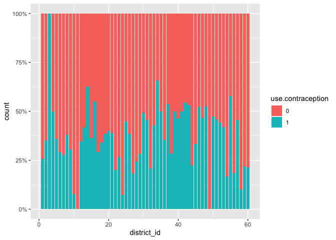
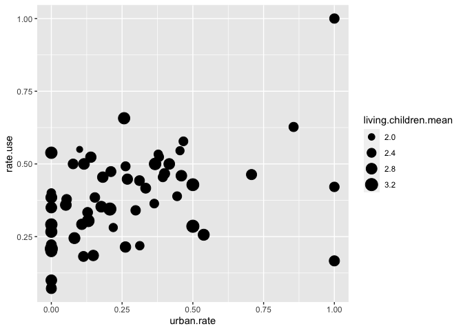
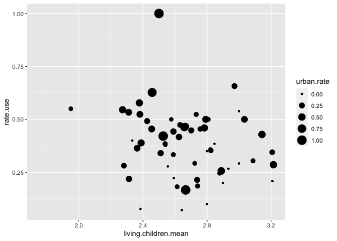
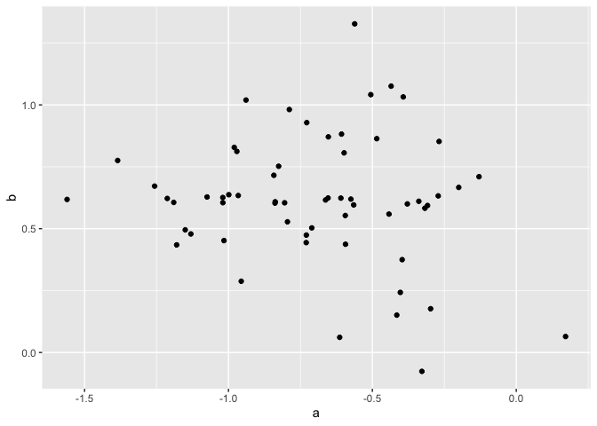
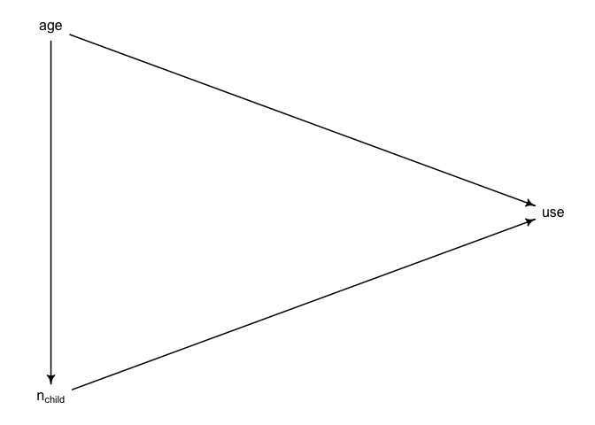

# 14.4. Social relations as correlated varying effects

```r
data(KosterLeckie) # Gift exchange data
?KosterLeckie
kl_dyads
```

```
##     hidA hidB did giftsAB giftsBA offset drel1 drel2 drel3 drel4 dlndist  dass
## 1      1    2   1       0       4  0.000     0     0     1     0  -2.790 0.000
## 2      1    3   2       6      31 -0.003     0     1     0     0  -2.817 0.044
## 3      1    4   3       2       5 -0.019     0     1     0     0  -1.886 0.025
## 4      1    5   4       4       2  0.000     0     1     0     0  -1.892 0.011
## 5      1    6   5       8       2 -0.003     1     0     0     0  -3.499 0.022
## 6      1    7   6       2       1  0.000     0     0     0     0  -1.853 0.071
## 7      1    8   7       1       2  0.000     0     0     0     1  -1.475 0.046
## 8      1    9   8       0       1  0.000     0     0     0     1  -1.644 0.003
## 9      1   10   9      10     110 -0.186     1     0     0     0  -1.897 0.552
## 10     1   11  10       1       0  0.000     0     1     0     0  -2.379 0.018
## 11     1   12  11       0       0 -0.471     0     0     1     0  -2.200 0.004
## 12     1   13  12       0       6 -0.019     0     0     1     0  -2.117 0.004
## 13     1   14  13       1      11 -0.011     0     1     0     0  -2.830 0.036
## 14     1   15  14       6       0 -0.014     0     0     0     0  -2.492 0.006
## 15     1   16  15       0       1 -0.019     0     0     0     0  -1.848 0.014
## 16     1   17  16       0       4 -0.019     0     0     0     1  -2.580 0.000
## 17     1   18  17       0       0 -0.019     0     0     0     0  -2.184 0.025
## 18     1   19  18       0       2  0.000     0     0     0     1  -1.883 0.000
## 19     1   20  19       0       0 -0.028     0     0     1     0  -2.089 0.012
## 20     1   21  20       0       7 -0.031     0     0     0     1  -2.364 0.007
## 21     1   22  21       0       0  0.000     0     0     0     1  -2.538 0.010
## 22     1   23  22       0      13 -0.092     0     1     0     0  -4.068 0.012
## 23     1   24  23       0       0  0.000     0     0     0     0  -1.824 0.000
## 24     1   25  24      16       2 -0.637     0     0     1     0  -1.766 0.080
## 25     2    3  25       1       3 -0.003     0     0     1     0  -2.111 0.007
## 26     2    4  26       2       1 -0.019     0     0     1     0  -1.580 0.013
## 27     2    5  27       0       1  0.000     0     0     1     0  -1.571 0.000
## 28     2    6  28       3       0 -0.003     0     1     0     0  -2.401 0.000
## 29     2    7  29       0       1  0.000     0     0     0     0  -1.609 0.000
## 30     2    8  30      43      10  0.000     1     0     0     0  -1.274 0.252
## 31     2    9  31       5       4  0.000     1     0     0     0  -1.534 0.035
## 32     2   10  32       0       1 -0.186     0     0     0     1  -1.560 0.010
## 33     2   11  33       1       0  0.000     0     0     1     0  -1.877 0.004
## 34     2   12  34       0       0 -0.471     0     0     0     1  -1.779 0.000
## 35     2   13  35       1       2 -0.019     0     0     0     1  -1.711 0.000
## 36     2   14  36       1       0 -0.011     0     0     1     0  -2.277 0.000
## 37     2   15  37       2       0 -0.014     0     0     0     0  -2.074 0.027
## 38     2   16  38       4       2 -0.019     0     0     0     1  -1.567 0.000
## 39     2   17  39      22      16 -0.019     1     0     0     0  -3.434 0.239
## 40     2   18  40       1       1 -0.019     0     0     0     1  -2.198 0.019
## 41     2   19  41       6       9  0.000     1     0     0     0  -1.832 0.093
## 42     2   20  42       0       5 -0.028     0     0     0     1  -1.953 0.000
## 43     2   21  43       1       3 -0.031     0     0     1     0  -2.078 0.011
## 44     2   22  44      14      25  0.000     1     0     0     0  -2.322 0.194
## 45     2   23  45       2       5 -0.092     0     0     1     0  -2.558 0.017
## 46     2   24  46       5       2  0.000     0     0     1     0  -1.692 0.070
## 47     2   25  47       1       0 -0.637     0     0     0     1  -1.464 0.010
## 48     3    4  48      15       0 -0.022     0     1     0     0  -2.252 0.085
## 49     3    5  49      23       2 -0.003     0     1     0     0  -2.307 0.116
## 50     3    6  50      49       4 -0.005     1     0     0     0  -3.442 0.118
## 51     3    7  51       6       0 -0.003     0     0     0     0  -2.056 0.012
## 52     3    8  52       3       0 -0.003     0     0     0     1  -1.678 0.020
## 53     3    9  53       0       0 -0.003     0     0     0     1  -1.675 0.009
## 54     3   10  54       2       8 -0.186     0     0     1     0  -2.384 0.018
## 55     3   11  55      11       1 -0.003     0     1     0     0  -3.321 0.024
## 56     3   12  56       7       0 -0.471     0     0     1     0  -2.814 0.016
## 57     3   13  57       7       2 -0.022     0     0     1     0  -2.763 0.026
## 58     3   14  58      12       2 -0.014     0     1     0     0  -2.798 0.113
## 59     3   15  59      22       4 -0.017     1     0     0     0  -2.635 0.028
## 60     3   16  60       5       1 -0.022     0     0     0     0  -2.150 0.046
## 61     3   17  61      10       5 -0.022     0     0     0     1  -2.024 0.015
## 62     3   18  62       0       0 -0.022     0     0     0     0  -1.958 0.033
## 63     3   19  63       4       0 -0.003     0     0     0     1  -1.797 0.014
## 64     3   20  64       3       1 -0.031     0     0     1     0  -2.023 0.039
## 65     3   21  65       2       1 -0.033     0     0     0     1  -2.348 0.006
## 66     3   22  66       2       1 -0.003     0     0     0     1  -2.304 0.006
## 67     3   23  67      13      26 -0.095     0     1     0     0  -3.107 0.146
## 68     3   24  68       2       0 -0.003     0     0     0     0  -1.840 0.041
## 69     3   25  69       9       0 -0.637     0     0     1     0  -2.178 0.018
## 70     4    5  70       1       8 -0.019     0     1     0     0  -4.035 0.140
## 71     4    6  71      19       4 -0.022     1     0     0     0  -2.099 0.093
## 72     4    7  72       0       1 -0.019     0     0     1     0  -2.926 0.040
## 73     4    8  73       0       0 -0.019     0     0     0     1  -1.473 0.000
## 74     4    9  74       0       1 -0.019     0     0     0     1  -1.999 0.015
## 75     4   10  75       1       8 -0.210     0     0     1     0  -2.968 0.010
## 76     4   11  76       2       0 -0.019     0     1     0     0  -2.637 0.027
## 77     4   12  77       1       3 -0.502     0     0     1     0  -3.089 0.012
## 78     4   13  78       1      11 -0.059     0     0     1     0  -2.896 0.020
## 79     4   14  79       0       6 -0.031     0     1     0     0  -2.252 0.147
## 80     4   15  80       2       2 -0.033     0     0     0     0  -2.453 0.021
## 81     4   16  81       7      17 -0.059     0     0     0     0  -3.942 0.064
## 82     4   17  82       1       3 -0.059     0     0     0     1  -1.594 0.008
## 83     4   18  83       0       1 -0.059     0     0     0     0  -1.813 0.028
## 84     4   19  84       0       2 -0.019     0     0     0     1  -1.866 0.000
## 85     4   20  85       0       2 -0.048     0     0     1     0  -2.070 0.080
## 86     4   21  86       0       5 -0.051     0     0     0     1  -2.273 0.000
## 87     4   22  87       0       2 -0.019     0     0     0     1  -2.033 0.026
## 88     4   23  88       1      13 -0.092     0     1     0     0  -1.947 0.115
## 89     4   24  89       1       0 -0.019     0     0     0     0  -2.108 0.000
## 90     4   25  90       1       1 -0.674     0     1     0     0  -2.857 0.030
## 91     5    6  91      13      17 -0.003     1     0     0     0  -2.113 0.362
## 92     5    7  92       1       3  0.000     0     0     0     0  -2.644 0.000
## 93     5    8  93       0       0  0.000     0     0     0     1  -1.551 0.000
## 94     5    9  94       0       2  0.000     0     0     0     1  -1.879 0.000
## 95     5   10  95       2      17 -0.186     0     0     1     0  -3.386 0.000
## 96     5   11  96       1       3  0.000     0     1     0     0  -2.749 0.044
## 97     5   12  97       1       5 -0.471     0     0     1     0  -3.210 0.058
## 98     5   13  98       2      19 -0.019     0     0     1     0  -3.156 0.068
## 99     5   14  99       1       2 -0.011     0     1     0     0  -2.209 0.000
## 100    5   15 100       4       2 -0.014     0     0     0     0  -2.371 0.036
## 101    5   16 101       3       7 -0.019     0     0     0     0  -3.296 0.000
## 102    5   17 102       1       3 -0.019     0     0     0     1  -1.572 0.016
## 103    5   18 103       0       0 -0.019     0     0     0     0  -1.748 0.000
## 104    5   19 104       1       1  0.000     0     0     0     1  -1.776 0.000
## 105    5   20 105       3       3 -0.028     0     0     1     0  -1.970 0.017
## 106    5   21 106       1       3 -0.031     0     0     0     1  -2.178 0.000
## 107    5   22 107       1       5  0.000     0     0     0     1  -1.970 0.000
## 108    5   23 108       0      11 -0.092     0     1     0     0  -1.965 0.034
## 109    5   24 109       0       1  0.000     0     0     0     0  -1.982 0.000
## 110    5   25 110       3       1 -0.637     0     0     1     0  -3.201 0.098
## 111    6    7 111       0       2 -0.003     0     0     0     0  -2.018 0.009
## 112    6    8 112       0       0 -0.003     0     0     1     0  -1.544 0.031
## 113    6    9 113       0       0 -0.003     0     0     1     0  -1.718 0.000
## 114    6   10 114       0      29 -0.186     0     0     1     0  -2.121 0.027
## 115    6   11 115       3       4 -0.003     1     0     0     0  -2.771 0.033
## 116    6   12 116       0       1 -0.475     0     0     1     0  -2.517 0.028
## 117    6   13 117       0       9 -0.019     0     0     1     0  -2.404 0.000
## 118    6   14 118       5      25 -0.011     1     0     0     0  -3.139 0.092
## 119    6   15 119       0       2 -0.017     0     0     0     0  -2.763 0.000
## 120    6   16 120       0       2 -0.019     0     0     0     1  -2.041 0.007
## 121    6   17 121       0       6 -0.019     0     0     1     0  -2.301 0.000
## 122    6   18 122       0       0 -0.019     0     0     0     1  -2.153 0.012
## 123    6   19 123       0       2 -0.003     0     0     1     0  -1.913 0.010
## 124    6   20 124       0       1 -0.031     0     0     1     0  -2.156 0.000
## 125    6   21 125       0       6 -0.031     0     0     1     0  -2.510 0.002
## 126    6   22 126       1       0 -0.003     0     0     1     0  -2.569 0.005
## 127    6   23 127       4      50 -0.092     1     0     0     0  -3.882 0.099
## 128    6   24 128       0       0 -0.003     0     0     0     1  -1.906 0.016
## 129    6   25 129       2       1 -0.637     0     0     1     0  -1.959 0.033
## 130    7    8 130       0       1  0.000     0     0     0     0  -1.276 0.037
## 131    7    9 131       0       5  0.000     0     0     0     0  -2.503 0.024
## 132    7   10 132       0       4 -0.186     0     0     0     0  -2.264 0.000
## 133    7   11 133       3       2  0.000     0     0     0     0  -2.265 0.022
## 134    7   12 134       0       2 -0.471     0     0     0     0  -2.525 0.123
## 135    7   13 135       3       6 -0.019     0     0     0     0  -2.309 0.000
## 136    7   14 136       2       1 -0.011     0     0     0     0  -2.310 0.015
## 137    7   15 137       3       4 -0.014     0     0     0     0  -2.588 0.065
## 138    7   16 138       8       4 -0.019     0     0     0     0  -3.330 0.101
## 139    7   17 139       2       4 -0.019     0     0     0     0  -1.667 0.000
## 140    7   18 140       0       1 -0.019     0     0     0     1  -2.041 0.149
## 141    7   19 141       0       0  0.000     0     0     0     0  -2.216 0.000
## 142    7   20 142       0       8 -0.028     0     0     0     0  -2.445 0.070
## 143    7   21 143       0      18 -0.031     0     0     0     0  -2.552 0.074
## 144    7   22 144       0       1  0.000     0     0     0     0  -2.221 0.035
## 145    7   23 145       0       7 -0.092     0     0     0     0  -1.875 0.028
## 146    7   24 146       4       4  0.000     0     0     0     0  -2.651 0.094
## 147    7   25 147       2       2 -0.637     0     0     0     0  -2.199 0.032
## 148    8    9 148       2       5  0.000     0     1     0     0  -1.031 0.070
## 149    8   10 149       0       4 -0.186     0     0     0     0  -1.723 0.000
## 150    8   11 150       2       0  0.000     0     0     1     0  -1.686 0.000
## 151    8   12 151       2       0 -0.471     0     0     0     0  -1.600 0.000
## 152    8   13 152       1       3 -0.019     0     0     0     0  -1.714 0.000
## 153    8   14 153       2       8 -0.011     0     0     0     1  -1.397 0.051
## 154    8   15 154       1       0 -0.014     0     0     0     0  -1.374 0.013
## 155    8   16 155       2       2 -0.019     0     0     0     0  -1.392 0.000
## 156    8   17 156       2      16 -0.019     0     1     0     0  -1.194 0.139
## 157    8   18 157       0       2 -0.019     0     0     0     0  -1.115 0.000
## 158    8   19 158       1      10  0.000     0     1     0     0  -1.051 0.130
## 159    8   20 159       0      11 -0.028     0     0     0     0  -1.154 0.000
## 160    8   21 160       0       4 -0.031     0     0     0     1  -1.277 0.039
## 161    8   22 161       4       6  0.000     0     1     0     0  -1.250 0.060
## 162    8   23 162       0       7 -0.092     0     0     0     1  -1.550 0.000
## 163    8   24 163       1       2  0.000     0     0     1     0  -1.098 0.000
## 164    8   25 164       0       2 -0.637     0     0     0     1  -1.708 0.111
## 165    9   10 165       0       0 -0.186     0     0     0     0  -1.687 0.000
## 166    9   11 166       0       0  0.000     0     0     0     1  -1.750 0.003
## 167    9   12 167       1       0 -0.471     0     0     0     0  -1.867 0.000
## 168    9   13 168       0       3 -0.019     0     0     0     0  -1.734 0.000
## 169    9   14 169       1       1 -0.011     0     0     0     1  -1.991 0.006
## 170    9   15 170       9       0 -0.014     0     0     0     0  -2.144 0.011
## 171    9   16 171      10       3 -0.019     0     0     0     0  -2.143 0.006
## 172    9   17 172      11       8 -0.019     0     1     0     0  -1.644 0.091
## 173    9   18 173       4       2 -0.019     0     0     0     0  -2.191 0.023
## 174    9   19 174       9       3  0.000     0     1     0     0  -2.729 0.066
## 175    9   20 175       3      23 -0.028     0     0     1     0  -2.607 0.112
## 176    9   21 176       3      15 -0.031     0     0     0     1  -2.309 0.013
## 177    9   22 177       1       3  0.000     0     1     0     0  -2.129 0.009
## 178    9   23 178       1       2 -0.092     0     0     0     1  -1.625 0.021
## 179    9   24 179      75      26  0.000     1     0     0     0  -3.440 0.477
## 180    9   25 180       0       0 -0.637     0     0     0     1  -1.646 0.006
## 181   10   11 181      16       1 -0.186     0     0     1     0  -2.859 0.028
## 182   10   12 182      15       0 -0.627     0     0     0     1  -3.078 0.000
## 183   10   13 183      11      10 -0.210     0     0     1     0  -3.522 0.021
## 184   10   14 184      13       3 -0.210     0     0     1     0  -2.113 0.023
## 185   10   15 185      16       1 -0.186     0     0     0     0  -2.205 0.000
## 186   10   16 186      16       2 -0.186     0     0     0     0  -2.648 0.000
## 187   10   17 187       9       3 -0.210     0     0     0     0  -1.537 0.000
## 188   10   18 188       2       0 -0.210     0     0     0     0  -1.639 0.000
## 189   10   19 189       4       0 -0.186     0     0     0     0  -1.630 0.000
## 190   10   20 190       3       0 -0.186     0     0     0     1  -1.807 0.011
## 191   10   21 191       6       5 -0.223     0     0     0     0  -2.012 0.000
## 192   10   22 192       6       1 -0.186     0     0     0     0  -1.858 0.000
## 193   10   23 193       4       3 -0.254     0     0     1     0  -1.992 0.000
## 194   10   24 194       2       0 -0.186     0     0     0     0  -1.784 0.029
## 195   10   25 195      48       7 -0.863     0     0     0     1  -3.859 0.271
## 196   11   12 196      22      36 -0.471     1     0     0     0  -3.638 0.454
## 197   11   13 197       6      92 -0.019     1     0     0     0  -3.583 0.180
## 198   11   14 198       2      10 -0.011     0     1     0     0  -2.642 0.020
## 199   11   15 199       1       1 -0.014     0     0     0     0  -2.667 0.015
## 200   11   16 200       1       3 -0.019     0     0     0     0  -2.461 0.000
## 201   11   17 201       0       2 -0.019     0     0     0     1  -1.835 0.000
## 202   11   18 202       0       0 -0.019     0     0     0     0  -1.889 0.000
## 203   11   19 203       0       1  0.000     0     0     0     1  -1.801 0.000
## 204   11   20 204       0       2 -0.028     0     0     1     0  -2.031 0.052
## 205   11   21 205       0       6 -0.031     0     0     0     1  -2.348 0.008
## 206   11   22 206       0       0  0.000     0     0     0     1  -2.206 0.027
## 207   11   23 207       0      13 -0.092     0     1     0     0  -2.533 0.028
## 208   11   24 208       0       4  0.000     0     0     0     0  -1.906 0.000
## 209   11   25 209       1       0 -0.637     0     0     1     0  -2.546 0.016
## 210   12   13 210       6      48 -0.502     0     0     1     0  -3.758 0.209
## 211   12   14 211       3       0 -0.488     0     0     1     0  -2.588 0.039
## 212   12   15 212       1       0 -0.471     0     0     0     0  -2.739 0.006
## 213   12   16 213       0       2 -0.502     0     0     0     0  -2.828 0.007
## 214   12   17 214       0       0 -0.471     0     0     0     0  -1.767 0.000
## 215   12   18 215       0       0 -0.502     0     0     0     0  -1.905 0.000
## 216   12   19 216       0       1 -0.471     0     0     0     0  -1.866 0.000
## 217   12   20 217       0       1 -0.471     0     0     0     1  -2.106 0.019
## 218   12   21 218       1       6 -0.520     0     0     0     0  -2.419 0.005
## 219   12   22 219       0       0 -0.471     0     0     0     0  -2.207 0.015
## 220   12   23 220       0       5 -0.553     0     0     1     0  -2.305 0.006
## 221   12   24 221       0       1 -0.471     0     0     0     0  -2.023 0.000
## 222   12   25 222       1       0 -1.236     0     0     0     1  -2.729 0.000
## 223   13   14 223      51      27 -0.019     0     1     0     0  -2.364 0.228
## 224   13   15 224       5       1 -0.033     0     0     0     0  -2.447 0.000
## 225   13   16 225       8       1 -0.039     0     0     0     0  -2.620 0.000
## 226   13   17 226       0       0 -0.039     0     0     0     0  -1.680 0.000
## 227   13   18 227       0       0 -0.039     0     0     0     0  -1.768 0.000
## 228   13   19 228       2       0 -0.019     0     0     0     0  -1.726 0.173
## 229   13   20 229      10      10 -0.048     0     0     0     1  -1.931 0.036
## 230   13   21 230       2       0 -0.051     0     0     0     0  -2.193 0.034
## 231   13   22 231       0       0 -0.019     0     0     0     0  -2.033 0.000
## 232   13   23 232       2       2 -0.113     0     0     1     0  -2.234 0.000
## 233   13   24 233       1       2 -0.019     0     0     0     0  -1.863 0.000
## 234   13   25 234      11       0 -0.637     0     0     0     1  -2.984 0.000
## 235   14   15 235       6       2 -0.025     0     0     0     0  -3.723 0.015
## 236   14   16 236       0       2 -0.031     0     0     0     0  -2.243 0.012
## 237   14   17 237       5       7 -0.031     0     0     0     1  -2.323 0.036
## 238   14   18 238       0       2 -0.031     0     0     0     0  -2.508 0.000
## 239   14   19 239       2       3 -0.011     0     0     0     1  -2.246 0.000
## 240   14   20 240       2      12 -0.039     0     0     1     0  -2.616 0.058
## 241   14   21 241       2      13 -0.042     0     0     0     1  -3.272 0.004
## 242   14   22 242       0       1 -0.011     0     0     0     1  -3.224 0.008
## 243   14   23 243       1      10 -0.104     0     1     0     0  -2.808 0.067
## 244   14   24 244       1       1 -0.011     0     0     0     0  -2.249 0.000
## 245   14   25 245       0       0 -0.637     0     0     1     0  -1.963 0.033
## 246   15   16 246      11      35 -0.033     1     0     0     0  -2.472 0.464
## 247   15   17 247       0       7 -0.033     0     0     0     0  -2.135 0.059
## 248   15   18 248       0       2 -0.033     0     0     0     1  -2.475 0.010
## 249   15   19 249       1       1 -0.014     0     0     0     1  -2.339 0.000
## 250   15   20 250       1      13 -0.031     0     1     0     0  -2.775 0.048
## 251   15   21 251       2      39 -0.045     0     0     0     1  -3.647 0.052
## 252   15   22 252       2       8 -0.014     0     0     0     0  -3.073 0.059
## 253   15   23 253       0       3 -0.107     0     0     0     0  -2.500 0.010
## 254   15   24 254       0       3 -0.014     0     0     0     0  -2.437 0.013
## 255   15   25 255       0       2 -0.637     0     0     0     0  -2.055 0.044
## 256   16   17 256       2       3 -0.039     0     0     0     0  -1.596 0.074
## 257   16   18 257       1       3 -0.039     0     0     1     0  -1.863 0.000
## 258   16   19 258       3       7 -0.019     0     0     1     0  -1.955 0.000
## 259   16   20 259       2       8 -0.048     0     0     1     0  -2.160 0.055
## 260   16   21 260       2      39 -0.051     0     0     1     0  -2.334 0.049
## 261   16   22 261       0       7 -0.019     0     0     0     0  -2.067 0.055
## 262   16   23 262       1       9 -0.113     0     0     0     0  -1.895 0.044
## 263   16   24 263       0       2 -0.019     0     0     0     0  -2.248 0.000
## 264   16   25 264       2       1 -0.637     0     0     0     1  -2.582 0.000
## 265   17   18 265       4       2 -0.039     0     0     0     0  -2.477 0.056
## 266   17   19 266       8      10 -0.019     0     1     0     0  -2.010 0.016
## 267   17   20 267       4      16 -0.048     0     0     0     0  -2.117 0.018
## 268   17   21 268       3       9 -0.051     0     0     0     1  -2.196 0.007
## 269   17   22 269       8      19 -0.019     0     1     0     0  -2.511 0.145
## 270   17   23 270       1       3 -0.113     0     0     0     1  -2.376 0.000
## 271   17   24 271       5       5 -0.019     0     0     1     0  -1.816 0.082
## 272   17   25 272       3       0 -0.674     0     0     0     1  -1.446 0.000
## 273   18   19 273       3       1 -0.019     0     0     0     1  -2.996 0.035
## 274   18   20 274       2       1 -0.048     0     0     0     0  -3.101 0.000
## 275   18   21 275      15      62 -0.042     1     0     0     0  -2.797 0.447
## 276   18   22 276       1       1 -0.019     0     0     1     0  -3.180 0.065
## 277   18   23 277       0       1 -0.113     0     0     0     0  -2.085 0.000
## 278   18   24 278       4       3 -0.019     0     0     0     0  -2.482 0.053
## 279   18   25 279       1       0 -0.674     0     0     0     1  -1.555 0.045
## 280   19   20 280       1      15 -0.028     0     0     0     0  -3.380 0.082
## 281   19   21 281       5      17 -0.031     0     0     0     1  -2.649 0.140
## 282   19   22 282      10      15  0.000     0     1     0     0  -2.615 0.109
## 283   19   23 283       0       3 -0.092     0     0     0     1  -1.829 0.131
## 284   19   24 284       2       1  0.000     0     0     1     0  -3.127 0.000
## 285   19   25 285       3       2 -0.637     0     0     0     1  -1.563 0.000
## 286   20   21 286       9      12 -0.059     0     0     0     0  -3.302 0.015
## 287   20   22 287       3       2 -0.028     0     0     0     0  -3.079 0.053
## 288   20   23 288       3       8 -0.122     0     1     0     0  -2.038 0.119
## 289   20   24 289      13       3 -0.028     0     0     0     1  -3.161 0.074
## 290   20   25 290       0       0 -0.637     0     0     0     1  -1.721 0.032
## 291   21   22 291      18       5 -0.031     0     0     0     1  -3.486 0.019
## 292   21   23 292       9       1 -0.125     0     0     0     1  -2.326 0.015
## 293   21   24 293       0       0 -0.031     0     0     0     0  -2.690 0.010
## 294   21   25 294       9       1 -0.696     0     0     1     0  -1.895 0.043
## 295   22   23 295       1       1 -0.092     0     0     0     1  -2.434 0.076
## 296   22   24 296       0       1  0.000     0     0     1     0  -2.442 0.000
## 297   22   25 297       2       0 -0.637     0     0     0     1  -1.747 0.026
## 298   23   24 298       2       0 -0.092     0     0     0     0  -1.798 0.000
## 299   23   25 299       4       0 -0.818     0     0     1     0  -1.848 0.031
## 300   24   25 300       2       0 -0.637     0     0     0     0  -1.723 0.042
##     d0125
## 1       0
## 2       0
## 3       0
## 4       0
## 5       0
## 6       0
## 7       0
## 8       0
## 9       0
## 10      0
## 11      0
## 12      0
## 13      0
## 14      0
## 15      0
## 16      0
## 17      0
## 18      0
## 19      0
## 20      0
## 21      0
## 22      0
## 23      0
## 24      1
## 25      0
## 26      0
## 27      0
## 28      0
## 29      0
## 30      0
## 31      0
## 32      0
## 33      0
## 34      0
## 35      0
## 36      0
## 37      0
## 38      0
## 39      0
## 40      0
## 41      0
## 42      0
## 43      0
## 44      0
## 45      0
## 46      0
## 47      0
## 48      0
## 49      0
## 50      0
## 51      0
## 52      0
## 53      0
## 54      0
## 55      0
## 56      0
## 57      0
## 58      0
## 59      0
## 60      0
## 61      0
## 62      0
## 63      0
## 64      0
## 65      0
## 66      0
## 67      0
## 68      0
## 69      0
## 70      0
## 71      0
## 72      0
## 73      0
## 74      0
## 75      0
## 76      0
## 77      0
## 78      0
## 79      0
## 80      0
## 81      0
## 82      0
## 83      0
## 84      0
## 85      0
## 86      0
## 87      0
## 88      0
## 89      0
## 90      0
## 91      0
## 92      0
## 93      0
## 94      0
## 95      0
## 96      0
## 97      0
## 98      0
## 99      0
## 100     0
## 101     0
## 102     0
## 103     0
## 104     0
## 105     0
## 106     0
## 107     0
## 108     0
## 109     0
## 110     0
## 111     0
## 112     0
## 113     0
## 114     0
## 115     0
## 116     0
## 117     0
## 118     0
## 119     0
## 120     0
## 121     0
## 122     0
## 123     0
## 124     0
## 125     0
## 126     0
## 127     0
## 128     0
## 129     0
## 130     0
## 131     0
## 132     0
## 133     0
## 134     0
## 135     0
## 136     0
## 137     0
## 138     0
## 139     0
## 140     0
## 141     0
## 142     0
## 143     0
## 144     0
## 145     0
## 146     0
## 147     0
## 148     0
## 149     0
## 150     0
## 151     0
## 152     0
## 153     0
## 154     0
## 155     0
## 156     0
## 157     0
## 158     0
## 159     0
## 160     0
## 161     0
## 162     0
## 163     0
## 164     0
## 165     0
## 166     0
## 167     0
## 168     0
## 169     0
## 170     0
## 171     0
## 172     0
## 173     0
## 174     0
## 175     0
## 176     0
## 177     0
## 178     0
## 179     0
## 180     0
## 181     0
## 182     0
## 183     0
## 184     0
## 185     0
## 186     0
## 187     0
## 188     0
## 189     0
## 190     0
## 191     0
## 192     0
## 193     0
## 194     0
## 195     0
## 196     0
## 197     0
## 198     0
## 199     0
## 200     0
## 201     0
## 202     0
## 203     0
## 204     0
## 205     0
## 206     0
## 207     0
## 208     0
## 209     0
## 210     0
## 211     0
## 212     0
## 213     0
## 214     0
## 215     0
## 216     0
## 217     0
## 218     0
## 219     0
## 220     0
## 221     0
## 222     0
## 223     0
## 224     0
## 225     0
## 226     0
## 227     0
## 228     0
## 229     0
## 230     0
## 231     0
## 232     0
## 233     0
## 234     0
## 235     0
## 236     0
## 237     0
## 238     0
## 239     0
## 240     0
## 241     0
## 242     0
## 243     0
## 244     0
## 245     0
## 246     0
## 247     0
## 248     0
## 249     0
## 250     0
## 251     0
## 252     0
## 253     0
## 254     0
## 255     0
## 256     0
## 257     0
## 258     0
## 259     0
## 260     0
## 261     0
## 262     0
## 263     0
## 264     0
## 265     0
## 266     0
## 267     0
## 268     0
## 269     0
## 270     0
## 271     0
## 272     0
## 273     0
## 274     0
## 275     0
## 276     0
## 277     0
## 278     0
## 279     0
## 280     0
## 281     0
## 282     0
## 283     0
## 284     0
## 285     0
## 286     0
## 287     0
## 288     0
## 289     0
## 290     0
## 291     0
## 292     0
## 293     0
## 294     0
## 295     0
## 296     0
## 297     0
## 298     0
## 299     0
## 300     0
```

```r
kl_households
```

```
##    hid hgame hfish hpigs hwealth hpastor
## 1    1  0.05  0.06  0.00  14.162       0
## 2    2  0.25  0.17  1.75  27.405       0
## 3    3  2.29  0.66  5.75   9.900       0
## 4    4  0.04  0.43  1.50   7.267       0
## 5    5  0.07  0.12  1.25   9.982       0
## 6    6  0.03  0.20  2.50  16.186       0
## 7    7  0.27  0.74  3.00   8.068       0
## 8    8  0.04  0.16  2.00  17.437       0
## 9    9  0.39  0.30  5.75  16.931       0
## 10  10  6.09  0.04  0.00  17.421       0
## 11  11  0.05  0.27  3.00  12.353       0
## 12  12  0.11  0.52  1.00   8.000       0
## 13  13  2.21  0.34  3.50   9.272       0
## 14  14  0.27  0.36  5.75  20.627       1
## 15  15  0.07  0.04  2.25  14.173       0
## 16  16  0.03  0.19  5.25   7.596       0
## 17  17  0.28  0.31  7.75  19.222       1
## 18  18  0.10  0.10  9.50  23.677       0
## 19  19  0.01  0.03  3.75  15.907       0
## 20  20  0.87  0.45  5.75   8.707       0
## 21  21  3.52  0.17  4.75  16.088       0
## 22  22  0.76  0.06  0.50  24.104       0
## 23  23  1.88  0.32  7.67  26.974       0
## 24  24  0.02  0.03  5.00  20.494       0
## 25  25  0.01  0.21  0.50   9.897       0
```


```r
kl_data <- list(
    N = nrow(kl_dyads),
    N_households = max(kl_dyads$hidB),
    did = kl_dyads$did,
    hidA = kl_dyads$hidA,
    hidB = kl_dyads$hidB,
    giftsAB = kl_dyads$giftsAB,
    giftsBA = kl_dyads$giftsBA
)
m14.4 <- ulam(
    alist(
        giftsAB ~ poisson( lambdaAB ),
        giftsBA ~ poisson( lambdaBA ),
        log(lambdaAB) <- a + gr[hidA,1] + gr[hidB,2] + d[did,1] ,
        log(lambdaBA) <- a + gr[hidB,1] + gr[hidA,2] + d[did,2] ,
        a ~ normal(0,1),
       ## gr matrix of varying effects
       vector[2]:gr[N_households] ~ multi_normal(0,Rho_gr,sigma_gr),
    Rho_gr ~ lkj_corr(4),
    sigma_gr ~ exponential(1),
   ## dyad effects
    transpars> matrix[N,2]:d <-
            compose_noncentered( rep_vector(sigma_d,2) , L_Rho_d , z ),
    matrix[2,N]:z ~ normal( 0 , 1 ),
    cholesky_factor_corr[2]:L_Rho_d ~ lkj_corr_cholesky( 8 ),
    sigma_d ~ exponential(1),
   ## compute correlation matrix for dyads
    gq> matrix[2,2]:Rho_d <<- Chol_to_Corr( L_Rho_d )
), data=kl_data , chains=4 , cores=4 , iter=2000 )
```

```
## Trying to compile a simple C file
```

```
## Running /Library/Frameworks/R.framework/Resources/bin/R CMD SHLIB foo.c
## clang -I"/Library/Frameworks/R.framework/Resources/include" -DNDEBUG   -I"/Library/Frameworks/R.framework/Versions/3.6/Resources/library/Rcpp/include/"  -I"/Library/Frameworks/R.framework/Versions/3.6/Resources/library/RcppEigen/include/"  -I"/Library/Frameworks/R.framework/Versions/3.6/Resources/library/RcppEigen/include/unsupported"  -I"/Library/Frameworks/R.framework/Versions/3.6/Resources/library/BH/include" -I"/Library/Frameworks/R.framework/Versions/3.6/Resources/library/StanHeaders/include/src/"  -I"/Library/Frameworks/R.framework/Versions/3.6/Resources/library/StanHeaders/include/"  -I"/Library/Frameworks/R.framework/Versions/3.6/Resources/library/RcppParallel/include/"  -I"/Library/Frameworks/R.framework/Versions/3.6/Resources/library/rstan/include" -DEIGEN_NO_DEBUG  -DBOOST_DISABLE_ASSERTS  -DBOOST_PENDING_INTEGER_LOG2_HPP  -DSTAN_THREADS  -include stan/math/prim/mat/fun/Eigen.hpp  -D_REENTRANT  "-isystem /Library/Developer/CommandLineTools/SDKs/MacOSX.sdk/usr/include"  -fPIC  -isysroot /Library/Developer/CommandLineTools/SDKs/MacOSX.sdk -c foo.c -o foo.o
## In file included from <built-in>:1:
## In file included from /Library/Frameworks/R.framework/Versions/3.6/Resources/library/StanHeaders/include/stan/math/prim/mat/fun/Eigen.hpp:13:
## In file included from /Library/Frameworks/R.framework/Versions/3.6/Resources/library/RcppEigen/include/Eigen/Dense:1:
## In file included from /Library/Frameworks/R.framework/Versions/3.6/Resources/library/RcppEigen/include/Eigen/Core:88:
## /Library/Frameworks/R.framework/Versions/3.6/Resources/library/RcppEigen/include/Eigen/src/Core/util/Macros.h:613:1: error: unknown type name 'namespace'
## namespace Eigen {
## ^
## /Library/Frameworks/R.framework/Versions/3.6/Resources/library/RcppEigen/include/Eigen/src/Core/util/Macros.h:613:16: error: expected ';' after top level declarator
## namespace Eigen {
##                ^
##                ;
## In file included from <built-in>:1:
## In file included from /Library/Frameworks/R.framework/Versions/3.6/Resources/library/StanHeaders/include/stan/math/prim/mat/fun/Eigen.hpp:13:
## In file included from /Library/Frameworks/R.framework/Versions/3.6/Resources/library/RcppEigen/include/Eigen/Dense:1:
## /Library/Frameworks/R.framework/Versions/3.6/Resources/library/RcppEigen/include/Eigen/Core:96:10: fatal error: 'complex' file not found
## #include <complex>
##          ^~~~~~~~~
## 3 errors generated.
## make: *** [foo.o] Error 1
```

```
## Warning: The largest R-hat is NA, indicating chains have not mixed.
## Running the chains for more iterations may help. See
## http://mc-stan.org/misc/warnings.html#r-hat
```

```
## Warning: Bulk Effective Samples Size (ESS) is too low, indicating posterior means and medians may be unreliable.
## Running the chains for more iterations may help. See
## http://mc-stan.org/misc/warnings.html#bulk-ess
```

```
## Warning: Tail Effective Samples Size (ESS) is too low, indicating posterior variances and tail quantiles may be unreliable.
## Running the chains for more iterations may help. See
## http://mc-stan.org/misc/warnings.html#tail-ess
```

# HW (April 3, 2020). PDF3


```r
data(bangladesh) # Contraceptive use data from 1934 Bangladeshi women.
```


```r
d <- bangladesh # right?
 sort(unique(d$district))
```

```
##  [1]  1  2  3  4  5  6  7  8  9 10 11 12 13 14 15 16 17 18 19 20 21 22 23 24 25
## [26] 26 27 28 29 30 31 32 33 34 35 36 37 38 39 40 41 42 43 44 45 46 47 48 49 50
## [51] 51 52 53 55 56 57 58 59 60 61
```
* District 54 is absent. So district isn’t yet a good index variable, because it’s not contiguous. 

* indexing district

```r
 d$district_id <- as.integer(as.factor(d$district))
sort(unique(d$district_id))
```

```
##  [1]  1  2  3  4  5  6  7  8  9 10 11 12 13 14 15 16 17 18 19 20 21 22 23 24 25
## [26] 26 27 28 29 30 31 32 33 34 35 36 37 38 39 40 41 42 43 44 45 46 47 48 49 50
## [51] 51 52 53 54 55 56 57 58 59 60
```
* Now there are 60 values, contiguous integers 1 to 60. (from book)

Revisit 13H1 using the data.
* predicting use.contraception
* raw data analysis

```r
# check raw data
d <- d %>% mutate(use.contraception =as.character(use.contraception))
d  %>% ggplot(aes(x=district_id,fill=use.contraception)) + geom_bar(position="fill") + scale_y_continuous(labels = scales::percent)
```

<!-- -->

```r
# 
d.summary1 <- d %>% group_by(district_id) %>% summarise(num.all=n())

d.summary2 <- d %>% group_by(district_id) %>% count(use.contraception) %>% filter(use.contraception==1) %>% rename(num.use=n)
d.summary <- d.summary1 %>% left_join(d.summary2,by="district_id") 
d.summary %>% View
d %>% filter(district_id %in% c(11,49)) # zero
```

```
##    woman district use.contraception living.children age.centered urban
## 1    365       11                 0               1      -9.5599     0
## 2    366       11                 0               1      -8.5599     0
## 3    367       11                 0               2      -5.5599     0
## 4    368       11                 0               2      18.4400     0
## 5    369       11                 0               1      -8.5599     0
## 6    370       11                 0               1      -9.5599     0
## 7    371       11                 0               1     -12.5590     0
## 8    372       11                 0               1       3.4400     0
## 9    373       11                 0               1      -8.5599     0
## 10   374       11                 0               4      19.4400     0
## 11   375       11                 0               1      -3.5599     0
## 12   376       11                 0               2      -5.5599     0
## 13   377       11                 0               2       2.4400     0
## 14   378       11                 0               2       0.4400     0
## 15   379       11                 0               1     -11.5590     0
## 16   380       11                 0               3      -2.5599     0
## 17   381       11                 0               4       2.4400     0
## 18   382       11                 0               2      -8.5599     0
## 19   383       11                 0               1      -8.5599     0
## 20   384       11                 0               1      -6.5600     0
## 21   385       11                 0               4      18.4400     0
## 22  1600       49                 0               1     -12.5590     0
## 23  1601       49                 0               1      -9.5599     0
## 24  1602       49                 0               1     -10.5590     0
## 25  1603       49                 0               4       2.4400     0
##    district_id
## 1           11
## 2           11
## 3           11
## 4           11
## 5           11
## 6           11
## 7           11
## 8           11
## 9           11
## 10          11
## 11          11
## 12          11
## 13          11
## 14          11
## 15          11
## 16          11
## 17          11
## 18          11
## 19          11
## 20          11
## 21          11
## 22          49
## 23          49
## 24          49
## 25          49
```

```r
d.summary$use.contraception[is.na(d.summary$use.contraception)] <- 0
d.summary$use.contraception[is.na(d.summary$num.use)] <- 0
# calculate rate use
d.summary <- d.summary %>% mutate(rate.use = num.use/num.all)
# add living children
d.summary3 <- d %>% group_by(district_id) %>% summarize(living.children.mean=mean(living.children))
# urban rate
d.summary4 <- d %>% group_by(district_id) %>% count(urban) %>% spread(key="urban",value="n") %>% mutate(urban=replace_na(`1`,0))
# combine all
d.summary <- d.summary %>% left_join(d.summary3, by="district_id") %>% left_join(d.summary4 %>% dplyr::select(district_id,urban), by="district_id") %>% dplyr::select(district_id, num.all,num.use,rate.use,living.children.mean,urban) %>% mutate(urban.rate=urban/num.all)
# plot
d.summary %>% ggplot(aes(x=urban.rate,y=rate.use)) +geom_point(aes(size=living.children.mean))
```

```
## Warning: Removed 2 rows containing missing values (geom_point).
```

<!-- -->

```r
d.summary %>% ggplot(aes(x=living.children.mean,y=rate.use)) +geom_point(aes(size=urban.rate))
```

```
## Warning: Removed 2 rows containing missing values (geom_point).
```

<!-- -->

# model1

```r
d1 <- with(d, 
          list(use=as.integer(use.contraception), d_id=district_id, urban=urban))
str(d1)
```

```
## List of 3
##  $ use  : int [1:1934] 0 0 0 0 0 0 0 0 0 0 ...
##  $ d_id : int [1:1934] 1 1 1 1 1 1 1 1 1 1 ...
##  $ urban: int [1:1934] 1 1 1 1 1 1 1 1 1 1 ...
```

```r
m.Bangladish1 <- ulam(
    alist(
        use ~ dbinom(1, p),
  logit(p) <- a[d_id] + b[d_id]*urban,
  a[d_id] ~ dnorm(a_bar,sigma_a),
  b[d_id] ~ dnorm(b_bar,sigma_b),
  a_bar ~ dnorm(0,1),
  b_bar ~ dnorm(0,1),
  c(sigma_a, sigma_b) ~ dexp(1)), data=d1 , chains=4 , cores=2 , iter=1000 )
```

```
## Trying to compile a simple C file
```

```
## Running /Library/Frameworks/R.framework/Resources/bin/R CMD SHLIB foo.c
## clang -I"/Library/Frameworks/R.framework/Resources/include" -DNDEBUG   -I"/Library/Frameworks/R.framework/Versions/3.6/Resources/library/Rcpp/include/"  -I"/Library/Frameworks/R.framework/Versions/3.6/Resources/library/RcppEigen/include/"  -I"/Library/Frameworks/R.framework/Versions/3.6/Resources/library/RcppEigen/include/unsupported"  -I"/Library/Frameworks/R.framework/Versions/3.6/Resources/library/BH/include" -I"/Library/Frameworks/R.framework/Versions/3.6/Resources/library/StanHeaders/include/src/"  -I"/Library/Frameworks/R.framework/Versions/3.6/Resources/library/StanHeaders/include/"  -I"/Library/Frameworks/R.framework/Versions/3.6/Resources/library/RcppParallel/include/"  -I"/Library/Frameworks/R.framework/Versions/3.6/Resources/library/rstan/include" -DEIGEN_NO_DEBUG  -DBOOST_DISABLE_ASSERTS  -DBOOST_PENDING_INTEGER_LOG2_HPP  -DSTAN_THREADS  -include stan/math/prim/mat/fun/Eigen.hpp  -D_REENTRANT  "-isystem /Library/Developer/CommandLineTools/SDKs/MacOSX.sdk/usr/include"  -fPIC  -isysroot /Library/Developer/CommandLineTools/SDKs/MacOSX.sdk -c foo.c -o foo.o
## In file included from <built-in>:1:
## In file included from /Library/Frameworks/R.framework/Versions/3.6/Resources/library/StanHeaders/include/stan/math/prim/mat/fun/Eigen.hpp:13:
## In file included from /Library/Frameworks/R.framework/Versions/3.6/Resources/library/RcppEigen/include/Eigen/Dense:1:
## In file included from /Library/Frameworks/R.framework/Versions/3.6/Resources/library/RcppEigen/include/Eigen/Core:88:
## /Library/Frameworks/R.framework/Versions/3.6/Resources/library/RcppEigen/include/Eigen/src/Core/util/Macros.h:613:1: error: unknown type name 'namespace'
## namespace Eigen {
## ^
## /Library/Frameworks/R.framework/Versions/3.6/Resources/library/RcppEigen/include/Eigen/src/Core/util/Macros.h:613:16: error: expected ';' after top level declarator
## namespace Eigen {
##                ^
##                ;
## In file included from <built-in>:1:
## In file included from /Library/Frameworks/R.framework/Versions/3.6/Resources/library/StanHeaders/include/stan/math/prim/mat/fun/Eigen.hpp:13:
## In file included from /Library/Frameworks/R.framework/Versions/3.6/Resources/library/RcppEigen/include/Eigen/Dense:1:
## /Library/Frameworks/R.framework/Versions/3.6/Resources/library/RcppEigen/include/Eigen/Core:96:10: fatal error: 'complex' file not found
## #include <complex>
##          ^~~~~~~~~
## 3 errors generated.
## make: *** [foo.o] Error 1
```

```
## Warning: There were 1 chains where the estimated Bayesian Fraction of Missing Information was low. See
## http://mc-stan.org/misc/warnings.html#bfmi-low
```

```
## Warning: Examine the pairs() plot to diagnose sampling problems
```

```
## Warning: The largest R-hat is 1.09, indicating chains have not mixed.
## Running the chains for more iterations may help. See
## http://mc-stan.org/misc/warnings.html#r-hat
```

```
## Warning: Bulk Effective Samples Size (ESS) is too low, indicating posterior means and medians may be unreliable.
## Running the chains for more iterations may help. See
## http://mc-stan.org/misc/warnings.html#bulk-ess
```

```
## Warning: Tail Effective Samples Size (ESS) is too low, indicating posterior variances and tail quantiles may be unreliable.
## Running the chains for more iterations may help. See
## http://mc-stan.org/misc/warnings.html#tail-ess
```

```r
precis(m.Bangladish1,depth=2)
```

```
##                mean         sd        5.5%        94.5%      n_eff     Rhat4
## a[1]    -1.39996612 0.26762809 -1.84277736 -0.977253939 1010.53667 0.9994035
## a[2]    -0.67366867 0.34647949 -1.21731080 -0.110076822 4111.06528 1.0000911
## a[3]    -0.51054088 0.46558177 -1.23174130  0.235542902 2953.18237 0.9985365
## a[4]    -0.58050822 0.34221867 -1.13033717 -0.058574115 1737.10383 1.0016316
## a[5]    -0.64503388 0.28183444 -1.09741301 -0.183184838 3896.60015 0.9993625
## a[6]    -0.93465561 0.24497711 -1.34197015 -0.546077181 3003.51643 1.0001017
## a[7]    -0.82813281 0.34455379 -1.41439553 -0.297708225 2963.88305 0.9999337
## a[8]    -0.60999628 0.28433500 -1.06730460 -0.156931146 3682.31820 0.9994218
## a[9]    -0.84730364 0.33023167 -1.40822438 -0.343446228 3060.89389 0.9990022
## a[10]   -1.18787813 0.39667980 -1.82222609 -0.580252154 2057.64993 0.9991307
## a[11]   -1.56227999 0.41681414 -2.24923492 -0.919274422 1318.73150 0.9996040
## a[12]   -0.73760966 0.33322692 -1.27101282 -0.215303187 3294.44839 0.9983610
## a[13]   -0.58668401 0.33921816 -1.13836131 -0.062645934 2835.56926 0.9996503
## a[14]   -0.45432433 0.30752775 -0.94712174  0.039628519 1021.41276 1.0041094
## a[15]   -0.73824476 0.34479570 -1.29921544 -0.206854883 3065.22811 0.9997376
## a[16]   -0.26474152 0.34341886 -0.80155930  0.271344513 4110.78164 0.9984242
## a[17]   -0.81366019 0.30948591 -1.31257949 -0.328513782 3855.51088 0.9995360
## a[18]   -0.84031296 0.29594319 -1.32154010 -0.358556811 2486.00555 0.9989299
## a[19]   -0.65705803 0.32914415 -1.18740283 -0.138339278 3152.83620 0.9992032
## a[20]   -0.57469000 0.36300820 -1.15402090 -0.014617699 3959.32662 0.9986187
## a[21]   -0.61251213 0.37412015 -1.18704993 -0.003658195 2161.15636 1.0024403
## a[22]   -1.02618676 0.35722106 -1.59909366 -0.463641764 2627.52297 0.9984751
## a[23]   -0.84581977 0.37565131 -1.45337335 -0.247090983 2607.54928 0.9988664
## a[24]   -1.22945241 0.42265339 -1.95148773 -0.604885052 2029.78932 0.9987540
## a[25]   -0.40218157 0.25370134 -0.80278655 -0.001849127 2409.62036 0.9987879
## a[26]   -0.62267467 0.36992952 -1.20966397 -0.020899822 3790.64971 0.9985265
## a[27]   -1.26883267 0.30072244 -1.76872506 -0.787763162 2828.56785 0.9990915
## a[28]   -1.02626545 0.27863150 -1.48776237 -0.586676458 2952.35519 0.9984454
## a[29]   -0.96829293 0.31057006 -1.45763494 -0.487093570 2338.71356 0.9987013
## a[30]   -0.40416521 0.24774922 -0.81244400 -0.012283714 2564.37711 0.9984447
## a[31]   -0.43985946 0.28582428 -0.90679373  0.025526788 3519.66092 0.9987124
## a[32]   -1.03244301 0.33648474 -1.60428885 -0.512184363 3546.57875 0.9992745
## a[33]   -0.73977584 0.37619398 -1.35180703 -0.160238303 3718.37765 0.9986404
## a[34]    0.16915039 0.32223934 -0.32466512  0.702396960 1100.55530 1.0025873
## a[35]   -0.37680540 0.27703274 -0.80724034  0.064600018 1891.85534 0.9997296
## a[36]   -0.70680626 0.34111320 -1.25121399 -0.171972430 3239.22167 0.9998170
## a[37]   -0.34890451 0.37900525 -0.95109036  0.270536032 3113.70785 0.9983746
## a[38]   -0.97549267 0.39932115 -1.61505794 -0.374055923 2142.23101 0.9984773
## a[39]   -0.32002522 0.30979416 -0.80517536  0.181664976 2869.48504 1.0006497
## a[40]   -0.60133471 0.33180370 -1.11761362 -0.056541013 2054.26645 0.9988257
## a[41]   -0.30271390 0.30136255 -0.77375476  0.185912420 3537.24875 0.9999192
## a[42]   -0.41206283 0.39110406 -1.04200427  0.194477748 2499.21757 0.9995420
## a[43]   -0.27899655 0.28626852 -0.73062895  0.190860652 2356.37590 0.9993207
## a[44]   -0.99919977 0.31970182 -1.52747435 -0.477617547 3051.69884 0.9994927
## a[45]   -0.79138460 0.27587088 -1.23463265 -0.365364955 3405.89170 0.9988828
## a[46]   -0.12853395 0.21392830 -0.47651988  0.217650189 2559.06008 0.9987839
## a[47]   -0.56022501 0.37357551 -1.14827794  0.016910950 2434.59762 0.9987708
## a[48]   -0.30195623 0.27932061 -0.75796181  0.145762055 2603.46779 0.9992210
## a[49]   -0.96158958 0.45816150 -1.75119224 -0.256827387 2221.52263 0.9992695
## a[50]   -0.51555266 0.32862528 -1.02292930  0.025076793 2837.39925 0.9993720
## a[51]   -0.59489672 0.30526772 -1.09923692 -0.115360819 1944.83454 1.0003736
## a[52]   -0.32528762 0.26375000 -0.74361039  0.098764129  732.56280 1.0048775
## a[53]   -0.78236492 0.39962004 -1.43556548 -0.145674096 1586.90666 0.9988065
## a[54]   -0.94988679 0.45041514 -1.72628337 -0.241644564 2553.11410 0.9987938
## a[55]   -0.18882199 0.30042732 -0.66186334  0.296430057 2576.42453 0.9994015
## a[56]   -1.16756795 0.34024222 -1.72614142 -0.646411141 2309.45863 0.9989877
## a[57]   -0.41452096 0.31953294 -0.91391022  0.091026172 2252.95904 1.0016148
## a[58]   -1.07674867 0.43531535 -1.78716061 -0.423329935 2350.58895 0.9999000
## a[59]   -1.14046710 0.33197891 -1.70481385 -0.624004030 2237.20586 0.9992995
## a[60]   -1.17503505 0.30631041 -1.66106118 -0.695826172 2361.26721 0.9983057
## b[1]     0.79512878 0.32115106  0.30344348  1.327867308  941.09071 0.9996547
## b[2]     0.62690977 0.59928013 -0.34558377  1.543227388 1644.72809 0.9985491
## b[3]     0.87855798 0.56438011  0.05839449  1.819729276 1477.72013 1.0002234
## b[4]     1.35703064 0.54227368  0.58977709  2.289594884  199.76716 1.0220804
## b[5]     0.62346807 0.54216282 -0.25354797  1.493773859 1761.65592 1.0006901
## b[6]     1.02169617 0.49386371  0.27871499  1.849431508  625.32879 1.0057774
## b[7]     0.61293773 0.59190081 -0.32695409  1.543616317 1222.58990 1.0016169
## b[8]     0.89470793 0.55355509  0.08755837  1.816998567 1771.56286 0.9999748
## b[9]     0.81076130 0.51477493  0.04138007  1.687622779 1577.33573 0.9989455
## b[10]    0.63407438 0.58935606 -0.32841669  1.532937253 1803.18575 0.9991429
## b[11]    0.60732304 0.60516409 -0.33284786  1.570236467 1998.05592 0.9995484
## b[12]    0.44161635 0.48703645 -0.33884024  1.177530844 1318.13515 1.0017374
## b[13]    0.42258062 0.46283773 -0.35442963  1.112780084 1749.72682 1.0031880
## b[14]    1.09042004 0.34894500  0.56878829  1.659749890  448.08120 1.0075320
## b[15]    0.49061916 0.46726609 -0.27443730  1.225493180 1893.13301 1.0010466
## b[16]    0.85898218 0.55492767  0.04898397  1.789745228 1322.36700 1.0014609
## b[17]    0.62587728 0.56381937 -0.25752162  1.523833601 1957.21038 0.9995225
## b[18]    0.73486752 0.42346810  0.08128212  1.443058499 1582.55709 0.9987914
## b[19]    0.86373208 0.52693065  0.05368630  1.732709760 1173.00377 1.0057703
## b[20]    0.61238315 0.60407633 -0.34068947  1.564642635 1896.68551 0.9998181
## b[21]    0.04276969 0.55781915 -0.90531281  0.831954400  216.35319 1.0250951
## b[22]    0.62057150 0.55946047 -0.22640160  1.511503611 1951.91959 1.0002922
## b[23]    0.61785169 0.56727953 -0.26891519  1.540038049 1957.55802 1.0002943
## b[24]    0.61263450 0.61030448 -0.38035203  1.538204189 1322.26581 1.0009806
## b[25]    0.38306399 0.38866275 -0.26166263  0.972503993  677.27296 1.0060682
## b[26]    0.62332477 0.59440362 -0.32036800  1.570631457 1364.43029 1.0005310
## b[27]    0.68944093 0.50273352 -0.11009945  1.521520671 1881.58585 0.9994843
## b[28]    0.47194068 0.52175035 -0.38891871  1.212849526 1637.25453 1.0021899
## b[29]    0.85039641 0.47566893  0.13105709  1.650161392 1234.88163 0.9995972
## b[30]    1.06350611 0.43082378  0.42149766  1.818063645  434.51439 1.0074018
## b[31]    0.57269745 0.46160494 -0.16054648  1.280363059 1880.18695 1.0017331
## b[32]    0.61452119 0.60225608 -0.34479919  1.554795156 2126.95456 0.9998345
## b[33]    0.96163066 0.48871822  0.23378197  1.784591854  825.90733 1.0030358
## b[34]    0.05526387 0.52579200 -0.86098185  0.819738316  260.07263 1.0199495
## b[35]    0.60233857 0.40288773 -0.03611274  1.237134358 1811.71644 0.9997000
## b[36]    0.52038592 0.53410738 -0.34668132  1.308776588 1375.94199 1.0030900
## b[37]    0.61616143 0.57620794 -0.30713093  1.529985197 1942.16701 0.9991157
## b[38]    0.83883465 0.50009902  0.05959701  1.650326690 1137.09187 0.9993096
## b[39]    0.59308752 0.50106017 -0.22046031  1.394043229 2093.25053 1.0000912
## b[40]    0.56514336 0.38812817 -0.06125053  1.148011064 1775.18749 1.0004355
## b[41]    0.19400822 0.55639327 -0.74054546  0.989006008  417.94501 1.0124339
## b[42]    0.22061885 0.53364334 -0.70402539  0.984679680  467.83583 1.0121381
## b[43]    0.64000651 0.40882074 -0.03179098  1.284713447 2173.89883 0.9992055
## b[44]    0.59592817 0.58296919 -0.37778887  1.511300579 1245.94575 1.0035105
## b[45]    0.99936311 0.52457982  0.24657844  1.915982081  820.28163 1.0052596
## b[46]    0.72910016 0.42026341  0.06889903  1.417657945 2017.11005 0.9989410
## b[47]    0.59708745 0.45601594 -0.11277065  1.322473075 1549.97570 1.0022046
## b[48]    0.58899362 0.40546085 -0.08844445  1.264088752 2147.38575 1.0012127
## b[49]    0.62361424 0.57909993 -0.30713882  1.543724876 1849.55943 1.0009861
## b[50]    1.08105413 0.55298264  0.32180486  2.026820991  316.12273 1.0112534
## b[51]    0.79885942 0.41767446  0.15793072  1.478975222 1493.16834 1.0017340
## b[52]   -0.09758479 0.45032748 -0.83362929  0.613378590  143.25495 1.0365368
## b[53]    0.52675632 0.42443269 -0.16360531  1.185772027 1675.85736 1.0018794
## b[54]    0.27884272 0.53503913 -0.68094349  1.053279672  565.69190 1.0143584
## b[55]    0.65774447 0.39207374  0.03019173  1.270499348 2064.55393 0.9997784
## b[56]    0.50599914 0.50522058 -0.36052321  1.286815300 2138.28198 0.9996179
## b[57]    0.16210049 0.45625874 -0.60806985  0.849097005  356.10371 1.0143561
## b[58]    0.61499518 0.58299985 -0.30969284  1.545033216 1799.39156 0.9998248
## b[59]    0.49011781 0.44846966 -0.27041186  1.176177375 1468.09377 1.0027479
## b[60]    0.43946669 0.44443408 -0.28721622  1.117590815 1809.31652 1.0044803
## a_bar   -0.70152534 0.09179547 -0.85009235 -0.557961311  887.82270 1.0021281
## b_bar    0.62306982 0.15549475  0.38299090  0.867969649  543.93231 1.0028406
## sigma_b  0.54254277 0.18966084  0.24961857  0.845226032   60.05971 1.0877830
## sigma_a  0.48217227 0.08714463  0.35041553  0.626766531  486.32463 1.0004635
```

* correlation of intercept and slope. plot the varying effect estimates for both the intercepts and slopes, by district.

```r
# extract posterior means of partially pooled estimates
post <- extract.samples(m.Bangladish1) 
post$a %>% head()
```

```
##           [,1]       [,2]       [,3]       [,4]       [,5]       [,6]
## [1,] -1.488343 -1.2551046 -0.3884874 -0.2921281 -0.9190383 -1.2455005
## [2,] -1.454711 -0.6679660 -0.1588783 -0.5289294 -0.7968966 -1.0469198
## [3,] -1.230769 -1.6285825 -0.4175478 -0.5006741 -0.6827233 -0.9621662
## [4,] -1.322340 -0.9666893 -0.1157257 -1.0385284 -0.7267090 -1.0101584
## [5,] -1.440249 -0.2338832 -1.0311571  0.2157966 -0.5631533 -0.7237223
## [6,] -1.119830 -0.9436105 -0.4561075 -0.3366869 -0.7921614 -0.4439626
##             [,7]       [,8]       [,9]      [,10]     [,11]       [,12]
## [1,] -0.98214840 -0.7088486 -1.7998482 -1.8123397 -1.611284 -1.17825017
## [2,] -0.31731593 -1.0224396 -1.1551491 -0.5758558 -1.450047 -0.83956719
## [3,] -0.25733227 -0.3547067 -1.1804646 -1.2641782 -1.821333 -1.37381507
## [4,] -0.69186611 -0.7917570 -0.6724232 -1.0689588 -1.901492 -0.69976103
## [5,] -0.64580595 -0.5285513 -0.1894141 -1.7309727 -1.296775 -0.26128038
## [6,]  0.02160021 -0.6170379 -0.6744096 -1.1198394 -1.383291 -0.09005779
##           [,13]       [,14]      [,15]       [,16]      [,17]      [,18]
## [1,] -1.0502781 -0.71188360 -0.7032778 -0.05869041 -0.8231791 -0.9439113
## [2,] -1.0643797 -0.23408790 -0.4368030 -0.53879942 -0.9760398 -0.4803297
## [3,] -0.4168926 -0.67929836 -1.1282874 -0.43407902 -1.0272910 -1.7289126
## [4,] -0.3325851 -0.72920589 -0.9401942 -1.20791374 -1.0281967 -1.4361983
## [5,] -0.8069116 -0.08314782 -0.7954751 -0.13656150 -0.7399107 -0.5732609
## [6,] -0.5768425 -0.21740605 -0.5674312 -0.32471739 -0.9996048 -1.3766165
##           [,19]       [,20]      [,21]      [,22]      [,23]      [,24]
## [1,]  0.3542874 -1.08490092 -0.5329613 -1.3227736 -1.0227995 -1.9532305
## [2,] -0.4481431  0.03360998 -0.9574692 -0.3429211 -0.6834379 -1.0303292
## [3,] -0.1750539 -0.47738124 -0.5810919 -0.7462506 -0.8265604 -0.8916951
## [4,] -0.7803036 -0.10754359 -1.3399135 -0.4158548 -1.0531910 -0.9014699
## [5,] -0.9102768 -0.44700135 -0.9556586 -1.3782628 -0.6783306 -1.5270321
## [6,] -0.0596890 -0.43811150 -1.1978736 -1.0711357 -1.0000500 -1.5606064
##            [,25]      [,26]      [,27]      [,28]      [,29]       [,30]
## [1,] -0.68284969 -0.1740616 -1.4717610 -1.2629748 -0.7491876 -0.51366405
## [2,] -0.80277196 -0.5806605 -1.0000204 -1.1912109 -0.6450882 -0.23580111
## [3,] -0.50445562 -0.4505250 -1.6528948 -1.1094487 -0.8580136 -0.28327258
## [4,] -0.31494073 -0.5227300 -1.2623055 -1.2151606 -0.9297559 -0.03684902
## [5,] -0.06840847 -0.2794538 -1.2918050 -1.0130737 -0.8043276 -0.35617395
## [6,] -0.40786079 -0.6654992 -0.9602245 -0.7721106 -0.5320669 -0.36503017
##           [,31]      [,32]      [,33]       [,34]      [,35]      [,36]
## [1,] -0.4068263 -1.3374175 -0.2378662  0.43791880 -0.3633768 -0.2627081
## [2,] -0.9037970 -0.6139816  0.0595122 -0.23794131 -0.5809320 -0.3558861
## [3,] -0.4359168 -1.4901610 -1.1336303  0.44242950 -0.2907503 -0.7020759
## [4,] -0.3263382 -0.8338554 -0.4559267  0.37786775 -0.3839741 -0.6394835
## [5,] -0.6262110 -0.8792800 -0.5129357  0.39583924 -0.4385290  0.1995069
## [6,] -0.2234634 -0.7536668 -1.0645321 -0.05453627 -1.0892741 -0.7830094
##           [,37]      [,38]       [,39]      [,40]        [,41]       [,42]
## [1,]  0.4675275 -1.2711836 -0.86394406 -0.2400010  0.372425687 -0.10217846
## [2,] -0.4383587 -1.0905474 -0.27247734 -0.4528868 -0.237191713 -0.16544392
## [3,] -0.4820788 -1.4396017 -0.06901425 -0.6611648 -0.476922912 -0.51988976
## [4,]  0.2949581 -1.1906991 -0.68470628 -0.1595485  0.296624406 -0.20746484
## [5,]  0.2873895 -0.3112916  0.32567463 -0.1681316  0.009587808 -0.82957134
## [6,] -0.4393867 -0.5311509 -0.72103923 -0.2138237 -0.063610759 -0.09612965
##            [,43]      [,44]      [,45]        [,46]      [,47]       [,48]
## [1,] -0.42925384 -0.8691492 -0.9534864  0.001828849 -0.7157854 -0.18947546
## [2,] -0.50536944 -0.3999522 -0.5723697  0.048416469 -0.7471582 -0.54013784
## [3,] -0.41252768 -1.1768886 -1.0179858 -0.386304715 -0.8818205 -0.85698487
## [4,] -0.20136605 -0.7116323 -0.4047588 -0.398136312 -0.5241449  0.09880632
## [5,]  0.48363008 -1.4946634 -0.8610388 -0.055443722 -0.6881336 -0.19389160
## [6,]  0.03176137 -0.8019734 -1.1591616 -0.174859809 -0.9905317 -0.17316272
##           [,49]      [,50]      [,51]       [,52]      [,53]      [,54]
## [1,] -1.4501121 -0.4470117 -0.9608368 -0.09450847 -1.3924873 -1.3703030
## [2,] -0.7696921 -0.6287332 -0.6461672 -0.08719978 -0.6659703 -0.8618266
## [3,] -0.8145469 -0.6727705 -0.6293863 -0.36552920 -1.1493565 -2.0663087
## [4,] -1.2335253 -0.7670406 -0.7479361 -0.71594626 -0.7640392 -0.9241843
## [5,] -1.8150780 -0.5061086  0.1425814 -0.58312530 -0.7427437 -0.9028191
## [6,] -0.8455013 -0.4432265 -0.4342191 -0.58325322 -0.5629166 -1.3347784
##           [,55]      [,56]       [,57]      [,58]      [,59]     [,60]
## [1,] -0.3871767 -0.8453863  0.04275728 -1.2287635 -1.2628283 -1.220548
## [2,] -0.7300799 -0.8202375 -0.56620050 -1.2117632 -0.8981816 -1.384161
## [3,] -0.6782489 -1.1286042 -0.39520975 -2.0116933 -0.9485004 -1.487075
## [4,] -0.1617896 -0.6501111 -0.53714687 -1.0024393 -1.2244713 -1.243643
## [5,]  0.1482065 -1.0254041 -0.52730141 -1.0450723 -0.9066228 -1.705666
## [6,] -0.3791191 -1.2331868 -0.42061812 -0.9491838 -0.8873563 -1.111996
```

```r
a <- apply( post$a , 2 , mean )
b <- apply( post$b , 2 , mean )
# plot
tibble(a=a,b=b) %>% ggplot() + geom_point(aes(x=a,y=b))  
```

<!-- -->
*KN: There are correlation

* Plotting predicted proportion of women using contraception, in each district, with urban women on one axis and rural on the other, might also help.


# pdf2.
* Now consider the predictor variables age.centered and living.children, also contained in data(bangladesh). Suppose that age influences contraceptive use (changing attitudes) and number of children (older people have had more time to have kids). Number of children may also directly influence contraceptive use. 
* Draw a DAG that reflects these hypothetical relationships. 

```r
library(dagitty)
dagpdf2 <- dagitty(" dag {
  age -> use
  age -> n_child
  n_child -> use
}")
coordinates(dagpdf2) <- list(
  x=c(use=3, age=2, n_child=2),
  y=c(use=2, age=1, n_child=3))
drawdag(dagpdf2) 
```

<!-- -->
*Then build models needed to evaluate the DAG. You will need at least two models. Retain district and urban, as in Problem 1. What do you conclude about the causal influence of age and children?

```r
d2 <- with(d, 
          list(use=as.integer(use.contraception), d_id=district_id, urban=urban,age=living.children,children=living.children))
str(d2)
```

```
## List of 5
##  $ use     : int [1:1934] 0 0 0 0 0 0 0 0 0 0 ...
##  $ d_id    : int [1:1934] 1 1 1 1 1 1 1 1 1 1 ...
##  $ urban   : int [1:1934] 1 1 1 1 1 1 1 1 1 1 ...
##  $ age     : int [1:1934] 4 1 3 4 1 1 4 4 2 4 ...
##  $ children: int [1:1934] 4 1 3 4 1 1 4 4 2 4 ...
```
# model m.Bangladish2.1 with urban and children


# model m.Bangladish2.2 wit hurban, children, and age


# compare two models


# pdf3. Modify any models from Problem 2 that contained that children variable and model the variable now as a monotonic ordered category, like education from the week we did ordered categories. Education in that example had 8 categories. Chil- dren here will have fewer (no one in the sample had 8 children). So modify the code appropriately. What do you conclude about the causal influence of each additional child on use of contraception?


