# 14.4. Social relations as correlated varying effects

```r
data(KosterLeckie) # Gift exchange data
?KosterLeckie
kl_dyads
```

```
##     hidA hidB did giftsAB giftsBA offset drel1 drel2 drel3 drel4 dlndist  dass
## 1      1    2   1       0       4  0.000     0     0     1     0  -2.790 0.000
## 2      1    3   2       6      31 -0.003     0     1     0     0  -2.817 0.044
## 3      1    4   3       2       5 -0.019     0     1     0     0  -1.886 0.025
## 4      1    5   4       4       2  0.000     0     1     0     0  -1.892 0.011
## 5      1    6   5       8       2 -0.003     1     0     0     0  -3.499 0.022
## 6      1    7   6       2       1  0.000     0     0     0     0  -1.853 0.071
## 7      1    8   7       1       2  0.000     0     0     0     1  -1.475 0.046
## 8      1    9   8       0       1  0.000     0     0     0     1  -1.644 0.003
## 9      1   10   9      10     110 -0.186     1     0     0     0  -1.897 0.552
## 10     1   11  10       1       0  0.000     0     1     0     0  -2.379 0.018
## 11     1   12  11       0       0 -0.471     0     0     1     0  -2.200 0.004
## 12     1   13  12       0       6 -0.019     0     0     1     0  -2.117 0.004
## 13     1   14  13       1      11 -0.011     0     1     0     0  -2.830 0.036
## 14     1   15  14       6       0 -0.014     0     0     0     0  -2.492 0.006
## 15     1   16  15       0       1 -0.019     0     0     0     0  -1.848 0.014
## 16     1   17  16       0       4 -0.019     0     0     0     1  -2.580 0.000
## 17     1   18  17       0       0 -0.019     0     0     0     0  -2.184 0.025
## 18     1   19  18       0       2  0.000     0     0     0     1  -1.883 0.000
## 19     1   20  19       0       0 -0.028     0     0     1     0  -2.089 0.012
## 20     1   21  20       0       7 -0.031     0     0     0     1  -2.364 0.007
## 21     1   22  21       0       0  0.000     0     0     0     1  -2.538 0.010
## 22     1   23  22       0      13 -0.092     0     1     0     0  -4.068 0.012
## 23     1   24  23       0       0  0.000     0     0     0     0  -1.824 0.000
## 24     1   25  24      16       2 -0.637     0     0     1     0  -1.766 0.080
## 25     2    3  25       1       3 -0.003     0     0     1     0  -2.111 0.007
## 26     2    4  26       2       1 -0.019     0     0     1     0  -1.580 0.013
## 27     2    5  27       0       1  0.000     0     0     1     0  -1.571 0.000
## 28     2    6  28       3       0 -0.003     0     1     0     0  -2.401 0.000
## 29     2    7  29       0       1  0.000     0     0     0     0  -1.609 0.000
## 30     2    8  30      43      10  0.000     1     0     0     0  -1.274 0.252
## 31     2    9  31       5       4  0.000     1     0     0     0  -1.534 0.035
## 32     2   10  32       0       1 -0.186     0     0     0     1  -1.560 0.010
## 33     2   11  33       1       0  0.000     0     0     1     0  -1.877 0.004
## 34     2   12  34       0       0 -0.471     0     0     0     1  -1.779 0.000
## 35     2   13  35       1       2 -0.019     0     0     0     1  -1.711 0.000
## 36     2   14  36       1       0 -0.011     0     0     1     0  -2.277 0.000
## 37     2   15  37       2       0 -0.014     0     0     0     0  -2.074 0.027
## 38     2   16  38       4       2 -0.019     0     0     0     1  -1.567 0.000
## 39     2   17  39      22      16 -0.019     1     0     0     0  -3.434 0.239
## 40     2   18  40       1       1 -0.019     0     0     0     1  -2.198 0.019
## 41     2   19  41       6       9  0.000     1     0     0     0  -1.832 0.093
## 42     2   20  42       0       5 -0.028     0     0     0     1  -1.953 0.000
## 43     2   21  43       1       3 -0.031     0     0     1     0  -2.078 0.011
## 44     2   22  44      14      25  0.000     1     0     0     0  -2.322 0.194
## 45     2   23  45       2       5 -0.092     0     0     1     0  -2.558 0.017
## 46     2   24  46       5       2  0.000     0     0     1     0  -1.692 0.070
## 47     2   25  47       1       0 -0.637     0     0     0     1  -1.464 0.010
## 48     3    4  48      15       0 -0.022     0     1     0     0  -2.252 0.085
## 49     3    5  49      23       2 -0.003     0     1     0     0  -2.307 0.116
## 50     3    6  50      49       4 -0.005     1     0     0     0  -3.442 0.118
## 51     3    7  51       6       0 -0.003     0     0     0     0  -2.056 0.012
## 52     3    8  52       3       0 -0.003     0     0     0     1  -1.678 0.020
## 53     3    9  53       0       0 -0.003     0     0     0     1  -1.675 0.009
## 54     3   10  54       2       8 -0.186     0     0     1     0  -2.384 0.018
## 55     3   11  55      11       1 -0.003     0     1     0     0  -3.321 0.024
## 56     3   12  56       7       0 -0.471     0     0     1     0  -2.814 0.016
## 57     3   13  57       7       2 -0.022     0     0     1     0  -2.763 0.026
## 58     3   14  58      12       2 -0.014     0     1     0     0  -2.798 0.113
## 59     3   15  59      22       4 -0.017     1     0     0     0  -2.635 0.028
## 60     3   16  60       5       1 -0.022     0     0     0     0  -2.150 0.046
## 61     3   17  61      10       5 -0.022     0     0     0     1  -2.024 0.015
## 62     3   18  62       0       0 -0.022     0     0     0     0  -1.958 0.033
## 63     3   19  63       4       0 -0.003     0     0     0     1  -1.797 0.014
## 64     3   20  64       3       1 -0.031     0     0     1     0  -2.023 0.039
## 65     3   21  65       2       1 -0.033     0     0     0     1  -2.348 0.006
## 66     3   22  66       2       1 -0.003     0     0     0     1  -2.304 0.006
## 67     3   23  67      13      26 -0.095     0     1     0     0  -3.107 0.146
## 68     3   24  68       2       0 -0.003     0     0     0     0  -1.840 0.041
## 69     3   25  69       9       0 -0.637     0     0     1     0  -2.178 0.018
## 70     4    5  70       1       8 -0.019     0     1     0     0  -4.035 0.140
## 71     4    6  71      19       4 -0.022     1     0     0     0  -2.099 0.093
## 72     4    7  72       0       1 -0.019     0     0     1     0  -2.926 0.040
## 73     4    8  73       0       0 -0.019     0     0     0     1  -1.473 0.000
## 74     4    9  74       0       1 -0.019     0     0     0     1  -1.999 0.015
## 75     4   10  75       1       8 -0.210     0     0     1     0  -2.968 0.010
## 76     4   11  76       2       0 -0.019     0     1     0     0  -2.637 0.027
## 77     4   12  77       1       3 -0.502     0     0     1     0  -3.089 0.012
## 78     4   13  78       1      11 -0.059     0     0     1     0  -2.896 0.020
## 79     4   14  79       0       6 -0.031     0     1     0     0  -2.252 0.147
## 80     4   15  80       2       2 -0.033     0     0     0     0  -2.453 0.021
## 81     4   16  81       7      17 -0.059     0     0     0     0  -3.942 0.064
## 82     4   17  82       1       3 -0.059     0     0     0     1  -1.594 0.008
## 83     4   18  83       0       1 -0.059     0     0     0     0  -1.813 0.028
## 84     4   19  84       0       2 -0.019     0     0     0     1  -1.866 0.000
## 85     4   20  85       0       2 -0.048     0     0     1     0  -2.070 0.080
## 86     4   21  86       0       5 -0.051     0     0     0     1  -2.273 0.000
## 87     4   22  87       0       2 -0.019     0     0     0     1  -2.033 0.026
## 88     4   23  88       1      13 -0.092     0     1     0     0  -1.947 0.115
## 89     4   24  89       1       0 -0.019     0     0     0     0  -2.108 0.000
## 90     4   25  90       1       1 -0.674     0     1     0     0  -2.857 0.030
## 91     5    6  91      13      17 -0.003     1     0     0     0  -2.113 0.362
## 92     5    7  92       1       3  0.000     0     0     0     0  -2.644 0.000
## 93     5    8  93       0       0  0.000     0     0     0     1  -1.551 0.000
## 94     5    9  94       0       2  0.000     0     0     0     1  -1.879 0.000
## 95     5   10  95       2      17 -0.186     0     0     1     0  -3.386 0.000
## 96     5   11  96       1       3  0.000     0     1     0     0  -2.749 0.044
## 97     5   12  97       1       5 -0.471     0     0     1     0  -3.210 0.058
## 98     5   13  98       2      19 -0.019     0     0     1     0  -3.156 0.068
## 99     5   14  99       1       2 -0.011     0     1     0     0  -2.209 0.000
## 100    5   15 100       4       2 -0.014     0     0     0     0  -2.371 0.036
## 101    5   16 101       3       7 -0.019     0     0     0     0  -3.296 0.000
## 102    5   17 102       1       3 -0.019     0     0     0     1  -1.572 0.016
## 103    5   18 103       0       0 -0.019     0     0     0     0  -1.748 0.000
## 104    5   19 104       1       1  0.000     0     0     0     1  -1.776 0.000
## 105    5   20 105       3       3 -0.028     0     0     1     0  -1.970 0.017
## 106    5   21 106       1       3 -0.031     0     0     0     1  -2.178 0.000
## 107    5   22 107       1       5  0.000     0     0     0     1  -1.970 0.000
## 108    5   23 108       0      11 -0.092     0     1     0     0  -1.965 0.034
## 109    5   24 109       0       1  0.000     0     0     0     0  -1.982 0.000
## 110    5   25 110       3       1 -0.637     0     0     1     0  -3.201 0.098
## 111    6    7 111       0       2 -0.003     0     0     0     0  -2.018 0.009
## 112    6    8 112       0       0 -0.003     0     0     1     0  -1.544 0.031
## 113    6    9 113       0       0 -0.003     0     0     1     0  -1.718 0.000
## 114    6   10 114       0      29 -0.186     0     0     1     0  -2.121 0.027
## 115    6   11 115       3       4 -0.003     1     0     0     0  -2.771 0.033
## 116    6   12 116       0       1 -0.475     0     0     1     0  -2.517 0.028
## 117    6   13 117       0       9 -0.019     0     0     1     0  -2.404 0.000
## 118    6   14 118       5      25 -0.011     1     0     0     0  -3.139 0.092
## 119    6   15 119       0       2 -0.017     0     0     0     0  -2.763 0.000
## 120    6   16 120       0       2 -0.019     0     0     0     1  -2.041 0.007
## 121    6   17 121       0       6 -0.019     0     0     1     0  -2.301 0.000
## 122    6   18 122       0       0 -0.019     0     0     0     1  -2.153 0.012
## 123    6   19 123       0       2 -0.003     0     0     1     0  -1.913 0.010
## 124    6   20 124       0       1 -0.031     0     0     1     0  -2.156 0.000
## 125    6   21 125       0       6 -0.031     0     0     1     0  -2.510 0.002
## 126    6   22 126       1       0 -0.003     0     0     1     0  -2.569 0.005
## 127    6   23 127       4      50 -0.092     1     0     0     0  -3.882 0.099
## 128    6   24 128       0       0 -0.003     0     0     0     1  -1.906 0.016
## 129    6   25 129       2       1 -0.637     0     0     1     0  -1.959 0.033
## 130    7    8 130       0       1  0.000     0     0     0     0  -1.276 0.037
## 131    7    9 131       0       5  0.000     0     0     0     0  -2.503 0.024
## 132    7   10 132       0       4 -0.186     0     0     0     0  -2.264 0.000
## 133    7   11 133       3       2  0.000     0     0     0     0  -2.265 0.022
## 134    7   12 134       0       2 -0.471     0     0     0     0  -2.525 0.123
## 135    7   13 135       3       6 -0.019     0     0     0     0  -2.309 0.000
## 136    7   14 136       2       1 -0.011     0     0     0     0  -2.310 0.015
## 137    7   15 137       3       4 -0.014     0     0     0     0  -2.588 0.065
## 138    7   16 138       8       4 -0.019     0     0     0     0  -3.330 0.101
## 139    7   17 139       2       4 -0.019     0     0     0     0  -1.667 0.000
## 140    7   18 140       0       1 -0.019     0     0     0     1  -2.041 0.149
## 141    7   19 141       0       0  0.000     0     0     0     0  -2.216 0.000
## 142    7   20 142       0       8 -0.028     0     0     0     0  -2.445 0.070
## 143    7   21 143       0      18 -0.031     0     0     0     0  -2.552 0.074
## 144    7   22 144       0       1  0.000     0     0     0     0  -2.221 0.035
## 145    7   23 145       0       7 -0.092     0     0     0     0  -1.875 0.028
## 146    7   24 146       4       4  0.000     0     0     0     0  -2.651 0.094
## 147    7   25 147       2       2 -0.637     0     0     0     0  -2.199 0.032
## 148    8    9 148       2       5  0.000     0     1     0     0  -1.031 0.070
## 149    8   10 149       0       4 -0.186     0     0     0     0  -1.723 0.000
## 150    8   11 150       2       0  0.000     0     0     1     0  -1.686 0.000
## 151    8   12 151       2       0 -0.471     0     0     0     0  -1.600 0.000
## 152    8   13 152       1       3 -0.019     0     0     0     0  -1.714 0.000
## 153    8   14 153       2       8 -0.011     0     0     0     1  -1.397 0.051
## 154    8   15 154       1       0 -0.014     0     0     0     0  -1.374 0.013
## 155    8   16 155       2       2 -0.019     0     0     0     0  -1.392 0.000
## 156    8   17 156       2      16 -0.019     0     1     0     0  -1.194 0.139
## 157    8   18 157       0       2 -0.019     0     0     0     0  -1.115 0.000
## 158    8   19 158       1      10  0.000     0     1     0     0  -1.051 0.130
## 159    8   20 159       0      11 -0.028     0     0     0     0  -1.154 0.000
## 160    8   21 160       0       4 -0.031     0     0     0     1  -1.277 0.039
## 161    8   22 161       4       6  0.000     0     1     0     0  -1.250 0.060
## 162    8   23 162       0       7 -0.092     0     0     0     1  -1.550 0.000
## 163    8   24 163       1       2  0.000     0     0     1     0  -1.098 0.000
## 164    8   25 164       0       2 -0.637     0     0     0     1  -1.708 0.111
## 165    9   10 165       0       0 -0.186     0     0     0     0  -1.687 0.000
## 166    9   11 166       0       0  0.000     0     0     0     1  -1.750 0.003
## 167    9   12 167       1       0 -0.471     0     0     0     0  -1.867 0.000
## 168    9   13 168       0       3 -0.019     0     0     0     0  -1.734 0.000
## 169    9   14 169       1       1 -0.011     0     0     0     1  -1.991 0.006
## 170    9   15 170       9       0 -0.014     0     0     0     0  -2.144 0.011
## 171    9   16 171      10       3 -0.019     0     0     0     0  -2.143 0.006
## 172    9   17 172      11       8 -0.019     0     1     0     0  -1.644 0.091
## 173    9   18 173       4       2 -0.019     0     0     0     0  -2.191 0.023
## 174    9   19 174       9       3  0.000     0     1     0     0  -2.729 0.066
## 175    9   20 175       3      23 -0.028     0     0     1     0  -2.607 0.112
## 176    9   21 176       3      15 -0.031     0     0     0     1  -2.309 0.013
## 177    9   22 177       1       3  0.000     0     1     0     0  -2.129 0.009
## 178    9   23 178       1       2 -0.092     0     0     0     1  -1.625 0.021
## 179    9   24 179      75      26  0.000     1     0     0     0  -3.440 0.477
## 180    9   25 180       0       0 -0.637     0     0     0     1  -1.646 0.006
## 181   10   11 181      16       1 -0.186     0     0     1     0  -2.859 0.028
## 182   10   12 182      15       0 -0.627     0     0     0     1  -3.078 0.000
## 183   10   13 183      11      10 -0.210     0     0     1     0  -3.522 0.021
## 184   10   14 184      13       3 -0.210     0     0     1     0  -2.113 0.023
## 185   10   15 185      16       1 -0.186     0     0     0     0  -2.205 0.000
## 186   10   16 186      16       2 -0.186     0     0     0     0  -2.648 0.000
## 187   10   17 187       9       3 -0.210     0     0     0     0  -1.537 0.000
## 188   10   18 188       2       0 -0.210     0     0     0     0  -1.639 0.000
## 189   10   19 189       4       0 -0.186     0     0     0     0  -1.630 0.000
## 190   10   20 190       3       0 -0.186     0     0     0     1  -1.807 0.011
## 191   10   21 191       6       5 -0.223     0     0     0     0  -2.012 0.000
## 192   10   22 192       6       1 -0.186     0     0     0     0  -1.858 0.000
## 193   10   23 193       4       3 -0.254     0     0     1     0  -1.992 0.000
## 194   10   24 194       2       0 -0.186     0     0     0     0  -1.784 0.029
## 195   10   25 195      48       7 -0.863     0     0     0     1  -3.859 0.271
## 196   11   12 196      22      36 -0.471     1     0     0     0  -3.638 0.454
## 197   11   13 197       6      92 -0.019     1     0     0     0  -3.583 0.180
## 198   11   14 198       2      10 -0.011     0     1     0     0  -2.642 0.020
## 199   11   15 199       1       1 -0.014     0     0     0     0  -2.667 0.015
## 200   11   16 200       1       3 -0.019     0     0     0     0  -2.461 0.000
## 201   11   17 201       0       2 -0.019     0     0     0     1  -1.835 0.000
## 202   11   18 202       0       0 -0.019     0     0     0     0  -1.889 0.000
## 203   11   19 203       0       1  0.000     0     0     0     1  -1.801 0.000
## 204   11   20 204       0       2 -0.028     0     0     1     0  -2.031 0.052
## 205   11   21 205       0       6 -0.031     0     0     0     1  -2.348 0.008
## 206   11   22 206       0       0  0.000     0     0     0     1  -2.206 0.027
## 207   11   23 207       0      13 -0.092     0     1     0     0  -2.533 0.028
## 208   11   24 208       0       4  0.000     0     0     0     0  -1.906 0.000
## 209   11   25 209       1       0 -0.637     0     0     1     0  -2.546 0.016
## 210   12   13 210       6      48 -0.502     0     0     1     0  -3.758 0.209
## 211   12   14 211       3       0 -0.488     0     0     1     0  -2.588 0.039
## 212   12   15 212       1       0 -0.471     0     0     0     0  -2.739 0.006
## 213   12   16 213       0       2 -0.502     0     0     0     0  -2.828 0.007
## 214   12   17 214       0       0 -0.471     0     0     0     0  -1.767 0.000
## 215   12   18 215       0       0 -0.502     0     0     0     0  -1.905 0.000
## 216   12   19 216       0       1 -0.471     0     0     0     0  -1.866 0.000
## 217   12   20 217       0       1 -0.471     0     0     0     1  -2.106 0.019
## 218   12   21 218       1       6 -0.520     0     0     0     0  -2.419 0.005
## 219   12   22 219       0       0 -0.471     0     0     0     0  -2.207 0.015
## 220   12   23 220       0       5 -0.553     0     0     1     0  -2.305 0.006
## 221   12   24 221       0       1 -0.471     0     0     0     0  -2.023 0.000
## 222   12   25 222       1       0 -1.236     0     0     0     1  -2.729 0.000
## 223   13   14 223      51      27 -0.019     0     1     0     0  -2.364 0.228
## 224   13   15 224       5       1 -0.033     0     0     0     0  -2.447 0.000
## 225   13   16 225       8       1 -0.039     0     0     0     0  -2.620 0.000
## 226   13   17 226       0       0 -0.039     0     0     0     0  -1.680 0.000
## 227   13   18 227       0       0 -0.039     0     0     0     0  -1.768 0.000
## 228   13   19 228       2       0 -0.019     0     0     0     0  -1.726 0.173
## 229   13   20 229      10      10 -0.048     0     0     0     1  -1.931 0.036
## 230   13   21 230       2       0 -0.051     0     0     0     0  -2.193 0.034
## 231   13   22 231       0       0 -0.019     0     0     0     0  -2.033 0.000
## 232   13   23 232       2       2 -0.113     0     0     1     0  -2.234 0.000
## 233   13   24 233       1       2 -0.019     0     0     0     0  -1.863 0.000
## 234   13   25 234      11       0 -0.637     0     0     0     1  -2.984 0.000
## 235   14   15 235       6       2 -0.025     0     0     0     0  -3.723 0.015
## 236   14   16 236       0       2 -0.031     0     0     0     0  -2.243 0.012
## 237   14   17 237       5       7 -0.031     0     0     0     1  -2.323 0.036
## 238   14   18 238       0       2 -0.031     0     0     0     0  -2.508 0.000
## 239   14   19 239       2       3 -0.011     0     0     0     1  -2.246 0.000
## 240   14   20 240       2      12 -0.039     0     0     1     0  -2.616 0.058
## 241   14   21 241       2      13 -0.042     0     0     0     1  -3.272 0.004
## 242   14   22 242       0       1 -0.011     0     0     0     1  -3.224 0.008
## 243   14   23 243       1      10 -0.104     0     1     0     0  -2.808 0.067
## 244   14   24 244       1       1 -0.011     0     0     0     0  -2.249 0.000
## 245   14   25 245       0       0 -0.637     0     0     1     0  -1.963 0.033
## 246   15   16 246      11      35 -0.033     1     0     0     0  -2.472 0.464
## 247   15   17 247       0       7 -0.033     0     0     0     0  -2.135 0.059
## 248   15   18 248       0       2 -0.033     0     0     0     1  -2.475 0.010
## 249   15   19 249       1       1 -0.014     0     0     0     1  -2.339 0.000
## 250   15   20 250       1      13 -0.031     0     1     0     0  -2.775 0.048
## 251   15   21 251       2      39 -0.045     0     0     0     1  -3.647 0.052
## 252   15   22 252       2       8 -0.014     0     0     0     0  -3.073 0.059
## 253   15   23 253       0       3 -0.107     0     0     0     0  -2.500 0.010
## 254   15   24 254       0       3 -0.014     0     0     0     0  -2.437 0.013
## 255   15   25 255       0       2 -0.637     0     0     0     0  -2.055 0.044
## 256   16   17 256       2       3 -0.039     0     0     0     0  -1.596 0.074
## 257   16   18 257       1       3 -0.039     0     0     1     0  -1.863 0.000
## 258   16   19 258       3       7 -0.019     0     0     1     0  -1.955 0.000
## 259   16   20 259       2       8 -0.048     0     0     1     0  -2.160 0.055
## 260   16   21 260       2      39 -0.051     0     0     1     0  -2.334 0.049
## 261   16   22 261       0       7 -0.019     0     0     0     0  -2.067 0.055
## 262   16   23 262       1       9 -0.113     0     0     0     0  -1.895 0.044
## 263   16   24 263       0       2 -0.019     0     0     0     0  -2.248 0.000
## 264   16   25 264       2       1 -0.637     0     0     0     1  -2.582 0.000
## 265   17   18 265       4       2 -0.039     0     0     0     0  -2.477 0.056
## 266   17   19 266       8      10 -0.019     0     1     0     0  -2.010 0.016
## 267   17   20 267       4      16 -0.048     0     0     0     0  -2.117 0.018
## 268   17   21 268       3       9 -0.051     0     0     0     1  -2.196 0.007
## 269   17   22 269       8      19 -0.019     0     1     0     0  -2.511 0.145
## 270   17   23 270       1       3 -0.113     0     0     0     1  -2.376 0.000
## 271   17   24 271       5       5 -0.019     0     0     1     0  -1.816 0.082
## 272   17   25 272       3       0 -0.674     0     0     0     1  -1.446 0.000
## 273   18   19 273       3       1 -0.019     0     0     0     1  -2.996 0.035
## 274   18   20 274       2       1 -0.048     0     0     0     0  -3.101 0.000
## 275   18   21 275      15      62 -0.042     1     0     0     0  -2.797 0.447
## 276   18   22 276       1       1 -0.019     0     0     1     0  -3.180 0.065
## 277   18   23 277       0       1 -0.113     0     0     0     0  -2.085 0.000
## 278   18   24 278       4       3 -0.019     0     0     0     0  -2.482 0.053
## 279   18   25 279       1       0 -0.674     0     0     0     1  -1.555 0.045
## 280   19   20 280       1      15 -0.028     0     0     0     0  -3.380 0.082
## 281   19   21 281       5      17 -0.031     0     0     0     1  -2.649 0.140
## 282   19   22 282      10      15  0.000     0     1     0     0  -2.615 0.109
## 283   19   23 283       0       3 -0.092     0     0     0     1  -1.829 0.131
## 284   19   24 284       2       1  0.000     0     0     1     0  -3.127 0.000
## 285   19   25 285       3       2 -0.637     0     0     0     1  -1.563 0.000
## 286   20   21 286       9      12 -0.059     0     0     0     0  -3.302 0.015
## 287   20   22 287       3       2 -0.028     0     0     0     0  -3.079 0.053
## 288   20   23 288       3       8 -0.122     0     1     0     0  -2.038 0.119
## 289   20   24 289      13       3 -0.028     0     0     0     1  -3.161 0.074
## 290   20   25 290       0       0 -0.637     0     0     0     1  -1.721 0.032
## 291   21   22 291      18       5 -0.031     0     0     0     1  -3.486 0.019
## 292   21   23 292       9       1 -0.125     0     0     0     1  -2.326 0.015
## 293   21   24 293       0       0 -0.031     0     0     0     0  -2.690 0.010
## 294   21   25 294       9       1 -0.696     0     0     1     0  -1.895 0.043
## 295   22   23 295       1       1 -0.092     0     0     0     1  -2.434 0.076
## 296   22   24 296       0       1  0.000     0     0     1     0  -2.442 0.000
## 297   22   25 297       2       0 -0.637     0     0     0     1  -1.747 0.026
## 298   23   24 298       2       0 -0.092     0     0     0     0  -1.798 0.000
## 299   23   25 299       4       0 -0.818     0     0     1     0  -1.848 0.031
## 300   24   25 300       2       0 -0.637     0     0     0     0  -1.723 0.042
##     d0125
## 1       0
## 2       0
## 3       0
## 4       0
## 5       0
## 6       0
## 7       0
## 8       0
## 9       0
## 10      0
## 11      0
## 12      0
## 13      0
## 14      0
## 15      0
## 16      0
## 17      0
## 18      0
## 19      0
## 20      0
## 21      0
## 22      0
## 23      0
## 24      1
## 25      0
## 26      0
## 27      0
## 28      0
## 29      0
## 30      0
## 31      0
## 32      0
## 33      0
## 34      0
## 35      0
## 36      0
## 37      0
## 38      0
## 39      0
## 40      0
## 41      0
## 42      0
## 43      0
## 44      0
## 45      0
## 46      0
## 47      0
## 48      0
## 49      0
## 50      0
## 51      0
## 52      0
## 53      0
## 54      0
## 55      0
## 56      0
## 57      0
## 58      0
## 59      0
## 60      0
## 61      0
## 62      0
## 63      0
## 64      0
## 65      0
## 66      0
## 67      0
## 68      0
## 69      0
## 70      0
## 71      0
## 72      0
## 73      0
## 74      0
## 75      0
## 76      0
## 77      0
## 78      0
## 79      0
## 80      0
## 81      0
## 82      0
## 83      0
## 84      0
## 85      0
## 86      0
## 87      0
## 88      0
## 89      0
## 90      0
## 91      0
## 92      0
## 93      0
## 94      0
## 95      0
## 96      0
## 97      0
## 98      0
## 99      0
## 100     0
## 101     0
## 102     0
## 103     0
## 104     0
## 105     0
## 106     0
## 107     0
## 108     0
## 109     0
## 110     0
## 111     0
## 112     0
## 113     0
## 114     0
## 115     0
## 116     0
## 117     0
## 118     0
## 119     0
## 120     0
## 121     0
## 122     0
## 123     0
## 124     0
## 125     0
## 126     0
## 127     0
## 128     0
## 129     0
## 130     0
## 131     0
## 132     0
## 133     0
## 134     0
## 135     0
## 136     0
## 137     0
## 138     0
## 139     0
## 140     0
## 141     0
## 142     0
## 143     0
## 144     0
## 145     0
## 146     0
## 147     0
## 148     0
## 149     0
## 150     0
## 151     0
## 152     0
## 153     0
## 154     0
## 155     0
## 156     0
## 157     0
## 158     0
## 159     0
## 160     0
## 161     0
## 162     0
## 163     0
## 164     0
## 165     0
## 166     0
## 167     0
## 168     0
## 169     0
## 170     0
## 171     0
## 172     0
## 173     0
## 174     0
## 175     0
## 176     0
## 177     0
## 178     0
## 179     0
## 180     0
## 181     0
## 182     0
## 183     0
## 184     0
## 185     0
## 186     0
## 187     0
## 188     0
## 189     0
## 190     0
## 191     0
## 192     0
## 193     0
## 194     0
## 195     0
## 196     0
## 197     0
## 198     0
## 199     0
## 200     0
## 201     0
## 202     0
## 203     0
## 204     0
## 205     0
## 206     0
## 207     0
## 208     0
## 209     0
## 210     0
## 211     0
## 212     0
## 213     0
## 214     0
## 215     0
## 216     0
## 217     0
## 218     0
## 219     0
## 220     0
## 221     0
## 222     0
## 223     0
## 224     0
## 225     0
## 226     0
## 227     0
## 228     0
## 229     0
## 230     0
## 231     0
## 232     0
## 233     0
## 234     0
## 235     0
## 236     0
## 237     0
## 238     0
## 239     0
## 240     0
## 241     0
## 242     0
## 243     0
## 244     0
## 245     0
## 246     0
## 247     0
## 248     0
## 249     0
## 250     0
## 251     0
## 252     0
## 253     0
## 254     0
## 255     0
## 256     0
## 257     0
## 258     0
## 259     0
## 260     0
## 261     0
## 262     0
## 263     0
## 264     0
## 265     0
## 266     0
## 267     0
## 268     0
## 269     0
## 270     0
## 271     0
## 272     0
## 273     0
## 274     0
## 275     0
## 276     0
## 277     0
## 278     0
## 279     0
## 280     0
## 281     0
## 282     0
## 283     0
## 284     0
## 285     0
## 286     0
## 287     0
## 288     0
## 289     0
## 290     0
## 291     0
## 292     0
## 293     0
## 294     0
## 295     0
## 296     0
## 297     0
## 298     0
## 299     0
## 300     0
```

```r
kl_households
```

```
##    hid hgame hfish hpigs hwealth hpastor
## 1    1  0.05  0.06  0.00  14.162       0
## 2    2  0.25  0.17  1.75  27.405       0
## 3    3  2.29  0.66  5.75   9.900       0
## 4    4  0.04  0.43  1.50   7.267       0
## 5    5  0.07  0.12  1.25   9.982       0
## 6    6  0.03  0.20  2.50  16.186       0
## 7    7  0.27  0.74  3.00   8.068       0
## 8    8  0.04  0.16  2.00  17.437       0
## 9    9  0.39  0.30  5.75  16.931       0
## 10  10  6.09  0.04  0.00  17.421       0
## 11  11  0.05  0.27  3.00  12.353       0
## 12  12  0.11  0.52  1.00   8.000       0
## 13  13  2.21  0.34  3.50   9.272       0
## 14  14  0.27  0.36  5.75  20.627       1
## 15  15  0.07  0.04  2.25  14.173       0
## 16  16  0.03  0.19  5.25   7.596       0
## 17  17  0.28  0.31  7.75  19.222       1
## 18  18  0.10  0.10  9.50  23.677       0
## 19  19  0.01  0.03  3.75  15.907       0
## 20  20  0.87  0.45  5.75   8.707       0
## 21  21  3.52  0.17  4.75  16.088       0
## 22  22  0.76  0.06  0.50  24.104       0
## 23  23  1.88  0.32  7.67  26.974       0
## 24  24  0.02  0.03  5.00  20.494       0
## 25  25  0.01  0.21  0.50   9.897       0
```


```r
kl_data <- list(
    N = nrow(kl_dyads),
    N_households = max(kl_dyads$hidB),
    did = kl_dyads$did,
    hidA = kl_dyads$hidA,
    hidB = kl_dyads$hidB,
    giftsAB = kl_dyads$giftsAB,
    giftsBA = kl_dyads$giftsBA
)
m14.4 <- ulam(
    alist(
        giftsAB ~ poisson( lambdaAB ),
        giftsBA ~ poisson( lambdaBA ),
        log(lambdaAB) <- a + gr[hidA,1] + gr[hidB,2] + d[did,1] ,
        log(lambdaBA) <- a + gr[hidB,1] + gr[hidA,2] + d[did,2] ,
        a ~ normal(0,1),
       ## gr matrix of varying effects
       vector[2]:gr[N_households] ~ multi_normal(0,Rho_gr,sigma_gr),
    Rho_gr ~ lkj_corr(4),
    sigma_gr ~ exponential(1),
   ## dyad effects
    transpars> matrix[N,2]:d <-
            compose_noncentered( rep_vector(sigma_d,2) , L_Rho_d , z ),
    matrix[2,N]:z ~ normal( 0 , 1 ),
    cholesky_factor_corr[2]:L_Rho_d ~ lkj_corr_cholesky( 8 ),
    sigma_d ~ exponential(1),
   ## compute correlation matrix for dyads
    gq> matrix[2,2]:Rho_d <<- Chol_to_Corr( L_Rho_d )
), data=kl_data , chains=4 , cores=2 , iter=1000 )
```

```
## Trying to compile a simple C file
```

```
## Running /Library/Frameworks/R.framework/Resources/bin/R CMD SHLIB foo.c
## clang -I"/Library/Frameworks/R.framework/Resources/include" -DNDEBUG   -I"/Library/Frameworks/R.framework/Versions/3.6/Resources/library/Rcpp/include/"  -I"/Library/Frameworks/R.framework/Versions/3.6/Resources/library/RcppEigen/include/"  -I"/Library/Frameworks/R.framework/Versions/3.6/Resources/library/RcppEigen/include/unsupported"  -I"/Library/Frameworks/R.framework/Versions/3.6/Resources/library/BH/include" -I"/Library/Frameworks/R.framework/Versions/3.6/Resources/library/StanHeaders/include/src/"  -I"/Library/Frameworks/R.framework/Versions/3.6/Resources/library/StanHeaders/include/"  -I"/Library/Frameworks/R.framework/Versions/3.6/Resources/library/RcppParallel/include/"  -I"/Library/Frameworks/R.framework/Versions/3.6/Resources/library/rstan/include" -DEIGEN_NO_DEBUG  -DBOOST_DISABLE_ASSERTS  -DBOOST_PENDING_INTEGER_LOG2_HPP  -DSTAN_THREADS  -include stan/math/prim/mat/fun/Eigen.hpp  -D_REENTRANT  "-isystem /Library/Developer/CommandLineTools/SDKs/MacOSX.sdk/usr/include"  -fPIC  -isysroot /Library/Developer/CommandLineTools/SDKs/MacOSX.sdk -c foo.c -o foo.o
## In file included from <built-in>:1:
## In file included from /Library/Frameworks/R.framework/Versions/3.6/Resources/library/StanHeaders/include/stan/math/prim/mat/fun/Eigen.hpp:13:
## In file included from /Library/Frameworks/R.framework/Versions/3.6/Resources/library/RcppEigen/include/Eigen/Dense:1:
## In file included from /Library/Frameworks/R.framework/Versions/3.6/Resources/library/RcppEigen/include/Eigen/Core:88:
## /Library/Frameworks/R.framework/Versions/3.6/Resources/library/RcppEigen/include/Eigen/src/Core/util/Macros.h:613:1: error: unknown type name 'namespace'
## namespace Eigen {
## ^
## /Library/Frameworks/R.framework/Versions/3.6/Resources/library/RcppEigen/include/Eigen/src/Core/util/Macros.h:613:16: error: expected ';' after top level declarator
## namespace Eigen {
##                ^
##                ;
## In file included from <built-in>:1:
## In file included from /Library/Frameworks/R.framework/Versions/3.6/Resources/library/StanHeaders/include/stan/math/prim/mat/fun/Eigen.hpp:13:
## In file included from /Library/Frameworks/R.framework/Versions/3.6/Resources/library/RcppEigen/include/Eigen/Dense:1:
## /Library/Frameworks/R.framework/Versions/3.6/Resources/library/RcppEigen/include/Eigen/Core:96:10: fatal error: 'complex' file not found
## #include <complex>
##          ^~~~~~~~~
## 3 errors generated.
## make: *** [foo.o] Error 1
```

```
## Warning: The largest R-hat is NA, indicating chains have not mixed.
## Running the chains for more iterations may help. See
## http://mc-stan.org/misc/warnings.html#r-hat
```

```
## Warning: Bulk Effective Samples Size (ESS) is too low, indicating posterior means and medians may be unreliable.
## Running the chains for more iterations may help. See
## http://mc-stan.org/misc/warnings.html#bulk-ess
```

```
## Warning: Tail Effective Samples Size (ESS) is too low, indicating posterior variances and tail quantiles may be unreliable.
## Running the chains for more iterations may help. See
## http://mc-stan.org/misc/warnings.html#tail-ess
```

```r
# Warning messages:
# 1: The largest R-hat is NA, indicating chains have not mixed.
# Running the chains for more iterations may help. See
# http://mc-stan.org/misc/warnings.html#r-hat 
# 2: Bulk Effective Samples Size (ESS) is too low, indicating posterior means and medians may be unreliable.
# Running the chains for more iterations may help. See
# http://mc-stan.org/misc/warnings.html#bulk-ess 
# 3: Tail Effective Samples Size (ESS) is too low, indicating posterior variances and tail quantiles may be unreliable.
# Running the chains for more iterations may help. See
# http://mc-stan.org/misc/warnings.html#tail-ess 
```

#

```r
precis( m14.4 , depth=3 , pars=c("Rho_gr","sigma_gr") )
```

```
##                   mean           sd       5.5%       94.5%     n_eff    Rhat4
## Rho_gr[1,1]  1.0000000 0.000000e+00  1.0000000  1.00000000       NaN      NaN
## Rho_gr[1,2] -0.4104969 1.918236e-01 -0.6884758 -0.08093338  782.6456 1.007218
## Rho_gr[2,1] -0.4104969 1.918236e-01 -0.6884758 -0.08093338  782.6456 1.007218
## Rho_gr[2,2]  1.0000000 8.460966e-17  1.0000000  1.00000000 1935.7703 0.997998
## sigma_gr[1]  0.8296067 1.390219e-01  0.6429835  1.07244705  744.5488 1.011980
## sigma_gr[2]  0.4241907 9.101004e-02  0.2896754  0.58322571  628.0095 1.005687
```

# 

```r
dy1 <- apply( post$d[,,1] , 2 , mean )
```

```
## Error in apply(post$d[, , 1], 2, mean): object 'post' not found
```

```r
dy2 <- apply( post$d[,,2] , 2 , mean )
```

```
## Error in apply(post$d[, , 2], 2, mean): object 'post' not found
```

```r
plot( dy1 , dy2 )
```

```
## Error in plot(dy1, dy2): object 'dy1' not found
```


# 14.5. Continuous categories and the Gaussianprocess
# 14.5.1. Example: Spatial autocorrelation in Oceanic tools.

```r
# load the distance matrix
library(rethinking)
data(islandsDistMatrix)
# display (measured in thousands of km)
Dmat <- islandsDistMatrix
colnames(Dmat) <- c("Ml","Ti","SC","Ya","Fi","Tr","Ch","Mn","To","Ha")
round(Dmat,1)
```

```
##             Ml  Ti  SC  Ya  Fi  Tr  Ch  Mn  To  Ha
## Malekula   0.0 0.5 0.6 4.4 1.2 2.0 3.2 2.8 1.9 5.7
## Tikopia    0.5 0.0 0.3 4.2 1.2 2.0 2.9 2.7 2.0 5.3
## Santa Cruz 0.6 0.3 0.0 3.9 1.6 1.7 2.6 2.4 2.3 5.4
## Yap        4.4 4.2 3.9 0.0 5.4 2.5 1.6 1.6 6.1 7.2
## Lau Fiji   1.2 1.2 1.6 5.4 0.0 3.2 4.0 3.9 0.8 4.9
## Trobriand  2.0 2.0 1.7 2.5 3.2 0.0 1.8 0.8 3.9 6.7
## Chuuk      3.2 2.9 2.6 1.6 4.0 1.8 0.0 1.2 4.8 5.8
## Manus      2.8 2.7 2.4 1.6 3.9 0.8 1.2 0.0 4.6 6.7
## Tonga      1.9 2.0 2.3 6.1 0.8 3.9 4.8 4.6 0.0 5.0
## Hawaii     5.7 5.3 5.4 7.2 4.9 6.7 5.8 6.7 5.0 0.0
```


```r
# linear
curve( exp(-1*x) , from=0 , to=4 , lty=2 ,
    xlab="distance" , ylab="correlation" )
# squared
curve( exp(-1*x^2) , add=TRUE )
```

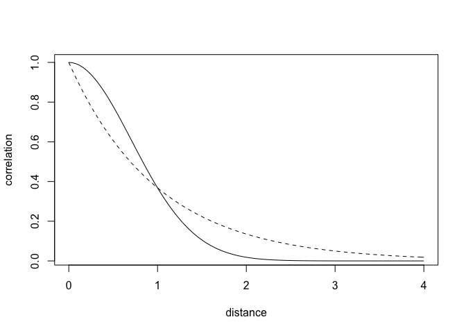<!-- -->


```r
data(Kline2) # load the ordinary data, now with coordinates
d <- Kline2
d$society <- 1:10 # index observations
dat_list <- list(
    T = d$total_tools,
    P = d$population,
    society = d$society,
    Dmat=islandsDistMatrix )
m14.7 <- ulam(
    alist(
        T ~ dpois(lambda),
        lambda <- (a*P^b/g)*exp(k[society]),
        vector[10]:k ~ multi_normal( 0 , SIGMA ),
        matrix[10,10]:SIGMA <- cov_GPL2( Dmat , etasq , rhosq , 0.01 ),
        c(a,b,g) ~ dexp( 1 ),
        etasq ~ dexp( 2 ),
        rhosq ~ dexp( 0.5 )
    ), data=dat_list , chains=4 , cores=4 , iter=2000 )
```

```
## Trying to compile a simple C file
```

```
## Running /Library/Frameworks/R.framework/Resources/bin/R CMD SHLIB foo.c
## clang -I"/Library/Frameworks/R.framework/Resources/include" -DNDEBUG   -I"/Library/Frameworks/R.framework/Versions/3.6/Resources/library/Rcpp/include/"  -I"/Library/Frameworks/R.framework/Versions/3.6/Resources/library/RcppEigen/include/"  -I"/Library/Frameworks/R.framework/Versions/3.6/Resources/library/RcppEigen/include/unsupported"  -I"/Library/Frameworks/R.framework/Versions/3.6/Resources/library/BH/include" -I"/Library/Frameworks/R.framework/Versions/3.6/Resources/library/StanHeaders/include/src/"  -I"/Library/Frameworks/R.framework/Versions/3.6/Resources/library/StanHeaders/include/"  -I"/Library/Frameworks/R.framework/Versions/3.6/Resources/library/RcppParallel/include/"  -I"/Library/Frameworks/R.framework/Versions/3.6/Resources/library/rstan/include" -DEIGEN_NO_DEBUG  -DBOOST_DISABLE_ASSERTS  -DBOOST_PENDING_INTEGER_LOG2_HPP  -DSTAN_THREADS  -include stan/math/prim/mat/fun/Eigen.hpp  -D_REENTRANT  "-isystem /Library/Developer/CommandLineTools/SDKs/MacOSX.sdk/usr/include"  -fPIC  -isysroot /Library/Developer/CommandLineTools/SDKs/MacOSX.sdk -c foo.c -o foo.o
## In file included from <built-in>:1:
## In file included from /Library/Frameworks/R.framework/Versions/3.6/Resources/library/StanHeaders/include/stan/math/prim/mat/fun/Eigen.hpp:13:
## In file included from /Library/Frameworks/R.framework/Versions/3.6/Resources/library/RcppEigen/include/Eigen/Dense:1:
## In file included from /Library/Frameworks/R.framework/Versions/3.6/Resources/library/RcppEigen/include/Eigen/Core:88:
## /Library/Frameworks/R.framework/Versions/3.6/Resources/library/RcppEigen/include/Eigen/src/Core/util/Macros.h:613:1: error: unknown type name 'namespace'
## namespace Eigen {
## ^
## /Library/Frameworks/R.framework/Versions/3.6/Resources/library/RcppEigen/include/Eigen/src/Core/util/Macros.h:613:16: error: expected ';' after top level declarator
## namespace Eigen {
##                ^
##                ;
## In file included from <built-in>:1:
## In file included from /Library/Frameworks/R.framework/Versions/3.6/Resources/library/StanHeaders/include/stan/math/prim/mat/fun/Eigen.hpp:13:
## In file included from /Library/Frameworks/R.framework/Versions/3.6/Resources/library/RcppEigen/include/Eigen/Dense:1:
## /Library/Frameworks/R.framework/Versions/3.6/Resources/library/RcppEigen/include/Eigen/Core:96:10: fatal error: 'complex' file not found
## #include <complex>
##          ^~~~~~~~~
## 3 errors generated.
## make: *** [foo.o] Error 1
```

```
## Warning: There were 1 divergent transitions after warmup. Increasing adapt_delta above 0.95 may help. See
## http://mc-stan.org/misc/warnings.html#divergent-transitions-after-warmup
```

```
## Warning: Examine the pairs() plot to diagnose sampling problems
```


```r
precis( m14.7 , depth=3 )
```

```
##              mean         sd        5.5%      94.5%     n_eff    Rhat4
## k[1]  -0.16060927 0.29337714 -0.62172059 0.28558303  824.8610 1.005856
## k[2]  -0.01801802 0.28656435 -0.45544482 0.42437085  737.5859 1.006457
## k[3]  -0.06692163 0.27443459 -0.50377643 0.34240140  718.0354 1.006943
## k[4]   0.35541891 0.25188477 -0.01699092 0.74636126  699.9483 1.009126
## k[5]   0.08192112 0.25319899 -0.28893077 0.47181187  745.4753 1.008614
## k[6]  -0.37787182 0.26708683 -0.80283017 0.00334305  843.7075 1.007400
## k[7]   0.14911241 0.24789809 -0.21401097 0.52775615  748.3770 1.006689
## k[8]  -0.20514830 0.25907288 -0.61140351 0.18327400  797.8205 1.007480
## k[9]   0.26696575 0.24239613 -0.10676435 0.63582546  712.2898 1.009531
## k[10] -0.16739642 0.34025932 -0.74370542 0.34576052  684.9839 1.007331
## g      0.59884154 0.55420621  0.07579609 1.61573637 1451.0737 1.003929
## b      0.27878174 0.08267724  0.14941111 0.40903730 1000.5134 1.007274
## a      1.40155110 1.07051718  0.24105080 3.38088809 1839.3263 1.000634
## etasq  0.19088968 0.19630211  0.03074223 0.53198936  950.1854 1.005250
## rhosq  1.31345314 1.62377004  0.08290995 4.36496135 2091.7892 1.002968
```


```r
post <- extract.samples(m14.7)
# plot the posterior median covariance function
plot( NULL , xlab="distance (thousand km)" , ylab="covariance" ,
    xlim=c(0,10) , ylim=c(0,2) )
# compute posterior mean covariance
x_seq <- seq( from=0 , to=10 , length.out=100 )
pmcov <- sapply( x_seq , function(x) post$etasq*exp(-post$rhosq*x^2) )
pmcov_mu <- apply( pmcov , 2 , mean )
lines( x_seq , pmcov_mu , lwd=2 )
# plot 60 functions sampled from posterior
for ( i in 1:50 )
    curve( post$etasq[i]*exp(-post$rhosq[i]*x^2) , add=TRUE ,
        col=col.alpha("black",0.3) )
```

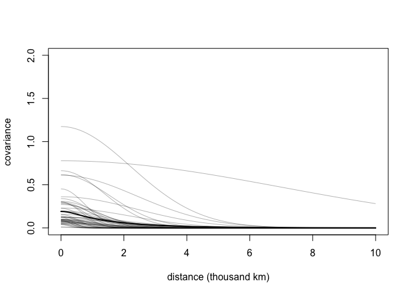<!-- -->

# compare models (by Julin, compre chapter 11 model, m11.11)


```r
# compute posterior median covariance among societies
K <- matrix(0,nrow=10,ncol=10)
for ( i in 1:10 )
    for ( j in 1:10 )
        K[i,j] <- median(post$etasq) *
                  exp( -median(post$rhosq) * islandsDistMatrix[i,j]^2 )
diag(K) <- median(post$etasq) + 0.01
```


```r
# convert to correlation matrix
Rho <- round( cov2cor(K) , 2 )
# add row/col names for convenience
colnames(Rho) <- c("Ml","Ti","SC","Ya","Fi","Tr","Ch","Mn","To","Ha")
rownames(Rho) <- colnames(Rho)
Rho
```

```
##      Ml   Ti   SC   Ya   Fi   Tr   Ch   Mn   To Ha
## Ml 1.00 0.79 0.70 0.00 0.31 0.05 0.00 0.00 0.08  0
## Ti 0.79 1.00 0.87 0.00 0.31 0.05 0.00 0.01 0.06  0
## SC 0.70 0.87 1.00 0.00 0.17 0.12 0.01 0.02 0.02  0
## Ya 0.00 0.00 0.00 1.00 0.00 0.01 0.17 0.14 0.00  0
## Fi 0.31 0.31 0.17 0.00 1.00 0.00 0.00 0.00 0.61  0
## Tr 0.05 0.05 0.12 0.01 0.00 1.00 0.09 0.55 0.00  0
## Ch 0.00 0.00 0.01 0.17 0.00 0.09 1.00 0.32 0.00  0
## Mn 0.00 0.01 0.02 0.14 0.00 0.55 0.32 1.00 0.00  0
## To 0.08 0.06 0.02 0.00 0.61 0.00 0.00 0.00 1.00  0
## Ha 0.00 0.00 0.00 0.00 0.00 0.00 0.00 0.00 0.00  1
```


# Error in Rho[i, j] : object of type 'closure' is not subsettable

```r
# scale point size to logpop
psize <- d$logpop / max(d$logpop)
psize <- exp(psize*1.5)-2
# plot raw data and labels
plot( d$lon2 , d$lat , xlab="longitude" , ylab="latitude" ,
    col=rangi2 , cex=psize , pch=16 , xlim=c(-50,30) )
labels <- as.character(d$culture)
text( d$lon2 , d$lat , labels=labels , cex=0.7 , pos=c(2,4,3,3,4,1,3,2,4,2) )
# overlay lines shaded by Rho
for( i in 1:10 )
    for ( j in 1:10 )
        if ( i < j )
            lines( c( d$lon2[i],d$lon2[j] ) , c( d$lat[i],d$lat[j] ) ,
                lwd=2 , col=col.alpha("black",Rho[i,j]^2) )
```

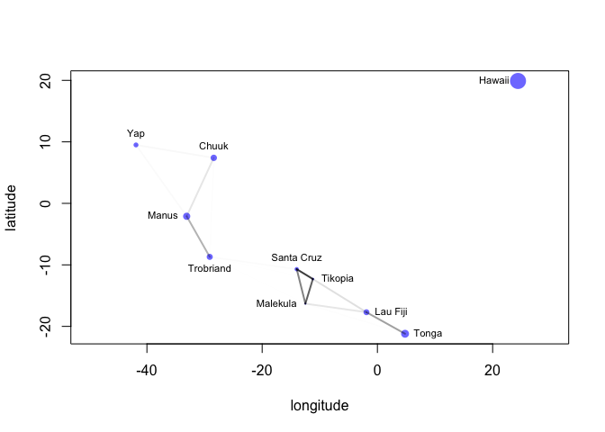<!-- -->


```r
# compute posterior median relationship, ignoring distance
logpop.seq <- seq( from=6 , to=14 , length.out=30 )
#lambda <- sapply( logpop.seq , function(lp) exp( post$a + post$bp*lp ) )
# by Julin
lambda <- sapply( logpop.seq , function(lp) post$a*exp(lp)^post$b/post$g )

lambda.median <- apply( lambda , 2 , median )
lambda.PI80 <- apply( lambda , 2 , PI , prob=0.8 )
# plot raw data and labels
plot( d$logpop , d$total_tools , col=rangi2 , cex=psize , pch=16 ,
    xlab="log population" , ylab="total tools" )
text( d$logpop , d$total_tools , labels=labels , cex=0.7 ,
    pos=c(4,3,4,2,2,1,4,4,4,2) )
# display posterior predictions
lines( logpop.seq , lambda.median , lty=2 )
lines( logpop.seq , lambda.PI80[1,] , lty=2 )
lines( logpop.seq , lambda.PI80[2,] , lty=2 )
# overlay correlations
for( i in 1:10 )
    for ( j in 1:10 )
        if ( i < j )
            lines( c( d$logpop[i],d$logpop[j] ) ,
                   c( d$total_tools[i],d$total_tools[j] ) ,
                   lwd=2 , col=col.alpha("black",Rho[i,j]^2) )
```

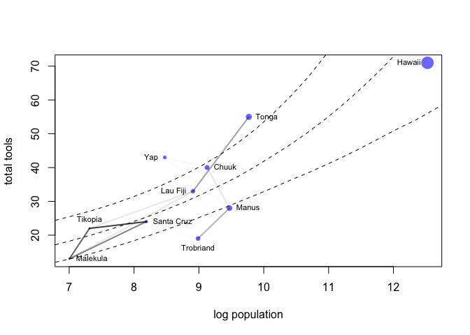<!-- -->


```r
m14.7nc <- ulam(
    alist(
        T ~ dpois(lambda),
        lambda <- (a*P^b/g)*exp(k[society]),
        # non-centered Gaussian Process prior
        transpars> vector[10]: k <<- L_SIGMA * z,
        vector[10]: z ~ normal( 0 , 1 ),
        transpars> matrix[10,10]: L_SIGMA <<- cholesky_decompose( SIGMA ),
        transpars> matrix[10,10]: SIGMA <- cov_GPL2( Dmat , etasq , rhosq , 0.01 ),
        c(a,b,g) ~ dexp( 1 ),
        etasq ~ dexp( 2 ),
        rhosq ~ dexp( 0.5 )
    ), data=dat_list , chains=4 , cores=4 , iter=2000 )
```

```
## Trying to compile a simple C file
```

```
## Running /Library/Frameworks/R.framework/Resources/bin/R CMD SHLIB foo.c
## clang -I"/Library/Frameworks/R.framework/Resources/include" -DNDEBUG   -I"/Library/Frameworks/R.framework/Versions/3.6/Resources/library/Rcpp/include/"  -I"/Library/Frameworks/R.framework/Versions/3.6/Resources/library/RcppEigen/include/"  -I"/Library/Frameworks/R.framework/Versions/3.6/Resources/library/RcppEigen/include/unsupported"  -I"/Library/Frameworks/R.framework/Versions/3.6/Resources/library/BH/include" -I"/Library/Frameworks/R.framework/Versions/3.6/Resources/library/StanHeaders/include/src/"  -I"/Library/Frameworks/R.framework/Versions/3.6/Resources/library/StanHeaders/include/"  -I"/Library/Frameworks/R.framework/Versions/3.6/Resources/library/RcppParallel/include/"  -I"/Library/Frameworks/R.framework/Versions/3.6/Resources/library/rstan/include" -DEIGEN_NO_DEBUG  -DBOOST_DISABLE_ASSERTS  -DBOOST_PENDING_INTEGER_LOG2_HPP  -DSTAN_THREADS  -include stan/math/prim/mat/fun/Eigen.hpp  -D_REENTRANT  "-isystem /Library/Developer/CommandLineTools/SDKs/MacOSX.sdk/usr/include"  -fPIC  -isysroot /Library/Developer/CommandLineTools/SDKs/MacOSX.sdk -c foo.c -o foo.o
## In file included from <built-in>:1:
## In file included from /Library/Frameworks/R.framework/Versions/3.6/Resources/library/StanHeaders/include/stan/math/prim/mat/fun/Eigen.hpp:13:
## In file included from /Library/Frameworks/R.framework/Versions/3.6/Resources/library/RcppEigen/include/Eigen/Dense:1:
## In file included from /Library/Frameworks/R.framework/Versions/3.6/Resources/library/RcppEigen/include/Eigen/Core:88:
## /Library/Frameworks/R.framework/Versions/3.6/Resources/library/RcppEigen/include/Eigen/src/Core/util/Macros.h:613:1: error: unknown type name 'namespace'
## namespace Eigen {
## ^
## /Library/Frameworks/R.framework/Versions/3.6/Resources/library/RcppEigen/include/Eigen/src/Core/util/Macros.h:613:16: error: expected ';' after top level declarator
## namespace Eigen {
##                ^
##                ;
## In file included from <built-in>:1:
## In file included from /Library/Frameworks/R.framework/Versions/3.6/Resources/library/StanHeaders/include/stan/math/prim/mat/fun/Eigen.hpp:13:
## In file included from /Library/Frameworks/R.framework/Versions/3.6/Resources/library/RcppEigen/include/Eigen/Dense:1:
## /Library/Frameworks/R.framework/Versions/3.6/Resources/library/RcppEigen/include/Eigen/Core:96:10: fatal error: 'complex' file not found
## #include <complex>
##          ^~~~~~~~~
## 3 errors generated.
## make: *** [foo.o] Error 1
```

```
## Warning: The largest R-hat is NA, indicating chains have not mixed.
## Running the chains for more iterations may help. See
## http://mc-stan.org/misc/warnings.html#r-hat
```

```
## Warning: Bulk Effective Samples Size (ESS) is too low, indicating posterior means and medians may be unreliable.
## Running the chains for more iterations may help. See
## http://mc-stan.org/misc/warnings.html#bulk-ess
```

```
## Warning: Tail Effective Samples Size (ESS) is too low, indicating posterior variances and tail quantiles may be unreliable.
## Running the chains for more iterations may help. See
## http://mc-stan.org/misc/warnings.html#tail-ess
```

# 14.5.2. Example: Phylogenetic distance.

```r
library(rethinking)
data(Primates301)
data(Primates301_nex)
# plot it
library(ape)
```

```
## 
## Attaching package: 'ape'
```

```
## The following object is masked from 'package:dagitty':
## 
##     edges
```

```r
### cut in a book. Use code in github
plot( ladderize(Primates301_nex) , type="fan" , font=1 , no.margin=TRUE ,
    label.offset=1 , cex=0.5 )
```

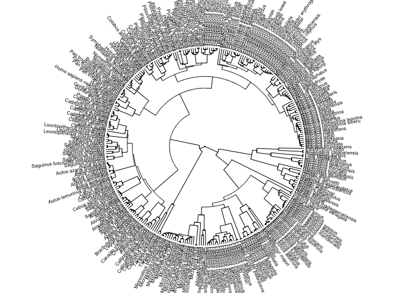<!-- -->


```r
d <- Primates301
d$name <- as.character(d$name)
dstan <- d[ complete.cases( d$group_size , d$body , d$brain ) , ]
spp_obs <- dstan$name
```


```r
dat_list <- list(
    N_spp = nrow(dstan),
    M = standardize(log(dstan$body)),
    B = standardize(log(dstan$brain)),
    G = standardize(log(dstan$group_size)),
    Imat = diag( nrow(dstan) )
)
```


```r
m14.8 <- ulam(
    alist(
        G ~ multi_normal( mu , SIGMA ),
        mu <- a + bM*M + bB*B,
        matrix[N_spp,N_spp]: SIGMA <- Imat * sigma_sq,
        a ~ normal( 0 , 1 ),
        c(bM,bB) ~ normal( 0 , 0.5 ),
        sigma_sq ~ exponential( 1 )
    ), data=dat_list , chains=4 , cores=4 )
```

```
## Trying to compile a simple C file
```

```
## Running /Library/Frameworks/R.framework/Resources/bin/R CMD SHLIB foo.c
## clang -I"/Library/Frameworks/R.framework/Resources/include" -DNDEBUG   -I"/Library/Frameworks/R.framework/Versions/3.6/Resources/library/Rcpp/include/"  -I"/Library/Frameworks/R.framework/Versions/3.6/Resources/library/RcppEigen/include/"  -I"/Library/Frameworks/R.framework/Versions/3.6/Resources/library/RcppEigen/include/unsupported"  -I"/Library/Frameworks/R.framework/Versions/3.6/Resources/library/BH/include" -I"/Library/Frameworks/R.framework/Versions/3.6/Resources/library/StanHeaders/include/src/"  -I"/Library/Frameworks/R.framework/Versions/3.6/Resources/library/StanHeaders/include/"  -I"/Library/Frameworks/R.framework/Versions/3.6/Resources/library/RcppParallel/include/"  -I"/Library/Frameworks/R.framework/Versions/3.6/Resources/library/rstan/include" -DEIGEN_NO_DEBUG  -DBOOST_DISABLE_ASSERTS  -DBOOST_PENDING_INTEGER_LOG2_HPP  -DSTAN_THREADS  -include stan/math/prim/mat/fun/Eigen.hpp  -D_REENTRANT  "-isystem /Library/Developer/CommandLineTools/SDKs/MacOSX.sdk/usr/include"  -fPIC  -isysroot /Library/Developer/CommandLineTools/SDKs/MacOSX.sdk -c foo.c -o foo.o
## In file included from <built-in>:1:
## In file included from /Library/Frameworks/R.framework/Versions/3.6/Resources/library/StanHeaders/include/stan/math/prim/mat/fun/Eigen.hpp:13:
## In file included from /Library/Frameworks/R.framework/Versions/3.6/Resources/library/RcppEigen/include/Eigen/Dense:1:
## In file included from /Library/Frameworks/R.framework/Versions/3.6/Resources/library/RcppEigen/include/Eigen/Core:88:
## /Library/Frameworks/R.framework/Versions/3.6/Resources/library/RcppEigen/include/Eigen/src/Core/util/Macros.h:613:1: error: unknown type name 'namespace'
## namespace Eigen {
## ^
## /Library/Frameworks/R.framework/Versions/3.6/Resources/library/RcppEigen/include/Eigen/src/Core/util/Macros.h:613:16: error: expected ';' after top level declarator
## namespace Eigen {
##                ^
##                ;
## In file included from <built-in>:1:
## In file included from /Library/Frameworks/R.framework/Versions/3.6/Resources/library/StanHeaders/include/stan/math/prim/mat/fun/Eigen.hpp:13:
## In file included from /Library/Frameworks/R.framework/Versions/3.6/Resources/library/RcppEigen/include/Eigen/Dense:1:
## /Library/Frameworks/R.framework/Versions/3.6/Resources/library/RcppEigen/include/Eigen/Core:96:10: fatal error: 'complex' file not found
## #include <complex>
##          ^~~~~~~~~
## 3 errors generated.
## make: *** [foo.o] Error 1
```

```r
precis( m14.8 )
```

```
##                  mean         sd        5.5%        94.5%     n_eff     Rhat4
## a         0.002570788 0.06090352 -0.09584516  0.101829567 1383.3697 1.0006917
## bB        1.009486108 0.20758116  0.68161889  1.332505692  998.0986 0.9984850
## bM       -0.342512109 0.20759344 -0.66930068 -0.009085565 1006.6288 0.9982961
## sigma_sq  0.520707269 0.06110432  0.43122107  0.629576776 1282.1826 1.0001069
```


```r
tree_trimmed <- keep.tip( Primates301_nex, spp_obs )
Rbm <- corBrownian( phy=tree_trimmed )
V <- vcv(Rbm)
```

```
## Warning in Initialize.corPhyl(phy, dummy.df): No covariate specified, species
## will be taken as ordered in the data frame. To avoid this message, specify a
## covariate containing the species names with the 'form' argument.
```

```r
Dmat <- cophenetic( tree_trimmed )
plot( Dmat , V , xlab="phylogenetic distance" , ylab="covariance" )
```

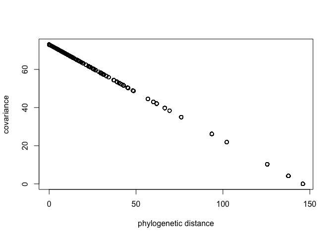<!-- -->


```r
# put species in right order
dat_list$V <- V[ spp_obs , spp_obs ]
# convert to correlation matrix
dat_list$R <- dat_list$V / max(V)
# Brownian motion model
m14.9 <- ulam(
    alist(
        G ~ multi_normal( mu , SIGMA ),
        mu <- a + bM*M + bB*B,
        matrix[N_spp,N_spp]: SIGMA <- R * sigma_sq,
        a ~ normal( 0 , 1 ),
        c(bM,bB) ~ normal( 0 , 0.5 ),
        sigma_sq ~ exponential( 1 )
    ), data=dat_list , chains=4 , cores=4 )
```

```
## Trying to compile a simple C file
```

```
## Running /Library/Frameworks/R.framework/Resources/bin/R CMD SHLIB foo.c
## clang -I"/Library/Frameworks/R.framework/Resources/include" -DNDEBUG   -I"/Library/Frameworks/R.framework/Versions/3.6/Resources/library/Rcpp/include/"  -I"/Library/Frameworks/R.framework/Versions/3.6/Resources/library/RcppEigen/include/"  -I"/Library/Frameworks/R.framework/Versions/3.6/Resources/library/RcppEigen/include/unsupported"  -I"/Library/Frameworks/R.framework/Versions/3.6/Resources/library/BH/include" -I"/Library/Frameworks/R.framework/Versions/3.6/Resources/library/StanHeaders/include/src/"  -I"/Library/Frameworks/R.framework/Versions/3.6/Resources/library/StanHeaders/include/"  -I"/Library/Frameworks/R.framework/Versions/3.6/Resources/library/RcppParallel/include/"  -I"/Library/Frameworks/R.framework/Versions/3.6/Resources/library/rstan/include" -DEIGEN_NO_DEBUG  -DBOOST_DISABLE_ASSERTS  -DBOOST_PENDING_INTEGER_LOG2_HPP  -DSTAN_THREADS  -include stan/math/prim/mat/fun/Eigen.hpp  -D_REENTRANT  "-isystem /Library/Developer/CommandLineTools/SDKs/MacOSX.sdk/usr/include"  -fPIC  -isysroot /Library/Developer/CommandLineTools/SDKs/MacOSX.sdk -c foo.c -o foo.o
## In file included from <built-in>:1:
## In file included from /Library/Frameworks/R.framework/Versions/3.6/Resources/library/StanHeaders/include/stan/math/prim/mat/fun/Eigen.hpp:13:
## In file included from /Library/Frameworks/R.framework/Versions/3.6/Resources/library/RcppEigen/include/Eigen/Dense:1:
## In file included from /Library/Frameworks/R.framework/Versions/3.6/Resources/library/RcppEigen/include/Eigen/Core:88:
## /Library/Frameworks/R.framework/Versions/3.6/Resources/library/RcppEigen/include/Eigen/src/Core/util/Macros.h:613:1: error: unknown type name 'namespace'
## namespace Eigen {
## ^
## /Library/Frameworks/R.framework/Versions/3.6/Resources/library/RcppEigen/include/Eigen/src/Core/util/Macros.h:613:16: error: expected ';' after top level declarator
## namespace Eigen {
##                ^
##                ;
## In file included from <built-in>:1:
## In file included from /Library/Frameworks/R.framework/Versions/3.6/Resources/library/StanHeaders/include/stan/math/prim/mat/fun/Eigen.hpp:13:
## In file included from /Library/Frameworks/R.framework/Versions/3.6/Resources/library/RcppEigen/include/Eigen/Dense:1:
## /Library/Frameworks/R.framework/Versions/3.6/Resources/library/RcppEigen/include/Eigen/Core:96:10: fatal error: 'complex' file not found
## #include <complex>
##          ^~~~~~~~~
## 3 errors generated.
## make: *** [foo.o] Error 1
```

```r
precis( m14.9 )
```

```
##                 mean        sd         5.5%     94.5%     n_eff    Rhat4
## a        -0.48786503 0.5604531 -1.394046297 0.3983502 1138.6640 1.001055
## bB       -0.06521128 0.2643584 -0.484920554 0.3606142  948.3504 1.001780
## bM        0.34156502 0.2225609 -0.006638469 0.6994524 1056.8039 1.001142
## sigma_sq  2.68688124 0.3053482  2.238479692 3.2072685 1477.0061 1.001321
```

```r
# heatmap (from book text)
image(V)
```

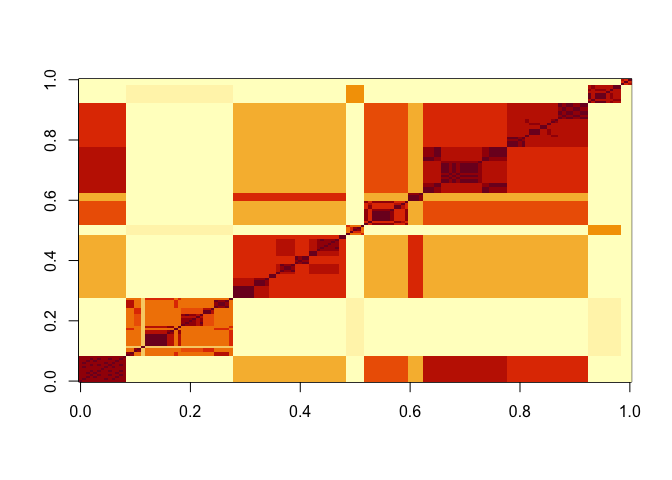<!-- -->

```r
image(Dmat)
```

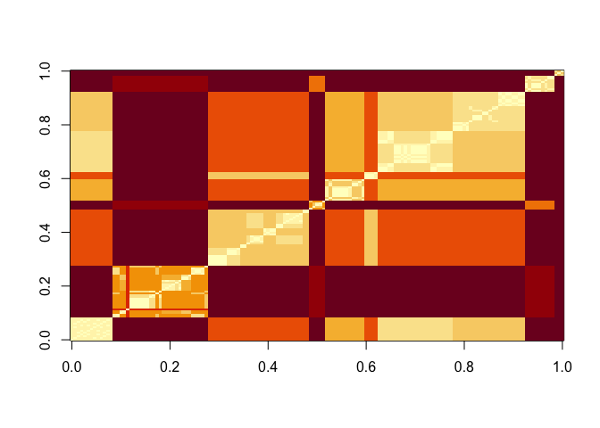<!-- -->


```r
# add scaled and reordered distance matrix
dat_list$Dmat <- Dmat[ spp_obs , spp_obs ] / max(Dmat)
m14.10 <- ulam(
    alist(
        G ~ multi_normal( mu , SIGMA ),
        mu <- a + bM*M + bB*B,
        matrix[N_spp,N_spp]: SIGMA <- cov_GPL2( Dmat , etasq , rhosq , 0.01 ),
        a ~ normal(0,1),
        c(bM,bB) ~ normal(0,0.5),
        etasq ~ exponential(1),
        rhosq ~ exponential(1)
    ), data=dat_list , chains=4 , cores=4 )
```

```
## Trying to compile a simple C file
```

```
## Running /Library/Frameworks/R.framework/Resources/bin/R CMD SHLIB foo.c
## clang -I"/Library/Frameworks/R.framework/Resources/include" -DNDEBUG   -I"/Library/Frameworks/R.framework/Versions/3.6/Resources/library/Rcpp/include/"  -I"/Library/Frameworks/R.framework/Versions/3.6/Resources/library/RcppEigen/include/"  -I"/Library/Frameworks/R.framework/Versions/3.6/Resources/library/RcppEigen/include/unsupported"  -I"/Library/Frameworks/R.framework/Versions/3.6/Resources/library/BH/include" -I"/Library/Frameworks/R.framework/Versions/3.6/Resources/library/StanHeaders/include/src/"  -I"/Library/Frameworks/R.framework/Versions/3.6/Resources/library/StanHeaders/include/"  -I"/Library/Frameworks/R.framework/Versions/3.6/Resources/library/RcppParallel/include/"  -I"/Library/Frameworks/R.framework/Versions/3.6/Resources/library/rstan/include" -DEIGEN_NO_DEBUG  -DBOOST_DISABLE_ASSERTS  -DBOOST_PENDING_INTEGER_LOG2_HPP  -DSTAN_THREADS  -include stan/math/prim/mat/fun/Eigen.hpp  -D_REENTRANT  "-isystem /Library/Developer/CommandLineTools/SDKs/MacOSX.sdk/usr/include"  -fPIC  -isysroot /Library/Developer/CommandLineTools/SDKs/MacOSX.sdk -c foo.c -o foo.o
## In file included from <built-in>:1:
## In file included from /Library/Frameworks/R.framework/Versions/3.6/Resources/library/StanHeaders/include/stan/math/prim/mat/fun/Eigen.hpp:13:
## In file included from /Library/Frameworks/R.framework/Versions/3.6/Resources/library/RcppEigen/include/Eigen/Dense:1:
## In file included from /Library/Frameworks/R.framework/Versions/3.6/Resources/library/RcppEigen/include/Eigen/Core:88:
## /Library/Frameworks/R.framework/Versions/3.6/Resources/library/RcppEigen/include/Eigen/src/Core/util/Macros.h:613:1: error: unknown type name 'namespace'
## namespace Eigen {
## ^
## /Library/Frameworks/R.framework/Versions/3.6/Resources/library/RcppEigen/include/Eigen/src/Core/util/Macros.h:613:16: error: expected ';' after top level declarator
## namespace Eigen {
##                ^
##                ;
## In file included from <built-in>:1:
## In file included from /Library/Frameworks/R.framework/Versions/3.6/Resources/library/StanHeaders/include/stan/math/prim/mat/fun/Eigen.hpp:13:
## In file included from /Library/Frameworks/R.framework/Versions/3.6/Resources/library/RcppEigen/include/Eigen/Dense:1:
## /Library/Frameworks/R.framework/Versions/3.6/Resources/library/RcppEigen/include/Eigen/Core:96:10: fatal error: 'complex' file not found
## #include <complex>
##          ^~~~~~~~~
## 3 errors generated.
## make: *** [foo.o] Error 1
```

```r
precis( m14.10 )
```

```
##             mean        sd       5.5%      94.5%     n_eff    Rhat4
## a     -0.4767138 0.4108497 -1.1041144  0.1995224 1071.5554 1.001364
## bB    -0.1638991 0.2518203 -0.5619264  0.2369075 1085.5974 1.001139
## bM     0.5505772 0.2086223  0.2189902  0.8970165 1056.0602 1.002063
## etasq  2.7683012 0.8992778  1.6578404  4.4324190  793.1570 1.000144
## rhosq 11.7839016 3.5776325  6.4872919 17.9099282  903.8013 1.002079
```


```r
 post <- extract.samples(m14.10)
plot( NULL , xlim=c(0,max(dat_list$Dmat)) , ylim=c(0,5) ,
    xlab="phylogenetic distance" , ylab="covariance" )
for ( i in 1:50 ) curve( post$etasq[i]*exp(-post$rhosq[i]*x^2) , add=TRUE , col=grau() )
```

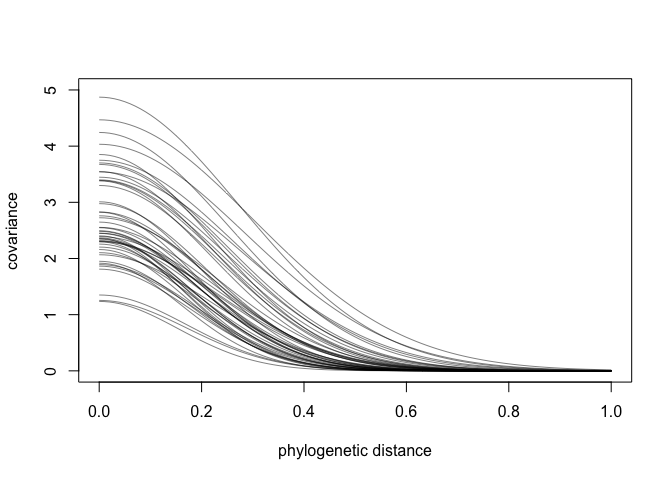<!-- -->


# 14.7. Practice
# 14M5. 
* Modify the phylogenetic distance example to use group size as the outcome and brain size as
a predictor. Assuming brain size influences group size, what is your estimate of the effect? How does
phylogeny influence the estimate? 


# 14H2
* which is 234 height measurements on 26 boys from an Oxford Boys Club (I think these were like youth athletic leagues?), at 9 different ages (centered and standardized) per boy. You’ll be interested in predicting height, using age, clustered by Subject (individual boy).
* Fit a model with varying intercepts and slopes (on age), clustered by Subject. Present and interpret the parameter estimates. Which varying effect contributes more variation to the heights, the intercept or the slope?

```r
data(Oxboys)
summary(Oxboys)
```

```
##     Subject          age               height         Occasion
##  Min.   : 1.0   Min.   :-1.00000   Min.   :126.2   Min.   :1  
##  1st Qu.: 7.0   1st Qu.:-0.46300   1st Qu.:143.8   1st Qu.:3  
##  Median :13.5   Median :-0.00270   Median :149.5   Median :5  
##  Mean   :13.5   Mean   : 0.02263   Mean   :149.5   Mean   :5  
##  3rd Qu.:20.0   3rd Qu.: 0.55620   3rd Qu.:155.5   3rd Qu.:7  
##  Max.   :26.0   Max.   : 1.00550   Max.   :174.8   Max.   :9
```

```r
head(Oxboys)
```

```
##   Subject     age height Occasion
## 1       1 -1.0000  140.5        1
## 2       1 -0.7479  143.4        2
## 3       1 -0.4630  144.8        3
## 4       1 -0.1643  147.1        4
## 5       1 -0.0027  147.7        5
## 6       1  0.2466  150.2        6
```

```r
Oxboys$Subject <- as.character(Oxboys$Subject)

# looking raw data
Oxboys %>% ggplot(aes(x=age, y=height,color=Subject)) + geom_line()
```

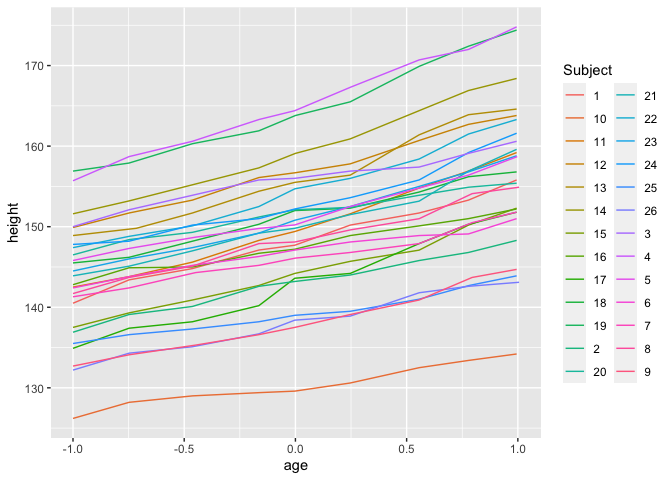<!-- -->

# 

```r
Oxboys.list <- list(
  Subject=as.integer(Oxboys$Subject),
  age=Oxboys$age,
  height=Oxboys$height
)
mOxboys.partialpooling <- ulam(
    alist(
        height ~ dnorm( mu , sigma ),
        mu <- a[Subject] + b[Subject]*age, 
        a[Subject] ~ dnorm(a_bar,a_sigma),
        b[Subject] ~ dnorm(0,1),  
        a_bar ~ dnorm(145,1),
        a_sigma ~ dexp(1),
        sigma ~ dexp(1)
    ) , data=Oxboys.list , chains=4 , cores=2,iter=1000,log_lik=TRUE)
```

```
## Trying to compile a simple C file
```

```
## Running /Library/Frameworks/R.framework/Resources/bin/R CMD SHLIB foo.c
## clang -I"/Library/Frameworks/R.framework/Resources/include" -DNDEBUG   -I"/Library/Frameworks/R.framework/Versions/3.6/Resources/library/Rcpp/include/"  -I"/Library/Frameworks/R.framework/Versions/3.6/Resources/library/RcppEigen/include/"  -I"/Library/Frameworks/R.framework/Versions/3.6/Resources/library/RcppEigen/include/unsupported"  -I"/Library/Frameworks/R.framework/Versions/3.6/Resources/library/BH/include" -I"/Library/Frameworks/R.framework/Versions/3.6/Resources/library/StanHeaders/include/src/"  -I"/Library/Frameworks/R.framework/Versions/3.6/Resources/library/StanHeaders/include/"  -I"/Library/Frameworks/R.framework/Versions/3.6/Resources/library/RcppParallel/include/"  -I"/Library/Frameworks/R.framework/Versions/3.6/Resources/library/rstan/include" -DEIGEN_NO_DEBUG  -DBOOST_DISABLE_ASSERTS  -DBOOST_PENDING_INTEGER_LOG2_HPP  -DSTAN_THREADS  -include stan/math/prim/mat/fun/Eigen.hpp  -D_REENTRANT  "-isystem /Library/Developer/CommandLineTools/SDKs/MacOSX.sdk/usr/include"  -fPIC  -isysroot /Library/Developer/CommandLineTools/SDKs/MacOSX.sdk -c foo.c -o foo.o
## In file included from <built-in>:1:
## In file included from /Library/Frameworks/R.framework/Versions/3.6/Resources/library/StanHeaders/include/stan/math/prim/mat/fun/Eigen.hpp:13:
## In file included from /Library/Frameworks/R.framework/Versions/3.6/Resources/library/RcppEigen/include/Eigen/Dense:1:
## In file included from /Library/Frameworks/R.framework/Versions/3.6/Resources/library/RcppEigen/include/Eigen/Core:88:
## /Library/Frameworks/R.framework/Versions/3.6/Resources/library/RcppEigen/include/Eigen/src/Core/util/Macros.h:613:1: error: unknown type name 'namespace'
## namespace Eigen {
## ^
## /Library/Frameworks/R.framework/Versions/3.6/Resources/library/RcppEigen/include/Eigen/src/Core/util/Macros.h:613:16: error: expected ';' after top level declarator
## namespace Eigen {
##                ^
##                ;
## In file included from <built-in>:1:
## In file included from /Library/Frameworks/R.framework/Versions/3.6/Resources/library/StanHeaders/include/stan/math/prim/mat/fun/Eigen.hpp:13:
## In file included from /Library/Frameworks/R.framework/Versions/3.6/Resources/library/RcppEigen/include/Eigen/Dense:1:
## /Library/Frameworks/R.framework/Versions/3.6/Resources/library/RcppEigen/include/Eigen/Core:96:10: fatal error: 'complex' file not found
## #include <complex>
##          ^~~~~~~~~
## 3 errors generated.
## make: *** [foo.o] Error 1
```

```r
# 
precis( mOxboys.partialpooling )
```

```
## 52 vector or matrix parameters hidden. Use depth=2 to show them.
```

```
##               mean        sd       5.5%      94.5%    n_eff     Rhat4
## a_bar   146.402129 0.9205958 144.912305 147.869290 3601.754 0.9983762
## a_sigma   7.666924 1.0131266   6.246718   9.445636 3596.327 0.9988383
## sigma     3.716626 0.2373904   3.349916   4.097880 1524.728 1.0005129
```

```r
plot(mOxboys.partialpooling)
```

```
## 52 vector or matrix parameters hidden. Use depth=2 to show them.
```

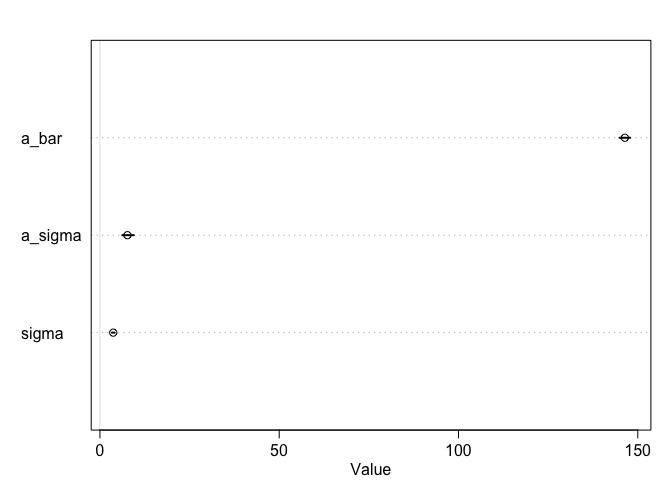<!-- -->


```r
mOxboys.multinormal <- ulam(
  alist(
    height ~ normal(mu, sigma),
    mu <- a[Subject] + bS[Subject] * age,
    c(a, bS)[Subject] ~ multi_normal(c(a_S, b_S) , Rho , sigma_S),
    a_S ~ normal(145, 1),
    b_S ~ normal(0, 1),
    sigma_S ~ exponential(1),
    sigma ~ exponential(1),
    Rho ~ lkj_corr(2)
  ),
  data = Oxboys.list,
  chains = 4,
  cores = 4,
  log_lik = T,
  iter = 5000
)
```

```
## Trying to compile a simple C file
```

```
## Running /Library/Frameworks/R.framework/Resources/bin/R CMD SHLIB foo.c
## clang -I"/Library/Frameworks/R.framework/Resources/include" -DNDEBUG   -I"/Library/Frameworks/R.framework/Versions/3.6/Resources/library/Rcpp/include/"  -I"/Library/Frameworks/R.framework/Versions/3.6/Resources/library/RcppEigen/include/"  -I"/Library/Frameworks/R.framework/Versions/3.6/Resources/library/RcppEigen/include/unsupported"  -I"/Library/Frameworks/R.framework/Versions/3.6/Resources/library/BH/include" -I"/Library/Frameworks/R.framework/Versions/3.6/Resources/library/StanHeaders/include/src/"  -I"/Library/Frameworks/R.framework/Versions/3.6/Resources/library/StanHeaders/include/"  -I"/Library/Frameworks/R.framework/Versions/3.6/Resources/library/RcppParallel/include/"  -I"/Library/Frameworks/R.framework/Versions/3.6/Resources/library/rstan/include" -DEIGEN_NO_DEBUG  -DBOOST_DISABLE_ASSERTS  -DBOOST_PENDING_INTEGER_LOG2_HPP  -DSTAN_THREADS  -include stan/math/prim/mat/fun/Eigen.hpp  -D_REENTRANT  "-isystem /Library/Developer/CommandLineTools/SDKs/MacOSX.sdk/usr/include"  -fPIC  -isysroot /Library/Developer/CommandLineTools/SDKs/MacOSX.sdk -c foo.c -o foo.o
## In file included from <built-in>:1:
## In file included from /Library/Frameworks/R.framework/Versions/3.6/Resources/library/StanHeaders/include/stan/math/prim/mat/fun/Eigen.hpp:13:
## In file included from /Library/Frameworks/R.framework/Versions/3.6/Resources/library/RcppEigen/include/Eigen/Dense:1:
## In file included from /Library/Frameworks/R.framework/Versions/3.6/Resources/library/RcppEigen/include/Eigen/Core:88:
## /Library/Frameworks/R.framework/Versions/3.6/Resources/library/RcppEigen/include/Eigen/src/Core/util/Macros.h:613:1: error: unknown type name 'namespace'
## namespace Eigen {
## ^
## /Library/Frameworks/R.framework/Versions/3.6/Resources/library/RcppEigen/include/Eigen/src/Core/util/Macros.h:613:16: error: expected ';' after top level declarator
## namespace Eigen {
##                ^
##                ;
## In file included from <built-in>:1:
## In file included from /Library/Frameworks/R.framework/Versions/3.6/Resources/library/StanHeaders/include/stan/math/prim/mat/fun/Eigen.hpp:13:
## In file included from /Library/Frameworks/R.framework/Versions/3.6/Resources/library/RcppEigen/include/Eigen/Dense:1:
## /Library/Frameworks/R.framework/Versions/3.6/Resources/library/RcppEigen/include/Eigen/Core:96:10: fatal error: 'complex' file not found
## #include <complex>
##          ^~~~~~~~~
## 3 errors generated.
## make: *** [foo.o] Error 1
```

```
## Warning: The largest R-hat is NA, indicating chains have not mixed.
## Running the chains for more iterations may help. See
## http://mc-stan.org/misc/warnings.html#r-hat
```

```
## Warning: Bulk Effective Samples Size (ESS) is too low, indicating posterior means and medians may be unreliable.
## Running the chains for more iterations may help. See
## http://mc-stan.org/misc/warnings.html#bulk-ess
```

```
## Warning: Tail Effective Samples Size (ESS) is too low, indicating posterior variances and tail quantiles may be unreliable.
## Running the chains for more iterations may help. See
## http://mc-stan.org/misc/warnings.html#tail-ess
```

```r
precis(mOxboys.multinormal, depth = 3, pars = c("a", "bS", "Rho", "sigma"))
```

```
##                 mean           sd        5.5%       94.5%     n_eff     Rhat4
## a[1]     148.1223456 2.206417e-01 147.7672715 148.4772279 19765.034 0.9999026
## a[2]     142.8661230 2.199088e-01 142.5142914 143.2178495 19250.895 0.9996624
## a[3]     155.6331149 2.194172e-01 155.2775277 155.9865658 18538.501 0.9999755
## a[4]     165.0594238 2.203501e-01 164.7118043 165.4113787 18516.920 0.9999854
## a[5]     151.4249967 2.212050e-01 151.0754545 151.7763583 17496.562 0.9997717
## a[6]     146.7793691 2.233963e-01 146.4204149 147.1327600 20394.091 0.9999167
## a[7]     146.1224333 2.230211e-01 145.7678617 146.4816812 18667.541 0.9998204
## a[8]     148.2925825 2.194676e-01 147.9364586 148.6400731 20032.581 0.9997150
## a[9]     138.1499456 2.216266e-01 137.7973956 138.5029618 18626.059 0.9998473
## a[10]    130.2758701 2.235285e-01 129.9181675 130.6333654 21907.615 0.9996772
## a[11]    150.0506433 2.180363e-01 149.6996410 150.3943540 19124.148 0.9998283
## a[12]    156.7999298 2.257143e-01 156.4427058 157.1561014 20142.623 0.9999439
## a[13]    156.0707194 2.192523e-01 155.7177018 156.4233549 19689.394 0.9997522
## a[14]    159.4656244 2.200362e-01 159.1084785 159.8203313 20234.023 0.9997652
## a[15]    144.2863250 2.209793e-01 143.9336766 144.6375493 20033.103 0.9996725
## a[16]    147.5353839 2.196264e-01 147.1855849 147.8864952 20213.426 0.9996779
## a[17]    142.9960360 2.226219e-01 142.6395822 143.3436939 19763.807 0.9998498
## a[18]    151.1747386 2.203736e-01 150.8249464 151.5196251 20946.688 0.9997118
## a[19]    164.5626265 2.256035e-01 164.2044238 164.9182581 18602.758 0.9998813
## a[20]    151.4574860 2.185817e-01 151.1056630 151.8037794 20606.520 0.9997653
## a[21]    150.5224739 2.217374e-01 150.1753451 150.8807139 18071.640 1.0000998
## a[22]    154.5642288 2.227548e-01 154.2112641 154.9161165 19161.224 0.9997650
## a[23]    151.0636502 2.236444e-01 150.7046164 151.4209850 19068.927 1.0001408
## a[24]    153.1346611 2.220947e-01 152.7803742 153.4956806 20252.657 0.9997991
## a[25]    139.2125577 2.237838e-01 138.8570416 139.5705656 21106.778 0.9996951
## a[26]    138.0067629 2.205765e-01 137.6547864 138.3591398 17632.503 0.9999415
## bS[1]      7.1050287 3.327340e-01   6.5684482   7.6435572 19644.859 0.9998394
## bS[2]      5.4265477 3.322592e-01   4.8920192   5.9533430 18153.484 0.9997832
## bS[3]      4.8981084 3.371308e-01   4.3618092   5.4401440 19322.283 0.9996604
## bS[4]      9.3012078 3.370265e-01   8.7602627   9.8393172 20630.186 0.9997681
## bS[5]      6.2502069 3.331784e-01   5.7180355   6.7819238 19879.676 0.9996943
## bS[6]      4.0615194 3.342659e-01   3.5250023   4.5964194 16696.360 0.9999478
## bS[7]      5.0231169 3.368428e-01   4.4919168   5.5651359 18878.815 0.9998910
## bS[8]      6.4332433 3.256630e-01   5.9074650   6.9483306 19602.757 0.9999352
## bS[9]      5.9210028 3.437193e-01   5.3749335   6.4687118 19890.312 0.9999803
## bS[10]     3.7057435 3.418358e-01   3.1627818   4.2449496 17531.615 0.9997417
## bS[11]     8.3769676 3.382556e-01   7.8427685   8.9034489 18458.224 0.9998762
## bS[12]     7.0161204 3.364014e-01   6.4740584   7.5492613 19430.535 0.9997557
## bS[13]     8.4131795 3.390220e-01   7.8736178   8.9436090 22741.051 0.9996828
## bS[14]     8.6044966 3.354146e-01   8.0715478   9.1391954 18334.194 0.9997748
## bS[15]     7.0286332 3.379116e-01   6.4772813   7.5712271 19823.508 0.9998237
## bS[16]     4.6176408 3.316369e-01   4.0883998   5.1450235 19053.251 0.9998281
## bS[17]     8.4227374 3.358273e-01   7.8868481   8.9611728 18273.121 0.9997159
## bS[18]     5.9787911 3.323117e-01   5.4440642   6.5099961 18526.708 0.9998046
## bS[19]     9.0129289 3.375630e-01   8.4727159   9.5557645 18197.401 0.9998086
## bS[20]     4.4830711 3.368978e-01   3.9496162   5.0283076 18846.192 0.9997822
## bS[21]     7.4292824 3.367857e-01   6.8952060   7.9626533 18571.553 0.9998687
## bS[22]     8.0183424 3.361153e-01   7.4886564   8.5568790 18501.621 0.9996947
## bS[23]     7.1367566 3.274938e-01   6.6040965   7.6592880 19216.942 0.9996943
## bS[24]     6.7589283 3.407679e-01   6.2129046   7.3034986 20897.178 0.9996832
## bS[25]     4.0586267 3.257451e-01   3.5407260   4.5743263 19505.075 0.9999541
## bS[26]     5.5246724 3.358147e-01   4.9781226   6.0664308 16698.896 0.9997048
## Rho[1,1]   1.0000000 0.000000e+00   1.0000000   1.0000000       NaN       NaN
## Rho[1,2]   0.5899268 1.188591e-01   0.3841700   0.7582946 11485.826 0.9997866
## Rho[2,1]   0.5899268 1.188591e-01   0.3841700   0.7582946 11485.826 0.9997866
## Rho[2,2]   1.0000000 7.206554e-17   1.0000000   1.0000000  6078.896 0.9995999
## sigma      0.6637775 3.507589e-02   0.6113121   0.7221207 10922.065 0.9997247
```


# 14H3
* Now consider the correlation between the varying intercepts and slopes. 
* Can you explain its value? How would this estimated correlation influence your predictions about a new sample of boys?


# 14H3


```r
sessionInfo()
```

```
## R version 3.6.2 (2019-12-12)
## Platform: x86_64-apple-darwin15.6.0 (64-bit)
## Running under: macOS Mojave 10.14.6
## 
## Matrix products: default
## BLAS:   /Library/Frameworks/R.framework/Versions/3.6/Resources/lib/libRblas.0.dylib
## LAPACK: /Library/Frameworks/R.framework/Versions/3.6/Resources/lib/libRlapack.dylib
## 
## locale:
## [1] en_US.UTF-8/en_US.UTF-8/en_US.UTF-8/C/en_US.UTF-8/en_US.UTF-8
## 
## attached base packages:
## [1] parallel  stats     graphics  grDevices utils     datasets  methods  
## [8] base     
## 
## other attached packages:
##  [1] ape_5.4              forcats_0.5.0        stringr_1.4.0       
##  [4] dplyr_0.8.4          purrr_0.3.3          readr_1.3.1         
##  [7] tidyr_1.0.2          tibble_2.1.3         tidyverse_1.3.0     
## [10] reshape2_1.4.3       lmerTest_3.1-2       lme4_1.1-21         
## [13] Matrix_1.2-18        rethinking_1.95      dagitty_0.2-2       
## [16] rstan_2.21.1         ggplot2_3.3.0        StanHeaders_2.21.0-1
## 
## loaded via a namespace (and not attached):
##  [1] nlme_3.1-145        matrixStats_0.55.0  fs_1.3.1           
##  [4] lubridate_1.7.4     httr_1.4.1          numDeriv_2016.8-1.1
##  [7] tools_3.6.2         backports_1.1.5     R6_2.4.1           
## [10] DBI_1.1.0           colorspace_1.4-1    withr_2.1.2        
## [13] tidyselect_1.0.0    gridExtra_2.3       prettyunits_1.1.1  
## [16] processx_3.4.2      curl_4.3            compiler_3.6.2     
## [19] cli_2.0.2           rvest_0.3.5         xml2_1.2.2         
## [22] labeling_0.3        scales_1.1.0        mvtnorm_1.1-0      
## [25] callr_3.4.2         digest_0.6.25       minqa_1.2.4        
## [28] rmarkdown_2.1       pkgconfig_2.0.3     htmltools_0.4.0    
## [31] dbplyr_1.4.2        rlang_0.4.5         readxl_1.3.1       
## [34] rstudioapi_0.11     farver_2.0.3        shape_1.4.4        
## [37] generics_0.0.2      jsonlite_1.6.1      inline_0.3.15      
## [40] magrittr_1.5        loo_2.2.0           Rcpp_1.0.3         
## [43] munsell_0.5.0       fansi_0.4.1         lifecycle_0.2.0    
## [46] stringi_1.4.6       yaml_2.2.1          MASS_7.3-51.5      
## [49] pkgbuild_1.0.6      plyr_1.8.6          grid_3.6.2         
## [52] crayon_1.3.4        lattice_0.20-40     haven_2.2.0        
## [55] splines_3.6.2       hms_0.5.3           knitr_1.28         
## [58] ps_1.3.2            pillar_1.4.3        boot_1.3-24        
## [61] codetools_0.2-16    stats4_3.6.2        reprex_0.3.0       
## [64] glue_1.3.1          evaluate_0.14       V8_3.0.1           
## [67] RcppParallel_4.4.4  modelr_0.1.6        vctrs_0.2.3        
## [70] nloptr_1.2.1        cellranger_1.1.0    gtable_0.3.0       
## [73] assertthat_0.2.1    xfun_0.12           broom_0.5.5        
## [76] coda_0.19-3
```

