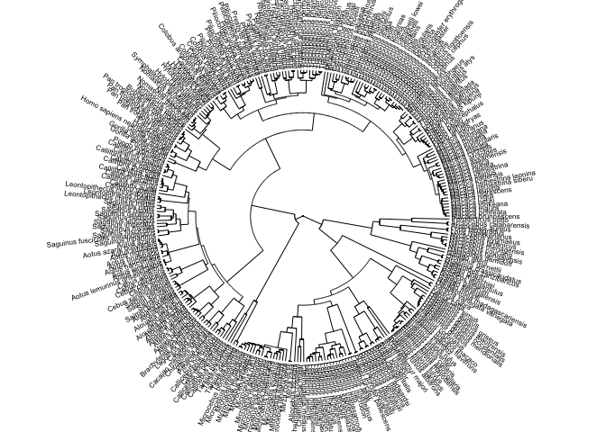
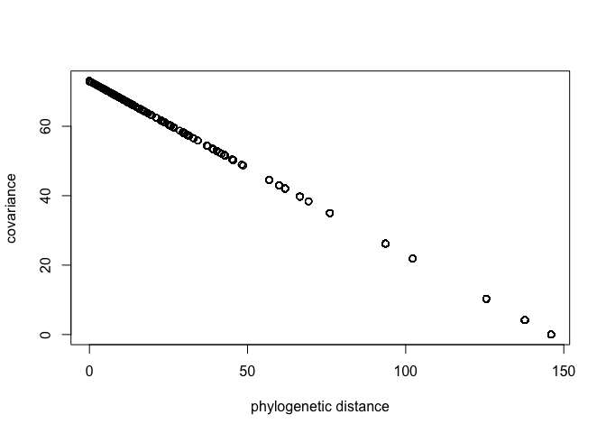
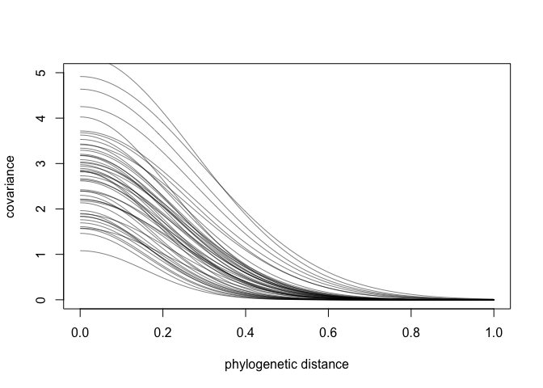
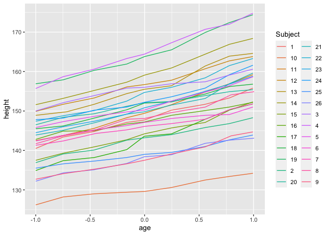
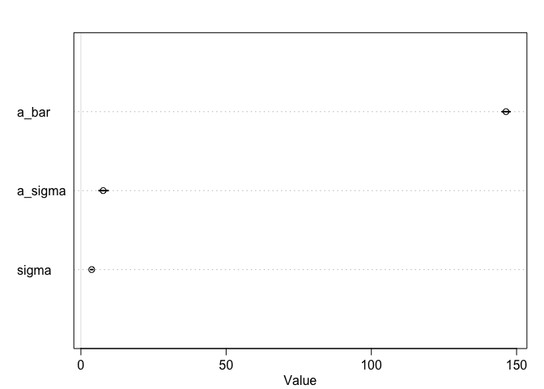

# 14.5.2. Example: Phylogenetic distance.

```r
library(rethinking)
data(Primates301)
data(Primates301_nex)
# plot it
library(ape)
```

```
## 
## Attaching package: 'ape'
```

```
## The following object is masked from 'package:dagitty':
## 
##     edges
```

```r
### cut in a book. Use code in github
plot( ladderize(Primates301_nex) , type="fan" , font=1 , no.margin=TRUE ,
    label.offset=1 , cex=0.5 )
```

<!-- -->


```r
d <- Primates301
d$name <- as.character(d$name)
dstan <- d[ complete.cases( d$group_size , d$body , d$brain ) , ]
spp_obs <- dstan$name
```


```r
dat_list <- list(
    N_spp = nrow(dstan),
    M = standardize(log(dstan$body)),
    B = standardize(log(dstan$brain)),
    G = standardize(log(dstan$group_size)),
    Imat = diag( nrow(dstan) )
)
```


```r
m14.8 <- ulam(
    alist(
        G ~ multi_normal( mu , SIGMA ),
        mu <- a + bM*M + bB*B,
        matrix[N_spp,N_spp]: SIGMA <- Imat * sigma_sq,
        a ~ normal( 0 , 1 ),
        c(bM,bB) ~ normal( 0 , 0.5 ),
        sigma_sq ~ exponential( 1 )
    ), data=dat_list , chains=4 , cores=4 )
precis( m14.8 )
```

```
##                   mean         sd        5.5%       94.5%     n_eff    Rhat4
## a         0.0001361633 0.05760816 -0.09269971  0.09030078 1200.9364 1.001964
## bB        1.0086137495 0.21091223  0.67906690  1.36875391 1040.2154 1.000766
## bM       -0.3422151273 0.20992814 -0.69886286 -0.01209518 1035.9094 1.000546
## sigma_sq  0.5239233140 0.06233512  0.43318477  0.63306167  935.3389 1.002556
```


```r
tree_trimmed <- keep.tip( Primates301_nex, spp_obs )
Rbm <- corBrownian( phy=tree_trimmed )
V <- vcv(Rbm)
```

```
## Warning in Initialize.corPhyl(phy, dummy.df): No covariate specified, species
## will be taken as ordered in the data frame. To avoid this message, specify a
## covariate containing the species names with the 'form' argument.
```

```r
Dmat <- cophenetic( tree_trimmed )
plot( Dmat , V , xlab="phylogenetic distance" , ylab="covariance" )
```

<!-- -->


```r
# put species in right order
dat_list$V <- V[ spp_obs , spp_obs ]
# convert to correlation matrix
dat_list$R <- dat_list$V / max(V)
# Brownian motion model
m14.9 <- ulam(
    alist(
        G ~ multi_normal( mu , SIGMA ),
        mu <- a + bM*M + bB*B,
        matrix[N_spp,N_spp]: SIGMA <- R * sigma_sq,
        a ~ normal( 0 , 1 ),
        c(bM,bB) ~ normal( 0 , 0.5 ),
        sigma_sq ~ exponential( 1 )
    ), data=dat_list , chains=4 , cores=4 )
precis( m14.9 )
```

```
##                 mean        sd        5.5%     94.5%    n_eff     Rhat4
## a        -0.45350219 0.5877348 -1.41751132 0.4981097 1555.758 1.0017818
## bB       -0.07301222 0.2551141 -0.48527328 0.3301321 1135.301 1.0002027
## bM        0.34786575 0.2182833  0.00545824 0.6974323 1181.491 0.9989044
## sigma_sq  2.68870462 0.3075201  2.23936263 3.2144500 1732.191 0.9988091
```

```r
# heatmap (from book text)
# image(V)
# image(Dmat)
```


```r
# add scaled and reordered distance matrix
dat_list$Dmat <- Dmat[ spp_obs , spp_obs ] / max(Dmat)
m14.10 <- ulam(
    alist(
        G ~ multi_normal( mu , SIGMA ),
        mu <- a + bM*M + bB*B,
        matrix[N_spp,N_spp]: SIGMA <- cov_GPL2( Dmat , etasq , rhosq , 0.01 ),
        a ~ normal(0,1),
        c(bM,bB) ~ normal(0,0.5),
        etasq ~ exponential(1),
        rhosq ~ exponential(1)
    ), data=dat_list , chains=4 , cores=4 )
precis( m14.10 )
```

```
##             mean        sd       5.5%      94.5%     n_eff     Rhat4
## a     -0.5053213 0.4051340 -1.1553564  0.1509918  992.4294 0.9998654
## bB    -0.1773186 0.2499214 -0.5798519  0.2196825 1369.3386 1.0018694
## bM     0.5591584 0.2024174  0.2335822  0.8816221 1350.6362 1.0032202
## etasq  2.7406665 0.8753401  1.7077307  4.2377113  895.6945 1.0037810
## rhosq 11.8894449 3.3812693  6.9537672 17.7053592  991.2330 1.0011581
```


```r
 post <- extract.samples(m14.10)
plot( NULL , xlim=c(0,max(dat_list$Dmat)) , ylim=c(0,5) ,
    xlab="phylogenetic distance" , ylab="covariance" )
for ( i in 1:50 ) curve( post$etasq[i]*exp(-post$rhosq[i]*x^2) , add=TRUE , col=grau() )
```

<!-- -->


# 14.7. Practice
# 14M5. 
* Modify the phylogenetic distance example to use group size as the outcome and brain size as
a predictor. Assuming brain size influences group size, what is your estimate of the effect? How does
phylogeny influence the estimate? 


# 14H2
* which is 234 height measurements on 26 boys from an Oxford Boys Club (I think these were like youth athletic leagues?), at 9 different ages (centered and standardized) per boy. You’ll be interested in predicting height, using age, clustered by Subject (individual boy).
* Fit a model with varying intercepts and slopes (on age), clustered by Subject. Present and interpret the parameter estimates. Which varying effect contributes more variation to the heights, the intercept or the slope?

```r
data(Oxboys)
summary(Oxboys)
```

```
##     Subject          age               height         Occasion
##  Min.   : 1.0   Min.   :-1.00000   Min.   :126.2   Min.   :1  
##  1st Qu.: 7.0   1st Qu.:-0.46300   1st Qu.:143.8   1st Qu.:3  
##  Median :13.5   Median :-0.00270   Median :149.5   Median :5  
##  Mean   :13.5   Mean   : 0.02263   Mean   :149.5   Mean   :5  
##  3rd Qu.:20.0   3rd Qu.: 0.55620   3rd Qu.:155.5   3rd Qu.:7  
##  Max.   :26.0   Max.   : 1.00550   Max.   :174.8   Max.   :9
```

```r
head(Oxboys)
```

```
##   Subject     age height Occasion
## 1       1 -1.0000  140.5        1
## 2       1 -0.7479  143.4        2
## 3       1 -0.4630  144.8        3
## 4       1 -0.1643  147.1        4
## 5       1 -0.0027  147.7        5
## 6       1  0.2466  150.2        6
```

```r
Oxboys$Subject <- as.character(Oxboys$Subject)

# looking raw data
Oxboys %>% ggplot(aes(x=age, y=height,color=Subject)) + geom_line()
```

<!-- -->

# 

```r
Oxboys.list <- list(
  Subject=as.integer(Oxboys$Subject),
  age=Oxboys$age,
  height=Oxboys$height
)
mOxboys.partialpooling <- ulam(
    alist(
        height ~ dnorm( mu , sigma ),
        mu <- a[Subject] + b[Subject]*age, 
        a[Subject] ~ dnorm(a_bar,a_sigma),
        b[Subject] ~ dnorm(0,1),  
        a_bar ~ dnorm(145,1),
        a_sigma ~ dexp(1),
        sigma ~ dexp(1)
    ) , data=Oxboys.list , chains=4 , cores=2,iter=1000,log_lik=TRUE)
# 
precis( mOxboys.partialpooling )
```

```
## 52 vector or matrix parameters hidden. Use depth=2 to show them.
```

```
##               mean        sd       5.5%      94.5%    n_eff     Rhat4
## a_bar   146.355836 0.8673115 144.982510 147.775759 4585.904 0.9986218
## a_sigma   7.671027 0.9881821   6.232160   9.366090 3609.883 0.9996844
## sigma     3.718799 0.2459670   3.341278   4.135368 1059.868 1.0012759
```

```r
plot(mOxboys.partialpooling)
```

```
## 52 vector or matrix parameters hidden. Use depth=2 to show them.
```

<!-- -->


```r
mOxboys.multinormal <- ulam(
  alist(
    height ~ normal(mu, sigma),
    mu <- a[Subject] + bS[Subject] * age,
    c(a, bS)[Subject] ~ multi_normal(c(a_S, b_S) , Rho , sigma_S),
    a_S ~ normal(145, 1),
    b_S ~ normal(0, 1),
    sigma_S ~ exponential(1),
    sigma ~ exponential(1),
    Rho ~ lkj_corr(2)
  ),
  data = Oxboys.list,
  chains = 4,
  cores = 4,
  log_lik = T,
  iter = 5000
)
```

```
## Warning: The largest R-hat is NA, indicating chains have not mixed.
## Running the chains for more iterations may help. See
## http://mc-stan.org/misc/warnings.html#r-hat
```

```
## Warning: Bulk Effective Samples Size (ESS) is too low, indicating posterior means and medians may be unreliable.
## Running the chains for more iterations may help. See
## http://mc-stan.org/misc/warnings.html#bulk-ess
```

```
## Warning: Tail Effective Samples Size (ESS) is too low, indicating posterior variances and tail quantiles may be unreliable.
## Running the chains for more iterations may help. See
## http://mc-stan.org/misc/warnings.html#tail-ess
```

```r
precis(mOxboys.multinormal, depth = 3, pars = c("a", "bS", "Rho", "sigma"))
```

```
##                 mean           sd        5.5%       94.5%     n_eff     Rhat4
## a[1]     148.1238993 2.242849e-01 147.7690966 148.4838052 21154.346 0.9997774
## a[2]     142.8658075 2.211838e-01 142.5088366 143.2220130 18024.838 0.9997371
## a[3]     155.6321323 2.241205e-01 155.2752413 155.9872130 19778.867 0.9997927
## a[4]     165.0602152 2.198296e-01 164.7102260 165.4102899 21056.630 0.9996797
## a[5]     151.4215003 2.216854e-01 151.0627835 151.7743465 18699.242 0.9997782
## a[6]     146.7814049 2.234837e-01 146.4284757 147.1363761 19614.464 0.9999842
## a[7]     146.1264812 2.250159e-01 145.7651032 146.4802522 18025.495 1.0001225
## a[8]     148.2917170 2.161062e-01 147.9448769 148.6408781 19680.521 0.9999114
## a[9]     138.1535384 2.209954e-01 137.8023472 138.5009746 20034.121 0.9997529
## a[10]    130.2788203 2.232830e-01 129.9169012 130.6314476 18251.593 1.0000186
## a[11]    150.0510774 2.203866e-01 149.6938500 150.3983674 19473.747 1.0000586
## a[12]    156.8014132 2.226040e-01 156.4461864 157.1579493 18269.011 0.9997836
## a[13]    156.0703995 2.200708e-01 155.7194742 156.4230344 17386.972 0.9997657
## a[14]    159.4684396 2.206767e-01 159.1206113 159.8280714 19968.243 0.9998454
## a[15]    144.2852667 2.200513e-01 143.9349931 144.6405605 19752.115 0.9997216
## a[16]    147.5391798 2.176957e-01 147.1941491 147.8872776 20324.806 0.9997289
## a[17]    142.9949872 2.212116e-01 142.6436163 143.3517733 18701.482 0.9996637
## a[18]    151.1716935 2.266806e-01 150.8100847 151.5335486 19851.107 0.9997861
## a[19]    164.5667509 2.252734e-01 164.2008633 164.9255374 17867.261 1.0004341
## a[20]    151.4583119 2.202594e-01 151.1054340 151.8099422 19011.871 0.9997867
## a[21]    150.5208824 2.199734e-01 150.1712160 150.8669325 19172.352 0.9997217
## a[22]    154.5648777 2.206132e-01 154.2145973 154.9176882 18715.230 0.9996665
## a[23]    151.0632945 2.216141e-01 150.7066739 151.4168320 20637.579 0.9997427
## a[24]    153.1360762 2.181745e-01 152.7897167 153.4807358 18058.166 0.9997768
## a[25]    139.2149831 2.231791e-01 138.8592525 139.5693815 19912.856 0.9998600
## a[26]    138.0058026 2.232824e-01 137.6516389 138.3624305 20247.479 0.9997513
## bS[1]      7.1092389 3.332437e-01   6.5714496   7.6463822 18516.957 0.9996974
## bS[2]      5.4244496 3.335636e-01   4.8990755   5.9626749 20267.765 0.9998764
## bS[3]      4.8961727 3.410339e-01   4.3485577   5.4386398 18727.687 0.9998156
## bS[4]      9.2978093 3.354860e-01   8.7570606   9.8383829 18015.585 0.9998550
## bS[5]      6.2555455 3.314056e-01   5.7188371   6.7794685 18219.218 0.9997968
## bS[6]      4.0652587 3.348212e-01   3.5364617   4.6018601 16771.870 0.9998089
## bS[7]      5.0235455 3.362047e-01   4.4874242   5.5561097 19190.106 0.9998343
## bS[8]      6.4324631 3.325178e-01   5.8978189   6.9683044 17453.498 0.9998300
## bS[9]      5.9307375 3.348480e-01   5.3919808   6.4677636 20089.356 1.0000160
## bS[10]     3.7042720 3.297691e-01   3.1755682   4.2237120 18297.382 0.9997590
## bS[11]     8.3799481 3.405149e-01   7.8391258   8.9176694 20366.877 0.9998909
## bS[12]     7.0235579 3.370910e-01   6.4863870   7.5591749 18575.685 0.9998338
## bS[13]     8.4084742 3.306758e-01   7.8776741   8.9401118 17409.100 0.9997963
## bS[14]     8.6049808 3.302955e-01   8.0729675   9.1277717 18928.746 0.9997626
## bS[15]     7.0223869 3.318292e-01   6.4848028   7.5528445 18050.713 0.9999361
## bS[16]     4.6165628 3.297316e-01   4.0858607   5.1467429 19671.445 0.9999143
## bS[17]     8.4229942 3.342563e-01   7.8866625   8.9530927 19968.870 0.9997913
## bS[18]     5.9829578 3.317569e-01   5.4499541   6.5083722 20753.885 0.9997674
## bS[19]     9.0147725 3.437821e-01   8.4715380   9.5556711 20222.389 0.9997629
## bS[20]     4.4833591 3.359743e-01   3.9541331   5.0177720 19702.143 0.9996644
## bS[21]     7.4305380 3.327197e-01   6.8983311   7.9589525 18554.123 0.9999137
## bS[22]     8.0119257 3.377022e-01   7.4785822   8.5480166 18126.445 0.9999202
## bS[23]     7.1394316 3.301938e-01   6.6071618   7.6658077 19563.403 0.9996863
## bS[24]     6.7557030 3.281301e-01   6.2301468   7.2780119 18701.140 0.9999256
## bS[25]     4.0612555 3.301671e-01   3.5306999   4.5858048 19102.977 0.9997840
## bS[26]     5.5248245 3.311507e-01   4.9939550   6.0417908 20024.194 0.9998059
## Rho[1,1]   1.0000000 0.000000e+00   1.0000000   1.0000000       NaN       NaN
## Rho[1,2]   0.5890249 1.225018e-01   0.3761836   0.7598250 11665.484 0.9997088
## Rho[2,1]   0.5890249 1.225018e-01   0.3761836   0.7598250 11665.484 0.9997088
## Rho[2,2]   1.0000000 7.227905e-17   1.0000000   1.0000000  9494.368 0.9995999
## sigma      0.6632648 3.508737e-02   0.6092102   0.7209907 10800.223 0.9999985
```


# 14H3
* Now consider the correlation between the varying intercepts and slopes. 
* Can you explain its value? How would this estimated correlation influence your predictions about a new sample of boys?


# 14H3


```r
sessionInfo()
```

```
## R version 3.6.2 (2019-12-12)
## Platform: x86_64-apple-darwin15.6.0 (64-bit)
## Running under: macOS Mojave 10.14.6
## 
## Matrix products: default
## BLAS:   /Library/Frameworks/R.framework/Versions/3.6/Resources/lib/libRblas.0.dylib
## LAPACK: /Library/Frameworks/R.framework/Versions/3.6/Resources/lib/libRlapack.dylib
## 
## locale:
## [1] en_US.UTF-8/en_US.UTF-8/en_US.UTF-8/C/en_US.UTF-8/en_US.UTF-8
## 
## attached base packages:
## [1] parallel  stats     graphics  grDevices utils     datasets  methods  
## [8] base     
## 
## other attached packages:
##  [1] ape_5.4              forcats_0.5.0        stringr_1.4.0       
##  [4] dplyr_0.8.4          purrr_0.3.3          readr_1.3.1         
##  [7] tidyr_1.0.2          tibble_2.1.3         tidyverse_1.3.0     
## [10] reshape2_1.4.3       lmerTest_3.1-2       lme4_1.1-21         
## [13] Matrix_1.2-18        rethinking_1.95      dagitty_0.2-2       
## [16] rstan_2.21.1         ggplot2_3.3.0        StanHeaders_2.21.0-1
## 
## loaded via a namespace (and not attached):
##  [1] nlme_3.1-145        matrixStats_0.55.0  fs_1.3.1           
##  [4] lubridate_1.7.4     httr_1.4.1          numDeriv_2016.8-1.1
##  [7] tools_3.6.2         backports_1.1.5     R6_2.4.1           
## [10] DBI_1.1.0           colorspace_1.4-1    withr_2.1.2        
## [13] tidyselect_1.0.0    gridExtra_2.3       prettyunits_1.1.1  
## [16] processx_3.4.2      curl_4.3            compiler_3.6.2     
## [19] cli_2.0.2           rvest_0.3.5         xml2_1.2.2         
## [22] labeling_0.3        scales_1.1.0        mvtnorm_1.1-0      
## [25] callr_3.4.2         digest_0.6.25       minqa_1.2.4        
## [28] rmarkdown_2.1       pkgconfig_2.0.3     htmltools_0.4.0    
## [31] dbplyr_1.4.2        rlang_0.4.5         readxl_1.3.1       
## [34] rstudioapi_0.11     farver_2.0.3        shape_1.4.4        
## [37] generics_0.0.2      jsonlite_1.6.1      inline_0.3.15      
## [40] magrittr_1.5        loo_2.2.0           Rcpp_1.0.3         
## [43] munsell_0.5.0       fansi_0.4.1         lifecycle_0.2.0    
## [46] stringi_1.4.6       yaml_2.2.1          MASS_7.3-51.5      
## [49] pkgbuild_1.0.6      plyr_1.8.6          grid_3.6.2         
## [52] crayon_1.3.4        lattice_0.20-40     haven_2.2.0        
## [55] splines_3.6.2       hms_0.5.3           knitr_1.28         
## [58] ps_1.3.2            pillar_1.4.3        boot_1.3-24        
## [61] codetools_0.2-16    stats4_3.6.2        reprex_0.3.0       
## [64] glue_1.3.1          evaluate_0.14       V8_3.0.1           
## [67] RcppParallel_4.4.4  modelr_0.1.6        vctrs_0.2.3        
## [70] nloptr_1.2.1        cellranger_1.1.0    gtable_0.3.0       
## [73] assertthat_0.2.1    xfun_0.12           broom_0.5.5        
## [76] coda_0.19-3
```

