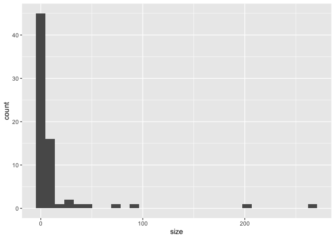
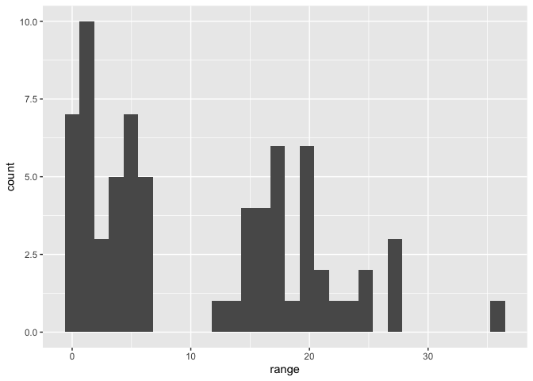
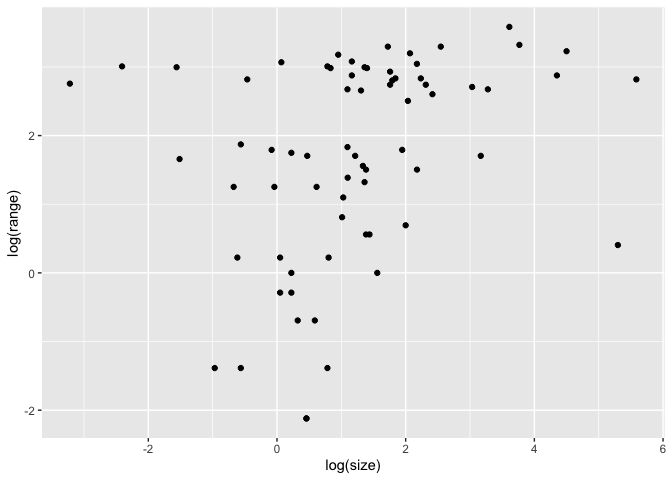
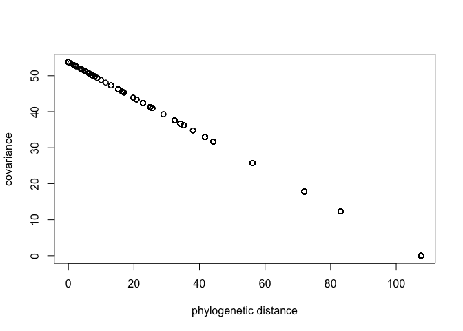

# 1) Load the data as follows:

```r
library(tidyverse)
```

```
## ── Attaching packages ─────────────────────────────────────────────────── tidyverse 1.3.0 ──
```

```
## ✓ ggplot2 3.3.0     ✓ purrr   0.3.3
## ✓ tibble  2.1.3     ✓ dplyr   0.8.4
## ✓ tidyr   1.0.2     ✓ stringr 1.4.0
## ✓ readr   1.3.1     ✓ forcats 0.5.0
```

```
## ── Conflicts ────────────────────────────────────────────────────── tidyverse_conflicts() ──
## x dplyr::filter() masks stats::filter()
## x dplyr::lag()    masks stats::lag()
```

```r
library(rethinking)
```

```
## Loading required package: rstan
```

```
## Loading required package: StanHeaders
```

```
## rstan (Version 2.21.1, GitRev: 2e1f913d3ca3)
```

```
## For execution on a local, multicore CPU with excess RAM we recommend calling
## options(mc.cores = parallel::detectCores()).
## To avoid recompilation of unchanged Stan programs, we recommend calling
## rstan_options(auto_write = TRUE)
```

```
## 
## Attaching package: 'rstan'
```

```
## The following object is masked from 'package:tidyr':
## 
##     extract
```

```
## Loading required package: parallel
```

```
## Loading required package: dagitty
```

```
## rethinking (Version 1.95)
```

```
## 
## Attaching package: 'rethinking'
```

```
## The following object is masked from 'package:purrr':
## 
##     map
```

```
## The following object is masked from 'package:stats':
## 
##     rstudent
```

```r
library(ape)
```

```
## 
## Attaching package: 'ape'
```

```
## The following object is masked from 'package:dagitty':
## 
##     edges
```

```r
library(ade4)
data("carni70")
tre <- read.tree(text=carni70$tre)
d <- carni70$tab
?carni70
# "This data set describes the phylogeny of 70 carnivora as reported by Diniz-Filho and Torres (2002). It also gives the geographic range size and body size corresponding to these 70 species."
```

# 2) Note that the species name given in "rownames(d)" and in "tre$tip.label" do not match.  Fix that (e.g. using str_replace() )

```r
rownames(d) # "_"
```

```
##  [1] "Puma_concolor"            "Herpailurus_yaguaroundi" 
##  [3] "Leopardus_wiedii"         "Leopardus_pardalis"      
##  [5] "Oreailurus_jacobita"      "Oncifelis_colocolo"      
##  [7] "Oncifelis_guigna"         "Oncifelis_geoffroyi"     
##  [9] "Leopardus_tigrinus"       "Lynx_rufus"              
## [11] "Lynx_canadensis"          "Panthera_onca"           
## [13] "Urocyon_cinereoargenteus" "Vulpes_velox"            
## [15] "Vulpes_vulpes"            "Speothos_venaticus"      
## [17] "Chrysocyon_brachyurus"    "Cerdocyon_thous"         
## [19] "Atelocynus_microtis"      "Pseudalopex_vetulus"     
## [21] "Pseudalopex_sechurae"     "Pseudalopex_gymnocercus" 
## [23] "Pseudalopex_griseus"      "Pseudalopex_culpaeus"    
## [25] "Canis_latrans"            "Canis_lupus"             
## [27] "Tremarctos_ornatus"       "Ursus_americanus"        
## [29] "Ursus_arctos"             "Potos_flavus"            
## [31] "Bassariscus_pauli"        "Bassariscus_lasius"      
## [33] "Bassariscus_gabbii"       "Bassariscus_beddardi"    
## [35] "Bassariscus_alleni"       "Bassariscus_sumichrasti" 
## [37] "Bassariscus_astutus"      "Nasuella_olivacea"       
## [39] "Nasua_nasua"              "Nasua_narica"            
## [41] "Procyon_lotor"            "Procyon_cancrivorus"     
## [43] "Spilogale_pygmaea"        "Spilogale_putorius"      
## [45] "Mephitis_mephitis"        "Mephitis_macroura"       
## [47] "Conepatus_semistriatus"   "Conepatus_humboldtti"    
## [49] "Conepatus_mesoleucus"     "Conepatus_leuconotus"    
## [51] "Conepatus_chinga"         "Pteronura_brasiliensis"  
## [53] "Lontra_canadensis"        "Lontra_longicaudis"      
## [55] "Lontra_provocax"          "Taxidea_taxus"           
## [57] "Lyncodon_patagonicus"     "Galictis_vittata"        
## [59] "Galictis_cuja"            "Eira_barbara"            
## [61] "Gulo_gulo"                "Martes_pennanti"         
## [63] "Martes_americana"         "Mustela_vison"           
## [65] "Mustela_felipei"          "Mustela_africana"        
## [67] "Mustela_nivalis"          "Mustela_frenata"         
## [69] "Mustela_erminea"          "Mustela_nigripes"
```

```r
tre$tip.label # "."  
```

```
##  [1] "Puma.concolor"            "Herpailurus.yaguaroundi" 
##  [3] "Leopardus.wiedii"         "Leopardus.pardalis"      
##  [5] "Oreailurus.jacobita"      "Oncifelis.colocolo"      
##  [7] "Oncifelis.guigna"         "Oncifelis.geoffroyi"     
##  [9] "Leopardus.tigrinus"       "Lynx.rufus"              
## [11] "Lynx.canadensis"          "Panthera.onca"           
## [13] "Urocyon.cinereoargenteus" "Vulpes.velox"            
## [15] "Vulpes.vulpes"            "Speothos.venaticus"      
## [17] "Chrysocyon.brachyurus"    "Cerdocyon.thous"         
## [19] "Atelocynus.microtis"      "Pseudalopex.vetulus"     
## [21] "Pseudalopex.sechurae"     "Pseudalopex.gymnocercus" 
## [23] "Pseudalopex.griseus"      "Pseudalopex.culpaeus"    
## [25] "Canis.latrans"            "Canis.lupus"             
## [27] "Tremarctos.ornatus"       "Ursus.americanus"        
## [29] "Ursus.arctos"             "Potos.flavus"            
## [31] "Bassariscus.pauli"        "Bassariscus.lasius"      
## [33] "Bassariscus.gabbii"       "Bassariscus.beddardi"    
## [35] "Bassariscus.alleni"       "Bassariscus.sumichrasti" 
## [37] "Bassariscus.astutus"      "Nasuella.olivacea"       
## [39] "Nasua.nasua"              "Nasua.narica"            
## [41] "Procyon.lotor"            "Procyon.cancrivorus"     
## [43] "Spilogale.pygmaea"        "Spilogale.putorius"      
## [45] "Mephitis.mephitis"        "Mephitis.macroura"       
## [47] "Conepatus.semistriatus"   "Conepatus.humboldtti"    
## [49] "Conepatus.mesoleucus"     "Conepatus.leuconotus"    
## [51] "Conepatus.chinga"         "Pteronura.brasiliensis"  
## [53] "Lontra.canadensis"        "Lontra.longicaudis"      
## [55] "Lontra.provocax"          "Taxidea.taxus"           
## [57] "Lyncodon.patagonicus"     "Galictis.vittata"        
## [59] "Galictis.cuja"            "Eira.barbara"            
## [61] "Gulo.gulo"                "Martes.pennanti"         
## [63] "Martes.americana"         "Mustela.vison"           
## [65] "Mustela.felipei"          "Mustela.africana"        
## [67] "Mustela.nivalis"          "Mustela.frenata"         
## [69] "Mustela.erminea"          "Mustela.nigripes"
```

```r
tre$tip.label %in% str_replace(rownames(d),"_","\\.") # all "TRUE"
```

```
##  [1] TRUE TRUE TRUE TRUE TRUE TRUE TRUE TRUE TRUE TRUE TRUE TRUE TRUE TRUE TRUE
## [16] TRUE TRUE TRUE TRUE TRUE TRUE TRUE TRUE TRUE TRUE TRUE TRUE TRUE TRUE TRUE
## [31] TRUE TRUE TRUE TRUE TRUE TRUE TRUE TRUE TRUE TRUE TRUE TRUE TRUE TRUE TRUE
## [46] TRUE TRUE TRUE TRUE TRUE TRUE TRUE TRUE TRUE TRUE TRUE TRUE TRUE TRUE TRUE
## [61] TRUE TRUE TRUE TRUE TRUE TRUE TRUE TRUE TRUE TRUE
```

```r
# copied from R code 14.47
spp_obs <- str_replace(rownames(d), pattern="_", replacement = ".")
tree_trimmed <- keep.tip( tre, spp_obs )
```

# 3) Should either range or size be transformed?

```r
d %>% ggplot(aes(x=size)) + geom_histogram()
```

```
## `stat_bin()` using `bins = 30`. Pick better value with `binwidth`.
```

<!-- -->

```r
d %>% ggplot(aes(x=range)) + geom_histogram()
```

```
## `stat_bin()` using `bins = 30`. Pick better value with `binwidth`.
```

<!-- -->

```r
# When I need to think about tranformation?

# correlation between size and range?
d %>% ggplot(aes(x=log(size),y=log(range))) + geom_point()
```

<!-- -->

```r
# I do not know. Anyway standardize? (see R code 14.48)
dat_list <- list(
    N_spp = nrow(d),
    logsize = standardize(log(d$size)),
    logrange = standardize(log(d$range)),
    Imat = diag( nrow(d) )
)

# R code 14.49
Rbm <- corBrownian( phy=tree_trimmed )
V <- vcv(Rbm) # warning
```

```
## Warning in Initialize.corPhyl(phy, dummy.df): No covariate specified, species
## will be taken as ordered in the data frame. To avoid this message, specify a
## covariate containing the species names with the 'form' argument.
```

```r
Dmat <- cophenetic( tree_trimmed )
plot( Dmat , V , xlab="phylogenetic distance" , ylab="covariance" )
```

<!-- -->

# 4) Does size predict range?  Evaluate this question without and with accounting for phylogenetic relationships.

# copy and modified from R code 14.50

```r
# put species in right order
dat_list$V <- V[ spp_obs , spp_obs ]
# convert to correlation matrix
dat_list$R <- dat_list$V / max(V)
# add scaled and reordered distance matrix
dat_list$Dmat <- Dmat[ spp_obs , spp_obs ] / max(Dmat)

# Brownian motion model
m14.9.mod <- ulam(
    alist(
        logrange ~ multi_normal( mu , SIGMA ),
        mu <- a + b*logsize,
        matrix[N_spp,N_spp]: SIGMA <- R * sigma_sq,
        a ~ normal( 0 , 1 ),
        b ~ normal( 0 , 0.5 ),
        sigma_sq ~ exponential( 1 )
    ), data=dat_list , chains=4 , cores=4)
```

```
## Trying to compile a simple C file
```

```
## Running /Library/Frameworks/R.framework/Resources/bin/R CMD SHLIB foo.c
## clang -I"/Library/Frameworks/R.framework/Resources/include" -DNDEBUG   -I"/Library/Frameworks/R.framework/Versions/3.6/Resources/library/Rcpp/include/"  -I"/Library/Frameworks/R.framework/Versions/3.6/Resources/library/RcppEigen/include/"  -I"/Library/Frameworks/R.framework/Versions/3.6/Resources/library/RcppEigen/include/unsupported"  -I"/Library/Frameworks/R.framework/Versions/3.6/Resources/library/BH/include" -I"/Library/Frameworks/R.framework/Versions/3.6/Resources/library/StanHeaders/include/src/"  -I"/Library/Frameworks/R.framework/Versions/3.6/Resources/library/StanHeaders/include/"  -I"/Library/Frameworks/R.framework/Versions/3.6/Resources/library/RcppParallel/include/"  -I"/Library/Frameworks/R.framework/Versions/3.6/Resources/library/rstan/include" -DEIGEN_NO_DEBUG  -DBOOST_DISABLE_ASSERTS  -DBOOST_PENDING_INTEGER_LOG2_HPP  -DSTAN_THREADS  -include stan/math/prim/mat/fun/Eigen.hpp  -D_REENTRANT  "-isystem /Library/Developer/CommandLineTools/SDKs/MacOSX.sdk/usr/include"  -fPIC  -isysroot /Library/Developer/CommandLineTools/SDKs/MacOSX.sdk -c foo.c -o foo.o
## In file included from <built-in>:1:
## In file included from /Library/Frameworks/R.framework/Versions/3.6/Resources/library/StanHeaders/include/stan/math/prim/mat/fun/Eigen.hpp:13:
## In file included from /Library/Frameworks/R.framework/Versions/3.6/Resources/library/RcppEigen/include/Eigen/Dense:1:
## In file included from /Library/Frameworks/R.framework/Versions/3.6/Resources/library/RcppEigen/include/Eigen/Core:88:
## /Library/Frameworks/R.framework/Versions/3.6/Resources/library/RcppEigen/include/Eigen/src/Core/util/Macros.h:613:1: error: unknown type name 'namespace'
## namespace Eigen {
## ^
## /Library/Frameworks/R.framework/Versions/3.6/Resources/library/RcppEigen/include/Eigen/src/Core/util/Macros.h:613:16: error: expected ';' after top level declarator
## namespace Eigen {
##                ^
##                ;
## In file included from <built-in>:1:
## In file included from /Library/Frameworks/R.framework/Versions/3.6/Resources/library/StanHeaders/include/stan/math/prim/mat/fun/Eigen.hpp:13:
## In file included from /Library/Frameworks/R.framework/Versions/3.6/Resources/library/RcppEigen/include/Eigen/Dense:1:
## /Library/Frameworks/R.framework/Versions/3.6/Resources/library/RcppEigen/include/Eigen/Core:96:10: fatal error: 'complex' file not found
## #include <complex>
##          ^~~~~~~~~
## 3 errors generated.
## make: *** [foo.o] Error 1
```

```r
precis( m14.9.mod )
```

```
##               mean        sd        5.5%     94.5%    n_eff     Rhat4
## a        0.0157923 0.8557097 -1.34351925  1.365081 1919.828 0.9991202
## b        0.3534170 0.1826570  0.05761429  0.641300 2056.103 0.9995818
## sigma_sq 9.2458641 1.3106012  7.35219554 11.459800 1960.576 1.0020563
```

# Copy and modified R coe 14.51

```r
# add scaled and reordered distance matrix
dat_list$Dmat <- Dmat[ spp_obs , spp_obs ] / max(Dmat)
m14.10.mod <- ulam(
    alist(
        logrange ~ multi_normal( mu , SIGMA ),
        mu <- a + b*logsize,
        matrix[N_spp,N_spp]: SIGMA <- cov_GPL2( Dmat , etasq , rhosq , 0.01 ),
        a ~ normal(0,1),
        b ~ normal(0,0.5),
        etasq ~ exponential(1),
        rhosq ~ exponential(1)
    ), data=dat_list , chains=4 , cores=4 )
```

```
## Trying to compile a simple C file
```

```
## Running /Library/Frameworks/R.framework/Resources/bin/R CMD SHLIB foo.c
## clang -I"/Library/Frameworks/R.framework/Resources/include" -DNDEBUG   -I"/Library/Frameworks/R.framework/Versions/3.6/Resources/library/Rcpp/include/"  -I"/Library/Frameworks/R.framework/Versions/3.6/Resources/library/RcppEigen/include/"  -I"/Library/Frameworks/R.framework/Versions/3.6/Resources/library/RcppEigen/include/unsupported"  -I"/Library/Frameworks/R.framework/Versions/3.6/Resources/library/BH/include" -I"/Library/Frameworks/R.framework/Versions/3.6/Resources/library/StanHeaders/include/src/"  -I"/Library/Frameworks/R.framework/Versions/3.6/Resources/library/StanHeaders/include/"  -I"/Library/Frameworks/R.framework/Versions/3.6/Resources/library/RcppParallel/include/"  -I"/Library/Frameworks/R.framework/Versions/3.6/Resources/library/rstan/include" -DEIGEN_NO_DEBUG  -DBOOST_DISABLE_ASSERTS  -DBOOST_PENDING_INTEGER_LOG2_HPP  -DSTAN_THREADS  -include stan/math/prim/mat/fun/Eigen.hpp  -D_REENTRANT  "-isystem /Library/Developer/CommandLineTools/SDKs/MacOSX.sdk/usr/include"  -fPIC  -isysroot /Library/Developer/CommandLineTools/SDKs/MacOSX.sdk -c foo.c -o foo.o
## In file included from <built-in>:1:
## In file included from /Library/Frameworks/R.framework/Versions/3.6/Resources/library/StanHeaders/include/stan/math/prim/mat/fun/Eigen.hpp:13:
## In file included from /Library/Frameworks/R.framework/Versions/3.6/Resources/library/RcppEigen/include/Eigen/Dense:1:
## In file included from /Library/Frameworks/R.framework/Versions/3.6/Resources/library/RcppEigen/include/Eigen/Core:88:
## /Library/Frameworks/R.framework/Versions/3.6/Resources/library/RcppEigen/include/Eigen/src/Core/util/Macros.h:613:1: error: unknown type name 'namespace'
## namespace Eigen {
## ^
## /Library/Frameworks/R.framework/Versions/3.6/Resources/library/RcppEigen/include/Eigen/src/Core/util/Macros.h:613:16: error: expected ';' after top level declarator
## namespace Eigen {
##                ^
##                ;
## In file included from <built-in>:1:
## In file included from /Library/Frameworks/R.framework/Versions/3.6/Resources/library/StanHeaders/include/stan/math/prim/mat/fun/Eigen.hpp:13:
## In file included from /Library/Frameworks/R.framework/Versions/3.6/Resources/library/RcppEigen/include/Eigen/Dense:1:
## /Library/Frameworks/R.framework/Versions/3.6/Resources/library/RcppEigen/include/Eigen/Core:96:10: fatal error: 'complex' file not found
## #include <complex>
##          ^~~~~~~~~
## 3 errors generated.
## make: *** [foo.o] Error 1
```

```r
precis( m14.10.mod )
```

```
##             mean        sd       5.5%      94.5%    n_eff     Rhat4
## a     -0.1261442 0.6482539 -1.1734448  0.8691899 1577.322 0.9988517
## b      0.3884142 0.1692863  0.1151497  0.6573649 1460.820 0.9996790
## etasq 11.9322700 2.4189358  8.4982983 16.0949755 1151.356 1.0064908
## rhosq 23.1922416 4.3063848 16.6163485 30.3187028 1123.962 1.0039071
```
* Since b is positive and slighly higher (0.39 or 0.36) in both models, log size matters.

# 5) Discuss your findings.


