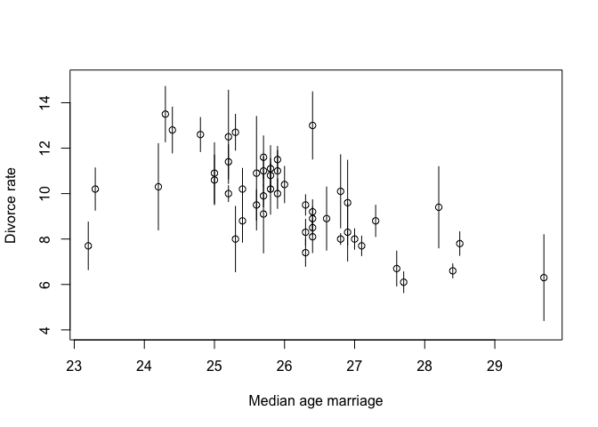
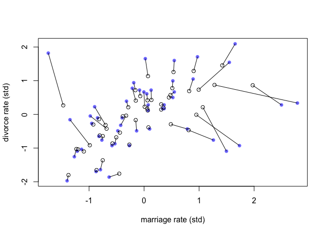
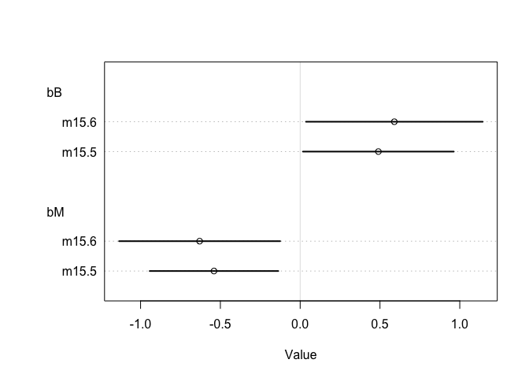
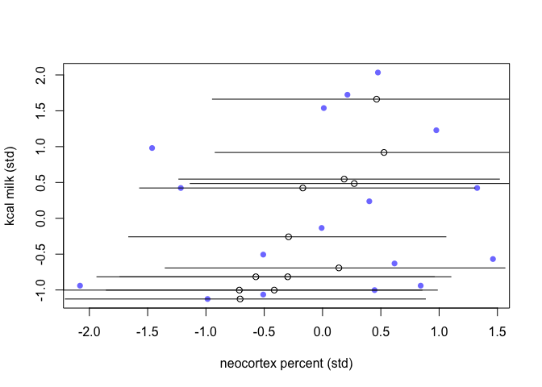
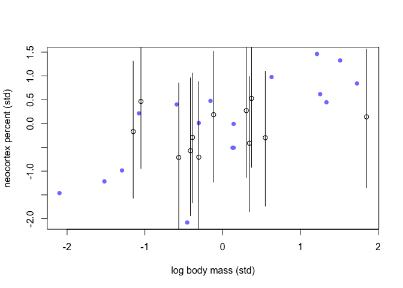
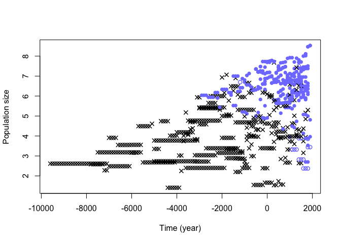

## R code 15.1
# simulate a pancake and return randomly ordered sides

```r
# barned:1, unbarned:0
sim_pancake <- function() {
    pancake <- sample(1:3,1)
    sides <- matrix(c(1,1,1,0,0,0),2,3)[,pancake]
    sample(sides)
}
```
# sim 10,000 pancakes

```r
pancakes <- replicate( 1e4 , sim_pancake() )
up <- pancakes[1,]
down <- pancakes[2,]
```
# compute proportion 1/1 (BB) out of all 1/1 and 1/0

```r
num_11_10 <- sum( up==1 )
num_11 <- sum( up==1 & down==1 )
num_11/num_11_10
```

```
## [1] 0.662573
```
## R code 15.2

```r
library(rethinking)
data(WaffleDivorce)
d <- WaffleDivorce
summary(d) # added by Kazu
```

```
##        Location       Loc       Population     MedianAgeMarriage
##  Alabama   : 1   AK     : 1   Min.   : 0.560   Min.   :23.20    
##  Alaska    : 1   AL     : 1   1st Qu.: 1.635   1st Qu.:25.32    
##  Arizona   : 1   AR     : 1   Median : 4.435   Median :25.90    
##  Arkansas  : 1   AZ     : 1   Mean   : 6.120   Mean   :26.05    
##  California: 1   CA     : 1   3rd Qu.: 6.678   3rd Qu.:26.75    
##  Colorado  : 1   CO     : 1   Max.   :37.250   Max.   :29.70    
##  (Other)   :44   (Other):44                                     
##     Marriage      Marriage.SE       Divorce         Divorce.SE    
##  Min.   :13.50   Min.   :0.390   Min.   : 6.100   Min.   :0.2400  
##  1st Qu.:17.12   1st Qu.:0.810   1st Qu.: 8.300   1st Qu.:0.5725  
##  Median :19.70   Median :1.185   Median : 9.750   Median :0.7950  
##  Mean   :20.11   Mean   :1.399   Mean   : 9.688   Mean   :0.9618  
##  3rd Qu.:22.10   3rd Qu.:1.768   3rd Qu.:10.900   3rd Qu.:1.2575  
##  Max.   :30.70   Max.   :3.920   Max.   :13.500   Max.   :2.5000  
##                                                                   
##   WaffleHouses        South        Slaves1860     Population1860   
##  Min.   :  0.00   Min.   :0.00   Min.   :     0   Min.   :      0  
##  1st Qu.:  0.00   1st Qu.:0.00   1st Qu.:     0   1st Qu.:  43321  
##  Median :  1.00   Median :0.00   Median :     0   Median : 407722  
##  Mean   : 32.34   Mean   :0.28   Mean   : 79378   Mean   : 628729  
##  3rd Qu.: 39.75   3rd Qu.:1.00   3rd Qu.: 80828   3rd Qu.: 920977  
##  Max.   :381.00   Max.   :1.00   Max.   :490865   Max.   :3880735  
##                                                                    
##  PropSlaves1860   
##  Min.   :0.00000  
##  1st Qu.:0.00000  
##  Median :0.00000  
##  Mean   :0.09405  
##  3rd Qu.:0.08500  
##  Max.   :0.57000  
## 
```

```r
# points
plot( d$Divorce ~ d$MedianAgeMarriage , ylim=c(4,15) ,
    xlab="Median age marriage" , ylab="Divorce rate" )
# standard errors
for ( i in 1:nrow(d) ) {
    ci <- d$Divorce[i] + c(-1,1)*d$Divorce.SE[i]
    x <- d$MedianAgeMarriage[i]
    lines( c(x,x) , ci )
}
```

<!-- -->
## R code 15.3

```r
dlist <- list(
    D_obs = standardize( d$Divorce ),
    D_sd = d$Divorce.SE / sd( d$Divorce ),
    M = standardize( d$Marriage ),
    A = standardize( d$MedianAgeMarriage ),
    N = nrow(d)
)
m15.1 <- ulam(
    alist(
        D_obs ~ dnorm( D_true , D_sd ),
        vector[N]:D_true ~ dnorm( mu , sigma ),
        mu <- a + bA*A + bM*M,
        a ~ dnorm(0,0.2),
        bA ~ dnorm(0,0.5),
        bM ~ dnorm(0,0.5),
        sigma ~ dexp(1)
    ) , data=dlist , chains=4 , cores=4 )
```
## R code 15.4

```r
precis( m15.1 , depth=2 )
```

```
##                   mean         sd        5.5%       94.5%     n_eff     Rhat4
## D_true[1]   1.16540085 0.37138459  0.57787465  1.74612352 1642.6186 1.0034413
## D_true[2]   0.68564294 0.54831341 -0.18254807  1.57201009 2184.1458 0.9983413
## D_true[3]   0.42389719 0.32316066 -0.08542735  0.95002742 2414.3605 0.9993545
## D_true[4]   1.42614568 0.46415210  0.70974954  2.21088895 2370.6517 0.9997118
## D_true[5]  -0.90262683 0.13057057 -1.10916070 -0.69159215 2774.7373 0.9985751
## D_true[6]   0.66019681 0.39934032  0.03841182  1.31417239 1898.1119 1.0014958
## D_true[7]  -1.37257379 0.35437850 -1.93789866 -0.79493086 2110.4624 0.9996377
## D_true[8]  -0.31984208 0.48406487 -1.10048082  0.44232839 2198.3496 0.9998235
## D_true[9]  -1.88268008 0.58880920 -2.84336710 -0.95405934 1695.9922 0.9989522
## D_true[10] -0.62035379 0.17310321 -0.89063258 -0.34137593 2688.7838 0.9985809
## D_true[11]  0.76877842 0.29344519  0.29213360  1.22217264 2346.0745 0.9987345
## D_true[12] -0.55846032 0.45989598 -1.30719529  0.16617315 1814.9134 1.0000231
## D_true[13]  0.18837232 0.50414128 -0.64777511  0.94809406  926.8809 1.0054797
## D_true[14] -0.86079058 0.22390414 -1.22014236 -0.49721583 2027.3924 1.0006274
## D_true[15]  0.56405919 0.30256303  0.09090767  1.05074029 1839.9496 1.0008185
## D_true[16]  0.28995490 0.36242912 -0.29726564  0.86577973 2702.6464 0.9984926
## D_true[17]  0.50027919 0.41775740 -0.15649041  1.15461426 2765.5464 0.9992701
## D_true[18]  1.27453654 0.35111956  0.71748475  1.84123995 1516.4434 1.0018540
## D_true[19]  0.43652142 0.37492326 -0.14588012  1.02933683 2290.4070 0.9997090
## D_true[20]  0.41877039 0.56639342 -0.45009926  1.38610649 1472.0218 1.0009275
## D_true[21] -0.54982181 0.32760740 -1.05300576 -0.01728643 2514.9209 1.0004464
## D_true[22] -1.09944015 0.26509908 -1.51890894 -0.66440037 1944.4615 1.0001126
## D_true[23] -0.27572372 0.26483607 -0.69639749  0.13500801 2821.1425 0.9984763
## D_true[24] -1.00031826 0.29929551 -1.48174438 -0.53123423 2398.6434 0.9993193
## D_true[25]  0.42680720 0.40641263 -0.24118207  1.07929124 1978.1644 1.0003417
## D_true[26] -0.02216467 0.30941744 -0.50900701  0.46951009 2298.4035 0.9988240
## D_true[27] -0.01498869 0.50399318 -0.80059926  0.79538439 2257.6356 1.0004747
## D_true[28] -0.14300927 0.40366258 -0.79981106  0.48868313 3031.7701 0.9988098
## D_true[29] -0.26185113 0.48986847 -1.01168876  0.55665735 2594.4151 0.9995490
## D_true[30] -1.79715669 0.24132041 -2.17687908 -1.42212330 2557.9752 0.9986924
## D_true[31]  0.18305477 0.43862603 -0.49188121  0.88238875 2314.3252 0.9995864
## D_true[32] -1.66168296 0.16498208 -1.92627731 -1.40572389 2309.9502 0.9998061
## D_true[33]  0.12079341 0.24383526 -0.26530725  0.51443780 2663.6639 0.9984126
## D_true[34] -0.05277355 0.49769354 -0.87665374  0.71891147 1865.7998 1.0010600
## D_true[35] -0.11439110 0.23226791 -0.47494331  0.26604342 2511.8839 0.9990881
## D_true[36]  1.28171698 0.41317667  0.61051919  1.94212183 2336.6930 0.9986876
## D_true[37]  0.22842752 0.35079748 -0.30912208  0.80494629 2739.4661 0.9984519
## D_true[38] -1.02326001 0.21688235 -1.38525669 -0.67493299 3243.4571 0.9985578
## D_true[39] -0.90926053 0.53814752 -1.74681729 -0.03524543 2115.6399 0.9989237
## D_true[40] -0.68211080 0.32913821 -1.18817638 -0.15320230 2634.4474 0.9991782
## D_true[41]  0.24859993 0.56742465 -0.64450505  1.14677681 2522.2405 0.9999465
## D_true[42]  0.74434318 0.34874111  0.19562298  1.30940649 2489.4045 1.0004648
## D_true[43]  0.18936172 0.17922784 -0.09458868  0.47392779 2622.1021 0.9998763
## D_true[44]  0.80053994 0.43563961  0.09156905  1.47410372 1565.7033 0.9993916
## D_true[45] -0.41633228 0.52410680 -1.22880373  0.42551115 2598.9558 1.0002229
## D_true[46] -0.38420402 0.25274929 -0.79656180  0.02150721 2711.0255 0.9994457
## D_true[47]  0.13240048 0.31758334 -0.36019480  0.63209933 2127.7276 1.0006910
## D_true[48]  0.56015171 0.47599519 -0.19110572  1.30379045 2569.5324 0.9996139
## D_true[49] -0.63672841 0.27337161 -1.07571360 -0.19843884 3403.6311 0.9987732
## D_true[50]  0.88556974 0.57704790 -0.04485786  1.79405133 1587.8727 0.9999129
## a          -0.04957681 0.09762012 -0.20400448  0.11023463 1732.4184 0.9993467
## bA         -0.61288803 0.15900944 -0.86764819 -0.35876401 1199.8173 1.0005718
## bM          0.05621823 0.16947563 -0.21991102  0.32513484 1181.8459 0.9999448
## sigma       0.58692251 0.11131604  0.42614047  0.78077493  533.8592 1.0070286
```
## R code 15.5

```r
dlist <- list(
    D_obs = standardize( d$Divorce ),
    D_sd = d$Divorce.SE / sd( d$Divorce ),
    M_obs = standardize( d$Marriage ),
    M_sd = d$Marriage.SE / sd( d$Marriage ),
    A = standardize( d$MedianAgeMarriage ),
    N = nrow(d)
)

m15.2 <- ulam(
    alist(
        D_obs ~ dnorm( D_true , D_sd ),
        vector[N]:D_true ~ dnorm( mu , sigma ),
        mu <- a + bA*A + bM*M_true[i],
        M_obs ~ dnorm( M_true , M_sd ),
        vector[N]:M_true ~ dnorm( 0 , 1 ),
        a ~ dnorm(0,0.2),
        bA ~ dnorm(0,0.5),
        bM ~ dnorm(0,0.5),
        sigma ~ dexp( 1 )
    ) , data=dlist , chains=4 , cores=4 )
```
## R code 15.6

```r
post <- extract.samples( m15.2 )
D_true <- apply( post$D_true , 2 , mean )
M_true <- apply( post$M_true , 2 , mean )
plot( dlist$M_obs , dlist$D_obs , pch=16 , col=rangi2 ,
    xlab="marriage rate (std)" , ylab="divorce rate (std)" )
points( M_true , D_true )
for ( i in 1:nrow(d) )
    lines( c( dlist$M_obs[i] , M_true[i] ) , c( dlist$D_obs[i] , D_true[i] ) )
```

<!-- -->
## R code 15.7

```r
N <- 500
A <- rnorm(N)
M <- rnorm(N,-A)
D <- rnorm(N,A)
A_obs <- rnorm(N,A)
```
## R code 15.8

```r
N <- 100
S <- rnorm( N )
H <- rbinom( N , size=10 , inv_logit(S) )
```
## R code 15.9

```r
D <- rbern( N ) # dogs completely random
Hm <- H
Hm[D==1] <- NA
```
## R code 15.10

```r
D <- ifelse( S > 0 , 1 , 0 )
Hm <- H
Hm[D==1] <- NA
```
## R code 15.11

```r
set.seed(501)
N <- 1000
X <- rnorm(N)
S <- rnorm(N)
H <- rbinom( N , size=10 , inv_logit( 2 + S - 2*X ) )
D <- ifelse( X > 1 , 1 , 0 )
Hm <- H
Hm[D==1] <- NA
```
## R code 15.12

```r
dat_list <- list(
    H = H,
    S = S )

m15.3 <- ulam(
    alist(
        H ~ binomial( 10 , p ),
        logit(p) <- a + bS*S,
        a ~ normal( 0 , 1 ),
        bS ~ normal( 0 , 0.5 )
    ), data=dat_list , chains=4 )
```

```
## 
## SAMPLING FOR MODEL '2bb0a713caeb1f1303ec81a76cfc0f03' NOW (CHAIN 1).
## Chain 1: 
## Chain 1: Gradient evaluation took 0.000128 seconds
## Chain 1: 1000 transitions using 10 leapfrog steps per transition would take 1.28 seconds.
## Chain 1: Adjust your expectations accordingly!
## Chain 1: 
## Chain 1: 
## Chain 1: Iteration:   1 / 1000 [  0%]  (Warmup)
## Chain 1: Iteration: 100 / 1000 [ 10%]  (Warmup)
## Chain 1: Iteration: 200 / 1000 [ 20%]  (Warmup)
## Chain 1: Iteration: 300 / 1000 [ 30%]  (Warmup)
## Chain 1: Iteration: 400 / 1000 [ 40%]  (Warmup)
## Chain 1: Iteration: 500 / 1000 [ 50%]  (Warmup)
## Chain 1: Iteration: 501 / 1000 [ 50%]  (Sampling)
## Chain 1: Iteration: 600 / 1000 [ 60%]  (Sampling)
## Chain 1: Iteration: 700 / 1000 [ 70%]  (Sampling)
## Chain 1: Iteration: 800 / 1000 [ 80%]  (Sampling)
## Chain 1: Iteration: 900 / 1000 [ 90%]  (Sampling)
## Chain 1: Iteration: 1000 / 1000 [100%]  (Sampling)
## Chain 1: 
## Chain 1:  Elapsed Time: 0.294101 seconds (Warm-up)
## Chain 1:                0.400581 seconds (Sampling)
## Chain 1:                0.694682 seconds (Total)
## Chain 1: 
## 
## SAMPLING FOR MODEL '2bb0a713caeb1f1303ec81a76cfc0f03' NOW (CHAIN 2).
## Chain 2: 
## Chain 2: Gradient evaluation took 0.000134 seconds
## Chain 2: 1000 transitions using 10 leapfrog steps per transition would take 1.34 seconds.
## Chain 2: Adjust your expectations accordingly!
## Chain 2: 
## Chain 2: 
## Chain 2: Iteration:   1 / 1000 [  0%]  (Warmup)
## Chain 2: Iteration: 100 / 1000 [ 10%]  (Warmup)
## Chain 2: Iteration: 200 / 1000 [ 20%]  (Warmup)
## Chain 2: Iteration: 300 / 1000 [ 30%]  (Warmup)
## Chain 2: Iteration: 400 / 1000 [ 40%]  (Warmup)
## Chain 2: Iteration: 500 / 1000 [ 50%]  (Warmup)
## Chain 2: Iteration: 501 / 1000 [ 50%]  (Sampling)
## Chain 2: Iteration: 600 / 1000 [ 60%]  (Sampling)
## Chain 2: Iteration: 700 / 1000 [ 70%]  (Sampling)
## Chain 2: Iteration: 800 / 1000 [ 80%]  (Sampling)
## Chain 2: Iteration: 900 / 1000 [ 90%]  (Sampling)
## Chain 2: Iteration: 1000 / 1000 [100%]  (Sampling)
## Chain 2: 
## Chain 2:  Elapsed Time: 0.286556 seconds (Warm-up)
## Chain 2:                0.254152 seconds (Sampling)
## Chain 2:                0.540708 seconds (Total)
## Chain 2: 
## 
## SAMPLING FOR MODEL '2bb0a713caeb1f1303ec81a76cfc0f03' NOW (CHAIN 3).
## Chain 3: 
## Chain 3: Gradient evaluation took 8.8e-05 seconds
## Chain 3: 1000 transitions using 10 leapfrog steps per transition would take 0.88 seconds.
## Chain 3: Adjust your expectations accordingly!
## Chain 3: 
## Chain 3: 
## Chain 3: Iteration:   1 / 1000 [  0%]  (Warmup)
## Chain 3: Iteration: 100 / 1000 [ 10%]  (Warmup)
## Chain 3: Iteration: 200 / 1000 [ 20%]  (Warmup)
## Chain 3: Iteration: 300 / 1000 [ 30%]  (Warmup)
## Chain 3: Iteration: 400 / 1000 [ 40%]  (Warmup)
## Chain 3: Iteration: 500 / 1000 [ 50%]  (Warmup)
## Chain 3: Iteration: 501 / 1000 [ 50%]  (Sampling)
## Chain 3: Iteration: 600 / 1000 [ 60%]  (Sampling)
## Chain 3: Iteration: 700 / 1000 [ 70%]  (Sampling)
## Chain 3: Iteration: 800 / 1000 [ 80%]  (Sampling)
## Chain 3: Iteration: 900 / 1000 [ 90%]  (Sampling)
## Chain 3: Iteration: 1000 / 1000 [100%]  (Sampling)
## Chain 3: 
## Chain 3:  Elapsed Time: 0.283281 seconds (Warm-up)
## Chain 3:                0.249379 seconds (Sampling)
## Chain 3:                0.53266 seconds (Total)
## Chain 3: 
## 
## SAMPLING FOR MODEL '2bb0a713caeb1f1303ec81a76cfc0f03' NOW (CHAIN 4).
## Chain 4: 
## Chain 4: Gradient evaluation took 7.9e-05 seconds
## Chain 4: 1000 transitions using 10 leapfrog steps per transition would take 0.79 seconds.
## Chain 4: Adjust your expectations accordingly!
## Chain 4: 
## Chain 4: 
## Chain 4: Iteration:   1 / 1000 [  0%]  (Warmup)
## Chain 4: Iteration: 100 / 1000 [ 10%]  (Warmup)
## Chain 4: Iteration: 200 / 1000 [ 20%]  (Warmup)
## Chain 4: Iteration: 300 / 1000 [ 30%]  (Warmup)
## Chain 4: Iteration: 400 / 1000 [ 40%]  (Warmup)
## Chain 4: Iteration: 500 / 1000 [ 50%]  (Warmup)
## Chain 4: Iteration: 501 / 1000 [ 50%]  (Sampling)
## Chain 4: Iteration: 600 / 1000 [ 60%]  (Sampling)
## Chain 4: Iteration: 700 / 1000 [ 70%]  (Sampling)
## Chain 4: Iteration: 800 / 1000 [ 80%]  (Sampling)
## Chain 4: Iteration: 900 / 1000 [ 90%]  (Sampling)
## Chain 4: Iteration: 1000 / 1000 [100%]  (Sampling)
## Chain 4: 
## Chain 4:  Elapsed Time: 0.281887 seconds (Warm-up)
## Chain 4:                0.265975 seconds (Sampling)
## Chain 4:                0.547862 seconds (Total)
## Chain 4:
```

```r
precis( m15.3 )
```

```
##         mean         sd      5.5%     94.5%     n_eff    Rhat4
## a  1.1138049 0.02579002 1.0732201 1.1554344  940.5712 1.001608
## bS 0.6895852 0.02603040 0.6484871 0.7301994 1035.3165 1.003775
```
## R code 15.13

```r
dat_list0 <- list( H = H[D==0] , S = S[D==0] )

m15.4 <- ulam(
    alist(
        H ~ binomial( 10 , p ),
        logit(p) <- a + bS*S,
        a ~ normal( 0 , 1 ),
        bS ~ normal( 0 , 0.5 )
    ), data=dat_list0 , chains=4 )
```

```
## 
## SAMPLING FOR MODEL '131d32fcd754248651cabe3f76ca3d2c' NOW (CHAIN 1).
## Chain 1: 
## Chain 1: Gradient evaluation took 0.000112 seconds
## Chain 1: 1000 transitions using 10 leapfrog steps per transition would take 1.12 seconds.
## Chain 1: Adjust your expectations accordingly!
## Chain 1: 
## Chain 1: 
## Chain 1: Iteration:   1 / 1000 [  0%]  (Warmup)
## Chain 1: Iteration: 100 / 1000 [ 10%]  (Warmup)
## Chain 1: Iteration: 200 / 1000 [ 20%]  (Warmup)
## Chain 1: Iteration: 300 / 1000 [ 30%]  (Warmup)
## Chain 1: Iteration: 400 / 1000 [ 40%]  (Warmup)
## Chain 1: Iteration: 500 / 1000 [ 50%]  (Warmup)
## Chain 1: Iteration: 501 / 1000 [ 50%]  (Sampling)
## Chain 1: Iteration: 600 / 1000 [ 60%]  (Sampling)
## Chain 1: Iteration: 700 / 1000 [ 70%]  (Sampling)
## Chain 1: Iteration: 800 / 1000 [ 80%]  (Sampling)
## Chain 1: Iteration: 900 / 1000 [ 90%]  (Sampling)
## Chain 1: Iteration: 1000 / 1000 [100%]  (Sampling)
## Chain 1: 
## Chain 1:  Elapsed Time: 0.224502 seconds (Warm-up)
## Chain 1:                0.228484 seconds (Sampling)
## Chain 1:                0.452986 seconds (Total)
## Chain 1: 
## 
## SAMPLING FOR MODEL '131d32fcd754248651cabe3f76ca3d2c' NOW (CHAIN 2).
## Chain 2: 
## Chain 2: Gradient evaluation took 7e-05 seconds
## Chain 2: 1000 transitions using 10 leapfrog steps per transition would take 0.7 seconds.
## Chain 2: Adjust your expectations accordingly!
## Chain 2: 
## Chain 2: 
## Chain 2: Iteration:   1 / 1000 [  0%]  (Warmup)
## Chain 2: Iteration: 100 / 1000 [ 10%]  (Warmup)
## Chain 2: Iteration: 200 / 1000 [ 20%]  (Warmup)
## Chain 2: Iteration: 300 / 1000 [ 30%]  (Warmup)
## Chain 2: Iteration: 400 / 1000 [ 40%]  (Warmup)
## Chain 2: Iteration: 500 / 1000 [ 50%]  (Warmup)
## Chain 2: Iteration: 501 / 1000 [ 50%]  (Sampling)
## Chain 2: Iteration: 600 / 1000 [ 60%]  (Sampling)
## Chain 2: Iteration: 700 / 1000 [ 70%]  (Sampling)
## Chain 2: Iteration: 800 / 1000 [ 80%]  (Sampling)
## Chain 2: Iteration: 900 / 1000 [ 90%]  (Sampling)
## Chain 2: Iteration: 1000 / 1000 [100%]  (Sampling)
## Chain 2: 
## Chain 2:  Elapsed Time: 0.251316 seconds (Warm-up)
## Chain 2:                0.207484 seconds (Sampling)
## Chain 2:                0.4588 seconds (Total)
## Chain 2: 
## 
## SAMPLING FOR MODEL '131d32fcd754248651cabe3f76ca3d2c' NOW (CHAIN 3).
## Chain 3: 
## Chain 3: Gradient evaluation took 6.8e-05 seconds
## Chain 3: 1000 transitions using 10 leapfrog steps per transition would take 0.68 seconds.
## Chain 3: Adjust your expectations accordingly!
## Chain 3: 
## Chain 3: 
## Chain 3: Iteration:   1 / 1000 [  0%]  (Warmup)
## Chain 3: Iteration: 100 / 1000 [ 10%]  (Warmup)
## Chain 3: Iteration: 200 / 1000 [ 20%]  (Warmup)
## Chain 3: Iteration: 300 / 1000 [ 30%]  (Warmup)
## Chain 3: Iteration: 400 / 1000 [ 40%]  (Warmup)
## Chain 3: Iteration: 500 / 1000 [ 50%]  (Warmup)
## Chain 3: Iteration: 501 / 1000 [ 50%]  (Sampling)
## Chain 3: Iteration: 600 / 1000 [ 60%]  (Sampling)
## Chain 3: Iteration: 700 / 1000 [ 70%]  (Sampling)
## Chain 3: Iteration: 800 / 1000 [ 80%]  (Sampling)
## Chain 3: Iteration: 900 / 1000 [ 90%]  (Sampling)
## Chain 3: Iteration: 1000 / 1000 [100%]  (Sampling)
## Chain 3: 
## Chain 3:  Elapsed Time: 0.258185 seconds (Warm-up)
## Chain 3:                0.274188 seconds (Sampling)
## Chain 3:                0.532373 seconds (Total)
## Chain 3: 
## 
## SAMPLING FOR MODEL '131d32fcd754248651cabe3f76ca3d2c' NOW (CHAIN 4).
## Chain 4: 
## Chain 4: Gradient evaluation took 9.2e-05 seconds
## Chain 4: 1000 transitions using 10 leapfrog steps per transition would take 0.92 seconds.
## Chain 4: Adjust your expectations accordingly!
## Chain 4: 
## Chain 4: 
## Chain 4: Iteration:   1 / 1000 [  0%]  (Warmup)
## Chain 4: Iteration: 100 / 1000 [ 10%]  (Warmup)
## Chain 4: Iteration: 200 / 1000 [ 20%]  (Warmup)
## Chain 4: Iteration: 300 / 1000 [ 30%]  (Warmup)
## Chain 4: Iteration: 400 / 1000 [ 40%]  (Warmup)
## Chain 4: Iteration: 500 / 1000 [ 50%]  (Warmup)
## Chain 4: Iteration: 501 / 1000 [ 50%]  (Sampling)
## Chain 4: Iteration: 600 / 1000 [ 60%]  (Sampling)
## Chain 4: Iteration: 700 / 1000 [ 70%]  (Sampling)
## Chain 4: Iteration: 800 / 1000 [ 80%]  (Sampling)
## Chain 4: Iteration: 900 / 1000 [ 90%]  (Sampling)
## Chain 4: Iteration: 1000 / 1000 [100%]  (Sampling)
## Chain 4: 
## Chain 4:  Elapsed Time: 0.288537 seconds (Warm-up)
## Chain 4:                0.334739 seconds (Sampling)
## Chain 4:                0.623276 seconds (Total)
## Chain 4:
```

```r
precis( m15.4 )
```

```
##         mean         sd      5.5%     94.5%     n_eff    Rhat4
## a  1.7959583 0.03507498 1.7393783 1.8524947 1034.9354 1.000515
## bS 0.8286333 0.03541430 0.7738497 0.8862532  993.2018 1.001287
```
## R code 15.14

```r
D <- ifelse( abs(X) < 1 , 1 , 0 )
```
## R code 15.15

```r
N <- 100
S <- rnorm(N)
H <- rbinom( N , size=10 , inv_logit(S) )
D <- ifelse( H < 5 , 1 , 0 )
Hm <- H; Hm[D==1] <- NA
```
## R code 15.16

```r
library(rethinking)
data(milk)
d <- milk
d$neocortex.prop <- d$neocortex.perc / 100
d$logmass <- log(d$mass)
dat_list <- list(
    K = standardize( d$kcal.per.g ),
    B = standardize( d$neocortex.prop ),
    M = standardize( d$logmass ) )
```
## R code 15.17

```r
m15.5 <- ulam(
    alist(
        K ~ dnorm( mu , sigma ),
        mu <- a + bB*B + bM*M,
        B ~ dnorm( nu , sigma_B ),
        c(a,nu) ~ dnorm( 0 , 0.5 ),
        c(bB,bM) ~ dnorm( 0, 0.5 ),
        sigma_B ~ dexp( 1 ),
        sigma ~ dexp( 1 )
    ) , data=dat_list , chains=4 , cores=4 )
```

```
## Found 12 NA values in B and attempting imputation.
```
## R code 15.18

```r
precis( m15.5 , depth=2 )
```

```
##                     mean        sd        5.5%      94.5%     n_eff     Rhat4
## nu           -0.04368455 0.2089576 -0.36774031  0.2858694 1736.4921 1.0016060
## a             0.03054217 0.1612736 -0.22493872  0.2810274 2200.6983 0.9993779
## bM           -0.53716050 0.2056259 -0.85771059 -0.2019632 1085.1928 1.0031455
## bB            0.49293069 0.2410587  0.08981297  0.8545749  725.8329 1.0062576
## sigma_B       1.01386577 0.1713849  0.78661306  1.3069243 1292.7529 1.0020993
## sigma         0.84615365 0.1481033  0.63942315  1.1056422 1047.6084 1.0036264
## B_impute[1]  -0.57191568 0.9034393 -1.93551822  0.9593654 2048.8330 1.0000941
## B_impute[2]  -0.70704385 0.9760476 -2.20670250  0.8824225 1699.2294 1.0049431
## B_impute[3]  -0.71358942 1.0013476 -2.26371426  0.8536612 2291.0170 1.0029747
## B_impute[4]  -0.29132603 0.8748761 -1.66288225  1.0583754 2437.0518 1.0010533
## B_impute[5]   0.46362176 0.9093673 -0.94451862  1.8446605 2384.4504 0.9996939
## B_impute[6]  -0.16928022 0.8932291 -1.56913552  1.3066636 2608.5574 0.9996684
## B_impute[7]   0.18554860 0.8723641 -1.23291529  1.5173997 2568.3242 0.9991634
## B_impute[8]   0.27195841 0.8840483 -1.13556464  1.6761046 2960.9804 0.9988259
## B_impute[9]   0.52731136 0.9266411 -0.92137154  1.9646198 2332.6704 1.0003682
## B_impute[10] -0.41434156 0.9099461 -1.85497752  0.9849380 2342.9433 0.9998744
## B_impute[11] -0.29846650 0.8973122 -1.73844745  1.1013197 2211.3469 0.9999477
## B_impute[12]  0.13988941 0.9272895 -1.34981269  1.5647544 2765.3506 0.9995123
```
## R code 15.19

```r
obs_idx <- which( !is.na(d$neocortex.prop) )
dat_list_obs <- list(
    K = dat_list$K[obs_idx],
    B = dat_list$B[obs_idx],
    M = dat_list$M[obs_idx] )
m15.6 <- ulam(
    alist(
        K ~ dnorm( mu , sigma ),
        mu <- a + bB*B + bM*M,
        B ~ dnorm( nu , sigma_B ),
        c(a,nu) ~ dnorm( 0 , 0.5 ),
        c(bB,bM) ~ dnorm( 0, 0.5 ),
        sigma_B ~ dexp( 1 ),
        sigma ~ dexp( 1 )
    ) , data=dat_list_obs , chains=4 , cores=4 )
precis( m15.6 )
```

```
##                 mean        sd       5.5%      94.5%    n_eff     Rhat4
## nu      -0.002082801 0.2218455 -0.3641984  0.3451365 2024.998 0.9986361
## a        0.100267709 0.1972432 -0.2172196  0.4177692 1362.972 1.0019343
## bM      -0.626927522 0.2574989 -1.0259886 -0.2001869 1274.660 0.9999130
## bB       0.590589753 0.2825382  0.1342167  1.0329160 1319.317 0.9995301
## sigma_B  1.036199499 0.1869313  0.7822177  1.3594704 1309.046 0.9993124
## sigma    0.884059742 0.1897155  0.6366597  1.2190512 1322.718 1.0002338
```
## R code 15.20

```r
plot( coeftab(m15.5,m15.6) , pars=c("bB","bM") )
```

<!-- -->
## R code 15.21

```r
post <- extract.samples( m15.5 )
B_impute_mu <- apply( post$B_impute , 2 , mean )
B_impute_ci <- apply( post$B_impute , 2 , PI )

# B vs K
plot( dat_list$B , dat_list$K , pch=16 , col=rangi2 ,
    xlab="neocortex percent (std)" , ylab="kcal milk (std)" )
miss_idx <- which( is.na(dat_list$B) )
Ki <- dat_list$K[miss_idx]
points( B_impute_mu , Ki )
for ( i in 1:12 ) lines( B_impute_ci[,i] , rep(Ki[i],2) )
```

<!-- -->

```r
# M vs B
plot( dat_list$M , dat_list$B , pch=16 , col=rangi2 ,
    ylab="neocortex percent (std)" , xlab="log body mass (std)" )
Mi <- dat_list$M[miss_idx]
points( Mi , B_impute_mu )
for ( i in 1:12 ) lines( rep(Mi[i],2) , B_impute_ci[,i] )
```

<!-- -->
## R code 15.22

```r
m15.7 <- ulam(
    alist(
       # K as function of B and M
        K ~ dnorm( mu , sigma ),
        mu <- a + bB*B_merge + bM*M,

       # M and B correlation
        MB ~ multi_normal( c(muM,muB) , Rho_BM , Sigma_BM ),
        matrix[29,2]:MB <<- append_col( M , B_merge ),

       # define B_merge as mix of observed and imputed values
        vector[29]:B_merge <- merge_missing( B , B_impute ),

       # priors
        c(a,muB,muM) ~ dnorm( 0 , 0.5 ),
        c(bB,bM) ~ dnorm( 0, 0.5 ),
        sigma ~ dexp( 1 ),
        Rho_BM ~ lkj_corr(2),
        Sigma_BM ~ dexp(1)
    ) , data=dat_list , chains=4 , cores=4 )
```

```
## Warning: The largest R-hat is NA, indicating chains have not mixed.
## Running the chains for more iterations may help. See
## http://mc-stan.org/misc/warnings.html#r-hat
```

```
## Warning: Bulk Effective Samples Size (ESS) is too low, indicating posterior means and medians may be unreliable.
## Running the chains for more iterations may help. See
## http://mc-stan.org/misc/warnings.html#bulk-ess
```

```
## Warning: Tail Effective Samples Size (ESS) is too low, indicating posterior variances and tail quantiles may be unreliable.
## Running the chains for more iterations may help. See
## http://mc-stan.org/misc/warnings.html#tail-ess
```

```r
precis( m15.7 , depth=3 , pars=c("bM","bB","Rho_BM" ) )
```

```
##                   mean           sd       5.5%      94.5%    n_eff     Rhat4
## bM          -0.6476229 2.178469e-01 -0.9879225 -0.3009638 1250.894 0.9993524
## bB           0.5953811 2.495101e-01  0.2019971  0.9862819 1088.048 0.9992317
## Rho_BM[1,1]  1.0000000 0.000000e+00  1.0000000  1.0000000      NaN       NaN
## Rho_BM[1,2]  0.6075401 1.342892e-01  0.3592008  0.7903091 1655.962 0.9996354
## Rho_BM[2,1]  0.6075401 1.342892e-01  0.3592008  0.7903091 1655.962 0.9996354
## Rho_BM[2,2]  1.0000000 6.800400e-17  1.0000000  1.0000000 1954.978 0.9979980
```
## R code 15.23

```r
B_missidx <- which( is.na( dat_list$B ) )
```
## R code 15.24

```r
data(Moralizing_gods)
str(Moralizing_gods)
```

```
## 'data.frame':	864 obs. of  5 variables:
##  $ polity         : Factor w/ 30 levels "Big Island Hawaii",..: 1 1 1 1 1 1 1 1 1 2 ...
##  $ year           : int  1000 1100 1200 1300 1400 1500 1600 1700 1800 -600 ...
##  $ population     : num  3.73 3.73 3.6 4.03 4.31 ...
##  $ moralizing_gods: int  NA NA NA NA NA NA NA NA 1 NA ...
##  $ writing        : int  0 0 0 0 0 0 0 0 0 0 ...
```
## R code 15.25

```r
table( Moralizing_gods$moralizing_gods , useNA="always" )
```

```
## 
##    0    1 <NA> 
##   17  319  528
```
## R code 15.26

```r
symbol <- ifelse( Moralizing_gods$moralizing_gods==1 , 16 , 1 )
symbol <- ifelse( is.na(Moralizing_gods$moralizing_gods) , 4 , symbol )
color <- ifelse( is.na(Moralizing_gods$moralizing_gods) , "black" , rangi2 )
plot( Moralizing_gods$year , Moralizing_gods$population , pch=symbol ,
    col=color , xlab="Time (year)" , ylab="Population size" , lwd=1.5 )
```

<!-- -->
## R code 15.27

```r
with( Moralizing_gods ,
    table( gods=moralizing_gods , literacy=writing , useNA="always" ) )
```

```
##       literacy
## gods     0   1 <NA>
##   0     16   1    0
##   1      9 310    0
##   <NA> 442  86    0
```
## R code 15.28

```r
haw <- which( Moralizing_gods$polity=="Big Island Hawaii" )
columns <- c("year","writing","moralizing_gods")
t( Moralizing_gods[ haw , columns ] )
```

```
##                    1    2    3    4    5    6    7    8    9
## year            1000 1100 1200 1300 1400 1500 1600 1700 1800
## writing            0    0    0    0    0    0    0    0    0
## moralizing_gods   NA   NA   NA   NA   NA   NA   NA   NA    1
```
## R code 15.29

```r
set.seed(9)
N_houses <- 100L
alpha <- 5
beta <- (-3)
k <- 0.5
r <- 0.2
cat <- rbern( N_houses , k )
notes <- rpois( N_houses , alpha + beta*cat )
R_C <- rbern( N_houses , r )
cat_obs <- cat
cat_obs[R_C==1] <- (-9L)
dat <- list(
    notes = notes,
    cat = cat_obs,
    RC = R_C,
    N = as.integer(N_houses) )
```
## R code 15.30

```r
m15.8 <- ulam(
    alist(
        # singing bird model
        ## cat known present/absent:
        notes|RC==0 ~ poisson( lambda ),
        log(lambda) <- a + b*cat,
        ## cat NA:
        notes|RC==1 ~ custom( log_sum_exp(
                log(k) + poisson_lpmf( notes | exp(a + b) ),
                log(1-k) + poisson_lpmf( notes | exp(a) )
            ) ),

        # priors
        a ~ normal(0,1),
        b ~ normal(0,0.5),

        # sneaking cat model
        cat|RC==0 ~ bernoulli(k),
        k ~ beta(2,2)
    ), data=dat , chains=4 , cores=4 )
```
## R code 15.31

```r
m15.9 <- ulam(
    alist(
        # singing bird model
        notes|RC==0 ~ poisson( lambda ),
        notes|RC==1 ~ custom( log_sum_exp(
                log(k) + poisson_lpmf( notes | exp(a + b) ),
                log(1-k) + poisson_lpmf( notes | exp(a) )
            ) ),
        log(lambda) <- a + b*cat,
        a ~ normal(0,1),
        b ~ normal(0,0.5),

        # sneaking cat model
        cat|RC==0 ~ bernoulli(k),
        k ~ beta(2,2),

        # imputed values
        gq> vector[N]:PrC1 <- exp(lpC1)/(exp(lpC1)+exp(lpC0)),
        gq> vector[N]:lpC1 <- log(k) + poisson_lpmf( notes[i] | exp(a+b) ),
        gq> vector[N]:lpC0 <- log(1-k) + poisson_lpmf( notes[i] | exp(a) )
    ), data=dat , chains=4 , cores=4 )
```
## R code 15.32

```r
set.seed(100)
x <- c( rnorm(10) , NA )
y <- c( rnorm(10,x) , 100 )
d <- list(x=x,y=y)
```
