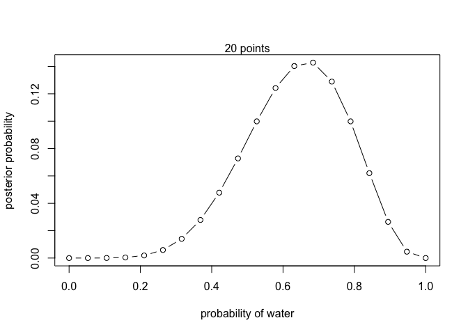
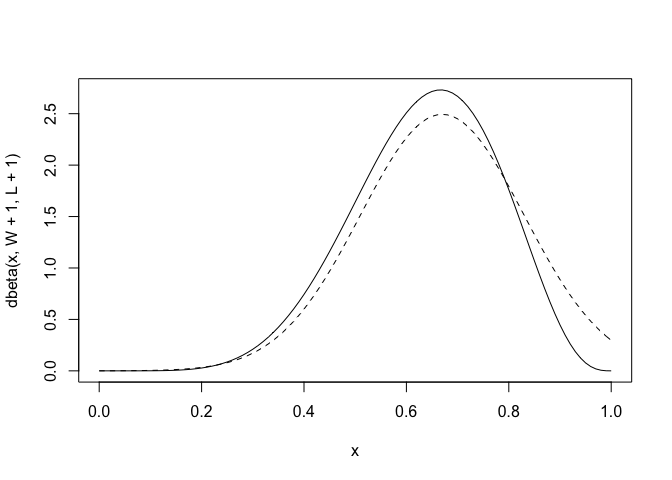
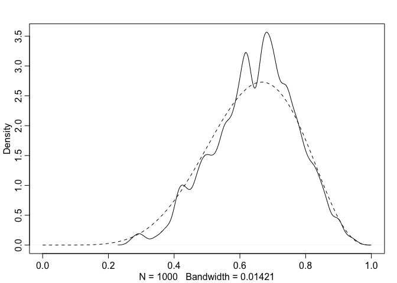
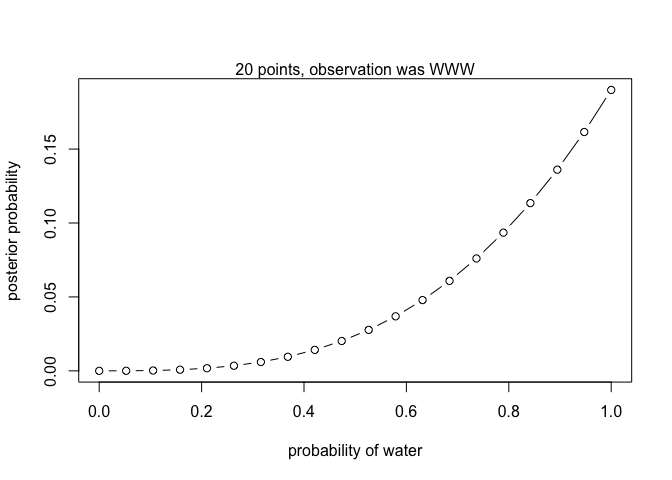
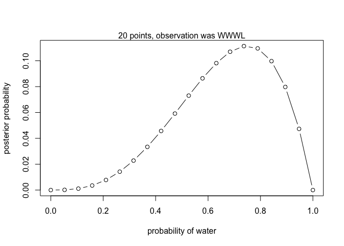
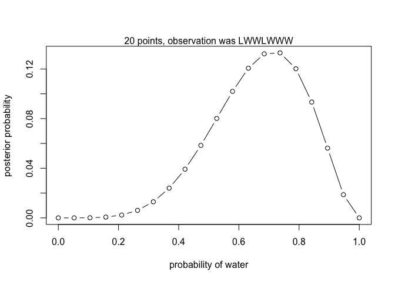
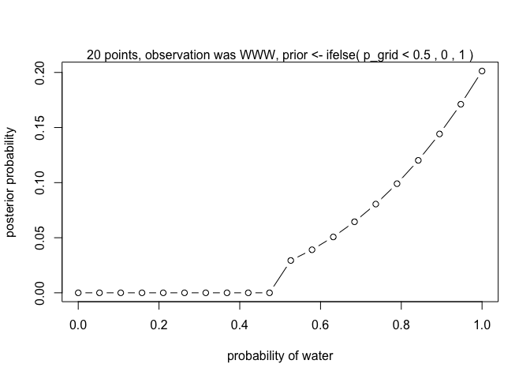
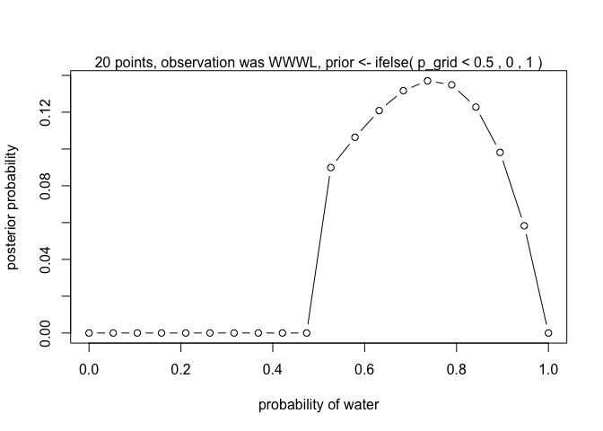
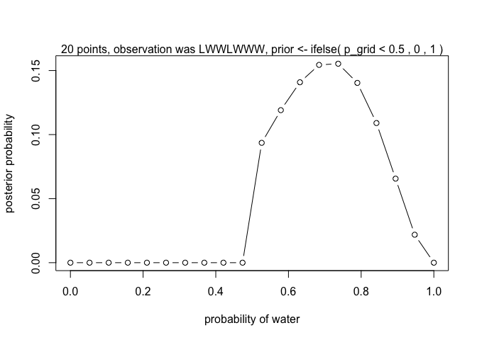

# Chapter 2
## 2.3. Components of the model

```r
## R code 2.2
dbinom( 6 , size=9 , prob=0.5 )
```

```
## [1] 0.1640625
```

```r
## R code 2.3
# define grid
p_grid <- seq( from=0 , to=1 , length.out=20 )
# define prior
prior <- rep( 1 , 20 )
# compute likelihood at each value in grid
likelihood <- dbinom( 6 , size=9 , prob=p_grid )
# compute product of likelihood and prior
unstd.posterior <- likelihood * prior
# standardize the posterior, so it sums to 1
posterior <- unstd.posterior / sum(unstd.posterior)

## R code 2.4
plot( p_grid , posterior , type="b" ,
    xlab="probability of water" , ylab="posterior probability" )
mtext( "20 points" )
```

<!-- -->

```r
## R code 2.5
prior <- ifelse( p_grid < 0.5 , 0 , 1 )
prior <- exp( -5*abs( p_grid - 0.5 ) )
```

# 2.4.4 Quadratic approximation

```r
## R code 2.6
library(rethinking)
```

```
## Loading required package: rstan
```

```
## Loading required package: ggplot2
```

```
## Warning: package 'ggplot2' was built under R version 3.5.2
```

```
## Loading required package: StanHeaders
```

```
## Warning: package 'StanHeaders' was built under R version 3.5.2
```

```
## rstan (Version 2.18.2, GitRev: 2e1f913d3ca3)
```

```
## For execution on a local, multicore CPU with excess RAM we recommend calling
## options(mc.cores = parallel::detectCores()).
## To avoid recompilation of unchanged Stan programs, we recommend calling
## rstan_options(auto_write = TRUE)
```

```
## Loading required package: parallel
```

```
## rethinking (Version 1.88)
```

```r
globe.qa <- quap(
    alist(
        W ~ dbinom( W+L ,p) ,  # binomial likelihood
        p ~ dunif(0,1)     # uniform prior
    ) ,
    data=list(W=6,L=3) )

# display summary of quadratic approximation
precis( globe.qa )
```

```
##        mean        sd      5.5%    94.5%
## p 0.6666669 0.1571337 0.4155369 0.917797
```

```r
## R code 2.7
# analytical calculation
W <- 6
L <- 3
curve( dbeta( x , W+1 , L+1 ) , from=0 , to=1 )
# quadratic approximation
curve( dnorm( x , 0.67 , 0.16 ) , lty=2 , add=TRUE )
```

<!-- -->
# 2.4.5. Markov chain Monte Carlo.

```r
## R code 2.8
n_samples <- 1000
p <- rep( NA , n_samples )
p[1] <- 0.5
W <- 6
L <- 3
for ( i in 2:n_samples ) {
    p_new <- rnorm( 1 , p[i-1] , 0.1 )
    if ( p_new < 0 ) p_new <- abs( p_new )
    if ( p_new > 1 ) p_new <- 2 - p_new
    q0 <- dbinom( W , W+L , p[i-1] )
    q1 <- dbinom( W , W+L , p_new )
    p[i] <- ifelse( runif(1) < q1/q0 , p_new , p[i-1] )
}

## R code 2.9
dens( p , xlim=c(0,1) )
curve( dbeta( x , W+1 , L+1 ) , lty=2 , add=TRUE )
```

<!-- -->
# 2.6. Practice
## 2E1. (2)
## 2E2. (3)
## 2E3. (1)
## 2M1

```r
# (1) W,W,W
# define grid
p_grid <- seq( from=0 , to=1 , length.out=20 )
# define prior
prior <- rep( 1 , 20 )
# compute likelihood at each value in grid
likelihood <- dbinom( 3 , size=3 , prob=p_grid )
# compute product of likelihood and prior
unstd.posterior <- likelihood * prior
# standardize the posterior, so it sums to 1
posterior <- unstd.posterior / sum(unstd.posterior)
# plot
plot( p_grid , posterior , type="b" ,
    xlab="probability of water" , ylab="posterior probability" )
mtext( "20 points, observation was WWW" )
```

<!-- -->
# (2) W,W,W,L

```r
# define grid
p_grid <- seq( from=0 , to=1 , length.out=20 )
# define prior
prior <- rep( 1 , 20 )
# compute likelihood at each value in grid
likelihood <- dbinom( 3 , size=4 , prob=p_grid )
# compute product of likelihood and prior
unstd.posterior <- likelihood * prior
# standardize the posterior, so it sums to 1
posterior <- unstd.posterior / sum(unstd.posterior)
# plot
plot( p_grid , posterior , type="b" ,
    xlab="probability of water" , ylab="posterior probability" )
mtext( "20 points, observation was WWWL" )
```

<!-- -->

## 2M1 (3) L,W,W,L,W,W,W

```r
# define grid
p_grid <- seq( from=0 , to=1 , length.out=20 )
# define prior
prior <- rep( 1 , 20 )
# compute likelihood at each value in grid
likelihood <- dbinom( 5 , size=7 , prob=p_grid )
# compute product of likelihood and prior
unstd.posterior <- likelihood * prior
# standardize the posterior, so it sums to 1
posterior <- unstd.posterior / sum(unstd.posterior)
# plot
plot( p_grid , posterior , type="b" ,
    xlab="probability of water" , ylab="posterior probability" )
mtext( "20 points, observation was LWWLWWW" )
```

<!-- -->

# 2M2

```r
# (1) - (3) with prior <- ifelse( p_grid < 0.5 , 0 , 1 )
# define grid
p_grid <- seq( from=0 , to=1 , length.out=20 )
# define prior
#prior <- rep( 1 , 20 )
prior <- ifelse( p_grid < 0.5 , 0 , 1 )
# compute likelihood at each value in grid
likelihood1 <- dbinom( 3 , size=3 , prob=p_grid )
likelihood2 <- dbinom( 3 , size=4 , prob=p_grid )
likelihood3 <- dbinom( 5 , size=7 , prob=p_grid )
# compute product of likelihood and prior
unstd.posterior1 <- likelihood1 * prior
unstd.posterior2 <- likelihood2 * prior
unstd.posterior3 <- likelihood3 * prior

# standardize the posterior, so it sums to 1
posterior1 <- unstd.posterior1 / sum(unstd.posterior1)
posterior2 <- unstd.posterior2 / sum(unstd.posterior2)
posterior3 <- unstd.posterior3 / sum(unstd.posterior3)
# plot
plot( p_grid , posterior1 , type="b" ,
    xlab="probability of water" , ylab="posterior probability" )
mtext( "20 points, observation was WWW, prior <- ifelse( p_grid < 0.5 , 0 , 1 )" )
```

<!-- -->

```r
plot( p_grid , posterior2 , type="b" ,
    xlab="probability of water" , ylab="posterior probability" )
mtext( "20 points, observation was WWWL, prior <- ifelse( p_grid < 0.5 , 0 , 1 )" )
```

<!-- -->

```r
plot( p_grid , posterior3 , type="b" ,
    xlab="probability of water" , ylab="posterior probability" )
mtext( "20 points, observation was LWWLWWW, prior <- ifelse( p_grid < 0.5 , 0 , 1 )" )
```

<!-- -->
# 2M3

```r
# The Earth globe is 70% covered in water. The Mars globe is 100% land.
# Show posterior probability that the globe was the Earth Pr(Earth|land)=0.23
dbinom( 1 , size=2 , prob=0.3*0.5) # size: Earth plus Mars, observation is Earth
```

```
## [1] 0.255
```
# 2M4

```r
table<-data.frame(case=1:6,card=rep(1:3, each=2),face=c("B1","B2","B","W","W1","W2"),down=c("B2","B1","W","B","W2","W1"))
table
```

```
##   case card face down
## 1    1    1   B1   B2
## 2    2    1   B2   B1
## 3    3    2    B    W
## 4    4    2    W    B
## 5    5    3   W1   W2
## 6    6    3   W2   W1
```

```r
print("IF heads are B (case1, 2, 3), two cases have black in tails, so P(B in tails|B in heads)=2/3")
```

```
## [1] "IF heads are B (case1, 2, 3), two cases have black in tails, so P(B in tails|B in heads)=2/3"
```
# 2M5

```r
table2<-data.frame(case=1:2^3,card=rep(1:4, each=2),face=c("B1","B2","B","W","W1","W2","B1","B2"),down=c("B2","B1","W","B","W2","W1","B2","B1"))
table2
```

```
##   case card face down
## 1    1    1   B1   B2
## 2    2    1   B2   B1
## 3    3    2    B    W
## 4    4    2    W    B
## 5    5    3   W1   W2
## 6    6    3   W2   W1
## 7    7    4   B1   B2
## 8    8    4   B2   B1
```

```r
print("IF heads are B (case1,2,3,7,8), four cases have black in tails, so P(B in tails|B in heads)=4/5")
```

```
## [1] "IF heads are B (case1,2,3,7,8), four cases have black in tails, so P(B in tails|B in heads)=4/5"
```
