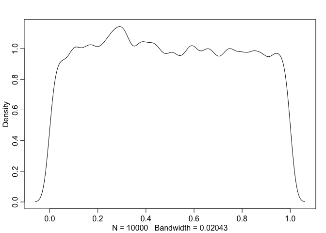
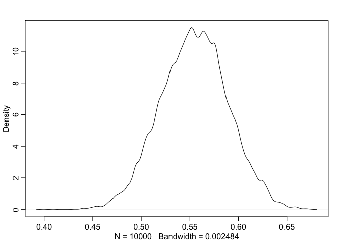
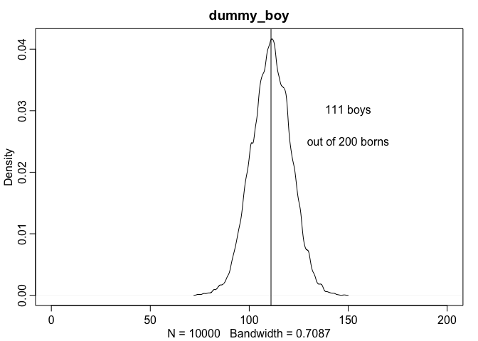
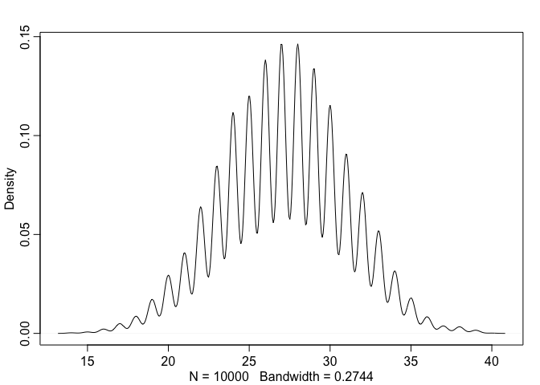

# Chapter 3 Sampling the Imaginary

```r
Pr_Positive_Vampire <- 0.95
Pr_Positive_Mortal <- 0.01
Pr_Vampire <- 0.001
Pr_Positive <- Pr_Positive_Vampire * Pr_Vampire +
               Pr_Positive_Mortal * ( 1 - Pr_Vampire )
( Pr_Vampire_Positive <- Pr_Positive_Vampire*Pr_Vampire / Pr_Positive )
```

```
## [1] 0.08683729
```
# 3.1. Sampling from a grid-approximate posterior

```r
p_grid <- seq( from=0 , to=1 , length.out=1000 )
prob_p <- rep( 1 , 1000 )
prob_data <- dbinom( 6 , size=9 , prob=p_grid )
posterior <- prob_data * prob_p
posterior <- posterior / sum(posterior)
```

```r
samples <- sample( p_grid , prob=posterior , size=1e4 , replace=TRUE )
```
# Kazu's note on sample() at Rclub

```r
# normal sampling scirpt (equal probability)
sample(10,10)
```

```
##  [1]  6  9  8  2  3  7  4  5 10  1
```

```r
# probability of each number is different (J's cript)
sample(10,10,replace=TRUE,prob=c(30,rep(1,9)))
```

```
##  [1] 1 1 1 1 1 1 1 1 1 1
```

```r
# Youd do not need to sample numbers, but alphabet letters.
sample(c("A","B","C","D","E","F","G","H","I","J"),10,replace=TRUE,prob=c(30,rep(1,9)))
```

```
##  [1] "D" "A" "E" "B" "A" "A" "F" "J" "A" "A"
```
# Kazu's cheat sheet on this chapter

```r
# sampling from grid-approximated posterior
sample(p_grid,prob=posterior,size=1e4,replace=TRUE)
```

```
##     [1] 0.7937938 0.8528529 0.6726727 0.4914915 0.6686687 0.7457457
##     [7] 0.6386386 0.7287287 0.9189189 0.8498498 0.5225225 0.6466466
##    [13] 0.8248248 0.6636637 0.6016016 0.8218218 0.7317317 0.4484484
##    [19] 0.7177177 0.5915916 0.8738739 0.4054054 0.7927928 0.7517518
##    [25] 0.6476476 0.4704705 0.4934935 0.6016016 0.5295295 0.6116116
##    [31] 0.6556557 0.5355355 0.8428428 0.8378378 0.5485485 0.6736737
##    [37] 0.5395395 0.4734735 0.6236236 0.5115115 0.4824825 0.5075075
##    [43] 0.6226226 0.5855856 0.7247247 0.5935936 0.5275275 0.5655656
##    [49] 0.6346346 0.6926927 0.8308308 0.6126126 0.9039039 0.7487487
##    [55] 0.7117117 0.6386386 0.7737738 0.4304304 0.5425425 0.5725726
##    [61] 0.5075075 0.7027027 0.6086086 0.5725726 0.6456456 0.7057057
##    [67] 0.6706707 0.6216216 0.6326326 0.6436436 0.5295295 0.6556557
##    [73] 0.7537538 0.7407407 0.7527528 0.5305305 0.6706707 0.5095095
##    [79] 0.5505506 0.5355355 0.5395395 0.5965966 0.6686687 0.6976977
##    [85] 0.7347347 0.7497497 0.5445445 0.7697698 0.5085085 0.7337337
##    [91] 0.5725726 0.4804805 0.5005005 0.6006006 0.6706707 0.3443443
##    [97] 0.8338338 0.6366366 0.4714715 0.7467467 0.6476476 0.7317317
##   [103] 0.7627628 0.6956957 0.6516517 0.7957958 0.6896897 0.6576577
##   [109] 0.5255255 0.7557558 0.6406406 0.6116116 0.6036036 0.7127127
##   [115] 0.7667668 0.7087087 0.8048048 0.2642643 0.7647648 0.8108108
##   [121] 0.6376376 0.5945946 0.5825826 0.7597598 0.5275275 0.5705706
##   [127] 0.6906907 0.6996997 0.7677678 0.3623624 0.5285285 0.5855856
##   [133] 0.5085085 0.7937938 0.6056056 0.5395395 0.8198198 0.4784785
##   [139] 0.5495495 0.6486486 0.8368368 0.5985986 0.5075075 0.6446446
##   [145] 0.4594595 0.7367367 0.4914915 0.7397397 0.6576577 0.4044044
##   [151] 0.7067067 0.5375375 0.7307307 0.7617618 0.6586587 0.6986987
##   [157] 0.8038038 0.7897898 0.5025025 0.5605606 0.8898899 0.6906907
##   [163] 0.8678679 0.8248248 0.4454454 0.6876877 0.6856857 0.4084084
##   [169] 0.5745746 0.5995996 0.4204204 0.5665666 0.4234234 0.9079079
##   [175] 0.1961962 0.9299299 0.9619620 0.7087087 0.6876877 0.7567568
##   [181] 0.7247247 0.3033033 0.5275275 0.6326326 0.8188188 0.7617618
##   [187] 0.1531532 0.4184184 0.8148148 0.6466466 0.6136136 0.4594595
##   [193] 0.8688689 0.8118118 0.8708709 0.8558559 0.7187187 0.5275275
##   [199] 0.6676677 0.7717718 0.6496496 0.6916917 0.5785786 0.7437437
##   [205] 0.6596597 0.6416416 0.5705706 0.5125125 0.4084084 0.7337337
##   [211] 0.4364364 0.8438438 0.7917918 0.6816817 0.6706707 0.9209209
##   [217] 0.6786787 0.6106106 0.7757758 0.5555556 0.5775776 0.4344344
##   [223] 0.6596597 0.6116116 0.6466466 0.6446446 0.8348348 0.7797798
##   [229] 0.6826827 0.7927928 0.5325325 0.5495495 0.4254254 0.5645646
##   [235] 0.7417417 0.6676677 0.6796797 0.4124124 0.6596597 0.5145145
##   [241] 0.5875876 0.6366366 0.6136136 0.5495495 0.4824825 0.5965966
##   [247] 0.7837838 0.4044044 0.7897898 0.7737738 0.5715716 0.8448448
##   [253] 0.6926927 0.8318318 0.5135135 0.5895896 0.7487487 0.5885886
##   [259] 0.3813814 0.6676677 0.7577578 0.7927928 0.7207207 0.5735736
##   [265] 0.6836837 0.7537538 0.6206206 0.5935936 0.5605606 0.4004004
##   [271] 0.7727728 0.4194194 0.4494494 0.5175175 0.6146146 0.7787788
##   [277] 0.7507508 0.6506507 0.3883884 0.7897898 0.3643644 0.5005005
##   [283] 0.8588589 0.8358358 0.6826827 0.7697698 0.4984985 0.6176176
##   [289] 0.7567568 0.5555556 0.6756757 0.6766767 0.5755756 0.9189189
##   [295] 0.6176176 0.6726727 0.5195195 0.7397397 0.5505506 0.6156156
##   [301] 0.6876877 0.7767768 0.8748749 0.7807808 0.6596597 0.6166166
##   [307] 0.6986987 0.8098098 0.5425425 0.6206206 0.4584585 0.8158158
##   [313] 0.6046046 0.8168168 0.7787788 0.4664665 0.4924925 0.8248248
##   [319] 0.5765766 0.3683684 0.7127127 0.6346346 0.7167167 0.4264264
##   [325] 0.7057057 0.7187187 0.6436436 0.8468468 0.6336336 0.4354354
##   [331] 0.4884885 0.8538539 0.9179179 0.5545546 0.7027027 0.6896897
##   [337] 0.5345345 0.6556557 0.4324324 0.5535536 0.8978979 0.5625626
##   [343] 0.5605606 0.5795796 0.5815816 0.6806807 0.3883884 0.7687688
##   [349] 0.6976977 0.6556557 0.5935936 0.5355355 0.6216216 0.6136136
##   [355] 0.6876877 0.4354354 0.8228228 0.6806807 0.6636637 0.5705706
##   [361] 0.5705706 0.8138138 0.7557558 0.7867868 0.2302302 0.5205205
##   [367] 0.7867868 0.6066066 0.7397397 0.8198198 0.7357357 0.8808809
##   [373] 0.6326326 0.6326326 0.7287287 0.5095095 0.5975976 0.5485485
##   [379] 0.8048048 0.6526527 0.7027027 0.7727728 0.5935936 0.5015015
##   [385] 0.6216216 0.4344344 0.6836837 0.5415415 0.6436436 0.6836837
##   [391] 0.6936937 0.5435435 0.6126126 0.3363363 0.5085085 0.7067067
##   [397] 0.3363363 0.5425425 0.4224224 0.5775776 0.7597598 0.5745746
##   [403] 0.3803804 0.8058058 0.8328328 0.5995996 0.7877878 0.4814815
##   [409] 0.5465465 0.5265265 0.8798799 0.4474474 0.5945946 0.7587588
##   [415] 0.7847848 0.5825826 0.7857858 0.8478478 0.7377377 0.5925926
##   [421] 0.3023023 0.6196196 0.6706707 0.4704705 0.7867868 0.7047047
##   [427] 0.4944945 0.6726727 0.7587588 0.6476476 0.6786787 0.4524525
##   [433] 0.5445445 0.5065065 0.6966967 0.6636637 0.3273273 0.8588589
##   [439] 0.5955956 0.4544545 0.7527528 0.9139139 0.7027027 0.6846847
##   [445] 0.6326326 0.7837838 0.6706707 0.5835836 0.7687688 0.5805806
##   [451] 0.6056056 0.5955956 0.7067067 0.2902903 0.6656657 0.6356356
##   [457] 0.7887888 0.5545546 0.4784785 0.5375375 0.5385385 0.5865866
##   [463] 0.7147147 0.7547548 0.7797798 0.6886887 0.8398398 0.6566567
##   [469] 0.5685686 0.4444444 0.6716717 0.7207207 0.4984985 0.7187187
##   [475] 0.6416416 0.4424424 0.4874875 0.7187187 0.2202202 0.5485485
##   [481] 0.7137137 0.6656657 0.5685686 0.5675676 0.7607608 0.2992993
##   [487] 0.4944945 0.4154154 0.6316316 0.8088088 0.5735736 0.7607608
##   [493] 0.6366366 0.6656657 0.6466466 0.5725726 0.7167167 0.5285285
##   [499] 0.5305305 0.6616617 0.5565566 0.6706707 0.7577578 0.8508509
##   [505] 0.5135135 0.6236236 0.7387387 0.5015015 0.6836837 0.7617618
##   [511] 0.8328328 0.6996997 0.6476476 0.7017017 0.4864865 0.6546547
##   [517] 0.6396396 0.6026026 0.7587588 0.5955956 0.7447447 0.6026026
##   [523] 0.7337337 0.3923924 0.4494494 0.4554555 0.6066066 0.6196196
##   [529] 0.6116116 0.4804805 0.5705706 0.4704705 0.5345345 0.2642643
##   [535] 0.6716717 0.8318318 0.3003003 0.7407407 0.4094094 0.4854855
##   [541] 0.7067067 0.6546547 0.7267267 0.7547548 0.4714715 0.6506507
##   [547] 0.4434434 0.3933934 0.6776777 0.7957958 0.6176176 0.8198198
##   [553] 0.4734735 0.6406406 0.7597598 0.6766767 0.6246246 0.5075075
##   [559] 0.7267267 0.6226226 0.7217217 0.4694695 0.5945946 0.6456456
##   [565] 0.7237237 0.4094094 0.7817818 0.7107107 0.8248248 0.6206206
##   [571] 0.8358358 0.6486486 0.5425425 0.7207207 0.8338338 0.6396396
##   [577] 0.5035035 0.5195195 0.5215215 0.6426426 0.7557558 0.4954955
##   [583] 0.4094094 0.7587588 0.7017017 0.5575576 0.6086086 0.5365365
##   [589] 0.6656657 0.8348348 0.7407407 0.6196196 0.8278278 0.8738739
##   [595] 0.2952953 0.9039039 0.5235235 0.8328328 0.6476476 0.7507508
##   [601] 0.7537538 0.5175175 0.8008008 0.6636637 0.7367367 0.6486486
##   [607] 0.6896897 0.7527528 0.8248248 0.6696697 0.7307307 0.7507508
##   [613] 0.7387387 0.5175175 0.6746747 0.4484484 0.7817818 0.7727728
##   [619] 0.3573574 0.4994995 0.8788789 0.7817818 0.7367367 0.8308308
##   [625] 0.7627628 0.6676677 0.6906907 0.8608609 0.5885886 0.6336336
##   [631] 0.5655656 0.4134134 0.5445445 0.7327327 0.6306306 0.6106106
##   [637] 0.7247247 0.5705706 0.4454454 0.4884885 0.8908909 0.4924925
##   [643] 0.4214214 0.6786787 0.7567568 0.5605606 0.5275275 0.3153153
##   [649] 0.7427427 0.5975976 0.5095095 0.6516517 0.6836837 0.7597598
##   [655] 0.2822823 0.3843844 0.4034034 0.6136136 0.4934935 0.7497497
##   [661] 0.5335335 0.8198198 0.4234234 0.5545546 0.5425425 0.7707708
##   [667] 0.7227227 0.7827828 0.5565566 0.5615616 0.3493493 0.5705706
##   [673] 0.4364364 0.7617618 0.6086086 0.7187187 0.7777778 0.3303303
##   [679] 0.6866867 0.7687688 0.3713714 0.6986987 0.6616617 0.7467467
##   [685] 0.6166166 0.6266266 0.6086086 0.6576577 0.5725726 0.7037037
##   [691] 0.4954955 0.6586587 0.6896897 0.6266266 0.5605606 0.5685686
##   [697] 0.6186186 0.4764765 0.5315315 0.5565566 0.7447447 0.6706707
##   [703] 0.8588589 0.9119119 0.7857858 0.5505506 0.4464464 0.6776777
##   [709] 0.5045045 0.6766767 0.6196196 0.6986987 0.9079079 0.5925926
##   [715] 0.6116116 0.6666667 0.5735736 0.6546547 0.6346346 0.6746747
##   [721] 0.6256256 0.3983984 0.7147147 0.8058058 0.6706707 0.8688689
##   [727] 0.6166166 0.7007007 0.3933934 0.8618619 0.6026026 0.8098098
##   [733] 0.9139139 0.8148148 0.4734735 0.7077077 0.8208208 0.8408408
##   [739] 0.3573574 0.6136136 0.3733734 0.3843844 0.8198198 0.7037037
##   [745] 0.4924925 0.7567568 0.6966967 0.4044044 0.8218218 0.5765766
##   [751] 0.5495495 0.7717718 0.7927928 0.7207207 0.6986987 0.8798799
##   [757] 0.8188188 0.8208208 0.5255255 0.7137137 0.3413413 0.5155155
##   [763] 0.6256256 0.6806807 0.6696697 0.6096096 0.6836837 0.5025025
##   [769] 0.7037037 0.5325325 0.6956957 0.6496496 0.7417417 0.4144144
##   [775] 0.6526527 0.6736737 0.6776777 0.5275275 0.5175175 0.5565566
##   [781] 0.6426426 0.6946947 0.7107107 0.7477477 0.8998999 0.5675676
##   [787] 0.7637638 0.7127127 0.7237237 0.7757758 0.5465465 0.6016016
##   [793] 0.6296296 0.6816817 0.6606607 0.5485485 0.6576577 0.9049049
##   [799] 0.5295295 0.5505506 0.3743744 0.7807808 0.6336336 0.5275275
##   [805] 0.7937938 0.6256256 0.8268268 0.5275275 0.4864865 0.3223223
##   [811] 0.6566567 0.4194194 0.6716717 0.7947948 0.5005005 0.9129129
##   [817] 0.6676677 0.5945946 0.4084084 0.8018018 0.6496496 0.7987988
##   [823] 0.8288288 0.5875876 0.4954955 0.6396396 0.5225225 0.3863864
##   [829] 0.7027027 0.4704705 0.4584585 0.8188188 0.7707708 0.7707708
##   [835] 0.6036036 0.6706707 0.5755756 0.5635636 0.4244244 0.7767768
##   [841] 0.6686687 0.5945946 0.5915916 0.8518519 0.5085085 0.6896897
##   [847] 0.6766767 0.7007007 0.6876877 0.7987988 0.6986987 0.6336336
##   [853] 0.7877878 0.3683684 0.6876877 0.6516517 0.4354354 0.6236236
##   [859] 0.8138138 0.2812813 0.7437437 0.3843844 0.5775776 0.7827828
##   [865] 0.7007007 0.5805806 0.8668669 0.7717718 0.7807808 0.6356356
##   [871] 0.7047047 0.8298298 0.6626627 0.7197197 0.6646647 0.9219219
##   [877] 0.6196196 0.7767768 0.3543544 0.6956957 0.6396396 0.6296296
##   [883] 0.7387387 0.7577578 0.6126126 0.8578579 0.6656657 0.6676677
##   [889] 0.6076076 0.5875876 0.6866867 0.4374374 0.8048048 0.4814815
##   [895] 0.5025025 0.4824825 0.5915916 0.8228228 0.7377377 0.5925926
##   [901] 0.7757758 0.3103103 0.4464464 0.5485485 0.6446446 0.7397397
##   [907] 0.6276276 0.8338338 0.4704705 0.7677678 0.8258258 0.8398398
##   [913] 0.3803804 0.7637638 0.6456456 0.8088088 0.8198198 0.5945946
##   [919] 0.7127127 0.8038038 0.7487487 0.6036036 0.7617618 0.8958959
##   [925] 0.7667668 0.5725726 0.7497497 0.5555556 0.4824825 0.3023023
##   [931] 0.5635636 0.5565566 0.8068068 0.7157157 0.4254254 0.8528529
##   [937] 0.8238238 0.7047047 0.7977978 0.6496496 0.6996997 0.6366366
##   [943] 0.8898899 0.3433433 0.7907908 0.8228228 0.6966967 0.5285285
##   [949] 0.7197197 0.3983984 0.6236236 0.7057057 0.7527528 0.5965966
##   [955] 0.5915916 0.8518519 0.5565566 0.6536537 0.7727728 0.7897898
##   [961] 0.4854855 0.8338338 0.7177177 0.7247247 0.7657658 0.7457457
##   [967] 0.3863864 0.7877878 0.5925926 0.6236236 0.8268268 0.6266266
##   [973] 0.8458458 0.6586587 0.5185185 0.5725726 0.7817818 0.6396396
##   [979] 0.7087087 0.6346346 0.8438438 0.5865866 0.8978979 0.3523524
##   [985] 0.6866867 0.5925926 0.2962963 0.5975976 0.4884885 0.5735736
##   [991] 0.5735736 0.5725726 0.6866867 0.6866867 0.6106106 0.6876877
##   [997] 0.6196196 0.6956957 0.8328328 0.7377377 0.4914915 0.6446446
##  [1003] 0.4714715 0.6826827 0.6186186 0.5025025 0.5595596 0.8338338
##  [1009] 0.4784785 0.5615616 0.5775776 0.7537538 0.7457457 0.4794795
##  [1015] 0.6906907 0.5595596 0.3453453 0.6536537 0.6296296 0.6456456
##  [1021] 0.8878879 0.5515516 0.8038038 0.6506507 0.5515516 0.5015015
##  [1027] 0.7937938 0.5845846 0.9639640 0.6406406 0.6886887 0.6186186
##  [1033] 0.6486486 0.4044044 0.6696697 0.3383383 0.8178178 0.4614615
##  [1039] 0.4564565 0.5675676 0.7307307 0.8168168 0.5745746 0.7617618
##  [1045] 0.8138138 0.7607608 0.7907908 0.8358358 0.8348348 0.6856857
##  [1051] 0.5855856 0.7277277 0.7357357 0.4664665 0.4964965 0.5825826
##  [1057] 0.6456456 0.6786787 0.7277277 0.6346346 0.6026026 0.8688689
##  [1063] 0.7927928 0.7857858 0.6106106 0.5765766 0.4024024 0.6356356
##  [1069] 0.4194194 0.7187187 0.7217217 0.4044044 0.9029029 0.7487487
##  [1075] 0.6816817 0.7987988 0.8628629 0.6956957 0.5215215 0.6596597
##  [1081] 0.7667668 0.5145145 0.6026026 0.6246246 0.7877878 0.5735736
##  [1087] 0.7537538 0.7527528 0.7877878 0.6646647 0.6096096 0.3423423
##  [1093] 0.8928929 0.6486486 0.7657658 0.5565566 0.3233233 0.7227227
##  [1099] 0.7217217 0.6656657 0.5995996 0.7977978 0.4534535 0.6306306
##  [1105] 0.7697698 0.8088088 0.8238238 0.6616617 0.7617618 0.8078078
##  [1111] 0.7997998 0.7467467 0.8138138 0.5445445 0.8428428 0.7767768
##  [1117] 0.7287287 0.4304304 0.7097097 0.8808809 0.5905906 0.7467467
##  [1123] 0.5085085 0.6136136 0.7577578 0.8668669 0.5205205 0.6356356
##  [1129] 0.8008008 0.3533534 0.6196196 0.6536537 0.5485485 0.8128128
##  [1135] 0.3883884 0.6426426 0.6906907 0.1311311 0.8058058 0.6046046
##  [1141] 0.6176176 0.6776777 0.8288288 0.5145145 0.4104104 0.5415415
##  [1147] 0.5995996 0.4244244 0.8148148 0.5545546 0.6496496 0.6656657
##  [1153] 0.9139139 0.8458458 0.8498498 0.7787788 0.5625626 0.7497497
##  [1159] 0.4874875 0.5815816 0.7337337 0.6466466 0.5825826 0.7097097
##  [1165] 0.9109109 0.7597598 0.7367367 0.8728729 0.5415415 0.8968969
##  [1171] 0.4934935 0.4374374 0.5155155 0.6306306 0.6326326 0.6716717
##  [1177] 0.6386386 0.7767768 0.5665666 0.8368368 0.5645646 0.6206206
##  [1183] 0.6036036 0.6436436 0.3833834 0.8438438 0.7307307 0.5785786
##  [1189] 0.6406406 0.5655656 0.7087087 0.6096096 0.6846847 0.7657658
##  [1195] 0.5715716 0.4104104 0.5075075 0.3823824 0.8358358 0.7287287
##  [1201] 0.6236236 0.5945946 0.6206206 0.6426426 0.8598599 0.6706707
##  [1207] 0.4784785 0.5015015 0.5955956 0.6966967 0.6266266 0.4814815
##  [1213] 0.4754755 0.7367367 0.7607608 0.6826827 0.5195195 0.8948949
##  [1219] 0.5675676 0.7487487 0.8028028 0.7917918 0.8508509 0.6456456
##  [1225] 0.5425425 0.7687688 0.7557558 0.4414414 0.5295295 0.7527528
##  [1231] 0.6186186 0.3743744 0.6206206 0.7437437 0.5225225 0.5695696
##  [1237] 0.8928929 0.6846847 0.5335335 0.7637638 0.8278278 0.6946947
##  [1243] 0.6676677 0.8238238 0.6546547 0.7777778 0.6706707 0.4654655
##  [1249] 0.5555556 0.5375375 0.5665666 0.5625626 0.8628629 0.5925926
##  [1255] 0.7147147 0.7037037 0.4524525 0.5675676 0.7007007 0.6276276
##  [1261] 0.5945946 0.4784785 0.5435435 0.7757758 0.7567568 0.8418418
##  [1267] 0.3793794 0.6826827 0.5415415 0.5745746 0.7407407 0.6546547
##  [1273] 0.8058058 0.7087087 0.4894895 0.6656657 0.4384384 0.4314314
##  [1279] 0.7897898 0.8208208 0.7637638 0.5645646 0.7357357 0.5015015
##  [1285] 0.4034034 0.7727728 0.6626627 0.7337337 0.3733734 0.4974975
##  [1291] 0.7187187 0.5625626 0.6716717 0.8248248 0.7627628 0.7147147
##  [1297] 0.6116116 0.8378378 0.5315315 0.5495495 0.6716717 0.6626627
##  [1303] 0.4334334 0.5115115 0.6026026 0.6056056 0.5715716 0.3743744
##  [1309] 0.4854855 0.8498498 0.8028028 0.6036036 0.7897898 0.6106106
##  [1315] 0.8178178 0.6336336 0.5525526 0.6586587 0.4594595 0.5155155
##  [1321] 0.6076076 0.5345345 0.5215215 0.7957958 0.5725726 0.5035035
##  [1327] 0.4344344 0.8718719 0.6616617 0.5855856 0.5365365 0.4434434
##  [1333] 0.7247247 0.2982983 0.6266266 0.8988989 0.7817818 0.8258258
##  [1339] 0.7867868 0.7247247 0.5535536 0.7647648 0.6956957 0.8538539
##  [1345] 0.6126126 0.7887888 0.7867868 0.4574575 0.6996997 0.7997998
##  [1351] 0.3303303 0.6386386 0.4514515 0.6606607 0.5185185 0.6226226
##  [1357] 0.5195195 0.7367367 0.4524525 0.4004004 0.7587588 0.8048048
##  [1363] 0.7037037 0.6526527 0.5935936 0.4564565 0.6426426 0.7167167
##  [1369] 0.5595596 0.8208208 0.6896897 0.6636637 0.6196196 0.6086086
##  [1375] 0.4744745 0.5555556 0.4274274 0.5655656 0.7007007 0.7557558
##  [1381] 0.5145145 0.6956957 0.6786787 0.7187187 0.5565566 0.7567568
##  [1387] 0.8708709 0.3973974 0.4164164 0.6096096 0.6496496 0.8538539
##  [1393] 0.7657658 0.4574575 0.7737738 0.6976977 0.6586587 0.5615616
##  [1399] 0.5325325 0.4444444 0.7337337 0.8118118 0.7787788 0.8128128
##  [1405] 0.5275275 0.7827828 0.7247247 0.6246246 0.6066066 0.6276276
##  [1411] 0.7257257 0.4124124 0.6086086 0.3283283 0.7907908 0.7737738
##  [1417] 0.3453453 0.7397397 0.2732733 0.4834835 0.5085085 0.5665666
##  [1423] 0.5555556 0.7687688 0.7377377 0.8378378 0.5415415 0.6346346
##  [1429] 0.5195195 0.7387387 0.8288288 0.4844845 0.7027027 0.4774775
##  [1435] 0.5775776 0.3393393 0.6266266 0.5695696 0.5595596 0.5745746
##  [1441] 0.6216216 0.6546547 0.5975976 0.6206206 0.7327327 0.7327327
##  [1447] 0.9189189 0.6526527 0.7807808 0.7237237 0.6956957 0.7357357
##  [1453] 0.6006006 0.5395395 0.8838839 0.5835836 0.5465465 0.6256256
##  [1459] 0.7667668 0.5445445 0.3383383 0.7767768 0.8468468 0.7057057
##  [1465] 0.5955956 0.5665666 0.7477477 0.6196196 0.7827828 0.5325325
##  [1471] 0.3623624 0.7027027 0.6526527 0.7407407 0.8808809 0.4964965
##  [1477] 0.7867868 0.7757758 0.4984985 0.2662663 0.5205205 0.8318318
##  [1483] 0.7317317 0.6876877 0.5035035 0.6866867 0.6496496 0.7757758
##  [1489] 0.6216216 0.4494494 0.9589590 0.6716717 0.7397397 0.8888889
##  [1495] 0.6806807 0.8378378 0.8328328 0.5395395 0.7657658 0.6996997
##  [1501] 0.5765766 0.8298298 0.8388388 0.6746747 0.7447447 0.2882883
##  [1507] 0.5205205 0.8108108 0.5835836 0.7387387 0.8068068 0.5715716
##  [1513] 0.8328328 0.6976977 0.4894895 0.5555556 0.5245245 0.5185185
##  [1519] 0.6636637 0.5765766 0.5885886 0.8248248 0.6176176 0.6216216
##  [1525] 0.5355355 0.8078078 0.3663664 0.4794795 0.7307307 0.4084084
##  [1531] 0.8348348 0.5275275 0.4134134 0.7277277 0.4054054 0.6936937
##  [1537] 0.7627628 0.5885886 0.5215215 0.6766767 0.9169169 0.5955956
##  [1543] 0.5415415 0.7737738 0.8448448 0.6916917 0.5815816 0.6726727
##  [1549] 0.4434434 0.7637638 0.4934935 0.4554555 0.5995996 0.4824825
##  [1555] 0.7987988 0.4514515 0.5895896 0.8418418 0.9179179 0.6666667
##  [1561] 0.5785786 0.4244244 0.6096096 0.8028028 0.6426426 0.9219219
##  [1567] 0.6236236 0.5765766 0.5895896 0.8118118 0.7337337 0.8018018
##  [1573] 0.6476476 0.7117117 0.7437437 0.4074074 0.6826827 0.3473473
##  [1579] 0.8358358 0.5945946 0.6786787 0.6586587 0.6666667 0.7017017
##  [1585] 0.5955956 0.7107107 0.8398398 0.5405405 0.4854855 0.5615616
##  [1591] 0.6746747 0.4734735 0.4354354 0.7877878 0.5445445 0.5985986
##  [1597] 0.4864865 0.7747748 0.8488488 0.8348348 0.6506507 0.2472472
##  [1603] 0.5535536 0.7097097 0.3093093 0.4454454 0.7177177 0.4724725
##  [1609] 0.7687688 0.7037037 0.7237237 0.5995996 0.5715716 0.7307307
##  [1615] 0.5905906 0.6506507 0.7727728 0.5225225 0.7757758 0.5505506
##  [1621] 0.4344344 0.8978979 0.3343343 0.6256256 0.5515516 0.5035035
##  [1627] 0.6076076 0.7777778 0.7567568 0.3963964 0.9189189 0.4684685
##  [1633] 0.7517518 0.7937938 0.7277277 0.5275275 0.4054054 0.6276276
##  [1639] 0.6006006 0.5475475 0.5795796 0.6736737 0.6926927 0.6496496
##  [1645] 0.5805806 0.5535536 0.4464464 0.5955956 0.8038038 0.8158158
##  [1651] 0.5215215 0.9179179 0.6786787 0.6866867 0.5535536 0.6106106
##  [1657] 0.6746747 0.7617618 0.7487487 0.6356356 0.6246246 0.5195195
##  [1663] 0.6786787 0.7107107 0.5575576 0.6616617 0.5265265 0.2432432
##  [1669] 0.6566567 0.5045045 0.7087087 0.6546547 0.7227227 0.6046046
##  [1675] 0.6956957 0.5605606 0.7117117 0.8448448 0.8258258 0.4264264
##  [1681] 0.5085085 0.7527528 0.5095095 0.8398398 0.4604605 0.4814815
##  [1687] 0.5685686 0.4344344 0.7327327 0.4564565 0.4014014 0.7547548
##  [1693] 0.8148148 0.6636637 0.4764765 0.7507508 0.3283283 0.4414414
##  [1699] 0.5805806 0.6096096 0.9179179 0.4314314 0.7637638 0.7517518
##  [1705] 0.7197197 0.6836837 0.6796797 0.4654655 0.7037037 0.5765766
##  [1711] 0.7787788 0.6756757 0.4564565 0.5605606 0.6576577 0.7567568
##  [1717] 0.8858859 0.6606607 0.5285285 0.5265265 0.5305305 0.8608609
##  [1723] 0.5615616 0.7437437 0.7997998 0.5195195 0.5005005 0.5095095
##  [1729] 0.8698699 0.6586587 0.5765766 0.8208208 0.6476476 0.4994995
##  [1735] 0.7127127 0.7267267 0.6656657 0.6956957 0.4324324 0.4604605
##  [1741] 0.5275275 0.7427427 0.5795796 0.7157157 0.5405405 0.6926927
##  [1747] 0.4164164 0.5355355 0.6366366 0.4534535 0.8148148 0.3153153
##  [1753] 0.6446446 0.5765766 0.7027027 0.5625626 0.5605606 0.7147147
##  [1759] 0.5095095 0.6376376 0.5225225 0.8178178 0.5325325 0.2342342
##  [1765] 0.8888889 0.7247247 0.8128128 0.6786787 0.8048048 0.6926927
##  [1771] 0.5105105 0.8338338 0.6516517 0.4954955 0.6106106 0.3773774
##  [1777] 0.8188188 0.6766767 0.4304304 0.8618619 0.5995996 0.5735736
##  [1783] 0.4534535 0.7217217 0.5765766 0.6806807 0.7657658 0.5695696
##  [1789] 0.6826827 0.6496496 0.5255255 0.6226226 0.7847848 0.6416416
##  [1795] 0.3113113 0.8158158 0.6206206 0.8198198 0.3913914 0.8698699
##  [1801] 0.6836837 0.6026026 0.5935936 0.5565566 0.7687688 0.5125125
##  [1807] 0.7177177 0.8838839 0.5355355 0.7097097 0.6606607 0.8008008
##  [1813] 0.5145145 0.7017017 0.5525526 0.7497497 0.8138138 0.6616617
##  [1819] 0.8198198 0.5065065 0.7037037 0.5425425 0.5505506 0.6956957
##  [1825] 0.7587588 0.9059059 0.5145145 0.6646647 0.9189189 0.6806807
##  [1831] 0.6236236 0.7657658 0.7347347 0.8258258 0.5745746 0.6376376
##  [1837] 0.7457457 0.5715716 0.7087087 0.7267267 0.5765766 0.7857858
##  [1843] 0.5735736 0.6766767 0.4664665 0.7187187 0.6496496 0.5605606
##  [1849] 0.6556557 0.6076076 0.5825826 0.5125125 0.6566567 0.7937938
##  [1855] 0.3633634 0.3603604 0.7717718 0.5845846 0.5405405 0.5415415
##  [1861] 0.5355355 0.6236236 0.8758759 0.8228228 0.6946947 0.8028028
##  [1867] 0.8718719 0.4874875 0.4984985 0.6946947 0.7647648 0.5285285
##  [1873] 0.7327327 0.6906907 0.6626627 0.7507508 0.5295295 0.7337337
##  [1879] 0.6466466 0.5185185 0.7897898 0.5125125 0.7517518 0.7157157
##  [1885] 0.8048048 0.5735736 0.5135135 0.7787788 0.4294294 0.5875876
##  [1891] 0.8818819 0.7017017 0.8428428 0.4784785 0.7457457 0.5725726
##  [1897] 0.6226226 0.8058058 0.4434434 0.6686687 0.6796797 0.7057057
##  [1903] 0.8058058 0.7107107 0.4914915 0.8378378 0.8428428 0.7367367
##  [1909] 0.8188188 0.5725726 0.6256256 0.2982983 0.7857858 0.7227227
##  [1915] 0.6436436 0.6906907 0.6326326 0.6556557 0.8038038 0.6936937
##  [1921] 0.6176176 0.7237237 0.7457457 0.5005005 0.6096096 0.5575576
##  [1927] 0.7267267 0.7747748 0.6346346 0.5185185 0.7447447 0.8538539
##  [1933] 0.7177177 0.5335335 0.8848849 0.7397397 0.7347347 0.7277277
##  [1939] 0.6696697 0.7677678 0.5225225 0.8198198 0.8248248 0.7217217
##  [1945] 0.5925926 0.5665666 0.6526527 0.6446446 0.6576577 0.9209209
##  [1951] 0.8418418 0.8688689 0.6216216 0.4994995 0.7407407 0.6796797
##  [1957] 0.6466466 0.7097097 0.7417417 0.5115115 0.8278278 0.4384384
##  [1963] 0.8678679 0.7087087 0.7867868 0.5595596 0.4234234 0.6306306
##  [1969] 0.6196196 0.4144144 0.5015015 0.5655656 0.6936937 0.4054054
##  [1975] 0.6606607 0.3713714 0.4614615 0.4254254 0.5825826 0.8988989
##  [1981] 0.5505506 0.8448448 0.6886887 0.5105105 0.5125125 0.6146146
##  [1987] 0.4474474 0.6336336 0.5265265 0.8538539 0.8158158 0.4594595
##  [1993] 0.7777778 0.8918919 0.6766767 0.4784785 0.7157157 0.7697698
##  [1999] 0.4824825 0.6076076 0.8038038 0.5115115 0.6466466 0.6996997
##  [2005] 0.6436436 0.4834835 0.6656657 0.8268268 0.5995996 0.6876877
##  [2011] 0.6026026 0.7037037 0.6696697 0.3613614 0.7847848 0.7817818
##  [2017] 0.5755756 0.5665666 0.6136136 0.5605606 0.8218218 0.5495495
##  [2023] 0.6406406 0.6306306 0.7237237 0.5795796 0.6076076 0.8128128
##  [2029] 0.5635636 0.5895896 0.7347347 0.7317317 0.6896897 0.6516517
##  [2035] 0.5445445 0.4564565 0.3723724 0.8548549 0.5465465 0.8038038
##  [2041] 0.6686687 0.7727728 0.8588589 0.7087087 0.5315315 0.6016016
##  [2047] 0.7617618 0.5805806 0.9119119 0.8608609 0.6626627 0.4154154
##  [2053] 0.7767768 0.6726727 0.6136136 0.5855856 0.4404404 0.5015015
##  [2059] 0.7037037 0.6356356 0.9509510 0.7877878 0.8958959 0.4544545
##  [2065] 0.5965966 0.5065065 0.7537538 0.4264264 0.9139139 0.8578579
##  [2071] 0.7997998 0.7497497 0.7417417 0.4494494 0.5885886 0.6226226
##  [2077] 0.4374374 0.8418418 0.5965966 0.4054054 0.5785786 0.7367367
##  [2083] 0.7377377 0.5975976 0.6316316 0.7617618 0.5495495 0.4924925
##  [2089] 0.8598599 0.7657658 0.8018018 0.5725726 0.6666667 0.6626627
##  [2095] 0.7187187 0.5335335 0.6276276 0.6136136 0.7867868 0.8078078
##  [2101] 0.7847848 0.8008008 0.6656657 0.5985986 0.7627628 0.4334334
##  [2107] 0.6056056 0.6436436 0.6706707 0.3603604 0.4264264 0.5785786
##  [2113] 0.6236236 0.7357357 0.5105105 0.3203203 0.6316316 0.6716717
##  [2119] 0.7647648 0.5635636 0.8498498 0.8598599 0.6266266 0.4794795
##  [2125] 0.6886887 0.4894895 0.7527528 0.6106106 0.6806807 0.6956957
##  [2131] 0.5885886 0.8158158 0.6436436 0.6676677 0.6336336 0.5505506
##  [2137] 0.7567568 0.6546547 0.6356356 0.2222222 0.6236236 0.7297297
##  [2143] 0.4044044 0.5895896 0.8008008 0.5735736 0.3973974 0.6946947
##  [2149] 0.6796797 0.5965966 0.7517518 0.4514515 0.9239239 0.6216216
##  [2155] 0.5805806 0.7237237 0.5375375 0.6156156 0.5605606 0.5825826
##  [2161] 0.6916917 0.8198198 0.8068068 0.7927928 0.8938939 0.5285285
##  [2167] 0.4844845 0.6196196 0.6226226 0.6696697 0.4584585 0.4004004
##  [2173] 0.8248248 0.6976977 0.6806807 0.6136136 0.6796797 0.5505506
##  [2179] 0.5645646 0.7387387 0.4684685 0.6586587 0.7507508 0.7047047
##  [2185] 0.7537538 0.4154154 0.5745746 0.7377377 0.7997998 0.5145145
##  [2191] 0.6026026 0.4584585 0.8668669 0.6446446 0.7727728 0.8708709
##  [2197] 0.4854855 0.7897898 0.6826827 0.6646647 0.7427427 0.8398398
##  [2203] 0.8128128 0.8048048 0.6976977 0.7537538 0.4714715 0.5505506
##  [2209] 0.6856857 0.6286286 0.6966967 0.5965966 0.3643644 0.6746747
##  [2215] 0.4114114 0.5285285 0.6436436 0.7827828 0.8978979 0.3003003
##  [2221] 0.8068068 0.6216216 0.6636637 0.7027027 0.6366366 0.6706707
##  [2227] 0.6456456 0.7487487 0.6666667 0.7277277 0.5725726 0.4964965
##  [2233] 0.7027027 0.8708709 0.4864865 0.7807808 0.9159159 0.5605606
##  [2239] 0.3713714 0.2362362 0.7197197 0.6966967 0.5795796 0.7567568
##  [2245] 0.7017017 0.5605606 0.6176176 0.7907908 0.5265265 0.4864865
##  [2251] 0.8128128 0.4634635 0.6986987 0.6486486 0.6996997 0.5525526
##  [2257] 0.6886887 0.4854855 0.7557558 0.6016016 0.7807808 0.6476476
##  [2263] 0.7307307 0.7777778 0.6436436 0.4654655 0.4154154 0.5245245
##  [2269] 0.4254254 0.6216216 0.7247247 0.4764765 0.5885886 0.7087087
##  [2275] 0.5615616 0.8208208 0.4764765 0.6866867 0.7417417 0.5135135
##  [2281] 0.6906907 0.7077077 0.8568569 0.6816817 0.2832833 0.6216216
##  [2287] 0.4254254 0.7917918 0.6796797 0.5405405 0.6106106 0.7127127
##  [2293] 0.9409409 0.5745746 0.6916917 0.7247247 0.7057057 0.4564565
##  [2299] 0.5835836 0.4564565 0.5365365 0.6886887 0.8068068 0.5425425
##  [2305] 0.6136136 0.8388388 0.7647648 0.2522523 0.5675676 0.6436436
##  [2311] 0.3983984 0.7067067 0.6586587 0.7617618 0.4244244 0.5235235
##  [2317] 0.7187187 0.6426426 0.6106106 0.6816817 0.7447447 0.5525526
##  [2323] 0.4234234 0.5035035 0.4394394 0.6356356 0.6866867 0.8148148
##  [2329] 0.7037037 0.7297297 0.7687688 0.5965966 0.5145145 0.6066066
##  [2335] 0.5315315 0.7427427 0.4944945 0.3403403 0.7227227 0.6796797
##  [2341] 0.7187187 0.8388388 0.4694695 0.7347347 0.6676677 0.6836837
##  [2347] 0.6386386 0.5025025 0.6486486 0.6286286 0.4944945 0.5755756
##  [2353] 0.6786787 0.6136136 0.7087087 0.3893894 0.6776777 0.4254254
##  [2359] 0.6626627 0.7607608 0.8078078 0.7177177 0.6566567 0.6606607
##  [2365] 0.7557558 0.7327327 0.5195195 0.5645646 0.4134134 0.5075075
##  [2371] 0.4344344 0.6096096 0.5705706 0.6706707 0.6646647 0.8268268
##  [2377] 0.4924925 0.7077077 0.7157157 0.4004004 0.7007007 0.6096096
##  [2383] 0.4574575 0.8048048 0.5505506 0.6266266 0.5595596 0.5955956
##  [2389] 0.8318318 0.7907908 0.6556557 0.8518519 0.7487487 0.7827828
##  [2395] 0.5365365 0.5175175 0.8568569 0.6876877 0.7677678 0.6516517
##  [2401] 0.5715716 0.6116116 0.5875876 0.5935936 0.7517518 0.6586587
##  [2407] 0.5265265 0.6156156 0.6776777 0.6846847 0.8678679 0.5615616
##  [2413] 0.4404404 0.4744745 0.6086086 0.6316316 0.8768769 0.3903904
##  [2419] 0.6946947 0.7847848 0.5885886 0.7227227 0.7427427 0.6516517
##  [2425] 0.3833834 0.8658659 0.5395395 0.4524525 0.7177177 0.6966967
##  [2431] 0.8168168 0.6426426 0.3953954 0.6996997 0.7437437 0.8468468
##  [2437] 0.5435435 0.6406406 0.3443443 0.6046046 0.8078078 0.4724725
##  [2443] 0.6666667 0.7457457 0.5095095 0.7247247 0.8108108 0.4964965
##  [2449] 0.5205205 0.6196196 0.7057057 0.7397397 0.6596597 0.5205205
##  [2455] 0.6506507 0.8858859 0.6256256 0.6186186 0.8518519 0.5485485
##  [2461] 0.7397397 0.5255255 0.7547548 0.6856857 0.6356356 0.8528529
##  [2467] 0.4034034 0.7157157 0.5685686 0.6376376 0.5405405 0.3723724
##  [2473] 0.5665666 0.5445445 0.7427427 0.6116116 0.6246246 0.4434434
##  [2479] 0.6536537 0.7467467 0.7577578 0.7127127 0.6456456 0.5005005
##  [2485] 0.6066066 0.7957958 0.5765766 0.8478478 0.8228228 0.5915916
##  [2491] 0.6346346 0.7717718 0.4584585 0.5175175 0.6496496 0.8188188
##  [2497] 0.4674675 0.7877878 0.7827828 0.5975976 0.7067067 0.5745746
##  [2503] 0.6206206 0.9149149 0.6746747 0.3913914 0.6976977 0.5715716
##  [2509] 0.6996997 0.6786787 0.6336336 0.6006006 0.6536537 0.7267267
##  [2515] 0.6536537 0.7417417 0.8108108 0.5675676 0.7607608 0.4954955
##  [2521] 0.8258258 0.8208208 0.7637638 0.4254254 0.5125125 0.5405405
##  [2527] 0.6136136 0.4764765 0.5285285 0.7637638 0.8068068 0.6856857
##  [2533] 0.8378378 0.6176176 0.4244244 0.7937938 0.7587588 0.5775776
##  [2539] 0.4534535 0.5785786 0.5615616 0.4094094 0.8088088 0.4804805
##  [2545] 0.5265265 0.4934935 0.6466466 0.4884885 0.6816817 0.7007007
##  [2551] 0.5975976 0.6596597 0.7327327 0.7607608 0.7917918 0.6186186
##  [2557] 0.6766767 0.6746747 0.5215215 0.4724725 0.6506507 0.6656657
##  [2563] 0.7767768 0.7767768 0.6206206 0.6396396 0.6466466 0.7657658
##  [2569] 0.3423423 0.6426426 0.6016016 0.8758759 0.9109109 0.3623624
##  [2575] 0.5815816 0.5455455 0.7197197 0.2902903 0.8088088 0.5875876
##  [2581] 0.9469469 0.5455455 0.5905906 0.7457457 0.7407407 0.4444444
##  [2587] 0.7297297 0.5555556 0.1401401 0.7967968 0.7767768 0.6216216
##  [2593] 0.6746747 0.5355355 0.3393393 0.7777778 0.7297297 0.5435435
##  [2599] 0.6056056 0.8238238 0.7217217 0.6716717 0.8178178 0.7897898
##  [2605] 0.9229229 0.8708709 0.8838839 0.6426426 0.6786787 0.4834835
##  [2611] 0.7527528 0.6776777 0.6496496 0.4294294 0.8838839 0.7127127
##  [2617] 0.7787788 0.5285285 0.8008008 0.5125125 0.8948949 0.7967968
##  [2623] 0.7547548 0.5855856 0.6006006 0.7517518 0.7597598 0.5995996
##  [2629] 0.5285285 0.6056056 0.9209209 0.6216216 0.7127127 0.7947948
##  [2635] 0.5735736 0.5425425 0.4884885 0.7307307 0.6686687 0.5615616
##  [2641] 0.7417417 0.7487487 0.7517518 0.7467467 0.3323323 0.7387387
##  [2647] 0.4634635 0.6836837 0.6676677 0.7827828 0.6406406 0.8348348
##  [2653] 0.6556557 0.3783784 0.8088088 0.8078078 0.4204204 0.5135135
##  [2659] 0.5185185 0.5755756 0.7557558 0.8548549 0.7857858 0.7987988
##  [2665] 0.4734735 0.6096096 0.3793794 0.5865866 0.3763764 0.5045045
##  [2671] 0.6386386 0.2992993 0.6376376 0.5235235 0.7627628 0.3733734
##  [2677] 0.5135135 0.6966967 0.3743744 0.5665666 0.7927928 0.6606607
##  [2683] 0.6076076 0.5815816 0.7757758 0.6166166 0.6986987 0.8148148
##  [2689] 0.6806807 0.4344344 0.6386386 0.5755756 0.8448448 0.6226226
##  [2695] 0.8898899 0.5305305 0.6816817 0.6986987 0.6086086 0.7947948
##  [2701] 0.5975976 0.8178178 0.6386386 0.4364364 0.8378378 0.6666667
##  [2707] 0.8248248 0.4704705 0.6696697 0.3213213 0.7917918 0.5755756
##  [2713] 0.5405405 0.3003003 0.5715716 0.4924925 0.5605606 0.8748749
##  [2719] 0.8888889 0.6216216 0.5665666 0.5045045 0.4904905 0.5795796
##  [2725] 0.8508509 0.9349349 0.4854855 0.3523524 0.4774775 0.6446446
##  [2731] 0.8888889 0.7997998 0.5115115 0.4744745 0.5155155 0.5245245
##  [2737] 0.9779780 0.6646647 0.6406406 0.5305305 0.7267267 0.5185185
##  [2743] 0.5315315 0.3703704 0.7357357 0.7657658 0.7857858 0.6406406
##  [2749] 0.5405405 0.3653654 0.6816817 0.4584585 0.8178178 0.5925926
##  [2755] 0.5235235 0.6576577 0.6336336 0.6266266 0.8658659 0.5345345
##  [2761] 0.5105105 0.4734735 0.5855856 0.7827828 0.4044044 0.7527528
##  [2767] 0.8838839 0.6096096 0.6646647 0.5365365 0.6846847 0.6156156
##  [2773] 0.7367367 0.4694695 0.8448448 0.7537538 0.6226226 0.5115115
##  [2779] 0.3533534 0.7797798 0.5975976 0.3563564 0.5415415 0.7367367
##  [2785] 0.4774775 0.2792793 0.5125125 0.7527528 0.5885886 0.7357357
##  [2791] 0.5665666 0.6026026 0.5755756 0.7237237 0.6976977 0.6666667
##  [2797] 0.7187187 0.8338338 0.6466466 0.8088088 0.6316316 0.5855856
##  [2803] 0.6096096 0.8798799 0.6716717 0.8058058 0.4674675 0.7287287
##  [2809] 0.3103103 0.6426426 0.8628629 0.8308308 0.7427427 0.5365365
##  [2815] 0.5855856 0.6126126 0.8698699 0.5105105 0.3463463 0.6346346
##  [2821] 0.6206206 0.5805806 0.7777778 0.5115115 0.7037037 0.6566567
##  [2827] 0.6746747 0.6006006 0.7987988 0.7867868 0.5945946 0.7127127
##  [2833] 0.3923924 0.6356356 0.7677678 0.5695696 0.6846847 0.6946947
##  [2839] 0.5925926 0.7567568 0.3963964 0.7057057 0.7097097 0.6916917
##  [2845] 0.7007007 0.6386386 0.7267267 0.8448448 0.6126126 0.6636637
##  [2851] 0.4874875 0.5805806 0.6986987 0.2792793 0.4694695 0.6256256
##  [2857] 0.7117117 0.6526527 0.4304304 0.5625626 0.5895896 0.6186186
##  [2863] 0.7987988 0.7467467 0.4784785 0.5185185 0.7787788 0.7417417
##  [2869] 0.6686687 0.4574575 0.6626627 0.5715716 0.5635636 0.6766767
##  [2875] 0.6896897 0.7297297 0.5815816 0.6266266 0.5265265 0.6716717
##  [2881] 0.9109109 0.6236236 0.6286286 0.6236236 0.4854855 0.4364364
##  [2887] 0.4904905 0.3983984 0.7027027 0.3833834 0.7527528 0.4834835
##  [2893] 0.5125125 0.6776777 0.4814815 0.5895896 0.6726727 0.6546547
##  [2899] 0.4834835 0.5365365 0.2882883 0.5635636 0.6406406 0.6526527
##  [2905] 0.6726727 0.6476476 0.5885886 0.6136136 0.7807808 0.7427427
##  [2911] 0.6466466 0.6736737 0.8058058 0.5975976 0.7287287 0.6336336
##  [2917] 0.5245245 0.4514515 0.7047047 0.6946947 0.3983984 0.7637638
##  [2923] 0.6616617 0.7517518 0.6866867 0.7757758 0.7557558 0.8818819
##  [2929] 0.6886887 0.9419419 0.4984985 0.6886887 0.5055055 0.7067067
##  [2935] 0.5355355 0.7437437 0.5285285 0.6436436 0.4334334 0.4524525
##  [2941] 0.8468468 0.7417417 0.8268268 0.4134134 0.6896897 0.5355355
##  [2947] 0.7797798 0.7057057 0.4694695 0.8208208 0.6186186 0.7307307
##  [2953] 0.7547548 0.6976977 0.6136136 0.7557558 0.6216216 0.6186186
##  [2959] 0.6436436 0.6696697 0.5295295 0.6046046 0.6666667 0.7897898
##  [2965] 0.4484484 0.7107107 0.6366366 0.4394394 0.6016016 0.7377377
##  [2971] 0.6836837 0.5095095 0.5285285 0.8278278 0.4604605 0.4524525
##  [2977] 0.4574575 0.4914915 0.7317317 0.5995996 0.7157157 0.8238238
##  [2983] 0.5535536 0.7127127 0.7487487 0.7257257 0.4974975 0.6266266
##  [2989] 0.7557558 0.7667668 0.7647648 0.7227227 0.7987988 0.7407407
##  [2995] 0.8218218 0.7767768 0.6466466 0.7427427 0.7887888 0.6756757
##  [3001] 0.7927928 0.3693694 0.7877878 0.7707708 0.6316316 0.5825826
##  [3007] 0.5585586 0.7087087 0.9069069 0.4974975 0.7137137 0.3813814
##  [3013] 0.4534535 0.7507508 0.6756757 0.8178178 0.6426426 0.6846847
##  [3019] 0.8168168 0.6126126 0.6926927 0.3383383 0.6676677 0.6146146
##  [3025] 0.6776777 0.5955956 0.3213213 0.6066066 0.4534535 0.8138138
##  [3031] 0.4714715 0.7067067 0.4534535 0.5785786 0.5275275 0.7037037
##  [3037] 0.6606607 0.7467467 0.4614615 0.5435435 0.6556557 0.5635636
##  [3043] 0.5085085 0.6696697 0.5355355 0.7487487 0.7027027 0.6766767
##  [3049] 0.7177177 0.7797798 0.7717718 0.5665666 0.6286286 0.5315315
##  [3055] 0.5215215 0.6716717 0.5865866 0.8218218 0.8318318 0.5175175
##  [3061] 0.7427427 0.8078078 0.7907908 0.7657658 0.7697698 0.4834835
##  [3067] 0.8898899 0.3123123 0.6606607 0.6736737 0.5975976 0.3913914
##  [3073] 0.8228228 0.6676677 0.7287287 0.4104104 0.6376376 0.7897898
##  [3079] 0.6576577 0.7737738 0.5565566 0.7087087 0.7497497 0.4864865
##  [3085] 0.5345345 0.7627628 0.4384384 0.5705706 0.5015015 0.9269269
##  [3091] 0.4134134 0.7677678 0.8408408 0.5755756 0.6636637 0.7087087
##  [3097] 0.6086086 0.6376376 0.4574575 0.6766767 0.8008008 0.5795796
##  [3103] 0.7677678 0.7597598 0.8188188 0.8618619 0.6256256 0.9749750
##  [3109] 0.7867868 0.6436436 0.6466466 0.7957958 0.6696697 0.7937938
##  [3115] 0.4034034 0.7997998 0.4304304 0.5355355 0.6986987 0.6676677
##  [3121] 0.2202202 0.9499499 0.8028028 0.5155155 0.4814815 0.4704705
##  [3127] 0.6996997 0.7467467 0.4614615 0.5525526 0.6066066 0.4274274
##  [3133] 0.7937938 0.4494494 0.3553554 0.7877878 0.5085085 0.5585586
##  [3139] 0.6526527 0.5625626 0.6996997 0.4794795 0.6966967 0.5415415
##  [3145] 0.6766767 0.6236236 0.6316316 0.4064064 0.5995996 0.6746747
##  [3151] 0.7667668 0.7347347 0.8078078 0.6126126 0.4434434 0.6776777
##  [3157] 0.6486486 0.7217217 0.5275275 0.6996997 0.2882883 0.6546547
##  [3163] 0.4474474 0.5625626 0.5335335 0.6486486 0.7927928 0.5535536
##  [3169] 0.7287287 0.6296296 0.6026026 0.5905906 0.5755756 0.6966967
##  [3175] 0.4364364 0.6056056 0.5075075 0.7627628 0.4194194 0.5975976
##  [3181] 0.4564565 0.8618619 0.5085085 0.6866867 0.3973974 0.5845846
##  [3187] 0.7727728 0.6716717 0.6546547 0.7787788 0.5365365 0.6576577
##  [3193] 0.4034034 0.4844845 0.3763764 0.7647648 0.7207207 0.6426426
##  [3199] 0.5645646 0.5945946 0.7147147 0.4154154 0.8218218 0.4734735
##  [3205] 0.4284284 0.3333333 0.9049049 0.7297297 0.5975976 0.4824825
##  [3211] 0.7797798 0.4464464 0.5995996 0.6526527 0.6906907 0.8668669
##  [3217] 0.8608609 0.5595596 0.5795796 0.6956957 0.6806807 0.6356356
##  [3223] 0.7647648 0.6416416 0.6626627 0.5855856 0.5745746 0.7897898
##  [3229] 0.6976977 0.7707708 0.5025025 0.8748749 0.5405405 0.6256256
##  [3235] 0.6316316 0.6716717 0.7497497 0.4594595 0.6926927 0.6516517
##  [3241] 0.5355355 0.6276276 0.5705706 0.7647648 0.5865866 0.7557558
##  [3247] 0.6456456 0.6966967 0.7797798 0.6126126 0.6616617 0.5505506
##  [3253] 0.5345345 0.7517518 0.6276276 0.7307307 0.6486486 0.6926927
##  [3259] 0.6346346 0.7317317 0.6636637 0.6676677 0.8598599 0.8318318
##  [3265] 0.7637638 0.7437437 0.6826827 0.6416416 0.6206206 0.4474474
##  [3271] 0.7567568 0.6916917 0.4334334 0.7637638 0.6826827 0.7807808
##  [3277] 0.7827828 0.5195195 0.5835836 0.6856857 0.7637638 0.5195195
##  [3283] 0.4754755 0.5225225 0.5165165 0.4484484 0.5445445 0.6416416
##  [3289] 0.4954955 0.6566567 0.4834835 0.5135135 0.3973974 0.7127127
##  [3295] 0.6706707 0.4164164 0.7817818 0.7937938 0.5525526 0.5225225
##  [3301] 0.8508509 0.6086086 0.9579580 0.7347347 0.5725726 0.7867868
##  [3307] 0.7827828 0.5445445 0.7387387 0.6596597 0.9269269 0.7097097
##  [3313] 0.6796797 0.4494494 0.6296296 0.5935936 0.6806807 0.6436436
##  [3319] 0.8548549 0.7807808 0.7357357 0.7377377 0.6856857 0.7837838
##  [3325] 0.6166166 0.6046046 0.8098098 0.7987988 0.7217217 0.7847848
##  [3331] 0.6376376 0.5865866 0.6216216 0.7357357 0.6916917 0.7277277
##  [3337] 0.6516517 0.4914915 0.7517518 0.7117117 0.7447447 0.8168168
##  [3343] 0.2322322 0.3773774 0.6776777 0.8968969 0.6426426 0.5335335
##  [3349] 0.5365365 0.6936937 0.4584585 0.8378378 0.5945946 0.7167167
##  [3355] 0.3863864 0.6486486 0.6926927 0.5045045 0.7147147 0.6426426
##  [3361] 0.7387387 0.5595596 0.3943944 0.9389389 0.4714715 0.6366366
##  [3367] 0.8868869 0.4244244 0.4424424 0.8158158 0.4334334 0.8038038
##  [3373] 0.6616617 0.6566567 0.8368368 0.3963964 0.6566567 0.5575576
##  [3379] 0.8328328 0.5975976 0.6726727 0.6836837 0.7137137 0.8458458
##  [3385] 0.8478478 0.5595596 0.6376376 0.5715716 0.5395395 0.7357357
##  [3391] 0.8558559 0.6716717 0.8588589 0.7577578 0.6856857 0.7947948
##  [3397] 0.6866867 0.7627628 0.7147147 0.7217217 0.7897898 0.6856857
##  [3403] 0.6986987 0.8038038 0.7817818 0.7737738 0.5885886 0.6726727
##  [3409] 0.6866867 0.7177177 0.6306306 0.7257257 0.4254254 0.3983984
##  [3415] 0.3843844 0.7657658 0.7367367 0.6346346 0.8458458 0.6116116
##  [3421] 0.5345345 0.6096096 0.7867868 0.6986987 0.8158158 0.5135135
##  [3427] 0.7667668 0.4964965 0.4834835 0.6856857 0.6796797 0.7507508
##  [3433] 0.6536537 0.7267267 0.6876877 0.7217217 0.6636637 0.7847848
##  [3439] 0.4454454 0.8068068 0.4944945 0.6486486 0.6146146 0.9219219
##  [3445] 0.7537538 0.6416416 0.3563564 0.8068068 0.5845846 0.3703704
##  [3451] 0.6746747 0.4374374 0.6646647 0.7577578 0.6046046 0.4934935
##  [3457] 0.7597598 0.7947948 0.8118118 0.3113113 0.7247247 0.4844845
##  [3463] 0.6476476 0.2332332 0.7217217 0.3953954 0.5715716 0.7797798
##  [3469] 0.8058058 0.6476476 0.5645646 0.7097097 0.6116116 0.5895896
##  [3475] 0.7447447 0.8188188 0.6146146 0.6006006 0.4744745 0.7037037
##  [3481] 0.7137137 0.8568569 0.6696697 0.7107107 0.7617618 0.6016016
##  [3487] 0.8658659 0.5445445 0.5825826 0.5425425 0.4714715 0.5565566
##  [3493] 0.8998999 0.9319319 0.7047047 0.7227227 0.5315315 0.5885886
##  [3499] 0.4814815 0.6826827 0.4784785 0.6316316 0.7367367 0.6136136
##  [3505] 0.7017017 0.7127127 0.7287287 0.6536537 0.5595596 0.7557558
##  [3511] 0.5995996 0.6366366 0.5575576 0.7887888 0.9109109 0.3403403
##  [3517] 0.7257257 0.7187187 0.7447447 0.7477477 0.4644645 0.6786787
##  [3523] 0.4944945 0.5255255 0.7637638 0.7727728 0.6826827 0.8408408
##  [3529] 0.6786787 0.7097097 0.5115115 0.6526527 0.6106106 0.4554555
##  [3535] 0.8198198 0.7257257 0.3593594 0.7647648 0.5745746 0.4174174
##  [3541] 0.7557558 0.6176176 0.5105105 0.6116116 0.4254254 0.4434434
##  [3547] 0.8138138 0.8568569 0.8118118 0.6866867 0.7187187 0.6576577
##  [3553] 0.5595596 0.8068068 0.7137137 0.8738739 0.4324324 0.6536537
##  [3559] 0.3523524 0.7227227 0.5325325 0.6266266 0.5725726 0.6626627
##  [3565] 0.4994995 0.5005005 0.6596597 0.6586587 0.7827828 0.5255255
##  [3571] 0.4804805 0.4474474 0.4584585 0.4634635 0.4454454 0.7277277
##  [3577] 0.3303303 0.7997998 0.6046046 0.6856857 0.6096096 0.3933934
##  [3583] 0.6976977 0.7207207 0.7237237 0.7437437 0.8238238 0.6396396
##  [3589] 0.4644645 0.6236236 0.6176176 0.8038038 0.6566567 0.5885886
##  [3595] 0.4514515 0.6796797 0.6956957 0.7547548 0.5325325 0.6766767
##  [3601] 0.7967968 0.5635636 0.7537538 0.6146146 0.6826827 0.8058058
##  [3607] 0.7207207 0.3193193 0.9149149 0.7107107 0.7917918 0.7457457
##  [3613] 0.7577578 0.6746747 0.6546547 0.7747748 0.6436436 0.8598599
##  [3619] 0.7367367 0.3543544 0.8488488 0.8458458 0.6276276 0.7237237
##  [3625] 0.7257257 0.7647648 0.8188188 0.6966967 0.5955956 0.8718719
##  [3631] 0.6876877 0.6476476 0.7097097 0.3793794 0.5195195 0.5975976
##  [3637] 0.5995996 0.5905906 0.5555556 0.6446446 0.2682683 0.6116116
##  [3643] 0.4844845 0.7157157 0.8778779 0.5545546 0.6576577 0.4854855
##  [3649] 0.7907908 0.6296296 0.4824825 0.7857858 0.8278278 0.8258258
##  [3655] 0.5985986 0.4284284 0.8388388 0.6046046 0.6296296 0.4254254
##  [3661] 0.7077077 0.4974975 0.4434434 0.5105105 0.8328328 0.6186186
##  [3667] 0.7267267 0.5905906 0.6796797 0.6246246 0.8178178 0.9709710
##  [3673] 0.5295295 0.7237237 0.7757758 0.6726727 0.8028028 0.6846847
##  [3679] 0.7347347 0.5755756 0.6666667 0.8548549 0.7137137 0.5785786
##  [3685] 0.8238238 0.6146146 0.7347347 0.5835836 0.8068068 0.6116116
##  [3691] 0.6956957 0.6576577 0.6386386 0.5845846 0.7907908 0.9219219
##  [3697] 0.4104104 0.8908909 0.9679680 0.3753754 0.8828829 0.7257257
##  [3703] 0.5625626 0.8718719 0.7897898 0.4834835 0.3723724 0.8528529
##  [3709] 0.5975976 0.6506507 0.3313313 0.8058058 0.6046046 0.6596597
##  [3715] 0.6966967 0.8828829 0.5765766 0.7197197 0.6916917 0.5405405
##  [3721] 0.4444444 0.6256256 0.6656657 0.6516517 0.6336336 0.6206206
##  [3727] 0.6166166 0.5545546 0.6066066 0.4714715 0.5925926 0.8218218
##  [3733] 0.6926927 0.7777778 0.8008008 0.7297297 0.7787788 0.5045045
##  [3739] 0.7757758 0.8368368 0.8398398 0.6956957 0.6186186 0.5615616
##  [3745] 0.6476476 0.6116116 0.6386386 0.7427427 0.7727728 0.7987988
##  [3751] 0.6406406 0.7117117 0.7077077 0.8058058 0.7207207 0.7237237
##  [3757] 0.6436436 0.3733734 0.8418418 0.8728729 0.5165165 0.4524525
##  [3763] 0.5765766 0.2892893 0.8698699 0.8378378 0.6316316 0.7227227
##  [3769] 0.8338338 0.7437437 0.7917918 0.8358358 0.6126126 0.7717718
##  [3775] 0.7777778 0.6996997 0.6706707 0.7637638 0.7357357 0.7237237
##  [3781] 0.5555556 0.4684685 0.8228228 0.6946947 0.5605606 0.7427427
##  [3787] 0.4534535 0.8388388 0.8658659 0.7837838 0.6206206 0.5945946
##  [3793] 0.6626627 0.5005005 0.6896897 0.7507508 0.6176176 0.8568569
##  [3799] 0.4044044 0.7007007 0.8978979 0.6946947 0.5205205 0.4364364
##  [3805] 0.5865866 0.7837838 0.5385385 0.3173173 0.6416416 0.5285285
##  [3811] 0.6186186 0.7627628 0.6456456 0.2612613 0.5875876 0.6946947
##  [3817] 0.8228228 0.8768769 0.5025025 0.5075075 0.7017017 0.5545546
##  [3823] 0.7027027 0.8258258 0.5915916 0.6376376 0.2832833 0.6286286
##  [3829] 0.6776777 0.6226226 0.8318318 0.7207207 0.5785786 0.8468468
##  [3835] 0.5385385 0.8628629 0.7037037 0.4204204 0.6616617 0.3203203
##  [3841] 0.6236236 0.7577578 0.6486486 0.4394394 0.5825826 0.6656657
##  [3847] 0.7237237 0.6526527 0.4284284 0.6216216 0.8068068 0.4194194
##  [3853] 0.7547548 0.7097097 0.5485485 0.6436436 0.7677678 0.6356356
##  [3859] 0.7657658 0.6196196 0.7117117 0.7917918 0.6966967 0.4454454
##  [3865] 0.4994995 0.8328328 0.6536537 0.5935936 0.8088088 0.5995996
##  [3871] 0.7307307 0.4554555 0.8178178 0.7297297 0.4094094 0.6566567
##  [3877] 0.3903904 0.8438438 0.7597598 0.6846847 0.4534535 0.6836837
##  [3883] 0.8178178 0.7327327 0.7507508 0.5655656 0.7847848 0.5425425
##  [3889] 0.3903904 0.7227227 0.5755756 0.4124124 0.6276276 0.5815816
##  [3895] 0.5925926 0.3913914 0.5305305 0.7667668 0.5245245 0.5325325
##  [3901] 0.8968969 0.6566567 0.6966967 0.6496496 0.4824825 0.5245245
##  [3907] 0.4554555 0.6956957 0.5055055 0.2612613 0.5715716 0.7807808
##  [3913] 0.8438438 0.7987988 0.6246246 0.8118118 0.7667668 0.4814815
##  [3919] 0.3313313 0.7737738 0.5865866 0.4814815 0.7007007 0.7867868
##  [3925] 0.6126126 0.5875876 0.6696697 0.6326326 0.8288288 0.4714715
##  [3931] 0.7477477 0.7657658 0.7137137 0.5565566 0.7557558 0.5395395
##  [3937] 0.6976977 0.6656657 0.7867868 0.7127127 0.6836837 0.5765766
##  [3943] 0.8278278 0.9419419 0.2562563 0.8108108 0.7997998 0.3913914
##  [3949] 0.7917918 0.4094094 0.7997998 0.8118118 0.3793794 0.5815816
##  [3955] 0.5605606 0.6796797 0.7567568 0.6606607 0.6726727 0.5145145
##  [3961] 0.8108108 0.5395395 0.6566567 0.6366366 0.5085085 0.8468468
##  [3967] 0.5715716 0.5735736 0.4754755 0.7117117 0.6976977 0.7027027
##  [3973] 0.6076076 0.4944945 0.5765766 0.8208208 0.5315315 0.4304304
##  [3979] 0.5915916 0.7777778 0.6346346 0.6476476 0.6216216 0.6906907
##  [3985] 0.6166166 0.6446446 0.7147147 0.6306306 0.5705706 0.6166166
##  [3991] 0.5815816 0.3713714 0.5605606 0.4924925 0.7107107 0.6616617
##  [3997] 0.3553554 0.7427427 0.6646647 0.6926927 0.6946947 0.7017017
##  [4003] 0.6616617 0.8838839 0.8158158 0.8378378 0.5645646 0.6566567
##  [4009] 0.6196196 0.6506507 0.6426426 0.7687688 0.7177177 0.5675676
##  [4015] 0.5665666 0.5645646 0.5915916 0.4544545 0.7077077 0.3163163
##  [4021] 0.7637638 0.7757758 0.8698699 0.7947948 0.5305305 0.8118118
##  [4027] 0.6616617 0.6286286 0.3403403 0.4034034 0.4984985 0.6076076
##  [4033] 0.8748749 0.8598599 0.6266266 0.7677678 0.4434434 0.7657658
##  [4039] 0.6956957 0.8528529 0.7687688 0.8888889 0.7027027 0.4874875
##  [4045] 0.5235235 0.7307307 0.6896897 0.5805806 0.7497497 0.5155155
##  [4051] 0.7697698 0.6826827 0.7547548 0.6786787 0.6286286 0.7427427
##  [4057] 0.6516517 0.7437437 0.7537538 0.7387387 0.5305305 0.6296296
##  [4063] 0.5715716 0.7047047 0.3523524 0.6146146 0.5525526 0.6456456
##  [4069] 0.6786787 0.4634635 0.8168168 0.4824825 0.6986987 0.4834835
##  [4075] 0.7047047 0.6526527 0.5585586 0.4924925 0.3463463 0.7097097
##  [4081] 0.5275275 0.8108108 0.6966967 0.5845846 0.5945946 0.6186186
##  [4087] 0.7367367 0.8158158 0.6176176 0.5865866 0.6656657 0.5445445
##  [4093] 0.7027027 0.5975976 0.7207207 0.5225225 0.7457457 0.4814815
##  [4099] 0.8018018 0.4824825 0.5665666 0.6726727 0.6966967 0.4244244
##  [4105] 0.3163163 0.5265265 0.6516517 0.4174174 0.6806807 0.6846847
##  [4111] 0.7837838 0.3863864 0.6386386 0.3813814 0.5635636 0.6056056
##  [4117] 0.6816817 0.5655656 0.6086086 0.6266266 0.5155155 0.6706707
##  [4123] 0.9059059 0.6736737 0.5705706 0.7167167 0.5325325 0.6606607
##  [4129] 0.8488488 0.5125125 0.5975976 0.8278278 0.5915916 0.5165165
##  [4135] 0.3273273 0.6346346 0.5805806 0.5365365 0.7397397 0.9279279
##  [4141] 0.6526527 0.5655656 0.3713714 0.4514515 0.4854855 0.6006006
##  [4147] 0.5465465 0.7287287 0.6876877 0.7997998 0.4234234 0.8648649
##  [4153] 0.5575576 0.6096096 0.7167167 0.7557558 0.6046046 0.7857858
##  [4159] 0.6996997 0.5175175 0.7207207 0.7517518 0.8028028 0.3273273
##  [4165] 0.6656657 0.8278278 0.8368368 0.5735736 0.6436436 0.5585586
##  [4171] 0.6726727 0.6656657 0.6536537 0.5375375 0.6486486 0.4774775
##  [4177] 0.5555556 0.5985986 0.4784785 0.4924925 0.7067067 0.5535536
##  [4183] 0.5415415 0.5655656 0.3653654 0.8768769 0.6406406 0.7367367
##  [4189] 0.7637638 0.8718719 0.6586587 0.8338338 0.4344344 0.7237237
##  [4195] 0.6056056 0.8138138 0.5365365 0.8138138 0.6336336 0.6276276
##  [4201] 0.5975976 0.7437437 0.6266266 0.8178178 0.6256256 0.5115115
##  [4207] 0.6956957 0.4864865 0.7137137 0.5945946 0.7727728 0.6436436
##  [4213] 0.4234234 0.4484484 0.7087087 0.6666667 0.4024024 0.5665666
##  [4219] 0.6926927 0.5405405 0.5695696 0.8288288 0.6996997 0.4964965
##  [4225] 0.6486486 0.5635636 0.6956957 0.8208208 0.6966967 0.5405405
##  [4231] 0.9049049 0.7137137 0.8868869 0.6216216 0.7977978 0.4234234
##  [4237] 0.6996997 0.5685686 0.8688689 0.7437437 0.5815816 0.6886887
##  [4243] 0.3783784 0.6206206 0.7397397 0.6186186 0.6636637 0.7147147
##  [4249] 0.7327327 0.8008008 0.6596597 0.8798799 0.5455455 0.5725726
##  [4255] 0.9329329 0.7067067 0.8158158 0.7117117 0.7337337 0.6246246
##  [4261] 0.6026026 0.6166166 0.5115115 0.6266266 0.6816817 0.8188188
##  [4267] 0.6406406 0.6006006 0.5205205 0.5305305 0.3423423 0.6746747
##  [4273] 0.3783784 0.7107107 0.7257257 0.7687688 0.4344344 0.9049049
##  [4279] 0.5755756 0.7797798 0.4554555 0.5005005 0.6556557 0.7527528
##  [4285] 0.7307307 0.6796797 0.8428428 0.5705706 0.7597598 0.6066066
##  [4291] 0.6886887 0.7097097 0.6716717 0.5195195 0.5505506 0.7107107
##  [4297] 0.7107107 0.7947948 0.5345345 0.3953954 0.7927928 0.7897898
##  [4303] 0.4764765 0.7317317 0.3043043 0.7977978 0.6556557 0.6496496
##  [4309] 0.7887888 0.5745746 0.3973974 0.5835836 0.7717718 0.5975976
##  [4315] 0.6706707 0.8788789 0.5595596 0.4544545 0.6106106 0.3733734
##  [4321] 0.8218218 0.5015015 0.6126126 0.7137137 0.8128128 0.6166166
##  [4327] 0.6096096 0.9109109 0.5755756 0.8248248 0.7517518 0.5725726
##  [4333] 0.2512513 0.6076076 0.7877878 0.8838839 0.8638639 0.5055055
##  [4339] 0.8498498 0.5965966 0.5515516 0.4354354 0.8518519 0.6906907
##  [4345] 0.6006006 0.5865866 0.5395395 0.4824825 0.8408408 0.5965966
##  [4351] 0.7097097 0.5575576 0.6916917 0.7657658 0.7717718 0.7377377
##  [4357] 0.7957958 0.5235235 0.4984985 0.8288288 0.6186186 0.8298298
##  [4363] 0.4454454 0.5565566 0.6006006 0.7727728 0.4214214 0.5355355
##  [4369] 0.4204204 0.6076076 0.8028028 0.8308308 0.7167167 0.6916917
##  [4375] 0.5185185 0.7757758 0.6416416 0.5615616 0.4974975 0.2392392
##  [4381] 0.4264264 0.8838839 0.6746747 0.7337337 0.6206206 0.7817818
##  [4387] 0.5525526 0.6326326 0.6066066 0.5485485 0.5635636 0.7517518
##  [4393] 0.3713714 0.5285285 0.4034034 0.7497497 0.5555556 0.6836837
##  [4399] 0.5205205 0.7127127 0.5745746 0.7657658 0.6746747 0.6336336
##  [4405] 0.6566567 0.5965966 0.6816817 0.4614615 0.6796797 0.8588589
##  [4411] 0.7177177 0.6106106 0.7587588 0.7757758 0.5155155 0.8418418
##  [4417] 0.8018018 0.7217217 0.5695696 0.6786787 0.4264264 0.8068068
##  [4423] 0.6126126 0.6736737 0.7407407 0.4304304 0.7207207 0.4354354
##  [4429] 0.7377377 0.7297297 0.5955956 0.5395395 0.4484484 0.7837838
##  [4435] 0.6896897 0.6676677 0.7987988 0.5755756 0.6596597 0.7397397
##  [4441] 0.3923924 0.7767768 0.3593594 0.7977978 0.7057057 0.8938939
##  [4447] 0.5775776 0.6646647 0.6056056 0.6186186 0.7087087 0.5415415
##  [4453] 0.6626627 0.3683684 0.3783784 0.4174174 0.6286286 0.7547548
##  [4459] 0.6216216 0.6556557 0.4894895 0.7457457 0.6376376 0.6276276
##  [4465] 0.4104104 0.5665666 0.9139139 0.5515516 0.7287287 0.6666667
##  [4471] 0.6796797 0.5175175 0.8048048 0.6166166 0.6546547 0.6336336
##  [4477] 0.6276276 0.5705706 0.8808809 0.8628629 0.6126126 0.8398398
##  [4483] 0.7707708 0.6896897 0.5425425 0.3833834 0.5605606 0.7147147
##  [4489] 0.8488488 0.7107107 0.5635636 0.7237237 0.5335335 0.8658659
##  [4495] 0.6156156 0.5245245 0.6026026 0.4134134 0.6066066 0.7037037
##  [4501] 0.4744745 0.4764765 0.8428428 0.6406406 0.5565566 0.6936937
##  [4507] 0.7747748 0.3743744 0.2782783 0.5685686 0.6556557 0.6576577
##  [4513] 0.6026026 0.6846847 0.8518519 0.6726727 0.6286286 0.6466466
##  [4519] 0.8688689 0.4984985 0.4694695 0.6826827 0.8058058 0.7127127
##  [4525] 0.6126126 0.8108108 0.4784785 0.6826827 0.8138138 0.8708709
##  [4531] 0.3773774 0.4334334 0.5555556 0.6046046 0.6286286 0.3613614
##  [4537] 0.6726727 0.5225225 0.6316316 0.7647648 0.8958959 0.6166166
##  [4543] 0.7497497 0.8418418 0.7287287 0.5675676 0.7657658 0.7187187
##  [4549] 0.8128128 0.6476476 0.6036036 0.4684685 0.5075075 0.5785786
##  [4555] 0.6996997 0.7287287 0.6156156 0.5005005 0.8098098 0.7207207
##  [4561] 0.5455455 0.7097097 0.5415415 0.3803804 0.7337337 0.8118118
##  [4567] 0.8858859 0.6666667 0.8508509 0.4194194 0.6396396 0.5995996
##  [4573] 0.5915916 0.5455455 0.7067067 0.6196196 0.5195195 0.7237237
##  [4579] 0.7327327 0.5755756 0.7577578 0.1971972 0.7717718 0.5925926
##  [4585] 0.7307307 0.7337337 0.8278278 0.5415415 0.6856857 0.7357357
##  [4591] 0.6656657 0.7257257 0.7547548 0.7387387 0.4424424 0.5025025
##  [4597] 0.7277277 0.5935936 0.4674675 0.6786787 0.5175175 0.6016016
##  [4603] 0.6676677 0.6486486 0.8128128 0.5865866 0.6566567 0.5335335
##  [4609] 0.6546547 0.7807808 0.5995996 0.6016016 0.8268268 0.4414414
##  [4615] 0.6066066 0.5035035 0.7857858 0.6706707 0.5215215 0.7977978
##  [4621] 0.6936937 0.4214214 0.6976977 0.5765766 0.3213213 0.5955956
##  [4627] 0.8408408 0.5975976 0.5145145 0.8868869 0.6406406 0.7997998
##  [4633] 0.7047047 0.3893894 0.8498498 0.4794795 0.6126126 0.2862863
##  [4639] 0.6536537 0.4664665 0.7857858 0.4754755 0.8648649 0.8608609
##  [4645] 0.6486486 0.5135135 0.5995996 0.7707708 0.6736737 0.5805806
##  [4651] 0.5385385 0.9079079 0.6806807 0.7547548 0.5925926 0.4884885
##  [4657] 0.6326326 0.5215215 0.4244244 0.6036036 0.4754755 0.7127127
##  [4663] 0.7757758 0.5275275 0.5135135 0.5965966 0.4654655 0.7087087
##  [4669] 0.8488488 0.7797798 0.5885886 0.7287287 0.5455455 0.5515516
##  [4675] 0.6786787 0.5445445 0.6316316 0.7727728 0.7227227 0.7027027
##  [4681] 0.6746747 0.7167167 0.5985986 0.4604605 0.8908909 0.4104104
##  [4687] 0.4474474 0.5765766 0.5295295 0.4014014 0.9749750 0.5305305
##  [4693] 0.5125125 0.7397397 0.5675676 0.5295295 0.6686687 0.6256256
##  [4699] 0.6696697 0.7177177 0.6636637 0.6216216 0.7747748 0.7427427
##  [4705] 0.6376376 0.8748749 0.5035035 0.7247247 0.6486486 0.6116116
##  [4711] 0.5415415 0.6866867 0.4154154 0.6096096 0.6176176 0.5315315
##  [4717] 0.5215215 0.6186186 0.8678679 0.5545546 0.7387387 0.4114114
##  [4723] 0.7957958 0.6596597 0.7107107 0.6886887 0.9439439 0.5935936
##  [4729] 0.6066066 0.6816817 0.6386386 0.4524525 0.7217217 0.6946947
##  [4735] 0.6726727 0.5525526 0.5745746 0.7357357 0.7507508 0.7617618
##  [4741] 0.8098098 0.4234234 0.6166166 0.5175175 0.5685686 0.7187187
##  [4747] 0.4854855 0.5995996 0.8098098 0.8648649 0.4074074 0.9109109
##  [4753] 0.6806807 0.3213213 0.5975976 0.6466466 0.4174174 0.4804805
##  [4759] 0.4774775 0.4254254 0.6026026 0.5165165 0.5575576 0.6366366
##  [4765] 0.6386386 0.7117117 0.6066066 0.4994995 0.7237237 0.5365365
##  [4771] 0.6636637 0.6046046 0.4994995 0.5995996 0.3403403 0.6946947
##  [4777] 0.6806807 0.5345345 0.5585586 0.5595596 0.7437437 0.6436436
##  [4783] 0.5005005 0.6056056 0.8758759 0.6176176 0.5835836 0.3883884
##  [4789] 0.6126126 0.8048048 0.6636637 0.7727728 0.6986987 0.6166166
##  [4795] 0.8238238 0.4854855 0.8028028 0.4474474 0.5135135 0.5375375
##  [4801] 0.8958959 0.6676677 0.7657658 0.5375375 0.6136136 0.7727728
##  [4807] 0.8138138 0.8048048 0.6286286 0.7447447 0.8048048 0.3773774
##  [4813] 0.6666667 0.3173173 0.7447447 0.6206206 0.6896897 0.4934935
##  [4819] 0.2502503 0.7977978 0.6196196 0.7017017 0.8598599 0.6026026
##  [4825] 0.3663664 0.8158158 0.7387387 0.6436436 0.5795796 0.5155155
##  [4831] 0.5165165 0.5575576 0.7287287 0.4234234 0.5755756 0.6996997
##  [4837] 0.3913914 0.6526527 0.7127127 0.6836837 0.5135135 0.7457457
##  [4843] 0.5845846 0.5605606 0.6846847 0.6416416 0.7637638 0.3763764
##  [4849] 0.6476476 0.6386386 0.5975976 0.4034034 0.5945946 0.3793794
##  [4855] 0.6586587 0.6776777 0.2602603 0.5645646 0.5795796 0.2212212
##  [4861] 0.9379379 0.7847848 0.6646647 0.7047047 0.5895896 0.7837838
##  [4867] 0.7237237 0.5695696 0.5815816 0.6146146 0.7377377 0.7387387
##  [4873] 0.7987988 0.4934935 0.8418418 0.6926927 0.6556557 0.6206206
##  [4879] 0.5515516 0.6356356 0.7717718 0.4294294 0.6066066 0.7057057
##  [4885] 0.6316316 0.5645646 0.8148148 0.6766767 0.7887888 0.5865866
##  [4891] 0.5925926 0.6706707 0.8508509 0.8008008 0.3033033 0.5145145
##  [4897] 0.5005005 0.7247247 0.7477477 0.1541542 0.5895896 0.5735736
##  [4903] 0.7127127 0.3953954 0.4894895 0.7507508 0.5345345 0.5735736
##  [4909] 0.3473473 0.4854855 0.6366366 0.7417417 0.7827828 0.8638639
##  [4915] 0.7637638 0.6976977 0.5945946 0.7167167 0.6156156 0.4974975
##  [4921] 0.7197197 0.4614615 0.6116116 0.8628629 0.7677678 0.6566567
##  [4927] 0.7317317 0.7317317 0.7077077 0.5805806 0.5245245 0.7027027
##  [4933] 0.5925926 0.3973974 0.6636637 0.7237237 0.5435435 0.3593594
##  [4939] 0.7387387 0.5225225 0.7787788 0.4574575 0.4874875 0.6236236
##  [4945] 0.6216216 0.6516517 0.8228228 0.7037037 0.6246246 0.6266266
##  [4951] 0.5885886 0.6506507 0.6096096 0.5615616 0.5105105 0.7567568
##  [4957] 0.6156156 0.8378378 0.6686687 0.6336336 0.7247247 0.6936937
##  [4963] 0.7247247 0.7787788 0.7257257 0.6586587 0.7697698 0.4504505
##  [4969] 0.3403403 0.7917918 0.8258258 0.6986987 0.6096096 0.7757758
##  [4975] 0.6146146 0.6796797 0.5645646 0.6506507 0.7047047 0.3313313
##  [4981] 0.5635636 0.6956957 0.3973974 0.5975976 0.3913914 0.6236236
##  [4987] 0.5755756 0.6306306 0.6886887 0.3523524 0.6636637 0.8058058
##  [4993] 0.7537538 0.5515516 0.8388388 0.8788789 0.5375375 0.3523524
##  [4999] 0.5225225 0.4904905 0.7117117 0.6816817 0.4324324 0.8778779
##  [5005] 0.6676677 0.5025025 0.5645646 0.6166166 0.8898899 0.6086086
##  [5011] 0.5855856 0.7207207 0.7267267 0.7527528 0.4944945 0.4514515
##  [5017] 0.6396396 0.6646647 0.6716717 0.6666667 0.5755756 0.7387387
##  [5023] 0.3713714 0.6216216 0.6166166 0.7907908 0.8418418 0.8828829
##  [5029] 0.6866867 0.4964965 0.4884885 0.6576577 0.4614615 0.6656657
##  [5035] 0.3793794 0.5615616 0.5665666 0.8008008 0.3753754 0.5655656
##  [5041] 0.6876877 0.5015015 0.5865866 0.6726727 0.7577578 0.7857858
##  [5047] 0.6276276 0.6316316 0.6376376 0.5205205 0.8068068 0.5565566
##  [5053] 0.6226226 0.5205205 0.7527528 0.8338338 0.5855856 0.6226226
##  [5059] 0.4264264 0.7107107 0.6796797 0.7487487 0.5905906 0.3743744
##  [5065] 0.6236236 0.5595596 0.3583584 0.6076076 0.5365365 0.8098098
##  [5071] 0.5455455 0.6716717 0.3743744 0.5425425 0.4594595 0.4504505
##  [5077] 0.4614615 0.6536537 0.3183183 0.7567568 0.6926927 0.7157157
##  [5083] 0.6606607 0.6026026 0.4214214 0.6396396 0.5975976 0.5135135
##  [5089] 0.7917918 0.5785786 0.7277277 0.7867868 0.5325325 0.5025025
##  [5095] 0.7827828 0.5585586 0.7257257 0.7107107 0.4664665 0.8368368
##  [5101] 0.7107107 0.8218218 0.4184184 0.5915916 0.6906907 0.4204204
##  [5107] 0.7877878 0.5325325 0.6936937 0.5885886 0.7947948 0.6836837
##  [5113] 0.5475475 0.7077077 0.6176176 0.7387387 0.5665666 0.7527528
##  [5119] 0.5455455 0.7877878 0.7527528 0.4214214 0.4494494 0.6866867
##  [5125] 0.8028028 0.6296296 0.6106106 0.6576577 0.5795796 0.3963964
##  [5131] 0.4874875 0.5015015 0.7797798 0.7737738 0.6456456 0.8268268
##  [5137] 0.6796797 0.5665666 0.7497497 0.5885886 0.6756757 0.4754755
##  [5143] 0.6716717 0.7687688 0.7847848 0.5525526 0.6106106 0.4484484
##  [5149] 0.3053053 0.8018018 0.7447447 0.6876877 0.5505506 0.4654655
##  [5155] 0.7687688 0.8378378 0.6776777 0.6536537 0.7107107 0.3603604
##  [5161] 0.6106106 0.6906907 0.7707708 0.6766767 0.6386386 0.3423423
##  [5167] 0.7817818 0.5815816 0.4714715 0.5835836 0.5175175 0.5565566
##  [5173] 0.8298298 0.8358358 0.7407407 0.7597598 0.5725726 0.5895896
##  [5179] 0.7627628 0.6796797 0.8158158 0.5225225 0.6776777 0.6306306
##  [5185] 0.6066066 0.6576577 0.6136136 0.6276276 0.6276276 0.5145145
##  [5191] 0.5795796 0.6926927 0.7567568 0.6066066 0.7067067 0.5185185
##  [5197] 0.4084084 0.5285285 0.3933934 0.8278278 0.3873874 0.5835836
##  [5203] 0.5115115 0.8778779 0.8408408 0.8018018 0.7177177 0.7357357
##  [5209] 0.5655656 0.7917918 0.7707708 0.5165165 0.5765766 0.8028028
##  [5215] 0.6516517 0.5625626 0.7177177 0.6706707 0.7117117 0.7417417
##  [5221] 0.8338338 0.6416416 0.4764765 0.7897898 0.8048048 0.7707708
##  [5227] 0.2692693 0.6806807 0.7037037 0.3683684 0.5125125 0.7207207
##  [5233] 0.8088088 0.8648649 0.6346346 0.8988989 0.8648649 0.7667668
##  [5239] 0.7127127 0.7077077 0.4344344 0.7477477 0.6826827 0.5905906
##  [5245] 0.6736737 0.7357357 0.5985986 0.6766767 0.8068068 0.6806807
##  [5251] 0.7437437 0.6556557 0.7557558 0.6676677 0.4174174 0.4764765
##  [5257] 0.6186186 0.7777778 0.6576577 0.4024024 0.7157157 0.3303303
##  [5263] 0.7717718 0.6266266 0.7617618 0.6806807 0.6466466 0.6326326
##  [5269] 0.4974975 0.6436436 0.6716717 0.4484484 0.6696697 0.7667668
##  [5275] 0.8418418 0.7107107 0.9029029 0.6876877 0.4694695 0.4854855
##  [5281] 0.3013013 0.5245245 0.8598599 0.5315315 0.3823824 0.6636637
##  [5287] 0.8068068 0.5945946 0.4504505 0.5765766 0.5995996 0.6426426
##  [5293] 0.3943944 0.6136136 0.2172172 0.7497497 0.5815816 0.7957958
##  [5299] 0.6356356 0.6976977 0.7697698 0.5875876 0.6646647 0.6396396
##  [5305] 0.5985986 0.9319319 0.6756757 0.4474474 0.7547548 0.3773774
##  [5311] 0.7067067 0.6876877 0.4844845 0.7607608 0.5655656 0.7937938
##  [5317] 0.8608609 0.4494494 0.6126126 0.5145145 0.8758759 0.4544545
##  [5323] 0.5015015 0.7247247 0.7537538 0.8438438 0.6726727 0.5735736
##  [5329] 0.6176176 0.9039039 0.3833834 0.5725726 0.6676677 0.6636637
##  [5335] 0.6596597 0.3113113 0.7587588 0.5545546 0.5785786 0.4544545
##  [5341] 0.3583584 0.7397397 0.6686687 0.5775776 0.3383383 0.3703704
##  [5347] 0.5025025 0.6546547 0.5475475 0.6986987 0.6906907 0.6646647
##  [5353] 0.6456456 0.6046046 0.6446446 0.5885886 0.6486486 0.7777778
##  [5359] 0.4804805 0.3023023 0.6656657 0.6046046 0.6396396 0.5185185
##  [5365] 0.5605606 0.6056056 0.6446446 0.7067067 0.6136136 0.6036036
##  [5371] 0.6506507 0.8448448 0.5775776 0.6316316 0.5765766 0.6646647
##  [5377] 0.5635636 0.5715716 0.4364364 0.7227227 0.8488488 0.8388388
##  [5383] 0.8178178 0.6516517 0.5705706 0.7957958 0.8948949 0.3443443
##  [5389] 0.5095095 0.3683684 0.6826827 0.8388388 0.8028028 0.6996997
##  [5395] 0.6376376 0.5575576 0.4424424 0.5915916 0.4444444 0.5875876
##  [5401] 0.4394394 0.5365365 0.5835836 0.4314314 0.4094094 0.7547548
##  [5407] 0.5055055 0.6596597 0.6186186 0.8308308 0.2102102 0.4414414
##  [5413] 0.6056056 0.6156156 0.6656657 0.6606607 0.4344344 0.5615616
##  [5419] 0.7367367 0.9189189 0.2862863 0.6336336 0.6096096 0.5945946
##  [5425] 0.4024024 0.5965966 0.8618619 0.4754755 0.6366366 0.6356356
##  [5431] 0.6756757 0.7277277 0.7247247 0.4064064 0.7157157 0.8178178
##  [5437] 0.6996997 0.6106106 0.2652653 0.8238238 0.6116116 0.4124124
##  [5443] 0.6806807 0.7407407 0.6006006 0.5795796 0.5535536 0.8108108
##  [5449] 0.8748749 0.6736737 0.7837838 0.7307307 0.6546547 0.5995996
##  [5455] 0.5935936 0.6736737 0.7647648 0.7707708 0.6836837 0.7717718
##  [5461] 0.7917918 0.5635636 0.4364364 0.7437437 0.6866867 0.4764765
##  [5467] 0.8058058 0.6416416 0.5775776 0.8558559 0.7537538 0.7507508
##  [5473] 0.7177177 0.4794795 0.6886887 0.8898899 0.6756757 0.5855856
##  [5479] 0.5985986 0.5845846 0.6796797 0.6536537 0.5735736 0.6466466
##  [5485] 0.6216216 0.2272272 0.6826827 0.8458458 0.7617618 0.6426426
##  [5491] 0.5455455 0.6536537 0.4684685 0.5825826 0.5645646 0.7317317
##  [5497] 0.5865866 0.8468468 0.7877878 0.5175175 0.6576577 0.8158158
##  [5503] 0.6896897 0.6276276 0.7287287 0.5205205 0.7647648 0.7437437
##  [5509] 0.6676677 0.4954955 0.7067067 0.4704705 0.5155155 0.5155155
##  [5515] 0.6556557 0.7377377 0.6086086 0.5965966 0.7927928 0.6086086
##  [5521] 0.5495495 0.7457457 0.6916917 0.5745746 0.3963964 0.6856857
##  [5527] 0.8488488 0.7117117 0.8338338 0.4474474 0.5865866 0.6366366
##  [5533] 0.6036036 0.7547548 0.5105105 0.5885886 0.5545546 0.5025025
##  [5539] 0.6466466 0.2302302 0.4044044 0.6036036 0.8058058 0.5465465
##  [5545] 0.5855856 0.5165165 0.7597598 0.6096096 0.4174174 0.8868869
##  [5551] 0.4864865 0.7147147 0.5255255 0.7057057 0.5735736 0.7337337
##  [5557] 0.7527528 0.8998999 0.6956957 0.5215215 0.7227227 0.4684685
##  [5563] 0.6666667 0.6976977 0.5115115 0.4594595 0.8068068 0.6096096
##  [5569] 0.5305305 0.5495495 0.8898899 0.6276276 0.7557558 0.6206206
##  [5575] 0.7687688 0.5825826 0.4224224 0.6716717 0.6186186 0.6826827
##  [5581] 0.6356356 0.7847848 0.7867868 0.6496496 0.6546547 0.5435435
##  [5587] 0.4264264 0.7287287 0.4974975 0.7007007 0.6266266 0.5505506
##  [5593] 0.6416416 0.3643644 0.4944945 0.3943944 0.8148148 0.5845846
##  [5599] 0.7497497 0.7587588 0.6286286 0.7457457 0.3683684 0.7857858
##  [5605] 0.5775776 0.8538539 0.5085085 0.6826827 0.6686687 0.6226226
##  [5611] 0.6026026 0.7197197 0.3823824 0.8458458 0.7237237 0.7677678
##  [5617] 0.3223223 0.8688689 0.7247247 0.4644645 0.7107107 0.5495495
##  [5623] 0.5395395 0.5285285 0.5615616 0.8178178 0.5755756 0.4754755
##  [5629] 0.7307307 0.6466466 0.7137137 0.8508509 0.8508509 0.6236236
##  [5635] 0.5015015 0.6026026 0.5155155 0.6216216 0.7957958 0.6556557
##  [5641] 0.6066066 0.7707708 0.5015015 0.4674675 0.5245245 0.8528529
##  [5647] 0.4674675 0.5965966 0.6736737 0.7737738 0.4544545 0.7327327
##  [5653] 0.4164164 0.4864865 0.3943944 0.8678679 0.4414414 0.6336336
##  [5659] 0.7277277 0.6536537 0.3963964 0.7667668 0.7237237 0.7047047
##  [5665] 0.6016016 0.6976977 0.6596597 0.6816817 0.6836837 0.5335335
##  [5671] 0.6116116 0.5035035 0.6856857 0.4484484 0.3643644 0.5215215
##  [5677] 0.6416416 0.8078078 0.6796797 0.5395395 0.5655656 0.5025025
##  [5683] 0.6786787 0.5045045 0.5125125 0.7917918 0.6816817 0.6706707
##  [5689] 0.7907908 0.3853854 0.3283283 0.7347347 0.8878879 0.5425425
##  [5695] 0.6706707 0.7737738 0.5835836 0.4534535 0.3833834 0.8898899
##  [5701] 0.4704705 0.7007007 0.7597598 0.6596597 0.5605606 0.6676677
##  [5707] 0.6656657 0.7567568 0.7217217 0.4014014 0.6576577 0.8198198
##  [5713] 0.7857858 0.5905906 0.4864865 0.5925926 0.7787788 0.5535536
##  [5719] 0.6456456 0.5305305 0.5795796 0.5665666 0.4774775 0.5015015
##  [5725] 0.6506507 0.6186186 0.7207207 0.5075075 0.5785786 0.7027027
##  [5731] 0.6256256 0.7207207 0.6456456 0.6326326 0.7217217 0.6346346
##  [5737] 0.7107107 0.7567568 0.6476476 0.8018018 0.5115115 0.6796797
##  [5743] 0.8078078 0.6846847 0.7497497 0.8018018 0.3973974 0.8948949
##  [5749] 0.7047047 0.7257257 0.5665666 0.6316316 0.6236236 0.5775776
##  [5755] 0.3993994 0.6646647 0.5105105 0.7247247 0.4754755 0.5495495
##  [5761] 0.6056056 0.5625626 0.4994995 0.7777778 0.7617618 0.5805806
##  [5767] 0.8348348 0.5235235 0.5695696 0.5455455 0.3953954 0.9469469
##  [5773] 0.6316316 0.5815816 0.6316316 0.6356356 0.7627628 0.7657658
##  [5779] 0.5455455 0.6856857 0.8278278 0.5985986 0.4174174 0.3113113
##  [5785] 0.8008008 0.5035035 0.6896897 0.6626627 0.6786787 0.8458458
##  [5791] 0.8098098 0.5985986 0.5635636 0.7907908 0.7647648 0.6756757
##  [5797] 0.5215215 0.6956957 0.5775776 0.4334334 0.6996997 0.6836837
##  [5803] 0.5885886 0.4734735 0.6496496 0.7917918 0.6716717 0.5195195
##  [5809] 0.6186186 0.8468468 0.6736737 0.2282282 0.9079079 0.6906907
##  [5815] 0.7367367 0.8698699 0.5755756 0.6056056 0.4724725 0.4244244
##  [5821] 0.6396396 0.8048048 0.8028028 0.5595596 0.7527528 0.6566567
##  [5827] 0.8898899 0.6886887 0.3263263 0.6236236 0.4114114 0.6186186
##  [5833] 0.7137137 0.6346346 0.7527528 0.8058058 0.7337337 0.6106106
##  [5839] 0.5805806 0.6786787 0.6966967 0.4734735 0.7697698 0.7587588
##  [5845] 0.7937938 0.4314314 0.9129129 0.7927928 0.8018018 0.5785786
##  [5851] 0.6876877 0.7667668 0.6286286 0.7587588 0.5275275 0.6146146
##  [5857] 0.5635636 0.8778779 0.8158158 0.9379379 0.5285285 0.3133133
##  [5863] 0.7497497 0.5755756 0.6606607 0.8038038 0.3053053 0.6846847
##  [5869] 0.5275275 0.4914915 0.6606607 0.7047047 0.6086086 0.8058058
##  [5875] 0.7457457 0.6866867 0.6366366 0.5885886 0.7007007 0.7297297
##  [5881] 0.6106106 0.7207207 0.4184184 0.4754755 0.3493493 0.5455455
##  [5887] 0.4944945 0.6916917 0.4654655 0.8238238 0.7247247 0.6686687
##  [5893] 0.4834835 0.6856857 0.8008008 0.5175175 0.6376376 0.6426426
##  [5899] 0.6576577 0.6706707 0.6046046 0.6146146 0.5995996 0.8318318
##  [5905] 0.7407407 0.5795796 0.5815816 0.5665666 0.5345345 0.5285285
##  [5911] 0.7867868 0.5855856 0.7077077 0.6826827 0.7697698 0.6736737
##  [5917] 0.7807808 0.5205205 0.5385385 0.3353353 0.6646647 0.8268268
##  [5923] 0.8878879 0.8058058 0.8048048 0.4914915 0.9039039 0.5745746
##  [5929] 0.4984985 0.5115115 0.6036036 0.3903904 0.6616617 0.5595596
##  [5935] 0.7237237 0.8648649 0.6956957 0.8608609 0.4164164 0.7057057
##  [5941] 0.4504505 0.6566567 0.6636637 0.6346346 0.6246246 0.6346346
##  [5947] 0.7277277 0.5625626 0.5815816 0.6096096 0.7727728 0.6666667
##  [5953] 0.7327327 0.5295295 0.5015015 0.5315315 0.7697698 0.5525526
##  [5959] 0.4104104 0.8208208 0.4964965 0.6246246 0.8458458 0.7367367
##  [5965] 0.6456456 0.6236236 0.4864865 0.3903904 0.7837838 0.5805806
##  [5971] 0.8148148 0.6326326 0.7817818 0.8118118 0.7757758 0.5525526
##  [5977] 0.8178178 0.5695696 0.5805806 0.8238238 0.6566567 0.6606607
##  [5983] 0.6526527 0.7967968 0.6346346 0.4574575 0.5725726 0.6846847
##  [5989] 0.6856857 0.8068068 0.7347347 0.6946947 0.5245245 0.4264264
##  [5995] 0.7547548 0.5715716 0.8468468 0.4774775 0.4524525 0.5925926
##  [6001] 0.5695696 0.5595596 0.7187187 0.5475475 0.7377377 0.4414414
##  [6007] 0.9079079 0.5375375 0.6846847 0.6576577 0.5785786 0.9489489
##  [6013] 0.6496496 0.6586587 0.5075075 0.7257257 0.8598599 0.9299299
##  [6019] 0.5165165 0.8718719 0.3043043 0.6966967 0.6046046 0.4094094
##  [6025] 0.6266266 0.8318318 0.6876877 0.6566567 0.5315315 0.6666667
##  [6031] 0.8078078 0.8748749 0.5585586 0.6596597 0.3133133 0.7807808
##  [6037] 0.8268268 0.6216216 0.6116116 0.6356356 0.3333333 0.7667668
##  [6043] 0.8348348 0.7127127 0.7407407 0.6906907 0.4024024 0.5315315
##  [6049] 0.6276276 0.8638639 0.5775776 0.8178178 0.5605606 0.8268268
##  [6055] 0.6196196 0.7787788 0.7417417 0.7127127 0.7297297 0.8218218
##  [6061] 0.2112112 0.5985986 0.8278278 0.8428428 0.5745746 0.8138138
##  [6067] 0.6676677 0.6396396 0.8788789 0.3933934 0.6906907 0.6546547
##  [6073] 0.6106106 0.5825826 0.6506507 0.5385385 0.5685686 0.5885886
##  [6079] 0.6936937 0.5785786 0.8388388 0.6476476 0.6356356 0.6976977
##  [6085] 0.5765766 0.6886887 0.4254254 0.5995996 0.7707708 0.6566567
##  [6091] 0.4784785 0.4594595 0.7767768 0.6806807 0.8248248 0.6276276
##  [6097] 0.4594595 0.5505506 0.6746747 0.5495495 0.7217217 0.7257257
##  [6103] 0.6836837 0.4084084 0.6856857 0.5865866 0.4724725 0.7887888
##  [6109] 0.6366366 0.5595596 0.5585586 0.6406406 0.4094094 0.7727728
##  [6115] 0.6916917 0.7747748 0.6656657 0.8088088 0.6596597 0.4134134
##  [6121] 0.6276276 0.7567568 0.4204204 0.4824825 0.7777778 0.8538539
##  [6127] 0.4474474 0.2752753 0.4734735 0.7507508 0.7137137 0.3963964
##  [6133] 0.5375375 0.3963964 0.4764765 0.6786787 0.6736737 0.4294294
##  [6139] 0.3943944 0.7017017 0.5455455 0.7147147 0.5885886 0.7507508
##  [6145] 0.7547548 0.7967968 0.5295295 0.5205205 0.4774775 0.4854855
##  [6151] 0.6206206 0.5645646 0.3543544 0.8458458 0.8168168 0.4404404
##  [6157] 0.5715716 0.8138138 0.5925926 0.4114114 0.5225225 0.3953954
##  [6163] 0.5715716 0.3903904 0.7177177 0.8028028 0.7697698 0.7737738
##  [6169] 0.5775776 0.6596597 0.6336336 0.6766767 0.2472472 0.6686687
##  [6175] 0.8898899 0.5835836 0.7557558 0.4314314 0.7437437 0.7457457
##  [6181] 0.5095095 0.6526527 0.5485485 0.5455455 0.6966967 0.6666667
##  [6187] 0.6226226 0.5365365 0.7007007 0.5965966 0.6606607 0.5325325
##  [6193] 0.6426426 0.7127127 0.5615616 0.6996997 0.6996997 0.8998999
##  [6199] 0.6906907 0.8038038 0.6196196 0.7577578 0.7687688 0.6866867
##  [6205] 0.4174174 0.7907908 0.6226226 0.6686687 0.5045045 0.7157157
##  [6211] 0.5725726 0.5695696 0.7167167 0.6266266 0.4154154 0.7537538
##  [6217] 0.7807808 0.5565566 0.6956957 0.5735736 0.5105105 0.5935936
##  [6223] 0.4734735 0.8358358 0.6936937 0.6056056 0.5205205 0.7767768
##  [6229] 0.4714715 0.6686687 0.4874875 0.6566567 0.3073073 0.6126126
##  [6235] 0.4944945 0.3063063 0.6976977 0.6816817 0.5175175 0.6036036
##  [6241] 0.7267267 0.6976977 0.6346346 0.7627628 0.7397397 0.5635636
##  [6247] 0.8398398 0.7727728 0.5555556 0.8268268 0.6606607 0.4464464
##  [6253] 0.4254254 0.5195195 0.6776777 0.8158158 0.7547548 0.5855856
##  [6259] 0.3723724 0.7037037 0.6046046 0.7627628 0.3913914 0.5665666
##  [6265] 0.4864865 0.4574575 0.5425425 0.3983984 0.5895896 0.9179179
##  [6271] 0.6696697 0.4724725 0.6056056 0.6656657 0.4084084 0.4014014
##  [6277] 0.5975976 0.8358358 0.8608609 0.4344344 0.7117117 0.4784785
##  [6283] 0.8438438 0.6626627 0.8168168 0.5745746 0.7047047 0.7697698
##  [6289] 0.5835836 0.6816817 0.3143143 0.4064064 0.8198198 0.7367367
##  [6295] 0.5945946 0.6266266 0.5895896 0.7607608 0.6516517 0.6266266
##  [6301] 0.7877878 0.5285285 0.8338338 0.7827828 0.3163163 0.6066066
##  [6307] 0.6946947 0.7867868 0.5395395 0.4164164 0.5965966 0.5285285
##  [6313] 0.3733734 0.5155155 0.5745746 0.6296296 0.7087087 0.5945946
##  [6319] 0.3773774 0.8158158 0.3823824 0.6166166 0.6476476 0.6426426
##  [6325] 0.6876877 0.5115115 0.4724725 0.8048048 0.4784785 0.4904905
##  [6331] 0.6186186 0.6096096 0.6556557 0.8508509 0.5425425 0.7197197
##  [6337] 0.5275275 0.7517518 0.6466466 0.7837838 0.4904905 0.5865866
##  [6343] 0.5885886 0.6286286 0.6286286 0.4744745 0.6766767 0.7537538
##  [6349] 0.6866867 0.6396396 0.5635636 0.8018018 0.6186186 0.3443443
##  [6355] 0.2822823 0.8158158 0.6406406 0.7917918 0.4574575 0.5115115
##  [6361] 0.6836837 0.8088088 0.7207207 0.6706707 0.7237237 0.3813814
##  [6367] 0.5015015 0.7027027 0.5975976 0.6006006 0.7957958 0.7007007
##  [6373] 0.7397397 0.6856857 0.5975976 0.6296296 0.6636637 0.7457457
##  [6379] 0.6276276 0.6006006 0.5985986 0.3213213 0.6826827 0.6536537
##  [6385] 0.6886887 0.5785786 0.6366366 0.7777778 0.6946947 0.7757758
##  [6391] 0.7707708 0.8568569 0.6196196 0.8478478 0.7097097 0.7987988
##  [6397] 0.8628629 0.7047047 0.5485485 0.7407407 0.7987988 0.3973974
##  [6403] 0.8138138 0.4964965 0.4964965 0.6626627 0.6516517 0.7607608
##  [6409] 0.7607608 0.7937938 0.6406406 0.4864865 0.6076076 0.5465465
##  [6415] 0.7737738 0.8798799 0.6066066 0.5905906 0.7147147 0.8578579
##  [6421] 0.7087087 0.5925926 0.7017017 0.6946947 0.7047047 0.5455455
##  [6427] 0.6786787 0.8108108 0.5215215 0.7077077 0.4914915 0.7137137
##  [6433] 0.7707708 0.5725726 0.7657658 0.8608609 0.6636637 0.7227227
##  [6439] 0.6516517 0.5985986 0.3593594 0.5325325 0.6926927 0.8238238
##  [6445] 0.3763764 0.4574575 0.8098098 0.6606607 0.7947948 0.8238238
##  [6451] 0.4534535 0.4924925 0.8028028 0.5565566 0.7977978 0.3243243
##  [6457] 0.7917918 0.5845846 0.4094094 0.4024024 0.5835836 0.6916917
##  [6463] 0.5865866 0.4824825 0.6546547 0.6526527 0.5865866 0.6386386
##  [6469] 0.5175175 0.6946947 0.7347347 0.7277277 0.6406406 0.8158158
##  [6475] 0.5835836 0.5345345 0.3533534 0.5615616 0.6716717 0.5825826
##  [6481] 0.5065065 0.7947948 0.7337337 0.7727728 0.4574575 0.8548549
##  [6487] 0.4714715 0.6706707 0.3403403 0.6206206 0.6466466 0.4784785
##  [6493] 0.7507508 0.6306306 0.4554555 0.5315315 0.8758759 0.4614615
##  [6499] 0.8258258 0.7507508 0.7357357 0.7517518 0.5245245 0.7547548
##  [6505] 0.8148148 0.6806807 0.4854855 0.8628629 0.8848849 0.8198198
##  [6511] 0.7597598 0.6156156 0.5765766 0.7087087 0.6756757 0.5465465
##  [6517] 0.7937938 0.6776777 0.5555556 0.6126126 0.7637638 0.7097097
##  [6523] 0.5635636 0.7487487 0.6516517 0.2142142 0.5275275 0.6066066
##  [6529] 0.8378378 0.7367367 0.5595596 0.5915916 0.5375375 0.5155155
##  [6535] 0.7147147 0.8488488 0.8468468 0.3653654 0.7817818 0.3953954
##  [6541] 0.8828829 0.7857858 0.7927928 0.8428428 0.6176176 0.6676677
##  [6547] 0.2812813 0.8008008 0.6406406 0.7627628 0.7517518 0.5605606
##  [6553] 0.9029029 0.7297297 0.6026026 0.7927928 0.5335335 0.6476476
##  [6559] 0.4734735 0.6876877 0.9299299 0.5715716 0.6596597 0.7377377
##  [6565] 0.7157157 0.6766767 0.8448448 0.6796797 0.6706707 0.7807808
##  [6571] 0.8388388 0.5525526 0.3913914 0.6736737 0.4434434 0.6746747
##  [6577] 0.6976977 0.6116116 0.3833834 0.8188188 0.5255255 0.7727728
##  [6583] 0.5745746 0.8148148 0.5905906 0.6176176 0.6146146 0.6356356
##  [6589] 0.5435435 0.6796797 0.6766767 0.5475475 0.6356356 0.6976977
##  [6595] 0.4044044 0.6716717 0.7657658 0.6356356 0.7937938 0.3823824
##  [6601] 0.6906907 0.6026026 0.7527528 0.7297297 0.6126126 0.8228228
##  [6607] 0.6226226 0.7997998 0.7537538 0.6626627 0.5845846 0.7007007
##  [6613] 0.5565566 0.8838839 0.7737738 0.2772773 0.5195195 0.6216216
##  [6619] 0.7057057 0.5045045 0.6686687 0.8748749 0.7017017 0.6686687
##  [6625] 0.3243243 0.5215215 0.6386386 0.5855856 0.7407407 0.5705706
##  [6631] 0.8178178 0.6656657 0.4104104 0.5035035 0.7847848 0.4124124
##  [6637] 0.5945946 0.6116116 0.7447447 0.6036036 0.7387387 0.6286286
##  [6643] 0.6356356 0.5755756 0.6786787 0.7517518 0.4874875 0.6556557
##  [6649] 0.5375375 0.3663664 0.3583584 0.4824825 0.5535536 0.7577578
##  [6655] 0.3353353 0.6206206 0.6566567 0.7087087 0.6286286 0.3223223
##  [6661] 0.6786787 0.3083083 0.8298298 0.4374374 0.5395395 0.6876877
##  [6667] 0.3223223 0.7427427 0.5405405 0.7507508 0.4874875 0.7217217
##  [6673] 0.7017017 0.2702703 0.6606607 0.5595596 0.4234234 0.4214214
##  [6679] 0.8828829 0.7517518 0.6396396 0.8098098 0.5655656 0.7167167
##  [6685] 0.4904905 0.5815816 0.7507508 0.6226226 0.4814815 0.5085085
##  [6691] 0.6306306 0.5585586 0.4284284 0.6996997 0.4034034 0.7947948
##  [6697] 0.8388388 0.7557558 0.6466466 0.5985986 0.6356356 0.4394394
##  [6703] 0.5335335 0.7357357 0.5925926 0.4904905 0.3433433 0.5205205
##  [6709] 0.6516517 0.6196196 0.6476476 0.5505506 0.6166166 0.8478478
##  [6715] 0.5115115 0.6686687 0.8308308 0.2862863 0.5185185 0.6196196
##  [6721] 0.9169169 0.6926927 0.8798799 0.7687688 0.5505506 0.6416416
##  [6727] 0.5205205 0.6736737 0.8038038 0.5875876 0.8748749 0.6326326
##  [6733] 0.7867868 0.4814815 0.6866867 0.5345345 0.5525526 0.6966967
##  [6739] 0.6636637 0.6166166 0.8818819 0.7187187 0.7577578 0.5285285
##  [6745] 0.7827828 0.7557558 0.5755756 0.6426426 0.5385385 0.6666667
##  [6751] 0.7107107 0.6956957 0.1931932 0.7327327 0.6606607 0.7167167
##  [6757] 0.7677678 0.5065065 0.5725726 0.4964965 0.5405405 0.6396396
##  [6763] 0.5925926 0.6836837 0.7067067 0.6936937 0.4824825 0.5995996
##  [6769] 0.7867868 0.5575576 0.8578579 0.8728729 0.5805806 0.7177177
##  [6775] 0.6406406 0.5615616 0.7087087 0.6226226 0.5335335 0.6226226
##  [6781] 0.6176176 0.4214214 0.8318318 0.3833834 0.7677678 0.9419419
##  [6787] 0.6966967 0.6976977 0.4204204 0.7167167 0.4654655 0.8668669
##  [6793] 0.6956957 0.5145145 0.6056056 0.6416416 0.7057057 0.6496496
##  [6799] 0.5525526 0.8418418 0.6546547 0.6456456 0.4714715 0.7987988
##  [6805] 0.6106106 0.5725726 0.6276276 0.5765766 0.7457457 0.8398398
##  [6811] 0.6296296 0.6956957 0.5405405 0.7247247 0.6106106 0.8248248
##  [6817] 0.6206206 0.5715716 0.6106106 0.5295295 0.5715716 0.6066066
##  [6823] 0.2782783 0.8388388 0.6676677 0.6826827 0.5445445 0.6436436
##  [6829] 0.7127127 0.8038038 0.7947948 0.6626627 0.6086086 0.6946947
##  [6835] 0.4494494 0.5905906 0.7847848 0.5645646 0.5625626 0.5785786
##  [6841] 0.6956957 0.5255255 0.5395395 0.7207207 0.7437437 0.9069069
##  [6847] 0.6796797 0.4684685 0.6376376 0.5375375 0.4714715 0.4974975
##  [6853] 0.8838839 0.7017017 0.7157157 0.5835836 0.5425425 0.3903904
##  [6859] 0.6176176 0.5205205 0.4514515 0.7717718 0.4034034 0.5665666
##  [6865] 0.5985986 0.6996997 0.3013013 0.5935936 0.4724725 0.5415415
##  [6871] 0.8678679 0.7727728 0.7057057 0.4564565 0.3743744 0.4064064
##  [6877] 0.4734735 0.4764765 0.7057057 0.7977978 0.8348348 0.7067067
##  [6883] 0.5155155 0.7407407 0.4014014 0.6436436 0.5545546 0.7727728
##  [6889] 0.4654655 0.7437437 0.6066066 0.6026026 0.7097097 0.4984985
##  [6895] 0.8268268 0.5775776 0.3513514 0.7617618 0.8628629 0.5285285
##  [6901] 0.6506507 0.7107107 0.5585586 0.5675676 0.5105105 0.7647648
##  [6907] 0.6026026 0.5345345 0.7017017 0.6176176 0.7727728 0.6236236
##  [6913] 0.8088088 0.8038038 0.6506507 0.7847848 0.5485485 0.6666667
##  [6919] 0.7207207 0.4574575 0.4904905 0.5125125 0.5545546 0.8448448
##  [6925] 0.2292292 0.7357357 0.5035035 0.4874875 0.5615616 0.8188188
##  [6931] 0.6966967 0.3283283 0.3993994 0.5965966 0.5455455 0.5495495
##  [6937] 0.5555556 0.8078078 0.6606607 0.7607608 0.9039039 0.6536537
##  [6943] 0.4174174 0.6696697 0.6746747 0.5815816 0.7517518 0.9169169
##  [6949] 0.7407407 0.7237237 0.7777778 0.7657658 0.6536537 0.7887888
##  [6955] 0.6696697 0.3653654 0.8558559 0.8658659 0.6776777 0.5385385
##  [6961] 0.8388388 0.4664665 0.4244244 0.4144144 0.8448448 0.4524525
##  [6967] 0.7817818 0.8228228 0.8958959 0.6746747 0.6646647 0.8178178
##  [6973] 0.2782783 0.6686687 0.6166166 0.6436436 0.7127127 0.7627628
##  [6979] 0.7557558 0.6056056 0.6776777 0.3683684 0.7677678 0.7227227
##  [6985] 0.6316316 0.4734735 0.5685686 0.3913914 0.5315315 0.6676677
##  [6991] 0.5775776 0.6846847 0.5665666 0.7847848 0.6766767 0.8268268
##  [6997] 0.7277277 0.3283283 0.5665666 0.6236236 0.5995996 0.4264264
##  [7003] 0.6346346 0.6316316 0.6516517 0.7227227 0.6586587 0.5775776
##  [7009] 0.6366366 0.8988989 0.8428428 0.4854855 0.5125125 0.5075075
##  [7015] 0.5205205 0.7757758 0.5485485 0.4954955 0.6286286 0.7167167
##  [7021] 0.6156156 0.6416416 0.7957958 0.5725726 0.6896897 0.5775776
##  [7027] 0.5785786 0.6826827 0.5905906 0.7467467 0.5955956 0.6446446
##  [7033] 0.5405405 0.7097097 0.7487487 0.5085085 0.8038038 0.6036036
##  [7039] 0.6756757 0.5775776 0.7377377 0.5895896 0.5105105 0.5365365
##  [7045] 0.4174174 0.5335335 0.7347347 0.4714715 0.8518519 0.5825826
##  [7051] 0.6676677 0.7987988 0.5015015 0.6426426 0.6606607 0.4414414
##  [7057] 0.6696697 0.6866867 0.5525526 0.4784785 0.8178178 0.4254254
##  [7063] 0.6246246 0.3033033 0.7107107 0.8008008 0.7497497 0.8008008
##  [7069] 0.4434434 0.5705706 0.4134134 0.4464464 0.6626627 0.6166166
##  [7075] 0.6436436 0.6416416 0.5265265 0.6276276 0.7557558 0.7127127
##  [7081] 0.5875876 0.6276276 0.6136136 0.6256256 0.7327327 0.6746747
##  [7087] 0.2952953 0.5435435 0.5605606 0.5615616 0.5405405 0.6126126
##  [7093] 0.6656657 0.7837838 0.7457457 0.3273273 0.4404404 0.6786787
##  [7099] 0.4564565 0.5105105 0.4874875 0.7227227 0.5035035 0.7747748
##  [7105] 0.7917918 0.6626627 0.3943944 0.4964965 0.6676677 0.8058058
##  [7111] 0.6246246 0.5435435 0.7697698 0.8238238 0.6946947 0.6706707
##  [7117] 0.4744745 0.3973974 0.7337337 0.4264264 0.7337337 0.5585586
##  [7123] 0.8318318 0.7227227 0.4614615 0.2812813 0.5665666 0.5545546
##  [7129] 0.4654655 0.6026026 0.5825826 0.6836837 0.5035035 0.4924925
##  [7135] 0.5515516 0.7157157 0.2332332 0.7067067 0.6686687 0.5895896
##  [7141] 0.7947948 0.4974975 0.4594595 0.6026026 0.8298298 0.6626627
##  [7147] 0.5805806 0.4074074 0.6056056 0.8858859 0.6616617 0.8028028
##  [7153] 0.9129129 0.8078078 0.8918919 0.6936937 0.8778779 0.4774775
##  [7159] 0.7167167 0.7257257 0.8468468 0.5225225 0.7907908 0.8168168
##  [7165] 0.5655656 0.4244244 0.7327327 0.8518519 0.7697698 0.4744745
##  [7171] 0.5455455 0.3603604 0.4294294 0.5865866 0.6266266 0.4524525
##  [7177] 0.5195195 0.7327327 0.5365365 0.8378378 0.5895896 0.6826827
##  [7183] 0.6426426 0.7397397 0.4954955 0.7927928 0.6466466 0.7427427
##  [7189] 0.7237237 0.7797798 0.4514515 0.6756757 0.5845846 0.5385385
##  [7195] 0.6016016 0.4884885 0.4934935 0.4854855 0.4484484 0.4874875
##  [7201] 0.7477477 0.7627628 0.5025025 0.7197197 0.5665666 0.7797798
##  [7207] 0.4934935 0.4054054 0.6426426 0.3523524 0.6656657 0.6796797
##  [7213] 0.7347347 0.7617618 0.4334334 0.5635636 0.3433433 0.6076076
##  [7219] 0.6146146 0.7947948 0.6606607 0.7177177 0.6416416 0.4954955
##  [7225] 0.7517518 0.7207207 0.6976977 0.6086086 0.8028028 0.5665666
##  [7231] 0.4084084 0.7587588 0.8608609 0.7257257 0.6666667 0.5585586
##  [7237] 0.3243243 0.6716717 0.7757758 0.7857858 0.4764765 0.7367367
##  [7243] 0.6986987 0.6736737 0.8708709 0.6216216 0.8618619 0.6176176
##  [7249] 0.5025025 0.9199199 0.7287287 0.7167167 0.6986987 0.6556557
##  [7255] 0.6796797 0.4324324 0.5575576 0.4654655 0.4704705 0.5545546
##  [7261] 0.5275275 0.9189189 0.7707708 0.5165165 0.8648649 0.6166166
##  [7267] 0.3753754 0.4764765 0.5445445 0.6306306 0.8158158 0.6116116
##  [7273] 0.7847848 0.7897898 0.4084084 0.8128128 0.8258258 0.6376376
##  [7279] 0.5765766 0.6246246 0.5875876 0.6406406 0.7897898 0.4344344
##  [7285] 0.4874875 0.6326326 0.6476476 0.9079079 0.8108108 0.5815816
##  [7291] 0.6736737 0.5375375 0.5525526 0.3493493 0.6016016 0.7867868
##  [7297] 0.8678679 0.5645646 0.7747748 0.6586587 0.7317317 0.6416416
##  [7303] 0.4214214 0.5335335 0.6846847 0.5555556 0.6646647 0.6976977
##  [7309] 0.6206206 0.7507508 0.4704705 0.4254254 0.6816817 0.3683684
##  [7315] 0.6306306 0.6936937 0.7787788 0.6536537 0.8188188 0.7827828
##  [7321] 0.5495495 0.4484484 0.8728729 0.5385385 0.3243243 0.5975976
##  [7327] 0.6496496 0.6176176 0.4044044 0.6526527 0.7087087 0.5955956
##  [7333] 0.5915916 0.4974975 0.8108108 0.6426426 0.5565566 0.5235235
##  [7339] 0.6836837 0.3853854 0.5815816 0.3723724 0.5685686 0.6896897
##  [7345] 0.4004004 0.7127127 0.4694695 0.8328328 0.5545546 0.3773774
##  [7351] 0.7537538 0.5765766 0.5735736 0.5755756 0.7267267 0.8158158
##  [7357] 0.7837838 0.5915916 0.8028028 0.4164164 0.4964965 0.8408408
##  [7363] 0.6306306 0.5935936 0.4914915 0.6406406 0.7717718 0.5285285
##  [7369] 0.6636637 0.5405405 0.4534535 0.7407407 0.7357357 0.6856857
##  [7375] 0.7007007 0.6356356 0.5585586 0.4984985 0.5715716 0.6516517
##  [7381] 0.5645646 0.5755756 0.7597598 0.4364364 0.5115115 0.6966967
##  [7387] 0.4744745 0.7337337 0.4544545 0.8218218 0.7577578 0.7957958
##  [7393] 0.5745746 0.5765766 0.7987988 0.5095095 0.7167167 0.4914915
##  [7399] 0.6066066 0.5585586 0.4964965 0.6456456 0.6146146 0.4284284
##  [7405] 0.4084084 0.7097097 0.8138138 0.4604605 0.5965966 0.4664665
##  [7411] 0.7897898 0.5445445 0.3563564 0.6376376 0.6956957 0.3233233
##  [7417] 0.5615616 0.6556557 0.6816817 0.5295295 0.9319319 0.7607608
##  [7423] 0.7797798 0.8138138 0.9299299 0.8058058 0.7957958 0.6746747
##  [7429] 0.6616617 0.5225225 0.6726727 0.6396396 0.5825826 0.7927928
##  [7435] 0.6306306 0.5325325 0.7327327 0.5165165 0.3873874 0.6206206
##  [7441] 0.6276276 0.7327327 0.4804805 0.7687688 0.7737738 0.6726727
##  [7447] 0.7747748 0.5935936 0.8998999 0.7017017 0.4294294 0.6126126
##  [7453] 0.4354354 0.3133133 0.6656657 0.3473473 0.4324324 0.7137137
##  [7459] 0.5325325 0.5035035 0.5205205 0.6126126 0.4504505 0.6126126
##  [7465] 0.7067067 0.6426426 0.6506507 0.6246246 0.6086086 0.7687688
##  [7471] 0.4624625 0.6956957 0.4284284 0.7127127 0.7047047 0.8618619
##  [7477] 0.4124124 0.7967968 0.9309309 0.6106106 0.6966967 0.7367367
##  [7483] 0.5135135 0.5185185 0.4404404 0.5555556 0.6416416 0.7467467
##  [7489] 0.6566567 0.7867868 0.7437437 0.8238238 0.3953954 0.6856857
##  [7495] 0.3183183 0.6876877 0.6226226 0.4374374 0.5415415 0.5205205
##  [7501] 0.4794795 0.7367367 0.5085085 0.4774775 0.6006006 0.4984985
##  [7507] 0.5425425 0.6766767 0.6136136 0.6806807 0.7967968 0.5715716
##  [7513] 0.6916917 0.5645646 0.6016016 0.5455455 0.9249249 0.7907908
##  [7519] 0.5405405 0.6716717 0.8028028 0.5295295 0.7597598 0.8388388
##  [7525] 0.6666667 0.6596597 0.7667668 0.7237237 0.4674675 0.6386386
##  [7531] 0.6936937 0.8558559 0.6466466 0.8708709 0.4204204 0.4594595
##  [7537] 0.6346346 0.5985986 0.5865866 0.4684685 0.5355355 0.8278278
##  [7543] 0.8548549 0.6496496 0.5565566 0.5075075 0.4674675 0.5305305
##  [7549] 0.5015015 0.6046046 0.5315315 0.7307307 0.7647648 0.6536537
##  [7555] 0.4714715 0.4874875 0.3483483 0.7187187 0.5955956 0.4744745
##  [7561] 0.5925926 0.7737738 0.5985986 0.7997998 0.6136136 0.8848849
##  [7567] 0.5735736 0.5505506 0.8878879 0.9159159 0.7447447 0.5075075
##  [7573] 0.4354354 0.8218218 0.3933934 0.4314314 0.7027027 0.5855856
##  [7579] 0.6026026 0.6776777 0.7497497 0.8358358 0.5945946 0.7747748
##  [7585] 0.7647648 0.7017017 0.5835836 0.6486486 0.6096096 0.7397397
##  [7591] 0.6126126 0.5645646 0.6246246 0.7397397 0.4694695 0.6986987
##  [7597] 0.6766767 0.8638639 0.2992993 0.5805806 0.8078078 0.7477477
##  [7603] 0.5665666 0.6126126 0.7747748 0.6606607 0.5615616 0.5495495
##  [7609] 0.5175175 0.7157157 0.8808809 0.6776777 0.5885886 0.5225225
##  [7615] 0.4564565 0.6286286 0.7937938 0.7867868 0.7157157 0.6816817
##  [7621] 0.7297297 0.7467467 0.7107107 0.5685686 0.7127127 0.7597598
##  [7627] 0.5985986 0.7217217 0.7777778 0.5035035 0.5755756 0.9029029
##  [7633] 0.8328328 0.5835836 0.7007007 0.7517518 0.8888889 0.4644645
##  [7639] 0.8718719 0.5495495 0.7477477 0.5545546 0.8658659 0.6296296
##  [7645] 0.5355355 0.7517518 0.5425425 0.7967968 0.5685686 0.7117117
##  [7651] 0.7397397 0.5045045 0.8068068 0.5555556 0.4614615 0.4214214
##  [7657] 0.6456456 0.5745746 0.7547548 0.7067067 0.5875876 0.8118118
##  [7663] 0.6126126 0.7447447 0.6436436 0.4724725 0.5565566 0.4464464
##  [7669] 0.7167167 0.7507508 0.5105105 0.6926927 0.3993994 0.7377377
##  [7675] 0.7897898 0.6996997 0.4594595 0.4744745 0.8368368 0.7767768
##  [7681] 0.5885886 0.7067067 0.7647648 0.4134134 0.5455455 0.6976977
##  [7687] 0.9049049 0.7037037 0.7127127 0.6566567 0.6866867 0.5005005
##  [7693] 0.7027027 0.7817818 0.7697698 0.4324324 0.5485485 0.7517518
##  [7699] 0.7637638 0.9289289 0.8128128 0.7307307 0.6266266 0.7547548
##  [7705] 0.6556557 0.7397397 0.7007007 0.6406406 0.7737738 0.5875876
##  [7711] 0.7517518 0.5765766 0.8708709 0.6286286 0.6866867 0.9049049
##  [7717] 0.8888889 0.9069069 0.8038038 0.6886887 0.6616617 0.4834835
##  [7723] 0.7297297 0.2482482 0.3633634 0.7307307 0.6676677 0.7357357
##  [7729] 0.7897898 0.7737738 0.5355355 0.5805806 0.6646647 0.7627628
##  [7735] 0.4944945 0.6626627 0.7607608 0.6676677 0.7497497 0.6216216
##  [7741] 0.6126126 0.8758759 0.7037037 0.6246246 0.7967968 0.5765766
##  [7747] 0.4984985 0.6016016 0.7057057 0.6796797 0.7797798 0.6586587
##  [7753] 0.6336336 0.5215215 0.5155155 0.6886887 0.6436436 0.7947948
##  [7759] 0.5235235 0.5925926 0.7177177 0.7587588 0.7687688 0.5765766
##  [7765] 0.7407407 0.6986987 0.3783784 0.5905906 0.4194194 0.8698699
##  [7771] 0.5835836 0.5575576 0.7027027 0.6726727 0.5595596 0.6656657
##  [7777] 0.4174174 0.5305305 0.6946947 0.6286286 0.5145145 0.5985986
##  [7783] 0.6926927 0.5125125 0.5405405 0.3443443 0.6906907 0.4614615
##  [7789] 0.7907908 0.7427427 0.7027027 0.4944945 0.4194194 0.5485485
##  [7795] 0.8638639 0.7397397 0.3833834 0.9019019 0.6596597 0.8618619
##  [7801] 0.7627628 0.6056056 0.4944945 0.6586587 0.7777778 0.5895896
##  [7807] 0.5715716 0.7737738 0.7297297 0.7317317 0.6026026 0.4684685
##  [7813] 0.6646647 0.3443443 0.5375375 0.5505506 0.7607608 0.6826827
##  [7819] 0.7037037 0.4114114 0.6326326 0.7097097 0.8288288 0.6926927
##  [7825] 0.5855856 0.5695696 0.7957958 0.7787788 0.6046046 0.7127127
##  [7831] 0.4724725 0.5575576 0.7687688 0.5805806 0.4524525 0.7477477
##  [7837] 0.9309309 0.7147147 0.7237237 0.6356356 0.7877878 0.5955956
##  [7843] 0.4734735 0.5225225 0.7007007 0.8608609 0.4204204 0.7207207
##  [7849] 0.5455455 0.7847848 0.8128128 0.7327327 0.3833834 0.8458458
##  [7855] 0.6886887 0.7337337 0.7047047 0.5975976 0.3803804 0.6446446
##  [7861] 0.5295295 0.6336336 0.7277277 0.5985986 0.5135135 0.7977978
##  [7867] 0.7087087 0.8008008 0.5645646 0.4364364 0.7947948 0.3973974
##  [7873] 0.7717718 0.7097097 0.7237237 0.8138138 0.9269269 0.7077077
##  [7879] 0.7587588 0.5255255 0.8308308 0.7157157 0.5095095 0.4494494
##  [7885] 0.5535536 0.7197197 0.8538539 0.5515516 0.7067067 0.7347347
##  [7891] 0.7877878 0.5185185 0.4554555 0.3053053 0.3773774 0.8788789
##  [7897] 0.7027027 0.7417417 0.4934935 0.8118118 0.4084084 0.5665666
##  [7903] 0.6516517 0.6146146 0.6036036 0.6336336 0.8418418 0.5775776
##  [7909] 0.6726727 0.7597598 0.5105105 0.5285285 0.6976977 0.7127127
##  [7915] 0.4784785 0.5715716 0.4934935 0.8568569 0.7227227 0.6296296
##  [7921] 0.2762763 0.8218218 0.8328328 0.6726727 0.7877878 0.8218218
##  [7927] 0.7787788 0.5525526 0.5485485 0.6076076 0.7377377 0.7927928
##  [7933] 0.5075075 0.6036036 0.4854855 0.7737738 0.6706707 0.8418418
##  [7939] 0.8758759 0.7737738 0.7167167 0.6566567 0.5075075 0.6806807
##  [7945] 0.6826827 0.8638639 0.3603604 0.4974975 0.5835836 0.4434434
##  [7951] 0.3143143 0.5295295 0.7357357 0.5465465 0.8008008 0.6716717
##  [7957] 0.3333333 0.6216216 0.7847848 0.8708709 0.5475475 0.7477477
##  [7963] 0.7957958 0.6216216 0.4834835 0.6436436 0.4984985 0.8488488
##  [7969] 0.4524525 0.4794795 0.6766767 0.7097097 0.6576577 0.9409409
##  [7975] 0.4974975 0.6426426 0.7617618 0.8318318 0.7597598 0.5045045
##  [7981] 0.7467467 0.6546547 0.7917918 0.6786787 0.7607608 0.4974975
##  [7987] 0.4994995 0.7607608 0.8978979 0.8118118 0.6026026 0.4054054
##  [7993] 0.7787788 0.6116116 0.4394394 0.7847848 0.6886887 0.6966967
##  [7999] 0.9099099 0.5655656 0.3163163 0.7427427 0.6036036 0.4884885
##  [8005] 0.7427427 0.7717718 0.6976977 0.4414414 0.6566567 0.7627628
##  [8011] 0.5345345 0.6686687 0.3523524 0.3653654 0.8588589 0.7157157
##  [8017] 0.6046046 0.6696697 0.5625626 0.5135135 0.3833834 0.5245245
##  [8023] 0.9239239 0.6766767 0.8038038 0.5615616 0.5375375 0.7247247
##  [8029] 0.6126126 0.6576577 0.8748749 0.3813814 0.6826827 0.6906907
##  [8035] 0.5175175 0.8138138 0.7497497 0.6276276 0.8188188 0.5855856
##  [8041] 0.7177177 0.7387387 0.8988989 0.6556557 0.5945946 0.7437437
##  [8047] 0.7767768 0.6306306 0.4914915 0.7657658 0.7147147 0.6096096
##  [8053] 0.6346346 0.5365365 0.7157157 0.5525526 0.6986987 0.5975976
##  [8059] 0.5515516 0.6056056 0.7127127 0.6556557 0.5995996 0.7797798
##  [8065] 0.4384384 0.7777778 0.5905906 0.6296296 0.4184184 0.7837838
##  [8071] 0.5985986 0.5665666 0.6556557 0.5745746 0.6576577 0.5085085
##  [8077] 0.4824825 0.8948949 0.6206206 0.8448448 0.4744745 0.4994995
##  [8083] 0.7967968 0.9039039 0.7727728 0.6406406 0.7787788 0.3233233
##  [8089] 0.8758759 0.5305305 0.7407407 0.6196196 0.8468468 0.6816817
##  [8095] 0.8288288 0.7367367 0.8358358 0.4664665 0.4904905 0.4074074
##  [8101] 0.4694695 0.2892893 0.7047047 0.7017017 0.6426426 0.6966967
##  [8107] 0.5505506 0.8298298 0.7757758 0.6506507 0.6846847 0.8398398
##  [8113] 0.6586587 0.7277277 0.6906907 0.7317317 0.6036036 0.5655656
##  [8119] 0.5395395 0.6466466 0.5575576 0.8958959 0.3493493 0.9029029
##  [8125] 0.4454454 0.7177177 0.8578579 0.6956957 0.5605606 0.4594595
##  [8131] 0.6616617 0.8658659 0.3293293 0.5115115 0.7047047 0.6126126
##  [8137] 0.7887888 0.4824825 0.5055055 0.6936937 0.5845846 0.5855856
##  [8143] 0.5825826 0.5635636 0.7527528 0.4964965 0.7287287 0.6376376
##  [8149] 0.8588589 0.6156156 0.3503504 0.7107107 0.2072072 0.6066066
##  [8155] 0.3453453 0.6656657 0.6126126 0.5245245 0.4804805 0.7387387
##  [8161] 0.6296296 0.6226226 0.6886887 0.6996997 0.5925926 0.7467467
##  [8167] 0.6176176 0.4244244 0.7047047 0.8328328 0.3103103 0.2992993
##  [8173] 0.6186186 0.4794795 0.7787788 0.7587588 0.7977978 0.6496496
##  [8179] 0.5535536 0.5185185 0.7177177 0.7467467 0.6666667 0.5845846
##  [8185] 0.6646647 0.6946947 0.7347347 0.6366366 0.7917918 0.8208208
##  [8191] 0.7677678 0.5075075 0.6046046 0.6266266 0.6906907 0.7927928
##  [8197] 0.6566567 0.7437437 0.6856857 0.6436436 0.7967968 0.7757758
##  [8203] 0.4644645 0.7907908 0.6356356 0.4944945 0.6506507 0.6366366
##  [8209] 0.4534535 0.5545546 0.5705706 0.8538539 0.2632633 0.7847848
##  [8215] 0.6136136 0.6616617 0.7387387 0.6736737 0.5805806 0.5075075
##  [8221] 0.4224224 0.8008008 0.8208208 0.4384384 0.5925926 0.4094094
##  [8227] 0.6676677 0.7567568 0.5785786 0.7657658 0.7557558 0.7577578
##  [8233] 0.6306306 0.6306306 0.5595596 0.6166166 0.5905906 0.6606607
##  [8239] 0.6616617 0.5205205 0.5895896 0.5725726 0.5485485 0.7667668
##  [8245] 0.5585586 0.8838839 0.7307307 0.5315315 0.6896897 0.8928929
##  [8251] 0.5415415 0.8508509 0.7767768 0.4754755 0.6526527 0.6576577
##  [8257] 0.7597598 0.6996997 0.8168168 0.8778779 0.5355355 0.5765766
##  [8263] 0.5165165 0.6716717 0.7987988 0.7087087 0.7317317 0.7637638
##  [8269] 0.4564565 0.5515516 0.6846847 0.7087087 0.5375375 0.5745746
##  [8275] 0.4784785 0.6806807 0.8058058 0.5985986 0.7677678 0.6456456
##  [8281] 0.5975976 0.5435435 0.6276276 0.7677678 0.7637638 0.5905906
##  [8287] 0.7387387 0.6626627 0.8278278 0.6066066 0.5845846 0.6326326
##  [8293] 0.6136136 0.5135135 0.5375375 0.5635636 0.5855856 0.8148148
##  [8299] 0.7207207 0.7937938 0.8068068 0.4444444 0.5035035 0.7837838
##  [8305] 0.5035035 0.5295295 0.7587588 0.7287287 0.5915916 0.4484484
##  [8311] 0.8178178 0.7967968 0.4204204 0.7087087 0.7007007 0.6986987
##  [8317] 0.6056056 0.7677678 0.6226226 0.7267267 0.6736737 0.7397397
##  [8323] 0.5355355 0.6286286 0.7137137 0.7487487 0.6356356 0.6776777
##  [8329] 0.5245245 0.7067067 0.5855856 0.3963964 0.5715716 0.6816817
##  [8335] 0.7407407 0.4534535 0.3963964 0.3373373 0.6566567 0.5995996
##  [8341] 0.5215215 0.1961962 0.6586587 0.7387387 0.6746747 0.3803804
##  [8347] 0.6066066 0.4714715 0.8718719 0.8408408 0.6266266 0.7967968
##  [8353] 0.5445445 0.4104104 0.6136136 0.5735736 0.4204204 0.7617618
##  [8359] 0.6486486 0.6136136 0.5205205 0.6496496 0.6666667 0.4644645
##  [8365] 0.5575576 0.6506507 0.4264264 0.7227227 0.5995996 0.6846847
##  [8371] 0.3743744 0.8108108 0.6816817 0.5245245 0.7257257 0.5605606
##  [8377] 0.6106106 0.7237237 0.7207207 0.6996997 0.3243243 0.5095095
##  [8383] 0.6876877 0.6106106 0.3733734 0.5165165 0.4984985 0.3103103
##  [8389] 0.7237237 0.5065065 0.5225225 0.7577578 0.4544545 0.4754755
##  [8395] 0.5505506 0.4514515 0.8438438 0.6766767 0.6226226 0.6046046
##  [8401] 0.5845846 0.7457457 0.8518519 0.5925926 0.6326326 0.8638639
##  [8407] 0.3293293 0.3403403 0.4814815 0.6966967 0.4764765 0.5715716
##  [8413] 0.4384384 0.7027027 0.8028028 0.6696697 0.5575576 0.5855856
##  [8419] 0.8048048 0.7197197 0.9239239 0.8888889 0.6296296 0.7057057
##  [8425] 0.7127127 0.9089089 0.7037037 0.7827828 0.6286286 0.6826827
##  [8431] 0.5125125 0.5145145 0.5735736 0.8528529 0.8208208 0.5515516
##  [8437] 0.5785786 0.7277277 0.5125125 0.6706707 0.7097097 0.5905906
##  [8443] 0.7017017 0.8388388 0.7697698 0.4964965 0.4854855 0.4804805
##  [8449] 0.5205205 0.6476476 0.5105105 0.7697698 0.6286286 0.6146146
##  [8455] 0.7147147 0.6156156 0.7387387 0.7137137 0.7307307 0.8708709
##  [8461] 0.5645646 0.4604605 0.4824825 0.7117117 0.6276276 0.6216216
##  [8467] 0.6416416 0.7677678 0.5715716 0.5495495 0.5205205 0.5125125
##  [8473] 0.5455455 0.8478478 0.6156156 0.8498498 0.4614615 0.8328328
##  [8479] 0.3453453 0.6536537 0.4234234 0.6926927 0.7887888 0.6496496
##  [8485] 0.8058058 0.7337337 0.7107107 0.4644645 0.4694695 0.6976977
##  [8491] 0.7617618 0.7467467 0.5665666 0.7007007 0.7697698 0.7417417
##  [8497] 0.7207207 0.7087087 0.5035035 0.6126126 0.3903904 0.7277277
##  [8503] 0.6836837 0.7047047 0.4804805 0.7327327 0.5465465 0.8258258
##  [8509] 0.6536537 0.5945946 0.7497497 0.8268268 0.5945946 0.8228228
##  [8515] 0.7467467 0.3113113 0.5895896 0.5975976 0.6786787 0.7557558
##  [8521] 0.7447447 0.6476476 0.5955956 0.5115115 0.5595596 0.7027027
##  [8527] 0.6066066 0.5635636 0.5185185 0.6236236 0.2602603 0.4154154
##  [8533] 0.6136136 0.5825826 0.4934935 0.5515516 0.7087087 0.5445445
##  [8539] 0.6466466 0.3973974 0.6966967 0.6686687 0.5085085 0.6216216
##  [8545] 0.8698699 0.4424424 0.8098098 0.6576577 0.5245245 0.7267267
##  [8551] 0.8078078 0.5365365 0.7647648 0.6276276 0.5175175 0.7587588
##  [8557] 0.8198198 0.4344344 0.7607608 0.7807808 0.8288288 0.6296296
##  [8563] 0.8448448 0.6666667 0.8708709 0.5195195 0.5505506 0.9039039
##  [8569] 0.7907908 0.6786787 0.6006006 0.5245245 0.6136136 0.7527528
##  [8575] 0.3333333 0.7687688 0.6946947 0.5915916 0.6946947 0.3553554
##  [8581] 0.6476476 0.6676677 0.5695696 0.6376376 0.8258258 0.4234234
##  [8587] 0.7547548 0.3853854 0.4854855 0.7717718 0.7947948 0.6416416
##  [8593] 0.7867868 0.8008008 0.2422422 0.5225225 0.6476476 0.8998999
##  [8599] 0.6586587 0.6636637 0.7337337 0.7697698 0.6766767 0.4334334
##  [8605] 0.6886887 0.9059059 0.8268268 0.3283283 0.6296296 0.7267267
##  [8611] 0.6846847 0.7807808 0.6066066 0.6426426 0.8338338 0.4754755
##  [8617] 0.6356356 0.7987988 0.7327327 0.5915916 0.4484484 0.3283283
##  [8623] 0.7297297 0.5645646 0.5595596 0.8648649 0.6966967 0.6396396
##  [8629] 0.6546547 0.4944945 0.7847848 0.5595596 0.5655656 0.7007007
##  [8635] 0.6866867 0.7497497 0.6846847 0.6576577 0.6626627 0.6746747
##  [8641] 0.7937938 0.6686687 0.4404404 0.7517518 0.8278278 0.6586587
##  [8647] 0.5855856 0.4674675 0.6606607 0.6036036 0.4584585 0.6046046
##  [8653] 0.4814815 0.7177177 0.6706707 0.9009009 0.5385385 0.8268268
##  [8659] 0.5115115 0.7827828 0.8178178 0.4914915 0.6546547 0.4184184
##  [8665] 0.7667668 0.7847848 0.8408408 0.4694695 0.4244244 0.4364364
##  [8671] 0.8548549 0.5195195 0.6036036 0.7797798 0.6906907 0.4774775
##  [8677] 0.5705706 0.6856857 0.4954955 0.5625626 0.6646647 0.5725726
##  [8683] 0.5695696 0.7717718 0.6106106 0.6506507 0.7847848 0.5515516
##  [8689] 0.5805806 0.5535536 0.5635636 0.6716717 0.5785786 0.7087087
##  [8695] 0.5755756 0.6386386 0.9139139 0.7587588 0.3723724 0.3253253
##  [8701] 0.4424424 0.6916917 0.8228228 0.6896897 0.5215215 0.6886887
##  [8707] 0.6956957 0.7967968 0.8068068 0.6526527 0.6106106 0.6806807
##  [8713] 0.5635636 0.5465465 0.7597598 0.6436436 0.5445445 0.5725726
##  [8719] 0.6356356 0.6186186 0.7647648 0.4614615 0.8438438 0.6316316
##  [8725] 0.4294294 0.7627628 0.4144144 0.8318318 0.7417417 0.4874875
##  [8731] 0.8898899 0.4914915 0.7857858 0.5865866 0.5855856 0.4934935
##  [8737] 0.3783784 0.5385385 0.5855856 0.5405405 0.6626627 0.6156156
##  [8743] 0.8628629 0.8268268 0.5325325 0.5935936 0.5465465 0.6976977
##  [8749] 0.5775776 0.8638639 0.8458458 0.5855856 0.7087087 0.6886887
##  [8755] 0.4344344 0.8128128 0.5795796 0.7027027 0.7187187 0.3993994
##  [8761] 0.7357357 0.6866867 0.6656657 0.6996997 0.4444444 0.6296296
##  [8767] 0.6616617 0.5935936 0.5055055 0.7237237 0.6946947 0.2932933
##  [8773] 0.7067067 0.6606607 0.7777778 0.5455455 0.4104104 0.4254254
##  [8779] 0.7807808 0.8428428 0.4864865 0.5265265 0.5745746 0.6906907
##  [8785] 0.5085085 0.6746747 0.8338338 0.7827828 0.2042042 0.4814815
##  [8791] 0.6586587 0.6916917 0.6226226 0.4394394 0.6326326 0.6006006
##  [8797] 0.7747748 0.6546547 0.7747748 0.4854855 0.6436436 0.8488488
##  [8803] 0.7587588 0.6216216 0.7447447 0.6266266 0.3883884 0.8088088
##  [8809] 0.7277277 0.4654655 0.6686687 0.6666667 0.6606607 0.6936937
##  [8815] 0.7977978 0.5985986 0.7097097 0.8268268 0.7097097 0.8758759
##  [8821] 0.6376376 0.7427427 0.8428428 0.5555556 0.6416416 0.5165165
##  [8827] 0.6256256 0.7247247 0.7507508 0.6436436 0.6956957 0.7007007
##  [8833] 0.6596597 0.7127127 0.8118118 0.4594595 0.9129129 0.5385385
##  [8839] 0.8318318 0.4124124 0.5545546 0.7517518 0.5655656 0.6886887
##  [8845] 0.5635636 0.5805806 0.7357357 0.7027027 0.5635636 0.6416416
##  [8851] 0.8118118 0.3963964 0.5045045 0.6716717 0.7687688 0.3703704
##  [8857] 0.6636637 0.5775776 0.8848849 0.3363363 0.6106106 0.7587588
##  [8863] 0.7587588 0.4934935 0.6126126 0.5745746 0.6596597 0.6956957
##  [8869] 0.7497497 0.5135135 0.5655656 0.7607608 0.9509510 0.4754755
##  [8875] 0.6006006 0.7867868 0.6596597 0.5845846 0.4594595 0.6536537
##  [8881] 0.5965966 0.4934935 0.6026026 0.7627628 0.9619620 0.4844845
##  [8887] 0.3773774 0.6396396 0.4884885 0.8948949 0.8878879 0.6366366
##  [8893] 0.9339339 0.4764765 0.3623624 0.6136136 0.4924925 0.7777778
##  [8899] 0.5885886 0.5685686 0.8038038 0.6856857 0.7447447 0.5065065
##  [8905] 0.7067067 0.5885886 0.6436436 0.5605606 0.7597598 0.6776777
##  [8911] 0.5145145 0.6836837 0.7197197 0.4234234 0.6116116 0.6066066
##  [8917] 0.6366366 0.5465465 0.5785786 0.4574575 0.6186186 0.7857858
##  [8923] 0.5815816 0.6586587 0.3713714 0.8348348 0.8638639 0.7707708
##  [8929] 0.6946947 0.7807808 0.5925926 0.6996997 0.8358358 0.6456456
##  [8935] 0.7167167 0.7747748 0.7427427 0.5375375 0.8178178 0.7927928
##  [8941] 0.6316316 0.7647648 0.6716717 0.8398398 0.7747748 0.5315315
##  [8947] 0.6856857 0.7737738 0.6206206 0.6466466 0.8198198 0.5165165
##  [8953] 0.6506507 0.7797798 0.7687688 0.6316316 0.7357357 0.7197197
##  [8959] 0.5215215 0.6216216 0.6056056 0.5255255 0.8088088 0.4054054
##  [8965] 0.5205205 0.6276276 0.4184184 0.4864865 0.5475475 0.8088088
##  [8971] 0.7057057 0.3623624 0.5725726 0.7177177 0.6746747 0.5045045
##  [8977] 0.4784785 0.5115115 0.4904905 0.6556557 0.6796797 0.5825826
##  [8983] 0.9049049 0.8408408 0.8948949 0.6486486 0.6436436 0.6426426
##  [8989] 0.6086086 0.6646647 0.5335335 0.7497497 0.6826827 0.6426426
##  [8995] 0.4304304 0.6876877 0.5135135 0.5865866 0.6346346 0.6426426
##  [9001] 0.7817818 0.5615616 0.6016016 0.5665666 0.3703704 0.9359359
##  [9007] 0.7447447 0.8838839 0.4604605 0.4864865 0.5575576 0.6636637
##  [9013] 0.5845846 0.8788789 0.7027027 0.6106106 0.6206206 0.8258258
##  [9019] 0.5295295 0.8628629 0.6796797 0.7167167 0.5145145 0.5045045
##  [9025] 0.6356356 0.6576577 0.5395395 0.9229229 0.6446446 0.7887888
##  [9031] 0.7817818 0.6136136 0.8578579 0.4474474 0.4164164 0.5435435
##  [9037] 0.7497497 0.6976977 0.3643644 0.6426426 0.7037037 0.4084084
##  [9043] 0.7527528 0.8478478 0.7687688 0.5615616 0.6036036 0.7297297
##  [9049] 0.3383383 0.8858859 0.7347347 0.5915916 0.5825826 0.8098098
##  [9055] 0.7087087 0.4994995 0.8048048 0.6526527 0.6306306 0.5565566
##  [9061] 0.7037037 0.7367367 0.5095095 0.6476476 0.7047047 0.5145145
##  [9067] 0.6176176 0.8008008 0.4934935 0.6526527 0.8128128 0.4594595
##  [9073] 0.3343343 0.5135135 0.6746747 0.6496496 0.5965966 0.7867868
##  [9079] 0.8308308 0.7857858 0.6316316 0.7087087 0.7597598 0.5715716
##  [9085] 0.4234234 0.7087087 0.7457457 0.4724725 0.6746747 0.6266266
##  [9091] 0.5895896 0.7637638 0.6956957 0.5955956 0.8378378 0.8858859
##  [9097] 0.7617618 0.7807808 0.6796797 0.5595596 0.7567568 0.6796797
##  [9103] 0.7367367 0.7637638 0.2982983 0.6356356 0.7147147 0.5305305
##  [9109] 0.5905906 0.8778779 0.6266266 0.7187187 0.5785786 0.2382382
##  [9115] 0.6846847 0.6896897 0.3443443 0.5645646 0.7957958 0.5285285
##  [9121] 0.6636637 0.5805806 0.7857858 0.6346346 0.7367367 0.4924925
##  [9127] 0.3523524 0.7957958 0.5615616 0.7867868 0.7767768 0.5495495
##  [9133] 0.4164164 0.8378378 0.7037037 0.6706707 0.6076076 0.6726727
##  [9139] 0.6066066 0.8878879 0.5545546 0.6196196 0.5555556 0.5515516
##  [9145] 0.7437437 0.6316316 0.7727728 0.7147147 0.6036036 0.5535536
##  [9151] 0.6206206 0.7847848 0.6636637 0.7637638 0.4344344 0.5645646
##  [9157] 0.3363363 0.5835836 0.6616617 0.6336336 0.7587588 0.8708709
##  [9163] 0.3023023 0.7587588 0.7087087 0.6486486 0.7047047 0.4564565
##  [9169] 0.4074074 0.6296296 0.6416416 0.7387387 0.5355355 0.7727728
##  [9175] 0.7767768 0.6156156 0.6286286 0.5195195 0.5695696 0.7587588
##  [9181] 0.6626627 0.4344344 0.5015015 0.6316316 0.5405405 0.7357357
##  [9187] 0.8208208 0.7497497 0.6416416 0.7577578 0.9099099 0.8388388
##  [9193] 0.7887888 0.5935936 0.6286286 0.5595596 0.4954955 0.7977978
##  [9199] 0.5585586 0.4034034 0.7597598 0.4654655 0.6126126 0.5385385
##  [9205] 0.6436436 0.6176176 0.6976977 0.4994995 0.7077077 0.8098098
##  [9211] 0.6186186 0.9259259 0.7387387 0.7247247 0.5235235 0.6446446
##  [9217] 0.6216216 0.7447447 0.4834835 0.4794795 0.5685686 0.8578579
##  [9223] 0.7877878 0.8528529 0.2892893 0.7387387 0.6336336 0.6476476
##  [9229] 0.7647648 0.4704705 0.4064064 0.7627628 0.7797798 0.7697698
##  [9235] 0.5965966 0.4174174 0.5575576 0.4394394 0.8408408 0.8138138
##  [9241] 0.7867868 0.6526527 0.7007007 0.7917918 0.5215215 0.7427427
##  [9247] 0.7857858 0.4284284 0.5765766 0.7577578 0.7897898 0.4644645
##  [9253] 0.7627628 0.6406406 0.8268268 0.5355355 0.7677678 0.7017017
##  [9259] 0.6176176 0.7377377 0.6156156 0.7167167 0.6796797 0.6366366
##  [9265] 0.4644645 0.8488488 0.7257257 0.8048048 0.6006006 0.5805806
##  [9271] 0.5345345 0.6816817 0.5685686 0.6446446 0.7617618 0.8878879
##  [9277] 0.6876877 0.4184184 0.7477477 0.6926927 0.4984985 0.3883884
##  [9283] 0.5915916 0.7317317 0.8188188 0.6566567 0.5395395 0.7757758
##  [9289] 0.3873874 0.8878879 0.7647648 0.5845846 0.5225225 0.6156156
##  [9295] 0.5065065 0.7867868 0.4164164 0.4274274 0.7507508 0.5835836
##  [9301] 0.8168168 0.5505506 0.6406406 0.6336336 0.6306306 0.6516517
##  [9307] 0.6626627 0.6976977 0.9349349 0.4474474 0.4694695 0.6386386
##  [9313] 0.7427427 0.5375375 0.8168168 0.4474474 0.6216216 0.7607608
##  [9319] 0.8148148 0.3923924 0.3273273 0.2322322 0.7487487 0.7777778
##  [9325] 0.7257257 0.5895896 0.8318318 0.3493493 0.5205205 0.7757758
##  [9331] 0.4664665 0.6826827 0.4524525 0.5685686 0.6876877 0.7177177
##  [9337] 0.7807808 0.5995996 0.8288288 0.5695696 0.7347347 0.5195195
##  [9343] 0.6336336 0.6446446 0.7067067 0.8058058 0.7247247 0.6016016
##  [9349] 0.4844845 0.6706707 0.6896897 0.8398398 0.8408408 0.6026026
##  [9355] 0.8698699 0.5195195 0.6896897 0.6526527 0.4584585 0.7317317
##  [9361] 0.5615616 0.6356356 0.7197197 0.7307307 0.6836837 0.2992993
##  [9367] 0.7457457 0.6216216 0.6406406 0.4664665 0.4934935 0.6846847
##  [9373] 0.5585586 0.7087087 0.7707708 0.6526527 0.5265265 0.8478478
##  [9379] 0.6386386 0.6196196 0.7927928 0.4424424 0.2662663 0.6466466
##  [9385] 0.8508509 0.7357357 0.5695696 0.7477477 0.6826827 0.7547548
##  [9391] 0.7347347 0.4284284 0.5745746 0.6016016 0.9289289 0.5095095
##  [9397] 0.6356356 0.5975976 0.6196196 0.5175175 0.7007007 0.4964965
##  [9403] 0.6916917 0.6396396 0.6486486 0.6016016 0.7507508 0.7677678
##  [9409] 0.6196196 0.6606607 0.6426426 0.6456456 0.4074074 0.5165165
##  [9415] 0.5325325 0.4514515 0.9039039 0.5005005 0.4954955 0.6906907
##  [9421] 0.6916917 0.6646647 0.4684685 0.8928929 0.7357357 0.7847848
##  [9427] 0.6046046 0.6636637 0.5445445 0.3303303 0.6576577 0.5685686
##  [9433] 0.5675676 0.6346346 0.8608609 0.4454454 0.7327327 0.4704705
##  [9439] 0.7377377 0.5905906 0.7077077 0.6176176 0.7727728 0.4694695
##  [9445] 0.7287287 0.6556557 0.4274274 0.8018018 0.7557558 0.3593594
##  [9451] 0.5805806 0.7097097 0.6956957 0.5815816 0.5265265 0.5755756
##  [9457] 0.7577578 0.7217217 0.7007007 0.7107107 0.6096096 0.8518519
##  [9463] 0.7257257 0.8208208 0.6726727 0.7557558 0.6186186 0.7947948
##  [9469] 0.3203203 0.5055055 0.5065065 0.8158158 0.5195195 0.6296296
##  [9475] 0.4894895 0.5645646 0.4414414 0.7137137 0.6946947 0.7057057
##  [9481] 0.4964965 0.5025025 0.3523524 0.4314314 0.5235235 0.5685686
##  [9487] 0.8138138 0.8348348 0.7107107 0.7257257 0.7547548 0.5975976
##  [9493] 0.5525526 0.7257257 0.3703704 0.5325325 0.3793794 0.5815816
##  [9499] 0.6266266 0.5845846 0.7827828 0.6556557 0.3563564 0.5865866
##  [9505] 0.4984985 0.7347347 0.6826827 0.6596597 0.8568569 0.7657658
##  [9511] 0.5995996 0.6216216 0.6656657 0.5955956 0.5155155 0.7457457
##  [9517] 0.4944945 0.4994995 0.6276276 0.7907908 0.6926927 0.6376376
##  [9523] 0.3623624 0.3913914 0.5395395 0.7777778 0.8048048 0.7137137
##  [9529] 0.3773774 0.4134134 0.5855856 0.5835836 0.6486486 0.6356356
##  [9535] 0.6546547 0.5665666 0.6876877 0.6186186 0.6326326 0.5455455
##  [9541] 0.6376376 0.5015015 0.5585586 0.6056056 0.6166166 0.7127127
##  [9547] 0.6446446 0.6346346 0.7667668 0.4114114 0.6746747 0.6066066
##  [9553] 0.4074074 0.6336336 0.2752753 0.6976977 0.5775776 0.4844845
##  [9559] 0.7407407 0.8868869 0.5995996 0.6756757 0.4594595 0.7047047
##  [9565] 0.7277277 0.3073073 0.7827828 0.4994995 0.7307307 0.4504505
##  [9571] 0.8518519 0.7737738 0.3573574 0.5695696 0.7247247 0.6476476
##  [9577] 0.6136136 0.6116116 0.5985986 0.5225225 0.7067067 0.3523524
##  [9583] 0.5885886 0.7487487 0.6846847 0.4794795 0.6196196 0.7557558
##  [9589] 0.6606607 0.8008008 0.7577578 0.7027027 0.8618619 0.6056056
##  [9595] 0.6276276 0.5895896 0.5485485 0.6156156 0.6876877 0.6706707
##  [9601] 0.6486486 0.5605606 0.7487487 0.3513514 0.7287287 0.7377377
##  [9607] 0.4974975 0.2772773 0.2672673 0.4094094 0.7907908 0.9069069
##  [9613] 0.7427427 0.8008008 0.5745746 0.7787788 0.5655656 0.6306306
##  [9619] 0.5915916 0.6866867 0.3953954 0.6436436 0.4554555 0.6796797
##  [9625] 0.6536537 0.8458458 0.5725726 0.6186186 0.6196196 0.6076076
##  [9631] 0.6836837 0.4664665 0.7847848 0.7217217 0.5795796 0.6886887
##  [9637] 0.5185185 0.5385385 0.6986987 0.7767768 0.5525526 0.7497497
##  [9643] 0.7277277 0.5335335 0.5305305 0.3023023 0.5025025 0.6336336
##  [9649] 0.3373373 0.6446446 0.6336336 0.5875876 0.6336336 0.6986987
##  [9655] 0.6736737 0.5785786 0.4334334 0.5565566 0.7567568 0.5205205
##  [9661] 0.3703704 0.7027027 0.7227227 0.3843844 0.8588589 0.6626627
##  [9667] 0.6476476 0.4954955 0.4874875 0.3813814 0.6966967 0.6956957
##  [9673] 0.4864865 0.6496496 0.5595596 0.5885886 0.5895896 0.5205205
##  [9679] 0.6136136 0.7947948 0.7587588 0.5805806 0.4544545 0.4704705
##  [9685] 0.6256256 0.6556557 0.6106106 0.5085085 0.6346346 0.7277277
##  [9691] 0.6586587 0.7667668 0.8168168 0.4914915 0.5845846 0.7747748
##  [9697] 0.7137137 0.5865866 0.4784785 0.5955956 0.4564565 0.8178178
##  [9703] 0.4964965 0.8068068 0.4494494 0.6816817 0.6606607 0.8858859
##  [9709] 0.5305305 0.7707708 0.5665666 0.3013013 0.4734735 0.7527528
##  [9715] 0.8388388 0.6976977 0.7867868 0.8148148 0.7217217 0.5005005
##  [9721] 0.6766767 0.8148148 0.7117117 0.7347347 0.6466466 0.4724725
##  [9727] 0.3543544 0.6246246 0.5695696 0.6966967 0.7487487 0.4164164
##  [9733] 0.8748749 0.5605606 0.7217217 0.7267267 0.8028028 0.4824825
##  [9739] 0.7397397 0.5065065 0.7857858 0.9289289 0.6866867 0.8508509
##  [9745] 0.8048048 0.5395395 0.6056056 0.7167167 0.6466466 0.6136136
##  [9751] 0.7357357 0.6186186 0.6156156 0.6256256 0.4414414 0.6366366
##  [9757] 0.7527528 0.6846847 0.4724725 0.8328328 0.6136136 0.3623624
##  [9763] 0.7477477 0.8988989 0.7837838 0.5585586 0.6476476 0.3963964
##  [9769] 0.7837838 0.6716717 0.5705706 0.5225225 0.6216216 0.7677678
##  [9775] 0.5635636 0.7567568 0.6916917 0.5435435 0.7097097 0.5075075
##  [9781] 0.4544545 0.7627628 0.6926927 0.7567568 0.3513514 0.8208208
##  [9787] 0.5675676 0.6746747 0.5415415 0.3343343 0.6106106 0.5765766
##  [9793] 0.7467467 0.5165165 0.6336336 0.8178178 0.7457457 0.6526527
##  [9799] 0.8558559 0.7157157 0.8348348 0.5155155 0.8188188 0.6306306
##  [9805] 0.6806807 0.5955956 0.7667668 0.5365365 0.6576577 0.6556557
##  [9811] 0.7847848 0.5845846 0.6516517 0.7407407 0.5185185 0.8918919
##  [9817] 0.4264264 0.4674675 0.4294294 0.5405405 0.7737738 0.4634635
##  [9823] 0.6386386 0.4484484 0.6486486 0.5075075 0.6716717 0.7337337
##  [9829] 0.5505506 0.4654655 0.7757758 0.6556557 0.7957958 0.7177177
##  [9835] 0.6116116 0.8538539 0.4734735 0.6756757 0.7997998 0.7637638
##  [9841] 0.5725726 0.6166166 0.3713714 0.6066066 0.4494494 0.8568569
##  [9847] 0.7317317 0.7317317 0.6846847 0.7077077 0.7007007 0.5365365
##  [9853] 0.5175175 0.7367367 0.7887888 0.7167167 0.5115115 0.6356356
##  [9859] 0.6806807 0.7817818 0.6036036 0.8528529 0.6166166 0.7397397
##  [9865] 0.7527528 0.7187187 0.8128128 0.6976977 0.5025025 0.6716717
##  [9871] 0.4664665 0.4064064 0.4484484 0.9319319 0.4894895 0.7137137
##  [9877] 0.4564565 0.7107107 0.6496496 0.4944945 0.3733734 0.5915916
##  [9883] 0.7737738 0.5745746 0.7787788 0.5885886 0.5825826 0.7977978
##  [9889] 0.6616617 0.5545546 0.7107107 0.6266266 0.6216216 0.8128128
##  [9895] 0.7557558 0.4954955 0.7377377 0.6616617 0.4204204 0.6076076
##  [9901] 0.6826827 0.7167167 0.4314314 0.6976977 0.5125125 0.6856857
##  [9907] 0.8298298 0.5315315 0.7147147 0.6226226 0.4504505 0.6426426
##  [9913] 0.6896897 0.5185185 0.5175175 0.7797798 0.8508509 0.3103103
##  [9919] 0.8318318 0.7257257 0.7037037 0.6696697 0.6156156 0.7747748
##  [9925] 0.6126126 0.7377377 0.7207207 0.7387387 0.7237237 0.7017017
##  [9931] 0.6886887 0.7097097 0.4594595 0.6106106 0.6246246 0.7527528
##  [9937] 0.5625626 0.7767768 0.4424424 0.7027027 0.6106106 0.5815816
##  [9943] 0.7277277 0.7737738 0.6766767 0.5345345 0.8618619 0.8328328
##  [9949] 0.6336336 0.6606607 0.5445445 0.2962963 0.5825826 0.5765766
##  [9955] 0.4004004 0.5535536 0.6446446 0.5425425 0.8098098 0.4434434
##  [9961] 0.4564565 0.5495495 0.8018018 0.6816817 0.5945946 0.5355355
##  [9967] 0.7597598 0.3473473 0.6356356 0.6186186 0.3073073 0.7377377
##  [9973] 0.8138138 0.7597598 0.5135135 0.7817818 0.3523524 0.4484484
##  [9979] 0.6196196 0.4964965 0.6116116 0.9429429 0.5095095 0.8208208
##  [9985] 0.6506507 0.4394394 0.5145145 0.7547548 0.4374374 0.7317317
##  [9991] 0.5355355 0.5605606 0.7957958 0.8248248 0.7867868 0.4724725
##  [9997] 0.8038038 0.4844845 0.5065065 0.7887888
```

```r
# simulation for model checking
## rbinom(n,size,prob)
rbinom(10000,size=9,prob=0.6) # globe toss as example. toss = 9, prob of water is 0.6
```

```
##     [1] 5 6 3 6 6 6 3 5 5 5 2 5 1 7 7 6 7 4 6 6 6 8 6 7 7 6 3 6 6 5 7 6 4 5
##    [35] 6 4 5 8 3 5 5 5 4 9 3 4 3 6 5 6 6 4 9 4 5 6 4 5 3 6 7 6 3 6 7 7 6 5
##    [69] 5 8 5 6 5 6 2 5 7 2 5 7 7 5 3 6 3 3 5 3 4 6 6 8 7 7 5 8 6 4 5 9 5 5
##   [103] 4 5 3 6 7 6 7 4 4 6 6 5 3 5 6 5 4 4 5 3 6 5 8 5 4 4 5 4 5 5 6 3 4 5
##   [137] 5 5 7 5 4 3 5 8 5 5 4 6 6 5 6 5 4 7 7 1 6 4 6 3 6 7 7 3 5 6 5 8 6 4
##   [171] 7 7 7 6 6 7 5 6 4 8 6 4 6 5 6 6 3 3 3 5 3 4 6 5 8 6 4 3 8 6 5 3 7 4
##   [205] 6 7 4 7 6 7 7 7 5 4 6 6 7 5 6 5 4 8 7 5 6 6 7 4 4 6 8 2 4 5 4 4 5 7
##   [239] 2 7 8 8 7 6 4 8 6 6 7 5 8 7 6 4 3 7 3 5 5 7 7 5 4 5 5 3 6 9 4 5 6 6
##   [273] 6 5 7 4 6 4 7 5 5 7 5 6 4 6 8 6 6 6 6 4 3 5 6 6 3 3 5 5 4 4 4 4 3 7
##   [307] 6 3 5 3 6 3 7 6 3 3 5 5 6 7 3 6 5 7 6 5 5 4 4 4 4 6 4 4 6 6 6 7 7 8
##   [341] 7 4 4 5 6 6 7 4 5 6 3 4 6 5 7 6 7 2 9 5 4 4 7 5 7 5 7 6 6 6 2 6 6 6
##   [375] 7 6 8 6 6 7 6 3 5 7 6 8 6 5 4 4 4 6 5 5 5 4 5 6 5 4 8 6 6 8 4 5 5 4
##   [409] 4 4 4 6 6 6 4 2 6 8 4 3 7 8 6 4 3 3 6 2 5 5 6 5 6 6 7 6 7 7 5 6 5 8
##   [443] 3 5 8 2 5 9 7 5 5 4 6 5 6 6 6 4 6 6 6 4 4 6 7 7 5 5 5 6 8 4 5 4 5 6
##   [477] 6 2 4 4 8 7 4 5 2 7 6 4 6 4 4 5 5 4 5 5 2 7 5 4 7 4 6 6 5 3 7 8 5 3
##   [511] 6 5 8 5 6 5 6 3 6 7 3 5 7 4 6 6 5 6 4 6 6 4 3 5 7 4 4 6 4 5 5 5 6 5
##   [545] 6 6 5 4 5 5 4 5 5 7 4 5 5 5 5 6 7 7 6 2 7 6 4 3 6 5 4 7 6 6 5 5 3 4
##   [579] 5 4 7 5 3 6 8 9 4 7 7 4 6 4 6 6 4 9 6 4 5 3 6 5 4 6 6 4 4 7 3 7 3 5
##   [613] 4 7 8 4 6 5 4 8 5 7 7 6 5 4 3 6 6 5 5 4 3 6 6 2 5 5 4 5 7 4 7 8 5 5
##   [647] 7 5 6 5 7 6 5 6 5 4 5 6 6 4 4 6 4 5 6 6 5 5 5 6 5 3 6 4 5 6 7 5 6 4
##   [681] 8 7 6 3 5 8 7 7 5 3 6 6 5 5 6 8 8 6 7 5 6 5 6 5 6 5 7 6 5 7 8 5 6 5
##   [715] 4 4 5 8 6 5 7 8 7 5 6 8 5 5 7 4 6 7 6 8 4 3 2 5 6 4 8 5 8 4 4 3 5 6
##   [749] 5 6 6 5 5 5 6 6 4 5 6 7 4 4 5 4 3 4 2 6 4 4 7 7 5 6 7 6 5 8 6 5 6 7
##   [783] 4 4 6 4 5 6 5 5 5 5 4 5 4 4 5 3 5 4 6 5 6 8 5 5 2 8 6 6 6 6 5 7 4 4
##   [817] 4 7 5 6 6 4 7 4 6 5 7 5 6 6 4 7 3 5 8 4 5 5 5 7 6 6 7 4 5 8 8 5 6 7
##   [851] 5 5 7 4 5 7 5 4 7 6 4 7 5 5 5 3 4 6 3 6 6 3 5 5 7 3 7 4 2 7 3 8 6 8
##   [885] 5 7 6 6 3 6 7 6 5 3 7 6 6 6 5 7 7 6 5 6 5 5 5 4 6 7 5 7 7 6 5 6 5 5
##   [919] 6 7 2 8 6 8 5 7 6 6 6 5 8 6 7 6 6 6 5 5 8 6 5 9 5 5 4 6 5 5 9 6 5 7
##   [953] 3 6 1 5 6 5 8 3 8 6 4 5 4 7 6 5 3 4 5 4 7 4 5 7 4 5 5 4 5 4 5 6 3 3
##   [987] 4 4 4 7 6 6 4 6 6 6 4 6 6 4 6 3 5 6 2 3 7 5 5 7 7 5 5 6 8 7 7 5 6 5
##  [1021] 5 7 5 4 5 7 4 5 4 5 6 6 3 5 5 4 4 4 4 5 6 7 4 4 4 7 6 5 5 7 5 6 6 4
##  [1055] 3 3 7 6 8 6 7 8 4 5 4 7 5 4 4 5 5 5 4 6 6 7 6 5 5 6 4 8 6 7 5 7 2 4
##  [1089] 4 6 5 4 8 5 5 5 8 5 7 4 5 7 5 6 5 6 5 4 4 5 8 3 5 7 4 7 7 6 3 7 6 5
##  [1123] 6 4 7 6 5 7 5 6 7 7 6 4 5 5 3 7 4 7 7 6 2 7 6 6 5 5 2 5 8 5 5 7 5 8
##  [1157] 6 6 6 5 8 5 6 6 7 7 6 5 7 8 6 7 7 5 7 4 5 6 6 6 7 8 7 7 4 6 5 6 5 6
##  [1191] 4 8 5 4 6 4 3 5 5 6 6 6 3 7 8 6 3 8 4 6 7 6 5 4 5 5 7 6 4 8 5 5 7 5
##  [1225] 4 5 4 5 6 5 4 6 7 4 5 8 4 2 5 7 7 4 7 5 5 8 6 7 4 6 5 4 7 7 5 4 4 4
##  [1259] 6 6 6 7 5 9 7 4 5 8 4 4 6 3 5 5 5 6 3 7 5 4 6 5 6 6 5 6 6 5 5 5 6 6
##  [1293] 8 7 4 4 6 5 6 4 4 6 5 4 8 8 6 4 3 4 4 6 5 7 7 6 4 6 3 7 5 5 4 6 7 6
##  [1327] 4 5 7 6 5 7 6 4 6 5 6 8 3 3 6 3 6 5 7 4 7 4 6 6 7 4 5 7 5 7 4 8 3 5
##  [1361] 5 6 3 6 5 5 6 7 4 6 2 6 5 6 7 7 6 4 5 8 5 5 6 6 4 5 2 8 6 5 5 4 3 5
##  [1395] 5 4 6 5 7 4 3 8 7 6 2 6 5 5 8 4 6 5 9 4 5 3 4 5 3 8 5 2 4 5 6 4 7 3
##  [1429] 6 6 4 5 5 5 7 5 5 5 3 5 6 6 7 6 4 5 7 7 6 2 5 7 5 5 5 3 6 4 5 6 4 6
##  [1463] 8 5 7 4 5 8 3 8 8 6 7 6 4 4 5 3 6 6 6 5 6 6 5 4 5 5 5 4 5 6 6 5 7 6
##  [1497] 8 6 3 7 4 4 6 4 4 5 5 5 5 7 5 1 6 7 4 7 7 6 5 6 7 4 5 6 5 5 6 5 7 5
##  [1531] 5 4 5 4 4 7 5 5 7 3 5 5 8 8 3 2 3 4 5 8 6 7 5 5 8 3 4 7 5 6 3 8 6 6
##  [1565] 7 2 6 7 5 7 7 8 6 8 4 7 5 6 4 6 5 6 6 7 6 7 6 7 4 4 8 6 7 5 5 8 5 6
##  [1599] 6 4 7 7 7 3 5 7 3 5 7 5 4 5 7 7 4 7 2 4 6 5 5 4 5 7 4 5 5 4 5 4 3 5
##  [1633] 3 6 5 6 6 4 7 6 7 5 5 7 5 5 5 6 5 8 6 5 6 3 7 4 7 3 1 4 5 5 7 7 6 4
##  [1667] 3 7 9 6 5 5 4 6 3 4 5 6 8 3 3 8 7 7 3 4 4 5 8 3 5 4 6 3 6 6 7 5 3 6
##  [1701] 5 4 5 8 3 7 8 4 6 7 6 4 6 5 2 5 5 4 8 3 4 6 9 3 7 5 6 5 8 2 5 7 8 5
##  [1735] 6 5 4 5 8 7 6 6 5 6 7 4 8 3 6 6 5 4 4 6 8 3 6 6 6 5 4 4 6 6 4 6 5 4
##  [1769] 8 4 5 6 9 5 5 2 6 4 7 5 4 7 7 5 5 4 7 5 7 6 4 5 7 4 6 3 6 8 8 5 8 5
##  [1803] 5 5 5 5 4 4 6 4 5 5 5 5 7 6 4 5 7 6 5 3 5 5 4 5 5 6 6 8 7 6 6 8 8 6
##  [1837] 6 4 4 6 3 6 6 5 4 5 5 6 7 7 5 6 5 5 6 5 4 4 4 4 5 6 4 6 5 4 6 6 4 6
##  [1871] 2 7 4 7 5 4 7 4 7 5 4 5 5 8 5 5 7 5 3 8 5 5 6 4 6 3 6 7 5 4 5 6 6 7
##  [1905] 5 5 6 6 6 7 4 3 6 4 6 6 6 5 9 6 7 4 5 8 3 6 6 4 7 5 7 6 6 6 6 4 4 5
##  [1939] 2 2 5 6 4 3 6 7 8 4 8 6 4 5 6 4 5 4 6 8 5 5 6 5 5 4 6 6 4 8 9 4 4 5
##  [1973] 2 4 5 5 6 4 8 5 5 6 3 7 4 7 5 5 5 7 7 4 7 7 7 4 7 6 4 5 3 4 3 7 6 5
##  [2007] 6 7 4 3 6 5 6 6 4 3 3 2 8 7 5 6 6 7 7 6 6 3 4 6 7 7 3 5 6 2 6 5 3 6
##  [2041] 5 6 8 4 5 7 8 6 3 6 3 6 3 4 8 5 4 4 7 5 7 5 4 4 4 9 6 3 5 5 5 8 5 7
##  [2075] 5 6 6 6 6 7 4 5 4 5 8 7 6 6 6 5 8 3 6 7 7 6 4 3 4 6 4 4 7 6 3 5 8 7
##  [2109] 6 3 7 7 3 5 7 5 8 3 6 4 6 8 3 4 5 6 4 4 4 6 6 4 7 6 5 5 6 5 6 7 7 7
##  [2143] 6 7 7 4 7 6 8 5 7 8 5 4 5 4 5 5 7 6 7 6 5 7 7 4 7 4 4 6 7 7 6 6 3 4
##  [2177] 4 4 7 4 5 6 4 4 8 7 4 5 7 6 3 4 5 4 3 4 7 7 6 6 7 7 4 4 4 4 7 5 5 4
##  [2211] 5 4 4 5 8 6 4 5 6 7 4 6 6 5 3 5 4 5 6 9 6 3 6 6 7 4 5 5 6 4 5 7 7 8
##  [2245] 6 7 4 6 5 4 6 7 4 5 5 5 7 5 5 6 5 6 5 3 5 6 4 4 7 4 5 8 4 5 4 8 8 5
##  [2279] 5 6 7 7 6 5 5 5 5 6 4 4 5 5 6 7 6 6 6 8 3 7 4 8 3 3 6 6 7 4 6 5 6 8
##  [2313] 7 8 3 6 6 5 3 5 5 7 6 5 3 5 7 8 4 5 5 6 5 7 5 3 4 5 3 5 4 6 5 4 4 6
##  [2347] 6 4 5 6 6 4 3 6 6 6 6 5 6 4 7 3 7 3 6 7 5 4 5 5 7 4 8 3 6 6 4 2 5 4
##  [2381] 7 7 6 8 4 2 7 5 7 5 6 7 5 4 7 5 5 5 4 4 4 5 7 6 4 7 7 7 5 5 7 8 6 4
##  [2415] 4 3 5 4 5 5 2 6 5 3 4 5 5 6 6 5 5 4 5 6 6 7 6 6 6 7 4 6 6 3 6 7 3 8
##  [2449] 8 6 7 5 4 4 6 6 3 5 3 4 7 4 5 7 6 4 6 8 6 6 3 3 5 8 4 4 6 7 3 3 5 7
##  [2483] 5 7 5 3 5 4 6 3 5 5 3 7 7 6 6 6 6 5 6 5 6 5 5 4 5 3 6 7 5 6 6 4 5 7
##  [2517] 6 5 8 3 5 4 8 5 5 5 4 6 6 4 5 4 6 6 7 5 5 8 7 6 5 7 6 5 5 6 6 4 7 6
##  [2551] 5 1 7 4 6 5 8 6 3 3 7 5 7 7 6 7 6 5 3 5 4 5 5 6 6 6 6 5 7 6 5 4 1 4
##  [2585] 6 6 3 4 5 7 7 3 5 4 6 8 6 5 7 4 6 7 3 5 5 5 5 3 7 5 3 5 7 7 7 7 5 4
##  [2619] 4 9 5 2 6 6 4 4 6 4 3 6 3 7 7 6 3 5 5 6 8 3 6 5 6 6 5 5 7 6 6 5 4 7
##  [2653] 5 7 6 6 6 6 4 3 6 7 8 3 7 7 4 3 7 6 7 4 8 6 7 4 5 7 5 7 1 6 4 3 7 7
##  [2687] 5 6 6 4 6 6 7 5 3 7 7 9 7 5 6 5 5 7 7 4 3 5 6 8 5 3 4 6 5 6 7 6 5 7
##  [2721] 7 5 2 8 6 5 5 3 6 4 7 6 7 5 6 4 6 6 5 4 6 3 2 8 6 7 7 4 4 4 6 8 4 6
##  [2755] 5 4 6 6 6 5 7 6 5 7 6 5 6 9 3 4 5 6 4 6 3 5 6 5 7 2 5 4 5 5 5 4 7 4
##  [2789] 6 8 3 5 6 6 5 4 6 4 6 4 7 8 5 4 5 4 6 5 7 6 5 6 3 3 6 6 7 7 5 4 4 7
##  [2823] 5 3 4 6 5 5 4 7 6 6 9 7 4 6 5 3 7 7 7 6 5 4 6 4 3 7 4 7 3 6 2 7 6 4
##  [2857] 5 6 7 4 8 3 8 7 6 6 5 5 5 5 6 4 7 4 2 6 5 3 8 5 5 3 6 6 7 5 4 4 7 5
##  [2891] 4 6 5 4 6 5 8 3 6 4 3 5 6 8 4 2 5 4 5 7 5 4 7 6 3 4 8 3 4 4 4 5 6 6
##  [2925] 7 5 4 5 4 7 6 5 4 2 5 5 7 4 4 5 8 5 6 7 4 5 6 3 8 4 6 7 4 7 7 6 6 8
##  [2959] 8 5 7 6 5 4 5 6 4 7 4 8 7 4 3 8 8 3 7 7 6 6 2 7 6 6 6 7 4 5 5 4 7 5
##  [2993] 5 8 6 6 7 5 6 5 4 6 7 6 6 4 7 6 7 6 6 7 4 6 6 4 5 5 6 4 7 7 7 4 6 6
##  [3027] 4 6 7 5 6 5 5 5 4 4 6 4 6 5 7 4 3 7 5 7 4 4 5 6 5 5 7 6 4 7 7 6 5 5
##  [3061] 4 4 4 3 2 7 3 6 6 7 6 8 3 7 6 5 5 5 4 4 5 5 3 5 3 5 4 7 7 5 6 7 5 6
##  [3095] 4 6 7 5 6 7 6 6 6 3 5 4 6 3 3 6 4 7 8 7 6 3 3 5 6 5 6 5 6 6 3 6 4 6
##  [3129] 6 5 4 6 8 6 8 5 5 2 5 4 6 8 3 4 6 6 4 4 8 8 4 6 6 8 5 4 6 7 4 5 5 4
##  [3163] 2 7 5 6 7 6 5 6 4 6 5 7 6 8 5 4 5 7 5 8 6 5 8 7 5 6 6 6 5 6 7 7 6 5
##  [3197] 4 7 6 5 7 3 5 5 4 4 5 6 5 7 6 4 5 6 7 3 5 7 6 9 6 6 3 5 7 6 6 6 6 7
##  [3231] 5 8 3 5 3 2 9 4 7 7 6 6 7 4 4 4 7 5 6 4 5 3 4 6 7 2 4 6 4 6 5 4 7 7
##  [3265] 3 4 6 4 7 6 7 6 3 5 5 5 6 6 6 5 7 6 6 4 4 4 8 6 8 7 7 6 5 3 5 5 4 2
##  [3299] 8 8 6 6 4 6 7 4 5 3 5 4 8 6 4 7 4 5 4 5 6 7 4 6 5 7 7 3 5 7 6 6 6 2
##  [3333] 3 6 5 4 6 6 5 6 6 6 5 5 8 7 7 5 5 5 5 5 3 4 7 5 4 7 5 7 5 5 4 7 2 4
##  [3367] 6 7 3 6 7 8 8 4 7 7 6 6 7 5 5 6 6 7 5 6 4 4 6 6 5 4 2 6 4 6 5 6 6 6
##  [3401] 6 8 7 7 4 3 3 5 6 8 5 8 9 7 6 6 7 5 8 5 5 4 4 7 4 7 5 6 5 5 5 7 6 3
##  [3435] 4 7 6 6 4 6 5 5 6 4 4 6 7 6 5 5 5 4 5 6 8 5 8 6 5 7 6 6 4 5 4 7 4 7
##  [3469] 8 5 4 7 4 7 5 5 5 4 7 7 5 9 5 6 5 4 6 5 7 4 6 6 5 5 3 8 5 6 5 5 4 8
##  [3503] 3 6 5 5 5 4 8 2 5 5 4 4 4 6 6 4 6 6 6 5 4 5 6 4 6 5 4 8 5 8 3 4 6 6
##  [3537] 7 7 5 7 4 5 8 7 3 6 7 6 6 8 6 7 7 6 6 7 7 5 8 6 5 7 6 7 6 7 6 7 6 8
##  [3571] 6 7 6 7 3 4 3 4 6 4 5 6 7 5 3 5 6 4 5 7 5 6 3 7 5 8 7 2 5 7 5 8 3 7
##  [3605] 7 5 7 6 6 4 5 6 6 8 5 7 7 2 4 7 9 4 4 6 4 4 7 5 4 5 7 7 4 2 6 7 6 6
##  [3639] 5 4 7 6 7 5 6 4 7 5 3 3 7 6 4 8 5 5 4 5 6 5 5 4 7 5 6 8 7 5 5 5 7 7
##  [3673] 6 5 4 6 4 3 3 7 7 5 5 5 4 5 6 4 3 3 3 3 5 6 5 4 4 4 4 7 6 4 5 5 4 5
##  [3707] 7 6 3 5 4 7 5 5 8 5 4 4 5 5 4 4 6 8 6 7 6 3 4 4 7 6 3 5 7 3 9 7 5 7
##  [3741] 6 8 6 7 7 6 7 4 5 6 4 6 7 7 4 6 3 8 5 6 7 7 8 3 6 5 7 8 7 5 4 4 5 8
##  [3775] 8 4 5 6 7 5 5 5 7 2 5 4 8 5 5 6 3 6 1 7 4 5 7 4 5 6 2 6 7 6 6 6 6 7
##  [3809] 6 5 6 7 6 7 3 5 7 3 5 5 5 6 5 4 6 7 5 7 5 4 6 6 6 5 6 4 7 6 6 4 4 5
##  [3843] 5 5 6 6 6 4 6 6 8 4 6 6 5 4 6 6 6 7 5 3 4 5 6 5 5 5 6 6 4 7 7 5 4 4
##  [3877] 7 4 3 6 6 6 6 5 4 4 5 6 6 7 5 6 8 7 4 4 5 7 5 4 5 6 2 7 7 3 6 5 2 5
##  [3911] 3 7 4 5 3 5 4 4 6 5 4 7 6 6 4 6 7 5 3 7 4 3 5 6 6 3 4 7 8 4 7 5 5 6
##  [3945] 7 7 5 5 6 3 8 6 5 6 5 7 5 5 3 5 5 8 7 7 3 5 5 6 5 6 6 4 7 5 5 4 5 3
##  [3979] 5 4 6 3 8 6 5 6 4 8 3 5 5 4 4 7 7 5 9 5 5 5 6 6 3 5 5 4 6 6 8 5 5 5
##  [4013] 5 7 7 7 7 4 5 5 5 7 4 6 8 5 9 4 4 6 7 3 7 5 7 3 4 6 6 6 6 6 5 3 7 4
##  [4047] 5 7 6 6 7 5 2 6 7 4 7 4 3 5 4 4 5 5 6 4 8 5 2 6 5 6 5 5 6 6 6 4 6 5
##  [4081] 5 6 8 7 6 5 6 4 6 4 6 6 6 7 5 4 5 7 7 6 4 5 6 5 3 6 5 5 5 5 4 6 4 5
##  [4115] 6 5 5 2 1 5 6 3 5 5 5 4 7 7 6 5 2 7 4 5 6 8 7 6 8 4 5 6 4 6 4 5 7 8
##  [4149] 4 5 6 6 6 7 8 4 5 7 4 8 5 8 5 9 5 6 5 6 4 7 5 6 4 6 7 6 5 4 3 4 8 4
##  [4183] 4 6 5 7 7 5 8 4 6 6 2 6 4 8 7 4 7 7 4 5 5 6 6 4 8 7 6 4 5 6 6 5 8 3
##  [4217] 4 6 5 6 6 7 7 6 5 7 4 6 4 7 7 5 5 2 7 6 8 4 6 4 8 7 5 5 8 6 6 7 4 6
##  [4251] 5 8 7 5 8 6 5 3 1 6 7 3 2 7 6 8 5 6 7 6 4 6 5 7 7 5 5 5 6 6 9 7 2 7
##  [4285] 5 6 3 5 4 7 4 6 6 2 6 6 4 6 6 5 8 7 5 6 4 3 5 6 6 5 5 8 7 4 7 7 6 8
##  [4319] 4 4 5 4 5 6 4 7 7 6 4 4 5 5 5 4 7 3 3 4 6 7 4 4 7 7 8 6 5 6 4 6 6 7
##  [4353] 8 2 6 3 4 2 7 6 6 6 8 4 6 8 6 7 3 4 5 6 3 6 4 6 5 2 2 7 7 5 6 4 5 7
##  [4387] 3 5 5 7 4 5 5 6 5 3 3 5 5 6 5 8 5 3 6 4 6 6 5 5 5 4 6 8 4 4 5 5 3 3
##  [4421] 4 5 5 6 5 5 4 3 5 5 5 6 6 4 7 7 6 5 4 6 2 2 5 6 6 4 5 6 3 7 6 6 6 4
##  [4455] 3 6 3 5 3 7 5 2 6 7 5 5 5 6 6 6 6 2 4 4 4 4 8 4 5 6 3 4 7 8 7 6 4 6
##  [4489] 4 6 6 7 6 5 6 6 7 5 7 6 5 6 6 3 6 6 6 5 6 5 4 7 8 5 5 4 4 5 6 5 5 7
##  [4523] 3 6 5 5 6 5 7 5 6 4 4 5 3 4 5 4 7 7 4 2 4 5 6 6 6 7 8 4 4 5 4 5 5 4
##  [4557] 7 7 5 3 9 4 6 3 7 5 4 7 6 3 8 7 5 6 7 5 6 6 5 4 5 4 6 5 4 7 5 5 6 7
##  [4591] 7 5 7 6 5 6 6 5 6 6 6 8 6 5 8 6 6 8 4 6 6 7 7 4 5 6 6 5 4 4 4 6 2 4
##  [4625] 4 6 6 9 6 4 5 5 8 6 5 8 8 6 5 7 5 2 7 7 2 4 4 6 4 3 2 5 6 6 5 6 3 5
##  [4659] 5 8 7 4 7 6 5 4 6 3 8 8 4 7 8 4 5 6 6 9 6 5 5 5 3 6 6 3 4 4 5 8 5 5
##  [4693] 6 7 4 7 4 5 3 6 6 3 6 4 6 6 5 5 6 4 6 5 8 5 6 4 5 6 4 4 4 7 7 4 5 3
##  [4727] 8 4 5 7 7 2 3 5 5 5 6 4 2 5 5 2 6 3 8 4 6 4 7 8 4 7 5 3 4 6 6 6 5 7
##  [4761] 5 7 6 5 2 5 6 4 6 5 4 4 6 5 5 6 5 5 7 4 8 5 3 5 7 6 8 4 7 6 5 6 5 4
##  [4795] 6 3 9 5 6 8 7 4 8 5 6 7 8 5 7 5 6 2 4 7 7 5 6 6 3 7 3 6 5 4 4 4 6 4
##  [4829] 4 6 6 6 3 7 4 6 7 4 5 7 8 8 5 5 6 3 6 7 4 7 8 4 5 5 5 4 7 7 4 5 4 8
##  [4863] 7 6 8 3 6 9 5 6 4 5 4 8 4 6 4 5 5 6 6 5 6 7 7 6 7 4 8 6 3 5 5 6 3 4
##  [4897] 5 6 4 4 5 7 6 8 4 6 8 5 6 6 5 7 6 4 5 4 7 7 6 7 7 5 7 7 7 4 5 3 5 7
##  [4931] 4 7 6 5 6 6 3 7 7 5 2 6 8 6 7 9 5 4 4 4 7 4 5 8 9 6 6 5 7 2 4 4 6 5
##  [4965] 3 7 5 6 4 5 5 6 6 5 6 3 9 4 5 7 6 6 7 6 6 6 6 4 6 7 7 5 3 4 5 6 9 4
##  [4999] 2 5 5 4 5 5 6 6 4 7 6 3 6 6 8 4 3 7 5 5 6 6 5 5 4 2 4 4 7 5 5 6 8 3
##  [5033] 6 2 4 7 4 4 5 5 4 6 5 6 6 6 5 2 8 4 7 1 7 8 5 5 6 8 4 5 4 6 7 5 6 6
##  [5067] 6 7 5 5 7 2 4 6 5 5 6 6 4 4 7 6 6 4 5 5 5 7 7 3 8 9 6 4 3 7 6 5 4 5
##  [5101] 5 7 4 6 5 4 7 5 4 5 5 5 5 4 5 6 2 6 5 5 5 5 4 5 5 6 5 8 6 5 6 9 5 6
##  [5135] 8 6 7 7 3 7 4 6 5 6 5 5 6 5 5 8 6 6 6 4 3 8 6 7 4 5 5 3 4 5 7 8 6 7
##  [5169] 5 4 3 7 5 6 6 8 5 4 6 4 4 3 5 6 7 7 6 5 6 8 6 5 5 6 7 6 5 7 8 4 5 5
##  [5203] 5 3 6 5 8 7 3 5 4 7 5 4 4 5 7 6 5 6 5 3 2 7 6 5 6 7 7 4 5 8 7 4 5 3
##  [5237] 8 5 4 3 3 8 5 4 8 6 7 5 5 5 8 1 5 7 6 4 5 6 6 5 5 7 6 7 3 9 4 7 3 5
##  [5271] 5 7 7 4 7 6 8 5 6 5 6 6 6 3 7 7 3 7 6 6 6 5 7 6 6 6 3 7 5 3 5 4 7 6
##  [5305] 5 5 7 5 9 4 7 4 6 5 4 6 8 5 6 4 5 3 4 4 7 6 5 5 4 4 6 6 3 5 6 5 6 4
##  [5339] 7 6 5 6 8 4 5 7 7 3 8 5 5 7 6 4 5 7 6 6 7 4 6 6 4 6 7 3 7 5 7 4 4 4
##  [5373] 4 6 2 5 5 4 6 5 5 7 4 5 6 2 5 5 5 7 5 5 4 4 5 3 7 4 7 6 3 3 4 0 7 7
##  [5407] 6 8 8 6 5 5 4 2 5 6 6 6 3 7 7 5 7 7 5 5 6 3 8 5 5 6 8 6 5 8 6 4 6 5
##  [5441] 8 6 6 6 6 4 3 5 4 7 4 3 6 3 7 6 5 7 8 5 7 5 6 2 5 3 7 6 6 3 5 8 5 4
##  [5475] 4 7 6 5 3 4 5 4 6 6 9 5 6 7 6 6 6 7 6 4 6 7 6 4 4 7 1 6 5 3 5 3 6 3
##  [5509] 7 4 3 6 8 6 6 4 7 4 6 5 5 7 8 6 4 5 5 3 6 7 5 4 6 7 5 3 6 5 6 4 6 4
##  [5543] 5 5 4 6 7 7 6 3 6 8 5 3 4 6 5 5 6 6 4 5 7 7 5 4 6 6 7 5 5 6 6 6 5 4
##  [5577] 5 5 7 4 4 4 4 5 7 5 3 6 4 4 5 4 6 4 7 4 5 8 6 7 5 6 7 6 5 5 5 5 8 7
##  [5611] 5 6 6 6 6 2 4 5 5 5 7 5 7 6 6 8 4 7 5 5 6 3 6 6 3 4 6 6 7 6 4 7 6 6
##  [5645] 5 4 7 4 5 3 4 6 4 3 8 6 5 6 6 6 5 6 8 4 7 4 5 6 7 4 6 5 4 5 3 3 3 7
##  [5679] 6 1 4 4 7 5 7 3 3 5 3 4 7 7 4 6 7 5 4 7 4 7 4 5 6 5 4 8 4 6 7 5 5 5
##  [5713] 6 7 8 6 1 8 5 5 7 6 7 5 6 4 7 7 1 5 5 7 5 8 8 6 5 6 4 5 5 6 4 6 6 2
##  [5747] 4 5 5 5 4 5 6 6 4 5 4 5 6 6 6 6 6 5 6 4 4 9 4 6 7 4 6 4 5 5 5 2 7 6
##  [5781] 2 3 6 6 8 3 6 2 8 6 5 4 5 5 7 4 4 6 3 4 3 3 2 6 5 6 4 7 5 4 5 8 7 7
##  [5815] 5 6 6 5 7 5 6 4 5 5 3 5 4 8 6 7 7 6 6 7 7 4 8 3 6 5 9 4 5 6 6 2 6 6
##  [5849] 3 4 4 7 5 3 3 7 5 3 5 5 5 6 6 6 3 5 7 8 5 6 7 5 4 8 6 6 7 3 3 6 7 7
##  [5883] 4 5 4 6 5 4 4 5 6 7 4 5 5 7 8 5 5 5 3 6 3 4 5 5 5 6 4 7 4 3 4 6 7 7
##  [5917] 6 6 4 6 5 4 5 4 6 8 7 9 5 3 7 4 6 4 3 6 5 6 5 4 5 6 5 4 5 3 7 4 5 7
##  [5951] 5 4 2 4 4 4 5 3 4 7 4 5 6 6 6 4 5 7 6 4 7 6 6 5 6 6 6 4 7 6 5 6 5 4
##  [5985] 7 6 5 4 7 4 3 4 6 7 7 6 8 6 4 5 4 4 7 3 6 6 5 5 5 3 6 4 5 5 6 6 3 4
##  [6019] 7 6 7 4 7 5 7 4 6 4 3 5 6 3 3 7 6 3 6 4 3 6 9 5 4 6 4 6 5 5 7 7 5 4
##  [6053] 4 6 4 8 4 6 5 6 5 7 3 4 7 6 7 6 5 1 6 5 5 5 7 6 5 5 4 7 4 4 5 4 6 4
##  [6087] 4 6 6 6 6 7 5 5 6 6 7 8 4 8 7 6 7 5 5 5 5 2 6 6 6 5 6 3 7 3 5 6 6 7
##  [6121] 6 7 5 5 5 6 7 2 6 6 4 4 7 6 4 7 7 6 7 6 5 6 5 3 6 8 6 4 5 6 7 7 4 5
##  [6155] 8 6 2 3 6 8 6 4 7 7 5 3 3 6 7 5 4 6 5 5 6 6 8 5 5 4 3 4 6 4 6 6 5 5
##  [6189] 7 3 3 2 5 6 4 2 5 3 5 4 3 7 8 3 3 7 5 4 3 6 7 5 4 3 6 5 8 7 6 6 9 4
##  [6223] 6 6 5 4 6 3 7 3 7 7 5 6 9 5 3 5 6 5 6 7 4 6 6 4 6 2 2 5 7 5 6 6 6 4
##  [6257] 7 5 5 5 2 5 3 6 6 5 5 1 6 7 4 7 3 3 7 7 7 4 2 6 6 6 7 3 6 6 6 2 5 5
##  [6291] 5 6 5 5 7 8 7 3 5 4 5 5 3 7 6 7 5 6 8 5 7 3 5 7 6 3 4 8 6 5 6 7 7 5
##  [6325] 3 5 5 4 6 5 4 6 3 3 6 6 9 7 4 5 6 6 6 8 9 8 5 6 6 6 4 7 7 6 6 3 4 5
##  [6359] 7 7 5 8 5 6 2 6 6 8 5 4 4 5 7 8 7 7 7 5 5 6 5 6 5 5 5 6 7 5 8 8 8 6
##  [6393] 6 4 6 4 6 4 3 7 5 4 4 5 5 7 3 1 5 5 4 7 5 5 7 7 7 4 3 5 5 3 8 7 5 5
##  [6427] 8 2 4 8 2 4 4 7 3 2 5 7 5 7 5 5 5 6 7 5 5 8 6 2 7 5 6 7 6 7 6 5 5 6
##  [6461] 5 5 6 7 6 4 7 6 3 5 5 3 7 4 4 4 5 5 6 5 6 8 5 3 5 4 7 4 6 8 4 6 5 3
##  [6495] 7 6 5 6 5 8 6 8 6 4 3 7 5 6 4 3 6 9 7 7 5 6 5 5 7 3 8 6 5 7 6 4 6 6
##  [6529] 5 7 8 6 4 5 6 4 5 5 6 1 6 6 6 6 5 9 8 6 8 5 4 5 6 5 5 4 7 4 6 3 5 5
##  [6563] 5 7 6 5 5 5 3 6 7 4 5 4 6 6 4 7 6 7 4 6 6 5 6 4 5 5 6 4 5 6 7 2 5 8
##  [6597] 4 6 5 8 4 7 6 6 5 6 6 7 6 5 6 4 7 6 5 6 6 6 6 5 5 6 7 7 7 8 6 4 7 3
##  [6631] 5 5 4 7 5 7 4 5 7 3 3 9 6 2 3 7 4 6 9 5 7 7 6 3 6 6 7 7 4 3 6 4 5 3
##  [6665] 4 6 5 7 4 6 5 7 5 8 6 5 6 5 4 5 4 5 6 5 5 7 5 5 6 5 3 7 4 8 5 5 6 8
##  [6699] 5 3 5 5 8 7 4 4 1 5 6 5 7 7 6 5 8 4 4 7 8 5 5 6 4 3 6 5 5 6 5 3 4 7
##  [6733] 5 7 7 4 5 6 4 4 4 6 4 5 4 7 3 5 5 5 4 6 4 7 4 5 4 7 4 7 7 4 4 7 7 4
##  [6767] 5 5 3 5 4 7 7 8 6 3 4 4 6 3 7 5 4 8 5 8 5 5 7 7 4 4 3 4 6 5 4 6 5 7
##  [6801] 5 5 5 6 4 7 7 5 6 5 6 3 4 6 6 6 6 5 5 5 6 4 6 6 4 4 7 7 7 5 6 7 3 4
##  [6835] 5 2 5 3 5 5 3 7 5 7 4 6 4 4 8 6 6 7 4 6 4 5 6 6 4 6 6 3 5 5 7 5 4 5
##  [6869] 8 4 5 5 3 7 5 6 6 5 4 8 5 4 5 4 4 5 7 1 3 6 6 6 5 5 6 6 7 4 4 7 7 4
##  [6903] 5 5 4 5 6 7 1 7 3 5 3 4 4 5 8 3 6 6 7 8 4 8 4 3 4 6 5 8 7 4 6 4 4 6
##  [6937] 8 4 5 4 6 6 8 5 4 4 6 7 5 3 7 5 5 5 6 5 4 6 5 5 3 5 5 6 5 5 6 8 4 5
##  [6971] 5 5 6 3 4 5 5 7 5 5 5 6 5 5 6 5 4 4 5 4 3 6 4 6 7 6 6 4 3 5 7 5 6 5
##  [7005] 4 4 6 6 5 4 5 3 6 7 7 6 7 4 4 4 3 5 8 4 7 6 3 7 5 5 3 4 8 4 4 5 4 5
##  [7039] 6 5 6 7 7 7 6 5 8 4 3 4 6 8 5 6 7 7 5 4 5 6 5 7 5 6 6 6 6 5 7 5 5 5
##  [7073] 2 5 6 6 4 6 6 5 5 4 8 5 4 4 6 7 4 3 4 5 6 3 5 1 5 5 6 4 5 6 4 9 7 6
##  [7107] 3 6 6 8 6 8 5 7 6 7 2 5 6 5 6 5 5 6 6 4 2 5 6 4 4 6 5 7 7 5 4 6 5 7
##  [7141] 3 8 6 5 5 8 4 7 6 5 5 5 5 6 4 5 6 6 5 5 5 5 5 6 6 3 4 7 7 4 5 6 5 7
##  [7175] 6 5 5 5 5 6 6 7 6 5 8 5 5 6 6 4 5 6 7 5 5 5 7 4 6 6 5 4 5 4 7 4 4 5
##  [7209] 5 7 4 6 6 3 3 6 5 5 4 6 8 5 6 6 6 3 6 6 5 6 5 7 4 5 5 6 6 4 5 3 5 5
##  [7243] 6 6 5 3 5 5 4 8 5 5 6 7 7 4 6 7 6 3 3 7 5 4 5 6 2 4 4 5 6 8 7 5 6 7
##  [7277] 4 5 7 7 5 3 6 6 7 8 5 6 4 5 5 7 4 6 7 2 6 5 3 6 5 3 3 5 7 5 7 4 5 4
##  [7311] 6 4 8 4 6 6 5 6 9 5 3 7 5 6 3 4 4 7 7 6 5 4 7 4 5 5 4 5 7 4 5 5 6 7
##  [7345] 3 5 6 3 6 5 6 5 3 6 7 8 6 6 7 6 5 6 5 8 4 7 7 6 7 6 6 7 5 6 7 3 7 6
##  [7379] 5 4 4 6 4 7 6 5 6 8 7 3 4 7 6 5 6 5 6 4 4 7 3 4 6 8 6 6 6 5 7 4 4 5
##  [7413] 4 7 4 9 6 7 6 2 7 5 7 7 7 6 4 3 4 6 5 3 3 7 5 6 4 6 7 6 5 3 5 3 5 6
##  [7447] 6 8 7 5 5 5 7 4 5 6 6 5 5 6 8 5 6 7 3 5 4 5 7 5 6 4 5 6 3 6 4 7 7 7
##  [7481] 7 7 6 6 5 8 3 4 5 5 6 6 0 7 7 6 4 4 5 6 6 4 6 6 6 6 8 4 4 4 5 6 5 6
##  [7515] 8 7 6 5 4 6 4 5 6 8 6 5 5 6 7 7 5 5 7 5 7 6 5 5 5 3 4 3 5 6 8 6 6 6
##  [7549] 3 5 8 5 2 6 8 5 4 6 8 3 7 7 9 8 5 3 6 5 4 7 5 5 5 6 4 4 8 7 7 5 4 6
##  [7583] 6 4 7 4 5 6 6 5 7 5 4 2 7 3 6 5 3 6 5 6 5 6 4 8 8 5 5 5 3 4 6 2 6 6
##  [7617] 7 3 3 6 1 2 3 4 6 2 5 3 6 6 7 6 6 6 2 7 3 4 4 9 6 7 5 5 7 8 7 4 4 3
##  [7651] 5 4 5 7 5 3 7 5 6 6 4 7 5 7 4 5 6 5 5 5 8 2 6 5 6 5 5 5 6 5 5 7 4 6
##  [7685] 5 5 5 5 7 3 4 5 5 3 3 3 6 6 8 3 4 5 7 4 5 7 5 7 3 3 8 7 6 6 5 6 8 6
##  [7719] 7 6 7 7 6 4 4 5 5 7 3 6 4 6 7 7 4 3 5 2 6 3 4 7 6 2 9 7 4 7 5 5 6 3
##  [7753] 2 6 5 2 7 6 6 7 9 4 6 6 5 6 5 5 4 7 5 4 7 7 5 6 5 6 8 6 5 5 4 4 6 6
##  [7787] 7 4 6 7 7 6 7 7 4 8 5 5 5 6 5 8 6 6 5 7 6 6 6 4 5 6 6 7 6 7 7 6 6 6
##  [7821] 3 5 6 5 4 5 3 5 4 7 4 6 5 5 4 6 5 7 6 7 6 6 8 7 5 7 5 3 5 6 6 5 4 6
##  [7855] 6 8 5 6 5 7 6 7 7 6 7 5 5 4 5 3 1 5 8 6 7 5 6 4 2 4 6 6 7 4 1 4 7 7
##  [7889] 3 6 4 5 8 6 9 7 5 5 6 6 3 4 3 6 7 4 5 7 5 5 8 4 5 4 7 6 4 6 8 5 3 5
##  [7923] 5 6 5 6 6 6 6 5 7 6 8 7 7 8 7 7 7 8 5 4 5 6 5 6 3 7 6 5 6 5 6 5 7 4
##  [7957] 6 2 6 4 6 5 6 4 3 7 6 7 4 6 5 6 4 4 3 5 3 7 5 8 4 3 6 7 5 3 7 5 6 5
##  [7991] 6 7 6 7 5 8 7 4 5 5 4 4 6 6 3 5 5 4 3 8 3 7 7 6 3 5 7 5 2 7 6 3 5 4
##  [8025] 3 7 7 6 8 4 3 5 7 4 4 6 4 4 5 5 6 6 5 6 8 8 6 5 4 6 4 2 7 3 5 5 4 7
##  [8059] 6 4 7 6 7 6 4 6 5 5 6 3 6 5 8 7 3 5 6 4 5 7 5 5 4 5 6 5 5 7 6 7 7 6
##  [8093] 6 4 3 4 6 3 3 5 7 8 6 4 5 4 5 4 3 2 3 4 6 3 6 6 5 6 7 6 7 5 5 5 8 6
##  [8127] 6 5 6 6 6 5 6 7 6 2 2 3 4 3 9 6 6 7 4 5 6 5 7 5 5 5 6 8 8 6 5 7 5 5
##  [8161] 9 6 3 4 4 5 5 3 9 6 6 6 5 6 7 6 5 3 5 7 5 6 5 4 4 2 4 6 6 5 7 6 7 6
##  [8195] 4 6 7 6 5 3 7 6 6 5 9 5 6 6 3 4 6 3 6 5 7 5 6 5 8 4 7 5 6 7 6 5 5 5
##  [8229] 3 6 5 6 7 4 5 4 5 5 6 8 7 6 4 6 5 4 3 7 6 5 3 7 5 6 5 6 5 9 6 5 5 6
##  [8263] 3 5 7 6 4 4 5 5 7 5 6 6 9 7 7 6 6 6 7 9 4 4 7 7 3 4 8 3 4 7 5 7 5 4
##  [8297] 7 5 6 5 6 5 5 4 5 6 2 5 7 8 7 8 6 5 6 5 5 6 6 7 6 6 4 3 6 5 6 5 7 4
##  [8331] 5 6 5 5 3 4 6 4 6 5 7 6 5 6 5 6 4 5 4 7 4 6 5 5 4 5 7 7 8 6 5 4 5 7
##  [8365] 5 6 4 5 8 6 7 6 6 5 8 7 3 4 6 7 6 7 2 4 4 7 4 5 5 4 6 6 5 6 4 5 7 6
##  [8399] 5 6 5 5 6 7 6 2 5 6 5 4 8 3 7 4 6 7 8 5 5 6 6 7 5 7 4 6 5 6 3 6 4 3
##  [8433] 7 3 7 6 8 4 5 4 5 5 4 5 7 3 2 3 3 7 8 5 6 4 3 5 5 7 1 4 4 7 5 7 5 7
##  [8467] 7 7 5 7 6 6 7 6 5 7 5 1 4 5 6 7 6 4 7 5 7 6 8 7 5 2 7 5 5 5 6 4 6 5
##  [8501] 6 5 5 4 6 4 6 9 6 7 7 6 4 6 4 3 6 6 8 6 7 5 7 8 5 3 5 4 6 5 8 7 6 5
##  [8535] 6 6 9 3 6 5 7 5 6 6 2 4 5 4 7 7 6 4 6 6 4 8 5 3 5 8 6 6 7 8 9 6 5 5
##  [8569] 6 8 5 6 3 5 4 3 6 4 4 7 5 5 6 6 4 5 7 6 8 4 5 5 5 5 3 4 5 4 2 6 7 6
##  [8603] 4 6 6 6 3 3 5 5 5 6 6 7 6 5 9 7 7 6 6 8 6 5 8 4 3 5 5 7 7 7 7 6 6 7
##  [8637] 4 5 3 8 8 7 5 6 6 5 5 7 6 6 5 3 4 4 5 6 9 7 6 5 7 3 8 6 5 4 6 7 7 7
##  [8671] 7 7 5 7 5 5 6 6 6 4 6 4 8 3 6 6 5 5 5 8 5 6 4 5 7 6 5 7 4 6 6 7 7 5
##  [8705] 4 6 5 6 5 6 4 6 4 5 6 6 7 7 8 6 7 6 4 4 4 6 4 4 3 4 6 4 3 9 7 4 8 4
##  [8739] 4 4 7 5 6 5 6 6 6 6 5 8 6 8 4 3 7 5 6 7 4 4 4 5 4 6 3 4 3 7 4 3 4 6
##  [8773] 5 4 4 3 4 6 5 6 5 7 6 6 5 6 6 5 9 5 5 7 6 4 7 7 4 4 3 7 4 4 7 6 7 5
##  [8807] 6 4 7 5 6 7 5 8 6 3 3 7 7 5 6 4 7 6 6 5 4 4 6 7 7 3 5 5 7 6 4 6 7 7
##  [8841] 5 6 7 4 6 6 6 6 3 3 4 6 4 4 4 6 6 7 5 7 5 4 6 5 7 4 4 7 6 7 8 5 5 3
##  [8875] 7 6 5 9 4 3 4 5 7 6 7 3 6 6 4 6 6 6 4 4 8 5 3 4 4 6 6 6 4 5 6 5 6 6
##  [8909] 7 3 4 7 5 5 3 6 6 7 3 6 2 5 6 6 6 5 6 2 5 3 6 7 7 7 6 5 7 3 5 1 5 7
##  [8943] 4 6 9 4 6 5 6 7 5 7 4 4 7 3 5 5 6 5 4 6 7 7 3 4 5 6 2 8 3 2 8 3 2 3
##  [8977] 5 8 5 5 5 7 7 7 8 7 7 5 6 4 4 5 3 6 6 7 7 7 4 8 7 6 3 4 5 5 5 5 5 8
##  [9011] 4 6 5 8 2 5 4 7 6 6 6 6 7 5 4 4 5 5 4 4 6 5 5 6 6 7 3 5 5 6 3 6 7 6
##  [9045] 5 5 3 5 4 4 6 7 5 6 5 6 4 3 3 7 3 9 4 6 7 6 3 4 6 7 7 6 2 6 8 4 5 8
##  [9079] 1 7 5 6 6 6 4 3 7 7 5 7 7 7 7 5 3 4 2 6 4 5 5 4 6 6 2 4 3 3 3 5 5 5
##  [9113] 5 4 7 6 8 6 7 7 4 5 7 5 2 5 4 7 6 3 7 4 6 5 7 7 4 3 5 6 8 7 6 5 4 8
##  [9147] 6 6 5 5 5 4 6 4 6 6 7 8 8 5 5 4 6 6 6 4 3 3 6 7 7 6 3 6 8 6 5 6 4 3
##  [9181] 5 4 8 3 6 3 4 8 6 7 5 5 5 7 3 5 7 5 3 6 5 5 7 4 5 6 4 6 6 5 5 5 6 4
##  [9215] 5 5 5 5 2 6 2 6 4 7 5 6 6 7 5 4 6 4 5 6 7 4 5 5 5 5 5 4 6 9 3 7 5 4
##  [9249] 5 5 3 7 6 6 8 6 6 6 7 7 7 6 4 8 6 2 9 6 7 4 5 6 6 6 6 7 7 4 3 6 4 6
##  [9283] 6 5 6 3 5 6 5 6 6 6 6 7 7 4 6 7 3 5 7 4 2 7 4 4 5 8 7 4 7 3 6 4 7 6
##  [9317] 5 6 7 7 3 3 7 6 7 7 4 4 9 5 6 5 8 5 7 4 5 8 6 7 5 5 4 6 6 6 5 3 6 6
##  [9351] 7 3 6 5 7 5 3 4 4 7 4 7 4 4 4 5 4 5 5 5 5 7 6 5 8 5 9 6 6 8 1 8 3 5
##  [9385] 5 5 5 6 1 5 7 2 7 4 4 8 4 5 6 3 4 3 4 5 6 5 7 6 5 6 4 6 8 5 4 6 7 5
##  [9419] 5 5 4 3 5 6 5 5 4 7 6 7 6 6 7 4 6 4 4 6 6 4 6 7 7 4 5 5 6 4 7 7 3 8
##  [9453] 6 8 3 6 7 6 7 5 6 8 5 3 7 6 7 4 4 6 5 4 4 4 5 5 5 5 7 4 6 5 5 5 6 6
##  [9487] 5 2 5 7 5 5 4 4 7 5 6 5 5 7 4 6 6 7 7 7 7 4 4 7 7 4 4 3 7 5 5 7 3 5
##  [9521] 4 4 8 5 5 6 6 5 5 5 8 7 9 5 6 5 6 5 6 5 8 4 7 7 7 6 5 4 7 4 5 5 6 6
##  [9555] 7 4 6 6 4 5 7 7 5 5 5 5 3 7 8 5 6 4 5 6 5 2 7 4 5 5 3 3 7 6 6 6 4 6
##  [9589] 5 4 5 7 6 5 6 7 6 4 5 5 6 6 7 3 5 3 7 7 4 3 8 6 5 5 4 4 5 5 7 4 7 6
##  [9623] 7 7 4 4 4 4 4 5 4 6 7 6 6 4 4 3 7 5 4 2 6 4 5 4 5 6 6 4 6 6 6 7 4 6
##  [9657] 6 4 7 7 7 4 4 6 4 5 8 6 5 4 8 5 6 6 4 3 5 5 5 6 6 5 5 7 6 4 7 4 3 4
##  [9691] 3 6 3 6 6 5 5 6 3 4 7 7 5 5 6 5 6 5 6 4 7 4 8 6 5 3 4 5 7 6 8 4 4 4
##  [9725] 3 5 7 4 4 9 7 5 8 6 6 6 5 6 5 3 3 7 4 7 7 8 5 6 6 7 8 6 7 6 5 4 7 5
##  [9759] 7 5 5 4 5 8 7 6 8 6 5 7 6 6 5 5 5 2 6 5 5 6 5 4 3 6 7 6 5 4 3 5 3 6
##  [9793] 5 7 6 7 5 5 6 6 8 7 5 4 5 6 7 6 5 2 6 5 4 6 5 5 3 4 4 7 4 4 6 4 4 7
##  [9827] 6 6 5 6 6 6 6 4 5 5 4 5 7 7 6 6 4 6 2 6 6 6 3 4 4 5 6 5 5 5 6 6 8 5
##  [9861] 6 4 3 6 5 6 3 5 4 5 8 5 5 7 8 4 7 5 4 5 7 6 6 7 5 3 5 5 7 5 6 5 5 5
##  [9895] 5 6 5 6 5 4 4 3 6 6 7 8 6 5 5 6 4 5 7 6 6 3 5 4 6 5 6 6 5 6 5 6 5 7
##  [9929] 5 4 5 7 4 6 6 5 7 6 6 7 2 6 4 4 7 7 3 4 5 6 6 5 5 8 6 3 5 6 6 6 5 4
##  [9963] 6 3 8 5 5 5 8 7 3 6 6 6 4 6 6 5 5 5 7 6 5 6 5 6 5 7 8 6 7 3 4 6 2 6
##  [9997] 7 5 4 7
```


```r
plot( samples )
```

<!-- -->


```r
library(rethinking)
```

```
## Loading required package: rstan
```

```
## Loading required package: ggplot2
```

```
## Warning: package 'ggplot2' was built under R version 3.5.2
```

```
## Loading required package: StanHeaders
```

```
## Warning: package 'StanHeaders' was built under R version 3.5.2
```

```
## rstan (Version 2.18.2, GitRev: 2e1f913d3ca3)
```

```
## For execution on a local, multicore CPU with excess RAM we recommend calling
## options(mc.cores = parallel::detectCores()).
## To avoid recompilation of unchanged Stan programs, we recommend calling
## rstan_options(auto_write = TRUE)
```

```
## Loading required package: parallel
```

```
## rethinking (Version 1.88)
```

```r
dens( samples )
```

<!-- -->
# 3.2. Sampling to summarize

```r
 # add up posterior probability where p < 0.5
sum( posterior[ p_grid < 0.5 ] )
```

```
## [1] 0.1718746
```


```r
sum( samples < 0.5 ) / 1e4
```

```
## [1] 0.1734
```


```r
sum( samples > 0.5 & samples < 0.75 ) / 1e4
```

```
## [1] 0.6056
```


```r
quantile( samples , 0.8 )
```

```
##       80% 
## 0.7587588
```


```r
quantile( samples , c( 0.1 , 0.9 ) )
```

```
##       10%       90% 
## 0.4494494 0.8138138
```


```r
p_grid <- seq( from=0 , to=1 , length.out=1000 )
prior <- rep(1,1000)
likelihood <- dbinom( 3 , size=3 , prob=p_grid )
posterior <- likelihood * prior
posterior <- posterior / sum(posterior)
samples <- sample( p_grid , size=1e4 , replace=TRUE , prob=posterior )
```


```r
 PI( samples , prob=0.5 )
```

```
##       25%       75% 
## 0.7057057 0.9299299
```


```r
HPDI( samples , prob=0.5 )
```

```
##      |0.5      0.5| 
## 0.8418418 1.0000000
```
# point estimates

```r
 p_grid[ which.max(posterior) ]
```

```
## [1] 1
```

```r
 chainmode( samples , adj=0.01 )
```

```
## [1] 0.9970536
```


```r
mean( samples )
```

```
## [1] 0.7997761
```

```r
median( samples )
```

```
## [1] 0.8418418
```


```r
sum( posterior*abs( 0.5 - p_grid ) )
```

```
## [1] 0.3128752
```

```r
 loss <- sapply( p_grid , function(d) sum( posterior*abs( d - p_grid ) ) )
```


```r
 p_grid[ which.min(loss) ]
```

```
## [1] 0.8408408
```

# 3.3. Samplingtosimulateprediction

```r
 dbinom( 0:2 , size=2 , prob=0.7 )
```

```
## [1] 0.09 0.42 0.49
```


```r
rbinom( 1 , size=2 , prob=0.7 )
```

```
## [1] 2
```


```r
 rbinom( 10 , size=2 , prob=0.7 )
```

```
##  [1] 2 1 2 2 1 2 2 2 1 1
```


```r
dummy_w <- rbinom( 1e5 , size=2 , prob=0.7 )
table(dummy_w)/1e5
```

```
## dummy_w
##       0       1       2 
## 0.09068 0.41842 0.49090
```


```r
dummy_w <- rbinom( 1e5 , size=9 , prob=0.7 )
simplehist( dummy_w , xlab="dummy water count" )
```

<!-- -->
# (MO) for simulated data 

```r
 w <- rbinom( 1e4 , size=9 , prob=0.6 )
# 10000 simulated prediction of 9 globe tosses (size=9), assuming p=0.6
```


```r
 w <- rbinom( 1e4 , size=9 , prob=samples )
```


# 3.4. Summary

# 3.5 Practice
Easy. Theseproblemsusethesamplesfromtheposteriordistributionfortheglobetossingexample. 

```r
p_grid <- seq( from=0 , to=1 , length.out=1000 )
prior <- rep( 1 , 1000 )
likelihood <- dbinom( 6 , size=9 , prob=p_grid )
posterior <- likelihood * prior
posterior <- posterior / sum(posterior)
set.seed(100)
samples <- sample( p_grid , prob=posterior , size=1e4 , replace=TRUE )
```
This code will give you a specific set of samples, so that you can check your answers exactly.
Use the values in samples to answer the questions that follow.
3E1. How much posterior probability lies below p = 0.2?

```r
library(rethinking)
sample( p_grid , prob=posterior , size=10 , replace=TRUE ) # what is size?
```

```
##  [1] 0.6656657 0.8378378 0.4084084 0.4154154 0.6566567 0.8658659 0.6746747
##  [8] 0.6906907 0.6956957 0.5705706
```

```r
dens(samples)
```

<!-- -->

```r
sum(samples[samples<0.2])/1e4 # divide the resulting count by the total number of samples (pg 54)
```

```
## [1] 8.778779e-05
```
3E2. How much posterior probability lies above p = 0.8?

```r
sum(samples[samples>0.8])/1e4 # divide the resulting count by the total number of samples
```

```
## [1] 0.09482282
```
3E3. How much posterior probability lies between p = 0.2 and p = 0.8? 3E4. 20% of the posterior probability lies below which value of p?

```r
sum(samples[samples>0.2 & samples<0.8])/1e4
```

```
## [1] 0.5400596
```

3E5. 20% of the posterior probability lies above which value of p?

```r
quantile(samples,0.8)
```

```
##       80% 
## 0.7567568
```
3E6. Which values of p contain the narrowest interval equal to 66% of the posterior probability?

```r
 HPDI( samples , prob=0.66 )
```

```
##     |0.66     0.66| 
## 0.5205205 0.7847848
```
3E7. Which values of p contain 66% of the posterior probability, assuming equal posterior probability both below and above the interval?

```r
PI(samples,prob=0.66)
```

```
##       17%       83% 
## 0.5005005 0.7687688
```

3M1 Suppose the globe tossing data had turned out to be 8 water in 15 tosses. Construct the posterior distribution, using grid approximation. Use the same flat prior as before.

```r
p_grid <- seq( from=0 , to=1 , length.out=1000 )
prior <- rep( 1 , 1000 )
likelihood <- dbinom( 8 , size=15 , prob=p_grid ) # change this
posterior <- likelihood * prior
posterior <- posterior / sum(posterior)
plot(posterior)
```

<!-- -->

3M2 Draw 10,000 samples from the grid approximation from above. Then use the samples to calculate the 90% HPDI for p.

```r
samples <- sample( p_grid , prob=posterior , size=1e4 , replace=TRUE )
dens(samples)
```

<!-- -->

```r
HPDI(samples,0.9)
```

```
##      |0.9      0.9| 
## 0.3383383 0.7317317
```
3M3 Construct a posterior predictive check for this model and data. This means simulate the distribution of samples, averaging over the posterior uncertainty in p. What is the probability of observing 8 water in 15 tosses?

```r
# learning rbinom funciton
rbinom( 10 , size=15 , prob=0.6 )
```

```
##  [1]  7  7 11  9  7  8  9 10  8  7
```

```r
# 1e4 trials as did in R code 3.25
 w <- rbinom( 1e4 , size=15 , prob=0.6 ) # why prob=0.6?
# use 
 w2 <- rbinom( 1e4 , size=15 , prob=samples ) # length of "n" shoudl be same as one of prob?
 rbinom( 1e3 , size=15 , prob=samples ) # no
```

```
##    [1]  8 11  7  6  2 11 11  6  9  7  8 10  9  7  7  5 15  9  8  3 12  8  8
##   [24]  7  7 11  9  4  7  7 12  9 10  9 11  9  9 10  7  6  8 11  7 10  1 13
##   [47]  7  8  7 10 11  7 12  9 10 13 11  6  8 11  8  7 10 10  6  9  8  9 10
##   [70] 13  2  7  6 10 13  8 11 10  6  8  6 11  8  9  5 10  5  9 11  3  5  7
##   [93]  7  8  6  9 13  6  9 12  8  4  9 10  9  5  7  9  8  5  8  7  7  8 14
##  [116] 13 11  8  3 13  5  9  8  6  7  4 10  7 13 10  4 10 10  8  7  7  5  8
##  [139]  8  7 10 10  9  9  4  9 10  6  7  6 10  2  8 10  6  5  6  5  9 10 10
##  [162] 10  4  7  9 10  5  6  8  4 10  8 10  7  2  8  7  7  8 12  9  7 12 10
##  [185]  4  7  2 12  8  8 12  8  7  7  8  9  7 13  4  3 11 11 10 11  7 11  8
##  [208]  6  8  9  8  9  8  2  7 12  6 10  7  5  6  8  5  6 11  3 12  5  8  7
##  [231]  9 12 13 11  9  5  9  5  9 10  9  5 11  9 11  8  4  8  9 10  5  9 11
##  [254]  6 10  7 10  7 10  6  6  9  2  9  7  2  8  6  8  5  6  9  6  8  7  8
##  [277] 10  9 12  5  9  9  7  4 11  9  8 11  6  8  8 10 13  3 13  6  6 11 10
##  [300]  5 13  8  7  7  9 12  5  8  6  8 10  8 10  9  4 11 10  3  6  9 10 11
##  [323]  7  9  7  7  7  9  4  6  3 10  5  8 10  6 10  7 10  7  4 10  8  7 11
##  [346]  9  8  7 11  7  4 11 11  7 10  9 10  8  7  7  6  4  8 10  6 13  3  8
##  [369]  9  7 13  9  9  5  5  3  7  8  8  7  6  5  5  9  9  7  7  6 10  8  8
##  [392]  5 13  4  6  8  8 10  9  7  6 10  3 10  2  6  7 10  9  3  6  8  5  3
##  [415]  9 10  6  8  6  8 11  4  7 10 15  5  9 10  6 11  8  7 10  9  7  7  6
##  [438]  6  2  6  7 12  6 11 10  5  9 11 10  8  9 10  5  9  8  7  8  6  6  6
##  [461]  2  4  6 10  8  8  6  9  5  8  5 10  7 13  9  6  6  7  2 10  9  8  4
##  [484]  8  8 13  8  8  7  9  6  6  5  2 10  9  4  4  8  6  9  9  7 10  7  6
##  [507]  7 11  4  8  8  6  5  7  7  7 10  5  7  6  4 14 12  4 10  4 11  9  7
##  [530]  8 10  9  4  9  9  9 10 14  6  6  5  7  6  6  5 10  9 10 11  8  9  8
##  [553]  6 10  9  5 10  7 11  9  0 13  5  6  1  6  7  5  6  6  9  8  7  6  7
##  [576] 12  9  9 10  9  7 12 11  6  3  6 11  4  3  6  6  4 12  6  7  2 12  8
##  [599]  9  7 10  8  6  9  3  3  7  8  8  9 12 10  2  9  8 12  8  5 12 11  6
##  [622] 10 10 12 10  8  7  5  9 11  9  8  1  8  8  8  6  2  6  9  8  9 11  5
##  [645]  7  6  5 11 11  8 12  4  4 12  9  3  5  5  7  9  4  4  9  6  7  9 10
##  [668]  3  8 12 10  6  3  8  7  5  9  5  7 10  5  6  5 10  5 10  8 11  3  7
##  [691]  6  9  4 10 12 11  5  6 12  6  8  6  7 10  6  9  9  9  5  5  7 11  8
##  [714] 10  7  4  9 10 13  6  8  9  7  6 11  6  8 11  7 12  8  8  7  7 11 11
##  [737]  7  7  4 10 10  8 11  8  5  3 13  8  6  7 13 11  5 13 12 11 14  7 10
##  [760]  7  7  8  6  9  5  7  4  9 10  9 10  8 10  7  6 14  7  9  8 10 12  9
##  [783]  5  7  7  7  5  9  4  5  5  9  9 12  6  7  6  6  5  9  4  9  8 11  7
##  [806]  7  8  5  4  9  6  8  5  7  8  9  3 10  7 11  5  8 10  9  7 13  2 12
##  [829]  6  7  6  9 10  3  7 14 10  2  2  9 11 13  9  7 13  7 10 11  5 12  6
##  [852]  7  7  4  9  9  8 10  6 11  4 11 10  6  5  6  9  8 10 10 12  9 10 11
##  [875] 10  7  6  9  7  6 11 10  6  4  4 10  5  1  5  8 10 10  8  9 13  9  9
##  [898] 11  7  8  7  7 10  6  4  7 13 11 10 10  5  5 10 12  4  3 12  8  7 11
##  [921]  8  7  5  5  9  6  9  6  9 10  7  7  9  7 11  8  4  6  8  8  7  6  6
##  [944] 10  9  8 12  4  7  5  6  9  6  9  7 13  3 11 12  4  5  7  6  9 10  6
##  [967] 10 11  7 13 11  6 10  8  8  6 12  9  9  7  6  5 13  7  9  5 10  8 10
##  [990]  8  7 10 10 10  3  7  9  1 10  9
```

```r
 table(w2)/1e4 # 0.1486
```

```
## w2
##      0      1      2      3      4      5      6      7      8      9 
## 0.0003 0.0038 0.0124 0.0289 0.0517 0.0812 0.1097 0.1314 0.1479 0.1364 
##     10     11     12     13     14     15 
## 0.1224 0.0858 0.0507 0.0247 0.0105 0.0022
```

```r
 simplehist(w2)
```

<!-- -->
3M4 Using the posterior distribution constructed from the new (8/15) data, now calculate the probability of observing 6 water in 9 tosses.

```r
p_grid.3M4 <- seq( from=0 , to=1 , length.out=10000)
likelihood <- dbinom(6 , size=9 , prob=samples) # 
posterior <- likelihood * prior
posterior <- posterior / sum(posterior)
set.seed(100)
samples.3M4 <- sample( p_grid.3M4, prob=posterior , size=1e4 , replace=TRUE )
dens(samples.3M4)
```

<!-- -->

```r
table.3M4<-table(rbinom(1e4,size=9,samples.3M4))
table.3M4/1e4
```

```
## 
##      0      1      2      3      4      5      6      7      8      9 
## 0.0944 0.1114 0.1025 0.1034 0.1012 0.0979 0.0943 0.1006 0.0979 0.0964
```

```r
# 0.0996 for 6 water in 9 toss
 simplehist(table.3M4)
```

```
## Error in 1:ncol(x): NA/NaN argument
```

3H1

```r
## R code 3.28
# data: gender (male=1, female=0)
birth1 <- c(1,0,0,0,1,1,0,1,0,1,0,0,1,1,0,1,1,0,0,0,1,0,0,0,1,0,
0,0,0,1,1,1,0,1,0,1,1,1,0,1,0,1,1,0,1,0,0,1,1,0,1,0,0,0,0,0,0,0,
1,1,0,1,0,0,1,0,0,0,1,0,0,1,1,1,1,0,1,0,1,1,1,1,1,0,0,1,0,1,1,0,
1,0,1,1,1,0,1,1,1,1) # first born from 100 two-child familes
birth2 <- c(0,1,0,1,0,1,1,1,0,0,1,1,1,1,1,0,0,1,1,1,0,0,1,1,1,0,
1,1,1,0,1,1,1,0,1,0,0,1,1,1,1,0,0,1,0,1,1,1,1,1,1,1,1,1,1,1,1,1,
1,1,1,0,1,1,0,1,1,0,1,1,1,0,0,0,0,0,0,1,0,0,0,1,1,0,0,1,0,0,1,1,
0,0,0,1,1,1,0,0,0,0) # sedonc born from 100 two-child familes
# Ops! no need to type
library(rethinking)
data(homeworkch3)
sum(birth1) + sum(birth2) # total number of boy
```

```
## [1] 111
```
## 3H1. Using grid approximation, compute the posterior distribution for the probability of a birth being a boy. Assume a uniform prior probability. Which parameter value maximizes the posterior probability?

```r
p_grid<-seq(from=0,to=1,length.out=1000) # 1000 grid points
prior <- rep(1,1000 ) # flat prior
boy<-sum(birth1)+sum(birth2)
likelihood3H1 <- dbinom(boy, size=200 , prob=p_grid ) # total is 200 children
posterior3H1 <- likelihood3H1 * prior 
posterior3H1 <- posterior3H1 / sum(posterior3H1)
plot(x=p_grid,y=posterior3H1)
```

<!-- -->

```r
p_grid[which.max(posterior3H1)] # 0.5545546
```

```
## [1] 0.5545546
```
## 3H2. Using the sample funciton, draw 10,000 random parameter values from the posterior distribution you calculated above. Use these samples to estimate the 50%, 89%, and 97% highest posterior density intervals.

```r
samples3H2 <- sample( p_grid , prob=posterior3H1 , size=1e4 , replace=TRUE ) 
hist(samples3H2);dens(samples3H2)
```

<!-- --><!-- -->

```r
HPDI(samples3H2,prob=0.5) # 0.5275275 0.5735736
```

```
##      |0.5      0.5| 
## 0.5315315 0.5775776
```

```r
HPDI(samples3H2,prob=0.89) # 0.4974975 0.6076076
```

```
##     |0.89     0.89| 
## 0.4964965 0.6076076
```

```r
HPDI(samples3H2,prob=0.97) # 0.4974975 0.6076076
```

```
##     |0.97     0.97| 
## 0.4834835 0.6326326
```

```r
# Rie found convinient way
HPDI(samples3H2,prob=c(0.5,0.89,0.97))
```

```
##     |0.97     |0.89      |0.5      0.5|     0.89|     0.97| 
## 0.4834835 0.4964965 0.5315315 0.5775776 0.6076076 0.6326326
```
## 3H3. Use rbinom to simulate 10,000 replicates of 200 births. You should end up with 10,000 numbers, each one a count of boys out of 200 births. Compare the distribution of predicted numbers of boys to the actual count in the data (111 boys out of 200 births). There are many good ways to visualize the simulations, but the dens command is probably the easiest way in this case. Does it look like the model fits the data well? That is, does the distribution of predictions include the actual observation as a central, likely outcome?

```r
sims<-rbinom(10000,size=200,prob=samples3H2)
dens(sims)
```

<!-- -->

```r
dens(sims,main="dummy_boy",xlim=c(0,200))
abline(v=111);text(x=150,y=0.03,"111 boys");text(x=150,y=0.025,"out of 200 borns")
```

<!-- -->
# 
## 3H4. Now compare 10,000 counts of boys from 100 simulated first borns only ot hte number of boys in the first birth, birth1. How does the model look in this light?

```r
sim.3H4<-rbinom(10000,size=100,prob=samples3H2)
dens(sim.3H4,main="dummy_boy",xlim=c(0,100))
abline(v=sum(birth1),col="blue");text(x=60,y=0.03,paste(sum(birth1),"observed boys"),col="blue");text(x=60,y=0.025, "out of first 100 borns",col="blue") # birth1 is off centered
```

<!-- -->

```r
HPDI(sim.3H4,.95)
```

```
## |0.95 0.95| 
##    44    67
```

```r
# So whole dataset based model does not fit to the birth 1 data. 
# J's 
sum(sim.3H4==51)/length(sim.3H4) # ratio of observed number in simulation
```

```
## [1] 0.0442
```

```r
sum(sim.3H4==median(sim.3H4))/length(sim.3H4) # ratio of median sim.3H4
```

```
## [1] 0.0652
```
## 3H5. The model assumes that sex of first and second births are independent. To check this assumption, focus now on second births that followed female first borns. Compare 10,000 simulated counts of boys to only those second births that followed girls. To do this correctly, you need to count the number of first borns who were girls and simulate the many births, 10,000 times. Compare the counts of boys in your simulations to the actual observed count of boys following girls. How does the model look in this light? Any guesses what is going on in these data?

```r
birth1F.birth2<-birth2[birth1==0] # second births that followed female first borns
sum(birth1F.birth2) # 39 boys 
```

```
## [1] 39
```

```r
# simulate the many births, 10000 times
sum(birth1==0) #49
```

```
## [1] 49
```

```r
sims.3H5<-rbinom(10000,size=49,prob=samples3H2)
# plot
dens(sims.3H5)
```

<!-- -->

```r
# compare this with observed data 39 boys in birth2 that followed female first borns
sum(sims.3H5==39)/1000 # 0.004
```

```
## [1] 0.011
```

```r
HPDI(sims.3H5,0.95) # 19~34. 39 is out of this range
```

```
## |0.95 0.95| 
##    20    34
```

