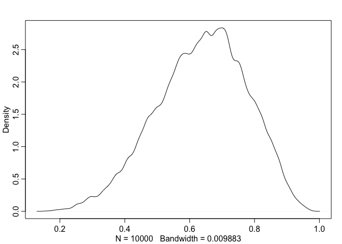

# Chapter 3 Sampling the Imaginary

```r
Pr_Positive_Vampire <- 0.95
Pr_Positive_Mortal <- 0.01
Pr_Vampire <- 0.001
Pr_Positive <- Pr_Positive_Vampire * Pr_Vampire +
               Pr_Positive_Mortal * ( 1 - Pr_Vampire )
( Pr_Vampire_Positive <- Pr_Positive_Vampire*Pr_Vampire / Pr_Positive )
```

```
## [1] 0.08683729
```
# 3.1. Sampling from a grid-approximate posterior

```r
p_grid <- seq( from=0 , to=1 , length.out=1000 )
prob_p <- rep( 1 , 1000 )
prob_data <- dbinom( 6 , size=9 , prob=p_grid )
posterior <- prob_data * prob_p
posterior <- posterior / sum(posterior)
```

```r
samples <- sample( p_grid , prob=posterior , size=1e4 , replace=TRUE )
```

```r
plot( samples )
```

<!-- -->


```r
library(rethinking)
```

```
## Loading required package: rstan
```

```
## Loading required package: ggplot2
```

```
## Warning: package 'ggplot2' was built under R version 3.5.2
```

```
## Loading required package: StanHeaders
```

```
## Warning: package 'StanHeaders' was built under R version 3.5.2
```

```
## rstan (Version 2.18.2, GitRev: 2e1f913d3ca3)
```

```
## For execution on a local, multicore CPU with excess RAM we recommend calling
## options(mc.cores = parallel::detectCores()).
## To avoid recompilation of unchanged Stan programs, we recommend calling
## rstan_options(auto_write = TRUE)
```

```
## Loading required package: parallel
```

```
## rethinking (Version 1.88)
```

```r
dens( samples )
```

<!-- -->
# 3.2. Sampling to summarize

```r
 # add up posterior probability where p < 0.5
sum( posterior[ p_grid < 0.5 ] )
```

```
## [1] 0.1718746
```


```r
sum( samples < 0.5 ) / 1e4
```

```
## [1] 0.1696
```


```r
sum( samples > 0.5 & samples < 0.75 ) / 1e4
```

```
## [1] 0.6065
```


```r
quantile( samples , 0.8 )
```

```
##       80% 
## 0.7607608
```


```r
quantile( samples , c( 0.1 , 0.9 ) )
```

```
##       10%       90% 
## 0.4503504 0.8128128
```


```r
p_grid <- seq( from=0 , to=1 , length.out=1000 )
prior <- rep(1,1000)
likelihood <- dbinom( 3 , size=3 , prob=p_grid )
posterior <- likelihood * prior
posterior <- posterior / sum(posterior)
samples <- sample( p_grid , size=1e4 , replace=TRUE , prob=posterior )
```


```r
 PI( samples , prob=0.5 )
```

```
##       25%       75% 
## 0.7027027 0.9299299
```


```r
HPDI( samples , prob=0.5 )
```

```
##      |0.5      0.5| 
## 0.8378378 0.9989990
```
# point estimates

```r
 p_grid[ which.max(posterior) ]
```

```
## [1] 1
```

```r
 chainmode( samples , adj=0.01 )
```

```
## [1] 0.9888822
```


```r
mean( samples )
```

```
## [1] 0.7981908
```

```r
median( samples )
```

```
## [1] 0.8388388
```


```r
sum( posterior*abs( 0.5 - p_grid ) )
```

```
## [1] 0.3128752
```

```r
 loss <- sapply( p_grid , function(d) sum( posterior*abs( d - p_grid ) ) )
```


```r
 p_grid[ which.min(loss) ]
```

```
## [1] 0.8408408
```

# 3.3. Samplingtosimulateprediction

```r
 dbinom( 0:2 , size=2 , prob=0.7 )
```

```
## [1] 0.09 0.42 0.49
```


```r
rbinom( 1 , size=2 , prob=0.7 )
```

```
## [1] 1
```


```r
 rbinom( 10 , size=2 , prob=0.7 )
```

```
##  [1] 0 2 2 1 2 2 1 1 2 0
```


```r
dummy_w <- rbinom( 1e5 , size=2 , prob=0.7 )
table(dummy_w)/1e5
```

```
## dummy_w
##       0       1       2 
## 0.09015 0.42149 0.48836
```


```r
dummy_w <- rbinom( 1e5 , size=9 , prob=0.7 )
simplehist( dummy_w , xlab="dummy water count" )
```

<!-- -->


```r
 w <- rbinom( 1e4 , size=9 , prob=0.6 )
```


```r
 w <- rbinom( 1e4 , size=9 , prob=samples )
```


# 3.4. Summary

# 3.5 Practice
Easy. Theseproblemsusethesamplesfromtheposteriordistributionfortheglobetossingexample. 

```r
p_grid <- seq( from=0 , to=1 , length.out=1000 )
prior <- rep( 1 , 1000 )
likelihood <- dbinom( 6 , size=9 , prob=p_grid )
posterior <- likelihood * prior
posterior <- posterior / sum(posterior)
set.seed(100)
samples <- sample( p_grid , prob=posterior , size=1e4 , replace=TRUE )
```
This code will give you a specific set of samples, so that you can check your answers exactly.
Use the values in samples to answer the questions that follow.
3E1. How much posterior probability lies below p = 0.2?

```r
library(rethinking)
sample( p_grid , prob=posterior , size=10 , replace=TRUE ) # what is size?
```

```
##  [1] 0.6656657 0.8378378 0.4084084 0.4154154 0.6566567 0.8658659 0.6746747
##  [8] 0.6906907 0.6956957 0.5705706
```

```r
dens(samples)
```

<!-- -->

```r
sum(samples[samples<0.2])/1e4 # divide the resulting count by the total number of samples (pg 54)
```

```
## [1] 8.778779e-05
```
3E2. How much posterior probability lies above p = 0.8?

```r
sum(samples[samples>0.8])/1e4 # divide the resulting count by the total number of samples
```

```
## [1] 0.09482282
```
3E3. How much posterior probability lies between p = 0.2 and p = 0.8? 3E4. 20% of the posterior probability lies below which value of p?

```r
sum(samples[samples>0.2 & samples<0.8])/1e4
```

```
## [1] 0.5400596
```

3E5. 20% of the posterior probability lies above which value of p?

```r
quantile(samples,0.8)
```

```
##       80% 
## 0.7567568
```
3E6. Which values of p contain the narrowest interval equal to 66% of the posterior probability?

```r
 HPDI( samples , prob=0.66 )
```

```
##     |0.66     0.66| 
## 0.5205205 0.7847848
```
3E7. Which values of p contain 66% of the posterior probability, assuming equal posterior probability both below and above the interval?

```r
PI(samples,prob=0.66)
```

```
##       17%       83% 
## 0.5005005 0.7687688
```

3M1 Suppose the globe tossing data had turned out to be 8 water in 15 tosses. Construct the posterior distribution, using grid approximation. Use the same flat prior as before.

```r
p_grid <- seq( from=0 , to=1 , length.out=1000 )
prior <- rep( 1 , 1000 )
likelihood <- dbinom( 8 , size=15 , prob=p_grid ) # change this
posterior <- likelihood * prior
posterior <- posterior / sum(posterior)
set.seed(100)
samples <- sample( p_grid , prob=posterior , size=1e4 , replace=TRUE )
dens(samples)
```

<!-- -->

3M2 Draw 10,000 samples from the grid approximation from above. Then use the samples to calculate the 90% HPDI for p.

```r
samples <- sample( p_grid , prob=posterior , size=1e4 , replace=TRUE )
dens(samples)
```

<!-- -->

```r
HPDI(samples,0.9)
```

```
##      |0.9      0.9| 
## 0.3383383 0.7317317
```

3M3 Construct a posterior predictive check for this model and data. This means simulate the distribution of samples, averaging over the posterior uncertainty in p. What is the probability of observing 8 water in 15 tosses?

```r
# learning rbinom funciton
rbinom( 10 , size=15 , prob=0.6 )
```

```
##  [1]  7 10  9 10 10  9  9 10 11 11
```

```r
# 1e4 trials as did in R code 3.25
 w <- rbinom( 1e4 , size=15 , prob=0.6 ) # why prob=0.6?
# use 
 w2 <- rbinom( 1e4 , size=15 , prob=samples ) # length of "n" shoudl be same as one of prob?
 rbinom( 1e3 , size=15 , prob=samples ) # no
```

```
##    [1]  6  7  6  5  7 11  6 12  3 10  8 11  7  6  2 11 11  6  9  7  8 10  9
##   [24]  7  7  5 15  9  8  3 12  8  8  7  7 11  9  4  7  7 12  9 10  9 11  9
##   [47]  9 10  7  6  8 11  7 10  1 13  7  8  7 10 11  7 12  9 10 13 11  6  8
##   [70] 11  8  7 10 10  6  9  8  9 10 13  2  7  6 10 13  8 11 10  6  8  6 11
##   [93]  8  9  5 10  5  9 11  3  5  7  7  8  6  9 13  6  9 12  8  4  9 10  9
##  [116]  5  7  9  8  5  8  7  7  8 14 13 11  8  3 13  5  9  8  6  7  4 10  7
##  [139] 13 10  4 10 10  8  7  7  5  8  8  7 10 10  9  9  4  9 10  6  7  6 10
##  [162]  2  8 10  6  5  6  5  9 10 10 10  4  7  9 10  5  6  8  4 10  8 10  7
##  [185]  2  8  7  7  8 12  9  7 12 10  4  7  2 12  8  8 12  8  7  7  8  9  7
##  [208] 13  4  3 11 11 10 11  7 11  8  6  8  9  8  9  8  2  7 12  6 10  7  5
##  [231]  6  8  5  6 11  3 12  5  8  7  9 12 13 11  9  5  9  5  9 10  9  5 11
##  [254]  9 11  8  4  8  9 10  5  9 11  6 10  7 10  7 10  6  6  9  2  9  7  2
##  [277]  8  6  8  5  6  9  6  8  7  8 10  9 12  5  9  9  7  4 11  9  8 11  6
##  [300]  8  8 10 13  3 13  6  6 11 10  5 13  8  7  7  9 12  5  8  6  8 10  8
##  [323] 10  9  4 11 10  3  6  9 10 11  7  9  7  7  7  9  4  6  3 10  5  8 10
##  [346]  6 10  7 10  7  4 10  8  7 11  9  8  7 11  7  4 11 11  7 10  9 10  8
##  [369]  7  7  6  4  8 10  6 13  3  8  9  7 13  9  9  5  5  3  7  8  8  7  6
##  [392]  5  5  9  9  7  7  6 10  8  8  5 13  4  6  8  8 10  9  7  6 10  3 10
##  [415]  2  6  7 10  9  3  6  8  5  3  9 10  6  8  6  8 11  4  7 10 15  5  9
##  [438] 10  6 11  8  7 10  9  7  7  6  6  2  6  7 12  6 11 10  5  9 11 10  8
##  [461]  9 10  5  9  8  7  8  6  6  6  2  4  6 10  8  8  6  9  5  8  5 10  7
##  [484] 13  9  6  6  7  2 10  9  8  4  8  8 13  8  8  7  9  6  6  5  2 10  9
##  [507]  4  4  8  6  9  9  7 10  7  6  7 11  4  8  8  6  5  7  7  7 10  5  7
##  [530]  6  4 14 12  4 10  4 11  9  7  8 10  9  4  9  9  9 10 14  6  6  5  7
##  [553]  6  6  5 10  9 10 11  8  9  8  6 10  9  5 10  7 11  9  0 13  5  6  1
##  [576]  6  7  5  6  6  9  8  7  6  7 12  9  9 10  9  7 12 11  6  3  6 11  4
##  [599]  3  6  6  4 12  6  7  2 12  8  9  7 10  8  6  9  3  3  7  8  8  9 12
##  [622] 10  2  9  8 12  8  5 12 11  6 10 10 12 10  8  7  5  9 11  9  8  1  8
##  [645]  8  8  6  2  6  9  8  9 11  5  7  6  5 11 11  8 12  4  4 12  9  3  5
##  [668]  5  7  9  4  4  9  6  7  9 10  3  8 12 10  6  3  8  7  5  9  5  7 10
##  [691]  5  6  5 10  5 10  8 11  3  7  6  9  4 10 12 11  5  6 12  6  8  6  7
##  [714] 10  6  9  9  9  5  5  7 11  8 10  7  4  9 10 13  6  8  9  7  6 11  6
##  [737]  8 11  7 12  8  8  7  7 11 11  7  7  4 10 10  8 11  8  5  3 13  8  6
##  [760]  7 13 11  5 13 12 11 14  7 10  7  7  8  6  9  5  7  4  9 10  9 10  8
##  [783] 10  7  6 14  7  9  8 10 12  9  5  7  7  7  5  9  4  5  5  9  9 12  6
##  [806]  7  6  6  5  9  4  9  8 11  7  7  8  5  4  9  6  8  5  7  8  9  3 10
##  [829]  7 11  5  8 10  9  7 13  2 12  6  7  6  9 10  3  7 14 10  2  2  9 11
##  [852] 13  9  7 13  7 10 11  5 12  6  7  7  4  9  9  8 10  6 11  4 11 10  6
##  [875]  5  6  9  8 10 10 12  9 10 11 10  7  6  9  7  6 11 10  6  4  4 10  5
##  [898]  1  5  8 10 10  8  9 13  9  9 11  7  8  7  7 10  6  4  7 13 11 10 10
##  [921]  5  5 10 12  4  3 12  8  7 11  8  7  5  5  9  6  9  6  9 10  7  7  9
##  [944]  7 11  8  4  6  8  8  7  6  6 10  9  8 12  4  7  5  6  9  6  9  7 13
##  [967]  3 11 12  4  5  7  6  9 10  6 10 11  7 13 11  6 10  8  8  6 12  9  9
##  [990]  7  6  5 13  7  9  5 10  8 10  8
```

```r
 table(w2)/1e4 # 0.1486
```

```
## w2
##      0      1      2      3      4      5      6      7      8      9 
## 0.0003 0.0039 0.0123 0.0289 0.0516 0.0813 0.1097 0.1314 0.1479 0.1364 
##     10     11     12     13     14     15 
## 0.1223 0.0857 0.0509 0.0247 0.0105 0.0022
```

```r
 simplehist(w2)
```

<!-- -->
3M4 Using the posterior distribution constructed from the new (8/15) data, now calculate the probability of observing 6 water in 9 tosses.

```r
p_grid.3M4 <- seq( from=0 , to=1 , length.out=10000)
likelihood <- dbinom(6 , size=9 , prob=samples) # 
posterior <- likelihood * prior
posterior <- posterior / sum(posterior)
set.seed(100)
samples.3M4 <- sample( p_grid.3M4, prob=posterior , size=1e4 , replace=TRUE )
dens(samples.3M4)
```

<!-- -->

```r
table.3M4<-table(rbinom(1e4,size=9,samples.3M4))
table.3M4/1e4
```

```
## 
##      0      1      2      3      4      5      6      7      8      9 
## 0.0955 0.1033 0.1015 0.1041 0.0988 0.0975 0.1000 0.1001 0.1007 0.0985
```

```r
# 0.0996 for 6 water in 9 toss
 simplehist(table.3M4)
```

```
## Error in 1:ncol(x): NA/NaN argument
```


