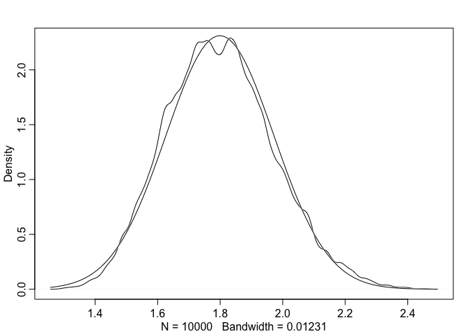
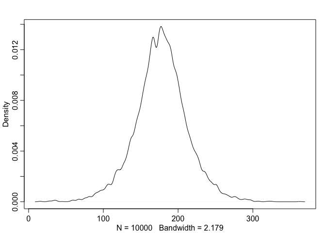
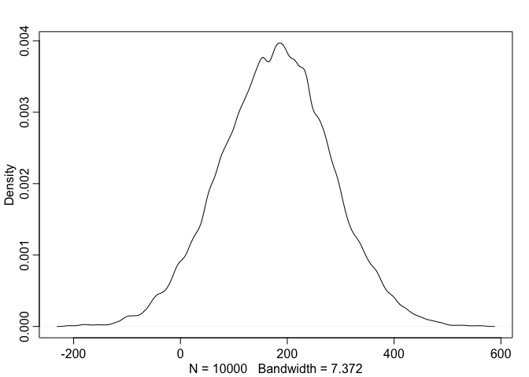
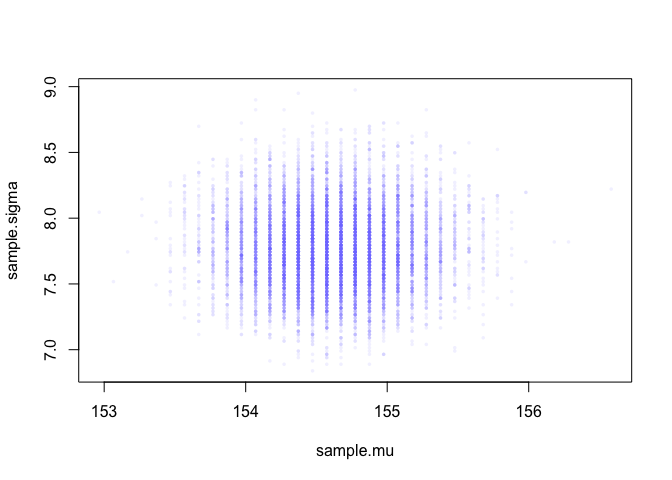
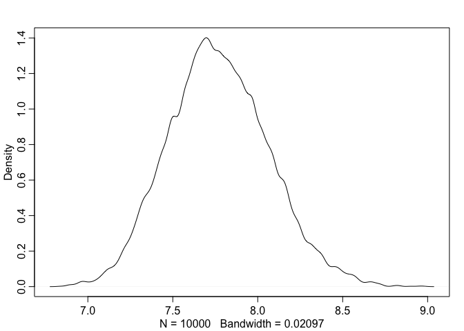
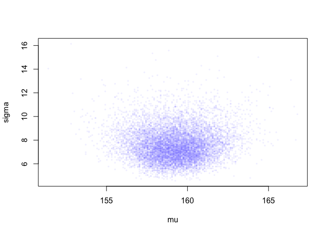
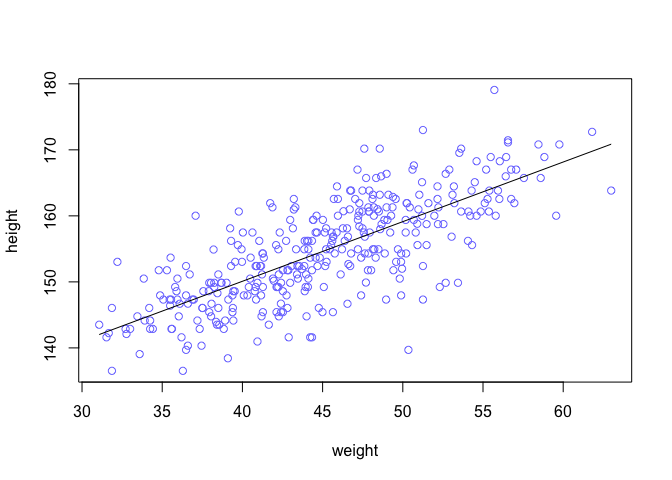
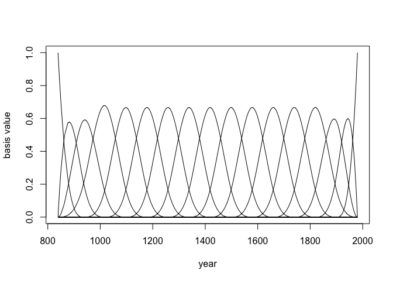

# Chapter 4 Geocentric Models

```r
## R code 4.1
pos <- replicate( 1000 , sum( runif(16,-1,1) ) ) 

## R code 4.2
prod( 1 + runif(12,0,0.1) )
```

```
## [1] 1.740403
```

```r
## R code 4.3
growth <- replicate( 10000 , prod( 1 + runif(12,0,0.1) ) )
dens( growth , norm.comp=TRUE )
```

<!-- -->

```r
## R code 4.4
big <- replicate( 10000 , prod( 1 + runif(12,0,0.5) ) )
small <- replicate( 10000 , prod( 1 + runif(12,0,0.01) ) )

## R code 4.5
log.big <- replicate( 10000 , log(prod(1 + runif(12,0,0.5))) )

## R code 4.6
w <- 6; n <- 9;
p_grid <- seq(from=0,to=1,length.out=100)
posterior <- dbinom(w,n,p_grid)*dunif(p_grid,0,1)
posterior <- posterior/sum(posterior)
```
4.3. A Gaussian model of height

```r
## R code 4.7
library(rethinking)
data(Howell1)
d <- Howell1

## R code 4.8
str( d )
```

```
## 'data.frame':	544 obs. of  4 variables:
##  $ height: num  152 140 137 157 145 ...
##  $ weight: num  47.8 36.5 31.9 53 41.3 ...
##  $ age   : num  63 63 65 41 51 35 32 27 19 54 ...
##  $ male  : int  1 0 0 1 0 1 0 1 0 1 ...
```

```r
## R code 4.9 (new in book)
precis(d)
```

```
##               mean         sd      5.5%     94.5%     histogram
## height 138.2635963 27.6024476 81.108550 165.73500 ▁▁▁▁▁▁▁▂▁▇▇▅▁
## weight  35.6106176 14.7191782  9.360721  54.50289 ▁▂▃▂▂▂▂▅▇▇▃▂▁
## age     29.3443934 20.7468882  1.000000  66.13500     ▇▅▅▃▅▂▂▁▁
## male     0.4724265  0.4996986  0.000000   1.00000    ▇▁▁▁▁▁▁▁▁▇
```

```r
## R code 4.10 
d$height
```

```
##   [1] 151.7650 139.7000 136.5250 156.8450 145.4150 163.8300 149.2250
##   [8] 168.9100 147.9550 165.1000 154.3050 151.1300 144.7800 149.9000
##  [15] 150.4950 163.1950 157.4800 143.9418 121.9200 105.4100  86.3600
##  [22] 161.2900 156.2100 129.5400 109.2200 146.4000 148.5900 147.3200
##  [29] 137.1600 125.7300 114.3000 147.9550 161.9250 146.0500 146.0500
##  [36] 152.7048 142.8750 142.8750 147.9550 160.6550 151.7650 162.8648
##  [43] 171.4500 147.3200 147.9550 144.7800 121.9200 128.9050  97.7900
##  [50] 154.3050 143.5100 146.7000 157.4800 127.0000 110.4900  97.7900
##  [57] 165.7350 152.4000 141.6050 158.8000 155.5750 164.4650 151.7650
##  [64] 161.2900 154.3050 145.4150 145.4150 152.4000 163.8300 144.1450
##  [71] 129.5400 129.5400 153.6700 142.8750 146.0500 167.0050 158.4198
##  [78]  91.4400 165.7350 149.8600 147.9550 137.7950 154.9400 160.9598
##  [85] 161.9250 147.9550 113.6650 159.3850 148.5900 136.5250 158.1150
##  [92] 144.7800 156.8450 179.0700 118.7450 170.1800 146.0500 147.3200
##  [99] 113.0300 162.5600 133.9850 152.4000 160.0200 149.8600 142.8750
## [106] 167.0050 159.3850 154.9400 148.5900 111.1250 111.7600 162.5600
## [113] 152.4000 124.4600 111.7600  86.3600 170.1800 146.0500 159.3850
## [120] 151.1300 160.6550 169.5450 158.7500  74.2950 149.8600 153.0350
## [127]  96.5200 161.9250 162.5600 149.2250 116.8400 100.0760 163.1950
## [134] 161.9250 145.4150 163.1950 151.1300 150.4950 141.6050 170.8150
## [141]  91.4400 157.4800 152.4000 149.2250 129.5400 147.3200 145.4150
## [148] 121.9200 113.6650 157.4800 154.3050 120.6500 115.6000 167.0050
## [155] 142.8750 152.4000  96.5200 160.0000 159.3850 149.8600 160.6550
## [162] 160.6550 149.2250 125.0950 140.9700 154.9400 141.6050 160.0200
## [169] 150.1648 155.5750 103.5050  94.6150 156.2100 153.0350 167.0050
## [176] 149.8600 147.9550 159.3850 161.9250 155.5750 159.3850 146.6850
## [183] 172.7200 166.3700 141.6050 142.8750 133.3500 127.6350 119.3800
## [190] 151.7650 156.8450 148.5900 157.4800 149.8600 147.9550 102.2350
## [197] 153.0350 160.6550 149.2250 114.3000 100.9650 138.4300  91.4400
## [204] 162.5600 149.2250 158.7500 149.8600 158.1150 156.2100 148.5900
## [211] 143.5100 154.3050 131.4450 157.4800 157.4800 154.3050 107.9500
## [218] 168.2750 145.4150 147.9550 100.9650 113.0300 149.2250 154.9400
## [225] 162.5600 156.8450 123.1900 161.0106 144.7800 143.5100 149.2250
## [232] 110.4900 149.8600 165.7350 144.1450 157.4800 154.3050 163.8300
## [239] 156.2100 153.6700 134.6200 144.1450 114.3000 162.5600 146.0500
## [246] 120.6500 154.9400 144.7800 106.6800 146.6850 152.4000 163.8300
## [253] 165.7350 156.2100 152.4000 140.3350 158.1150 163.1950 151.1300
## [260] 171.1198 149.8600 163.8300 141.6050  93.9800 149.2250 105.4100
## [267] 146.0500 161.2900 162.5600 145.4150 145.4150 170.8150 127.0000
## [274] 159.3850 159.4000 153.6700 160.0200 150.4950 149.2250 127.0000
## [281] 142.8750 142.1130 147.3200 162.5600 164.4650 160.0200 153.6700
## [288] 167.0050 151.1300 147.9550 125.3998 111.1250 153.0350 139.0650
## [295] 152.4000 154.9400 147.9550 143.5100 117.9830 144.1450  92.7100
## [302] 147.9550 155.5750 150.4950 155.5750 154.3050 130.6068 101.6000
## [309] 157.4800 168.9100 150.4950 111.7600 160.0200 167.6400 144.1450
## [316] 145.4150 160.0200 147.3200 164.4650 153.0350 149.2250 160.0200
## [323] 149.2250  85.0900  84.4550  59.6138  92.7100 111.1250  90.8050
## [330] 153.6700  99.6950  62.4840  81.9150  96.5200  80.0100 150.4950
## [337] 151.7650 140.6398  88.2650 158.1150 149.2250 151.7650 154.9400
## [344] 123.8250 104.1400 161.2900 148.5900  97.1550  93.3450 160.6550
## [351] 157.4800 167.0050 157.4800  91.4400  60.4520 137.1600 152.4000
## [358] 152.4000  81.2800 109.2200  71.1200  89.2048  67.3100  85.0900
## [365]  69.8500 161.9250 152.4000  88.9000  90.1700  71.7550  83.8200
## [372] 159.3850 142.2400 142.2400 168.9100 123.1900  74.9300  74.2950
## [379]  90.8050 160.0200  67.9450 135.8900 158.1150  85.0900  93.3450
## [386] 152.4000 155.5750 154.3050 156.8450 120.0150 114.3000  83.8200
## [393] 156.2100 137.1600 114.3000  93.9800 168.2750 147.9550 139.7000
## [400] 157.4800  76.2000  66.0400 160.7000 114.3000 146.0500 161.2900
## [407]  69.8500 133.9850  67.9450 150.4950 163.1950 148.5900 148.5900
## [414] 161.9250 153.6700  68.5800 151.1300 163.8300 153.0350 151.7650
## [421] 132.0800 156.2100 140.3350 158.7500 142.8750  84.4550 151.9428
## [428] 161.2900 127.9906 160.9852 144.7800 132.0800 117.9830 160.0200
## [435] 154.9400 160.9852 165.9890 157.9880 154.9400  97.9932  64.1350
## [442] 160.6550 147.3200 146.7000 147.3200 172.9994 158.1150 147.3200
## [449] 124.9934 106.0450 165.9890 149.8600  76.2000 161.9250 140.0048
## [456]  66.6750  62.8650 163.8300 147.9550 160.0200 154.9400 152.4000
## [463]  62.2300 146.0500 151.9936 157.4800  55.8800  60.9600 151.7650
## [470] 144.7800 118.1100  78.1050 160.6550 151.1300 121.9200  92.7100
## [477] 153.6700 147.3200 139.7000 157.4800  91.4400 154.9400 143.5100
## [484]  83.1850 158.1150 147.3200 123.8250  88.9000 160.0200 137.1600
## [491] 165.1000 154.9400 111.1250 153.6700 145.4150 141.6050 144.7800
## [498] 163.8300 161.2900 154.9000 161.3000 170.1800 149.8600 123.8250
## [505]  85.0900 160.6550 154.9400 106.0450 126.3650 166.3700 148.2852
## [512] 124.4600  89.5350 101.6000 151.7650 148.5900 153.6700  53.9750
## [519] 146.6850  56.5150 100.9650 121.9200  81.5848 154.9400 156.2100
## [526] 132.7150 125.0950 101.6000 160.6550 146.0500 132.7150  87.6300
## [533] 156.2100 152.4000 162.5600 114.9350  67.9450 142.8750  76.8350
## [540] 145.4150 162.5600 156.2100  71.1200 158.7500
```

```r
## R code 4.11
d2 <- d[ d$age >= 18 , ] # All we want for now are heights of adults in the sample. The reason to filter out non- adults for now is that height is strongly correlated with age, before adulthood.

## R code 4.12 (prior)
curve( dnorm( x , 178 , 20 ) , from=100 , to=250 )
```

<!-- -->

```r
## R code 4.13 (prior, sigma)
curve( dunif( x , 0 , 50 ) , from=-10 , to=60 )
```

<!-- -->

```r
## R code 4.14 (prior predictive simulation)
sample_mu <- rnorm( 1e4 , 178 , 20 )
sample_sigma <- runif( 1e4 , 0 , 50 )
prior_h <- rnorm( 1e4 , sample_mu , sample_sigma )
dens( prior_h )
```

<!-- -->

```r
## R code 4.15
sample_mu <- rnorm( 1e4 , 178 , 100 )
prior_h <- rnorm( 1e4 , sample_mu , sample_sigma )
dens( prior_h )
```

<!-- -->
## 4.3.3 Grid approximation of the posterior distribution

```r
## R code 4.16
mu.list <- seq( from=140, to=160 , length.out=200 )
sigma.list <- seq( from=4 , to=9 , length.out=200 )
# base::expand.grid below is super useful function to make data.frame!
post <- expand.grid( mu=mu.list , sigma=sigma.list ) # 
post$LL <- sapply( 1:nrow(post) , function(i) sum( dnorm(
                d2$height ,
                mean=post$mu[i] ,
                sd=post$sigma[i] ,
                log=TRUE ) ) )
post$prod <- post$LL + dnorm( post$mu , 178 , 20 , TRUE ) +
    dunif( post$sigma , 0 , 50 , TRUE )
post$prob <- exp( post$prod - max(post$prod) )

## R code 4.17
contour_xyz( post$mu , post$sigma , post$prob )
```

<!-- -->

```r
## R code 4.18
image_xyz( post$mu , post$sigma , post$prob )
```

<!-- -->
4.3.4 Sampling from the posterior

```r
## R code 4.17
sample.rows <- sample( 1:nrow(post) , size=1e4 , replace=TRUE ,
    prob=post$prob )
sample.mu <- post$mu[ sample.rows ]
sample.sigma <- post$sigma[ sample.rows ]

## R code 4.18
plot( sample.mu , sample.sigma , cex=0.5 , pch=16 , col=col.alpha(rangi2,0.1) )
```

<!-- -->

```r
## R code 4.20
dens( sample.mu )
```

<!-- -->

```r
dens( sample.sigma )
```

<!-- -->

```r
## R code 4.22
HPDI( sample.mu )
```

```
##    |0.89    0.89| 
## 153.8693 155.1759
```

```r
HPDI( sample.sigma )
```

```
##    |0.89    0.89| 
## 7.291457 8.221106
```
Overthinking: Sample size and the normality of σ’s posterior. 

```r
## R code 4.23
d3 <- sample( d2$height , size=20 )

## R code 4.24
mu.list <- seq( from=150, to=170 , length.out=200 )
sigma.list <- seq( from=4 , to=20 , length.out=200 )
post2 <- expand.grid( mu=mu.list , sigma=sigma.list )
post2$LL <- sapply( 1:nrow(post2) , function(i)
    sum( dnorm( d3 , mean=post2$mu[i] , sd=post2$sigma[i] ,
    log=TRUE ) ) )
post2$prod <- post2$LL + dnorm( post2$mu , 178 , 20 , TRUE ) +
    dunif( post2$sigma , 0 , 50 , TRUE )
post2$prob <- exp( post2$prod - max(post2$prod) )
sample2.rows <- sample( 1:nrow(post2) , size=1e4 , replace=TRUE ,
    prob=post2$prob )
sample2.mu <- post2$mu[ sample2.rows ]
sample2.sigma <- post2$sigma[ sample2.rows ]
plot( sample2.mu , sample2.sigma , cex=0.5 ,
    col=col.alpha(rangi2,0.1) ,
    xlab="mu" , ylab="sigma" , pch=16 )
```

<!-- -->

```r
## R code 4.25
dens( sample2.sigma , norm.comp=TRUE )
```

<!-- -->

4.3.5. Finding the posterior distribution with quap. Quadratic approximation

```r
## R code 4.26
library(rethinking)
data(Howell1)
d <- Howell1
d2 <- d[ d$age >= 18 , ]

## R code 4.27
flist <- alist(
    height ~ dnorm( mu , sigma ) ,
    mu ~ dnorm( 178 , 20 ),
    sigma ~ dunif(0, 50)
)

## R code 4.28
m4.1 <- quap( flist , data=d2 )

## R code 4.29
precis( m4.1 )
```

```
##             mean        sd       5.5%     94.5%
## mu    154.607005 0.4119972 153.948554 155.26546
## sigma   7.731381 0.2913906   7.265683   8.19708
```
Overthinking: Start values for quap.

```r
## R code 4.30
start <- list(
    mu=mean(d2$height),
    sigma=sd(d2$height)
)
m4.1 <- quap( flist , data=d2 )


## R code 4.31
m4.2 <- quap(
        alist(
            height ~ dnorm( mu , sigma ) ,
            mu ~ dnorm( 178 , 0.1 ) ,
            sigma ~ dunif( 0 , 50 )
        ) ,
        data=d2 )
precis( m4.2 )
```

```
##            mean        sd      5.5%     94.5%
## mu    177.86375 0.1002354 177.70356 178.02395
## sigma  24.51755 0.9289224  23.03296  26.00215
```

4.3.6. Sampling from a quap.

```r
### variance-covariance matrix.
## R code 4.30
vcov( m4.1 )
```

```
##                mu       sigma
## mu    0.169742345 0.000218254
## sigma 0.000218254 0.084909241
```

```r
## R code 4.31
diag( vcov( m4.1 ) )
```

```
##         mu      sigma 
## 0.16974235 0.08490924
```

```r
cov2cor( vcov( m4.1 ) )
```

```
##                mu       sigma
## mu    1.000000000 0.001817982
## sigma 0.001817982 1.000000000
```

```r
## R code 4.32
library(rethinking)
post <- extract.samples( m4.1 , n=1e4 ) 
head(post) 
```

```
##         mu    sigma
## 1 154.5687 8.065676
## 2 154.6630 8.064903
## 3 154.7092 7.409035
## 4 153.8237 7.386691
## 5 154.2066 7.872597
## 6 153.5467 8.133309
```

```r
## R code 4.33
precis(post)
```

```
##             mean        sd       5.5%      94.5%    histogram
## mu    154.608046 0.4028741 153.960080 155.238981      ▁▁▅▇▂▁▁
## sigma   7.733196 0.2898355   7.268919   8.194092 ▁▁▁▂▅▇▇▃▁▁▁▁
```

Overthinking: Under the hood with multivariate sampling.

```r
## R code 4.34
library(MASS)
post <- mvrnorm( n=1e4 , mu=coef(m4.1) , Sigma=vcov(m4.1) )
## R code 4.37
plot( d2$height ~ d2$weight )
```

<!-- -->
4.4. Adding a predictor

```r
## R code 4.38
set.seed(2971)
N <- 100 #100 lines
a <- rnorm(N,178,20)
b <- rnorm(N, 0, 10)
## R code 4.39 (Figure 4.5)
plot(NULL,xlim=range(d2$weight),ylim=c(-100,400),xlab="weight",ylab="height")
abline(h=0,lty=2)
abline(h=272,lty=1,lwd=0.5)
mtext("b~dnorm(0,10")
xbar <- mean(d2$weight)
for(i in 1:N) curve(a[i]+b[i]*(x - xbar),
                    from=min(d2$weight),to=max(d2$weight),add=TRUE,col=col.alpha("black",0.2)) 
```

<!-- -->

```r
## R code 4.40: Defining β as Log-Normal
b <- rlnorm(1e4,0,1)
dens(b,xlim=c(0,5),adj=0.1)
```

<!-- -->

```r
## R code 4.41
set.seed(2971)
N <- 100 #100 lines
a <- rnorm(N,178,20)
b <- rlnorm(N, 0, 1) # changed
## my own
plot(NULL,xlim=range(d2$weight),ylim=c(-100,400),xlab="weight",ylab="height")
abline(h=0,lty=2)
abline(h=272,lty=1,lwd=0.5)
mtext("log(b)~dnorm(0,1)")
xbar <- mean(d2$weight)
for(i in 1:N) curve(a[i]+b[i]*(x - xbar),
                    from=min(d2$weight),to=max(d2$weight),add=TRUE,col=col.alpha("black",0.2)) 
```

<!-- -->

```r
## R code 4.42
# load data again, since it's a long way back
library(rethinking)
data(Howell1)
d <- Howell1
d2 <- d[ d$age >= 18 , ]
# define the average weight, x-bar
xbar <- mean(d2$weight)

# fit model
m4.3 <- quap(
    alist(
        height ~ dnorm( mu , sigma ) ,
        mu <- a + b*(weight - xbar) ,
        a ~ dnorm( 178 , 20 ) ,
        b ~ dlnorm( 0 , 1 ) ,
        sigma ~ dunif( 0 , 50 )
    ) ,
    data=d2 )
```
## R code 4.43
* Overthinking: Logs and exps, oh my. The Log-Normal prior for β can be coded another way. Instead of defining a parameter β, we define a parameter that is the logarithm of β and then assign it a normal distribution. Then we can reverse the logarithm inside the linear model. It looks like this:

```r
m4.3b <- quap(
    alist(
        height ~ dnorm(mu , sigma ) ,
        mu <- a + exp(log_b)*(weight-xbar),
        a ~ dnorm( 178 , 100 ) ,
        b ~ dnorm( 0 , 10 ) ,
        log_b ~ dnorm( 0 , 1 ),
        sigma~dunif(0,50)
    ) ,
    data=d2 )
```
4.4.3. Interpreting the posterior distribution.
4.4.3.1. Tables of marginal distributions

```r
## R code 4.44
precis( m4.3 )
```

```
##              mean         sd        5.5%       94.5%
## a     154.6013671 0.27030766 154.1693633 155.0333710
## b       0.9032807 0.04192363   0.8362787   0.9702828
## sigma   5.0718809 0.19115478   4.7663786   5.3773831
```

```r
# Remember, the numbers in the default precis output aren’t sufficient to describe the quadratic posterior completely. For that, we also require the variance-covariance matrix. You can see the covariances among the parameters with vcov:
## R code 4.45
round(vcov(m4.3),3)
```

```
##           a     b sigma
## a     0.073 0.000 0.000
## b     0.000 0.002 0.000
## sigma 0.000 0.000 0.037
```

```r
# Very little covariation among the parameters in this case. Using pairs(m4.3) shows both the marginal posteriors and the covariance. In the problems at the end of the chapter, you’ll see that the lack of covariance among the parameters results from the something called cen- tering.
```

4.4.3.2. Plotting posterior inference against the data.

```r
# We’re going to start with a simple version of that task, superimposing just the posterior mean values over the height and weight data. Then we’ll slowly add more and more infor- mation to the prediction plots, until we’ve used the entire posterior distribution. We’ll start with just the raw data and a single line. The code below plots the raw data, computes the posterior mean values for a and b, then draws the implied line:
  
## R code 4.46
4.46
```

```
## [1] 4.46
```

```r
plot( height ~ weight , data=d2 , col=rangi2 )
post <- extract.samples( m4.3 )
a_map <- mean(post$a)
b_map <- mean(post$b)
curve( a_map + b_map*(x - xbar) , add=TRUE )
```

<!-- -->
4.4.3.3. Adding uncertainty around the mean.

```r
# To better appreciate how the posterior distribution contains lines, we work with all of the samples from the model. Let’s take a closer look at the samples now:
post <- extract.samples( m4.3 )
post[1:5,]
```

```
##          a         b    sigma
## 1 154.9493 0.9075067 4.873812
## 2 154.8834 0.9578025 5.120553
## 3 154.4967 0.8987900 5.161813
## 4 154.2916 0.8414611 4.755758
## 5 154.5858 0.9608629 5.125150
```

```r
# Each row is a correlated random sample from the joint posterior of all three parameters, using the covariances provided by vcov(m4.3). The paired values of a and b on each row define a line. The average of very many of these lines is the posterior mean line. But the scatter around that average is meaningful, because it alters our confidence in the relationship between the predictor and the outcome.

## R code 4.48
N <- 352
dN <- d2[ 1:N , ]
mN <- quap(
    alist(
        height ~ dnorm( mu , sigma ) ,
        mu <- a + b*(weight -mean(weight)),
        a ~ dnorm( 178 , 20 ) ,
        b ~ dlnorm( 0 , 1 ) ,
        sigma ~ dunif( 0 , 50 )
    ) , data=dN )

## R code 4.49
# extract 20 samples from the posterior
post <- extract.samples( mN , n=20 )

# display raw data and sample size
plot( dN$weight , dN$height ,
    xlim=range(d2$weight) , ylim=range(d2$height) ,
    col=rangi2 , xlab="weight" , ylab="height" )
mtext(concat("N = ",N))

# plot the lines, with transparency
for ( i in 1:20 )
    curve(post$a[i] + post$b[i]*(x-mean(dN$weight)) , col=col.alpha("black",0.3),add=TRUE) # d2 has 352
```

<!-- -->
4.4.3.4 Plotting regression intervals nd contours.

```r
## R code 4.50
post <- extract.samples(m4.3)
mu_at_50 <- post$a + post$b * (50-xbar)

## R code 4.51
dens( mu_at_50 , col=rangi2 , lwd=2 , xlab="mu|weight=50" )
```

<!-- -->

```r
## R code 4.52
HPDI( mu_at_50 , prob=0.89 )
```

```
##    |0.89    0.89| 
## 158.5710 159.6676
```

```r
# That’s good so far, but we need to repeat the above calculation for every weight value on the horizontal axis, not just when it is 50 kg. We want to draw 89% HPDIs around the average slope in Figure 4.6.

# This is made simple by strategic use of the link function, a part of the rethinking package. 
## R code 4.53
mu <- link( m4.3 )
str(mu)
```

```
##  num [1:1000, 1:352] 158 157 157 157 157 ...
```

```r
## R code 4.54
# define sequence of weights to compute predictions for
# these values will be on the horizontal axis
weight.seq <- seq( from=25 , to=70 , by=1 )

# use link to compute mu
# for each sample from posterior
# and for each weight in weight.seq
mu <- link( m4.3 , data=data.frame(weight=weight.seq) )
str(mu)
```

```
##  num [1:1000, 1:46] 136 136 137 136 137 ...
```

```r
## R code 4.55
# use type="n" to hide raw data
plot( height ~ weight , d2 , type="n" )

# loop over samples and plot each mu value
for ( i in 1:100 )
    points( weight.seq , mu[i,] , pch=16 , col=col.alpha(rangi2,0.1) ) # Fig 4.9
```

<!-- -->

```r
## R code 4.56
# summarize the distribution of mu
mu.mean <- apply( mu , 2 , mean )
mu.HPDI <- apply( mu , 2 , HPDI , prob=0.89 )

## R code 4.57
# plot raw data
# fading out points to make line and interval more visible
plot( height ~ weight , data=d2 , col=col.alpha(rangi2,0.5) )

# plot the MAP line, aka the mean mu for each weight
lines( weight.seq , mu.mean )

# plot a shaded region for 89% HPDI
shade( mu.HPDI , weight.seq )
```

<!-- -->

```r
## R code 4.58
post <- extract.samples(m4.3)
mu.link <- function(weight) post$a + post$b*weight
weight.seq <- seq( from=25 , to=70 , by=1 )
mu <- sapply( weight.seq , mu.link )
mu.mean <- apply( mu , 2 , mean )
mu.HPDI <- apply( mu , 2 , HPDI , prob=0.89 )
```
4.4.3.5. Prediction intervals.

```r
## R code 4.59
sim.height <- sim( m4.3 , data=list(weight=weight.seq) )
str(sim.height)
```

```
##  num [1:1000, 1:46] 133 141 141 140 130 ...
```

```r
## R code 4.60
height.PI <- apply( sim.height , 2 , PI , prob=0.89 )
# Let’s plot everything we’ve built up: (1) the average line, (2) the shaded region of 89% plausible μ, and (3) the boundaries of the simulated heights the model expects.(Fig 4.10)
## R code 4.61
# plot raw data
plot( height ~ weight , d2 , col=col.alpha(rangi2,0.5) )

# draw MAP line
lines( weight.seq , mu.mean )

# draw HPDI region for line
shade( mu.HPDI , weight.seq )

# draw PI region for simulated heights
shade( height.PI , weight.seq )
```

<!-- -->

```r
## R code 4.62
sim.height <- sim( m4.3 , data=list(weight=weight.seq) , n=1e4 )
height.PI <- apply( sim.height , 2 , PI , prob=0.89 )
```
Overthinking: Rolling your own sim. 
## R code 4.63
# Just like with link, it’s useful to know a little about how sim operates. For every distribution like dnorm, there is a companion simulation function. For the Gaussian distribution, the companion is rnorm, and it simulates sampling from a Gaussian distribu- tion. What we want R to do is simulate a height for each set of samples, and to do this for each value of weight. The following will do it

```r
post <- extract.samples(m4.3)
weight.seq <- 25:70
sim.height <- sapply( weight.seq , function(weight)
    rnorm(
        n=nrow(post) ,
        mean=post$a + post$b*weight ,
        sd=post$sigma ) )
height.PI <- apply( sim.height , 2 , PI , prob=0.89 )
```

4.5. Curves from lines
4.5.1 Polynomial regression

```r
## R code 4.64
library(rethinking)
data(Howell1)
d <- Howell1
str(d)
```

```
## 'data.frame':	544 obs. of  4 variables:
##  $ height: num  152 140 137 157 145 ...
##  $ weight: num  47.8 36.5 31.9 53 41.3 ...
##  $ age   : num  63 63 65 41 51 35 32 27 19 54 ...
##  $ male  : int  1 0 0 1 0 1 0 1 0 1 ...
```

```r
## R code 4.65
d$weight.s <- ( d$weight - mean(d$weight) )/sd(d$weight)
d$weight.s2 <- d$weight.s^2
m4.5 <- quap(
    alist(
        height ~ dnorm( mu , sigma ) ,
        mu <- a + b1*weight.s + b2*weight.s2 ,
        a ~ dnorm( 178 , 20 ) ,
        b1 ~ dlnorm( 0 , 1 ) ,
        b2 ~ dnorm( 0 , 1 ) ,
        sigma ~ dunif( 0 , 50 )
    ) ,
    data=d )

## R code 4.66
precis( m4.5 )
```

```
##             mean        sd       5.5%      94.5%
## a     146.058396 0.3689817 145.468692 146.648100
## b1     21.732482 0.2888959  21.270771  22.194194
## b2     -7.804507 0.2741831  -8.242704  -7.366309
## sigma   5.774656 0.1764780   5.492610   6.056702
```

```r
# You have to plot these model fits to understand what they are saying. So let’s do that. We’ll calculate the mean relationship and the 89% intervals of the mean and the predictions, like in the previous section. 
## R code 4.67
weight.seq <- seq( from=-2.2 , to=2 , length.out=30 )
pred_dat <- list( weight.s=weight.seq , weight.s2=weight.seq^2 )
mu <- link( m4.5 , data=pred_dat )
mu.mean <- apply( mu , 2 , mean )
mu.PI <- apply( mu , 2 , PI , prob=0.89 )
sim.height <- sim( m4.5 , data=pred_dat )
height.PI <- apply( sim.height , 2 , PI , prob=0.89 )

## R code 4.68
plot( height ~ weight.s , d , col=col.alpha(rangi2,0.5) )
lines( weight.seq , mu.mean )
shade( mu.PI , weight.seq )
shade( height.PI , weight.seq )
```

<!-- -->
a higher-order polynomial regression, a cubic regression on weight. 

```r
## R code 4.70
d$weight.s3 <- d$weight.s^3
m4.6 <- quap(
    alist(
        height ~ dnorm( mu , sigma ) ,
        mu <- a + b1*weight.s + b2*weight.s2 + b3*weight.s3 ,
        a ~ dnorm( 178 , 20 ) ,
        b1 ~ dlnorm( 0 , 1 ) ,
        b2 ~ dnorm( 0 , 10 ) ,
        b3 ~ dnorm( 0 , 10 ) ,
        sigma ~ dunif( 0 , 50 )
    ) ,
    data=d )

## R code 4.71
plot( height ~ weight.s , d , col=col.alpha(rangi2,0.5) , xaxt="n" )

## R code 4.71
at <- c(-2,-1,0,1,2)
labels <- at*sd(d$weight) + mean(d$weight)
axis( side=1 , at=at , labels=round(labels,1) )
## adding following codes by KN
pred_dat <- list( weight.s=weight.seq , weight.s2=weight.seq^2, weight.s3=weight.seq^3)
mu <- link(m4.6 , data=pred_dat )
mu.mean <- apply( mu , 2 , mean )
lines( weight.seq , mu.mean )
```

<!-- -->
4.5.2. Splines: S-spline

```r
# Let’s load a thousand years of Japanese cherry blossom dates
## R code 4.72
library(rethinking)
data(cherry_blossoms)
d<-cherry_blossoms
precis(d)
```

```
##                   mean          sd      5.5%      94.5%       histogram
## year       1408.000000 350.8845964 867.77000 1948.23000   ▇▇▇▇▇▇▇▇▇▇▇▇▁
## doy         104.540508   6.4070362  94.43000  115.00000        ▁▂▅▇▇▃▁▁
## temp          6.141886   0.6636479   5.15000    7.29470        ▁▃▅▇▃▂▁▁
## temp_upper    7.185151   0.9929206   5.89765    8.90235 ▁▂▅▇▇▅▂▂▁▁▁▁▁▁▁
## temp_lower    5.098941   0.8503496   3.78765    6.37000 ▁▁▁▁▁▁▁▃▅▇▃▂▁▁▁
```

```r
## R code 4.73
d2 <- d[ complete.cases(d$temp) , ] # complete cases on temp
num_knots <- 15
knot_list <- quantile( d2$year , probs=seq(0,1,length.out=num_knots) ) # Go ahead and inspect knot_list to see that it contains 15 evenly spaced dates, covering the full range of the data.
# The next choice is polynomial degree.
## R code 4.74
library(splines)
# function bs "Generate the B-spline basis matrix for a polynomial spline."
B <- bs(d2$year,
    knots=knot_list[-c(1,num_knots)] ,
    degree=3 , intercept=TRUE )
# The matrix B should have 1124 rows and 17 columns. Each row is a year, corresponding to the rows in the d2 data frame. 
# R code 4.75 (plot B matrix)
plot( NULL , xlim=range(d2$year) , ylim=c(0,1) , xlab="year" , ylab="basis value" )
for ( i in 1:ncol(B) ) lines( d2$year , B[,i] )
```

<!-- -->

```r
# R code 4.76 (modeling)
m4.7 <- quap(
    alist(
        T ~ dnorm( mu , sigma ) ,
        mu <- a + B %*% w ,
        a ~ dnorm(6,10),
        w ~ dnorm(0,1),
        sigma ~ dexp(1)
    ),
    data=list( T=d2$temp , B=B ) ,
    start=list( w=rep( 0 , ncol(B) ) ) )

# R code 4.77
post <- extract.samples(m4.7)
w <- apply( post$w , 2 , mean )
plot( NULL , xlim=range(d2$year) , ylim=c(-2,2) ,
    xlab="year" , ylab="basis * weight" )
for ( i in 1:ncol(B) ) lines( d2$year , w[i]*B[,i] )
```

<!-- -->

```r
# R code 4.78
#This plot, with the knots added for reference, is displayed in the middle row of Figure 4.13. And finally the 97% posterior interval for μ, at each year:
mu <- link( m4.7 )
mu_PI <- apply(mu,2,PI,0.97)
plot( d2$year , d2$temp , col=col.alpha(rangi2,0.3) , pch=16 )
shade( mu_PI , d2$year , col=col.alpha("black",0.5) )
```

<!-- -->
4.7. Practice
# 4E1. (A) yi

# 4E2. (A) 2 (mu and sigma)

# 4E3. (Q) Using the model definition above, write down the appropriate form of Bayes’ theorem that includes the proper likelihood and priors.

(A) pr(μ,σ|y) = 
∏i Normal(yi|μ,σ)Normal(μ|0,10)Uniform(σ|0,10) 
/ 
∫∫ ∏i Normal(yi|μ, σ)Normal(μ|0, 10)Uniform(σ|0, 50)dμdσ

# 4E4 (A) 2nd line (mu i = ...)

# 4E5 three (alpha, beta, sigma)

# 4M1 For the model definition below, simulate observed heights from the prior (not the posterior).
yi ∼ Normal(μ, σ) μ ∼ Normal(0, 10) σ ∼ Uniform(0, 10)

```r
sample_mu <- rnorm(1e2,0,10)
sample_sigma <- runif(1e2,0,10) 
prior_y<-rnorm(1e2,sample_mu,sample_sigma)
dens(prior_y)
```

<!-- -->
# 4M2. Translate the model just above into a quap formula.

```r
list.4M2 <- alist(
    yi ~ dnorm(mu , sigma) ,
    mu ~ dnorm(0 , 10 ),
    sigma ~ dunif(0, 10)
)
m.4M2 <- quap(list.4M2 , data=data.frame(yi=prior_y))
```

```
## Error in quap(list.4M2, data = data.frame(yi = prior_y)): non-finite finite-difference value [2]
## Start values for parameters may be too far from MAP.
## Try better priors or use explicit start values.
## If you sampled random start values, just trying again may work.
## Start values used in this attempt:
## mu = -8.05219733918305
## sigma = 5.67413844866678
```

```r
m.4M2 <- quap(list.4M2 , data=data.frame(yi=prior_y),start=list(mu=0,sigma=0.1))
```

```
## Error in quap(list.4M2, data = data.frame(yi = prior_y), start = list(mu = 0, : non-finite finite-difference value [2]
## Start values for parameters may be too far from MAP.
## Try better priors or use explicit start values.
## If you sampled random start values, just trying again may work.
## Start values used in this attempt:
## mu = 0
## sigma = 0.1
```

```r
yi<-d2$height
m.4M2 <- quap(list.4M2 , data=data.frame(yi))
```

```
## Error in quap(list.4M2, data = data.frame(yi)): Non-numeric argument to mathematical function
```

```r
# 
d3<-data.frame(yi=prior_y)
m.4M2 <- quap(list.4M2 , data=d3,start=list(mu=0,sigma=0.1))
```

```
## Error in quap(list.4M2, data = d3, start = list(mu = 0, sigma = 0.1)): non-finite finite-difference value [2]
## Start values for parameters may be too far from MAP.
## Try better priors or use explicit start values.
## If you sampled random start values, just trying again may work.
## Start values used in this attempt:
## mu = 0
## sigma = 0.1
```

```r
# 
d4<-data.frame(yi=prior_y+abs(min(prior_y)))
d4
```

```
##           yi
## 1   14.55343
## 2   25.15782
## 3   35.33321
## 4   39.71498
## 5   13.93007
## 6   42.09515
## 7   26.14760
## 8   32.03847
## 9   10.64962
## 10  16.27540
## 11  34.21566
## 12  22.96462
## 13  21.26719
## 14  28.04890
## 15  40.98701
## 16  34.03918
## 17  31.28567
## 18  31.59046
## 19  65.73283
## 20  12.32403
## 21  18.82425
## 22  33.98132
## 23  29.65206
## 24  28.49568
## 25  24.23643
## 26  23.53787
## 27  32.36622
## 28  33.35670
## 29  33.63189
## 30  48.83971
## 31  32.45391
## 32  26.99913
## 33  40.11970
## 34  16.60070
## 35  27.66952
## 36  54.89848
## 37  42.82240
## 38  20.63623
## 39  27.58234
## 40  18.09284
## 41  23.09650
## 42  54.33291
## 43  40.16005
## 44  25.79328
## 45  11.46979
## 46  16.67131
## 47  44.06908
## 48  29.61852
## 49  29.75444
## 50  43.99962
## 51  30.18948
## 52  42.56996
## 53  30.02068
## 54  24.30570
## 55  17.47665
## 56  44.33330
## 57  35.25781
## 58  33.29121
## 59  22.81520
## 60  26.36640
## 61  30.27015
## 62  21.99600
## 63  33.76329
## 64  37.39617
## 65  29.72225
## 66  13.26891
## 67  42.48763
## 68  26.49545
## 69  34.86583
## 70  11.82743
## 71  23.40791
## 72  29.46693
## 73  20.38603
## 74  19.49973
## 75  47.09656
## 76  30.41438
## 77  29.91654
## 78  21.17706
## 79  27.98524
## 80  43.37709
## 81  24.17273
## 82  40.21418
## 83  28.35997
## 84  30.17275
## 85  33.31614
## 86  28.56636
## 87  28.17865
## 88  16.67335
## 89  21.16176
## 90  23.07754
## 91  49.48606
## 92  35.07854
## 93  30.44550
## 94   0.00000
## 95  25.43301
## 96  25.10610
## 97  16.08960
## 98  22.94255
## 99  57.58194
## 100 20.67154
```

```r
m.4M2 <- quap(list.4M2 , data=d4)
```

```
## Error in quap(list.4M2, data = d4): non-finite finite-difference value [2]
## Start values for parameters may be too far from MAP.
## Try better priors or use explicit start values.
## If you sampled random start values, just trying again may work.
## Start values used in this attempt:
## mu = 9.62993423104081
## sigma = 4.57467656815425
```

```r
# errors! 
precis( m.4M2 )
```

```
## Error in precis(m.4M2): object 'm.4M2' not found
```

```r
# 
list.4M2.b <- alist(
    yi ~ dnorm(mu , sigma) ,
    mu ~ dnorm(0 , 10 ),
    sigma ~ dunif(0, 15)
) # simulated data prior_y has larger sigma than 10, so giving zero in sigma in thi prior. Change sigma to duni(0,15) should work
m.4M2.b <- quap(list.4M2.b , data=data.frame(yi=prior_y)) #?
precis( prior_y )
```

```
##             mean       sd      5.5%    94.5%      histogram
## prior_y 2.608663 11.06402 -13.33111 21.16978 ▁▁▁▂▃▅▇▅▂▂▁▁▁▁
```

```r
precis(m.4M2.b)
```

```
##            mean        sd      5.5%    94.5%
## mu     2.577404 1.0942579 0.8285686  4.32624
## sigma 11.008598 0.7784304 9.7645160 12.25268
```
# 4M3
Translate the quap model formula below into a mathematical model definition. ## see Juli's code for mathematical equation in Rmarkdown

```r
flist <- alist(
    y ~ dnorm( mu , sigma ),
    mu <- a + b*x,
    a ~ dnorm( 0 , 50 ),
    b ~ dunif( 0 , 10 ),
    sigma ~ dunif( 0 , 50 )
)
```
Answer 

Yi ~ Normal(mu,sigma)

mu i ~ alpha + beta(xi-mean x)

alpha ~ Normal(0,50)

beta ~ Uniform(0,10)

sigma ~ Uniform(0,50)

# 4M4 A sample of students is measured for height each year for 3 years.After the third year,you want to fit a linear regression predicting height using year as a predictor. Write down the mathematical model definition for this regression, using any variable names and priors you choose. Be prepared to defend your choice of priors.

```r
Hight.i~Normal(mu.i,sigma)
mu.i ~ alpha + beta*(year.i-year.first)
alpha ~ Normal(Hight.prior,alpha.prior) # Hight.prior, 1st year average height calculated from prior;alpha.prior is calculated from three year data
beta ~Normal(beta.prior,1)
sigma~Uniform(0,50) # why???
```
# 4M5. Now suppose I tell you that the average height in the first year was 120 cm and that every student got taller each year. Does this information lead you to change your choice of priors? How?

```r
# Hight.prior = 120 cm
# beta >0
```
# 4M6. Now suppose I tell you that the variance among heights for students of the same age is never more than 64cm. How does this lead you to revise your priors?

```r
sigma~Uniform(0,64)
```

```
## sigma ~ Uniform(0, 64)
```

# 4H1. The weights listed be low were recorded in the !Kung census,but heights were not recorded for these individuals. Provide predicted heights and 89% intervals (either HPDI or PI) for each of these individuals. That is, fill in the table below, using model-based predictions.

```r
data.4H1<-data.frame(weight=c(46.95,43.72,64.78,32.59,54.63))
# # Does not work. Needs height data.
# data.4H1<-data.frame(weight=c(46.95,43.72,64.78,32.59,54.63),height="")
# data.4H1$height<-1.5*data.4H1$weight + 30 # assumption (prior)

library(rethinking)
data(Howell1) # 
d <- Howell1


#,expected_height="",eightynine_percent_interval="")
xbar<-mean(d$weight)

list.4H1 <- alist(
    height ~ dnorm( mu , sigma ),
    mu<- a + b*(weight-xbar),
        a ~ dnorm( 178 , 20 ) ,
        b ~ dlnorm( 0 , 1 ) ,
    sigma ~ dunif( 0 , 30 )
)
m4H1<-quap(list.4H1 , data=d) # 
precis(m4H1)
```

```
##             mean         sd       5.5%      94.5%
## a     138.279540 0.40062326 137.639267 138.919814
## b       1.763637 0.02725009   1.720086   1.807188
## sigma   9.345908 0.28334087   8.893074   9.798741
```

```r
#extract.samples(m4H1)
# modified from R code 4.58
post <- extract.samples(m4H1)
mu.link <- function(weight) post$a + post$b*weight
#weight.seq <- seq( from=25 , to=70 , by=1 )
mu <- sapply( data.4H1$weight , mu.link )
data.4H1$expected.height<-mu.mean <- apply( mu , 2 , mean )
data.4H1$HPDI.5.5<-mu.HPDI <- apply( mu , 2 , HPDI , prob=0.89 )[1,]
data.4H1$HPDI.94.5<-mu.HPDI <- apply( mu , 2 , HPDI , prob=0.89 )[2,]
data.4H1
```

```
##   weight expected.height HPDI.5.5 HPDI.94.5
## 1  46.95        221.0843 219.0915  223.3072
## 2  43.72        215.3872 213.4831  217.4348
## 3  64.78        252.5329 249.8566  255.5332
## 4  32.59        195.7562 194.2895  197.3439
## 5  54.63        234.6303 232.2369  237.0790
```

