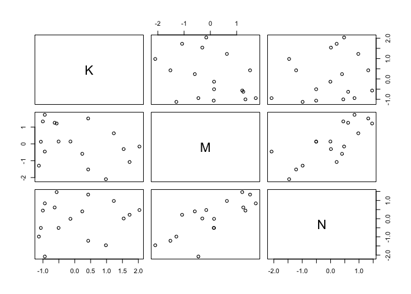

# R code 5.1

```r
# load data and copy
library(rethinking)
data(WaffleDivorce)
d <- WaffleDivorce
# standardize variables
d$A <- scale( d$MedianAgeMarriage )
d$D <- scale( d$Divorce )
```

# R code 5.2

```r
 sd( d$MedianAgeMarriage )
```

```
## [1] 1.24363
```

# R code 5.3

```r
m5.1 <- quap(
    alist(
        D ~ dnorm( mu , sigma ) ,
        mu <- a + bA * A ,
        a ~ dnorm( 0 , 0.2 ) ,
        bA ~ dnorm( 0 , 0.5 ) ,
        sigma ~ dexp( 1 )
) , data = d )
```

# R code 5.4

```r
set.seed(10)
prior <- extract.prior( m5.1 )
mu <- link( m5.1 , post=prior , data=list( A=c(-2,2) ) )
plot( NULL , xlim=c(-2,2) , ylim=c(-2,2) )
for ( i in 1:50 ) lines( c(-2,2) , mu[i,] , col=col.alpha("black",0.4) )
```

<!-- -->

# R code 5.5

```r
# compute percentile interval of mean
A_seq <- seq( from=-3 , to=3.2 , length.out=30 )
mu <- link( m5.1 , data=list(A=A_seq) )
mu.mean <- apply( mu , 2, mean )
mu.PI <- apply( mu , 2 , PI )
# plot it all
plot( D ~ A , data=d , col=rangi2 )
lines( A_seq , mu.mean , lwd=2 )
shade( mu.PI , A_seq )
```

<!-- -->

# R code 5.6

```r
d$M <- scale( d$Marriage )
m5.2 <- quap(
    alist(
        D ~ dnorm( mu , sigma ) ,
        mu <- a + bM * M ,
        a ~ dnorm( 0 , 0.2 ) ,
        bM ~ dnorm( 0 , 0.5 ) ,
        sigma ~ dexp( 1 )
) , data = d )
```

5.1.1. Think before you regress. 
*DAG: Directed acyclic graph*
# R code 5.7

```r
install.packages('dagitty')
```

```
## Error in contrib.url(repos, "source"): trying to use CRAN without setting a mirror
```

```r
library(dagitty)
dag5.1 <- dagitty( "dag {
    A -> D
    A -> M
    M -> D
}")
coordinates(dag5.1) <- list( x=c(A=0,D=1,M=2) , y=c(A=0,D=1,M=0) )
plot( dag5.1 )
```

<!-- -->

5.1.2. Multiple regression notation. 
5.1.3. Approximating the posterior.
# R code 5.8

```r
m5.3 <- quap(
    alist(
        D ~ dnorm( mu , sigma ) ,
        mu <- a + bM*M + bA*A ,
        a ~ dnorm( 0 , 0.2 ) ,
        bM ~ dnorm( 0 , 0.5 ) ,
        bA ~ dnorm( 0 , 0.5 ) ,
        sigma ~ dexp( 1 )
    ) , data = d )
precis( m5.3 )
```

```
##                mean         sd       5.5%      94.5%
## a     -2.828642e-05 0.09707123 -0.1551669  0.1551103
## bM    -6.553086e-02 0.15076312 -0.3064794  0.1754177
## bA    -6.136370e-01 0.15097351 -0.8549218 -0.3723521
## sigma  7.850672e-01 0.07783076  0.6606786  0.9094558
```
# R code 5.9

```r
plot( coeftab(m5.1,m5.2,m5.3), par=c("bA","bM") )
```

<!-- -->
# R code 5.10

```r
N <- 50 # number of simulated States 
age <- rnorm( N ) # sim A 
mar<-rnorm(N,age) #simA->M 
div<-rnorm(N,age) #simA->D
```
# 5.1.4. Plotting multi variate posteriors. 
# 5.1.4.1. Predictor residual plots.
# R code 5.11

```r
m5.4 <- quap(
    alist(
        M ~ dnorm( mu , sigma ) ,
        mu <- a + bAM * A ,
        a ~ dnorm( 0 , 0.2 ) ,
        bAM ~ dnorm( 0 , 0.5 ) ,
        sigma ~ dexp( 1 )
) , data = d )
```
# R code 5.12

```r
mu <- link(m5.4)
mu_mean <- apply( mu , 2 , mean )
mu_resid <- d$M - mu_mean
```
5.1.4.2. Counterfactual plots.
# R code 5.13

```r
# prepare new counterfactual data
M_seq <- seq( from=-2 , to=3 , length.out=30 )
pred_data <- data.frame( M = M_seq , A = 0 )
# compute counterfactual mean divorce (mu)
mu <- link( m5.3 , data=pred_data )
mu_mean <- apply( mu , 2 , mean )
mu_PI <- apply( mu , 2 , PI )
# simulate counterfactual divorce outcomes
D_sim <- sim( m5.3 , data=pred_data , n=1e4 )
D_PI <- apply( D_sim , 2 , PI )
# display predictions, hiding raw data with type="n"
plot( D ~ M , data=d , type="n" )
mtext( "Median age marriage (std) = 0" )
lines( M_seq , mu_mean )
shade( mu_PI , M_seq )
shade( D_PI , M_seq )
```

<!-- -->

5.1.4.3. Posterior prediction plots.
# R code 5.14

```r
# call link without specifying new data
# so it uses original data
mu <- link( m5.3 )
# summarize samples across cases
mu_mean <- apply( mu , 2 , mean )
mu_PI <- apply( mu , 2 , PI )
# simulate observations
# again no new data, so uses original data
D_sim <- sim( m5.3 , n=1e4 )
D_PI <- apply( D_sim , 2 , PI )
```
# R code 5.15

```r
plot( mu_mean ~ d$D , col=rangi2 , ylim=range(mu_PI) ,
    xlab="Observed divorce" , ylab="Predicted divorce" )
abline( a=0 , b=1 , lty=2 )
for ( i in 1:nrow(d) ) lines( rep(d$D[i],2) , mu_PI[,i] , col=rangi2 )
```

<!-- -->

# R code 5.16 (for interactive labeling of the plot!)

```r
 identify( x=d$D , y=mu_mean , labels=d$Loc )
```

```
## Error in identify.default(x = d$D, y = mu_mean, labels = d$Loc): plot.new has not been called yet
```

Overthinking: Simulating spurious association.
# R code 5.17

```r
N <- 100                         # Number of cases
x_real <- rnorm( N )             # x_real as Gaussian with mean 0 and stddev 1
x_spur <- rnorm( N , x_real )    # x_spur as Gaussian with mean=x_real
y <- rnorm( N , x_real )         # y as Gaussian with mean=x_real
d <- data.frame(y,x_real,x_spur) # bind all together in data frame
```

5.2. Masked relationship
Larger brain vs energetic milk
# R code 5.18

```r
library(rethinking)
data(milk)
d <- milk
str(d)
```

```
## 'data.frame':	29 obs. of  8 variables:
##  $ clade         : Factor w/ 4 levels "Ape","New World Monkey",..: 4 4 4 4 4 2 2 2 2 2 ...
##  $ species       : Factor w/ 29 levels "A palliata","Alouatta seniculus",..: 11 8 9 10 16 2 1 6 28 27 ...
##  $ kcal.per.g    : num  0.49 0.51 0.46 0.48 0.6 0.47 0.56 0.89 0.91 0.92 ...
##  $ perc.fat      : num  16.6 19.3 14.1 14.9 27.3 ...
##  $ perc.protein  : num  15.4 16.9 16.9 13.2 19.5 ...
##  $ perc.lactose  : num  68 63.8 69 71.9 53.2 ...
##  $ mass          : num  1.95 2.09 2.51 1.62 2.19 5.25 5.37 2.51 0.71 0.68 ...
##  $ neocortex.perc: num  55.2 NA NA NA NA ...
```

```r
# kcal.per.g : Kilocalories of energy per gram of milk.
# mass : Average female body mass, in kilograms.
# neocortex.perc : The percent of total brain mass that is neocortex mass.
```
# R code 5.19

```r
d$K <- scale( d$kcal.per.g )
d$N <- scale( d$neocortex.perc )
d$M <- scale( log(d$mass) )
```
# R code 5.20

```r
m5.5_draft <- quap(
    alist(
        K ~ dnorm( mu , sigma ) ,
        mu <- a + bN*N ,
        a ~ dnorm( 0 , 1 ) ,
        bN ~ dnorm( 0 , 1 ) ,
        sigma ~ dexp( 1 )
) , data=d )
```

```
## Error in quap(alist(K ~ dnorm(mu, sigma), mu <- a + bN * N, a ~ dnorm(0, : initial value in 'vmmin' is not finite
## The start values for the parameters were invalid. This could be caused by missing values (NA) in the data or by start values outside the parameter constraints. If there are no NA values in the data, try using explicit start values.
```
* What has gone wrong here? This particular error message means that the model didn’t return a valid probability for even the starting parameter values. In this case, the culprit is the missing values in the N variable. Take a look inside the original variable and see for yourself:
# R code 5.21

```r
d$neocortex.perc
```

```
##  [1] 55.16    NA    NA    NA    NA 64.54 64.54 67.64    NA 68.85 58.85
## [12] 61.69 60.32    NA    NA 69.97    NA 70.41    NA 73.40    NA 67.53
## [23]    NA 71.26 72.60    NA 70.24 76.30 75.49
```
Each NA in the output is a missing value. If you pass a vector like this to a likelihood func- tion like dnorm, it doesn’t know what to do. After all, what’s the probability of a missing value? Whatever the answer, it isn’t a number, and so dnorm returns a NaN. Unable to even get started, quap (or rather optim, which does the real work) gives up and barks about some weird thing called vmmin not being finite. This kind of opaque error message is unfortunately the norm in R. The additional part of the message suggesting NA values might be responsible is just quap taking a guess.
This is easy to fix. What you need to do here is manually drop all the cases with missing values. More automated black-box commands, like lm and glm, will drop such cases for you. But this isn’t always a good thing, if you aren’t aware of it. In a later chapter (Chapter ??), you’ll see one reason why. Please indulge me for now. It’s worth learning how to do this yourself. To make a new data frame with only complete cases in it, just use:
# R code 5.22

```r
 dcc <- d[ complete.cases(d$K,d$N,d$M) , ]
```
This makes a new data frame, dcc, that consists of the 17 rows from d that have values in all columns. Now let’s work with the new data frame. All that is new in the code is using dcc instead of d:
# R code 5.23

```r
m5.5_draft <- quap(
    alist(
        K ~ dnorm( mu , sigma ) ,
        mu <- a + bN*N ,
        a ~ dnorm( 0 , 1 ) ,
        bN ~ dnorm( 0 , 1 ) ,
        sigma ~ dexp( 1 )
) , data=dcc )
```
let’s consider those priors
# R code 5.24

```r
prior <- extract.prior( m5.5_draft )
xseq <- c(-2,2)
mu <- link( m5.5_draft , post=prior , data=list(N=xseq) )
plot( NULL , xlim=xseq , ylim=xseq )
for ( i in 1:50 ) lines( xseq , mu[i,] , col=col.alpha("black",0.3) )
```

<!-- -->
As in previous examples, we can do better by both tightening the α prior so that it sticks closer to zero. With two standardized variables, when predictor is zero, the expected value of the outcome should also be zero. And the slope βN needs to be a bit tighter as well, so that it doesn’t regularly produce impossibly strong relationships. Here’s an attempt:
# R code 5.25

```r
m5.5 <- quap(
    alist(
        K ~ dnorm( mu , sigma ) ,
        mu <- a + bN*N ,
        a ~ dnorm( 0 , 0.2 ) ,
        bN ~ dnorm( 0 , 0.5 ) ,
        sigma ~ dexp( 1 )
) , data=dcc )
```
Look at the posterior:
# R code 5.26

```r
 precis( m5.5 )
```

```
##             mean        sd       5.5%     94.5%
## a     0.03994001 0.1544908 -0.2069662 0.2868462
## bN    0.13323526 0.2237470 -0.2243557 0.4908262
## sigma 0.99982113 0.1647084  0.7365853 1.2630569
```

```r
?precis # Displays concise parameter estimate information for an existing model fit. (see R code 4.10, R code 4.29)
```
# R code 5.27

```r
xseq <- seq( from=min(dcc$N)-0.15 , to=max(dcc$N)+0.15 , length.out=30 )
mu <- link( m5.5 , data=list(N=xseq) ) # look "link()"
mu_mean <- apply(mu,2,mean)
mu_PI <- apply(mu,2,PI)
plot( K ~ N , data=dcc )
lines( xseq , mu_mean , lwd=2 )
shade( mu_PI , xseq )
```

<!-- -->
Now consider another predictor variable, adult female body mass
# R code 5.28

```r
m5.6 <- quap(
    alist(
        K ~ dnorm( mu , sigma ) ,
        mu <- a + bM*M ,
        a ~ dnorm( 0 , 0.2 ) ,
        bM ~ dnorm( 0 , 0.5 ) ,
        sigma ~ dexp( 1 )
    ) , data=dcc )
precis(m5.6)
```

```
##              mean        sd       5.5%      94.5%
## a      0.04654235 0.1512800 -0.1952323 0.28831698
## bM    -0.28253596 0.1928817 -0.5907981 0.02572623
## sigma  0.94927882 0.1570613  0.6982645 1.20029311
```
both predictor variables at the same time
# R code 5.29

```r
m5.7 <- quap(
    alist(
        K ~ dnorm( mu , sigma ) ,
        mu <- a + bN*N + bM*M ,
        a ~ dnorm( 0 , 0.2 ) ,
        bN ~ dnorm( 0 , 0.5 ) ,
        bM ~ dnorm( 0 , 0.5 ) ,
        sigma ~ dexp( 1 )
    ) , data=dcc )
precis(m5.7)
```

```
##              mean        sd       5.5%      94.5%
## a      0.06799175 0.1339990 -0.1461646  0.2821481
## bN     0.67511107 0.2483000  0.2782798  1.0719424
## bM    -0.70298652 0.2207881 -1.0558485 -0.3501245
## sigma  0.73801762 0.1324633  0.5263157  0.9497195
```

Visually comparing this posterior to those of the previous two models helps:
# R code 5.30

```r
plot( coeftab( m5.5 , m5.6 , m5.7 ) , pars=c("bM","bN") )
```

<!-- -->

```r
pairs(~K+M+N,dcc)
```

<!-- -->
counterfactual plots
# R code 5.31

```r
xseq <- seq( from=min(dcc$M)-0.15 , to=max(dcc$M)+0.15 , length.out=30 )
mu <- link( m5.7 , data=data.frame( M=xseq , N=0 ) )
mu_mean <- apply(mu,2,mean)
mu_PI <- apply(mu,2,PI)
plot( NULL , xlim=range(dcc$M) , ylim=range(dcc$K) )
lines( xseq , mu_mean , lwd=2 )
shade( mu_PI , xseq )
```

<!-- -->
Overthinking: Simulating a masking relationship.
# R code 5.32
Just as with understanding spurious association (page 140), it may help to simulate data in which two meaningful predictors act to mask one another. In the previous section, I showed three DAGs consistent with this. To simulate data consistent with the first DAG:

```r
# M -> K <- N
# M -> N
n <- 100
M <- rnorm( n )
N <- rnorm( n , M )
K <- rnorm( n , N - M )
d_sim <- data.frame(K=K,N=N,M=M)
```
You can quickly see the masking pattern of inferences by replacing dcc with d_sim in models m5.5, m5.6, and m5.7. Look at the precis summaries and you’ll see the same masking pattern where the slopes become more extreme in m5.7. 
# KN's code 5.32plus1

```r
m5.5.d_sim <- quap(
    alist(
        K ~ dnorm( mu , sigma ) ,
        mu <- a + bN*N ,
        a ~ dnorm( 0 , 0.2 ) ,
        bN ~ dnorm( 0 , 0.5 ) ,
        sigma ~ dexp( 1 )
) , data=d_sim )
precis(m5.5.d_sim)
```

```
##              mean         sd       5.5%     94.5%
## a     -0.07172734 0.10745784 -0.2434657 0.1000110
## bN     0.29783743 0.07950338  0.1707757 0.4248992
## sigma  1.27322411 0.08922376  1.1306273 1.4158209
```

```r
# compare m5.5 and m5.5.s_sim
plot( coeftab( m5.5 , m5.5.d_sim ) , pars="bN" )
```

<!-- -->


The other two DAGs can be simulated like this:
# R code 5.33

```r
# M -> K <- N
# N -> M
n <- 100
N <- rnorm( n )
M <- rnorm( n , N )
K <- rnorm( n , N - M )
d_sim2 <- data.frame(K=K,N=N,M=M)
# M -> K <- N
# M <- U -> N
n <- 100
U <- rnorm( n )
N <- rnorm( n , U )
M <- rnorm( n , U )
K <- rnorm( n , N - M )
d_sim3 <- data.frame(K=K,N=N,M=M)
```

5.3. Categoricalvariables
5.3.1. Binary categories.
# R code 5.34

```r
data(Howell1)
d <- Howell1
str(d)
```

```
## 'data.frame':	544 obs. of  4 variables:
##  $ height: num  152 140 137 157 145 ...
##  $ weight: num  47.8 36.5 31.9 53 41.3 ...
##  $ age   : num  63 63 65 41 51 35 32 27 19 54 ...
##  $ male  : int  1 0 0 1 0 1 0 1 0 1 ...
```

# R code 5.35: dummy variable

```r
mu_female <- rnorm(1e4,178,20)
mu_male <- rnorm(1e4,178,20) + rnorm(1e4,0,10)
precis( data.frame( mu_female , mu_male ) )
```

```
##               mean       sd     5.5%    94.5%  histogram
## mu_female 177.8130 20.09854 146.0157 210.3668   ▁▁▃▇▇▂▁▁
## mu_male   177.6865 22.48925 141.6933 213.6470 ▁▁▁▃▇▇▂▁▁▁
```
# R code 5.36: index variable

```r
d$sex <- ifelse( d$male==1 , 2 , 1 )
str( d$sex )
```

```
##  num [1:544] 2 1 1 2 1 2 1 2 1 2 ...
```
# R code 5.37

```r
m5.8 <- quap(
    alist(
        height ~ dnorm( mu , sigma ) ,
        mu <- a[sex] ,
        a[sex] ~ dnorm( 178 , 20 ) ,
        sigma ~ dunif( 0 , 50 )
    ) , data=d )
precis( m5.8 , depth=2 )
```

```
##            mean        sd      5.5%     94.5%
## a[1]  134.91022 1.6069225 132.34204 137.47839
## a[2]  142.57734 1.6974610 139.86447 145.29022
## sigma  27.30978 0.8280283  25.98643  28.63313
```
# R code 5.38

```r
post <- extract.samples(m5.8)
post$diff_fm <- post$a[,1] - post$a[,2]
precis( post , depth=2 )
```

```
##               mean        sd      5.5%      94.5%      histogram
## sigma    27.319758 0.8193756  25.99516  28.630274 ▁▁▁▁▃▇▇▇▃▂▁▁▁▁
## a[1]    134.889760 1.6026812 132.32077 137.431677       ▁▁▁▃▇▃▁▁
## a[2]    142.539797 1.6968849 139.85401 145.246788 ▁▁▁▂▃▇▇▇▃▂▁▁▁▁
## diff_fm  -7.650037 2.3441396 -11.41394  -3.887018     ▁▁▁▂▇▇▃▁▁▁
```
5.3.2. Many categories.
# R code 5.39

```r
data(milk)
d <- milk
unique(d$clade)
```

```
## [1] Strepsirrhine    New World Monkey Old World Monkey Ape             
## Levels: Ape New World Monkey Old World Monkey Strepsirrhine
```
# R code 5.40

```r
d$clade_id <- as.integer( d$clade )
```
# R code 5.41

```r
d$K <- scale( d$kcal.per.g )
m5.9 <- quap(
    alist(
        K ~ dnorm( mu , sigma ),
        mu <- a[clade_id],
        a[clade_id] ~ dnorm( 0 , 0.5 ),
        sigma ~ dexp( 1 )
    ) , data=d )
labels <- paste( "a[" , 1:4 , "]:" , levels(d$clade) , sep="" )
plot( precis( m5.9 , depth=2 , pars="a" ) , labels=labels ,
    xlab="expected kcal (std)" )
```

<!-- -->
# R code 5.42

```r
set.seed(63)
d$house <- sample( rep(1:4,each=8) , size=nrow(d) )
```
# R code 5.43

```r
m5.10 <- quap(
    alist(
        K ~ dnorm( mu , sigma ),
        mu <- a[clade_id] + h[house],
        a[clade_id] ~ dnorm( 0 , 0.5 ),
        h[house] ~ dnorm( 0 , 0.5 ),
        sigma ~ dexp( 1 )
) , data=d )
```

5.5 Practice 
5E1: (A) (2) and (4)

5E3: Write down a multiple regression to evaluate the claim: Neither amount of funding nor size of laboratory is by itself a good predictor of time to PhD degree; but together these variables are both positively associated with time to degree. Write down the model definition and indicate which side of zero each slope parameter should be on.

```r
F #  amoun of funding
```

```
## [1] FALSE
```

```r
S # size of lab
```

```
## Error in eval(expr, envir, enclos): object 'S' not found
```

```r
T # time to PhD degree
```

```
## [1] TRUE
```

```r
# single regression 1
Ti ~ a + bF*Fi
```

```
## Ti ~ a + bF * Fi
```

```r
# single regression 2
Ti ~ a + bS*Si
```

```
## Ti ~ a + bS * Si
```

```r
# double regression
Ti ~ a + bF*Fi + bS*Si
```

```
## Ti ~ a + bF * Fi + bS * Si
```

5M2. Invent your own example of a masked relationship. An outcome variable should be correlated with both predictor variables, but in opposite directions. And the two predictor variables should be correlated with one another.
# reading data

```r
#leafdata <- read_csv(file.path("..","..","..","..","Data7","Arabi_SAS_phenotyping","SAS_Pst-lux","input","Pst-lux_SAS.csv")) 
leafdata <- read_csv(file.path("","Volumes","data_work","Data7","Arabi_SAS_phenotyping","SAS_Pst-lux","input","Pst-lux_SAS.csv"),na="") # default na=c("","NA"), which treat "NA" as N/A. (042619)
```

```
## Parsed with column specification:
## cols(
##   file = col_character(),
##   Set = col_character(),
##   Treatment1 = col_character(),
##   Treatment2 = col_character(),
##   genotype = col_character(),
##   rep = col_double(),
##   leaf = col_double(),
##   petioleLength = col_double(),
##   bladeLength = col_double(),
##   bladeWidth = col_double(),
##   bladeArea = col_double(),
##   bladePerimeter = col_double(),
##   bladeCircularity = col_double()
## )
```

```r
str(leafdata)
```

```
## Classes 'spec_tbl_df', 'tbl_df', 'tbl' and 'data.frame':	470 obs. of  13 variables:
##  $ file            : chr  "exp1001.tif (blue)" "exp1001.tif (blue)" "exp1001.tif (blue)" "exp1001.tif (blue)" ...
##  $ Set             : chr  "A" "A" "A" "A" ...
##  $ Treatment1      : chr  "sun" "sun" "sun" "sun" ...
##  $ Treatment2      : chr  "mock" "mock" "mock" "mock" ...
##  $ genotype        : chr  "npr1" "npr1" "npr1" "npr1" ...
##  $ rep             : num  1 1 1 1 1 1 1 1 1 1 ...
##  $ leaf            : num  1 2 3 4 5 6 7 8 9 1 ...
##  $ petioleLength   : num  8.54 8.04 12.02 11.5 11.05 ...
##  $ bladeLength     : num  7.93 8.1 12.63 14.85 14.67 ...
##  $ bladeWidth      : num  7.13 6.42 8.72 10.14 9.68 ...
##  $ bladeArea       : num  44.4 40.9 86.5 118.3 111.5 ...
##  $ bladePerimeter  : num  32.3 36.4 45 51.3 50.9 ...
##  $ bladeCircularity: num  0.536 0.387 0.538 0.565 0.541 0.562 0.534 0.512 0.439 0.551 ...
##  - attr(*, "spec")=
##   .. cols(
##   ..   file = col_character(),
##   ..   Set = col_character(),
##   ..   Treatment1 = col_character(),
##   ..   Treatment2 = col_character(),
##   ..   genotype = col_character(),
##   ..   rep = col_double(),
##   ..   leaf = col_double(),
##   ..   petioleLength = col_double(),
##   ..   bladeLength = col_double(),
##   ..   bladeWidth = col_double(),
##   ..   bladeArea = col_double(),
##   ..   bladePerimeter = col_double(),
##   ..   bladeCircularity = col_double()
##   .. )
```

```r
# change character into factor if any
leafdata <- leafdata %>% modify_if(is.character,as.factor)
# rename
leafdata <- leafdata %>% rename(plant=genotype)
# calculate petiole length / blade length ratio (102516)
library(stringr)
leafdata<-leafdata %>% mutate(petiole_bladeLength=petioleLength/bladeLength,rep2=str_c(Set, rep,sep="_"))

#Filter outliers
# leafdata<-leafdata[leafdata$petioleLength<300,]
apply(leafdata, 2, max)
```

```
##                 file                  Set           Treatment1 
## "exp1014.tif (blue)"                  "A"                "sun" 
##           Treatment2                plant                  rep 
##               "mock"           "xbat34-2"                  "6" 
##                 leaf        petioleLength          bladeLength 
##                 "12"             "27.077"             "27.381" 
##           bladeWidth            bladeArea       bladePerimeter 
##             "15.828"            "318.134"             "91.271" 
##     bladeCircularity  petiole_bladeLength                 rep2 
##              "0.891"        "1.567863347"                "A_6"
```

```r
apply(leafdata, 2, min)
```

```
##                 file                  Set           Treatment1 
## "exp1001.tif (blue)"                  "A"              "shade" 
##           Treatment2                plant                  rep 
##               "mock"                "Col"                  "1" 
##                 leaf        petioleLength          bladeLength 
##                 " 1"             " 0.102"             " 4.834" 
##           bladeWidth            bladeArea       bladePerimeter 
##             " 3.961"            " 17.846"             "19.304" 
##     bladeCircularity  petiole_bladeLength                 rep2 
##              "0.129"        "0.003929122"                "A_1"
```

```r
filter(leafdata, petiole_bladeLength > 4)
```

```
## # A tibble: 0 x 15
## # … with 15 variables: file <fct>, Set <fct>, Treatment1 <fct>,
## #   Treatment2 <fct>, plant <fct>, rep <dbl>, leaf <dbl>,
## #   petioleLength <dbl>, bladeLength <dbl>, bladeWidth <dbl>,
## #   bladeArea <dbl>, bladePerimeter <dbl>, bladeCircularity <dbl>,
## #   petiole_bladeLength <dbl>, rep2 <chr>
```

```r
min(leafdata[leafdata$leaf %in% c(4:7),]$petiole_bladeLength)
```

```
## [1] 0.2169395
```

```r
filter(leafdata, leafdata$petiole_bladeLength<0.08)
```

```
## # A tibble: 3 x 15
##   file  Set   Treatment1 Treatment2 plant   rep  leaf petioleLength
##   <fct> <fct> <fct>      <fct>      <fct> <dbl> <dbl>         <dbl>
## 1 exp1… A     sun        mock       npr1      1     9         0.419
## 2 exp1… A     sun        mock       Col       2    10         0.102
## 3 exp1… A     sun        mock       sid2      1    11         1.22 
## # … with 7 more variables: bladeLength <dbl>, bladeWidth <dbl>,
## #   bladeArea <dbl>, bladePerimeter <dbl>, bladeCircularity <dbl>,
## #   petiole_bladeLength <dbl>, rep2 <chr>
```

```r
class(leafdata$leaf)
```

```
## [1] "numeric"
```

```r
hist(leafdata$petioleLength, main="Petiole Length", xlab="Petiole Length")
```

<!-- -->

```r
# graph (frequency distribution of petiole_bladeLength with leaf position)
select(leafdata,petiole_bladeLength,rep2,leaf) %>% ggplot(aes(petiole_bladeLength,fill=leaf)) + geom_histogram(binwidth=0.1)
```

<!-- -->

# setA ()

```r
leafdata.setA<- leafdata %>% filter(Set=="A")
# which leaves?
leaf.start=4;leaf.end=10
leafdata.setA.part<-leafdata.setA %>% filter(leaf>=leaf.start&leaf<=leaf.end) 
table(leafdata.setA$Treatment1,leafdata.setA$Treatment2)
```

```
##        
##         mock
##   shade  253
##   sun    217
```

# PetioleLength (PL)

```r
# plot raw data
p.PL<-leafdata.setA.part %>% dplyr::select(petioleLength,leaf,plant,Treatment1,Treatment2) %>%
  ggplot(aes(x=fct_relevel(Treatment1,"sun","shade"),y=petioleLength,color=Treatment1)) + geom_jitter() + labs(x="")
p.PL <- p.PL + stat_summary(fun.y="mean",geom="bar",alpha=0.5)
p.PL <- p.PL + stat_summary(fun.data="calc.sem",geom="errorbar",position="dodge") 
p.PL <- p.PL + facet_grid(plant~leaf) + theme(strip.text.y=element_text(angle=0),legend.position = "none")
p.PL
```

```
## Warning: Computation failed in `stat_summary()`:
## object 'calc.sem' of mode 'function' was not found

## Warning: Computation failed in `stat_summary()`:
## object 'calc.sem' of mode 'function' was not found

## Warning: Computation failed in `stat_summary()`:
## object 'calc.sem' of mode 'function' was not found

## Warning: Computation failed in `stat_summary()`:
## object 'calc.sem' of mode 'function' was not found

## Warning: Computation failed in `stat_summary()`:
## object 'calc.sem' of mode 'function' was not found

## Warning: Computation failed in `stat_summary()`:
## object 'calc.sem' of mode 'function' was not found

## Warning: Computation failed in `stat_summary()`:
## object 'calc.sem' of mode 'function' was not found

## Warning: Computation failed in `stat_summary()`:
## object 'calc.sem' of mode 'function' was not found

## Warning: Computation failed in `stat_summary()`:
## object 'calc.sem' of mode 'function' was not found

## Warning: Computation failed in `stat_summary()`:
## object 'calc.sem' of mode 'function' was not found

## Warning: Computation failed in `stat_summary()`:
## object 'calc.sem' of mode 'function' was not found

## Warning: Computation failed in `stat_summary()`:
## object 'calc.sem' of mode 'function' was not found

## Warning: Computation failed in `stat_summary()`:
## object 'calc.sem' of mode 'function' was not found

## Warning: Computation failed in `stat_summary()`:
## object 'calc.sem' of mode 'function' was not found

## Warning: Computation failed in `stat_summary()`:
## object 'calc.sem' of mode 'function' was not found

## Warning: Computation failed in `stat_summary()`:
## object 'calc.sem' of mode 'function' was not found

## Warning: Computation failed in `stat_summary()`:
## object 'calc.sem' of mode 'function' was not found

## Warning: Computation failed in `stat_summary()`:
## object 'calc.sem' of mode 'function' was not found

## Warning: Computation failed in `stat_summary()`:
## object 'calc.sem' of mode 'function' was not found

## Warning: Computation failed in `stat_summary()`:
## object 'calc.sem' of mode 'function' was not found

## Warning: Computation failed in `stat_summary()`:
## object 'calc.sem' of mode 'function' was not found

## Warning: Computation failed in `stat_summary()`:
## object 'calc.sem' of mode 'function' was not found

## Warning: Computation failed in `stat_summary()`:
## object 'calc.sem' of mode 'function' was not found

## Warning: Computation failed in `stat_summary()`:
## object 'calc.sem' of mode 'function' was not found

## Warning: Computation failed in `stat_summary()`:
## object 'calc.sem' of mode 'function' was not found

## Warning: Computation failed in `stat_summary()`:
## object 'calc.sem' of mode 'function' was not found

## Warning: Computation failed in `stat_summary()`:
## object 'calc.sem' of mode 'function' was not found

## Warning: Computation failed in `stat_summary()`:
## object 'calc.sem' of mode 'function' was not found

## Warning: Computation failed in `stat_summary()`:
## object 'calc.sem' of mode 'function' was not found

## Warning: Computation failed in `stat_summary()`:
## object 'calc.sem' of mode 'function' was not found

## Warning: Computation failed in `stat_summary()`:
## object 'calc.sem' of mode 'function' was not found

## Warning: Computation failed in `stat_summary()`:
## object 'calc.sem' of mode 'function' was not found

## Warning: Computation failed in `stat_summary()`:
## object 'calc.sem' of mode 'function' was not found

## Warning: Computation failed in `stat_summary()`:
## object 'calc.sem' of mode 'function' was not found

## Warning: Computation failed in `stat_summary()`:
## object 'calc.sem' of mode 'function' was not found

## Warning: Computation failed in `stat_summary()`:
## object 'calc.sem' of mode 'function' was not found

## Warning: Computation failed in `stat_summary()`:
## object 'calc.sem' of mode 'function' was not found

## Warning: Computation failed in `stat_summary()`:
## object 'calc.sem' of mode 'function' was not found

## Warning: Computation failed in `stat_summary()`:
## object 'calc.sem' of mode 'function' was not found

## Warning: Computation failed in `stat_summary()`:
## object 'calc.sem' of mode 'function' was not found

## Warning: Computation failed in `stat_summary()`:
## object 'calc.sem' of mode 'function' was not found
```

<!-- -->

```r
#ggsave(filename="SAS_leaf_Pst-lux_mock_PL.pdf",p.PL,path=file.path("..","output"))
# which leaves?
leaf.start=4;leaf.end=10
leafdata.setA.part<-leafdata.setA %>% filter(leaf>=leaf.start&leaf<=leaf.end) 
```
# model for baysien analysis


5M3


5M4


5H1


5H2


