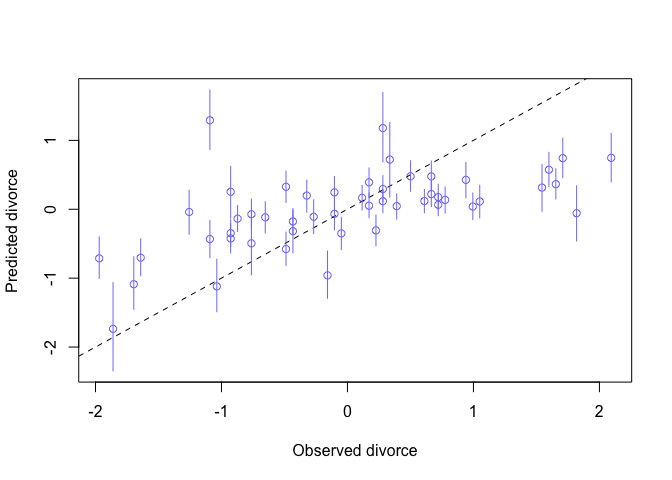
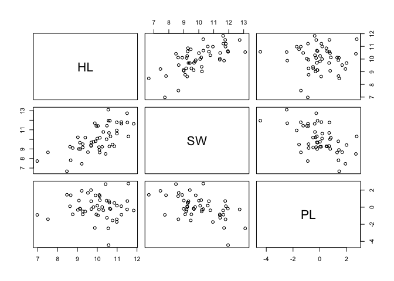

# R code 5.1

```r
# load data and copy
library(rethinking)
data(WaffleDivorce)
d <- WaffleDivorce
# standardize variables
d$A <- scale( d$MedianAgeMarriage )
d$D <- scale( d$Divorce )
```

# R code 5.2

```r
 sd( d$MedianAgeMarriage )
```

```
## [1] 1.24363
```

# R code 5.3

```r
m5.1 <- quap(
    alist(
        D ~ dnorm( mu , sigma ) ,
        mu <- a + bA * A ,
        a ~ dnorm( 0 , 0.2 ) ,
        bA ~ dnorm( 0 , 0.5 ) ,
        sigma ~ dexp( 1 )
) , data = d )
```

# R code 5.4

```r
set.seed(10)
prior <- extract.prior( m5.1 )
mu <- link( m5.1 , post=prior , data=list( A=c(-2,2) ) )
plot( NULL , xlim=c(-2,2) , ylim=c(-2,2) )
for ( i in 1:50 ) lines( c(-2,2) , mu[i,] , col=col.alpha("black",0.4) )
```

<!-- -->

# R code 5.5

```r
# compute percentile interval of mean
A_seq <- seq( from=-3 , to=3.2 , length.out=30 )
mu <- link( m5.1 , data=list(A=A_seq) )
mu.mean <- apply( mu , 2, mean )
mu.PI <- apply( mu , 2 , PI )
# plot it all
plot( D ~ A , data=d , col=rangi2 )
lines( A_seq , mu.mean , lwd=2 )
shade( mu.PI , A_seq )
```

<!-- -->

# R code 5.6

```r
d$M <- scale( d$Marriage )
m5.2 <- quap(
    alist(
        D ~ dnorm( mu , sigma ) ,
        mu <- a + bM * M ,
        a ~ dnorm( 0 , 0.2 ) ,
        bM ~ dnorm( 0 , 0.5 ) ,
        sigma ~ dexp( 1 )
) , data = d )
```

5.1.1. Think before you regress. 
*DAG: Directed acyclic graph*
# R code 5.7

```r
install.packages('dagitty')
```

```
## Error in contrib.url(repos, "source"): trying to use CRAN without setting a mirror
```

```r
library(dagitty)
dag5.1 <- dagitty( "dag {
    A -> D
    A -> M
    M -> D
}")
coordinates(dag5.1) <- list( x=c(A=0,D=1,M=2) , y=c(A=0,D=1,M=0) )
plot( dag5.1 )
```

<!-- -->

5.1.2. Multiple regression notation. 
5.1.3. Approximating the posterior.
# R code 5.8

```r
m5.3 <- quap(
    alist(
        D ~ dnorm( mu , sigma ) ,
        mu <- a + bM*M + bA*A ,
        a ~ dnorm( 0 , 0.2 ) ,
        bM ~ dnorm( 0 , 0.5 ) ,
        bA ~ dnorm( 0 , 0.5 ) ,
        sigma ~ dexp( 1 )
    ) , data = d )
precis( m5.3 )
```

```
##                mean         sd       5.5%      94.5%
## a     -2.828642e-05 0.09707123 -0.1551669  0.1551103
## bM    -6.553086e-02 0.15076312 -0.3064794  0.1754177
## bA    -6.136370e-01 0.15097351 -0.8549218 -0.3723521
## sigma  7.850672e-01 0.07783076  0.6606786  0.9094558
```
# R code 5.9

```r
plot( coeftab(m5.1,m5.2,m5.3), par=c("bA","bM") )
```

<!-- -->
# R code 5.10

```r
N <- 50 # number of simulated States 
age <- rnorm( N ) # sim A 
mar<-rnorm(N,age) #simA->M 
div<-rnorm(N,age) #simA->D
```
# 5.1.4. Plotting multi variate posteriors. 
# 5.1.4.1. Predictor residual plots.
# R code 5.11

```r
m5.4 <- quap(
    alist(
        M ~ dnorm( mu , sigma ) ,
        mu <- a + bAM * A ,
        a ~ dnorm( 0 , 0.2 ) ,
        bAM ~ dnorm( 0 , 0.5 ) ,
        sigma ~ dexp( 1 )
) , data = d )
```
# R code 5.12

```r
mu <- link(m5.4)
mu_mean <- apply( mu , 2 , mean )
mu_resid <- d$M - mu_mean
```
5.1.4.2. Counterfactual plots.
# R code 5.13

```r
# prepare new counterfactual data
M_seq <- seq( from=-2 , to=3 , length.out=30 )
pred_data <- data.frame( M = M_seq , A = 0 )
# compute counterfactual mean divorce (mu)
mu <- link( m5.3 , data=pred_data )
mu_mean <- apply( mu , 2 , mean )
mu_PI <- apply( mu , 2 , PI )
# simulate counterfactual divorce outcomes
D_sim <- sim( m5.3 , data=pred_data , n=1e4 )
D_PI <- apply( D_sim , 2 , PI )
# display predictions, hiding raw data with type="n"
plot( D ~ M , data=d , type="n" )
mtext( "Median age marriage (std) = 0" )
lines( M_seq , mu_mean )
shade( mu_PI , M_seq )
shade( D_PI , M_seq )
```

<!-- -->

5.1.4.3. Posterior prediction plots.
# R code 5.14

```r
# call link without specifying new data
# so it uses original data
mu <- link( m5.3 )
# summarize samples across cases
mu_mean <- apply( mu , 2 , mean )
mu_PI <- apply( mu , 2 , PI )
# simulate observations
# again no new data, so uses original data
D_sim <- sim( m5.3 , n=1e4 )
D_PI <- apply( D_sim , 2 , PI )
```
# R code 5.15

```r
plot( mu_mean ~ d$D , col=rangi2 , ylim=range(mu_PI) ,
    xlab="Observed divorce" , ylab="Predicted divorce" )
abline( a=0 , b=1 , lty=2 )
for ( i in 1:nrow(d) ) lines( rep(d$D[i],2) , mu_PI[,i] , col=rangi2 )
```

<!-- -->

# R code 5.16 (for interactive labeling of the plot!)

```r
 identify( x=d$D , y=mu_mean , labels=d$Loc )
```

```
## Error in identify.default(x = d$D, y = mu_mean, labels = d$Loc): plot.new has not been called yet
```

Overthinking: Simulating spurious association.
# R code 5.17

```r
N <- 100                         # Number of cases
x_real <- rnorm( N )             # x_real as Gaussian with mean 0 and stddev 1
x_spur <- rnorm( N , x_real )    # x_spur as Gaussian with mean=x_real
y <- rnorm( N , x_real )         # y as Gaussian with mean=x_real
d <- data.frame(y,x_real,x_spur) # bind all together in data frame
pairs(d) # correlation (my own)
```

<!-- -->

5.2. Masked relationship
Larger brain vs energetic milk
# R code 5.18

```r
library(rethinking)
data(milk)
d <- milk
str(d)
```

```
## 'data.frame':	29 obs. of  8 variables:
##  $ clade         : Factor w/ 4 levels "Ape","New World Monkey",..: 4 4 4 4 4 2 2 2 2 2 ...
##  $ species       : Factor w/ 29 levels "A palliata","Alouatta seniculus",..: 11 8 9 10 16 2 1 6 28 27 ...
##  $ kcal.per.g    : num  0.49 0.51 0.46 0.48 0.6 0.47 0.56 0.89 0.91 0.92 ...
##  $ perc.fat      : num  16.6 19.3 14.1 14.9 27.3 ...
##  $ perc.protein  : num  15.4 16.9 16.9 13.2 19.5 ...
##  $ perc.lactose  : num  68 63.8 69 71.9 53.2 ...
##  $ mass          : num  1.95 2.09 2.51 1.62 2.19 5.25 5.37 2.51 0.71 0.68 ...
##  $ neocortex.perc: num  55.2 NA NA NA NA ...
```

```r
# kcal.per.g : Kilocalories of energy per gram of milk.
# mass : Average female body mass, in kilograms.
# neocortex.perc : The percent of total brain mass that is neocortex mass.
```
# R code 5.19

```r
d$K <- scale( d$kcal.per.g )
d$N <- scale( d$neocortex.perc )
d$M <- scale( log(d$mass) )
```
# R code 5.20

```r
m5.5_draft <- quap(
    alist(
        K ~ dnorm( mu , sigma ) ,
        mu <- a + bN*N ,
        a ~ dnorm( 0 , 1 ) ,
        bN ~ dnorm( 0 , 1 ) ,
        sigma ~ dexp( 1 )
) , data=d )
```

```
## Error in quap(alist(K ~ dnorm(mu, sigma), mu <- a + bN * N, a ~ dnorm(0, : initial value in 'vmmin' is not finite
## The start values for the parameters were invalid. This could be caused by missing values (NA) in the data or by start values outside the parameter constraints. If there are no NA values in the data, try using explicit start values.
```
* What has gone wrong here? This particular error message means that the model didn’t return a valid probability for even the starting parameter values. In this case, the culprit is the missing values in the N variable. Take a look inside the original variable and see for yourself:
# R code 5.21

```r
d$neocortex.perc
```

```
##  [1] 55.16    NA    NA    NA    NA 64.54 64.54 67.64    NA 68.85 58.85
## [12] 61.69 60.32    NA    NA 69.97    NA 70.41    NA 73.40    NA 67.53
## [23]    NA 71.26 72.60    NA 70.24 76.30 75.49
```
Each NA in the output is a missing value. If you pass a vector like this to a likelihood func- tion like dnorm, it doesn’t know what to do. After all, what’s the probability of a missing value? Whatever the answer, it isn’t a number, and so dnorm returns a NaN. Unable to even get started, quap (or rather optim, which does the real work) gives up and barks about some weird thing called vmmin not being finite. This kind of opaque error message is unfortunately the norm in R. The additional part of the message suggesting NA values might be responsible is just quap taking a guess.
This is easy to fix. What you need to do here is manually drop all the cases with missing values. More automated black-box commands, like lm and glm, will drop such cases for you. But this isn’t always a good thing, if you aren’t aware of it. In a later chapter (Chapter ??), you’ll see one reason why. Please indulge me for now. It’s worth learning how to do this yourself. To make a new data frame with only complete cases in it, just use:
# R code 5.22

```r
 dcc <- d[ complete.cases(d$K,d$N,d$M) , ]
```
This makes a new data frame, dcc, that consists of the 17 rows from d that have values in all columns. Now let’s work with the new data frame. All that is new in the code is using dcc instead of d:
# R code 5.23

```r
m5.5_draft <- quap(
    alist(
        K ~ dnorm( mu , sigma ) ,
        mu <- a + bN*N ,
        a ~ dnorm( 0 , 1 ) ,
        bN ~ dnorm( 0 , 1 ) ,
        sigma ~ dexp( 1 )
) , data=dcc )
```
let’s consider those priors
# R code 5.24

```r
prior <- extract.prior( m5.5_draft )
xseq <- c(-2,2)
mu <- link( m5.5_draft , post=prior , data=list(N=xseq) )
plot( NULL , xlim=xseq , ylim=xseq )
for ( i in 1:50 ) lines( xseq , mu[i,] , col=col.alpha("black",0.3) )
```

<!-- -->
As in previous examples, we can do better by both tightening the α prior so that it sticks closer to zero. With two standardized variables, when predictor is zero, the expected value of the outcome should also be zero. And the slope βN needs to be a bit tighter as well, so that it doesn’t regularly produce impossibly strong relationships. Here’s an attempt:
# R code 5.25

```r
m5.5 <- quap(
    alist(
        K ~ dnorm( mu , sigma ) ,
        mu <- a + bN*N ,
        a ~ dnorm( 0 , 0.2 ) ,
        bN ~ dnorm( 0 , 0.5 ) ,
        sigma ~ dexp( 1 )
) , data=dcc )
```
Look at the posterior:
# R code 5.26

```r
 precis( m5.5 )
```

```
##             mean        sd       5.5%     94.5%
## a     0.03994001 0.1544908 -0.2069662 0.2868462
## bN    0.13323526 0.2237470 -0.2243557 0.4908262
## sigma 0.99982113 0.1647084  0.7365853 1.2630569
```

```r
?precis # Displays concise parameter estimate information for an existing model fit. (see R code 4.10, R code 4.29)
```
# R code 5.27

```r
xseq <- seq( from=min(dcc$N)-0.15 , to=max(dcc$N)+0.15 , length.out=30 )
mu <- link( m5.5 , data=list(N=xseq) ) # look "link()"
mu_mean <- apply(mu,2,mean)
mu_PI <- apply(mu,2,PI)
plot( K ~ N , data=dcc )
lines( xseq , mu_mean , lwd=2 )
shade( mu_PI , xseq )
```

<!-- -->
Now consider another predictor variable, adult female body mass
# R code 5.28

```r
m5.6 <- quap(
    alist(
        K ~ dnorm( mu , sigma ) ,
        mu <- a + bM*M ,
        a ~ dnorm( 0 , 0.2 ) ,
        bM ~ dnorm( 0 , 0.5 ) ,
        sigma ~ dexp( 1 )
    ) , data=dcc )
precis(m5.6)
```

```
##              mean        sd       5.5%      94.5%
## a      0.04654235 0.1512800 -0.1952323 0.28831698
## bM    -0.28253596 0.1928817 -0.5907981 0.02572623
## sigma  0.94927882 0.1570613  0.6982645 1.20029311
```
both predictor variables at the same time
# R code 5.29

```r
m5.7 <- quap(
    alist(
        K ~ dnorm( mu , sigma ) ,
        mu <- a + bN*N + bM*M ,
        a ~ dnorm( 0 , 0.2 ) ,
        bN ~ dnorm( 0 , 0.5 ) ,
        bM ~ dnorm( 0 , 0.5 ) ,
        sigma ~ dexp( 1 )
    ) , data=dcc )
precis(m5.7)
```

```
##              mean        sd       5.5%      94.5%
## a      0.06799175 0.1339990 -0.1461646  0.2821481
## bN     0.67511107 0.2483000  0.2782798  1.0719424
## bM    -0.70298652 0.2207881 -1.0558485 -0.3501245
## sigma  0.73801762 0.1324633  0.5263157  0.9497195
```

Visually comparing this posterior to those of the previous two models helps:
# R code 5.30

```r
plot( coeftab( m5.5 , m5.6 , m5.7 ) , pars=c("bM","bN") )
```

<!-- -->

```r
pairs(~K+M+N,dcc)
```

<!-- -->
counterfactual plots
# R code 5.31

```r
xseq <- seq( from=min(dcc$M)-0.15 , to=max(dcc$M)+0.15 , length.out=30 )
mu <- link( m5.7 , data=data.frame( M=xseq , N=0 ) )
mu_mean <- apply(mu,2,mean)
mu_PI <- apply(mu,2,PI)
plot( NULL , xlim=range(dcc$M) , ylim=range(dcc$K) )
lines( xseq , mu_mean , lwd=2 )
shade( mu_PI , xseq )
```

<!-- -->
Overthinking: Simulating a masking relationship.
# R code 5.32
Just as with understanding spurious association (page 140), it may help to simulate data in which two meaningful predictors act to mask one another. In the previous section, I showed three DAGs consistent with this. To simulate data consistent with the first DAG:

```r
# M -> K <- N
# M -> N
n <- 100
M <- rnorm( n )
N <- rnorm( n , M )
K <- rnorm( n , N - M )
d_sim <- data.frame(K=K,N=N,M=M)
```
You can quickly see the masking pattern of inferences by replacing dcc with d_sim in models m5.5, m5.6, and m5.7. Look at the precis summaries and you’ll see the same masking pattern where the slopes become more extreme in m5.7. 
# KN's code 5.32plus1

```r
m5.5.d_sim <- quap(
    alist(
        K ~ dnorm( mu , sigma ) ,
        mu <- a + bN*N ,
        a ~ dnorm( 0 , 0.2 ) ,
        bN ~ dnorm( 0 , 0.5 ) ,
        sigma ~ dexp( 1 )
) , data=d_sim )
precis(m5.5.d_sim)
```

```
##              mean         sd       5.5%     94.5%
## a     -0.07172734 0.10745784 -0.2434657 0.1000110
## bN     0.29783743 0.07950338  0.1707757 0.4248992
## sigma  1.27322411 0.08922376  1.1306273 1.4158209
```

```r
# compare m5.5 and m5.5.s_sim
plot( coeftab( m5.5 , m5.5.d_sim ) , pars="bN" )
```

<!-- -->


The other two DAGs can be simulated like this:
# R code 5.33

```r
# M -> K <- N
# N -> M
n <- 100
N <- rnorm( n )
M <- rnorm( n , N )
K <- rnorm( n , N - M )
d_sim2 <- data.frame(K=K,N=N,M=M)
# M -> K <- N
# M <- U -> N
n <- 100
U <- rnorm( n )
N <- rnorm( n , U )
M <- rnorm( n , U )
K <- rnorm( n , N - M )
d_sim3 <- data.frame(K=K,N=N,M=M)
```

5.3. Categoricalvariables
5.3.1. Binary categories.
# R code 5.34

```r
data(Howell1)
d <- Howell1
str(d)
```

```
## 'data.frame':	544 obs. of  4 variables:
##  $ height: num  152 140 137 157 145 ...
##  $ weight: num  47.8 36.5 31.9 53 41.3 ...
##  $ age   : num  63 63 65 41 51 35 32 27 19 54 ...
##  $ male  : int  1 0 0 1 0 1 0 1 0 1 ...
```

# R code 5.35: dummy variable

```r
mu_female <- rnorm(1e4,178,20)
mu_male <- rnorm(1e4,178,20) + rnorm(1e4,0,10)
precis( data.frame( mu_female , mu_male ) )
```

```
##               mean       sd     5.5%    94.5%  histogram
## mu_female 177.8130 20.09854 146.0157 210.3668   ▁▁▃▇▇▂▁▁
## mu_male   177.6865 22.48925 141.6933 213.6470 ▁▁▁▃▇▇▂▁▁▁
```
# R code 5.36: index variable

```r
d$sex <- ifelse( d$male==1 , 2 , 1 )
str( d$sex )
```

```
##  num [1:544] 2 1 1 2 1 2 1 2 1 2 ...
```
# R code 5.37

```r
m5.8 <- quap(
    alist(
        height ~ dnorm( mu , sigma ) ,
        mu <- a[sex] ,
        a[sex] ~ dnorm( 178 , 20 ) ,
        sigma ~ dunif( 0 , 50 )
    ) , data=d )
precis( m5.8 , depth=2 )
```

```
##            mean        sd      5.5%     94.5%
## a[1]  134.91022 1.6069225 132.34204 137.47839
## a[2]  142.57734 1.6974610 139.86447 145.29022
## sigma  27.30978 0.8280283  25.98643  28.63313
```
# R code 5.38

```r
post <- extract.samples(m5.8)
post$diff_fm <- post$a[,1] - post$a[,2]
precis( post , depth=2 )
```

```
##               mean        sd      5.5%      94.5%      histogram
## sigma    27.319758 0.8193756  25.99516  28.630274 ▁▁▁▁▃▇▇▇▃▂▁▁▁▁
## a[1]    134.889760 1.6026812 132.32077 137.431677       ▁▁▁▃▇▃▁▁
## a[2]    142.539797 1.6968849 139.85401 145.246788 ▁▁▁▂▃▇▇▇▃▂▁▁▁▁
## diff_fm  -7.650037 2.3441396 -11.41394  -3.887018     ▁▁▁▂▇▇▃▁▁▁
```
5.3.2. Many categories.
# R code 5.39

```r
data(milk)
d <- milk
unique(d$clade)
```

```
## [1] Strepsirrhine    New World Monkey Old World Monkey Ape             
## Levels: Ape New World Monkey Old World Monkey Strepsirrhine
```
# R code 5.40

```r
d$clade_id <- as.integer( d$clade )
```
# R code 5.41

```r
d$K <- scale( d$kcal.per.g )
m5.9 <- quap(
    alist(
        K ~ dnorm( mu , sigma ),
        mu <- a[clade_id],
        a[clade_id] ~ dnorm( 0 , 0.5 ),
        sigma ~ dexp( 1 )
    ) , data=d )
labels <- paste( "a[" , 1:4 , "]:" , levels(d$clade) , sep="" )
plot( precis( m5.9 , depth=2 , pars="a" ) , labels=labels ,
    xlab="expected kcal (std)" )
```

<!-- -->
# R code 5.42

```r
set.seed(63)
d$house <- sample( rep(1:4,each=8) , size=nrow(d) )
```
# R code 5.43

```r
m5.10 <- quap(
    alist(
        K ~ dnorm( mu , sigma ),
        mu <- a[clade_id] + h[house],
        a[clade_id] ~ dnorm( 0 , 0.5 ),
        h[house] ~ dnorm( 0 , 0.5 ),
        sigma ~ dexp( 1 )
) , data=d )
```

5.5 Practice 
5E1: (A) (2) and (4)

5E3: Write down a multiple regression to evaluate the claim: Neither amount of funding nor size of laboratory is by itself a good predictor of time to PhD degree; but together these variables are both positively associated with time to degree. Write down the model definition and indicate which side of zero each slope parameter should be on.


5M1 (optional). Invent your own example of a spurious correlation. An outcome variable should be correlated with both predictor variables. But when both predictors are entered in the same model, the correlation between the outcome and one of the predictors should mostly vanish (or at least be greatly reduced).


5M2. Invent your own example of a masked relationship. An outcome variable should be correlated with both predictor variables, but in opposite directions. And the two predictor variables should be correlated with one another.

```r
# make simulated data (see R code 5.10)
N <- 50 # number of simulated States 
HL.sim <- rnorm(N,mean=10,sd=1 ) # HL, hypocotyl length (mm)
SW.sim <- rnorm(N,mean=HL.sim) # SW, seed weight (g). the two predictor variables should be correlated with one another
PL.sim<-rnorm(N,HL.sim-SW.sim)  #sim HL.sim -> PL.sim (positive), SW.sim -> PL.sim (negative)
d.sim<-data.frame(HL=HL.sim,SW=SW.sim,PL=PL.sim)
# look correlation
pairs(~HL+SW+PL,d.sim)
```

<!-- -->

```r
# model
model.Practice5m2 <- quap(
    alist(
        PL ~ dnorm( mu , sigma ) , # PL, petiole length (mm)
        mu <- a + b1*HL + b2*SW, # HL, hipocotyl length (mm); SW, seed weight (g)
        a ~ dnorm(10, 5) ,
        b1 ~ dlnorm( 0 , 1 ) ,
        b2 ~ dnorm( 0 , 10 ) ,
        sigma ~ dunif( 0 , 50 )
    ) ,
    data=d.sim )
precis( model.Practice5m2 )
```

```
##             mean         sd       5.5%      94.5%
## a      1.4816253 1.30094654 -0.5975385  3.5607892
## b1     0.7613184 0.17859097  0.4758956  1.0467413
## b2    -0.9107015 0.13026060 -1.1188831 -0.7025199
## sigma  0.9384512 0.09445993  0.7874860  1.0894165
```

```r
plot( coeftab(model.Practice5m2) )
```

<!-- -->

5M3 It is sometimes observed that the best predictor of fire risk is the presence of firefighters— States and localities with many firefighters also have more fires. Presumably firefighters do not cause fires. Nevertheless, this is not a spurious correlation. Instead fires cause firefighters. Consider the same reversal of causal inference in the context of the divorce and marriage data. How might a high divorce rate cause a higher marriage rate? Can you think of a way to evaluate this relationship, using multiple regression?

```r
# divorce data
data(WaffleDivorce)
d <- WaffleDivorce
# standardize variables
d$A <- scale( d$MedianAgeMarriage )
d$D <- scale( d$Divorce )
#### under consideration ####
```

5M4 In the divorce data, States with high numbers of Mormons (members of The Church of Jesus Christ of Latter-day Saints, LDS) have much lower divorce rates than the regression models expected. Find a list of LDS population by State and use those numbers as a predictor variable, predicting divorce rate using marriage rate, median age at marriage, and percent LDS population (possibly stan- dardized). You may want to consider transformations of the raw percent LDS variable.

```r
summary(d)
```

```
##        Location       Loc       Population     MedianAgeMarriage
##  Alabama   : 1   AK     : 1   Min.   : 0.560   Min.   :23.20    
##  Alaska    : 1   AL     : 1   1st Qu.: 1.635   1st Qu.:25.32    
##  Arizona   : 1   AR     : 1   Median : 4.435   Median :25.90    
##  Arkansas  : 1   AZ     : 1   Mean   : 6.120   Mean   :26.05    
##  California: 1   CA     : 1   3rd Qu.: 6.678   3rd Qu.:26.75    
##  Colorado  : 1   CO     : 1   Max.   :37.250   Max.   :29.70    
##  (Other)   :44   (Other):44                                     
##     Marriage      Marriage.SE       Divorce         Divorce.SE    
##  Min.   :13.50   Min.   :0.390   Min.   : 6.100   Min.   :0.2400  
##  1st Qu.:17.12   1st Qu.:0.810   1st Qu.: 8.300   1st Qu.:0.5725  
##  Median :19.70   Median :1.185   Median : 9.750   Median :0.7950  
##  Mean   :20.11   Mean   :1.399   Mean   : 9.688   Mean   :0.9618  
##  3rd Qu.:22.10   3rd Qu.:1.768   3rd Qu.:10.900   3rd Qu.:1.2575  
##  Max.   :30.70   Max.   :3.920   Max.   :13.500   Max.   :2.5000  
##                                                                   
##   WaffleHouses        South        Slaves1860     Population1860   
##  Min.   :  0.00   Min.   :0.00   Min.   :     0   Min.   :      0  
##  1st Qu.:  0.00   1st Qu.:0.00   1st Qu.:     0   1st Qu.:  43321  
##  Median :  1.00   Median :0.00   Median :     0   Median : 407722  
##  Mean   : 32.34   Mean   :0.28   Mean   : 79378   Mean   : 628729  
##  3rd Qu.: 39.75   3rd Qu.:1.00   3rd Qu.: 80828   3rd Qu.: 920977  
##  Max.   :381.00   Max.   :1.00   Max.   :490865   Max.   :3880735  
##                                                                    
##  PropSlaves1860            A.V1                 D.V1        
##  Min.   :0.00000   Min.   :-2.2948942   Min.   :-1.9705473  
##  1st Qu.:0.00000   1st Qu.:-0.5861871   1st Qu.:-0.7622965  
##  Median :0.00000   Median :-0.1238310   Median : 0.0340507  
##  Mean   :0.09405   Mean   : 0.0000000   Mean   : 0.0000000  
##  3rd Qu.:0.08500   3rd Qu.: 0.5596519   3rd Qu.: 0.6656364  
##  Max.   :0.57000   Max.   : 2.9317394   Max.   : 2.0935693  
## 
```

```r
# https://www.worldatlas.com/articles/mormon-population-by-state.html
# I created google sheet https://docs.google.com/spreadsheets/d/1Ts7eJx2iYefk-KFcWCRTNRByWru1DZRQLrIOyowHTlk/edit?usp=sharing
LDS.data <-read_csv("Mormon Population By State.csv",skip=1)
```

```
## Parsed with column specification:
## cols(
##   Rank = col_double(),
##   State = col_character(),
##   `Estimated Mormon Population` = col_number(),
##   `Total State Population` = col_number(),
##   `Percentage of Mormon Residents` = col_character()
## )
```

```r
LDS.data <- LDS.data %>% mutate(LDSp=parse_number(`Percentage of Mormon Residents`))
d.mod<-d %>% inner_join(LDS.data[,c("State","LDSp")],by=c("Location"="State"))
```

```
## Warning: Column `Location`/`State` joining factor and character vector,
## coercing into character vector
```

```r
d.mod <- d.mod %>% mutate(L=scale(d.mod[,"LDSp"]),M=scale(d.mod[,"Marriage"]),logL=scale(log(d.mod[,"LDSp"])))
# correlation
pairs(~D+M+A+L+logL,d.mod)
```

<!-- -->

```r
# modify m5.3 in R code 5.8 
practice.5M4 <- quap(
    alist(
        D ~ dnorm( mu , sigma ) ,
        mu <- a + bM*M + bA*A +bL*L, # A, median age at marriage; M, marriage rate;L, LDS percent rate; all scaled 
        a ~ dnorm( 0 , 0.2 ) ,
        bM ~ dnorm( 0 , 0.5 ) ,
        bA ~ dnorm( 0 , 0.5 ) ,
        bL ~ dnorm( 0,  0.5) ,
        sigma ~ dexp( 1 )
    ) , data = d.mod )
practice.5M4.logL <- quap(
    alist(
        D ~ dnorm( mu , sigma ) ,
        mu <- a + bM*M + bA*A +bL*logL, # A, median age at marriage; M, marriage rate;L, LDS percent rate; all scaled 
        a ~ dnorm( 0 , 0.2 ) ,
        bM ~ dnorm( 0 , 0.5 ) ,
        bA ~ dnorm( 0 , 0.5 ) ,
        bL ~ dnorm( 0,  0.5) ,
        sigma ~ dexp( 1 )
    ) , data = d.mod )
precis(practice.5M4 )
```

```
##                mean         sd       5.5%      94.5%
## a      1.512899e-07 0.09191240 -0.1468936  0.1468939
## bM     3.586951e-02 0.14735670 -0.1996350  0.2713740
## bA    -6.895720e-01 0.14435572 -0.9202803 -0.4588637
## bL    -3.145103e-01 0.11946978 -0.5054461 -0.1235745
## sigma  7.317705e-01 0.07266189  0.6156428  0.8478982
```

```r
precis(practice.5M4.logL )
```

```
##                mean         sd       5.5%       94.5%
## a     -2.774208e-06 0.09388906 -0.1500556  0.15005007
## bM     7.246023e-02 0.16203391 -0.1865012  0.33142171
## bA    -6.997833e-01 0.15141964 -0.9417811 -0.45778547
## bL    -2.908235e-01 0.14913854 -0.5291757 -0.05247128
## sigma  7.518967e-01 0.07470105  0.6325100  0.87128340
```

```r
# comparison of L and log transformed L
plot( coeftab(practice.5M4,practice.5M4.logL) )
```

<!-- -->

Hard. All three exercises below use the same data, data(foxes)(partofrethinking). Theurban fox (Vulpes vulpes) is a successful exploiter of human habitat. Since urban foxes move in packs and defend territories, data on habitat quality and population density is also included. The data frame has five columns:
(1) group: Number of the social group the individual fox belongs to (2) avgfood: The average amount of food available in the territory (3) groupsize: The number of foxes in the social group
(4) area: Size of the territory
(5) weight: Body weight of the individual fox

5H1. Fit two bivariate Gaussian regressions, using quap: (1) body weight as a linear function of territory size (area), and (2) body weight as a linear function of groupsize. Plot the results of these regressions, displaying the MAP regression line and the 95% interval of the mean. Is either variable important for predicting fox body weight?

```r
data(foxes)
?foxes
head(foxes)
```

```
##   group avgfood groupsize area weight
## 1     1    0.37         2 1.09   5.02
## 2     1    0.37         2 1.09   2.84
## 3     2    0.53         2 2.05   5.33
## 4     2    0.53         2 2.05   6.07
## 5     3    0.49         2 2.12   5.85
## 6     3    0.49         2 2.12   3.25
```

```r
summary(foxes)
```

```
##      group          avgfood         groupsize          area      
##  Min.   : 1.00   Min.   :0.3700   Min.   :2.000   Min.   :1.090  
##  1st Qu.:11.75   1st Qu.:0.6600   1st Qu.:3.000   1st Qu.:2.590  
##  Median :18.00   Median :0.7350   Median :4.000   Median :3.130  
##  Mean   :17.21   Mean   :0.7517   Mean   :4.345   Mean   :3.169  
##  3rd Qu.:24.00   3rd Qu.:0.8000   3rd Qu.:5.000   3rd Qu.:3.772  
##  Max.   :30.00   Max.   :1.2100   Max.   :8.000   Max.   :5.070  
##      weight     
##  Min.   :1.920  
##  1st Qu.:3.720  
##  Median :4.420  
##  Mean   :4.530  
##  3rd Qu.:5.375  
##  Max.   :7.550
```

```r
###### bivariate: depending on two viables
# (1) body weight as a linear function of territory size (area)
practice.5H1.1 <- quap(
    alist(
        weight ~ dnorm( mu , sigma ) ,
        mu <- a + bN*area,
        a ~ dnorm( 0 , 0.2 ) ,
        bN ~ dnorm( 0 , 0.5 ) ,
        sigma ~ dexp( 1 )
    ) , data=foxes )
precis(practice.5H1.1)
```

```
##            mean        sd      5.5%     94.5%
## a     0.6088794 0.1973293 0.2935091 0.9242497
## bN    1.1331112 0.0718872 1.0182216 1.2480009
## sigma 1.5852886 0.1094342 1.4103915 1.7601856
```

```r
# (2) body weight as a linear function of groupsize
practice.5H1.2 <- quap(
    alist(
        weight ~ dnorm( mu , sigma ) ,
        mu <- a + bN*groupsize,
        a ~ dnorm( 0 , 0.2 ) ,
        bN ~ dnorm( 0 , 0.5 ) ,
        sigma ~ dexp( 1 )
    ) , data=foxes )
precis(practice.5H1.2)
```

```
##            mean         sd      5.5%     94.5%
## a     0.6818931 0.20257489 0.3581393 1.0056469
## bN    0.7696980 0.05536648 0.6812116 0.8581843
## sigma 1.8510807 0.13082771 1.6419928 2.0601687
```

```r
## plot for area (see R code 5.27)
xseq <- seq( from=min(foxes$area)-0.15 , to=max(foxes$area)+0.15 , length.out=30 )
mu <- link( practice.5H1.1 , data=list(area=xseq) )
mu_mean <- apply(mu,2,mean)
mu_PI <- apply(mu,2,function(x) PI(x,prob=0.95)) # 95%. default is 89%
plot( weight ~ area , data=foxes ,main="weight~area")
lines( xseq , mu_mean , lwd=2 )
shade( mu_PI , xseq )
```

<!-- -->

```r
## plot for groupsize (see R code 5.27)
xseq2 <- seq( from=min(foxes$groupsize)-0.15 , to=max(foxes$groupsize)+0.15 , length.out=30 )
mu <- link( practice.5H1.2 , data=list(groupsize=xseq2) )
mu_mean <- apply(mu,2,mean)
mu_PI <- apply(mu,2,function(x) PI(x,prob=0.95))
plot( weight ~ groupsize , data=foxes ,main="weight~groupsize") # line does not fit... something is wrong
lines( xseq2 , mu_mean , lwd=2 )
shade( mu_PI , xseq2 )
```

<!-- -->

5H2 Now fit a multiple linear regression with weight as the outcome and both area and group size as predictor variables. Plot the predictions of the model for each predictor, holding the other predictor constant at its mean. What does this model say about the importance of each variable? Why do you get different results than you got in the exercise just above?


