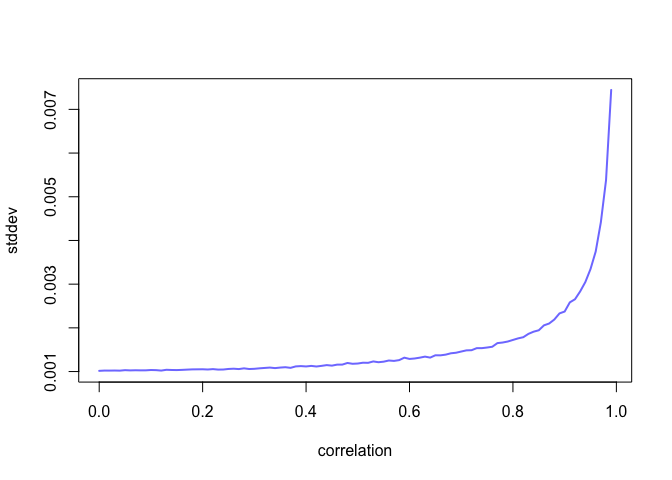

Overthinking: Simulated science distortion. Simulations like this one are easy to do in R, or in any other scripting language, once you have seen a few examples. In this simulation, we just draw some random Gaussian criteria for a sample of proposals and then select the top 10% combined scores.
# R code 6.1

```r
set.seed(1914)
N <- 200 # num grant proposals
p <- 0.1 # proportion to select
# uncorrelated newsworthiness and trustworthiness 
nw <- rnorm(N)
tw <- rnorm(N)
# select top 10% of combined scores
s<-nw+tw #totalscore
q <- quantile( s , 1-p ) # top 10% threshold 
selected <- ifelse( s >= q , TRUE , FALSE )
cor( tw[selected] , nw[selected] )
```

```
## [1] -0.7680083
```

# 6.1. Multicollinearity
6.1.1. Multicollinear legs.
The code below will simulate the heights and leg lengths of 100 individuals.

```r
N <- 100  # number of individuals
set.seed(909)
height <- rnorm(N,10,2) # sim total height of each
leg_prop <- runif(N,0.4,0.5) # leg as proportion of height
leg_left <- leg_prop*height + rnorm(N,0,0.02) # Sim left leg as proportion + error
leg_right <- leg_prop*height + rnorm(N,0,0.02) # sim right leg as proportion + error
d <- data.frame(height, leg_left,leg_right) # combine into data frame
```
# R code 6.3

```r
m6.1 <- quap(
    alist(
        height ~ dnorm( mu , sigma ) ,
        mu <- a + bl*leg_left + br*leg_right ,
        a ~ dnorm( 10 , 100 ) ,
        bl ~ dnorm( 2 , 10 ) ,
        br ~ dnorm( 2 , 10 ) ,
        sigma ~ dexp( 1 )
),
    data=d )
precis(m6.1)
```

```
##            mean         sd       5.5%     94.5%
## a     0.9812791 0.28395540  0.5274635 1.4350947
## bl    0.2118585 2.52703706 -3.8268348 4.2505518
## br    1.7836774 2.53125061 -2.2617500 5.8291047
## sigma 0.6171026 0.04343427  0.5476862 0.6865189
```

# R code 6.4

```r
plot(precis(m6.1))
```

<!-- -->

# R code 6.5

```r
post <- extract.samples(m6.1)
plot( bl ~ br , post , col=col.alpha(rangi2,0.1) , pch=16 )
```

<!-- -->

# R code 6.6

```r
sum_blbr <- post$bl + post$br
dens( sum_blbr , col=rangi2 , lwd=2 , xlab="sum of bl and br")
```

<!-- -->

# R code 6.7

```r
m6.2 <- quap(
    alist(
        height ~ dnorm( mu , sigma ) ,
        mu <- a + bl*leg_left,
        a ~ dnorm( 10 , 100 ) ,
        bl ~ dnorm( 2 , 10 ) ,
sigma ~ dexp( 1 ) ),
    data=d )
precis(m6.2)
```

```
##            mean         sd      5.5%    94.5%
## a     0.9979326 0.28364620 0.5446112 1.451254
## bl    1.9920676 0.06115704 1.8943269 2.089808
## sigma 0.6186038 0.04353998 0.5490185 0.688189
```
# 6.1.2. Multicollinearmilk.
# R code 6.8

```r
library(rethinking)
data(milk)
d <- milk
d$K <- scale( d$kcal.per.g )
d$F <- scale( d$perc.fat )
d$L <- scale( d$perc.lactose )
```

# R code 6.9

```r
# kcal.per.g regressed on perc.fat
m6.3 <- quap(
    alist(
        K ~ dnorm( mu , sigma ) ,
        mu <- a + bF*F ,
        a ~ dnorm( 0 , 0.2 ) ,
        bF ~ dnorm( 0 , 0.5 ) ,
        sigma ~ dexp( 1 )
) , data=d )
# kcal.per.g regressed on perc.lactose
m6.4 <- quap(
    alist(
        K ~ dnorm( mu , sigma ) ,
        mu <- a + bL*L ,
        a ~ dnorm( 0 , 0.2 ) ,
        bL ~ dnorm( 0 , 0.5 ) ,
        sigma ~ dexp( 1 )
) , data=d )
precis( m6.3 )
```

```
##               mean         sd       5.5%     94.5%
## a     1.535526e-07 0.07725195 -0.1234634 0.1234637
## bF    8.618970e-01 0.08426088  0.7272318 0.9965621
## sigma 4.510179e-01 0.05870756  0.3571919 0.5448440
```

```r
precis( m6.4 )
```

```
##                mean         sd       5.5%      94.5%
## a      7.438895e-07 0.06661633 -0.1064650  0.1064665
## bL    -9.024550e-01 0.07132848 -1.0164517 -0.7884583
## sigma  3.804653e-01 0.04958259  0.3012227  0.4597078
```

# R 6.10

```r
m6.5 <- quap(
    alist(
        K ~ dnorm( mu , sigma ) ,
        mu <- a + bF*F + bL*L ,
        a ~ dnorm( 0 , 0.2 ) ,
        bF ~ dnorm( 0 , 0.5 ) ,
        bL ~ dnorm( 0 , 0.5 ) ,
        sigma ~ dexp( 1 )
),
    data=d )
precis( m6.5 )
```

```
##                mean         sd        5.5%      94.5%
## a     -3.172136e-07 0.06603577 -0.10553823  0.1055376
## bF     2.434983e-01 0.18357865 -0.04989579  0.5368925
## bL    -6.780825e-01 0.18377670 -0.97179320 -0.3843719
## sigma  3.767418e-01 0.04918394  0.29813637  0.4553472
```

# R code 6.11

```r
 pairs( ~ kcal.per.g + perc.fat + perc.lactose , data=d , col=rangi2 )
```

<!-- -->

## 6.1.3. Howbadiscorrelation?
# R code 6.12

```r
cor( d$perc.fat , d$perc.lactose )
```

```
## [1] -0.9416373
```
# Overthinking: Simulating collinearity. 

```r
library(rethinking)
data(milk)
d <- milk
sim.coll <- function( r=0.9 ) {
    d$x <- rnorm( nrow(d) , mean=r*d$perc.fat ,
        sd=sqrt( (1-r^2)*var(d$perc.fat) ) )
    m <- lm( kcal.per.g ~ perc.fat + x , data=d )
    sqrt( diag( vcov(m) ) )[2] # stddev of parameter
}
rep.sim.coll <- function( r=0.9 , n=100 ) {
    stddev <- replicate( n , sim.coll(r) )
    mean(stddev)
}
r.seq <- seq(from=0,to=0.99,by=0.01)
stddev <- sapply( r.seq , function(z) rep.sim.coll(r=z,n=100) )
plot( stddev ~ r.seq , type="l" , col=rangi2, lwd=2 , xlab="correlation" )
```

<!-- -->

# 6.2. Post-treatmentbias
## It is routine to worry about mistaken inferences that arise from omitting predictor vari- ables. Such mistakes are often called omitted variable bias, and the examples from the previous chapter illustrate it. It is much less routine to worry about mistaken inferences aris- ing from including variables that are consequences of other variables. We’ll call this post- treatment bias
## Let's simulate some data, to make the example more transparent and see what exactly goes wrong when we include a post-treatment variable.
# R code 6.14

```r
set.seed(71)
# number of plants
N <- 100
# simulate initial heights
h0 <- rnorm(N,10,2)
# assign treatments and simulate fungus and growth
treatment <- rep( 0:1 , each=N/2 )
fungus <- rbinom( N , size=1 , prob=0.5 - treatment*0.4 )
h1 <- h0 + rnorm(N, 5 - 3*fungus)
# compose a clean data frame
d <- data.frame( h0=h0 , h1=h1 , treatment=treatment , fungus=fungus )
 precis(d)
```

```
##               mean        sd      5.5%    94.5%    histogram
## h0         9.95978 2.1011623  6.570328 13.07874 ▁▂▂▂▇▃▂▃▁▁▁▁
## h1        14.39920 2.6880870 10.618002 17.93369     ▁▁▃▇▇▇▁▁
## treatment  0.50000 0.5025189  0.000000  1.00000   ▇▁▁▁▁▁▁▁▁▇
## fungus     0.23000 0.4229526  0.000000  1.00000   ▇▁▁▁▁▁▁▁▁▂
```
# 6.2.1. A prior is born.
# R code 6.15

```r
sim_p <- rlnorm( 1e4 , 0 , 0.25 )
precis( data.frame(sim_p) )
```

```
##          mean        sd     5.5%    94.5%    histogram
## sim_p 1.03699 0.2629894 0.670683 1.496397 ▁▁▃▇▇▃▁▁▁▁▁▁
```
# R code 6.16

```r
m6.6 <- quap(
    alist(
        h1 ~ dnorm( mu , sigma ),
        mu <- h0*p,
        p ~ dlnorm( 0 , 0.25 ),
        sigma ~ dexp( 1 )
    ), data=d )
precis(m6.6)
```

```
##           mean         sd     5.5%    94.5%
## p     1.426626 0.01760992 1.398482 1.454770
## sigma 1.793286 0.12517262 1.593236 1.993336
```
# R code 6.17

```r
m6.7 <- quap(
    alist(
        h1 ~ dnorm( mu , sigma ),
        mu <- h0 * p,
        p <- a + bt*treatment + bf*fungus,
        a ~ dlnorm( 0 , 0.2 ) ,
        bt ~ dnorm( 0 , 0.5 ),
        bf ~ dnorm( 0 , 0.5 ),
        sigma ~ dexp( 1 )
    ), data=d )
precis(m6.7)
```

```
##               mean         sd        5.5%       94.5%
## a      1.481391468 0.02451069  1.44221865  1.52056429
## bt     0.002412222 0.02986965 -0.04532525  0.05014969
## bf    -0.266718915 0.03654772 -0.32512923 -0.20830860
## sigma  1.408797442 0.09862070  1.25118251  1.56641237
```

# R code 6.18

```r
m6.8 <- quap(
    alist(
        h1 ~ dnorm( mu , sigma ),
        mu <- h0 * p,
        p <- a + bt*treatment,
        a ~ dlnorm( 0 , 0.2 ),
        bt ~ dnorm( 0 , 0.5 ),
        sigma ~ dexp( 1 )
    ), data=d )
precis(m6.8)
```

```
##             mean         sd       5.5%     94.5%
## a     1.38035767 0.02517554 1.34012229 1.4205931
## bt    0.08499924 0.03429718 0.03018573 0.1398128
## sigma 1.74631655 0.12191552 1.55147200 1.9411611
```

# 6.2.3. Fungusandd-separation
# R code 6.19

```r
library(dagitty)
plant_dag <- dagitty( "dag {
    H0 -> H1
    F -> H1
    T -> F
}")
coordinates( plant_dag ) <- list( x=c(H0=0,T=2,F=1.5,H1=1) ,
y=c(H0=0,T=0,F=1,H1=2) )
plot( plant_dag )
```

<!-- -->

# R code 6.20

```r
dseparated( plant_dag , "T" , "H1" )
```

```
## [1] FALSE
```

```r
dseparated( plant_dag , "T" , "H1" , "F" )
```

```
## [1] TRUE
```

# R code 6.21

```r
 impliedConditionalIndependencies( plant_dag )
```

```
## F _||_ H0
## H0 _||_ T
## H1 _||_ T | F
```

# 6.3. Colliderbias
* At the start of the chapter, I argued that all that is necessary for scientific studies to show a negative association between trustworthiness and newsworthiness is that selection processes—grant and journal review—care about both. Now I want to explain how this same selection phenomenon can happen inside a statistical model. When it does, it can seriously distort our inferences, a phenomenon known as collider bias.
## 6.3.1. Collideroffalsesorrow.
# R code 6.22

```r
library(rethinking)
d <- sim_happiness( seed=1977 , N_years=1000 )
precis(d)
```

```
##                    mean        sd      5.5%     94.5%     histogram
## age        3.300000e+01 18.768883  4.000000 62.000000 ▇▇▇▇▇▇▇▇▇▇▇▇▇
## married    3.007692e-01  0.458769  0.000000  1.000000    ▇▁▁▁▁▁▁▁▁▃
## happiness -1.000070e-16  1.214421 -1.789474  1.789474      ▇▅▇▅▅▇▅▇
```
# R code 6.23

```r
d2 <- d[ d$age>17 , ] # only adults
d2$A <- ( d2$age - 18 ) / ( 65 - 18 )
```

# R code 6.24

```r
d2$mid <- d2$married + 1
m6.9 <- quap(
    alist(
        happiness ~ dnorm( mu , sigma ),
        mu <- a[mid] + bA*A,
        a[mid] ~ dnorm( 0 , 1 ),
        bA ~ dnorm( 0 , 2 ),
        sigma ~ dexp(1)
    ) , data=d2 )
precis(m6.9,depth=2)
```

```
##             mean         sd       5.5%      94.5%
## a[1]  -0.2350877 0.06348986 -0.3365568 -0.1336186
## a[2]   1.2585517 0.08495989  1.1227694  1.3943340
## bA    -0.7490274 0.11320112 -0.9299447 -0.5681102
## sigma  0.9897080 0.02255800  0.9536559  1.0257600
```

# R code 6.25

```r
m6.10 <- quap(
    alist(
        happiness ~ dnorm( mu , sigma ),
        mu <- a + bA*A,
        a ~ dnorm( 0 , 1 ),
        bA ~ dnorm( 0 , 2 ),
        sigma ~ dexp(1)
    ) , data=d2 )
precis(m6.10)
```

```
##                mean         sd       5.5%     94.5%
## a      1.649248e-07 0.07675015 -0.1226614 0.1226617
## bA    -2.728620e-07 0.13225976 -0.2113769 0.2113764
## sigma  1.213188e+00 0.02766080  1.1689803 1.2573949
```
# 6.3.2. ThehauntedDAG.
# R code 6.26

```r
N <- 200  # number of grandparent-parent-child triads
b_GP <- 1 # direct effect of G on P
b_GC <- 0 # direct effect of G on C
b_PC <- 1 # direct effect of P on C
b_U<-2 #directeffectofUonPandC
```
# R code 6.27

```r
set.seed(1)
U <- 2*rbern( N , 0.5 ) - 1
G <- rnorm( N )
P <- rnorm( N , b_GP*G + b_U*U )
C <- rnorm( N , b_PC*P + b_GC*G + b_U*U )
d <- data.frame( C=C , P=P , G=G , U=U )
```
# R code 6.28

```r
m6.11 <- quap(
    alist(
        C ~ dnorm( mu , sigma ),
        mu <- a + b_PC*P + b_GC*G,
        a ~ dnorm( 0 , 1 ),
        c(b_PC,b_GC) ~ dnorm( 0 , 1 ),
        sigma ~ dexp( 1 )
    ), data=d )
precis(m6.11)
```

```
##             mean         sd       5.5%       94.5%
## a     -0.1174752 0.09919574 -0.2760091  0.04105877
## b_PC   1.7868915 0.04455355  1.7156863  1.85809664
## b_GC  -0.8389537 0.10614045 -1.0085867 -0.66932077
## sigma  1.4094891 0.07011139  1.2974375  1.52154063
```

# R code 6.29

```r
m6.12 <- quap(
    alist(
        C ~ dnorm( mu , sigma ),
        mu <- a + b_PC*P + b_GC*G + b_U*U,
        a ~ dnorm( 0 , 1 ),
        c(b_PC,b_GC,b_U) ~ dnorm( 0 , 1 ),
        sigma ~ dexp( 1 )
    ), data=d )
precis(m6.12)
```

```
##              mean         sd       5.5%        94.5%
## a     -0.12197510 0.07192588 -0.2369265 -0.007023655
## b_PC   1.01161103 0.06597258  0.9061741  1.117047948
## b_GC  -0.04081373 0.09728716 -0.1962974  0.114669941
## b_U    1.99648992 0.14770462  1.7604294  2.232550439
## sigma  1.01959911 0.05080176  0.9384081  1.100790130
```

# 
