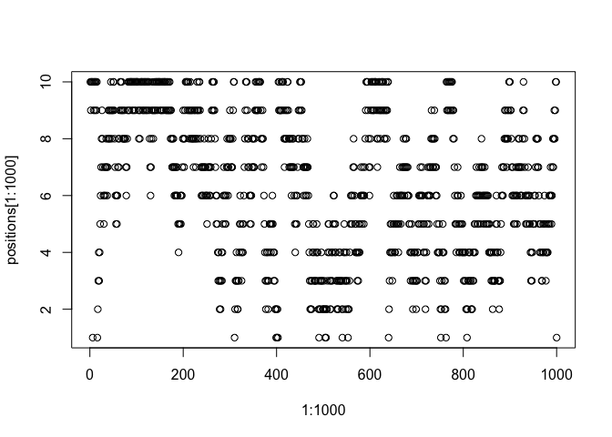

# Install updated "rethinking" package (Oct 11, 2019)

```r
# library(devtools)
# install_github("rmcelreath/rethinking",ref="Experimental")
```

# Quad approximation does not work with non Gausian distribution... (by J)


```r
num_weeks <- 1e5 
positions <- rep(0,num_weeks) 
current <- 10
for ( i in 1:num_weeks ) { 
  # record current position 
  positions[i] <- current 
  # flip coin to generate proposal 
  proposal <- current + sample( c(-1,1) , size=1 ) 
  # now make sure he loops around the archipelago 
  if ( proposal < 1 ) proposal <- 10 
  if ( proposal > 10 ) proposal <- 1 
  # move? 
  prob_move <- proposal/current 
  current <- ifelse( runif(1) < prob_move , proposal , current ) 
}
plot(x=1:1000, y=positions[1:1000])
```

<!-- -->

## R code 9.2

```r
D <- 10
T <- 1e3
Y <- rmvnorm(T,rep(0,D),diag(D)) # problem in rmvnorm package installation (Jan 9, 2019)
rad_dist <- function( Y ) sqrt( sum(Y^2) )
Rd <- sapply( 1:T , function(i) rad_dist( Y[i,] ) )
dens( Rd )
```

<!-- -->
## R code 9.3

```r
# U needs to return neg-log-probability
myU4 <- function( q , a=0 , b=1 , k=0 , d=1 ) {
  muy <- q[1]
  mux <- q[2]
  U <- sum( dnorm(y,muy,1,log=TRUE) ) + sum( dnorm(x,mux,1,log=TRUE) ) +
    dnorm(muy,a,b,log=TRUE) + dnorm(mux,k,d,log=TRUE)
  return( -U )
}
```
## R code 9.4

```r
# gradient function
# need vector of partial derivatives of U with respect to vector q
myU_grad4 <- function( q , a=0 , b=1 , k=0 , d=1 ) {
  muy <- q[1]
  mux <- q[2]
  G1 <- sum( y - muy ) + (a - muy)/b^2 #dU/dmuy
  G2 <- sum( x - mux ) + (k - mux)/d^2 #dU/dmuy
  return( c( -G1 , -G2 ) ) # negative bc energy is neg-log-prob
}
# test data
set.seed(7)
y <- rnorm(50)
x <- rnorm(50)
x <- as.numeric(scale(x))
y <- as.numeric(scale(y))
```

## R code 9.5

```r
library(shape) # for fancy arrows
Q <- list()
Q$q <- c(-0.1,0.2)
pr <- 0.3
plot( NULL , ylab="muy" , xlab="mux" , xlim=c(-pr,pr) , ylim=c(-pr,pr) )
step <- 0.03
L <- 11 # 0.03/28 for U-turns --- 11 for working example
n_samples <- 4
path_col <- col.alpha("black",0.5)
points( Q$q[1] , Q$q[2] , pch=4 , col="black" )
for ( i in 1:n_samples ) {
  Q <- HMC2( myU4 , myU_grad4 , step , L , Q$q )
  if ( n_samples < 10 ) {
    for ( j in 1:L ) {
      K0 <- sum(Q$ptraj[j,]^2)/2 # kinetic energy
      lines( Q$traj[j:(j+1),1] , Q$traj[j:(j+1),2] , col=path_col , lwd=1+2*K0 )
    }
    points( Q$traj[1:L+1,] , pch=16 , col="white" , cex=0.35 )
    Arrows( Q$traj[L,1] , Q$traj[L,2] , Q$traj[L+1,1] , Q$traj[L+1,2] ,
            arr.length=0.35 , arr.adj = 0.7 )
    text( Q$traj[L+1,1] , Q$traj[L+1,2] , i , cex=0.8 , pos=4 , offset=0.4 )
  }
  points( Q$traj[L+1,1] , Q$traj[L+1,2] , pch=ifelse( Q$accept==1 , 16 , 1 ) ,
          col=ifelse( abs(Q$dH)>0.1 , "red" , "black" ) )
}
```

<!-- -->

## R code 9.6

```r
HMC2 <- function (U, grad_U, epsilon, L, current_q) {
  q = current_q
  p = rnorm(length(q),0,1) # random flick - p is momentum.
  current_p = p
  # Make a half step for momentum at the beginning
  p = p - epsilon * grad_U(q) / 2
  # initialize bookkeeping - saves trajectory
  qtraj <- matrix(NA,nrow=L+1,ncol=length(q))
  ptraj <- qtraj
  qtraj[1,] <- current_q
  ptraj[1,] <- p
  
  ## R code 9.7
  # Alternate full steps for position and momentum
  for ( i in 1:L ) {
    q = q + epsilon * p # Full step for the position
    # Make a full step for the momentum, except at end of trajectory
    if ( i!=L ) {
      p = p - epsilon * grad_U(q)
      ptraj[i+1,] <- p
    }
    qtraj[i+1,] <- q
  }
  ## R code 9.8
  # Make a half step for momentum at the end
  p = p - epsilon * grad_U(q) / 2
  ptraj[L+1,] <- p
  # Negate momentum at end of trajectory to make the proposal symmetric
  p = -p
  # Evaluate potential and kinetic energies at start and end of trajectory
  current_U = U(current_q)
  current_K = sum(current_p^2) / 2
  proposed_U = U(q)
  proposed_K = sum(p^2) / 2
  # Accept or reject the state at end of trajectory, returning either
  # the position at the end of the trajectory or the initial position
  accept <- 0
  if (runif(1) < exp(current_U-proposed_U+current_K-proposed_K)) {
    new_q <- q  # accept
    accept <- 1
  } else new_q <- current_q  # reject
  return(list( q=new_q, traj=qtraj, ptraj=ptraj, accept=accept ))
}
```

# 9.4. EasyHMC:ulam
## the terrain ruggedness example from Chapter 7. This code will load the data and reduce it down to cases (nations) that have the outcome variable of interest:

## R code 9.9

```r
library(rethinking)
data(rugged)
d <- rugged
d$log_gdp <- log(d$rgdppc_2000) # log GDP
# extract countries with GDP data
dd <- d[ complete.cases(d$rgdppc_2000) , ] 
# rescale variables
dd$log_gdp_std <- dd$log_gdp / mean(dd$log_gdp)
dd$rugged_std <- dd$rugged / max(dd$rugged)
# make variable to index Africa (1) or not (2) (pg 249)
dd$cid <- ifelse( dd$cont_africa==1 , 1 , 2 )
```

## R code 9.10 (the old way)

```r
m8.5 <- quap(
  alist(
    log_gdp_std ~ dnorm( mu , sigma ) ,
    mu <- a[cid] + b[cid]*( rugged_std - 0.215 ) ,
    a[cid] ~ dnorm( 1 , 0.1 ) ,
    b[cid] ~ dnorm( 0 , 0.3 ) ,
    sigma ~ dexp( 1 )
  ) ,
  data=dd )
precis( m8.5 , depth=2 )
```

```
##             mean          sd        5.5%       94.5%
## a[1]   0.8865640 0.015674552  0.86151302  0.91161495
## a[2]   1.0505666 0.009935872  1.03468714  1.06644602
## b[1]   0.1324981 0.074199237  0.01391344  0.25108286
## b[2]  -0.1426057 0.054745410 -0.23009945 -0.05511197
## sigma  0.1094859 0.005934188  0.10000194  0.11896990
```

## R code 9.11

```r
dat_slim <- list(
  log_gdp_std = dd$log_gdp_std,
  rugged_std = dd$rugged_std,
  cid = as.integer( dd$cid )
)
str(dat_slim)
```

```
## List of 3
##  $ log_gdp_std: num [1:170] 0.88 0.965 1.166 1.104 0.915 ...
##  $ rugged_std : num [1:170] 0.138 0.553 0.124 0.125 0.433 ...
##  $ cid        : int [1:170] 1 2 2 2 2 2 2 2 2 1 ...
```
# 9.4.2. Sampling from the posterior

## R code 9.12

```r
m9.1 <- ulam(
  alist(
    log_gdp_std ~ dnorm( mu , sigma ) ,
    mu <- a[cid] + b[cid]*( rugged_std - 0.215 ) ,
    a[cid] ~ dnorm( 1 , 0.1 ) ,
    b[cid] ~ dnorm( 0 , 0.3 ) ,
    sigma ~ dexp( 1 )
  ) ,
  data=dat_slim , chains=1 )
```

```
## Warning in system(cmd, intern = !verbose): running command '/Library/
## Frameworks/R.framework/Resources/bin/R CMD SHLIB file6ed86ef686f1.cpp 2>
## file6ed86ef686f1.cpp.err.txt' had status 1
```

```
## Error in compileCode(f, code, language = language, verbose = verbose): Compilation ERROR, function(s)/method(s) not created! clang: warning: no such sysroot directory: '/Library/Developer/CommandLineTools/SDKs/MacOSX.sdk' [-Wmissing-sysroot]
## In file included from file6ed86ef686f1.cpp:8:
## In file included from /Library/Frameworks/R.framework/Versions/3.6/Resources/library/StanHeaders/include/src/stan/model/model_header.hpp:4:
## In file included from /Library/Frameworks/R.framework/Versions/3.6/Resources/library/StanHeaders/include/stan/math.hpp:4:
## In file included from /Library/Frameworks/R.framework/Versions/3.6/Resources/library/StanHeaders/include/stan/math/rev/mat.hpp:4:
## In file included from /Library/Frameworks/R.framework/Versions/3.6/Resources/library/StanHeaders/include/stan/math/rev/core.hpp:4:
## In file included from /Library/Frameworks/R.framework/Versions/3.6/Resources/library/StanHeaders/include/stan/math/rev/core/autodiffstackstorage.hpp:4:
## In file included from /Library/Frameworks/R.framework/Versions/3.6/Resources/library/StanHeaders/include/stan/math/memory/stack_alloc.hpp:8:
## In file included from /Applications/Xcode.app/Contents/Developer/Toolchains/XcodeDefault.xctoolchain/usr/include/c++/v1/cstdlib:86:
## /Applications/Xcode.app/Contents/Developer/Toolchains/XcodeDefault.xctoolchain/usr/include/c++/v1/stdlib.h:94:15: fatal error: 'stdlib.h' file not found
## #include_next <stdlib.h>
##               ^~~~~~~~~~
## 1 error generated.
## make: *** [file6ed86ef686f1.o] Error 1
```

```
## Error in sink(type = "output"): invalid connection
```

## R code 9.13

```r
precis( m9.1 , depth=2 )
```

```
## Error in precis(m9.1, depth = 2): object 'm9.1' not found
```

# 9.4.3. Samplingagain,inparallel.

## R code 9.14

```r
m9.1 <- ulam(
  alist(
    log_gdp_std ~ dnorm( mu , sigma ) ,
    mu <- a[cid] + b[cid]*( rugged_std - 0.215 ) ,
    a[cid] ~ dnorm( 1 , 0.1 ) ,
    b[cid] ~ dnorm( 0 , 0.3 ) ,
    sigma ~ dexp( 1 )
  ) ,
  data=dat_slim , chains=4 , cores=2 , iter=1000 )
```

```
## Warning in system(cmd, intern = !verbose): running command '/Library/
## Frameworks/R.framework/Resources/bin/R CMD SHLIB file6ed82cc8e921.cpp 2>
## file6ed82cc8e921.cpp.err.txt' had status 1
```

```
## Error in compileCode(f, code, language = language, verbose = verbose): Compilation ERROR, function(s)/method(s) not created! clang: warning: no such sysroot directory: '/Library/Developer/CommandLineTools/SDKs/MacOSX.sdk' [-Wmissing-sysroot]
## In file included from file6ed82cc8e921.cpp:8:
## In file included from /Library/Frameworks/R.framework/Versions/3.6/Resources/library/StanHeaders/include/src/stan/model/model_header.hpp:4:
## In file included from /Library/Frameworks/R.framework/Versions/3.6/Resources/library/StanHeaders/include/stan/math.hpp:4:
## In file included from /Library/Frameworks/R.framework/Versions/3.6/Resources/library/StanHeaders/include/stan/math/rev/mat.hpp:4:
## In file included from /Library/Frameworks/R.framework/Versions/3.6/Resources/library/StanHeaders/include/stan/math/rev/core.hpp:4:
## In file included from /Library/Frameworks/R.framework/Versions/3.6/Resources/library/StanHeaders/include/stan/math/rev/core/autodiffstackstorage.hpp:4:
## In file included from /Library/Frameworks/R.framework/Versions/3.6/Resources/library/StanHeaders/include/stan/math/memory/stack_alloc.hpp:8:
## In file included from /Applications/Xcode.app/Contents/Developer/Toolchains/XcodeDefault.xctoolchain/usr/include/c++/v1/cstdlib:86:
## /Applications/Xcode.app/Contents/Developer/Toolchains/XcodeDefault.xctoolchain/usr/include/c++/v1/stdlib.h:94:15: fatal error: 'stdlib.h' file not found
## #include_next <stdlib.h>
##               ^~~~~~~~~~
## 1 error generated.
## make: *** [file6ed82cc8e921.o] Error 1
```

```
## Error in sink(type = "output"): invalid connection
```

## R code 9.15

```r
show( m9.1 )
```

```
## Error in show(m9.1): object 'm9.1' not found
```

## R code 9.16

```r
precis( m9.1 , 2 )
```

```
## Error in precis(m9.1, 2): object 'm9.1' not found
```

# 9.4.4. Visualization
## R code 9.17

```r
pairs( m9.1 )
```

```
## Error in pairs(m9.1): object 'm9.1' not found
```

# 9.4.5. Checking the chain.
## R code 9.18

```r
traceplot( m9.1 )
```

```
## Error in traceplot(m9.1): object 'm9.1' not found
```

## R code 9.19

```r
trankplot( m9.1 , n_cols=2 )
```

```
## Error in class(object) %in% c("map2stan", "ulam", "stanfit"): object 'm9.1' not found
```


# 9.5  ### 


## R code 9.20

```r
y <- c(-1.00001,1.00001)
set.seed(11)
m9.2 <- ulam(
  alist(
    y ~ dnorm(mu, sigma),
    mu <- alpha,
    alpha ~ dnorm(0,1000),
    sigma ~ dexp(0.0001)
  ),
  data=list(y=y) , chains=2)
```

```
## Warning in system(cmd, intern = !verbose): running command '/Library/
## Frameworks/R.framework/Resources/bin/R CMD SHLIB file6ed84cb8d4c2.cpp 2>
## file6ed84cb8d4c2.cpp.err.txt' had status 1
```

```
## Error in compileCode(f, code, language = language, verbose = verbose): Compilation ERROR, function(s)/method(s) not created! clang: warning: no such sysroot directory: '/Library/Developer/CommandLineTools/SDKs/MacOSX.sdk' [-Wmissing-sysroot]
## In file included from file6ed84cb8d4c2.cpp:8:
## In file included from /Library/Frameworks/R.framework/Versions/3.6/Resources/library/StanHeaders/include/src/stan/model/model_header.hpp:4:
## In file included from /Library/Frameworks/R.framework/Versions/3.6/Resources/library/StanHeaders/include/stan/math.hpp:4:
## In file included from /Library/Frameworks/R.framework/Versions/3.6/Resources/library/StanHeaders/include/stan/math/rev/mat.hpp:4:
## In file included from /Library/Frameworks/R.framework/Versions/3.6/Resources/library/StanHeaders/include/stan/math/rev/core.hpp:4:
## In file included from /Library/Frameworks/R.framework/Versions/3.6/Resources/library/StanHeaders/include/stan/math/rev/core/autodiffstackstorage.hpp:4:
## In file included from /Library/Frameworks/R.framework/Versions/3.6/Resources/library/StanHeaders/include/stan/math/memory/stack_alloc.hpp:8:
## In file included from /Applications/Xcode.app/Contents/Developer/Toolchains/XcodeDefault.xctoolchain/usr/include/c++/v1/cstdlib:86:
## /Applications/Xcode.app/Contents/Developer/Toolchains/XcodeDefault.xctoolchain/usr/include/c++/v1/stdlib.h:94:15: fatal error: 'stdlib.h' file not found
## #include_next <stdlib.h>
##               ^~~~~~~~~~
## 1 error generated.
## make: *** [file6ed84cb8d4c2.o] Error 1
```

```
## Error in sink(type = "output"): invalid connection
```
## R code 9.21

```r
precis( m9.2 )
```

```
## Error in precis(m9.2): object 'm9.2' not found
```
## R code 9.22

```r
set.seed(11)
m9.3 <- ulam(
  alist(
    y ~ dnorm( mu , sigma ) ,
    mu <- alpha ,
    alpha ~ dnorm( 1 , 10 ) ,
    sigma ~ dexp( 1 )
  ) ,
  data=list(y=y) , chains=2 )
```

```
## Warning in system(cmd, intern = !verbose): running command '/Library/
## Frameworks/R.framework/Resources/bin/R CMD SHLIB file6ed8795d1e7f.cpp 2>
## file6ed8795d1e7f.cpp.err.txt' had status 1
```

```
## Error in compileCode(f, code, language = language, verbose = verbose): Compilation ERROR, function(s)/method(s) not created! clang: warning: no such sysroot directory: '/Library/Developer/CommandLineTools/SDKs/MacOSX.sdk' [-Wmissing-sysroot]
## In file included from file6ed8795d1e7f.cpp:8:
## In file included from /Library/Frameworks/R.framework/Versions/3.6/Resources/library/StanHeaders/include/src/stan/model/model_header.hpp:4:
## In file included from /Library/Frameworks/R.framework/Versions/3.6/Resources/library/StanHeaders/include/stan/math.hpp:4:
## In file included from /Library/Frameworks/R.framework/Versions/3.6/Resources/library/StanHeaders/include/stan/math/rev/mat.hpp:4:
## In file included from /Library/Frameworks/R.framework/Versions/3.6/Resources/library/StanHeaders/include/stan/math/rev/core.hpp:4:
## In file included from /Library/Frameworks/R.framework/Versions/3.6/Resources/library/StanHeaders/include/stan/math/rev/core/autodiffstackstorage.hpp:4:
## In file included from /Library/Frameworks/R.framework/Versions/3.6/Resources/library/StanHeaders/include/stan/math/memory/stack_alloc.hpp:8:
## In file included from /Applications/Xcode.app/Contents/Developer/Toolchains/XcodeDefault.xctoolchain/usr/include/c++/v1/cstdlib:86:
## /Applications/Xcode.app/Contents/Developer/Toolchains/XcodeDefault.xctoolchain/usr/include/c++/v1/stdlib.h:94:15: fatal error: 'stdlib.h' file not found
## #include_next <stdlib.h>
##               ^~~~~~~~~~
## 1 error generated.
## make: *** [file6ed8795d1e7f.o] Error 1
```

```
## Error in sink(type = "output"): invalid connection
```

```r
precis( m9.3 )
```

```
## Error in precis(m9.3): object 'm9.3' not found
```
## R code 9.23

```r
set.seed(41)
y <- rnorm( 100 , mean=0 , sd=1 )
```
## R code 9.24

```r
m9.4 <- ulam(
  alist(
    y ~ dnorm( mu , sigma ) ,
    mu <- a1 + a2 ,
    a1 ~ dnorm( 0 , 1000 ),
    a2 ~ dnorm( 0 , 1000 ),
    sigma ~ dexp( 1 )
  ) ,
  data=list(y=y) , chains=2 )
```

```
## Warning in system(cmd, intern = !verbose): running command '/Library/
## Frameworks/R.framework/Resources/bin/R CMD SHLIB file6ed825accfa9.cpp 2>
## file6ed825accfa9.cpp.err.txt' had status 1
```

```
## Error in compileCode(f, code, language = language, verbose = verbose): Compilation ERROR, function(s)/method(s) not created! clang: warning: no such sysroot directory: '/Library/Developer/CommandLineTools/SDKs/MacOSX.sdk' [-Wmissing-sysroot]
## In file included from file6ed825accfa9.cpp:8:
## In file included from /Library/Frameworks/R.framework/Versions/3.6/Resources/library/StanHeaders/include/src/stan/model/model_header.hpp:4:
## In file included from /Library/Frameworks/R.framework/Versions/3.6/Resources/library/StanHeaders/include/stan/math.hpp:4:
## In file included from /Library/Frameworks/R.framework/Versions/3.6/Resources/library/StanHeaders/include/stan/math/rev/mat.hpp:4:
## In file included from /Library/Frameworks/R.framework/Versions/3.6/Resources/library/StanHeaders/include/stan/math/rev/core.hpp:4:
## In file included from /Library/Frameworks/R.framework/Versions/3.6/Resources/library/StanHeaders/include/stan/math/rev/core/autodiffstackstorage.hpp:4:
## In file included from /Library/Frameworks/R.framework/Versions/3.6/Resources/library/StanHeaders/include/stan/math/memory/stack_alloc.hpp:8:
## In file included from /Applications/Xcode.app/Contents/Developer/Toolchains/XcodeDefault.xctoolchain/usr/include/c++/v1/cstdlib:86:
## /Applications/Xcode.app/Contents/Developer/Toolchains/XcodeDefault.xctoolchain/usr/include/c++/v1/stdlib.h:94:15: fatal error: 'stdlib.h' file not found
## #include_next <stdlib.h>
##               ^~~~~~~~~~
## 1 error generated.
## make: *** [file6ed825accfa9.o] Error 1
```

```
## Error in sink(type = "output"): invalid connection
```

```r
precis( m9.4 )
```

```
## Error in precis(m9.4): object 'm9.4' not found
```
## R code 9.25

```r
m9.5 <- ulam(
  alist(
    y ~ dnorm( mu , sigma ) ,
    mu <- a1 + a2 ,
    a1 ~ dnorm( 0 , 10 ),
    a2 ~ dnorm( 0 , 10 ),
    sigma ~ dexp( 1 )
  ) ,
  data=list(y=y) , chains=2 )
```

```
## Warning in system(cmd, intern = !verbose): running command '/Library/
## Frameworks/R.framework/Resources/bin/R CMD SHLIB file6ed87a0df7f3.cpp 2>
## file6ed87a0df7f3.cpp.err.txt' had status 1
```

```
## Error in compileCode(f, code, language = language, verbose = verbose): Compilation ERROR, function(s)/method(s) not created! clang: warning: no such sysroot directory: '/Library/Developer/CommandLineTools/SDKs/MacOSX.sdk' [-Wmissing-sysroot]
## In file included from file6ed87a0df7f3.cpp:8:
## In file included from /Library/Frameworks/R.framework/Versions/3.6/Resources/library/StanHeaders/include/src/stan/model/model_header.hpp:4:
## In file included from /Library/Frameworks/R.framework/Versions/3.6/Resources/library/StanHeaders/include/stan/math.hpp:4:
## In file included from /Library/Frameworks/R.framework/Versions/3.6/Resources/library/StanHeaders/include/stan/math/rev/mat.hpp:4:
## In file included from /Library/Frameworks/R.framework/Versions/3.6/Resources/library/StanHeaders/include/stan/math/rev/core.hpp:4:
## In file included from /Library/Frameworks/R.framework/Versions/3.6/Resources/library/StanHeaders/include/stan/math/rev/core/autodiffstackstorage.hpp:4:
## In file included from /Library/Frameworks/R.framework/Versions/3.6/Resources/library/StanHeaders/include/stan/math/memory/stack_alloc.hpp:8:
## In file included from /Applications/Xcode.app/Contents/Developer/Toolchains/XcodeDefault.xctoolchain/usr/include/c++/v1/cstdlib:86:
## /Applications/Xcode.app/Contents/Developer/Toolchains/XcodeDefault.xctoolchain/usr/include/c++/v1/stdlib.h:94:15: fatal error: 'stdlib.h' file not found
## #include_next <stdlib.h>
##               ^~~~~~~~~~
## 1 error generated.
## make: *** [file6ed87a0df7f3.o] Error 1
```

```
## Error in sink(type = "output"): invalid connection
```

```r
precis( m9.5 )
```

```
## Error in precis(m9.5): object 'm9.5' not found
```


# practices
# 8E4 Explain the difference between the effective number of samples, n_eff as calculated by Stan, and the actual number of samples.
# (A) n_eff is independent samples within samples. 

# 8M3 Re-estimate one of the Stan models from the chapter, but at different numbers of warmup iterations. Be sure to use the same number of sampling iterations in each case. Compare the n_eff values. How much warmup is enough?
## KN note: "warmup" is not used in posterior distribution.

## R code 9.26 warmup 100

```r
mp.warmup100 <- map2stan(
  alist(
    a ~ dnorm(0,1),
    b ~ dcauchy(0,1)
  ),
  data=list(y=1),
  start=list(a=0,b=0),
  iter=1e4, warmup=100 , WAIC=FALSE )
```

```
## Warning in system(cmd, intern = !verbose): running command '/Library/
## Frameworks/R.framework/Resources/bin/R CMD SHLIB file6ed83e7a3b5b.cpp 2>
## file6ed83e7a3b5b.cpp.err.txt' had status 1
```

```
## Error in sink(type = "output") : invalid connection
```

```
## Error in map2stan(alist(a ~ dnorm(0, 1), b ~ dcauchy(0, 1)), data = list(y = 1), : Something went wrong, when calling Stan. Check any debug messages for clues, detective.
## invalid connection
```
# warmup 10

```r
mp.warmup10 <- map2stan(
  alist(
    a ~ dnorm(0,1),
    b ~ dcauchy(0,1)
  ),
  data=list(y=1),
  start=list(a=0,b=0),
  iter=1e4, warmup=10 , WAIC=FALSE )
```

```
## Warning in system(cmd, intern = !verbose): running command '/Library/
## Frameworks/R.framework/Resources/bin/R CMD SHLIB file6ed84bd9f298.cpp 2>
## file6ed84bd9f298.cpp.err.txt' had status 1
```

```
## Error in sink(type = "output") : invalid connection
```

```
## Error in map2stan(alist(a ~ dnorm(0, 1), b ~ dcauchy(0, 1)), data = list(y = 1), : Something went wrong, when calling Stan. Check any debug messages for clues, detective.
## invalid connection
```
# warmup 1000

```r
mp.warmup1000 <- map2stan(
  alist(
    a ~ dnorm(0,1),
    b ~ dcauchy(0,1)
  ),
  data=list(y=1),
  start=list(a=0,b=0),
  iter=1e4, warmup=1000 , WAIC=FALSE )
```

```
## Warning in system(cmd, intern = !verbose): running command '/Library/
## Frameworks/R.framework/Resources/bin/R CMD SHLIB file6ed83b06b3ae.cpp 2>
## file6ed83b06b3ae.cpp.err.txt' had status 1
```

```
## Error in sink(type = "output") : invalid connection
```

```
## Error in map2stan(alist(a ~ dnorm(0, 1), b ~ dcauchy(0, 1)), data = list(y = 1), : Something went wrong, when calling Stan. Check any debug messages for clues, detective.
## invalid connection
```
# warmup 5000

```r
mp.warmup5000 <- map2stan(
  alist(
    a ~ dnorm(0,1),
    b ~ dcauchy(0,1)
  ),
  data=list(y=1),
  start=list(a=0,b=0),
  iter=1e4, warmup=5000 , WAIC=FALSE,control = list(max_treedepth = 15))
```

```
## Warning in system(cmd, intern = !verbose): running command '/Library/
## Frameworks/R.framework/Resources/bin/R CMD SHLIB file6ed81d3f2c72.cpp 2>
## file6ed81d3f2c72.cpp.err.txt' had status 1
```

```
## Error in sink(type = "output") : invalid connection
```

```
## Error in map2stan(alist(a ~ dnorm(0, 1), b ~ dcauchy(0, 1)), data = list(y = 1), : Something went wrong, when calling Stan. Check any debug messages for clues, detective.
## invalid connection
```

```r
# control = list(max_treedepth = 15) added after an error with default
```
# compare different warmup

```r
precis(mp.warmup10)
```

```
## Error in precis(mp.warmup10): object 'mp.warmup10' not found
```

```r
precis(mp.warmup100)
```

```
## Error in precis(mp.warmup100): object 'mp.warmup100' not found
```

```r
precis(mp.warmup1000)
```

```
## Error in precis(mp.warmup1000): object 'mp.warmup1000' not found
```

```r
precis(mp.warmup5000)
```

```
## Error in precis(mp.warmup5000): object 'mp.warmup5000' not found
```
* sd of b is increased as warmup increased.

# 8H3 Sometimes changing a prior for one parameter has unanticipated effects on other parameters. This is because when a parameter is highly correlated with another parameter in the posterior, the prior influences both parameters. Here’s an example to work and think through. Go back to the leg length example in Chapter 5. Here is the code again, which simulates height and leg lengths for 100 imagined individuals:
## R code 9.27

```r
N <- 100                          # number of individuals
height <- rnorm(N,10,2)           # sim total height of each
leg_prop <- runif(N,0.4,0.5)      # leg as proportion of height
leg_left <- leg_prop*height +     # sim left leg as proportion + error
  rnorm( N , 0 , 0.02 )
leg_right <- leg_prop*height +    # sim right leg as proportion + error
  rnorm( N , 0 , 0.02 )
# combine into data frame
d <- data.frame(height,leg_left,leg_right)
```
* And below is the model you fit before, resulting in a highly correlated posterior for the two beta parameters. This time, fit the model using map2stan:
## R code 9.28

```r
m5.8s <- map2stan(
  alist(
    height ~ dnorm( mu , sigma ) ,
    mu <- a + bl*leg_left + br*leg_right ,
    a ~ dnorm( 10 , 100 ) ,
    bl ~ dnorm( 2 , 10 ) ,
    br ~ dnorm( 2 , 10 ) ,
    sigma ~ dcauchy( 0 , 1 )
  ) ,
  data=d, chains=4,
  log_lik = TRUE, cores=2,# added
  start=list(a=10,bl=0,br=0,sigma=1),control = list(max_treedepth = 15) )
```

```
## Warning in system(cmd, intern = !verbose): running command '/Library/
## Frameworks/R.framework/Resources/bin/R CMD SHLIB file6ed85f12e246.cpp 2>
## file6ed85f12e246.cpp.err.txt' had status 1
```

```
## Error in sink(type = "output") : invalid connection
```

```
## Error in map2stan(alist(height ~ dnorm(mu, sigma), mu <- a + bl * leg_left + : Something went wrong in at least one chain. Debug your model while setting chains=1 and cores=1. Once the model is working with a single chain and core, try using multiple chains/cores again.
## invalid connection
```

* Compare the posterior distribution produced by the code above to the posterior distribution produced when you change the prior for br so that it is strictly positive:


```r
precis(m5.8s)
```

```
## Error in precis(m5.8s): object 'm5.8s' not found
```


```r
pairs(m5.8s)
```

```
## Error in pairs(m5.8s): object 'm5.8s' not found
```

## R code 9.29

```r
m5.8s2 <- map2stan(
  alist(
    height ~ dnorm( mu , sigma ) ,
    mu <- a + bl*leg_left + br*leg_right ,
    a ~ dnorm( 10 , 100 ) ,
    bl ~ dnorm( 2 , 10 ) ,
    br ~ dnorm( 2 , 10 ) & T[0,] ,
    sigma ~ dcauchy( 0 , 1 )
  ) ,
  data=d, chains=4,
  log_lik = TRUE, cores=2,# added
  start=list(a=10,bl=0,br=0,sigma=1),control = list(adapt_delta=0.99999,max_treedepth = 15) )
```

```
## Warning in system(cmd, intern = !verbose): running command '/Library/
## Frameworks/R.framework/Resources/bin/R CMD SHLIB file6ed82bd9c6b0.cpp 2>
## file6ed82bd9c6b0.cpp.err.txt' had status 1
```

```
## Error in sink(type = "output") : invalid connection
```

```
## Error in map2stan(alist(height ~ dnorm(mu, sigma), mu <- a + bl * leg_left + : Something went wrong in at least one chain. Debug your model while setting chains=1 and cores=1. Once the model is working with a single chain and core, try using multiple chains/cores again.
## invalid connection
```
* Note that T[0,] on the right-hand side of the prior for br. What the T[0,] does is truncate the normal distribution so that it has poositive probablitiy only above zero. 
* Compare the two posterior distributions for m5.8s and m5.8s2. What has changed in the posterior distribution of both beta parameters? Can you explain the hange induced by the change in prior?

```r
precis(m5.8s2)
```

```
## Error in precis(m5.8s2): object 'm5.8s2' not found
```


```r
pairs(m5.8s2)
```

```
## Error in pairs(m5.8s2): object 'm5.8s2' not found
```


```r
trankplot(m5.8s2)
```

```
## Error in class(object) %in% c("map2stan", "ulam", "stanfit"): object 'm5.8s2' not found
```


```r
plotchains(m5.8s2)
```

```
## Error in plotchains(m5.8s2): object 'm5.8s2' not found
```

# 8H4 For the two models fit in the previous problem, use DIC or WAIC to compare the effective numbers of parameters for each model. Which model has more effective parameters? Why?

```r
compare(m5.8s,m5.8s2)
```

```
## Error in compare(m5.8s, m5.8s2): object 'm5.8s' not found
```
* Note. WAIC, pWAIC read chapter 7.5


```r
sessionInfo()
```

```
## R version 3.6.2 (2019-12-12)
## Platform: x86_64-apple-darwin15.6.0 (64-bit)
## Running under: macOS Mojave 10.14.6
## 
## Matrix products: default
## BLAS:   /Library/Frameworks/R.framework/Versions/3.6/Resources/lib/libRblas.0.dylib
## LAPACK: /Library/Frameworks/R.framework/Versions/3.6/Resources/lib/libRlapack.dylib
## 
## locale:
## [1] en_US.UTF-8/en_US.UTF-8/en_US.UTF-8/C/en_US.UTF-8/en_US.UTF-8
## 
## attached base packages:
## [1] parallel  stats     graphics  grDevices utils     datasets  methods  
## [8] base     
## 
## other attached packages:
##  [1] shape_1.4.4        forcats_0.4.0      stringr_1.4.0      dplyr_0.8.3       
##  [5] purrr_0.3.3        readr_1.3.1        tidyr_1.0.0        tibble_2.1.3      
##  [9] tidyverse_1.3.0    reshape2_1.4.3     lmerTest_3.1-1     lme4_1.1-21       
## [13] Matrix_1.2-18      rethinking_1.93    dagitty_0.2-2      rstan_2.19.2      
## [17] ggplot2_3.2.1      StanHeaders_2.19.0
## 
## loaded via a namespace (and not attached):
##  [1] nlme_3.1-143        matrixStats_0.55.0  fs_1.3.1           
##  [4] lubridate_1.7.4     httr_1.4.1          numDeriv_2016.8-1.1
##  [7] tools_3.6.2         backports_1.1.5     R6_2.4.1           
## [10] DBI_1.1.0           lazyeval_0.2.2      colorspace_1.4-1   
## [13] withr_2.1.2         tidyselect_0.2.5    gridExtra_2.3      
## [16] prettyunits_1.0.2   processx_3.4.1      curl_4.3           
## [19] compiler_3.6.2      cli_2.0.1           rvest_0.3.5        
## [22] xml2_1.2.2          scales_1.1.0        mvtnorm_1.0-11     
## [25] callr_3.4.0         digest_0.6.23       minqa_1.2.4        
## [28] rmarkdown_2.0       pkgconfig_2.0.3     htmltools_0.4.0    
## [31] dbplyr_1.4.2        rlang_0.4.2         readxl_1.3.1       
## [34] rstudioapi_0.10     generics_0.0.2      jsonlite_1.6       
## [37] inline_0.3.15       magrittr_1.5        loo_2.2.0          
## [40] Rcpp_1.0.3          munsell_0.5.0       fansi_0.4.0        
## [43] lifecycle_0.1.0     stringi_1.4.3       yaml_2.2.0         
## [46] MASS_7.3-51.5       pkgbuild_1.0.6      plyr_1.8.5         
## [49] grid_3.6.2          crayon_1.3.4        lattice_0.20-38    
## [52] haven_2.2.0         splines_3.6.2       hms_0.5.2          
## [55] zeallot_0.1.0       knitr_1.26          ps_1.3.0           
## [58] pillar_1.4.3        boot_1.3-24         stats4_3.6.2       
## [61] reprex_0.3.0        glue_1.3.1          evaluate_0.14      
## [64] V8_2.3              modelr_0.1.5        vctrs_0.2.1        
## [67] nloptr_1.2.1        cellranger_1.1.0    gtable_0.3.0       
## [70] assertthat_0.2.1    xfun_0.11           broom_0.5.3        
## [73] coda_0.19-3
```

