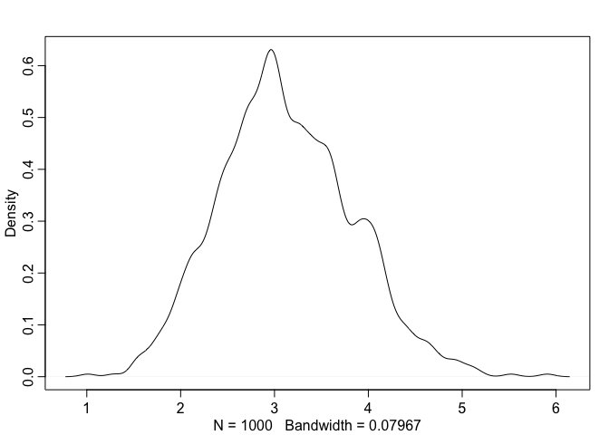
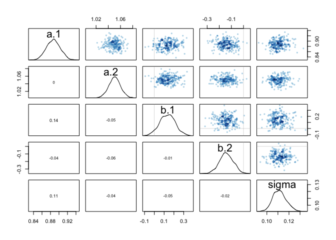
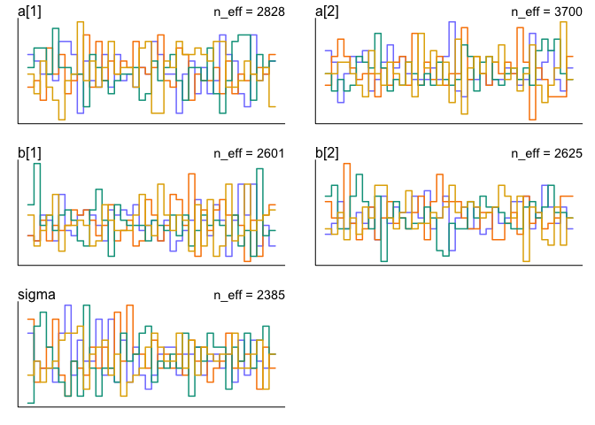
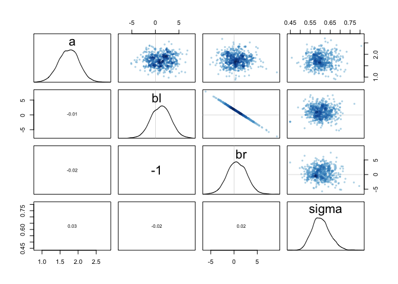
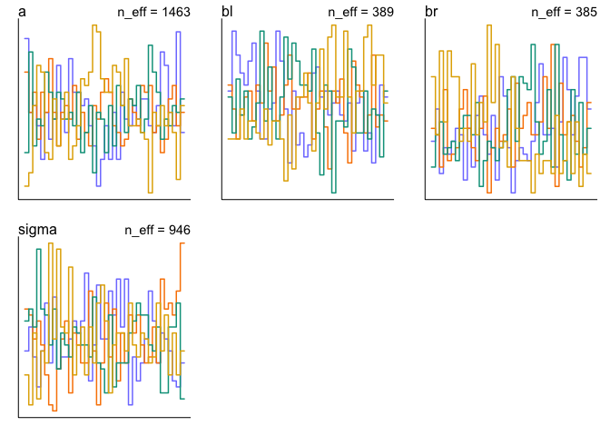

# Install updated "rethinking" package (Oct 11, 2019)

```r
# library(devtools)
# install_github("rmcelreath/rethinking",ref="Experimental")
```

# Quad approximation does not work with non Gausian distribution... (by J)


```r
num_weeks <- 1e5 
positions <- rep(0,num_weeks) 
current <- 10
for ( i in 1:num_weeks ) { 
  # record current position 
  positions[i] <- current 
  # flip coin to generate proposal 
  proposal <- current + sample( c(-1,1) , size=1 ) 
  # now make sure he loops around the archipelago 
  if ( proposal < 1 ) proposal <- 10 
  if ( proposal > 10 ) proposal <- 1 
  # move? 
  prob_move <- proposal/current 
  current <- ifelse( runif(1) < prob_move , proposal , current ) 
}
plot(x=1:1000, y=positions[1:1000])
```

<!-- -->

## R code 9.2

```r
D <- 10
T <- 1e3
Y <- rmvnorm(T,rep(0,D),diag(D)) # problem in rmvnorm package installation (Jan 9, 2019)
rad_dist <- function( Y ) sqrt( sum(Y^2) )
Rd <- sapply( 1:T , function(i) rad_dist( Y[i,] ) )
dens( Rd )
```

<!-- -->
## R code 9.3

```r
# U needs to return neg-log-probability
myU4 <- function( q , a=0 , b=1 , k=0 , d=1 ) {
  muy <- q[1]
  mux <- q[2]
  U <- sum( dnorm(y,muy,1,log=TRUE) ) + sum( dnorm(x,mux,1,log=TRUE) ) +
    dnorm(muy,a,b,log=TRUE) + dnorm(mux,k,d,log=TRUE)
  return( -U )
}
```
## R code 9.4

```r
# gradient function
# need vector of partial derivatives of U with respect to vector q
myU_grad4 <- function( q , a=0 , b=1 , k=0 , d=1 ) {
  muy <- q[1]
  mux <- q[2]
  G1 <- sum( y - muy ) + (a - muy)/b^2 #dU/dmuy
  G2 <- sum( x - mux ) + (k - mux)/d^2 #dU/dmuy
  return( c( -G1 , -G2 ) ) # negative bc energy is neg-log-prob
}
# test data
set.seed(7)
y <- rnorm(50)
x <- rnorm(50)
x <- as.numeric(scale(x))
y <- as.numeric(scale(y))
```

## R code 9.5

```r
library(shape) # for fancy arrows
Q <- list()
Q$q <- c(-0.1,0.2)
pr <- 0.3
plot( NULL , ylab="muy" , xlab="mux" , xlim=c(-pr,pr) , ylim=c(-pr,pr) )
step <- 0.03
L <- 11 # 0.03/28 for U-turns --- 11 for working example
n_samples <- 4
path_col <- col.alpha("black",0.5)
points( Q$q[1] , Q$q[2] , pch=4 , col="black" )
for ( i in 1:n_samples ) {
  Q <- HMC2( myU4 , myU_grad4 , step , L , Q$q )
  if ( n_samples < 10 ) {
    for ( j in 1:L ) {
      K0 <- sum(Q$ptraj[j,]^2)/2 # kinetic energy
      lines( Q$traj[j:(j+1),1] , Q$traj[j:(j+1),2] , col=path_col , lwd=1+2*K0 )
    }
    points( Q$traj[1:L+1,] , pch=16 , col="white" , cex=0.35 )
    Arrows( Q$traj[L,1] , Q$traj[L,2] , Q$traj[L+1,1] , Q$traj[L+1,2] ,
            arr.length=0.35 , arr.adj = 0.7 )
    text( Q$traj[L+1,1] , Q$traj[L+1,2] , i , cex=0.8 , pos=4 , offset=0.4 )
  }
  points( Q$traj[L+1,1] , Q$traj[L+1,2] , pch=ifelse( Q$accept==1 , 16 , 1 ) ,
          col=ifelse( abs(Q$dH)>0.1 , "red" , "black" ) )
}
```

<!-- -->

## R code 9.6

```r
HMC2 <- function (U, grad_U, epsilon, L, current_q) {
  q = current_q
  p = rnorm(length(q),0,1) # random flick - p is momentum.
  current_p = p
  # Make a half step for momentum at the beginning
  p = p - epsilon * grad_U(q) / 2
  # initialize bookkeeping - saves trajectory
  qtraj <- matrix(NA,nrow=L+1,ncol=length(q))
  ptraj <- qtraj
  qtraj[1,] <- current_q
  ptraj[1,] <- p
  
  ## R code 9.7
  # Alternate full steps for position and momentum
  for ( i in 1:L ) {
    q = q + epsilon * p # Full step for the position
    # Make a full step for the momentum, except at end of trajectory
    if ( i!=L ) {
      p = p - epsilon * grad_U(q)
      ptraj[i+1,] <- p
    }
    qtraj[i+1,] <- q
  }
  ## R code 9.8
  # Make a half step for momentum at the end
  p = p - epsilon * grad_U(q) / 2
  ptraj[L+1,] <- p
  # Negate momentum at end of trajectory to make the proposal symmetric
  p = -p
  # Evaluate potential and kinetic energies at start and end of trajectory
  current_U = U(current_q)
  current_K = sum(current_p^2) / 2
  proposed_U = U(q)
  proposed_K = sum(p^2) / 2
  # Accept or reject the state at end of trajectory, returning either
  # the position at the end of the trajectory or the initial position
  accept <- 0
  if (runif(1) < exp(current_U-proposed_U+current_K-proposed_K)) {
    new_q <- q  # accept
    accept <- 1
  } else new_q <- current_q  # reject
  return(list( q=new_q, traj=qtraj, ptraj=ptraj, accept=accept ))
}
```

# 9.4. EasyHMC:ulam
## the terrain ruggedness example from Chapter 7. This code will load the data and reduce it down to cases (nations) that have the outcome variable of interest:

## R code 9.9

```r
library(rethinking)
data(rugged)
d <- rugged
d$log_gdp <- log(d$rgdppc_2000) # log GDP
# extract countries with GDP data
dd <- d[ complete.cases(d$rgdppc_2000) , ] 
# rescale variables
dd$log_gdp_std <- dd$log_gdp / mean(dd$log_gdp)
dd$rugged_std <- dd$rugged / max(dd$rugged)
# make variable to index Africa (1) or not (2) (pg 249)
dd$cid <- ifelse( dd$cont_africa==1 , 1 , 2 )
```

## R code 9.10 (the old way)

```r
m8.5 <- quap(
  alist(
    log_gdp_std ~ dnorm( mu , sigma ) ,
    mu <- a[cid] + b[cid]*( rugged_std - 0.215 ) ,
    a[cid] ~ dnorm( 1 , 0.1 ) ,
    b[cid] ~ dnorm( 0 , 0.3 ) ,
    sigma ~ dexp( 1 )
  ) ,
  data=dd )
precis( m8.5 , depth=2 )
```

```
##             mean          sd        5.5%       94.5%
## a[1]   0.8865640 0.015674552  0.86151302  0.91161495
## a[2]   1.0505666 0.009935872  1.03468714  1.06644602
## b[1]   0.1324981 0.074199237  0.01391344  0.25108286
## b[2]  -0.1426057 0.054745410 -0.23009945 -0.05511197
## sigma  0.1094859 0.005934188  0.10000194  0.11896990
```

## R code 9.11

```r
dat_slim <- list(
  log_gdp_std = dd$log_gdp_std,
  rugged_std = dd$rugged_std,
  cid = as.integer( dd$cid )
)
str(dat_slim)
```

```
## List of 3
##  $ log_gdp_std: num [1:170] 0.88 0.965 1.166 1.104 0.915 ...
##  $ rugged_std : num [1:170] 0.138 0.553 0.124 0.125 0.433 ...
##  $ cid        : int [1:170] 1 2 2 2 2 2 2 2 2 1 ...
```
# 9.4.2. Sampling from the posterior

## R code 9.12

```r
m9.1 <- ulam(
  alist(
    log_gdp_std ~ dnorm( mu , sigma ) ,
    mu <- a[cid] + b[cid]*( rugged_std - 0.215 ) ,
    a[cid] ~ dnorm( 1 , 0.1 ) ,
    b[cid] ~ dnorm( 0 , 0.3 ) ,
    sigma ~ dexp( 1 )
  ) ,
  data=dat_slim , chains=1 )
```

```
## 
## SAMPLING FOR MODEL 'f3314e777e4c586121dcc9de98266129' NOW (CHAIN 1).
## Chain 1: 
## Chain 1: Gradient evaluation took 4.2e-05 seconds
## Chain 1: 1000 transitions using 10 leapfrog steps per transition would take 0.42 seconds.
## Chain 1: Adjust your expectations accordingly!
## Chain 1: 
## Chain 1: 
## Chain 1: Iteration:   1 / 1000 [  0%]  (Warmup)
## Chain 1: Iteration: 100 / 1000 [ 10%]  (Warmup)
## Chain 1: Iteration: 200 / 1000 [ 20%]  (Warmup)
## Chain 1: Iteration: 300 / 1000 [ 30%]  (Warmup)
## Chain 1: Iteration: 400 / 1000 [ 40%]  (Warmup)
## Chain 1: Iteration: 500 / 1000 [ 50%]  (Warmup)
## Chain 1: Iteration: 501 / 1000 [ 50%]  (Sampling)
## Chain 1: Iteration: 600 / 1000 [ 60%]  (Sampling)
## Chain 1: Iteration: 700 / 1000 [ 70%]  (Sampling)
## Chain 1: Iteration: 800 / 1000 [ 80%]  (Sampling)
## Chain 1: Iteration: 900 / 1000 [ 90%]  (Sampling)
## Chain 1: Iteration: 1000 / 1000 [100%]  (Sampling)
## Chain 1: 
## Chain 1:  Elapsed Time: 0.063954 seconds (Warm-up)
## Chain 1:                0.036507 seconds (Sampling)
## Chain 1:                0.100461 seconds (Total)
## Chain 1:
```

## R code 9.13

```r
precis( m9.1 , depth=2 )
```

```
##             mean          sd        5.5%       94.5%     n_eff      Rhat
## a[1]   0.8856304 0.016135936  0.86090235  0.91030609  806.0820 0.9987430
## a[2]   1.0508378 0.009971161  1.03501948  1.06628425  852.5390 0.9982515
## b[1]   0.1282220 0.068979985  0.02276656  0.24283156 1168.7511 1.0028849
## b[2]  -0.1424442 0.054903299 -0.23611690 -0.05588177  634.8723 1.0024187
## sigma  0.1115647 0.006134172  0.10232762  0.12162977  560.4679 1.0003481
```

# 9.4.3. Samplingagain,inparallel.

## R code 9.14

```r
m9.1 <- ulam(
  alist(
    log_gdp_std ~ dnorm( mu , sigma ) ,
    mu <- a[cid] + b[cid]*( rugged_std - 0.215 ) ,
    a[cid] ~ dnorm( 1 , 0.1 ) ,
    b[cid] ~ dnorm( 0 , 0.3 ) ,
    sigma ~ dexp( 1 )
  ) ,
  data=dat_slim , chains=4 , cores=2 , iter=1000 )
```

```
## recompiling to avoid crashing R session
```

## R code 9.15

```r
show( m9.1 )
```

```
## Hamiltonian Monte Carlo approximation
## 2000 samples from 4 chains
## 
## Sampling durations (seconds):
##         warmup sample total
## chain:1   0.08   0.04  0.12
## chain:2   0.07   0.04  0.11
## chain:3   0.09   0.05  0.14
## chain:4   0.08   0.06  0.14
## 
## Formula:
## log_gdp_std ~ dnorm(mu, sigma)
## mu <- a[cid] + b[cid] * (rugged_std - 0.215)
## a[cid] ~ dnorm(1, 0.1)
## b[cid] ~ dnorm(0, 0.3)
## sigma ~ dexp(1)
```

## R code 9.16

```r
precis( m9.1 , 2 )
```

```
##             mean          sd         5.5%       94.5%    n_eff      Rhat
## a[1]   0.8867426 0.016196232  0.861266785  0.91280007 2828.427 0.9991543
## a[2]   1.0504301 0.009666239  1.034542266  1.06609864 3700.411 1.0006467
## b[1]   0.1335807 0.078235453  0.005115089  0.25812597 2601.253 1.0014678
## b[2]  -0.1413284 0.057254602 -0.235548822 -0.05065783 2625.489 0.9996354
## sigma  0.1115353 0.006137684  0.102428831  0.12192061 2384.926 0.9992556
```

# 9.4.4. Visualization
## R code 9.17

```r
pairs( m9.1 )
```

<!-- -->

# 9.4.5. Checking the chain.
## R code 9.18

```r
traceplot( m9.1 )
```

<!-- -->

## R code 9.19

```r
trankplot( m9.1 , n_cols=2 )
```

<!-- -->


# 9.5  ### 


## R code 9.20

```r
y <- c(-1.00001,1.00001)
set.seed(11)
m9.2 <- ulam(
  alist(
    y ~ dnorm(mu, sigma),
    mu <- alpha,
    alpha ~ dnorm(0,1000),
    sigma ~ dexp(0.0001)
  ),
  data=list(y=y) , chains=2)
```

```
## 
## SAMPLING FOR MODEL '726d002e27cec1633082261fcfedb813' NOW (CHAIN 1).
## Chain 1: 
## Chain 1: Gradient evaluation took 1.5e-05 seconds
## Chain 1: 1000 transitions using 10 leapfrog steps per transition would take 0.15 seconds.
## Chain 1: Adjust your expectations accordingly!
## Chain 1: 
## Chain 1: 
## Chain 1: Iteration:   1 / 1000 [  0%]  (Warmup)
## Chain 1: Iteration: 100 / 1000 [ 10%]  (Warmup)
## Chain 1: Iteration: 200 / 1000 [ 20%]  (Warmup)
## Chain 1: Iteration: 300 / 1000 [ 30%]  (Warmup)
## Chain 1: Iteration: 400 / 1000 [ 40%]  (Warmup)
## Chain 1: Iteration: 500 / 1000 [ 50%]  (Warmup)
## Chain 1: Iteration: 501 / 1000 [ 50%]  (Sampling)
## Chain 1: Iteration: 600 / 1000 [ 60%]  (Sampling)
## Chain 1: Iteration: 700 / 1000 [ 70%]  (Sampling)
## Chain 1: Iteration: 800 / 1000 [ 80%]  (Sampling)
## Chain 1: Iteration: 900 / 1000 [ 90%]  (Sampling)
## Chain 1: Iteration: 1000 / 1000 [100%]  (Sampling)
## Chain 1: 
## Chain 1:  Elapsed Time: 0.058725 seconds (Warm-up)
## Chain 1:                0.183176 seconds (Sampling)
## Chain 1:                0.241901 seconds (Total)
## Chain 1: 
## 
## SAMPLING FOR MODEL '726d002e27cec1633082261fcfedb813' NOW (CHAIN 2).
## Chain 2: 
## Chain 2: Gradient evaluation took 7e-06 seconds
## Chain 2: 1000 transitions using 10 leapfrog steps per transition would take 0.07 seconds.
## Chain 2: Adjust your expectations accordingly!
## Chain 2: 
## Chain 2: 
## Chain 2: Iteration:   1 / 1000 [  0%]  (Warmup)
## Chain 2: Iteration: 100 / 1000 [ 10%]  (Warmup)
## Chain 2: Iteration: 200 / 1000 [ 20%]  (Warmup)
## Chain 2: Iteration: 300 / 1000 [ 30%]  (Warmup)
## Chain 2: Iteration: 400 / 1000 [ 40%]  (Warmup)
## Chain 2: Iteration: 500 / 1000 [ 50%]  (Warmup)
## Chain 2: Iteration: 501 / 1000 [ 50%]  (Sampling)
## Chain 2: Iteration: 600 / 1000 [ 60%]  (Sampling)
## Chain 2: Iteration: 700 / 1000 [ 70%]  (Sampling)
## Chain 2: Iteration: 800 / 1000 [ 80%]  (Sampling)
## Chain 2: Iteration: 900 / 1000 [ 90%]  (Sampling)
## Chain 2: Iteration: 1000 / 1000 [100%]  (Sampling)
## Chain 2: 
## Chain 2:  Elapsed Time: 0.137636 seconds (Warm-up)
## Chain 2:                0.01832 seconds (Sampling)
## Chain 2:                0.155956 seconds (Total)
## Chain 2:
```

```
## Warning: There were 34 divergent transitions after warmup. Increasing adapt_delta above 0.95 may help. See
## http://mc-stan.org/misc/warnings.html#divergent-transitions-after-warmup
```

```
## Warning: Examine the pairs() plot to diagnose sampling problems
```

```
## Warning: The largest R-hat is 1.15, indicating chains have not mixed.
## Running the chains for more iterations may help. See
## http://mc-stan.org/misc/warnings.html#r-hat
```

```
## Warning: Bulk Effective Samples Size (ESS) is too low, indicating posterior means and medians may be unreliable.
## Running the chains for more iterations may help. See
## http://mc-stan.org/misc/warnings.html#bulk-ess
```

```
## Warning: Tail Effective Samples Size (ESS) is too low, indicating posterior variances and tail quantiles may be unreliable.
## Running the chains for more iterations may help. See
## http://mc-stan.org/misc/warnings.html#tail-ess
```
## R code 9.21

```r
precis( m9.2 )
```

```
##            mean       sd        5.5%     94.5%    n_eff     Rhat
## alpha  17.85181 292.3982 -382.987675  516.2728 90.49047 1.015773
## sigma 453.97043 914.6421    2.933042 2071.2362 74.28568 1.035413
```
## R code 9.22

```r
set.seed(11)
m9.3 <- ulam(
  alist(
    y ~ dnorm( mu , sigma ) ,
    mu <- alpha ,
    alpha ~ dnorm( 1 , 10 ) ,
    sigma ~ dexp( 1 )
  ) ,
  data=list(y=y) , chains=2 )
```

```
## 
## SAMPLING FOR MODEL 'db8b93ccfa83872ce482c35ebed2c618' NOW (CHAIN 1).
## Chain 1: 
## Chain 1: Gradient evaluation took 2.6e-05 seconds
## Chain 1: 1000 transitions using 10 leapfrog steps per transition would take 0.26 seconds.
## Chain 1: Adjust your expectations accordingly!
## Chain 1: 
## Chain 1: 
## Chain 1: Iteration:   1 / 1000 [  0%]  (Warmup)
## Chain 1: Iteration: 100 / 1000 [ 10%]  (Warmup)
## Chain 1: Iteration: 200 / 1000 [ 20%]  (Warmup)
## Chain 1: Iteration: 300 / 1000 [ 30%]  (Warmup)
## Chain 1: Iteration: 400 / 1000 [ 40%]  (Warmup)
## Chain 1: Iteration: 500 / 1000 [ 50%]  (Warmup)
## Chain 1: Iteration: 501 / 1000 [ 50%]  (Sampling)
## Chain 1: Iteration: 600 / 1000 [ 60%]  (Sampling)
## Chain 1: Iteration: 700 / 1000 [ 70%]  (Sampling)
## Chain 1: Iteration: 800 / 1000 [ 80%]  (Sampling)
## Chain 1: Iteration: 900 / 1000 [ 90%]  (Sampling)
## Chain 1: Iteration: 1000 / 1000 [100%]  (Sampling)
## Chain 1: 
## Chain 1:  Elapsed Time: 0.018072 seconds (Warm-up)
## Chain 1:                0.011549 seconds (Sampling)
## Chain 1:                0.029621 seconds (Total)
## Chain 1: 
## 
## SAMPLING FOR MODEL 'db8b93ccfa83872ce482c35ebed2c618' NOW (CHAIN 2).
## Chain 2: 
## Chain 2: Gradient evaluation took 4e-06 seconds
## Chain 2: 1000 transitions using 10 leapfrog steps per transition would take 0.04 seconds.
## Chain 2: Adjust your expectations accordingly!
## Chain 2: 
## Chain 2: 
## Chain 2: Iteration:   1 / 1000 [  0%]  (Warmup)
## Chain 2: Iteration: 100 / 1000 [ 10%]  (Warmup)
## Chain 2: Iteration: 200 / 1000 [ 20%]  (Warmup)
## Chain 2: Iteration: 300 / 1000 [ 30%]  (Warmup)
## Chain 2: Iteration: 400 / 1000 [ 40%]  (Warmup)
## Chain 2: Iteration: 500 / 1000 [ 50%]  (Warmup)
## Chain 2: Iteration: 501 / 1000 [ 50%]  (Sampling)
## Chain 2: Iteration: 600 / 1000 [ 60%]  (Sampling)
## Chain 2: Iteration: 700 / 1000 [ 70%]  (Sampling)
## Chain 2: Iteration: 800 / 1000 [ 80%]  (Sampling)
## Chain 2: Iteration: 900 / 1000 [ 90%]  (Sampling)
## Chain 2: Iteration: 1000 / 1000 [100%]  (Sampling)
## Chain 2: 
## Chain 2:  Elapsed Time: 0.015837 seconds (Warm-up)
## Chain 2:                0.018906 seconds (Sampling)
## Chain 2:                0.034743 seconds (Total)
## Chain 2:
```

```r
precis( m9.3 )
```

```
##             mean        sd       5.5%    94.5%    n_eff     Rhat
## alpha 0.01263886 1.2489126 -2.1390824 1.984368 325.5065 1.004251
## sigma 1.55149084 0.8080941  0.6903885 3.125982 235.7730 1.006849
```
## R code 9.23

```r
set.seed(41)
y <- rnorm( 100 , mean=0 , sd=1 )
```
## R code 9.24

```r
m9.4 <- ulam(
  alist(
    y ~ dnorm( mu , sigma ) ,
    mu <- a1 + a2 ,
    a1 ~ dnorm( 0 , 1000 ),
    a2 ~ dnorm( 0 , 1000 ),
    sigma ~ dexp( 1 )
  ) ,
  data=list(y=y) , chains=2 )
```

```
## 
## SAMPLING FOR MODEL '768cb5e4a7e14d76cfa600c7952118d5' NOW (CHAIN 1).
## Chain 1: 
## Chain 1: Gradient evaluation took 1.6e-05 seconds
## Chain 1: 1000 transitions using 10 leapfrog steps per transition would take 0.16 seconds.
## Chain 1: Adjust your expectations accordingly!
## Chain 1: 
## Chain 1: 
## Chain 1: Iteration:   1 / 1000 [  0%]  (Warmup)
## Chain 1: Iteration: 100 / 1000 [ 10%]  (Warmup)
## Chain 1: Iteration: 200 / 1000 [ 20%]  (Warmup)
## Chain 1: Iteration: 300 / 1000 [ 30%]  (Warmup)
## Chain 1: Iteration: 400 / 1000 [ 40%]  (Warmup)
## Chain 1: Iteration: 500 / 1000 [ 50%]  (Warmup)
## Chain 1: Iteration: 501 / 1000 [ 50%]  (Sampling)
## Chain 1: Iteration: 600 / 1000 [ 60%]  (Sampling)
## Chain 1: Iteration: 700 / 1000 [ 70%]  (Sampling)
## Chain 1: Iteration: 800 / 1000 [ 80%]  (Sampling)
## Chain 1: Iteration: 900 / 1000 [ 90%]  (Sampling)
## Chain 1: Iteration: 1000 / 1000 [100%]  (Sampling)
## Chain 1: 
## Chain 1:  Elapsed Time: 0.989933 seconds (Warm-up)
## Chain 1:                1.18117 seconds (Sampling)
## Chain 1:                2.1711 seconds (Total)
## Chain 1: 
## 
## SAMPLING FOR MODEL '768cb5e4a7e14d76cfa600c7952118d5' NOW (CHAIN 2).
## Chain 2: 
## Chain 2: Gradient evaluation took 5e-06 seconds
## Chain 2: 1000 transitions using 10 leapfrog steps per transition would take 0.05 seconds.
## Chain 2: Adjust your expectations accordingly!
## Chain 2: 
## Chain 2: 
## Chain 2: Iteration:   1 / 1000 [  0%]  (Warmup)
## Chain 2: Iteration: 100 / 1000 [ 10%]  (Warmup)
## Chain 2: Iteration: 200 / 1000 [ 20%]  (Warmup)
## Chain 2: Iteration: 300 / 1000 [ 30%]  (Warmup)
## Chain 2: Iteration: 400 / 1000 [ 40%]  (Warmup)
## Chain 2: Iteration: 500 / 1000 [ 50%]  (Warmup)
## Chain 2: Iteration: 501 / 1000 [ 50%]  (Sampling)
## Chain 2: Iteration: 600 / 1000 [ 60%]  (Sampling)
## Chain 2: Iteration: 700 / 1000 [ 70%]  (Sampling)
## Chain 2: Iteration: 800 / 1000 [ 80%]  (Sampling)
## Chain 2: Iteration: 900 / 1000 [ 90%]  (Sampling)
## Chain 2: Iteration: 1000 / 1000 [100%]  (Sampling)
## Chain 2: 
## Chain 2:  Elapsed Time: 1.10149 seconds (Warm-up)
## Chain 2:                1.17925 seconds (Sampling)
## Chain 2:                2.28073 seconds (Total)
## Chain 2:
```

```
## Warning: There were 781 transitions after warmup that exceeded the maximum treedepth. Increase max_treedepth above 10. See
## http://mc-stan.org/misc/warnings.html#maximum-treedepth-exceeded
```

```
## Warning: Examine the pairs() plot to diagnose sampling problems
```

```
## Warning: The largest R-hat is 2.3, indicating chains have not mixed.
## Running the chains for more iterations may help. See
## http://mc-stan.org/misc/warnings.html#r-hat
```

```
## Warning: Bulk Effective Samples Size (ESS) is too low, indicating posterior means and medians may be unreliable.
## Running the chains for more iterations may help. See
## http://mc-stan.org/misc/warnings.html#bulk-ess
```

```
## Warning: Tail Effective Samples Size (ESS) is too low, indicating posterior variances and tail quantiles may be unreliable.
## Running the chains for more iterations may help. See
## http://mc-stan.org/misc/warnings.html#tail-ess
```

```r
precis( m9.4 )
```

```
##              mean           sd          5.5%       94.5%     n_eff
## a1     395.185445 728.61048404  -559.0494854 1268.662042  1.078219
## a2    -394.993484 728.61275630 -1268.6867684  559.248922  1.078221
## sigma    1.036479   0.05428696     0.9417533    1.117275 21.342718
##           Rhat
## a1    5.442344
## a2    5.442258
## sigma 1.114786
```
## R code 9.25

```r
m9.5 <- ulam(
  alist(
    y ~ dnorm( mu , sigma ) ,
    mu <- a1 + a2 ,
    a1 ~ dnorm( 0 , 10 ),
    a2 ~ dnorm( 0 , 10 ),
    sigma ~ dexp( 1 )
  ) ,
  data=list(y=y) , chains=2 )
```

```
## 
## SAMPLING FOR MODEL '891f4364bbaa597b05591eddef7a0d2b' NOW (CHAIN 1).
## Chain 1: 
## Chain 1: Gradient evaluation took 1.7e-05 seconds
## Chain 1: 1000 transitions using 10 leapfrog steps per transition would take 0.17 seconds.
## Chain 1: Adjust your expectations accordingly!
## Chain 1: 
## Chain 1: 
## Chain 1: Iteration:   1 / 1000 [  0%]  (Warmup)
## Chain 1: Iteration: 100 / 1000 [ 10%]  (Warmup)
## Chain 1: Iteration: 200 / 1000 [ 20%]  (Warmup)
## Chain 1: Iteration: 300 / 1000 [ 30%]  (Warmup)
## Chain 1: Iteration: 400 / 1000 [ 40%]  (Warmup)
## Chain 1: Iteration: 500 / 1000 [ 50%]  (Warmup)
## Chain 1: Iteration: 501 / 1000 [ 50%]  (Sampling)
## Chain 1: Iteration: 600 / 1000 [ 60%]  (Sampling)
## Chain 1: Iteration: 700 / 1000 [ 70%]  (Sampling)
## Chain 1: Iteration: 800 / 1000 [ 80%]  (Sampling)
## Chain 1: Iteration: 900 / 1000 [ 90%]  (Sampling)
## Chain 1: Iteration: 1000 / 1000 [100%]  (Sampling)
## Chain 1: 
## Chain 1:  Elapsed Time: 0.425563 seconds (Warm-up)
## Chain 1:                0.439643 seconds (Sampling)
## Chain 1:                0.865206 seconds (Total)
## Chain 1: 
## 
## SAMPLING FOR MODEL '891f4364bbaa597b05591eddef7a0d2b' NOW (CHAIN 2).
## Chain 2: 
## Chain 2: Gradient evaluation took 4e-06 seconds
## Chain 2: 1000 transitions using 10 leapfrog steps per transition would take 0.04 seconds.
## Chain 2: Adjust your expectations accordingly!
## Chain 2: 
## Chain 2: 
## Chain 2: Iteration:   1 / 1000 [  0%]  (Warmup)
## Chain 2: Iteration: 100 / 1000 [ 10%]  (Warmup)
## Chain 2: Iteration: 200 / 1000 [ 20%]  (Warmup)
## Chain 2: Iteration: 300 / 1000 [ 30%]  (Warmup)
## Chain 2: Iteration: 400 / 1000 [ 40%]  (Warmup)
## Chain 2: Iteration: 500 / 1000 [ 50%]  (Warmup)
## Chain 2: Iteration: 501 / 1000 [ 50%]  (Sampling)
## Chain 2: Iteration: 600 / 1000 [ 60%]  (Sampling)
## Chain 2: Iteration: 700 / 1000 [ 70%]  (Sampling)
## Chain 2: Iteration: 800 / 1000 [ 80%]  (Sampling)
## Chain 2: Iteration: 900 / 1000 [ 90%]  (Sampling)
## Chain 2: Iteration: 1000 / 1000 [100%]  (Sampling)
## Chain 2: 
## Chain 2:  Elapsed Time: 0.468824 seconds (Warm-up)
## Chain 2:                0.799825 seconds (Sampling)
## Chain 2:                1.26865 seconds (Total)
## Chain 2:
```

```
## Warning: There were 3 transitions after warmup that exceeded the maximum treedepth. Increase max_treedepth above 10. See
## http://mc-stan.org/misc/warnings.html#maximum-treedepth-exceeded
```

```
## Warning: Examine the pairs() plot to diagnose sampling problems
```

```r
precis( m9.5 )
```

```
##             mean        sd        5.5%     94.5%    n_eff     Rhat
## a1     0.9300540 7.2094585 -10.9724230 12.854360 267.0679 1.009293
## a2    -0.7394915 7.2099661 -12.5556400 11.334190 267.1788 1.009181
## sigma  1.0365648 0.0796294   0.9168439  1.170685 353.3044 1.001317
```


# practices
# 8E4 Explain the difference between the effective number of samples, n_eff as calculated by Stan, and the actual number of samples.
# (A) n_eff is independent samples within samples. 

# 8M3 Re-estimate one of the Stan models from the chapter, but at different numbers of warmup iterations. Be sure to use the same number of sampling iterations in each case. Compare the n_eff values. How much warmup is enough?
## KN note: "warmup" is not used in posterior distribution.

## R code 9.26 warmup 100

```r
mp.warmup100 <- map2stan(
  alist(
    a ~ dnorm(0,1),
    b ~ dcauchy(0,1)
  ),
  data=list(y=1),
  start=list(a=0,b=0),
  iter=1e4, warmup=100 , WAIC=FALSE )
```

```
## 
## SAMPLING FOR MODEL '5de98c47c50f5595e65c47b7bcb1bd0f' NOW (CHAIN 1).
## Chain 1: 
## Chain 1: Gradient evaluation took 8e-06 seconds
## Chain 1: 1000 transitions using 10 leapfrog steps per transition would take 0.08 seconds.
## Chain 1: Adjust your expectations accordingly!
## Chain 1: 
## Chain 1: 
## Chain 1: WARNING: There aren't enough warmup iterations to fit the
## Chain 1:          three stages of adaptation as currently configured.
## Chain 1:          Reducing each adaptation stage to 15%/75%/10% of
## Chain 1:          the given number of warmup iterations:
## Chain 1:            init_buffer = 15
## Chain 1:            adapt_window = 75
## Chain 1:            term_buffer = 10
## Chain 1: 
## Chain 1: Iteration:    1 / 10000 [  0%]  (Warmup)
## Chain 1: Iteration:  101 / 10000 [  1%]  (Sampling)
## Chain 1: Iteration: 1100 / 10000 [ 11%]  (Sampling)
## Chain 1: Iteration: 2100 / 10000 [ 21%]  (Sampling)
## Chain 1: Iteration: 3100 / 10000 [ 31%]  (Sampling)
## Chain 1: Iteration: 4100 / 10000 [ 41%]  (Sampling)
## Chain 1: Iteration: 5100 / 10000 [ 51%]  (Sampling)
## Chain 1: Iteration: 6100 / 10000 [ 61%]  (Sampling)
## Chain 1: Iteration: 7100 / 10000 [ 71%]  (Sampling)
## Chain 1: Iteration: 8100 / 10000 [ 81%]  (Sampling)
## Chain 1: Iteration: 9100 / 10000 [ 91%]  (Sampling)
## Chain 1: Iteration: 10000 / 10000 [100%]  (Sampling)
## Chain 1: 
## Chain 1:  Elapsed Time: 0.00291 seconds (Warm-up)
## Chain 1:                0.256789 seconds (Sampling)
## Chain 1:                0.259699 seconds (Total)
## Chain 1:
```

```
## Warning: There were 4 transitions after warmup that exceeded the maximum treedepth. Increase max_treedepth above 10. See
## http://mc-stan.org/misc/warnings.html#maximum-treedepth-exceeded
```

```
## Warning: Examine the pairs() plot to diagnose sampling problems
```
# warmup 10

```r
mp.warmup10 <- map2stan(
  alist(
    a ~ dnorm(0,1),
    b ~ dcauchy(0,1)
  ),
  data=list(y=1),
  start=list(a=0,b=0),
  iter=1e4, warmup=10 , WAIC=FALSE )
```

```
## 
## SAMPLING FOR MODEL '9197044699c3005ddd62d263012f38fe' NOW (CHAIN 1).
## Chain 1: 
## Chain 1: Gradient evaluation took 6e-06 seconds
## Chain 1: 1000 transitions using 10 leapfrog steps per transition would take 0.06 seconds.
## Chain 1: Adjust your expectations accordingly!
## Chain 1: 
## Chain 1: 
## Chain 1: WARNING: No variance estimation is
## Chain 1:          performed for num_warmup < 20
## Chain 1: 
## Chain 1: Iteration:    1 / 10000 [  0%]  (Warmup)
## Chain 1: Iteration:   11 / 10000 [  0%]  (Sampling)
## Chain 1: Iteration: 1010 / 10000 [ 10%]  (Sampling)
## Chain 1: Iteration: 2010 / 10000 [ 20%]  (Sampling)
## Chain 1: Iteration: 3010 / 10000 [ 30%]  (Sampling)
## Chain 1: Iteration: 4010 / 10000 [ 40%]  (Sampling)
## Chain 1: Iteration: 5010 / 10000 [ 50%]  (Sampling)
## Chain 1: Iteration: 6010 / 10000 [ 60%]  (Sampling)
## Chain 1: Iteration: 7010 / 10000 [ 70%]  (Sampling)
## Chain 1: Iteration: 8010 / 10000 [ 80%]  (Sampling)
## Chain 1: Iteration: 9010 / 10000 [ 90%]  (Sampling)
## Chain 1: Iteration: 10000 / 10000 [100%]  (Sampling)
## Chain 1: 
## Chain 1:  Elapsed Time: 0.000158 seconds (Warm-up)
## Chain 1:                0.282646 seconds (Sampling)
## Chain 1:                0.282804 seconds (Total)
## Chain 1:
```

```
## Warning: There were 7 transitions after warmup that exceeded the maximum treedepth. Increase max_treedepth above 10. See
## http://mc-stan.org/misc/warnings.html#maximum-treedepth-exceeded
```

```
## Warning: Examine the pairs() plot to diagnose sampling problems
```
# warmup 1000

```r
mp.warmup1000 <- map2stan(
  alist(
    a ~ dnorm(0,1),
    b ~ dcauchy(0,1)
  ),
  data=list(y=1),
  start=list(a=0,b=0),
  iter=1e4, warmup=1000 , WAIC=FALSE )
```

```
## 
## SAMPLING FOR MODEL '60d30b396df21ed0b630fb4b07727407' NOW (CHAIN 1).
## Chain 1: 
## Chain 1: Gradient evaluation took 7e-06 seconds
## Chain 1: 1000 transitions using 10 leapfrog steps per transition would take 0.07 seconds.
## Chain 1: Adjust your expectations accordingly!
## Chain 1: 
## Chain 1: 
## Chain 1: Iteration:    1 / 10000 [  0%]  (Warmup)
## Chain 1: Iteration: 1000 / 10000 [ 10%]  (Warmup)
## Chain 1: Iteration: 1001 / 10000 [ 10%]  (Sampling)
## Chain 1: Iteration: 2000 / 10000 [ 20%]  (Sampling)
## Chain 1: Iteration: 3000 / 10000 [ 30%]  (Sampling)
## Chain 1: Iteration: 4000 / 10000 [ 40%]  (Sampling)
## Chain 1: Iteration: 5000 / 10000 [ 50%]  (Sampling)
## Chain 1: Iteration: 6000 / 10000 [ 60%]  (Sampling)
## Chain 1: Iteration: 7000 / 10000 [ 70%]  (Sampling)
## Chain 1: Iteration: 8000 / 10000 [ 80%]  (Sampling)
## Chain 1: Iteration: 9000 / 10000 [ 90%]  (Sampling)
## Chain 1: Iteration: 10000 / 10000 [100%]  (Sampling)
## Chain 1: 
## Chain 1:  Elapsed Time: 0.039719 seconds (Warm-up)
## Chain 1:                0.387161 seconds (Sampling)
## Chain 1:                0.42688 seconds (Total)
## Chain 1:
```

```
## Warning: There were 3 transitions after warmup that exceeded the maximum treedepth. Increase max_treedepth above 10. See
## http://mc-stan.org/misc/warnings.html#maximum-treedepth-exceeded
```

```
## Warning: Examine the pairs() plot to diagnose sampling problems
```
# warmup 5000

```r
mp.warmup5000 <- map2stan(
  alist(
    a ~ dnorm(0,1),
    b ~ dcauchy(0,1)
  ),
  data=list(y=1),
  start=list(a=0,b=0),
  iter=1e4, warmup=5000 , WAIC=FALSE,control = list(max_treedepth = 15))
```

```
## 
## SAMPLING FOR MODEL 'f979173183306555fae5f244dccc61f6' NOW (CHAIN 1).
## Chain 1: 
## Chain 1: Gradient evaluation took 1.8e-05 seconds
## Chain 1: 1000 transitions using 10 leapfrog steps per transition would take 0.18 seconds.
## Chain 1: Adjust your expectations accordingly!
## Chain 1: 
## Chain 1: 
## Chain 1: Iteration:    1 / 10000 [  0%]  (Warmup)
## Chain 1: Iteration: 1000 / 10000 [ 10%]  (Warmup)
## Chain 1: Iteration: 2000 / 10000 [ 20%]  (Warmup)
## Chain 1: Iteration: 3000 / 10000 [ 30%]  (Warmup)
## Chain 1: Iteration: 4000 / 10000 [ 40%]  (Warmup)
## Chain 1: Iteration: 5000 / 10000 [ 50%]  (Warmup)
## Chain 1: Iteration: 5001 / 10000 [ 50%]  (Sampling)
## Chain 1: Iteration: 6000 / 10000 [ 60%]  (Sampling)
## Chain 1: Iteration: 7000 / 10000 [ 70%]  (Sampling)
## Chain 1: Iteration: 8000 / 10000 [ 80%]  (Sampling)
## Chain 1: Iteration: 9000 / 10000 [ 90%]  (Sampling)
## Chain 1: Iteration: 10000 / 10000 [100%]  (Sampling)
## Chain 1: 
## Chain 1:  Elapsed Time: 0.256701 seconds (Warm-up)
## Chain 1:                0.299518 seconds (Sampling)
## Chain 1:                0.556219 seconds (Total)
## Chain 1:
```

```r
# control = list(max_treedepth = 15) added after an error with default
```
# compare different warmup

```r
precis(mp.warmup10)
```

```
##          mean         sd      5.5%    94.5%     n_eff     Rhat
## a -0.01181029  0.9897119 -1.567432 1.598000 7007.2662 1.000018
## b -2.78100959 57.5473000 -6.977261 6.912284  384.2565 1.002481
```

```r
precis(mp.warmup100)
```

```
##          mean       sd      5.5%    94.5%    n_eff     Rhat
## a 0.004558004  1.01158 -1.581982 1.620826 7058.039 0.999993
## b 0.002515181 20.79427 -6.328333 5.584906 1525.849 1.000207
```

```r
precis(mp.warmup1000)
```

```
##          mean        sd      5.5%    94.5%    n_eff      Rhat
## a -0.01765092  1.019024 -1.623902 1.601440 2336.598 0.9999006
## b  0.95861317 24.810164 -5.477941 6.888453 1302.084 1.0007210
```

```r
precis(mp.warmup5000)
```

```
##          mean        sd      5.5%    94.5%    n_eff      Rhat
## a -0.05619489  1.017989 -1.678488 1.598072 694.3169 0.9999285
## b -1.46022121 20.951712 -6.142237 5.238787 300.9585 1.0034781
```
* sd of b is increased as warmup increased.

# 8H3 Sometimes changing a prior for one parameter has unanticipated effects on other parameters. This is because when a parameter is highly correlated with another parameter in the posterior, the prior influences both parameters. Here’s an example to work and think through. Go back to the leg length example in Chapter 5. Here is the code again, which simulates height and leg lengths for 100 imagined individuals:
## R code 9.27

```r
N <- 100                          # number of individuals
height <- rnorm(N,10,2)           # sim total height of each
leg_prop <- runif(N,0.4,0.5)      # leg as proportion of height
leg_left <- leg_prop*height +     # sim left leg as proportion + error
  rnorm( N , 0 , 0.02 )
leg_right <- leg_prop*height +    # sim right leg as proportion + error
  rnorm( N , 0 , 0.02 )
# combine into data frame
d <- data.frame(height,leg_left,leg_right)
```
* And below is the model you fit before, resulting in a highly correlated posterior for the two beta parameters. This time, fit the model using map2stan:
## R code 9.28

```r
m5.8s <- map2stan(
  alist(
    height ~ dnorm( mu , sigma ) ,
    mu <- a + bl*leg_left + br*leg_right ,
    a ~ dnorm( 10 , 100 ) ,
    bl ~ dnorm( 2 , 10 ) ,
    br ~ dnorm( 2 , 10 ) ,
    sigma ~ dcauchy( 0 , 1 )
  ) ,
  data=d, chains=4,
  log_lik = TRUE, cores=2,# added
  start=list(a=10,bl=0,br=0,sigma=1),control = list(max_treedepth = 15) )
```

```
## Computing WAIC
```

* Compare the posterior distribution produced by the code above to the posterior distribution produced when you change the prior for br so that it is strictly positive:


```r
precis(m5.8s)
```

```
##            mean         sd       5.5%     94.5%    n_eff     Rhat
## a     1.7438995 0.28453327  1.2909953 2.1896690 2218.169 1.000196
## bl    1.1753955 2.07344550 -2.1304184 4.4161483 1386.272 1.000517
## br    0.6465312 2.07355095 -2.6194399 3.9411622 1381.077 1.000531
## sigma 0.6041422 0.04512729  0.5365537 0.6795671 2006.625 1.000215
```


```r
pairs(m5.8s)
```

<!-- -->

## R code 9.29

```r
m5.8s2 <- map2stan(
  alist(
    height ~ dnorm( mu , sigma ) ,
    mu <- a + bl*leg_left + br*leg_right ,
    a ~ dnorm( 10 , 100 ) ,
    bl ~ dnorm( 2 , 10 ) ,
    br ~ dnorm( 2 , 10 ) & T[0,] ,
    sigma ~ dcauchy( 0 , 1 )
  ) ,
  data=d, chains=4,
  log_lik = TRUE, cores=2,# added
  start=list(a=10,bl=0,br=0,sigma=1),control = list(adapt_delta=0.99999,max_treedepth = 15) )
```

```
## Warning: There were 1413 divergent transitions after warmup. Increasing adapt_delta above 0.99999 may help. See
## http://mc-stan.org/misc/warnings.html#divergent-transitions-after-warmup
```

```
## Warning: Examine the pairs() plot to diagnose sampling problems
```

```
## Warning: Bulk Effective Samples Size (ESS) is too low, indicating posterior means and medians may be unreliable.
## Running the chains for more iterations may help. See
## http://mc-stan.org/misc/warnings.html#bulk-ess
```

```
## Computing WAIC
```

```
## Warning in map2stan(alist(height ~ dnorm(mu, sigma), mu <- a + bl * leg_left + : There were 1413 divergent iterations during sampling.
## Check the chains (trace plots, n_eff, Rhat) carefully to ensure they are valid.
```
* Note that T[0,] on the right-hand side of the prior for br. What the T[0,] does is truncate the normal distribution so that it has poositive probablitiy only above zero. 
* Compare the two posterior distributions for m5.8s and m5.8s2. What has changed in the posterior distribution of both beta parameters? Can you explain the hange induced by the change in prior?

```r
precis(m5.8s2)
```

```
##             mean         sd       5.5%     94.5%     n_eff     Rhat
## a      1.7501496 0.28596543  1.2902927 2.2028408 1463.4242 1.000320
## bl    -0.2041739 1.45075051 -2.8294268 1.6108451  388.5491 1.010537
## br     2.0245312 1.45162114  0.2100113 4.6520843  385.3997 1.010709
## sigma  0.6043037 0.04505536  0.5384964 0.6805372  946.0208 1.003590
```


```r
pairs(m5.8s2)
```

<!-- -->


```r
trankplot(m5.8s2)
```

<!-- -->


```r
plotchains(m5.8s2)
```

```
## Warning: Ignoring unknown parameters: ask
```

<!-- -->

# 8H4 For the two models fit in the previous problem, use DIC or WAIC to compare the effective numbers of parameters for each model. Which model has more effective parameters? Why?

```r
compare(m5.8s,m5.8s2)
```

```
##            WAIC    pWAIC     dWAIC    weight       SE dSE
## m5.8s2 185.3020 3.109080 0.0000000 0.5737682 11.77394  NA
## m5.8s  185.8965 3.612413 0.5944845 0.4262318 11.72117  NA
```
* Note. WAIC, pWAIC read chapter 7.5


```r
sessionInfo()
```

```
## R version 3.5.1 (2018-07-02)
## Platform: x86_64-apple-darwin15.6.0 (64-bit)
## Running under: macOS  10.14.6
## 
## Matrix products: default
## BLAS: /Library/Frameworks/R.framework/Versions/3.5/Resources/lib/libRblas.0.dylib
## LAPACK: /Library/Frameworks/R.framework/Versions/3.5/Resources/lib/libRlapack.dylib
## 
## locale:
## [1] en_US.UTF-8/en_US.UTF-8/en_US.UTF-8/C/en_US.UTF-8/en_US.UTF-8
## 
## attached base packages:
## [1] parallel  stats     graphics  grDevices utils     datasets  methods  
## [8] base     
## 
## other attached packages:
##  [1] shape_1.4.4        forcats_0.4.0      stringr_1.4.0     
##  [4] dplyr_0.8.0.1      purrr_0.3.2        readr_1.3.1       
##  [7] tidyr_0.8.3        tibble_2.1.3       tidyverse_1.2.1   
## [10] reshape2_1.4.3     lmerTest_3.1-0     lme4_1.1-21       
## [13] Matrix_1.2-17      rethinking_1.92    dagitty_0.2-2     
## [16] rstan_2.19.2       ggplot2_3.2.1      StanHeaders_2.19.0
## 
## loaded via a namespace (and not attached):
##  [1] httr_1.4.0         jsonlite_1.6       splines_3.5.1     
##  [4] modelr_0.1.4       assertthat_0.2.1   stats4_3.5.1      
##  [7] cellranger_1.1.0   yaml_2.2.0         numDeriv_2016.8-1 
## [10] pillar_1.4.2       backports_1.1.5    lattice_0.20-38   
## [13] glue_1.3.1         digest_0.6.22      rvest_0.3.2       
## [16] minqa_1.2.4        colorspace_1.4-1   htmltools_0.3.6   
## [19] plyr_1.8.4         pkgconfig_2.0.3    broom_0.5.1       
## [22] haven_2.1.0        mvtnorm_1.0-11     scales_1.0.0      
## [25] processx_3.4.1     generics_0.0.2     withr_2.1.2       
## [28] lazyeval_0.2.2     cli_1.1.0          readxl_1.3.1      
## [31] magrittr_1.5       crayon_1.3.4       evaluate_0.13     
## [34] ps_1.3.0           nlme_3.1-137       MASS_7.3-51.3     
## [37] xml2_1.2.0         pkgbuild_1.0.6     tools_3.5.1       
## [40] loo_2.1.0          prettyunits_1.0.2  hms_0.4.2         
## [43] matrixStats_0.55.0 V8_2.3             munsell_0.5.0     
## [46] callr_3.3.2        compiler_3.5.1     rlang_0.4.1       
## [49] grid_3.5.1         nloptr_1.2.1       rstudioapi_0.10   
## [52] labeling_0.3       rmarkdown_1.12     boot_1.3-20       
## [55] codetools_0.2-16   gtable_0.3.0       inline_0.3.15     
## [58] curl_4.2           R6_2.4.1           gridExtra_2.3     
## [61] lubridate_1.7.4    knitr_1.22         KernSmooth_2.23-15
## [64] stringi_1.4.3      Rcpp_1.0.3         tidyselect_0.2.5  
## [67] xfun_0.5           coda_0.19-3
```

