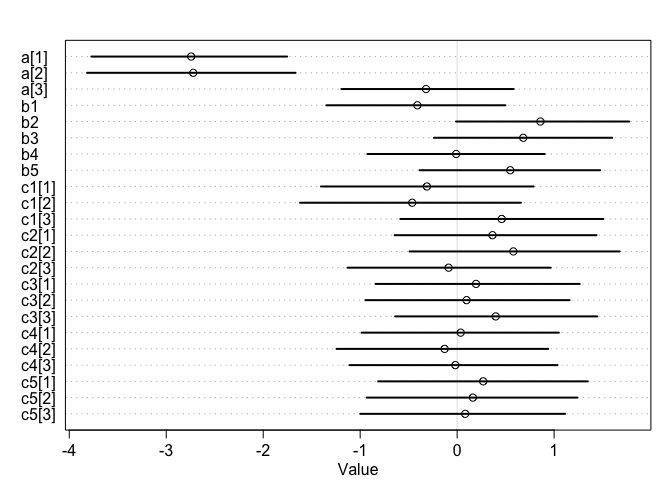
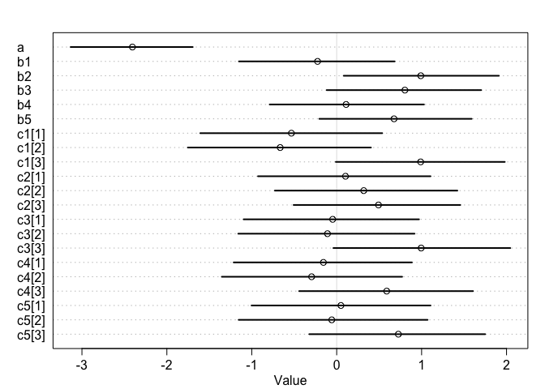

Dear R club,

Here is your much-awaited dataset for our upcoming meeting on the 21st of February, 2020. The data came fresh off the greenhouse on 2/8/2020 from a night break experiment. Thirty-two accessions from a lettuce F6 recombinant inbred line population were planted in the same greenhouse under 10hr light/14hr dark diurnal cycles. Three treatments are implemented: 

1. "Nightbreak": the plants are grown on a bench surrounded by plastic blackout curtains. These plants receive a one-hour night break treatment at 12am every day (meaning the lights turn on in the middle of the night for an hour) in addition to the 10L/14D lighting. 

2. "Control": the plants are grown on a bench surrounded by plastic blackout curtains. 10L/14D lighting. 

3. "Control_NoCurtain": the plants are grown on a bench without any curtains. 10L/14D lighting. 

The goals of the experiment are:
a. to see if night break induces earlier flowering in lettuce;
b. if so, do different lettuce genotypes respond to night breaks differently; and 
c. which one(s) of the five candidate loci is/are associated with differential responses. 

How to interpret the phenotype:
Phenotype is recorded in the "Score" column. The different scores represent different developmental stages:
1: rosette 
2: bolted (elongation of the main stem)
3: budding
4: first flower
5: first mature seed head

Aaaaand finally here are your questions!
Q1: 
a. Load the dataset. Look for column "Score" for the response variable we are interested in. A developmental score of 1 or 2 indicates vegetative growth, while a score of 3, 4, or 5 indicates reproductive growth. Create a "Reproduction" column with values 0 and 1, where 0 indicates vegetative growth and 1 indicates reproductive growth. 

# read data

```r
Nightbreak_R.Han_data<-read_csv(file.path("..","Nightbreak_02_08_20_Rclub.csv"))
```

```
## Parsed with column specification:
## cols(
##   RIL = col_character(),
##   Treatment = col_character(),
##   Rep = col_double(),
##   Plot = col_double(),
##   Date = col_character(),
##   loc1 = col_character(),
##   loc2 = col_character(),
##   loc3 = col_character(),
##   loc4 = col_character(),
##   loc5 = col_character(),
##   Score = col_double()
## )
```

```r
summary(Nightbreak_R.Han_data)
```

```
##      RIL             Treatment              Rep             Plot      
##  Length:188         Length:188         Min.   :1.000   Min.   : 1.00  
##  Class :character   Class :character   1st Qu.:1.000   1st Qu.: 8.75  
##  Mode  :character   Mode  :character   Median :1.000   Median :16.50  
##                                        Mean   :1.495   Mean   :16.53  
##                                        3rd Qu.:2.000   3rd Qu.:25.00  
##                                        Max.   :2.000   Max.   :32.00  
##      Date               loc1               loc2               loc3          
##  Length:188         Length:188         Length:188         Length:188        
##  Class :character   Class :character   Class :character   Class :character  
##  Mode  :character   Mode  :character   Mode  :character   Mode  :character  
##                                                                             
##                                                                             
##                                                                             
##      loc4               loc5               Score      
##  Length:188         Length:188         Min.   :1.000  
##  Class :character   Class :character   1st Qu.:2.000  
##  Mode  :character   Mode  :character   Median :2.000  
##                                        Mean   :2.202  
##                                        3rd Qu.:3.000  
##                                        Max.   :4.000
```

```r
str(Nightbreak_R.Han_data)
```

```
## Classes 'spec_tbl_df', 'tbl_df', 'tbl' and 'data.frame':	188 obs. of  11 variables:
##  $ RIL      : chr  "100" "2" "137" "172" ...
##  $ Treatment: chr  "Control" "Control" "Control" "Control" ...
##  $ Rep      : num  1 1 1 1 1 1 1 1 1 1 ...
##  $ Plot     : num  1 2 3 4 5 6 7 8 9 10 ...
##  $ Date     : chr  "2/8/20" "2/8/20" "2/8/20" "2/8/20" ...
##  $ loc1     : chr  "P" "A" "P" "P" ...
##  $ loc2     : chr  "P" "P" "A" "P" ...
##  $ loc3     : chr  "A" "P" "P" "P" ...
##  $ loc4     : chr  "P" "A" "P" "A" ...
##  $ loc5     : chr  "A" "A" "A" "A" ...
##  $ Score    : num  2 2 1 2 2 3 1 2 3 1 ...
##  - attr(*, "spec")=
##   .. cols(
##   ..   RIL = col_character(),
##   ..   Treatment = col_character(),
##   ..   Rep = col_double(),
##   ..   Plot = col_double(),
##   ..   Date = col_character(),
##   ..   loc1 = col_character(),
##   ..   loc2 = col_character(),
##   ..   loc3 = col_character(),
##   ..   loc4 = col_character(),
##   ..   loc5 = col_character(),
##   ..   Score = col_double()
##   .. )
```

```r
table(Nightbreak_R.Han_data$Treatment)
```

```
## 
##           Control Control_NoCurtain        NightBreak 
##                64                62                62
```

```r
Nightbreak_R.Han_data %>% View()
```
# create Repdocution column

```r
Nightbreak_R.Han_data <- Nightbreak_R.Han_data %>% mutate(Reproduction=ifelse(Score<3,0,1)) # 0 = vegetative growth, 1 = reproductive growth
# indexing 
Nightbreak_R.Han_data.index <- Nightbreak_R.Han_data %>% mutate(trt_i=as.integer(as.factor(Treatment))) # 1=Control, 2=Control_NoCurtain, 3=NightBreak
Nightbreak_R.Han_data.index <- Nightbreak_R.Han_data.index %>% 
  mutate(
  loc1_i=ifelse(loc1=="A",0,1),
  loc2_i=ifelse(loc2=="A",0,1),
  loc3_i=ifelse(loc3=="A",0,1),
  loc4_i=ifelse(loc4=="A",0,1),
  loc5_i=ifelse(loc5=="A",0,1)) %>% # 0=A,1=P 
  dplyr::select(Reproduction, contains("_i"))
```


b. (optional) Take a look at columns "loc1" through "loc5". The levels "A" or "P" indicate which parental allele the RIL has inherited. Can you think of a reason why there are 32 lines in this experiment? 

```r
2^5 # loc1 (A or P) * loc2 (A or P) .... * loc5 (A or P), all combination of loc1 to loc5 to balance out each loc effect
```

```
## [1] 32
```

Q2:
Using the "Reproduction" column you created in Q1a as the response variable, fit a simple model with effects of genotype ("RIL") and treatment ("Treatment") on the rate of transitioning to reproductive growth by 2/8/20. (Things you might want to consider: appropriate likelihood function, intersection term). 


Q3:
Because we are more interested in the effects of individual loci than the performance of specific genotypes, fit a model with additive effects of the five loci and effect of treatment.  


Q4: 
Now let's look at some interaction terms. Can you fit a model that takes into account interaction effects between treatment and allele types at the five loci? How do you interpret the output? (I built a somewhat "ugly" model for this question. I'm excited to see what y'all's models look like.)
$$
Reproduction \sim Binomial(1, p) \\
logit(p) = \alpha + \beta_{1}*loc1 + \beta_{2}*loc2  + \beta_{2}*loc3 + \beta_{2}*loc4 + \beta_{2}*loc5 + \gamma_{treatment}treatment*loc1 + .... \\
\alpha \sim Normal(0,1) , common\\
\beta\_g_{genotype} \sim Normal(0, 1) , for\ genotype\\
\beta\_t_{treatment} \sim Normal(0, 1) , for\ treatment \\
\sigma \sim Exponential(0,1)
$$


```r
m.RH.Q4.a <- ulam(alist(
  Reproduction ~ dbinom(1,p),
                  logit(p) <- a[trt_i] + b1*loc1_i + b2*loc2_i + b3*loc3_i + b4*loc4_i + b5*loc5_i + c1[trt_i]*loc1_i + c2[trt_i]*loc2_i +c3[trt_i]*loc3_i + c4[trt_i]*loc4_i + c5[trt_i]*loc5_i,
                  a[trt_i]  ~ dnorm(0,1),
                  b1 ~ dnorm(0, 1),
                  b2 ~ dnorm(0, 1),
                  b3 ~ dnorm(0, 1),
                  b4 ~ dnorm(0, 1),
                  b5 ~ dnorm(0, 1),
                  c1[trt_i] ~ dnorm(0,1),
                  c2[trt_i] ~ dnorm(0,1),
                  c3[trt_i] ~ dnorm(0,1),
                  c4[trt_i] ~ dnorm(0,1),
                  c5[trt_i] ~ dnorm(0,1)),
            data=Nightbreak_R.Han_data.index,
            chains=4,
            cores=2,
            iter=1000,
            log_lik = TRUE)
  
plot(m.RH.Q4.a, depth=2)
```

<!-- -->

# general a (no trt effects)
* Therea are errors, which matters???


```r
m.RH.Q4.b <- ulam(alist(
  Reproduction ~ dbinom(1,p),
                  logit(p) <- a + b1*loc1_i + b2*loc2_i + b3*loc3_i + b4*loc4_i + b5*loc5_i + c1[trt_i]*loc1_i + c2[trt_i]*loc2_i +c3[trt_i]*loc3_i + c4[trt_i]*loc4_i + c5[trt_i]*loc5_i,
                  a  ~ dnorm(0,1),
                  b1 ~ dnorm(0, 1),
                  b2 ~ dnorm(0, 1),
                  b3 ~ dnorm(0, 1),
                  b4 ~ dnorm(0, 1),
                  b5 ~ dnorm(0, 1),
                  c1[trt_i] ~ dnorm(0,1),
                  c2[trt_i] ~ dnorm(0,1),
                  c3[trt_i] ~ dnorm(0,1),
                  c4[trt_i] ~ dnorm(0,1),
                  c5[trt_i] ~ dnorm(0,1)),
            data=Nightbreak_R.Han_data.index,
            chains=4,
            cores=2,
            iter=1000,
            log_lik = TRUE)
  
plot(m.RH.Q4.b, depth=2)
```

<!-- -->

compare

```r
compare(m.RH.Q4.a,m.RH.Q4.b)
```

```
##               WAIC       SE    dWAIC      dSE    pWAIC      weight
## m.RH.Q4.a 179.1417 12.22330 0.000000       NA 11.88038 0.992360877
## m.RH.Q4.b 188.8754 13.86134 9.733608 6.568201 12.30037 0.007639123
```
* Similar? Treatment effects were absorbed in alpha[trt_i] in m.RH.Q4.a model. 
* m.RH.Q4.b model forced to asign treatment effects on loci??? 
* In m.RH.Q4.a model, loc1 has positive and loc2 has negative effects.
* m.RH.Q4.2 model, loc1, 3, 4, 5 has positive effects.

```

Q5:
By simplifying the developmental score phenotype into a binary variable that indicates whether a plant has entered reproductive growth, we run the risk of losing potentially important information. Re-fit your favorite model from Q4 with the ordered categorical outcome variable of "Score." Do you observe any changes in your results? If so, why do you think it happened?
# A/P distribution by loci

```r
library(ggplot2)
Nightbreak_R.Han_data %>% mutate(Rep=as.factor(Rep)) %>% dplyr::select(Treatment,Rep,loc1,loc2,loc3,loc4,loc5,Score) %>% 
gather(loc,value,-Treatment, -Score,-Rep) %>% 
ggplot( aes(x = Score)) +
  geom_histogram(aes(fill = value),stat="count") + facet_grid(loc~Treatment)
```

```
## Warning: Ignoring unknown parameters: binwidth, bins, pad
```

<!-- -->

Q6:
Each "Plot" # correspond to a specific spot on a bench. In other words, the same plot # indicates equivalent locations on their respective benches even across different treatments and replicates. Update your favorite model from Q4 or Q5 using hierarchical modeling that allow partial pooling across plots. Compare the models. What do they say and which model do you prefer?


Q7 (optional):
a. What can we conclude regarding treatment effect?


b. What can we conclude regarding differential response to nightbreak treatment?


c. If we concluded that there are differential responses to nightbreak across genotypes, which genetic loci contributed to the differential responses, and which ones did not?


I hope you find these exercises interesting. Lemme know if you have any questions! See you all on Friday.
Rongkui

-- 
Rongkui Han

Ph.D. Candidate & NSF Graduate Research Fellow
Michelmore Lab
Plant Biology Graduate Group
University of California, Davis

sesssionInfo

```r
sessionInfo()
```

```
## R version 3.6.2 (2019-12-12)
## Platform: x86_64-apple-darwin15.6.0 (64-bit)
## Running under: macOS Mojave 10.14.6
## 
## Matrix products: default
## BLAS:   /Library/Frameworks/R.framework/Versions/3.6/Resources/lib/libRblas.0.dylib
## LAPACK: /Library/Frameworks/R.framework/Versions/3.6/Resources/lib/libRlapack.dylib
## 
## locale:
## [1] en_US.UTF-8/en_US.UTF-8/en_US.UTF-8/C/en_US.UTF-8/en_US.UTF-8
## 
## attached base packages:
## [1] parallel  stats     graphics  grDevices utils     datasets  methods  
## [8] base     
## 
## other attached packages:
##  [1] forcats_0.4.0        stringr_1.4.0        dplyr_0.8.4         
##  [4] purrr_0.3.3          readr_1.3.1          tidyr_1.0.2         
##  [7] tibble_2.1.3         tidyverse_1.3.0      reshape2_1.4.3      
## [10] rethinking_1.95      dagitty_0.2-2        rstan_2.21.1        
## [13] ggplot2_3.2.1        StanHeaders_2.21.0-1
## 
## loaded via a namespace (and not attached):
##  [1] httr_1.4.1         jsonlite_1.6.1     modelr_0.1.6       RcppParallel_4.4.4
##  [5] assertthat_0.2.1   stats4_3.6.2       cellranger_1.1.0   yaml_2.2.1        
##  [9] pillar_1.4.3       backports_1.1.5    lattice_0.20-38    glue_1.3.1        
## [13] digest_0.6.25      rvest_0.3.5        colorspace_1.4-1   htmltools_0.4.0   
## [17] plyr_1.8.5         pkgconfig_2.0.3    broom_0.5.5        haven_2.2.0       
## [21] mvtnorm_1.1-0      scales_1.1.0       processx_3.4.2     farver_2.0.3      
## [25] generics_0.0.2     ellipsis_0.3.0     withr_2.1.2        lazyeval_0.2.2    
## [29] cli_2.0.2          magrittr_1.5       crayon_1.3.4       readxl_1.3.1      
## [33] evaluate_0.14      ps_1.3.2           fs_1.3.1           fansi_0.4.1       
## [37] nlme_3.1-142       MASS_7.3-51.4      xml2_1.2.2         pkgbuild_1.0.6    
## [41] tools_3.6.2        loo_2.2.0          prettyunits_1.1.1  hms_0.5.3         
## [45] lifecycle_0.1.0    matrixStats_0.55.0 V8_3.0.1           munsell_0.5.0     
## [49] reprex_0.3.0       callr_3.4.2        compiler_3.6.2     rlang_0.4.5       
## [53] grid_3.6.2         rstudioapi_0.11    labeling_0.3       rmarkdown_2.1     
## [57] boot_1.3-23        gtable_0.3.0       codetools_0.2-16   inline_0.3.15     
## [61] DBI_1.1.0          curl_4.3           R6_2.4.1           gridExtra_2.3     
## [65] lubridate_1.7.4    knitr_1.28         shape_1.4.4        stringi_1.4.6     
## [69] Rcpp_1.0.3         vctrs_0.2.3        dbplyr_1.4.2       tidyselect_1.0.0  
## [73] xfun_0.12          coda_0.19-3
```


