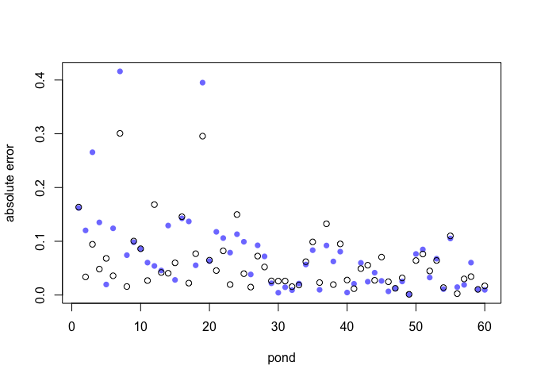

Summary of models
================

# prep

# Key words

  - no pooling, partial pooling, complete? pooling???

  - multilevel

  - 
# multilevel tadpoles

``` r
data(reedfrogs)
d <- reedfrogs
str(d)
```

    ## 'data.frame':    48 obs. of  5 variables:
    ##  $ density : int  10 10 10 10 10 10 10 10 10 10 ...
    ##  $ pred    : Factor w/ 2 levels "no","pred": 1 1 1 1 1 1 1 1 2 2 ...
    ##  $ size    : Factor w/ 2 levels "big","small": 1 1 1 1 2 2 2 2 1 1 ...
    ##  $ surv    : int  9 10 7 10 9 9 10 9 4 9 ...
    ##  $ propsurv: num  0.9 1 0.7 1 0.9 0.9 1 0.9 0.4 0.9 ...

``` r
d
```

    ##    density pred  size surv  propsurv
    ## 1       10   no   big    9 0.9000000
    ## 2       10   no   big   10 1.0000000
    ## 3       10   no   big    7 0.7000000
    ## 4       10   no   big   10 1.0000000
    ## 5       10   no small    9 0.9000000
    ## 6       10   no small    9 0.9000000
    ## 7       10   no small   10 1.0000000
    ## 8       10   no small    9 0.9000000
    ## 9       10 pred   big    4 0.4000000
    ## 10      10 pred   big    9 0.9000000
    ## 11      10 pred   big    7 0.7000000
    ## 12      10 pred   big    6 0.6000000
    ## 13      10 pred small    7 0.7000000
    ## 14      10 pred small    5 0.5000000
    ## 15      10 pred small    9 0.9000000
    ## 16      10 pred small    9 0.9000000
    ## 17      25   no   big   24 0.9600000
    ## 18      25   no   big   23 0.9200000
    ## 19      25   no   big   22 0.8800000
    ## 20      25   no   big   25 1.0000000
    ## 21      25   no small   23 0.9200000
    ## 22      25   no small   23 0.9200000
    ## 23      25   no small   23 0.9200000
    ## 24      25   no small   21 0.8400000
    ## 25      25 pred   big    6 0.2400000
    ## 26      25 pred   big   13 0.5200000
    ## 27      25 pred   big    4 0.1600000
    ## 28      25 pred   big    9 0.3600000
    ## 29      25 pred small   13 0.5200000
    ## 30      25 pred small   20 0.8000000
    ## 31      25 pred small    8 0.3200000
    ## 32      25 pred small   10 0.4000000
    ## 33      35   no   big   34 0.9714286
    ## 34      35   no   big   33 0.9428571
    ## 35      35   no   big   33 0.9428571
    ## 36      35   no   big   31 0.8857143
    ## 37      35   no small   31 0.8857143
    ## 38      35   no small   35 1.0000000
    ## 39      35   no small   33 0.9428571
    ## 40      35   no small   32 0.9142857
    ## 41      35 pred   big    4 0.1142857
    ## 42      35 pred   big   12 0.3428571
    ## 43      35 pred   big   13 0.3714286
    ## 44      35 pred   big   14 0.4000000
    ## 45      35 pred small   22 0.6285714
    ## 46      35 pred small   12 0.3428571
    ## 47      35 pred small   31 0.8857143
    ## 48      35 pred small   17 0.4857143

``` r
# make the tank cluster variable
d$tank <- 1:nrow(d)
dat <- list(
    S = d$surv,
    N = d$density,
    tank = d$tank )
```

  - varying intercepts model (= simplelst kind of varying effects)

  
![
Si \\sim Bionial(N\_i,p\_i) \\\\
logit(p\_i) \\sim \\alpha\_{TANK\[i\]} \\\\
\\alpha\_j \\sim Normal(0,1.5),\\ for\\ j=1..48 \\\\
](https://latex.codecogs.com/png.latex?%0ASi%20%5Csim%20Bionial%28N_i%2Cp_i%29%20%5C%5C%0Alogit%28p_i%29%20%5Csim%20%5Calpha_%7BTANK%5Bi%5D%7D%20%5C%5C%0A%5Calpha_j%20%5Csim%20Normal%280%2C1.5%29%2C%5C%20for%5C%20j%3D1..48%20%5C%5C%0A
"
Si \\sim Bionial(N_i,p_i) \\\\
logit(p_i) \\sim \\alpha_{TANK[i]} \\\\
\\alpha_j \\sim Normal(0,1.5),\\ for\\ j=1..48 \\\\
")  

``` r
m13.1 <- ulam(
    alist(
        S ~ dbinom( N , p ),
        logit(p) <- a[tank],
        a[tank] ~ dnorm( 0 , 1.5 )
), data=dat, chains=4, log_lik=TRUE ,cores=2) # cores=2 added by Kazu
```

  - multilevel model

  
![
Si \\sim Bionial(N\_i,p\_i) \\\\
logit(p\_i) \\sim \\alpha\_{TANK\[i\]} \\\\
\\alpha\_j \\sim Normal(\\bar\\alpha,sigma) \\\\
\\bar\\alpha \\sim Normal(0,1.5) \\\\
\\sigma \\sim Exponential(1)\\\\
](https://latex.codecogs.com/png.latex?%0ASi%20%5Csim%20Bionial%28N_i%2Cp_i%29%20%5C%5C%0Alogit%28p_i%29%20%5Csim%20%5Calpha_%7BTANK%5Bi%5D%7D%20%5C%5C%0A%5Calpha_j%20%5Csim%20Normal%28%5Cbar%5Calpha%2Csigma%29%20%5C%5C%0A%5Cbar%5Calpha%20%5Csim%20Normal%280%2C1.5%29%20%5C%5C%0A%5Csigma%20%5Csim%20Exponential%281%29%5C%5C%0A
"
Si \\sim Bionial(N_i,p_i) \\\\
logit(p_i) \\sim \\alpha_{TANK[i]} \\\\
\\alpha_j \\sim Normal(\\bar\\alpha,sigma) \\\\
\\bar\\alpha \\sim Normal(0,1.5) \\\\
\\sigma \\sim Exponential(1)\\\\
")  

``` r
m13.2 <- ulam(
    alist(
        S ~ dbinom( N , p ) ,
        logit(p) <- a[tank] ,
        a[tank] ~ dnorm( a_bar , sigma ) ,
        a_bar ~ dnorm( 0 , 1.5 ) ,
             sigma ~ dexp( 1 )
), data=dat, chains=4 , log_lik=TRUE ,cores=2) # cores=2 added by Kazu
```

# pooling BY POND (13.2.1)

  - No pooling: no information is shared across ponds. It’s like
    assuming that the variation among ponds is infinite, so nothing you
    learn from one pond helps you predict another. \#\# data
fimulation

<!-- end list -->

``` r
a_bar <- 1.5; sigma <- 1.5; nponds <-60; Ni <- as.integer(rep(c(5,10,25,35),each=15))
set.seed(5005)
a_pond <- rnorm( nponds , mean=a_bar , sd=sigma )
dsim <- data.frame(pond=1:nponds, Ni=Ni ,true_a=a_pond)
dsim$Si <- rbinom(nponds, prob=logistic(dsim$true_a),size=dsim$Ni)
```

# no pooling

``` r
dsim$p_nopool <- dsim$Si / dsim$Ni
```

  - Partial pooling:

  
![
Si \\sim Bionial(N\_i,p\_i) \\\\
logit(p\_i) \\sim \\alpha\_{POND\[i\]} \\\\
\\alpha\_j \\sim Normal(\\bar\\alpha,sigma) \\\\
\\bar\\alpha \\sim Normal(0,1.5) \\\\
\\sigma \\sim Exponential(1)\\\\
](https://latex.codecogs.com/png.latex?%0ASi%20%5Csim%20Bionial%28N_i%2Cp_i%29%20%5C%5C%0Alogit%28p_i%29%20%5Csim%20%5Calpha_%7BPOND%5Bi%5D%7D%20%5C%5C%0A%5Calpha_j%20%5Csim%20Normal%28%5Cbar%5Calpha%2Csigma%29%20%5C%5C%0A%5Cbar%5Calpha%20%5Csim%20Normal%280%2C1.5%29%20%5C%5C%0A%5Csigma%20%5Csim%20Exponential%281%29%5C%5C%0A
"
Si \\sim Bionial(N_i,p_i) \\\\
logit(p_i) \\sim \\alpha_{POND[i]} \\\\
\\alpha_j \\sim Normal(\\bar\\alpha,sigma) \\\\
\\bar\\alpha \\sim Normal(0,1.5) \\\\
\\sigma \\sim Exponential(1)\\\\
")  
  
  
is the average log-odds of survival in the entire population of ponds.
  
  
the standard deviation of the distribution of log-odds of survival among
ponds   
  
, a vector of individual pond intercepts, one for each pond

# 13.2.5 compute the partial-pooling estimates

``` r
dat <- list(Si=dsim$Si,Ni=dsim$Ni,pond=dsim$pond)
m13.3 <- ulam(
    alist(
        Si ~ dbinom( Ni , p ),
        logit(p) <- a_pond[pond],
        a_pond[pond] ~ dnorm( a_bar , sigma ),
        a_bar ~ dnorm( 0 , 1.5 ),
        sigma ~ dexp( 1 )
    ), data=dat , chains=4 )
```

    ## 
    ## SAMPLING FOR MODEL 'd8ab7f3d807d0eb7d841894a7fbd4a24' NOW (CHAIN 1).
    ## Chain 1: 
    ## Chain 1: Gradient evaluation took 3.4e-05 seconds
    ## Chain 1: 1000 transitions using 10 leapfrog steps per transition would take 0.34 seconds.
    ## Chain 1: Adjust your expectations accordingly!
    ## Chain 1: 
    ## Chain 1: 
    ## Chain 1: Iteration:   1 / 1000 [  0%]  (Warmup)
    ## Chain 1: Iteration: 100 / 1000 [ 10%]  (Warmup)
    ## Chain 1: Iteration: 200 / 1000 [ 20%]  (Warmup)
    ## Chain 1: Iteration: 300 / 1000 [ 30%]  (Warmup)
    ## Chain 1: Iteration: 400 / 1000 [ 40%]  (Warmup)
    ## Chain 1: Iteration: 500 / 1000 [ 50%]  (Warmup)
    ## Chain 1: Iteration: 501 / 1000 [ 50%]  (Sampling)
    ## Chain 1: Iteration: 600 / 1000 [ 60%]  (Sampling)
    ## Chain 1: Iteration: 700 / 1000 [ 70%]  (Sampling)
    ## Chain 1: Iteration: 800 / 1000 [ 80%]  (Sampling)
    ## Chain 1: Iteration: 900 / 1000 [ 90%]  (Sampling)
    ## Chain 1: Iteration: 1000 / 1000 [100%]  (Sampling)
    ## Chain 1: 
    ## Chain 1:  Elapsed Time: 0.192624 seconds (Warm-up)
    ## Chain 1:                0.065264 seconds (Sampling)
    ## Chain 1:                0.257888 seconds (Total)
    ## Chain 1: 
    ## 
    ## SAMPLING FOR MODEL 'd8ab7f3d807d0eb7d841894a7fbd4a24' NOW (CHAIN 2).
    ## Chain 2: 
    ## Chain 2: Gradient evaluation took 1.1e-05 seconds
    ## Chain 2: 1000 transitions using 10 leapfrog steps per transition would take 0.11 seconds.
    ## Chain 2: Adjust your expectations accordingly!
    ## Chain 2: 
    ## Chain 2: 
    ## Chain 2: Iteration:   1 / 1000 [  0%]  (Warmup)
    ## Chain 2: Iteration: 100 / 1000 [ 10%]  (Warmup)
    ## Chain 2: Iteration: 200 / 1000 [ 20%]  (Warmup)
    ## Chain 2: Iteration: 300 / 1000 [ 30%]  (Warmup)
    ## Chain 2: Iteration: 400 / 1000 [ 40%]  (Warmup)
    ## Chain 2: Iteration: 500 / 1000 [ 50%]  (Warmup)
    ## Chain 2: Iteration: 501 / 1000 [ 50%]  (Sampling)
    ## Chain 2: Iteration: 600 / 1000 [ 60%]  (Sampling)
    ## Chain 2: Iteration: 700 / 1000 [ 70%]  (Sampling)
    ## Chain 2: Iteration: 800 / 1000 [ 80%]  (Sampling)
    ## Chain 2: Iteration: 900 / 1000 [ 90%]  (Sampling)
    ## Chain 2: Iteration: 1000 / 1000 [100%]  (Sampling)
    ## Chain 2: 
    ## Chain 2:  Elapsed Time: 0.097564 seconds (Warm-up)
    ## Chain 2:                0.063336 seconds (Sampling)
    ## Chain 2:                0.1609 seconds (Total)
    ## Chain 2: 
    ## 
    ## SAMPLING FOR MODEL 'd8ab7f3d807d0eb7d841894a7fbd4a24' NOW (CHAIN 3).
    ## Chain 3: 
    ## Chain 3: Gradient evaluation took 1.3e-05 seconds
    ## Chain 3: 1000 transitions using 10 leapfrog steps per transition would take 0.13 seconds.
    ## Chain 3: Adjust your expectations accordingly!
    ## Chain 3: 
    ## Chain 3: 
    ## Chain 3: Iteration:   1 / 1000 [  0%]  (Warmup)
    ## Chain 3: Iteration: 100 / 1000 [ 10%]  (Warmup)
    ## Chain 3: Iteration: 200 / 1000 [ 20%]  (Warmup)
    ## Chain 3: Iteration: 300 / 1000 [ 30%]  (Warmup)
    ## Chain 3: Iteration: 400 / 1000 [ 40%]  (Warmup)
    ## Chain 3: Iteration: 500 / 1000 [ 50%]  (Warmup)
    ## Chain 3: Iteration: 501 / 1000 [ 50%]  (Sampling)
    ## Chain 3: Iteration: 600 / 1000 [ 60%]  (Sampling)
    ## Chain 3: Iteration: 700 / 1000 [ 70%]  (Sampling)
    ## Chain 3: Iteration: 800 / 1000 [ 80%]  (Sampling)
    ## Chain 3: Iteration: 900 / 1000 [ 90%]  (Sampling)
    ## Chain 3: Iteration: 1000 / 1000 [100%]  (Sampling)
    ## Chain 3: 
    ## Chain 3:  Elapsed Time: 0.177706 seconds (Warm-up)
    ## Chain 3:                0.107252 seconds (Sampling)
    ## Chain 3:                0.284958 seconds (Total)
    ## Chain 3: 
    ## 
    ## SAMPLING FOR MODEL 'd8ab7f3d807d0eb7d841894a7fbd4a24' NOW (CHAIN 4).
    ## Chain 4: 
    ## Chain 4: Gradient evaluation took 1.8e-05 seconds
    ## Chain 4: 1000 transitions using 10 leapfrog steps per transition would take 0.18 seconds.
    ## Chain 4: Adjust your expectations accordingly!
    ## Chain 4: 
    ## Chain 4: 
    ## Chain 4: Iteration:   1 / 1000 [  0%]  (Warmup)
    ## Chain 4: Iteration: 100 / 1000 [ 10%]  (Warmup)
    ## Chain 4: Iteration: 200 / 1000 [ 20%]  (Warmup)
    ## Chain 4: Iteration: 300 / 1000 [ 30%]  (Warmup)
    ## Chain 4: Iteration: 400 / 1000 [ 40%]  (Warmup)
    ## Chain 4: Iteration: 500 / 1000 [ 50%]  (Warmup)
    ## Chain 4: Iteration: 501 / 1000 [ 50%]  (Sampling)
    ## Chain 4: Iteration: 600 / 1000 [ 60%]  (Sampling)
    ## Chain 4: Iteration: 700 / 1000 [ 70%]  (Sampling)
    ## Chain 4: Iteration: 800 / 1000 [ 80%]  (Sampling)
    ## Chain 4: Iteration: 900 / 1000 [ 90%]  (Sampling)
    ## Chain 4: Iteration: 1000 / 1000 [100%]  (Sampling)
    ## Chain 4: 
    ## Chain 4:  Elapsed Time: 0.168851 seconds (Warm-up)
    ## Chain 4:                0.074073 seconds (Sampling)
    ## Chain 4:                0.242924 seconds (Total)
    ## Chain 4:

``` r
precis( m13.3 , depth=2 )
```

    ##                   mean        sd        5.5%      94.5%     n_eff     Rhat4
    ## a_pond[1]   1.65300302 0.9877561  0.16632234  3.2716647 2511.2971 1.0006183
    ## a_pond[2]   2.85516336 1.2047756  1.02980646  4.8558896 2875.4286 0.9985499
    ## a_pond[3]  -0.62078958 0.8794472 -2.06730626  0.6947607 2780.2635 1.0019315
    ## a_pond[4]   2.88739789 1.2503683  1.06175955  4.9993020 2140.4765 0.9994103
    ## a_pond[5]   2.84515494 1.2143010  1.08324104  4.8687145 2116.7838 0.9998853
    ## a_pond[6]   2.88036607 1.2816667  1.05479670  5.1183280 2301.3104 0.9992063
    ## a_pond[7]   0.06849738 0.8141665 -1.24254785  1.3265657 3842.6817 0.9991559
    ## a_pond[8]   2.85428170 1.2705256  0.98226517  5.0556728 2749.1818 0.9996119
    ## a_pond[9]   1.63299699 0.9962213  0.13801290  3.3098343 3376.7568 0.9986942
    ## a_pond[10]  1.64102056 0.9874597  0.12908842  3.2688400 2922.5211 0.9985343
    ## a_pond[11]  2.85982611 1.2194223  1.04111288  4.8153705 2797.1725 0.9998371
    ## a_pond[12]  0.06472057 0.8644156 -1.32266649  1.4726230 4081.3472 0.9988535
    ## a_pond[13]  2.85215456 1.2240674  1.08972899  4.9301246 2079.7962 0.9993551
    ## a_pond[14]  2.84200603 1.2327444  1.06894853  4.9558967 2824.9925 0.9990830
    ## a_pond[15]  2.84913719 1.2284302  1.08026789  4.9090580 2210.2429 1.0007806
    ## a_pond[16]  1.56940617 0.7649941  0.39600524  2.7893832 3737.2299 0.9990480
    ## a_pond[17] -1.43183604 0.7166838 -2.63030268 -0.3363885 2498.2961 0.9991152
    ## a_pond[18]  1.04913368 0.6842613 -0.01866217  2.1665699 3415.9948 0.9994223
    ## a_pond[19] -0.94132611 0.6947162 -2.08162566  0.1157078 3650.7123 0.9982160
    ## a_pond[20]  1.56665434 0.7835215  0.36071637  2.8359320 3428.6875 0.9982292
    ## a_pond[21] -0.12182912 0.6182364 -1.08130082  0.9002720 3779.9556 0.9983721
    ## a_pond[22]  2.23688610 0.9308394  0.88946314  3.7842014 2733.8277 0.9985630
    ## a_pond[23]  3.21258526 1.0998331  1.61892372  5.1370236 2199.6004 0.9982927
    ## a_pond[24]  0.61172643 0.6255009 -0.37715589  1.5917843 4113.1593 0.9986407
    ## a_pond[25]  3.26817021 1.1738401  1.54678304  5.3370328 1924.1232 0.9991092
    ## a_pond[26]  2.22134177 0.8944802  0.91482962  3.7781427 2902.8787 0.9999947
    ## a_pond[27]  1.04027081 0.6823324  0.04152318  2.1777043 3470.5378 0.9991041
    ## a_pond[28]  2.23216693 0.8372599  1.03204201  3.6641196 2911.4519 0.9989976
    ## a_pond[29]  1.57002767 0.7483132  0.48828142  2.8535152 3065.8593 1.0006941
    ## a_pond[30]  1.05711752 0.7111911 -0.03235640  2.2431187 3274.6124 1.0003101
    ## a_pond[31]  2.45891158 0.6607768  1.47180285  3.5674192 2589.1906 0.9995302
    ## a_pond[32]  2.05798173 0.5987039  1.14568255  3.0715129 3422.2002 0.9991905
    ## a_pond[33]  1.73241501 0.5403350  0.91362977  2.6178188 4274.3475 0.9991318
    ## a_pond[34]  1.23949550 0.4755216  0.51910188  2.0172779 3248.3866 1.0012113
    ## a_pond[35]  0.66949204 0.4184218  0.01911302  1.3488245 3987.2293 0.9990065
    ## a_pond[36]  3.83896036 1.0941312  2.28015226  5.7856830 2224.7276 1.0002841
    ## a_pond[37] -0.98755525 0.4596684 -1.74546350 -0.2597283 4142.3010 0.9999378
    ## a_pond[38] -1.18741973 0.4542185 -1.93955490 -0.4735210 3798.7636 0.9991581
    ## a_pond[39]  0.66563331 0.4269572 -0.02780964  1.3513910 3273.6094 0.9995875
    ## a_pond[40]  3.85830085 1.1059582  2.25896565  5.7343888 2451.0406 0.9987045
    ## a_pond[41]  3.79770442 1.0291090  2.33114923  5.5395143 2108.8015 0.9991223
    ## a_pond[42]  2.48330409 0.6925523  1.48128334  3.6471804 2460.5994 0.9994167
    ## a_pond[43] -0.12276316 0.4048082 -0.77644341  0.4942702 3488.2191 0.9992476
    ## a_pond[44]  0.66403266 0.4207934 -0.01328126  1.3415265 3848.9255 0.9992289
    ## a_pond[45] -1.17993196 0.4513827 -1.91850245 -0.5051690 4131.5388 0.9989126
    ## a_pond[46]  0.01502843 0.3301192 -0.49212330  0.5306100 3470.4088 0.9987141
    ## a_pond[47]  4.06404314 1.0029305  2.67180549  5.8224943 1990.3032 0.9993355
    ## a_pond[48]  2.06802366 0.4824221  1.35612998  2.8823723 3972.2643 0.9994312
    ## a_pond[49]  1.84699101 0.4732295  1.10755574  2.6322312 2921.7147 0.9996001
    ## a_pond[50]  2.77129738 0.6708836  1.78724651  3.9047176 2376.9562 0.9987684
    ## a_pond[51]  2.39729748 0.6014798  1.52659422  3.3865847 3480.5249 0.9991636
    ## a_pond[52]  0.34659816 0.3276532 -0.17876794  0.8724176 4268.4173 0.9984901
    ## a_pond[53]  2.10777962 0.5017015  1.33620693  2.9192571 3190.6079 0.9989753
    ## a_pond[54]  4.07835953 1.0228381  2.62830263  5.9016463 2233.3882 1.0006727
    ## a_pond[55]  1.12446917 0.3949003  0.51323363  1.8018481 2824.8862 0.9986224
    ## a_pond[56]  2.78231432 0.6926614  1.80164386  3.9401149 2221.9415 1.0005398
    ## a_pond[57]  0.72127477 0.3614245  0.14001993  1.2975905 3399.9464 0.9985183
    ## a_pond[58]  4.03953950 1.0285178  2.56905071  5.8257988 2171.3278 0.9999620
    ## a_pond[59]  1.63417787 0.4256001  0.97872000  2.3427519 3146.0440 0.9991279
    ## a_pond[60]  2.41220259 0.6024409  1.52647200  3.4079072 2836.2534 0.9995403
    ## a_bar       1.65822705 0.2454634  1.27829490  2.0534494 1630.1362 1.0005494
    ## sigma       1.66620645 0.2349650  1.33327893  2.0690370  961.7121 1.0047687

``` r
post <- extract.samples(m13.3)
dsim$p_partpool <- apply(inv_logit(post$a_pond),2,mean)
dsim$p_true <- inv_logit(dsim$true_a)
nopool_error <- abs(dsim$p_nopool - dsim$p_true)
partpool_error <- abs(dsim$p_partpool - dsim$p_true)
plot(1:60, nopool_error,xlab="pond",ylab="absolute error",col=rangi2,pch=16)
points(1:60,partpool_error) # did not work
```

<!-- -->

# 13.3.1 Multilevel chimpanzes

``` r
data(chimpanzees)
d <- chimpanzees
summary(d)
```

    ##      actor     recipient     condition       block         trial      
    ##  Min.   :1   Min.   :2     Min.   :0.0   Min.   :1.0   Min.   : 1.00  
    ##  1st Qu.:2   1st Qu.:3     1st Qu.:0.0   1st Qu.:2.0   1st Qu.:18.75  
    ##  Median :4   Median :5     Median :0.5   Median :3.5   Median :36.50  
    ##  Mean   :4   Mean   :5     Mean   :0.5   Mean   :3.5   Mean   :36.50  
    ##  3rd Qu.:6   3rd Qu.:7     3rd Qu.:1.0   3rd Qu.:5.0   3rd Qu.:54.25  
    ##  Max.   :7   Max.   :8     Max.   :1.0   Max.   :6.0   Max.   :72.00  
    ##              NA's   :252                                              
    ##   prosoc_left   chose_prosoc     pulled_left    
    ##  Min.   :0.0   Min.   :0.0000   Min.   :0.0000  
    ##  1st Qu.:0.0   1st Qu.:0.0000   1st Qu.:0.0000  
    ##  Median :0.5   Median :1.0000   Median :1.0000  
    ##  Mean   :0.5   Mean   :0.5675   Mean   :0.5794  
    ##  3rd Qu.:1.0   3rd Qu.:1.0000   3rd Qu.:1.0000  
    ##  Max.   :1.0   Max.   :1.0000   Max.   :1.0000  
    ## 

``` r
d$treatment <- 1 + d$prosoc_left + 2*d$condition # see R code 11.2 for detailed explanation
dat_list<- list(
    pulled_left = d$pulled_left,
    actor = d$actor,
    block_id = d$block,
    treatment = as.integer(d$treatment) )
```

  
![
L\_i \\sim Binomial(1,p\_i) \\\\
logit(p\_i) = \\alpha\_{ACTOR\[i\]} + \\gamma\_{BLOCK\[i\]} +
\\beta\_{TREATMENT\[i\]} \\\\
\\beta\_{j} \\sim Normal(0,0.5)\\ ,for\\ j=1..4\\\\ 
](https://latex.codecogs.com/png.latex?%0AL_i%20%5Csim%20Binomial%281%2Cp_i%29%20%5C%5C%0Alogit%28p_i%29%20%3D%20%20%5Calpha_%7BACTOR%5Bi%5D%7D%20%2B%20%5Cgamma_%7BBLOCK%5Bi%5D%7D%20%2B%20%5Cbeta_%7BTREATMENT%5Bi%5D%7D%20%5C%5C%0A%5Cbeta_%7Bj%7D%20%5Csim%20Normal%280%2C0.5%29%5C%20%2Cfor%5C%20j%3D1..4%5C%5C%20%0A
"
L_i \\sim Binomial(1,p_i) \\\\
logit(p_i) =  \\alpha_{ACTOR[i]} + \\gamma_{BLOCK[i]} + \\beta_{TREATMENT[i]} \\\\
\\beta_{j} \\sim Normal(0,0.5)\\ ,for\\ j=1..4\\\\ 
")  
\* there is four treatments

#### a model description under construction

$$ *{j} Normal(,*) ,for j=1..4\\

$$

# m13.4

``` r
library(rethinking)
data(chimpanzees)

set.seed(13)
m13.4 <- ulam(
    alist(
        pulled_left ~ dbinom( 1 , p ) ,
        logit(p) <- a[actor] + g[block_id] + b[treatment] ,
        b[treatment] ~ dnorm( 0 , 0.5 ),
        # adaptive priors
        a[actor] ~ dnorm( a_bar , sigma_a ),
        g[block_id] ~ dnorm( 0 , sigma_g ),
        # hyper-priors
        a_bar ~ dnorm( 0 , 1.5 ),
        sigma_a ~ dexp(1),
        sigma_g ~ dexp(1)
    ) , data=dat_list , chains=4 , cores=4 , log_lik=TRUE )
```

    ## Warning: There were 5 divergent transitions after warmup. Increasing adapt_delta above 0.95 may help. See
    ## http://mc-stan.org/misc/warnings.html#divergent-transitions-after-warmup

    ## Warning: Examine the pairs() plot to diagnose sampling problems

    ## Warning: Bulk Effective Samples Size (ESS) is too low, indicating posterior means and medians may be unreliable.
    ## Running the chains for more iterations may help. See
    ## http://mc-stan.org/misc/warnings.html#bulk-ess

    ## Warning: Tail Effective Samples Size (ESS) is too low, indicating posterior variances and tail quantiles may be unreliable.
    ## Running the chains for more iterations may help. See
    ## http://mc-stan.org/misc/warnings.html#tail-ess

``` r
sessionInfo()
```

    ## R version 3.6.2 (2019-12-12)
    ## Platform: x86_64-apple-darwin15.6.0 (64-bit)
    ## Running under: macOS Mojave 10.14.6
    ## 
    ## Matrix products: default
    ## BLAS:   /Library/Frameworks/R.framework/Versions/3.6/Resources/lib/libRblas.0.dylib
    ## LAPACK: /Library/Frameworks/R.framework/Versions/3.6/Resources/lib/libRlapack.dylib
    ## 
    ## locale:
    ## [1] en_US.UTF-8/en_US.UTF-8/en_US.UTF-8/C/en_US.UTF-8/en_US.UTF-8
    ## 
    ## attached base packages:
    ## [1] parallel  stats     graphics  grDevices utils     datasets  methods  
    ## [8] base     
    ## 
    ## other attached packages:
    ##  [1] forcats_0.5.0        stringr_1.4.0        dplyr_0.8.4         
    ##  [4] purrr_0.3.3          readr_1.3.1          tidyr_1.0.2         
    ##  [7] tibble_2.1.3         tidyverse_1.3.0      reshape2_1.4.3      
    ## [10] lmerTest_3.1-1       lme4_1.1-21          Matrix_1.2-18       
    ## [13] rethinking_1.95      dagitty_0.2-2        rstan_2.21.1        
    ## [16] ggplot2_3.3.0        StanHeaders_2.21.0-1
    ## 
    ## loaded via a namespace (and not attached):
    ##  [1] httr_1.4.1          jsonlite_1.6.1      splines_3.6.2      
    ##  [4] modelr_0.1.6        RcppParallel_4.4.4  assertthat_0.2.1   
    ##  [7] stats4_3.6.2        cellranger_1.1.0    yaml_2.2.1         
    ## [10] numDeriv_2016.8-1.1 pillar_1.4.3        backports_1.1.5    
    ## [13] lattice_0.20-40     glue_1.3.1          digest_0.6.25      
    ## [16] rvest_0.3.5         minqa_1.2.4         colorspace_1.4-1   
    ## [19] htmltools_0.4.0     plyr_1.8.6          pkgconfig_2.0.3    
    ## [22] broom_0.5.5         haven_2.2.0         mvtnorm_1.1-0      
    ## [25] scales_1.1.0        processx_3.4.2      generics_0.0.2     
    ## [28] withr_2.1.2         cli_2.0.2           readxl_1.3.1       
    ## [31] magrittr_1.5        crayon_1.3.4        evaluate_0.14      
    ## [34] ps_1.3.2            fs_1.3.1            fansi_0.4.1        
    ## [37] nlme_3.1-145        MASS_7.3-51.5       xml2_1.2.2         
    ## [40] pkgbuild_1.0.6      tools_3.6.2         loo_2.2.0          
    ## [43] prettyunits_1.1.1   hms_0.5.3           lifecycle_0.2.0    
    ## [46] matrixStats_0.55.0  V8_3.0.1            reprex_0.3.0       
    ## [49] munsell_0.5.0       callr_3.4.2         compiler_3.6.2     
    ## [52] rlang_0.4.5         grid_3.6.2          nloptr_1.2.1       
    ## [55] rstudioapi_0.11     rmarkdown_2.1       boot_1.3-24        
    ## [58] gtable_0.3.0        codetools_0.2-16    inline_0.3.15      
    ## [61] DBI_1.1.0           curl_4.3            R6_2.4.1           
    ## [64] lubridate_1.7.4     gridExtra_2.3       knitr_1.28         
    ## [67] shape_1.4.4         stringi_1.4.6       Rcpp_1.0.3         
    ## [70] vctrs_0.2.3         dbplyr_1.4.2        tidyselect_1.0.0   
    ## [73] xfun_0.12           coda_0.19-3
